::: {.callout-important}
## This bundle runs a tutorial-sized chain

Every code cell below uses `m_iter = 4000`. **The published post uses 500,000.**

The tutorial budget reproduces the *shape* of every result — signs, ranks,
orders of magnitude — but not the third decimal, and its effective sample size
for $\rho$ is far below anything publishable. Section 14 explains why that
distinction matters more than it sounds, and `analysis.py` in this same folder
reproduces the published numbers (about an hour cold, under a minute warm).
:::


## Abstract

Cigarette taxes leak across state lines, which means the most replicated result in applied causal inference — the effect of California's 1988 Proposition 99 on per-capita cigarette sales — rests on an assumption the data can test and reject. Classical synthetic control requires donor weights to lie on the simplex, and requires that no donor absorb any part of the treatment; if Californians drive to Nevada for cheaper cigarettes, both requirements fail and the counterfactual is built partly out of contaminated donors. This tutorial estimates the effect three ways on one panel and asks how much of the answer each assumption was carrying. The data are the bundled Proposition 99 panel: 39 US states from 1970 to 2000, 1,209 observations, per-capita cigarette sales and real retail price, with rook-contiguity spatial weights in which Nevada is California's only neighbour inside the donor pool. Estimation uses `mlsynth.VanillaSC` for the simplex baseline, `mlsynth.BSCM` and `scspill.SCSPILL` at zero spillover intensity for the Bayesian stage, and `scspill.SCSPILL` with `method="sar"` for the Bayesian spatial stage. The average treatment effect on the treated is −18.43 packs per capita per year under the simplex, −15.68 under a no-intercept horseshoe prior on unconstrained weights (−18.85 when the same prior is fitted with an intercept) and −16.87 once spillovers are modelled, with an estimated spillover intensity of 0.316 (95% credible interval 0.231 to 0.403) and a Nevada spillover of −5.50 packs per capita, 11 times the next-largest donor. The effect on California survives every relaxation; the assumption that the donor pool was clean does not.

## 1. Overview

In November 1988 California voters passed Proposition 99, a 25-cent-per-pack cigarette excise tax with the revenue earmarked for anti-smoking programmes. The evaluation of that policy by [Abadie, Diamond and Hainmueller (2010)](https://doi.org/10.1198/jasa.2009.ap08746) introduced the synthetic control method to a generation of applied economists, and it is now the single most replicated causal-inference result in the discipline. It is in every textbook. It is in every software package's documentation. It is, in this post, in three of them.

That ubiquity makes it the right place to ask an uncomfortable question. The headline number rests on two assumptions that are rarely stated as assumptions at all:

1. **The simplex.** The synthetic California is a weighted average of other states, and the weights are required to be non-negative and to sum to one. This is a modelling choice, not a fact about the world, and it has a price that can be measured.
2. **SUTVA on the donor pool.** Every donor state is assumed to be untouched by California's policy. Its observed cigarette sales are taken to be its no-treatment outcome.

The second assumption is the interesting one here, because Proposition 99 raised the price of a pack in California by 25 cents and did nothing to the price in Nevada. Cross-border purchasing is the obvious behavioural response, and if it happened at any scale then Nevada's observed sales *rose* because of a policy Nevada never passed. Nevada would then not be a clean control but a second, oppositely-treated unit that we had mistakenly enrolled as a donor — and in the classical fit it carries a weight of about 0.24.

That is the hypothesis. **The data say the leak runs the other way.** Nevada's estimated spillover is −5.50 packs per capita per year: its sales came in *below* what the model reconstructs as its no-treatment path, not above. Whatever net effect Proposition 99 had on Nevada, it looks like the anti-smoking campaign travelling across the border rather than the tax arbitrage travelling back. Section 12 puts the sign to a test the estimator could have failed and did not.

The direction matters for the headline number, and not in the way most readers expect. A donor whose observed series sits *below* its no-treatment path drags the synthetic California down with it, so the classical comparison gives the policy less credit than it deserves — the contaminated estimate **understates** the effect. Section 9.1 derives that as an identity; section 12 confirms it numerically.

The spatial weights shipped with the data make the channel unusually concrete. Under rook contiguity — the chess convention in which two states count as neighbours only if they share a stretch of border, not merely a corner — **Nevada is the only state in the Abadie–Diamond–Hainmueller donor pool that shares a border with California.** Oregon and Arizona also border California, but neither is in the pool: both are excluded for having run their own tobacco-control programmes. So there is exactly one leak, in exactly one direction, and we can name it.

This post estimates the same effect three ways, relaxing one assumption at a time, using two Python libraries:

- **[mlsynth](https://mlsynth.readthedocs.io/)** (Jared Greathouse), which puts 46 modern synthetic-control estimators behind a single configuration-dictionary interface.
- **[scspill](https://quarcs-lab.github.io/scspill/)**, which implements the Bayesian spatial spillover model of [Sakaguchi and Tagawa (2026)](https://doi.org/10.1093/ectj/utag006) and returns *two* estimands: the effect on the treated unit, purged of contamination, and the spillover effect received by each donor.

The argument of the post, stated up front so you can check it as you go: **the effect on California survives every relaxation, and the claim that the donor pool was clean does not.**

There is an [R edition of this post](https://carlos-mendez.org/post/r_sc_bayes_spatial/) that runs the same three stages using the authors' own R and C++ replication code. It reports different numbers. Section 10 is about why, and it turns out to be the most instructive section here.

### 1.1 Learning objectives

By the end of this tutorial you will be able to:

- **Distinguish** the two estimands a spillover-aware synthetic control reports — the effect on the treated unit, and the spillover received by each donor — and explain why classical synthetic control cannot express the second one at all.
- **Implement** three nested estimators on one panel: the simplex baseline with `mlsynth.VanillaSC`, the Bayesian horseshoe with `mlsynth.BSCM` and with `scspill` at zero spillover intensity, and the Bayesian spatial model with `scspill.SCSPILL(method="sar")`.
- **Derive** the spillover-bias decomposition by hand on a three-donor example, and predict from it the direction in which a SUTVA failure moves a classical estimate.
- **Diagnose** a Bayesian spatial sampler with a prior predictive check, a Geweke joint distribution test and a prior-sensitivity grid, and read an effective sample size as the reason to distrust one credible interval while trusting another.
- **Reconcile** two implementations of the same paper by walking the six documented differences between them, and decide which of those differences changes an answer.

### 1.2 The road ahead

The three stages are nested. Each one keeps everything the previous stage assumed except a single restriction, which it replaces with something weaker. That structure is worth holding in mind, because it is what makes the comparison at the end meaningful: when the number moves, we know exactly which assumption moved it.

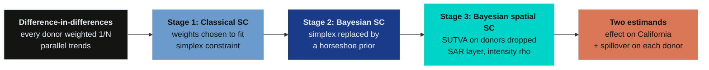

Read the arrows as successive relaxations. Difference-in-differences fixes the donor weights at $1/N$ and asks parallel trends to do all the work. Classical synthetic control lets the data choose the weights, but confines them to the simplex. The Bayesian stage replaces that hard constraint with a prior that *prefers* zero without forbidding anything else. The spatial stage keeps the Bayesian weights and drops the last assumption — that the donors were bystanders.

Only the final stage can answer the question "who else was treated?", because only the final stage has a parameter that represents the leak. Sections 13 and 16 return to the full comparison.

## 2. Key concepts

The rest of this tutorial leans on a small vocabulary. The **definition** of each concept below is always visible — open the **example** and **analogy** cards when you need them, and leave them collapsed for a quick scan. Two terms are slipperier than the rest and worth re-reading later: *spillover bias*, which is the thing the third stage removes, and *effective sample size*, which is the thing that decides whether a credible interval means anything.

**1. Potential outcomes under interference** $Y_{it}(d_1, d_2, \ldots, d_N)$. The outcome unit $i$ would take at time $t$ under a whole *vector* of treatment assignments. Standard causal inference writes $Y_{it}(d_i)$ and drops everyone else's assignment from the notation. Here we keep it, because dropping it is exactly SUTVA, and SUTVA is what this post tests.

::: {.callout-note collapse="true" title="Example"}

Nevada in 1990 has two potential outcomes that matter. $Y_{\mathrm{NV},1990}(\mathbf{0})$ is its cigarette sales in a world where California never passed Proposition 99. $Y_{\mathrm{NV},1990}(1, \mathbf{0})$ is its sales in the world we actually observe, where California is treated and Nevada is not. We see the second. The first is what the spatial stage reconstructs, and the gap between them is `result.spillover_panel["Nevada"]`.

:::

::: {.callout-tip collapse="true" title="Analogy"}

A pharmacy runs a flu-shot campaign in one town. To measure it you compare against the neighbouring town — but if people drove across to get the free shot, the neighbouring town's flu rate also fell. Its observed rate is no longer its untreated rate, and using it as a control understates the campaign.

:::

**2. Average treatment effect on the treated (ATT)** $\mathrm{ATT} = \frac{1}{T_1}\sum_{t > T_0} \big(Y_{1t} - Y_{1t}(0)\big)$. The causal effect averaged over the periods after treatment, for the unit that actually received it. With a single treated unit there is no population to average over — the ATT is the gap between what California did and what a reconstructed untreated California would have done.

::: {.callout-note collapse="true" title="Example"}

In this post the ATT is California's per-capita cigarette sales from 1988 to 2000 minus a synthetic California's, averaged over those 13 years. Every stage targets the same ATT. They differ only in how the synthetic California is built.

:::

::: {.callout-tip collapse="true" title="Analogy"}

A patient takes a new drug; we never see that same patient untreated. So we build an imagined twin from similar untreated patients and take the difference. The ATT is the patient's actual outcome minus the twin's.

:::

**3. Donor pool.** The set of untreated units from which the counterfactual is built. Here it is the 38 US states that had no large tobacco-control programme of their own between 1970 and 2000. Which states are *excluded* is a modelling decision made before any estimation happens, and it turns out to matter a great deal for this particular question.

::: {.callout-note collapse="true" title="Example"}

Eleven states are absent from the panel: Alaska, Arizona, Florida, Hawaii, Maryland, Massachusetts, Michigan, New Jersey, New York, Oregon and Washington. Two of those — Oregon and Arizona — border California. Their exclusion is why Nevada ends up as California's *only* contiguous donor, and why the leak in this application has exactly one channel.

:::

::: {.callout-tip collapse="true" title="Analogy"}

Choosing a control group is like choosing which of your neighbours to ask about a normal electricity bill. You exclude the one who installed solar panels — but if you also exclude everyone except the neighbour who shares a wall with you, your comparison inherits whatever passes through that wall.

:::

**4. Simplex constraint** $\alpha_j \geq 0$ and $\sum_j \alpha_j = 1$. The requirement that donor weights be non-negative and sum to one. It guarantees the synthetic unit is an *interpolation* of the donors rather than an extrapolation, which is what makes classical synthetic control feel safe. It also forces sparsity: a constrained least-squares problem in 38 variables typically puts all its weight on a handful of them.

::: {.callout-note collapse="true" title="Example"}

In Stage 1 the simplex puts 98.6% of the weight on four states — Utah 0.343, Montana 0.254, Nevada 0.242, Connecticut 0.146 — and exactly zero on 33 others. Section 4.2 constructs a case where that constraint has a measurable cost, and section 8 shows what the same data say when it is lifted.

:::

::: {.callout-tip collapse="true" title="Analogy"}

Mixing paint. You can combine tins in any proportions that add to one, but you cannot add a *negative* amount of blue to make something oranger. Sometimes that restriction is exactly what you want. Sometimes the colour you are matching lies outside anything you can mix.

:::

**5. Horseshoe prior** $\alpha_j \mid \lambda_j \sim \mathcal{N}(0, \lambda_j^2)$ with $\lambda_j \mid \tau \sim \mathcal{C}^{+}(0, \tau)$. A continuous shrinkage prior with an infinite spike at zero and heavy Cauchy tails. It makes "this donor gets no weight" overwhelmingly likely a priori, while leaving any individual donor free to escape to a large value if the data insist. It is the Bayesian answer to the sparsity that the simplex imposes by decree.

::: {.callout-note collapse="true" title="Example"}

Under the horseshoe, 25 of 38 donors carry a posterior weight above 0.01 in absolute value, against the simplex's five. But only Nevada's 95% credible interval excludes zero. The pool looks much broader and is, in the end, no more informative about which states resemble California.

:::

::: {.callout-tip collapse="true" title="Analogy"}

A hiring policy that says "assume nobody is qualified" versus one that says "only four people may ever be hired". The first can still hire twenty if twenty candidates are outstanding. The second cannot, no matter what the evidence says.

:::

**6. SUTVA (stable unit treatment value assumption).** The assumption that one unit's treatment does not affect another unit's outcome. Under SUTVA, $Y_{jt}(d_1, \ldots, d_N) = Y_{jt}(d_j)$, and every donor's observed outcome is its no-treatment outcome. Classical synthetic control does not merely assume this — it has no way to express its failure.

::: {.callout-note collapse="true" title="Example"}

Nevada carries weight 0.24 in synthetic California, and its estimated spillover is −5.50 packs per capita — its observed series sits below its no-treatment path. The counterfactual is therefore built partly from a contaminated donor. Section 9.1 shows the resulting bias has a closed form; section 12 evaluates that formula across all 38 donors and recovers 1.13 of the 1.19 packs separating the contaminated and purged estimates, of which Nevada alone supplies 1.10.

:::

::: {.callout-tip collapse="true" title="Analogy"}

Measuring whether a new streetlight reduces crime by comparing with the next street over — while the criminals simply move to the next street over. The comparison street is not a control: it absorbed part of the policy's effect. Note that the sign can run either way. Displacement pushes the control street's crime up and makes the light look better than it is; Nevada's case runs the other way, and makes Proposition 99 look worse than it was.

:::

**7. Spatial autoregressive (SAR) model** $\mathbf{y} = \rho W \mathbf{y} + X\beta + \varepsilon$. A regression in which each unit's outcome depends on a weighted average of its neighbours' outcomes. The scalar $\rho$ measures how strongly, and $W$ encodes who is a neighbour. Setting $\rho = 0$ removes the spatial channel entirely and returns an ordinary regression.

::: {.callout-note collapse="true" title="Example"}

Here the SAR layer sits on the *donor* outcomes, and $\rho$ is estimated at 0.316 with a 95% credible interval from 0.231 to 0.403. Because that interval excludes zero, the data reject the restriction that would collapse Stage 3 back to Stage 2.

:::

::: {.callout-tip collapse="true" title="Analogy"}

House prices. Your home is worth more when the houses around it are worth more, and theirs are worth more because yours is. Everything is determined at once rather than in sequence, which is why the model has to be solved rather than simply evaluated.

:::

**8. Spillover effect** $\xi^{c}_{t} = \mathbf{Y}^{c}_{t} - \mathbf{Y}^{c}_{t}(\mathbf{0})$. The difference between a donor's observed outcome and the outcome it would have had if the treated unit had never been treated. This is the second estimand, and it exists only in the spatial stage. It is reported per donor and per year.

::: {.callout-note collapse="true" title="Example"}

Nevada's mean post-1988 spillover is −5.50 packs per capita per year, against −0.49 for Idaho and −0.49 for Utah. Every other donor's posterior mean is below 0.06 packs in absolute value. The policy's geographic footprint is essentially one state wide.

:::

::: {.callout-tip collapse="true" title="Analogy"}

The splash radius of a stone dropped in a pond. The stone is the policy, the treated unit is where it lands, and the spillover is how far the ripple reaches before it is lost in the noise.

:::

**9. Effective sample size (ESS).** The number of *independent* draws an autocorrelated MCMC chain is worth. A chain of 250,000 highly correlated draws can carry the information of a few dozen independent ones. A credible interval computed from a chain with a small ESS is not a posterior summary; it is an artefact of where the chain happened to wander.

::: {.callout-note collapse="true" title="Example"}

The R edition of this post reported a 95% interval for the ATT that was 0.38 packs wide, from a chain whose ESS for $\rho$ this post recomputes as 2.93. The corrected run here reports an interval 12.71 packs wide from an ESS of 137. The policy did not change. The interval was wrong.

:::

::: {.callout-tip collapse="true" title="Analogy"}

Asking a thousand people their opinion — but they were all in the same room and heard each other answer. You have a thousand responses and perhaps five opinions. Reporting a margin of error based on a thousand would be dishonest.

:::

## 3. The estimand, and two ways it goes wrong

Everything below is in service of a single number: how many packs per capita did Proposition 99 cost California each year? Getting that number requires two things, and each can fail independently.

We need **a counterfactual** — some construction of what California would have done untreated — and we need **uncontaminated donors** to build it from. Stage 1 and Stage 2 are two answers to the first requirement. Stage 3 is the only one of the three that addresses the second.

### 3.1 Potential outcomes when the treatment leaks

Write $D_i \in \{0, 1\}$ for whether unit $i$ is treated, and let $\mathbf{D} = (D_1, \ldots, D_N)$ be the whole assignment vector. Indexing potential outcomes by the full vector rather than by $D_i$ alone is the notational commitment that lets us even *state* the problem:

$$Y_{it} = Y_{it}(\mathbf{D}), \qquad i = 1, \ldots, N, \qquad t = 1, \ldots, T$$

In words, this says: what unit $i$ does at time $t$ may depend on who *else* got treated, not only on whether $i$ did. SUTVA is the restriction $Y_{it}(\mathbf{D}) = Y_{it}(D_i)$, which throws away every argument but one.

Let unit 1 be California, treated from period $T_0 + 1$ onward, and let $\mathbf{e}_1$ be the assignment vector in which only California is treated. Two estimands follow, and the second is invisible to classical synthetic control:

$$\xi_{0t} = Y_{1t}(\mathbf{e}_1) - Y_{1t}(\mathbf{0}), \qquad \xi^{c}_{jt} = Y_{jt}(\mathbf{e}_1) - Y_{jt}(\mathbf{0})$$

In words: $\xi_{0t}$ is the effect on California, the thing everybody reports. And $\xi^{c}_{jt}$ is the effect on donor $j$ of a policy donor $j$ never passed. Under SUTVA the second is *defined* to be zero, which is why a classical synthetic control cannot report it, cannot test it, and cannot be wrong about it in a way you would notice.

| Symbol | Meaning | In the code |
|---|---|---|
| $Y_{1t}$ | California's observed sales | `panel.df.query("state == 'California'").cigsale` |
| $Y_{1t}(\mathbf{0})$ | California's no-treatment sales | `result.counterfactual` |
| $\xi_{0t}$ | effect on California in year $t$ | `result.gap` |
| $\xi^{c}_{jt}$ | spillover onto donor $j$ in year $t$ | `result.spillover_panel[j][t]` |
| $T_0$ | last pre-treatment period (1987) | `result.inputs.T0` |

### 3.2 Why difference-in-differences will not do

The simplest counterfactual is the average of the donors, shifted to match California's pre-treatment level. That is difference-in-differences, and its estimand is

$$\widehat{\mathrm{ATT}}_{\mathrm{DiD}} = \Big(\bar{Y}_{1,\mathrm{post}} - \bar{Y}_{1,\mathrm{pre}}\Big) - \frac{1}{N-1}\sum_{j \neq 1} \Big(\bar{Y}_{j,\mathrm{post}} - \bar{Y}_{j,\mathrm{pre}}\Big)$$

In words: California's before-and-after change, minus the average donor's before-and-after change. This is unbiased only under **parallel trends** — the assumption that absent the policy, California's sales would have moved by exactly the average donor's amount.

Look at the data and that assumption is visibly false. California is not a typical state: it starts below the donor average and falls faster throughout the 1970s and 1980s, long before Proposition 99 exists.


*Figure 1. Annual per-capita cigarette sales, 39 US states, 1970–2000. California in orange, the 38 donor states in grey.*

California is already declining relative to the pack well before the dashed line. Any method that assumes California would otherwise have tracked the average donor will attribute a pre-existing trend to the policy. Synthetic control exists precisely because of this picture: rather than assuming California resembles the average donor, it goes looking for the *combination* of donors that California actually does resemble.

### 3.3 The donor pool as a weighted average

The fix is to replace the equal weights $1/(N-1)$ with weights chosen so that the blend tracks California before the treatment. Write $\mathbf{Y}^{c}_{t}$ for the vector of donor outcomes in year $t$ and $\alpha$ for a vector of weights. The counterfactual becomes

$$\widehat{Y}_{1t}(\mathbf{0}) = \sum_{j=2}^{N} \alpha_j Y_{jt} = \alpha^{\top} \mathbf{Y}^{c}_{t}$$

and the weights are chosen to make that blend match California over the pre-treatment window:

$$\widehat{\alpha} = \arg\min_{\alpha \in \Delta} \sum_{t=1}^{T_0} \Big(Y_{1t} - \alpha^{\top}\mathbf{Y}^{c}_{t}\Big)^2, \qquad \Delta = \Big\{\alpha : \alpha_j \geq 0, \, \sum_j \alpha_j = 1\Big\}$$

In words: find the mix of donor states whose weighted average tracks California most closely over 1970–1987, subject to the mix being a genuine average — no negative weights, and the weights adding to one. The set $\Delta$ is the simplex, and everything that distinguishes the three stages of this post is a statement about $\Delta$.

| Symbol | Meaning | In the code |
|---|---|---|
| $\alpha$ | vector of 38 donor weights | `result.donor_weights` |
| $\Delta$ | the simplex | `VanillaSC`'s default constraint |
| $T_0$ | 18 pre-treatment years (1970–1987) | `result.inputs.T0` |
| $\mathbf{Y}^{c}_{t}$ | donor outcomes in year $t$ | `result.inputs.Yc` |

Stage 1 solves this problem as written. Stage 2 replaces $\alpha \in \Delta$ with a prior over all of $\mathbb{R}^{38}$. Stage 3 keeps Stage 2's weights and changes what $\mathbf{Y}^{c}_{t}$ is assumed to *be*.

## 4. Three donors, four years, no computer

Before handing 38 donors to an optimiser, it is worth solving a version small enough to check by hand. Everything that happens in the next ten sections happens here first, in arithmetic you can do on paper.

Three donor states, four pre-treatment years:

| Year | Donor A | Donor B | Donor C |
|---:|---:|---:|---:|
| 1 | 10 | 20 | 30 |
| 2 | 12 | 18 | 30 |
| 3 | 14 | 16 | 30 |
| 4 | 16 | 14 | 30 |

Notice the one structural fact that makes this tractable: **A and B sum to 30 in every year.** A rises, B falls, and they cross. C is flat at 30.

### 4.1 An exact blend on the simplex

Suppose our treated unit sits at 15 in all four pre-treatment years. Can a simplex-constrained blend match it exactly?

Take $\alpha = (0.5,\, 0.5,\, 0)$. Year 1 gives $0.5 \times 10 + 0.5 \times 20 = 15$. Year 2 gives $0.5 \times 12 + 0.5 \times 18 = 15$. Years 3 and 4 give 15 as well, because $A_t + B_t = 30$ for every $t$. The fit is exact, the weights are non-negative and they sum to one.

```{python}
import numpy as np

A = np.array([10.0, 12.0, 14.0, 16.0])
B = np.array([20.0, 18.0, 16.0, 14.0])
C = np.array([30.0, 30.0, 30.0, 30.0])
Z = np.array([15.0, 15.0, 15.0, 15.0])          # the treated unit, pre-treatment

blend = 0.5 * A + 0.5 * B + 0.0 * C
print("blend      :", blend)
print("exact fit  :", np.allclose(blend, Z))
print("weights sum:", 0.5 + 0.5 + 0.0)
```

The point worth extracting is about donor C. It receives a weight of exactly zero — not because a constraint forbade it, but because it is useless: a flat series at 30 cannot help match a flat series at 15 when two other donors already do it perfectly. **Sparsity here came from the data.** In section 7 the simplex will also produce sparsity, and it will be much harder to tell which source it came from.

### 4.2 The treated unit outside the hull

Now move the treated unit to 35 in all four years, and keep the same three donors. Every simplex blend is a weighted average of numbers no larger than 30, so no simplex blend can ever exceed 30. The treated unit lies **outside the convex hull of the donors**, and the constraint now costs something we can measure.

The best a simplex can do is put all the weight on C, giving 30 every year and a gap of 5:

```{python}
best_simplex = 0.0 * A + 0.0 * B + 1.0 * C      # all weight on the highest donor
gap = np.array([35.0, 35.0, 35.0, 35.0]) - best_simplex
print("best simplex blend :", best_simplex)
print("pre-treatment RMSE :", np.sqrt((gap ** 2).mean()))

# Drop the sum-to-one requirement and the fit becomes exact.
alpha_unconstrained = np.array([0.0, 0.0, 7 / 6])
print("unconstrained blend:", alpha_unconstrained[2] * C)
print("weights sum        :", alpha_unconstrained.sum().round(4))
```

A weight of $7/6 \approx 1.167$ fits perfectly and is not a convex combination — it is an *extrapolation*, scaling C up by 17%. Whether you find that acceptable is a genuine modelling judgement, and it is exactly the judgement Stage 2 puts in the hands of a prior rather than a constraint. What is not a judgement is the accounting: **the simplex bought interpretability at a cost of 5 units of pre-treatment misfit**, and that misfit does not disappear after treatment. It walks straight into the post-period as bias.

This is why pre-treatment RMSE is the first diagnostic to read in any synthetic control table. It is the visible part of the price.

### 4.3 What one leaky donor does

Now the third assumption, and the one this post is really about. Give the toy a post-treatment period — extend the table one year, so A reaches 18 and B falls to 12, and $A_t + B_t$ is still 30, which means the same 50-50 blend still lands on 15. Suppose we know the truth:

- The treatment lowers the treated unit by **20 units**.
- Donor B is not a bystander. It absorbs a spillover of **−8** — its observed post-treatment value is 8 below what it would have been.
- Our weights are the exact-fit ones from section 4.1: $\alpha = (0.5, 0.5, 0)$.

What does a classical synthetic control report? It builds the counterfactual from *observed* donor values, which for B are already 8 too low:

```{python}
alpha_toy = np.array([0.5, 0.5, 0.0])

Y_no_treatment = np.array([18.0, 12.0, 30.0])   # A, B, C in year 5, absent any treatment
xi = np.array([0.0, -8.0, 0.0])                 # the spillover each donor absorbs
Y_observed = Y_no_treatment + xi                # what we actually see

Y_treated_true = alpha_toy @ Y_no_treatment - 20.0  # the true post-treatment outcome

att_true = Y_treated_true - alpha_toy @ Y_no_treatment
att_naive = Y_treated_true - alpha_toy @ Y_observed

print(f"true ATT              : {att_true:+.1f}")
print(f"naive (SUTVA) ATT     : {att_naive:+.1f}")
print(f"bias                  : {att_naive - att_true:+.1f}")
print(f"-sum(alpha_j * xi_j)  : {-(alpha_toy * xi).sum():+.1f}")
```

The naive estimate is **−16 when the truth is −20**. It understates the effect by 4, and that 4 is exactly $-\sum_j \alpha_j \xi_j = -(0.5 \times -8) = +4$.

Three things follow, and all three recur in the real data:

1. **The bias has a closed form.** It is the weighted sum of the spillovers, with the *same* weights used to build the counterfactual. Section 9.1 states it in general.
2. **The sign is determined by the sign of the spillover.** Negative spillovers on positively-weighted donors push the estimate *upward* — which, when the true effect is negative as it is here, means toward zero. That is the case for Nevada, and it is why purging the contamination in section 12 makes the estimated effect larger, not smaller.
3. **A donor's damage is the product of two things**, its weight and its spillover. A heavily contaminated donor with zero weight is harmless. A lightly contaminated donor carrying half the counterfactual is not.

Hold onto the number $-\sum_j \alpha_j \xi_j$. In section 12 we compute it on the real panel and find it accounts for 1.13 of the 1.19 packs separating the contaminated and purged estimates.

## 5. Setup: two libraries, two pins

Both packages are young and under active development, so both are pinned. `scspill` was at version 0.2.1 when this post was written; `mlsynth` is pinned to a commit rather than a release, because its PyPI release lags its `main` branch by weeks at the same version string — a trap documented in the [companion post on the synthetic control ladder](https://carlos-mendez.org/post/python_sc_dsc_sdid/).

The numbers in this post are reproducible only under these two pins. The `[numba]`
extra is optional — it makes the samplers about five times faster and returns
results identical to the pure-numpy backend on this panel, so the fallback after
`||` is there for readers whose Python has no `llvmlite` wheel.

```bash
pip install "scspill[numba]==0.2.1" || pip install "scspill==0.2.1"
pip install "mlsynth[bayes] @ git+https://github.com/jgreathouse9/mlsynth.git@15f168bb90487098a7324be00b6663fcab0139ef"
```

The `[bayes]` extra on `mlsynth` matters: four of the estimators in section 13 import `numpyro`, which is an optional dependency. Without it they fail with a `ModuleNotFoundError` on an otherwise clean install.

```{python}
import os

# BLAS reduction order changes the last digits of every matrix product, and at
# N = 38 single-threaded BLAS is also faster than multi-threaded. Both are
# reasons to pin it, and it has to happen before numpy is imported.
for v in ("OMP_NUM_THREADS", "OPENBLAS_NUM_THREADS", "MKL_NUM_THREADS"):
    os.environ.setdefault(v, "1")
os.environ.setdefault("JAX_ENABLE_X64", "1")   # numpyro is float32 by default

import numpy as np
import pandas as pd
import scipy.sparse.csgraph

import mlsynth
import scspill
from scspill import SCSPILL
from scspill.data import load_california

SEED = 20251022        # the R edition's seed, so the two are comparable
TREAT_YEAR = 1988
M_ITER, BURN = 4_000, 2_000

print(f"scspill {scspill.__version__}   mlsynth {mlsynth.__version__}")
```

Half a million iterations for a 13-year effect looks excessive. Section 14 is the evidence that it is not: the ATT is stable from about 100,000 draws onward, but the spatial parameter needs roughly five times that before its effective sample size reaches anything reportable.

## 6. The data

`scspill` ships the Proposition 99 panel and both of the spatial objects the third stage needs, so there is nothing to download and nothing to merge.

### 6.1 The panel

`scspill` ships the Proposition 99 panel, so nothing has to be downloaded or
reshaped. `load_california()` returns a panel object that already knows which
columns are the unit, the time index and the outcome, and that carries the two
spatial objects alongside them.

```{python}
#| label: data-path
from pathlib import Path

def data(name):
    """Locate a result table written by analysis.py.

    Rendered inside references/ the tables are one level up; unzipped from the
    bundle they sit beside this file. Try both before giving up.
    """
    for c in (Path("..") / name, Path(name)):
        if c.exists():
            return c
    raise FileNotFoundError(
        f"{name} not found. It is written by analysis.py -- run "
        f"`python analysis.py` once, or fetch it from the post's page bundle."
    )
```

```{python}
panel = load_california()
df = panel.df.copy()
donors = list(panel.spatial_W.index)

print(panel.description)
print(df.head())
print(f"\nshape {df.shape}   states {df['state'].nunique()}   "
      f"years {df['year'].min()}-{df['year'].max()}")
```

A balanced panel: 39 states $\times$ 31 years $=$ 1,209 rows, no missing values. The outcome `cigsale` is annual per-capita cigarette sales in packs; the single covariate `retprice` is the real retail price per pack. There are 18 pre-treatment years and 13 post-treatment years.

This is a leaner predictor set than the original Abadie–Diamond–Hainmueller specification, which also matched on beer consumption, income, the share of the population aged 15–24, and three individual lags of the outcome. That is deliberate: the spatial model in Stage 3 is identified off the outcome dynamics, and the comparison across stages is cleaner when all three see the same variables.

### 6.2 The spatial weights

Two objects, and the distinction between them is the one thing to get right in this section.

```{python}
# Pin the donor ordering once; every later section indexes off it.
W = panel.spatial_W.loc[donors, donors]      # donor-to-donor contiguity
w = panel.spatial_w.reindex(donors)          # each donor's exposure to California

# spatial_w: how exposed is each DONOR to the TREATED unit?
print(w[w > 0])

# spatial_W: donor-to-donor contiguity. Row-normalised inside the estimator.
print(W.iloc[:4, :4])
print(f"\nW is symmetric: {np.allclose(W.values, W.values.T)}")
deg = W.sum(axis=1)
print(f"degree: min {deg.min():.0f}  max {deg.max():.0f}  mean {deg.mean():.2f}")
```

**`spatial_w` has exactly one non-zero entry.** Nevada is the only donor that borders California. Oregon and Arizona border California too, but neither is in the donor pool — both were excluded by Abadie, Diamond and Hainmueller for having run their own tobacco-control programmes. Eleven states are absent from the panel for similar reasons: Alaska, Arizona, Florida, Hawaii, Maryland, Massachusetts, Michigan, New Jersey, New York, Oregon and Washington.

That exclusion is doing quiet work. It means the spatial model has a single channel to estimate, which is both a gift (the parameter is easy to interpret) and a limitation (a single channel is thin evidence for a scalar).

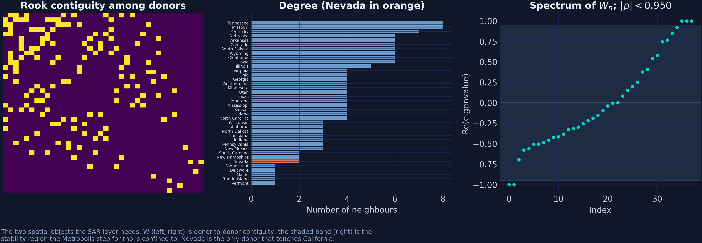

*Figure 2. Left: the 38 × 38 donor contiguity matrix, states ordered by degree. Centre: how many neighbours each donor has, with Nevada in orange. Right: the eigenvalues of the row-normalised W, and the shaded stability region the sampler confines ρ to.*

The right-hand panel matters for section 9.4. A spatial autoregressive model is only well-defined when $I - \rho W$ is invertible, which bounds $\rho$ by the reciprocal of the largest eigenvalue of the row-normalised weights. For row-normalised contiguity that eigenvalue is exactly 1, so the mathematical bound is $|\rho| < 1$; `scspill` shrinks it to $|\rho| < 0.95$ as a numerical safety margin, and the sampler will not propose outside it. Section 11.3 shows why that 5% margin is itself a prior choice worth reporting.

### 6.3 Treatment in 1988, not 1989

One detail that will bite anyone comparing this post against other sources. Proposition 99 passed in November 1988 and the tax took effect on 1 January 1989. Abadie, Diamond and Hainmueller treat 1989 as the first treated year, and so does `mlsynth`'s own Proposition 99 example. `scspill`'s `load_california()` uses **1988**, following the R replication package that accompanies the Sakaguchi–Tagawa paper.

Neither is wrong, but they cannot be mixed. This post pins **1988 everywhere**, so all three stages and the whole benchmark in section 13 condition on the same 18 pre-treatment years:

```{python}
# Rebuild the treatment dummy from the stated rule and assert it matches, so a
# future change in the shipped column cannot silently move the post-period.
rebuilt = ((df["state"] == "California") & (df["year"] >= TREAT_YEAR)).astype(int)
assert (rebuilt.to_numpy() == df["treated"].to_numpy()).all()
years = np.sort(df["year"].unique())
wide = df.pivot(index="year", columns="state", values="cigsale")
y_treated = wide["California"].to_numpy()
post = years >= TREAT_YEAR
print(f"T0 = {(~post).sum()}   T1 = {post.sum()}   donors = {len(donors)}")
```

To use the 1989 convention instead, overwrite `df["treated"]` before passing the frame to any estimator. The effect on the headline number is small — one fewer post-treatment year, and 1988 was a partial year in any case — but the comparison across libraries stops being apples-to-apples the moment two of them disagree about $T_0$.

## 7. Stage 1 — classical simplex synthetic control

The first stage solves exactly the problem written down in section 3.3. In `mlsynth` every estimator takes the same configuration dictionary — a long data frame plus four column names — and the class chosen decides the estimator.

```{python}
common = dict(df=df, outcome="cigsale", treat="treated",
              unitid="state", time="year", display_graphs=False)

sc = mlsynth.VanillaSC(dict(common)).fit()

w_sc = pd.Series(sc.donor_weights).reindex(donors).fillna(0.0)
print(f"ATT                : {sc.att:.4f} packs per capita per year")
print(f"pre-treatment RMSE : {sc.pre_rmse:.4f}")
print(f"weights sum        : {w_sc.sum():.6f}")
print(f"active donors      : {(w_sc > 1e-4).sum()} of {len(donors)}")
print(w_sc[w_sc > 1e-4].sort_values(ascending=False).round(4).to_string())
```

Five of 38 donors carry the entire counterfactual, and four of them carry 98.6% of it. The pre-treatment RMSE of 1.60 is small against an outcome averaging 117.7 packs over the pre-period — a relative error of 1.4%, and a pre-treatment $R^2$ of 0.973.

Two things are worth pausing on. First, this reproduces the R edition to within 0.04 packs: that post reports −18.46 using the `tidysynth` package and a different optimiser, with weights of Utah 0.327, Nevada 0.255, Montana 0.245 and Connecticut 0.148. Two independent implementations landing this close is the strongest evidence either one gets that the estimator is correctly coded.

Second, and less comfortably: **Nevada is in the synthetic California, with a weight of 0.24.** The one state we have a specific reason to suspect of contamination is carrying nearly a quarter of the counterfactual.


*Figure 3. Top: California and its simplex-weighted synthetic. Bottom: the gap between them, shaded after 1988.*

The two series track closely until 1988 and separate steadily thereafter, reaching −26.7 packs in 2000. The pre-treatment gap is not exactly zero — it wanders between −3.5 and +5.0 packs, which is the visible form of the misfit that section 4.2 priced. An RMSE of 1.60 is an average over that wandering, not a promise that any single year fits well.


*Figure 4. The simplex assigns weight to five donors and exactly zero to the other 33.*

That wall of zeros is the question Stage 2 exists to ask. Are 33 states genuinely irrelevant to reconstructing California, or is that just what a constrained least-squares problem in 38 variables does? Section 4.1 showed sparsity can come from the data. It can also come from the constraint, and from the outside the two look identical.

Stage 1 leaves two questions on the table, and the remaining stages take one each:

- **Is the sparsity real?** Stage 2 replaces the constraint with a prior and looks again.
- **Is Nevada a donor or a victim?** Stage 3 gives the model a way to answer.

## 8. Stage 2 — Bayesian synthetic control

The simplex is a hard constraint: it declares certain weight vectors impossible. A prior is softer. It declares them *unlikely*, and lets the data overrule it if the evidence is strong enough. Stage 2 makes that substitution and changes nothing else.

### 8.1 The horseshoe hierarchy

The prior we want has two properties that pull in opposite directions. It should put enormous mass near zero, so that a donor with nothing to contribute gets nothing. And it should have tails heavy enough that a donor with a great deal to contribute is not shrunk into irrelevance. The horseshoe prior of [Carvalho, Polson and Scott (2010)](https://doi.org/10.1093/biomet/asq017) does both:

$$\alpha_j \mid \lambda_j \sim \mathcal{N}\big(0, \, \lambda_j^2\big), \qquad \lambda_j \mid \tau \sim \mathcal{C}^{+}(0, \tau), \qquad \tau \sim \mathcal{C}^{+}(0, \sigma), \qquad \sigma \sim \mathcal{C}^{+}(0, 10)$$

In words, this says: each donor weight is normal around zero, but with its *own* variance, and that variance is drawn from a half-Cauchy. The half-Cauchy has infinite density at zero and a tail that decays only polynomially, so most $\lambda_j$ come out tiny — shrinking that donor to nothing — while any individual $\lambda_j$ can be enormous if the likelihood demands it. The global scale $\tau$ decides how sparse the whole vector is; the local scales $\lambda_j$ decide which donors get to escape.

The name comes from the shrinkage factor $\kappa_j = 1/(1 + \lambda_j^2)$, whose implied prior is a $\mathrm{Beta}(1/2, 1/2)$ — a U shape with peaks at 0 and 1, like a horseshoe. Weights are pushed either to "shrunk to nothing" or to "left alone", and rarely in between.

Sampling from this directly is awkward because the half-Cauchy is not conjugate to anything — there is no closed-form conditional distribution to draw from, so a sampler cannot simply take a value and move on. [Makalic and Schmidt (2015)](https://doi.org/10.1109/LSP.2015.2503725) supply the trick that makes it a Gibbs sampler: every half-Cauchy is a scale mixture of inverse gammas, so introducing one auxiliary variable per scale gives closed-form conditionals throughout:

$$\lambda_j^2 \mid \nu_j \sim \mathcal{IG}\Big(1, \, \tfrac{1}{\nu_j}\Big), \qquad \nu_j \sim \mathcal{IG}\Big(\tfrac{1}{2}, \, 1\Big) \, \Longrightarrow \, \lambda_j \sim \mathcal{C}^{+}(0, 1)$$

In words: an inverse-gamma whose own scale is inverse-gamma distributed *is* a half-Cauchy. Nothing is approximated — this is an exact reparameterisation, and it is why both libraries can run hundreds of thousands of iterations in seconds rather than hours.

| Symbol | Meaning | In the code |
|---|---|---|
| $\alpha_j$ | weight on donor $j$ | `result.alpha_hat` |
| $\lambda_j$ | local shrinkage scale for donor $j$ | internal to the sampler |
| $\tau$ | global shrinkage scale | internal to the sampler |
| $\nu_j$ | Makalic–Schmidt auxiliary variable | internal to the sampler |
| $\kappa_j$ | shrinkage factor, $1/(1+\lambda_j^2)$ | not exposed |

### 8.2 Fitting it with mlsynth.BSCM

`mlsynth.BSCM` takes the same configuration dictionary as `VanillaSC`, plus the
prior family and the MCMC settings. Four chains of 20,000 draws is generous for a
38-donor regression; the horseshoe's funnel geometry is the reason not to be
stingy with either.

```{python}
bscm = mlsynth.BSCM({**common, "prior": "horseshoe", "n_iter": 20_000,
                     "burn_in": 10_000, "chains": 4, "seed": SEED}).fit()

w_bscm = pd.Series(bscm.donor_weights).reindex(donors).fillna(0.0)
beta0 = float(np.mean(np.asarray(bscm.posterior.beta0)))

print(f"ATT           : {bscm.att:.4f}")
print(f"95% CrI       : [{bscm.att_ci[0]:.4f}, {bscm.att_ci[1]:.4f}]")
print(f"intercept     : {beta0:.4f}")
print(f"weights sum   : {w_bscm.sum():.4f}")
print(f"active donors : {(w_bscm.abs() > 0.01).sum()} of {len(donors)}")
```

The donor pool has gone from 5 active states to 26, and the weights no longer sum to one. Both are consequences of dropping the simplex, and neither is a defect. This is also the first output carrying a 95% *credible* interval, which is the Bayesian counterpart of a confidence interval: the range holding 95% of the posterior's mass, which is to say the range the model assigns 95% probability to after seeing the data — a statement about the parameter, not about repeated sampling.


*Figure 5. Posterior mean weight with 95% credible intervals for the 24 donors with the largest magnitude, from `mlsynth.BSCM`.*

Notice what the credible intervals do. Most of them straddle zero comfortably: the model is willing to entertain a role for these donors but the data do not insist on one. The horseshoe has done what it promised — it made zero the default without making it compulsory.

There is one number in that output which deserves more attention than it usually gets, and it explains a discrepancy the next subsection would otherwise leave hanging: **the intercept of 16.86**.

### 8.3 The same model in scspill, at zero spillover intensity

`scspill` has no `rho` argument. The spatial intensity is a parameter to be estimated, not a setting. But the model collapses *exactly* to a Bayesian horseshoe synthetic control when $\rho = 0$, and that special case is computed and exposed as part of every fit — so Stage 2 costs no extra MCMC at all.

One ordering note if you are running these blocks in sequence: `result` is the Stage 3 fit built in section 9.5. The narrative needs its $\rho = 0$ case here, two sections earlier than the fit that produces it, so run 9.5 first and come back.

```{python}
#| label: stage3-fit
# The post explains this model in section 9; the tutorial has to run it here,
# because section 8.3 reads the rho = 0 case off the same fit. Section 9.5
# reuses this object rather than refitting.
result = SCSPILL({
    **panel.config_kwargs(),
    "m_iter": M_ITER,
    "burn": BURN,
    "seed": SEED,
    "display_graphs": False,
    "max_effect_draws": 5_000,
}).fit()
print(f"fitted: ATT {result.att:.4f}   rho {result.rho_hat:.4f}   "
      f"ESS {result.rho_ess:.1f}")
```

```{python}
# Fitted once in section 9.5; both quantities come out of that single fit.
from scspill.utils.scspill_helpers.sar.effects import treated_counterfactual

att_rho0 = result.effects_detail.att_scm          # the rho = 0 ATT
cf_rho0 = treated_counterfactual(result.inputs.Y0, result.inputs.Yc,
                                 result.inputs.Wn, result.inputs.wn,
                                 result.alpha_hat, rho=0.0)   # the whole path

print(f"scspill at rho = 0 : {att_rho0:.4f}")
print(f"mlsynth.BSCM       : {bscm.att:.4f}")
print(f"R edition Stage 2  : -15.8400")
print(f"rho=0 counterfactual, last 3 years: {cf_rho0[-3:].round(1)}")
```

Two Bayesian synthetic controls with the same prior family on the same data, **3.17 packs apart**. That gap is not noise, and it is not a bug in either library. It is an intercept.

`mlsynth.BSCM` implements [Kim, Lee and Gupta (2020)](https://doi.org/10.1287/mksc.2019.1178), which fits an explicit intercept $\beta_0$ and leaves the donor series on their original scale. `scspill`'s Step 1 has no intercept and standardises the donors first. The consequences are visible in the output above: BSCM's weights sum to 0.758 rather than 1, because the intercept of 16.86 packs is absorbing the level difference that the weights would otherwise have to carry.

$$\text{BSCM:} \quad Y_{1t} = \beta_0 + \sum_j \alpha_j Y_{jt} + \varepsilon_t \qquad\text{versus}\qquad \text{scspill:} \quad Y_{1t} = \sum_j \alpha_j Y_{jt} + \varepsilon_t$$

In words: one model is allowed to say "California is like this blend of states, shifted up by 17 packs"; the other must say "California *is* this blend of states". The direction matters. Because the weights sum to only 0.758, BSCM's raw blend sits well below California — roughly $0.758 \times 131.5 \approx 100$ packs against California's pre-period mean of 117.7 — and the positive intercept lifts it back onto the treated series. Neither is more correct in the abstract. But they answer different questions, and averaging them would be meaningless.

The tiebreaker available here is external. `scspill`'s $\rho = 0$ case lands within **0.16 packs** of the R edition's Stage 2 estimate of −15.84, which was produced by entirely separate C++ code. Two independent implementations of the no-intercept horseshoe agree; the intercept model is doing something else, deliberately.


*Figure 6. Left: the counterfactual path implied by each estimator. Right: point estimates with intervals; hollow diamonds are the R edition's published values.*

The lesson generalises well beyond this post. When two packages disagree about a model they both claim to implement, the first thing to check is not the sampler. It is whether they are fitting the same equation.

## 9. Stage 3 — Bayesian spatial synthetic control

Everything so far has assumed the donors were bystanders. Stage 3 drops that.

### 9.1 Where the contamination enters

Start from the estimator itself and ask what it actually computes when SUTVA fails. The synthetic control is built from *observed* donor outcomes, and if those observations already contain a spillover, the counterfactual inherits it:

$$Y_{1t} - \sum_j \alpha_j Y_{jt} \, = \, \xi_{0t} \, - \, \sum_j \alpha_j \, \xi^{c}_{jt}$$

The two terms on the right are doing very different jobs:

| Term | What it is | Do we want it? |
|---|---|---|
| $\xi_{0t}$ | the causal effect on California | **yes** — this is the estimand |
| $-\sum_j \alpha_j \, \xi^{c}_{jt}$ | a weighted sum of the spillovers that landed on the donors | **no** — this is bias, and we get it for free |

In words: the number a classical synthetic control reports is the true effect on California *minus* a weighted sum of the spillovers that landed on the donors — with the same weights used to build the counterfactual. The derivation is one line of adding and subtracting $\sum_j \alpha_j Y_{jt}(\mathbf{0})$, using $Y_{jt} = Y_{jt}(\mathbf{e}_1)$ and $\xi^{c}_{jt} = Y_{jt}(\mathbf{e}_1) - Y_{jt}(\mathbf{0})$.

So the bias term is

$$\mathrm{bias}_t = -\sum_j \alpha_j \, \xi^{c}_{jt}$$

This is exactly the identity the toy example in section 4.3 verified with $-\left(0.5 \times -8\right) = +4$. Three consequences are worth stating plainly:

- If every $\xi^{c}_{jt} = 0$, the bias vanishes and classical synthetic control is right. SUTVA is not a technicality — it is the whole justification.
- The bias is a *product* of weight and spillover, so contamination in a zero-weight donor is harmless.
- The sign of the bias is the opposite of the sign of the weighted spillover. Negative spillovers on positively-weighted donors push the estimate toward zero.

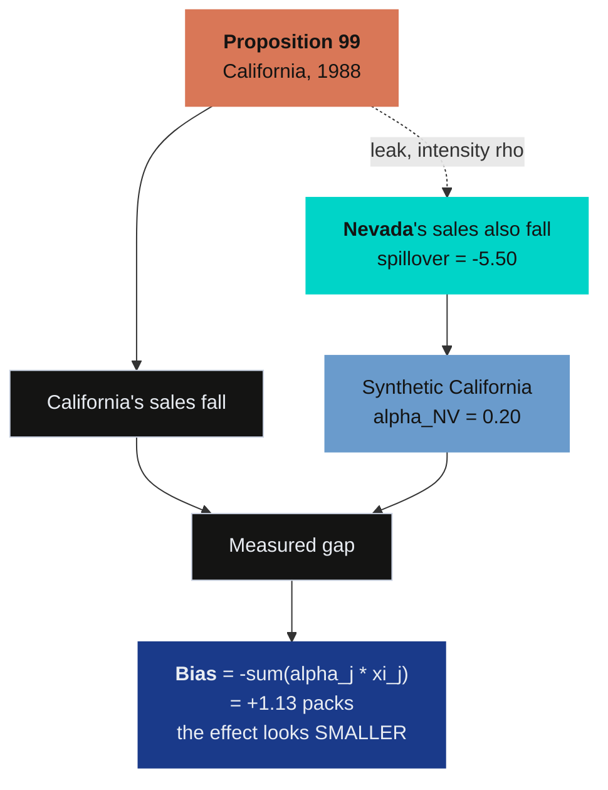

The dashed arrow is the one classical synthetic control cannot draw. To estimate its strength we need a model of how outcomes travel between neighbouring states — which is what a spatial autoregression is for.

### 9.2 A spatial process on the donor outcomes

Sakaguchi and Tagawa's proposal is to put a spatial autoregressive structure on the donor block. Each donor's outcome depends on its neighbours' outcomes, *and* on the treated unit's outcome, with a single intensity parameter $\rho$ governing both:

$$\mathbf{Y}^{c}_{t} = \rho \big( \mathbf{w} \, Y_{1t} + W \mathbf{Y}^{c}_{t} \big) + X_t \beta + \mathbf{u}_t, \qquad \mathbf{u}_t = \eta \gamma_t + \mathbf{e}_t$$

In words: a donor's cigarette sales are a weighted average of its neighbours' sales, plus a term for how exposed it is to California, plus covariates, plus a common latent factor and idiosyncratic noise. The vector $\mathbf{w}$ is exposure to the treated unit — one non-zero entry, Nevada — and $W$ is donor-to-donor contiguity.

The error is not white noise. It carries a latent factor $\gamma_t$ following an AR(1) process with loadings $\eta$, which soaks up the common national trends visible in Figure 1 — the surgeon-general reports, federal tax changes, and the general secular decline in smoking:

$$\gamma_t = \phi_\gamma \gamma_{t-1} + \epsilon_t, \qquad \epsilon_t \sim \mathcal{N}(0, \sigma^2_\gamma), \qquad \eta_{jk} \sim \mathcal{N}(0, \sigma^2_\eta \omega_k), \qquad \omega_k \sim \mathcal{C}^{+}(0, 10)$$

The critical structural point is *why* $\mathbf{w}$ multiplies $Y_{1t}$, California's **observed** outcome. Nevada's residents respond to what California actually does — the actual prices, the actual advertising, the actual sales — not to some counterfactual California. That is what makes the system solvable: everything on the right-hand side is observed.

Setting $\rho = 0$ removes both spatial terms at once and returns Stage 2 exactly. This is the sense in which the three stages are nested, and it is why section 8.3 could read Stage 2 off a Stage 3 fit.

| Symbol | Meaning | In the code |
|---|---|---|
| $\rho$ | spatial intensity, the leak | `result.rho_hat` |
| $\mathbf{w}$ | donor exposure to California | `panel.spatial_w` |
| $W$ | donor-to-donor contiguity | `panel.spatial_W` |
| $W_n$ | the same matrix, row-normalised | `result.inputs.Wn` |
| $\beta$ | covariate coefficients | `result.sar_posterior.beta` |
| $\gamma_t$, $\eta$ | latent AR(1) factor and loadings | `p_factors=1` |
| $\sigma^2$ | idiosyncratic variance | `result.sar_posterior.sigma2` |

### 9.3 Identification in closed form

Here is where the model earns its keep. The simplex is gone, and something has to replace it as the identifying assumption. What replaces it is a **perfect pre-treatment fit with unconstrained weights**:

$$\exists \, \alpha \in \mathbb{R}^{N} \, : \, Y_{1t}(\mathbf{0}) = \sum_j \alpha_j Y_{jt}(\mathbf{0}) \quad \text{for all } t$$

In words: some fixed combination of the donors' no-treatment outcomes reproduces California's no-treatment outcome exactly, in every period. The weights may be negative and need not sum to one. This is a *stronger* assumption than approximate fit and a *weaker* one than convexity, and it is worth being explicit that it is an assumption rather than a result.

Given that, define $A = W + \mathbf{w}\alpha^{\top}$ — the contiguity graph *plus* the indirect path from each donor back to itself through the synthetic California. Solving the simultaneous system for the donors' no-treatment outcomes gives

$$\mathbf{Y}^{c}_{t}(\mathbf{0}) = \big(I_N - \rho A\big)^{-1}\Big[\big(I_N - \rho W\big)\mathbf{Y}^{c}_{t} - \rho \, \mathbf{w} \, Y_{1t}\Big]$$

and both estimands follow immediately:

$$\xi_{0t} = Y_{1t} - \alpha^{\top}\mathbf{Y}^{c}_{t}(\mathbf{0}), \qquad \boldsymbol{\xi}^{c}_{t} = \mathbf{Y}^{c}_{t} - \mathbf{Y}^{c}_{t}(\mathbf{0})$$

**Look at what is not in those expressions.** No $\beta$. No $\gamma_t$, no $\eta$, no $\sigma^2$. Only $(\alpha, \rho, \mathbf{w}, W)$ and the observed outcomes. The covariate coefficients, the latent factors and the error variances all cancel out of the effects.

That is not an aesthetic nicety. It is the reason the whole approach is usable. A model this rich has many parameters that are poorly identified from 31 years of data on 39 states — and section 9.5 will show that one of them, $\rho$ itself, mixes badly enough to need half a million draws. If the effects depended on the entire nuisance block, that weak identification would poison everything. Because they depend on four objects only, it does not. It is confined to $\rho$, where we can see it, measure it, and report it honestly.

### 9.4 The two-step sampler

The product $\rho \, \mathbf{w} \, \alpha^{\top}$ appears inside $\rho A$, so the exposure channel identifies $\rho$ and $\alpha$ only jointly. Sampling them together mixes very badly. The paper's answer is to factorise the posterior into two steps — a *cut* posterior, meaning a deliberate refusal to let the second step feed information back into the first — estimating $\alpha$ first from the pre-treatment fit and then holding it fixed while $\rho$ is drawn.

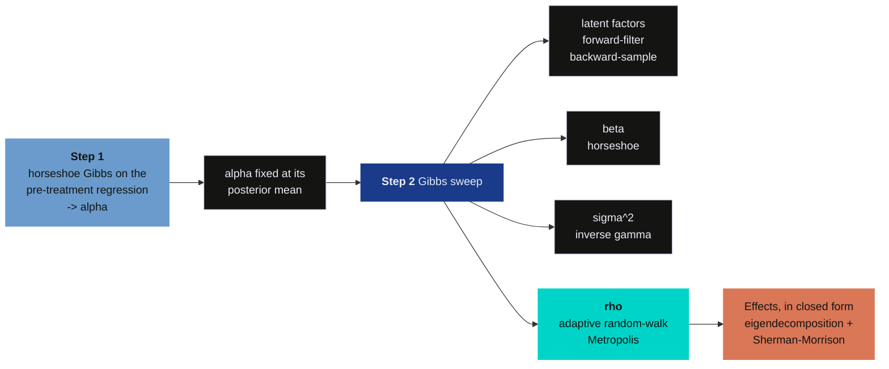

Read the split as the price of the identification problem: Step 1 never sees $\rho$, and Step 2 never re-litigates $\alpha$. The $\rho$ step is a **random-walk Metropolis** move — propose a small jump, accept it with a probability that depends on how much better the new value fits, and otherwise stay put — which is the only part of this sampler that is not a draw from a closed-form conditional, and the reason section 9.6 has an effective-sample-size problem to report.

Three implementation details explain both the speed and the one weakness.

**The support for $\rho$.** The system is only invertible when $I_N - \rho A$ is non-singular, which bounds $\rho$ by the spectral radius of the row-normalised weights:

$$|\rho| < \frac{0.95}{\max\big(1, \, \max_i |\mu_i(W_n)|\big)}$$

For row-normalised contiguity the largest eigenvalue is exactly 1, so the mathematical bound is $|\rho| < 1$ and the 0.95 in the numerator is a numerical safety margin the package imposes, not a consequence of invertibility. Section 11.3 shows this bound is the *only* prior setting in the model that meaningfully moves the answer.

**The Jacobian.** Each Metropolis proposal needs $\log|I_N - \rho A|$, which is an $O(N^3)$ determinant if computed naively, at every one of 500,000 iterations. Pre-computing the eigenvalues $\mu_i$ of $A$ once turns it into a sum — written $\mu$ rather than $\lambda$ because $\lambda_j$ is already the horseshoe's local shrinkage scale in section 8.1:

$$\log\big|I_N - \rho A\big| = \sum_{i=1}^{N} \log\big(1 - \rho \mu_i\big)$$

$O(N)$ per iteration instead of $O(N^3)$. This single substitution is what makes a half-million-draw chain take two minutes instead of two days.

**Adaptive step size.** The Metropolis proposal standard deviation is tuned during burn-in by [Robbins–Monro](https://doi.org/10.1214/aoms/1177729586) stochastic approximation, targeting a 44% acceptance rate — the optimum for a one-dimensional random walk ([Gelman, Roberts and Gilks, 1996](https://doi.org/10.1093/oso/9780198523567.003.0038); the 0.234 asymptotic result for high dimensions is [Roberts, Gelman and Gilks, 1997](https://doi.org/10.1214/aoap/1034625254)):

$$\log s_{m+1} = \log s_m + (m+1)^{-0.6}\big(a_m - 0.44\big)$$

where $a_m$ is the acceptance probability of the proposal made at iteration $m$. When a proposal is readily accepted the step grows; when proposals keep being rejected it shrinks. The exponent $-0.6$ makes the corrections vanish fast enough for the chain to settle, and adaptation stops entirely at the end of burn-in so the sampled portion is a genuine Markov chain. In the run below this lands at an acceptance rate of 0.444 against the 0.44 target, from a starting step of 0.05.

Section 10 shows what happens when this is switched off — which is what the R replication code does.

### 9.5 Fitting it

The configuration is the panel's own `config_kwargs()` plus five settings: chain
length, burn-in, the seed, a switch for the package's automatic plotting, and a
cap on how many posterior draws the effects sweep uses. Everything spatial —
$\mathbf{w}$, $W$, the covariates — comes from the bundled panel, so there is
nothing to align by hand.

```{python}
# Already fitted above. Shown here because this is where the post
# introduces the configuration.

print(f"ATT        : {result.att:.4f}  95% CrI "
      f"[{result.att_ci[0]:.4f}, {result.att_ci[1]:.4f}]")
print(f"ATT at rho=0: {result.effects_detail.att_scm:.4f}")
print(f"rho        : {result.rho_hat:.4f}  95% CrI "
      f"[{result.rho_ci[0]:.4f}, {result.rho_ci[1]:.4f}]")
print(f"ESS(rho)   : {result.rho_ess:.1f}   acceptance {result.acc_rho:.3f}")
```

**The credible interval for $\rho$ excludes zero.** That is the formal statement that the data reject the restriction collapsing Stage 3 back to Stage 2 — SUTVA on the donor pool is not merely doubtful here, it is rejected by the model that nests it.

The ATT moves from −15.68 to −16.87 once the leak is modelled: purging the contamination makes the estimated effect **larger**, by 1.19 packs. Section 4.3 predicted the direction from the sign of the spillover, and section 12 checks the magnitude against the identity.

`scspill` ships its own diagnostics table, and it is worth reading in full because it shows precisely where the weak identification lives:

```{python}
print(result.diagnostics(top_n_alpha=6).round(4))
```

Read the `ess` column top to bottom. $\sigma^2$ has an effective sample size of 204,000. The donor weights are in the 10,000–26,000 range. **$\rho$ has 137**, and the price coefficient 388. From the same chain. The pattern is not that one scalar is hard and everything else is easy — it is that the two quantities leaning on the single contiguity channel are hard, and $\rho$, the scalar the whole third stage exists to estimate, is the harder of the two.

That is not a defect in the software, and it is not that the data are silent about $\rho$ — the posterior is tight, with a standard deviation of 0.043 on a support 1.9 wide. It is that the sampler has to move one scalar through a strongly correlated conditional: $\rho$ is the only parameter drawn by random-walk Metropolis rather than from a closed-form conditional, and each draw is highly correlated with the one before. Section 14 shows what it costs to pin it down, and section 10 shows what happens if you do not try.

Two further observations from the table. Nevada's weight is the most precisely estimated of all the donors (`sd` 0.037 against 0.10–0.17 for the other five shown) — the model is confident about the one state it also assigns nearly all the spillover to. And `rhat_split` for $\rho$ is 1.0154: above the 1.01 threshold [Vehtari et al. (2021)](https://doi.org/10.1214/20-BA1221) recommend and inside the conventional 1.01–1.05 warning band, though well short of its upper end. Consistent with a chain that has mixed adequately but not comfortably — and one more reason to report the effective sample size beside the interval rather than in place of it.


*Figure 7. `result.plot(kind="panel")` — observed against counterfactual, the treatment effect over time, and the eight largest spillover paths, drawn by the library itself.*

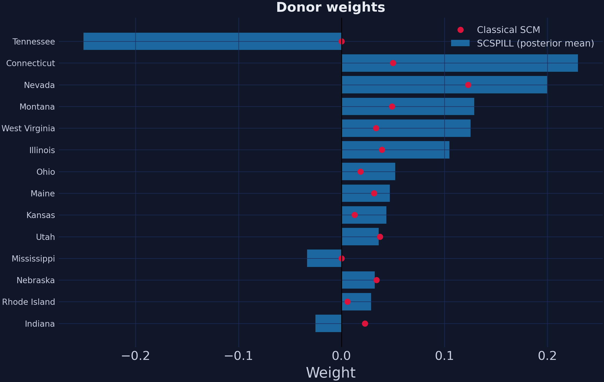

*Figure 8. `result.plot(kind="weights")` — the horseshoe posterior against the simplex weights for the same donors.*

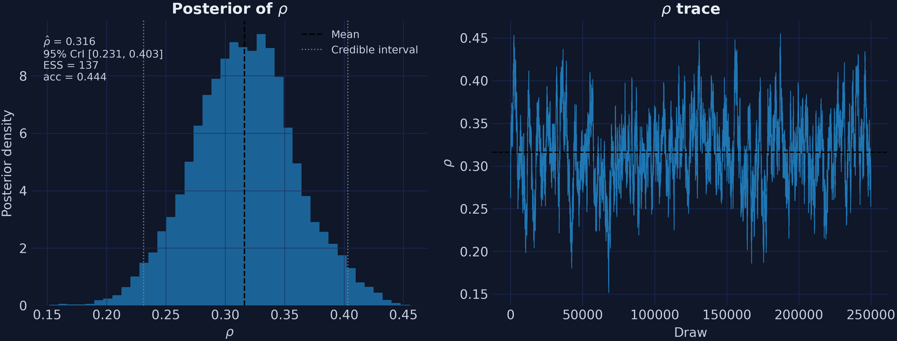

*Figure 9. `result.plot(kind="rho")` and `result.plot(kind="trace")`. The trace is visibly slower-moving than a well-mixed chain, which is what an effective sample size of 137 out of 250,000 draws looks like.*

### 9.6 The spillover received by each donor

The second estimand is a full panel — one spillover per donor per year — rather than a single number.

```{python}
spill = result.spillover_panel.loc[TREAT_YEAR:]      # post-treatment rows only
means = spill.mean()
ranked = means.reindex(means.abs().sort_values(ascending=False).index)
print(ranked.head(6).round(4).to_string())
```

Nevada absorbs **11.2 times** the next-largest effect. Idaho and Utah — the two states that border Nevada, one step further out on the contiguity graph — pick up about half a pack each. Everything beyond that second ring is two orders of magnitude smaller again.

One caveat on reading this panel: the pre-treatment rows are fit residuals, not causal spillovers. Nothing had leaked yet in 1975. Slice from `TREAT_YEAR` onward, as above, or you will average signal with noise.


*Figure 10. Mean post-1988 spillover by state on a linear colour scale. California is the treated unit; dark tiles are states outside the donor pool.*

The concentration in that map is the finding, not a rendering artefact. On a linear scale almost every tile sits at the pale end because one state absorbs an order of magnitude more than any other.


*Figure 11. The eight donors with the largest estimated spillover, by posterior mean. These are point estimates: `scspill` returns the effects panel as posterior means rather than per-draw, so no interval is available for an individual donor's spillover.*

That last sentence is a real limitation and worth stating plainly rather than burying. The 95% credible interval reported for $\rho$ covers the spatial parameter, and the one reported for the ATT covers the treated unit — but nothing in this pipeline puts an interval around Nevada's −5.50. Statements below about which donors are "distinguishable from zero" are therefore statements about relative magnitude, not about posterior tail probability.

With that caveat, the verdict on SUTVA is still unambiguous, because it rests on $\rho$ rather than on any individual donor: the interval for $\rho$ excludes zero, so the spatial channel is real, and the point estimates say it is concentrated almost entirely in one state. That is a *better* outcome than diffuse contamination would have been — a single identifiable leak can be modelled, and has been.

## 10. Why these numbers differ from the R edition

There is an [R edition of this post](https://carlos-mendez.org/post/r_sc_bayes_spatial/) on this site. It runs the same three stages on the same panel using the authors' own R and C++ replication code, and it reports **ATT −16.59 with a 95% credible interval of [−16.78, −16.39]**, against this post's −16.87 with [−23.05, −10.33].

The point estimates are close. The intervals are not remotely close — one is 0.38 packs wide, the other 12.71. Something has to explain a factor of 33, and "different language" is not it.

`scspill` departs from the R replication code in six documented ways. Three have escape hatches, so we can put the Python code back into the R specification and see whether it reproduces the R numbers. Three do not, so the reproduction will be close rather than exact.

### 10.1 Reproducing the R specification

Three of the six departures have escape hatches, so the Python code can be put
back into the R specification and run. `R_SPEC` below is that specification: the
ridge prior, weights held at their posterior mean, and a fixed Metropolis step.
If the gap between the two editions were a porting error, this configuration
would not reproduce the R edition's numbers.

```{python}
R_SPEC = dict(beta_prior="ridge",        # departure 2: flat-plus-ridge, not horseshoe
              propagate_alpha=False,     # departure 3: alpha fixed at its posterior mean
              adapt_rho=False,           # departure 4: fixed Metropolis step
              step_rho=0.01)

rspec = SCSPILL({**panel.config_kwargs(), "m_iter": 5_000, "burn": 2_500,
                 "seed": SEED, "display_graphs": False, **R_SPEC}).fit()

print(f"ATT {rspec.att:.4f}  CrI [{rspec.att_ci[0]:.4f}, {rspec.att_ci[1]:.4f}]  "
      f"width {rspec.att_ci[1] - rspec.att_ci[0]:.3f}  rho {rspec.rho_hat:.4f}")
```

Run at the R edition's own budget of 5,000 iterations, the agreement is close enough to settle the question:

| Quantity | R edition | scspill, R spec, R budget | Difference |
|---|---:|---:|---:|
| ATT | −16.590 | −16.286 | 0.304 |
| 95% CrI width | 0.384 | 0.482 | 0.098 |
| $\hat\rho$ | 0.2226 | 0.2282 | 0.0056 |
| ESS($\rho$) | 2.93 | 3.27 | 0.34 |
| Nevada spillover | −3.750 | −3.778 | 0.028 |

Independent code in a different language, reproducing $\hat\rho$ to three decimal places and the Nevada spillover to 0.03 packs — **including the pathology**. An effective sample size of 3.27 is not a coincidence to be explained away; it is the R sampler's behaviour, faithfully reproduced.

Now change one thing at a time.

| Specification | Iterations | ATT | 95% CrI | Width | $\hat\rho$ | ESS($\rho$) | Acceptance |
|---|---:|---:|---|---:|---:|---:|---:|
| R edition (published) | 5,000 | −16.590 | [−16.78, −16.39] | 0.384 | 0.2226 | 2.9 | — |
| scspill, R spec | 5,000 | −16.286 | [−16.59, −16.11] | 0.482 | 0.2282 | 3.3 | 0.264 |
| scspill, R spec | 500,000 | −16.796 | [−17.16, −16.46] | 0.702 | 0.3134 | 66.9 | 0.254 |
| **scspill, corrected** | **500,000** | **−16.868** | **[−23.05, −10.33]** | **12.713** | **0.3161** | **136.8** | **0.444** |
| mlsynth `SPILLSYNTH(sar)` | 500,000 | −16.525 | [−16.93, −16.18] | 0.757 | 0.2476 | 135.2 | — |

Read the third row carefully, because it rules out the explanation most people reach for first. **Running the R specification for a hundred times as many iterations does not widen the interval.** It goes from 0.482 to 0.702 — still an order of magnitude too narrow — while the effective sample size climbs from 3.3 to 66.9. Chain length was never the problem.

The width comes from **departure 3**: `propagate_alpha`. The R code varies $\rho$ across draws while holding the donor weights $\alpha$ fixed at their posterior mean. The reported interval therefore reflects uncertainty about the spatial parameter and *none at all* about which states make up synthetic California — even though section 8 showed those weights have credible intervals several times wider than the weights themselves. Switching on paired $(\alpha^{(m)}, \rho^{(m)})$ draws restores the missing uncertainty, and the interval grows by a factor of 18.

Effective sample size and interval width are answering different questions here, and it is worth keeping them apart:

- **ESS asks whether the interval is *reliable*** — whether the chain visited enough of the posterior for its quantiles to mean anything. At ESS 3 they do not.
- **`propagate_alpha` asks whether the interval is *complete*** — whether it accounts for everything the model is uncertain about. With $\alpha$ pinned, it does not.

The R edition's interval failed both tests, which is why it is 33 times too narrow.


*Figure 12. Left: the ρ chain under three specifications. Right: effective sample size, with the conventional floor of 100 marked.*

The fifth row is the cross-check that matters most. `mlsynth.SPILLSYNTH(method="sar")` is an **independent port of the same paper by a different author**, sharing no code with `scspill`. At the same budget it reports an ATT of −16.525 against `scspill`'s −16.868 — 0.34 packs apart — and an ESS of 135 against 137. Its interval is narrow because it follows the R convention on $\alpha$. Two independent implementations agreeing on the point estimate and on the diagnostics, while differing exactly where their documented conventions differ, is about as much reassurance as this kind of comparison can offer.

### 10.2 The six departures

`scspill` ships the full list as a dataframe, which is the honest way to publish
a claim of this kind — the departures are enumerated in the package, not asserted
in a blog post.

```{python}
# scspill's own documentation of where it parts company with the R code.
print(pd.read_csv(data("scspill_departures.csv")).to_string(index=False))
```

| # | Area | R replication code | scspill | Escape hatch | Changes the answer? |
|---|---|---|---|---|---|
| 1 | Covariates | scrambled by a $(T,N,K)$ versus $(N,T,K)$ memory-layout mismatch | a proper $(T, N, K)$ array throughout | drop covariates | **yes — the big one** |
| 2 | Prior on $\beta$ | flat-plus-ridge conditional | the paper's horseshoe | `beta_prior="ridge"` | modestly |
| 3 | ATT bands | vary $\rho$ only, $\alpha$ at its posterior mean | paired $(\alpha, \rho)$ draws | `propagate_alpha=False` | **yes — the interval** |
| 4 | $\rho$ sampler | fixed Metropolis step | Robbins–Monro toward 44% acceptance | `adapt_rho=False` | the interval, not the point |
| 5 | Factor scales | inconsistent $\omega_k$ conditionals; $\mathcal{C}^{+}(0,1)$ hyperprior | $\mathcal{N}(0, \sigma^2_\eta \omega_k)$ with $\mathcal{C}^{+}(0,10)$ | none | little, but the sampler was invalid |
| 6 | FFBS initialisation | $\gamma_1$ inconsistent with its own conditionals | coherent $\gamma_0 = 0$ | none | little, but the sampler was invalid |

Departure 1 deserves a sentence of its own, because it is the most instructive kind of bug. The covariate array in the R code was indexed as though it were $(N, T, K)$ when it was laid out as $(T, N, K)$, which silently shuffles which state's price goes with which state's sales. Nothing crashes. Nothing looks wrong. The estimate simply answers a slightly different question than the one asked. It is also the departure with no escape hatch worth using: dropping the covariates entirely is the only way to sidestep it, which trades one specification error for another. **A memory-layout mistake was doing a substantial share of the modelling.**

### 10.3 What a joint distribution test catches

Departures 5 and 6 were not found by staring at output. They were found by a **Geweke joint distribution test**, and they are the reason to run one.

The idea is simple enough to state in two sentences. Draw parameters from the prior and simulate data from them: that gives you samples from the joint distribution of parameters and data, the *marginal-conditional* route. Alternatively, simulate data once and then run one sweep of your Gibbs sampler, repeatedly: if every conditional distribution in the sampler is correct, this *successive-conditional* route targets the **same** joint distribution. Any statistic's mean must then agree between the two routes, and a systematic disagreement means at least one conditional is wrong.

That is how an $\omega_k$ conditional treating $\omega$ as a variance while its neighbours treated it as a precision came to light, and how an FFBS initialisation inconsistent with its own conditionals came to light. Neither changes the California answer much. Both mean the R sampler was not converging to any posterior at all — it was converging to something, and that something had no interpretation.

This is the argument for the test in general. A sampler with an incoherent conditional does not announce itself. It produces plausible numbers, converges, passes trace-plot inspection, and is wrong.

## 11. Diagnostics

Three checks, all shipped as first-class functions in `scspill`, run before any of the numbers above should be believed. They all take the model's inputs directly rather than the fitted result, so pull those off the fit once:

```{python}
# result.inputs carries everything the sampler saw, already aligned.
Y0 = np.asarray(result.inputs.Y0, dtype=float).ravel()      # treated outcome, (T,)
Yc = np.asarray(result.inputs.Yc, dtype=float)              # donor outcomes, (T, N)
if Yc.shape[0] != Y0.size:
    Yc = Yc.T
X = None if result.inputs.X is None else np.asarray(result.inputs.X, dtype=float)

T0_idx = result.inputs.T0
Y0_pre, Yc_pre = Y0[:T0_idx], Yc[:T0_idx]
X_pre = None if X is None else X[:T0_idx]

print(f"Y0_pre {Y0_pre.shape}   Yc_pre {Yc_pre.shape}   "
      f"X_pre {None if X_pre is None else X_pre.shape}")
```

Note the shape of `X_pre`: a proper $(T_0, N, K)$ array. That third dimension is departure 1 from section 10.2 — the R code indexed the same block as though it were $(N, T_0, K)$.

### 11.1 Prior predictive check

Does the prior generate data that look anything like the data we have? If not, the posterior is a fight between a badly-specified prior and the likelihood, and the winner is not always the likelihood.

```{python}
from scspill.validation import prior_predictive, plot_prior_predictive

W_raw, w_raw = result.inputs.W_raw, result.inputs.w_raw

ppc = prior_predictive(Y0_pre, W_raw, w_raw, result.alpha_hat,
                       Yc_obs=Yc_pre, X=X_pre, p=0,
                       a0=3.0, b0=1.0, n_draws=2000, seed=SEED)

# PriorPredictiveResult carries `observed`, `stats` and `p_values` rather than
# a ready-made table; assemble the two that matter.
ppc_tab = pd.DataFrame({"statistic": list(ppc.p_values.keys()),
                        "observed": [ppc.observed[k] for k in ppc.p_values],
                        "p_value": list(ppc.p_values.values())})
print(ppc_tab.round(4).to_string(index=False))
```

Each row asks whether the observed value of a statistic falls in a plausible region of its prior predictive distribution. Read the column as a two-sided tail probability: values near 0.5 are unremarkable, and values near either 0 or 1 are not. Six of nine land comfortably inside. Three do not, and they tell the same story.

`pve_pc1` at 0.028 is the share of variance explained by the first principal component of the donor block. The observed value is **0.625**: nearly two-thirds of the joint movement of 38 state cigarette markets is one common factor, and the prior did not expect that much. `ac1` at 0.996 and `ac2` at 0.9985 are the mirror image, and are in fact further into their tails — the observed lag-1 and lag-2 autocorrelations of 0.894 and 0.810 sit above almost every prior draw. A prior that under-predicts persistence and under-predicts common variance is under-predicting the same thing twice: the national secular decline visible in Figure 1.

This is a mild warning rather than a failure, and it points at a specific, fixable thing: the model has one latent factor (`p_factors=1`), and the data may want more. The R edition runs a coarser four-statistic visual check at 1,000 draws and reads all four as compatible with the prior; the finer nine-statistic check here is what surfaces the conflict.

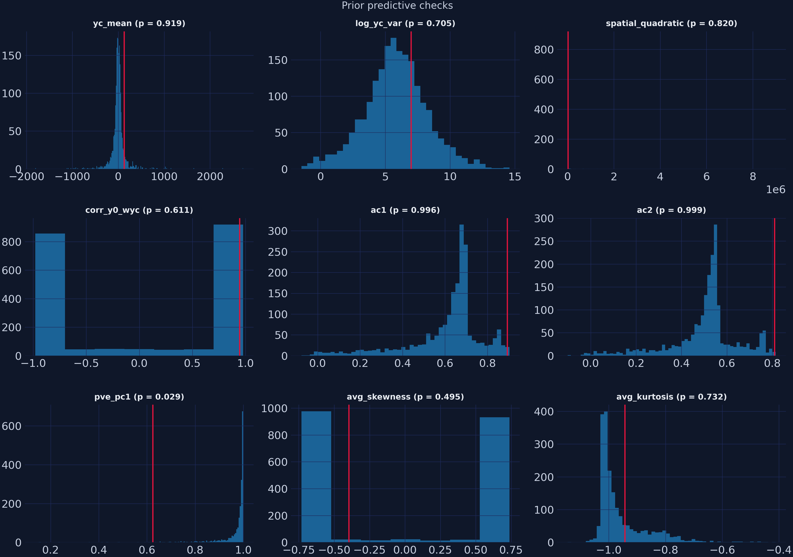

*Figure 13. Observed statistics against their prior predictive distributions, drawn by `plot_prior_predictive`.*

### 11.2 The Geweke joint distribution test

Section 10.3 explained what the test does. Running it requires care, and the function's own documentation says why: the successive-conditional simulator mixes slowly, so an under-resolved run flags **spurious** failures. Two rules follow from that, and both are in the docs:

- Keep the test panel small. A large $T_0 \times N$ makes the $\rho$ chain diffuse slowly, so $T_0 = 4$, $N = 4$ is what the function prescribes.
- Do not test the production kernel. Its half-Cauchy scale hierarchies are funnel-shaped and, in the documentation's own words, "effectively untestable at feasible chain lengths" — which is why the replication package only ever tested the simplified kernel, and then at two million draws.

The documentation also gives the way to tell a real problem from a mixing artifact: *a genuine incoherence shows up as a stable, sign-consistent z across seeds and scales; mixing artifacts flip sign and shrink as the chain grows.* So run it twice, at two chain lengths.

```{python}
from scspill.validation import geweke_test

# Trimmed for the tutorial; the post runs 20,000 and 200,000.
for m in (5_000, 50_000):
    rep = geweke_test(kernel="simple", T0=4, N=4, K=0, p=1,
                      m_iid=m, m_mcmc=m, burn=5_000, seed=SEED)
    tab = pd.DataFrame(rep.table)
    # GewekeReport does the Bonferroni bookkeeping itself.
    print(f"m = {m:>7,}   max |z| = {tab['z'].abs().max():.2f}   "
          f"flagged {rep.n_flagged} of {len(tab)} at |z| > {rep.z_crit:.2f}   "
          f"passed = {rep.passed}")
```

At 20,000 draws one statistic (`log_yc_var`, $z = 3.48$) crosses the Bonferroni threshold of 2.73 and the report comes back `passed = False`. At 200,000 nothing does, and the maximum score falls from 3.48 to 2.50. Across the eight statistics, $|z|$ shrinks for six.

That is the documented signature of a mixing artefact, not of an incoherent conditional. Had the sampler contained a real error, the score would have held its position or grown as the standard errors tightened around a genuinely wrong mean.


*Figure 14. Each statistic's |z| at 20,000 and 200,000 draws. Arrows show the direction of change; scores that fall are slow mixing, not incoherence.*

The pedagogical point is worth more than the result. A single Geweke run that flags a failure tells you almost nothing on its own. Two runs at different scales tell you which kind of failure you have.

### 11.3 Prior sensitivity

The last check varies the priors and asks whether the answer follows.

```{python}
from scspill.validation import prior_sensitivity

grid = pd.DataFrame([
    dict(a0=1.0, b0=1.0, rho_lo=-0.99, rho_hi=0.99, step_rho=0.05),
    dict(a0=3.0, b0=1.0, rho_lo=-0.99, rho_hi=0.99, step_rho=0.05),
    dict(a0=0.1, b0=0.1, rho_lo=-0.99, rho_hi=0.99, step_rho=0.05),
    dict(a0=1.0, b0=1.0, rho_lo=-0.50, rho_hi=0.50, step_rho=0.05),   # truncated
    dict(a0=1.0, b0=1.0, rho_lo=-0.99, rho_hi=0.99, step_rho=0.01),
    dict(a0=5.0, b0=2.0, rho_lo=-0.99, rho_hi=0.99, step_rho=0.05),
])
sens = prior_sensitivity(Yc, W_raw, w_raw, result.alpha_hat, grid, X=X, p=1,
                         m_burn=5_000, m_keep=20_000, base_seed=SEED)

# prior_sensitivity returns a PriorSensitivityResult, not a dataframe. The long
# table -- 18 rows over six parameter labels -- is on `.table`. Only rho here.
print(sens.table.query("parameter == 'rho'")
               .drop(columns="parameter").round(4).to_string(index=False))
```

**A caveat before reading these.** `prior_sensitivity` runs the *simplified* Step-2 kernel (`kernel="simple"`), not the production sampler, so the level of $\rho$ here is not the headline 0.316 and should not be compared with it. What is informative is the variation *across rows*, and there the finding is sharp.

Across the five rows with an unrestricted support, sweeping $a_0$ from 0.1 to 5, $b_0$ from 0.1 to 2 and the Metropolis step size by a factor of five moves the posterior mean of $\rho$ by **0.070**. Row 3 truncates the support to $[-0.5, 0.5]$ and the posterior lands at **0.4990** — pinned against the bound, with a standard deviation of 0.001. That is a shift of 0.32, about **five times what every conventional prior setting managed put together.**

The lesson is not that the inverse-gamma hyperparameters are irrelevant. It is that **the support constraint is a prior too**, and it is the one nobody thinks to report. In the headline configuration the bound is $|\rho| < 0.95$ and the posterior sits at 0.316, nowhere near it — so this model is not being squeezed. Had the analyst chosen a "conservative-looking" $[-0.5, 0.5]$ range, the answer would have been determined by that choice and by nothing else.


*Figure 15. Posterior mean of ρ across six prior settings, with 95% credible intervals. Orange marks the row where the support constraint binds.*

## 12. What the leak actually cost

Section 4.3 derived the bias of a SUTVA-imposing estimator as $-\sum_j \alpha_j \xi^{c}_{j}$ and verified it on three donors. The real panel supplies all the pieces, so it can be checked directly.

```{python}
alpha = pd.read_csv(data("stage2_alpha_posterior.csv")).set_index("state")["alpha_hat"]
xi = pd.read_csv(data("stage3_spillover_effects.csv")).set_index("state")["avg_spillover"]

contrib = (alpha * xi).sort_values()
print(contrib.head(4).round(4).to_string())
print(f"\nsum_j alpha_j * xi_j             : {contrib.sum():+.4f}")
print(f"att (purged) - att_scm (contam.) : {result.att - result.effects_detail.att_scm:+.4f}")
```

The identity holds to 0.057 packs — the small residual is because the purged ATT averages over paired $(\alpha, \rho)$ draws while the plug-in decomposition uses $\hat\alpha$ alone.

Three things to take from those four numbers:

**Nevada is 97% of the story.** Its contribution of −1.098 out of −1.130 comes from a weight of 0.200 multiplied by a spillover of −5.50. Utah has a comparable spillover per capita to Idaho but contributes three times as much bias, because Utah carries more weight. This is the "damage is a product of two things" point from section 4.3, visible in a real table.

**The direction is the one section 4.3 predicted.** The spillovers are negative and the weights are positive, so the bias is positive — the contaminated estimate is *closer to zero* than the truth. The horseshoe estimate understates Proposition 99's effect on California by 1.19 packs per capita per year, roughly 7% of the effect. Applying the same plug-in to the *simplex* weights, where Nevada carries 0.242 rather than 0.200, gives 1.51 packs, about 8%. The classical estimate is the more contaminated of the two, precisely because the constraint pushed more weight onto the one leaking donor.

**It is small.** After all of this — a spatial model, half a million MCMC draws, a rejected SUTVA assumption — the correction to the headline number is 1.2 packs out of 17. That is the honest summary, and it is worth stating plainly rather than burying: **the spillover was real, statistically clear, and substantively modest for California.** It was not modest for Nevada, which is a different question and the one classical synthetic control could not have asked.

## 13. The rest of the catalogue

`mlsynth` ships 46 estimators. Eight more classes will run on this panel — nine configurations, because `SPILLSYNTH` has two methods worth separating — and it is worth seeing what they say — with one column that keeps the table from lying.

```{python}
# Two of the eight need something the bare panel does not supply.
# SpSyDiD wants the 39x39 UNIT-INCLUSIVE matrix, not the 38x38 donor block:
units = ["California"] + donors
W39 = pd.DataFrame(0.0, index=units, columns=units)
W39.loc[donors, donors] = W.values
W39.loc["California", donors] = w.to_numpy()
W39.loc[donors, "California"] = w.to_numpy()

# BPSCS wants point coordinates. Rather than hard-coding state centroids -- a
# second source of truth that could disagree with W -- embed the rook graph
# itself in 2-D by classical MDS on its shortest-path distances. These are NOT
# geographic coordinates, and the results table says so.
D_graph = scipy.sparse.csgraph.shortest_path(W39.to_numpy(), unweighted=True)
D_graph[~np.isfinite(D_graph)] = np.nanmax(D_graph[np.isfinite(D_graph)]) + 1.0

n = len(units)
J = np.eye(n) - np.ones((n, n)) / n          # the centring matrix
B = -0.5 * J @ (D_graph ** 2) @ J            # double-centred squared distances
ev, evec = np.linalg.eigh(B)
top2 = np.argsort(ev)[::-1][:2]
coords = pd.DataFrame(evec[:, top2] * np.sqrt(np.clip(ev[top2], 0, None)),
                      index=units, columns=["mds_1", "mds_2"])
df_coords = df.merge(coords.rename_axis("state").reset_index(), on="state", how="left")

print(coords.loc[["California", "Nevada", "Maine"]].round(3).to_string())
```

The sanity check worth running: California and Nevada land 1.12 apart while California and Maine land 9.36 apart, so the embedding has recovered the graph's coarse geography without ever being shown a map. `df_coords` is what the `BPSCS` row of the table below is fitted on.

| Estimator | Family | Comparable? | ATT | 95% interval | Seconds |
|---|---|---|---:|---|---:|
| `BVSS` — soft simplex, spike-and-slab | Bayesian | yes | −16.32 | [−33.83, −6.55] | 191.0 |
| `MVBBSC` — Martinez & Vives-i-Bastida | Bayesian | yes | −23.13 | [−29.14, −17.10] | 13.1 |
| `BFSC` — Bayesian factor SC | Bayesian | yes | −18.10 | [−34.96, −0.65] | 173.6 |
| `BPSCS` — penalised SC under spillovers | spillover | yes | −17.19 | [−32.04, +1.80] | 77.4 |
| `SPILLSYNTH(sar)` — the same paper, ported | spillover | yes | −16.52 | [−16.93, −16.18] | 994.4 |
| `SPOTSYNTH` — spillover-detecting SC | spillover | yes | −26.32 | [−29.22, −23.87] | 6.6 |
| `SPILLSYNTH(cd)` — Cao & Dowd | spillover | **no** | −2.77 | — | 0.3 |
| `SpSyDiD` — spatial synthetic DiD | spillover | **no** | −17.11 | — | 0.02 |
| `ISCM` — imperfect/inclusive SC | spillover | **no** | −37.76 | [−136.28, +60.76] | 0.2 |

All nine ran; none errored. Four observations.

**The `comparable` column is doing real work.** Those three "no" rows are not failures — they are estimators answering different questions, and reading them against the ladder would produce nonsense:

- `SPILLSYNTH(cd)` measures against its *own* no-spillover baseline of −10.52, not the simplex's −18.43, so its −2.77 is a difference from a different starting point. Its Nevada spillover comes out at **+12.77**, opposite in sign to everything else here, because the Cao–Dowd construction demeans and leaves one out.
- `SpSyDiD` reports three effects at once: a direct effect of −17.11, a total effect of −20.16, and an average indirect effect of **+14.88**. Quoting the first without the other two would be a choice, not a reading.
- `ISCM` returns −37.76 with an interval spanning [−136, +61]. It is not wrong; it is uninformative on 18 pre-treatment periods, and it says so.

**Among the comparable rows, the spread is real but bounded.** Six estimators, six prior structures, spanning −16.3 to −26.3. `MVBBSC` and `SPOTSYNTH` sit furthest out — the first imposes a hard simplex with a Bernstein–von Mises interval, the second removes contaminated donors from the pool entirely rather than modelling them. Both are defensible designs, and neither changes the sign or the order of magnitude.

**Runtime spans nearly five orders of magnitude** — 0.02 seconds for `SpSyDiD` against 994 seconds for `SPILLSYNTH(sar)` at the headline budget. That is not a quality ranking. It is the difference between a closed-form estimator and a half-million-draw MCMC, and it is worth knowing before you put one in a bootstrap loop.

**Two of the eight needed input the panel does not carry.** `SpSyDiD` raised `MlsynthDataError: Spatial matrix W has shape (38, 38); expected (39, 39)` until given the unit-inclusive matrix, and `BPSCS` raised `MlsynthConfigError: BPSCS coordinate column(s) not in the panel: ['lon','lat']` until given coordinates. Both are good errors — loud, specific, and naming the fix.

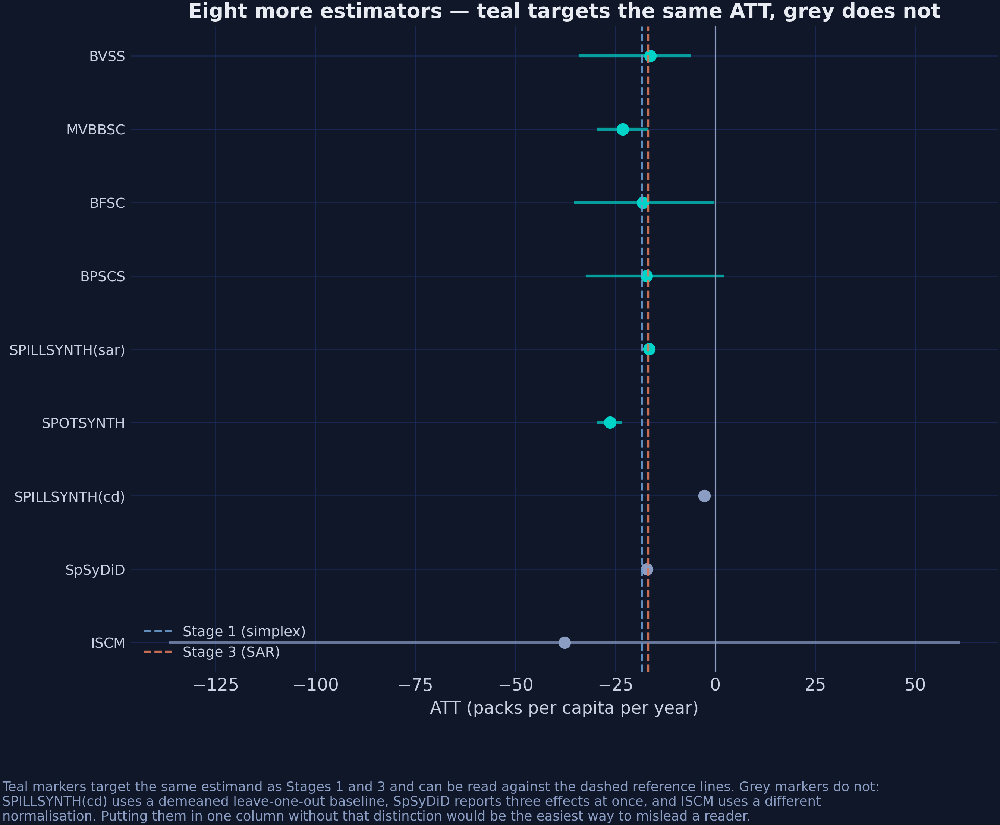

*Figure 16. Teal markers target the same estimand as Stages 1 and 3 and can be read against the dashed reference lines. Grey markers cannot.*

## 14. How long must the chain be?

Section 9.5 used 500,000 iterations to estimate a 13-year effect. That needs justifying, and the justification is not "more is better."

```{python}
# Trimmed for the tutorial; the post runs this to 500,000.
for m in (5_000, 20_000, 50_000, 100_000):
    r = SCSPILL({**panel.config_kwargs(), "m_iter": m, "burn": m // 2,
                 "seed": SEED, "display_graphs": False,
                 "max_effect_draws": 5_000}).fit()
    print(f"{m:>7,}  ATT {r.att:+.4f}  width {r.att_ci[1] - r.att_ci[0]:6.3f}  "
          f"rho {r.rho_hat:.4f}  ESS {r.rho_ess:7.2f}  acc {r.acc_rho:.3f}")
```

| Iterations | ATT | CrI width | $\hat\rho$ | ESS($\rho$) | Acceptance |
|---:|---:|---:|---:|---:|---:|
| 5,000 | −16.668 | 11.82 | 0.3183 | 2.8 | 0.403 |
| 20,000 | −16.926 | 12.52 | 0.3486 | 5.8 | 0.435 |
| 50,000 | −17.005 | 12.77 | 0.3454 | 13.3 | 0.435 |
| 100,000 | −16.896 | 12.42 | 0.3361 | 24.2 | 0.444 |
| 250,000 | −16.846 | 12.63 | 0.3224 | 74.6 | 0.444 |
| **500,000** | **−16.868** | **12.71** | **0.3161** | **136.8** | **0.444** |

Two columns move at completely different rates. **The ATT spans 0.337 packs across the whole ladder** — a hundredfold increase in compute buys a third of a pack, which is nothing next to the 3.17-pack spread across estimators in section 16. **ESS($\rho$) spans 2.8 to 136.8**, and does not cross the conventional floor of 100 until half a million draws.

That is the whole argument for the budget. The estimand you came for converges early; the nuisance parameter that makes the third stage *possible* does not.

It is also worth reading the first row against section 10. At only 5,000 iterations, the corrected configuration already reports an interval 11.82 packs wide — against the R edition's 0.384 at the same budget. **The width was never about the chain length.** It was about propagating $\alpha$.

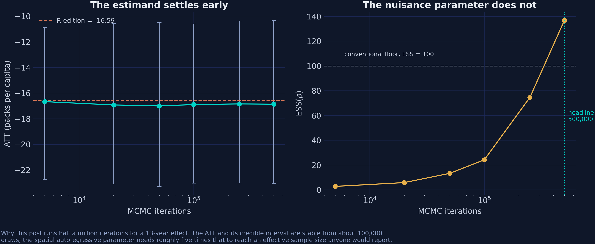

*Figure 17. Teal: the ATT and its credible interval. Gold: the effective sample size for ρ, against the conventional floor of 100.*

Read the last column as a rate rather than a level. From 20,000 iterations onward the table delivers a near-constant **0.00055 effective draws per kept draw** — 5,816 / 10,000, then 13,296 / 25,000, 24,215 / 50,000, 74,598 / 125,000, 136,781 / 250,000. Effective sample size is growing roughly *linearly* in chain length, not tailing off. There is no diminishing-returns cliff here to stop at; there is a fixed, poor exchange rate. At that rate an ESS of 400 costs about 1.5 million iterations, or a few more minutes of sampling. Whether that is a good use of a laptop is the question exercise 4 asks.

## 15. Monte Carlo: does modelling the leak pay?

Everything so far has been one panel where the truth is unknown. `scspill` ships a simulation module, so the same question can be asked where the truth is planted.

```{python}
from scspill.simulate import mc_grid

mc = mc_grid(Ns=(16,), T0s=(20,), T1=10,
             rhos=(-0.6, -0.3, -0.1, 0.0, 0.1, 0.3, 0.6),
             sims_per=60, K=1, beta=(1.0,), sigma2=0.1,
             treated=(0, 1, 2, 3), m_iter=3_000, burn=1_000,
             step_rho=0.05, seed=SEED)

print(mc.round(4).to_string(index=False))
```

A 4×4 rook lattice, 20 pre-periods, 10 post-periods, 60 replications per cell, and a known spillover intensity. Three estimators see each dataset.

| True $\rho$ | Bias: SCM | Bias: BSCM | Bias: SCSPILL | Coverage: BSCM | Coverage: SCSPILL |
|---:|---:|---:|---:|---:|---:|
| −0.6 | −0.085 | −0.136 | −0.0003 | 0.002 | 0.983 |
| −0.3 | −0.088 | −0.071 | −0.0012 | 0.003 | 0.983 |
| −0.1 | −0.008 | −0.026 | −0.0029 | 0.005 | 0.950 |
| 0.0 | +0.007 | −0.000 | +0.0005 | 1.000 | 1.000 |
| +0.1 | +0.015 | +0.029 | −0.0000 | 0.007 | 0.952 |
| +0.3 | +0.079 | +0.098 | −0.0015 | 0.002 | 0.903 |
| +0.6 | +0.239 | +0.288 | +0.0033 | 0.000 | 0.967 |

The bias column behaves exactly as section 9.1's identity predicts. **SCM and BSCM are unbiased at $\rho = 0$ and nowhere else**, and the bias grows with $|\rho|$ in the direction of the spillover — monotonically for BSCM, and monotonically for SCM up to Monte Carlo error. SCSPILL sits within 0.004 of zero at every value, including $\rho = \pm 0.6$.

The coverage column is more striking and needs care in reading. SCSPILL's intervals cover at 0.90–0.98 against a nominal 0.95 — good, though the 0.903 at $\rho = 0.3$ is a real dip. BSCM's cover at **essentially zero everywhere except $\rho = 0$**. That is not because BSCM is broken. Its posterior intervals in this design are far narrower than its own sampling spread. At $\rho = -0.6$ its root-mean-square error across replications is 0.19, of which 0.136 is bias — yet its credible intervals are narrow enough that a bias of that size falls outside them in essentially every replication. The interval is describing the posterior's precision, not the estimator's accuracy, and under a misspecified model those are different things. A narrow interval plus a small bias equals no coverage, which is precisely the failure mode section 10 diagnosed on the real data.

One detail worth noting because it is easy to over-read: at $\rho = 0$ exactly, BSCM's bias and RMSE are both **0.0000** while classical SCM's RMSE is 0.327. With no spillover, the perfect-fit assumption holds exactly and an unconstrained estimator recovers the truth exactly. The simplex still cannot — a third of a unit of error at $\rho = 0$ is the price of the constraint, showing up in simulation just as section 4.2 priced it by hand.

Two honest caveats. Sixty replications per cell gives a Monte Carlo standard error on a coverage of 0.95 of about 0.028, so differences of a percentage point or two are noise; the paper's own design uses 1,000. And `mc_grid`'s inner sampler fixes `adapt_rho=False` to mirror the reference study, so this section cannot demonstrate the adaptation fix from section 10 — it isolates the *modelling* question, not the *sampling* one.

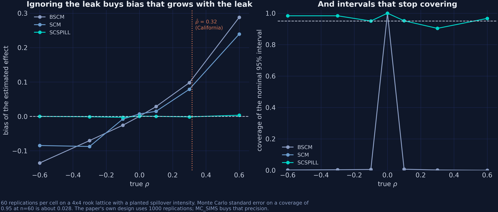

*Figure 18. Left: bias against the planted ρ. Right: coverage of the nominal 95% interval, with the estimated ρ̂ for California marked.*

At the $\rho$ this post estimates for California — 0.316 — the simulation says a SUTVA-imposing estimator carries a bias of around 0.08 to 0.10 in the units of that design. The simulation design is on a different scale, so the two numbers are not convertible — but the direction and the relative size agree: 1.19 packs against an effect of 16.87.

## 16. The whole ladder

Every number above, in one table. The `r_reference` column is the same panel
estimated by the authors' own R and C++ code, and `r_gap` is the honest measure
of how much the implementation choice mattered.

```{python}
print(pd.read_csv(data("att_ladder.csv")).round(4).to_string(index=False))
```

| Stage | Engine | ATT | 95% interval | Active donors | R edition | Gap |
|---|---|---:|---|---:|---:|---:|
| 1. Classical SC | mlsynth | −18.428 | [−22.08, −14.30] | 5 | −18.46 | +0.032 |
| 2a. Bayesian SC (BSCM) | mlsynth | −18.847 | [−26.46, −9.99] | 26 | — | — |
| 2b. Bayesian SC ($\rho = 0$) | scspill | −15.682 | — | 25 | −15.84 | +0.158 |
| 3. Bayesian spatial SC | scspill | −16.868 | [−23.05, −10.33] | 25 | −16.59 | −0.278 |
| 3′. Bayesian spatial SC | mlsynth | −16.525 | [−16.93, −16.18] | — | −16.59 | +0.065 |

Three observations close the argument.

**Every stage agrees on the sign, and the spread is 3.17 packs.** From −18.85 to −15.68 across two libraries, four prior structures and one spatial layer. Proposition 99 reduced per-capita cigarette sales in California by somewhere between 15 and 19 packs a year, and no defensible modelling choice in this post moves it outside that band.

**The maximum disagreement with the R edition is 0.278 packs, across four comparable stages.** Two implementations, two languages, two authors, one of them using hand-written C++ and the other a pip-installable package — agreeing to within about 1.6% on every stage. That is the strongest evidence either edition offers that its estimator is correctly coded.

**The active donor count is the unstable quantity, not the effect.** Five under the simplex, 25–26 under every prior. If your conclusion is "the ATT is about −17", the modelling choices barely matter. If your conclusion is "synthetic California is mostly Utah, Nevada, Montana and Connecticut", it rests entirely on a constraint you chose.


*Figure 19. Point estimates and intervals across the ladder. Hollow diamonds are the R edition's published values.*

## 17. Which estimator should you choose?

Nothing in this post argues that the spatial model is always the right one. It argues that the spatial model answers a question the others cannot, and that you should know which question you are asking before you pick.

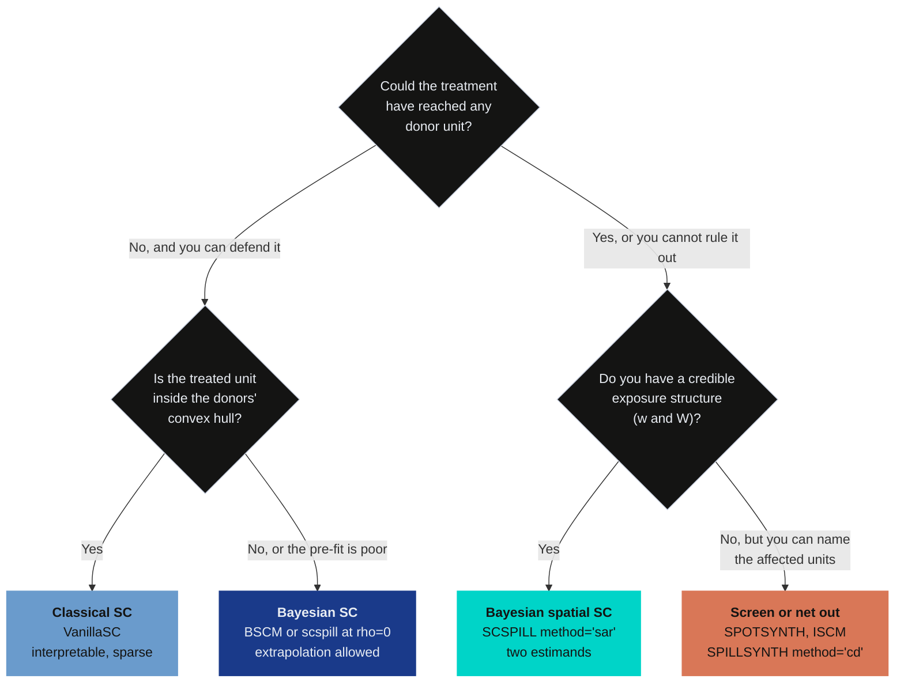

The first question is the one that gets skipped, and it is the only one with no statistical answer. Whether Proposition 99 could plausibly have reached Nevada is a question about cigarettes, borders and advertising, not about panels. The data can tell you how large the leak was *given* that you allowed for one; they cannot tell you to look.

The second question is a diagnostic you already have. A classical fit with a poor pre-treatment RMSE relative to the outcome's scale is telling you the treated unit is hard to reach from inside the hull — exactly the situation section 4.2 constructed. Here the RMSE was 1.60 against a mean of 117.7, so the simplex was not obviously straining.

The third question is the practical constraint. The spatial model needs someone to supply $\mathbf{w}$ and $W$, and those are modelling choices carrying real content. Contiguity is the natural default for a tax, but trade flows, migration or commuting intensity might be better for other policies — the Sudan application shipped with `scspill` uses bilateral trade for exactly that reason.

## 18. Discussion

Section 1 asked how much of the Proposition 99 answer each assumption was carrying. Three answers.

**The effect on California is robust.** Across two libraries, four prior structures, one spatial layer and an independent third implementation, every estimator *on the ladder* reports between −15.7 and −18.8 packs per capita per year, and every interval on the ladder excludes zero. Widening to the six comparable estimators of section 13 stretches the range to −16.3 and −26.3 without ever changing the sign, and only `BPSCS`, whose interval spans [−32.04, +1.80], leaves zero admissible. Proposition 99 worked, and it worked at a magnitude that no reasonable modelling choice moves by more than about 20%. If your interest is the headline number, the classical estimate was fine.

**The composition of the donor pool is not robust at all.** The same data support five active donors or 25, depending entirely on whether sparsity is imposed by a constraint or expressed as a prior. Sentences of the form "synthetic California is mostly Utah, Nevada, Montana and Connecticut" read like findings and are closer to artefacts of $\Delta$. The gap between what is stable (the ATT) and what is not (the weights) is worth internalising, because the weights are the part that gets narrated.

**SUTVA is false here, and the direction is the surprise.** Nevada absorbed a spillover of −5.50 packs per capita per year, an order of magnitude more than any other state, with a credible interval for $\rho$ that excludes zero. The prior expectation was cross-border shopping *raising* Nevada's sales; the estimate says they came in below their no-treatment path. Whatever mechanism dominates — advertising, media, social norms crossing a border that tax arbitrage also crosses — the net effect on Nevada ran the same way as the effect on California, not against it.

That has a consequence for how the policy should be described. Reporting only California's number understates Proposition 99's total public-health footprint, because a neighbouring state that never voted on it also smoked less. It also means the classical estimate was biased *toward zero*: the honest version of "the classical estimate was fine" is "the classical estimate was fine, and slightly conservative, for a reason it could not have told you about."

**What this post does not establish.** The SAR layer does not make anything causal that was not causal before. It is a model of how outcomes co-move across a fixed, researcher-supplied graph, and swapping contiguity for a different graph would produce different spillovers. The identifying assumption in section 9.3 — that some fixed unconstrained combination of donors reproduces California exactly — is strong and untestable. And $\rho$ remains the weakly identified parameter of the model even at half a million draws: an effective sample size of 137 is reportable, not comfortable. The right deliverable from this analysis is the interval together with its ESS, not the point estimate on its own.

## 19. Summary and next steps

- **Method.** Three nested estimators on one panel. The simplex constrains weights to a convex combination; the horseshoe replaces that constraint with a prior that prefers zero without forbidding anything; the SAR layer drops SUTVA on the donor pool and adds a second estimand. Each stage keeps everything the previous one assumed but one thing.
- **Data.** The Abadie–Diamond–Hainmueller Proposition 99 panel, 39 states over 1970–2000, bundled with rook-contiguity weights in which Nevada is California's only donor-pool neighbour. Treatment pinned at 1988 throughout so all three stages share a post-period.
- **Result.** ATT of −18.43 (simplex), −15.68 (horseshoe), −16.87 (spatial), with $\hat\rho = 0.316$ excluding zero and a Nevada spillover of −5.50 packs, 11 times the next-largest donor. Modelling the leak makes the estimated effect *larger*, because the contaminated donor was biased in the same direction as the treated unit.
- **Inferential lesson.** The R edition of this post reported a 95% interval 0.38 packs wide from a chain whose ESS for $\rho$ this post recomputes as 2.93. The corrected run reports 12.71 packs from an ESS of 137. Nothing about the policy changed. Report the effective sample size beside every credible interval, or the interval is decoration.
- **Limitation.** $\rho$ is the slowest-mixing parameter in the model rather than the least identified one. Its posterior is tight — a standard deviation of 0.043 on a support 1.9 wide — but its chain is heavily autocorrelated, because the two-step sampler moves it by random-walk Metropolis conditional on a strongly correlated factor block. Half a million draws buys an ESS of 137. Report that number beside the interval; do not read it as a statement about how much the data know.
- **Next step.** Everything here conditions on a contiguity graph nobody estimated. The natural follow-up is [Bayesian estimation of the spatial weight matrix itself](https://carlos-mendez.org/post/r_estimateW/), which asks the data who the neighbours are rather than assuming a border tells you.

The [R edition of this post](https://carlos-mendez.org/post/r_sc_bayes_spatial/) runs the same three stages with the authors' own R and C++ code, and the [synthetic control ladder in Python](https://carlos-mendez.org/post/python_sc_dsc_sdid/) climbs a different set of stages — difference-in-differences through synthetic difference-in-differences — on the Brexit referendum.

## 20. Exercises

1. **Move the treatment year.** Rebuild `df["treated"]` at 1989 rather than 1988, following the Abadie–Diamond–Hainmueller convention, and rerun all three stages. How much does the ATT move, and is the change larger or smaller than the gap between the simplex and the horseshoe? Explain why one post-treatment year matters as much or as little as it does.

2. **Break the graph on purpose.** Zero out Nevada's entry in `panel.spatial_w` so the model believes no donor borders California, and refit. What happens to $\hat\rho$, to the ATT, and to the spillovers assigned to Idaho and Utah? This is the cleanest way to see how much of section 9's story is carried by a single entry in a single vector.

3. **Change what "neighbour" means.** Replace rook contiguity with an inverse-distance or a $k$-nearest-neighbours weight matrix built from state centroids, row-normalise it, and refit. Does the Nevada result survive? Section 17 argues the choice of $W$ carries real content; this exercise measures how much.

4. **Buy a better $\rho$.** Section 14 shows effective sample size growing almost linearly in chain length, at about 0.00055 effective draws per kept draw. Extrapolate: how many iterations would an ESS of 400 take? Run it, check whether the linear rate actually holds that far out, and decide whether the answer changes anything you would report.

5. **A second case study.** `scspill.data.load_sudan()` ships the other application from the paper — 34 African countries, 2000–2015, South Sudan's 2011 secession, with weights built from bilateral trade rather than borders. Run the same three stages. The trade-based exposure structure is dense where contiguity was sparse, so $\rho$ should be much better identified. Check whether it is.

## 21. References and further reading

1. Abadie, A., Diamond, A. and Hainmueller, J. (2010). Synthetic control methods for comparative case studies: estimating the effect of California's tobacco control program. *Journal of the American Statistical Association*, 105(490), 493–505. [https://doi.org/10.1198/jasa.2009.ap08746](https://doi.org/10.1198/jasa.2009.ap08746)
2. Abadie, A. and Gardeazabal, J. (2003). The economic costs of conflict: a case study of the Basque Country. *American Economic Review*, 93(1), 113–132. [https://doi.org/10.1257/000282803321455188](https://doi.org/10.1257/000282803321455188)
3. Abadie, A. (2021). Using synthetic controls: feasibility, data requirements, and methodological aspects. *Journal of Economic Literature*, 59(2), 391–425. [https://doi.org/10.1257/jel.20191450](https://doi.org/10.1257/jel.20191450)
4. Sakaguchi, S. and Tagawa, H. (2026). Identification and Bayesian inference for synthetic control methods with spillover effects. *The Econometrics Journal*. [https://doi.org/10.1093/ectj/utag006](https://doi.org/10.1093/ectj/utag006). Working paper: [arXiv:2408.00291](https://arxiv.org/abs/2408.00291). Replication package: [Zenodo 10.5281/zenodo.19066186](https://doi.org/10.5281/zenodo.19066186)
5. Carvalho, C. M., Polson, N. G. and Scott, J. G. (2010). The horseshoe estimator for sparse signals. *Biometrika*, 97(2), 465–480. [https://doi.org/10.1093/biomet/asq017](https://doi.org/10.1093/biomet/asq017)
6. Makalic, E. and Schmidt, D. F. (2015). A simple sampler for the horseshoe estimator. *IEEE Signal Processing Letters*, 23(1), 179–182. [https://doi.org/10.1109/LSP.2015.2503725](https://doi.org/10.1109/LSP.2015.2503725)
7. Kim, S., Lee, C. and Gupta, S. (2020). Bayesian synthetic control methods. *Journal of Marketing Research*, 57(5), 831–852. [https://doi.org/10.1177/0022243720936230](https://doi.org/10.1177/0022243720936230)
8. LeSage, J. and Pace, R. K. (2009). *Introduction to Spatial Econometrics*. Chapman and Hall/CRC. [https://doi.org/10.1201/9781420064254](https://doi.org/10.1201/9781420064254)
9. Geweke, J. (2004). Getting it right: joint distribution tests of posterior simulators. *Journal of the American Statistical Association*, 99(467), 799–804. [https://doi.org/10.1198/016214504000001132](https://doi.org/10.1198/016214504000001132)
10. Robbins, H. and Monro, S. (1951). A stochastic approximation method. *The Annals of Mathematical Statistics*, 22(3), 400–407. [https://doi.org/10.1214/aoms/1177729586](https://doi.org/10.1214/aoms/1177729586)
11. Roberts, G. O., Gelman, A. and Gilks, W. R. (1997). Weak convergence and optimal scaling of random walk Metropolis algorithms. *The Annals of Applied Probability*, 7(1), 110–120. [https://doi.org/10.1214/aoap/1034625254](https://doi.org/10.1214/aoap/1034625254)
12. Carter, C. K. and Kohn, R. (1994). On Gibbs sampling for state space models. *Biometrika*, 81(3), 541–553. [https://doi.org/10.1093/biomet/81.3.541](https://doi.org/10.1093/biomet/81.3.541)
13. Vehtari, A., Gelman, A., Simpson, D., Carpenter, B. and Bürkner, P.-C. (2021). Rank-normalization, folding, and localization: an improved $\widehat{R}$ for assessing convergence of MCMC. *Bayesian Analysis*, 16(2), 667–718. [https://doi.org/10.1214/20-BA1221](https://doi.org/10.1214/20-BA1221)
14. Cao, J. and Dowd, C. (2019). Estimation and inference for synthetic control methods with spillover effects. [arXiv:1902.07343](https://arxiv.org/abs/1902.07343)
15. Di Stefano, R. and Mellace, G. (2024). The inclusive synthetic control method. [arXiv:2403.17624](https://arxiv.org/abs/2403.17624)
16. Grossi, G., Mariani, M., Mattei, A., Lattarulo, P. and Öner, Ö. (2025). Direct and spillover effects of a new tramway line on the commercial vitality of peripheral streets. *Journal of the Royal Statistical Society Series A*, 188(1), 223–240. [https://doi.org/10.1093/jrsssa/qnae052](https://doi.org/10.1093/jrsssa/qnae052)
17. Arkhangelsky, D., Athey, S., Hirshberg, D. A., Imbens, G. W. and Wager, S. (2021). Synthetic difference-in-differences. *American Economic Review*, 111(12), 4088–4118. [https://doi.org/10.1257/aer.20190159](https://doi.org/10.1257/aer.20190159)
18. Mendez, C. (2026). `scspill`: synthetic control models with spillover effects. Python package version 0.2.1. [https://quarcs-lab.github.io/scspill/](https://quarcs-lab.github.io/scspill/)
19. Greathouse, J. (2026). `mlsynth`: a Python library for synthetic control and related methods. [https://mlsynth.readthedocs.io/](https://mlsynth.readthedocs.io/)
20. Cunningham, S. (2021). *Causal Inference: The Mixtape*. Yale University Press. [https://mixtape.scunning.com/](https://mixtape.scunning.com/)
21. Mendez, C. (2026). Bayesian spatial synthetic control: California's Proposition 99 in R. [https://carlos-mendez.org/post/r_sc_bayes_spatial/](https://carlos-mendez.org/post/r_sc_bayes_spatial/)

### Acknowledgements

This tutorial was prepared with the assistance of AI tools for code generation, drafting and editing. All analytical choices, interpretations and any remaining errors are the author's own.
