# Two Assumptions {.divider background-color="#d97757"}

[Act I]{.act}

## The most replicated result in causal inference rests on two untested assumptions

::: {.notes}
The point of opening this way is that everybody knows the Prop 99 result and almost nobody states these two assumptions out loud. Naming them as assumptions rather than as machinery is the whole setup.
:::

California's Proposition 99, 1988. A 25-cent cigarette tax. The canonical synthetic control study.

. . .

**One.** The donor weights must be non-negative and sum to one — the *simplex*.

. . .

**Two.** No donor state absorbed any part of the treatment — *SUTVA*.

. . .

Neither is a fact about the world. Both are modelling choices, and both are testable.

[This deck relaxes both. The effect survives. The claim that the donor pool was clean does not.]{.takeaway .fragment}

## Thirty-nine states, thirty-one years, and one line that leaves the pack

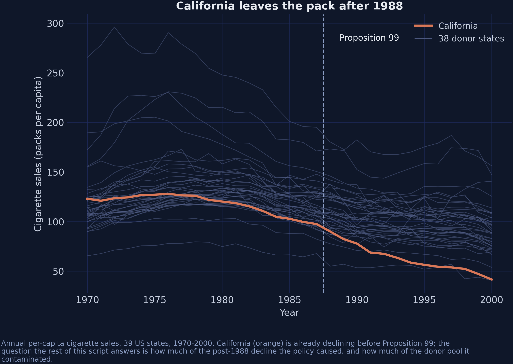{fig-alt="California's per-capita cigarette sales against all 38 donor states, 1970-2000, with a vertical rule at the 1988 treatment year." fig-align="center"}

[39 states · 1,209 rows · 18 pre-treatment years · 38 donors]{.takeaway .fragment}

::: {.notes}
California is already falling faster than the pack before the dashed line. That is why difference-in-differences fails here and why synthetic control exists at all.
:::

## Nevada is California's only neighbour inside the donor pool

Oregon and Arizona border California too — but both ran their own tobacco programmes, so **neither is in the donor pool.**

. . .

Eleven states are excluded altogether: AK, AZ, FL, HI, MD, MA, MI, NJ, NY, OR, WA.

. . .

The result: **exactly one leak channel**, and we can name it.

[`spatial_w` has one non-zero entry. That is the whole spatial story, and it is why $\rho$ is hard to pin down.]{.takeaway .fragment}

## The simplex and SUTVA, written down

$$\widehat{\alpha} = \arg\min_{\alpha \in \Delta} \sum_{t \le T_0}\Big(Y_{1t} - \alpha^{\top}\mathbf{Y}^{c}_{t}\Big)^2,
\qquad \Delta = \Big\{\alpha : \alpha_j \ge 0,\ \textstyle\sum_j \alpha_j = 1\Big\}$$

. . .

$$\text{SUTVA:} \qquad Y_{jt}(\mathbf{D}) = Y_{jt}(D_j) \quad \text{for every donor } j$$

[Relax the first and the donor pool changes. Relax the second and the counterfactual changes.]{.takeaway .fragment}

## Python can now do all three stages without leaving one language

::: {.notes}
mlsynth's PyPI release lags main at the same version string, which is why it gets a commit pin rather than a version pin.
:::

``` {.python}
pip install "scspill[numba]==0.2.1"
pip install "mlsynth[bayes] @ git+https://github.com/jgreathouse9/mlsynth.git@15f168bb"
```

. . .

**`mlsynth`** — 46 synthetic-control estimators behind one config dictionary.

**`scspill`** — the Bayesian spatial spillover model of Sakaguchi & Tagawa (2026), which returns *two* estimands.

[Both are young. Both are pinned — one to a release, one to a commit.]{.takeaway .fragment}

## Where we're going

::: {.incremental}
- **Stage 1** — the simplex, as Abadie wrote it
- **Stage 2** — the simplex replaced by a prior
- **Stage 3** — SUTVA dropped, and a second estimand appears
- **Reconcile** — why the R edition of this analysis reports a different interval
- **Diagnose** — what an effective sample size of 3 actually means
:::

# Three Stages on One Panel {.divider background-color="#6a9bcc"}

[Act II]{.act}

## Each stage drops exactly one restriction from the stage before

::: {.notes}
Stress that this is one regression, not three models. Stage 1 constrains alpha to the
simplex. Stage 2 replaces that hard constraint with a prior — same alpha, weaker claim.
Stage 3 keeps the prior and instead drops the assumption that the donors are clean. So
when a number moves between stages, we know exactly which restriction moved it. That is
the whole design of the talk.
:::

**Stage 1** — hard constraint: $\qquad \alpha \in \Delta$

. . .

**Stage 2** — soft prior: $\qquad \alpha_j \mid \lambda_j \sim \mathcal{N}(0, \lambda_j^2), \quad \lambda_j \mid \tau \sim \mathcal{C}^{+}(0,\tau)$

. . .

**Stage 3** — same $\alpha$, but the donors are no longer clean:

$$\mathbf{Y}^{c}_{t} = \rho\big(\mathbf{w}\,Y_{1t} + W\mathbf{Y}^{c}_{t}\big) + X_t\beta + \mathbf{u}_t$$

[One regression, not three models. When a number moves, we know which restriction moved it.]{.takeaway .fragment}

## Stage 1 — the simplex picks five donors and stops

::: {.notes}
Note Nevada is already in the blend, carrying a quarter of the counterfactual. The one state we have reason to suspect.
:::

``` {.python code-line-numbers="1-2|4"}
common = dict(df=df, outcome="cigsale", treat="treated",
              unitid="state", time="year", display_graphs=False)

sc = mlsynth.VanillaSC(dict(common)).fit()
```

. . .

| | |
|---|---:|
| ATT | **−18.43** |
| pre-treatment RMSE | 1.60 |
| active donors | 5 of 38 |
| top-4 share of weight | 98.6% |

[Utah 0.343 · Montana 0.254 · **Nevada 0.242** · Connecticut 0.146]{.takeaway .fragment}

## California and its synthetic are indistinguishable until 1988

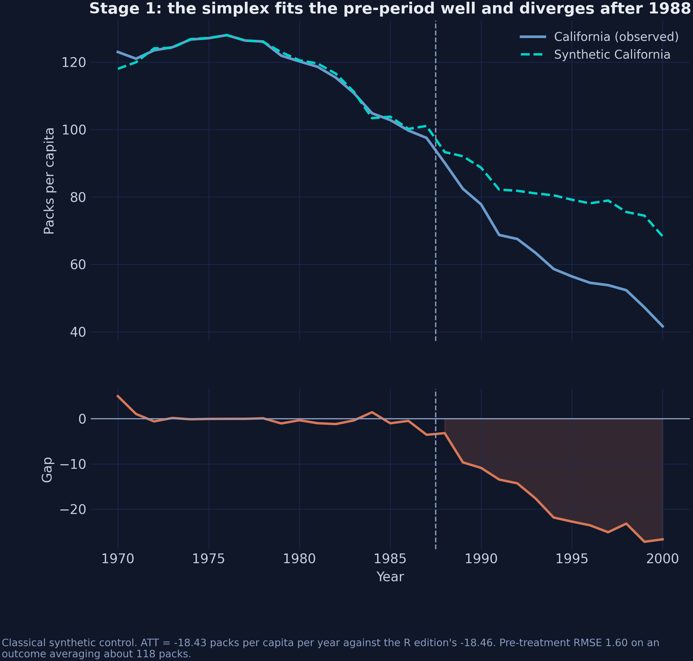{fig-alt="Top: California against its classical synthetic control. Bottom: the gap between them, near zero before 1988 and widening to −26.7 packs by 2000." fig-align="center"}

[Reproduces the R edition's −18.46 to within 0.04 packs, from a different package and a different optimiser.]{.takeaway .fragment}

## Thirty-three donors get exactly zero

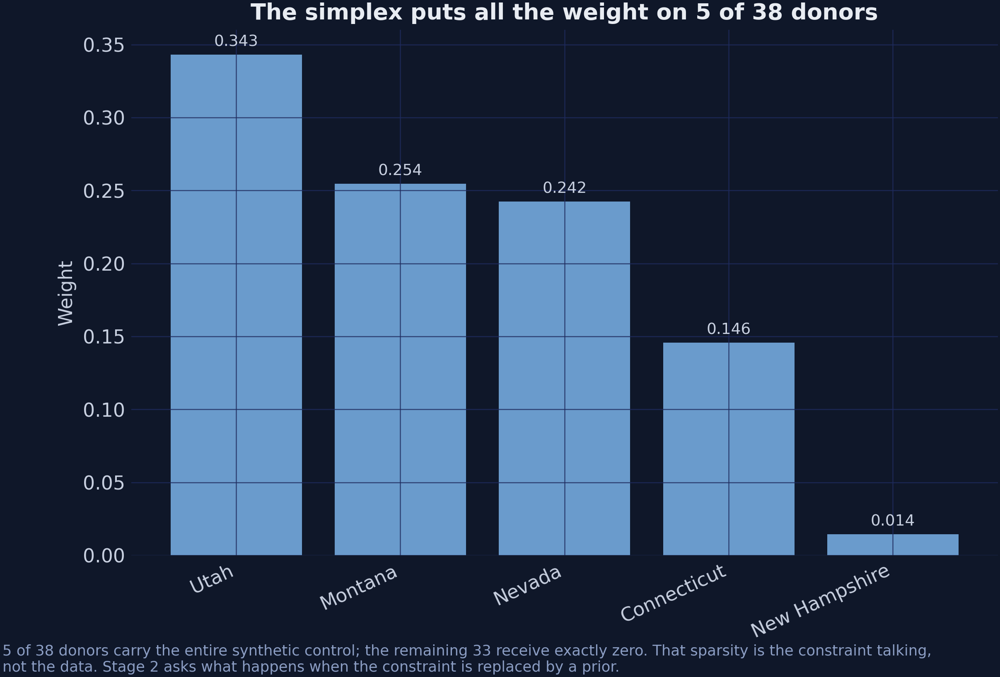{fig-alt="Simplex donor weights: Utah 0.34, Montana 0.25, Nevada 0.24, Connecticut 0.15, New Hampshire 0.01, and exactly zero for the other 33 states." fig-align="center"}

[Is that sparsity in the data, or sparsity in the constraint? From the outside they look identical.]{.takeaway .fragment}

## The horseshoe makes zero the default without making it compulsory

$$\alpha_j \mid \lambda_j \sim \mathcal{N}\big(0, \lambda_j^2\big), \qquad
\lambda_j \mid \tau \sim \mathcal{C}^{+}(0, \tau), \qquad
\tau \sim \mathcal{C}^{+}(0, \sigma)$$

. . .

Infinite spike at zero. Cauchy tails. Most $\lambda_j$ come out tiny; any single one can escape.

. . .

Sampling is closed-form via the Makalic–Schmidt inverse-gamma representation — an **exact** reparameterisation, not an approximation.

[That is why both libraries run hundreds of thousands of iterations in seconds rather than hours.]{.takeaway .fragment}

## Relax the simplex and the active donor pool multiplies by five

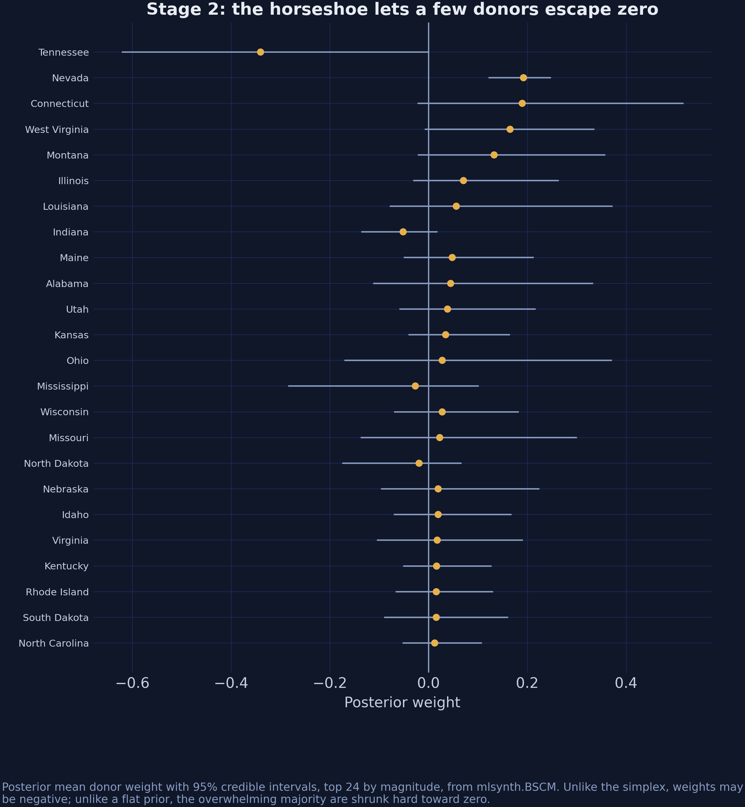{fig-alt="Posterior donor weights from mlsynth.BSCM with 95% credible intervals, the 24 largest by magnitude; 26 of the 38 donors exceed 0.01 in absolute value, and only Nevada's interval clears zero." fig-align="center"}

[5 → 26 active donors. Almost every credible interval straddles zero.]{.takeaway .fragment}

## Two Bayesian synthetic controls, one intercept apart {.smaller}

::: {.notes}
This is the slide people push back on. Both are horseshoe synthetic controls, and they
land three packs apart. The reason is the intercept: BSCM fits beta-zero at 16.86 and its
weights sum to 0.758, so its blend sits about 100 packs against California's 118 and the
intercept lifts it back. scspill has no intercept and standardises first. The tiebreaker
is external — scspill's rho-equals-zero case lands within 0.16 packs of the R edition,
produced by entirely separate C++ code. Do not average them.
:::

| Estimator | ATT | Intercept | Weights sum |
|---|---:|---:|---:|
| `mlsynth.BSCM` | −18.85 | [16.86]{.key} | 0.758 |
| `scspill` at $\rho = 0$ | −15.68 | 0 | 0.885 |
| R edition, Stage 2 | −15.84 | 0 | — |

. . .

$$\text{BSCM:}\ \ Y_{1t} = \beta_0 + \sum_j \alpha_j Y_{jt} + \varepsilon_t
\qquad
\text{scspill:}\ \ Y_{1t} = \sum_j \alpha_j Y_{jt} + \varepsilon_t$$

[When two packages disagree about a model they both implement, check the equation before you check the sampler.]{.takeaway .fragment}

## Four counterfactual Californias

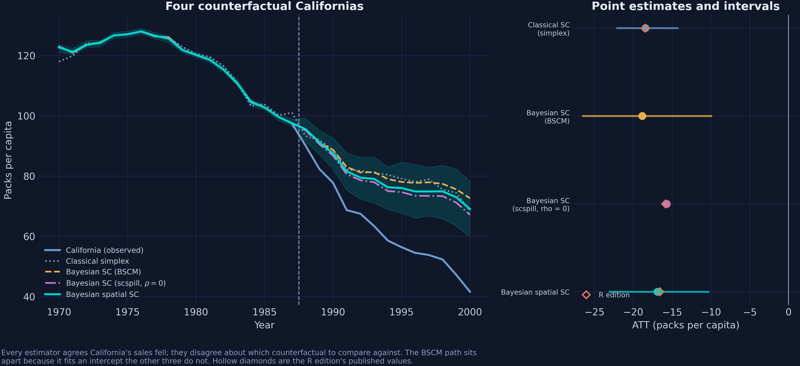{fig-alt="Four counterfactual paths for California and their ATTs, showing the BSCM path sitting apart from the other three because it fits an explicit intercept." fig-align="center"}

[Hollow diamonds are the R edition's published values.]{.takeaway .fragment}

## Drop SUTVA and the bias has a closed form

$$Y_{1t} - \sum_j \alpha_j Y_{jt} \;=\; \underbrace{\xi_{0t}}_{\text{what we want}}
\;-\; \underbrace{\sum_j \alpha_j \xi^{c}_{jt}}_{\text{what we get for free}}$$

. . .

The bias is a **product** of two things: how much weight a donor carries, and how contaminated it is.

[A filthy donor with zero weight is harmless. A slightly dirty one carrying half the counterfactual is not.]{.takeaway .fragment}

## The identifying assumption that replaces the simplex

::: {.notes}
Say plainly what has been traded. The simplex is gone, and something has taken its
place: the assumption that some fixed alpha reproduces California's untreated path
exactly, in every pre-period. It is not weaker in some absolute sense — it is untestable
in a way the simplex is not, because the simplex's price shows up as pre-treatment RMSE
and this one does not show up anywhere.
:::

$$\exists\, \alpha \in \mathbb{R}^{N} \;:\; Y_{1t}(\mathbf{0}) = \sum_j \alpha_j Y_{jt}(\mathbf{0}) \quad \forall t$$

. . .

With $A = W + \mathbf{w}\alpha^{\top}$, the donors' untreated path solves in closed form:

$$\mathbf{Y}^{c}_{t}(\mathbf{0}) = \big(I - \rho A\big)^{-1}\Big[\big(I - \rho W\big)\mathbf{Y}^{c}_{t} - \rho\,\mathbf{w}\,Y_{1t}\Big]$$

. . .

$$\xi_{0t} = Y_{1t} - \alpha^{\top}\mathbf{Y}^{c}_{t}(\mathbf{0}),
\qquad \boldsymbol{\xi}^{c}_{t} = \mathbf{Y}^{c}_{t} - \mathbf{Y}^{c}_{t}(\mathbf{0})$$

[No $\beta$. No factors. No error variances. They **cancel**.]{.takeaway .fragment}

## That cancellation is what makes the model usable

::: {.notes}
This is the technical heart of the talk. Substituting the treated unit's equation into
the donor system eliminates beta, the latent factors and the error variances — they all
cancel. What is left depends only on alpha, rho, w, W and observed outcomes. That is why
a weakly-mixing nuisance block does not poison the answer: there is nowhere for it to
enter. It also localises the whole identification problem onto one scalar, which is what
Act III is about.
:::

The effects depend on $(\alpha, \rho, \mathbf{w}, W)$ and the observed data. **Nothing else.**

. . .

A model this rich has many weakly identified parameters. If the effects depended on all of them, that weakness would poison everything.

. . .

Instead it is confined to one scalar — $\rho$ — where we can see it, measure it, and report it.

[Weak identification you can locate is a manageable problem. Weak identification spread across a nuisance block is not.]{.takeaway .fragment}

## One call runs both samplers and post-processes the spillovers

``` {.python code-line-numbers="1-6|8-11"}
result = SCSPILL({
    **panel.config_kwargs(),
    "m_iter": 500_000,
    "burn": 250_000,
    "seed": 20251022,
}).fit()

result.att                      # −16.87
result.effects_detail.att_scm   # −15.68, the ρ = 0 comparator, free
result.rho_hat                  # 0.316
result.spillover_panel          # 31 × 38: who else was treated
```

[Stage 2 comes out of the Stage-3 fit at no extra cost. The model *is* nested.]{.takeaway .fragment}

## The spatial parameter is clearly above zero {background-color="#141413"}

[0.316]{.bignum}

[$\widehat{\rho}$, 95% CrI [0.231, 0.403]. The interval excludes zero. The data reject $\rho = 0$ — and with it, SUTVA on the donor pool.]{.bignum-label}


::: {.notes}
The interval excludes zero, so the data reject the restriction that would collapse
Stage 3 back to Stage 2. That is the SUTVA test, and it is a test the model nests rather
than one bolted on afterwards. Resist reading precision into this number — the next slide
is about exactly how much that interval is worth.
:::

## The two parameters leaning on one contiguity channel are the hard ones {.smaller}

::: {.notes}
Read the ESS column top to bottom. Sigma-squared has 204,000, the donor weights 10,000
to 26,000, rho has 137 and the price coefficient 388. Same chain. The point is not that
the software is bad — it is that rho is the only parameter drawn by random-walk Metropolis
rather than from a closed-form conditional, so its draws are heavily autocorrelated. Its
posterior is actually tight: standard deviation 0.043 on a support 1.9 wide. Slow mixing
is not the same thing as weak identification, and the distinction matters for what you
tell a referee.
:::

| Parameter | ESS (from 250,000 draws) |
|---|---:|
| $\sigma^2$ | 204,095 |
| $\alpha$ (donor weights) | 10,000 – 26,000 |
| $\beta$ (retail price) | 388 |
| **$\rho$** | [137]{.key} |

. . .

$\rho$ is the only parameter drawn by random-walk Metropolis rather than from a closed-form conditional, so consecutive draws are heavily correlated. The posterior itself is tight — SD 0.043 on a support 1.9 wide.

[Slow mixing is not weak identification, and neither is a defect in the software.]{.takeaway .fragment}

## What the library draws for you

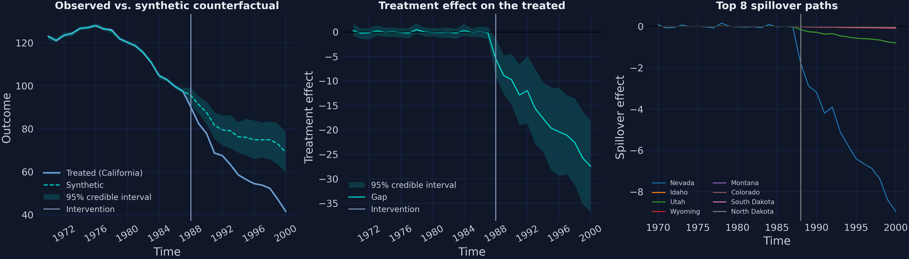{fig-alt="The scspill package's own three-panel summary of the spatial fit: observed against counterfactual, the treatment effect on the treated, and the top eight spillover paths." fig-align="center"}

[`result.plot(kind="panel")` — observed vs counterfactual, the effect path, and the eight largest spillovers.]{.takeaway .fragment}

## Almost the entire spillover lands on one state

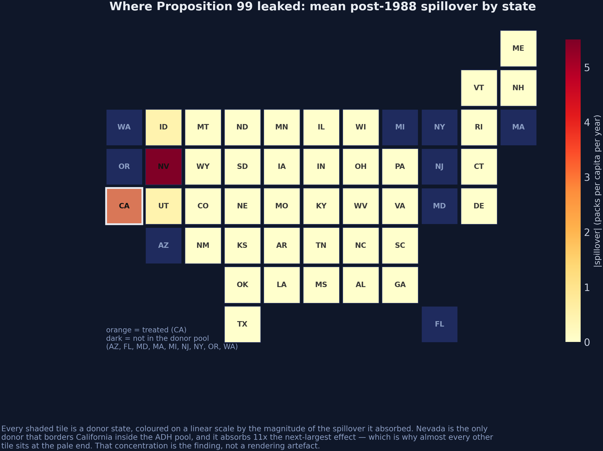{fig-alt="A tile cartogram of the United States shaded by estimated spillover; Nevada is far darker than every other state and the field is otherwise pale." fig-align="center"}

[Linear colour scale. The concentration is the finding, not a rendering artefact.]{.takeaway .fragment}

## Nevada absorbs eleven times the next-largest donor

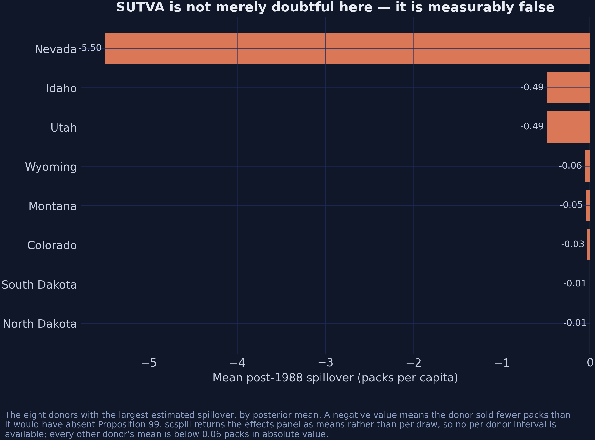{fig-alt="Horizontal bars for the eight largest spillovers: Nevada at −5.50 packs, then Idaho and Utah near −0.49, then a steep drop to near zero." fig-align="center"}

[Nevada −5.50 · Idaho −0.49 · Utah −0.49 · everything else is noise.]{.takeaway .fragment}

## The leak runs the *opposite* way to the obvious hypothesis {background-color="#141413"}

[−5.50]{.bignum}

[Nevada's sales came in **below** its no-treatment path. Not cheap cigarettes crossing the border — the anti-smoking campaign crossing the same border.]{.bignum-label}

## Which means the classical estimate was biased *toward zero* {.smaller}

::: {.notes}
This inverts the intuition most audiences arrive with. The prior expectation is
cross-border shopping raising Nevada's sales, which would inflate the estimate. The
estimate says Nevada's sales fell. Negative spillover on a positively-weighted donor drags
synthetic California down, so the classical comparison gives the policy less credit than
it deserves. On the horseshoe weights that is 1.19 packs; on the simplex weights, where
Nevada carries 0.242 instead of 0.200, it is 1.51. The classical estimate is the more
contaminated of the two.
:::

| Donor | $\alpha_j$ | $\xi^{c}_j$ | $\alpha_j \xi^{c}_j$ |
|---|---:|---:|---:|
| Nevada | 0.200 | −5.50 | [−1.098]{.key} |
| Utah | 0.036 | −0.49 | −0.018 |
| Idaho | 0.012 | −0.49 | −0.006 |
| **Sum (all 38 donors)** | | | **−1.130** |

. . .

Purged minus contaminated: **−1.186**. The identity holds to 0.06 packs — the plug-in decomposition uses $\widehat{\alpha}$ alone, the purged ATT averages over paired $(\alpha, \rho)$ draws.

[Negative spillovers on positively-weighted donors push the estimate toward zero. Modelling the leak makes the effect **larger**.]{.takeaway .fragment}

# Does the Interval Mean Anything? {.divider background-color="#00d4c8"}

[Act III]{.act}

## The R edition of this analysis reports the same effect and a very different interval {.smaller}

| | ATT | 95% CrI | Width |
|---|---:|---|---:|
| R edition (published) | −16.59 | [−16.78, −16.39] | [0.384]{.key} |
| This post, corrected | −16.87 | [−23.05, −10.33] | [12.713]{.key} |

. . .

A factor of **33**. "Different language" does not explain that.

[`scspill` documents six departures from the authors' R code. Three have escape hatches — so put the Python back into the R specification and look.]{.takeaway .fragment}

## Reproducing the R specification reproduces its pathology exactly {.smaller}

``` {.python code-line-numbers="1|2|3"}
beta_prior="ridge"        # departure 2
propagate_alpha=False     # departure 3
adapt_rho=False           # departure 4
```

| Quantity | R edition | scspill, R spec | Difference |
|---|---:|---:|---:|
| ATT | −16.590 | −16.286 | 0.304 |
| $\widehat{\rho}$ | 0.2226 | 0.2282 | 0.0056 |
| ESS($\rho$) | 2.93 | 3.27 | 0.34 |
| Nevada spillover | −3.750 | −3.778 | 0.028 |

[Independent code, different language, reproducing $\widehat{\rho}$ to within 0.006 — **including an effective sample size of 3**.]{.takeaway .fragment}

## Chain length was never the problem {.smaller}

| Specification | Iterations | Width | ESS($\rho$) |
|---|---:|---:|---:|
| scspill, R spec | 5,000 | 0.482 | 3.3 |
| scspill, R spec | 500,000 | [0.702]{.key} | 66.9 |
| scspill, corrected | 500,000 | [12.713]{.key} | 136.8 |

. . .

A hundred times the iterations widens the interval by 45%. Propagating $\alpha$ widens it by **1,700%**.

[Two different failures, and they need to be told apart.]{.takeaway .fragment}

## ESS and completeness are different questions

::: {.notes}
Two separable failures, and the published interval failed both. ESS asks: is the
interval reliable — did the chain actually explore the posterior? At an ESS of 3, no.
propagate_alpha asks a different question: is the interval complete — does it carry
uncertainty about which states make up synthetic California? With alpha pinned at its
posterior mean, no. Running the R specification a hundred times longer fixes the first and
moves the width only from 0.48 to 0.70. The other factor of eighteen is the second.
:::

**Effective sample size** asks whether the interval is *reliable* — did the chain visit enough of the posterior for its quantiles to mean anything? At ESS 3, no.

. . .

**`propagate_alpha`** asks whether the interval is *complete* — does it account for everything the model is uncertain about? With $\alpha$ pinned at its posterior mean, no.

. . .

The published interval failed **both**.

[Report the effective sample size beside every credible interval, or the interval is decoration.]{.takeaway .fragment}

## One tuning constant, three specifications

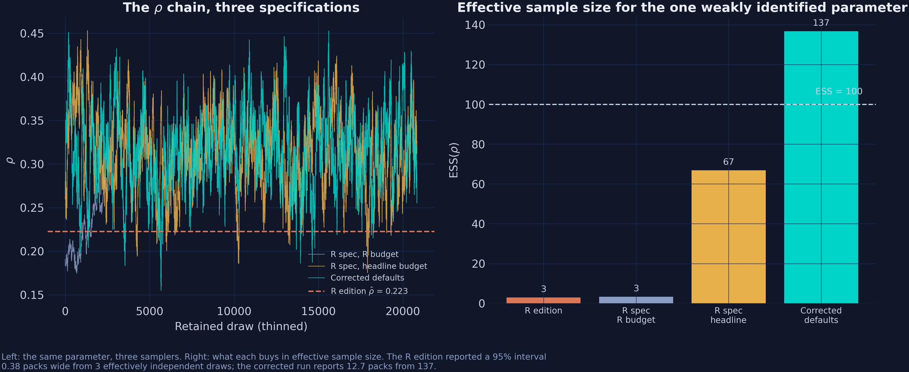{fig-alt="Left: the rho chain under three specifications. Right: effective sample size for rho as a bar chart — 3 for the R edition, 3 at the R specification, 67 at the headline budget, 137 with corrected defaults." fig-align="center"}

[Adaptation lands acceptance at 0.444 against a 0.44 target, and ESS at 137.]{.takeaway .fragment}

## A memory layout was doing part of the modelling

Departure 1: the covariate array was indexed as $(N, T, K)$ when it was laid out as $(T, N, K)$.

. . .

Nothing crashes. Nothing looks wrong. Each state's price is silently matched to another state's sales.

. . .

It is also the one departure with **no escape hatch worth using**: dropping the covariates entirely is the only way to sidestep it, and that trades one specification error for another.

[The most dangerous bugs are the ones that return plausible numbers.]{.takeaway .fragment}

## Two departures were found by a test, not by inspection

::: {.notes}
Neither departure 5 nor 6 changes the California answer much. Both mean the R sampler was not converging to any posterior at all.
:::

Draw parameters from the prior, simulate data → the *marginal-conditional* joint distribution.

Simulate data, then run one Gibbs sweep, repeatedly → the *successive-conditional* joint distribution.

. . .

If every conditional is correct, these are the **same distribution**. Any statistic's mean must agree.

[That is how an $\omega_k$ conditional treating $\omega$ as a variance, while its neighbours treated it as a precision, came to light.]{.takeaway .fragment}

## Artefacts shrink; errors do not

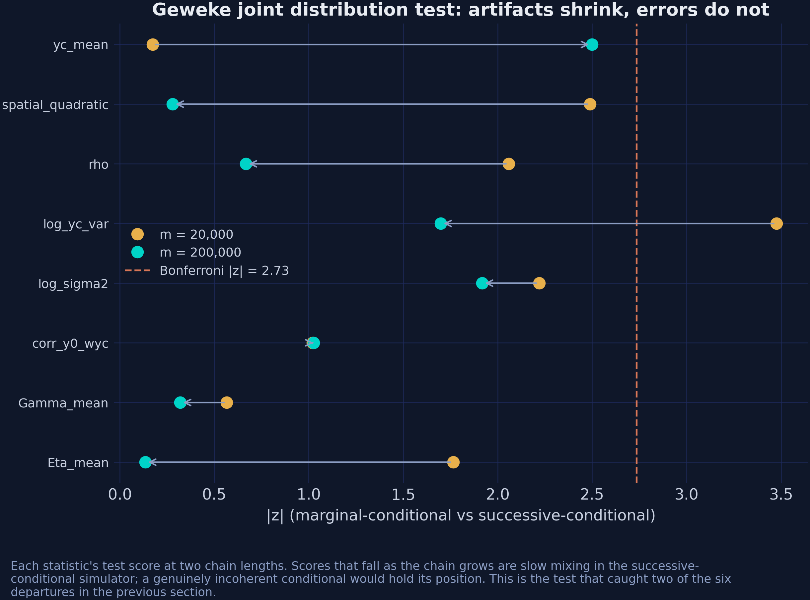{fig-alt="Geweke joint-distribution test z-scores at two chain lengths, with the maximum falling from 3.48 to 2.50 as the chain grows tenfold." fig-align="center"}

[max $|z|$ falls 3.48 → 2.50 and rejections go 1 → 0 as the chain grows tenfold. That is slow mixing, not an incoherent conditional.]{.takeaway .fragment}

## The only prior that moves the answer is the one nobody calls a prior

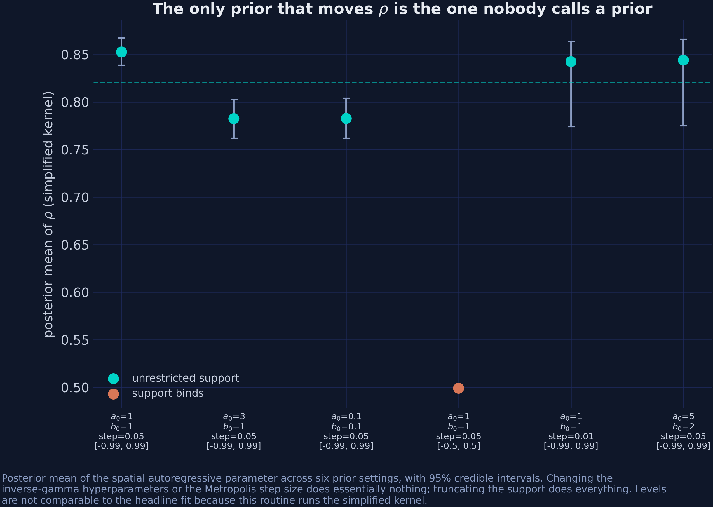{fig-alt="Posterior mean and interval for rho across six prior configurations, flat except for the row where the support is truncated to plus or minus 0.5." fig-align="center"}

::: {.notes}
Flag this before anyone reads the level off the axis. `prior_sensitivity` runs the
*simplified* Step-2 kernel, not the production one, so the rho it reports here sits
near 0.8 and must not be compared with the headline 0.316. What is comparable is the
*shape*: the answer is flat across the inverse-gamma hyperparameters and across the
step size, and moves only when the support itself is truncated to plus or minus 0.5.
That is the finding — the support constraint is a prior too, and it is the one nobody
reports.
:::

[Sweeping $a_0$, $b_0$ and the step size moves $\rho$ by 0.07. Truncating the **support** moves it by 0.32.]{.takeaway .fragment}

## The strongest objection — and the answer

[**Objection.** The SAR layer does not make anything causal that was not causal before. You supplied the graph; a different graph gives different spillovers.]{.objection}

. . .

[**Response.** Correct, and the post says so. But the alternative is not "no assumption" — it is $\rho = 0$, imposed silently and never reported. Making the assumption a parameter is what lets the data reject it.]{.rebuttal}

[The choice is not between assuming and not assuming. It is between an assumption you can test and one you cannot.]{.takeaway .fragment}

## Every estimator targeting this ATT agrees on the sign and the scale

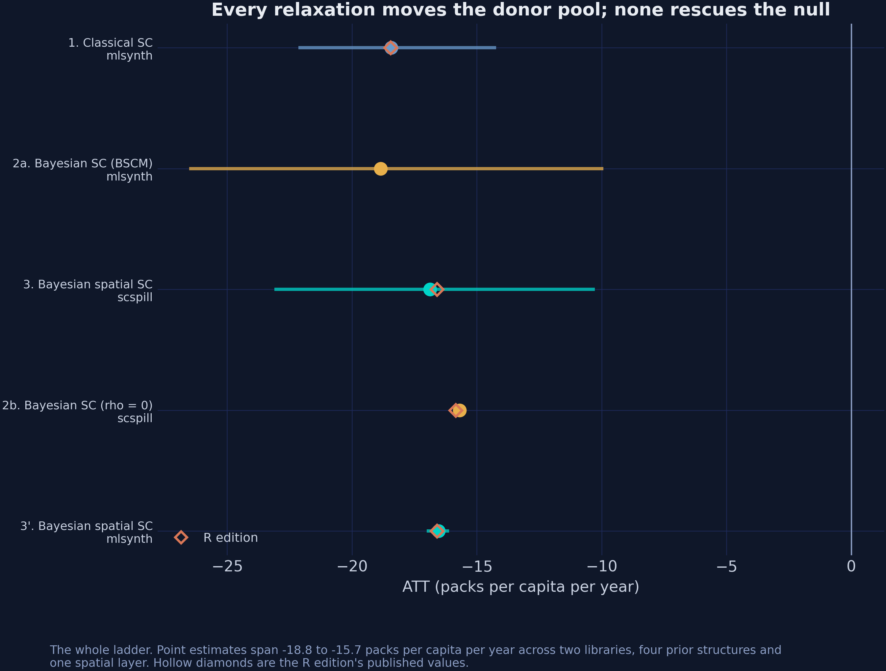{fig-alt="Point estimates and credible intervals for every stage of the ladder, with hollow diamonds marking the R edition's published values." fig-align="center"}

[Two libraries, four prior structures, one spatial layer, one independent third implementation.]{.takeaway .fragment}

## What Proposition 99 cost, and who else paid {background-color="#141413"}

[−16.87]{.bignum}

[packs per capita per year for California — and −5.50 for a state that never voted on it]{.bignum-label}

## What to take away

1. **The effect is robust.** Every relaxation lands between −15.7 and −18.8 packs.
2. **The donor pool is not.** The same data support 5 active donors or 25–26, depending entirely on whether sparsity is a constraint or a prior.
3. **SUTVA is false here** — and the correction is only 1.19 packs for California (1.51 on the simplex weights). It is 5.50 for Nevada.
4. **The interval was the real error**, not the point estimate. Two distinct failures, one diagnosable by ESS and one by asking what the interval is conditioning on.


::: {.notes}
Land these four and stop. The effect is robust and the classical estimate was fine for
the headline number. The donor pool composition is not robust at all, and sentences of the
form 'synthetic California is mostly Utah and Nevada' are closer to artefacts than
findings. SUTVA is false here, but the correction is modest for California and large for
Nevada — which is a different question, and the one classical synthetic control could not
ask. And the interval, not the point estimate, was where the real error lived.
:::

## Materials {.smaller}

- **Full tutorial** — carlos-mendez.org/post/python_sc_bayes_spatial
- **R edition** — carlos-mendez.org/post/r_sc_bayes_spatial
- **Run it** — Colab notebook, or the Quarto bundle with a hermetic `.venv`
- **Web app** — interactive $\rho$ slider, donor comparator, trace diagnostics
- **Data dictionary** — the panel and both spatial objects

``` {.python}
pip install "scspill[numba]==0.2.1"
pip install "mlsynth[bayes] @ git+https://github.com/jgreathouse9/mlsynth.git@15f168bb"
```

# Let the data choose the donors, let the map tell you who else was treated, and let the effective sample size tell you whether the interval means anything. {.divider background-color="#1a3a8a"}
