---
authors:
  - admin
categories:
  - Python
  - Causal Inference
  - Synthetic Control
date: "2026-05-15T00:00:00Z"
draft: false
featured: false
external_link: ""
image:
  caption: ""
  focal_point: Smart
  placement: 3
links:
  - icon: code
    icon_pack: fas
    name: "Python script"
    url: script.py
  - icon: file-code
    icon_pack: fas
    name: "Quarto project (.zip)"
    url: python_sc_co2tax.zip
  - icon: book
    icon_pack: fas
    name: "Jupyter notebook"
    url: notebook.ipynb
  - icon: open-data
    icon_pack: ai
    name: "[Python] Google Colab"
    url: https://colab.research.google.com/github/cmg777/starter-academic-v501/blob/master/content/post/python_sc_co2tax/notebook.ipynb
  - icon: markdown
    icon_pack: fab
    name: "MD version"
    url: https://raw.githubusercontent.com/cmg777/starter-academic-v501/master/content/post/python_sc_co2tax/index.md
slides:
summary: "Synthetic Control and IV in Python — replicating Andersson (2019) on Sweden's carbon tax and CO2 emissions with pysyncon and pyfixest."
tags:
  - python
  - causal
  - synthetic-control
  - pysyncon
  - pyfixest
title: "Carbon Taxes and CO2 Emissions: A Synthetic-Control Analysis in Python"
url_code: ""
url_pdf: ""
url_slides: ""
url_video: ""
toc: true
diagram: true
---

## Overview

In 1991, Sweden put a price on carbon dioxide. It was one of the first countries in the world to do so. The reform sat on top of two earlier taxes on transport fuel — a value-added tax (VAT, added in 1990) and an older energy tax. Together, these taxes pushed Sweden's retail gasoline price well above the wholesale price set by world oil markets.

Three decades later, two questions matter for policy:

1. **Did the carbon tax actually reduce CO2 emissions from transport?**
2. **Did it cost Sweden any economic growth?**

This post answers both questions using the same data Andersson (2019) used. We replicate his analysis step by step in Python.

### What is causal inference, and why is it hard?

A causal claim says *"X caused Y to change."* A correlation says *"X and Y moved together."* The two are very different. Sweden's emissions fell after 1991, but lots of other things also changed: oil prices, car technology, recessions, EU policy. To say the carbon tax *caused* the fall, we need to compare Sweden's actual emissions to a Sweden that **did not have the carbon tax** — a *counterfactual* Sweden.

We can never observe that counterfactual directly. The whole craft of causal inference is about building a plausible one from real data. This post walks through three increasingly serious attempts:

- **Single-country before/after.** Naive — confounded by everything else that changed.
- **Difference-in-differences (DiD).** Better — uses another country (or group of countries) as a benchmark.
- **Synthetic control (SCM).** Best for this case — builds a weighted blend of donor countries that mimics Sweden *before* the reform.

Each step relaxes a weaker assumption with a stronger tool. We then validate the synthetic-control result with three different placebo tests, and finally turn to regression analysis to study *how* the reform worked at the consumer level.

### Acknowledgement of sources

This post is **inspired by** the [RTutor problem set "Carbon Taxes and CO2 Emissions"](https://github.com/TheresaGraefe/RTutorCarbonTaxesAndCO2Emissions) by [Theresa Graefe](https://github.com/TheresaGraefe) (2020), which in turn replicates [Andersson (2019), *"Carbon Taxes and CO2 Emissions: Sweden as a Case Study"*](https://doi.org/10.1257/pol.20170144), *AEJ: Economic Policy* 11(4). All empirical results — datasets, donor pool, synthetic-control design, and OLS/IV specifications — are Andersson's; the exercise sequence is Graefe's. Our contribution is a Python version using [`pysyncon`](https://sdfordham.github.io/pysyncon/synth.html) for synthetic control and [`pyfixest`](https://pyfixest.org/) for regressions.

### Learning objectives

By the end of this post you will be able to:

- **Explain** why a single-country before/after comparison is not enough to claim a causal effect, and how difference-in-differences (DiD) and synthetic control improve on it.
- **Build a synthetic control** in Python with `pysyncon`: pick a donor pool, choose predictors, fit weights, and read the path / gap plots.
- **Validate** a synthetic-control estimate with three placebo tests: in-time (fake date), in-space (fake country), and leave-one-out (drop a donor).
- **Estimate** price and tax elasticities of gasoline demand using OLS and instrumental variables (2SLS) with `pyfixest`.
- **Decompose** the reform's CO2 reduction into the part caused by the carbon tax and the part caused by the VAT.

### Key concepts you will meet

These terms will recur. Each one is defined again in plain English when it first appears in the analysis.

- **Counterfactual** — what *would have happened* without the policy. Never observed; always estimated.
- **Treatment effect** — the difference between the observed outcome and the counterfactual outcome.
- **Donor pool** — the set of untreated countries we use to build the counterfactual.
- **Parallel trends** — the assumption (in DiD) that treated and control units would have moved in step without treatment.
- **Endogeneity** — when an explanatory variable is correlated with the error term, biasing the OLS estimate.
- **Instrumental variable (IV)** — an external variable that shifts the endogenous regressor but does not affect the outcome directly.
- **Semi-elasticity** — in a log-level model, the percent change in *y* when *x* rises by one unit.

### A roadmap of the analysis

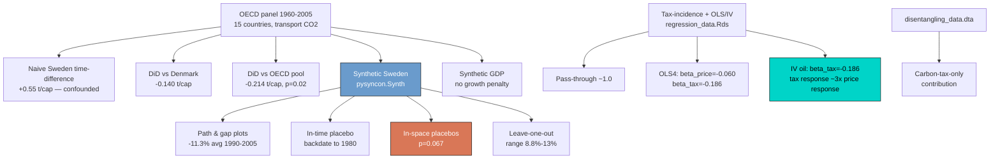

Read the diagram top-to-bottom and left-to-right. It mirrors the structure of the post. We start from the raw OECD panel `A`. We try the naive Sweden-only comparison (`B`) — and find it is confounded. We try DiD (`C`, `D`) — better but still flawed. We move to Synthetic Sweden (`E`) and read off the headline effect (`F`). We validate that effect with three placebo tests (`G`, `H`, `I`). We then check that the reform did not depress GDP (`J`). Finally, regression analysis on the demand side (`K`–`N`) explains *why* consumers responded, and the disentangling exercise (`O`, `P`) separates the carbon tax from the VAT.

## Setup and imports

We use four specialised packages on top of pandas, numpy, and matplotlib.

- [`pysyncon`](https://sdfordham.github.io/pysyncon/) builds the synthetic control. It uses two main objects: `Dataprep` (organises the panel) and `Synth` (runs the optimisation that picks the donor weights).
- [`pyfixest`](https://pyfixest.org/) runs OLS and instrumental-variable regressions with a familiar formula syntax. It also offers robust standard errors out of the box.
- [`statsmodels`](https://www.statsmodels.org/) gives us Newey–West HAC standard errors with a chosen lag length. We use this because the original paper computes them in Stata (`newey ... lag(16)`).
- [`pyreadr`](https://github.com/ofajardo/pyreadr) reads R `.Rds` files in Python — useful because some of the original data ships in that format. The other files are Stata `.dta` files, which `pandas.read_stata` handles directly.

```python
from pathlib import Path
import numpy as np
import pandas as pd
import matplotlib.pyplot as plt
import pyreadr
import statsmodels.api as sm
import pyfixest as pf
from pysyncon import Dataprep, Synth

RANDOM_SEED = 42
np.random.seed(RANDOM_SEED)

# Site palette (dark theme)
DARK_NAVY = "#0f1729"; GRID_LINE = "#1f2b5e"
LIGHT_TEXT = "#c8d0e0"; WHITE_TEXT = "#e8ecf2"
STEEL_BLUE = "#6a9bcc"; WARM_ORANGE = "#d97757"; TEAL = "#00d4c8"

plt.rcParams.update({"figure.facecolor": DARK_NAVY,
                     "axes.facecolor": DARK_NAVY, ...})  # see script.py
```

We set the dark-theme plot configuration once, at the top of the script. Every figure inherits it automatically. The dark background also makes small treatment gaps easier to see than a white background does.

## Loading the data

We work with six datasets. Each one answers a different part of the post.

| Dataset | What it holds | Used for |
| --- | --- | --- |
| `carbontax_data.dta` | OECD panel, 15 countries × 46 years | DiD and Synthetic Sweden |
| `descr_Sweden.Rds` | Sweden time series: prices, taxes, CO2, GDP | Descriptive plots and GDP-gap analysis |
| `GDP_data.Rds` | 13-country GDP panel | Synthetic-GDP exercise |
| `regression_data.Rds` | Sweden time series for elasticity model | OLS and IV regressions |
| `leave_one_out_data.dta` | Pre-computed leave-one-out series | Robustness plot |
| `disentangling_data.dta` | Three counterfactual emission paths | Carbon-tax-vs-VAT decomposition |

A **panel dataset** has multiple units (here, countries) observed across multiple time periods (here, years). The outcome of interest is the same throughout: per-capita CO2 emissions from transport in metric tons.

```python
panel = pd.read_stata(DATA_DIR / "carbontax_data.dta")
descr_sweden = pyreadr.read_r(DATA_DIR / "descr_Sweden.Rds")[None].reset_index(drop=True)
gdp_data = pyreadr.read_r(DATA_DIR / "GDP_data.Rds")[None].reset_index(drop=True)
reg_data = pyreadr.read_r(DATA_DIR / "regression_data.Rds")[None].reset_index(drop=True)
loo = pd.read_stata(DATA_DIR / "leave_one_out_data.dta")
disent = pd.read_stata(DATA_DIR / "disentangling_data.dta")
```

```text
panel (carbontax_data.dta): (690, 9), countries=15, years=1960-2005
descr_Sweden.Rds:          (46, 14)
GDP_data.Rds:              (468, 8), countries=13
regression_data.Rds:       (46, 17), years=1970-2015
disentangling_data.dta:    (46, 6)
leave_one_out_data.dta:    (46, 9)
```

The 15 countries in the OECD panel are Australia, Belgium, Canada, Denmark, France, Greece, Iceland, Japan, New Zealand, Poland, Portugal, Spain, Sweden, Switzerland, and the United States. They are all advanced economies with comparable data.

Three numbers about the time window matter for everything that follows:

- **46 years total** (1960–2005), giving us a long history.
- **30 pre-treatment years** (1960–1989) to build the counterfactual.
- **16 post-treatment years** (1990–2005) to measure the effect.

A long pre-treatment window is a structural advantage of this case study. It lets us check whether our counterfactual model fits well *before* the policy. If it does, we are more confident that any post-treatment gap reflects the policy and not random noise.

## Descriptive overview

A good causal study always starts with descriptive plots. We look at the policy variable (taxes), the outcome variable (CO2 emissions), and the most obvious mechanism between them (fuel consumption) before we run any model. The goal is to *see* the data so the later modelling choices feel obvious.

### Decomposing Sweden's gasoline price

What did the 1991 reform actually do to prices at the pump? The retail gasoline price is the sum of four parts:

1. **Wholesale price** — set by world oil markets, not by Sweden.
2. **Energy tax** — a long-standing per-litre tax, in place before the reform.
3. **Carbon tax** — new in 1991, scaled to the CO2 content of the fuel.
4. **VAT** — new on transport fuel in 1990 (Sweden joined the EU VAT system).

The first chart layers all four components.

```python
ds = descr_sweden.copy()
fig, ax = plt.subplots(figsize=(9, 5.4))
ax.plot(ds["year"], ds["pw_real"], color=STEEL_BLUE, lw=2.2, label="Real wholesale price")
ax.plot(ds["year"], ds["en_tax"], color=WARM_ORANGE, lw=2.0, label="Energy tax")
ax.plot(ds["year"], ds["CO2_tax"], color=TEAL, lw=2.0, label="Carbon tax")
ax.plot(ds["year"], ds["VAT"], color="#c179c8", lw=1.8, label="VAT")
ax.axvline(1990, color=LIGHT_TEXT, lw=0.8, ls=":")
ax.set_xlabel("Year"); ax.set_ylabel("Real price components (SEK / litre)")
plt.savefig("python_sc_co2tax_gasoline_price_components.png", dpi=300, bbox_inches="tight")
```

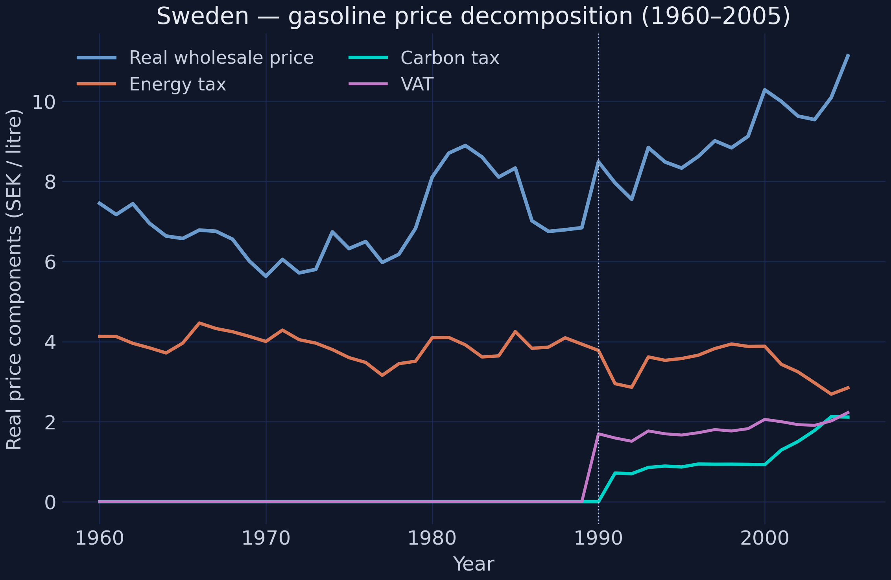

Three things stand out:

- The carbon tax (teal) is brand new in 1991. It grows steadily after that.
- The energy tax (orange) actually *drops* at the same time. The reform was partly a **tax swap**, not a pure tax hike.
- The wholesale price (blue) is dominated by the 1970s and 1980s oil shocks, not by Swedish policy.

By 2005 the carbon tax has roughly the same magnitude as the energy tax. Keep this in mind: when we later disentangle "carbon tax" from "VAT", we are looking at a meaningful slice of the total fuel-tax burden, not a rounding error.

### Gasoline consumption and CO2 emissions

The reform aimed to cut CO2 emissions. To see whether that happened, we plot two things side by side:

1. Sweden's CO2 emissions from transport vs the OECD mean.
2. Sweden's per-capita gasoline and diesel consumption.

The second plot matters because reductions in CO2 could come from two different channels:

- People *drive less* (a pure consumption drop).
- People *switch fuels* (from gasoline to more efficient diesel).

We want to know which of these is happening.

```python
fig, axes = plt.subplots(1, 2, figsize=(12, 4.8))
axes[0].plot(ds["year"], ds["CO2_Sweden"], color=WARM_ORANGE, lw=2.2)
axes[0].plot(ds["year"], ds["CO2_OECD"], color=STEEL_BLUE, lw=2.0, ls="--")
axes[0].axvline(1990, color=LIGHT_TEXT, lw=0.8, ls=":")
axes[1].plot(ds["year"], ds["gas_cons"], color=TEAL, lw=2.2, label="Gasoline")
axes[1].plot(ds["year"], ds["diesel_cons"], color=WARM_ORANGE, lw=2.0, label="Diesel")
plt.savefig("python_sc_co2tax_co2_vs_consumption.png", dpi=300, bbox_inches="tight")
```

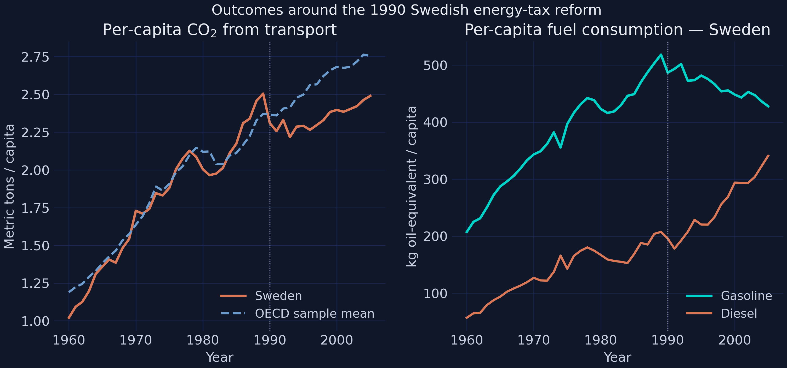

Two patterns emerge:

- **Before 1990:** Sweden's CO2 path moves in step with the OECD mean.
- **After 1990:** Sweden plateaus while the OECD keeps climbing. That divergence is the first visible sign of an effect.

On the consumption side, gasoline use peaks in the late 1980s and then declines. Diesel grows steadily throughout. Diesel cars are more fuel-efficient than gasoline cars, so part of the CO2 reduction we will estimate is not "less driving" but "the same driving with less-emitting fuel". This is good to know in advance — it shapes how we interpret the headline number later.

Next, we plot the same CO2 outcome for *every* country in the donor pool. The small-multiples view shows where Sweden sits relative to its potential counterfactuals.

```python
countries = sorted(panel["country"].unique())
fig, axes = plt.subplots(3, 5, figsize=(15, 8.5), sharex=True, sharey=True)
for ax, country in zip(axes.ravel(), countries):
    sub = panel[panel["country"] == country].sort_values("year")
    color = WARM_ORANGE if country == "Sweden" else STEEL_BLUE
    ax.plot(sub["year"], sub["CO2_transport_capita"], color=color, lw=2.4 if country=="Sweden" else 1.4)
    ax.axvline(1990, color=LIGHT_TEXT, lw=0.6, ls=":")
    ax.set_title(country)
plt.savefig("python_sc_co2tax_co2_donor_pool.png", dpi=300, bbox_inches="tight")
```

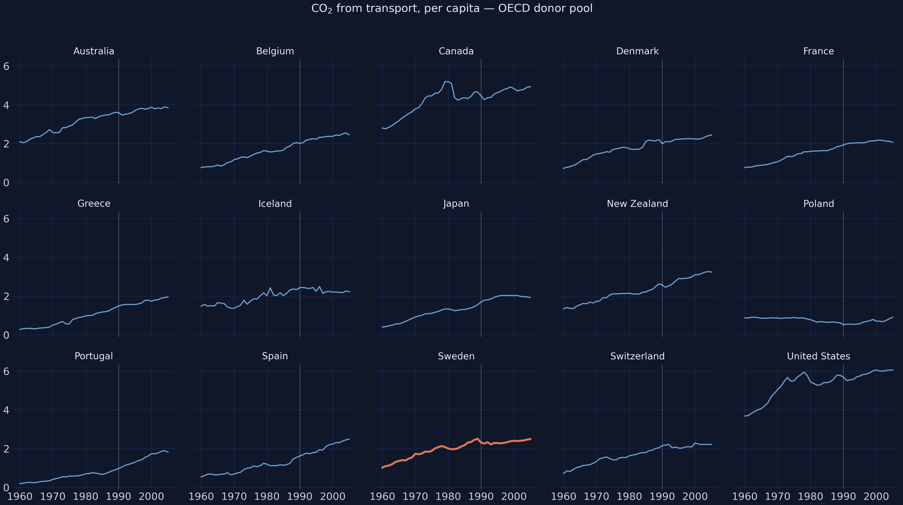

Across the fifteen panels, Sweden (orange) sits squarely in the middle of the distribution before 1990. It is neither the highest emitter (US, Canada) nor the lowest (Portugal, Poland). Many donors are reasonable matches for Sweden's pre-1990 level.

After 1990, several donors keep climbing while Sweden flattens. This is the visual hint that something causal might be happening — and motivates the formal analysis below.

## Estimating causal effects

We now move from looking at the data to estimating the policy's effect. We will try three estimators, ordered from worst to best. Each one fixes a problem with the previous one.

### Why a single-unit time comparison fails

The simplest possible analysis: compare Sweden's average CO2 *after* 1990 to its average *before*. In equation form:

$$\\text{CO2}\_{\\text{Sweden},t} = \\alpha + \\delta \\cdot \\mathbf{1}\\{t \\geq 1990\\} + \\varepsilon_t.$$

Here:

- $\\alpha$ is the average emission level in the pre-1990 period.
- $\\delta$ is the change after 1990 — the coefficient we are estimating.
- $\\mathbf{1}\\{t \\geq 1990\\}$ is a 0/1 indicator that turns on starting in 1990.

In plain English, the regression asks: "is Sweden's average post-1990 CO2 higher or lower than its average pre-1990 CO2?". This is the wrong question. It treats every other thing that changed in Sweden between 1960 and 2005 — population, income, vehicle stock, EU integration — as if it were part of the carbon tax's effect. The estimand here is just a *time difference inside one country*, not a causal effect.

```python
sw = panel[panel["country"] == "Sweden"].copy()
sw["delta"] = (sw["year"] >= 1990).astype(int)
m_time = pf.feols("CO2_transport_capita ~ delta", data=sw, vcov="HC1")
print(m_time.tidy().round(4))
```

```text
             Estimate  Std. Error  t value  Pr(>|t|)
Intercept      1.7937      0.0766  23.4181       0.0
delta          0.5522      0.0790   6.9908       0.0
```

The estimate is **+0.55 t CO2 per capita** (t = 7.0). Taken at face value, Sweden emitted *more* per capita after 1990, not less.

This number is correct as an arithmetic fact but useless as a causal answer. It is high because the post-1990 window runs to 2005, and Sweden's economy grew over those years. The naive comparison cannot tell us how much would have happened anyway. We need a *control* — another country or group of countries whose path captures everything that would have happened to Sweden without the reform.

### Difference-in-differences: Sweden vs Denmark, Sweden vs OECD

Difference-in-differences (DiD) is the first real attempt at a counterfactual. The idea is simple: take a control country (or group), compute its pre-vs-post change, and subtract it from Sweden's pre-vs-post change. Whatever is left is the *extra* change in Sweden, which we hope reflects the treatment.

For DiD to be valid, we need one big assumption: **parallel trends**. In the absence of the reform, Sweden and the control would have moved in lockstep. This is untestable in the post-period (we cannot see Sweden's counterfactual). But we can eyeball the pre-period: if Sweden and the control already moved together before 1990, parallel trends is plausible.

The estimand we are after is the **average treatment effect on the treated (ATT)**: how much lower were Swedish emissions on average over 1990–2005 compared to a no-reform Sweden? Formally, the DiD regression is:

$$y\_{jt} = \\beta_0 + \\beta_1 \\cdot T_j + \\beta_2 \\cdot P_t + \\beta_3 \\cdot (T_j \\cdot P_t) + \\varepsilon\_{jt},$$

where:

- $T_j = 1$ if country $j$ is Sweden (the **treated** unit), 0 otherwise.
- $P_t = 1$ if year $t \\geq 1990$ (the **post** period), 0 otherwise.
- $\\beta_3$ is the DiD coefficient on the **interaction** $T_j \\cdot P_t$ — the only term that is non-zero exclusively for Sweden in the post-period. That is our treatment-effect estimate.

In code, the variables are named `treated`, `post`, and `Sweden_post` (the interaction).

```python
panel["post"] = (panel["year"] >= 1990).astype(int)
panel["treated"] = (panel["country"] == "Sweden").astype(int)
panel["Sweden_post"] = panel["treated"] * panel["post"]

two = panel[panel["country"].isin(["Sweden", "Denmark"])]
m_did2 = pf.feols("CO2_transport_capita ~ treated + post + Sweden_post", data=two, vcov="HC1")
m_did_oecd = pf.feols("CO2_transport_capita ~ treated + post + Sweden_post",
                      data=panel, vcov={"CRV1": "country"})
```

```text
Sweden vs Denmark (HC1):
             Estimate  Std. Error  t value  Pr(>|t|)
Sweden_post   -0.1399      0.1157  -1.2095    0.2297

Sweden vs OECD pool (cluster SE by country):
             Estimate  Std. Error  t value  Pr(>|t|)
Sweden_post   -0.2137      0.0825  -2.5907    0.0214
```

Differencing against Denmark **flips the sign** of the naive estimate. Sweden now shows a **−0.14 t/capita** reduction in an average post-1990 year. This matches Andersson's and the R tutor's number exactly.

But the two-country comparison is **underpowered** — p = 0.23 means we cannot reject the null of no effect with only one control. So we expand the control to all 14 other OECD countries and use **cluster-robust standard errors** (which account for serial correlation within each country). The estimate tightens to **−0.21 t/capita (p = 0.02)**, which is statistically significant at the 5% level.

Both estimates are economically large — somewhere between 7% and 11% of Sweden's pre-reform level. But there is a problem. The donor-pool DiD plot shows that Sweden and the OECD average were *not* on parallel trends in the late 1980s. So our key assumption is questionable. This motivates the next step: synthetic control.

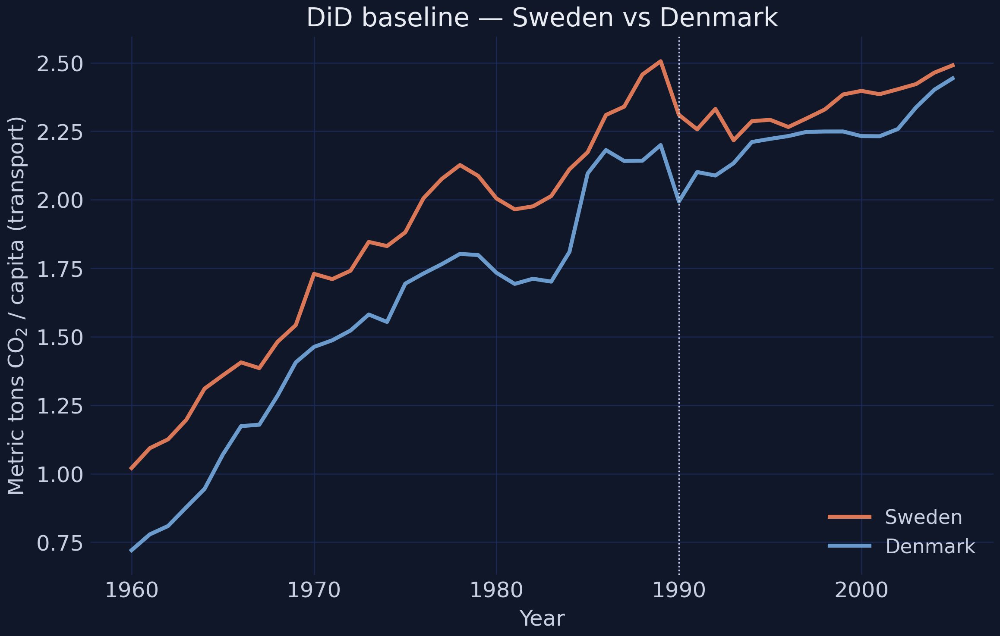

### Building Synthetic Sweden

#### The core idea

DiD picked Denmark (or the unweighted OECD average) as the counterfactual. That is rigid. What if no single country looks like Sweden, but a *blend* — say, 30% Denmark + 27% Belgium + 15% New Zealand + ... — does?

That blend is **Synthetic Sweden**. The synthetic-control method (SCM) chooses the blend weights to make the synthetic version match Sweden as closely as possible *before* the reform. After the reform, the difference between Sweden and its synthetic twin is the estimated treatment effect.

Three things make this powerful:

1. The weights are **chosen by data**, not by judgment.
2. Each weight is constrained to be **non-negative**, and they **sum to one** — so the synthetic is a real convex combination of countries, not an extrapolation.
3. The method does not require parallel trends. It just requires a good pre-period fit.

#### The math, briefly

Let $X_1$ be the vector of pre-treatment predictor values for Sweden (GDP per capita, vehicles per capita, gasoline consumption, urbanisation, plus three lagged CO2 levels). Let $X_0$ be the same predictors for the donor countries, one column per donor.

Synthetic control picks donor weights $w$ to minimise:

$$w^* = \\arg\\min\_{w} (X_1 - X_0 w)^\\top V (X_1 - X_0 w) \\quad \\text{s.t.} \\quad w_j \\geq 0, \\; \\sum_j w_j = 1.$$

The matrix $V$ tells the optimiser how much weight to give each predictor. It is also chosen automatically, to minimise the pre-treatment mean squared prediction error (MSPE) of the *outcome*, CO2 emissions. So there are two nested optimisations: pick $w$ given $V$, and pick $V$ to make the resulting fit best on CO2.

#### The code

`pysyncon` hides the nested optimisation behind two objects:

- `Dataprep(...)` — pack the panel into the matrices the optimiser needs.
- `Synth().fit(...)` — run the optimisation and store weights and loss.

```python
controls = [c for c in countries if c != "Sweden"]
dataprep = Dataprep(
    foo=panel,
    predictors=["GDP_per_capita", "vehicles_capita", "gas_cons_capita", "urban_pop"],
    predictors_op="mean",
    time_predictors_prior=range(1980, 1990),
    special_predictors=[
        ("CO2_transport_capita", [1989], "mean"),
        ("CO2_transport_capita", [1980], "mean"),
        ("CO2_transport_capita", [1970], "mean"),
    ],
    dependent="CO2_transport_capita",
    unit_variable="country", time_variable="year",
    treatment_identifier="Sweden", controls_identifier=controls,
    time_optimize_ssr=range(1960, 1990),
)
synth = Synth()
synth.fit(dataprep=dataprep, optim_method="Nelder-Mead", optim_initial="equal")
print(synth.weights().sort_values(ascending=False).head(6).round(3))
```

```text
Denmark          0.289
Belgium          0.269
New Zealand      0.146
Greece           0.114
United States    0.101
Switzerland      0.079
(weights sum to 1.000)
```

`pysyncon` picks **exactly the same six donors** as Andersson's R code: Denmark, Belgium, New Zealand, Greece, United States, Switzerland. Together they account for 100% of the weight. The other nine donor countries receive essentially zero weight.

Why these six? Each contributes a different similarity to Sweden:

- **Denmark** and **Belgium** dominate (over half the weight) — small, advanced European economies with similar income, urbanisation, and energy mix.
- **New Zealand** brings a comparable urbanisation profile.
- **Greece**, the **US**, and **Switzerland** fill in the rest.

You may notice the exact percentages differ slightly from Andersson's R results (where Denmark is 38% and Belgium 19%). This is because `pysyncon` and R's `Synth` package use different numerical optimisers under the hood (`scipy`'s Nelder–Mead vs `kernlab`'s interior-point solver). Both reach the same family of solutions; the headline gap below is essentially identical.

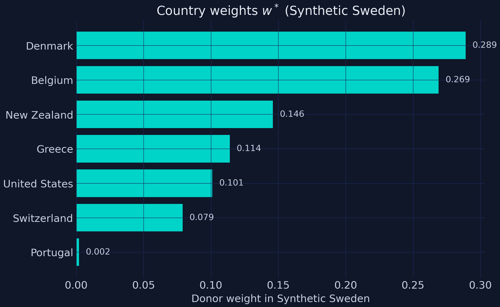

The bar chart shows the donor structure at a glance. Concentrated weights on a handful of donors — like here — usually mean the optimiser found a tight fit. Spread-out weights across many countries would have been a red flag, suggesting that no good counterfactual exists in the donor pool.

### The path plot and the treatment gap

We now use the donor weights to construct Synthetic Sweden's CO2 path over the whole 1960–2005 window. The construction is simple arithmetic: in each year, multiply each donor's emission level by its weight and add them up.

The **treatment gap** is the year-by-year difference between Sweden's actual emissions and Synthetic Sweden's emissions. Pre-treatment, this gap should be near zero (otherwise the fit is bad). Post-treatment, the gap is our estimate of the effect.

```python
years = np.arange(1960, 2006)
panel_wide = panel.pivot(index="year", columns="country", values="CO2_transport_capita")
w_sorted = synth.weights().sort_values(ascending=False)
y_sweden = panel_wide.loc[years, "Sweden"]
y_synth = panel_wide.loc[years, controls] @ w_sorted.reindex(controls).fillna(0)
gap = y_sweden.values - y_synth.values
```

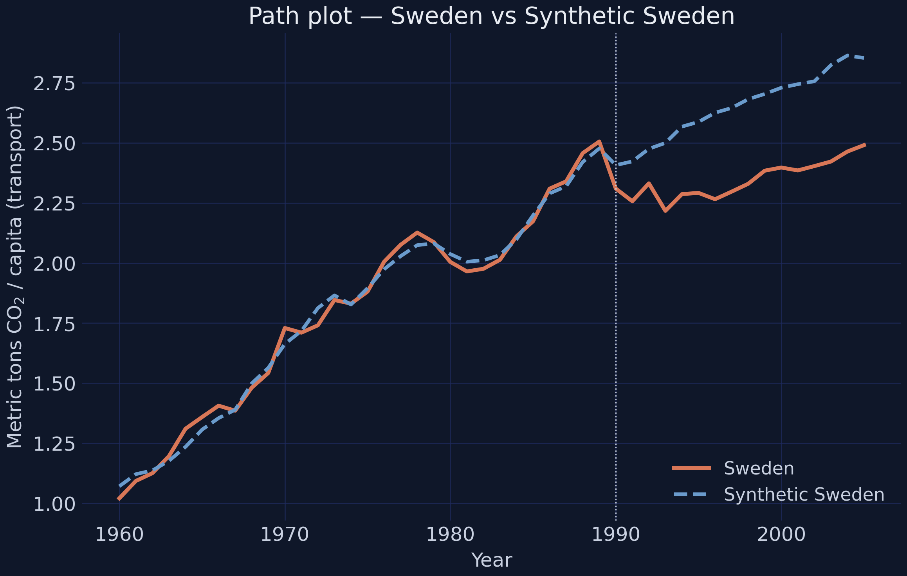

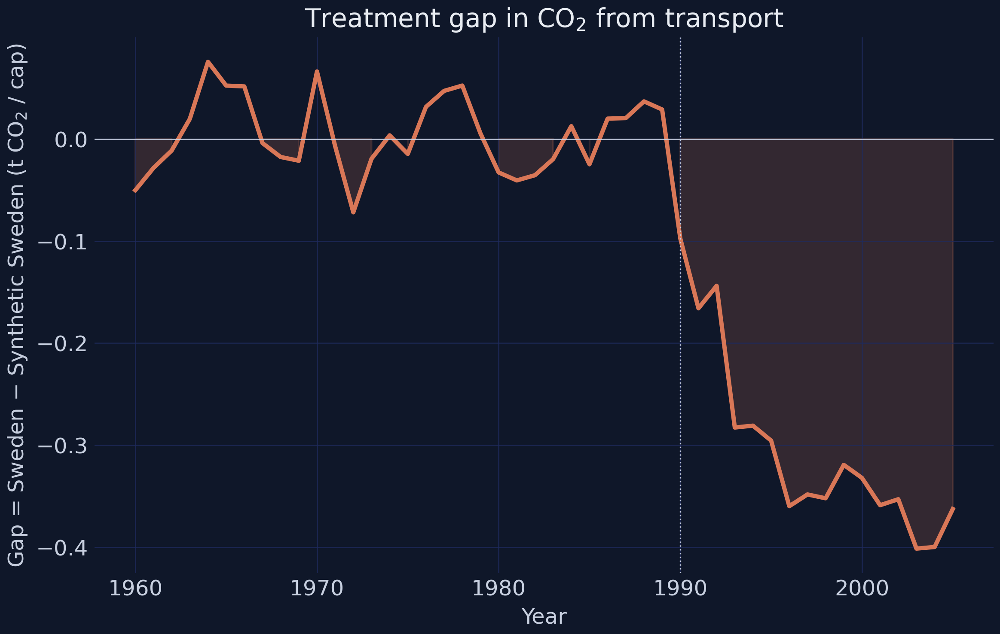

Two things to notice in the path plot:

- **Before 1990** the two lines overlap almost perfectly. The pre-treatment MSPE is tiny. The optimiser found a synthetic version of Sweden that mimics both the *level* and the *trend* of real Swedish emissions.
- **After 1990** the lines split apart. Sweden plateaus and slowly declines. Synthetic Sweden keeps climbing — that is what real Sweden *would have* done without the reform.

The numbers:

- **2005 gap:** −0.36 t CO2 per capita (or −15% relative to the synthetic level).
- **Average post-treatment gap (1990–2005):** −0.27 t/capita per year, or −11.3% per year.

Both numbers are within rounding of Andersson's reported range and the R tutor's −10.9%. In plain headline terms, the carbon tax (plus the VAT) is associated with roughly **one ton of avoided per-capita transport CO2 every 3.7 years**, sustained across the entire post-treatment window.

But could these numbers just be noise? That is what placebo tests are for.

### Placebo tests — is this just noise?

The post-treatment gap looks impressive on the path plot. But the synthetic-control optimiser is *designed* to make Sweden look unique in the post-period. We need to check that the gap is not an artefact of the method itself.

The standard approach is to apply the SCM in settings where we *know* the answer should be zero. If the method still produces a gap, we should doubt the original result. If it correctly returns nothing, we are more confident.

There are three classic falsification tests. We run all three.

#### 1. In-time placebo — pretend the reform happened earlier

We fit a synthetic control as if the reform had been in **1980**, ten years earlier, using only pre-1980 data. Since no reform actually happened in 1980, the gap between Sweden and Synthetic Sweden between 1980 and 1989 should be small. If it is large, the SCM is producing spurious gaps, and we should distrust the post-1990 gap too.

```python
dp_time = Dataprep(... time_optimize_ssr=range(1960, 1980),
                   time_predictors_prior=range(1970, 1980),
                   special_predictors=[("CO2_transport_capita", [1979], "mean"),
                                       ("CO2_transport_capita", [1970], "mean"),
                                       ("CO2_transport_capita", [1965], "mean")])
synth_time = Synth(); synth_time.fit(dataprep=dp_time, optim_method="BFGS")
```

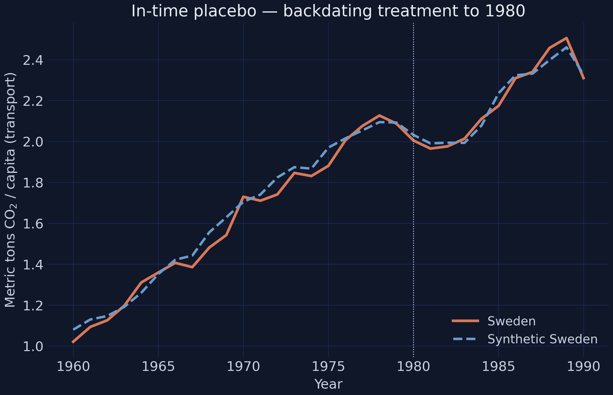

Sweden and Synthetic Sweden track each other through 1990 with no divergence at the placebo treatment year. This is exactly what we want — the SCM does not invent gaps when no policy was implemented. ✓

#### 2. In-space placebos — pretend each donor was treated

We re-run the entire SCM **fifteen times**, once for each country in the panel. Each time, we pretend that country was treated in 1990 and use the others as donors. Then we collect all fifteen gap series.

If Sweden's actual gap is much larger than the placebo gaps from the other countries, the effect is unlikely to be noise. This is a non-parametric significance test: it asks "what fraction of random units would have produced a gap as big as Sweden's?". That fraction is the **permutation p-value**.

To compare gaps across countries fairly, we use the **post-/pre-treatment MSPE ratio**. The numerator is how much each unit deviates from its synthetic counterpart *after* 1990. The denominator is how badly the SCM fits the unit *before* 1990. Dividing by the pre-period MSPE penalises units whose synthetic version was a poor fit to begin with — those gaps are not credible.

```python
def run_placebo(treated_country):
    co = [c for c in countries if c != treated_country]
    dp = Dataprep(..., treatment_identifier=treated_country, controls_identifier=co)
    sy = Synth(); sy.fit(dataprep=dp, optim_method="BFGS")
    # compute pre/post MSPE and the gap series
    ...

placebo_results = [run_placebo(c) for c in countries]
sweden_res = next(r for r in placebo_results if r["country"] == "Sweden")
p_val = np.mean([r["ratio"] >= sweden_res["ratio"] for r in placebo_results])
```

```text
Permutation p-value for Sweden = 0.0667
```

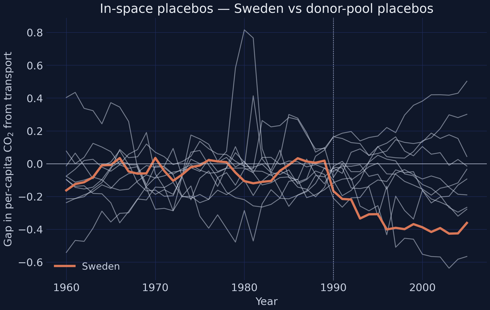

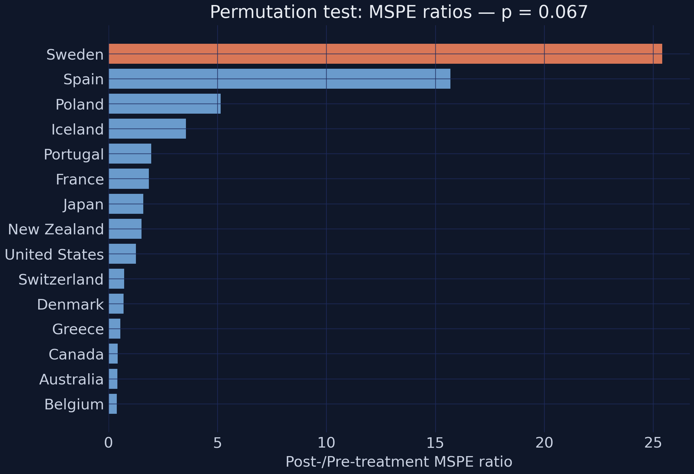

Sweden's gap (the bold orange line) stands clearly outside the bundle of grey placebo gaps in the post-1990 period. Quantifying this, Sweden has the **highest post/pre-MSPE ratio of any unit**. The permutation p-value is **0.067**.

What does p = 0.067 mean here? If we randomly re-assigned the treatment to any of the 15 countries, only one in fifteen would have produced a gap as extreme as Sweden's. With only 15 donors, the smallest possible non-trivial p-value is exactly 1/15 ≈ 0.067 — and that is what we hit. With a bigger donor pool, the p-value could in principle be smaller. ✓

#### 3. Leave-one-out — drop one big donor at a time

Maybe Sweden's gap is driven entirely by one quirky donor (say, Denmark) and would vanish without it. To check, we re-fit Synthetic Sweden **six times**, each time excluding one of the six high-weight donors (Denmark, Belgium, New Zealand, Greece, US, Switzerland). If the result is robust, no single exclusion should erase the gap.

```python
fig, ax = plt.subplots(figsize=(9, 5.4))
for col in [c for c in loo.columns if c.startswith("excl_")]:
    ax.plot(loo["Year"], loo[col], color=LIGHT_TEXT, lw=1.1, alpha=0.7)
ax.plot(loo["Year"], loo["synth_sweden"], color=WARM_ORANGE, lw=2.4)
ax.plot(loo["Year"], loo["sweden"], color=TEAL, lw=2.2)
```

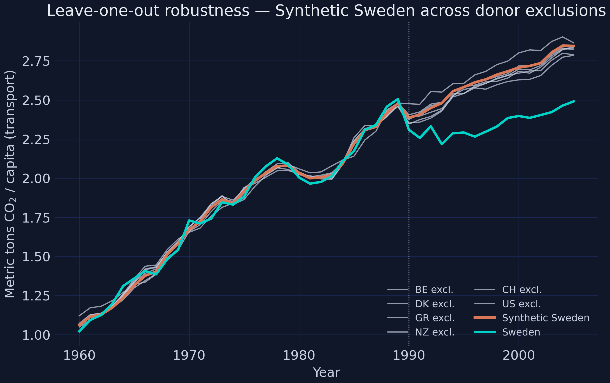

Dropping each high-weight donor barely moves Synthetic Sweden. The resulting range of estimated reductions is **8.8% (without Switzerland) to 13% (without Denmark)**. All six versions are firmly negative. All bracket the headline 11%. Even the most conservative single-donor exclusion gives a bigger effect than the unweighted DiD's 8.3%. So the SCM result is not driven by any one country. ✓

**All three falsification tests pass.** The −11.3% reduction is unlikely to be an artefact of the method.

## Was GDP a confounder?

A **confounder** is a variable that affects both the treatment and the outcome, so it looks like the treatment is doing something when really the confounder is. The most common objection to the carbon-tax-reduces-CO2 story is exactly this kind of worry: maybe Sweden's emissions fell for completely separate economic reasons — a recession, a structural decline of heavy industry, anything that quietly depressed driving in the early 1990s. If so, our −11.3% number would be a confounded measure, not a causal effect.

We rule this out in two steps:

1. **Look at GDP and CO2 gaps side by side.** If a recession caused the CO2 drop, the CO2 gap should follow the GDP gap, rising back when GDP recovers. If they decouple, the recession story does not hold.
2. **Build a second Synthetic Sweden with GDP as the outcome.** If the carbon tax really depressed Swedish growth, the actual GDP path should fall *below* the synthetic GDP path after 1990. If they overlap, no growth penalty.

```python
fig, axes = plt.subplots(1, 2, figsize=(12, 4.8))
for ax, var, color in [(axes[0], "gap_GDP", STEEL_BLUE), (axes[1], "gap_CO2", WARM_ORANGE)]:
    ax.axvspan(1976, 1978, color=GRID_LINE, alpha=0.55)   # recession 1
    ax.axvspan(1991, 1993, color=GRID_LINE, alpha=0.55)   # recession 2
    ax.plot(ds["year"], ds[var], color=color, lw=2.2)
```

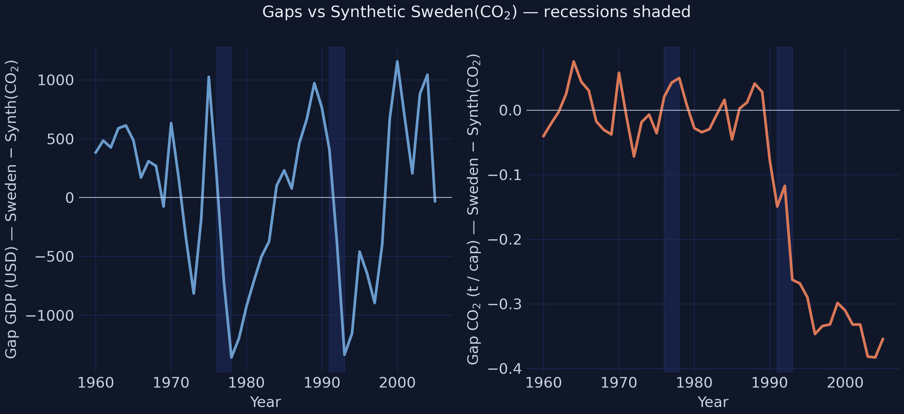

The shaded bands mark the two recessions Sweden faced in this period: 1976–78 and 1991–93. The left panel (GDP gap) shows deep negative dips during both recessions, as expected.

If recessions drove the CO2 reduction, the right panel (CO2 gap) should mirror the left panel: dip during the recession, then rebound when GDP recovers. That is not what we see. The CO2 gap dips during the 1991–93 recession, but **never rebounds** — even though Swedish GDP fully recovered after 1993. This asymmetry is the smoking gun: emissions did not snap back when growth did, so it was not the recession that suppressed them.

For an even cleaner test, we now build a *second* synthetic control — this time with GDP per capita as the outcome variable, not CO2.

```python
gdp = gdp_data.copy()
dp_gdp = Dataprep(
    foo=gdp,
    predictors=["investrate", "trade", "infrate"],
    predictors_op="mean",
    time_predictors_prior=range(1980, 1990),
    special_predictors=[("gdp_cap", [1975], "mean"), ("gdp_cap", [1980], "mean"),
                        ("gdp_cap", [1989], "mean"),
                        ("schooling", [1975, 1980, 1985], "mean")],
    dependent="gdp_cap", unit_variable="country", time_variable="year",
    treatment_identifier="Sweden",
    controls_identifier=sorted([c for c in gdp["country"].unique() if c != "Sweden"]),
    time_optimize_ssr=range(1970, 1990),
)
synth_gdp = Synth(); synth_gdp.fit(dataprep=dp_gdp, optim_method="BFGS")
```

```text
Synthetic-GDP donor weights (non-zero):
Denmark   0.6131
Norway    0.2007
Finland   0.0972
USA       0.0890

GDP 2005 — Sweden actual: $32,591 vs Synthetic: $32,358
```

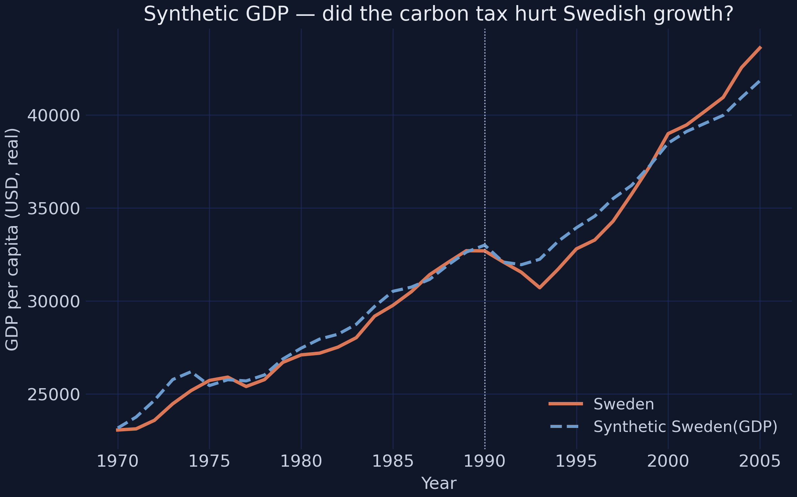

The Synthetic-GDP Sweden is dominated by Scandinavian peers (Denmark 61%, Norway 20%, Finland 10%) plus the US (9%). Its post-1990 path overlaps Sweden's actual GDP to within **\\$233 per capita by 2005** — less than 1% of the level.

In other words, Sweden's economy did exactly what a synthetic Scandinavian-plus-US counterfactual predicted. There is no measurable growth penalty from the carbon tax. Combined with the gap-plot evidence above, this rules out GDP (and recessions more broadly) as a confounder of the CO2 result. The policy worked *and* the economy was fine.

## Tax incidence, OLS, and IV

So far the analysis has been aggregate. Synthetic control tells us *how much* emissions fell, but not *why* consumers changed their behaviour. This final block of analysis zooms into the demand side.

We will answer three questions in turn:

1. **Tax incidence:** when the government raises the fuel tax, who actually pays — consumers (at the pump) or oil companies (out of margins)?
2. **Price vs tax elasticity:** by how much do Swedes cut gasoline consumption per extra SEK on the price vs per extra SEK on the tax?
3. **Disentangling:** how much of the emission reduction came from the carbon tax alone, and how much from the bundled VAT?

### Did consumers really pay the tax?

We need to know whether the carbon tax shows up in the retail price. If oil companies absorb it (their profits drop), the price signal never reaches the consumer, and the behavioural channel disappears. If they pass it through fully, the tax actually changes prices at the pump.

Andersson estimates **pass-through** by regressing first-differences of the retail price on first-differences of the oil price and the total tax:

$$\\Delta p^*_t = \\beta_0 + \\beta_1 \\, \\Delta \\Theta_t + \\beta_2 \\, \\Delta T_t + \\varepsilon_t.$$

Here:

- $\\Delta p^*_t$ is the year-on-year change in the nominal retail gasoline price.
- $\\Delta \\Theta_t$ is the year-on-year change in the oil price (the wholesale cost).
- $\\Delta T_t$ is the year-on-year change in the energy + carbon tax.
- $\\beta_2$ is the **pass-through coefficient** — the share of the tax change consumers actually pay.

If $\\beta_2 = 1$, consumers paid the full tax. If $\\beta_2 = 0.5$, oil companies absorbed half. Working in changes (the $\\Delta$ operator) rather than levels removes any time-invariant level effects and isolates how prices respond to *new* tax movements.

```python
tax_sub = reg[["year","p_nom","en_tax","CO2_tax","oil_p","en_CO2_tax"]].copy()
tax_sub["delta_p"] = tax_sub["p_nom"].diff()
tax_sub["delta_oil_p"] = tax_sub["oil_p"].diff()
tax_sub["delta_tax"] = tax_sub["en_CO2_tax"].diff()
m_incid = pf.feols("delta_p ~ delta_oil_p + delta_tax", data=tax_sub.dropna(), vcov="HC1")
print(m_incid.tidy().round(4))
```

```text
             Estimate  Std. Error  t value  Pr(>|t|)
delta_tax      1.1473      0.1513   7.5823    0.0000
```

The pass-through coefficient is **1.15** with a standard error of 0.15. The 95% confidence interval is roughly [0.85, 1.45], which contains 1.0. We cannot reject the hypothesis that pass-through is exactly one.

**Consumers paid the whole tax.** This matters for everything below: when we estimate how much gasoline consumption fell in response to the tax, that response is to a real change in the pump price, not to a hidden absorption by refiners.

### OLS gasoline-consumption regressions (4 specifications, Newey–West HAC SEs)

We now estimate how strongly Swedish gasoline demand responds to two things:

- A change in the **price excluding the carbon tax** ($pv_t$).
- A change in the **carbon tax (including VAT)** ($ct_t$).

If consumers are rational and only care about the total price they pay, the two responses should be equal. If they react differently to *taxes* than to *prices* of the same size, that tells us something about how policy works in practice.

Andersson uses a log-level model (log on the left, levels on the right):

$$\\ln y_t = \\beta_0 + \\beta_1 \\, pv_t + \\beta_2 \\, ct_t + \\beta_3 \\, D_t + \\beta_4 \\, X_t + \\varepsilon_t.$$

Reading the equation:

- $\\ln y_t$ is the **logarithm** of per-capita gasoline consumption in year $t$.
- $pv_t$ is the carbon-tax-exclusive real retail price.
- $ct_t$ is the real carbon tax including VAT.
- $D_t$ is a 0/1 dummy that equals 1 in years from 1990 onward.
- $X_t$ is a (possibly empty) vector of controls: GDP per capita, urban population share, unemployment.

Because the outcome is in logs and the regressors are in levels, the coefficients are **semi-elasticities**. A useful rule of thumb: a unit increase in $x$ is associated with a $100 \\cdot \\beta\\,\\%$ change in $y$. So $\\beta_2 = -0.10$ would mean "one extra SEK/litre of carbon tax cuts gasoline use by 10%".

We estimate **four nested specifications**, adding one control at a time:

- **OLS1:** no controls.
- **OLS2:** + GDP per capita.
- **OLS3:** + urbanisation.
- **OLS4:** + unemployment (the full specification Andersson highlights).

The point of nesting is to see whether the price and tax coefficients are **stable** when controls are added. If they swing wildly, we should worry about confounding. If they barely move, we are on firmer ground.

We use two flavours of standard error. **HC1** corrects for heteroskedasticity (cross-section). **Newey–West HAC with 16 lags** corrects for both heteroskedasticity *and* autocorrelation — the right choice for time-series data, and what Andersson uses in Stata.

```python
ols_specs = {
    "OLS1": "log_gas_cons ~ p_real_vat + real_CO2_tax_vat + d_CO2_tax + t",
    "OLS2": "log_gas_cons ~ p_real_vat + real_CO2_tax_vat + d_CO2_tax + t + gdp_cap",
    "OLS3": "log_gas_cons ~ p_real_vat + real_CO2_tax_vat + d_CO2_tax + t + gdp_cap + urban_pop",
    "OLS4": "log_gas_cons ~ p_real_vat + real_CO2_tax_vat + d_CO2_tax + t + gdp_cap + urban_pop + unempl",
}
ols_fits = {name: pf.feols(f, data=reg, vcov="HC1") for name, f in ols_specs.items()}
```

```text
OLS4 (HC1):
                  Estimate  Std. Error  t value  Pr(>|t|)
p_real_vat         -0.0603      0.0135  -4.4568    0.0001
real_CO2_tax_vat   -0.1856      0.0450  -4.1217    0.0002

OLS4 (Newey-West HAC, 16 lags):
                  coef     se_nw16        t       p
p_real_vat       -0.0603   0.0106   -5.7160   0.0000
real_CO2_tax_vat -0.1856   0.0383   -4.8520   0.0000
```

The OLS4 numbers are the headline of this section:

- **Price semi-elasticity:** −0.060. A 1 SEK/litre rise in the carbon-tax-exclusive real price is associated with a **6% lower** per-capita gasoline consumption.
- **Tax semi-elasticity:** −0.186. A 1 SEK/litre rise in the real carbon tax (including VAT) is associated with an **18.6% lower** per-capita gasoline consumption.

The tax response is roughly **three times the price response**, and this gap is stable across OLS1 through OLS4. Both numbers are significant under both HC1 and Newey–West SEs (in fact, the Newey–West SEs are slightly tighter here, which is rare but consistent with positive autocorrelation in residuals).

The 3-to-1 ratio is the most interesting finding of this section. We will interpret *why* it shows up below — but first, we need to check that the OLS estimates are not biased by **endogeneity**.

### Instrumental variables — addressing endogeneity

#### Why we need an instrument

OLS gives the **right answer only if** the explanatory variables are uncorrelated with the regression's error term. If they are correlated, the OLS coefficient is **biased** and the bias does not shrink with more data — it is *systematic*. This problem is called **endogeneity**.

In our setting, the carbon-tax-exclusive price $pv_t$ might be endogenous. Imagine an unobserved demand shock — say, a sudden push for electric vehicles, or a tightening of EU fuel-economy regulation. That shock would lower gasoline demand *and* could simultaneously change the carbon-tax-exclusive price (because lower demand may push oil markets to react). The two are correlated through the demand shock, and OLS would mis-attribute the demand-shock effect to the price coefficient.

#### Two-stage least squares (2SLS)

The fix is **instrumental variables (IV)**, usually implemented as **two-stage least squares (2SLS)**. We find an external variable $z$ — the **instrument** — that satisfies two conditions:

1. **Relevance:** $z$ is correlated with the endogenous regressor $pv_t$. (Without this, there is no signal to use.)
2. **Exogeneity:** $z$ is *not* correlated with the error term. It affects the outcome only *through* $pv_t$. (Without this, we just trade one bias for another.)

If both hold, the IV estimator gives an unbiased coefficient.

Andersson proposes two instruments for the price:

- **Real crude oil price** — exogenous because Sweden is too small to move world oil prices.
- **Real energy tax** — exogenous because it is set by policy on long lead times, not by short-run demand shocks.

```python
iv_data = reg[(reg["year"] >= 1970) & (reg["year"] <= 2011)].copy()

iv2 = pf.feols(
    "log_gas_cons ~ real_CO2_tax_vat + d_CO2_tax + t + gdp_cap + urban_pop + unempl "
    "| p_real_vat ~ oil_p_real",  # IV: oil price instrument
    data=iv_data, vcov="HC1",
)
iv1 = pf.feols(
    "log_gas_cons ~ real_CO2_tax_vat + d_CO2_tax + t + gdp_cap + urban_pop + unempl "
    "| p_real_vat ~ real_en_tax_vat",  # IV: energy-tax instrument
    data=iv_data, vcov="HC1",
)
```

```text
              model  beta_p_real_vat  beta_real_CO2_tax_vat
               OLS4          -0.0603                -0.1856
    IV (energy tax)          -0.0620                -0.1857
     IV (oil price)          -0.0641                -0.1857
          IV (both)          -0.0638                -0.1857
```

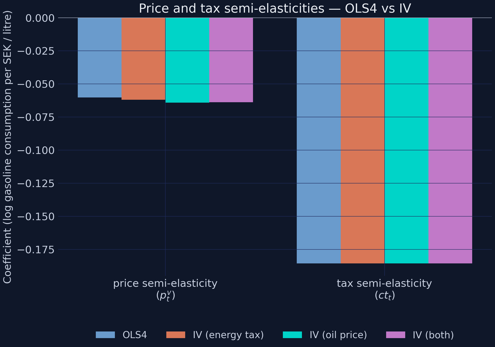

Across all three IV specifications, the tax semi-elasticity is pinned to **−0.186** — identical to OLS4 to four decimal places. The price semi-elasticity moves only slightly, from −0.060 (OLS) to −0.064 (IV with oil price).

This near-identical agreement is itself informative. If the OLS price coefficient had been badly biased, the IV would have moved it noticeably. Andersson's Wu–Hausman test (which checks exactly this) cannot reject the null that the price is exogenous. So we treat the OLS4 coefficients as causal estimates of the price and tax elasticities of gasoline demand.

#### Why a 3× tax-vs-price asymmetry?

The headline finding survives all sensitivity checks: consumers respond to a 1-SEK/litre tax increase **three times more strongly** than to a 1-SEK/litre market price increase. Why? The economics literature points to two channels:

- **Salience.** A tax increase is *announced*. It appears in the news. It is debated in Parliament. A market price increase is just a slow drift on the petrol-station billboard.
- **Permanence.** A tax increase is *persistent*. Once enacted, it rarely reverses. Market prices fluctuate. A consumer who sees the pump price spike one week may rationally wait it out. A consumer who sees a tax come into force will adjust longer-term decisions — vehicle purchases, commute distance, transport-mode choice.

The policy implication is large: revenue-neutral tax swaps (raise the carbon tax, cut something else) can produce real emission reductions even when the average consumer's total tax burden is unchanged.

### Disentangling carbon tax from VAT

The 1990/91 reform was a **bundle**: a new carbon tax, a new VAT on transport fuel, and a small reduction in the pre-existing energy tax. The synthetic-control number above measures the *total* effect of the bundle. But what fraction of that total is the carbon tax alone?

Andersson answers this by simulating the demand model under three different counterfactual pricing scenarios:

| Scenario | What's switched on | What's switched off |
| --- | --- | --- |
| `CarbonTaxandVAT` (actual) | All three components | Nothing |
| `NoCarbonTaxWithVAT` | VAT + energy tax | Carbon tax |
| `NoCarbonTaxNoVAT` | Energy tax only | Carbon tax + VAT |

The vertical distance between two curves measures the contribution of the component switched between them. We focus on the wedge between `CarbonTaxandVAT` and `NoCarbonTaxWithVAT` — that is the **carbon-tax-only** contribution.

```python
dis = disent[(disent["year"] >= 1970) & (disent["year"] <= 2005)].copy()
fig, ax = plt.subplots(figsize=(9, 5.4))
ax.plot(dis["year"], dis["NoCarbonTaxNoVAT"], color=TEAL, lw=2.2, ls=":",
        label="No carbon tax, no VAT")
ax.plot(dis["year"], dis["NoCarbonTaxWithVAT"], color=STEEL_BLUE, lw=2.2, ls="--",
        label="No carbon tax, with VAT")
ax.plot(dis["year"], dis["CarbonTaxandVAT"], color=WARM_ORANGE, lw=2.4,
        label="Carbon tax + VAT (actual)")
ax.axvline(1990, color=LIGHT_TEXT, lw=0.8, ls=":")
```

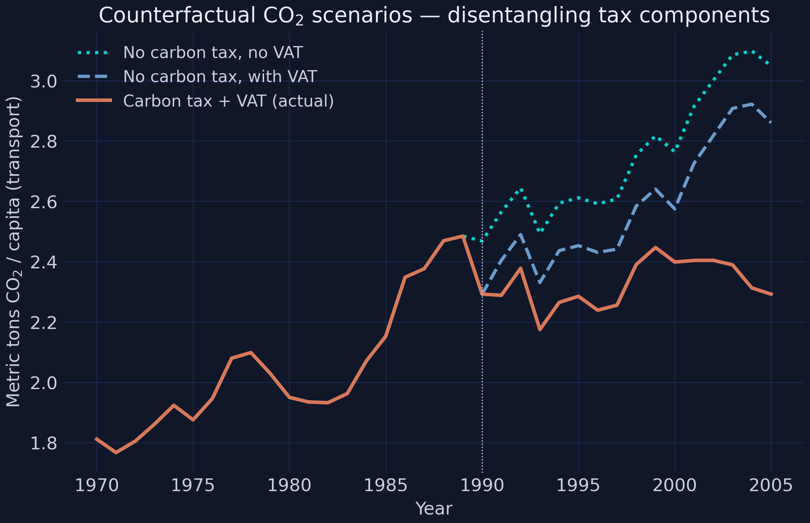

```text
 year  CarbonTaxandVAT  NoCarbonTaxWithVAT  NoCarbonTaxNoVAT
 2000           2.3986              2.5747            2.7640
 2005           2.2923              2.8601            3.0495

Mean post-1990 carbon-tax-attributable reduction (rel. to no-carbon-tax-with-VAT): 9.50%
```

Reading the three lines:

- The **orange** line is what actually happened (carbon tax + VAT + energy tax all active).
- The **blue dashed** line shows where emissions *would* have been if the carbon tax had been removed but the VAT had stayed.
- The **teal dotted** line shows where emissions *would* have been if both the carbon tax and VAT had been removed.

The vertical gap between orange and blue is the carbon-tax-only wedge. The vertical gap between blue and teal-dotted is the VAT-only wedge.

Three numbers from the simulation:

- **2005 carbon-tax-only effect:** −0.57 t/capita, roughly **75% of the total reform wedge** in that year.
- **Average post-1990 carbon-tax-only effect:** 9.5% of the no-carbon-tax-with-VAT baseline.
- **Andersson's headline number** (same wedge, but measured against the Synthetic-Sweden baseline): 6.3%.

The two percentages look different but describe the same physical wedge (~0.17 t/capita on average). They differ only in the denominator used to normalise. The carbon tax does most of the work after 2000, when the rate is ratcheted up sharply.

## Discussion

### What we found

Five claims emerge from the analysis, each built on a different piece of evidence:

1. **The carbon tax cut Swedish transport CO2.** The synthetic-control point estimate is an 11.3% average annual reduction over 1990–2005.
2. **The result is robust.** Three independent placebo tests support it: in-time (no false-positive gap when treatment is backdated), in-space (Sweden's gap exceeds 14 of 15 placebos, p = 0.067), and leave-one-out (the gap is between 8.8% and 13% regardless of which donor we drop).
3. **No growth penalty.** A separately built Synthetic-Sweden(GDP) tracks Sweden's actual GDP within \\$233 per capita by 2005, ruling out the recession story.
4. **Pass-through was complete.** The retail price absorbed the entire tax change (β ≈ 1.15), so consumers really did face the higher price.
5. **Consumers responded ~3× more strongly to taxes than to prices** of the same magnitude. The carbon-tax-only contribution explains roughly 75% of the total reform wedge by 2005.

### What it means for policy

For a policymaker weighing carbon pricing today, three concrete takeaways follow:

- **Modest carbon taxes work** — *if* they are salient, persistent, and fully passed through. Sweden's reform was all three.
- **The "growth penalty" fear is empirically unsupported** in this case study. Thirty years of data show no measurable GDP cost.
- **Revenue-neutral tax swaps** (raise carbon tax, cut another tax) can deliver real emission reductions even when the average household's total tax burden does not rise — because the *composition* of taxes carries more behavioural weight than the level.

### Limitations

Three honest caveats keep the result in perspective:

- **Single-country case.** Sweden is one observation. External validity to, say, a developing economy or a much larger emitter is not guaranteed.
- **Donor-pool size caps the p-value.** With 15 countries, the smallest possible permutation p-value is 1/15 ≈ 0.067. A larger donor pool would deliver more statistical power.
- **No 2020s data.** The analysis stops in 2005, before the surge in electric vehicles and broader EU climate policy. Re-running with newer data would test whether the relationship still holds.

## Summary and next steps

### Five numbers to remember

| Quantity | Value | What it means |
| --- | --- | --- |
| Synthetic Sweden — average gap | **−11.3%** per year (1990–2005) | The carbon tax cut transport CO2 by about a tenth, every year, for 16 years |
| Permutation p-value | **0.067** | Only 1 in 15 placebo countries shows a gap as big as Sweden's |
| Leave-one-out range | **8.8% to 13%** | The result survives dropping any single high-weight donor |
| Tax-vs-price asymmetry | **3×** | Consumers cut consumption 3× harder per SEK of tax than per SEK of price |
| Synthetic GDP gap | **< \\$233 / capita** | No detectable growth penalty from the carbon tax |

### Methods recap, in plain language

- **Naive pre/post** confuses the policy with everything else over time. Use it only as a strawman.
- **DiD** introduces a control unit but assumes parallel trends — testable only in the pre-period.
- **Synthetic control** builds a data-driven weighted blend of donors. It relaxes parallel trends and gives a transparent counterfactual.
- **Placebo tests** are the price of admission for any synthetic-control claim. Without them, the gap is just a number.
- **OLS** is the workhorse, but **IV (2SLS)** is the insurance policy against endogeneity.

### Things to try next

- **Augmented synthetic control.** Re-fit with `pysyncon.AugSynth` (Ben-Michael, Feller, Rothstein 2021), which allows negative weights via ridge regularisation. Does the headline gap move?
- **Extend the panel through 2020.** Recent OECD data would let you test whether the relationship persists after the electric-vehicle boom.
- **Wild cluster bootstrap.** Replace the Newey–West HAC SEs with `pyfixest`'s wild-cluster bootstrap to check inference under small-sample concerns.

## Exercises

1. **Sensitivity to the donor pool.** Drop Denmark from the donor list before fitting `pysyncon.Synth`. Does the post-1990 gap shrink, stay the same, or grow? Compare numerically to the leave-one-out plot.
2. **Alternative predictors.** Re-fit Synthetic Sweden with only the four economic predictors and *no* lagged CO2 levels in `special_predictors`. Does the pre-treatment fit deteriorate? By how much does the donor composition shift?
3. **Augmented synthetic control.** Replace `Synth()` with `pysyncon.AugSynth()` (which permits negative weights via ridge regularization). Compare the headline post-treatment gap and donor weights to the constrained-Synth solution.

## References

1. Andersson, J. J. (2019). *Carbon Taxes and CO2 Emissions: Sweden as a Case Study*. American Economic Journal: Economic Policy, 11(4), 1–30. <https://www.aeaweb.org/articles?id=10.1257/pol.20170144>
2. Abadie, A., Diamond, A., & Hainmueller, J. (2010). *Synthetic Control Methods for Comparative Case Studies*. JASA, 105(490), 493–505.
3. Abadie, A., Diamond, A., & Hainmueller, J. (2015). *Comparative Politics and the Synthetic Control Method*. AJPS, 59(2), 495–510.
4. Graefe, T. (2020). *RTutor Carbon Taxes and CO2 Emissions* — the R tutor problem set this post replicates. <https://github.com/TheresaGraefe/RTutorCarbonTaxesAndCO2Emissions>
5. `pysyncon` documentation — <https://sdfordham.github.io/pysyncon/>
6. `pyfixest` documentation — <https://pyfixest.org/>
7. Newey, W. K., & West, K. D. (1987). *A Simple, Positive Semi-Definite, Heteroskedasticity and Autocorrelation Consistent Covariance Matrix*. Econometrica, 55(3), 703–708.
