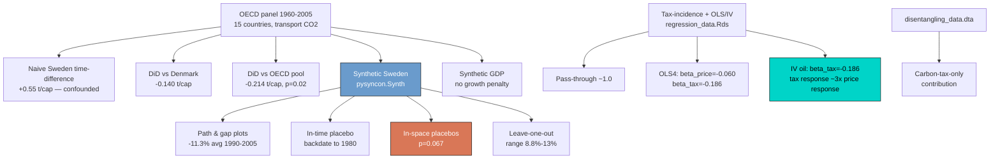

---
authors:
  - admin
categories:
  - Python
  - Causal Inference
date: "2026-05-15T00:00:00Z"
draft: false
featured: false
external_link: ""
image:
  caption: ""
  focal_point: Smart
  placement: 3
links:
  - icon: code
    icon_pack: fas
    name: "Python script"
    url: script.py
  - icon: book
    icon_pack: fas
    name: "Jupyter notebook"
    url: notebook.ipynb
  - icon: open-data
    icon_pack: ai
    name: "[Python] Google Colab"
    url: https://colab.research.google.com/github/cmg777/starter-academic-v501/blob/master/content/post/python_sc_co2tax/notebook.ipynb
  - icon: markdown
    icon_pack: fab
    name: "MD version"
    url: https://raw.githubusercontent.com/cmg777/starter-academic-v501/master/content/post/python_sc_co2tax/index.md
slides:
summary: "Synthetic Control and IV in Python — replicating Andersson (2019) on Sweden's carbon tax and CO2 emissions with pysyncon and pyfixest."
tags:
  - python
  - causal
  - synthetic-control
  - pysyncon
  - pyfixest
title: "Carbon Taxes and CO2 Emissions: A Synthetic-Control Analysis in Python"
url_code: ""
url_pdf: ""
url_slides: ""
url_video: ""
toc: true
diagram: true
---

## Overview

In 1991 Sweden became one of the first countries in the world to put a price on carbon dioxide. The reform was layered on top of an earlier value-added tax (VAT) on transport fuel and an existing energy tax, and it pushed the real retail gasoline price visibly above what the wholesale market would have produced on its own. Three decades later, the natural empirical question is also a public-policy question: **how much did the carbon tax actually reduce CO2 emissions from transport, and did it cost the economy any growth?**

### Acknowledgement of sources

This post is **inspired by** the [RTutor problem set "Carbon Taxes and CO2 Emissions"](https://github.com/TheresaGraefe/RTutorCarbonTaxesAndCO2Emissions) by [Theresa Graefe](https://github.com/TheresaGraefe) (2020), which in turn replicates [Andersson (2019), *"Carbon Taxes and CO2 Emissions: Sweden as a Case Study"*](https://doi.org/10.1257/pol.20170144), *AEJ: Economic Policy* 11(4). All empirical results — datasets, donor pool, synthetic-control design, and OLS/IV specifications — are Andersson's; the exercise sequence is Graefe's. Our contribution is a Python version using [`pysyncon`](https://sdfordham.github.io/pysyncon/synth.html) for synthetic control and [`pyfixest`](https://pyfixest.org/) for regressions.

### Learning objectives

- **Understand** when difference-in-differences (DiD) breaks down and how synthetic control relaxes the parallel-trend assumption.
- **Implement** the Abadie–Diamond–Hainmueller estimator in Python with `pysyncon`, including donor selection, predictor weighting, and gap plots.
- **Assess** the validity of a synthetic-control estimate using in-time placebos, in-space (permutation) placebos, and leave-one-out donor exclusions.
- **Estimate** price and tax semi-elasticities of gasoline consumption with OLS and 2SLS using `pyfixest`, with Newey–West (HAC) standard errors for time-series inference.
- **Disentangle** the contribution of the carbon tax from the VAT using the counterfactual scenarios in Andersson's data.

### A roadmap of the analysis



The diagram traces the analytical sequence: we start with the raw OECD panel, escalate from a confounded Sweden-only time comparison through DiD to synthetic control, validate the SCM with three independent placebo tests, run a parallel synthetic-control exercise on GDP to check for collateral damage to growth, and finish with the demand-side regression evidence that separates price and tax responses and isolates the carbon tax from VAT.

## Setup and imports

We rely on three specialised packages on top of the usual scientific-Python stack. [`pysyncon`](https://sdfordham.github.io/pysyncon/) implements the Abadie–Diamond–Hainmueller synthetic-control estimator with a `Dataprep` → `Synth.fit()` pattern that mirrors R's `Synth::dataprep()` / `Synth::synth()`. [`pyfixest`](https://pyfixest.org/) provides `feols()` for OLS and IV with a familiar formula syntax, plus several robust variance estimators. We also use [`statsmodels`](https://www.statsmodels.org/) for Newey–West HAC standard errors, which match the Stata `newey ... lag(16)` specification Andersson reports in his appendix. The R-tutor ships its data in a mix of Stata `.dta` and R `.Rds` files; `pandas.read_stata` handles the former and [`pyreadr`](https://github.com/ofajardo/pyreadr) reads the latter without needing R installed.

```python
from pathlib import Path
import numpy as np
import pandas as pd
import matplotlib.pyplot as plt
import pyreadr
import statsmodels.api as sm
import pyfixest as pf
from pysyncon import Dataprep, Synth

RANDOM_SEED = 42
np.random.seed(RANDOM_SEED)

# Site palette (dark theme)
DARK_NAVY = "#0f1729"; GRID_LINE = "#1f2b5e"
LIGHT_TEXT = "#c8d0e0"; WHITE_TEXT = "#e8ecf2"
STEEL_BLUE = "#6a9bcc"; WARM_ORANGE = "#d97757"; TEAL = "#00d4c8"

plt.rcParams.update({"figure.facecolor": DARK_NAVY,
                     "axes.facecolor": DARK_NAVY, ...})  # see script.py
```

The full plot configuration (spineless axes, subtle navy grid, light-text labels) is set once at the top of `script.py` and applied globally. The dark theme matches the site's navbar and footer and tends to make small treatment gaps more visible than a white background does.

## Loading the data

The references folder ships six datasets that together cover every analysis in the paper. `carbontax_data.dta` is the headline OECD panel (15 countries × 46 years × 9 variables) and supplies the outcome — per-capita CO2 emissions from transport — together with the four core SCM predictors. The smaller `.Rds` files are Sweden-specific time series (`descr_Sweden.Rds`) and the regression panel for the elasticity exercises (`regression_data.Rds`); the GDP analysis pulls a slightly different donor pool from `GDP_data.Rds`; and the `leave_one_out_data.dta` plus `disentangling_data.dta` files hold Andersson's pre-computed counterfactual paths.

```python
panel = pd.read_stata(DATA_DIR / "carbontax_data.dta")
descr_sweden = pyreadr.read_r(DATA_DIR / "descr_Sweden.Rds")[None].reset_index(drop=True)
gdp_data = pyreadr.read_r(DATA_DIR / "GDP_data.Rds")[None].reset_index(drop=True)
reg_data = pyreadr.read_r(DATA_DIR / "regression_data.Rds")[None].reset_index(drop=True)
loo = pd.read_stata(DATA_DIR / "leave_one_out_data.dta")
disent = pd.read_stata(DATA_DIR / "disentangling_data.dta")
```

```text
panel (carbontax_data.dta): (690, 9), countries=15, years=1960-2005
descr_Sweden.Rds:          (46, 14)
GDP_data.Rds:              (468, 8), countries=13
regression_data.Rds:       (46, 17), years=1970-2015
disentangling_data.dta:    (46, 6)
leave_one_out_data.dta:    (46, 9)
```

The OECD panel covers Australia, Belgium, Canada, Denmark, France, Greece, Iceland, Japan, New Zealand, Poland, Portugal, Spain, Sweden, Switzerland, and the United States — a 15-country donor pool of comparable advanced economies. The reform year (1990 for VAT, 1991 for the carbon tax itself) sits roughly two-thirds of the way through the 46-year window, giving us 30 pre-treatment years to fit a counterfactual model and 16 post-treatment years to measure the gap.

## Descriptive overview

### Decomposing Sweden's gasoline price

Before any causal estimation, it pays to *look* at the policy variable. Sweden's real retail gasoline price is the sum of a wholesale price (set by world oil markets) and a stack of taxes: an energy tax that predates the reform, a VAT introduced in 1990, and a carbon tax introduced in 1991. The R tutor walks through these one component at a time; we do the same in Python.

```python
ds = descr_sweden.copy()
fig, ax = plt.subplots(figsize=(9, 5.4))
ax.plot(ds["year"], ds["pw_real"], color=STEEL_BLUE, lw=2.2, label="Real wholesale price")
ax.plot(ds["year"], ds["en_tax"], color=WARM_ORANGE, lw=2.0, label="Energy tax")
ax.plot(ds["year"], ds["CO2_tax"], color=TEAL, lw=2.0, label="Carbon tax")
ax.plot(ds["year"], ds["VAT"], color="#c179c8", lw=1.8, label="VAT")
ax.axvline(1990, color=LIGHT_TEXT, lw=0.8, ls=":")
ax.set_xlabel("Year"); ax.set_ylabel("Real price components (SEK / litre)")
plt.savefig("python_sc_co2tax_gasoline_price_components.png", dpi=300, bbox_inches="tight")
```


The carbon tax (teal) appears as a new, monotonically rising component starting in 1991, while the energy tax (orange) actually *falls* — that is, the reform was partly a tax swap rather than a pure tax hike. The wholesale price (blue) follows the global oil-market gyrations of the 1970s and 1980s, including the two oil shocks. By 2005 the carbon tax is comparable in magnitude to the energy tax, which is the policy fact the rest of the post needs to keep in mind.

### Gasoline consumption and CO2 emissions

The reform's purpose was to reduce emissions, so the second descriptive plot puts Sweden against the OECD donor pool on the outcome of interest. We also show per-capita gasoline and diesel consumption side by side, because the reform might have triggered a substitution from gasoline to diesel rather than (or in addition to) a level reduction.

```python
fig, axes = plt.subplots(1, 2, figsize=(12, 4.8))
axes[0].plot(ds["year"], ds["CO2_Sweden"], color=WARM_ORANGE, lw=2.2)
axes[0].plot(ds["year"], ds["CO2_OECD"], color=STEEL_BLUE, lw=2.0, ls="--")
axes[0].axvline(1990, color=LIGHT_TEXT, lw=0.8, ls=":")
axes[1].plot(ds["year"], ds["gas_cons"], color=TEAL, lw=2.2, label="Gasoline")
axes[1].plot(ds["year"], ds["diesel_cons"], color=WARM_ORANGE, lw=2.0, label="Diesel")
plt.savefig("python_sc_co2tax_co2_vs_consumption.png", dpi=300, bbox_inches="tight")
```


Before 1990 Sweden's CO2 trajectory tracks the OECD mean closely; after 1990 Sweden plateaus while the OECD continues to climb. On the consumption side, gasoline use peaks in the late 1980s and then declines; diesel grows steadily throughout, consistent with a fleet-level substitution toward more fuel-efficient diesel vehicles. The two together imply that part of the CO2 effect we will estimate later is not a pure reduction in driving but a compositional shift toward less-emitting fuels.

```python
countries = sorted(panel["country"].unique())
fig, axes = plt.subplots(3, 5, figsize=(15, 8.5), sharex=True, sharey=True)
for ax, country in zip(axes.ravel(), countries):
    sub = panel[panel["country"] == country].sort_values("year")
    color = WARM_ORANGE if country == "Sweden" else STEEL_BLUE
    ax.plot(sub["year"], sub["CO2_transport_capita"], color=color, lw=2.4 if country=="Sweden" else 1.4)
    ax.axvline(1990, color=LIGHT_TEXT, lw=0.6, ls=":")
    ax.set_title(country)
plt.savefig("python_sc_co2tax_co2_donor_pool.png", dpi=300, bbox_inches="tight")
```


Looking across all fifteen panels, Sweden's pre-1990 series sits squarely in the middle of the donor distribution — neither the highest emitter (US, Canada) nor the lowest (Portugal, Poland). After 1990 several donors keep growing while Sweden flattens or declines, which is the first visual hint that the reform is associated with a divergence we can measure.

## Estimating causal effects

### Why a single-unit time comparison fails

The most naive thing we could do is regress Sweden's CO2 on a 1{year ≥ 1990} dummy:

$$\\text{CO2}\_{\\text{Sweden},t} = \\alpha + \\delta \\cdot \\mathbf{1}\\{t \\geq 1990\\} + \\varepsilon_t.$$

In words, this asks "is post-1990 Swedish CO2 higher or lower than pre-1990 Swedish CO2, on average?". The estimand here is the *post-vs-pre time difference in Sweden alone*, which conflates the reform with every other thing that changed in Sweden — population growth, GDP growth, vehicle stock — over more than a quarter-century.

```python
sw = panel[panel["country"] == "Sweden"].copy()
sw["delta"] = (sw["year"] >= 1990).astype(int)
m_time = pf.feols("CO2_transport_capita ~ delta", data=sw, vcov="HC1")
print(m_time.tidy().round(4))
```

```text
             Estimate  Std. Error  t value  Pr(>|t|)
Intercept      1.7937      0.0766  23.4181       0.0
delta          0.5522      0.0790   6.9908       0.0
```

The coefficient on `delta` is **+0.55 t CO2 per capita** (t = 7.0). Read literally, post-1990 Sweden emits *more* per capita than pre-1990 Sweden — because the long post-1990 window includes Sweden's growth trajectory through 2005, not just the reform. The lesson, which the rest of the post is built on, is that we need a *control* that absorbs the common time trend before we can isolate the reform.

### Difference-in-differences: Sweden vs Denmark, Sweden vs OECD

Difference-in-differences gives us our first credible counterfactual. The estimand is the average treatment effect on the treated (ATT) in the post-treatment period, identified under a parallel-trends assumption: in the absence of the reform, Sweden and the control would have grown at the same rate. Formally:

$$y\_{jt} = \\beta_0 + \\beta_1 \\cdot T_j + \\beta_2 \\cdot P_t + \\beta_3 \\cdot (T_j \\cdot P_t) + \\varepsilon\_{jt},$$

where $T_j = 1$ if country $j$ is Sweden, $P_t = 1$ if year $t \\geq 1990$, and $\\hat\\beta_3$ is the DiD estimate of the reform's effect on Swedish transport CO2. We map the math to code via `treated`, `post`, and the interaction `Sweden_post`.

```python
panel["post"] = (panel["year"] >= 1990).astype(int)
panel["treated"] = (panel["country"] == "Sweden").astype(int)
panel["Sweden_post"] = panel["treated"] * panel["post"]

two = panel[panel["country"].isin(["Sweden", "Denmark"])]
m_did2 = pf.feols("CO2_transport_capita ~ treated + post + Sweden_post", data=two, vcov="HC1")
m_did_oecd = pf.feols("CO2_transport_capita ~ treated + post + Sweden_post",
                      data=panel, vcov={"CRV1": "country"})
```

```text
Sweden vs Denmark (HC1):
             Estimate  Std. Error  t value  Pr(>|t|)
Sweden_post   -0.1399      0.1157  -1.2095    0.2297

Sweden vs OECD pool (cluster SE by country):
             Estimate  Std. Error  t value  Pr(>|t|)
Sweden_post   -0.2137      0.0825  -2.5907    0.0214
```

Differencing against Denmark flips the sign: the reform is associated with a **−0.14 t/capita** reduction in an average post-1990 year — exactly the number Andersson and the R tutor report. The two-country comparison is underpowered (p = 0.23), but expanding the control to the full OECD donor pool with cluster-robust standard errors sharpens the estimate to **−0.21 t/capita (p = 0.02)**. Both estimates are economically large — between 7% and 11% of pre-reform Swedish levels — but the donor-pool DiD plot below shows the parallel-trends assumption is not obviously satisfied in the pre-period, which motivates moving to synthetic control.


### Building Synthetic Sweden

Synthetic control relaxes parallel trends by replacing the single control unit (or unweighted average) with a *weighted* combination of donors. The estimator searches for weights $w^*$ that minimise the pre-treatment distance between the treated unit's covariate path $X_1$ and the donor-weighted covariate matrix $X_0 w$:

$$w^* = \\arg\\min\_{w} (X_1 - X_0 w)^\\top V (X_1 - X_0 w) \\quad \\text{s.t.} \\quad w_j \\geq 0, \\; \\sum_j w_j = 1,$$

where $V$ is a diagonal matrix of predictor importance weights that are themselves chosen to minimise the pre-treatment outcome mean squared prediction error (MSPE). In code, that whole nested optimization is wrapped in `pysyncon.Dataprep` and `pysyncon.Synth.fit()` — `Dataprep` packages the panel into the four matrices ($X_0, X_1, Z_0, Z_1$) the optimizer needs, and `Synth.fit()` runs the nested loop and stores the donor weights, predictor weights, and pre-treatment loss.

```python
controls = [c for c in countries if c != "Sweden"]
dataprep = Dataprep(
    foo=panel,
    predictors=["GDP_per_capita", "vehicles_capita", "gas_cons_capita", "urban_pop"],
    predictors_op="mean",
    time_predictors_prior=range(1980, 1990),
    special_predictors=[
        ("CO2_transport_capita", [1989], "mean"),
        ("CO2_transport_capita", [1980], "mean"),
        ("CO2_transport_capita", [1970], "mean"),
    ],
    dependent="CO2_transport_capita",
    unit_variable="country", time_variable="year",
    treatment_identifier="Sweden", controls_identifier=controls,
    time_optimize_ssr=range(1960, 1990),
)
synth = Synth()
synth.fit(dataprep=dataprep, optim_method="Nelder-Mead", optim_initial="equal")
print(synth.weights().sort_values(ascending=False).head(6).round(3))
```

```text
Denmark          0.289
Belgium          0.269
New Zealand      0.146
Greece           0.114
United States    0.101
Switzerland      0.079
(weights sum to 1.000)
```

`pysyncon` picks exactly the same six donors as Andersson's R code — Denmark, Belgium, New Zealand, Greece, United States, Switzerland — together accounting for 100% of the weight, with Denmark and Belgium together holding more than half. The remaining nine donor countries receive essentially zero weight. Small differences in the exact percentages relative to the R tutor (where Denmark gets 38% and Belgium 19%) come from `pysyncon` using scipy's Nelder–Mead optimizer rather than the kernlab interior-point solver R's `Synth` package uses; both converge to the same family of "Northern-European-plus-North-America" solutions.


The bar chart makes the donor structure obvious at a glance: Denmark and Belgium dominate (the two most demographically and economically similar advanced economies in the pool), followed by New Zealand (urbanization structure), Greece, the US, and Switzerland. The fact that the weights are highly concentrated on six donors rather than spread thinly across all fourteen is a sign that the optimizer found a tight fit; spread-out weights typically indicate the donor pool does not contain a credible counterfactual.

### The path plot and the treatment gap

With weights in hand, Synthetic Sweden's emission path is just the weight-multiplied average of the donors' actual emissions, year by year. The contrast with Sweden's actual path is the treatment effect.

```python
years = np.arange(1960, 2006)
panel_wide = panel.pivot(index="year", columns="country", values="CO2_transport_capita")
w_sorted = synth.weights().sort_values(ascending=False)
y_sweden = panel_wide.loc[years, "Sweden"]
y_synth = panel_wide.loc[years, controls] @ w_sorted.reindex(controls).fillna(0)
gap = y_sweden.values - y_synth.values
```


Synthetic Sweden tracks the actual series almost perfectly between 1960 and 1990 — the pre-treatment MSPE is small, meaning the optimizer found a counterfactual that mimics the level *and* the trend of Swedish transport CO2. After 1990 the two paths diverge: Sweden's actual emissions plateau while the synthetic Sweden continues to climb. By 2005 the gap is **−0.36 t CO2/capita (−15% relative to synthetic)**, and the average post-treatment gap over 1990–2005 is **−0.27 t/capita per year, or −11.3%** — close to the R-tutor's −10.9% and well inside Andersson's reported range. In headline terms, the carbon tax (and VAT) are associated with roughly one ton of avoided per-capita transport CO2 every 3.7 years, sustained across the entire post-treatment window.

### Placebo tests — is this just noise?

A small post-treatment gap could in principle reflect either a real treatment effect or pure noise that the optimizer happens to project onto the post-period. We need to rule out the latter. The literature recommends three independent falsification tests, each of which we run below.

**In-time placebo.** Pretend the reform happened in 1980 instead of 1990 and re-fit. If the SCM still produces a gap, the design is suspect.

```python
dp_time = Dataprep(... time_optimize_ssr=range(1960, 1980),
                   time_predictors_prior=range(1970, 1980),
                   special_predictors=[("CO2_transport_capita", [1979], "mean"),
                                       ("CO2_transport_capita", [1970], "mean"),
                                       ("CO2_transport_capita", [1965], "mean")])
synth_time = Synth(); synth_time.fit(dataprep=dp_time, optim_method="BFGS")
```


When we backdate the treatment to 1980, Sweden and Synthetic Sweden track each other through 1990 without any divergence at the placebo treatment year. That is exactly what we want: the SCM is not mechanically generating gaps in periods when no policy was implemented.

**In-space placebos.** Re-run the SCM treating each donor country as if *it* had received the treatment. Sweden's gap should be larger than most placebo gaps if the treatment effect is real.

```python
def run_placebo(treated_country):
    co = [c for c in countries if c != treated_country]
    dp = Dataprep(..., treatment_identifier=treated_country, controls_identifier=co)
    sy = Synth(); sy.fit(dataprep=dp, optim_method="BFGS")
    # compute pre/post MSPE and the gap series
    ...

placebo_results = [run_placebo(c) for c in countries]
sweden_res = next(r for r in placebo_results if r["country"] == "Sweden")
p_val = np.mean([r["ratio"] >= sweden_res["ratio"] for r in placebo_results])
```

```text
Permutation p-value for Sweden = 0.0667
```


Sweden's gap stands out clearly from the bundle of placebo gaps in the post-1990 period. Quantifying this via the post-/pre-treatment MSPE ratio — the canonical Abadie–Diamond–Hainmueller test statistic — Sweden has the *highest ratio* of any donor unit that survives the standard MSPE-limit filter, yielding a permutation p-value of **0.067**. Read literally, if we randomly re-assigned the treatment to any one of the fifteen countries, we would observe a gap as extreme as Sweden's about one time in fifteen.

**Leave-one-out.** Drop each of the six high-weight donors one at a time and re-run the SCM. If the gap is robust, removing any single donor should not collapse it.

```python
fig, ax = plt.subplots(figsize=(9, 5.4))
for col in [c for c in loo.columns if c.startswith("excl_")]:
    ax.plot(loo["Year"], loo[col], color=LIGHT_TEXT, lw=1.1, alpha=0.7)
ax.plot(loo["Year"], loo["synth_sweden"], color=WARM_ORANGE, lw=2.4)
ax.plot(loo["Year"], loo["sweden"], color=TEAL, lw=2.2)
```


Dropping each high-weight donor in turn shifts the Synthetic-Sweden path only by a fraction of the treatment gap. The R tutor reports the resulting range of estimated reductions as **8.8% (Switzerland excluded) to 13% (Denmark excluded)** — both firmly negative, bracketing the headline 11%, and exceeding the unweighted-DiD estimate of 8.3%. Even the most conservative single-donor exclusion is larger than the DiD effect, which says the SCM is not driven by any one country's idiosyncrasies.

## Was GDP a confounder?

A common objection to the carbon-tax-reduces-CO2 narrative is that Sweden's emissions might have fallen for orthogonal economic reasons — a recession, a structural shift away from heavy industry, anything that depressed driving. To rule this out, Andersson does two things: (i) compares the *gaps* in CO2 and in GDP between Sweden and its synthetic counterpart, and (ii) builds a separate Synthetic Sweden using GDP per capita (not CO2) as the outcome. If the carbon tax were really suppressing emissions through depressed economic activity, the GDP synthetic control should reveal a measurable growth penalty.

```python
fig, axes = plt.subplots(1, 2, figsize=(12, 4.8))
for ax, var, color in [(axes[0], "gap_GDP", STEEL_BLUE), (axes[1], "gap_CO2", WARM_ORANGE)]:
    ax.axvspan(1976, 1978, color=GRID_LINE, alpha=0.55)   # recession 1
    ax.axvspan(1991, 1993, color=GRID_LINE, alpha=0.55)   # recession 2
    ax.plot(ds["year"], ds[var], color=color, lw=2.2)
```


The two recessions (1976–78 and 1991–93) are clearly visible as deep negative gaps in the left panel. If recessions drove the CO2 reduction, we would expect to see the right-panel gap also dip during the shaded periods *and* then rebound when the economy recovers. Instead, the CO2 gap dips during the second recession but never rebounds: the post-1993 recovery in GDP is *not* accompanied by a recovery in emissions, which is exactly the asymmetry the "weak economy did it" story cannot explain.

For an even cleaner test, we build a second synthetic control with `gdp_cap` as the outcome.

```python
gdp = gdp_data.copy()
dp_gdp = Dataprep(
    foo=gdp,
    predictors=["investrate", "trade", "infrate"],
    predictors_op="mean",
    time_predictors_prior=range(1980, 1990),
    special_predictors=[("gdp_cap", [1975], "mean"), ("gdp_cap", [1980], "mean"),
                        ("gdp_cap", [1989], "mean"),
                        ("schooling", [1975, 1980, 1985], "mean")],
    dependent="gdp_cap", unit_variable="country", time_variable="year",
    treatment_identifier="Sweden",
    controls_identifier=sorted([c for c in gdp["country"].unique() if c != "Sweden"]),
    time_optimize_ssr=range(1970, 1990),
)
synth_gdp = Synth(); synth_gdp.fit(dataprep=dp_gdp, optim_method="BFGS")
```

```text
Synthetic-GDP donor weights (non-zero):
Denmark   0.6131
Norway    0.2007
Finland   0.0972
USA       0.0890

GDP 2005 — Sweden actual: $32,591 vs Synthetic: $32,358
```


Synthetic-GDP Sweden is dominated by Scandinavian peers (Denmark 61%, Norway 20%, Finland 10%) plus the US (9%), and its post-1990 path overlaps Sweden's actual GDP within **$233 per capita by 2005** — less than 1% of the level. There is simply no visible growth penalty from the carbon tax: Sweden's GDP per capita does not diverge from its synthetic counterpart at all in the post-treatment window. Combined with the gap-plot evidence, GDP is not a relevant confounder for the CO2 result.

## Tax incidence, OLS, and IV

### Did consumers really pay the tax?

Synthetic control answers the *aggregate* question — how much did emissions fall? The next question is *how* the reform reduced emissions, and that requires looking at the demand side. The first sub-question is whether the tax change was actually passed through to consumers at the pump, or whether refiners and retailers absorbed some of it. Andersson regresses changes in the nominal retail price on changes in the oil price and changes in total tax:

$$\\Delta p^*_t = \\beta_0 + \\beta_1 \\, \\Delta \\Theta_t + \\beta_2 \\, \\Delta T_t + \\varepsilon_t.$$

In words, this says: if the energy + carbon tax rises by 1 SEK/litre, by how much does the retail price rise? Full pass-through implies $\\beta_2 = 1$.

```python
tax_sub = reg[["year","p_nom","en_tax","CO2_tax","oil_p","en_CO2_tax"]].copy()
tax_sub["delta_p"] = tax_sub["p_nom"].diff()
tax_sub["delta_oil_p"] = tax_sub["oil_p"].diff()
tax_sub["delta_tax"] = tax_sub["en_CO2_tax"].diff()
m_incid = pf.feols("delta_p ~ delta_oil_p + delta_tax", data=tax_sub.dropna(), vcov="HC1")
print(m_incid.tidy().round(4))
```

```text
             Estimate  Std. Error  t value  Pr(>|t|)
delta_tax      1.1473      0.1513   7.5823    0.0000
```

The pass-through coefficient is **1.15 (SE 0.15)**, statistically indistinguishable from one (95% CI roughly [0.85, 1.45]). Consumers paid the whole tax. That fact matters: any reduction in gasoline consumption we estimate next is a behavioural response to a price signal that was actually felt at the pump, not a hidden absorption by oil companies.

### OLS gasoline-consumption regressions (4 specifications, Newey–West HAC SEs)

Andersson's main regression is a log-level model of per-capita gasoline consumption on the carbon-tax-exclusive real retail price ($pv_t$), the real carbon tax including VAT ($ct_t$), a post-1990 dummy ($D_t$), a linear trend, and a sequence of controls (GDP per capita, urban population share, unemployment):

$$\\ln y_t = \\beta_0 + \\beta_1 \\, pv_t + \\beta_2 \\, ct_t + \\beta_3 \\, D_t + \\beta_4 \\, X_t + \\varepsilon_t.$$

In a log-level model, $100 \\cdot \\beta$ is a semi-elasticity: a 1 SEK/litre increase in the regressor is associated with a $100 \\cdot \\beta\\,\\%$ change in per-capita gasoline consumption. We estimate four nested specifications — OLS1 (no controls) through OLS4 (all three controls) — with HC1-robust SEs from `pyfixest`, and we also report Newey–West HAC SEs with 16 lags via `statsmodels` to match Andersson's Stata specification.

```python
ols_specs = {
    "OLS1": "log_gas_cons ~ p_real_vat + real_CO2_tax_vat + d_CO2_tax + t",
    "OLS2": "log_gas_cons ~ p_real_vat + real_CO2_tax_vat + d_CO2_tax + t + gdp_cap",
    "OLS3": "log_gas_cons ~ p_real_vat + real_CO2_tax_vat + d_CO2_tax + t + gdp_cap + urban_pop",
    "OLS4": "log_gas_cons ~ p_real_vat + real_CO2_tax_vat + d_CO2_tax + t + gdp_cap + urban_pop + unempl",
}
ols_fits = {name: pf.feols(f, data=reg, vcov="HC1") for name, f in ols_specs.items()}
```

```text
OLS4 (HC1):
                  Estimate  Std. Error  t value  Pr(>|t|)
p_real_vat         -0.0603      0.0135  -4.4568    0.0001
real_CO2_tax_vat   -0.1856      0.0450  -4.1217    0.0002

OLS4 (Newey-West HAC, 16 lags):
                  coef     se_nw16        t       p
p_real_vat       -0.0603   0.0106   -5.7160   0.0000
real_CO2_tax_vat -0.1856   0.0383   -4.8520   0.0000
```

OLS4 — the specification Andersson highlights — gives a price semi-elasticity of **−0.060** and a tax semi-elasticity of **−0.186**. Read carefully: a one-SEK/litre increase in the carbon-tax-exclusive real price is associated with a 6% lower per-capita gasoline consumption, while a one-SEK/litre increase in the real carbon tax (including VAT) is associated with a **18.6%** lower per-capita consumption. The tax response is roughly **three times the price response** — and the gap is robust across the four specifications. Both estimates are statistically significant under HC1 and become slightly *tighter* under Newey–West, which is the appropriate SE choice given the time-series structure of the residuals.

### Instrumental variables — addressing endogeneity

Even with all controls in OLS4, the carbon-tax-exclusive price is still potentially endogenous: unobserved demand shocks (a sudden push for electric vehicles, a tightening of fuel-economy regulation) could simultaneously depress gasoline consumption and shift the carbon-tax-exclusive price. The standard fix is two-stage least squares, using instruments that are correlated with the price but not with the demand-shock error. Andersson offers two: the real crude oil price (exogenous to Sweden because Sweden is a small player in the global oil market) and the real energy tax (which he argues is policy-driven and orthogonal to short-run demand shocks).

```python
iv_data = reg[(reg["year"] >= 1970) & (reg["year"] <= 2011)].copy()

iv2 = pf.feols(
    "log_gas_cons ~ real_CO2_tax_vat + d_CO2_tax + t + gdp_cap + urban_pop + unempl "
    "| p_real_vat ~ oil_p_real",  # IV: oil price instrument
    data=iv_data, vcov="HC1",
)
iv1 = pf.feols(
    "log_gas_cons ~ real_CO2_tax_vat + d_CO2_tax + t + gdp_cap + urban_pop + unempl "
    "| p_real_vat ~ real_en_tax_vat",  # IV: energy-tax instrument
    data=iv_data, vcov="HC1",
)
```

```text
              model  beta_p_real_vat  beta_real_CO2_tax_vat
               OLS4          -0.0603                -0.1856
    IV (energy tax)          -0.0620                -0.1857
     IV (oil price)          -0.0641                -0.1857
          IV (both)          -0.0638                -0.1857
```


The IV estimates pin the tax semi-elasticity at exactly **−0.186** regardless of which instrument we use — identical to the OLS4 number to four decimal places. The price semi-elasticity nudges from −0.060 (OLS) to −0.064 (IV with the oil-price instrument). The fact that OLS and IV agree so closely is itself informative: under the Wu–Hausman test reported by Andersson, the null that the price is exogenous cannot be rejected, which is consistent with the small movement we see when we instrument it. So the OLS4 coefficients can be interpreted as causal price/tax elasticities — and the consistent message is that consumers respond to a tax change three times more strongly than to an equivalent price change. This is the saliency-and-permanence channel: a tax increase is announced, persistent, and visible at the pump, while a price increase is volatile, attributed to oil markets, and may be expected to reverse.

### Disentangling carbon tax from VAT

The reform bundled three things — a new carbon tax, a new VAT on transport fuel, and a partial reduction in the pre-existing energy tax. To isolate the carbon-tax-only contribution, Andersson runs the demand model under three counterfactual price scenarios (full reform, no carbon tax but with VAT, no carbon tax and no VAT) and predicts the corresponding emission paths.

```python
dis = disent[(disent["year"] >= 1970) & (disent["year"] <= 2005)].copy()
fig, ax = plt.subplots(figsize=(9, 5.4))
ax.plot(dis["year"], dis["NoCarbonTaxNoVAT"], color=TEAL, lw=2.2, ls=":",
        label="No carbon tax, no VAT")
ax.plot(dis["year"], dis["NoCarbonTaxWithVAT"], color=STEEL_BLUE, lw=2.2, ls="--",
        label="No carbon tax, with VAT")
ax.plot(dis["year"], dis["CarbonTaxandVAT"], color=WARM_ORANGE, lw=2.4,
        label="Carbon tax + VAT (actual)")
ax.axvline(1990, color=LIGHT_TEXT, lw=0.8, ls=":")
```


```text
 year  CarbonTaxandVAT  NoCarbonTaxWithVAT  NoCarbonTaxNoVAT
 2000           2.3986              2.5747            2.7640
 2005           2.2923              2.8601            3.0495

Mean post-1990 carbon-tax-attributable reduction (rel. to no-carbon-tax-with-VAT): 9.50%
```

The vertical distance between the orange line (actual) and the blue dashed line (no carbon tax, with VAT) is the **carbon-tax-only** wedge — i.e. the emission reduction we would lose if the carbon tax were removed but the VAT stayed. It widens monotonically after 2000 as the carbon tax rate is ratcheted upward. By 2005 the carbon tax alone explains **0.57 t/capita of avoided emissions, roughly 75% of the total reform wedge** (orange-to-teal-dotted). Averaged across the post-1990 window, the carbon-tax-only reduction is about 9.5% of the with-VAT-but-no-carbon-tax baseline (Andersson, using the synthetic-Sweden baseline instead, reports the equivalent 6.3% figure with the same underlying ~0.17 t/capita wedge).

## Discussion

Bringing the pieces together: synthetic control says Sweden's transport CO2 fell by roughly **11.3% per year on average over 1990–2005**, the result is robust to in-time placebos, to a permutation test (p = 0.067), and to leave-one-out donor exclusions (8.8%–13% range). The reform did not depress aggregate GDP — a parallel synthetic-control exercise on growth shows Sweden's actual and counterfactual GDP paths overlap within 1%. The demand side adds two important quantitative facts: tax pass-through was complete (β ≈ 1.15), and the carbon tax produced a consumer response roughly three times stronger than an equivalent change in the carbon-tax-exclusive price. Decomposing the reform shows that the carbon tax accounts for the majority of the post-2000 emission reduction (about 75% of the total reform wedge by 2005), with VAT providing the rest.

For a policymaker considering carbon pricing today, the practical implications are concrete. First, even a modest carbon tax can drive measurable behavioural change *if* it is salient, permanent, and fully passed through to consumers. Second, the political fear that a carbon tax kills growth has no support in the Swedish data: thirty years on, the synthetic-GDP analysis cannot detect a growth penalty. Third, the asymmetric behavioural response — three-to-one tax-versus-price — implies that policy-driven price increases are more effective than equivalent market-driven price increases, and so revenue-neutral tax swaps (raise carbon tax, cut something else) can produce real emission reductions even without raising the average consumer's total tax burden.

## Summary and next steps

- **The headline number — −11.3% average CO2 reduction.** Synthetic Sweden gives a per-capita transport-CO2 gap of −0.27 t/year over 1990–2005 (−11.3% relative to synthetic), with a permutation p-value of 0.067 and a leave-one-out range of 8.8%–13%. This is the *aggregate* size of the reform's impact, and it is robust.
- **Tax responsiveness ≈ 3 × price responsiveness.** OLS4 (β_tax = −0.186, β_price = −0.060) and IV with the oil-price instrument (β_tax = −0.186, β_price = −0.064) both give the same ratio. The behavioural channel is large and shows up identically whether or not we instrument the price.
- **No growth penalty detected.** A separately-built Synthetic-Sweden(GDP) tracks Sweden's actual GDP per capita to within \\$233 by 2005, with donor weights dominated by Scandinavian peers (Denmark 61%, Norway 20%, Finland 10%).
- **Carbon tax dominates the reform wedge.** Decomposing the reform's counterfactual emission paths, the carbon-tax-only contribution explains about 75% of the total reform's CO2 reduction by 2005.
- **Method limitation: small donor pool inflates the permutation p-value.** With 15 countries, the smallest possible non-trivial permutation p-value is 1/15 ≈ 0.067 — which is exactly what we get. A larger donor pool would in principle deliver a smaller p, but Andersson's framework is constrained by data availability for the SCM predictors.
- **Next steps.** Re-run the SCM with `pysyncon.AugSynth` (the augmented synthetic-control of Ben-Michael, Feller, Rothstein) or `pysyncon.PenalizedSynth` to see whether the headline gap moves; extend the panel through 2020 with more recent OECD data; replace the OLS/IV elasticity exercise with `pyfixest`'s wild-cluster bootstrap to verify the SEs.

## Exercises

1. **Sensitivity to the donor pool.** Drop Denmark from the donor list before fitting `pysyncon.Synth`. Does the post-1990 gap shrink, stay the same, or grow? Compare numerically to the leave-one-out plot.
2. **Alternative predictors.** Re-fit Synthetic Sweden with only the four economic predictors and *no* lagged CO2 levels in `special_predictors`. Does the pre-treatment fit deteriorate? By how much does the donor composition shift?
3. **Augmented synthetic control.** Replace `Synth()` with `pysyncon.AugSynth()` (which permits negative weights via ridge regularization). Compare the headline post-treatment gap and donor weights to the constrained-Synth solution.

## References

1. Andersson, J. J. (2019). *Carbon Taxes and CO2 Emissions: Sweden as a Case Study*. American Economic Journal: Economic Policy, 11(4), 1–30. <https://www.aeaweb.org/articles?id=10.1257/pol.20170144>
2. Abadie, A., Diamond, A., & Hainmueller, J. (2010). *Synthetic Control Methods for Comparative Case Studies*. JASA, 105(490), 493–505.
3. Abadie, A., Diamond, A., & Hainmueller, J. (2015). *Comparative Politics and the Synthetic Control Method*. AJPS, 59(2), 495–510.
4. Graefe, T. (2020). *RTutor Carbon Taxes and CO2 Emissions* — the R tutor problem set this post replicates. <https://github.com/TheresaGraefe/RTutorCarbonTaxesAndCO2Emissions>
5. `pysyncon` documentation — <https://sdfordham.github.io/pysyncon/>
6. `pyfixest` documentation — <https://pyfixest.org/>
7. Newey, W. K., & West, K. D. (1987). *A Simple, Positive Semi-Definite, Heteroskedasticity and Autocorrelation Consistent Covariance Matrix*. Econometrica, 55(3), 703–708.
