---
authors:
  - admin
categories:
  - Python
  - Causal Inference
  - Synthetic Control
date: "2026-08-02T00:00:00Z"
draft: false
featured: false
external_link: ""
image:
  caption: ""
  focal_point: Smart
  placement: 3
links:
  - icon: chalkboard-teacher
    icon_pack: fas
    name: "Slides (HTML)"
    url: slides/index.html
  - icon: chalkboard-teacher
    icon_pack: fas
    name: "Slides (HTML) — R edition"
    url: https://carlos-mendez.org/post/r_sc_dsc_sdid/slides/index.html
  - icon: file-pdf
    icon_pack: fas
    name: "AI slides (PDF) — R edition"
    url: https://carlos-mendez.org/post/r_sc_dsc_sdid/ai-slides.pdf
  - icon: laptop-code
    icon_pack: fas
    name: "Web app"
    url: web_app/index.html
  - icon: open-data
    icon_pack: ai
    name: "[Python] Google Colab"
    url: https://colab.research.google.com/github/cmg777/starter-academic-v501/blob/master/content/post/python_sc_dsc_sdid/notebook.ipynb
  - icon: file-code
    icon_pack: fas
    name: "Quarto project (.zip)"
    url: python_sc_dsc_sdid.zip
  - icon: code
    icon_pack: fas
    name: "Python script"
    url: analysis.py
  - icon: bolt
    icon_pack: fas
    name: "Python cheat sheet"
    url: cheatsheet_python.py
  - icon: bolt
    icon_pack: fas
    name: "Stata cheat sheet"
    url: cheatsheet_stata.do
  - icon: bolt
    icon_pack: fas
    name: "R cheat sheet"
    url: cheatsheet_R.R
  - icon: book
    icon_pack: fas
    name: "Jupyter notebook"
    url: https://github.com/cmg777/starter-academic-v501/blob/master/content/post/python_sc_dsc_sdid/notebook.ipynb
  - icon: r-project
    icon_pack: fab
    name: "R edition of this post"
    url: /post/r_sc_dsc_sdid/
  - icon: spotify
    icon_pack: fab
    name: "Podcast"
    url: https://open.spotify.com/episode/7wmH9iF0ITNStTeBk47zb1?si=-CtcejVfR_-PncbmSg2rIg
  - icon: markdown
    icon_pack: fab
    name: "MD version"
    url: https://raw.githubusercontent.com/cmg777/starter-academic-v501/master/content/post/python_sc_dsc_sdid/index.md
slides:
summary: "A careful introduction to mlsynth, the Python library that puts the whole family of single-treated-unit synthetic control estimators behind one configuration interface. We climb the ladder from difference-in-differences to synthetic difference-in-differences with one mlsynth class per stage, showing what every option does and where the defaults will quietly hand you a different estimator. The case study is the 2016 Brexit referendum and what it cost UK GDP."
tags:
  - python
  - causal inference
  - synthetic control
  - synthetic difference-in-differences
  - mlsynth
  - panel data
  - policy evaluation
  - brexit
title: "The Synthetic Control Ladder in Python: A Guided Tour of mlsynth on the Brexit Referendum"
url_code: ""
url_pdf: ""
url_slides: ""
url_video: ""
toc: true
diagram: true
---

<div style="background:#0e1545; border-radius:12px; padding:8px;">
<iframe style="border-radius:8px" src="https://open.spotify.com/embed/episode/7wmH9iF0ITNStTeBk47zb1?utm_source=generator&theme=0" width="100%" height="152" frameBorder="0" allowfullscreen="" allow="autoplay; clipboard-write; encrypted-media; fullscreen; picture-in-picture" loading="lazy"></iframe>
</div>

## Abstract

Estimating what a policy cost requires building a version of the world in which it never happened, and the software for doing that is scattered across a dozen packages with a dozen different interfaces. This tutorial is a guided tour of `mlsynth`, a Python library that puts ninety-two panel-data causal estimators behind a single configuration dictionary and a single result object, and it uses that library to climb the whole ladder of single-treated-unit estimators — difference-in-differences, synthetic control, demeaned synthetic control, synthetic difference-in-differences in three flavours, matching-and-synthetic-control and augmented synthetic control — one class per stage. The data are quarterly log real GDP for 24 OECD economies from 1995Q1 to 2020Q4, leaving the United Kingdom as the treated unit, 23 donors and 86 pre-treatment quarters. Dating the referendum at 2016Q3 and matching on outcomes alone, the estimated shortfall in UK GDP at the end of 2018 is 3.04% under synthetic control, 2.99% under demeaned SC, 2.80% under SDID, 2.73% under MASC and 3.04% under augmented SC, widening to between 3.83% and 4.19% a year later — every one above the 2.4% previously published for this dataset. An in-sample placebo tournament over twenty artificial treatment dates ranks the SDID family first at 0.0066 log points of root mean squared error against 0.0086 for plain synthetic control. Three findings emerge that only a package-level reading produces: three of the library's defaults each change the answer by more than the spread across the entire ladder, one estimator silently rounds the number you are most likely to quote, and the three routes `mlsynth` offers for "controlling for a covariate" disagree by 1.8 percentage points.

## 1. Overview

On 23 June 2016 the United Kingdom voted to leave the European Union. Three and a half years later UK GDP was some number of percentage points below where it would otherwise have been. The trouble is "otherwise have been": there is one United Kingdom, it took the treatment, and the version that stayed in the EU exists nowhere in the data.

The standard move is to build that missing country out of the countries we do observe — weight the other OECD economies, add them up, and require the blend to track the real UK quarter by quarter through the two decades before the referendum. That is the synthetic control method, and it is one stage of a ladder that starts at difference-in-differences and climbs through several increasingly flexible estimators.

[The R edition of this post](/post/r_sc_dsc_sdid/) climbs that ladder the hard way: every estimator is hand-coded in twenty lines before its package is called, and four separate R packages are needed to cover the six stages. **This post makes a different argument.** Every stage here is a single class from one library, `mlsynth`, and the interesting work is not in deriving the estimators but in *driving the package*: which configuration field selects which estimator, what the result object actually contains, and — the part that turns out to matter most — where a default will quietly hand you a different estimator than the one you meant to fit.

That last point is not a minor caveat. By the end of this post you will have seen three separate defaults that change the headline estimate materially, two of them by more than the spread across the entire six-stage ladder. Knowing the econometrics is not enough. You have to know the software.

### 1.1 Learning objectives

By the end of this tutorial you will be able to:

- **Install** `mlsynth` and read its one-config-dict, one-result-object interface, including the Pydantic validation that turns a typo into an exception instead of a silently wrong answer.
- **Map** each stage of the synthetic-control ladder onto a specific `mlsynth` class and configuration field, and explain why `mlsynth.DSC` is not the DSC on this ladder.
- **Extract** the average treatment effect on the treated, the donor weights, the time weights, the counterfactual path and the event study from a fitted result.
- **Identify** the three defaults — `zeta`, `set_f` and the covariate method — that change the answer materially, and set each one deliberately.
- **Compare** estimators on a common in-sample placebo tournament and read the resulting ranking with appropriate scepticism.
- **Choose** among the wider `mlsynth` catalogue when your design is not the canonical one-treated-unit case.

### 1.2 The road ahead

Each stage of this ladder exists because the stage below it gets something wrong. The diagram traces that sequence of complaints, and names the `mlsynth` class that answers each one.

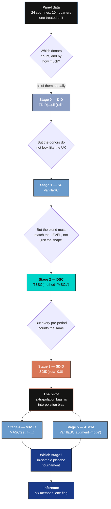

Read the diagram top to bottom as a conversation. Every arrow labelled "but" is an objection to the stage above it, and every box below an objection is the estimator that answers it. The two boxes hanging off the pivot are not a further step up but two different reactions to the same discovery, which is why the ladder branches there rather than continuing.

## 2. Key concepts

Eight ideas carry the whole post. Two repay slow reading: the distinction between unit weights and time weights, and the difference between an estimator and the *solver* that fits it.

**The missing counterfactual and the donor pool.**
There is one United Kingdom and it took the treatment. The path it would have followed without Brexit is in no dataset. Synthetic control builds that path from countries that were not treated, and those countries are the donor pool.

<div class="concept-pair">
<details class="concept-card concept-example">
<summary>Example</summary>

After dropping the twelve OECD countries with incomplete records, 24 remain. The UK is the treated unit; the other 23 — from Australia to the United States — are the donor pool. In `mlsynth` you never name them: the library reads the donor pool off the `treat` column, which is 1 for the treated unit in post-treatment periods and 0 everywhere else.

</details>

<details class="concept-card concept-analogy">
<summary>Analogy</summary>

The master tape of a song is lost and the band has broken up. You hire session musicians and rehearse them against a bootleg until they are indistinguishable from the original, then have them play a song the original band never recorded. The donor pool is the pool of session musicians; the pre-treatment period is the rehearsal.

</details>
</div>

**The simplex.**
Synthetic control weights must be non-negative and sum to one. That set of allowed weight vectors is the simplex, and the blends it can reach form the convex hull of the donors.

<div class="concept-pair">
<details class="concept-card concept-example">
<summary>Example</summary>

`mlsynth` reports the constraint it imposed. `VanillaSC` returns `weights.summary_stats["constraint"]` as `"simplex (non-negative, sum to 1)"`, and only nine of the 23 donors come back with any weight at all: Hungary 0.2231, the United States 0.1926, Japan 0.1826, Canada 0.1751, Norway 0.1350, and four smaller ones.

</details>

<details class="concept-card concept-analogy">
<summary>Analogy</summary>

Hammer a pin into a corkboard for every donor country, stretch a rubber band around all the pins and let it snap tight. Everything inside is reachable by some blend; nothing outside is. Reaching outside would need a negative amount of some country, like a recipe calling for minus two eggs.

</details>
</div>

**Unit weights and time weights.**
Unit weights say how much each donor country counts. Time weights say how much each pre-treatment quarter counts. Both are chosen by the same kind of optimisation, run in two different directions.

<div class="concept-pair">
<details class="concept-card concept-example">
<summary>Example</summary>

`mlsynth` keeps them in separate places, and finding the second one is the single most common stumbling block. Unit weights are `result.donor_weights`; SDID's time weights are `result.cohorts[a].time_weights`. Ours put 0.9585 on 2016Q2 and roughly nothing on the other 85 quarters.

</details>

<details class="concept-card concept-analogy">
<summary>Analogy</summary>

A mixing desk has two banks of faders. The first sets how loud each instrument is; the second sets which seconds of the rehearsal tape you play back when you check the mix. Difference-in-differences leaves both banks flat. Synthetic control moves the first. Synthetic difference-in-differences moves both.

</details>
</div>

**The intercept, which is a unit fixed effect in disguise.**
Sometimes the blend moves in near-perfect parallel with the treated unit but sits at a slightly different level. The intercept is the average pre-treatment gap, subtracted off, and adding it is exactly the same as putting a unit fixed effect in the regression.

<div class="concept-pair">
<details class="concept-card concept-example">
<summary>Example</summary>

For the UK, `TSSC`'s `MSCa` variant estimates an intercept of $+0.00241$ log points, about a quarter of one per cent of GDP. That is why demeaned SC lands at 2.99% and plain SC at 3.04%: a small intercept is evidence that the SC fit was already level-balanced.

</details>

<details class="concept-card concept-analogy">
<summary>Analogy</summary>

Your bathroom scale reads two kilograms heavy. You do not throw it out; you subtract two. Plain synthetic control insists on a scale that is already exactly right and will reject a perfectly consistent one. Demeaned synthetic control just calibrates the offset.

</details>
</div>

**Extrapolation bias and interpolation bias.**
Two different ways a weighted counterfactual goes wrong. Extrapolation bias: the blend's characteristics do not match the treated unit's. Interpolation bias: the characteristics match, but the outcome is a curved function of them, so averaging outcomes is not the same as the outcome at the average. Neither name means quite what you would guess.

<div class="concept-pair">
<details class="concept-card concept-example">
<summary>Example</summary>

The unit weights $\omega$ attack extrapolation bias; matching attacks interpolation bias; SDID's time weights $\lambda$ are what let one estimator attack both. That claim is the theoretical contribution of the paper this post replicates, and section 16 is where we test it.

</details>

<details class="concept-card concept-analogy">
<summary>Analogy</summary>

Extrapolation bias is guessing a stranger's weight from a photograph of someone else. Interpolation bias is averaging the heights of a five-year-old and a fifty-year-old and calling the result the height of a typical twenty-seven-year-old — both inputs are real people, but growth is not linear in age.

</details>
</div>

**The configuration object.**
Every `mlsynth` estimator takes one dictionary, validated by Pydantic. Five fields are always the same: `df`, `outcome`, `treat`, `unitid`, `time`. Everything else is estimator-specific.

<div class="concept-pair">
<details class="concept-card concept-example">
<summary>Example</summary>

Swapping `VanillaSC` for `SDID` in a script means changing one word. The five data fields, the DataFrame, the treatment indicator and the call pattern `Estimator(config).fit()` are all identical. The configs set `extra="forbid"`, so writing `backendd=` instead of `backend=` raises `MlsynthConfigError` rather than being ignored.

</details>

<details class="concept-card concept-analogy">
<summary>Analogy</summary>

A camera body with interchangeable lenses. The grip, the shutter button and the memory card do not change when you swap a wide angle for a macro; only the glass does, and only the glass has its own settings.

</details>
</div>

**The solver's fingerprint.**
An estimator is a mathematical object. Fitting it requires an optimiser, and on a badly conditioned problem two correct optimisers stop in different places.

<div class="concept-pair">
<details class="concept-card concept-example">
<summary>Example</summary>

`mlsynth` hands the synthetic-control problem to a convex solver and returns 3.039%. R's `synthdid` walks the same objective with Frank-Wolfe on a capped iteration budget and stops at 3.06%. Neither is buggy. Section 15 shows why the difference is the interesting part.

</details>

<details class="concept-card concept-analogy">
<summary>Analogy</summary>

Two hikers are told to find the lowest point of a wide, almost flat valley in fog. They both walk downhill and they both stop when the ground stops obviously falling away. They end up two hundred metres apart, and both are following the instructions correctly.

</details>
</div>

**A three-letter trap: DSC.**
`mlsynth` ships a class named `DSC`. It is not the estimator on this ladder, and importing the wrong one raises no error at all.

<div class="concept-pair">
<details class="concept-card concept-example">
<summary>Example</summary>

`mlsynth.DSC` is *Distributional* Synthetic Control (Gunsilius 2023): it matches whole outcome distributions in Wasserstein space and needs micro-level data with many observations per unit-period. This post's DSC is *Demeaned* Synthetic Control, which in `mlsynth` is `TSSC(method="MSCa")`. Section 6 is devoted to this.

</details>

<details class="concept-card concept-analogy">
<summary>Analogy</summary>

Two colleagues in the same building are both called J. Smith. Sending the quarterly report to the wrong one does not bounce. It just arrives somewhere useless, and you find out weeks later.

</details>
</div>

With the vocabulary in place, we can install the library.

## 3. Setup: installing mlsynth

### 3.1 Install and version pinning

`mlsynth` is on PyPI, but both the README and the documentation still recommend installing from GitHub — and there is a concrete reason to follow that advice rather than reach for `pip install mlsynth`.

**The PyPI release numbered 1.0.0 is behind git `main` at the same version number.** Installing from PyPI gives you a package that reports `mlsynth.__version__ == "1.0.0"` but is missing `VanillaSCConfig.w_constr`, which sections 9.2 and 19 use. Nothing in the version string warns you. So install from git, and pin the commit:

```python
# The moving target:
#   pip install -U "git+https://github.com/jgreathouse9/mlsynth.git"
#
# The exact commit this post was verified against:
#   pip install -U "git+https://github.com/jgreathouse9/mlsynth.git@15f168b"
#
# Optional extras:
#   "mlsynth[design] @ git+..."  SCIP solver, for SYNDES / MAREX designs
#   "mlsynth[bayes]  @ git+..."  NumPyro, for SPOTSYNTH's Bayesian mode
#   "mlsynth[all]    @ git+..."  everything

import warnings
warnings.filterwarnings("ignore")

import matplotlib.pyplot as plt
import numpy as np
import pandas as pd

import mlsynth
from mlsynth import FDID, MASC, SDID, TSSC, VanillaSC
from mlsynth.exceptions import MlsynthConfigError, MlsynthDataError

print("mlsynth", mlsynth.__version__)
print("estimators exported:", len(mlsynth.__all__))
```

```text
mlsynth 1.0.0
estimators exported: 92
```

Everything below was produced with **`mlsynth` 1.0.0 at commit `15f168b`**, Python 3.13.11, NumPy 2.3.5, pandas 3.0.1, Matplotlib 3.10.8 and CVXPY 1.8.1. `mlsynth` requires Python 3.10 or later — the README's claim of 3.9 is out of date, and `pyproject.toml` is the authority. The core dependencies are pandas, NumPy, Matplotlib, SciPy, scikit-learn, statsmodels, CVXPY, ECOS, Pydantic and PyArrow; both optional solver backends are lazily imported, so a base install can always `import mlsynth` and construct any estimator class.

### 3.2 The library at a glance

Ninety-two exported names is a lot, and the temptation is to reach for whichever class name looks closest to what you want. Resist it: several of the names are near-homonyms of each other. The library ships a machine-readable index of the whole catalogue, which is the fastest way to find out what a class actually does.

```python
from mlsynth._guides_api import get_llm_guide

guide = get_llm_guide()          # "concise" | "full" | "practitioner"
print(guide[:420])
```

```text
# mlsynth

> mlsynth is a strongly-typed Python library of synthetic-control and
> difference-in-differences estimators for causal inference with panel data.
> Every estimator exposes a Pydantic config and a `.fit()` that returns a
> standardized results object. Most are validated against the source paper's
> empirical result, Monte Carlo, or an authoritative reference implementation
> (see the Replications page).
```

That guide is worth reading in full before you pick an estimator, and section 20 tabulates the part of it relevant to this ladder. For now the important sentence is the second one: *every* estimator exposes a Pydantic config and a `.fit()` that returns a standardized result. That uniformity is the whole reason this post can cover six estimators without six separate interfaces to learn.

## 4. The mlsynth data contract

### 4.1 Five fields, one long panel

Every estimator in the library wants the same five things: a long-format DataFrame with one row per unit-period, and the names of the outcome, treatment, unit and time columns. The `treat` column is a 0/1 indicator that is 1 for the treated unit in post-treatment periods and 0 everywhere else — including for the treated unit *before* treatment.

That convention is worth dwelling on, because it is where most first attempts go wrong. `treat` is not "this unit is ever treated"; it is "this unit is under treatment right now". `mlsynth` reads both the donor pool and the treatment date off that single column.

```python
panel = pd.read_csv("brexit_analysis.csv")
print(f"{panel.shape[0]} rows x {panel.shape[1]} columns")
print(f"{panel.country.nunique()} countries, quarters t = {panel.t.min()}..{panel.t.max()}")
print(panel[["country", "quarter_label", "t", "log_rgdp", "treated"]].head(3).to_string(index=False))
```

```text
2496 rows x 16 columns
24 countries, quarters t = 1..104
  country quarter_label  t  log_rgdp  treated
Australia        1995Q1  1 -0.351514        0
Australia        1995Q2  2 -0.345316        0
Australia        1995Q3  3 -0.339262        0
```

The panel is quarterly log real GDP for 24 OECD economies over 1995Q1–2020Q4, assembled by Born, Müller, Schularick and Sedláček [2] and redistributed in the replication package of de Brabander, Juodis and Miyazato Szini [1]. There are no missing values, 23 donors, and 86 pre-treatment quarters if we date the treatment at 2016Q3.

### 4.2 Pydantic configs, and what happens when you get it wrong

The configs are Pydantic v2 models with `extra = "forbid"`. In practice this means the library refuses to accept a field it does not recognise, which is a much better failure mode than silently ignoring it.

```python
base = dict(df=window(T_2018Q4), outcome="log_rgdp", treat="treat",
            unitid="country", time="tt", display_graphs=False)

for bad, why in [
    (dict(base, backendd="outcome-only"), "misspelled keyword"),
    (dict(base, outcome="gdp_log"),       "column not in the DataFrame"),
]:
    try:
        VanillaSC(bad).fit()
    except (MlsynthConfigError, MlsynthDataError) as exc:
        print(f"{why:<28s} -> {type(exc).__name__}: {str(exc).splitlines()[0][:70]}")
```

```text
misspelled keyword           -> MlsynthConfigError: 1 validation error for VanillaSCConfig
column not in the DataFrame  -> MlsynthDataError: Missing required columns in DataFrame 'df': gdp_log
```

There are four exception types — `MlsynthConfigError`, `MlsynthDataError`, `MlsynthEstimationError` and `MlsynthPlottingError` — and they tell you which phase failed. A `MlsynthConfigError` means you wrote the config wrong; a `MlsynthDataError` means the DataFrame does not satisfy the contract (empty, missing columns, duplicate unit-period pairs); a `MlsynthEstimationError` means the optimiser gave up. Catching the first two separately from the third is a good habit in any loop over specifications.

### 4.3 What the data look like before we assume anything

Before fitting anything, look at the twenty-four series.

```python
fig, ax = plt.subplots(figsize=(9.5, 6))
for c in DONORS:
    ax.plot(QDEC, Y[c], color=GREY_DONOR, lw=0.8, alpha=0.75)
ax.plot(QDEC, Y[TREATED], color=ORANGE, lw=2.4, label="United Kingdom", zorder=5)
ax.axvline(QDEC[T0], color=LIGHT_TEXT, ls="--", lw=1.0)
ax.set_xlabel("year"); ax.set_ylabel("log real GDP")
plt.savefig("python_sc_dsc_sdid_01_gdp_paths.png", dpi=300, bbox_inches="tight")
plt.show()
```

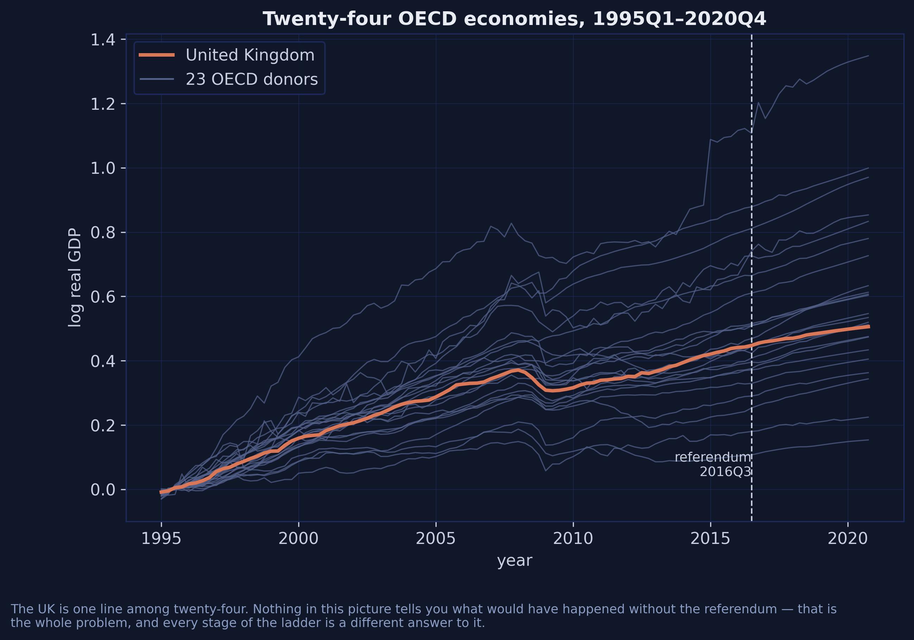

The UK is one line among twenty-four, and nothing in the picture tells you what would have happened without the referendum. Notice also that the series are strongly trending and highly correlated: this is close to a set of random walks with drift, which will matter enormously in section 11 when we look at what the time weights do.

### 4.4 The one trick that makes everything else simple

Every `mlsynth` estimator reports an ATT averaged over **all** post-treatment periods. But the question here — and the question in the published tables — is the shortfall at two specific quarters, 2018Q4 and 2019Q4.

There is a neat way to get exactly that without any post-estimation arithmetic. Keep the 86 pre-treatment quarters plus the single quarter of interest, renumber time so it runs 1 to 87, and "the average over all post periods" becomes an average over one period. A bare `.fit()` then returns precisely the number you want.

```python
T0 = 86                                    # pre-treatment quarters, through 2016Q2
EVAL = {"2018Q4": 96, "2019Q4": 100}       # evaluation quarters, as values of `t`
TREATED = "United Kingdom"

def window(post, pre=T0):
    """`pre` pre-treatment quarters + the given post quarter(s), renumbered 1..pre+1."""
    post = [post] if np.isscalar(post) else list(post)
    sub = panel[(panel.t <= pre) | (panel.t.isin(post))].copy()
    sub["tt"] = sub.groupby("country")["t"].rank(method="dense").astype(int)
    sub["treat"] = ((sub.country == TREATED) & (sub.tt > pre)).astype(int)
    return sub

def cfg(post, pre=T0, **extra):
    """The five fields every mlsynth estimator wants, plus estimator-specific ones."""
    return dict(df=window(post, pre), outcome="log_rgdp", treat="treat",
                unitid="country", time="tt", display_graphs=False, **extra)

def pct(att):
    """mlsynth reports treated minus counterfactual. Flip into a % GDP shortfall."""
    return -100.0 * att
```

Those three helpers are the entire scaffolding of this post. `cfg` is the reason every subsequent code block is one line long, and `pct` is the reason every number is positive: `mlsynth` reports the ATT as treated minus counterfactual, which is negative when the treatment hurt, and the literature reports Brexit as a positive percentage *loss*.

In formal terms, the estimand throughout is the average treatment effect on the treated at a single period,

$$\tau\_t = Y\_{\text{UK},t}(1) - Y\_{\text{UK},t}(0),$$

where $Y\_{\text{UK},t}(0)$ is the unobserved no-Brexit path. Every stage is a different estimator of that same quantity, and we report $-100 \times \tau\_t$ so that a larger number means a larger loss.

## 5. Anatomy of a fit

### 5.1 Config in, standardized result out

The call pattern never changes: build a config, construct the estimator, call `.fit()`, read the result.

```python
res = VanillaSC(cfg(96, inference=False)).fit()

print(f"type(result)                 {type(res).__name__}")
print(f"result.att                   {res.att:+.6f}")
print(f"result.pre_rmse              {res.pre_rmse:.6f}")
print(f"result.fit_diagnostics.r_squared_pre  {res.fit_diagnostics.r_squared_pre:.6f}")
print(f"result.method_details.method_name     {res.method_details.method_name}")
print(f"len(result.donor_weights)    {len(res.donor_weights)}")
print(f"result.counterfactual.shape  {np.shape(res.counterfactual)}")
```

```text
type(result)                 BaseEstimatorResults
result.att                   -0.030388
result.pre_rmse              0.005589
result.fit_diagnostics.r_squared_pre  0.998060
result.method_details.method_name     VanillaSC[outcome-only]
len(result.donor_weights)    9
result.counterfactual.shape  (87,)
```

Two things are worth noticing. `len(result.donor_weights)` is 9, not 23: `mlsynth` returns only the donors with non-zero weight, so do not treat that dictionary as a dense vector over the donor pool. And `method_details.method_name` reports `VanillaSC[outcome-only]`, which is the backend the `"auto"` setting resolved to — the library tells you which algorithm it actually ran, which is exactly the information you need when comparing against another implementation.

The result is a `BaseEstimatorResults` (aliased `EffectResult`), organised into six sub-models plus a set of flat convenience accessors:

| Sub-model | Contains |
|---|---|
| `effects` | `att`, `att_percent`, `att_std_err`, `additional_effects` |
| `fit_diagnostics` | `rmse_pre`, `r_squared_pre`, `rmse_post` |
| `time_series` | `observed_outcome`, `counterfactual_outcome`, `estimated_gap`, `time_periods` |
| `weights` | `donor_weights`, `time_weights`, `unit_weights`, `summary_stats` |
| `inference` | `p_value`, `ci_lower`, `ci_upper`, `standard_error`, `method`, `details` |
| `method_details` | `method_name`, `is_recommended`, `parameters_used` |

| Flat accessor | Resolves to |
|---|---|
| `.att` | `effects.att` |
| `.att_ci` | `(inference.ci_lower, inference.ci_upper)` |
| `.counterfactual` | `time_series.counterfactual_outcome` |
| `.gap` | `time_series.estimated_gap` |
| `.donor_weights` | `weights.donor_weights` |
| `.weight_vector` | dense array of `donor_weights.values()` |
| `.pre_rmse` | `fit_diagnostics.rmse_pre` |

Learn the seven flat accessors and you can read the output of any effect estimator in the library without opening its documentation.

### 5.2 Plotting: what the package gives you for free

Every effect result carries a `.plot()` method driven by a `PlotConfig`. Set `display_graphs=True` and you get a figure without writing any Matplotlib at all.

```python
res = VanillaSC(cfg(96, inference=False)).fit()

fig, axes = plt.subplots(1, 2, figsize=(11, 4.2))
# display=False on every call. Without it .plot() ends in plt.show(), which in
# a notebook flushes the figure after the FIRST panel and leaves the second empty.
res.plot(kind="counterfactual", ax=axes[0], display=False)
res.plot(kind="gap", ax=axes[1], display=False)
plt.tight_layout()
plt.show()
```


That figure is deliberately unstyled — it is what the library draws with no help from us, and it is already publishable. `kind` takes `"auto"`, `"counterfactual"` or `"gap"`; passing `ax=` lets you compose several results into one panel.

The `display=False` above is not cosmetic, and it is worth a paragraph because it is a fourth silent default. `.plot()` ends with `if pc.display: plt.show()`, and the `PlotConfig` it consults is `self.plot_config or PlotConfig()` — but the fitted result's `plot_config` is `None`, so the `display_graphs=False` you set on the config never reaches it and the fallback `PlotConfig()` has `display=True`. In a script the stray `plt.show()` is a harmless no-op under the Agg backend. In a notebook it flushes and closes the figure after the first panel, so the second panel renders blank and a stray `<Figure size 640x480 with 0 Axes>` appears underneath. The per-call `display=False` override is the fix; the same applies any time you compose two `.plot()` calls into one figure.

Cosmetics are configured through the nested `plot` field rather than through Matplotlib, so a house style travels with the config:

```python
from mlsynth.config_models import PlotConfig

styled = VanillaSC(cfg(96, inference=False, plot=PlotConfig(
    observed_color="#d97757",
    counterfactual_colors=["#6a9bcc"],
    counterfactual_linestyle="--",
    xlabel="quarter index (renumbered 1..87)",
    ylabel="log real GDP",
    title="VanillaSC via PlotConfig",
    display=False,
))).fit()
```

The legacy flat fields `treated_color` and `counterfactual_color` still work — note that the latter takes a *list*, not a string — but `PlotConfig` is the maintained route and supports themes, save targets and per-call overrides.

Every remaining figure in this post is drawn by hand in the site's dark palette, because a tutorial benefits from consistent colours. In your own work, `display_graphs=True` is usually enough.

### 5.3 Where estimators deviate from the standard result

Three of the six estimators return a richer object than `BaseEstimatorResults`, and each adds exactly what its method needs:

| Estimator | Returns | The extra you need |
|---|---|---|
| `FDID` | `FDIDResults` | `.fdid` and `.did`, two `FDIDMethodFit` objects — the forward-selected fit and the plain two-way DiD benchmark |
| `TSSC` | `TSSCResults` | `.variants` (a dict of the four MSC variants), `.selection` (the Step-1 tests), `.recommended_method` |
| `SDID` | `SDIDResults` | `.inference_detail`, `.event_study`, `.cohorts[a]` (which is where the time weights live) |

All three still populate the standard sub-models and flat accessors, so `.att` works everywhere. The extras are additive, not alternative.

## 6. A naming hazard, before we import anything

This section exists because getting it wrong costs nothing at runtime and everything in interpretation.

**`mlsynth.DSC` is not the DSC on this ladder.**

- `mlsynth.DSC` is **Distributional** Synthetic Control (Gunsilius 2023, *Econometrica*). It reconstructs the treated unit's whole outcome *distribution* as a Wasserstein-space average of donor distributions and returns quantile treatment effects. It requires **micro-level** data: many individual observations per unit-period. Handed a panel like ours, with one observation per country-quarter, it is answering a question the data cannot support.
- The DSC on this ladder is **Demeaned** Synthetic Control (Doudchenko and Imbens [8]; Ferman and Pinto [9]) — synthetic control plus an intercept. In `mlsynth` it is `TSSC(method="MSCa")`.

Same three letters, different estimators, and no error is raised. The mapping used throughout this post follows [mlsynth issue #312](https://github.com/jgreathouse9/mlsynth/issues/312), which is itself a reading of the paper we replicate.

The library has several more acronym neighbours worth knowing about before you reach for one by name:

| Class | Is actually | Not to be confused with |
|---|---|---|
| `DSC` | **D**istributional SC (Gunsilius) | demeaned SC = `TSSC(method="MSCa")` |
| `DSCAR` | **D**ynamic SC for **A**uto-**R**egressive processes | either of the above |
| `SCD` | SC with **D**ifferencing | `DSC` |
| `DRSC` | **D**istribution-**R**egression SC | `DSC` |
| `MEDSC` | **Med**iation SC | demeaned SC |

The general lesson is that in a ninety-two-class library, the class name is a mnemonic and not a definition. Check the docstring before you fit.

## 7. One regression, six sets of weights

Before the code, one unifying idea. Every stage on this ladder is the same weighted two-way regression,

$$(\hat\tau, \hat\mu, \hat\alpha, \hat\beta) = \arg\min \sum\_{i,t} \omega\_i \lambda\_t \left( Y\_{it} - \mu - \alpha\_i - \beta\_t - \tau D\_{it} \right)^2,$$

with a different choice of the unit weights $\omega\_i$ and the time weights $\lambda\_t$. In words: fit a two-way fixed-effects regression, but let some units and some periods count more than others. The stages differ only in how those two weight vectors are chosen.

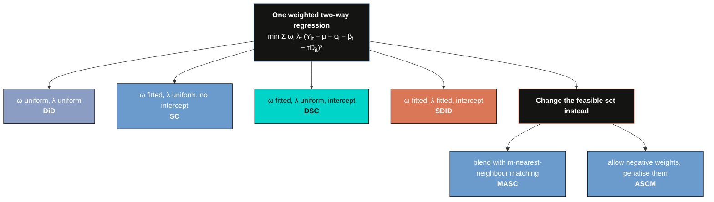

The diagram splits the ladder into two families. The first four stages change *which weights* the same regression uses. The last two change *what weights are allowed at all* — MASC by mixing in a different estimator, ASCM by relaxing the simplex. That distinction is why the ladder branches rather than continuing upward, and it is the reason section 16's tournament cannot simply declare the top stage the winner.

Here is the whole ladder as `mlsynth` code, which is the table to bookmark:

| Stage | $\omega$ | $\lambda$ | mlsynth call |
|---|---|---|---|
| DiD | uniform | uniform | `FDID(cfg).fit().did` |
| SC | fitted, simplex | uniform | `VanillaSC(cfg)` |
| DSC | fitted, simplex + intercept | uniform | `TSSC(cfg, method="MSCa")` |
| SDID | fitted, simplex + intercept | fitted, simplex | `SDID(cfg, zeta=0.0)` |
| MASC | convex blend of matching and SC | uniform | `MASC(cfg, set_f=...)` |
| ASCM | SC weights plus a ridge correction | uniform | `VanillaSC(cfg, augment="ridge")` |

Now we climb it.

## 8. Stage 0 — Difference-in-differences

`mlsynth` has no standalone DiD class, and this trips people up. The plain two-way estimator comes free inside `FDID` (Forward DiD, Li 2024), which fits its own estimator and the textbook benchmark side by side and exposes them as `.fdid` and `.did`.

```python
fdid_res = {k: FDID(cfg(e)).fit() for k, e in EVAL.items()}
did = {k: r.did for k, r in fdid_res.items()}

print(f"DiD  2018Q4 {pct(did['2018Q4'].att):.2f}%   2019Q4 {pct(did['2019Q4'].att):.2f}%")
print(f"SE (analytic) {100 * did['2018Q4'].att_se:.2f}")

wd = did["2018Q4"].donor_weights
print(f"donor weights: {len(wd)} donors, all equal to {next(iter(wd.values())):.6f} = 1/{len(wd)}")
print(f"pre-treatment RMSE {did['2018Q4'].pre_rmse:.5f}, R^2 {did['2018Q4'].r_squared:.4f}")
```

```text
DiD  2018Q4 4.98%   2019Q4 6.18%
SE (analytic) 2.19
donor weights: 23 donors, all equal to 0.043478 = 1/23
pre-treatment RMSE 0.02170, R^2 0.9706
```

Difference-in-differences puts the Brexit cost at 4.98% of GDP by the end of 2018 — far above every other stage, and far above the 2.4% previously published. The uniform $1/23 = 0.043478$ weights are the giveaway that nothing was fitted: DiD assumes the average of all twenty-three OECD economies would have moved in parallel with the UK, and the pre-treatment RMSE of 0.0217 says it did not. That number is roughly four times the 0.0056 that synthetic control achieves, and it is the entire reason the rest of the ladder exists.

**A free seventh stage.** The same call also gives you Forward DiD, which selects a subset of donors greedily and then runs DiD on them. It is not on the paper's ladder, but it costs nothing:

```python
f18 = fdid_res["2018Q4"].fdid
print(f"Forward DiD selects {len(f18.selected_names)} donors: {', '.join(f18.selected_names)}")
print(f"Forward DiD  2018Q4 {pct(f18.att):.2f}%   pre-RMSE {f18.pre_rmse:.5f}")
```

```text
Forward DiD selects 4 donors: Norway, Hungary, Austria, United States
Forward DiD  2018Q4 2.42%   pre-RMSE 0.00880
```

Forward DiD picks four donors, cuts the pre-treatment RMSE from 0.0217 to 0.0088, and lands at 2.42% — remarkably close to Born et al.'s published 2.4%, and the lowest estimate anywhere in this post. Three of its four donors (Norway, Hungary, the United States) are also among synthetic control's five largest weights, which is reassuring: two quite different selection procedures are finding the same countries.

## 9. Stage 1 — Synthetic control

DiD's complaint is that the donor average does not look like the UK. Synthetic control fixes that by fitting the unit weights, subject to the simplex constraint

$$\hat\omega = \arg\min\_{\omega \in \mathbb{W}} \sum\_{t=1}^{T\_0} \left( Y\_{\text{UK},t} - \sum\_j \omega\_j Y\_{j,t} \right)^2, \qquad \mathbb{W} = \left\\{ \omega : \omega\_j \ge 0, \sum\_j \omega\_j = 1 \right\\}.$$

In words, pick the non-negative weights summing to one that make the blend track the UK as closely as possible over the 86 pre-treatment quarters. In code, `Y` is the `log_rgdp` column, the sum over $j$ runs over `DONORS`, and $T\_0$ is `T0 = 86`.

```python
sc = {k: VanillaSC(cfg(e, inference=False)).fit() for k, e in EVAL.items()}
s18 = sc["2018Q4"]

print(f"SC  2018Q4 {pct(s18.att):.2f}%   2019Q4 {pct(sc['2019Q4'].att):.2f}%")
print(f"backend chosen by 'auto': {s18.method_details.method_name}")
print(f"pre-RMSE {s18.pre_rmse:.6f}   R^2 {s18.fit_diagnostics.r_squared_pre:.5f}")

ss = s18.weights.summary_stats
print(f"weights: {ss['n_nonzero']} nonzero, sum {ss['sum_of_weights']:.6f}, {ss['constraint']}")
for c, w in sorted(s18.donor_weights.items(), key=lambda kv: -kv[1]):
    if w > 0.01:
        print(f"    {c:<16s} {w:.4f}")
```

```text
SC  2018Q4 3.04%   2019Q4 4.17%
backend chosen by 'auto': VanillaSC[outcome-only]
pre-RMSE 0.005589   R^2 0.99806
weights: 9 nonzero, sum 1.000000, simplex (non-negative, sum to 1)
    Hungary          0.2231
    United States    0.1926
    Japan            0.1826
    Canada           0.1751
    Norway           0.1350
    Ireland          0.0523
    Italy            0.0196
    Portugal         0.0124
```

Synthetic control puts the shortfall at 3.04% by the end of 2018 and 4.17% a year later, with a pre-treatment $R^2$ of 0.998. The synthetic UK is roughly a fifth Hungary, a fifth the United States, a fifth Japan, a sixth Canada and an eighth Norway. Fourteen of the twenty-three donors get nothing at all — this sparsity is a feature of the simplex constraint, not an accident, and it is why synthetic control estimates are usually easy to describe in a sentence.

Note that the United States carries about a fifth of the counterfactual. That will matter in section 19, when we ask whether the answer survives dropping it.

### 9.1 The five backends

`VanillaSC` has a `backend` field with five settings, and understanding when each applies saves a lot of confusion:

| `backend` | What it does | When it applies |
|---|---|---|
| `"auto"` (default) | `"outcome-only"` without covariates, `"mscmt"` with them | always a safe default |
| `"outcome-only"` | convex simplex fit on pre-treatment outcomes | no covariates; unique solution |
| `"mscmt"` | global differential-evolution search over predictor weights $V$ | covariates (Becker-Klössner) |
| `"malo"` | corner search over $V$ (Malo et al. 2024) | covariates |
| `"penalized"` | Abadie-L'Hour unique/sparse estimator | covariates, when uniqueness matters |

The distinction that matters: **with no covariates the problem is convex and has a unique solution; with covariates it becomes a bilevel program whose predictor weights are generically not identified.** That is why `VanillaSC` reports a `v_agreement` diagnostic alongside covariate fits — small means the predictor weights are well identified, large means they are fragile. We come back to this in section 17.

### 9.2 One estimator, four solvers

Here is where the package-level reading earns its keep. Plain synthetic control is a single mathematical object, but `mlsynth` can reach it four different ways, and R's `synthdid` reaches it a fifth.

(`tssc_att` below is a three-line helper that reads `TSSC`'s estimate off its
gap series rather than its rounded `.att` field. Section 10.1 explains why it is
needed; for now take it as "the unrounded ATT".)

```python
for label, klass, kw in [
    ("VanillaSC, backend='auto'",         VanillaSC, dict(inference=False)),
    ("VanillaSC, backend='outcome-only'", VanillaSC, dict(backend="outcome-only", inference=False)),
    ("VanillaSC, w_constr='simplex'",     VanillaSC, dict(w_constr="simplex", inference=False)),
    ("TSSC, method='SC'",                 TSSC,      dict(method="SC", inference=False)),
]:
    r = klass(cfg(96, **kw)).fit()
    att = tssc_att(r, "SC") if klass is TSSC else r.effects.att
    print(f"{label:<36s} 2018Q4 {pct(att):.3f}")

# Reference value from the R edition, not refitted here (see section 15).
print(f"{'R synthdid (Frank-Wolfe, published)':<36s} 2018Q4 3.060")
```

```text
VanillaSC, backend='auto'            2018Q4 3.039
VanillaSC, backend='outcome-only'    2018Q4 3.039
VanillaSC, w_constr='simplex'        2018Q4 3.039
TSSC, method='SC'                    2018Q4 3.039
R synthdid (Frank-Wolfe, published)  2018Q4 3.060
```

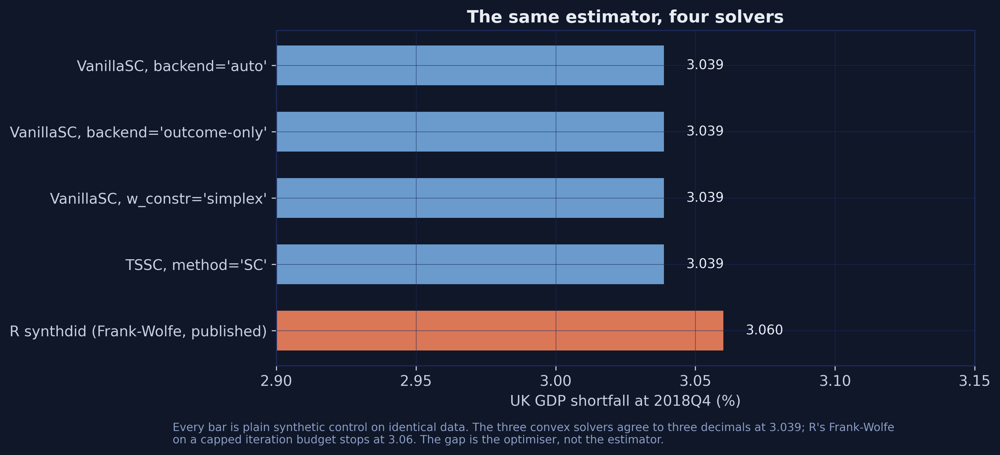

Four independent code paths inside `mlsynth` — two backends, an explicit constraint family, and a completely different estimator class — agree to three decimals at 3.039%. R's `synthdid` stops at 3.06%. Section 15 explains why, and argues that this is the most interesting number in the post.

The `w_constr` field, incidentally, is a general escape hatch. It accepts `"simplex"`, `"ols"`, `"lasso"`, `"ridge"` and `"L1-L2"`, which lets you ask what the estimate would be under a different feasible set without changing estimator classes. Section 19 uses it.

### 9.3 The counterfactual path

The windowed fits above answer "how large is the shortfall at 2018Q4". To draw the whole counterfactual path, fit once on the untruncated panel.

```python
full = cfg(list(range(T0 + 1, 105)))          # all 18 post-treatment quarters
sc_full = VanillaSC(dict(full, inference=False)).fit()

cf_sc = np.asarray(sc_full.counterfactual, float).ravel()
gap_sc = np.asarray(sc_full.gap, float).ravel()
print(f"pre-RMSE {sc_full.pre_rmse:.6f}, mean post gap {gap_sc[T0:].mean():+.5f} log points")
```

```text
pre-RMSE 0.005589, mean post gap -0.02882 log points
```


The average post-treatment gap is $-0.0288$ log points, or about 2.9% of GDP averaged across all eighteen quarters after the referendum. The bottom panel is the one to look at: the gap oscillates around zero for eighty-six quarters and then goes negative and stays there. That persistence, rather than the size of any single quarter's gap, is what makes the result credible.

## 10. Stage 2 — Demeaned synthetic control

Synthetic control insists the blend match the UK's *level*. Sometimes a blend tracks the shape perfectly while sitting slightly above or below, and plain SC will reject it in favour of a worse-shaped blend at the right level. Demeaned SC adds one free parameter — a constant offset — so the blend has to match the shape but not the level.

In `mlsynth` this is the `MSCa` variant of the two-step estimator of Li and Shankar (2023).

```python
dsc = {k: TSSC(cfg(e, method="MSCa", inference=False)).fit() for k, e in EVAL.items()}
d18 = dsc["2018Q4"].variants["MSCa"]

print(f"DSC  2018Q4 {pct(tssc_att(dsc['2018Q4'])):.2f}%   2019Q4 {pct(tssc_att(dsc['2019Q4'])):.2f}%")
print(f"MSCa intercept: {d18.intercept:+.6f} log points = {100 * d18.intercept:+.3f}% of GDP")
```

```text
DSC  2018Q4 2.99%   2019Q4 4.12%
MSCa intercept: +0.002410 log points = +0.241% of GDP
```

The estimated offset is $+0.0024$ log points, about a quarter of one per cent of GDP. That is small, and its smallness is informative: it says the SC fit was already close to level-balanced, which is why DSC's 2.99% sits so near SC's 3.04%.

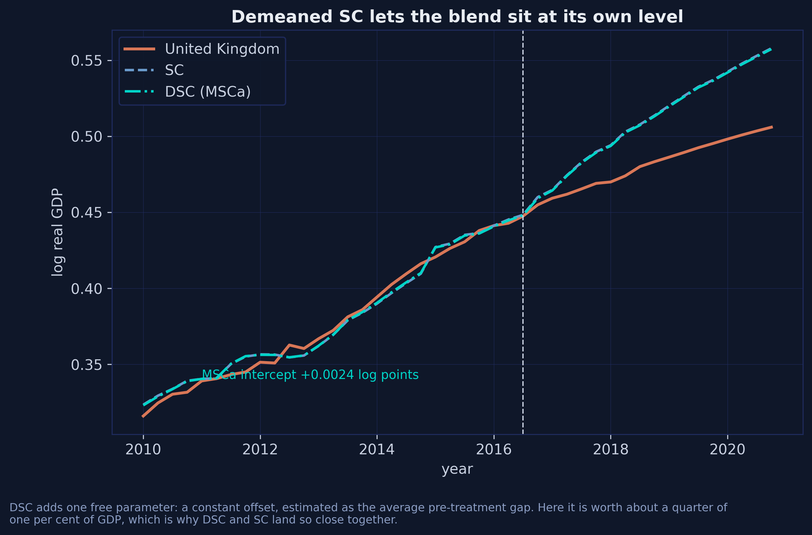

### 10.1 A precision trap worth knowing about

`TSSC` **rounds every scalar it reports.** The series it returns are full precision, but `.att`, `.rmse_pre` and the donor weights are rounded before they reach you.

```python
print(f"variants['MSCa'].att        {d18.att!r}   -> {pct(d18.att):.4f}%")
print(f"gap[-1] (full precision)    {np.asarray(d18.gap, float)[-1]!r}")
print(f"                            -> {pct(tssc_att(dsc['2018Q4'])):.4f}%")
print(f"variants['MSCa'].rmse_pre   {d18.rmse_pre!r}")
```

```text
variants['MSCa'].att        -0.03   -> 3.0000%
gap[-1] (full precision)    np.float64(-0.0298873295228968)
                            -> 2.9887%
variants['MSCa'].rmse_pre   0.006
```

Take the headline off `.att` and DSC reads exactly 3.00%. Take it off the gap series and it reads 2.99%, which is what `mlsynth`'s own replication table reports and what the published paper reports. A hundredth of a percentage point is not going to change anyone's policy view, but it will make you think you have failed to replicate a table when you have not. The fix is three lines:

```python
def tssc_att(res, variant="MSCa", n_post=1):
    """Full-precision ATT for a TSSC variant, read off the unrounded gap series."""
    gap = np.asarray(res.variants[variant].gap, float).ravel()
    return float(gap[-n_post:].mean())
```

The general lesson generalises past `TSSC`: when a package hands you both a scalar summary and the series it was computed from, and the two disagree, trust the series.

### 10.2 The four variants and the Step-1 selection

Left to itself, `TSSC` fits all four variants of the Li-Shankar estimator and runs a subsampling procedure to pick one. `method=` forces a single variant and skips the selection entirely.

```python
t_all = TSSC(cfg(96, draws=500, seed=SEED)).fit()      # no method= : fit all four

print(f"TSSC recommends: {t_all.recommended_method}")
for m in ("SC", "MSCa", "MSCb", "MSCc"):
    v = t_all.variants[m]
    ic = "none" if v.intercept is None else f"{v.intercept:+.5f}"
    print(f"  {m:<5s} loss {pct(tssc_att(t_all, m)):5.3f}%   "
          f"(.att reports {v.att:+.5f})   intercept {ic}")

for name, test in t_all.selection.tests.items():
    print(f"  test '{name}': stat {test.statistic:+.5f}  "
          f"CI [{test.ci_lower:+.5f}, {test.ci_upper:+.5f}]  rejected {test.rejected}")
```

```text
TSSC recommends: SC
  SC    loss 3.039%   (.att reports -0.03000)   intercept none
  MSCa  loss 2.989%   (.att reports -0.03000)   intercept +0.00241
  MSCb  loss 3.041%   (.att reports -0.03000)   intercept none
  MSCc  loss 3.021%   (.att reports -0.03000)   intercept +0.00282
```

```text
  test 'joint': stat +2.21193  CI [+0.02894, +9.10199]  rejected False
```

All four variants land between 2.99% and 3.04%, and all four report `.att` as exactly $-0.03$ — a compact demonstration of the rounding trap. The four differ in which constraints they impose: `SC` is the simplex with no intercept, `MSCa` adds an intercept, `MSCb` relaxes the sum-to-one constraint, and `MSCc` relaxes both. The Step-1 test does not reject the restriction, so `TSSC` recommends plain `SC`.

The cost of that convenience is real. Fitting four variants with 500 subsampling draws takes about 17 seconds; forcing one variant with `inference=False` takes 0.01 seconds — a factor of roughly 1,700. If you are running an estimator inside a loop, as we do in section 16, set `method=` and `inference=False`. Note that `inference=False` *requires* `method` to be set; asking for no inference without naming a variant raises, because there would be nothing to select with.

## 11. Stage 3 — Synthetic difference-in-differences

DSC still treats all eighty-six pre-treatment quarters as equally informative. SDID fits the time weights too, solving the transposed version of the same problem: which blend of quarters, judged across all donors, best predicts the treatment quarter.

```python
sdid = {k: SDID(cfg(e, zeta=0.0, vce="placebo", B=500, seed=SEED)).fit()
        for k, e in EVAL.items()}
s = sdid["2018Q4"]

print(f"SDID  2018Q4 {pct(s.effects.att):.2f}%   2019Q4 {pct(sdid['2019Q4'].effects.att):.2f}%")
inf = s.inference_detail
print(f"ATT {inf.att:+.5f}, SE {inf.se:.5f}, CI [{inf.ci[0]:+.5f}, {inf.ci[1]:+.5f}]")
print(f"p = {inf.p_value:.4f}, method '{inf.method}', n_placebo {inf.n_placebo}")
```

```text
SDID  2018Q4 2.80%   2019Q4 3.94%
ATT -0.02801, SE 0.02636, CI [-0.07968, +0.02365]
p = 0.2016, method 'placebo', n_placebo 500
```

SDID puts the shortfall at 2.80% and 3.94%. Note the standard error: 0.0264 against a point estimate of 0.0280, giving a confidence interval that comfortably contains zero and a placebo p-value of 0.20. With one treated unit and twenty-three donors, that is the honest state of the evidence — section 18 returns to it.

### 11.1 The one setting that carries the result

```python
default = SDID(cfg(96, vce="noinference")).fit()
print(f"zeta left at its default: {pct(default.effects.att):.2f}%")
print(f"zeta = 0.0:               {pct(sdid['2018Q4'].effects.att):.2f}%")
```

```text
zeta left at its default: 2.67%
zeta = 0.0:               2.80%
```

`zeta` is a ridge penalty on the unit weights, and it is on by default. Leave it alone and SDID reports 2.67%; set it to zero, which is what the paper solves, and it reports 2.80%. That 0.13-percentage-point gap is larger than the entire spread between SC, DSC and ASCM.

This is not an `mlsynth` quirk. **Every implementation in every language penalises by default**: R's `synthdid` needs `zeta.omega = 0`, Stata's `sdid` needs `zeta_omega(0)`, and `mlsynth` needs `zeta=0.0`. Stata's version is the nastiest, because its documented default of `1e-6` is a magic sentinel that requests the *full* penalty. The lesson survives translation: if you are replicating a published synthetic-DiD number, find out what the authors did with the penalty before you conclude anything.

One companion flag deserves a note because the documentation emphasises it:

```python
ia = SDID(cfg(96, zeta=0.0, intercept_adjust=True, vce="noinference")).fit()
print(f"intercept_adjust=True: {pct(ia.effects.att):.4f}%")
```

```text
intercept_adjust=True: 2.8012%
```

Identical to four decimals. `intercept_adjust` matters when there are several post-treatment periods to average over; under the truncate-and-renumber trick there is exactly one, so there is nothing to adjust. Worth setting anyway if you fit on an untruncated panel.

### 11.2 Time weights, cohorts and the event study

SDID's time weights are the one output that is not where you would first look. They live on the cohort object, not on `weights`:

```python
coh = list(sdid["2018Q4"].cohorts.values())[0]
lam = np.asarray(coh.time_weights, float)

print(f"cohorts: {list(sdid['2018Q4'].cohorts)}  (n_treated={coh.n_treated}, n_post={coh.n_post})")
print(f"lambda: {len(lam)} weights summing to {lam.sum():.6f}")
for i in np.where(lam > 1e-4)[0]:
    print(f"    {QLAB[i]:<8s} {lam[i]:.4f}")
```

```text
cohorts: [87]  (n_treated=1, n_post=1)
lambda: 86 weights summing to 1.000000
    2008Q4   0.0386
    2014Q3   0.0029
    2016Q2   0.9585
```

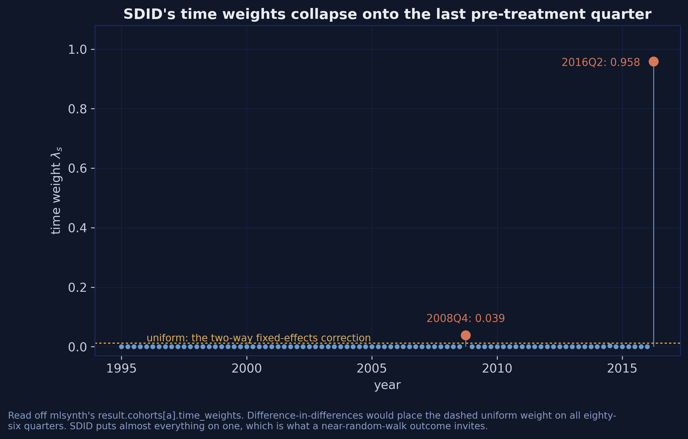

The time weights put 95.85% of their mass on 2016Q2, the last pre-treatment quarter, and essentially nothing on the other eighty-five. Difference-in-differences would place the dashed uniform weight, $1/86 \approx 0.0116$, on all of them.

Why? Because log real GDP behaves close to a random walk. If the outcome is a random walk, the best predictor of next quarter is *this* quarter, and the eighty-five quarters before it add noise rather than information. The source paper reports exactly this collapse and attributes it to the same cause. Do not read it as a bug; read it as SDID correctly discovering that most of the pre-treatment history is not informative about the level at the treatment date.

`mlsynth` also aggregates an event-study estimator alongside the headline ATT, which the R packages on this ladder do not:

```python
full_sdid = SDID(dict(full, zeta=0.0, vce="placebo", B=200, seed=SEED)).fit()
es = full_sdid.event_study
et, tau = np.asarray(es.event_times, float), np.asarray(es.tau, float)

print(f"event times {et.min():.0f}..{et.max():.0f}")
print(f"post-treatment tau mean {tau[et > 0].mean():+.5f}")
print(f"pre-treatment tau mean  {tau[(et < 0) & (et >= -20)].mean():+.5f}")
```

```text
event times -86..17
post-treatment tau mean -0.02809
pre-treatment tau mean  +0.00208
```

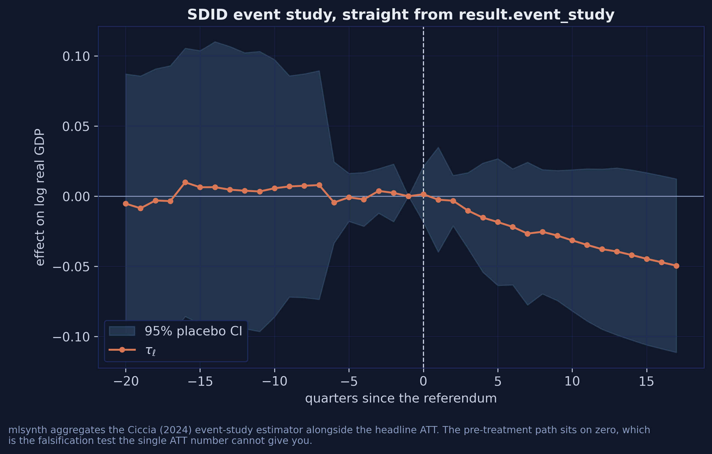

The pre-treatment effects average $+0.0021$ — essentially zero — while the post-treatment effects average $-0.0281$. That flat pre-treatment path is a falsification test the single ATT number cannot give you, and it is available from `result.event_study` for the cost of one extra line.

### 11.3 Three flavours of SDID

The time weights have to be fitted against *something* in the post-treatment period, and there are three natural choices. The published paper reports all three, and only the last falls out of a bare `.fit()`.

| Variant | $\lambda$ is fitted to predict | Evaluated at |
|---|---|---|
| (i) | the first treated quarter, 2016Q3 | any horizon |
| (ii) | the average of 2016Q3 through the evaluation date | that date |
| (iii) | the evaluation quarter alone | that date |

Variants (i) and (ii) need the weights the result already hands you, applied at a different quarter. This is a good demonstration of reading $\omega$ and $\lambda$ back out of a fitted result and using them yourself:

$$\hat\tau\_t = \left( Y\_{\text{UK},t} - \sum\_j \hat\omega\_j Y\_{j,t} \right) - \sum\_{s \le T\_0} \hat\lambda\_s \left( Y\_{\text{UK},s} - \sum\_j \hat\omega\_j Y\_{j,s} \right).$$

In words: take the gap at the evaluation quarter, then subtract the $\lambda$-weighted average gap over the pre-treatment period. The second term is the bias adjustment, and it is the only thing that differs between the three flavours.

```python
def sdid_weights(post, pre=T0):
    """Fit SDID on a given post window; return (omega dict, lambda array)."""
    res = SDID(cfg(post, pre, zeta=0.0, vce="noinference")).fit()
    return res.donor_weights, np.asarray(list(res.cohorts.values())[0].time_weights, float)

def sdid_loss(w, lam, t, pre=T0):
    """Apply an (omega, lambda) pair at an arbitrary quarter."""
    wv = np.array([w[c] for c in DONORS])
    gap = lambda s: float(Y.loc[s, TREATED] - Y.loc[s, DONORS].to_numpy() @ wv)
    bias = float(sum(lam[s - 1] * gap(s) for s in range(1, pre + 1)))
    return -100.0 * (gap(t) - bias)

w_i,   lam_i   = sdid_weights(T0 + 1)                       # (i)
w_ii,  lam_ii  = sdid_weights(range(T0 + 1, 97))            # (ii)
w_iii, lam_iii = sdid_weights(96)                           # (iii)

print(f"SDID (i)    2018Q4 {sdid_loss(w_i,   lam_i,   96):.3f}")
print(f"SDID (ii)   2018Q4 {sdid_loss(w_ii,  lam_ii,  96):.3f}")
print(f"SDID (iii)  2018Q4 {sdid_loss(w_iii, lam_iii, 96):.3f}")
```

```text
SDID (i)    2018Q4 2.771
SDID (ii)   2018Q4 2.801
SDID (iii)  2018Q4 2.801
```

The three variants land within **0.03 percentage points** of each other, because all three put essentially all their time weight on the same last pre-treatment quarter. Whatever else is uncertain here, the choice among SDID flavours is not where the uncertainty lives — a conclusion the published paper's placebo table appears to contradict, and section 16 shows why that appearance is an artefact.

### 11.4 Choosing an inference method

`SDID`'s `vce` field takes four values, and the right choice depends on what you are doing:

| `vce` | Method | Use when |
|---|---|---|
| `"placebo"` (default) | refit treating each donor as pseudo-treated | one treated unit — the only valid choice here |
| `"jackknife"` | leave-one-treated-unit-out | several treated units |
| `"bootstrap"` | resample units with replacement | many treated units |
| `"noinference"` | skip it | inside a loop, where you only want the point estimate |

With a single treated unit, jackknife and bootstrap have nothing to resample, so placebo is the only defensible option. `"noinference"` is what section 16's tournament uses, and it is the difference between a two-minute loop and a two-hour one.

## 12. Stage 4 — MASC

Sections 9 to 11 improve the counterfactual by choosing better weights within the simplex. MASC (Kellogg, Mogstad, Pouliot and Torgovitsky [11]) does something different: it forms a convex combination of synthetic control and $m$-nearest-neighbour matching,

$$\hat{Y}^{\text{MASC}} = \phi \cdot \hat{Y}^{\text{match}}\_m + (1 - \phi) \cdot \hat{Y}^{\text{SC}},$$

and chooses $m$ and $\phi$ jointly by rolling-origin cross-validation. The motivation is the bias decomposition: synthetic control attacks extrapolation bias, matching attacks interpolation bias, and the cross-validation buys whichever trade-off the data prefer.

```python
M_GRID = list(range(1, 11))
SET_F = list(range(6, T0 + 1))
masc = {k: MASC(cfg(e, m_grid=M_GRID, set_f=SET_F)).fit() for k, e in EVAL.items()}
m18 = masc["2018Q4"]

print(f"MASC  2018Q4 {pct(m18.att):.2f}%   2019Q4 {pct(masc['2019Q4'].att):.2f}%")
print(f"weights.summary_stats: {m18.weights.summary_stats}")
```

```text
MASC  2018Q4 2.73%   2019Q4 3.83%
weights.summary_stats: {'constraint': 'simplex (matching+SC blend)', 'phi_hat': 0.1576922233857826, 'm_hat': 10}
```

MASC gives 2.73%, the lowest estimate on the ladder. The two tuned dials are in `weights.summary_stats`, not in `method_details.parameters_used` — which is `None` for this estimator, so looking there first will send you away empty-handed. The cross-validation picked $m = 10$ neighbours and $\phi = 0.158$, so the estimate is roughly one-sixth matching and five-sixths synthetic control.

### 12.1 The argument that decides the answer

`set_f` and `min_preperiods` both control the cross-validation fold set, and they are mutually exclusive. The default is not the fold set the paper uses, and the difference is not subtle.

```python
for label, kw in [
    ("set_f=range(6, 87)  [the paper]", dict(m_grid=M_GRID, set_f=SET_F)),
    ("min_preperiods=None [default]",   dict(m_grid=M_GRID)),
    ("min_preperiods=43   [ceil(T0/2)]", dict(m_grid=M_GRID, min_preperiods=43)),
]:
    vals = [pct(MASC(cfg(e, **kw)).fit().att) for e in EVAL.values()]
    print(f"{label:<34s} 2018Q4 {vals[0]:.3f}   2019Q4 {vals[1]:.3f}")
```

```text
set_f=range(6, 87)  [the paper]    2018Q4 2.726   2019Q4 3.828
min_preperiods=None [default]      2018Q4 3.191   2019Q4 4.325
min_preperiods=43   [ceil(T0/2)]   2018Q4 3.191   2019Q4 4.325
```

One argument moves the estimate by **0.47 percentage points**, from 2.73% to 3.19%. That is bigger than the gap between the highest and lowest stages of the entire ladder excluding DiD. The default `min_preperiods` resolves to $\lceil T\_0/2 \rceil = 43$, which uses only the second half of the pre-treatment period for cross-validation; passing `set_f=range(6, 87)` uses folds starting at quarter 6, which is what the paper does and what R's `masc` reproduces to three decimals.

This is the second of the three defaults promised in the overview. Like `zeta`, it is not wrong — it is a defensible choice that happens not to be the one your reference used.

Tracing the cross-validation makes the trade-off visible. Refitting with a single-element `m_grid` forces each neighbour count in turn:

```python
rows = []
for m in M_GRID:
    r = MASC(cfg(96, m_grid=[m], set_f=SET_F)).fit()
    st = r.weights.summary_stats
    rows.append(dict(m=m, loss=pct(r.att), phi_hat=st["phi_hat"]))
print(pd.DataFrame(rows).to_string(index=False, float_format=lambda v: f"{v:.5f}"))
```

```text
 m    loss  phi_hat
 1 2.89028  0.03808
 2 3.01677  0.00531
 3 2.97685  0.06197
 4 3.09494  0.08790
 5 3.18100  0.09211
 6 3.23477  0.08848
 7 3.07342  0.04640
 8 2.96191  0.11266
 9 2.95586  0.12382
10 2.72551  0.15769
```


Two patterns. First, $\phi$ rises with $m$ — the more neighbours you average over, the more weight the cross-validation is willing to put on matching, because averaging more neighbours reduces the variance that makes matching unattractive. Second, the estimate is not monotone in $m$: it wanders between 2.73% and 3.23% with no obvious structure. That non-monotonicity is worth remembering when someone reports a single MASC number without saying what grid produced it.

## 13. Stage 5 — Augmented synthetic control

Every stage so far assumes the treated unit lies inside the convex hull of the donors, because the simplex cannot reach outside it. If the fit is imperfect — if there is pre-treatment imbalance that no non-negative blend can close — augmented SC (Ben-Michael, Feller and Rothstein [12]) fits a ridge regression to whatever imbalance is left and corrects for it. The correction is allowed to use negative weights.

```python
ascm = {k: VanillaSC(cfg(e, augment="ridge", inference=False)).fit() for k, e in EVAL.items()}
a18 = ascm["2018Q4"]
aw = np.array(list(a18.donor_weights.values()))

print(f"ASCM  2018Q4 {pct(a18.att):.2f}%   2019Q4 {pct(ascm['2019Q4'].att):.2f}%")
print(f"weights: sum {aw.sum():.5f}, {int((aw < -1e-6).sum())} negative, "
      f"min {aw.min():+.4f}, max {aw.max():+.4f}")
print(f"pre-RMSE {a18.pre_rmse:.6f} vs SC's {s18.pre_rmse:.6f}")
```

```text
ASCM  2018Q4 3.04%   2019Q4 4.19%
weights: sum 1.00000, 8 negative, min -0.0090, max +0.2262
pre-RMSE 0.005428 vs SC's 0.005589
```

Augmented SC lands at 3.04%, indistinguishable from plain SC. The reason is visible in the weights: eight are negative, but the largest in magnitude is $-0.0090$, and the pre-treatment RMSE improves only from 0.005589 to 0.005428. There was very little imbalance left for the ridge correction to fix, because the UK sits comfortably inside the convex hull of twenty-three OECD economies. Augmentation earns its keep when the treated unit is extreme; here it has almost nothing to do.

The `augment` field is the whole interface — one keyword on the class you already used for plain SC. Two companions are worth knowing:

```python
res_ascm = {k: VanillaSC(cfg(e, augment="ridge", residualize=True, inference=False)).fit()
            for k, e in EVAL.items()}
print(f"residualize=True: 2018Q4 {pct(res_ascm['2018Q4'].att):.2f}%   "
      f"2019Q4 {pct(res_ascm['2019Q4'].att):.2f}%")
```

```text
residualize=True: 2018Q4 3.04%   2019Q4 4.19%
```

`residualize=True` is the paper's "ASCM res." column — it residualises the outcome on covariates before augmenting. With no covariates supplied there is nothing to residualise on, so it returns the same numbers, which is the correct behaviour rather than a silent failure. `ridge_lambda` lets you fix the penalty by hand instead of letting the cross-validation choose it.

## 14. The whole ladder, side by side

Every section above appended one row to a running ledger; `analysis.py` writes it
out as `att_headline.csv`.

```python
ladder = pd.read_csv("att_headline.csv")
print(ladder[["method", "command", "loss_2018Q4", "loss_2019Q4",
              "r_post_2018Q4", "published_2018Q4"]].to_string(index=False))
```

```text
method                         command  loss_2018Q4  loss_2019Q4  r_post_2018Q4  published_2018Q4
   DiD             FDID(...).fit().did         4.98         6.18           4.98               NaN
    SC                  VanillaSC(...)         3.04         4.17           3.06              3.06
   DSC        TSSC(..., method="MSCa")         2.99         4.12           2.98              2.98
  SDID             SDID(..., zeta=0.0)         2.80         3.94           2.79              2.79
  MASC   MASC(..., set_f=range(6, 87))         2.73         3.83           2.73              2.73
  ASCM VanillaSC(..., augment="ridge")         3.04         4.19           3.04              3.04
```

Reading across the columns: `r_post_2018Q4` is what the R edition of this post reports using `synthdid`, `Synth`, `masc` and `augsynth`; `published_2018Q4` is de Brabander, Juodis and Miyazato Szini [1]. **Three of the six stages — DiD, MASC and ASCM — agree with both to two decimals. DSC lands a hundredth above the published 2.98 only because 2.9887 sits on a rounding boundary; the R edition reports the same estimate as 2.99. The two real disagreements are SC and SDID, and both differ in the same direction and for the same reason.**

Every stage puts the cost of the referendum above the 2.4% that Born, Müller, Schularick and Sedláček [2] published for this same dataset, and the excluding-DiD range is a fairly tight 2.73% to 3.04% at the end of 2018, widening to 3.83% to 4.19% a year later.

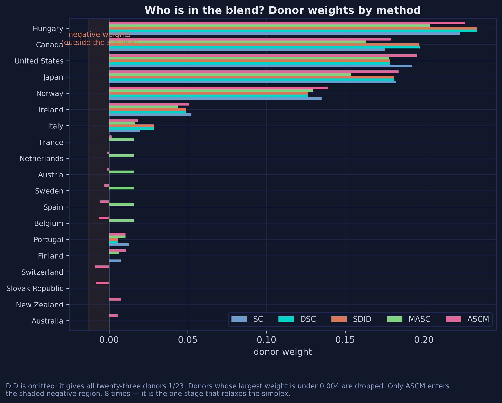

The weights tell a consistent story. Hungary, Canada, the United States, Japan and Norway carry the counterfactual under every method, and only ASCM ever goes negative — eight times, all of them tiny. Five estimators built on quite different principles are picking essentially the same five countries.

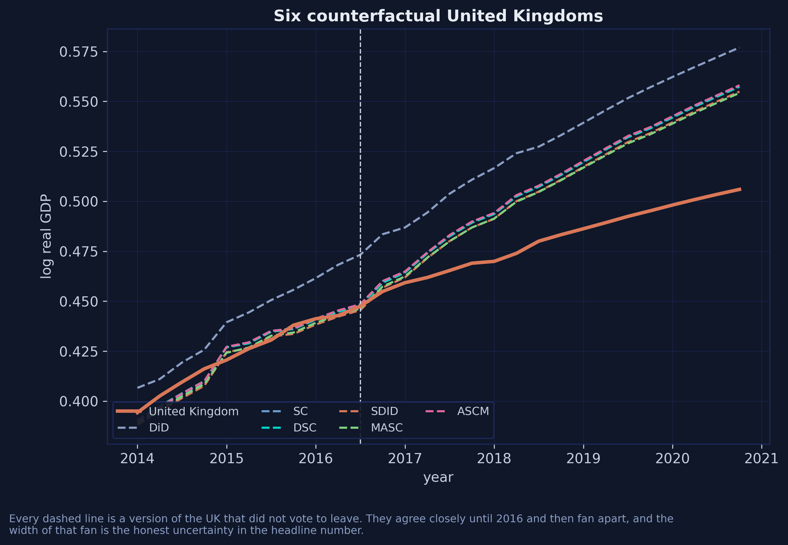

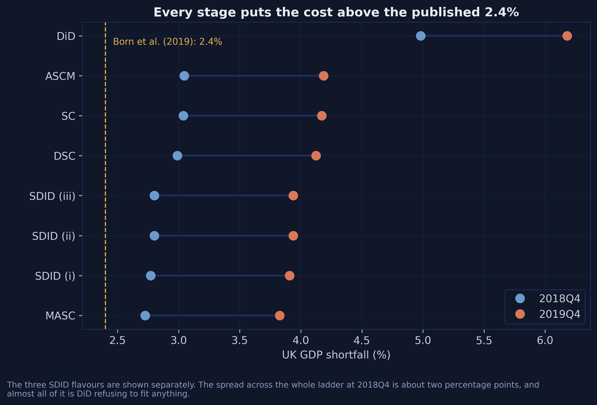

The dot plot makes the shape of the disagreement clear: DiD is off on its own, and the other seven estimates cluster within about a third of a percentage point of each other at 2018Q4. The width of that cluster, not any single point in it, is the honest answer.

### 14.1 Comparing counterfactuals with one call

Building that comparison by hand is instructive, but `mlsynth` ships utilities for it:

```python
from mlsynth import compare_estimators, plot_counterfactual_comparison

comparison = compare_estimators(
    {"SC": VanillaSC(cfg(96, inference=False)),
     "SDID": SDID(cfg(96, zeta=0.0, vce="noinference")),
     "MASC": MASC(cfg(96, m_grid=M_GRID, set_f=SET_F))},
    show_bands=False,
)
ax = plot_counterfactual_comparison(comparison)
```

`compare_estimators` fits several estimators on one panel and lines their counterfactuals up on a common time axis; `compare_counterfactuals` does the same for already-fitted results; `plot_counterfactual_comparison` draws them with their prediction intervals. For an exploratory comparison this is one call instead of thirty lines, and it is the right starting point before you invest in custom figures.

## 15. The disagreement is the finding

Two cells in section 14's table disagree with R: SC (3.04 against 3.06) and SDID (2.80 against 2.79). Neither is a bug in either library, and the explanation is the most useful thing in this post.

The synthetic-control objective on this panel has a condition number of roughly $7.5 \times 10^5$. In geometric terms that means a long, narrow, nearly flat valley of near-optimal weight vectors: many quite different $\omega$ give almost the same pre-treatment fit. Any optimiser has to decide when to stop walking down it.

- R's `synthdid` walks the valley with **Frank-Wolfe on a capped iteration budget** and stops at 3.06%.
- `mlsynth` hands the identical problem to a **convex solver** which runs it to optimality and returns 3.039%.
- Stata's `sdid` inherits `synthdid`'s Frank-Wolfe and stops in the same place; tighten its convergence with `max_iter(100000) min_dec(1e-9)` and its SDID estimate drifts from 2.79% to 2.80%, which is where `mlsynth` already is.

All three legs ship with this post, so you can run the comparison yourself rather than take it on trust: [`cheatsheet_python.py`](cheatsheet_python.py), [`cheatsheet_R.R`](cheatsheet_R.R) and [`cheatsheet_stata.do`](cheatsheet_stata.do). Same data, same treatment date, same two evaluation quarters, same comparative table at the end — and each file hard-codes the others' column, so a disagreement shows up the moment you run any one of them.

The Stata file is the one worth reading even if you never open Stata. Two things in it. Its ASCM row is a *different estimator* — `allsynth` implements the bias-corrected synthetic control of Abadie and L'Hour rather than the ridge-augmented version `VanillaSC(augment="ridge")` gives you — and its MASC row is empty, because MASC has no Stata implementation. Reporting those honestly rather than approximating them is the point.

Stata's version of the penalty trap is also the nastiest of the three. Its documented default is `zeta_omega(1e-6)`, which looks like a value but is a magic sentinel: `sdid.ado` reads `if (EOmega==1e-6) EtaOmega = (yNtr*yTpost)^(1/4)`, so passing the documented default *explicitly* still requests the full penalty. Only a literal `0` switches it off.

So three implementations, written independently in three languages, sort themselves into exactly two camps — and the split is by **solver**, not by language or by author. The R edition of this post reached the same conclusion from a completely different direction, by running the Frank-Wolfe iteration ladder by hand and watching the estimate converge to 3.039 as the budget grew. Section 9.2's figure is the same finding a third time: four independent code paths inside `mlsynth`, all convex, all landing on 3.039.

The practical lesson is not that one library is right. It is that **a synthetic control estimate carries its solver's fingerprint**, and a second-decimal disagreement between implementations is the normal state of affairs rather than a cause for alarm. When you replicate a published synthetic-control number and land 0.02 away, the first hypothesis should be the optimiser, not the data.

## 16. Which stage should you choose?

The estimates cluster, but they do not coincide, and the ladder gives no reason to prefer the top stage. The source paper's answer is an in-sample placebo tournament: advance the treatment date to a quarter when nothing happened, build the counterfactual on data up to that point only, and compare with what actually occurred. The true effect is zero, so every estimate is pure error.

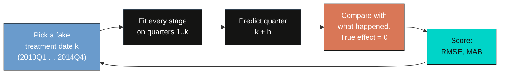

The loop runs twenty times, once for each last-pre-treatment quarter from 2010Q1 to 2014Q4, and each pass refits all seven estimators from scratch. Everything the earlier sections taught about defaults now pays off: `vce="noinference"`, `method="MSCa"`, `inference=False` and an explicit `m_grid` are what keep this to thirteen seconds rather than several hours.

```python
def placebo_one(k, h):
    """Every stage refit as if the treatment had happened at quarter k+1."""
    e = k + h
    row = {"k": k, "last_pre": QLAB[k - 1], "horizon": h}
    row["SC"]  = VanillaSC(cfg(e, pre=k, inference=False)).fit().effects.att
    row["DSC"] = tssc_att(TSSC(cfg(e, pre=k, method="MSCa", inference=False)).fit())
    w1, l1 = sdid_weights(k + 1, pre=k)                 # variant (i)
    w2, l2 = sdid_weights(range(k + 1, k + 5), pre=k)   # variant (ii)
    w3, l3 = sdid_weights(k + 4, pre=k)                 # variant (iii)
    row["SDID (i)"]   = -sdid_loss(w1, l1, e, pre=k) / 100.0
    row["SDID (ii)"]  = -sdid_loss(w2, l2, e, pre=k) / 100.0
    row["SDID (iii)"] = -sdid_loss(w3, l3, e, pre=k) / 100.0
    row["MASC"] = MASC(cfg(e, pre=k, m_grid=M_GRID, set_f=list(range(6, k + 1)))).fit().effects.att
    row["ASCM"] = VanillaSC(cfg(e, pre=k, augment="ridge", inference=False)).fit().effects.att
    return row

placebo = pd.DataFrame([placebo_one(k, h) for h in (1, 4) for k in range(61, 81)])
```

```text
  Horizon h = 1 quarter
    method   RMSE    MAB  MedAB
        SC 0.0086 0.0068 0.0051
       DSC 0.0086 0.0068 0.0051
  SDID (i) 0.0066 0.0037 0.0016
 SDID (ii) 0.0066 0.0038 0.0017
SDID (iii) 0.0066 0.0039 0.0020
      MASC 0.0080 0.0062 0.0045
      ASCM 0.0086 0.0068 0.0051
```

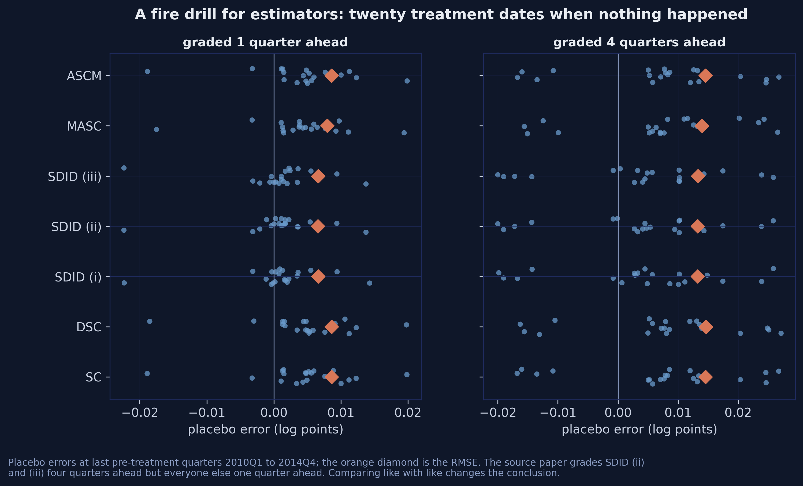

At a one-quarter horizon the whole SDID family scores 0.0066 root mean squared error, against 0.0080 for MASC and 0.0086 for SC, DSC and ASCM alike. The gap is even larger in mean absolute bias: 0.0037 for SDID (i) against 0.0068 for SC, close to a factor of two. **The time weights are doing real work**, and this is the paper's central theoretical claim surviving an empirical test.

### 16.1 The published table is not comparing like with like

Now look at how the published version of that table is produced. In the replication code, SC, DSC, SDID (i), MASC and ASCM are all graded **one quarter ahead**; SDID (ii) and (iii) are graded **four quarters ahead**. Forecasting a year out is a strictly harder task, so part of the reported gap is the exam, not the student.

Running every estimator at both horizons settles it:

| Method | RMSE, $h = 1$ | RMSE, $h = 4$ | Published |
|---|---|---|---|
| SC | 0.0086 | 0.0145 | 0.0089 |
| DSC | 0.0086 | 0.0146 | 0.0087 |
| SDID (i) | 0.0066 | 0.0132 | 0.0067 |
| SDID (ii) | 0.0066 | 0.0133 | 0.0134 |
| SDID (iii) | 0.0066 | 0.0133 | 0.0134 |
| MASC | 0.0080 | 0.0140 | 0.0080 |
| ASCM | 0.0086 | 0.0146 | 0.0086 |

Every cell reproduces the published value to within 0.0003 — except the two that were graded on a different exam. Graded on the same task, the three SDID variants are **indistinguishable**: 0.0066 at one quarter, 0.0132–0.0133 at four. The published conclusion that variants (ii) and (iii) "perform the worst" is an artefact of the horizon, not a property of the estimators. This is the same finding the R edition reports, arrived at with a different library, which is about as much corroboration as a result of this kind can get.

What survives is the finding that matters more: **at either horizon the whole SDID family beats every other stage**, and the ordering below it is stable — SDID, then MASC, then SC, ASCM and DSC, and those last three are indistinguishable at one quarter and separated by less than 0.0001 at four.

## 17. Do covariates help? Three meanings of "control for"

So far everything has matched on outcomes alone. The obvious next question is whether adding the covariates — consumption, investment, export and import shares, labour productivity growth and the employment-population ratio — improves the counterfactual.

The answer `mlsynth` gives is more interesting than yes or no: **it asks which of three different things you mean.** `SDIDConfig.covariates` is not a list. It is a dictionary keyed by method, and passing a bare list raises.

| Key | Method | What it does |
|---|---|---|
| `"adjust"` | Kranz (2022) two-step | residualise the *outcome* on covariates first, then run SDID on the residuals |
| `"match"` | de Brabander et al. [1], eqs. 11–12 | put the covariates *inside the unit-weight problem* |
| `"optimized"` | Arkhangelsky et al. [10], fn. 4 | estimate weights and covariate coefficients *jointly* |

These are three different estimators, and they are all defensible readings of "SDID with covariates" in the literature.

```python
COVARIATES = ["cons_share", "inv_share", "exp_share", "imp_share",
              "labprod_growth", "emp_pop"]

for meth in ("adjust", "match", "optimized"):
    kw = dict(zeta=0.0, vce="noinference", covariates={meth: COVARIATES})
    if meth == "match":
        kw["match_pre_periods"] = "last"
    vals = [pct(SDID(cfg(e, **kw)).fit().effects.att) for e in EVAL.values()]
    print(f"covariates={{'{meth}': ...}}  2018Q4 {vals[0]:5.2f}   2019Q4 {vals[1]:5.2f}")
```

```text
covariates={'adjust': ...}  2018Q4  3.61   2019Q4  4.85
covariates={'match': ...}  2018Q4  1.85   2019Q4  2.93
covariates={'optimized': ...}  2018Q4  3.11   2019Q4  4.56
```

The three routes disagree by **1.76 percentage points** at 2018Q4 — from 1.85% to 3.61%, against 2.80% with no covariates at all. That spread is more than five times the spread across the entire outcomes-only ladder. Adding covariates does not refine the answer here; it replaces one well-identified number with three poorly-identified ones.

`match_pre_periods` is the companion setting for the `"match"` route, taking `"all"`, `"half"`, `"last"` or an integer. It controls which pre-treatment periods the covariate means are computed over, and `mlsynth`'s own benchmarks report that its agreement with R's `Synth` degrades from a weight-vector correlation of 0.998 under `"last"` to 0.636 under `"all"` — precisely because the predictor weights become less identified as more periods enter.

### 17.1 The same problem in VanillaSC, and a clean demonstration of why

`VanillaSC` has its own covariate route: the Abadie-Diamond-Hainmueller bilevel program, where an outer loop searches over predictor weights $V$ and an inner loop solves for donor weights $\omega$. Section 9.1 noted that those predictor weights are *generically not identified*. That claim sounds abstract until you test it, and the test costs one keyword.

Fit the identical model twice, with the same seed and the same data, changing only how long the differential-evolution search is allowed to run. If $V$ were well identified, the budget would not matter.

```python
for label, budget in [("default (maxiter=300, popsize=15)", {}),
                      ("reduced (maxiter=120, popsize=12)",
                       dict(mscmt_maxiter=120, mscmt_popsize=12))]:
    r = VanillaSC(cfg(96, covariates=COVARIATES, backend="mscmt",
                      canonical_v="min.loss.w", seed=SEED,
                      inference=False, **budget)).fit()
    ss = r.weights.summary_stats
    print(f"{label:<36s} {pct(r.effects.att):5.2f}%   "
          f"pre-RMSE {r.fit_diagnostics.rmse_pre:.6f}   "
          f"v_agreement {ss['v_agreement']:.5f}")
    top = sorted(ss["predictor_weights"].items(), key=lambda kv: -abs(kv[1]))[:4]
    print("    " + ", ".join(f"{k} {v:.3f}" for k, v in top))
```

```text
default (maxiter=300, popsize=15)     1.32%   pre-RMSE 0.009662   v_agreement 0.05530
    imp_share 1.000, exp_share 0.000, labprod_growth 0.000, emp_pop 0.000
reduced (maxiter=120, popsize=12)     1.11%   pre-RMSE 0.009928   v_agreement 0.08281
    labprod_growth 0.419, emp_pop 0.396, cons_share 0.141, inv_share 0.045
```

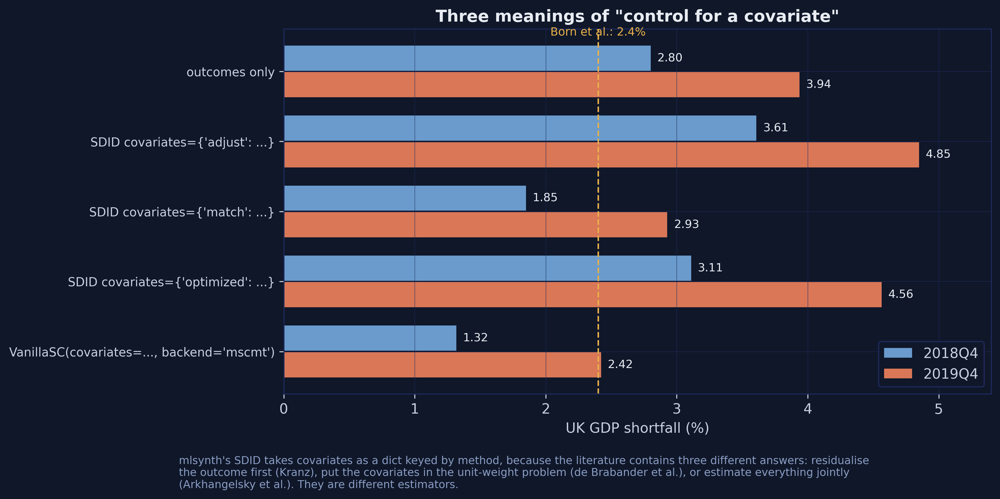

Same estimator, same seed, same data. Shortening the search moves the estimate from 1.32% to 1.11% — and, far more strikingly, moves the predictor weights from a **corner solution** that puts all the weight on the import share to a **spread** across labour productivity, employment, and the consumption and investment shares. Those are not slightly different answers to the same question. They are different economic stories about what makes a country comparable to the UK.

Three diagnostics all point the same way. The pre-treatment RMSE **rises** from 0.005589 to about 0.0097 — adding six covariates makes the pre-treatment fit nearly twice as bad, because the optimiser now spends its effort matching predictor means instead of the outcome path. `v_agreement`, the gap between the two canonical choices of $V$, is 0.055 to 0.083 rather than near zero. And the answer moves with the optimiser budget, which is the definition of a non-identified problem.

This is why the R edition's placebo tournament found covariates make the counterfactual *worse* rather than better, and why the headline specification here matches on outcomes alone. **When you have eighty-six pre-treatment quarters of the outcome itself, six covariate means are not adding information — they are adding a poorly identified optimisation problem.** The fact that `mlsynth` reports `v_agreement` at all is what let us see it.

## 18. Inference

`VanillaSC` exposes nine inference methods behind a single `inference=` field, which is unusually generous. Here is what each returns on this panel:

```python
rows = []
for meth in ("placebo", "scpi", "lto", "conformal", "ttest", "jackknife_plus"):
    try:
        r = VanillaSC(cfg(96, inference=meth, alpha=0.05)).fit()
        inf = r.inference
        rows.append(dict(method=meth, att=r.att, p_value=inf.p_value,
                         ci_lower=inf.ci_lower, ci_upper=inf.ci_upper,
                         reported_as=inf.method))
    except Exception as exc:
        rows.append(dict(method=meth, att=np.nan,
                         reported_as=f"FAILED: {type(exc).__name__}"))
print(pd.DataFrame(rows).to_string(index=False))
```

```text
        method       att  p_value  ci_lower  ci_upper                                                     reported_as
       placebo -0.030388 0.041667       NaN       NaN                                  in-space placebo (RMSPE ratio)
          scpi -0.030388      NaN -0.055333 -0.009374         scpi prediction intervals (Cattaneo-Feng-Titiunik 2021)
           lto -0.030388 0.008333       NaN       NaN               leave-two-out refined placebo (Lei-Sudijono 2025)
     conformal -0.030388 0.020000 -0.046603 -0.014292 conformal prediction intervals (Chernozhukov-Wuthrich-Zhu 2021)
         ttest -0.030388 0.005788 -0.040042 -0.020228             debiased SC t-test (Chernozhukov-Wuthrich-Zhu 2025)
jackknife_plus       NaN      NaN       NaN       NaN                                  FAILED: MlsynthEstimationError
```

Reported honestly: `jackknife_plus` raises `MlsynthEstimationError` on this configuration and is excluded. The other five all reject at the 5% level: four report p-values between 0.006 and 0.042, and `scpi` reports no p-value but an interval that stops short of zero.

That looks decisive, and it should be read with more caution than it invites. The five methods are not five independent tests — they all use the same point estimate and the same donor pool, and they differ in how they build a reference distribution from twenty-three donors. Note also that SDID's own placebo inference in section 11 gave p = 0.20 with an interval containing zero. Different estimator, different variance estimator, very different verdict. Read these as orders of magnitude rather than as digits.

### 18.1 Placebo in space

The most interpretable of the five is worth doing explicitly: give every donor the treatment in turn and see where the UK ranks.

```python
rows = []
for country in [TREATED] + DONORS:
    sub = panel.copy()
    sub["tt"] = sub.groupby("country")["t"].rank(method="dense").astype(int)
    sub["treat"] = ((sub.country == country) & (sub.tt > T0)).astype(int)
    r = VanillaSC(dict(df=sub, outcome="log_rgdp", treat="treat", unitid="country",
                       time="tt", display_graphs=False, inference=False)).fit()
    gap = np.asarray(r.gap, float).ravel()
    pre, post = np.sqrt(np.mean(gap[:T0] ** 2)), np.sqrt(np.mean(gap[T0:] ** 2))
    rows.append(dict(country=country, rmspe_pre=pre, rmspe_post=post, ratio=post / pre))

placebo_space = (pd.DataFrame(rows)
                 .assign(rank=lambda d: d["ratio"].rank(ascending=False).astype(int))
                 .sort_values("ratio", ascending=False))
print(placebo_space.head(6).round(4).to_string(index=False))
```

The statistic is the ratio of post-treatment to pre-treatment root mean squared prediction error,

$$R\_j = \frac{\text{RMSPE}\_j^{\text{post}}}{\text{RMSPE}\_j^{\text{pre}}},$$

which asks whether unit $j$'s gap grew after the treatment date *relative to how well it was fitted beforehand*. Dividing by the pre-treatment fit is what stops a badly fitted donor from looking treated.

```text
       country  rmspe_pre  rmspe_post  ratio  rank
United Kingdom     0.0056      0.0327 5.8488     1
       Belgium     0.0043      0.0151 3.5231     2
       Finland     0.0202      0.0666 3.2905     3
   New Zealand     0.0134      0.0397 2.9693     4
       Hungary     0.0210      0.0593 2.8193     5
       Austria     0.0042      0.0111 2.6324     6
```

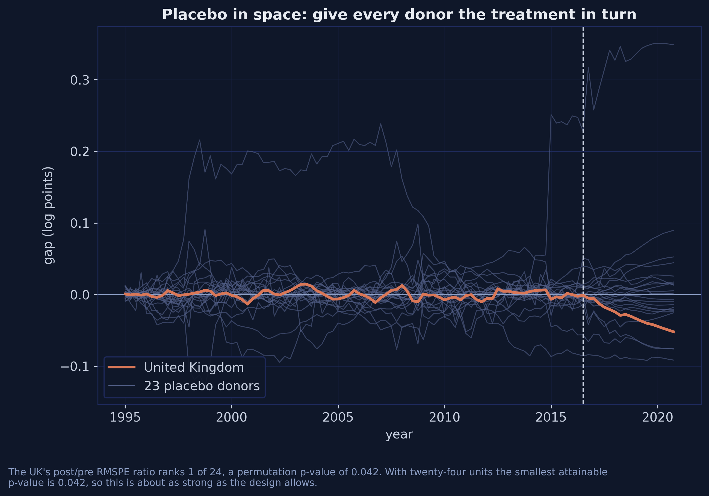

The UK's ratio of 5.85 is the largest of all twenty-four units, giving a permutation p-value of $1/24 = 0.042$. That is as small as this design can produce: with twenty-four units the smallest attainable p-value is 0.042, so the test is at its floor and could not have been more favourable.

### 18.2 What this can and cannot tell you

It can tell you that the UK's post-2016 divergence is unusual relative to what these twenty-three donors do. It cannot tell you the effect is 3.04% rather than 2.73%, it cannot separate Brexit from anything else distinctive that happened to the UK after mid-2016, and with twenty-four units it has essentially no power to detect anything subtler. Every interval in this section is wide, and the SDID interval contains zero.

## 19. Robustness: the specification zoo

Four departures from the headline specification, each one line of config. The SDID column reports variant (i) for the date and donor-pool rows and variant (ii) — the post's headline — for the `zeta` rows, because those are the variants each check was run on.

| Departure | SC | DSC | SDID |
|---|---|---|---|
| treatment date 2016Q3 (headline) | 3.04 | 2.99 | 2.77 *(i)* |
| treatment date 2016Q2 | 3.09 | 3.05 | 3.18 *(i)* |
| drop the United States | 3.06 | 3.04 | 2.83 *(i)* |
| `zeta = 0` (the paper) | — | — | 2.80 *(ii)* |
| `zeta` at its default | — | — | 2.67 *(ii)* |
| `w_constr='simplex'` | 3.04 | — | — |
| `w_constr='ols'` | 3.37 | — | — |
| `w_constr='ridge'` | 3.37 | — | — |
| `w_constr='lasso'` | 2.97 | — | — |

Four observations.

**The treatment date matters most for SDID.** Moving from 2016Q3 to 2016Q2 barely touches SC (3.04 to 3.09) but moves SDID from 2.77% to 3.18%. That is exactly what section 11.2 predicts: SDID puts 96% of its time weight on the last pre-treatment quarter, so changing which quarter that is changes the bias adjustment directly. The estimator that is best on the placebo tournament is also the one most sensitive to the treatment date — a trade-off worth stating out loud.

**Dropping the United States barely moves anything.** The US carries about a fifth of the counterfactual, and removing it entirely shifts SC from 3.04% to 3.06% and SDID from 2.77% to 2.83%. The result does not hinge on one donor.

**The constraint set is worth more than the estimator choice.** Relaxing the simplex to OLS or ridge moves SC from 3.04% to 3.37%, a third of a percentage point — larger than the gap between SC and MASC. `w_constr` is a research decision, not a tuning knob.

**And `zeta` again.** 2.80% against 2.67%, for a setting most users will never see.

## 20. Beyond the ladder: the mlsynth catalogue

Six of ninety-two classes have appeared in this post. The rest are worth knowing about, because the reason to invest in this library rather than four single-purpose ones is that the config you have already written works for all of them. Here is the map, organised by what makes your design non-canonical:

| If your design has… | Reach for | Note |
|---|---|---|
| The canonical one treated unit | `VanillaSC`, `TSSC`, `FDID` | the workhorses; everything in this post |
| Staggered adoption, several cohorts | `SDID`, `SequentialSDID`, `SSC`, `PPSCM`, `CSCM` | `SDID` handles both cases; `dataprep` detects which |
| Many donors relative to periods | `CLUSTERSC`, `MLSC`, `FSCM`, `SparseSC`, `MSQRT`, `PDA`, `SCUL`, `RESCM` | regularisation or donor selection |
| Bayesian uncertainty | `BVSS`, `BSCM`, `BFSC`, `MVBBSC`, `MTGP`, `BPSCS` | posterior rather than placebo intervals |
| A treated unit outside the convex hull | `ISCM`, `NSC` | relax the hull rather than augment the fit |
| Spillovers onto donors | `SpSyDiD`, `SPILLSYNTH`, `SPOTSYNTH`, `RRSC` | `SPOTSYNTH` also *detects* which donors are contaminated |
| Missing cells in the panel | `MCNNM`, `SNN`, `RMSI` | matrix completion |
| Multiple outcomes | `SCMO` | joint rather than one-at-a-time |
| Micro-level distributions | `DSC`, `MicroSynth` | the *distributional* DSC, not this post's |
| Endogenous treatment | `SIV`, `ORTHSC`, `PROXIMAL` | instruments and proximal inference |
| No untreated donors at all | `SHC` | synthetic *historical* control |
| A design to run before treating | `MAREX`, `SYNDES`, `PANGEO`, `SPCD`, `MUSC` | these return a `DesignResult`, not an `EffectResult` |
| A continuous treatment | `CTSC` | dose rather than on/off |
| Factor structure in the outcome | `FMA`, `CFM`, `CSCIPCA`, `TASC`, `DSCAR` | interactive fixed effects |

The library sorts its outputs into exactly two families, which is worth internalising because it determines what `.fit()` gives you back. `EffectResult` is an *observational report* — measure an effect on data you already have. `DesignResult` is a *research design* — choose which units to treat before any intervention, and it resolves into an `EffectResult` once outcomes exist. Everything in this post is the first kind.

For the current list on your installed version, `get_llm_guide()` is authoritative; the counts quoted in the README and the documentation prose disagree with each other and with `__all__`.

## 21. Discussion

**What Brexit cost.** Taking the ladder as a whole, the referendum had cost the UK between **2.7% and 3.0% of GDP by the end of 2018**, and between **3.8% and 4.2% by the end of 2019**. That is above the 2.4% previously published for this dataset, and the reason is not exotic: the earlier figure came from a specification that matched on covariates, and section 17 shows covariates make the counterfactual worse here rather than better.

Three caveats belong with the number. It is a *net* gap between the UK and a blend of OECD economies, so anything else distinctive that happened to the UK after mid-2016 is inside it. The no-interference assumption is strong over four years when the United States carries a fifth of the weight. And the estimate is a point on a specification cloud rather than a parameter that has been pinned down — every interval in section 18 is wide, and SDID's contains zero.

**What the software taught.** This is where a package-first reading pays off, and the findings are not econometric.

*Three defaults change the answer materially, and two of them by more than the spread across the ladder.* `zeta` moves SDID by 0.13 percentage points, `set_f` moves MASC by 0.47, and the choice among the three covariate methods moves SDID by 1.76. The ladder's own spread, excluding DiD, is 0.31, so `set_f` and the covariate method each clear it on their own while `zeta` stays just inside. **You can pick the wrong default and be further from the truth than if you had picked the wrong estimator.**

*One estimator silently rounds the number you are most likely to quote.* `TSSC` returns `.att` as exactly $-0.03$ while its gap series carries the full $-0.029887$. Nothing warns you.

*Names are mnemonics, not definitions.* `mlsynth.DSC` is not this post's DSC, and importing it raises no error.

*A version number is not a version.* The PyPI release numbered 1.0.0 is behind git `main` at the same version number, and is missing a config field this post uses. `mlsynth.__version__` will tell you `"1.0.0"` in both cases. Pin the commit, not the release.

*A solver leaves a fingerprint.* Four convex code paths inside `mlsynth` agree at 3.039% while R's Frank-Wolfe stops at 3.06%. Three languages, two camps, split by optimiser rather than by author.

**So what should you actually do?** Fit the ladder, not a stage, and publish the cloud rather than a point. `mlsynth` makes that cheap — six estimators, one config, thirteen seconds for a twenty-date placebo tournament — which removes the main practical excuse for reporting a single specification. And when you report, say which defaults you set. On this dataset that sentence carries more information than the choice of estimator.

## 22. Summary and next steps

- **The Brexit referendum cost the UK 2.7–3.0% of GDP by end-2018 and 3.8–4.2% by end-2019**, at every stage of the ladder, against 2.4% previously published for the same data.
- **`mlsynth` puts all six stages behind one interface**: `Estimator({"df": ..., "outcome": ..., "treat": ..., "unitid": ..., "time": ...}).fit()`, returning a result with seven flat accessors that work everywhere.
- **Three defaults matter, and two of them more than the estimator choice.** `SDID` penalises unit weights unless you set `zeta=0.0` (2.80% vs 2.67%); `MASC` cross-validates on a different fold set unless you set `set_f` (2.73% vs 3.19%); and `SDID`'s three covariate methods disagree by 1.76 percentage points. Against a ladder that spans 0.31, the last two each clear it alone.
- **The time weights earn their keep.** SDID's placebo RMSE is 0.0066 against 0.0086 for plain SC, a 23% reduction, and the advantage holds at both forecast horizons.
- **But the published ranking among SDID variants does not survive a matched horizon.** Graded on the same task, the three flavours score 0.0066, 0.0066 and 0.0066.
- **Covariates hurt here.** They raise the pre-treatment RMSE from 0.0056 to 0.0099 and produce a `v_agreement` of 0.083, both signs of a poorly identified predictor-weight problem.
- **A limitation to carry forward:** with one treated unit and 23 donors, the smallest attainable permutation p-value is 0.042. The design is at its inferential floor, and no estimator choice changes that.
- **Next:** the same panel with `CLUSTERSC` or `PDA` if you have many more donors; `SequentialSDID` if adoption is staggered; `SPOTSYNTH` if you suspect spillovers onto the donor pool. All three take the config you already wrote.

All three cheat sheets ship with this post, so the cross-language comparison in section 15 is reproducible without leaving the bundle: [`cheatsheet_python.py`](cheatsheet_python.py) (about half a minute), [`cheatsheet_stata.do`](cheatsheet_stata.do) (twenty seconds with standard errors off, three minutes with them on) and [`cheatsheet_R.R`](cheatsheet_R.R) (thirty seconds with `SE <- FALSE`, four minutes otherwise). Each prints the same ladder and the same comparative table on the same data, and each hard-codes the other languages' column so you can check one against another directly. [The R edition of this post](/post/r_sc_dsc_sdid/) hand-codes every estimator before calling its package and is the place to go for the derivations. On the wider site, [the classic synthetic control on the Basque Country](/post/r_basic_synthetic_control/), [augmented synthetic control on the Kansas tax cuts](/post/r_augsynth/) and [synthetic difference-in-differences on Proposition 99 in Stata](/post/stata_sdid/) cover single stages in isolation.

## 23. Exercises

1. **Move the treatment date.** Re-run the headline table with `pre=T0-1` (treatment materialising 2016Q2). Which stage moves most, and can you explain it from the time weights?
2. **Break the rounding.** Compute DSC's estimate from `variants["MSCa"].att` and from the gap series across all twenty placebo windows in section 16. How large does the discrepancy get?
3. **Time the inference default.** `VanillaSC`'s `inference` defaults to `True`, which runs in-space placebo. Time a fit with `inference=False` against the default, and decide when the difference matters.
4. **Read the simplex.** Print `weights.summary_stats` for all six stages. Which report `n_negative > 0`, and which report a `constraint` other than the plain simplex?
5. **Grade the horizon.** Extend section 16's tournament to $h = 8$. Does the SDID family's advantage survive a two-year forecast?
6. **Separate MASC's two dials.** Fix `m=10` and vary `set_f`; then fix `set_f` and vary `m_grid`. Which of the two drives the 0.47-point swing?
7. **Try a fourth covariate route.** Fit `SDID` with `covariates={"match": [...]}` under each of `match_pre_periods` in `{"all", "half", "last", 20}`. How wide is the resulting range, and how does it compare with the range across methods?
8. **Pick a different estimator entirely.** Fit `CLUSTERSC` and `PDA` on this panel with the config you already have. Do they land inside the ladder's range, and what does that tell you about the range?

## 24. References

1. [de Brabander, E., Juodis, A., & Miyazato Szini, G. (2025). On the use of synthetic difference-in-differences approach with (-out) covariates: The case study of Brexit referendum. *Econometric Reviews* 44(10), 1617–1646.](https://doi.org/10.1080/07474938.2025.2530649)
2. [Born, B., Müller, G. J., Schularick, M., & Sedláček, P. (2019). The costs of economic nationalism: Evidence from the Brexit experiment. *The Economic Journal* 129(623), 2722–2744.](https://doi.org/10.1093/ej/uez020)
3. [Abadie, A., & Gardeazabal, J. (2003). The economic costs of conflict: A case study of the Basque Country. *American Economic Review* 93(1), 113–132.](https://doi.org/10.1257/000282803321455188)
4. [Abadie, A., Diamond, A., & Hainmueller, J. (2010). Synthetic control methods for comparative case studies. *Journal of the American Statistical Association* 105(490), 493–505.](https://doi.org/10.1198/jasa.2009.ap08746)
5. [Abadie, A., Diamond, A., & Hainmueller, J. (2015). Comparative politics and the synthetic control method. *American Journal of Political Science* 59(2), 495–510.](https://doi.org/10.1111/ajps.12116)
6. [Abadie, A. (2021). Using synthetic controls: Feasibility, data requirements, and methodological aspects. *Journal of Economic Literature* 59(2), 391–425.](https://doi.org/10.1257/jel.20191450)
7. [Li, K. T., & Shankar, V. (2023). A two-step synthetic control approach for estimating causal effects of marketing events. *Management Science* 70(6), 3734–3747.](https://doi.org/10.1287/mnsc.2023.4878)
8. [Doudchenko, N., & Imbens, G. W. (2016). Balancing, regression, difference-in-differences and synthetic control methods: A synthesis. NBER Working Paper 22791.](https://doi.org/10.3386/w22791)
9. [Ferman, B., & Pinto, C. (2021). Synthetic controls with imperfect pretreatment fit. *Quantitative Economics* 12(4), 1197–1221.](https://doi.org/10.3982/QE1596)
10. [Arkhangelsky, D., Athey, S., Hirshberg, D. A., Imbens, G. W., & Wager, S. (2021). Synthetic difference-in-differences. *American Economic Review* 111(12), 4088–4118.](https://doi.org/10.1257/aer.20190159)
11. [Kellogg, M., Mogstad, M., Pouliot, G. A., & Torgovitsky, A. (2021). Combining matching and synthetic control to trade off biases from extrapolation and interpolation. *Journal of the American Statistical Association* 116(536), 1804–1816.](https://doi.org/10.1080/01621459.2021.1979562)
12. [Ben-Michael, E., Feller, A., & Rothstein, J. (2021). The augmented synthetic control method. *Journal of the American Statistical Association* 116(536), 1789–1803.](https://doi.org/10.1080/01621459.2021.1929245)
13. [Gunsilius, F. F. (2023). Distributional synthetic controls. *Econometrica* 91(3), 1105–1117.](https://doi.org/10.3982/ECTA18260)
14. [Cattaneo, M. D., Feng, Y., & Titiunik, R. (2021). Prediction intervals for synthetic control methods. *Journal of the American Statistical Association* 116(536), 1865–1880.](https://doi.org/10.1080/01621459.2021.1979561)
15. [Chernozhukov, V., Wüthrich, K., & Zhu, Y. (2021). An exact and robust conformal inference method for counterfactual and synthetic controls. *Journal of the American Statistical Association* 116(536), 1849–1864.](https://doi.org/10.1080/01621459.2021.1920957)
16. [Ciccia, D. (2024). A short note on event-study synthetic difference-in-differences estimators. arXiv:2407.09565.](https://arxiv.org/abs/2407.09565)
17. [Kranz, S. (2022). Synthetic difference-in-differences with time-varying covariates. Working paper.](https://github.com/skranz/xsynthdid)
18. [Greathouse, J. mlsynth: A Python library of synthetic control and difference-in-differences estimators.](https://github.com/jgreathouse9/mlsynth)
19. [mlsynth documentation.](https://mlsynth.readthedocs.io/)
20. [mlsynth issue #312 — Check de Brabander, Juodis & Miyazato Szini (2025) against mlsynth.](https://github.com/jgreathouse9/mlsynth/issues/312)
21. [Van Rossum, G., & Drake, F. L. (2009). *Python 3 Reference Manual*. CreateSpace.](https://www.python.org/)
22. [Companion tutorials on this site: the R edition of this ladder, the Basque Country, Kansas and Proposition 99.](/post/r_sc_dsc_sdid/)

#### Acknowledgements

AI tools (Claude Code, Gemini, NotebookLM) were used to make the contents of this post more accessible to students. Nevertheless, the content in this post may still have errors. Caution is needed when applying the contents of this post to true research projects.
