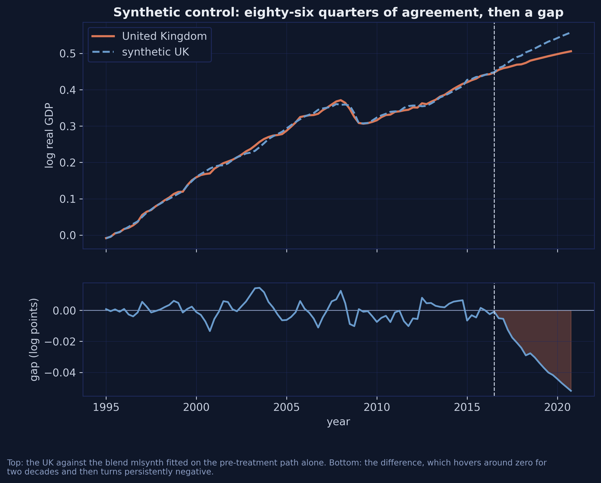
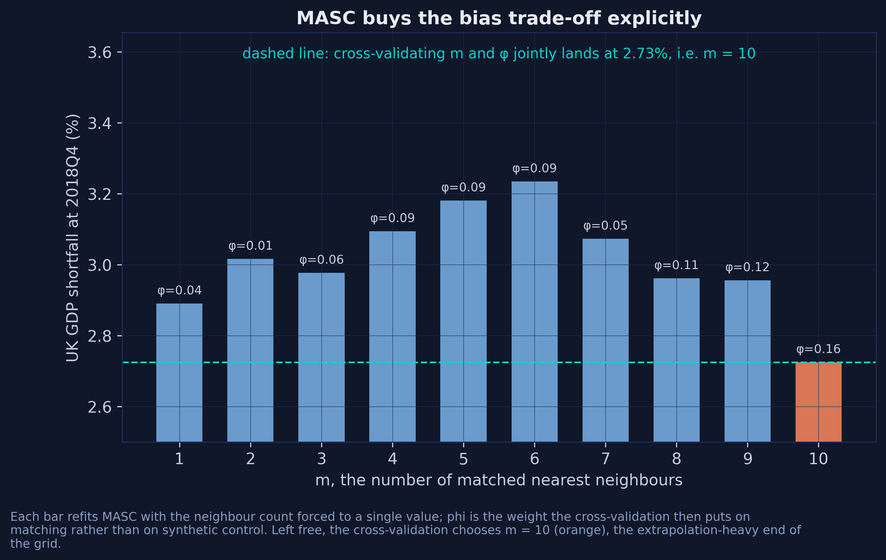

# One Treated Unit {.divider background-color="#d97757"}

[Act I]{.act}

## There is only one United Kingdom, and it voted to leave

On 23 June 2016, 51.9% voted to leave the European Union.

. . .

To say what that decision cost, you need the United Kingdom that stayed.

. . .

*There is no such country. Every estimator in this deck is a different way of building one.*

::: {.notes}
This is the fundamental problem of causal inference, stated as concretely as it ever gets. We observe one potential outcome — the UK that left. The other one, the UK that stayed, was never realised and never will be. Everything that follows is a machine for manufacturing that missing series out of countries we do observe. The interesting question is not whether such a machine exists. Six of them do. The question is how much the answer depends on which machine you pick, and — this is where the deck is going — on which knobs you leave alone.
:::

## One line in a crowd


[24 countries · 23 donors · 86 pre-treatment quarters · treatment dated 2016Q3.]{.takeaway .fragment}

::: {.notes}
No single donor tracks the UK, which is why we blend rather than pick. Two things to notice. First, the series are strongly trending and highly correlated — close to a set of random walks with drift. That will matter enormously when we get to the time weights. Second, look at 2008-09: every line collapses together. That synchronised movement is a common factor, and it is what the demeaned and time-weighted rungs are built to exploit.

The panel is quarterly log real GDP assembled by Born, Müller, Schularick and Sedláček, redistributed in the replication package of de Brabander, Juodis and Miyazato Szini. No missing values.
:::

## Ninety-two estimators, one configuration dictionary

One interface for the whole single-treated-unit literature: build a config, call `.fit()`, read a standardized result.

. . .

**Six rungs in this deck. Eighty-six more estimators behind the same door.**

. . .

[Pin the commit, not the release — `__version__` says `1.0.0` either way.]{.takeaway .fragment}

::: {.notes}
This is the pitch, and it is the reason a package-level reading is worth doing at all. Normally climbing this ladder means learning Synth, then synthdid, then masc, then augsynth — four packages, four interfaces, four result formats, four sets of conventions about signs. Here it is one config dict and one result object throughout.

The version warning is not pedantry. The release numbered 1.0.0 on PyPI is missing a config field this deck uses, and the version string does not distinguish it from git main. Pin the commit.
:::

## Where we're going

::: {.incremental}
- **Read** one config dict and one result object — the entire API surface.
- **Map** each rung of the ladder onto a specific `mlsynth` class.
- **Identify** the three defaults that change the answer materially.
- **Compare** the rungs on a placebo tournament, and read the ranking sceptically.
- **Report** a cloud of estimates rather than a point.
:::

::: {.notes}
Four acts. Act I is the problem. Act II climbs the ladder — this is the longest stretch and the most code. Act III is where the deck earns its title: the defaults. Act IV asks which rung to stand on and how confident we are allowed to be about the answer.
:::

# One Config, Six Rungs {.divider background-color="#6a9bcc"}

[Act II]{.act}

## Every rung is the same regression, weighted differently

$$(\hat\tau, \hat\mu, \hat\alpha, \hat\beta) = \arg\min \sum_{i,t} \omega_i \lambda_t \left( Y_{it} - \mu - \alpha_i - \beta_t - \tau D_{it} \right)^2$$

[A two-way fixed-effects regression — but some countries and some quarters count more.]{.comment}

. . .

[The rungs differ only in how $\omega$ and $\lambda$ are chosen.]{.takeaway .fragment}

::: {.notes}
This is the unifying idea, and it is worth pausing on because it makes the whole ladder legible. Difference-in-differences, synthetic control, demeaned SC and SDID are not four different models. They are one model with four different weighting schemes. MASC and ASCM break the pattern slightly — they change what weights are allowed at all rather than which weights get chosen — which is why the ladder branches at the top rather than continuing straight up.
:::

## The ladder is two dials: who counts, and when {.smaller}

| Rung | $\omega$ (who counts) | $\lambda$ (when) | mlsynth call |
|---|---|---|---|
| DiD | uniform | uniform | `FDID(cfg).fit().did` |
| SC | fitted, simplex | uniform | `VanillaSC(cfg)` |
| DSC | fitted, simplex + intercept | uniform | `TSSC(cfg, method="MSCa")` |
| SDID | fitted, simplex + intercept | [fitted, simplex]{.key} | `SDID(cfg, zeta=0.0)` |
| MASC | convex blend of matching and SC | uniform | `MASC(cfg, set_f=...)` |
| ASCM | SC weights plus a ridge correction | uniform | `VanillaSC(cfg, augment="ridge")` |

[One dial for who counts, one for when. Only SDID turns both.]{.takeaway .fragment}

::: {.notes}
This is the table to bookmark. Everything in the next fifteen slides is an expansion of one of these six rows. Note that DSC and SDID share a unit-weight scheme and differ only in the time weights — that is the cleanest controlled comparison on the ladder, and section 11 of the post uses it.
:::

## Five fields, one long panel — and one config dict

``` {.python code-line-numbers="1-3|5"}
def cfg(post, pre=T0, **extra):
    return dict(df=window(post, pre), outcome="log_rgdp", treat="treat",
                unitid="country", time="tt", display_graphs=False, **extra)

res = VanillaSC(cfg(96, inference=False)).fit()
```

[`treat` means *under treatment right now*, not *ever treated*.]{.comment}

[Every later code block is one line, because `cfg` already did the work.]{.takeaway .fragment}

::: {.notes}
The `treat` convention is where most first attempts go wrong. It is not a unit-level "ever treated" flag; it is a unit-period indicator that is zero for the treated unit before treatment. mlsynth infers both the donor pool and the treatment date from it, so getting it wrong does not raise — it silently answers a different question.

The `window` helper does one more trick worth knowing: it keeps the 86 pre-treatment quarters plus a single quarter of interest and renumbers time, so "the ATT averaged over all post periods" becomes exactly the shortfall at that quarter. No post-estimation arithmetic anywhere in the deck.
:::

## One result object, seven accessors that work everywhere {.smaller}

| Flat accessor | Resolves to |
|---|---|
| `.att` | `effects.att` |
| `.att_ci` | `(inference.ci_lower, inference.ci_upper)` |
| `.counterfactual` | `time_series.counterfactual_outcome` |
| `.gap` | `time_series.estimated_gap` |
| `.donor_weights` | `weights.donor_weights` |
| `.weight_vector` | dense array over the donor pool |
| `.pre_rmse` | `fit_diagnostics.rmse_pre` |

[Learn these seven and you can read the output of any effect estimator in the library without opening its documentation.]{.takeaway .fragment}

::: {.notes}
Two traps behind the convenience. `len(result.donor_weights)` is 9 here, not 23 — mlsynth returns only the non-zero weights, so do not treat that dictionary as a dense vector. And `method_details.method_name` reports which backend the "auto" setting actually resolved to, which is precisely the information you need when comparing against another implementation. Come back to that on the solver slide.
:::

## Rung 0 — DiD weights every country and every quarter the same

``` {.python}
did = FDID(cfg(96)).fit().did      # no standalone DiD class; it rides inside FDID
```

**4.98%** at end-2018 — nearly double every other rung.

. . .

23 donors, each weighted exactly $1/23 = 0.0435$. Nothing was fitted.

[Pre-treatment RMSE 0.0217 — four times SC's 0.0056. That gap is why the ladder exists.]{.takeaway .fragment}

::: {.notes}
mlsynth has no standalone DiD class and this trips people up. The textbook two-way estimator comes free inside FDID — Forward DiD, Li 2024 — which fits its own estimator and the plain benchmark side by side and exposes them as `.fdid` and `.did`.

A free seventh rung, if you want it: Forward DiD itself selects four donors greedily — Norway, Hungary, Austria, the United States — cuts the pre-treatment RMSE from 0.0217 to 0.0088, and lands at 2.42%, remarkably close to the published 2.4%. Three of its four donors are also among synthetic control's five largest weights.
:::

## Rung 1 — Synthetic control fits who counts

$$\hat\omega = \arg\min_{\omega \in \mathbb{W}} \sum_{t=1}^{T_0} \Big( Y_{\text{UK},t} - \sum_j \omega_j Y_{j,t} \Big)^2, \qquad \mathbb{W} = \Big\{ \omega : \omega_j \ge 0, \ \sum_j \omega_j = 1 \Big\}$$

``` {.python}
sc = VanillaSC(cfg(96, inference=False)).fit()      # 3.04%
```

[Nine of 23 donors get non-zero weight; the simplex zeroes the rest. Pre-treatment $R^2 = 0.998$.]{.takeaway .fragment}

::: {.notes}
In words: pick the non-negative weights summing to one that make the blend track the UK as closely as possible over the 86 pre-treatment quarters. The sparsity is a feature of the simplex, not an accident, and it is why synthetic control estimates are usually easy to describe in a sentence.

Note that the United States carries about a fifth of the counterfactual. We come back to that in the robustness checks — dropping it moves the SC estimate only from 3.04 to 3.06.
:::

## Indistinguishable until 2016, then persistently below



[The synthetic UK is roughly a fifth Hungary, a fifth the United States, a fifth Japan, a sixth Canada and an eighth Norway.]{.takeaway .fragment}

::: {.notes}
The top panel is the fit; the bottom panel is the estimate. For two decades the gap hovers around zero — that is the credibility of the design, visible rather than assumed. Then it turns persistently negative from 2016 and keeps widening. The shortfall at the end of 2018 is 3.04%; a year later it is 4.17%.
:::

## Rung 2 — Demeaned SC allows a level gap

``` {.python}
dsc = TSSC(cfg(96, method="MSCa", inference=False)).fit()   # 2.99%
```

One extra free parameter — a constant offset. Match the UK's **shape**, not its **level**.

[The offset is $+0.0024$ log points. Its smallness is the finding: SC was already level-balanced.]{.takeaway .fragment}

::: {.notes}
Why an offset helps: plain SC will reject a well-shaped blend sitting slightly too high in favour of a worse-shaped blend at the right level. Demeaned SC removes that constraint. Here the offset comes out at a quarter of one per cent of GDP, which is why DSC's 2.99% sits so close to SC's 3.04%.

In mlsynth this is the MSCa variant of the Li and Shankar two-step estimator, reached through the TSSC class. Left to itself TSSC fits all four variants — SC, MSCa, MSCb, MSCc — and runs a subsampling procedure to choose one; here it recommends plain SC, because the Step-1 test does not reject the restriction.

The cost of that convenience is real: four variants with 500 subsampling draws takes about 17 seconds, forcing one variant with inference off takes 0.01 seconds. A factor of roughly 1,700, which is exactly why the placebo tournament in Act IV sets `method=` and `inference=False`.
:::

## Rung 3 — SDID also fits which quarters count

$$\hat\tau_t = \Big( Y_{\text{UK},t} - \sum_j \hat\omega_j Y_{j,t} \Big) - \sum_{s \le T_0} \hat\lambda_s \Big( Y_{\text{UK},s} - \sum_j \hat\omega_j Y_{j,s} \Big)$$

``` {.python}
sdid = SDID(cfg(96, zeta=0.0, vce="placebo", B=500)).fit()   # 2.80%
```

[The gap at the evaluation quarter, minus the $\lambda$-weighted average gap before it.]{.comment}

::: {.notes}
SDID solves the transposed version of the same problem: which blend of quarters, judged across all donors, best predicts the treatment quarter. DSC still treats all 86 pre-treatment quarters as equally informative; SDID does not.

Note the standard error already: 0.0264 against a point estimate of 0.0280, which gives a confidence interval that comfortably contains zero and a placebo p-value of 0.20. Hold that thought until the objection slide.
:::

## And the time weights collapse onto one quarter


[**0.958** on 2016Q2 against DiD's uniform $1/86 \approx 0.012$.]{.takeaway .fragment}

::: {.notes}
95.85% of the mass on the last pre-treatment quarter, 3.9% on 2008Q4, 0.3% on 2014Q3, and essentially nothing on the other 83.

Do not read this as a bug. Read it as SDID correctly discovering that most of the pre-treatment history is not informative about the level at the treatment date. The source paper reports the same collapse and attributes it to the same cause. It is also a warning: if your outcome is a near-random walk, SDID's "time weights" are close to a one-period comparison, whatever the method's name suggests.

Practical note: the time weights live on the cohort object, not on `weights`. `list(result.cohorts.values())[0].time_weights`.
:::

## Flat before, negative after


[Pre-treatment effects average $+0.0021$, post-treatment $-0.0281$ — a falsification test the single ATT number cannot give you, for the cost of one extra line.]{.takeaway .fragment}

::: {.notes}
`result.event_study` is aggregated alongside the headline ATT, which the R packages on this ladder do not do. The flat pre-treatment path is the part that matters: it is evidence about the design rather than about the effect, and it is the kind of thing a reader will ask for.
:::

## Rungs 4 and 5 — buy the trade-off, or drop the constraint {.smaller}

:::: {.columns}
::: {.column width="50%"}
### MASC — blend with matching

$$\hat{Y}^{\text{MASC}} = \phi\,\hat{Y}^{\text{match}}_m + (1-\phi)\,\hat{Y}^{\text{SC}}$$

`MASC(cfg, m_grid=..., set_f=...)`

CV picks $m = 10$, $\phi = 0.158$.

**2.73%** — the lowest rung.
:::
::: {.column width="50%"}
### ASCM — relax the simplex

Ridge-correct what the simplex cannot close. Negative weights allowed.

`VanillaSC(cfg, augment="ridge")`

Eight negative weights, largest $-0.009$.

**3.04%** — same as plain SC.
:::
::::

[The UK sits comfortably inside the hull, so there is almost nothing to correct.]{.takeaway .fragment}

::: {.notes}
The motivation for MASC is the bias decomposition: synthetic control attacks extrapolation bias, matching attacks interpolation bias, and the cross-validation buys whichever trade-off the data prefer.

Two mlsynth gotchas here. MASC's tuned dials live in `weights.summary_stats`, not in `method_details.parameters_used`, which is None for this estimator. And ASCM's `residualize=True` — the paper's "ASCM res." column — returns identical numbers with no covariates supplied, which is correct behaviour rather than a silent failure.
:::

## Five estimators, essentially the same five countries


[Hungary, the United States, Japan, Canada and Norway carry 87-91% of the counterfactual under every method. Only ASCM ever goes negative.]{.takeaway .fragment}

::: {.notes}
Five estimators built on quite different principles are picking essentially the same five countries. That is reassuring in a way the point estimates alone are not: the disagreement between rungs is not a disagreement about which countries resemble the UK.

MASC spreads a small uniform-looking 0.0158 across seven otherwise-zero donors — that is the matching component showing through.
:::

## The paths agree until the referendum, then fan apart


[Difference-in-differences is the clear outlier. The other five are hard to tell apart by eye — which is the point.]{.takeaway .fragment}

::: {.notes}
This is one call: fit each rung on the untruncated panel and overlay the counterfactuals. Before 2016 they are all on top of each other and on top of the data. After 2016 they fan, and the fan is the specification uncertainty made visible.
:::

## The whole ladder, side by side {.smaller}

| Rung | mlsynth call | end-2018 | end-2019 | published |
|---|---|---:|---:|---:|
| DiD | `FDID(...).fit().did` | 4.98 | 6.18 | — |
| SC | `VanillaSC(...)` | 3.04 | 4.17 | 3.06 |
| DSC | `TSSC(..., method="MSCa")` | 2.99 | 4.12 | 2.98 |
| SDID | `SDID(..., zeta=0.0)` | [2.80]{.key} | 3.94 | 2.79 |
| MASC | `MASC(..., set_f=range(6, 87))` | 2.73 | 3.83 | 2.73 |
| ASCM | `VanillaSC(..., augment="ridge")` | 3.04 | 4.19 | 3.04 |

[The width of the cluster — 2.73-3.04% — not any point inside it, is the honest answer.]{.takeaway .fragment}

::: {.notes}
The published column is the R edition of this post, using synthdid, Synth, masc and augsynth. Three of the six rungs — DiD, MASC and ASCM — agree to two decimals. DSC lands a hundredth above only because 2.9887 sits on a rounding boundary.

The two real disagreements are SC (3.04 against 3.06) and SDID (2.80 against 2.79), and both differ in the same direction and for the same reason. That reason is the last slide of the next act.
:::

## Every rung exceeds the published 2.4%


[**2.73-3.04%** at end-2018 and **3.83-4.19%** a year later — every rung above the 2.4% previously published for this same dataset.]{.takeaway .fragment}

::: {.notes}
The earlier 2.4% came from a specification that matched on covariates. The covariate slides in the next act show why that matters here: on this panel, covariates make the counterfactual worse rather than better.

Also visible: the three SDID flavours sit almost on top of each other, within 0.03 percentage points. The choice among SDID variants is not where the uncertainty lives — which is worth remembering when we reach the published placebo ranking.
:::

# The Defaults {.divider background-color="#141413"}

[Act III]{.act}

## Three defaults each move the answer more than the ladder does {.smaller}

| Setting | At its default | Set deliberately | Moves the estimate by |
|---|---:|---:|---:|
| `zeta` — SDID's unit-weight penalty | 2.67 | 2.80 | 0.13 pp |
| `set_f` — MASC's cross-validation folds | 3.19 | 2.73 | 0.47 pp |
| the covariate method | 3.61 | 1.85 | [1.76 pp]{.key} |
| *the whole ladder, DiD excluded* | *2.73* | *3.04* | *0.31 pp* |

[You can pick the wrong default and land further from the truth than if you had picked the wrong estimator.]{.takeaway .fragment}

::: {.notes}
This is the thesis of the deck, and it is not an econometric finding — it is a software finding. None of these three defaults is wrong. Each is a defensible choice that happens not to be the one your reference used. The covariate spread alone is nearly six times the entire spread across the ladder.

The practical implication is on the takeaways slide: when you report a synthetic control estimate, say which defaults you set. On this dataset that sentence carries more information than the name of the estimator.
:::

## `zeta` penalises the unit weights unless you pass a literal zero

``` {.python code-line-numbers="1|2"}
SDID(cfg(96)).fit()                   # zeta at its default  ->  2.67%
SDID(cfg(96, zeta=0.0)).fit()         # what the paper solves ->  2.80%
```

Every language penalises by default: R needs `zeta.omega = 0`, Stata needs `zeta_omega(0)`.

[0.13 pp — larger than the whole spread between SC, DSC and ASCM.]{.takeaway .fragment}

::: {.notes}
Stata's version is the nastiest of the three. Its documented default is `zeta_omega(1e-6)`, which looks like a value but is a magic sentinel: sdid.ado reads `if (EOmega==1e-6) EtaOmega = (yNtr*yTpost)^(1/4)`, so passing the documented default explicitly still requests the full penalty. Only a literal zero switches it off.

The lesson survives translation. If you are replicating a published synthetic-DiD number, find out what the authors did with the penalty before concluding anything about the data.
:::

## `set_f` decides which folds MASC learns from



[`set_f=range(6, 87)` gives **2.73%**; the default `min_preperiods` resolves to 43 and gives **3.19%**. One argument, 0.47 pp.]{.takeaway .fragment}

::: {.notes}
Two patterns in the bars. First, phi rises with m — the more neighbours you average over, the more weight the cross-validation is willing to give matching, because averaging reduces the variance that makes matching unattractive. Second, the estimate is not monotone in m: it wanders between 2.73% and 3.23% with no obvious structure.

That non-monotonicity is worth remembering when someone reports a single MASC number without saying what grid produced it.
:::

## "Control for a covariate" means three different things {.smaller}

| Key | Method | What it does |
|---|---|---|
| `"adjust"` | Kranz (2022) | residualise the *outcome*, then run SDID |
| `"match"` | de Brabander et al. | covariates *inside* the unit-weight problem |
| `"optimized"` | Arkhangelsky et al. | weights and coefficients *jointly* |

`covariates` is a dict keyed by method. Pass a bare list and it raises.

[Three defensible readings in the literature — so three different estimators.]{.takeaway .fragment}

::: {.notes}
The API design here is the honest one: rather than pick a house convention and hide it, mlsynth forces you to name which of the three you mean. The companion setting `match_pre_periods` takes "all", "half", "last" or an integer, and mlsynth's own benchmarks report that agreement with R's Synth degrades from a weight correlation of 0.998 under "last" to 0.636 under "all".
:::

## And they disagree by 1.76 percentage points


[3.61 / 1.85 / 3.11 against 2.80 with no covariates at all.]{.takeaway .fragment}

::: {.notes}
The cleanest demonstration is in VanillaSC. Fit the identical bilevel model twice with the same seed and the same data, changing only how long the differential-evolution search runs. If the predictor weights V were well identified, the budget would not matter. It does: the estimate moves from 1.32% to 1.11%, and the predictor weights move from a corner solution putting everything on the import share to a spread across labour productivity, employment and the consumption and investment shares. Those are different economic stories about what makes a country comparable to the UK.

Three diagnostics agree: the pre-treatment fit gets worse, `v_agreement` sits at 0.055 to 0.083 rather than near zero, and the answer moves with the optimiser budget — which is the definition of a non-identified problem. With 86 quarters of the outcome itself already in the matching set, six covariate means are not adding information.
:::

## One estimator silently rounds the number you are most likely to quote

``` {.python code-line-numbers="1|2"}
d18.att                    # -0.03                ->  3.0000%
np.asarray(d18.gap)[-1]    # -0.0298873295228968  ->  2.9887%
```

`TSSC` rounds every scalar. The series stay full precision.

[When the scalar and the series disagree — trust the series.]{.takeaway .fragment}

::: {.notes}
`rmse_pre` is rounded too — it comes back as 0.006. All four TSSC variants report `.att` as exactly minus 0.03, while their gap series carry 3.039, 2.989, 3.041 and 3.021. A hundredth of a percentage point will not change anyone's policy view, but it will make you think you have failed to replicate a table when you have not.

The fix is three lines: read the last element of the unrounded gap series instead of the scalar.
:::

## A name is a mnemonic, not a definition {.smaller}

| Class | Is actually | Not to be confused with |
|---|---|---|
| `DSC` | **D**istributional SC (Gunsilius) | demeaned SC = `TSSC(method="MSCa")` |
| `DSCAR` | **D**ynamic SC for **A**uto-**R**egressive processes | either of the above |
| `SCD` | SC with **D**ifferencing | `DSC` |
| `DRSC` | **D**istribution-**R**egression SC | `DSC` |
| `MEDSC` | **Med**iation SC | demeaned SC |

[`mlsynth.DSC` is not this deck's DSC — and importing it raises no error.]{.takeaway .fragment}

::: {.notes}
This is the failure mode a package with 92 estimators cannot fully design away, and it is the one worth flagging to students. Every one of these classes is correct and documented. The hazard is entirely in the reader's head — you go looking for demeaned synthetic control, you find a class called DSC, and it fits without complaint.
:::

## A synthetic control estimate carries its solver's fingerprint


[Three languages, two camps — split by optimiser, not by author. Replicate a published number and land 0.02 away? Suspect the optimiser before the data.]{.takeaway .fragment}

::: {.notes}
The synthetic-control objective on this panel has a condition number of roughly 7.5 times ten to the fifth: a long, narrow, nearly flat valley of near-optimal weight vectors. Any optimiser has to decide when to stop walking down it.

R's synthdid walks it with Frank-Wolfe on a capped iteration budget and stops at 3.06%. mlsynth hands the identical problem to a convex solver which runs it to optimality and returns 3.039%. Stata's sdid inherits synthdid's Frank-Wolfe and stops in the same place — tighten its convergence and its SDID estimate drifts from 2.79% to 2.80%, which is where mlsynth already is.

Four independent code paths inside mlsynth — two backends, an explicit constraint family, and a completely different estimator class — agree to three decimals. This is not a bug in either library. It is the normal state of affairs, and the post ships all three cheat sheets so you can run the comparison yourself.
:::

# Which Rung? {.divider background-color="#00d4c8"}

[Act IV]{.act}

## Score the rungs on a task whose true answer is zero

Move the treatment date to a quarter when nothing happened.

. . .

The true effect is zero, so every estimate is pure error.

``` {.python}
def placebo_one(k, h):
    """Fit every rung on 1..k, predict k + h. Truth is zero."""
    ...

errors = [placebo_one(k, h) for k in FAKE_DATES for h in (1, 4)]   # 20 dates
```

[`inference=False` and an explicit `m_grid` are what keep this to **13 seconds**.]{.takeaway .fragment}

::: {.notes}
Everything the earlier acts taught about defaults now pays off in wall-clock time. Twenty dates times seven estimators, refit from scratch each pass, is 140 fits. The four settings that make it tractable are `vce="noinference"` on SDID, `method="MSCa"` and `inference=False` on TSSC, and an explicit `m_grid` on MASC. With TSSC left to select its own variant, that step alone would be around forty minutes.

This is the source paper's answer to "which rung", and it is a good one — but read the next slide before accepting the ranking it produces.
:::

## The time weights earn their keep


[At $h = 1$: SDID **0.0066** against **0.0086** for SC, DSC and ASCM — a 23% cut.]{.takeaway .fragment}

::: {.notes}
This is the paper's central theoretical claim surviving an empirical test. The time weights are not decoration; on this panel they buy a genuine improvement in out-of-sample prediction, and the ordering below SDID is stable — MASC, then SC, ASCM and DSC, and those last three are indistinguishable.

MASC at 0.0080 sits between them, which is roughly what you would expect from an estimator that is five-sixths synthetic control.
:::

## But the published ranking was graded on a different exam {.smaller}

| Method | RMSE, $h = 1$ | RMSE, $h = 4$ | Published |
|---|---:|---:|---:|
| SC | 0.0086 | 0.0145 | 0.0089 |
| DSC | 0.0086 | 0.0146 | 0.0087 |
| SDID (i) | 0.0066 | 0.0132 | 0.0067 |
| SDID (ii) | 0.0066 | 0.0133 | [0.0134]{.key} |
| SDID (iii) | 0.0066 | 0.0133 | [0.0134]{.key} |
| MASC | 0.0080 | 0.0140 | 0.0080 |
| ASCM | 0.0086 | 0.0146 | 0.0086 |

[Two rows were graded four quarters ahead. Matched, the three SDID flavours are indistinguishable.]{.takeaway .fragment}

::: {.notes}
Every cell reproduces the published value to within 0.0003 except the two that were graded on a different task. Forecasting a year out is strictly harder, so part of the reported gap is the horizon.

The published conclusion that variants (ii) and (iii) "perform the worst" is an artefact. What survives is the finding that matters more: at either horizon the whole SDID family beats every other rung. The R edition of this post reaches the same conclusion with a different library, which is about as much corroboration as a result of this kind can get.
:::

## The UK's gap is deeper than any placebo's


[RMSPE ratio **5.85**, rank **1 of 24**, giving a permutation p-value of $1/24 = 0.042$.]{.takeaway .fragment}

::: {.notes}
The statistic is the ratio of post-treatment to pre-treatment root mean squared prediction error. Dividing by the pre-treatment fit is what stops a badly fitted donor from looking treated — Finland's raw post-treatment error is larger than the UK's, but its pre-treatment fit is four times worse.

The UK is first, Belgium second at 3.52, Finland third at 3.29. First of 24 is the best rank available.
:::

## The strongest objection — and the answer

[Objection.]{.objection} $p = 0.042$ is the *smallest attainable* with 24 units — the test is at its floor. And SDID's own interval contains zero.

. . .

[Response.]{.rebuttal} Five inference routes span $p = 0.006$ to $0.042$ and all reject at 5%. But the floor is real, and no estimator changes it.

. . .

[Which is why the deliverable is the cluster, not the point.]{.takeaway .fragment}

::: {.notes}
Steelman this properly. The five inference methods are not five independent tests — they share a point estimate and a donor pool and differ only in how they build a reference distribution from 23 donors. Read them as orders of magnitude, not as digits.

Three further caveats belong with the number. It is a net gap between the UK and a blend of OECD economies, so anything else distinctive that happened to the UK after mid-2016 is inside it. The no-interference assumption is strong over four years when the United States carries a fifth of the weight. And `jackknife_plus` raises MlsynthEstimationError on this configuration and is excluded — reported rather than quietly dropped.
:::

## What the referendum cost {background-color="#1a3a8a"}

[2.7 – 3.0%]{.bignum}

[UK GDP shortfall at end-2018, on every rung of the ladder · 3.8 – 4.2% a year later · against 2.4% previously published]{.bignum-label}

::: {.notes}
That is the answer, and the range is the answer — not a rounding of some sharper number we could have reported instead. Every rung of the ladder puts the cost above the previously published 2.4%, and the reason is not exotic: the earlier figure came from a specification that matched on covariates, and on this panel covariates make the counterfactual worse.
:::

## What to take away

1. **Fit the ladder, not a rung.** Publish the cloud — six estimators, one config, thirteen seconds.
2. **Say which defaults you set.** Here that matters more than the estimator's name.
3. **Pin the commit, not the release.** A version number is not a version.
4. **A second-decimal disagreement is the optimiser**, not the data.

::: {.notes}
If the audience remembers one thing, make it the second point. The econometrics on this ladder is settled and well documented. What is not documented anywhere except in source code is which knob your reference turned, and that turns out to matter more.
:::

## Materials {.smaller}

- **Post, notebook, Colab** — [carlos-mendez.org/post/python_sc_dsc_sdid](/post/python_sc_dsc_sdid/)
- **Three cheat sheets** — Python, R and Stata; each hard-codes the others' column.
- **R edition** — [r_sc_dsc_sdid](/post/r_sc_dsc_sdid/) hand-codes every estimator; go there for the derivations.
- **Data** — Born, Müller, Schularick and Sedláček (2019), via de Brabander et al.
- **Library** — `mlsynth` by Jared Greathouse, pinned at `15f168b`.

::: {.notes}
On the cheat sheets: same data, same treatment date, same two evaluation quarters, same comparative table at the end. Each file hard-codes the other languages' column, so a disagreement shows up the moment you run any one of them. Python takes about half a minute, Stata twenty seconds with standard errors off, R thirty seconds with SE set to FALSE.

Next steps from here, all taking the config you already wrote: CLUSTERSC or PDA if you have many more donors than periods; SequentialSDID if adoption is staggered; SPOTSYNTH if you suspect spillovers onto the donor pool.
:::

# Fit the ladder, not a rung — and publish the cloud, not the point. {.divider background-color="#1a3a8a"}
