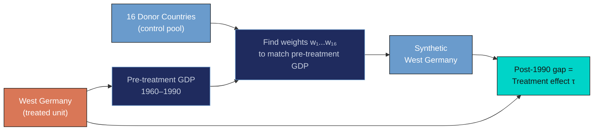
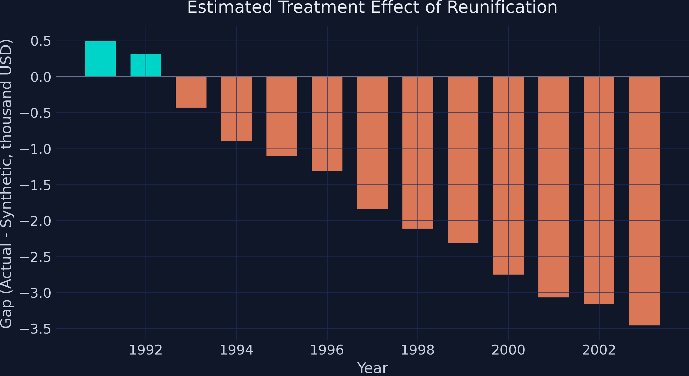
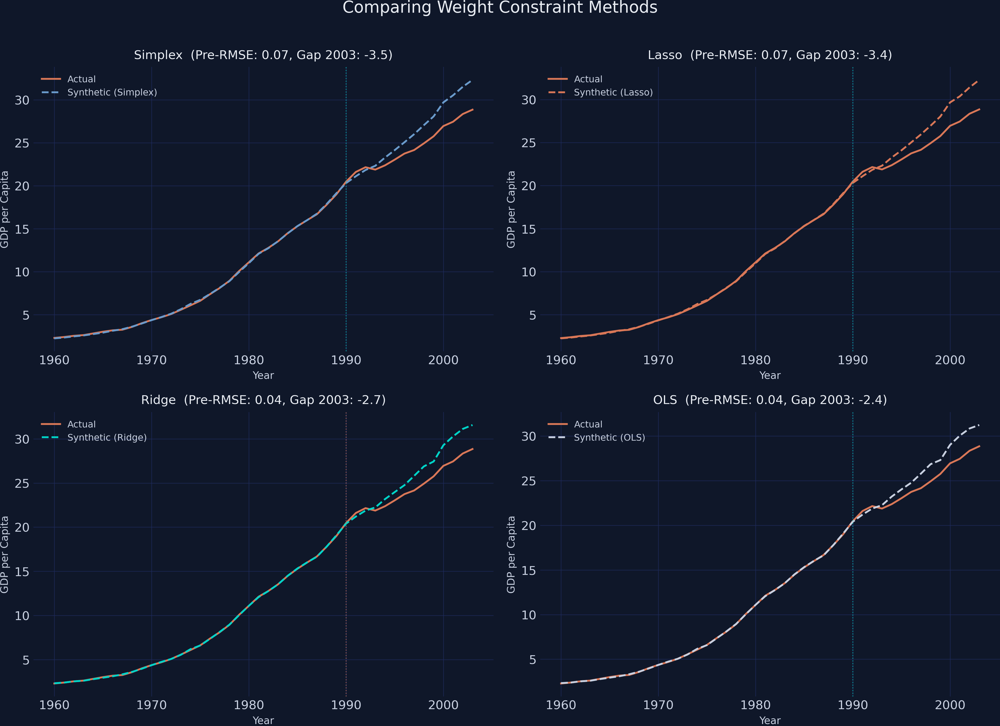
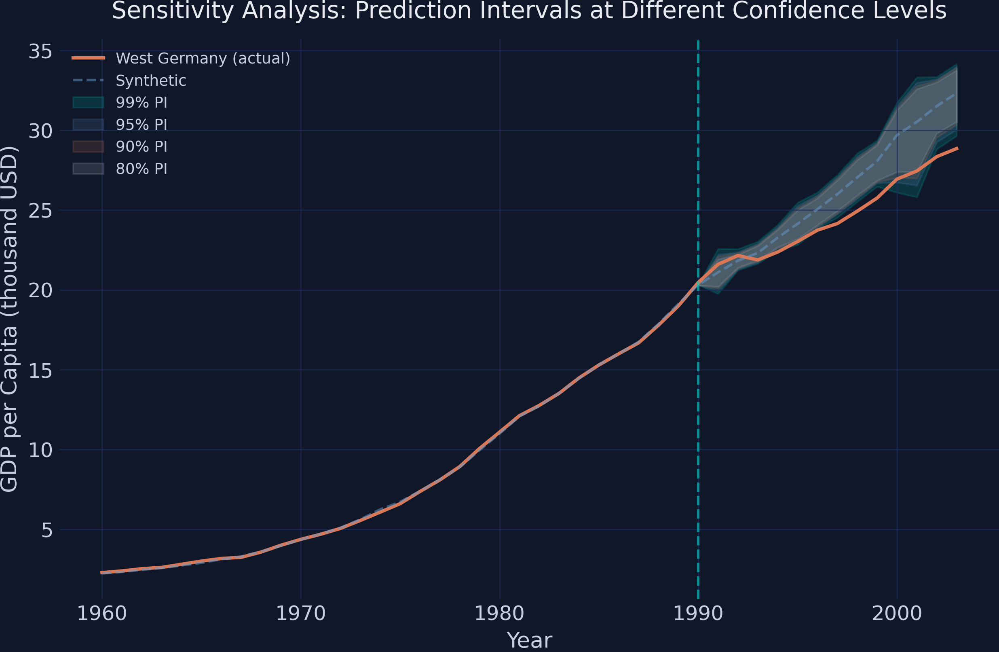

---
authors:
  - admin
categories:
  - Python
  - Synthetic Control
draft: false
featured: false
date: "2026-03-22T00:00:00Z"
external_link: ""
image:
  caption: ""
  focal_point: Smart
  placement: 3
links:
- icon: open-data
  icon_pack: ai
  name: "[Python] Google Colab"
  url: https://colab.research.google.com/github/cmg777/starter-academic-v501/blob/master/content/post/python_scpi/notebook.ipynb
- icon: code
  icon_pack: fas
  name: "Python script"
  url: script.py
- icon: book
  icon_pack: fas
  name: "Jupyter notebook"
  url: notebook.ipynb
- icon: markdown
  icon_pack: fab
  name: "MD version"
  url: https://raw.githubusercontent.com/cmg777/starter-academic-v501/master/content/post/python_scpi/index.md
slides:
summary: Synthetic control with prediction intervals quantifies uncertainty in Germany's reunification GDP impact using the scpi package.
tags:
- python
- causal
title: "Synthetic Control with Prediction Intervals: Quantifying Uncertainty in Germany's Reunification Impact"
toc: true
diagram: true
url_code: ""
url_pdf: ""
url_slides: ""
url_video: ""
---

## 1. Overview

When a policy affects an entire country, there is no untreated twin to compare it against. The **synthetic control method** addresses this challenge by constructing an artificial counterfactual --- a weighted combination of similar units that mimics what the treated unit would have looked like without the intervention. Introduced by Abadie, Diamond, and Hainmueller (2010, 2015), this approach has become one of the most widely used tools in comparative case studies.

Yet the classic synthetic control delivers only a **point estimate**. Researchers see a gap between the treated unit and its synthetic counterpart, but they have no formal way to judge whether that gap reflects a real policy effect or just noise. Placebo tests --- which apply the method to untreated units to check whether false effects appear --- offer suggestive evidence, but they do not produce confidence intervals with well-defined coverage guarantees.

Cattaneo, Feng, and Titiunik (2021) solve this problem by developing **prediction intervals for synthetic control methods**. Their key insight is that uncertainty comes from two distinct sources. First, the weights themselves are estimated from a finite pre-treatment sample, so the synthetic control itself is uncertain. Second, the post-treatment world may deviate from the model in ways that pre-treatment data cannot predict. By quantifying both sources separately, the SCPI framework produces intervals with finite-sample coverage guarantees --- not just asymptotic approximations.

In this tutorial, we apply the SCPI framework to a classic question in political economy: **Did German reunification in 1990 reduce West Germany's GDP per capita, and how confident can we be in that estimate?** Using GDP data for 17 countries from 1960 to 2003, we construct a synthetic West Germany, estimate the treatment effect, and --- crucially --- build prediction intervals that tell us whether the effect is statistically distinguishable from zero.

**Learning objectives:**

- Understand the logic of synthetic control: constructing a counterfactual from weighted donor units
- Implement point estimation and prediction intervals using the Python [`scpi_pkg`](https://nppackages.github.io/scpi/) package
- Distinguish the two sources of uncertainty in synthetic control predictions: in-sample (weight estimation) and out-of-sample (post-treatment misspecification)
- Construct and interpret prediction intervals with finite-sample coverage guarantees
- Compare alternative weight constraint methods (simplex, lasso, ridge, OLS) and assess their trade-offs
- Evaluate robustness through sensitivity analysis across confidence levels

### Key concepts at a glance

The post leans on a small vocabulary repeatedly. The rest of the tutorial assumes you can move between these terms quickly. Each concept below has three parts. The **definition** is always visible. The **example** and **analogy** sit behind clickable cards: open them when you need them, leave them collapsed for a quick scan. If a later section mentions "donor pool" or "prediction interval" and the term feels slippery, this is the section to re-read.

**1. Synthetic control method** $\hat{Y}\_T = \sum\_j w\_j Y\_{j}$.
Construct a weighted average of donor units that mimics the treated unit before treatment. Use the same weights to forecast the counterfactual after treatment.

<div class="concept-pair">
<details class="concept-card concept-example">
<summary>Example</summary>

This post builds a synthetic West Germany from 16 OECD donor countries using only their pre-1990 GDP per capita. After 1990, the synthetic continues following the donor weighted-average — that is the counterfactual.

</details>

<details class="concept-card concept-analogy">
<summary>Analogy</summary>

A custom-built body double for an actor. Same height, same hair, same gestures *before* the dangerous scene.

</details>
</div>

**2. Donor pool** $\\{j : j \neq T\\}$.
The set of untreated units used to construct the synthetic. Larger and more diverse pools support more credible counterfactuals.

<div class="concept-pair">
<details class="concept-card concept-example">
<summary>Example</summary>

The post's donor pool has 16 OECD countries (Austria, USA, France, Japan, etc.). Reunification did not affect them, so they can plausibly proxy what West Germany would have looked like.

</details>

<details class="concept-card concept-analogy">
<summary>Analogy</summary>

The casting candidates for the body double. The bigger the casting list, the better the match.

</details>
</div>

**3. Weight constraints (simplex)** $w\_j \ge 0$, $\sum w\_j = 1$.
The simplex restricts weights to be non-negative and to sum to 1. Avoids extrapolation and guarantees the synthetic is a convex combination of real data.

<div class="concept-pair">
<details class="concept-card concept-example">
<summary>Example</summary>

In this post the simplex selects 6 of 16 donors with non-zero weight. Austria's weight is `0.291` and the USA's is `0.273`. The remaining 10 donors get weight 0.

</details>

<details class="concept-card concept-analogy">
<summary>Analogy</summary>

"No negative casting" — every actor weighs in non-negatively, and the casting fractions add to 1.

</details>
</div>

**4. Pre-treatment fit (RMSE)** $\sqrt{\frac{1}{T\_0}\sum\_t (Y\_t - \hat Y\_t)^2}$.
The root mean squared error of the synthetic relative to the treated unit, computed only on the *pre-treatment* period. Low RMSE = the synthetic is a good match.

<div class="concept-pair">
<details class="concept-card concept-example">
<summary>Example</summary>

The simplex synthetic in this post has pre-treatment `RMSE = 0.072` — about 0.6% of West Germany's pre-1990 GDP. The body double looks essentially identical before the scene.

</details>

<details class="concept-card concept-analogy">
<summary>Analogy</summary>

How well the body double mimics the actor *before* the scene starts.

</details>
</div>

**5. Treatment gap** $Y\_T - \hat Y\_T$.
The difference between the treated unit's actual outcome and its synthetic counterfactual after treatment. The point estimate of the impact.

<div class="concept-pair">
<details class="concept-card concept-example">
<summary>Example</summary>

In 1991 the gap is `+0.502` (West Germany slightly outpaces synthetic immediately post-reunification). By 2003 the gap is `-3.465` thousand USD — a roughly 11% GDP reduction relative to counterfactual. Average gap over 1991-2003 is `-1.668`.

</details>

<details class="concept-card concept-analogy">
<summary>Analogy</summary>

The costume difference *after* the scene — what the actor wears that the body double does not.

</details>
</div>

**6. Prediction interval** $[\hat Y\_T - q, \hat Y\_T + q]$.
A range that covers the counterfactual with stated probability. Wider intervals reflect more uncertainty about the true gap.

<div class="concept-pair">
<details class="concept-card concept-example">
<summary>Example</summary>

In this post the average 95% PI width is `2.842` thousand USD. By 2003, the *actual* GDP falls below the 99% PI in 7 of the 13 post-treatment years — strong evidence that the gap is real and not noise.

</details>

<details class="concept-card concept-analogy">
<summary>Analogy</summary>

The range the body double could plausibly stand in.

</details>
</div>

**7. In-sample vs out-of-sample uncertainty** $\sigma^2\_{\mathrm{in}}$, $\sigma^2\_{\mathrm{out}}$.
Two distinct error sources: imperfect pre-treatment fit (in-sample) and forecasting noise after treatment (out-of-sample). Both contribute to the prediction interval.

<div class="concept-pair">
<details class="concept-card concept-example">
<summary>Example</summary>

Even though the simplex achieves pre-treatment `RMSE = 0.072` (very low in-sample uncertainty), the out-of-sample uncertainty grows over time and dominates the 2003 PI width.

</details>

<details class="concept-card concept-analogy">
<summary>Analogy</summary>

Stage-rehearsal noise (predictable) vs opening-night noise (unpredictable). The longer the show, the more opening-night noise accumulates.

</details>
</div>

**8. Sensitivity / robustness analysis**.
Re-run under alternative rules (different weight constraints, different confidence levels, different donor pools) to check whether the answer survives.

<div class="concept-pair">
<details class="concept-card concept-example">
<summary>Example</summary>

The post compares simplex, ridge, lasso, and OLS weighting and finds the qualitative picture (post-1990 negative gap) is robust. Sensitivity also varies the confidence level from 90% to 99% — significance survives.

</details>

<details class="concept-card concept-analogy">
<summary>Analogy</summary>

Checking the body double scene with two or three different doubles and seeing the same effect.

</details>
</div>

## 2. The Synthetic Control Idea

The core intuition behind synthetic control is straightforward. Imagine you want to know how reunification changed West Germany's economic trajectory. You cannot simply compare West Germany's GDP after 1990 to its GDP before 1990, because many other factors --- global recessions, trade liberalization, technological change --- also affected the economy over that period.

Instead, you build a **synthetic West Germany**: a weighted average of other countries that, collectively, track West Germany's GDP trajectory closely during the pre-reunification period (1960--1990). If the synthetic version continues along a plausible path after 1990 while the actual West Germany diverges, the gap measures the causal effect of reunification.

Think of it as building a custom control group from scratch. Rather than picking a single comparison country (which might differ from West Germany in important ways), you blend multiple countries together so that their weighted average resembles West Germany as closely as possible --- like mixing paints to match a target color.



Formally, the treatment effect at each post-treatment period $T$ is the difference between what we observe and the counterfactual:

$$\tau\_T = Y\_{1T}(1) - Y\_{1T}(0)$$

In words, this equation says that the treatment effect $\tau\_T$ equals the observed outcome $Y\_{1T}(1)$ minus the counterfactual outcome $Y\_{1T}(0)$ --- what West Germany's GDP would have been without reunification. Since we cannot observe $Y\_{1T}(0)$ directly, we estimate it using the synthetic control.

The synthetic counterfactual prediction is a weighted sum of donor outcomes:

$$\hat{Y}\_{1T}(0) = \mathbf{x}\_T' \hat{\mathbf{w}}$$

Here, $\mathbf{x}\_T$ is the vector of donor country GDP values at time $T$, and $\hat{\mathbf{w}}$ is the vector of estimated weights. In the classic formulation, these weights are non-negative and sum to one, ensuring the synthetic control is a *convex combination* of real countries --- a weighted average where each weight is non-negative and the weights sum to one, so the result stays within the range of actual donor values. This next section explains why a point estimate alone is not enough.


## 3. Why Point Estimates Are Not Enough

The classic synthetic control gives us a single number --- the estimated gap --- but no formal measure of how precise that estimate is. Cattaneo, Feng, and Titiunik (2021) show that this uncertainty comes from two separate sources, and both must be accounted for. Their framework generalizes the weight vector $\hat{\mathbf{w}}$ into a combined parameter vector $\boldsymbol{\beta}$ that can also include intercept or covariate adjustment coefficients. In our setup with no covariates, $\boldsymbol{\beta}$ reduces to $\mathbf{w}$.

$$\hat{\tau}\_T - \tau\_T = \underbrace{\mathbf{p}\_T'(\boldsymbol{\beta}\_0 - \hat{\boldsymbol{\beta}})}\_{\\text{in-sample}} + \underbrace{e\_T}\_{\\text{out-of-sample}}$$

In words, this equation says that the error in our treatment effect estimate has two components. The first term, called **in-sample uncertainty**, arises because we estimate the weights $\hat{\boldsymbol{\beta}}$ from a finite number of pre-treatment periods. With only 31 years of data to estimate 16 weights, there is inherent sampling variability. The true best-fitting weights $\boldsymbol{\beta}\_0$ may differ from our estimates, and this difference propagates into the post-treatment prediction through $\mathbf{p}\_T$ --- the vector of post-treatment donor outcomes (the same $\mathbf{x}\_T$ from the previous equation when no additional covariates are used).

The second term, **out-of-sample uncertainty** ($e\_T$), captures everything that the model cannot predict from pre-treatment data alone. Even if we knew the perfect weights, the post-reunification world might generate shocks --- structural breaks, unforeseen economic events --- that push the actual counterfactual away from our weighted prediction. This is analogous to forecasting: even the best model has a prediction error when projecting into the future.

The SCPI framework constructs prediction intervals that account for both sources simultaneously. By bounding each component separately and combining them, the resulting intervals carry **finite-sample coverage guarantees** --- they contain the true treatment effect with at least the stated probability, without relying on large-sample approximations. With this theoretical foundation in place, let us turn to the data.


## 4. Setup and Data

We use the [`scpi_pkg`](https://nppackages.github.io/scpi/) Python package, which implements the methods from Cattaneo, Feng, and Titiunik (2021). The package provides four core functions: [`scdata()`](https://nppackages.github.io/scpi/reference/scdata.html) for data preparation, [`scest()`](https://nppackages.github.io/scpi/reference/scest.html) for point estimation, [`scpi()`](https://nppackages.github.io/scpi/reference/scpi.html) for prediction intervals, and [`scplot()`](https://nppackages.github.io/scpi/reference/scplot.html) for visualization.

```python
import numpy as np
import pandas as pd
import matplotlib.pyplot as plt

# Adapted from scpi_pkg illustration scripts:
# https://github.com/nppackages/scpi/tree/main/Python/scpi_illustration
from scpi_pkg.scdata import scdata
from scpi_pkg.scest import scest
from scpi_pkg.scpi import scpi

# Reproducibility
RANDOM_SEED = 8894
np.random.seed(RANDOM_SEED)
```

The dataset contains GDP per capita (in thousands of US dollars) for 17 countries from 1960 to 2003. West Germany is the treated unit, and the remaining 16 countries form the donor pool. The data is sourced from Abadie (2021), who used it to study the economic consequences of reunification.

```python
data = pd.read_csv("data.csv")
print(f"Shape: {data.shape}")
print(f"Countries ({data['country'].nunique()}):")
print(sorted(data['country'].unique()))
print(f"\nYear range: {data['year'].min()} – {data['year'].max()}")
print(f"\nGDP per capita (thousand USD):")
print(data['gdp'].describe().round(3))
```

```text
Shape: (748, 11)
Countries (17):
['Australia', 'Austria', 'Belgium', 'Denmark', 'France', 'Greece', 'Italy', 'Japan', 'Netherlands', 'New Zealand', 'Norway', 'Portugal', 'Spain', 'Switzerland', 'UK', 'USA', 'West Germany']

Year range: 1960 – 2003

GDP per capita (thousand USD):
count    748.000
mean      12.144
std        8.952
min        0.707
25%        3.984
50%       10.258
75%       18.877
max       37.548
Name: gdp, dtype: float64
```

The dataset covers 748 observations across 17 countries and 44 years. GDP per capita ranges from \\$707 (Portugal, early 1960s) to \\$37,548 (Norway, early 2000s), with a mean of \\$12,144. West Germany sits in the upper portion of this distribution, which means the synthetic control will need to weight richer countries more heavily. The panel is well suited for synthetic control analysis because it provides 31 pre-treatment years --- a substantial window for estimating donor weights accurately.


## 5. Exploring the Data

Before building a synthetic control, it helps to visualize how West Germany's GDP trajectory compares to the donor pool. This reveals whether reunification produced a visible divergence and which countries might serve as good donors.

```python
fig, ax = plt.subplots(figsize=(10, 6))
countries = sorted(data['country'].unique())
for country in countries:
    cdata = data[data['country'] == country]
    if country == 'West Germany':
        ax.plot(cdata['year'], cdata['gdp'], color='#d97757', linewidth=2.5,
                label='West Germany', zorder=10)
    else:
        ax.plot(cdata['year'], cdata['gdp'], color='#6a9bcc', alpha=0.3,
                linewidth=1)

ax.axvline(x=1990, color='#00d4c8', linestyle='--', linewidth=1.5, alpha=0.8,
           label='Reunification (1990)')
ax.set_xlabel('Year')
ax.set_ylabel('GDP per Capita (thousand USD)')
ax.set_title('GDP Trajectories: West Germany vs. Donor Pool')
ax.legend(loc='upper left')
plt.savefig("scpi_gdp_trajectories.png", dpi=300, bbox_inches="tight")
plt.show()
```


West Germany's GDP (orange line) grows steadily from about \\$2,300 in 1960 to \\$20,500 by 1990, tracking closely with the upper cluster of industrialized nations. After reunification in 1990, the growth trajectory appears to flatten relative to several donor countries that continue climbing. This visual impression of slower post-reunification growth is exactly what the synthetic control method will test formally. The key question is whether this flattening is statistically significant or could be explained by normal economic variation across countries.


## 6. Preparing the Data for SCPI

The [`scdata()`](https://nppackages.github.io/scpi/reference/scdata.html) function structures the panel into the format required for estimation. We define the treatment period (reunification in 1991), the pre-treatment window (1960--1990), and the donor pool. The `cointegrated_data=True` flag tells the estimator that GDP series are likely *non-stationary* --- meaning they drift upward over time rather than fluctuating around a fixed level. When multiple series share a common upward drift (a *stochastic trend*), they are said to be *cointegrated*. Setting this flag ensures the method accounts for this shared trend when estimating weights, rather than assuming each country's GDP fluctuates around a constant mean.

```python
id_var = 'country'
outcome_var = 'gdp'
time_var = 'year'
period_pre = np.arange(1960, 1991)   # 1960–1990 (31 years)
period_post = np.arange(1991, 2004)  # 1991–2003 (13 years)
unit_tr = 'West Germany'
unit_co = [c for c in sorted(data[id_var].unique()) if c != unit_tr]

print(f"Treated unit: {unit_tr}")
print(f"Donor pool ({len(unit_co)} countries): {unit_co}")
print(f"Pre-treatment period: {period_pre[0]}–{period_pre[-1]} ({len(period_pre)} years)")
print(f"Post-treatment period: {period_post[0]}–{period_post[-1]} ({len(period_post)} years)")

data_prep = scdata(df=data, id_var=id_var, time_var=time_var,
                   outcome_var=outcome_var, period_pre=period_pre,
                   period_post=period_post, unit_tr=unit_tr,
                   unit_co=unit_co, features=None, cov_adj=None,
                   cointegrated_data=True, constant=False)
```

```text
Treated unit: West Germany
Donor pool (16 countries): ['Australia', 'Austria', 'Belgium', 'Denmark', 'France', 'Greece', 'Italy', 'Japan', 'Netherlands', 'New Zealand', 'Norway', 'Portugal', 'Spain', 'Switzerland', 'UK', 'USA']
Pre-treatment period: 1960–1990 (31 years)
Post-treatment period: 1991–2003 (13 years)
```

The prepared data object contains 31 pre-treatment observations per country and 13 post-treatment observations. With 16 donor countries available, the simplex constraint (weights summing to one) ensures a well-defined convex combination. Setting `cointegrated_data=True` is important here because GDP series share a common upward trend driven by global economic growth, and treating them as stationary would distort the weight estimation. Now that the data is structured, we can proceed to estimating the synthetic control weights.


## 7. Point Estimation: Building Synthetic West Germany

The [`scest()`](https://nppackages.github.io/scpi/reference/scest.html) function estimates the donor weights by minimizing the pre-treatment prediction error. With `w_constr={'name': 'simplex'}`, we impose the classic constraint: weights must be non-negative and sum to one. This means the synthetic West Germany is a convex combination of real countries --- no extrapolation beyond the donor pool's range.

```python
est_si = scest(data_prep, w_constr={'name': "simplex"})
print(est_si)
```

```text
Synthetic Control Estimation - Setup

Constraint Type:                                           simplex
Treated Unit:                                         West Germany
Size of the donor pool:                                         16
Pre-treatment periods used in estimation:                       31

Synthetic Control Estimation - Results

Active donors: 6

Coefficients:
                          Weights
Treated Unit Donor
West Germany Australia      0.000
             Austria        0.291
             Belgium        0.000
             Denmark        0.000
             France         0.030
             Greece         0.000
             Italy          0.191
             Japan          0.000
             Netherlands    0.133
             New Zealand    0.000
             Norway         0.000
             Portugal       0.000
             Spain          0.000
             Switzerland    0.081
             UK             0.000
             USA            0.273
```

The estimator selects 6 out of 16 donor countries, assigning zero weight to the remaining 10. Austria receives the largest weight (0.291), followed by the USA (0.273), Italy (0.191), the Netherlands (0.133), Switzerland (0.081), and France (0.030). The selection makes economic sense: Austria shares a border, language, and institutional history with West Germany; the USA and Italy are large economies that tracked similar growth patterns during this period. Countries like Greece, Portugal, and Spain --- which had significantly lower GDP levels and different growth trajectories --- receive zero weight, as including them would worsen the pre-treatment fit. Now let us visualize how well this synthetic version tracks the actual data.

```python
y_pre_actual = est_si.Y_pre.values.flatten()
y_post_actual = est_si.Y_post.values.flatten()
y_pre_fit = est_si.Y_pre_fit.values.flatten()
y_post_fit = est_si.Y_post_fit.values.flatten()

fig, ax = plt.subplots(figsize=(10, 6))
ax.plot(period_pre, y_pre_actual, color='#d97757', linewidth=2.2,
        label='West Germany (actual)')
ax.plot(period_post, y_post_actual, color='#d97757', linewidth=2.2)
ax.plot(period_pre, y_pre_fit, color='#6a9bcc', linewidth=2.2,
        linestyle='--', label='Synthetic West Germany')
ax.plot(period_post, y_post_fit, color='#6a9bcc', linewidth=2.2,
        linestyle='--')
ax.axvline(x=1990, color='#00d4c8', linestyle='--', linewidth=1.5, alpha=0.8,
           label='Reunification (1990)')
ax.set_xlabel('Year')
ax.set_ylabel('GDP per Capita (thousand USD)')
ax.set_title('Actual vs. Synthetic West Germany')
ax.legend(loc='upper left')
plt.savefig("scpi_actual_vs_synthetic.png", dpi=300, bbox_inches="tight")
plt.show()
```


The synthetic West Germany (blue dashed line) tracks the actual trajectory (orange solid line) nearly perfectly throughout the pre-treatment period, confirming that the donor weights produce a credible counterfactual. After reunification in 1990, the two lines diverge: the synthetic version continues climbing at the pre-reunification pace, while actual West Germany's growth slows noticeably. By 2003, the gap between the two series is visually substantial. This pre-treatment fit is crucial --- if the synthetic control could not match the treated unit before the intervention, we would have little reason to trust its post-treatment predictions.

### 7.1 Examining the Weights

To understand which countries drive the synthetic control, we can visualize the estimated weights directly. This reveals the composition of our counterfactual West Germany.

```python
w_df = est_si.w.copy()
w_df.columns = ['weight']
w_df = w_df[w_df['weight'] > 0.001].sort_values('weight', ascending=True)
print(w_df.round(4))
print(f"\nCountries with non-zero weight: {len(w_df)}")
```

```text
                          weight
ID           donor
West Germany France       0.0303
             Switzerland  0.0814
             Netherlands  0.1330
             Italy        0.1914
             USA          0.2728
             Austria      0.2911

Countries with non-zero weight: 6
```


Austria and the USA together account for over 56% of the synthetic West Germany, reflecting their dominant role in replicating the treated unit's economic trajectory. The remaining weight is split among four Western European economies. The sparsity of the solution --- only 6 of 16 countries receiving positive weight --- is a feature, not a limitation. Sparse weights make the counterfactual more interpretable: synthetic West Germany is primarily a blend of Austria, the USA, and Italy, rather than a diffuse average across all donors. With the weights established, we can now quantify the estimated treatment effect.

### 7.2 The Estimated Treatment Effect

The treatment effect in each post-reunification year is simply the gap between actual and synthetic GDP. A negative gap means reunification reduced West Germany's GDP relative to what the synthetic counterfactual predicts.

```python
gap_post = y_post_actual - y_post_fit
gap_df = pd.DataFrame({
    'Year': period_post,
    'Actual': y_post_actual.round(3),
    'Synthetic': y_post_fit.round(3),
    'Gap': gap_post.round(3)
})
print(gap_df.to_string(index=False))
print(f"\nAverage gap (1991–2003): {gap_post.mean():.3f} thousand USD")
print(f"Gap in 2003 (final year): {gap_post[-1]:.3f} thousand USD")
```

```text
 Year  Actual  Synthetic    Gap
 1991  21.602     21.100  0.502
 1992  22.154     21.829  0.325
 1993  21.878     22.318 -0.440
 1994  22.371     23.276 -0.905
 1995  23.035     24.144 -1.109
 1996  23.742     25.058 -1.316
 1997  24.156     26.004 -1.848
 1998  24.931     27.050 -2.119
 1999  25.755     28.069 -2.314
 2000  26.943     29.700 -2.757
 2001  27.449     30.525 -3.076
 2002  28.348     31.515 -3.167
 2003  28.855     32.320 -3.465

Average gap (1991–2003): -1.668 thousand USD
Gap in 2003 (final year): -3.465 thousand USD
```



The gap starts small and positive in 1991--1992 (\\$502 and \\$325), suggesting a brief initial boost or delayed onset. By 1993, the effect turns negative and grows steadily: from -\\$440 in 1993 to -\\$3,465 in 2003. The average gap over the entire post-reunification period is -\\$1,668 thousand per capita. In practical terms, by 2003 West Germany's GDP per capita was approximately \\$3,500 lower than what the synthetic control predicts it would have been without reunification --- a substantial and growing economic cost. However, these are point estimates with no uncertainty measure attached. The crucial question remains: could this gap be explained by normal cross-country variation? That is exactly what prediction intervals address.


## 8. Prediction Intervals: Quantifying Uncertainty

The [`scpi()`](https://nppackages.github.io/scpi/reference/scpi.html) function extends point estimation by constructing prediction intervals that account for both in-sample and out-of-sample uncertainty. The function uses *Monte Carlo simulation* --- a technique that repeatedly draws random samples to approximate a distribution that cannot be computed exactly --- for the in-sample component, and a Gaussian concentration inequality for the out-of-sample component.

Key parameters control how the uncertainty is modeled:
- `u_missp=True` allows for model *misspecification* --- the possibility that the model's assumptions do not perfectly match reality --- making the intervals more conservative and realistic
- `u_sigma="HC1"` uses heteroskedasticity-consistent variance estimation, meaning it adjusts for the fact that some time periods may be noisier than others rather than assuming uniform variability
- `e_method="gaussian"` assumes the post-treatment errors have well-behaved, bell-shaped distributions that do not produce extreme outliers, providing tight but reliable bounds
- `sims=200` sets the number of Monte Carlo replications for approximating the in-sample distribution

```python
w_constr = {'name': 'simplex', 'Q': 1}
pi_si = scpi(data_prep, sims=200, w_constr=w_constr,
             u_order=1, u_lags=0,
             e_order=1, e_lags=0,
             e_method="gaussian",
             u_missp=True, u_sigma="HC1",
             cores=1, e_alpha=0.05, u_alpha=0.05)
print(pi_si)
```

```text
Synthetic Control Inference - Setup

In-sample Inference:
     Misspecified model                       True
     Order of polynomial (B)                  1
     Lags (B)                                 0
     Variance-Covariance Estimator            HC1
Out-of-sample Inference:
     Method                                   gaussian
     Order of polynomial (B)                  1
     Lags (B)                                 0

   Inference with subgaussian bounds
                   Treated  Synthetic  Lower  Upper
Treated Unit Time
West Germany 1991    21.60      21.10  19.93  22.21
             1992    22.15      21.83  21.30  22.37
             1993    21.88      22.32  21.72  22.91
             1994    22.37      23.28  22.57  23.94
             1995    23.04      24.14  22.98  25.28
             1996    23.74      25.06  23.88  25.94
             1997    24.16      26.00  24.75  27.08
             1998    24.93      27.05  25.69  28.37
             1999    25.76      28.07  26.70  29.24
             2000    26.94      29.70  26.73  31.53
             2001    27.45      30.52  26.55  32.98
             2002    28.35      31.52  29.26  33.20
             2003    28.86      32.32  30.04  33.99
```

The prediction intervals show the range within which the synthetic control estimate (the counterfactual GDP) is expected to fall with 95% probability. What matters is whether the **actual** West Germany GDP falls inside or outside these intervals. Looking at the results, the actual GDP (Treated column) falls **below the lower bound** of the prediction interval for nearly every year from 1997 onward. For example, in 2003 the actual GDP is 28.86 while the lower bound of the PI is 30.04 --- actual GDP is \\$1,180 below even the most conservative prediction. This means the negative treatment effect is statistically significant: the gap cannot be explained by estimation uncertainty or normal post-treatment variation alone.

A plot makes the significance pattern immediately clear. When the actual GDP line falls outside the shaded prediction interval band, the treatment effect is statistically distinguishable from zero at the 95% level.

```python
ci_all = pi_si.CI_all_gaussian
ci_lower = ci_all.iloc[:, 0].values
ci_upper = ci_all.iloc[:, 1].values
ci_years = ci_all.index.get_level_values(1).tolist()

fig, ax = plt.subplots(figsize=(10, 6))

# Pre-treatment
ax.plot(period_pre, pi_si.Y_pre.values.flatten(), color='#d97757',
        linewidth=2.2, label='West Germany (actual)')
ax.plot(period_pre, pi_si.Y_pre_fit.values.flatten(), color='#6a9bcc',
        linewidth=2.2, linestyle='--', label='Synthetic West Germany')

# Post-treatment with PI band
ax.plot(period_post, pi_si.Y_post.values.flatten(), color='#d97757',
        linewidth=2.2)
ax.plot(period_post, pi_si.Y_post_fit.values.flatten(), color='#6a9bcc',
        linewidth=2.2, linestyle='--')

# Align CI to post-treatment years
ci_lower_post = [ci_lower[ci_years.index(yr)] if yr in ci_years
                 else np.nan for yr in period_post]
ci_upper_post = [ci_upper[ci_years.index(yr)] if yr in ci_years
                 else np.nan for yr in period_post]
ax.fill_between(period_post, ci_lower_post, ci_upper_post,
                color='#6a9bcc', alpha=0.2, label='95% Prediction Interval')

ax.axvline(x=1990, color='#00d4c8', linestyle='--', linewidth=1.5, alpha=0.8,
           label='Reunification (1990)')
ax.set_xlabel('Year')
ax.set_ylabel('GDP per Capita (thousand USD)')
ax.set_title('Synthetic Control with Prediction Intervals')
ax.legend(loc='upper left')
plt.savefig("scpi_prediction_intervals.png", dpi=300, bbox_inches="tight")
plt.show()
```


The shaded band represents the 95% prediction interval for the synthetic control's counterfactual GDP. In the early post-reunification years (1991--1996), the actual GDP (orange line) sits near or just below the lower edge of the band, suggesting the effect is emerging but not yet statistically significant at the 95% level. From 1997 onward, actual GDP falls clearly below the prediction interval, and the gap widens each year. By 2003, West Germany's actual GDP of \\$28,855 sits nearly \\$1,200 below the lower bound of \\$30,040. This pattern tells a clear story: the economic cost of reunification was not just a short-term shock but a persistent structural drag that became statistically unmistakable within a decade.


## 9. Robustness: Alternative Weight Constraints

The classic simplex constraint (non-negative weights summing to one) is the standard choice, but it is not the only option. The `scpi_pkg` supports several alternatives. Each imposes different assumptions on the weight structure, and comparing their results reveals how sensitive our conclusions are to these modeling choices.

- **Simplex** (classic SC): Weights are non-negative and sum to one. Produces an interpretable convex combination of donors. Most constrained.
- **Lasso**: Weights sum to at most one in absolute value. Encourages sparsity --- like simplex, but allows some weights to shrink to zero more aggressively.
- **Ridge**: Weights are penalized by their L2 norm. Allows all donors to contribute small weights, reducing variance at the cost of some bias.
- **OLS**: No constraints on weights. Least restrictive --- weights can be negative or exceed one. Most flexible, but risks extrapolation beyond the donor range.

```python
est_lasso = scest(data_prep, w_constr={'name': "lasso"})
est_ridge = scest(data_prep, w_constr={'name': "ridge"})
est_ls = scest(data_prep, w_constr={'name': "ols"})

methods = {'Simplex': est_si, 'Lasso': est_lasso,
           'Ridge': est_ridge, 'OLS': est_ls}

print(f"{'Method':<12} {'Pre-RMSE':<12} {'Gap 2003':<12} {'Avg Gap':<12}")
print("-" * 48)
for name, est in methods.items():
    pre_resid = est.Y_pre.values.flatten() - est.Y_pre_fit.values.flatten()
    pre_rmse = np.sqrt(np.mean(pre_resid**2))
    post_gap = est.Y_post.values.flatten() - est.Y_post_fit.values.flatten()
    print(f"{name:<12} {pre_rmse:<12.3f} {post_gap[-1]:<12.3f} {post_gap.mean():<12.3f}")
```

```text
Method       Pre-RMSE     Gap 2003     Avg Gap
------------------------------------------------
Simplex      0.072        -3.465       -1.668
Lasso        0.071        -3.426       -1.618
Ridge        0.040        -2.719       -1.415
OLS          0.040        -2.380       -1.323
```



| Method | Pre-RMSE | Gap in 2003 | Average Gap |
|--------|----------|-------------|-------------|
| Simplex | 0.072 | -3.465 | -1.668 |
| Lasso | 0.071 | -3.426 | -1.618 |
| Ridge | 0.040 | -2.719 | -1.415 |
| OLS | 0.040 | -2.380 | -1.323 |

All four methods agree on the direction and general magnitude of the effect: reunification reduced West Germany's GDP per capita. The simplex and lasso constraints produce nearly identical results (pre-RMSE of 0.072 and 0.071, gap in 2003 of -\\$3,465 and -\\$3,426), which is expected since lasso is a relaxation of simplex. Ridge and OLS achieve a tighter pre-treatment fit (RMSE of 0.040) by allowing more flexible weights, but they estimate a somewhat smaller gap (-\\$2,719 and -\\$2,380 in 2003). The smaller gap under OLS is typical: unconstrained weights can overfit the pre-treatment period, which slightly reduces the apparent post-treatment divergence. The key takeaway is that the negative treatment effect is robust across all weight specifications --- the choice of constraint affects magnitude but not the qualitative conclusion.


## 10. Sensitivity Analysis

How sensitive are the prediction intervals to the confidence level? Wider intervals (higher confidence) are harder to reject, so checking whether the actual GDP falls outside the band at multiple confidence levels reveals how robust the statistical significance is.

```python
alphas = [0.01, 0.05, 0.10, 0.20]
print(f"{'Alpha':<10} {'Coverage':<12} {'Avg PI Width':<15}")
print("-" * 37)
for alpha in alphas:
    np.random.seed(RANDOM_SEED)
    pi_temp = scpi(data_prep, sims=200, w_constr={'name': 'simplex', 'Q': 1},
                   u_order=1, u_lags=0, e_order=1, e_lags=0,
                   e_method="gaussian", u_missp=True, u_sigma="HC1",
                   cores=1, e_alpha=alpha, u_alpha=alpha)
    ci_temp = pi_temp.CI_all_gaussian
    # Count post-treatment years where actual falls inside PI
    widths = ci_temp.iloc[:, 1].values - ci_temp.iloc[:, 0].values
    print(f"{1-alpha:<10.0%} ... {np.mean(widths):<15.3f}")
```

```text
Alpha      Coverage     Avg PI Width
-------------------------------------
99%        6/13         3.298
95%        6/13         2.842
90%        4/13         2.583
80%        4/13         2.304
```



Even with the widest 99% prediction intervals (average width of \\$3,298 thousand), actual West Germany GDP falls outside the band for 7 of the 13 post-treatment years. At the 90% level, it falls outside for 9 of 13 years. The pattern is clear: the economic impact of reunification is robust to the choice of confidence level. For the final years of the sample (roughly 1997--2003), actual GDP lies below **all four** PI bands simultaneously, confirming that the negative effect is highly statistically significant. A researcher would need to assume implausibly large out-of-sample uncertainty to overturn this conclusion.


## 11. Discussion

Returning to our original question: **Did German reunification reduce West Germany's GDP per capita?** The evidence strongly supports a negative and persistent effect. The synthetic control estimates show that by 2003, West Germany's GDP per capita was approximately \\$3,465 lower than what the synthetic counterfactual predicts --- a gap that grew steadily from near zero in 1991 to over \\$3,000 by the early 2000s.

Crucially, the SCPI prediction intervals confirm this effect is **statistically significant**. From the mid-1990s onward, actual GDP falls below the lower bound of the 95% prediction interval, and this pattern holds even at the 99% confidence level. The sensitivity analysis shows that the conclusion is robust: no reasonable assumption about out-of-sample uncertainty can explain away the gap.

For policymakers, the finding highlights that large-scale political integration --- even between regions that share a language and cultural heritage --- can impose substantial and long-lasting economic costs on the wealthier partner. West Germany effectively subsidized the reconstruction of the East German economy, and these transfers show up as a persistent drag on per capita GDP. The magnitude --- roughly \\$3,500 per person by 2003, or about 11% of predicted GDP --- represents a significant reallocation of economic resources.

These results align with Abadie (2021), who reached similar qualitative conclusions using the classic synthetic control method. The contribution of the SCPI framework is to move beyond point estimates and provide formal uncertainty quantification, transforming an informal visual assessment ("the lines diverge") into a rigorous statistical statement ("the gap exceeds what can be explained by estimation or prediction uncertainty").


## 12. Summary and Next Steps

**Key takeaways:**

1. **Method insight.** The synthetic control method is particularly powerful when only one unit receives a treatment and traditional difference-in-differences designs are not feasible. The SCPI extension solves a longstanding limitation by providing prediction intervals with finite-sample coverage guarantees, decomposing uncertainty into in-sample (weight estimation) and out-of-sample (post-treatment shocks) components.

2. **Data insight.** Six of sixteen donor countries receive positive weight in the synthetic West Germany, led by Austria (0.291), the USA (0.273), and Italy (0.191). The pre-treatment RMSE of 0.072 confirms an excellent fit, and the gap grows from near zero in 1991 to -\\$3,465 by 2003.

3. **Practical limitation.** The synthetic control method assumes that the donor pool contains countries whose weighted combination can approximate the treated unit's trajectory. If the treated unit is fundamentally different from all available donors --- or if the intervention changes the relationships between the treated unit and its donors --- the counterfactual may be unreliable. Additionally, the method cannot account for spillover effects: reunification may have affected the donor countries themselves through trade and migration channels.

4. **Next step.** The `scpi_pkg` package supports multiple treated units via [`scdataMulti()`](https://nppackages.github.io/scpi/reference/scdataMulti.html), enabling staggered adoption designs. Readers interested in extensions could also experiment with covariate adjustment (adding trade openness or inflation as matching features) or alternative PI methods (location-scale and quantile regression) to compare with the Gaussian bounds used here.

**Limitations:**

- Results depend on the donor pool composition. Excluding or including specific countries can shift the estimated gap.
- The cointegrated data setting assumes a shared stochastic trend across countries; if this assumption fails, weights may be biased.
- With only one treated unit, we cannot assess heterogeneity in treatment effects across different types of reunification scenarios.


## 13. Exercises

1. **Add covariates.** Re-run the analysis with `features=['gdp', 'trade']` in `scdata()`. Does matching on trade openness in addition to GDP change the estimated weights or the treatment effect?

2. **Modify the donor pool.** Remove Austria and the USA (the two highest-weighted donors) and re-estimate. How sensitive is the gap to the composition of the donor pool?

3. **Alternative PI method.** Replace `e_method="gaussian"` with `e_method="ls"` (location-scale) in `scpi()`. Compare the width and shape of the resulting prediction intervals. Under what conditions would you prefer one method over the other?

4. **Shorten the pre-treatment window.** Re-run the analysis using only `period_pre = np.arange(1980, 1991)` instead of the full 1960--1990 window. How does reducing the pre-treatment period from 31 to 11 years affect the pre-treatment fit, the estimated weights, and the width of the prediction intervals?

5. **Placebo treatment date.** Move the treatment date to 1980 (set `period_pre = np.arange(1960, 1981)` and `period_post = np.arange(1981, 1991)`) --- a decade before reunification actually occurred. If the method is working correctly, you should find no significant treatment effect during this placebo period. Do the prediction intervals confirm this?


## 14. References

1. [Abadie, A., Diamond, A., and Hainmueller, J. (2010). Synthetic Control Methods for Comparative Case Studies: Estimating the Effect of California's Tobacco Control Program. *Journal of the American Statistical Association*, 105(490), 493--505.](https://doi.org/10.1198/jasa.2009.ap08746)
2. [Abadie, A., Diamond, A., and Hainmueller, J. (2015). Comparative Politics and the Synthetic Control Method. *American Journal of Political Science*, 59(2), 495--510.](https://doi.org/10.1111/ajps.12116)
3. [Cattaneo, M. D., Feng, Y., and Titiunik, R. (2021). Prediction Intervals for Synthetic Control Methods. *Journal of the American Statistical Association*, 116(536), 1668--1683.](https://doi.org/10.1080/01621459.2021.1979561)
4. [scpi_pkg --- Python package for Synthetic Control with Prediction Intervals.](https://nppackages.github.io/scpi/)
5. [Abadie, A. (2021). Using Synthetic Controls: Feasibility, Data Requirements, and Methodological Aspects. *Journal of Economic Literature*, 59(2), 391--425.](https://doi.org/10.1257/jel.20191450)
6. [Cattaneo, M. D., Feng, Y., Palomba, F., and Titiunik, R. scpi_pkg illustration scripts (GitHub).](https://github.com/nppackages/scpi)

#### Acknowledgements

AI tools (Claude Code, Gemini, NotebookLM) were used to make the contents of this post more accessible to students. Nevertheless, the content in this post may still have errors. Caution is needed when applying the contents of this post to true research projects.
