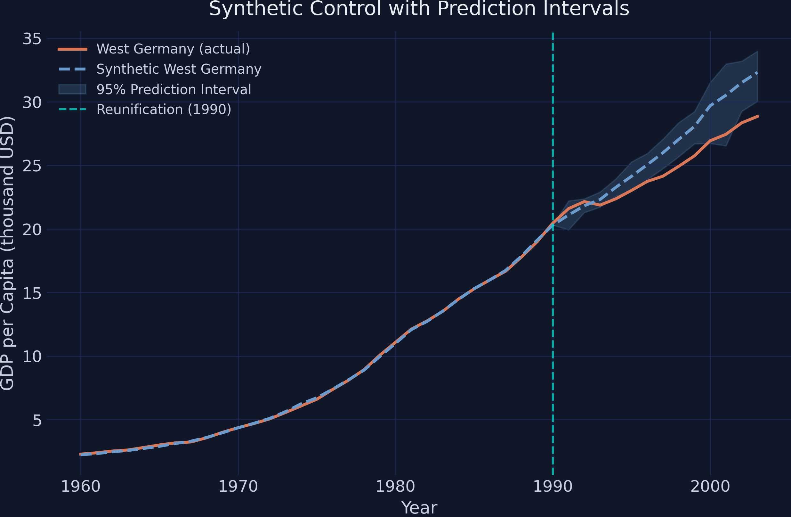
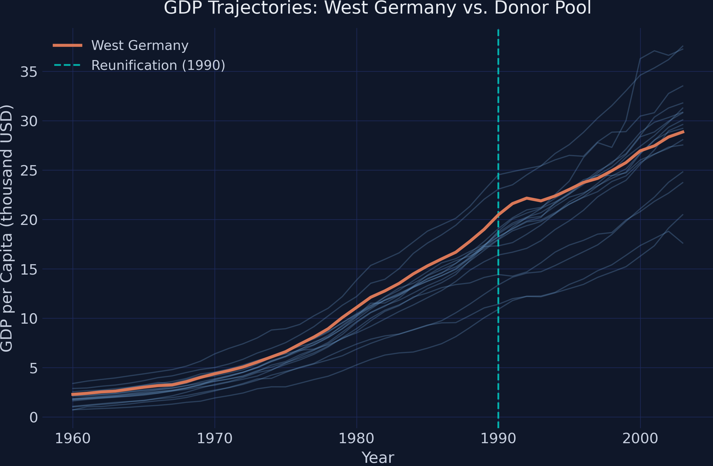
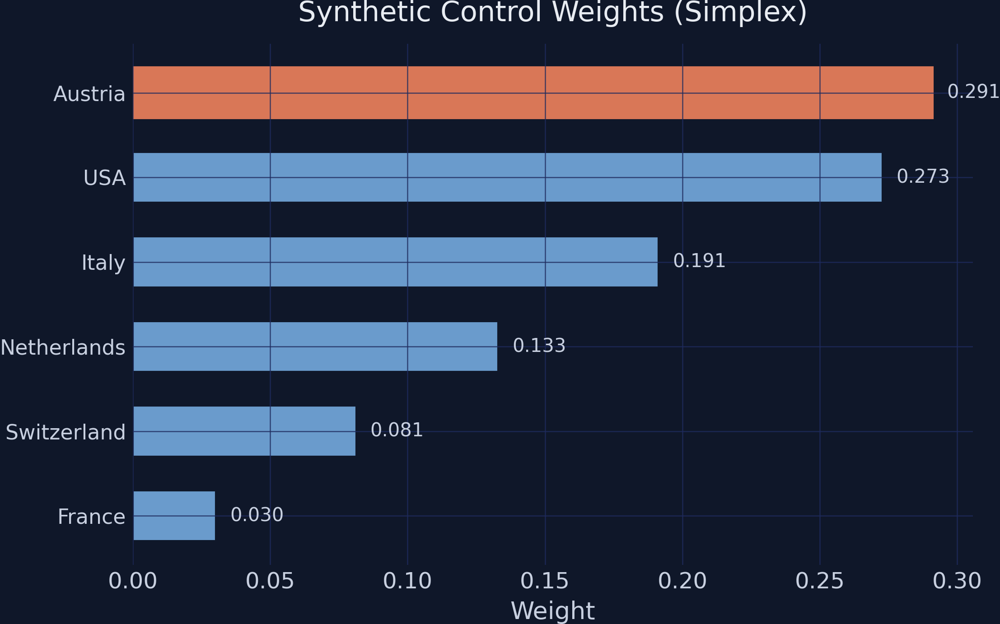
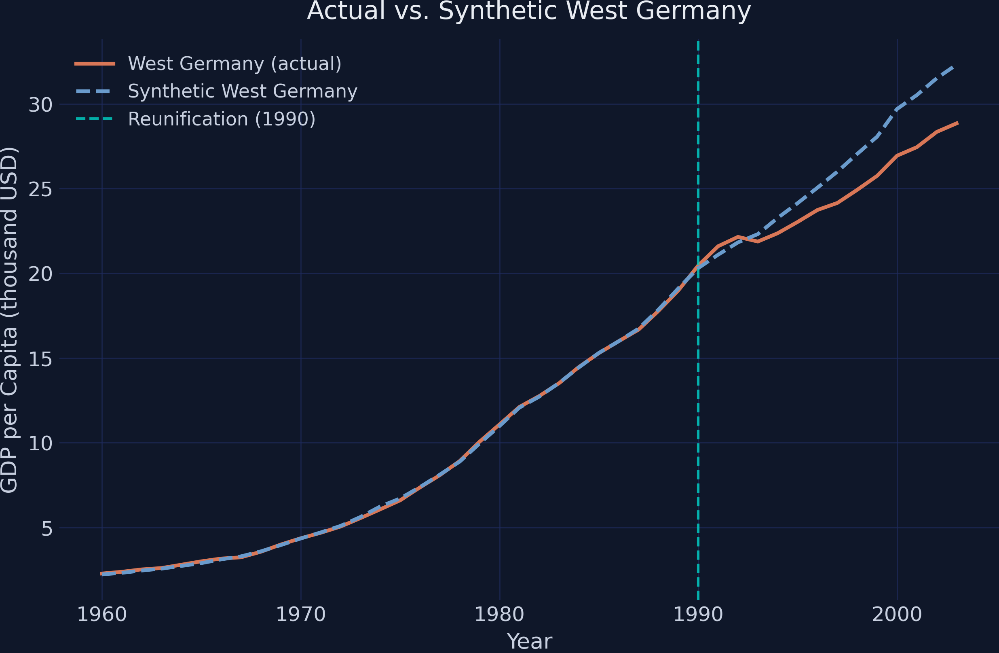

# The Tension {.divider background-color="#d97757"}

[Act I]{.act}

## When a whole country is treated, there is no untreated twin to compare it to

In 1990, West Germany reunified with the East. Did that integration *lower* the West's GDP per capita — and by how much?

. . .

There is exactly one treated unit and no control. *Where does the counterfactual come from?*

::: {.notes}
This is the defining problem of comparative case studies: a single treated unit, no natural control group. Standard difference-in-differences needs an untreated comparison; here there is none. The synthetic control method manufactures one. Set up the stakes: a real policy question with a one-of-a-kind treatment.
:::

## Even with a counterfactual, a point estimate alone cannot tell us if the gap is real



::: {.notes}
This is the deck's money chart — show it now, do not yet explain how the band is built. Plant two facts: (1) the two lines diverge after reunification, and (2) the actual line drops out of the shaded interval. The whole talk earns that shaded band. The classic synthetic control gives only the gap between the lines; the SCPI framework gives the band — that is the contribution.
:::

## Where we're going

::: {.incremental}
- The lab: 17 countries, 1960–2003, West Germany as the treated unit
- Build a synthetic West Germany from a weighted donor pool
- The point estimate — the gap — and why it is not enough
- Prediction intervals: in-sample + out-of-sample uncertainty
- Robustness: four weight constraints, four confidence levels
:::

# The Investigation {.divider background-color="#6a9bcc"}

[Act II]{.act}

## The estimand is the ATT for one unit: West Germany's gap from its own counterfactual

The treatment effect in each post-1990 year is the difference between what we see and what would have happened:

$$\tau_T = Y_{1T}(1) - Y_{1T}(0)$$

[$Y_{1T}(1)$ is observed; $Y_{1T}(0)$ — West Germany *without* reunification — is never observed, so we estimate it.]{.comment}

::: {.notes}
Name the estimand explicitly: this is the ATT for the single treated unit (West Germany), period by period. It is not an average over many units — there is only one. The fundamental problem of causal inference is that Y(0) for a treated unit is counterfactual. Synthetic control is a strategy for imputing that missing potential outcome.
:::

## The counterfactual is a weighted blend of donor countries — like mixing paints to a target

$$\hat{Y}^{N}_{1T} = \mathbf{x}_T' \hat{\mathbf{w}} = \sum_{j} \hat w_j\, Y_{jT}$$

The simplex constraint keeps the blend honest:

$$\hat w_j \ge 0, \qquad \sum_j \hat w_j = 1$$

[Non-negative weights that sum to one make synthetic West Germany a *convex combination* — it never extrapolates beyond the real donor data.]{.comment}

::: {.notes}
Rather than picking one comparison country, blend many so their weighted average matches West Germany before 1990. The simplex (weights ≥ 0, summing to 1) is the classic Abadie-Diamond-Hainmueller constraint. It buys interpretability and rules out extrapolation. We relax it later (lasso/ridge/OLS) to test robustness.
:::

## The lab: 17 countries, 44 years, 748 observations, 31 pre-treatment years

::: {.incremental}
- **Treated unit** — West Germany
- **Donor pool** — 16 OECD countries (Austria, USA, Italy, …)
- **Outcome** — GDP per capita, thousands of USD
- **Window** — 1960–1990 to fit weights; 1991–2003 to measure the gap
:::

[`cointegrated_data=True`: GDP series share a common upward drift, so the estimator matches the trend, not a fixed level.]{.comment}

::: {.notes}
Data from Abadie (2021). 31 pre-treatment years is a generous window for estimating 16 weights. Setting cointegrated_data=True matters because GDP is non-stationary — treating these as stationary would distort the weights. West Germany sits in the upper part of the GDP distribution, so the synthetic must lean on rich donors.
:::

## Before 1990 the upper cluster of rich economies moves together — then West Germany flattens



::: {.notes}
This is the eyeball test. West Germany grows from ~$2,300 in 1960 to ~$20,500 by 1990 alongside the industrialized cluster. After 1990 its growth visibly slows relative to donors that keep climbing. The synthetic control method turns this informal impression into a formal estimate — and then SCPI tells us whether it is significant.
:::

## Six lines build the synthetic and its prediction intervals in `scpi_pkg`

``` {.python code-line-numbers="1-2|4|5|6"}
from scpi_pkg.scdata import scdata
from scpi_pkg.scest import scest      # point estimation
from scpi_pkg.scpi import scpi        # prediction intervals

prep   = scdata(df=data, unit_tr="West Germany", cointegrated_data=True, ...)
est_si = scest(prep, w_constr={"name": "simplex"})        # the weights
pi_si  = scpi(prep, w_constr={"name": "simplex", "Q": 1}, # the band
              u_missp=True, u_sigma="HC1", e_method="gaussian", sims=200)
```

::: {.notes}
Four functions: scdata structures the panel, scest finds the weights, scpi builds the intervals, scplot draws them. The load-bearing arguments are in scpi: u_missp=True allows model misspecification (more honest intervals), u_sigma="HC1" is heteroskedasticity-robust, e_method="gaussian" gives tight out-of-sample bounds via a Gaussian concentration inequality, sims=200 Monte-Carlo draws for the in-sample part.
:::

## The simplex keeps only 6 of 16 donors — Austria and the USA carry over half the weight



::: {.notes}
Sparsity is a feature, not a bug. Austria shares a border, language, and institutions; the USA and Italy are large economies on similar growth paths. Greece, Portugal, Spain — much poorer, different trajectories — get zero, because adding them would worsen the pre-treatment fit. Synthetic West Germany is interpretable: it is mostly Austria + USA + Italy.
:::

## A near-perfect pre-1990 fit (RMSE 0.072) is what licenses trusting the post-1990 forecast



::: {.notes}
Pre-treatment RMSE is 0.072 — about 0.6% of West Germany's pre-1990 GDP. The synthetic is essentially a perfect body double before the scene. That credibility is the precondition: if it could not match before 1990, we would have no reason to trust the counterfactual after. After 1990 the synthetic keeps climbing at the old pace; the actual slows.
:::

## The point estimate: the gap turns negative by 1993 and reaches −$3,465 by 2003

| Year | Actual | Synthetic | Gap |
|---|---:|---:|---:|
| 1991 | 21.60 | 21.10 | +0.502 |
| 1995 | 23.04 | 24.14 | −1.109 |
| 2000 | 26.94 | 29.70 | −2.757 |
| 2003 | 28.86 | 32.32 | [−3.465]{.key} |

[Average gap 1991–2003: −$1,668 per capita — a substantial, *growing* cost.]{.comment}

::: {.notes}
The gap starts slightly positive (+$502 in 1991) — a brief delay or initial boost — then turns negative in 1993 and grows monotonically to −$3,465 by 2003, roughly 11% of predicted GDP. Average over the window is −$1,668. But these are point estimates with no uncertainty attached. The whole question now is: could this be noise?
:::

## The estimation error splits into two sources — and prediction intervals bound both

$$\hat{\tau}_T - \tau_T = \underbrace{\mathbf{p}_T'(\boldsymbol{\beta}_0 - \hat{\boldsymbol{\beta}})}_{\text{in-sample}} \;+\; \underbrace{e_T}_{\text{out-of-sample}}$$

:::: {.columns}
::: {.column width="50%"}
### In-sample
- Weights from a *finite* pre-window (31 years, 16 weights) $\Rightarrow$ sampling noise
- Monte Carlo simulation
:::
::: {.column width="50%"}
### Out-of-sample
- Post-1990 shocks the model never saw
- Gaussian concentration bound
:::
::::

::: {.notes}
This is the heart of Cattaneo-Feng-Titiunik (2021). Source one: the weights come from a finite sample, so the synthetic itself is uncertain (in-sample). Source two: even with perfect weights, the future generates shocks the model never saw (out-of-sample). Bounding each separately and combining gives finite-sample coverage — the interval contains the truth with at least the stated probability, no large-sample hand-waving.
:::

## Foreground the band: actual GDP exits the 95% interval from 1997 on, and never returns


::: {.notes}
Same money chart as the Act-I hook — now we have earned it. The shaded band is the 95% prediction interval for the counterfactual. The decision rule: when the actual line is outside the band, the effect is significant at that level. In 1991–1996 the actual sits near or just below the lower edge — emerging but not yet decisive. From 1997 the actual is clearly below, and the gap widens every year. By 2003, actual $28,855 sits ~$1,180 below the lower bound of $30,040.
:::

# The Resolution {.divider background-color="#00d4c8"}

[Act III]{.act}

## By 2003 West Germany was −$3,465 per capita poorer than its counterfactual {background-color="#141413"}

[−$3,465]{.bignum}

[ATT in 2003 (≈11% of predicted GDP); actual $28,855 vs synthetic $32,320]{.bignum-label}

::: {.notes}
The headline number. This is the per-capita cost of reunification by the end of the sample — roughly 11% of the GDP the synthetic predicts West Germany would otherwise have had. West Germany effectively subsidized the East's reconstruction, and that shows up as a persistent per-capita drag.
:::

## The negative effect survives all four weight constraints — magnitude moves, direction does not

| Method | Pre-RMSE | Gap 2003 | Avg gap |
|---|---:|---:|---:|
| Simplex | 0.072 | [−3.465]{.key} | −1.668 |
| Lasso | 0.071 | −3.426 | −1.618 |
| Ridge | 0.040 | −2.719 | −1.415 |
| OLS | 0.040 | −2.380 | −1.323 |

[Every constraint agrees: reunification lowered GDP. Only the magnitude shifts.]{.comment}

::: {.notes}
Simplex and lasso are nearly identical (lasso relaxes simplex). Ridge and OLS fit the pre-period tighter (RMSE 0.040) by using flexible weights, but estimate a somewhat smaller gap — unconstrained weights can overfit the pre-period, shrinking the apparent divergence. The qualitative conclusion is constraint-invariant: the sign and rough magnitude are robust.
:::

## Even at 99% confidence, actual GDP falls outside the band in 7 of 13 years {background-color="#141413"}

[7 of 13]{.bignum}

[years below the *widest* 99% interval (avg width $3,298); 9 of 13 at the 90% level]{.bignum-label}

::: {.notes}
This is the robustness payoff and the deck's central claim about uncertainty. Widen the interval to 99% — the hardest band to escape — and the actual still exits it in 7 of 13 years. At 90% it is 9 of 13. For the final years (~1997–2003) the actual lies below all four bands at once. A researcher would need implausibly large out-of-sample uncertainty to overturn this.
:::

## Does SCPI make the claim causal? No — it quantifies uncertainty, it does not buy identification

[Objection.]{.objection} A tighter interval cannot manufacture a counterfactual; the synthetic could still be the wrong comparison.

. . .

[Response.]{.rebuttal} Correct. Identification rests on the donor pool being able to reconstruct West Germany's path and on *no spillovers* (reunification did not, via trade or migration, reshape the donors). SCPI's contribution is honest *uncertainty quantification* around a given design — not a license to skip those assumptions.

::: {.notes}
Steelman, do not strawman. The prediction intervals tell us whether the gap exceeds estimation and forecasting noise — they do not validate the synthetic design itself. Spillovers are the sharpest threat: if reunification affected Austria or France through trade, those donors are contaminated. Cattaneo-Feng-Titiunik give the inference machinery; the identifying assumptions remain the researcher's burden.
:::

## A point estimate says "the lines diverge"; a prediction interval says "and it is not noise." {.divider background-color="#141413"}

::: {.notes}
The single sentence to remember. The classic synthetic control draws the gap; SCPI tells you whether that gap is real. For Germany, the answer is unambiguous — a persistent, significant −$3,465 per-capita cost by 2003 that survives every constraint and every confidence level we tried. Uncertainty quantification is what turns a suggestive picture into a defensible claim.
:::
