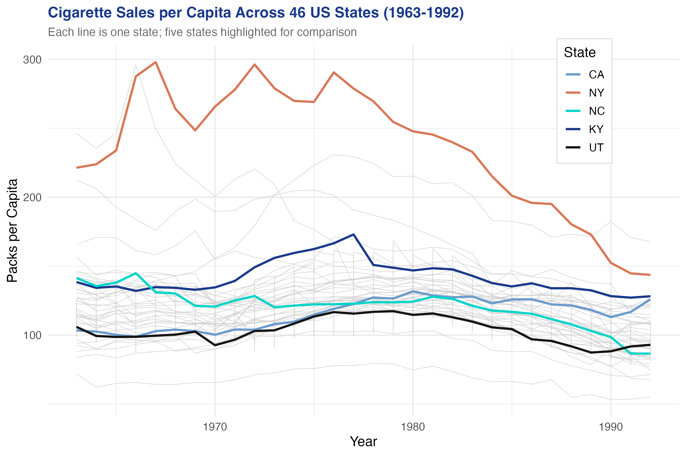
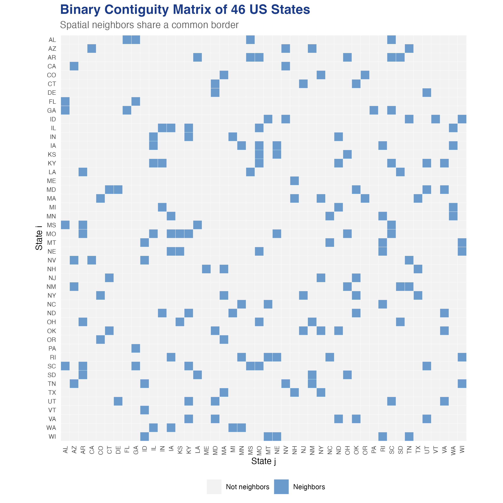
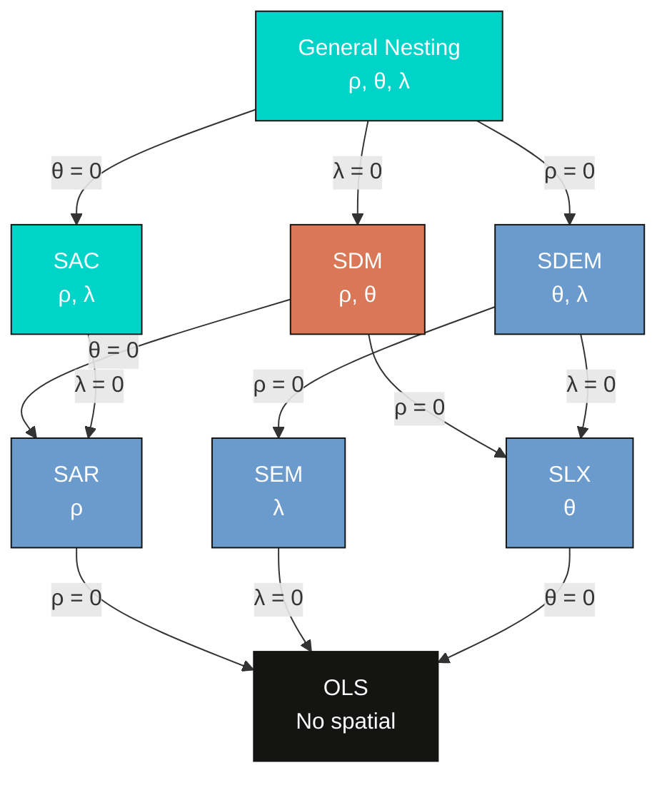
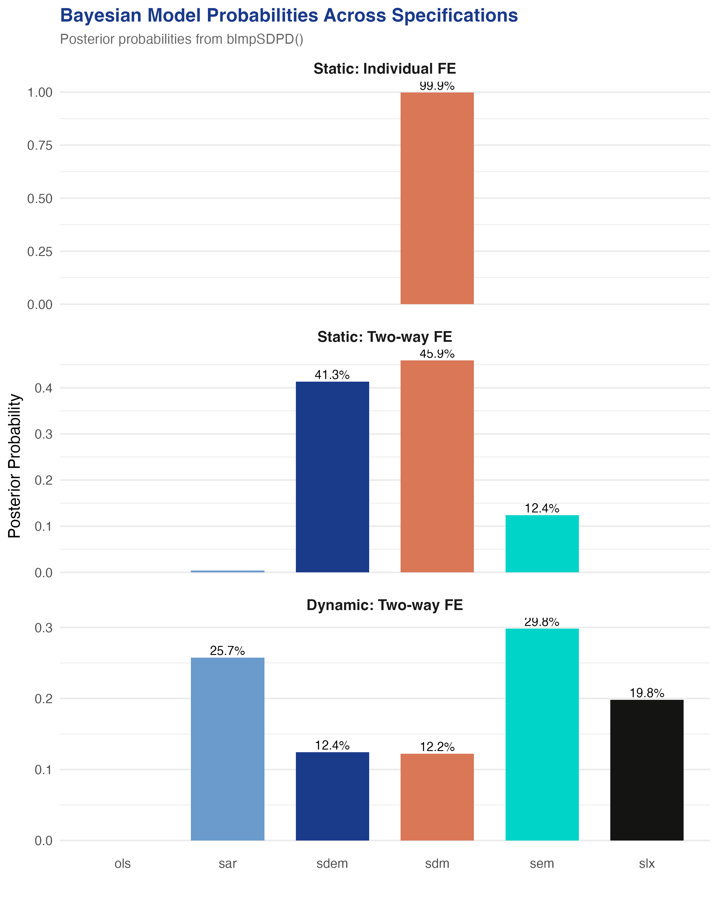
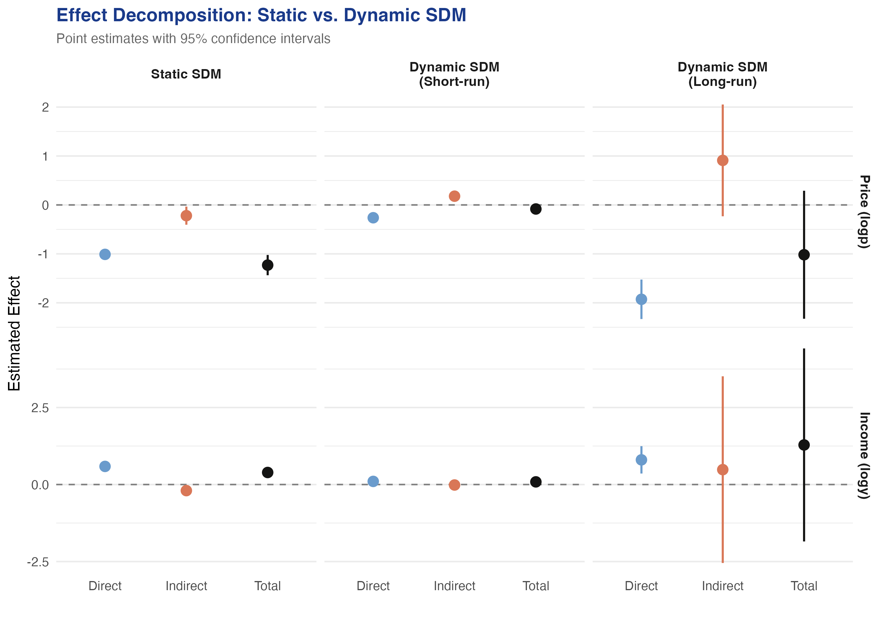

---
authors:
  - admin
categories:
  - R
  - Spatial Spillovers
  - Tutorial
draft: false
featured: false
date: "2026-03-27T00:00:00Z"
external_link: ""
image:
  caption: ""
  focal_point: Smart
  placement: 3
links:
- icon: code
  icon_pack: fas
  name: "R script"
  url: analysis.R
slides:
summary: A hands-on guide to spatial panel data modeling using the SDPDmod package in R --- from Bayesian model comparison through static and dynamic SAR/SDM estimation with Lee-Yu bias correction to direct, indirect, and total effect decomposition --- applied to cigarette demand across 46 US states (1963--1992).
tags:
  - r
  - spatial
  - regional
  - spatial spillovers
  - panel
title: "Spatial Dynamic Panel Data Modeling in R: Cigarette Demand Across US States"
url_code: ""
url_pdf: ""
url_slides: ""
url_video: ""
toc: true
diagram: true
---

## 1. Overview

When a state raises its cigarette tax, smokers near the border may simply drive to a neighboring state with lower prices. This cross-border shopping effect means that cigarette consumption in one state depends not only on its own prices and income but also on the prices and consumption patterns of its neighbors. Ignoring these **spatial spillovers** leads to biased estimates of how prices and income affect cigarette demand --- a problem that standard panel data methods cannot address.

The [SDPDmod](https://cran.r-project.org/package=SDPDmod) R package (Simonovska, 2025) provides an integrated workflow for spatial panel data modeling. It offers three core capabilities: (1) **Bayesian model comparison** across six spatial specifications using log-marginal posterior probabilities, (2) **maximum likelihood estimation** of spatial autoregressive (SAR) and spatial Durbin (SDM) models with optional Lee-Yu bias correction for fixed effects, and (3) **impact decomposition** into direct, indirect (spillover), and total effects --- including short-run and long-run effects for dynamic models. This tutorial applies all three capabilities to the classic Cigar dataset: cigarette consumption across 46 US states from 1963 to 1992.

The tutorial follows a progressive approach. We start with the simplest spatial model (SAR) and build toward the most general specification (dynamic SDM with Lee-Yu correction). At each step, we interpret the results in terms of the cigarette market and compare them to simpler models. By the end, you will see how spatial spillovers and habit persistence jointly shape cigarette demand --- and why models that ignore either one can produce misleading policy conclusions.

**Learning objectives:**

- Load and row-normalize the `usa46` binary contiguity matrix from SDPDmod
- Prepare the Cigar panel dataset with log-transformed real prices and income
- Use `blmpSDPD()` for Bayesian model comparison across OLS, SAR, SDM, SEM, SDEM, and SLX specifications
- Estimate static SAR and SDM models using `SDPDm()` with individual and two-way fixed effects
- Apply the Lee-Yu transformation to correct incidental parameter bias in spatial panels
- Estimate dynamic spatial models with temporal and spatiotemporal lags
- Decompose effects into direct, indirect, and total using `impactsSDPDm()`, distinguishing short-run from long-run effects

## 2. The Modeling Pipeline

The tutorial follows a six-stage pipeline, moving from data preparation through increasingly rich spatial panel models:


Each stage builds on the previous one. The Bayesian comparison tells us *which* model family fits the data best. The static models establish baseline spatial effects. The dynamic models add habit persistence and separate short-run from long-run responses. The impact decomposition translates all of this into policy-relevant direct and spillover effects.

## 3. Setup and Data Preparation

### 3.1 Install and load packages

The analysis requires five packages: `SDPDmod` for spatial panel modeling, `plm` for the Cigar dataset, `ggplot2` and `reshape2` for visualization, and `dplyr` for data manipulation.

```r
# Install packages if needed
cran_packages <- c("SDPDmod", "plm", "ggplot2", "reshape2", "dplyr")
missing <- cran_packages[!sapply(cran_packages, requireNamespace, quietly = TRUE)]
if (length(missing) > 0) install.packages(missing)

library(SDPDmod)
library(plm)
library(ggplot2)
library(reshape2)
library(dplyr)
```

### 3.2 Load and prepare the Cigar dataset

The [Cigar dataset](https://cran.r-project.org/web/packages/plm/vignettes/A_plmPackage.html) (Baltagi, 1992) contains panel data on cigarette consumption in 46 US states from 1963 to 1992. The key variables are `sales` (packs per capita), `price` (average price per pack in cents), `ndi` (per capita disposable income), `pimin` (minimum price in adjoining states), and `cpi` (consumer price index). We create log-transformed real values to work with **elasticities** --- in a log-log model, each coefficient represents the percentage change in consumption for a one-percent change in the corresponding variable.

```r
# Load Cigar dataset
data("Cigar", package = "plm")
data1 <- Cigar

# Create log-transformed variables
data1$logc <- log(data1$sales)             # log cigarette packs per capita
data1$logp <- log(data1$price / data1$cpi) # log real price
data1$logy <- log(data1$ndi / data1$cpi)   # log real per capita income

# Inspect panel structure
cat("States:", length(unique(data1$state)), "\n")
cat("Years:", length(unique(data1$year)), "\n")
cat("Observations:", nrow(data1), "\n")
```

```text
States: 46
Years: 30
Observations: 1380
```

```r
head(data1[, c("state", "year", "sales", "price", "ndi", "logc", "logp", "logy")])
```

```text
  state year sales price      ndi     logc        logp     logy
1     1   63  93.9  28.6 1558.305 4.542230 -0.06759329 3.930354
2     1   64  95.4  29.8 1684.073 4.558079 -0.03947881 3.994983
3     1   65  98.5  29.8 1809.842 4.590057 -0.05547915 4.051007
4     1   66  96.4  31.5 1915.160 4.568506 -0.02817088 4.079398
5     1   67  95.5  31.6 2023.546 4.559126 -0.05539878 4.104051
6     1   68  88.4  35.6 2202.486 4.481872  0.02272825 4.147724
```

```r
summary(data1[, c("logc", "logp", "logy")])
```

```text
      logc            logp               logy
 Min.   :3.978   Min.   :-0.60981   Min.   :3.766
 1st Qu.:4.681   1st Qu.:-0.20492   1st Qu.:4.423
 Median :4.797   Median :-0.10079   Median :4.557
 Mean   :4.793   Mean   :-0.10642   Mean   :4.545
 3rd Qu.:4.892   3rd Qu.:-0.01225   3rd Qu.:4.686
 Max.   :5.697   Max.   : 0.36399   Max.   :5.117
```

The panel is balanced with 46 states observed over 30 years (1,380 total observations). Log cigarette consumption (`logc`) has a mean of 4.793, corresponding to about 121 packs per capita per year. Real prices (`logp`) average -0.106 in log terms, and real per capita income (`logy`) averages 4.545. The variation across states and over time in both prices and income is what allows us to identify price and income elasticities --- and the spatial structure across neighboring states is what motivates the spatial models.

The dataset also includes `pimin`, the minimum cigarette price in adjoining states. This variable is inherently spatial --- it measures price competition from neighbors. We do not include `pimin` directly in our models because the SDM's spatially lagged price term `W*logp` captures the same channel more flexibly. To see why, note that `log(pimin/cpi)` and the spatial lag of `logp` have a correlation of 0.92 --- they measure essentially the same thing, but the spatial lag uses the full contiguity structure rather than just the cheapest neighbor.

### 3.3 Exploratory visualization

Before building models, the spaghetti plot below shows cigarette sales per capita for all 46 states over time, with five states highlighted for comparison.

```r
# Highlight selected states
highlight_states <- c("CA", "NY", "NC", "KY", "UT")

ggplot(data1, aes(x = year + 1900, y = sales, group = state_abbr)) +
  geom_line(data = subset(data1, !(state_abbr %in% highlight_states)),
            color = "gray80", linewidth = 0.3) +
  geom_line(data = subset(data1, state_abbr %in% highlight_states),
            aes(color = state_abbr), linewidth = 1) +
  labs(title = "Cigarette Sales per Capita Across 46 US States (1963-1992)",
       x = "Year", y = "Packs per Capita", color = "State") +
  theme_minimal()
```



Two patterns jump out. First, **temporal persistence is striking**: states that consumed heavily in the 1960s (like Kentucky, a major tobacco-producing state with over 150 packs per capita) remained high consumers throughout the period, while low-consumption states like Utah stayed low. This visual persistence foreshadows the dominant role of the lagged dependent variable ($\tau \approx 0.86$) in the dynamic models. Second, there is a **general downward trend** after the late 1970s, visible across nearly all states, reflecting the cumulative effect of anti-smoking campaigns, health awareness, and rising taxes. Time fixed effects in our panel models will absorb this common trend, isolating the within-state, within-year variation that identifies price and income elasticities.

### 3.4 Load and row-normalize the spatial weight matrix

A spatial weight matrix $W$ encodes which states are neighbors. The `usa46` matrix included in SDPDmod is a binary contiguity matrix: $w\_{ij} = 1$ if states $i$ and $j$ share a border, and $w\_{ij} = 0$ otherwise. Row-normalization converts these binary entries into weights that sum to one for each row, so the spatial lag $Wy$ equals the *weighted average* of neighboring states' values.

```r
# Load binary contiguity matrix of 46 US states
data("usa46", package = "SDPDmod")
cat("Dimensions:", dim(usa46), "\n")
cat("Non-zero entries:", sum(usa46 != 0), "\n")
cat("Average neighbors per state:", round(mean(rowSums(usa46)), 2), "\n")

# Row-normalize
W <- rownor(usa46)
cat("Row-normalized:", isrownor(W), "\n")
```

```text
Dimensions: 46 46
Non-zero entries: 188
Average neighbors per state: 4.09
Row-normalized: TRUE
```

The matrix has 188 non-zero entries out of 2,116 possible pairs (8.9% density), meaning the average state shares a border with about 4 neighbors. After row-normalization, the spatial lag of any variable equals the simple average of that variable across a state's contiguous neighbors. For example, the spatial lag of cigarette consumption for a state with 4 neighbors equals the average consumption in those 4 neighboring states.

## 4. Visualizing the Spatial Weight Matrix

Before estimating spatial models, it helps to visualize the neighborhood structure. The heatmap below shows the binary contiguity matrix, with each colored cell indicating a pair of neighboring states.

```r
# Use state abbreviations for the axes
rownames(usa46) <- state_abbr
colnames(usa46) <- state_abbr
usa46_df <- melt(usa46)
colnames(usa46_df) <- c("State_i", "State_j", "Connection")
usa46_df$Connection <- factor(usa46_df$Connection, levels = c(0, 1),
                               labels = c("Not neighbors", "Neighbors"))

ggplot(usa46_df, aes(x = State_j, y = State_i, fill = Connection)) +
  geom_tile(color = "white", linewidth = 0.1) +
  scale_fill_manual(values = c("Not neighbors" = "gray95",
                                "Neighbors" = "#6a9bcc")) +
  labs(title = "Binary Contiguity Matrix of 46 US States",
       x = "State j", y = "State i") +
  theme_minimal()
```



The sparse pattern confirms that most state pairs are *not* neighbors --- only 8.9% of cells are colored. With state abbreviations on the axes, you can verify specific neighborhood relationships: California (CA) neighbors Arizona (AZ), Nevada (NV), and Oregon (OR); Missouri (MO) has the most neighbors at 8. The sparsity is typical of contiguity-based weight matrices and means that spatial effects operate through a relatively small number of direct neighbor relationships. The row-normalized version ensures that each state's spatial lag is an equally weighted average of its neighbors, regardless of whether a state has 2 neighbors or 8.

### 4.2 Alternative weight matrices

The SDPDmod package provides several functions for constructing weight matrices from scratch: `mOrdNbr()` for higher-order contiguity from shapefiles, `mNearestN()` for k-nearest neighbors, `InvDistMat()` for inverse distance, and `DistWMat()` as a unified wrapper. Since our results may depend on the choice of $W$, we construct a **2nd-order contiguity matrix** as a robustness check. This matrix treats states as neighbors if they share a border *or* share a common neighbor (friends-of-friends).

```r
# 2nd-order contiguity: states reachable in 2 steps
W2_raw <- (usa46 %*% usa46) > 0   # indicator for 2-step reachability
W2_combined <- W2_raw * 1
diag(W2_combined) <- 0            # remove self-connections
W2 <- rownor(W2_combined)

cat("Original W non-zero entries:", sum(usa46 != 0), "\n")
cat("2nd-order W non-zero entries:", sum(W2_combined != 0), "\n")
cat("Avg neighbors (original):", round(mean(rowSums(usa46)), 2), "\n")
cat("Avg neighbors (2nd-order):", round(mean(rowSums(W2_combined)), 2), "\n")
```

```text
Original W non-zero entries: 188
2nd-order W non-zero entries: 486
Avg neighbors (original): 4.09
Avg neighbors (2nd-order): 10.57
```

The 2nd-order matrix is much denser: 486 non-zero entries versus 188, with an average of 10.6 neighbors per state instead of 4.1. This broader definition of "neighbor" captures indirect spatial relationships --- for example, Illinois and Kentucky are not direct contiguous neighbors, but they share Indiana as a common neighbor. We will use this alternative $W$ for a robustness check in Section 11.

## 5. Bayesian Model Comparison with `blmpSDPD()`

### 5.1 The spatial model family

Before estimating any single model, we use Bayesian model comparison to let the data tell us which spatial specification fits best. The SDPDmod package supports six models that differ in *where* spatial dependence enters the equation. The general spatial panel model takes the form:

$$y\_t = \rho W y\_t + X\_t \beta + W X\_t \theta + u\_t, \quad u\_t = \lambda W u\_t + \epsilon\_t$$

In words, the outcome $y\_t$ can depend on neighbors' outcomes (through $\rho$), on spatially lagged covariates (through $\theta$), and spatial correlation can appear in the error term (through $\lambda$). Different restrictions on these parameters yield different models:



| Model | Equation | Key Parameters | Interpretation |
|-------|----------|----------------|----------------|
| OLS | $y\_t = X\_t \beta + \epsilon\_t$ | None spatial | No spatial dependence |
| SAR | $y\_t = \rho W y\_t + X\_t \beta + \epsilon\_t$ | $\rho$ | Neighbors' outcomes affect own outcome |
| SEM | $y\_t = X\_t \beta + u\_t$, $u\_t = \lambda W u\_t + \epsilon\_t$ | $\lambda$ | Spatial correlation in unobservables |
| SLX | $y\_t = X\_t \beta + W X\_t \theta + \epsilon\_t$ | $\theta$ | Neighbors' covariates affect own outcome |
| SDM | $y\_t = \rho W y\_t + X\_t \beta + W X\_t \theta + \epsilon\_t$ | $\rho, \theta$ | Both neighbors' outcomes and covariates matter |
| SDEM | $y\_t = X\_t \beta + W X\_t \theta + u\_t$, $u\_t = \lambda W u\_t + \epsilon\_t$ | $\theta, \lambda$ | Spatially lagged X plus spatial errors |

The [`blmpSDPD()`](https://rdrr.io/cran/SDPDmod/man/blmpSDPD.html) function computes Bayesian log-marginal posterior probabilities for each model. Unlike classical hypothesis tests that compare models pairwise, this approach assigns a probability to every candidate model simultaneously, making it straightforward to assess which specification the data favors.

### 5.2 Static comparison with individual fixed effects

We begin by comparing all six models under a static specification with individual (state) fixed effects only. This controls for time-invariant differences across states --- such as tobacco culture or geographic remoteness --- but does not control for common time trends like federal tax changes.

```r
res_ind <- blmpSDPD(formula = logc ~ logp + logy, data = data1, W = W,
                    index = c("state", "year"),
                    model = list("ols", "sar", "sdm", "sem", "sdem", "slx"),
                    effect = "individual")
res_ind
```

```text
Log-marginal posteriors:
       ols      sar      sdm     sem     sdem      slx
1 884.7551 938.6934 1046.487 993.192 1039.671 930.0585

Model probabilities:
  ols sar    sdm sem   sdem slx
1   0   0 0.9989   0 0.0011   0
```

With individual fixed effects, the SDM receives a posterior probability of 99.89%, dominating all other specifications. The SDEM gets only 0.11%, and the remaining models receive essentially zero probability. This overwhelming support for the SDM indicates that both the spatial lag of the dependent variable ($\rho W y$) and the spatial lags of covariates ($W X \theta$) are important for explaining cigarette consumption --- neighbors' prices and income matter above and beyond neighbors' consumption levels.

### 5.3 Static comparison with two-way fixed effects

Adding time fixed effects controls for common shocks that affect all states simultaneously, such as national anti-smoking campaigns or federal excise tax changes. This typically absorbs much of the cross-sectional variation, so we might expect the model rankings to shift.

```r
res_tw <- blmpSDPD(formula = logc ~ logp + logy, data = data1, W = W,
                   index = c("state", "year"),
                   model = list("ols", "sar", "sdm", "sem", "sdem", "slx"),
                   effect = "twoways",
                   prior = "beta")  # beta prior concentrates probability near moderate rho values
res_tw
```

```text
Log-marginal posteriors:
       ols      sar      sdm      sem     sdem      slx
1 1076.602 1095.993 1100.727 1099.415 1100.621 1080.323

Model probabilities:
  ols   sar    sdm    sem   sdem slx
1   0 0.004 0.4592 0.1237 0.4131   0
```

With two-way fixed effects and a beta prior, the race tightens considerably. The SDM still leads with 45.92% probability, but the SDEM is close behind at 41.31%. The SEM receives 12.37%, while the SAR drops to just 0.4%. This tells us that spatial effects in the covariates ($\theta$) remain important, but there is genuine uncertainty about whether the spatial lag of the dependent variable ($\rho$) or the spatial error term ($\lambda$) best captures the remaining spatial dependence.

### 5.4 Dynamic comparison with two-way fixed effects

Cigarette consumption is highly persistent over time --- smokers who consumed heavily last year tend to do so again this year. Dynamic models add the lagged dependent variable $y\_{t-1}$ and potentially its spatial lag $W y\_{t-1}$ to capture this habit persistence.

```r
res_dyn <- blmpSDPD(formula = logc ~ logp + logy, data = data1, W = W,
                    index = c("state", "year"),
                    model = list("sar", "sdm", "sem", "sdem", "slx"),
                    effect = "twoways",
                    ldet = "mc",       # Monte Carlo approximation for the log-determinant (faster for dynamic models)
                    dynamic = TRUE,
                    prior = "uniform") # uniform prior assigns equal weight to all valid rho values
res_dyn
```

```text
Log-marginal posteriors:
       sar      sdm      sem     sdem      slx
1 1987.651 1986.906 1987.799 1986.924 1987.388

Model probabilities:
     sar    sdm    sem   sdem    slx
1 0.2573 0.1221 0.2984 0.1243 0.1979
```

The dynamic comparison produces a dramatically different picture: all five models receive similar probabilities, with the SEM slightly ahead at 29.84%, followed by SAR at 25.73% and SLX at 19.79%. The log-marginal posteriors are nearly identical (within 1 unit), reflecting the fact that once temporal dynamics are included, the remaining spatial signal is much weaker. The lagged dependent variable absorbs much of the persistence that spatial models previously captured.

### 5.5 Summary of model comparison

The figure below summarizes the posterior probabilities across all three specification comparisons (see `analysis.R` for the full figure code).



| Specification | Top Model | Probability | Runner-up | Probability |
|---------------|-----------|-------------|-----------|-------------|
| Static, Individual FE | SDM | 99.89% | SDEM | 0.11% |
| Static, Two-way FE | SDM | 45.92% | SDEM | 41.31% |
| Dynamic, Two-way FE | SEM | 29.84% | SAR | 25.73% |

The Bayesian comparison reveals three key insights. First, spatial dependence is unambiguously present --- OLS and SLX never win. Second, the SDM is the preferred static model, which means both the spatial lag of $y$ and the spatial lags of $X$ contribute to explaining cigarette consumption. Third, adding dynamics substantially weakens the ability to discriminate among spatial specifications, because the lagged dependent variable captures much of the temporal persistence that spatial lags previously absorbed. Given that the SDM leads in two of three comparisons and nests the SAR as a special case, we will estimate both the SAR and SDM in the sections that follow, with and without dynamics.

## 6. Non-Spatial Baseline

Before introducing spatial models, we establish a benchmark using a standard **two-way fixed effects** panel regression with no spatial terms. This is the model that most applied researchers would start with --- it controls for state-specific and year-specific unobserved heterogeneity but assumes that each state's consumption depends only on its own prices and income, with no spillovers from neighbors.

```r
pdata <- pdata.frame(data1, index = c("state", "year"))
mod_fe <- plm(logc ~ logp + logy, data = pdata, model = "within",
              effect = "twoways")
summary(mod_fe)$coefficients
```

```text
       Estimate Std. Error   t-value      Pr(>|t|)
logp -1.0348844 0.04151906 -24.92553 1.881060e-112
logy  0.5285428 0.04658276  11.34632  1.603837e-28
```

The non-spatial two-way FE model estimates a price elasticity of -1.035 and an income elasticity of 0.529, both highly significant. The within R-squared is 0.394, meaning that price and income explain about 39% of the within-state, within-year variation in cigarette consumption after removing fixed effects. These estimates serve as the benchmark against which we measure the value added by spatial models. As we will see, the SAR and SDM models produce similar *direct* price effects (around -1.00) but reveal substantial *indirect* (spillover) effects that the non-spatial model entirely misses --- the total price elasticity in the SDM is -1.23, about 19% larger than the non-spatial estimate.

## 7. Static SAR Model Estimation

### 7.1 SAR with individual fixed effects

The Spatial Autoregressive (SAR) model adds a single spatial parameter $\rho$ that captures how much a state's cigarette consumption depends on the weighted average of its neighbors' consumption. The model is:

$$y\_t = \rho W y\_t + X\_t \beta + \mu\_i + \epsilon\_t$$

In words, cigarette consumption in state $i$ depends on (1) the average consumption of neighboring states (weighted by $W$, with strength $\rho$), (2) the state's own price and income ($X\_t \beta$), and (3) a state-specific intercept ($\mu\_i$). The [`SDPDm()`](https://rdrr.io/cran/SDPDmod/man/SDPDm.html) function estimates this model by maximum likelihood. The `index` argument specifies the panel identifiers, `model = "sar"` selects the spatial lag specification, and `effect = "individual"` includes state fixed effects.

```r
mod_sar_ind <- SDPDm(formula = logc ~ logp + logy, data = data1, W = W,
                     index = c("state", "year"),
                     model = "sar",
                     effect = "individual")
summary(mod_sar_ind)
```

```text
sar panel model with individual fixed effects

Spatial autoregressive coefficient:
    Estimate Std. Error t-value  Pr(>|t|)
rho 0.297576   0.028444  10.462 < 2.2e-16 ***

Coefficients:
       Estimate Std. Error  t-value Pr(>|t|)
logp -0.5320053  0.0254445 -20.9085   <2e-16 ***
logy -0.0007088  0.0152139  -0.0466   0.9628
```

The spatial autoregressive coefficient $\rho = 0.298$ is highly significant ($t = 10.46$), confirming strong spatial dependence in cigarette consumption. A state's consumption is positively influenced by its neighbors' consumption levels. The price elasticity is -0.532 ($t = -20.91$), meaning a 1% increase in real price reduces consumption by about 0.53%. However, the income coefficient is essentially zero (-0.001, $p = 0.96$), suggesting that with only state fixed effects, income variation does not significantly predict consumption --- likely because state fixed effects absorb cross-sectional income differences, while the within-state time variation in income is confounded with common time trends.

### 7.2 SAR with two-way fixed effects

Adding time fixed effects controls for year-specific shocks common to all states and typically changes the coefficient estimates substantially.

```r
mod_sar_tw <- SDPDm(formula = logc ~ logp + logy, data = data1, W = W,
                    index = c("state", "year"),
                    model = "sar",
                    effect = "twoways")
summary(mod_sar_tw)
```

```text
sar panel model with twoways fixed effects

Spatial autoregressive coefficient:
    Estimate Std. Error t-value  Pr(>|t|)
rho  0.18659    0.02863  6.5173 7.159e-11 ***

Coefficients:
      Estimate Std. Error t-value  Pr(>|t|)
logp -0.994860   0.039906 -24.930 < 2.2e-16 ***
logy  0.463555   0.046019  10.073 < 2.2e-16 ***
```

With two-way fixed effects, three things change. First, the spatial coefficient drops from 0.298 to 0.187 --- still highly significant but weaker, because time fixed effects absorb some of the common spatial trends. Second, the price elasticity nearly doubles from -0.53 to -0.99, suggesting that the individual-FE-only model was biased by confounding time trends with prices. Third, income becomes strongly significant (0.464, $t = 10.07$): once common time trends are removed, higher real income is associated with *more* cigarette consumption, consistent with cigarettes being a normal good at the state level.

### 7.3 Impact decomposition for static SAR

In spatial models, the raw coefficients $\beta$ do not directly tell us how a change in one state's price affects its own consumption. Because of the spatial feedback loop --- my consumption affects my neighbor's, which in turn affects mine --- the actual effect is larger than $\beta$ alone. The [`impactsSDPDm()`](https://rdrr.io/cran/SDPDmod/man/impactsSDPDm.html) function decomposes the total effect into a **direct effect** (impact on own state) and an **indirect effect** (spillover to and from neighbors).

```r
imp_sar_tw <- impactsSDPDm(mod_sar_tw)
summary(imp_sar_tw)
```

```text
Impact estimates for spatial (static) model

Direct:
      Estimate Std. Error t-value  Pr(>|t|)
logp -1.001155   0.038855 -25.767 < 2.2e-16 ***
logy  0.465947   0.044678  10.429 < 2.2e-16 ***

Indirect:
      Estimate Std. Error t-value  Pr(>|t|)
logp -0.223484   0.040877 -5.4672 4.571e-08 ***
logy  0.103540   0.018939  5.4670 4.578e-08 ***

Total:
      Estimate Std. Error t-value  Pr(>|t|)
logp -1.224639   0.060815 -20.137 < 2.2e-16 ***
logy  0.569487   0.052965  10.752 < 2.2e-16 ***
```

The impact decomposition reveals that a 1% increase in a state's own real price reduces its consumption by 1.00% directly, plus an additional 0.22% through spatial feedback --- for a total price elasticity of -1.22. Think of it this way: when one state raises prices, its consumption drops, which in turn reduces the "pull" on neighboring states' consumption through the spatial lag, creating a ripple effect that feeds back to the original state. Similarly, a 1% income increase raises own-state consumption by 0.47% directly and by 0.10% through neighbors, for a total income elasticity of 0.57. The indirect effects are about 18% of the total effect, indicating economically meaningful spatial spillovers.

## 8. Static SDM with Lee-Yu Correction

### 8.1 SDM with two-way fixed effects

The Spatial Durbin Model (SDM) extends the SAR by adding spatially lagged covariates $W X$, allowing neighbors' prices and income to directly affect a state's consumption (beyond the indirect channel through $\rho W y$):

$$y\_t = \rho W y\_t + X\_t \beta + W X\_t \theta + \mu\_i + \gamma\_t + \epsilon\_t$$

In words, this says that cigarette consumption depends on neighbors' consumption ($\rho$), own prices and income ($\beta$), *and* neighbors' prices and income ($\theta$). Here $\mu\_i$ captures state fixed effects and $\gamma\_t$ captures time fixed effects. The SDM is the natural model when we believe that cross-border shopping responds directly to neighboring states' prices --- not just indirectly through neighbors' consumption levels.

```r
mod_sdm_tw <- SDPDm(formula = logc ~ logp + logy, data = data1, W = W,
                    index = c("state", "year"),
                    model = "sdm",
                    effect = "twoways")
summary(mod_sdm_tw)
```

```text
sdm panel model with twoways fixed effects

Spatial autoregressive coefficient:
    Estimate Std. Error t-value  Pr(>|t|)
rho 0.222591   0.032825  6.7812 1.192e-11 ***

Coefficients:
        Estimate Std. Error  t-value  Pr(>|t|)
logp   -1.002878   0.040094 -25.0134 < 2.2e-16 ***
logy    0.600876   0.057207  10.5036 < 2.2e-16 ***
W*logp  0.048490   0.080807   0.6001 0.5484546
W*logy -0.292794   0.078158  -3.7462 0.0001795 ***
```

The SDM reveals an interesting asymmetry. The spatial lag of price (`W*logp = 0.049`) is not significant ($p = 0.55$), meaning that neighboring states' prices do not directly affect own consumption once the spatial lag of consumption ($\rho = 0.223$) is accounted for. However, the spatial lag of income (`W*logy = -0.293`) is highly significant ($t = -3.75$): when neighboring states become richer, own-state consumption *decreases*. This negative spillover in income may reflect a substitution effect --- as neighbors' incomes rise, their consumers may shift toward premium or out-of-state purchasing channels, reducing the spatial demand that pulls up consumption in the focal state.

### 8.2 SDM with Lee-Yu bias correction

Fixed effects in spatial panels create an **incidental parameter problem**: the large number of fixed effects (46 states + 30 years = 76 parameters) introduces a small-sample bias in the maximum likelihood estimator, particularly for the spatial autoregressive coefficient $\rho$ and the variance $\sigma^2$. The Lee-Yu transformation (Lee and Yu, 2010) corrects this bias by orthogonally transforming the data to concentrate out the fixed effects before estimation.

```r
mod_sdm_ly <- SDPDm(formula = logc ~ logp + logy, data = data1, W = W,
                    index = c("state", "year"),
                    model = "sdm",
                    effect = "twoways",
                    LYtrans = TRUE)
summary(mod_sdm_ly)
```

```text
sdm panel model with twoways fixed effects

Spatial autoregressive coefficient:
    Estimate Std. Error t-value  Pr(>|t|)
rho 0.262211   0.032081  8.1735 2.996e-16 ***

Coefficients:
        Estimate Std. Error  t-value  Pr(>|t|)
logp   -1.001334   0.041121 -24.3509 < 2.2e-16 ***
logy    0.602729   0.058673  10.2726 < 2.2e-16 ***
W*logp  0.090779   0.082185   1.1046    0.2693
W*logy -0.313251   0.079982  -3.9165 8.983e-05 ***
```

The Lee-Yu correction increases $\rho$ from 0.223 to 0.262 --- a 17% upward correction, indicating that the uncorrected estimator underestimated spatial dependence. The slope coefficients change only marginally (the price coefficient moves from -1.003 to -1.001), which is expected with $T = 30$ years. For short panels ($T < 10$), the Lee-Yu correction would matter much more. We will use the Lee-Yu corrected version as our preferred static SDM.

### 8.3 Comparison: SAR vs. SDM

| Parameter | FE (no spatial) | SAR (Ind FE) | SAR (TW FE) | SDM (TW FE) | SDM (TW FE, LY) |
|-----------|----------------|-------------|-------------|-------------|-----------------|
| $\rho$ | --- | 0.298 | 0.187 | 0.223 | 0.262 |
| logp | -1.035 | -0.532 | -0.995 | -1.003 | -1.001 |
| logy | 0.529 | -0.001 | 0.464 | 0.601 | 0.603 |
| W\*logp | --- | --- | --- | 0.049 | 0.091 |
| W\*logy | --- | --- | --- | -0.293 | -0.313 |
| $\hat{\sigma}^2$ | --- | 0.0067 | 0.0051 | 0.0050 | 0.0052 |

Two patterns stand out. First, the price coefficient is remarkably stable across the SDM specifications (around -1.00), while it was biased in the SAR with individual FE only (-0.53). Second, adding the SDM terms increases the income coefficient from 0.46 (SAR) to 0.60 (SDM), because the negative spatial lag of income (`W*logy` $\approx$ -0.31) absorbs part of the spatial income effect that the SAR was attributing to the spatial lag $\rho$.

### 8.4 Impact decomposition for static SDM

The impact decomposition for the SDM differs fundamentally from the SAR because the $W X$ terms create additional channels for indirect effects.

```r
imp_sdm_ly <- impactsSDPDm(mod_sdm_ly)
summary(imp_sdm_ly)
```

```text
Impact estimates for spatial (static) model

Direct:
      Estimate Std. Error t-value  Pr(>|t|)
logp -1.010329   0.040149 -25.164 < 2.2e-16 ***
logy  0.588471   0.054940  10.711 < 2.2e-16 ***

Indirect:
     Estimate Std. Error t-value Pr(>|t|)
logp -0.21925    0.09439 -2.3228  0.02019 *
logy -0.19721    0.09108 -2.1652  0.03037 *

Total:
      Estimate Std. Error  t-value  Pr(>|t|)
logp -1.229575   0.105631 -11.6403 < 2.2e-16 ***
logy  0.391262   0.086184   4.5398  5.63e-06 ***
```

The SDM impact decomposition tells a richer story than the SAR. For price, the results are similar: a direct effect of -1.01 and an indirect (spillover) effect of -0.22, summing to a total price elasticity of -1.23. However, for income, the SDM flips the sign of the indirect effect: it is now *negative* (-0.20) instead of positive (0.10 in the SAR). This means that when neighboring states' incomes rise, the focal state's consumption actually *decreases* --- consistent with the significant negative `W*logy` coefficient we saw earlier. The total income elasticity in the SDM (0.39) is therefore lower than in the SAR (0.57), because the positive direct effect (0.59) is partially offset by the negative spillover (-0.20). This sign reversal of the income spillover is an important finding that the SAR cannot detect.

## 9. Dynamic Spatial Panel Models

### 9.1 Why dynamics? Habit persistence in cigarette consumption

Cigarette consumption is strongly habit-forming. Nicotine addiction creates a direct link between past and present consumption: last year's smokers are very likely to be this year's smokers. Ignoring this temporal persistence in a static model means that the spatial coefficient $\rho$ must absorb *both* spatial spillovers and the serial correlation in consumption patterns, leading to biased estimates of the true spatial effect. Dynamic models explicitly include the lagged dependent variable $y\_{t-1}$ (with coefficient $\tau$, capturing **habit persistence**) and optionally its spatial lag $W y\_{t-1}$ (with coefficient $\eta$, capturing **spatiotemporal diffusion**):

$$y\_t = \rho W y\_t + \tau y\_{t-1} + \eta W y\_{t-1} + X\_t \beta + W X\_t \theta + \mu\_i + \gamma\_t + \epsilon\_t$$

In words, this equation says that today's cigarette consumption depends on: neighbors' current consumption ($\rho$), own past consumption ($\tau$, habit persistence), neighbors' past consumption ($\eta$, spatiotemporal diffusion), own prices and income ($\beta$), and neighbors' prices and income ($\theta$). Here $y\_{t-1}$ corresponds to `logc(t-1)` in the output, and $Wy\_{t-1}$ corresponds to `W*logc(t-1)`.

### 9.2 Dynamic SAR with temporal lag only

We start by adding only the temporal lag $y\_{t-1}$ without the spatiotemporal lag $W y\_{t-1}$, to isolate the effect of habit persistence on the spatial coefficient.

```r
mod_dsar_tl <- SDPDm(formula = logc ~ logp + logy, data = data1, W = W,
                     index = c("state", "year"),
                     model = "sar",
                     effect = "twoways",
                     LYtrans = TRUE,
                     dynamic = TRUE,
                     tlaginfo = list(ind = NULL, tl = TRUE, stl = FALSE))
summary(mod_dsar_tl)
```

```text
sar dynamic panel model with twoways fixed effects

Spatial autoregressive coefficient:
     Estimate Std. Error t-value Pr(>|t|)
rho 0.0095932  0.0169929  0.5645   0.5724

Coefficients:
           Estimate Std. Error  t-value  Pr(>|t|)
logc(t-1)  0.866212   0.012785  67.7523 < 2.2e-16 ***
logp      -0.254617   0.023047 -11.0478 < 2.2e-16 ***
logy       0.084437   0.023719   3.5598 0.0003711 ***
```

This result is striking. The temporal lag coefficient $\tau = 0.866$ is enormous ($t = 67.75$), confirming that cigarette consumption is extremely persistent --- about 87% of last year's consumption carries over to this year. More remarkably, the spatial autoregressive coefficient $\rho$ collapses from 0.262 (static SDM) to just 0.010 and becomes *non-significant* ($p = 0.57$). This suggests that what appeared to be contemporaneous spatial dependence in the static model was largely a proxy for temporal persistence: states that consumed heavily in the past continue to do so, and neighboring states happen to share similar histories. The short-run price elasticity also drops sharply from -1.00 to -0.25, because the lagged dependent variable now captures the cumulative effect of past prices.

### 9.3 Dynamic SAR with temporal and spatiotemporal lags

Adding the spatiotemporal lag $W y\_{t-1}$ allows us to test whether neighboring states' *past* consumption patterns affect current consumption.

```r
mod_dsar_full <- SDPDm(formula = logc ~ logp + logy, data = data1, W = W,
                       index = c("state", "year"),
                       model = "sar",
                       effect = "twoways",
                       LYtrans = TRUE,
                       dynamic = TRUE,
                       tlaginfo = list(ind = NULL, tl = TRUE, stl = TRUE))
summary(mod_dsar_full)
```

```text
sar dynamic panel model with twoways fixed effects

Spatial autoregressive coefficient:
    Estimate Std. Error t-value  Pr(>|t|)
rho 0.703004   0.021363  32.907 < 2.2e-16 ***

Coefficients:
             Estimate Std. Error t-value Pr(>|t|)
logc(t-1)    0.882056   0.013012  67.789  < 2e-16 ***
W*logc(t-1) -0.727317   0.026033 -27.938  < 2e-16 ***
logp        -0.243591   0.023337 -10.438  < 2e-16 ***
logy         0.055595   0.023933   2.323  0.02018 *
```

Adding the spatiotemporal lag dramatically changes the picture. The spatial coefficient $\rho$ jumps to 0.703, and the spatiotemporal lag $\eta = -0.727$ is strongly negative ($t = -27.94$). The temporal lag $\tau = 0.882$ remains dominant. The large $\rho$ combined with the nearly equal-and-opposite $\eta$ suggests a complex dynamic pattern: states with high *current* neighbor consumption tend to have higher own consumption ($\rho > 0$), but states whose neighbors consumed heavily *last year* tend to have *lower* current consumption ($\eta < 0$). However, the near-cancellation of $\rho$ and $\eta$ may also indicate multicollinearity between $Wy\_t$ and $Wy\_{t-1}$, making the individual coefficients hard to interpret reliably. The dynamic SDM in Section 9.4, which adds covariates' spatial lags, provides a more stable decomposition.

### 9.4 Dynamic SDM with both lags and Lee-Yu correction

The most general model combines all elements: spatial lag of $y$, temporal lag, spatiotemporal lag, and spatial lags of $X$, all with Lee-Yu bias correction.

```r
mod_dsdm <- SDPDm(formula = logc ~ logp + logy, data = data1, W = W,
                  index = c("state", "year"),
                  model = "sdm",
                  effect = "twoways",
                  LYtrans = TRUE,
                  dynamic = TRUE,
                  tlaginfo = list(ind = NULL, tl = TRUE, stl = TRUE))
summary(mod_dsdm)
```

```text
sdm dynamic panel model with twoways fixed effects

Spatial autoregressive coefficient:
    Estimate Std. Error t-value Pr(>|t|)
rho 0.162189   0.036753  4.4129 1.02e-05 ***

Coefficients:
             Estimate Std. Error  t-value  Pr(>|t|)
logc(t-1)    0.864412   0.012879  67.1163 < 2.2e-16 ***
W*logc(t-1) -0.096270   0.038810  -2.4805 0.0131186 *
logp        -0.270872   0.023145 -11.7031 < 2.2e-16 ***
logy         0.104262   0.029783   3.5007 0.0004641 ***
W*logp       0.195595   0.043870   4.4585 8.254e-06 ***
W*logy      -0.032464   0.039520  -0.8215 0.4113891
```

The dynamic SDM produces the most nuanced picture. Habit persistence remains dominant ($\tau = 0.864$, $t = 67.12$). The spatial coefficient $\rho = 0.162$ is significant but much smaller than in the static model ($\rho = 0.262$), confirming that static models overstate contemporaneous spatial dependence by conflating it with temporal persistence. The spatiotemporal lag is weakly significant ($\eta = -0.096$, $p = 0.013$). Notably, the spatial lag of price (`W*logp = 0.196`) is now *positive* and significant ($t = 4.46$), a reversal from the static SDM where it was not significant. This positive coefficient means that when neighboring states' prices rise, own-state consumption *increases* --- precisely the cross-border shopping effect we hypothesized. Smokers respond to neighbors' price increases by purchasing more in their own (now relatively cheaper) state. The spatial lag of income (`W*logy = -0.032`) is no longer significant once dynamics are included.

### 9.5 Impact decomposition: short-run and long-run effects

For dynamic models, `impactsSDPDm()` separates effects into **short-run** (immediate, one-period) and **long-run** (cumulative, steady-state) impacts. The long-run effects account for the feedback loop through the lagged dependent variable: a price change today affects consumption today, which affects consumption next year (through $\tau$), which feeds back again, and so on until a new equilibrium is reached.

```r
imp_dsdm <- impactsSDPDm(mod_dsdm)
summary(imp_dsdm)
```

```text
Impact estimates for spatial dynamic model
========================================================
Short-term

Direct:
      Estimate Std. Error t-value  Pr(>|t|)
logp -0.261569   0.022830 -11.457 < 2.2e-16 ***
logy  0.101759   0.029667   3.430 0.0006035 ***

Indirect:
      Estimate Std. Error t-value  Pr(>|t|)
logp  0.178932   0.046861  3.8183 0.0001344 ***
logy -0.015109   0.042210 -0.3579 0.7203812

Total:
      Estimate Std. Error t-value Pr(>|t|)
logp -0.082637   0.052143 -1.5848   0.1130
logy  0.086650   0.037890  2.2868   0.0222 *
========================================================
Long-term

Direct:
     Estimate Std. Error t-value  Pr(>|t|)
logp -1.92836    0.20580 -9.3702 < 2.2e-16 ***
logy  0.80149    0.22655  3.5378 0.0004034 ***

Indirect:
     Estimate Std. Error t-value Pr(>|t|)
logp  0.91054    0.58271  1.5626   0.1181
logy  0.48361    1.54612  0.3128   0.7544

Total:
     Estimate Std. Error t-value Pr(>|t|)
logp -1.01783    0.66733 -1.5252   0.1272
logy  1.28510    1.59825  0.8041   0.4214
```

The gap between short-run and long-run effects is dramatic. The **short-run direct price elasticity** is only -0.26, meaning that a 1% price increase immediately reduces consumption by just 0.26%. But the **long-run direct price elasticity** is -1.93 --- more than seven times larger --- because the habit persistence mechanism ($\tau = 0.864$) amplifies the initial shock over time. Think of it as a snowball effect: a small reduction today accumulates year after year because lower consumption this year leads to lower consumption next year, and so on.

The short-run indirect (spillover) effect of price is *positive* (0.179): when a state raises its prices, neighboring states' consumption increases in the short run, consistent with cross-border shopping. This positive spillover partly offsets the direct negative effect, making the short-run *total* price elasticity (-0.083) small and statistically non-significant. In the long run, the indirect price effect remains positive (0.911) but becomes imprecisely estimated and non-significant, while the direct effect (-1.928) dominates. The long-run total effects for both price and income are estimated with large standard errors, reflecting the uncertainty inherent in extrapolating dynamic effects to the steady state. The non-significance of these long-run totals means that, despite large point estimates, we cannot reliably predict the net cumulative impact of price or income changes across the full spatial system. Note that the long-run effects assume the system reaches a stable equilibrium, which requires the stationarity condition $|\tau + \rho \eta| < 1$ to hold.

### 9.6 Comparison of dynamic specifications

| Parameter | Static SDM (LY) | Dyn SAR (tl) | Dyn SAR (tl+stl) | Dyn SDM (LY) |
|-----------|-----------------|-------------|------------------|--------------|
| $\rho$ | 0.262 | 0.010 | 0.703 | 0.162 |
| $\tau$ (logc\_{t-1}) | --- | 0.866 | 0.882 | 0.864 |
| $\eta$ (W\*logc\_{t-1}) | --- | --- | -0.727 | -0.096 |
| logp | -1.001 | -0.255 | -0.244 | -0.271 |
| logy | 0.603 | 0.084 | 0.056 | 0.104 |
| W\*logp | 0.091 | --- | --- | 0.196 |
| W\*logy | -0.313 | --- | --- | -0.032 |
| $\hat{\sigma}^2$ | 0.0052 | 0.0012 | 0.0012 | 0.0012 |

The table reveals that temporal dynamics fundamentally reshape the spatial story. The temporal lag coefficient ($\tau \approx 0.86$) is remarkably stable across all dynamic specifications, confirming that habit persistence is the dominant force. The spatial coefficient $\rho$ varies widely depending on whether the spatiotemporal lag is included, highlighting the sensitivity of spatial inference to the dynamic specification. The short-run price and income elasticities in the dynamic models are roughly one-quarter the size of the static estimates, because the lagged dependent variable now carries the cumulative effect.

## 10. Effect Decomposition Summary

The figure below compares the direct, indirect, and total effects of price and income across three model-horizon combinations: the static SDM, and the short-run and long-run effects from the dynamic SDM.

```r
# See analysis.R for the full figure code
```



Four patterns stand out from this comparison. First, the **static SDM overstates the short-run response** to price changes: its direct price effect (-1.01) is nearly four times larger than the dynamic short-run direct effect (-0.26). A policymaker using the static estimate to predict the immediate revenue impact of a cigarette tax increase would be far too optimistic about consumption reductions.

Second, **spatial spillovers change sign between static and dynamic models**. In the static SDM, the indirect price effect is negative (-0.22), meaning price increases reduce neighbors' consumption. In the dynamic SDM's short run, it is *positive* (0.18), consistent with cross-border shopping: when one state raises prices, its neighbors' sales increase as smokers cross the border. This sign reversal underscores the importance of properly specifying temporal dynamics.

Third, **long-run effects are much larger but imprecisely estimated**. The long-run direct price elasticity (-1.93) is the largest estimate in the analysis, reflecting decades of accumulated habit adjustments. However, the wide confidence intervals on long-run total effects mean that precise long-run predictions require caution.

Fourth, **income effects are more robust**. The direct income elasticity is positive and significant in all specifications (ranging from 0.10 in the short run to 0.80 in the long run), confirming that cigarettes behave as a normal good. The indirect income effects are less stable and generally not significant in the dynamic specification.

## 11. Discussion

This tutorial demonstrates three key findings about spatial dynamics in cigarette demand. First, **spatial dependence is real and economically meaningful**, but its magnitude depends critically on the model specification. The Bayesian comparison (Section 5) unanimously rejects non-spatial models, and the total price elasticity in the static SDM (-1.23) is 22% larger than the direct effect alone (-1.01). A state that ignores spatial spillovers when evaluating a cigarette tax increase will underestimate both the consumption reduction in its own state and the cross-border effects on neighbors.

Second, **habit persistence dominates the dynamic structure**. The temporal lag coefficient ($\tau \approx 0.86$) is by far the largest and most precisely estimated parameter in every dynamic model. Once dynamics are included, the contemporaneous spatial coefficient weakens dramatically, and what appeared to be spatial dependence in the static model is revealed to be largely temporal persistence. This does not mean spatial effects are absent --- they remain significant at $\rho = 0.16$ in the dynamic SDM --- but they are much smaller than the static model suggests.

Third, **the dynamic SDM uncovers a cross-border shopping effect** that the static model misses. The positive and significant `W*logp` coefficient (0.196) in the dynamic SDM means that when neighboring states raise prices, own-state consumption *increases* in the short run. This is the signature of cross-border purchasing. The effect is masked in the static model because the spatial lag $\rho Wy$ absorbs it, and it only emerges when the temporal dynamics are properly specified.

A fourth finding relates to **robustness to the weight matrix**. Re-estimating the static SDM with a 2nd-order contiguity matrix (which expands the average number of neighbors from 4.1 to 10.6) yields a stronger spatial coefficient ($\rho = 0.449$ vs. 0.262) and a significant `W*logp` coefficient (0.337, $p = 0.009$) that was not significant with the 1st-order matrix. This suggests that cross-border shopping effects may extend beyond immediately adjacent states, and that the choice of spatial weight matrix matters substantively for policy conclusions.

From a software perspective, the SDPDmod package provides a streamlined R workflow that covers the complete spatial panel modeling pipeline --- from Bayesian model selection through estimation to impact decomposition --- in a coherent framework. The `blmpSDPD()` function is particularly valuable for applied researchers, as it replaces the ad hoc sequence of Wald tests with a principled, simultaneous comparison of all candidate models.

## 12. Summary and Next Steps

- **Spatial models matter for tobacco policy:** the total price elasticity (-1.23 in the static SDM) is 22% larger than the direct effect alone, meaning unilateral state tax increases generate spillovers to neighboring states that standard panel models miss.
- **Bayesian model comparison provides principled model selection:** the SDM is overwhelmingly preferred in static specifications (99.89% probability with individual FE), but adding dynamics reduces the ability to discriminate among spatial models, with all specifications receiving similar posterior probabilities.
- **Habit persistence is the dominant dynamic force:** the temporal lag coefficient $\tau \approx 0.86$ dwarfs the contemporaneous spatial effect ($\rho = 0.16$), and static models conflate short-run and long-run responses. The short-run price elasticity (-0.26) is one-quarter of the static estimate (-1.01).
- **Cross-border shopping emerges in the dynamic SDM:** the positive spatial lag of price (`W*logp = 0.20`) means that neighboring states' price increases boost own consumption in the short run --- the clearest evidence of border-crossing behavior.

For further study, see the companion [Stata spatial panel tutorial](/post/stata_sp_regression_panel/) that applies `xsmle` to the same dataset, and the [Stata cross-sectional spatial tutorial](/post/stata_sp_regression_cross_section/) for a simpler introduction to spatial models without the temporal dimension. The SDPDmod package is documented in Simonovska (2025) and available on [CRAN](https://cran.r-project.org/package=SDPDmod).

## 13. Exercises

1. **Build your own W.** In Section 4.2 we constructed a 2nd-order contiguity matrix. Re-run `blmpSDPD()` with this alternative `W2` instead of the original `W`. Does the Bayesian model comparison still favor the SDM? How do the model probabilities change when the definition of "neighbor" is broader?

2. **Include pimin directly.** Add `lpm = log(pimin/cpi)` as an additional covariate in the SAR model: `logc ~ logp + logy + lpm`. Compare the results to the SDM's `W*logp` coefficient. Does `lpm` remain significant alongside the spatial lag of the dependent variable? Why or why not?

3. **SAR vs. SDM indirect effects.** Compare the impact decomposition from the static SAR (Section 7.3) and static SDM (Section 8.4). The indirect income effect *reverses sign* (positive in SAR, negative in SDM). Write a paragraph explaining this reversal in terms of the cross-border shopping mechanism.

4. **Subsample analysis.** Split the data into two periods (1963--1977 and 1978--1992). Re-estimate the dynamic SDM for each period. Does the habit persistence coefficient ($\tau$) change over time? Has the spatial coefficient ($\rho$) strengthened or weakened as anti-smoking policies intensified?

## 14. References

1. [Simonovska, R. (2025). SDPDmod: An R Package for Spatial Dynamic Panel Data Modeling. *Computational Economics*.](https://doi.org/10.1007/s10614-025-11056-2)
2. [Baltagi, B. H. & Levin, D. (1992). Cigarette Taxation: Raising Revenues and Reducing Consumption. *Structural Change and Economic Dynamics*, 3(2), 321--335.](https://doi.org/10.1016/0954-349X(92)90010-4)
3. [Lee, L.-F. & Yu, J. (2010). Estimation of Spatial Autoregressive Panel Data Models with Fixed Effects. *Journal of Econometrics*, 154(2), 165--185.](https://doi.org/10.1016/j.jeconom.2009.08.001)
4. [LeSage, J. P. (2014). Spatial Econometric Panel Data Model Specification: A Bayesian Approach. *Spatial Statistics*, 9, 122--145.](https://doi.org/10.1016/j.spasta.2014.02.002)
5. [Elhorst, J. P. (2014). *Spatial Econometrics: From Cross-Sectional Data to Spatial Panels.* Springer.](https://doi.org/10.1007/978-3-642-40340-8)
6. [LeSage, J. P. & Pace, R. K. (2009). *Introduction to Spatial Econometrics.* Chapman & Hall/CRC.](https://doi.org/10.1201/9781420064254)
