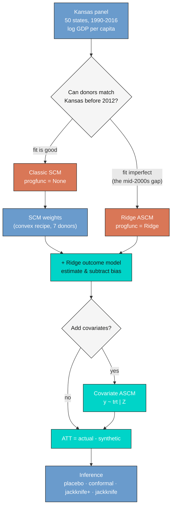

---
authors:
  - admin
categories:
  - R
  - Causal Inference
  - Synthetic Control
date: "2026-06-08T00:00:00Z"
draft: false
featured: false
external_link: ""
image:
  caption: ""
  focal_point: Smart
  placement: 3
links:
  - icon: chalkboard-teacher
    icon_pack: fas
    name: "Slides (HTML)"
    url: slides/index.html
  - icon: laptop-code
    icon_pack: fas
    name: "Web app"
    url: web_app/index.html
  - icon: file-pdf
    icon_pack: fas
    name: "Slides (PDF)"
    url: https://carlos-mendez.org/post/r_augsynth/Augmented_Synthetic_Control_Kansas.pdf
  - icon: code
    icon_pack: fas
    name: "R script"
    url: analysis.R
  - icon: file-code
    icon_pack: fas
    name: "Quarto project (.zip)"
    url: r_augsynth.zip
  - icon: book
    icon_pack: fas
    name: "Data dictionary"
    url: data/index.html
  - icon: podcast
    icon_pack: fas
    name: AI Podcast
    url: "/post/r_augsynth/#podcast-player"
  - icon: markdown
    icon_pack: fab
    name: "MD version"
    url: https://raw.githubusercontent.com/cmg777/starter-academic-v501/master/content/post/r_augsynth/index.md
slides:
summary: "A beginner-friendly, intuition-first tutorial on the Augmented Synthetic Control Method (ASCM) for a single treated unit — estimating the effect of the 2012 Kansas tax cuts on GDP per capita with the augsynth package, from classic SCM to ridge augmentation, with a careful tour of four ways to do inference."
tags:
  - r
  - causal inference
  - synthetic control
  - panel data
title: "The Augmented Synthetic Control Method: A Beginner's Tutorial with the Kansas Tax Cuts"
url_code: ""
url_pdf: ""
url_slides: ""
url_video: ""
toc: true
diagram: true
---

## Abstract

In May 2012 Kansas enacted one of the largest state tax cuts in recent U.S. history, billed as a supply-side experiment that should accelerate growth, yet with only one Kansas the missing counterfactual makes the policy's effect hard to measure. This tutorial estimates the effect of the 2012 Kansas tax cut on log GDP per capita for a single treated unit, teaching the Augmented Synthetic Control Method (ASCM) of Ben-Michael, Feller, and Rothstein (2021) from classic synthetic control through ridge augmentation and covariate balancing. The data are the `kansas` panel shipped with the `augsynth` R package — a balanced panel of 50 U.S. states observed every quarter from 1990 Q1 to 2016 Q1 (105 quarters, 5,250 rows; 89 pre-treatment and 16 post-treatment quarters), with log gross state product per capita as the outcome. Classic SCM builds a synthetic Kansas from a 7-state convex blend (South Carolina 0.30, Washington 0.22, Texas 0.15) and estimates an average post-2012 ATT of −0.029 log points (≈ −2.9%) with an L2 pre-fit imbalance of 0.083 (79.5% better than uniform). Ridge ASCM deepens the estimate to −0.040 (≈ −3.9%), tightens the imbalance to 0.062, and reports an estimated bias of 0.011 — about a third of the effect — while moving the donor weights by a negligible RMS of 0.015; adding six covariates pushes the ATT to −0.061 (≈ −5.9%) with covariate imbalance of 0.005. Four inference approaches — placebo/permutation (p = 0.10), conformal (p = 0.066), jackknife+ ([−0.058, −0.021], excluding zero), and the leave-one-donor jackknife (SE 0.024) — agree on the same −0.040 point estimate but disagree at the margin. The pattern implies the tax cut is associated with a persistent 3 to 6% GDP-per-capita shortfall that classic SCM understates, with borderline but coherent statistical support.

## 1. Overview

In May 2012, Kansas enacted one of the largest state tax cuts in recent U.S. history. Governor Sam Brownback called it "a real-live experiment" in supply-side economics: slash personal income taxes, and growth — the theory went — would follow. Did it? Answering that question is harder than it sounds, because we cannot rewind history and run Kansas *without* the tax cut to compare. There is only one Kansas, and it took the treatment.

The **synthetic control method (SCM)** offers a clever way out: if no single state is a good stand-in for Kansas, perhaps a *weighted blend* of several states can be. Build a "synthetic Kansas" from other states so that it matches the real Kansas before 2012, and its path after 2012 becomes the counterfactual — what Kansas's economy *would have done* without the tax cut. The gap between the two is the estimated effect.

But classic SCM has an Achilles' heel. It can only build the synthetic from a **convex** combination of donors — non-negative weights that sum to one — and sometimes no such combination matches the treated unit well enough. When the pre-treatment fit is imperfect, the estimate is biased, and the original authors of SCM recommend *not using it at all*. The **Augmented Synthetic Control Method (ASCM)** of Ben-Michael, Feller, and Rothstein (2021) rescues these cases: it keeps the interpretable SCM weights but adds an outcome model that **estimates and subtracts the leftover bias**.

This tutorial teaches ASCM for a **single treated unit** through the canonical Kansas example, using the `augsynth` R package. We deliberately move slowly: every method comes with the intuition first, then the equation, then the code, then the interpretation of real numbers. Inference in synthetic control is notoriously slippery, so we devote a full section to *four* different ways of asking "could this effect just be noise?"

> If you want the multi-country, staggered-adoption version of these tools (`multisynth`, `augsynth_multiout`), see the companion post [Augmented Synthetic Control for Multiple Countries](/post/r_sc_multi_country/). This tutorial is the single-treated-unit foundation to read first.

### 1.1 Learning objectives

By the end of this tutorial, you will be able to:

- **Implement** classic SCM, Ridge ASCM, and covariate-augmented ASCM for one treated unit with `augsynth()`.
- **Estimate** the ATT of the 2012 Kansas tax cut on log GDP per capita, and read the pre-fit imbalance, the chosen penalty, and the estimated bias.
- **Explain** *why* the ridge bias-correction moves the estimate, and why it does so with almost no change to the donor weights.
- **Assess** statistical significance four ways — placebo/permutation, conformal, jackknife+, and the leave-one-donor jackknife — and explain when they disagree.

The roadmap below shows the path we will take. The branch point is the *quality of the pre-treatment fit*: when classic SCM matches Kansas well, augmentation changes little; when it cannot, ridge ASCM extrapolates just enough to de-bias the estimate.



## 2. Key concepts

Before the code, here are the seven ideas that carry the whole tutorial. Each card has a plain definition, a concrete example from the Kansas study, and an everyday analogy. The two hardest for newcomers are **extrapolation** (concept 3) and **conformal inference** (concept 7) — linger on those.

**1. Synthetic control method (SCM).**
A weighted average of untreated "donor" units, built so its pre-treatment path matches the treated unit. The synthetic's post-treatment trajectory is the estimated counterfactual; the gap to the real unit is the treatment effect.

<div class="concept-pair">
<details class="concept-card concept-example">
<summary>Example</summary>

"Synthetic Kansas" is a blend of 7 states (South Carolina, Washington, Texas, …) chosen so that its pre-2012 GDP per capita tracks the real Kansas. After 2012, the gap is the effect of the tax cut.

</details>
<details class="concept-card concept-analogy">
<summary>Analogy</summary>

A stunt double assembled from several extras. Before the dangerous scene (treatment) the double mimics the star perfectly; during the scene it shows what would have happened to the star.

</details>
</div>

**2. Donor pool.**
The set of untreated units the synthetic is built from. The treated unit is excluded, as is anyone else exposed to the treatment.

<div class="concept-pair">
<details class="concept-card concept-example">
<summary>Example</summary>

The 49 U.S. states other than Kansas. None of them cut income taxes the way Kansas did in 2012, so each is a candidate ingredient for synthetic Kansas.

</details>
<details class="concept-card concept-analogy">
<summary>Analogy</summary>

The casting shortlist for the stunt double — only extras who did *not* perform the stunt are allowed to audition.

</details>
</div>

**3. Convex hull and extrapolation.**
SCM weights are non-negative and sum to one, so the synthetic can only land *inside* the range spanned by the donors (it interpolates). Matching a treated unit that lies *outside* that range requires negative weights — extrapolation — which classic SCM forbids.

<div class="concept-pair">
<details class="concept-card concept-example">
<summary>Example</summary>

In the mid-2000s, Kansas's economy wobbles near the edge of what the donors can reproduce, so classic SCM leaves a stubborn gap there (a single quarter off by 0.043 log points). Ridge ASCM allows a controlled amount of extrapolation to close it.

</details>
<details class="concept-card concept-analogy">
<summary>Analogy</summary>

Mixing paint from stocked colours: you can blend them to get any shade *between* them, but you cannot use a *negative* amount of blue to get something brighter than your brightest blue.

</details>
</div>

**4. Ridge penalty and bias correction.**
ASCM fits a ridge regression of donors' outcomes on their lagged outcomes, predicts the residual imbalance, and subtracts it from the SCM estimate. A penalty λ controls how far the weights may leave the convex hull — large λ stays close to SCM, small λ extrapolates more.

<div class="concept-pair">
<details class="concept-card concept-example">
<summary>Example</summary>

Augmentation moves the Kansas estimate from −0.029 to −0.040 and cuts the pre-fit imbalance from 0.083 to 0.062, reporting an estimated bias of 0.011 — about a third of the effect.

</details>
<details class="concept-card concept-analogy">
<summary>Analogy</summary>

A spell-checker for the counterfactual: SCM writes the first draft, and ridge fixes the systematic typos it can detect from the donors.

</details>
</div>

**5. ATT — the estimand.**
The Average Treatment effect on the Treated: actual minus synthetic, in the post-treatment period, for the treated unit. It answers "what did the treatment do *to Kansas*," not to an average state.

<div class="concept-pair">
<details class="concept-card concept-example">
<summary>Example</summary>

The average post-2012 gap of about −0.04 log points ≈ a 3.9% shortfall in Kansas's GDP per capita relative to its synthetic twin.

</details>
<details class="concept-card concept-analogy">
<summary>Analogy</summary>

The moment the stunt double keeps to the safe "no-stunt" script while the star veers off it — the distance between them *is* the effect of the stunt.

</details>
</div>

**6. Pre-treatment fit (RMSPE / L2 imbalance).**
How closely the synthetic tracks the treated unit *before* treatment. `augsynth` reports it as an L2 imbalance and as a percent improvement over naive uniform weights. A bad pre-fit makes any post-treatment gap meaningless.

<div class="concept-pair">
<details class="concept-card concept-example">
<summary>Example</summary>

Classic SCM achieves L2 = 0.083 (79.5% better than uniform weights); Ridge ASCM tightens it to 0.062 (84.7%).

</details>
<details class="concept-card concept-analogy">
<summary>Analogy</summary>

How convincing the stunt double looks *before* the scene. If the audience can already tell them apart, nothing that happens during the scene is believable.

</details>
</div>

**7. Conformal inference.**
`augsynth`'s default test. Under the hypothesis of *no effect*, the post-treatment gaps should look like the pre-treatment gaps (just noise). Conformal inference checks whether the post-treatment residual "conforms" to the distribution of pre-treatment residuals, yielding a p-value and a pointwise confidence band.

<div class="concept-pair">
<details class="concept-card concept-example">
<summary>Example</summary>

For classic SCM the 2012 Q3 effect is −0.041 with a 95% interval of [−0.070, −0.015] and p = 0.023 — the gap is larger than typical pre-period noise.

</details>
<details class="concept-card concept-analogy">
<summary>Analogy</summary>

A lie detector calibrated on a person's resting readings. A post-event spike only counts as a signal if it exceeds their normal fluctuation.

</details>
</div>

## 3. Setup

The `augsynth` package is not on CRAN; install it once from GitHub. The other packages are standard. We fix a random seed because two of the inference procedures use resampling.

```r
# install.packages("remotes")
# remotes::install_github("ebenmichael/augsynth")   # one-time install

library(augsynth)
library(dplyr)
library(tidyr)
library(ggplot2)
library(readr)

set.seed(20260608)

# Site colour palette used throughout
STEEL_BLUE  <- "#6a9bcc"   # synthetic control / SCM
WARM_ORANGE <- "#d97757"   # treated (Kansas) / actual
TEAL        <- "#00d4c8"   # ridge-augmented
```

A note on `augsynth`'s **formula mini-language**, which we will use repeatedly:

- `outcome ~ treatment` — the minimal model: match on the entire pre-treatment outcome series.
- `outcome ~ treatment | z1 + z2 + ...` — also balance the auxiliary covariates listed after the `|`.
- `progfunc = "None"` — pure SCM, no outcome model. `progfunc = "Ridge"` — augment with ridge regression.
- `scm = TRUE` — use SCM (convex) weights as the starting point.

## 4. Data and key variables

The `kansas` dataset ships with `augsynth`. To keep this tutorial fully reproducible, we load it from a CSV in the post's GitHub folder (a copy of the package's `kansas` object), with a local fallback.

```r
url    <- "https://raw.githubusercontent.com/cmg777/starter-academic-v501/master/content/post/r_augsynth/kansas.csv"
kansas <- if (file.exists("kansas.csv")) read_csv("kansas.csv") else read_csv(url)
kansas <- as.data.frame(kansas)

# The panel dimensions and the treated unit
length(unique(kansas$fips))          # number of states
range(kansas$year_qtr)               # time span
```

```text
[1] 50
[1] 1990 2016
```

The panel is balanced: **50 U.S. states, observed every quarter from 1990 Q1 to 2016 Q1** — that is 105 quarters per state, 5,250 rows in all. The key variables are few and clear:

| Variable | Role | Meaning |
|---|---|---|
| `fips` | unit id | State FIPS code (Kansas = 20) |
| `year_qtr` | time | Year plus quarter, e.g. `2012.25` = Q2 2012 |
| `lngdpcapita` | **outcome** | Natural log of gross state product per capita |
| `treated` | treatment | 1 for Kansas from 2012 Q2 onward, 0 otherwise |
| `revstatecapita`, `revlocalcapita`, `avgwklywagecapita`, `estabscapita`, `emplvlcapita` | covariates | Per-capita state revenue, local revenue, weekly wage, establishments, employment |

Let us look at exactly when treatment switches on:

```r
kansas %>%
  filter(state == "Kansas" & year_qtr >= 2012 & year_qtr < 2013) %>%
  select(year, qtr, year_qtr, treated, gdp, lngdpcapita)
```

```text
 year qtr year_qtr treated    gdp lngdpcapita
 2012   1  2012.00       0 143844    10.81687
 2012   2  2012.25       1 141518    10.79991
 2012   3  2012.50       1 138890    10.78051
 2012   4  2012.75       1 139603    10.78498
```

**Interpretation.** The `treated` flag is zero for Kansas through 2012 Q1 and one from 2012 Q2 (`year_qtr = 2012.25`) onward — exactly when the tax cut took effect. Notice the outcome already *dips* in the quarters right after: `lngdpcapita` falls from 10.817 to 10.781. But that raw dip is not yet a causal estimate — every state's economy moved over this period. We need the counterfactual. With **89 pre-treatment quarters** and **16 post-treatment quarters**, we have a long history to pin down a credible synthetic Kansas — and, as we will see, a long pre-period is exactly what makes inference possible.

## 5. Exploratory view: why we need a *synthetic* control

```r
ggplot() +
  geom_line(data = filter(kansas, fips != 20),
            aes(year_qtr, lngdpcapita, group = fips), colour = "grey78") +
  geom_line(data = filter(kansas, fips == 20),
            aes(year_qtr, lngdpcapita), colour = WARM_ORANGE, linewidth = 1.1) +
  geom_vline(xintercept = 2012.25, linetype = "dashed")
```


**Interpretation.** Kansas sits squarely *in the middle* of the pack and rises along with every other state for 26 years. This is the fundamental obstacle: there is no single state whose line lies on top of Kansas's, so we cannot just pick "the most similar state" as a comparison. We have to *construct* a comparison by blending donors. The plot also previews the difficulty to come — in the mid-2000s the lines fan apart and Kansas wanders relative to its neighbours, which is precisely where a convex blend will struggle to keep up.

## 6. Baseline: the classic synthetic control

### 6.1 The idea, then the math

SCM picks donor weights so that the weighted donor outcomes reproduce the treated unit's pre-treatment path as closely as possible, subject to two rules: the weights are **non-negative** and they **sum to one**. Those two rules are what keep the synthetic interpretable and prevent wild extrapolation.

Writing $X\_1$ for Kansas's vector of pre-treatment outcomes and $X\_0$ for the matching matrix of donor outcomes, the SCM weights solve

$$\hat{\gamma}^{scm} = \arg\min\_{\gamma} \\| X\_1 - X\_0' \gamma \\|\_2^2 \quad \text{subject to} \quad \sum\_{i} \gamma\_i = 1, \quad \gamma\_i \ge 0$$

In words, this says: choose the weights $\gamma\_i$ that make the blended donor history $X\_0'\gamma$ as close as possible (in squared distance) to Kansas's history $X\_1$, while staying on the **simplex** (non-negative, summing to one). In code, $X\_1$ is Kansas's pre-2012 `lngdpcapita` and $X\_0$ holds the 49 donors' pre-2012 series; $\hat{\gamma}^{scm}$ becomes `syn$weights`.

Once we have the weights, the estimated effect in each post-treatment quarter $t$ is simply actual minus synthetic:

$$\hat{\tau}\_t = Y\_{1t} - \sum\_{i} \hat{\gamma}\_i^{scm}\\, Y\_{it}, \quad t > T\_0$$

In words, the per-quarter ATT is Kansas's realized outcome $Y\_{1t}$ minus the weighted sum of donor outcomes (the synthetic). Here $T\_0$ is the last pre-treatment period; in code $Y\_{1t}$ is Kansas's `lngdpcapita` and the weighted sum is `predict(syn, att = FALSE)`.

### 6.2 Fitting it

```r
syn <- augsynth(lngdpcapita ~ treated, fips, year_qtr, kansas,
                progfunc = "None", scm = TRUE)
summary(syn)
```

```text
Fit to 50 units and 89+16 = 105 time points; 1 treated at year_qtr 2012.25.

7 donor units used with weights of 0.053 to 0.301
Average ATT Estimate (p Value for Joint Null):  -0.0294   ( 0.311 )
L2 Imbalance: 0.083
Percent improvement from uniform weights: 79.5%

Inference type: Conformal inference
```

**Interpretation.** Classic SCM builds synthetic Kansas from **7 donor states** and estimates an **average post-2012 ATT of −0.0294** log points. Because effects in logs are approximately percentages, that is a shortfall of about **2.9%** in GDP per capita relative to the counterfactual. The pre-treatment **L2 imbalance is 0.083**, which `augsynth` tells us is **79.5% better** than the naive alternative of weighting all 49 donors equally. The joint-null p-value of 0.311 is our first significance signal — and not a strong one — but hold that thought until the inference section.

We can see the synthetic control as a transparent recipe — the weights live in `syn$weights`, named by state FIPS code:

```r
w <- syn$weights[, 1]
round(sort(w[w > 0.001], decreasing = TRUE), 3)   # the donors that actually matter
```


**Interpretation.** This is SCM's signature virtue: **42 of the 49 donors get exactly zero weight**, and the seven that remain form a recipe you can name and defend. South Carolina carries 30% of synthetic Kansas, Washington 22%, Texas 15%. The sparsity is not an accident — the simplex constraint pushes most weights to exactly zero. The cost of that interpretability is rigidity: if no convex recipe matches Kansas perfectly, SCM cannot do better, and the leftover mismatch becomes bias.

### 6.3 Seeing the counterfactual and the gap

```r
plot(syn, plot_type = "outcomes")   # actual Kansas vs its synthetic control
```


**Interpretation.** Before the dashed line the two series are nearly on top of each other — synthetic Kansas is a believable double. After 2012, the orange (actual) line slips below the blue (synthetic): Kansas grew more slowly than its counterfactual. That visible wedge is the treatment effect.

```r
plot(syn)   # the gap (actual - synthetic) with a pointwise conformal band
```


**Interpretation.** The gap plot isolates the effect on a single axis. Pre-2012 it oscillates around zero — but look at the dip near 2005–2006, which reaches **−0.043 in one quarter**. That is a *pre-treatment* gap, where the true effect is zero by definition, so it is pure imbalance: SCM simply could not match Kansas there. Post-2012 the gap turns reliably negative, deepest at **2013 Q3 (−0.046)** and **2014 Q1 (−0.045)**. The shaded conformal band is wide, foreshadowing that significance will be a close call.

That stubborn mid-2000s imbalance is the motivation for everything that follows. It is exactly the situation Abadie and co-authors warn about — and exactly what ASCM was built to fix.

## 7. The augmentation: Ridge ASCM

### 7.1 The idea: estimate the bias, then subtract it

Here is the key insight. When the synthetic does not perfectly match Kansas before treatment, the post-treatment gap mixes two things: the **real effect** and the **bias** from that imperfect match. If we could *estimate* the bias, we could subtract it off. ASCM does exactly this by fitting an **outcome model** — a regression that predicts a unit's outcome from its pre-treatment history — and using it to forecast how much the residual imbalance distorts the estimate.

The augmented counterfactual for the post-period can be written two equivalent ways. First, as "SCM plus a bias correction":

$$\hat{Y}\_{1T}^{aug}(0) = \sum\_{i} \hat{\gamma}\_i^{scm} Y\_{iT} + \left( \hat{m}\_{1T} - \sum\_{i} \hat{\gamma}\_i^{scm} \hat{m}\_{iT} \right)$$

In words: start from the plain SCM counterfactual (the first term), then add a correction equal to the imbalance the outcome model $\hat{m}$ predicts (the parenthesis). If the model thinks Kansas's history is systematically a little above what its donors' weights reproduce, that term nudges the counterfactual accordingly. In `augsynth` this correction is reported as the **"Avg Estimated Bias."**

The same estimator can be rearranged into a "model plus reweighted residuals" form, which is why ASCM is often described as **doubly robust**:

$$\hat{Y}\_{1T}^{aug}(0) = \hat{m}\_{1T} + \sum\_{i} \hat{\gamma}\_i^{scm} \left( Y\_{iT} - \hat{m}\_{iT} \right)$$

In words: predict Kansas directly from the outcome model ($\hat{m}\_{1T}$), then correct it using the SCM-weighted **residuals** of the donors. If the SCM fit were already perfect, the residual term would balance out and ASCM would equal SCM — augmentation only does something when there is imbalance to fix.

The outcome model `augsynth` uses by default is **ridge regression** of donors' outcomes on their lagged outcomes, with an L2 penalty:

$$\hat{\eta}^{ridge} = \arg\min\_{\eta} \frac{1}{2}\sum\_{i} \left( Y\_i - X\_i' \eta \right)^2 + \lambda \\| \eta \\|\_2^2$$

In words: fit a regression predicting the post-period outcome from the pre-period outcomes, but shrink the coefficients toward zero by an amount set by $\lambda$. The penalty $\lambda$ — in code, `asyn$lambda` — is the single dial that controls how aggressive the bias correction is.

### 7.2 Why ridge ASCM barely disturbs the weights

A beautiful result in the paper is that Ridge ASCM is equivalent to a **penalized SCM**: instead of forbidding negative weights outright, it lets the weights leave the simplex but *penalizes how far they stray from the SCM solution*:

$$\hat{\gamma}^{aug} = \arg\min\_{\gamma} \frac{1}{2\lambda} \\| X\_1 - X\_0' \gamma \\|\_2^2 + \frac{1}{2} \\| \gamma - \hat{\gamma}^{scm} \\|\_2^2 \quad \text{s.t.} \quad \sum\_i \gamma\_i = 1$$

In words: find weights that fit the pre-period well (first term) but stay close to the trustworthy SCM weights (second term). A **large** $\lambda$ makes the first term cheap, so the weights barely move from SCM; a **small** $\lambda$ lets them extrapolate more to chase a better fit. This is why, as we will see, the Kansas weights hardly change even as the fit improves.

And the improvement is guaranteed. The paper shows the augmented pre-treatment imbalance can only *shrink* relative to SCM:

$$\\| X\_1 - X\_0' \hat{\gamma}^{aug} \\|\_2 \le \frac{\lambda}{d^2 + \lambda} \\, \\| X\_1 - X\_0' \hat{\gamma}^{scm} \\|\_2$$

In words: the augmented imbalance is the SCM imbalance multiplied by a factor that is always less than one. So augmentation never makes the pre-fit worse — it can only tighten it.

### 7.3 Choosing the penalty by cross-validation

How do we pick $\lambda$? `augsynth` uses **leave-one-pre-period-out cross-validation**: drop each pre-treatment quarter in turn, predict it, and measure the error. We then pick the $\lambda$ that the data say generalizes best.

```r
asyn <- augsynth(lngdpcapita ~ treated, fips, year_qtr, kansas,
                 progfunc = "Ridge", scm = TRUE)   # lambda chosen by CV
plot(asyn, plot_type = "cv")
```


**Interpretation.** The CV curve is U-shaped: too small a $\lambda$ overfits the pre-period (right-hand rise is the opposite extreme, where the model becomes plain SCM), too large washes out the correction. By default `augsynth` applies the **one-standard-error rule** — it chooses the *largest* $\lambda$ whose error is within one SE of the minimum (here **λ = 0.079**). This is deliberately conservative: among statistically indistinguishable choices, it keeps the weights closest to the safe SCM solution. (Set `min_1se = FALSE` to instead minimize CV error and extrapolate more.)

### 7.4 What augmentation does to Kansas

```r
summary(asyn)
```

```text
49 donor units used with weights of 0.001 to 0.316
Average ATT Estimate (p Value for Joint Null):  -0.0401   ( 0.066 )
L2 Imbalance: 0.062
Percent improvement from uniform weights: 84.7%

Avg Estimated Bias: 0.011
```

**Interpretation.** Three numbers tell the story. First, the **estimate deepens** from −0.0294 to **−0.0401** (about a 3.9% shortfall) — augmentation reveals a *larger* effect than plain SCM. Second, the **pre-fit improves**: L2 drops from 0.083 to **0.062** (84.7% better than uniform). Third, `augsynth` reports an **estimated bias of 0.011** — its own measure of how much the SCM number was distorted by imperfect matching. That 0.011 is roughly **one-third of the −0.040 effect**, a striking confirmation of the paper's warning that imperfect SCM fit can substantially understate the effect.

```r
# both gap series come from predict(..., att = TRUE); see analysis.R for the full ggplot
scm_gap   <- predict(syn,  att = TRUE)
ridge_gap <- predict(asyn, att = TRUE)
```


**Interpretation.** The two gaps share the same shape, but the teal ridge line dives a little deeper after 2012 — the visual signature of the bias correction. Crucially, this did **not** require throwing out the interpretable SCM recipe:

```r
# How far did the weights actually move?
sqrt(mean((asyn$weights[,1] - syn$weights[,1])^2))
```

```text
[1] 0.0147
```

**Interpretation.** The root-mean-square change in the donor weights is just **0.0147** — almost nothing. Although 21 donors now carry small *negative* weights (the controlled extrapolation), synthetic Kansas is essentially the same blend as before. Ridge ASCM bought a better fit and a de-biased estimate for the price of a tiny, principled departure from the convex hull. We can see where that price was paid:


**Interpretation.** Restricting attention to the pre-period — where the gap *should* be zero — shows exactly what augmentation fixed. SCM's worst quarter (2005 Q4, **−0.043**) is pulled back to **−0.031** by ridge, and the rest of the turbulent mid-2000s is calmed too. That is the bias correction at work: it spent its small extrapolation budget precisely where classic SCM was failing.

## 8. Adding covariates

So far we matched only on the history of the outcome. But `augsynth` can also balance **auxiliary covariates** — state revenue, wages, establishments, employment — by listing them after a `|` in the formula. Both the lagged outcomes and the covariates then enter the SCM balancing problem *and* the ridge outcome model:

$$\min\_{\eta\_x, \eta\_z} \frac{1}{2}\sum\_{i} \left( Y\_i - X\_i' \eta\_x - Z\_i' \eta\_z \right)^2 + \lambda\_x \\| \eta\_x \\|\_2^2 + \lambda\_z \\| \eta\_z \\|\_2^2$$

In words: the outcome model now uses both the lagged outcomes $X$ (with coefficients $\eta\_x$) and the covariates $Z$ (with coefficients $\eta\_z$), each with its own ridge penalty. The covariates give the synthetic more ways to resemble Kansas than the outcome path alone.

```r
covsyn <- augsynth(lngdpcapita ~ treated | lngdpcapita + log(revstatecapita) +
                     log(revlocalcapita) + log(avgwklywagecapita) +
                     estabscapita + emplvlcapita,
                   fips, year_qtr, kansas, progfunc = "ridge", scm = TRUE)
summary(covsyn)
```

```text
49 donor units used with weights of 0.004 to 0.356
Average ATT Estimate (p Value for Joint Null):  -0.0609   ( 0.124 )
L2 Imbalance: 0.054
Percent improvement from uniform weights: 86.6%

Covariate L2 Imbalance: 0.005
Percent improvement from uniform weights: 97.7%

Avg Estimated Bias: 0.027
```

**Interpretation.** Adding the six covariates sharpens balance on two fronts: the outcome imbalance falls to **0.054** and the **covariate imbalance to 0.005 — a 97.7% improvement** over uniform weights. With the additional structure, the estimate deepens again to **−0.0609 (≈ −5.9%)**. The covariates fix dimensions of similarity that lagged outcomes alone miss — for instance, matching Kansas's employment and wage levels, not just its GDP trajectory.

Two further options are worth knowing but not belaboring. **Residualizing** (`residualize = TRUE`) first regresses the outcome on the covariates and fits ASCM on the residuals; on Kansas it drives covariate imbalance to *exactly zero* and gives an ATT of **−0.0548**. The simplest possible outcome model, a **unit fixed effect** (`fixedeff = TRUE`, which de-means each series), gives **−0.0335** — between plain SCM and ridge. Every route agrees on the sign and the rough size of the effect.

## 9. Inference: could this just be noise?

This is the part students find hardest, and for good reason: a synthetic-control estimate is a difference between two *estimated* curves, built from one treated unit. Classical standard-error formulas do not obviously apply. `augsynth` ships four tools, and they can give different verdicts. The shared question they all answer is: **is the post-treatment gap bigger than what we would see by chance?** They differ in how they define "by chance."

We run all four on the Ridge ASCM fit (only the ridge estimator supports standard errors).

### 9.1 Placebo / permutation tests (the classic approach)

The original SCM inference, due to Abadie and co-authors, is a **placebo test**. The logic: if the tax cut truly moved Kansas, then re-running the whole analysis pretending some *untreated* donor was "treated" should usually produce a much smaller gap. Do this for every donor, and you get a distribution of placebo effects to compare Kansas against.

A common summary statistic is the **RMSPE ratio** — post-treatment fit error divided by pre-treatment fit error — which rewards units that tracked well before and diverged after. The permutation p-value is Kansas's rank in that distribution:

$$p = \frac{\\#\\{\\, i : r\_i \ge r\_1 \\,\\}}{N}, \qquad r\_i = \frac{\text{RMSPE}\_i^{\text{post}}}{\text{RMSPE}\_i^{\text{pre}}}$$

In words: compute each unit's post/pre error ratio $r\_i$, then ask what fraction of all units (including Kansas, unit 1) have a ratio at least as large as Kansas's. A small fraction means Kansas stands out.

```r
plot(asyn, plot_type = "placebo")   # switches to permutation inference
```


**Interpretation.** Kansas's pre-2012 line is buried in the grey chorus — a good fit, so it belongs in the comparison. After 2012 it drops toward the bottom edge, but it is **not the single most extreme** path. Its post/pre RMSPE ratio of **6.36 ranks 5th of 50**, giving a permutation **p = 0.10**. Read honestly: Kansas's response is unusual, but a handful of placebo states show swings just as large, so the placebo test alone cannot rule out chance at the 5% level. The placebo test is intuitive and assumption-light, but it has low power with a small donor pool and assumes Kansas is exchangeable with the donors.

### 9.2 Conformal inference (the modern default)

`augsynth`'s default is **conformal inference** (Chernozhukov, Wüthrich, and Zhu, 2021). It tests a sharp null — "the effect equals $\tau\_0$" — by checking whether, after subtracting $\tau\_0$, the post-treatment residual looks like an ordinary draw from the pre-treatment residuals. Inverting the test over a grid of $\tau\_0$ values yields a confidence interval. The p-value for "no effect" is

$$p(\tau\_0) = \frac{1}{T\_0 + 1} \left( 1 + \sum\_{t=1}^{T\_0} \mathbf{1}\\{\\, |\hat{u}\_t| \ge |\hat{u}\_{T}| \\,\\} \right)$$

where the residual at the candidate effect $\tau\_0$ is

$$\hat{u}\_t = Y\_{1t} - \tau\_0 \cdot \mathbf{1}\\{t > T\_0\\} - \sum\_{i} \hat{\gamma}\_i(\tau\_0)\\, Y\_{it}$$

In words: under the null, the post-treatment residual $|\hat{u}\_T|$ should be no more extreme than a typical pre-treatment residual $|\hat{u}\_t|$. The p-value is the share of pre-periods whose residual is at least as large — a long pre-period (89 quarters here) is what gives this test its resolution.

```r
summary(asyn)$average_att     # the conformal joint-null p-value
```

```text
Average Post-Treatment Effect  -0.0401   p = 0.066
```

**Interpretation.** The conformal joint-null p-value is **0.066** — borderline, just above the conventional 5% line. But the *pointwise* picture (the band in the gap plots) is sharper: several individual quarters clear significance, including **2013 Q3 (−0.059, p = 0.024)** and **2014 Q1 (−0.058, p = 0.018)**. Conformal inference is the most robust of the four here because it does not require Kansas to be exchangeable with the donors and it exploits the long pre-period.

### 9.3 Jackknife+ over time

The **jackknife+** builds a confidence interval for the *average* effect by leaving out one pre-treatment period at a time, refitting, and using the spread of the leave-one-out prediction errors to bound the estimate.

```r
summary(asyn, inf_type = "jackknife+")$average_att
```

```text
Average Post-Treatment Effect  -0.0401   95% CI [-0.0576, -0.0206]
```

**Interpretation.** The jackknife+ interval **[−0.058, −0.021] excludes zero** — by this criterion the average effect *is* significant. It is the only one of the four that gives a clean "significant" verdict for the average, because it asks a different question: how stable is the estimate when we perturb the *time* dimension, rather than whether Kansas is special among *states*.

### 9.4 Leave-one-donor jackknife

The final tool drops one *donor* at a time, recomputes the ATT, and forms a standard error from how much the estimate moves — the classic "how sensitive is this to any single comparison unit?" check.

```r
summary(asyn, inf_type = "jackknife")$average_att
```

```text
Average Post-Treatment Effect  -0.0401   Std.Error 0.0242
```

**Interpretation.** With a standard error of **0.0242**, the Wald interval is **−0.040 ± 1.96 × 0.024 = [−0.088, 0.007]**, which **includes zero**. The reason is intuitive: synthetic Kansas leans heavily on a few donors (South Carolina alone is 30%), so dropping one of them can move the estimate appreciably, inflating the standard error. This is the most conservative of the four.

### 9.5 Putting the four together


**Interpretation.** This single figure is the lesson of the section. **The point estimate is the same −0.040 in all four; what differs is the uncertainty.** The methods disagree because they probe different sources of variation — over time (conformal, jackknife+) versus over units (permutation, leave-one-donor jackknife) — and make different exchangeability assumptions. The honest conclusion is not "significant" or "not significant" but a nuanced one: a real, modest negative effect, clearly visible in 2013–2014, whose statistical strength is borderline and depends on which question you ask. **Reporting several methods, as we have, is far more honest than cherry-picking the one that clears 0.05.**

## 10. Results: the five specifications together


**Interpretation.** Read down the ladder of methods, a consistent pattern emerges: **the more we de-bias and balance, the larger the measured damage.** The ATT moves from **−0.029** (classic SCM) to **−0.040** (ridge) to **−0.061** (covariate-augmented), while the pre-fit L2 imbalance falls from **0.083** to **0.062** to **0.054**. The fixed-effect (**−0.034**) and residualized (**−0.055**) variants fall between these in magnitude. This monotonic pattern is reassuring rather than alarming: it tells us the un-augmented SCM estimate was the *conservative* one, understating the effect because of the very imbalance ASCM was designed to remove.

| Specification | ATT (log pts) | ≈ % effect | Pre-fit L2 | Est. bias |
|---|---|---|---|---|
| Classic SCM | −0.029 | −2.9% | 0.083 | — |
| Ridge ASCM | −0.040 | −3.9% | 0.062 | 0.011 |
| Covariate ASCM | −0.061 | −5.9% | 0.054 | 0.027 |
| Residualized | −0.055 | −5.3% | 0.067 | 0.006 |
| Fixed effects | −0.034 | −3.3% | 0.082 | — |

## 11. Discussion: what did the Kansas experiment do?

Putting the pieces together, the evidence points one direction: **the 2012 Kansas tax cut is associated with a persistent shortfall in GDP per capita of roughly 3 to 6%, relative to a synthetic Kansas built from other states.** The effect is strongest in 2013–2014, robust in *sign* across all five specifications, and — importantly — *larger* once we correct the bias that classic SCM leaves behind. The supply-side promise of accelerated growth does not appear in the data; if anything, Kansas underperformed its counterfactual.

Three caveats keep this honest. First, **significance is genuinely borderline**: depending on the inference method, the average effect either clears or just misses the 5% bar, even though individual 2013–2014 quarters are significant. We should describe this as suggestive-to-moderate evidence, not a knock-down result. Second, the estimate is the *net* gap, not a tax-only effect — Kansas also suffered a severe drought and aerospace-sector shocks over this window, which a synthetic control cannot separately strip out. Third, like all SCM analyses, the result rests on the assumption that a weighted blend of donors can stand in for Kansas's untreated path, and that no other state was affected by Kansas's policy.

For a policymaker, the practical takeaway is not a single number but a *pattern*: the better we make the comparison, the worse the tax cut looks, and at no point does it look good. That is a meaningfully different conclusion than "no detectable effect," which is what a hasty reading of the classic-SCM p-value alone might have suggested.

## 12. Summary and next steps

**What we did and found:**

- Built a synthetic Kansas from a **7-state convex blend** (classic SCM) and estimated a **−2.9%** post-2012 effect with a pre-fit imbalance of 0.083.
- **Augmented** with ridge regression to correct the imperfect pre-2012 fit, deepening the estimate to **−3.9%**, improving the fit to 0.062, and quantifying the SCM bias at **0.011** (≈ one-third of the effect) — all while moving the weights by a negligible RMS of 0.015.
- Added **covariates** to push the estimate to **−5.9%** with near-perfect covariate balance.
- Tested significance **four ways** and found a coherent but borderline picture: jackknife+ excludes zero, conformal and permutation hover around p = 0.07–0.10, and the leave-one-donor jackknife is the most cautious.

**Limitations:** a single treated unit and a modest donor pool limit statistical power; the estimate cannot separate the tax cut from contemporaneous shocks; and the conclusion depends on the credibility of the synthetic match.

**Where to go next:**

- Try other outcome models via `progfunc` (`"gsyn"`, `"en"`, …) and compare.
- Move to **multiple treated units and staggered adoption** with `multisynth`, or **multiple outcomes** with `augsynth_multiout`, in the companion post on [Augmented Synthetic Control for Multiple Countries](/post/r_sc_multi_country/).
- Run your own sensitivity checks: vary the donor pool, the pre-period length, and the test statistic in `summary(..., stat_func = ...)`.

### 12.1 Exercises

1. **In-time placebo.** Re-fit Ridge ASCM pretending the tax cut happened in 2009 Q2 instead of 2012 Q2 (restrict the data to pre-2012 and set the fake treatment time). The estimated "effect" should be near zero. Why is this a useful check, and what would a large fake effect imply?
2. **The penalty dial.** Re-fit with `min_1se = FALSE` so cross-validation *minimizes* the error instead of applying the one-standard-error rule. How do λ, the pre-fit L2, and the estimate change? Explain the bias–variance trade-off you observe.
3. **Inference under the microscope.** For the classic-SCM fit, change the conformal test statistic with `summary(syn, stat_func = function(x) abs(sum(x)))`. How does the joint-null p-value change, and why might prioritizing the *average* post-treatment effect (rather than the sum of absolute effects) be more or less appropriate here?

## 13. References

1. Ben-Michael, E., Feller, A., & Rothstein, J. (2021). [The Augmented Synthetic Control Method](https://doi.org/10.1080/01621459.2021.1929245). *Journal of the American Statistical Association*, 116(536), 1789–1803.
2. Abadie, A., Diamond, A., & Hainmueller, J. (2010). [Synthetic Control Methods for Comparative Case Studies](https://doi.org/10.1198/jasa.2009.ap08746). *Journal of the American Statistical Association*, 105(490), 493–505.
3. Abadie, A., & Gardeazabal, J. (2003). [The Economic Costs of Conflict: A Case Study of the Basque Country](https://doi.org/10.1257/000282803321455188). *American Economic Review*, 93(1), 113–132.
4. Chernozhukov, V., Wüthrich, K., & Zhu, Y. (2021). [An Exact and Robust Conformal Inference Method for Counterfactual and Synthetic Controls](https://doi.org/10.1080/01621459.2021.1920957). *Journal of the American Statistical Association*, 116(536), 1849–1864.
5. `augsynth` package and the Kansas vignette: [github.com/ebenmichael/augsynth](https://github.com/ebenmichael/augsynth).
6. Companion tutorial: [Augmented Synthetic Control for Multiple Countries](/post/r_sc_multi_country/).

---

<style>
.podcast-overlay {
  display: none;
  position: fixed;
  bottom: 0;
  left: 0;
  right: 0;
  z-index: 9999;
  animation: podSlideUp 0.35s ease-out;
}
@keyframes podSlideUp {
  from { transform: translateY(100%); }
  to { transform: translateY(0); }
}
.podcast-overlay.pod-closing {
  animation: podSlideDown 0.3s ease-in forwards;
}
@keyframes podSlideDown {
  from { transform: translateY(0); }
  to { transform: translateY(100%); }
}
.podcast-container {
  background: linear-gradient(135deg, #1a1a2e 0%, #16213e 100%);
  padding: 18px 24px 20px;
  font-family: -apple-system, BlinkMacSystemFont, 'Segoe UI', Roboto, sans-serif;
  box-shadow: 0 -4px 32px rgba(0,0,0,0.5);
  border-top: 1px solid rgba(106,155,204,0.2);
}
.podcast-inner {
  max-width: 800px;
  margin: 0 auto;
}
.podcast-top-row {
  display: flex;
  align-items: center;
  gap: 14px;
  margin-bottom: 14px;
}
.podcast-icon {
  width: 42px;
  height: 42px;
  background: linear-gradient(135deg, #d97757, #e8956a);
  border-radius: 10px;
  display: flex;
  align-items: center;
  justify-content: center;
  flex-shrink: 0;
}
.podcast-icon svg {
  width: 22px;
  height: 22px;
  fill: #fff;
}
.podcast-title-block {
  flex: 1;
  min-width: 0;
}
.podcast-title-block h4 {
  margin: 0 0 1px 0;
  color: #f0ece2;
  font-size: 14px;
  font-weight: 600;
  letter-spacing: 0.02em;
  white-space: nowrap;
  overflow: hidden;
  text-overflow: ellipsis;
}
.podcast-title-block span {
  color: #8b9dc3;
  font-size: 11px;
}
.podcast-close-btn {
  background: none;
  border: none;
  cursor: pointer;
  padding: 6px;
  border-radius: 50%;
  display: flex;
  align-items: center;
  justify-content: center;
  transition: background 0.2s;
  flex-shrink: 0;
}
.podcast-close-btn:hover {
  background: rgba(255,255,255,0.1);
}
.podcast-close-btn svg {
  width: 20px;
  height: 20px;
  fill: #8b9dc3;
}
.podcast-progress-wrap {
  margin-bottom: 12px;
}
.podcast-time-row {
  display: flex;
  justify-content: space-between;
  font-size: 11px;
  color: #8b9dc3;
  margin-bottom: 5px;
  font-variant-numeric: tabular-nums;
}
.podcast-bar-bg {
  width: 100%;
  height: 6px;
  background: rgba(255,255,255,0.1);
  border-radius: 3px;
  cursor: pointer;
  position: relative;
  overflow: hidden;
  transition: height 0.15s;
}
.podcast-bar-buffered {
  position: absolute;
  top: 0;
  left: 0;
  height: 100%;
  background: rgba(106,155,204,0.25);
  border-radius: 3px;
  transition: width 0.3s;
}
.podcast-bar-progress {
  position: absolute;
  top: 0;
  left: 0;
  height: 100%;
  background: linear-gradient(90deg, #6a9bcc, #00d4c8);
  border-radius: 3px;
  transition: width 0.1s linear;
}
.podcast-bar-bg:hover {
  height: 10px;
  margin-top: -2px;
}
.podcast-controls-row {
  display: flex;
  align-items: center;
  justify-content: space-between;
}
.podcast-transport {
  display: flex;
  align-items: center;
  gap: 8px;
}
.podcast-btn {
  background: none;
  border: none;
  cursor: pointer;
  padding: 4px;
  display: flex;
  align-items: center;
  justify-content: center;
  border-radius: 50%;
  transition: all 0.2s;
}
.podcast-btn svg {
  fill: #c8d0e0;
  transition: fill 0.2s;
}
.podcast-btn:hover svg {
  fill: #f0ece2;
}
.podcast-btn-skip {
  position: relative;
}
.podcast-btn-skip span {
  position: absolute;
  font-size: 7px;
  font-weight: 700;
  color: #c8d0e0;
  top: 50%;
  left: 50%;
  transform: translate(-50%, -50%);
  pointer-events: none;
  margin-top: 1px;
}
.podcast-btn-play {
  width: 48px;
  height: 48px;
  background: linear-gradient(135deg, #d97757, #e8956a);
  border-radius: 50%;
  box-shadow: 0 3px 12px rgba(217,119,87,0.4);
  transition: all 0.2s;
}
.podcast-btn-play:hover {
  transform: scale(1.08);
  box-shadow: 0 5px 20px rgba(217,119,87,0.5);
}
.podcast-btn-play svg {
  fill: #fff;
  width: 22px;
  height: 22px;
}
.podcast-extras {
  display: flex;
  align-items: center;
  gap: 10px;
}
.podcast-volume-wrap {
  display: flex;
  align-items: center;
  gap: 5px;
}
.podcast-volume-wrap svg {
  fill: #8b9dc3;
  width: 16px;
  height: 16px;
  cursor: pointer;
  flex-shrink: 0;
}
.podcast-volume-wrap svg:hover {
  fill: #c8d0e0;
}
.podcast-volume-slider {
  -webkit-appearance: none;
  appearance: none;
  width: 60px;
  height: 4px;
  background: rgba(255,255,255,0.12);
  border-radius: 2px;
  outline: none;
  cursor: pointer;
}
.podcast-volume-slider::-webkit-slider-thumb {
  -webkit-appearance: none;
  appearance: none;
  width: 12px;
  height: 12px;
  background: #6a9bcc;
  border-radius: 50%;
  cursor: pointer;
}
.podcast-speed-btn {
  background: rgba(255,255,255,0.08);
  border: 1px solid rgba(255,255,255,0.12);
  color: #c8d0e0;
  font-size: 11px;
  font-weight: 600;
  padding: 3px 9px;
  border-radius: 12px;
  cursor: pointer;
  transition: all 0.2s;
  font-family: inherit;
  min-width: 40px;
  text-align: center;
}
.podcast-speed-btn:hover {
  background: rgba(106,155,204,0.2);
  border-color: #6a9bcc;
  color: #f0ece2;
}
.podcast-download-btn {
  background: none;
  border: 1px solid rgba(255,255,255,0.12);
  border-radius: 8px;
  padding: 4px 10px;
  cursor: pointer;
  display: flex;
  align-items: center;
  gap: 4px;
  color: #8b9dc3;
  font-size: 11px;
  font-family: inherit;
  text-decoration: none;
  transition: all 0.2s;
}
.podcast-download-btn:hover {
  border-color: #6a9bcc;
  color: #f0ece2;
  background: rgba(106,155,204,0.1);
}
.podcast-download-btn svg {
  width: 14px;
  height: 14px;
  fill: currentColor;
}
@media (max-width: 600px) {
  .podcast-container { padding: 14px 16px 16px; }
  .podcast-volume-wrap { display: none; }
  .podcast-title-block h4 { font-size: 13px; }
  .podcast-extras { gap: 8px; }
}
</style>

<div class="podcast-overlay" id="podOverlay">
<div class="podcast-container">
<div class="podcast-inner">
  <audio id="podAudio" preload="none" src="https://files.catbox.moe/22hl3t.m4a"></audio>

  <div class="podcast-top-row">
    <div class="podcast-icon">
      <svg viewBox="0 0 24 24"><path d="M12 1a5 5 0 0 0-5 5v4a5 5 0 0 0 10 0V6a5 5 0 0 0-5-5zm0 16a7 7 0 0 1-7-7H3a9 9 0 0 0 8 8.94V22h2v-3.06A9 9 0 0 0 21 10h-2a7 7 0 0 1-7 7z"/></svg>
    </div>
    <div class="podcast-title-block">
      <h4>AI Podcast: ASCM & the Kansas Tax Cuts</h4>
      <span id="podDurationLabel">Click play to load</span>
    </div>
    <button class="podcast-close-btn" onclick="podClose()" title="Close player">
      <svg viewBox="0 0 24 24"><path d="M19 6.41L17.59 5 12 10.59 6.41 5 5 6.41 10.59 12 5 17.59 6.41 19 12 13.41 17.59 19 19 17.59 13.41 12z"/></svg>
    </button>
  </div>

  <div class="podcast-progress-wrap">
    <div class="podcast-time-row">
      <span id="podCurrent">0:00</span>
      <span id="podDuration">0:00</span>
    </div>
    <div class="podcast-bar-bg" id="podBarBg" onclick="podSeek(event)">
      <div class="podcast-bar-buffered" id="podBuffered"></div>
      <div class="podcast-bar-progress" id="podProgress"></div>
    </div>
  </div>

  <div class="podcast-controls-row">
    <div class="podcast-transport">
      <button class="podcast-btn podcast-btn-skip" onclick="podSkip(-15)" title="Back 15s">
        <svg width="26" height="26" viewBox="0 0 24 24"><path d="M12 5V1L7 6l5 5V7c3.31 0 6 2.69 6 6s-2.69 6-6 6-6-2.69-6-6H4c0 4.42 3.58 8 8 8s8-3.58 8-8-3.58-8-8-8z"/></svg>
        <span>15</span>
      </button>
      <button class="podcast-btn podcast-btn-play" id="podPlayBtn" onclick="podToggle()" title="Play">
        <svg id="podIconPlay" viewBox="0 0 24 24"><path d="M8 5v14l11-7z"/></svg>
        <svg id="podIconPause" viewBox="0 0 24 24" style="display:none"><path d="M6 19h4V5H6v14zm8-14v14h4V5h-4z"/></svg>
      </button>
      <button class="podcast-btn podcast-btn-skip" onclick="podSkip(15)" title="Forward 15s">
        <svg width="26" height="26" viewBox="0 0 24 24"><path d="M12 5V1l5 5-5 5V7c-3.31 0-6 2.69-6 6s2.69 6 6 6 6-2.69 6-6h2c0 4.42-3.58 8-8 8s-8-3.58-8-8 3.58-8 8-8z"/></svg>
        <span>15</span>
      </button>
    </div>
    <div class="podcast-extras">
      <div class="podcast-volume-wrap">
        <svg id="podVolIcon" onclick="podMute()" viewBox="0 0 24 24"><path d="M3 9v6h4l5 5V4L7 9H3zm13.5 3A4.5 4.5 0 0 0 14 8.5v7a4.47 4.47 0 0 0 2.5-3.5zM14 3.23v2.06a6.51 6.51 0 0 1 0 13.42v2.06A8.51 8.51 0 0 0 14 3.23z"/></svg>
        <input type="range" class="podcast-volume-slider" id="podVolume" min="0" max="1" step="0.05" value="0.8">
      </div>
      <button class="podcast-speed-btn" id="podSpeedBtn" onclick="podCycleSpeed()" title="Playback speed">1x</button>
      <a class="podcast-download-btn" href="https://files.catbox.moe/22hl3t.m4a" target="_blank" rel="noopener" title="Stream">
        <svg viewBox="0 0 24 24"><path d="M19 9h-4V3H9v6H5l7 7 7-7zM5 18v2h14v-2H5z"/></svg>
      </a>
    </div>
  </div>
</div>
</div>
</div>

<script>
(function(){
  var overlay = document.getElementById('podOverlay');
  var a = document.getElementById('podAudio');
  var speeds = [0.75, 1, 1.25, 1.5, 2];
  var si = 1;
  var opened = false;
  function fmt(s){
    if(isNaN(s)) return '0:00';
    var m=Math.floor(s/60), sec=Math.floor(s%60);
    return m+':'+(sec<10?'0':'')+sec;
  }
  document.addEventListener('click', function(e){
    var link = e.target.closest('a.btn-page-header');
    if(!link) return;
    var text = link.textContent.trim();
    if(text.indexOf('AI Podcast') === -1) return;
    e.preventDefault();
    e.stopPropagation();
    overlay.style.display = 'block';
    overlay.classList.remove('pod-closing');
    if(!opened){
      a.preload = 'metadata';
      a.load();
      opened = true;
    }
  });
  a.volume = 0.8;
  a.addEventListener('loadedmetadata', function(){
    document.getElementById('podDuration').textContent = fmt(a.duration);
    document.getElementById('podDurationLabel').textContent = fmt(a.duration) + ' minutes';
  });
  a.addEventListener('timeupdate', function(){
    document.getElementById('podCurrent').textContent = fmt(a.currentTime);
    var pct = a.duration ? (a.currentTime/a.duration)*100 : 0;
    document.getElementById('podProgress').style.width = pct+'%';
  });
  a.addEventListener('progress', function(){
    if(a.buffered.length>0){
      var pct = (a.buffered.end(a.buffered.length-1)/a.duration)*100;
      document.getElementById('podBuffered').style.width = pct+'%';
    }
  });
  a.addEventListener('ended', function(){
    document.getElementById('podIconPlay').style.display='';
    document.getElementById('podIconPause').style.display='none';
  });
  window.podToggle = function(){
    if(a.paused){a.play();document.getElementById('podIconPlay').style.display='none';document.getElementById('podIconPause').style.display='';}
    else{a.pause();document.getElementById('podIconPlay').style.display='';document.getElementById('podIconPause').style.display='none';}
  };
  window.podSkip = function(s){a.currentTime = Math.max(0,Math.min(a.duration||0,a.currentTime+s));};
  window.podSeek = function(e){
    var rect = document.getElementById('podBarBg').getBoundingClientRect();
    var pct = (e.clientX - rect.left)/rect.width;
    a.currentTime = pct * (a.duration||0);
  };
  window.podMute = function(){
    a.muted = !a.muted;
    document.getElementById('podVolume').value = a.muted ? 0 : a.volume;
  };
  window.podCycleSpeed = function(){
    si = (si+1) % speeds.length;
    a.playbackRate = speeds[si];
    document.getElementById('podSpeedBtn').textContent = speeds[si]+'x';
  };
  window.podClose = function(){
    overlay.classList.add('pod-closing');
    setTimeout(function(){ overlay.style.display='none'; }, 300);
    a.pause();
    document.getElementById('podIconPlay').style.display='';
    document.getElementById('podIconPause').style.display='none';
  };
  document.getElementById('podVolume').addEventListener('input', function(){
    a.volume = this.value;
    a.muted = false;
  });
  if(window.location.hash === '#podcast-player'){
    overlay.style.display = 'block';
    a.preload = 'metadata';
    a.load();
    opened = true;
  }
})();
</script>
