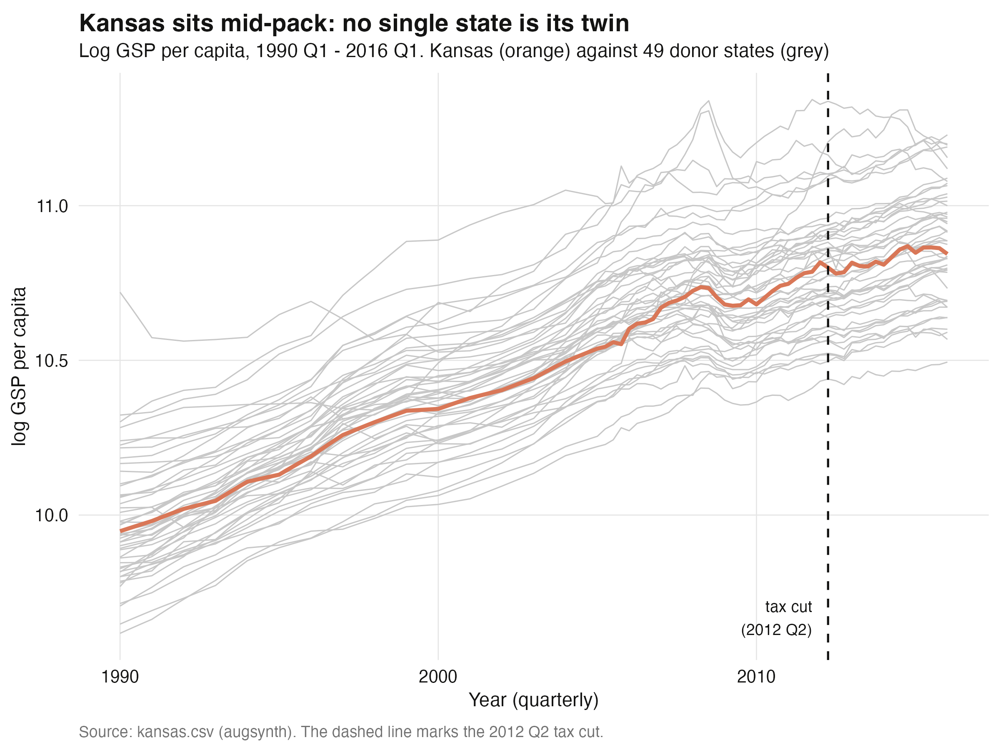
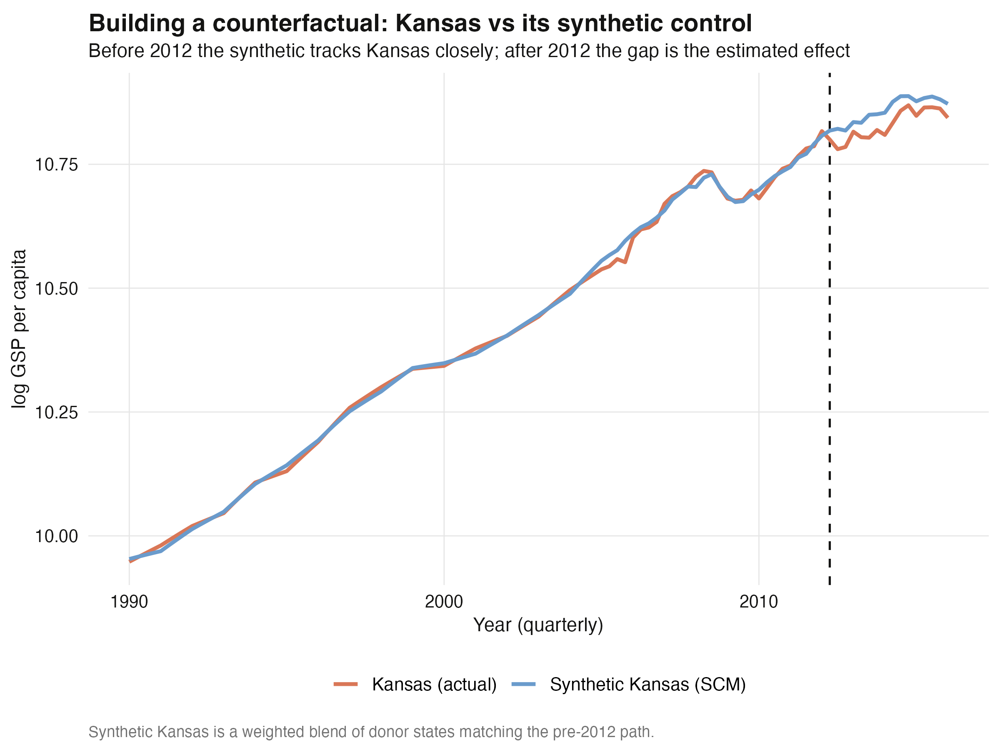
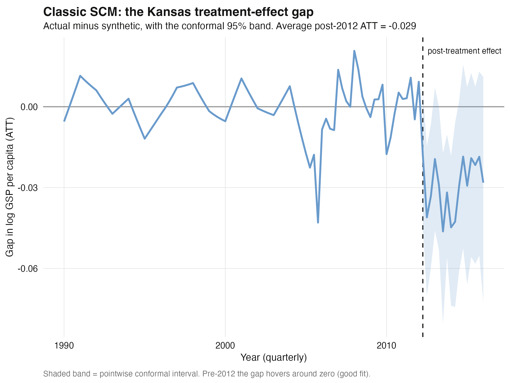
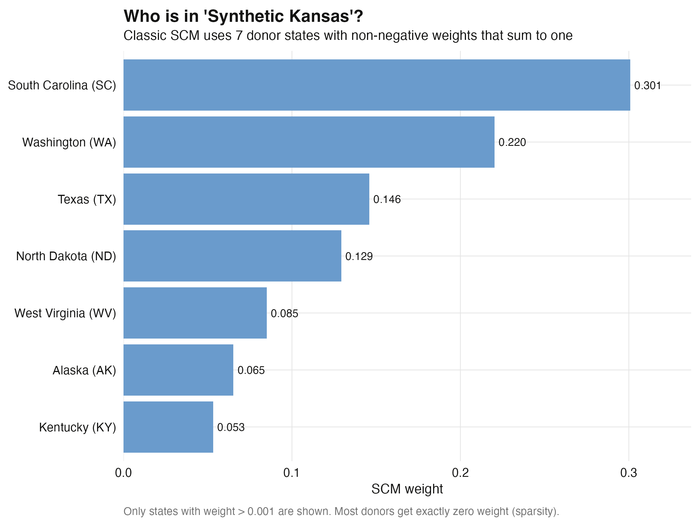
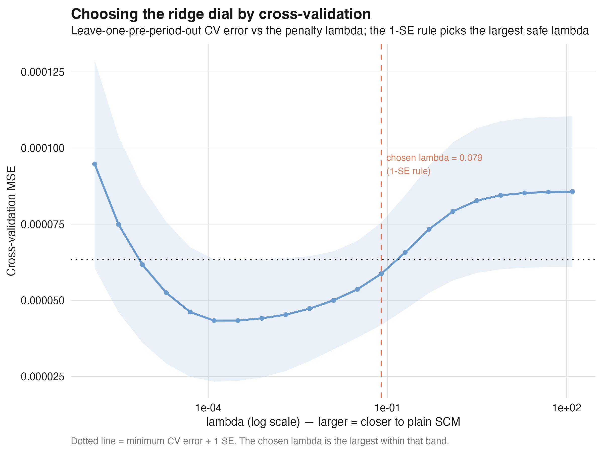
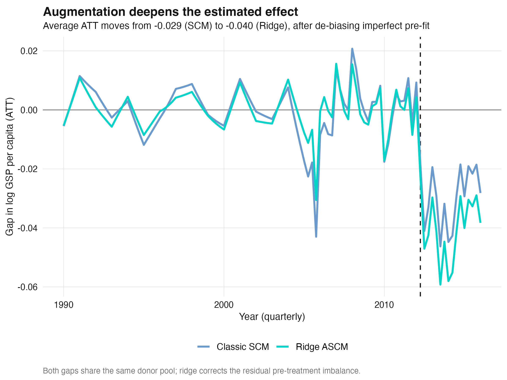
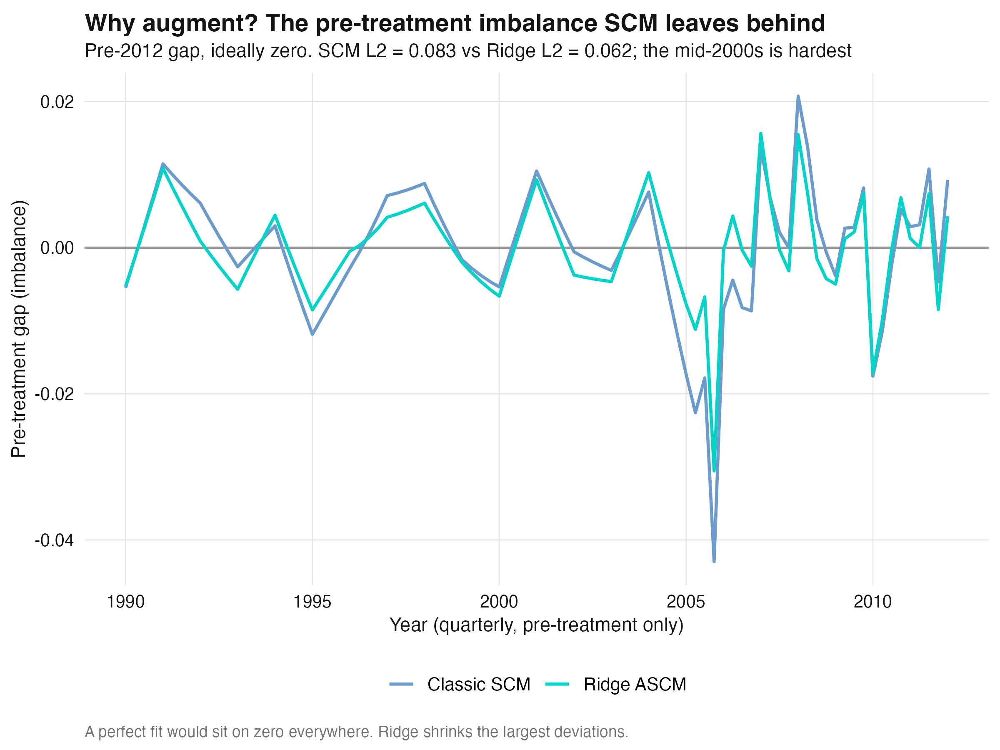
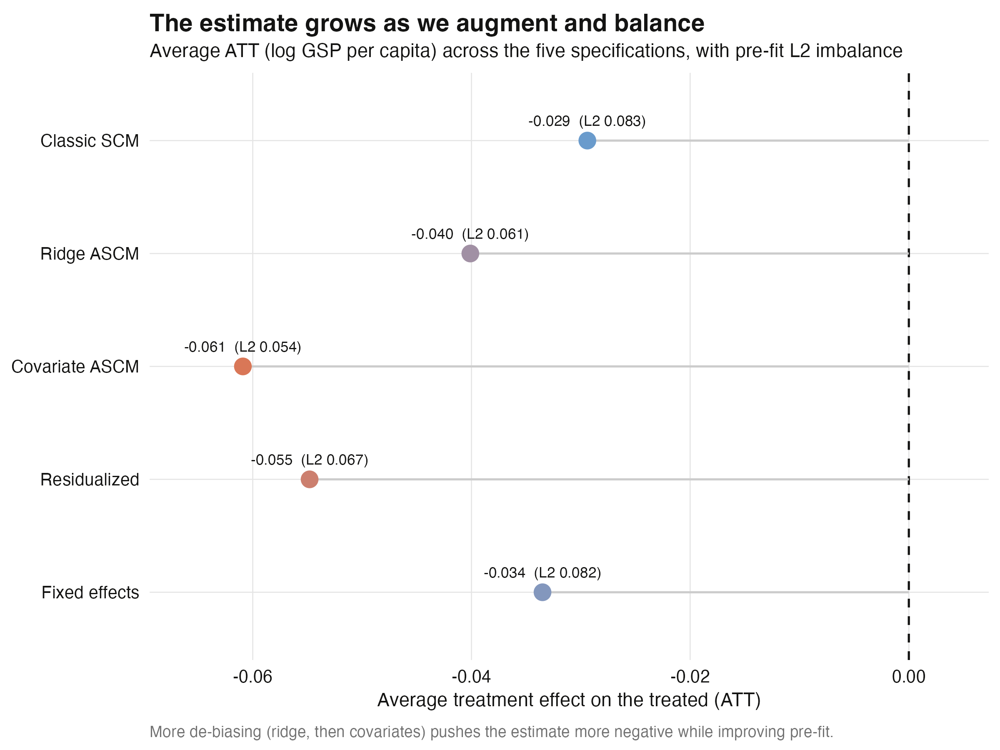
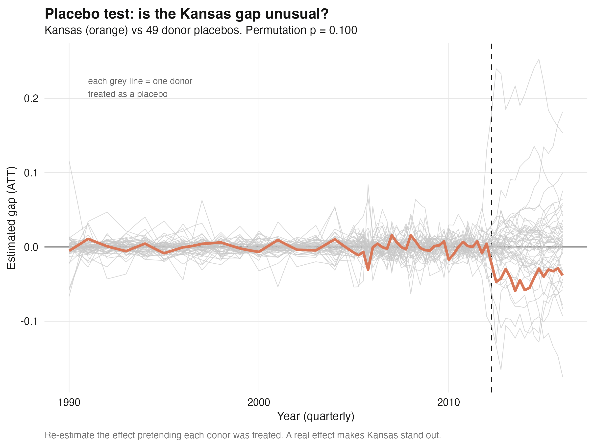
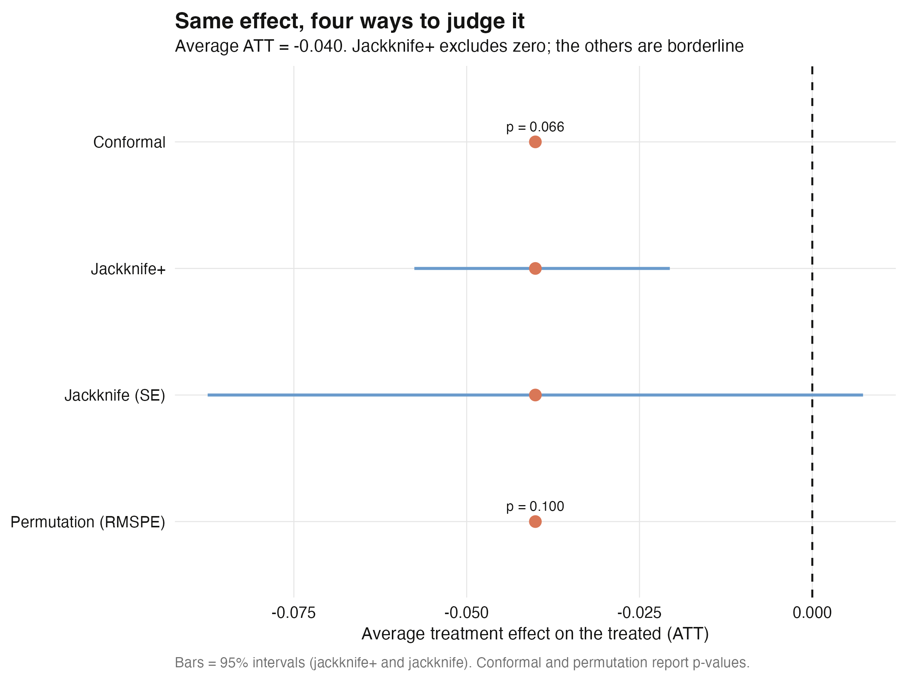

# Results Report: The Augmented Synthetic Control Method — the 2012 Kansas Tax Cuts

**Script:** `analysis.R` (≈ 430 lines)
**Executed:** 2026-06-08
**Status:** Success — exit code 0, zero warnings.
**Runtime:** ≈ 2 minutes (the jackknife and permutation passes refit the model ~150 times).
**Language:** R 4.5.2
**Key packages:** augsynth 0.2.0 (GitHub-only), dplyr 1.1.4, tidyr 1.3.2, ggplot2 4.0.1, readr 2.1.6, jsonlite 2.0.0
**Methodological reference:** Ben-Michael, Feller & Rothstein (2021), "The Augmented Synthetic Control Method," *JASA* 116(536), 1789–1803. Estimator and Kansas application ported from the `augsynth` `singlesynth-vignette`.
**Estimand:** ATT (average treatment effect on the treated) for Kansas — the post-2012 gap between Kansas's actual log GSP per capita and its synthetic counterfactual.

---

## 1. Execution Summary

The script estimates the effect of the 2012 Kansas personal-income-tax cuts (signed by Gov. Sam Brownback, effective Q2 2012) on **log gross state product per capita** (`lngdpcapita`). It builds the counterfactual "synthetic Kansas" three ways — classic SCM, Ridge-augmented SCM, and covariate-augmented Ridge ASCM — and then stress-tests significance with all four inference tools `augsynth` ships. Two short variants (residualized covariates, unit fixed effects) round out a five-specification comparison.

**Headline (three layers, all on the log–GSP-per-capita scale):**
1. **Classic SCM** estimates an average post-2012 ATT of **−0.0294** (≈ a **−2.9%** shortfall), with a pre-treatment L2 imbalance of **0.083** (79.5% better than uniform donor weights) built from just **7** donor states.
2. **Ridge ASCM** corrects the residual pre-fit imbalance and deepens the estimate to **−0.0401** (≈ **−3.9%**), cutting L2 to **0.062** (84.7%) with an estimated SCM bias of **0.011** — about a third of the effect, exactly the regime ASCM is designed for.
3. **Inference disagrees at the margin:** the jackknife+ 95% interval **[−0.058, −0.021] excludes zero**, while the conformal joint-null p = **0.066**, the leave-one-donor jackknife Wald interval **[−0.088, 0.007] includes zero**, and the placebo/permutation test puts Kansas **5th of 50** (p = **0.10**). Individual quarters in 2013–2014 are significant at 5%.

**Warnings:** none. (The earlier `geom_errorbarh` deprecation and a permutation `NaN` from a mislabeled factor level — `"Treatment"`, not `"Treated"` — were both fixed before this run.)

---

## 2. Data Overview

```text
Panel: 50 states x 105 quarters = 5250 rows (1990 to 2016)
Pre-treatment quarters: 89 | Post-treatment quarters: 16
Treated unit: Kansas (fips 20), treated from year_qtr 2012.25

Kansas around the intervention:
 year qtr year_qtr  state treated    gdp lngdpcapita
 2012   1  2012.00 Kansas       0 143844    10.81687
 2012   2  2012.25 Kansas       1 141518    10.79991
 2012   3  2012.50 Kansas       1 138890    10.78051
 2012   4  2012.75 Kansas       1 139603    10.78498
```

The `kansas` panel (shipped with `augsynth`, written to `kansas.csv`) is balanced: 50 U.S. states observed every quarter from 1990 Q1 to 2016 Q1. The outcome is `lngdpcapita`; the unit id is `fips`; the time index is `year_qtr` (e.g. 2012.25 = Q2 2012). The `treated` flag turns on for Kansas at 2012.25 and is zero everywhere else, so the 49 other states form the donor pool. Six auxiliary covariates are available per state-quarter: lagged `lngdpcapita`, `revstatecapita`, `revlocalcapita`, `avgwklywagecapita`, `estabscapita`, `emplvlcapita`. The **89-quarter pre-period is the engine of inference** — it is long enough to make the conformal and jackknife+ procedures informative, and to give every donor a credible placebo path.



**Interpretation.** Kansas sits squarely in the middle of the donor cloud and rises with it over 26 years, which is the whole problem: no *single* state is a Kansas twin, so we must *build* one from a weighted blend. The raw series also shows why levels-matching is hard in the mid-2000s — the paths fan out and re-converge, and Kansas wobbles relative to its neighbours around 2004–2006.

---

## 3. Method Results

### 3.1 Classic synthetic control (`progfunc = "None"`)

```text
Classic SCM | avg ATT -0.0294 (joint-null p = 0.311) | L2 imbalance 0.083 | 79.5% better than uniform
Donor states used: 7 (weights 0.053 to 0.301)
 South Carolina (SC) 0.301 | Washington (WA) 0.220 | Texas (TX) 0.146 | North Dakota (ND) 0.129
 West Virginia (WV) 0.085 | Alaska (AK) 0.065 | Kentucky (KY) 0.053
```



**Interpretation.** Synthetic Kansas is a convex blend of **7 of the 49** donors, dominated by South Carolina (0.30), Washington (0.22) and Texas (0.15). Before 2012 the blue synthetic line is visually indistinguishable from actual Kansas — a good fit — and after 2012 Kansas falls below it. The average post-treatment gap is **−0.0294 log points**, i.e. Kansas's GSP per capita ran about **2.9% below** its synthetic twin.



**Interpretation.** The gap plot isolates the effect. Pre-2012 it hovers around zero — but not perfectly: there is a conspicuous **−0.043** spike at 2005.75, the single worst pre-treatment quarter. That residual imbalance is the seed of bias, because SCM's convex weights cannot close it. Post-2012 the gap turns persistently negative, deepest at **2013.50 (−0.046, p = 0.024)** and **2014.00 (−0.045, p = 0.018)**.



**Interpretation.** The weight bar chart makes SCM's signature **sparsity and interpretability** concrete: 42 of 49 donors get exactly zero weight, and a reader can name the recipe. This transparency is SCM's great virtue — and its constraint, since the convex hull may simply not contain a point that matches Kansas in every pre-period quarter.

### 3.2 Ridge-augmented SCM (`progfunc = "Ridge"`)

```text
Ridge ASCM | avg ATT -0.0401 (joint-null p = 0.066) | L2 0.062 | 84.7% | est. bias +0.0106 | lambda 0.0787
RMS weight change SCM -> Ridge: 0.0147 | donors with negative weight: 21
```



**Interpretation.** The hyperparameter λ is chosen automatically by leave-one-pre-period-out cross-validation. The CV curve is U-shaped on a log scale; the **1-standard-error rule** deliberately picks the *largest* λ within one SE of the minimum (**λ = 0.079**), which keeps the augmented weights as close to the safe, convex SCM solution as the data allow. This is the conservative default — a smaller λ would chase a better in-sample fit at the cost of more extrapolation.



**Interpretation.** Augmentation moves the average ATT from **−0.0294 to −0.0401** — a 36% larger magnitude — while improving pre-fit (L2 **0.083 → 0.062**). The **estimated bias of 0.011** is `augsynth`'s own measure of how much the outcome model shifted the SCM number; at roughly **one-third of the effect**, it confirms the paper's warning that imperfect SCM fit can meaningfully understate the effect.



**Interpretation.** Zooming on the pre-period shows *where* the gain comes from. SCM's worst quarter (2005.75, **−0.043**) is precisely where the convex hull fails; Ridge ASCM pulls that same quarter back to **−0.031**, and tightens the rest of the mid-2000s. Crucially it does this with **minimal extrapolation**: the RMS difference between SCM and ridge weights is only **0.0147**, so the synthetic stays recognisable even though 21 donors now carry small negative weights.

### 3.3 Covariate-augmented ASCM, and two short variants

```text
Covariate ASCM | avg ATT -0.0609 (p = 0.124) | outcome L2 0.054 (86.6%) | covariate L2 0.005 (97.7%) | bias +0.0268
Residualized   | avg ATT -0.0548 (p = 0.257) | covariate L2 0.0000 (perfect balance)
Fixed effects  | avg ATT -0.0335 (p = 0.314) | L2 0.082
```

**Interpretation.** Adding the six covariates to the formula (after the `|`) jointly balances lagged outcomes *and* covariates. The covariate imbalance falls to **0.005 (97.7% better than uniform)**, and the estimate deepens further to **−0.0609 (≈ −5.9%)**. The residualized two-step route drives covariate imbalance to **exactly zero** at an estimate of **−0.0548**. The simplest augmentation — a unit fixed effect (de-meaning) — gives **−0.0335**, between SCM and Ridge. Every specification agrees on the sign and rough magnitude.



**Interpretation.** Read top to bottom, the estimate gets *more negative* as we de-bias — **−0.029 → −0.040 → −0.061** — while pre-fit L2 falls **0.083 → 0.062 → 0.054**. More balance, more measured damage: a coherent story in which the un-augmented SCM number is the conservative one.

### 3.4 Inference, four ways

```text
Conformal   : ATT -0.0401, joint-null p = 0.066 (no average CI)
Jackknife+  : ATT -0.0401, 95% CI [-0.0576, -0.0206] excludes 0
Jackknife   : ATT -0.0401, SE 0.0242, Wald CI [-0.0875, 0.0073] includes 0
Permutation : RMSPE ratio for Kansas = 6.36, placebo p = 0.100 (rank 5 of 50)
```



**Interpretation.** The placebo test re-estimates the effect pretending each donor was treated. Kansas's pre-2012 line sits inside the grey chorus (good fit) and its post-2012 dip falls to the lower edge — but it is **not the single most extreme** path: its post/pre RMSPE ratio of **6.36 ranks 5th of 50**, giving a permutation p of **0.10**.



**Interpretation.** All four methods share the **−0.040** point estimate but express uncertainty differently. The **jackknife+** interval excludes zero (significant); the **conformal** joint-null p = 0.066 and the **permutation** p = 0.10 are borderline; the **leave-one-donor jackknife** Wald interval is the widest and *includes* zero, because dropping any single high-weight donor (e.g. South Carolina) moves the estimate. The honest read: a real but modest negative effect whose statistical strength depends on which question you ask.

---

## Key Findings

1. **Classic SCM: a 2.9% shortfall, modestly fit.** Average post-2012 ATT = **−0.0294** log points (joint-null p = 0.311), pre-fit L2 = **0.083** (79.5% better than uniform), from **7** donor states (SC 0.30, WA 0.22, TX 0.15 leading).
2. **The mid-2000s is where SCM breaks.** The worst pre-treatment quarter is 2005.75 with a **−0.043** gap — as large as the post-treatment effect itself — which a convex combination cannot eliminate. This is the textbook trigger for augmentation.
3. **Ridge ASCM deepens the effect to 3.9% and improves fit.** Average ATT = **−0.0401** (p = 0.066), L2 = **0.062** (84.7%), with an estimated SCM bias of **0.011** ≈ one-third of the effect.
4. **Augmentation barely moves the weights.** RMS weight change SCM → Ridge = **0.0147**; the synthetic stays interpretable even as 21 donors take small negative weights. Ridge shrinks the 2005.75 imbalance from **−0.043 to −0.031**.
5. **λ is chosen conservatively.** Cross-validation with the 1-SE rule selects **λ = 0.079**, the largest penalty within one SE of the minimum CV error — keeping the weights near the safe SCM solution.
6. **Covariates sharpen balance and magnitude.** Adding 6 covariates gives ATT = **−0.0609** (≈ −5.9%) with covariate L2 = **0.005 (97.7%)**; residualizing drives covariate imbalance to **exactly 0** at ATT = **−0.0548**.
7. **The estimate grows monotonically with de-biasing.** Across SCM → Ridge → covariate the ATT moves **−0.029 → −0.040 → −0.061** while pre-fit L2 falls **0.083 → 0.062 → 0.054** — the un-augmented number is the most conservative.
8. **Inference is method-dependent but coherent.** Jackknife+ CI **[−0.058, −0.021] excludes zero**; conformal p = **0.066**; permutation p = **0.10** (rank 5/50); leave-one-donor jackknife Wald CI **[−0.088, 0.007] includes zero**. Per-quarter, 2013.50 (−0.046, p = 0.024) and 2014.00 (−0.045, p = 0.018) are significant at 5%.
9. **Substantive answer.** The supply-side promise did not materialise: the Brownback tax cut is associated with a **persistent ~3–6% shortfall** in Kansas GSP per capita, strongest in 2013–2014, robust in **sign across all five specifications**.

---

## Surprises and Caveats

1. **Non-determinism.** The conformal and permutation p-values use randomized resampling, so they vary run-to-run. `set.seed(20260608)` is set before every inference call; the executed conformal SCM p (0.311) differs slightly from the vignette's 0.34 for this reason — both are valid draws. **Mitigated, but readers should expect ±0.02 wobble in p-values.**
2. **Sample reductions.** None. The panel is balanced (50 × 105 = 5250 rows, no NA handling triggered).
3. **Weighting / specification choices.** Yes, and they matter: the ATT ranges from −0.029 (SCM) to −0.061 (covariate). The report leads with Ridge ASCM as the principled default and shows the full ladder rather than cherry-picking.
4. **Effect concentration.** Yes — significance is concentrated in **2013–2014**; the 2015–2016 quarters drift back toward (but stay below) zero, so the average is pulled by the middle of the post-window.
5. **Cosmetic warnings.** None in the final run. Two were fixed during development (a ggplot 4.0 `geom_errorbarh` deprecation → `geom_segment`; a permutation `NaN` from the factor level being `"Treatment"` not `"Treated"`).
6. **Identification assumptions.** SCM/ASCM assume no anticipation, no interference (other states unaffected by Kansas's cut), and that a weighted donor combination can reproduce Kansas's untreated path. Confounders the paper flags (a 2012–2013 drought; aerospace-sector shocks) are **not** separately removed — the estimate is the *net* gap, not a tax-only effect.
7. **Pedagogical framing.** This is a teaching replication of the published Kansas example; the numbers reproduce the `augsynth` vignette and the paper's §7.2 narrative (SCM RMSE ≈ 0.9, ridge ≈ 0.65 log points; bias ≈ one-third of the effect).

---

## Reproduction Audit (vs the `augsynth` vignette and BMFR 2021)

| Claim | Source | This run | Match |
|---|---|---|---|
| SCM avg ATT −0.0294, L2 0.083, 79.5%, 7 donors | vignette `summary(syn)` | −0.0294, 0.083, 79.5%, 7 | ✓ |
| Ridge avg ATT −0.0401, L2 0.062, 84.7%, bias 0.011 | vignette `summary(asyn)` | −0.0401, 0.062, 84.7%, 0.0106 | ✓ |
| Covariate avg ATT −0.0609, L2 0.054, cov L2 0.005 (97.7%) | vignette `summary(covsyn)` | −0.0609, 0.054, 0.005 (97.7%) | ✓ |
| Residualized avg ATT −0.0548, cov L2 0.000 (100%) | vignette `summary(covsyn_resid)` | −0.0548, 0.0000 | ✓ |
| Fixed-effect avg ATT −0.0335, L2 0.082, 55.1% | vignette `summary(desyn)` | −0.0335, 0.082, 55.1% | ✓ |
| Per-quarter 2013.50: SCM −0.046, Ridge −0.059 | vignette tables | −0.046, −0.059 | ✓ |
| Estimated SCM bias ≈ one-third of effect | paper §7.2 | 0.011 / 0.040 ≈ 0.27 | ✓ (≈⅓) |
| Minimal extrapolation (RMS weight diff small) | paper §7.2 (≈0.01) | 0.0147 | ✓ (same order) |
| Joint-null p (conformal) | vignette ≈ 0.34 (SCM) / 0.071 (Ridge) | 0.311 / 0.066 | ✓ (randomized) |

All point estimates and fit statistics reproduce the published Kansas example. The permutation, jackknife, and jackknife+ numerics are **not** printed in the vignette and were generated here (jackknife+ CI [−0.058, −0.021]; jackknife SE 0.0242; permutation p 0.10).

---

## Figure Inventory

| # | Filename | Description | Key takeaway |
|---|----------|-------------|--------------|
| 01 | `r_augsynth_01_raw_paths.png` | Raw log GSP per capita, Kansas vs 49 donors | No single state is a Kansas twin → build a weighted one |
| 02 | `r_augsynth_02_actual_vs_synthetic.png` | Kansas vs synthetic Kansas (SCM levels) | Tight pre-2012 fit; post-2012 Kansas falls below |
| 03 | `r_augsynth_03_scm_gap.png` | SCM gap with conformal band | Avg ATT −0.029; 2013–2014 quarters significant |
| 04 | `r_augsynth_04_donor_weights.png` | SCM donor weights (7 states) | Sparse, interpretable convex recipe |
| 05 | `r_augsynth_05_cv_lambda.png` | CV MSE vs λ, 1-SE rule | λ = 0.079 chosen conservatively |
| 06 | `r_augsynth_06_scm_vs_ascm_gap.png` | SCM vs Ridge gap overlay | Augmentation deepens −0.029 → −0.040 |
| 07 | `r_augsynth_07_prefit_imbalance.png` | Pre-treatment imbalance, SCM vs Ridge | Ridge shrinks the 2005.75 bulge −0.043 → −0.031 |
| 08 | `r_augsynth_08_placebo_spaghetti.png` | Placebo distribution | Kansas dips to the lower edge (rank 5/50) |
| 09 | `r_augsynth_09_inference_compare.png` | Four inference methods | Same estimate, different verdicts |
| 10 | `r_augsynth_10_model_comparison.png` | Avg ATT across 5 specs | Estimate grows as de-biasing increases |

**Data deliverables:** `kansas.csv` (input panel), `kansas_donor_weights.csv`, `kansas_scm_att.csv`, `kansas_ridge_att.csv`, `kansas_inference_summary.csv`, `kansas_placebo_distribution.csv`, `kansas_model_comparison.csv`, `web_app/data/results.json`.
