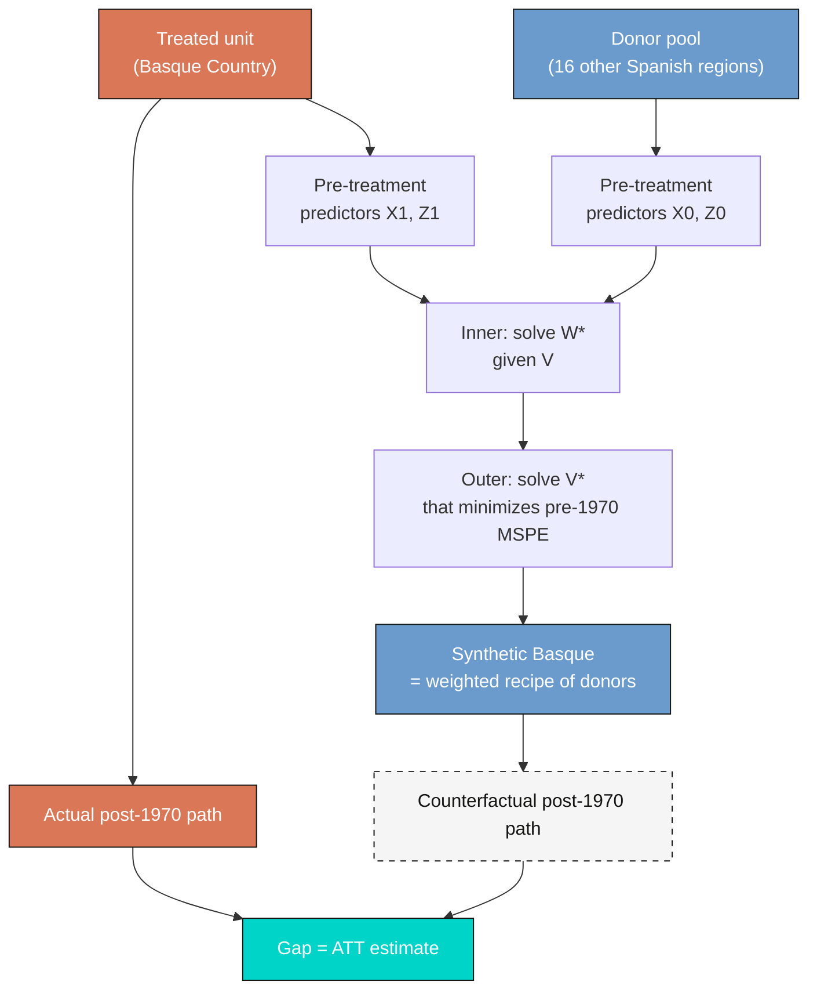

---
authors:
  - admin
categories:
  - R
  - Causal Inference
  - Tutorial
  - Synthetic Control
draft: false
featured: false
date: "2026-04-28T00:00:00Z"
external_link: ""
image:
  caption: ""
  focal_point: Smart
  placement: 3
links:
- icon: code
  icon_pack: fas
  name: "R script"
  url: analysis.R
- icon: open-data
  icon_pack: ai
  name: "[R] Google Colab"
  url: https://colab.research.google.com/drive/11LC9x24l4nczS_zR81SJ2LgCkpVALk1E?usp=sharing
- icon: open-data
  icon_pack: ai
  name: "R note"
  url: https://carlos-mendez.quarto.pub/r-synthetic-control-tutorial/
- icon: markdown
  icon_pack: fab
  name: "MD version"
  url: https://raw.githubusercontent.com/cmg777/starter-academic-v501/master/content/post/r_basic_synthetic_control/index.md
slides:
summary: A beginner-friendly tutorial on the synthetic control method in R, using the Basque Country case study to estimate the economic cost of conflict on regional GDP per capita from 1970 to 1997.
tags:
- r
- causal
- causal inference
title: "Basic Synthetic Control with R: The Basque Country Case Study"
url_code: ""
url_pdf: ""
url_slides: ""
url_video: ""
toc: true
diagram: true
---

## 1. Overview

What was the economic cost of the conflict in the Basque Country? This is the question Abadie and Gardeazabal (2003) set out to answer in their study of the Basque region of Spain, which experienced sustained terrorist activity beginning in 1970. The challenge for any researcher trying to answer such questions is that we never observe the *counterfactual* --- the GDP path the Basque Country would have followed had terrorism never started. We only see the world that did happen, not the world that did not.

The **synthetic control method** addresses this problem by building a credible counterfactual from the data we do have. The idea is intuitive: among other Spanish regions, find the *weighted recipe* whose pre-1970 economy looks indistinguishable from the Basque Country's, and use this synthetic Basque as a stand-in for the absent counterfactual. If the pre-treatment match is good, then the post-1970 gap between actual and synthetic Basque is the most plausible estimate of the economic damage caused by the conflict.

This tutorial is a beginner-friendly walkthrough of the basic synthetic control workflow using the `Synth` package in R, applied to the Basque dataset that ships with the package. We frame the analysis as a **causal inference** problem (estimand: ATT), build the synthetic Basque step by step, and then stress-test the result with two falsification exercises: a Catalonia placebo and an in-space placebo across all 17 regions. The methodology follows Abadie, Diamond, and Hainmueller (2011) and uses real numbers from a fully-executed R script (linked above).

**Learning objectives:**

- Understand why the single-treated-unit problem rules out classical difference-in-differences and motivates synthetic control
- Implement the four-matrix data preparation ($X\_1$, $X\_0$, $Z\_1$, $Z\_0$) using `dataprep()` from the `Synth` package
- Estimate the donor weights $W$ and predictor weights $V$ using `synth()` and interpret the resulting predictor balance
- Compute the headline ATT and visualize the GDP gap between actual and synthetic Basque
- Conduct two falsification exercises (a single-unit Catalonia placebo and a full in-space placebo) and report the trimmed MSPE-ratio rank

The diagram below summarizes the synthetic control pipeline at a glance.



In words: the algorithm has two nested optimization problems. The inner problem finds the donor weights $W$ that best match the treated unit's pre-treatment predictors. The outer problem finds the predictor weights $V$ that, when fed back into the inner problem, produce the lowest pre-treatment outcome error. The dashed-border node represents the unobserved counterfactual --- the GDP path the Basque Country would have followed without conflict, which we estimate but never actually see. The result is a synthetic counterfactual whose pre-period fits the data tightly, so any post-period divergence is informative about the treatment.

### Key concepts at a glance

The post leans on a small vocabulary repeatedly. The rest of the tutorial assumes you can move between these terms quickly. Each concept below has three parts. The **definition** is always visible. The **example** and **analogy** sit behind clickable cards: open them when you need them, leave them collapsed for a quick scan. If a later section mentions "donor weights" or "placebo falsification" and the term feels slippery, this is the section to re-read.

**1. Synthetic control method.**
A weighted average of donor (untreated) units, designed to reproduce the treated unit's pre-treatment characteristics. The post-treatment trajectory of the synthetic counterfactual is the missing potential outcome. Originated by Abadie and Gardeazabal (2003).

<div class="concept-pair">
<details class="concept-card concept-example">
<summary>Example</summary>

We construct a "Synthetic Basque" from a weighted combination of the 16 other Spanish regions. The weights are picked so that pre-1970 `gdpcap` and the 13 predictors match the real Basque Country as closely as possible. After 1970, the synthetic continues without conflict; the gap to the real Basque Country is the ATT.

</details>

<details class="concept-card concept-analogy">
<summary>Analogy</summary>

Building a sock-puppet twin. We assemble a stand-in for the treated unit out of pieces of the donor units. The stand-in's pre-treatment behaviour mimics the treated unit's. After treatment, the stand-in tells us what would have happened.

</details>
</div>

**2. Donor pool.**
The set of untreated units from which the synthetic control is built. Must include units that did not experience the treatment and are otherwise comparable. Excludes the treated unit and any spillover-affected unit.

<div class="concept-pair">
<details class="concept-card concept-example">
<summary>Example</summary>

This study's donor pool is 16 Spanish regions excluding the Basque Country. The pool intentionally drops Madrid and Catalonia from some specifications to test sensitivity, but the headline analysis includes both.

</details>

<details class="concept-card concept-analogy">
<summary>Analogy</summary>

The casting list for an audition. The role goes to a weighted blend of candidates. The casting director draws only from people who do not have the trait being studied --- they have to play the *counterfactual*.

</details>
</div>

**3. Donor weights** $W$ (convex combination).
Non-negative weights that sum to 1, picking how much of each donor enters the synthetic. Found by inner-loop optimization: minimize the weighted distance between the treated unit's predictor vector and the donor units' predictor vectors.

<div class="concept-pair">
<details class="concept-card concept-example">
<summary>Example</summary>

The optimal weights for Synthetic Basque are dominated by Catalonia (0.851) and Madrid (0.149). All other regions get weight zero. The synthetic is essentially "85% Catalonia + 15% Madrid."

</details>

<details class="concept-card concept-analogy">
<summary>Analogy</summary>

Recipe proportions. To bake a synthetic Basque you need 85% Catalonia flour and 15% Madrid sugar. No other ingredients matter. The proportions add to 100%.

</details>
</div>

**4. Predictor weights** $V$.
A diagonal matrix of weights on the predictor variables. Lets some predictors matter more than others when the algorithm picks $W$. Found by outer-loop optimization: minimize pre-treatment outcome error after the inner-loop $W$ is computed.

<div class="concept-pair">
<details class="concept-card concept-example">
<summary>Example</summary>

This implementation lets `Synth` pick $V$ via cross-validation on pre-1970 GDP. The result is a low pre-treatment fit value of 0.0089 --- the Synthetic Basque tracks the real Basque pre-treatment GDP almost perfectly.

</details>

<details class="concept-card concept-analogy">
<summary>Analogy</summary>

Which ingredients matter. Two cooks can pick the same recipe proportions but disagree on which ingredients are critical. $V$ tells the algorithm "match the saffron exactly; the salt can be approximate."

</details>
</div>

**5. Pre-treatment fit / MSPE.**
Mean Squared Prediction Error of the synthetic on the pre-treatment outcomes. Low MSPE means the synthetic mimics the treated unit closely *before* treatment, which is necessary for the post-treatment gap to be interpreted as causal.

<div class="concept-pair">
<details class="concept-card concept-example">
<summary>Example</summary>

The Synthetic Basque has a pre-1970 MSPE of essentially zero on `gdpcap`. The Catalonia placebo has a pre-1970 MSPE of 0.006043 --- small but not perfect. The placebo gets a much larger post-1970 MSPE (0.391), which is precisely how the placebo test works.

</details>

<details class="concept-card concept-analogy">
<summary>Analogy</summary>

How convincing the sock puppet is *before* the moment of divergence. If puppet and original do the same gestures pre-treatment, the audience trusts the divergence post-treatment. If the puppet is already off-model pre-treatment, the divergence proves nothing.

</details>
</div>

**6. ATT (gap)** $\widehat{\mathrm{ATT}}\_t = Y\_{1t} - \hat{Y}\_{1t}^N$.
The post-treatment difference between the treated unit's actual outcome and its synthetic counterfactual. The headline causal estimate. Reported either year-by-year or averaged over a horizon.

<div class="concept-pair">
<details class="concept-card concept-example">
<summary>Example</summary>

The 1970–1997 average ATT for the Basque Country is -0.580 thousand USD per capita. The largest single-year gap is -1.036 thousand USD in 1989. Conflict cost the Basque Country roughly \\$580 per capita per year on average over the post-treatment horizon.

</details>

<details class="concept-card concept-analogy">
<summary>Analogy</summary>

The moment the puppet breaks character. Pre-treatment, puppet and original move identically. Post-treatment, the puppet keeps following the script of "no conflict" while the original veers off. The gap *is* the divergence.

</details>
</div>

**7. Placebo / falsification.**
Run the synthetic control on a unit that did *not* experience the treatment. If the placebo unit produces a post-period gap as large as the treated unit's, the original gap was probably noise. Pseudo p-values count placebos with larger gaps.

<div class="concept-pair">
<details class="concept-card concept-example">
<summary>Example</summary>

Running the algorithm on Catalonia (a never-treated donor) gives a post-1970 MSPE of 0.391 --- much smaller than the Basque Country's gap. The trimmed placebo rank places the Basque Country at 2nd of 8 in gap magnitude (pseudo p = 0.250). The result is suggestive but not extreme.

</details>

<details class="concept-card concept-analogy">
<summary>Analogy</summary>

Does the trick work on people who weren't actually treated? If your "miracle drug" cures fake patients too, the cure was placebo. The synthetic placebo test runs the same algorithm on a region that never had conflict to see whether the gap appears spuriously.

</details>
</div>

## 2. Setup

```r
# Install packages if needed
required_packages <- c("Synth", "tidyverse", "kernlab", "optimx", "readr")
missing <- required_packages[
  !sapply(required_packages, requireNamespace, quietly = TRUE)
]
if (length(missing) > 0) {
  install.packages(missing, repos = "https://cloud.r-project.org")
}

suppressPackageStartupMessages({
  library(Synth)
  library(tidyverse)
})
set.seed(42)

# Site color palette (used by theme_site() and figure code in analysis.R)
STEEL_BLUE  <- "#6a9bcc"
WARM_ORANGE <- "#d97757"
NEAR_BLACK  <- "#141413"
LIGHT_GREY  <- "gray80"
```

The `Synth` package provides the core estimator and the bundled Basque dataset; `tidyverse` is used for data wrangling and plotting; `kernlab` and `optimx` are dependencies that `synth()` calls under the hood. We seed the random number generator for reproducibility, although the BFGS optimization used here is deterministic given the same inputs.

## 3. Data Loading and Exploration

The `basque` panel ships with the `Synth` package and contains annual observations from 1955 to 1997 for 18 regional units. Region 1 is the Spanish national aggregate, which we drop; regions 2 through 18 are the 17 Spanish autonomous communities. Region 17 is the Basque Country (`Pais Vasco`), the treated unit, with terrorism onset dated to 1970.

```r
data("basque")
basque_tbl <- as_tibble(basque)

cat("Panel shape:", nrow(basque_tbl), "rows ×", ncol(basque_tbl), "cols\n")
cat("Years:      ", min(basque_tbl$year), "to", max(basque_tbl$year), "\n")
cat("Regions:    ", n_distinct(basque_tbl$regionno), "\n")
```

```text
Panel shape: 774 rows × 17 cols
Years:       1955 to 1997 
Regions:     18 (region 1 = Spain national, dropped from analysis)
```

The dataset has 774 rows (18 regions $\times$ 43 years) and 17 columns: the unit identifiers (`regionno`, `regionname`), the time variable (`year`), the outcome (`gdpcap`, real GDP per capita in 1986 thousands USD), six sectoral production shares prefixed `sec.`, five education levels prefixed `school.`, an investment-to-GDP ratio (`invest`), and a 1969 population density (`popdens`). These 13 covariates are the predictors that will be matched.

```r
basque_only <- basque_tbl %>% filter(regionno == 17)
print(head(basque_only %>% select(year, regionname, gdpcap), 3))
print(tail(basque_only %>% select(year, regionname, gdpcap), 3))
```

```text
   year regionname                  gdpcap
  <dbl> <chr>                        <dbl>
1  1955 Basque Country (Pais Vasco)   3.85
2  1956 Basque Country (Pais Vasco)   3.95
3  1957 Basque Country (Pais Vasco)   4.03
   year regionname                  gdpcap
1  1995 Basque Country (Pais Vasco)   9.44
1  1996 Basque Country (Pais Vasco)   9.69
1  1997 Basque Country (Pais Vasco)  10.2 
```

Basque GDP per capita rose from 3.85 thousand USD in 1955 to 10.2 thousand in 1997 --- roughly a 2.6-fold increase over 43 years. The case-study question is not whether the Basque economy grew (it did) but whether it grew *as much as it would have* without terrorism. Comparing pre-1955 to post-1997 levels cannot answer this, because Spain as a whole was experiencing rapid catch-up growth over the same period. We need a credible counterfactual of the *Basque path* in particular, and that is what synthetic control will provide.

The first thing to look at is the raw GDP path of every region. If the Basque Country was already an economic outlier before 1970, the assumption that we can match it with a weighted average of other regions becomes harder to defend.

```r
all_regions <- basque_tbl %>%
  filter(regionno != 1) %>%
  mutate(is_basque = regionno == 17)

p1 <- ggplot(all_regions, aes(year, gdpcap, group = regionname,
                              color = is_basque, alpha = is_basque,
                              linewidth = is_basque)) +
  geom_line() +
  geom_vline(xintercept = 1970, linetype = "dashed", color = NEAR_BLACK) +
  scale_color_manual(values = c(`TRUE` = WARM_ORANGE, `FALSE` = LIGHT_GREY))
ggsave("r_basic_synthetic_control_01_raw_gdp_paths.png", p1,
       width = 8, height = 6, dpi = 300, bg = "white")
```


Looking at the raw paths, the Basque Country (orange) is among the *richest* Spanish regions throughout the entire 1955--1997 window --- typically at or near the top of the distribution. This matters: a weighted average of poorer-than-Basque regions cannot reproduce the Basque level, so the donor weights will need to load heavily on the small subset of regions whose pre-1970 economies were comparably wealthy and industrial. We will see in Section 6 that the optimization indeed selects exactly two such regions: Catalonia and Madrid.

## 4. The Synthetic Control Framework

### 4.1 Estimand and identifying assumption

We are interested in the **Average Treatment effect on the Treated (ATT)** --- the year-by-year GDP-per-capita gap that the Basque Country experienced *because* of terrorism, relative to the path it would have followed in a counterfactual world without terrorism. Letting $Y\_{1t}$ denote the actual Basque outcome at time $t$ and $Y\_{1t}^{N}$ the (unobserved) counterfactual outcome in the absence of treatment, the per-period ATT is:

$$\alpha\_{1t} = Y\_{1t} - Y\_{1t}^{N}, \quad t \geq 1970$$

In words, this says the treatment effect at time $t$ is the difference between the realized Basque GDP and the GDP the Basque would have had under the no-conflict counterfactual. The fundamental problem is that $Y\_{1t}^{N}$ is never observed; the synthetic control method estimates it as a weighted average of donor outcomes.

The identifying assumption is that there exists a non-negative weight vector $W = (w\_2, \ldots, w\_{18})'$ summing to one such that the *pre-treatment* observable predictors of the synthetic control match those of the treated unit. If this match holds, and if the data-generating process has the structure assumed by Abadie et al. (factor-model errors with absorbing pre-treatment fit), then the synthetic outcome path is also a good match for the unobserved counterfactual *post-treatment* path. The estimator is:

$$\hat{\alpha}\_{1t} = Y\_{1t} - \sum\_{j = 2}^{18} w\_j^{*} \\, Y\_{jt}, \quad t \geq 1970$$

In words, this says the estimated ATT at time $t$ is the gap between actual Basque GDP and the weighted sum of donor-region GDPs, where the weights $w\_j^{*}$ are chosen to fit the pre-treatment data. In code, $Y\_{1t}$ corresponds to `dataprep_out$Y1plot`, the donor outcomes are in `dataprep_out$Y0plot`, and the weights are in `synth_out$solution.w`.

### 4.2 The W and V optimization

The donor weights $W$ are chosen to minimize the weighted distance between treated and synthetic predictors:

$$W^{*}(V) = \arg\min\_{W \in \mathcal{W}} \\, \lVert X\_{1} - X\_{0} W \rVert\_{V} = \sqrt{(X\_{1} - X\_{0} W)' V (X\_{1} - X\_{0} W)}$$

In words, this says: pick the recipe $W$ that makes the synthetic predictor profile $X\_0 W$ as close as possible to the treated predictor profile $X\_1$, where "close" is measured in a weighted Euclidean norm whose weights are the diagonal entries of $V$. The set $\mathcal{W}$ restricts $W$ to be non-negative and sum to one.

But what is $V$? Not all predictors are equally informative for predicting the outcome. The matrix $V$ acts as a set of *importance dials* on each predictor. The outer optimization chooses $V$ to make the *pre-treatment outcome path* of the synthetic match the treated as closely as possible:

$$V^{*} = \arg\min\_{V \in \mathcal{V}} \\, (Z\_{1} - Z\_{0} W^{*}(V))' (Z\_{1} - Z\_{0} W^{*}(V))$$

In words, $Z\_1$ and $Z\_0$ contain the *outcome values* (annual GDP per capita) over the pre-treatment window 1960--1969. The outer problem says: among all valid $V$ matrices, pick the one whose induced $W^{*}(V)$ produces the lowest mean squared prediction error (MSPE) on the pre-treatment outcomes. This is a nested optimization: every candidate $V$ requires solving the inner $W$ problem first. The `synth()` function uses the BFGS quasi-Newton algorithm for the outer search and a constrained quadratic program (from `kernlab`) for the inner search.

## 5. Building the Synthetic Basque

### 5.1 Preparing the data

The `dataprep()` function packages the panel into the four matrices the optimizer needs: $X\_1$ (predictor values for the treated unit, $13 \times 1$), $X\_0$ (predictor values for each control unit, $13 \times 16$), $Z\_1$ (pre-treatment outcomes for the treated unit, $10 \times 1$ over 1960--1969), and $Z\_0$ (pre-treatment outcomes for each control, $10 \times 16$). The original Abadie and Gardeazabal (2003) study collapses the highest two education levels into one and converts the four education variables into within-region percentage shares; we encapsulate all of this in a single helper `prepare_basque()` that takes the treated unit ID and donor pool as arguments. The full helper is in `analysis.R`; here we show only the call:

```r
basque_dp <- prepare_basque(treated_id  = 17,
                            control_ids = c(2:16, 18))
```

The donor pool is all 16 autonomous communities except the Basque Country itself (region 17) and the national aggregate (region 1). Parameterizing the helper this way makes the falsification exercises in Sections 8 and 9 trivial: we just call `prepare_basque()` with a different `treated_id`.

### 5.2 Solving for the weights

With the matrices in place, `synth()` runs the nested optimization. Because the optimizer is verbose, we wrap the call in `capture.output()` to keep the log clean:

```r
run_synth_quiet <- function(dp) {
  out <- NULL
  invisible(capture.output(
    out <- synth(data.prep.obj = dp, optimxmethod = "BFGS", verbose = FALSE)
  ))
  out
}

basque_synth <- run_synth_quiet(basque_dp)

cat("W weights sum to:        ", round(sum(basque_synth$solution.w), 4), "\n")
cat("Active donors (w > 0.01):", sum(basque_synth$solution.w > 0.01), "\n")
cat("Pre-treatment loss V:    ", basque_synth$loss.v, "\n")
cat("Pre-treatment loss W:    ", basque_synth$loss.w, "\n")
```

```text
W weights sum to:         1 
Active donors (w > 0.01): 2 
Pre-treatment loss V:     0.0088646 
Pre-treatment loss W:     0.2467
```

Three numbers tell the story. First, the W weights sum to exactly 1, confirming that the optimizer respected the convexity constraint. Second, only **2 of the 16 donor regions** received a non-trivial weight --- the synthetic Basque is built almost entirely from a sparse subset of the donor pool. This kind of sparse solution is typical of synthetic control when only a few donors closely resemble the treated unit; the rest get weighted to zero. Third, the pre-treatment loss measured in the $V$ metric is 0.0089 and in the $W$ metric (the pre-1970 outcome MSPE) is 0.2467 --- both small, indicating a tight pre-treatment fit. We will visualize this fit in Section 7.

## 6. Predictor Balance and Donor Weights

The next question is *who* the synthetic Basque is made of, and *how well* it matches the treated unit on each predictor. The `synth.tab()` function builds tidy summary tables.

```r
basque_tabs <- synth.tab(dataprep.res = basque_dp, synth.res = basque_synth)
pb <- basque_tabs$tab.pred
predictor_balance <- tibble(
  predictor   = rownames(pb),
  treated     = as.numeric(pb[, 1]),
  synthetic   = as.numeric(pb[, 2]),
  sample_mean = as.numeric(pb[, 3])
)
print(predictor_balance, n = Inf)
```

```text
   predictor                               treated synthetic sample_mean
 1 school.illit                               3.32      7.64       11.0 
 2 school.prim                               85.9      82.3        80.9 
 3 school.med                                 7.52      6.96        5.43
 4 school.high                                3.26      3.10        2.68
 5 invest                                    24.6      21.6        21.4 
 6 special.gdpcap.1960.1969                   5.28      5.27        3.58
 7 special.sec.agriculture.1961.1969          6.84      6.18       21.4 
 8 special.sec.energy.1961.1969               4.11      2.76        5.31
 9 special.sec.industry.1961.1969            45.1      37.6        22.4 
10 special.sec.construction.1961.1969         6.15      6.95        7.28
11 special.sec.services.venta.1961.1969      33.8      41.1        36.5 
12 special.sec.services.nonventa.1961.1969    4.07      5.37        7.11
13 special.popdens.1969                     247.       196.         99.4 
```

The balance table compares three columns: the treated Basque values, the synthetic Basque values, and the simple average across all 16 donor regions. The synthetic match is excellent on the most outcome-relevant predictors --- pre-treatment GDP per capita (treated 5.28 vs synthetic 5.27, against a sample mean of just 3.58) and the four education shares are all within a few percentage points. The match is also good on industrial structure: industry share treated 45.1% vs synthetic 37.6% (sample mean 22.4%), and agriculture treated 6.84% vs synthetic 6.18% (sample mean 21.4%, a very different number from Basque). The optimizer correctly identified that Basque is an *industrial, low-agriculture* region and downweighted donor regions whose economies were dominated by farming. Population density at the time of treatment (treated 247, synthetic 196, sample mean 99) shows the largest residual gap, but density is a static control rather than an outcome predictor and contributes less to fit.

```r
donor_weights <- tibble(
  region = as.character(basque_tabs$tab.w$unit.names),
  weight = as.numeric(as.character(basque_tabs$tab.w$w.weights))
) %>% arrange(desc(weight))
print(head(donor_weights, 5))
```

```text
  region                 weight
1 Cataluna                0.851
2 Madrid (Comunidad De)   0.149
3 Andalucia               0    
4 Aragon                  0    
5 Principado De Asturias  0
```

The synthetic Basque is **85.1% Catalonia and 14.9% Madrid**; every other donor region receives zero weight. This is intuitive: Catalonia and Madrid are the only two Spanish regions whose pre-1970 economies were comparably industrial, urban, and wealthy. A reader unfamiliar with Spanish regional economics now has a one-line summary: *Basque ~ 85% Catalonia + 15% Madrid*. This sparse, interpretable solution is one of the appeals of synthetic control over black-box machine-learning approaches to counterfactual prediction. (The bundled dataset stores the region as `Cataluna` without the tilde, which is why the code output above shows that spelling.)

## 7. The Gap: Actual vs Synthetic Basque

Now we visualize the central object of the analysis: the actual Basque GDP path against its synthetic counterfactual. The two should track each other closely from 1955 through 1969 (the pre-treatment window) and then diverge after 1970 if terrorism caused real economic damage.

```r
year_seq         <- 1955:1997
basque_actual    <- as.numeric(basque_dp$Y1plot)
basque_synthetic <- as.numeric(basque_dp$Y0plot %*% basque_synth$solution.w)
gap_series <- tibble(
  year          = year_seq,
  actual_gdp    = basque_actual,
  synthetic_gdp = basque_synthetic,
  gap           = basque_actual - basque_synthetic
)
```

The arithmetic is direct: `Y0plot %*% solution.w` is the matrix-vector product that mixes the donor outcomes by their weights. The gap series is then the year-by-year difference. The plot below shows the two paths together.


Pre-1970, the two lines are nearly indistinguishable --- the synthetic Basque tracks the actual within fractions of a thousand USD. Both paths grow from about 3.8 to 6.2 thousand 1986 USD over the 15 pre-treatment years. Starting around 1972, however, the lines begin to diverge: the synthetic Basque continues climbing toward 11 thousand by 1997, while the actual Basque stalls during the 1980s and only recovers to 10.2 thousand by 1997. The widening orange-versus-blue gap is the visual signature of the conflict's economic cost.

The gap series itself makes the divergence quantitative.


The gap is essentially zero from 1955 to 1970 --- another way of seeing that the pre-treatment fit is good. After 1970 the gap turns negative and reaches its largest deficit of **−1.036 thousand USD per capita in 1989**, before partially recovering. Averaging the gap from 1970 onward gives the headline causal estimate: the **ATT is −0.580 thousand 1986 USD per capita** over 1970--1997. To put this in context, average Basque GDP per capita over the same window was about 7 thousand USD, so the cumulative loss represents roughly **8% of the counterfactual income** the region would have generated.

## 8. Falsification with the Catalonia Placebo

A natural worry with synthetic control is that the pre-treatment fit might be a coincidence: maybe any region's outcomes can be matched with enough donor flexibility, in which case the post-1970 gap is meaningless. The first falsification exercise pretends that Catalonia (region 10), which experienced no terrorism shock in 1970, was the treated unit. If the method is sound, the synthetic Catalonia should track the actual Catalonia closely in *both* pre- and post-1970 periods, so the post/pre MSPE ratio should be small.

```r
cataluna_dp     <- prepare_basque(treated_id = 10,
                                  control_ids = setdiff(2:18, 10))
cataluna_synth  <- run_synth_quiet(cataluna_dp)
cataluna_gap    <- as.numeric(cataluna_dp$Y1plot) -
                   as.numeric(cataluna_dp$Y0plot %*% cataluna_synth$solution.w)

pre_idx  <- year_seq <= 1969
post_idx <- year_seq >= 1970
cat("Pre-1970 MSPE: ", mean(cataluna_gap[pre_idx]^2), "\n")
cat("Post-1970 MSPE:", mean(cataluna_gap[post_idx]^2), "\n")
cat("Ratio:         ", mean(cataluna_gap[post_idx]^2) /
                       mean(cataluna_gap[pre_idx]^2), "\n")
```

```text
Pre-1970 MSPE:  0.006043 
Post-1970 MSPE: 0.391 
Ratio:          64.7
```

The pre-1970 MSPE for the synthetic Catalonia is tiny (0.006), but the post-1970 MSPE is large (0.391), giving a ratio of 64.7. This is **comparable in magnitude to Basque's own ratio of 60.1** (which we will see in Section 9). At first glance this is uncomfortable: if the Catalonia placebo produces a similarly large ratio, what does it say about our Basque estimate? The honest answer is that a single placebo run has limited inferential power; we need to look at the *distribution* of placebo ratios across all donor regions, which is what the in-space placebo does next.

## 9. In-Space Placebo Inference

The full in-space placebo runs the entire pipeline 17 times --- once with each region treated as if it had received the intervention --- and then ranks the post/pre MSPE ratio of each "treated" region. If terrorism had no effect, Basque's ratio should be unremarkable in this distribution. If the effect is real and large, Basque should rank near the top.

```r
placebo_results <- list()
for (treated in 2:18) {
  controls   <- setdiff(2:18, treated)
  dp_iter    <- prepare_basque(treated_id = treated, control_ids = controls)
  synth_iter <- run_synth_quiet(dp_iter)
  iter_gap   <- as.numeric(dp_iter$Y1plot) -
                as.numeric(dp_iter$Y0plot %*% synth_iter$solution.w)
  placebo_results[[length(placebo_results) + 1L]] <- tibble(
    regionno = treated,
    region   = unique(basque_tbl$regionname[basque_tbl$regionno == treated]),
    pre_mspe  = mean(iter_gap[pre_idx]^2),
    post_mspe = mean(iter_gap[post_idx]^2),
    ratio     = mean(iter_gap[post_idx]^2) / mean(iter_gap[pre_idx]^2)
  )
}
placebo_tbl <- bind_rows(placebo_results) %>%
  arrange(desc(ratio)) %>%
  mutate(rank = row_number())
```

The full ranking puts Basque at **rank 7 of 17** (pseudo p = 0.412), which by itself is unimpressive. But the raw ranking is misleading because the post/pre ratio is unstable for regions with very small pre-treatment MSPE: dividing a moderate post-MSPE by a near-zero pre-MSPE produces an astronomical ratio that has nothing to do with treatment effects. In our placebo runs, Andalucia, Asturias, and Navarra all have pre-MSPE values below 0.002 and ratios above 380 --- not because they suffered shocks comparable to Basque's, but because their pre-treatment fit was almost too good.

Following Abadie and Gardeazabal's exposition, we restrict the placebo distribution to regions whose pre-treatment fit is comparable to Basque's --- specifically, those with pre-MSPE within a factor of 5 of Basque's value of 0.0082.

```r
basque_pre_mspe <- placebo_tbl %>% filter(regionno == 17) %>% pull(pre_mspe)
placebo_trimmed <- placebo_tbl %>%
  filter(pre_mspe <= 5 * basque_pre_mspe,
         pre_mspe >= basque_pre_mspe / 5) %>%
  arrange(desc(ratio)) %>%
  mutate(rank_trimmed = row_number())
print(placebo_trimmed)
```

```text
   regionno region                   pre_mspe post_mspe   ratio rank_trimmed
        10 Cataluna                  0.00604     0.391    64.7         1
        17 Basque Country            0.00822     0.493    60.1         2
         9 Castilla-La Mancha        0.00357     0.168    47.1         3
         6 Canarias                  0.00733     0.0735   10.1         4
        15 Murcia (Region de)        0.0129      0.109     8.4         5
         8 Castilla Y Leon           0.00301     0.0166    5.5         6
        13 Galicia                   0.00184     0.00712   3.9         7
        11 Comunidad Valenciana      0.00768     0.0109    1.4         8
```

In the trimmed distribution of 8 comparable-fit regions, Basque ranks **2 of 8** (pseudo p = 0.250). The top-ranked region is Catalonia, the same region that contributes 85% of the synthetic Basque's recipe. This is a real interpretive caveat: when the treated unit's synthetic is built mostly from one donor, that donor is a natural candidate for an unusually-large placebo gap (since the optimizer cannot use the treated unit itself to construct a counterfactual for the donor). The placebo evidence is consistent with a sizeable Basque effect but does not isolate it from the broader Spanish industrial transition that affected Catalonia too.


The visual story matches the table. Most placebo regions stay close to the zero gap line throughout the post-1970 window, with the Basque trace and one or two others diverging downward. The width of the placebo "chorus" is the sample of normal year-to-year prediction noise; the Basque trace sits at the loud edge of that chorus rather than far outside it.

## 10. Discussion

The basic synthetic control method delivers a clear answer to the case-study question: **the Basque Country's GDP per capita ran about 0.58 thousand 1986 USD below its synthetic counterfactual, on average, over the 1970--1997 window**, with the deficit peaking at 1.04 thousand in 1989. This corresponds to roughly an 8% income shortfall against the no-conflict baseline. The point estimate is large in absolute terms and consistent with the narrative that sustained terrorist activity discouraged investment, talent retention, and tourism in the region.

The inferential evidence is more nuanced. On the simple visual test --- pre-1970 fit excellent, post-1970 gap large --- the result is convincing. On the formal in-space placebo, Basque ranks 2 of 8 in the comparable-fit subset (pseudo p = 0.25), losing the top spot to Catalonia. Two caveats follow. First, with only 16 donor regions, the discrete pseudo-p has limited resolution: the smallest possible value is 1/8 = 0.125, so even the maximum-rank placebo would not clear conventional significance thresholds. Second, the placebo distribution is sensitive to the trim --- including or excluding marginal-fit regions can move Basque's rank by several places. Practitioners should report both the trimmed and untrimmed ranks, as we have done.

A practical implication for analysts: when the synthetic control is built from a small number of dominant donors, the same donors are likely to score high in the placebo ranking, because they are the regions whose own synthetics suffer most from the absence of close substitutes. This is a structural feature of the method rather than a bug, but it means that the placebo evidence and the donor-weight structure should be read together, not separately.

## 11. Summary and Next Steps

The basic synthetic control workflow has four moving parts: (1) a **donor pool** of untreated units, (2) a set of **predictors** to be matched in the pre-treatment period, (3) the **inner optimization** that solves for $W$ given $V$, and (4) the **outer optimization** that picks $V$ to minimize pre-treatment outcome error. The Basque case study illustrates each part with a clean example: a single treated region, a 16-region donor pool, 13 predictors, a 1955--1969 pre-treatment window, and a 1970--1997 post-treatment evaluation.

**Takeaways:**

- **Method insight.** The synthetic Basque is built from just **2 of 16 donors** (Catalonia 85%, Madrid 15%). This sparsity is typical when only a few donors closely resemble the treated unit; it is also what makes the result interpretable.
- **Data insight.** The pre-treatment match is excellent on outcome-relevant predictors (`gdpcap` 5.28 vs 5.27, education shares within 1--4 points) but worse on `popdens` (treated 247 vs synthetic 196). The optimizer correctly downweights the agriculture predictor (treated 6.84% vs sample mean 21.4%) because a high-weight agricultural donor would worsen overall fit.
- **Practical limitation.** With only 16 donors, the in-space placebo has discrete resolution (smallest pseudo p = 1/17 untrimmed, 1/8 trimmed). Small donor pools also concentrate weight on a few regions, which complicates placebo interpretation when those same regions appear at the top of the placebo ranking.
- **Next step.** The basic `Synth` package does not produce confidence intervals. For frequentist inference, see the `scpi` package (Cattaneo, Feng, and Titiunik 2021), demonstrated in our [Python scpi tutorial](../python_scpi/). For multiple treated units or staggered adoption, see generalized synthetic control (Xu 2017) or the [Difference-in-Differences tutorial](../r_did/).

## 12. Exercises

1. **Donor pool sensitivity.** Re-run the analysis after dropping Catalonia from the donor pool. How does the synthetic Basque change? What does the new top-weighted donor tell you about the geography of pre-1970 industrial Spain?
2. **Predictor sensitivity.** Refit the synthetic Basque using only the four education predictors and `gdpcap` (drop the sectoral and population-density predictors). Does the predictor balance improve or worsen? What does this reveal about the value of including production-share covariates?
3. **In-time placebo.** Pretend the treatment started in 1965 instead of 1970. Refit the synthetic Basque using a pre-treatment window of 1955--1964 and look at the 1965--1969 gap. A small placebo gap supports the credibility of the 1970 cut.

## 13. References

1. [Abadie, A. and Gardeazabal, J. (2003). The Economic Costs of Conflict: A Case Study of the Basque Country. *American Economic Review*, 93(1), 113--132.](https://www.aeaweb.org/articles?id=10.1257/000282803321455188)
2. [Abadie, A., Diamond, A. and Hainmueller, J. (2010). Synthetic Control Methods for Comparative Case Studies: Estimating the Effect of California's Tobacco Control Program. *Journal of the American Statistical Association*, 105(490), 493--505.](https://doi.org/10.1198/jasa.2009.ap08746)
3. [Abadie, A., Diamond, A. and Hainmueller, J. (2011). Synth: An R Package for Synthetic Control Methods in Comparative Case Studies. *Journal of Statistical Software*, 42(13), 1--17.](https://doi.org/10.18637/jss.v042.i13)
4. [Abadie, A. (2021). Using Synthetic Controls: Feasibility, Data Requirements, and Methodological Aspects. *Journal of Economic Literature*, 59(2), 391--425.](https://doi.org/10.1257/jel.20191450)
5. [Cattaneo, M., Feng, Y. and Titiunik, R. (2021). Prediction Intervals for Synthetic Control Methods. *Journal of the American Statistical Association*, 116(536), 1865--1880.](https://doi.org/10.1080/01621459.2021.1979561)
6. [Xu, Y. (2017). Generalized Synthetic Control Method: Causal Inference with Interactive Fixed Effects Models. *Political Analysis*, 25(1), 57--76.](https://doi.org/10.1017/pan.2016.2)
7. [Synth package documentation --- CRAN](https://cran.r-project.org/web/packages/Synth/index.html)
