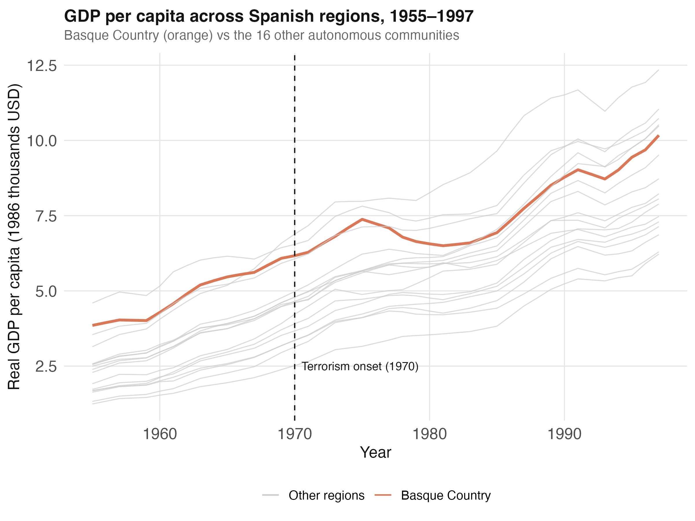
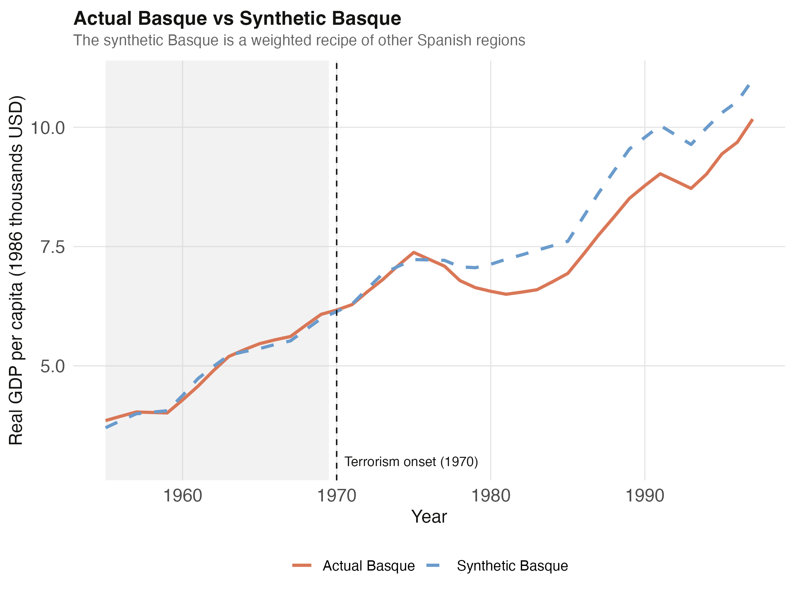
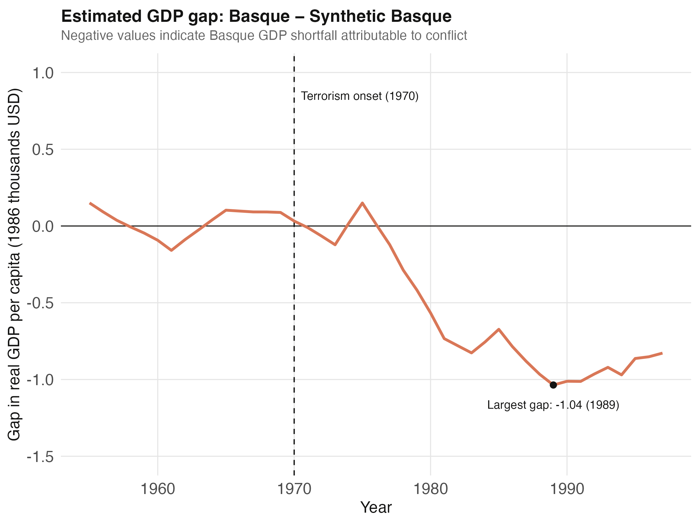
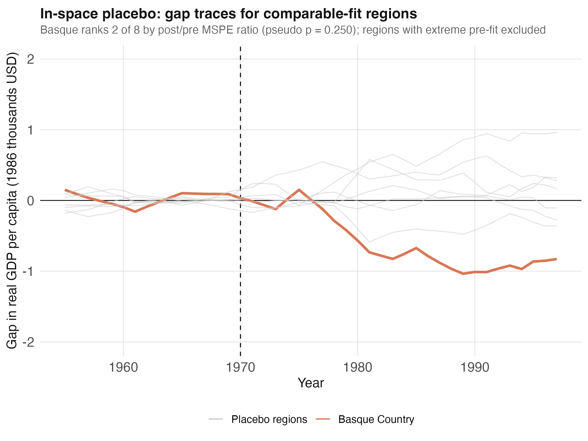

# The Tension {.divider background-color="#d97757"}

[Act I]{.act}

## We never see the Basque economy *without* the conflict

In 1970 the Basque Country entered decades of sustained terrorist activity. The natural question — what did it cost? — has no easy answer.

. . .

The path we observed is only half the story. The path without conflict — the counterfactual — was never recorded. *How do you measure a road not taken?*

::: {.notes}
This is the fundamental problem of causal inference in a single case study. We observe one Basque Country with conflict; we never observe the parallel-universe Basque without it. Classical difference-in-differences needs many treated units; here there is exactly one. That is what motivates synthetic control.
:::

## One treated region, no clean comparison — until we build one



::: {.notes}
The spoiler figure for the data structure. Don't over-explain: just plant that the Basque (orange) is consistently one of the richest regions, near the top of the distribution. A weighted average of poorer regions cannot reproduce its level — so the optimizer will have to load heavily on the few comparably wealthy, industrial regions. We come back to this when Catalonia and Madrid emerge as the only two donors.
:::

## Where we're going

::: {.incremental}
- The single-treated-unit problem — why difference-in-differences breaks
- The recipe: a weighted blend of donor regions matched on pre-1970 fit
- The headline gap — actual minus synthetic Basque (the ATT)
- Two falsification tests: a Catalonia placebo and an in-space placebo
:::

# The Investigation {.divider background-color="#6a9bcc"}

[Act II]{.act}

## The estimand is the ATT: the gap from the counterfactual we never see

$$\alpha_{1t} = Y_{1t} - Y_{1t}^{N}, \quad t \geq 1970$$

Treatment effect = actual GDP minus the no-conflict counterfactual $Y_{1t}^{N}$.

[The fundamental problem: $Y_{1t}^{N}$ is never observed. Synthetic control estimates it as a weighted average of donor regions.]{.takeaway .fragment}

::: {.notes}
State the estimand explicitly: the average treatment effect on the treated, year by year. Y₁ₜ is realized; Y₁ₜ^N is the missing potential outcome. Everything in the method is machinery to estimate that one unobserved quantity credibly.
:::

## The estimator replaces the counterfactual with a weighted donor recipe

$$\hat{\alpha}_{1t} = Y_{1t} - \sum_{j=2}^{18} w_j^{*}\, Y_{jt}, \quad t \geq 1970$$

The donor weights $w_j^{*}$ are non-negative, sum to one, and are picked to match the Basque *pre-treatment* predictors.

[If the pre-1970 match is good, the post-1970 gap is the most plausible estimate of the conflict's cost.]{.takeaway .fragment}

::: {.notes}
The estimator is the actual outcome minus the synthetic outcome. The synthetic is a convex combination of the 16 donor regions. The identifying logic: match the observables before treatment, and — under the factor-model assumptions of Abadie et al. — the unobservable counterfactual is matched too.
:::

## The lab: 18 regions, 43 years, 13 predictors, treatment in 1970

::: {.incremental}
- **Outcome** — `gdpcap`, real GDP per capita in 1986 thousand USD
- **Treated unit** — the Basque Country (region 17), conflict onset 1970
- **Donor pool** — the 16 other Spanish autonomous communities
- **Predictors** — 13 covariates: education, investment, sector shares, density
:::

[774 rows = 18 regions × 43 years. Pre-treatment window 1955–1969; post-treatment evaluation 1970–1997.]{.takeaway .fragment}

::: {.notes}
The basque panel ships with the Synth package. Region 1 is the Spanish national aggregate, which we drop. The pre-treatment outcomes Z are annual GDP over 1960–1969; the predictors X are the 13 matched covariates. Keep this slide as the orientation map for the whole method.
:::

## Two nested optimizations: inner picks the recipe, outer picks what matters

$$W^{*}(V) = \arg\min_{W \in \mathcal{W}} \lVert X_{1} - X_{0}W \rVert_{V}$$

The **inner** problem finds donor weights $W$ matching the treated predictor profile $X_1$, measured in a $V$-weighted norm.

. . .

$$V^{*} = \arg\min_{V} \, (Z_{1} - Z_{0}W^{*}(V))'(Z_{1} - Z_{0}W^{*}(V))$$

The **outer** problem picks predictor weights $V$ so the induced recipe minimizes pre-1970 outcome error.

::: {.notes}
Every candidate V requires solving the inner W problem first — a nested optimization. V acts as importance dials on the predictors: match the saffron exactly, the salt can be approximate. synth() uses BFGS for the outer search and a constrained quadratic program (kernlab) for the inner one. Don't dwell on the algebra; convey that the algorithm both blends donors and decides which predictors deserve weight.
:::

## `dataprep()` then `synth()` — the whole estimation is two calls

``` {.r code-line-numbers="1-2|4-6|8"}
basque_dp <- prepare_basque(treated_id  = 17,
                            control_ids = c(2:16, 18))   # 16-region donor pool

run_synth_quiet <- function(dp)
  synth(data.prep.obj = dp, optimxmethod = "BFGS", verbose = FALSE)
basque_synth <- run_synth_quiet(basque_dp)

basque_synth$solution.w        # the donor weights W*
```

::: {.notes}
prepare_basque() is a helper wrapping dataprep() that packages the four matrices X1, X0, Z1, Z0 and parameterizes the treated unit and donor pool — which makes the placebo exercises trivial later (just change treated_id). synth() runs the nested optimization. The full helper lives in analysis.R; here we show the load-bearing calls.
:::

## The optimizer keeps just 2 of 16 donors — a sparse, readable recipe

| Diagnostic | Value |
|---|---:|
| W weights sum to | 1 |
| Active donors ($w > 0.01$) | [2 of 16]{.key} |
| Pre-treatment loss $V$ | 0.0089 |
| Pre-treatment loss $W$ (MSPE) | 0.2467 |

[Sparsity is typical: few donors resemble the treated unit, the rest get zero.]{.takeaway .fragment}

::: {.notes}
Three numbers tell the story. The weights sum to one (convexity respected). Only 2 of 16 donors get non-trivial weight. Both pre-treatment losses are small — a tight fit. This sparse solution is one of synthetic control's appeals over black-box prediction: you can read the recipe.
:::

## The synthetic Basque is 85% Catalonia and 15% Madrid

| Region | Weight |
|---|---:|
| Cataluna | [0.851]{.key} |
| Madrid (Comunidad De) | 0.149 |
| Every other region | 0 |

[Basque $\approx$ 85% Catalonia + 15% Madrid — the only two comparably industrial, urban, wealthy regions.]{.takeaway .fragment}

::: {.notes}
This is the one-line summary a reader can carry away. Catalonia and Madrid are the only pre-1970 Spanish regions comparably industrial and wealthy, so the optimizer leans entirely on them. Remember Catalonia's 85% dominance — it returns as a caveat in Act III's placebo. The dataset stores the region as "Cataluna" without the tilde.
:::

## The match is excellent where it matters — pre-1970 GDP and education

| Predictor | Treated | Synthetic | Donor mean |
|---|---:|---:|---:|
| Pre-1970 GDP/capita | [5.28]{.key} | 5.27 | 3.58 |
| School (primary) % | 85.9 | 82.3 | 80.9 |
| Industry share % | 45.1 | 37.6 | 22.4 |
| Agriculture share % | 6.84 | 6.18 | 21.4 |
| Pop. density 1969 | 247 | 196 | 99.4 |

[Outcome-relevant predictors match closely; density is the largest gap.]{.takeaway .fragment}

::: {.notes}
Pre-treatment GDP matches almost exactly: 5.28 vs 5.27, against a donor mean of just 3.58 — the synthetic is far closer to Basque than the average region is. Education shares fall within a few points. The optimizer correctly recognized Basque as an industrial, low-agriculture region (agriculture 6.84% vs donor mean 21.4%) and downweighted farming economies. Density (247 vs 196) is the largest gap but it is a static control, not an outcome predictor, so it carries little weight in the fit.
:::

# The Resolution {.divider background-color="#00d4c8"}

[Act III]{.act}

## Before 1970 the lines are one; after 1970 they split apart



::: {.notes}
Walk the audience along the two lines. Pre-1970 they are nearly indistinguishable — both climb from about 3.8 to 6.2 thousand USD. After 1970 they diverge: the synthetic keeps climbing toward 11 thousand by 1997 while the actual Basque stalls through the 1980s and recovers only to 10.2. The widening orange-vs-blue band is the visual signature of the conflict's cost.
:::

## The gap is the cost — peaking at −1.04 thousand USD in 1989



::: {.notes}
The gap series makes the divergence quantitative. It is essentially zero from 1955 to 1970 — another way of seeing the good pre-treatment fit. After 1970 it turns negative and bottoms at −1.036 thousand USD per capita in 1989 before partially recovering. Averaging from 1970 on gives the headline ATT.
:::

## The conflict cost the Basque Country −0.580 thousand USD per capita per year {background-color="#141413"}

[−0.580]{.bignum}

[$\widehat{\mathrm{ATT}}$, average 1970–1997 (thousand 1986 USD/capita) · roughly an 8% income shortfall]{.bignum-label}

::: {.notes}
The headline causal estimate. Average Basque GDP over the window was about 7 thousand USD, so a 0.58 shortfall is roughly 8% of the counterfactual income the region would have generated. Large in absolute terms and consistent with the narrative that sustained conflict discouraged investment, talent retention, and tourism.
:::

## A single placebo isn't enough — Catalonia's ratio is nearly as big

| Catalonia placebo | Value |
|---|---:|
| Pre-1970 MSPE | 0.006 |
| Post-1970 MSPE | 0.391 |
| Post/pre ratio | [64.7]{.key} |

[Comparable to Basque's own ratio of 60.1 — one placebo run has limited inferential power.]{.takeaway .fragment}

::: {.notes}
The first falsification pretends Catalonia — a never-treated donor — was the treated unit. Its pre-1970 MSPE is tiny (0.006) but post-1970 MSPE is large (0.391), a ratio of 64.7. That is comparable to Basque's 60.1, which is uncomfortable at first glance. The honest answer: a single placebo says little; we need the full distribution across all regions, which the in-space placebo provides.
:::

## In the comparable-fit placebos, the Basque ranks 2 of 8



::: {.notes}
The full in-space placebo runs the pipeline 17 times, once per treated region, then ranks the post/pre MSPE ratio. The raw rank (7 of 17) is misleading because tiny-pre-MSPE regions get astronomical ratios. Trimming to regions whose pre-fit is within a factor of 5 of Basque's leaves 8 comparable regions; Basque ranks 2 of 8 (pseudo p = 0.250). The top spot goes to Catalonia — the same region that is 85% of the synthetic recipe.
:::

## The placebo is suggestive, not decisive — read it with the donor weights

[Objection.]{.objection} If Catalonia tops the placebo ranking and is also 85% of the synthetic recipe, isn't the Basque "effect" just the same Spanish industrial transition?

. . .

[Response.]{.rebuttal} A fair caveat. When a synthetic is built from one dominant donor, that donor naturally scores high in its own placebo — it has no close substitute to rebuild it. The result is consistent with a sizeable cost (rank 2 of 8, an 8% shortfall) but the small 16-region pool limits resolution (smallest pseudo p = 0.125). Report placebo and donor weights *together*, not separately.

::: {.notes}
Steelman, don't strawman. The placebo evidence does not isolate the Basque effect from the broader industrial transition that affected Catalonia too. With only 16 donors the discrete pseudo-p cannot clear conventional thresholds. The structural point — dominant donors top their own placebos — is a feature of the method, and the lesson is to interpret the two diagnostics jointly.
:::

# Match the pre-treatment, build the counterfactual, read the gap. {.divider background-color="#141413"}

::: {.notes}
The single takeaway. Synthetic control turns an unanswerable single-case question into a disciplined estimate: assemble a donor recipe that mimics the treated unit before treatment, let it run as the counterfactual, and read the post-treatment gap as the cost. For confidence intervals see the scpi package; for many treated units see generalized synthetic control.
:::
