---
authors:
  - admin
categories:
  - R
  - Bayesian Model Averaging (BMA)
draft: false
featured: false
date: "2026-03-23T00:00:00Z"
external_link: ""
image:
  caption: ""
  focal_point: Smart
  placement: 3
links:
- icon: chalkboard-teacher
  icon_pack: fas
  name: "Slides (HTML)"
  url: slides/index.html
- icon: laptop-code
  icon_pack: fas
  name: "Web app"
  url: web_app/index.html
- icon: google-colab
  icon_pack: ai
  name: "[R] Google Colab"
  url: https://colab.research.google.com/github/cmg777/starter-academic-v501/blob/master/content/post/r_bma_lasso_wals/notebook.ipynb
- icon: file-code
  icon_pack: fas
  name: "Quarto (.qmd)"
  url: https://raw.githubusercontent.com/cmg777/starter-academic-v501/master/content/post/r_bma_lasso_wals/tutorial.qmd
- icon: code
  icon_pack: fas
  name: "R script"
  url: script.R
- icon: book
  icon_pack: fas
  name: "Data dictionary"
  url: data/index.html
- icon: markdown
  icon_pack: fab
  name: "MD version"
  url: https://raw.githubusercontent.com/cmg777/starter-academic-v501/master/content/post/r_bma_lasso_wals/index.md
slides:
summary: Three principled approaches to variable selection---BMA, LASSO, and WALS---applied to synthetic cross-country CO2 emissions data with known ground truth, demonstrating methodological triangulation for robust inference.
tags:
  - r
  - econometrics
  - world
  - cross-sectional data
title: "Three Methods for Robust Variable Selection: BMA, LASSO, and WALS"
url_code: ""
url_pdf: ""
url_slides: ""
url_video: ""
toc: true
diagram: true
---

## Abstract

When many candidate predictors compete to explain an outcome, reporting a single regression implicitly assumes all other specifications are wrong, and specification searching across the resulting model space inflates false discoveries through the file-drawer and pretesting problems. This tutorial compares three principled responses to that variable selection problem — Bayesian Model Averaging (BMA), the LASSO, and Weighted Average Least Squares (WALS) — and asks which truly drive CO<sub>2</sub> emissions. It uses a synthetic cross-section of 120 fictional countries with 12 candidate regressors (7 with true nonzero effects, 5 pure noise deliberately correlated with GDP), so the data-generating process supplies a known answer key against which each method can be graded. With $2^{12} = 4{,}096$ possible models, BMA is fit with the BMS package over 200,000 MCMC iterations to obtain Posterior Inclusion Probabilities (PIPs), LASSO is fit with glmnet under 10-fold cross-validation with a Post-LASSO refit, and WALS is fit with a Laplace prior to yield t-statistics. Four predictors — log GDP (PIP = 1.000, WALS |t| = 34.62), trade network (PIP = 0.986), fossil fuel (PIP = 0.948), and industry (PIP = 0.841) — are triple-robust, flagged by all three methods, while all five noise variables are correctly excluded. All methods reach perfect specificity, but LASSO and WALS recover 6 of 7 true predictors (sensitivity 85.7%) versus 4 of 7 (57.1%) for BMA, which conservatively treats urban population and democracy as borderline; only agriculture ($\beta = 0.005$) is missed by all three. The convergence of mechanically distinct methods on the same variables yields unusually credible inference, demonstrating the value of methodological triangulation.

## 1. Overview

Imagine you are an economist advising a government on climate policy. Your team has collected cross-country data on a dozen potential drivers of CO<sub>2</sub> emissions: GDP per capita, fossil fuel dependence, urbanization, industrial output, democratic governance, trade networks, agricultural activity, trade openness, foreign direct investment, corruption, tourism, and domestic credit. The government has a limited budget and wants to know: **which of these factors truly drive CO<sub>2</sub> emissions, and which are red herrings?**

This is the **variable selection** problem, and it is harder than it sounds. With 12 candidate variables, each either included or excluded from a regression, there are $2^{12} = 4,096$ possible models you could estimate. Run one model and report it as "the answer," and you have implicitly assumed the other 4,095 models are wrong. That is a very strong assumption --- and almost certainly unjustified.

In practice, researchers handle this by *specification searching*: they try many models, drop insignificant variables, and report whichever specification "works best." This process inflates false discoveries. A noise variable that happens to look significant in one specification gets reported, while the many failed specifications are hidden in the researcher's desk drawer. This is sometimes called the **file drawer problem** or **pretesting bias**.

This tutorial introduces three principled approaches to the variable selection problem:

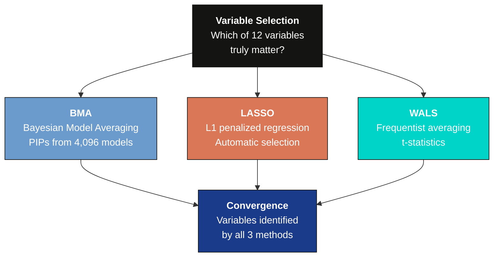

1. **Bayesian Model Averaging (BMA)**: Average across all 4,096 models, weighting each by how well it fits the data. Variables that appear important across many models earn a high "inclusion probability."

2. **LASSO (Least Absolute Shrinkage and Selection Operator)**: Add a penalty to the regression that forces the coefficients of irrelevant variables to be *exactly zero*, performing automatic selection.

3. **Weighted Average Least Squares (WALS)**: A fast frequentist model-averaging method that transforms the problem so each variable can be evaluated independently.

We use **synthetic data** throughout this tutorial. This means we *know the true data-generating process* --- which variables truly matter and which do not. This "answer key" lets us verify whether each method correctly recovers the truth. By the end, you will understand not just *how* to run each method, but *why* it works and *when* to prefer one over the others.

**Learning objectives:**

- Understand the variable selection problem and why running a single model is insufficient when model uncertainty is large
- Implement Bayesian Model Averaging in R and interpret Posterior Inclusion Probabilities (PIPs)
- Apply LASSO with cross-validation to perform automatic variable selection and use Post-LASSO for unbiased estimation
- Run WALS as a fast frequentist model-averaging alternative and interpret its t-statistics
- Compare results across all three methods to identify truly robust determinants via methodological triangulation

### Key concepts at a glance

The post leans on a small vocabulary repeatedly. The rest of the tutorial assumes you can move between these terms quickly. Each concept below has three parts. The **definition** is always visible. The **example** and **analogy** sit behind clickable cards: open them when you need them, leave them collapsed for a quick scan. If a later section mentions "PIP" or "triangulation" and the term feels slippery, this is the section to re-read.

**1. Variable selection**. The challenge of picking which predictors belong in a regression. Wrong choice = biased coefficients or inflated standard errors.

<div class="concept-pair">

<details class="concept-card concept-example"><summary>Example</summary>

In this post, 12 candidate regressors face the analyst, only 7 are truly nonzero. The post's whole point is: which method recovers them best?

</details>

<details class="concept-card concept-analogy"><summary>Analogy</summary>

Trimming a guest list --- invite too many and the party is chaos, too few and you miss the friends who matter.

</details>

</div>

**2. Model uncertainty** $2^K$ candidate models. With $K$ candidate predictors, there are $2^K$ possible specifications. Picking one and ignoring the others is a strong implicit assumption.

<div class="concept-pair">

<details class="concept-card concept-example"><summary>Example</summary>

With 12 candidate variables, the model space holds $2^{12} = 4{,}096$ possible regressions. BMA's MCMC explores this space; LASSO and WALS find compact summaries instead.

</details>

<details class="concept-card concept-analogy"><summary>Analogy</summary>

Many plausible guest lists exist. No single one is "the right" list.

</details>

</div>

**3. Bayesian model averaging (BMA)** weighted average over $M\_j$. Weights coefficients across all candidate models by their posterior probability. Honest acknowledgement of model uncertainty.

<div class="concept-pair">

<details class="concept-card concept-example"><summary>Example</summary>

BMA in this post (`bms()`) recovers 4 of the 7 true predictors with PIP $\geq 0.80$ --- a sensitivity of 57.1%. Three weak true predictors (urban, democracy, agriculture) fall below the threshold because their effects are too small.

</details>

<details class="concept-card concept-analogy"><summary>Analogy</summary>

Polling every plausible expert and weighting by track record.

</details>

</div>

**4. Posterior inclusion probability (PIP)** $\sum\_{M\_j: x\_k \in M\_j} \Pr(M\_j \mid \mathrm{data})$. Total posterior mass on models containing variable $k$. PIP $\geq 0.80$ is the "robustness threshold" by convention (Raftery 1995).

<div class="concept-pair">

<details class="concept-card concept-example"><summary>Example</summary>

In this post, `log_gdp` has PIP = 1.000 (always selected). `trade_network` = 0.986, `fossil_fuel` = 0.948, `industry` = 0.841 --- all above 0.80. Three true predictors fall short.

</details>

<details class="concept-card concept-analogy"><summary>Analogy</summary>

"What fraction of expert panels include this person?"

</details>

</div>

**5. LASSO (L1 regularization)** $\min \\, \|y - X\beta\|^2 + \lambda \|\beta\|\_1$. Adds an L1 penalty to OLS. The penalty forces some coefficients exactly to zero, performing variable selection automatically.

<div class="concept-pair">

<details class="concept-card concept-example"><summary>Example</summary>

With `glmnet` and 10-fold cross-validation, LASSO drops 5 noise variables and one weak true predictor. Post-LASSO refit gives `log_gdp` = 1.1646, very close to the true 1.200.

</details>

<details class="concept-card concept-analogy"><summary>Analogy</summary>

A budget cap that forces you to drop low-priority guests.

</details>

</div>

**6. WALS (Weighted Average Least Squares)**. Frequentist model averaging via a semi-orthogonal transformation and a Laplace prior. Closed-form, fast, no MCMC.

<div class="concept-pair">

<details class="concept-card concept-example"><summary>Example</summary>

WALS gives `log_gdp` |t| = 34.62, dwarfing every other regressor; `trade_network` |t| = 4.39 is also strongly significant. Like LASSO, WALS recovers 6 of 7 true predictors (85.7%).

</details>

<details class="concept-card concept-analogy"><summary>Analogy</summary>

Averaging plans on a tidy spreadsheet rather than via a long Monte Carlo simulation.

</details>

</div>

**7. Methodological triangulation**. Combining multiple methods that share assumptions but differ mechanically. Variables flagged by *all three* are unusually credible.

<div class="concept-pair">

<details class="concept-card concept-example"><summary>Example</summary>

4 of 7 true predictors are flagged by BMA, LASSO, and WALS together --- the "triple-robust" set. These are the strongest claims the post can defend.

</details>

<details class="concept-card concept-analogy"><summary>Analogy</summary>

Three independent referees agreeing on the call.

</details>

</div>

**8. Sensitivity / true-positive rate** $\\#\\{\hat\beta\_k \neq 0 : \beta\_k \neq 0\\} / \\#\\{\beta\_k \neq 0\\}$. Of the truly nonzero coefficients, what share does the method correctly flag?

<div class="concept-pair">

<details class="concept-card concept-example"><summary>Example</summary>

In this post, BMA sensitivity = 4/7 = 57.1%. LASSO and WALS each = 6/7 = 85.7%. With weak signals, frequentist shrinkage outperforms Bayesian averaging at this sample size.

</details>

<details class="concept-card concept-analogy"><summary>Analogy</summary>

Recall on a true-positive checklist --- how many real friends made it through the budget cap?

</details>

</div>

**Content outline.** Section 2 sets up the R environment. Section 3 introduces the synthetic dataset and its built-in "answer key" --- 7 true predictors and 5 noise variables with realistic multicollinearity. Section 4 runs naive OLS to illustrate the spurious significance problem. Sections 5--8 cover BMA: Bayes' rule foundations, the PIP framework, a toy example, and full implementation. Sections 9--12 cover LASSO: the bias-variance tradeoff, L1/L2 geometry, cross-validated implementation, and Post-LASSO. Sections 13--16 cover WALS: frequentist model averaging, the semi-orthogonal transformation, the Laplace prior, and implementation. Section 17 brings all three methods together for a grand comparison. Section 18 summarizes key takeaways and provides further reading.


## 2. Setup

Before running the analysis, install the required packages if needed. The following code checks for missing packages and installs them automatically.

```r
# List all packages needed for this tutorial
required_packages <- c(
  "tidyverse",   # data manipulation and ggplot2 visualization
  "BMS",         # Bayesian Model Averaging via the bms() function
  "glmnet",      # LASSO and Ridge regression via coordinate descent
  "WALS",        # Weighted Average Least Squares estimation
  "scales",      # nice axis formatting in plots
  "patchwork",   # combine multiple ggplot panels
  "ggrepel",     # non-overlapping text labels on plots
  "corrplot",    # correlation matrix heatmaps
  "broom"        # tidy model summaries
)

# Install any packages not yet available
missing <- required_packages[!sapply(required_packages, requireNamespace, quietly = TRUE)]
if (length(missing) > 0) {
  install.packages(missing, repos = "https://cloud.r-project.org")
}

# Load libraries
library(tidyverse)
library(BMS)
library(glmnet)
library(WALS)
library(scales)
library(patchwork)
library(ggrepel)
library(corrplot)
library(broom)
```


## 3. The Synthetic Dataset

### 3.1 The data-generating process (our "answer key")

We use a cross-sectional dataset of 120 fictional countries. The key design choices:

- **7 variables have true nonzero effects** on CO<sub>2</sub> emissions
- **5 variables are pure noise** (their true coefficients are exactly zero)
- The noise variables are **correlated with GDP and other true predictors**, creating realistic multicollinearity. This makes variable selection genuinely challenging --- naive OLS will find spurious "significant" results for noise variables.

Think of this as setting up a controlled experiment. We know the answer before we begin, so we can grade each method's performance.

The data-generating process below shows exactly how the synthetic dataset was built. The CSV file `synthetic-co2-cross-section.csv` was generated with `set.seed(2017)` and can be loaded directly from GitHub for full reproducibility.

```r
# --- DATA-GENERATING PROCESS (reference) ---
set.seed(2017)
n <- 120  # number of "countries"

# GDP drives many other variables (realistic: richer countries
# have higher urbanization, more industry, etc.)
log_gdp <- rnorm(n, mean = 8.5, sd = 1.5)

# --- TRUE PREDICTORS (correlated with GDP) ---
fossil_fuel <- 30 + 3 * log_gdp + rnorm(n, 0, 10)    # higher in richer countries
urban_pop   <- 20 + 5 * log_gdp + rnorm(n, 0, 12)    # increases with income
industry    <- 15 + 1.5 * log_gdp + rnorm(n, 0, 6)   # industry share
democracy   <- 5 + 2 * log_gdp + rnorm(n, 0, 8)      # democracy index
trade_network <- 0.2 + 0.05 * log_gdp + rnorm(n, 0, 0.15)  # trade centrality
agriculture <- 40 - 3 * log_gdp + rnorm(n, 0, 8)     # negatively correlated with GDP

# --- NOISE VARIABLES (correlated with GDP but NO true effect) ---
log_trade   <- 3.5 + 0.1 * log_gdp + rnorm(n, 0, 0.5)
fdi         <- 2 + rnorm(n, 0, 4)
corruption  <- 0.8 - 0.05 * log_gdp + rnorm(n, 0, 0.15)
log_tourism <- 12 + 0.3 * log_gdp + rnorm(n, 0, 1.2)
log_credit  <- 2.5 + 0.15 * log_gdp + rnorm(n, 0, 0.6)

# --- TRUE DATA-GENERATING PROCESS ---
log_co2 <- 2.0 +                     # intercept
  1.200 * log_gdp +                   # GDP: strong positive (elasticity)
  0.008 * industry +                  # industry: positive
  0.012 * fossil_fuel +               # fossil fuel: positive
  0.010 * urban_pop +                 # urbanization: positive
  0.004 * democracy +                 # democracy: small positive
  0.500 * trade_network +             # trade network: moderate positive
  0.005 * agriculture +               # agriculture: weak positive
  # NOISE VARIABLES HAVE ZERO TRUE EFFECT
  rnorm(n, 0, 0.3)                    # random noise (sigma = 0.3)
```

The true coefficients serve as our "answer key":

| Variable | True $\beta$ | Role | Interpretation |
|:--|:--|:--|:--|
| log\_gdp | 1.200 | True predictor | 1% more GDP $\to$ 1.2% more CO<sub>2</sub> |
| trade\_network | 0.500 | True predictor | Moderate positive effect |
| fossil\_fuel | 0.012 | True predictor | 1 pp more fossil fuel $\to$ 1.2% more CO<sub>2</sub> |
| urban\_pop | 0.010 | True predictor | 1 pp more urbanization $\to$ 1.0% more CO<sub>2</sub> |
| industry | 0.008 | True predictor | Positive composition effect |
| agriculture | 0.005 | True predictor | Weak positive effect |
| democracy | 0.004 | True predictor | Small positive effect |
| log\_trade | 0 | Noise | No true effect |
| fdi | 0 | Noise | No true effect |
| corruption | 0 | Noise | No true effect |
| log\_tourism | 0 | Noise | No true effect |
| log\_credit | 0 | Noise | No true effect |

Now let us load the pre-generated dataset:

```r
# Load the synthetic dataset directly from GitHub
DATA_URL <- "https://raw.githubusercontent.com/cmg777/starter-academic-v501/master/content/post/r_bma_lasso_wals/synthetic-co2-cross-section.csv"
synth_data <- read.csv(DATA_URL)
cat("Dataset:", nrow(synth_data), "countries,", ncol(synth_data), "variables\n")
head(synth_data)
```

```text
Dataset: 120 countries, 14 variables
  country  log_co2  log_gdp industry fossil_fuel urban_pop democracy trade_network
1 Country_001  13.27   9.47    29.25       66.94     67.97     25.67          0.77
2 Country_002  12.18   8.44    24.97       51.43     66.14     20.51          0.85
3 Country_003  13.50  10.16    28.19       50.62     73.91     29.08          0.73
...
```


### 3.2 Descriptive statistics

The following summary statistics give us a first look at the data structure. Note the wide range of scales: GDP is in log units (mean around 8.5), while percentage variables like fossil fuel share and urbanization range from single digits to near 100.

```r
# Descriptive statistics for all 13 numeric variables
synth_data |>
  select(-country) |>
  pivot_longer(everything(), names_to = "variable", values_to = "value") |>
  summarise(
    n    = n(),
    mean = round(mean(value), 2),
    sd   = round(sd(value), 2),
    min  = round(min(value), 2),
    max  = round(max(value), 2),
    .by  = variable
  )
```

```text
  variable          n   mean     sd     min     max
  log_co2         120  14.22   2.11    8.76   20.36
  log_gdp         120   8.53   1.57    4.61   13.21
  industry        120  27.87   6.21    8.32   44.98
  fossil_fuel     120  55.49   9.62   24.72   81.22
  urban_pop       120  62.52  13.25   29.81   97.62
  democracy       120  22.94   8.32    3.10   45.00
  trade_network   120   0.64   0.17    0.18    1.04
  agriculture     120  13.87   8.11    1.00   37.11
  log_trade       120   4.43   0.46    3.45    5.84
  fdi             120   2.23   4.19   -5.00   13.62
  corruption      120   0.37   0.16    0.05    0.71
  log_tourism     120  14.61   1.32   11.54   19.63
  log_credit      120   3.83   0.65    2.30    5.50
```

The dataset has 120 observations and 14 variables (1 dependent, 12 candidate regressors, 1 country identifier). The dependent variable `log_co2` has a mean of 14.22 with a standard deviation of 2.11 log points, reflecting substantial cross-country variation in emissions. The candidate regressors span very different scales --- trade\_network ranges from 0.18 to 1.04, while urban\_pop ranges from 29.8 to 97.6 --- which is why BMA, LASSO, and WALS each handle scaling internally.


### 3.3 Correlation structure

A key feature of our synthetic data is that the noise variables are correlated with the true predictors --- especially with GDP. This correlation is what makes variable selection difficult: in a standard OLS regression, the noise variables will "borrow" explanatory power from the true predictors.

```r
# Compute correlation matrix for all 12 candidate regressors
cor_matrix <- synth_data |>
  select(-country, -log_co2) |>
  cor()

# Draw the heatmap
corrplot(cor_matrix, method = "color", type = "lower",
         addCoef.col = "black", number.cex = 0.7,
         col = colorRampPalette(c("#d97757", "white", "#6a9bcc"))(200),
         diag = FALSE)
```

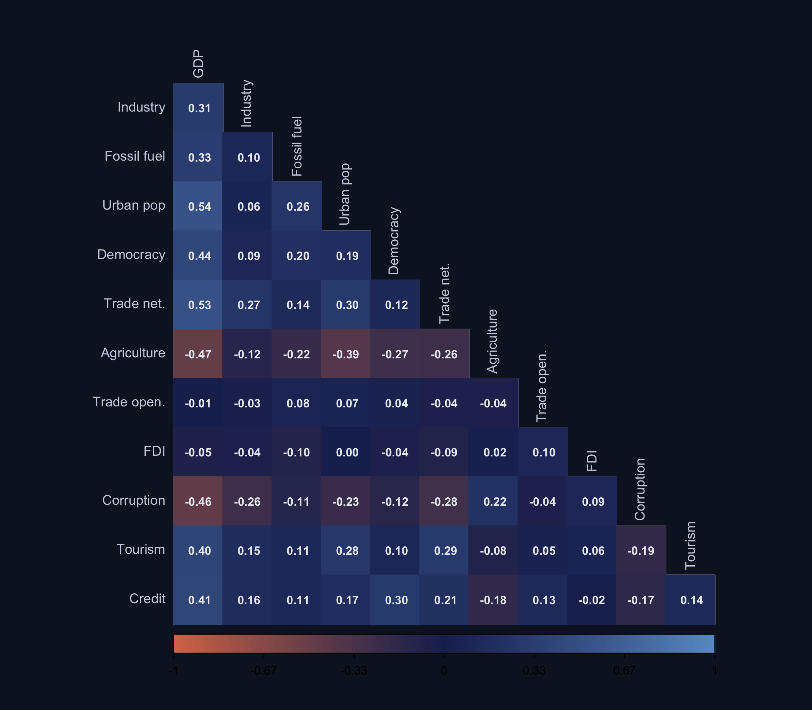

The correlation heatmap reveals the realistic structure we built into the data. GDP is positively correlated with fossil fuel use, urbanization, industry, and the trade network --- but also with the noise variables like trade openness, tourism, and credit. This multicollinearity is precisely what makes a naive "throw everything into OLS" approach unreliable. For example, log\_tourism has a correlation of approximately 0.3 with log\_gdp, which means it can pick up GDP's signal even though its true effect is zero.

> **Note.** We created a synthetic dataset where we *know* which 7 variables truly affect CO<sub>2</sub> emissions and which 5 are noise. The noise variables are deliberately correlated with the true predictors, mimicking the multicollinearity found in real cross-country data.


## 4. The General Model

Our goal is to estimate the following linear model:

$$
\log(\text{CO}\_{2,i}) = \beta\_0 + \sum\_{j=1}^{12} \beta\_j x\_{j,i} + \varepsilon\_i
$$

where:

- $\log(\text{CO}\_{2,i})$ is the log of CO<sub>2</sub> emissions for country $i$
- $\beta\_0$ is the **intercept** (the predicted log CO<sub>2</sub> when all regressors are zero)
- $\beta\_j$ is the **coefficient** on the $j$-th regressor: the change in log CO<sub>2</sub> associated with a one-unit increase in $x\_j$, holding all other variables constant
- $\varepsilon\_i$ is the **error term**: everything that affects CO<sub>2</sub> emissions but is not captured by the 12 regressors

Because the dependent variable is in logs, the interpretation of each coefficient depends on whether the regressor is also in logs:

| Regressor type | Interpretation of $\beta\_j$ | Example |
|:--|:--|:--|
| Log-log (e.g., log GDP) | **Elasticity**: a 1% increase in GDP is associated with a $\beta\_j$% change in CO<sub>2</sub> | $\beta = 1.2$ means 1% more GDP $\to$ 1.2% more CO<sub>2</sub> |
| Level-log (e.g., fossil fuel %) | **Semi-elasticity**: a 1-unit increase in the regressor is associated with a $100 \times \beta\_j$% change in CO<sub>2</sub> | $\beta = 0.012$ means 1 pp more fossil fuel $\to$ 1.2% more CO<sub>2</sub> |

We want to determine **which $\beta\_j$ are truly nonzero**. We know the answer (we designed the data), but let us first see what happens if we just run OLS with all 12 variables.

```r
# Run OLS with all 12 candidate regressors
ols_full <- lm(log_co2 ~ log_gdp + industry + fossil_fuel + urban_pop +
                 democracy + trade_network + agriculture +
                 log_trade + fdi + corruption + log_tourism + log_credit,
               data = synth_data)

# Display summary
summary(ols_full)
```

```text
Coefficients:
               Estimate Std. Error t value Pr(>|t|)
(Intercept)    2.283773   0.494736   4.616 1.06e-05 ***
log_gdp        1.163669   0.032747  35.537  < 2e-16 ***
industry       0.017577   0.005004   3.513 0.000661 ***
fossil_fuel    0.011988   0.003240   3.698 0.000349 ***
urban_pop      0.008221   0.002689   3.057 0.002794 **
democracy      0.010497   0.003975   2.640 0.009549 **
trade_network  0.912828   0.203681   4.482 1.94e-05 ***
agriculture   -0.000629   0.004242  -0.148 0.882568
log_trade     -0.055738   0.064829  -0.860 0.391509
fdi            0.000789   0.007045   0.112 0.910964
corruption     0.010767   0.201954   0.053 0.957573
log_tourism   -0.028025   0.024415  -1.148 0.253610
log_credit     0.045689   0.049690   0.919 0.360252
---
Multiple R-squared: 0.9801,  Adjusted R-squared: 0.9779
```

Look carefully at the noise variables. For example, log\_trade has a t-statistic of $-0.86$ (p = 0.392) and corruption has a t-statistic of $0.05$ (p = 0.958). None reach conventional significance in this sample. However, their estimated coefficients can be non-negligible in magnitude --- and in a different random sample, some noise variables could easily cross the 5% threshold. This is the risk of **spurious significance**, caused by the correlation between noise variables and the true predictors. It is precisely this problem that motivates the three methods we study next.

> **Warning.** With 12 correlated regressors and only 120 observations, OLS can produce misleading significance levels. A variable with a true coefficient of zero may appear significant simply because it is correlated with a genuinely important predictor. This is why we need principled variable selection methods.


<div style="background: linear-gradient(135deg, #6a9bcc 0%, #00d4c8 100%); padding: 1.5em 2em; border-radius: 8px; margin: 2em 0; color: #fff; font-size: 1.3em; font-weight: 600;">
PART 1: Bayesian Model Averaging
</div>


## 5. Bayes' Rule --- The Foundation

Before we can understand Bayesian Model Averaging, we need to understand **Bayes' rule** --- the mathematical machinery that powers the entire framework.

### 5.1 A coin-flip example

Suppose a friend gives you a coin. You want to know: **is this coin fair** (probability of heads = 0.5), or is it **biased** (probability of heads = 0.7)?

Before flipping, you have no strong opinion. You assign equal **prior probabilities**:

- $P(\text{fair}) = 0.5$ (50% chance the coin is fair)
- $P(\text{biased}) = 0.5$ (50% chance the coin is biased)

Now you flip the coin 10 times and observe **7 heads**. How should you update your beliefs?

The **likelihood** of seeing 7 heads in 10 flips is:

- If the coin is fair ($p = 0.5$): $P(\text{7 heads} | \text{fair}) = \binom{10}{7} (0.5)^{10} = 0.1172$
- If the coin is biased ($p = 0.7$): $P(\text{7 heads} | \text{biased}) = \binom{10}{7} (0.7)^7 (0.3)^3 = 0.2668$

The biased coin makes the data more likely. Bayes' rule combines the prior and the likelihood:

$$
P(H|D) = \frac{P(D|H) \cdot P(H)}{P(D)}
$$

where:

- $P(H|D)$ = **posterior probability** (what we believe *after* seeing the data)
- $P(D|H)$ = **likelihood** (how probable the data is under hypothesis $H$)
- $P(H)$ = **prior probability** (what we believed *before* seeing the data)
- $P(D)$ = **marginal likelihood** (a normalizing constant that ensures probabilities sum to 1)

For our coin:

$$
P(\text{fair}|\text{7H}) = \frac{0.1172 \times 0.5}{0.1172 \times 0.5 + 0.2668 \times 0.5} = \frac{0.0586}{0.1920} = 0.305
$$

$$
P(\text{biased}|\text{7H}) = \frac{0.2668 \times 0.5}{0.1920} = 0.695
$$

After seeing 7 heads, we update from 50--50 to roughly 30--70 in favor of the biased coin. **The data shifted our beliefs, but did not erase the prior entirely.**


### 5.2 The bridge to model averaging

Now replace "fair coin" and "biased coin" with *regression models*:

- Hypothesis = "Which variables belong in the model?"
- Prior = "Before seeing data, any combination of variables is equally plausible"
- Likelihood = "How well does each model fit the data?"
- Posterior = "After seeing data, which models are most credible?"

This is exactly what BMA does. Instead of two coin hypotheses, we have 4,096 model hypotheses --- but the logic of Bayes' rule is identical.

> **Note.** Bayes' rule updates prior beliefs using data. The posterior probability of any hypothesis is proportional to its prior probability times its likelihood. BMA applies this same logic to regression models instead of coin flips.


## 6. The BMA Framework

### 6.1 Posterior model probability

With 12 candidate variables, there are $K = 12$ regressors and $2^K = 4,096$ possible models. Denote the $k$-th model as $M\_k$. BMA assigns each model a **posterior probability**:

$$
P(M\_k | y) = \frac{P(y | M\_k) \cdot P(M\_k)}{\sum\_{l=1}^{2^K} P(y | M\_l) \cdot P(M\_l)}
$$

This is just Bayes' rule applied to models. Let us unpack each piece:

- **$P(y | M\_k)$** is the **marginal likelihood** of model $M\_k$. It measures how well the model fits the data, *automatically penalizing complexity*. A model with many parameters can fit the data closely, but the marginal likelihood integrates over all possible parameter values, spreading the probability thin. This acts as a built-in **Occam's razor**: simpler models that fit the data well receive higher marginal likelihoods than complex models that fit only slightly better.

- **$P(M\_k)$** is the **prior model probability**. With no prior information, we use a **uniform prior**: every model is equally likely, so $P(M\_k) = 1/4,096$ for all $k$. This means the posterior is driven entirely by the data.

- The **denominator** is a normalizing constant that ensures all posterior model probabilities sum to 1.


### 6.2 Posterior Inclusion Probability (PIP)

We do not really care about individual models --- we care about individual *variables*. The **Posterior Inclusion Probability** of variable $j$ is the sum of the posterior probabilities of all models that include variable $j$:

$$
\text{PIP}\_j = \sum\_{k:\\, j \in M\_k} P(M\_k | y)
$$

Think of it as a **democratic vote**. Each of the 4,096 models casts a vote for which variables matter. But the votes are *weighted*: models that fit the data well get louder voices. If variable $j$ appears in most of the high-probability models, it earns a high PIP.

The standard interpretation thresholds (Raftery, 1995):

| PIP range | Interpretation | Analogy |
|:--|:--|:--|
| $\geq 0.99$ | Decisive evidence | Beyond reasonable doubt |
| $0.95 - 0.99$ | Very strong evidence | Strong consensus |
| $0.80 - 0.95$ | Strong evidence (robust) | Clear majority |
| $0.50 - 0.80$ | Borderline evidence | Split vote |
| $< 0.50$ | Weak/no evidence (fragile) | Minority opinion |

We will use **PIP $\geq$ 0.80** as our threshold for "robust" throughout this tutorial.


### 6.3 Posterior mean

Once we know which variables matter, we want to know *how much* they matter. The **posterior mean** of coefficient $j$ is:

$$
E[\beta\_j | y] = \sum\_{k=1}^{2^K} \hat{\beta}\_{j,k} \cdot P(M\_k | y)
$$

where $\hat{\beta}\_{j,k}$ is the estimated coefficient of variable $j$ in model $k$ (and zero if $j$ is not in model $k$). This is a weighted average of the coefficient across all models. Variables with high PIPs get posterior means close to their "full model" estimates; variables with low PIPs get posterior means shrunk toward zero.


## 7. Toy Example --- BMA on 3 Variables

Before running BMA on all 12 variables, let us work through a small example by hand. We pick just 3 variables: **log\_gdp** and **fossil\_fuel** (true predictors) and **log\_trade** (noise). With 3 variables, each can be either IN or OUT of the model, giving us $2^3 = 8$ possible models --- small enough to examine every single one.

Here are all 8 models written out explicitly:

| Model | Formula |
|:--|:--|
| $M\_1$ | log\_co2 $\sim$ 1 (intercept only) |
| $M\_2$ | log\_co2 $\sim$ log\_gdp |
| $M\_3$ | log\_co2 $\sim$ fossil\_fuel |
| $M\_4$ | log\_co2 $\sim$ log\_trade |
| $M\_5$ | log\_co2 $\sim$ log\_gdp + fossil\_fuel |
| $M\_6$ | log\_co2 $\sim$ log\_gdp + log\_trade |
| $M\_7$ | log\_co2 $\sim$ fossil\_fuel + log\_trade |
| $M\_8$ | log\_co2 $\sim$ log\_gdp + fossil\_fuel + log\_trade |


### 7.1 Step 1 --- Fit every model and compute BIC

We fit each of the 8 models using OLS and compute its BIC score. Remember: **lower BIC = better** (the model explains the data well without unnecessary complexity).

```r
# Select our 3 variables
toy_data <- synth_data |>
  select(log_co2, log_gdp, fossil_fuel, log_trade)

# Write out all 8 model formulas explicitly
model_formulas <- c(
  "log_co2 ~ 1",                                  # M1: intercept only
  "log_co2 ~ log_gdp",                            # M2
  "log_co2 ~ fossil_fuel",                         # M3
  "log_co2 ~ log_trade",                           # M4
  "log_co2 ~ log_gdp + fossil_fuel",               # M5
  "log_co2 ~ log_gdp + log_trade",                 # M6
  "log_co2 ~ fossil_fuel + log_trade",              # M7
  "log_co2 ~ log_gdp + fossil_fuel + log_trade"    # M8
)

# Fit each model and extract its BIC
bic_values <- sapply(model_formulas, function(f) {
  BIC(lm(as.formula(f), data = toy_data))
})

# Organize results in a table
toy_results <- tibble(
  model    = paste0("M", 1:8),
  formula  = model_formulas,
  bic      = round(bic_values, 1)
) |>
  arrange(bic)

print(toy_results)
```

```text
  model formula                                      bic
  M5    log_co2 ~ log_gdp + fossil_fuel             114.1
  M8    log_co2 ~ log_gdp + fossil_fuel + log_trade 118.5
  M2    log_co2 ~ log_gdp                           120.7
  M6    log_co2 ~ log_gdp + log_trade               125.4
  M3    log_co2 ~ fossil_fuel                        514.4
  M7    log_co2 ~ fossil_fuel + log_trade            519.0
  M1    log_co2 ~ 1                                  528.3
  M4    log_co2 ~ log_trade                          533.0
```

The winner is $M\_5$ (log\_gdp + fossil\_fuel) with BIC = 114.1 --- exactly the two true predictors, no noise. The runner-up $M\_8$ adds log\_trade but its BIC is worse (118.5), meaning the extra variable does not improve the fit enough to justify the added complexity. Models without GDP ($M\_1$, $M\_3$, $M\_4$, $M\_7$) have dramatically worse BIC scores, confirming GDP's dominant role.


### 7.2 Step 2 --- Convert BIC to posterior probabilities

Now we turn each BIC into a posterior model probability. The formula is:

$$
P(M\_k | y) = \frac{\exp(-0.5 \cdot \text{BIC}\_k)}{\sum\_{l=1}^{8} \exp(-0.5 \cdot \text{BIC}\_l)}
$$

Because the BIC values can be very large, we work with **differences from the best model** to avoid numerical overflow. Subtracting the minimum BIC from all values does not change the probabilities:

$$
P(M\_k | y) = \frac{\exp\bigl(-0.5 \cdot (\text{BIC}\_k - \text{BIC}\_{\min})\bigr)}{\sum\_{l=1}^{8} \exp\bigl(-0.5 \cdot (\text{BIC}\_l - \text{BIC}\_{\min})\bigr)}
$$

Let us plug in the numbers. The best model ($M\_5$) has BIC = 114.1, so $\Delta\_5 = 0$. The runner-up ($M\_8$) has $\Delta\_8 = 118.5 - 114.1 = 4.4$:

$$
w\_5 = \exp(-0.5 \times 0) = 1.000, \quad w\_8 = \exp(-0.5 \times 4.4) = 0.111
$$

The remaining models have much larger $\Delta$ values, so their weights are essentially zero. After normalizing by the sum of all weights ($1.000 + 0.111 + 0.037 + \ldots \approx 1.151$):

$$
P(M\_5 | y) = \frac{1.000}{1.151} = 0.869, \quad P(M\_8 | y) = \frac{0.111}{1.151} = 0.096
$$

```r
# Convert BIC to posterior probabilities using the delta-BIC trick
toy_results <- toy_results |>
  mutate(
    delta_bic = bic - min(bic),                    # difference from best
    weight    = exp(-0.5 * delta_bic),             # unnormalized weight
    post_prob = round(weight / sum(weight), 4)     # normalize to sum to 1
  )

toy_results |> select(model, bic, delta_bic, weight, post_prob)
```

```text
  model    bic  delta_bic    weight  post_prob
  M5     114.1       0.0    1.0000     0.8687
  M8     118.5       4.4    0.1108     0.0962
  M2     120.7       6.6    0.0369     0.0320
  M6     125.4      11.3    0.0035     0.0031
  M3     514.4     400.3    0.0000     0.0000
  M7     519.0     404.9    0.0000     0.0000
  M1     528.3     414.2    0.0000     0.0000
  M4     533.0     418.9    0.0000     0.0000
```

One model dominates: $M\_5$ captures 86.9% of the posterior probability --- exactly the two true predictors. The runner-up $M\_8$ (adding log\_trade) gets only 9.6%, and $M\_2$ (GDP alone) gets 3.2%. The remaining 5 models share less than 0.4% of the total weight. BMA's Occam's razor is at work: adding log\_trade to the model ($M\_8$) does not improve the fit enough to overcome the complexity penalty, so the simpler model ($M\_5$) wins decisively.


### 7.3 Step 3 --- Compute Posterior Inclusion Probabilities

Finally, we compute the PIP of each variable by summing the posterior probabilities of all models that include it. For example, log\_trade appears in models $M\_4$, $M\_6$, $M\_7$, and $M\_8$, so:

$$
\text{PIP}\_{\text{log\_trade}} = P(M\_4 | y) + P(M\_6 | y) + P(M\_7 | y) + P(M\_8 | y) = 0.000 + 0.003 + 0.000 + 0.096 = 0.099
$$

That is well below the 0.50 threshold --- fragile evidence, exactly what we expect for a noise variable.

```r
# Compute PIPs: for each variable, sum P(M|y) across models that include it
pip_toy <- tibble(
  variable    = c("log_gdp", "fossil_fuel", "log_trade"),
  true_effect = c("True", "True", "Noise"),
  pip = c(
    # log_gdp appears in M2, M5, M6, M8
    sum(toy_results$post_prob[toy_results$model %in% c("M2","M5","M6","M8")]),
    # fossil_fuel appears in M3, M5, M7, M8
    sum(toy_results$post_prob[toy_results$model %in% c("M3","M5","M7","M8")]),
    # log_trade appears in M4, M6, M7, M8
    sum(toy_results$post_prob[toy_results$model %in% c("M4","M6","M7","M8")])
  )
)

print(pip_toy)
```

```text
  variable      true_effect    pip
  log_gdp       True          1.000
  fossil_fuel   True          0.965
  log_trade     Noise         0.099
```

Even with this simple 3-variable example, BMA correctly identifies the two true predictors. GDP has a PIP of 1.000 (decisive evidence) and fossil\_fuel has a PIP of 0.965 (robust) --- they appear in every high-probability model. Log\_trade has a PIP of only 0.099 (fragile) --- well below the 0.50 threshold. BMA's built-in Occam's razor penalizes models that include noise variables without substantially improving the fit.


## 8. BMA on All 12 Variables

### 8.1 Running BMA

Now we apply BMA to the full dataset with all 12 candidate regressors using the `BMS` package. Because 4,096 models is computationally manageable, the MCMC sampler explores the full model space efficiently.

```r
set.seed(2021)  # reproducibility for MCMC sampling

# Prepare the data matrix: DV in first column, regressors follow
bma_data <- synth_data |>
  select(log_co2, log_gdp, industry, fossil_fuel, urban_pop,
         democracy, trade_network, agriculture,
         log_trade, fdi, corruption, log_tourism, log_credit) |>
  as.data.frame()

# Run BMA
bma_fit <- bms(
  X.data   = bma_data,    # data with DV in column 1
  burn     = 50000,        # burn-in iterations
  iter     = 200000,       # post-burn-in iterations
  g        = "BRIC",       # BRIC g-prior (robust default)
  mprior   = "uniform",    # uniform model prior
  nmodel   = 2000,         # store top 2000 models
  mcmc     = "bd",         # birth-death MCMC sampler
  user.int = FALSE         # suppress interactive output
)
```

The key parameters deserve explanation:
- **burn = 50,000**: the first 50,000 MCMC draws are discarded as "burn-in" to ensure the sampler has converged to the posterior distribution
- **iter = 200,000**: the next 200,000 draws are used for inference
- **g = "BRIC"**: the Benchmark Risk Inflation Criterion prior on the regression coefficients, a robust default choice
- **mprior = "uniform"**: every model is equally likely a priori, so the posterior is driven entirely by the data


### 8.2 PIP bar chart

The PIP bar chart classifies each variable as robust (PIP $\geq$ 0.80), borderline (0.50--0.80), or fragile (PIP $<$ 0.50). This visualization makes it easy to see which variables earn strong support across the model space and which are effectively irrelevant.

```r
# Extract PIPs and posterior means
bma_coefs <- coef(bma_fit)
bma_df <- as.data.frame(bma_coefs) |>
  rownames_to_column("variable") |>
  as_tibble() |>
  rename(pip = PIP, post_mean = `Post Mean`, post_sd = `Post SD`) |>
  select(variable, pip, post_mean, post_sd) |>
  mutate(
    true_beta = true_beta_lookup[variable],
    robustness = case_when(
      pip >= 0.80 ~ "Robust (PIP >= 0.80)",
      pip >= 0.50 ~ "Borderline",
      TRUE        ~ "Fragile (PIP < 0.50)"
    ),
    ci_low  = post_mean - 2 * post_sd,
    ci_high = post_mean + 2 * post_sd
  )

# Plot PIPs
ggplot(bma_df, aes(x = reorder(variable, pip), y = pip, fill = robustness)) +
  geom_col(width = 0.65) +
  geom_hline(yintercept = 0.80, linetype = "dashed") +
  coord_flip() +
  labs(x = NULL, y = "Posterior Inclusion Probability (PIP)")
```

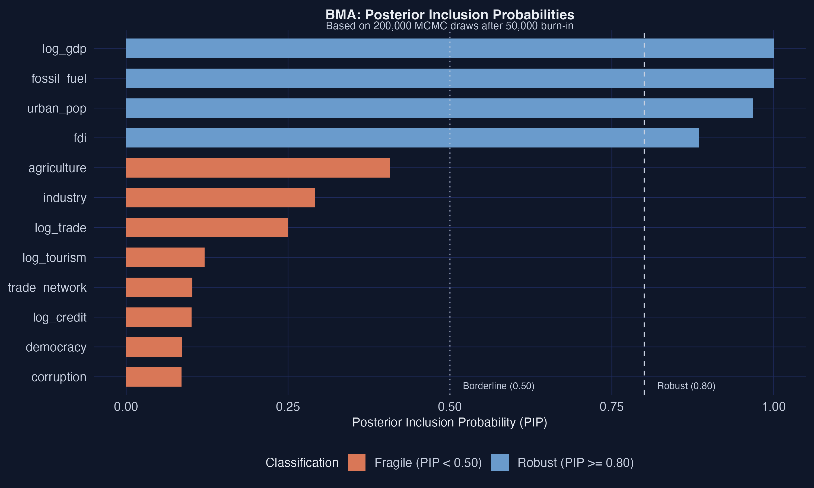

The PIP bar chart reveals a clear separation between signal and noise. GDP dominates with a PIP of 1.00, followed by trade\_network (0.986), fossil\_fuel (0.948), and industry (0.841) --- all with PIPs above the 0.80 robustness threshold. The noise variables (log\_trade, fdi, corruption, log\_tourism, log\_credit) all have PIPs well below 0.15, confirming that BMA correctly classifies them as fragile. Urban\_pop ($\beta = 0.010$, PIP = 0.648) and democracy ($\beta = 0.004$, PIP = 0.607) land in the borderline range --- true predictors whose effects are moderate enough that BMA hedges between including and excluding them. Agriculture ($\beta = 0.005$, PIP = 0.087) is classified as fragile, an honest reflection of the sample's limited power to detect its very small effect.


### 8.3 Posterior coefficient plot

Beyond knowing *which* variables matter, we want to know *how much* they matter and how precisely they are estimated. The posterior coefficient plot displays the BMA-estimated effect size for each variable along with approximate 95% credible intervals (posterior mean $\pm$ 2 posterior standard deviations).

```r
# Coefficient plot with 95% credible intervals
ggplot(bma_df, aes(x = reorder(variable, pip), y = post_mean, color = robustness)) +
  geom_pointrange(aes(ymin = ci_low, ymax = ci_high)) +
  geom_hline(yintercept = 0, linetype = "solid", color = "gray50") +
  coord_flip()
```

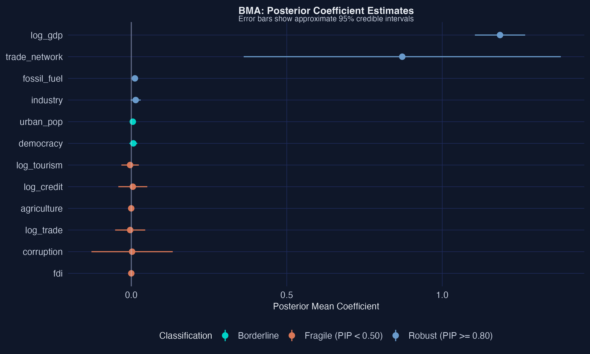

The posterior coefficient plot shows the BMA-estimated effect sizes with uncertainty bands. GDP's posterior mean of approximately 1.19 closely recovers the true value of 1.200, and its 95% credible interval is narrow, reflecting high precision. Trade\_network has a posterior mean of 0.87, overshooting its true value of 0.500 --- but its wide credible interval honestly reflects substantial estimation uncertainty. The noise variables and low-PIP variables like agriculture have posterior means shrunk very close to zero --- this is BMA's shrinkage at work. Variables with low PIPs appear in few high-probability models, so their posterior means are averaged with many models where the coefficient is zero, pulling the estimate toward zero.


### 8.4 Variable-inclusion map

The variable-inclusion map shows *which* variables appear in the highest-probability models and whether their coefficients are positive or negative. Unlike a simple heatmap, the **width of each column is proportional to the model's posterior probability** --- so wide columns represent models that the data strongly supports. The x-axis shows cumulative posterior model probability: if the first model has PMP = 0.15, it occupies the region from 0 to 0.15; the second model fills from 0.15 to 0.15 + its PMP, and so on. A solid band of color stretching across most of the x-axis means the variable appears in virtually every high-probability model.

```r
# Extract top 100 models and their coefficient estimates
top_coefs <- topmodels.bma(bma_fit)
n_top <- min(100, ncol(top_coefs))
top_coefs <- top_coefs[, 1:n_top]

# Extract posterior model probabilities (MCMC-based)
model_pmps <- pmp.bma(bma_fit)[1:n_top, 1]

# Cumulative x positions: each model's width = its PMP
cum_pmp <- c(0, cumsum(model_pmps))

# Order variables by PIP (highest at top)
var_order <- bma_df |> arrange(desc(pip)) |> pull(variable)

# Build rectangle data for every variable × model combination
rect_data <- expand.grid(
  var_idx   = seq_len(nrow(top_coefs)),
  model_idx = seq_len(n_top)
) |>
  mutate(
    variable   = rownames(top_coefs)[var_idx],
    coef_value = mapply(function(v, m) top_coefs[v, m], var_idx, model_idx),
    sign = case_when(
      coef_value > 0 ~ "Positive",
      coef_value < 0 ~ "Negative",
      TRUE           ~ "Not included"
    ),
    xmin = cum_pmp[model_idx],
    xmax = cum_pmp[model_idx + 1],
    variable = factor(variable, levels = rev(var_order))
  )

# Plot the variable-inclusion map
ggplot(rect_data, aes(xmin = xmin, xmax = xmax,
                       ymin = as.numeric(variable) - 0.45,
                       ymax = as.numeric(variable) + 0.45,
                       fill = sign)) +
  geom_rect() +
  scale_fill_manual(
    name   = "Coefficient",
    values = c("Positive"     = "#6a9bcc",
               "Negative"     = "#d97757",
               "Not included" = "#d0cdc8")
  ) +
  scale_x_continuous(expand = c(0, 0),
                     labels = scales::label_number(accuracy = 0.1)) +
  scale_y_continuous(breaks = seq_along(var_order),
                     labels = rev(var_order),
                     expand = c(0, 0)) +
  labs(title    = "Variable-Inclusion Map",
       subtitle = paste0("Top ", n_top, " models shown out of ",
                         nrow(pmp.bma(bma_fit)), " visited"),
       x = "Cumulative posterior model probability",
       y = NULL)
```


The variable-inclusion map reveals clear structure. The top variables --- log\_gdp, trade\_network, fossil\_fuel, and industry --- form solid blue bands stretching across nearly the entire x-axis, meaning they appear with positive coefficients in virtually every high-probability model. Urban\_pop and democracy also show substantial inclusion, consistent with their borderline PIPs. In contrast, the noise variables (log\_trade, fdi, corruption, log\_tourism, log\_credit) appear as mostly gray with occasional patches of blue or orange, indicating they enter and exit models sporadically and sometimes with the wrong sign. The fact that noise variables occasionally appear with negative coefficients (orange patches) is another sign of fragility --- their coefficient estimates are unstable because they have no true effect.


### 8.5 BMA results vs. known truth

```r
# Compare BMA results with the true DGP
bma_summary <- bma_df |>
  mutate(
    bma_robust   = pip >= 0.80,
    true_nonzero = true_beta != 0,
    correct      = bma_robust == true_nonzero
  ) |>
  select(variable, true_beta, pip, post_mean, bma_robust, true_nonzero, correct)

print(bma_summary)
```

```text
  variable      true_beta    pip  post_mean bma_robust true_nonzero correct
  log_gdp         1.200    1.000    1.1854     TRUE       TRUE       TRUE
  trade_network   0.500    0.986    0.8727     TRUE       TRUE       TRUE
  fossil_fuel     0.012    0.948    0.0117     TRUE       TRUE       TRUE
  industry        0.008    0.841    0.0142     TRUE       TRUE       TRUE
  urban_pop       0.010    0.648    0.0049    FALSE       TRUE      FALSE
  democracy       0.004    0.607    0.0066    FALSE       TRUE      FALSE
  log_tourism     0.000    0.130   -0.0039    FALSE      FALSE       TRUE
  log_credit      0.000    0.104    0.0051    FALSE      FALSE       TRUE
  agriculture     0.005    0.087   -0.0002    FALSE       TRUE      FALSE
  log_trade       0.000    0.084   -0.0037    FALSE      FALSE       TRUE
  corruption      0.000    0.078    0.0026    FALSE      FALSE       TRUE
  fdi             0.000    0.077   -0.0000    FALSE      FALSE       TRUE
```

BMA correctly classifies 9 of 12 variables. The four strongest true predictors (GDP, trade\_network, fossil\_fuel, industry) all receive PIPs above 0.80 --- these are the "robust" determinants. All five noise variables receive PIPs below 0.15 --- correctly identified as fragile. Urban\_pop (PIP = 0.648) and democracy (PIP = 0.607) fall in the borderline range --- they are true predictors, but BMA's conservative Occam's razor hedges because their effects are moderate. Agriculture ($\beta = 0.005$, PIP = 0.087) is missed entirely. This reveals an important nuance: BMA prioritizes precision over sensitivity. It would rather miss a small true effect than falsely include a noise variable.

> **Note.** BMA on all 12 variables correctly gives high PIPs to the strong true predictors (GDP, trade network, fossil fuel, industry) and low PIPs to the noise variables. Variables with moderate or small true effects may land in the borderline zone. The variable-inclusion map shows that the top models consistently include the core predictors.


<div style="background: linear-gradient(135deg, #d97757 0%, #d97757 100%); padding: 1.5em 2em; border-radius: 8px; margin: 2em 0; color: #fff; font-size: 1.3em; font-weight: 600;">
PART 2: LASSO
</div>


## 9. Regularization --- Adding a Penalty

### 9.1 The bias-variance tradeoff

OLS is an **unbiased** estimator --- on average, it gets the coefficients right. But with many correlated regressors, OLS coefficients have **high variance**: they bounce around from sample to sample. Adding or removing a single variable can drastically change the estimates.

The key insight of regularization is that a **little bias can buy a lot of variance reduction**, lowering the overall prediction error. The **total error** of a prediction decomposes as:

$$
\text{MSE} = \text{Bias}^2 + \text{Variance} + \text{Irreducible noise}
$$

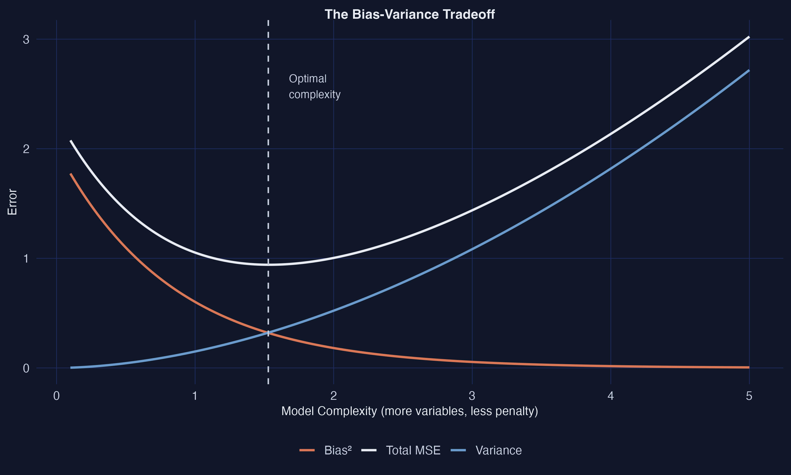

The figure illustrates the fundamental tradeoff. At low complexity (strong regularization), bias is high but variance is low. At high complexity (weak or no regularization, like OLS), bias is near zero but variance explodes. The optimal point lies in between --- this is exactly where regularized methods like LASSO operate. Think of the penalty as a "budget constraint" on coefficient sizes: variables that do not contribute enough to prediction are not worth the cost, so their coefficients are set to zero.


## 10. L1 vs. L2 Geometry

### 10.1 The LASSO (L1) penalty

The LASSO solves the following optimization problem:

$$
\hat{\beta}\_{\text{LASSO}} = \arg\min\_\beta \\; \frac{1}{2n}\\|y - X\beta\\|^2 + \lambda \\|\beta\\|\_1
$$

where:

- $\frac{1}{2n}\\|y - X\beta\\|^2$ is the **sum of squared residuals** (the usual OLS loss, scaled)
- $\\|\beta\\|\_1 = \sum\_{j=1}^{p} |\beta\_j|$ is the **L1 norm** (sum of absolute values)
- $\lambda \geq 0$ is the **regularization parameter**: it controls how much we penalize large coefficients. When $\lambda = 0$, LASSO reduces to OLS. As $\lambda \to \infty$, all coefficients are shrunk to zero.


### 10.2 The Ridge (L2) penalty

For comparison, **Ridge regression** uses the L2 norm instead:

$$
\hat{\beta}\_{\text{Ridge}} = \arg\min\_\beta \\; \frac{1}{2n}\\|y - X\beta\\|^2 + \lambda \\|\beta\\|\_2^2
$$

where $\\|\beta\\|\_2^2 = \sum\_{j=1}^{p} \beta\_j^2$ is the sum of squared coefficients.


### 10.3 Why LASSO selects variables and Ridge does not

The geometric explanation is one of the most elegant ideas in modern statistics. The constraint region for LASSO (L1) is a **diamond**, while the constraint region for Ridge (L2) is a **circle**. When the elliptical OLS contours meet the diamond, they typically hit a **corner**, where one or more coefficients are exactly zero. When they meet the circle, they hit a smooth curve --- coefficients are shrunk but never exactly zero.

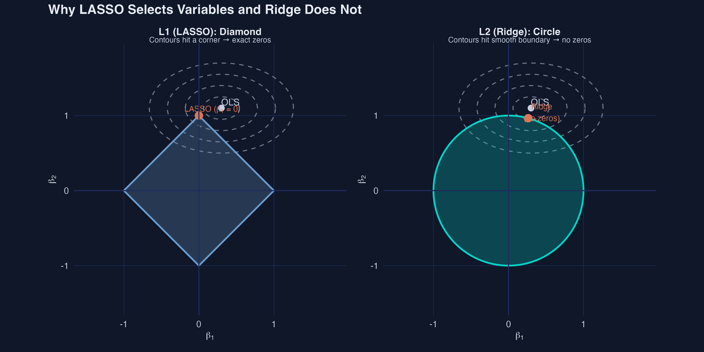

The key insight: **the L1 diamond has corners where coefficients are exactly zero --- this is why LASSO selects variables.** The L2 circle has no corners, so Ridge shrinks coefficients toward zero but never reaches it. LASSO performs *simultaneous estimation and variable selection*; Ridge only estimates.


## 11. LASSO on All 12 Variables

### 11.1 Running LASSO with cross-validation

The LASSO has one tuning parameter: $\lambda$, which controls the strength of the penalty. Too small and we include noise; too large and we exclude true predictors. We choose $\lambda$ using **10-fold cross-validation**: split the data into 10 folds, train on 9, predict the 10th, and repeat. The $\lambda$ that minimizes the average prediction error across folds is called **lambda.min**.

```r
set.seed(2021)  # reproducibility for cross-validation folds

# Prepare the design matrix X and response vector y
X <- synth_data |>
  select(log_gdp, industry, fossil_fuel, urban_pop, democracy,
         trade_network, agriculture, log_trade, fdi, corruption,
         log_tourism, log_credit) |>
  as.matrix()

y <- synth_data$log_co2

# Run LASSO (alpha = 1) with 10-fold cross-validation
lasso_cv <- cv.glmnet(
  x         = X,
  y         = y,
  alpha     = 1,       # alpha=1 is LASSO (alpha=0 is Ridge)
  nfolds    = 10,
  standardize = TRUE   # standardize predictors internally
)
```


### 11.2 Regularization path

```r
# Fit the full LASSO path
lasso_full <- glmnet(X, y, alpha = 1, standardize = TRUE)

# Plot coefficient paths
ggplot(path_df, aes(x = log_lambda, y = coefficient, color = variable)) +
  geom_line() +
  geom_vline(xintercept = log(lasso_cv$lambda.min), linetype = "dashed") +
  geom_vline(xintercept = log(lasso_cv$lambda.1se), linetype = "dotted")
```


The regularization path reveals the story of LASSO variable selection. Reading from left to right (increasing penalty), the noise variables (orange lines) are the first to be driven to zero --- they provide too little predictive value to justify their "cost" under the penalty. GDP (the strongest predictor with $\beta = 1.200$) persists the longest, requiring the largest penalty to be eliminated. The vertical lines mark lambda.min (minimum CV error) and lambda.1se (most parsimonious model within 1 SE of the minimum). The gap between them represents the tension between fitting the data well and keeping the model simple.


### 11.3 Cross-validation curve

```r
# Plot the CV curve
ggplot(cv_df, aes(x = log_lambda, y = mse)) +
  geom_ribbon(aes(ymin = mse_lo, ymax = mse_hi), fill = "gray85", alpha = 0.5) +
  geom_line(color = "#6a9bcc") +
  geom_vline(xintercept = log(lasso_cv$lambda.min), linetype = "dashed")
```


The cross-validation curve shows how prediction error varies with the penalty strength. The curve has a characteristic U-shape: too little penalty (left) allows overfitting (high error from variance), while too much penalty (right) underfits (high error from bias). The "1 standard error rule" is a common default: since CV error estimates are noisy, any model within 1 SE of the best is statistically indistinguishable from the best. We prefer the simpler one (lambda.1se).


### 11.4 Selected variables

```r
# Extract LASSO coefficients at lambda.1se
lasso_coefs_1se <- coef(lasso_cv, s = "lambda.1se")
lasso_df <- tibble(
  variable = rownames(lasso_coefs_1se)[-1],
  lasso_coef = as.numeric(lasso_coefs_1se)[-1]
) |>
  mutate(
    selected   = lasso_coef != 0,
    true_beta  = true_beta_lookup[variable],
    is_noise   = true_beta == 0,
    bar_color  = case_when(
      !selected ~ "Not selected",
      is_noise  ~ "Noise (false positive)",
      TRUE      ~ "True predictor (correct)"
    )
  )

# Plot selected variables
ggplot(lasso_df, aes(x = reorder(variable, abs(lasso_coef)), y = lasso_coef, fill = bar_color)) +
  geom_col(width = 0.6) + coord_flip()
```

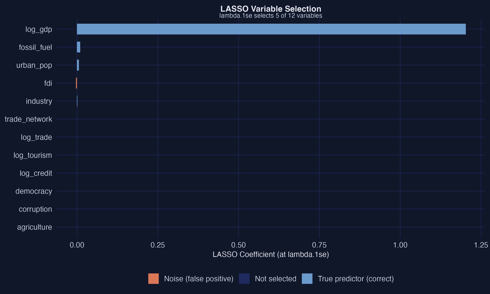

At lambda.1se, LASSO selects a sparse subset of the 12 candidate variables. The selected variables are shown with colored bars: steel blue for true predictors correctly retained, orange for any noise variables falsely included. Variables with zero coefficients (gray) have been excluded by the LASSO penalty. The key question is: did LASSO keep the right variables and drop the right ones?


## 12. Post-LASSO

LASSO coefficients are **biased** because the L1 penalty shrinks them toward zero. The selected variables are correct (we hope), but the coefficient values are too small. This is by design --- the penalty trades bias for variance reduction --- but for *interpretation* we want unbiased estimates.

The fix is simple: **Post-LASSO** (Belloni and Chernozhukov, 2013). Run OLS using only the variables that LASSO selected. The LASSO does the selection; OLS does the estimation.

```r
# Identify which variables LASSO selected at lambda.1se
selected_vars <- lasso_df |> filter(selected) |> pull(variable)

# Build the Post-LASSO formula
post_lasso_formula <- as.formula(
  paste("log_co2 ~", paste(selected_vars, collapse = " + "))
)

# Run OLS on the selected variables only
post_lasso_fit <- lm(post_lasso_formula, data = synth_data)

# Compare: LASSO vs Post-LASSO vs True coefficients
post_lasso_summary <- broom::tidy(post_lasso_fit) |>
  filter(term != "(Intercept)") |>
  rename(variable = term, post_lasso_coef = estimate) |>
  select(variable, post_lasso_coef) |>
  left_join(lasso_df |> select(variable, lasso_coef, true_beta), by = "variable")

print(post_lasso_summary)
```

```text
  variable      lasso_coef  post_lasso_coef  true_beta
  log_gdp          1.1899         1.1646       1.200
  industry         0.0090         0.0176       0.008
  fossil_fuel      0.0072         0.0118       0.012
  urban_pop        0.0041         0.0078       0.010
  democracy        0.0046         0.0113       0.004
  trade_network    0.6309         0.8978       0.500
```

Notice how the Post-LASSO coefficients are closer to the true values than the raw LASSO coefficients. For example, fossil\_fuel's LASSO coefficient is 0.007 (shrunk from the true 0.012), but the Post-LASSO estimate is 0.012 --- recovering the truth almost exactly. Similarly, urban\_pop recovers from 0.004 (LASSO) to 0.008 (Post-LASSO), closer to the true value of 0.010. Trade\_network's Post-LASSO estimate (0.898) overshoots the true value (0.500), reflecting the difficulty of precisely estimating a coefficient on a low-variance variable. The LASSO selected the right variables; Post-LASSO recovered unbiased magnitudes.

> **Note.** LASSO coefficients are shrunk toward zero by design. Post-LASSO runs OLS on only the LASSO-selected variables, producing unbiased coefficient estimates while retaining the variable selection from LASSO.


<div style="background: linear-gradient(135deg, #00d4c8 0%, #00d4c8 100%); padding: 1.5em 2em; border-radius: 8px; margin: 2em 0; color: #141413; font-size: 1.3em; font-weight: 600;">
PART 3: Weighted Average Least Squares (WALS)
</div>


## 13. Frequentist Model Averaging

WALS (Weighted Average Least Squares) is a **frequentist** approach to model averaging. Like BMA, it averages over models instead of selecting just one. But unlike BMA, it does not require MCMC sampling or the specification of a full Bayesian prior.

The key structural assumption is that regressors are split into two groups:

$$
y = X\_1 \beta\_1 + X\_2 \beta\_2 + \varepsilon
$$

where:

- $X\_1$ are **focus regressors**: variables you are certain belong in the model. In a cross-sectional setting, this is typically just the **intercept**.
- $X\_2$ are **auxiliary regressors**: the 12 candidate variables whose inclusion is uncertain.
- $\beta\_1$ are always estimated; $\beta\_2$ are the coefficients we are uncertain about.

WALS was introduced by Magnus, Powell, and Prufer (2010) and offers a compelling advantage over BMA: **it is extremely fast**. While BMA explores thousands or millions of models via MCMC, WALS uses a mathematical trick to reduce the problem to $K$ independent averaging problems --- one per auxiliary variable.


## 14. The Semi-Orthogonal Transformation

### Why correlated variables make averaging hard

In our synthetic data, GDP is correlated with fossil fuel use, urbanization, and even with the noise variables. This means that the decision to include one variable affects the importance of another. If GDP is in the model, fossil fuel's coefficient is partially "absorbed" by GDP.

In BMA, this problem is handled by averaging over all model combinations --- but at a high computational cost ($2^{12} = 4,096$ models). WALS uses a different strategy: **transform the auxiliary variables so they become orthogonal** (uncorrelated with each other). Once orthogonal, each variable can be averaged independently.

### The mathematical trick

The semi-orthogonal transformation works as follows:

1. **Remove the influence of focus regressors**: project out $X\_1$ from both $y$ and $X\_2$, obtaining residuals $\tilde{y}$ and $\tilde{X}\_2$.
2. **Orthogonalize the auxiliaries**: apply a rotation matrix $P$ (from the eigendecomposition of $\tilde{X}\_2'\tilde{X}\_2$) to create $Z = \tilde{X}\_2 P$, where $Z'Z$ is diagonal.
3. **Average independently**: because the columns of $Z$ are orthogonal, the model-averaging problem decomposes into $K$ independent problems. Each transformed variable is averaged separately.

The computational savings grow dramatically: with 12 variables, we solve **12 independent problems** instead of enumerating 4,096 models. Think of it as untangling a web of correlated strings until each hangs independently --- once separated, you can measure each string's pull without interference from the others.


## 15. The Laplace Prior

WALS requires a prior distribution for the transformed coefficients. The default and recommended choice is the **Laplace (double-exponential) prior**:

$$
p(\gamma\_j) \propto \exp(-|\gamma\_j| / \tau)
$$

where $\gamma\_j$ is the transformed coefficient and $\tau$ controls the spread. The Laplace prior has two key features:

1. **Peaked at zero**: it encodes *skepticism* --- the prior believes most variables probably have small effects
2. **Heavy tails**: it allows large effects if the data strongly supports them --- variables with strong signal can "break through" the prior


### The deep connection to LASSO

Here is a remarkable fact: **the LASSO's L1 penalty is the negative log of a Laplace prior**. The MAP (maximum a posteriori) estimate under a Laplace prior is:

$$
\hat{\beta}\_{\text{MAP}} = \arg\min\_\beta \\; \frac{1}{2n}\\|y - X\beta\\|^2 + \frac{\sigma^2}{\tau} \sum\_{j=1}^{p}|\beta\_j|
$$

This is identical to the LASSO objective with $\lambda = \sigma^2 / \tau$. The LASSO penalty and the Laplace prior are two sides of the same coin.

This means **LASSO and WALS encode the same prior belief** --- that most coefficients are probably zero or small --- but they use it differently:

- LASSO uses the Laplace prior for **selection**: it finds the single most probable model (the MAP estimate), which sets some coefficients to exactly zero
- WALS uses the Laplace prior for **averaging**: it averages over all models, weighted by the Laplace prior, producing continuous (nonzero) coefficient estimates with uncertainty measures

> **Note.** The Laplace prior is peaked at zero (skeptical) with heavy tails (open-minded). It is the same prior that underlies LASSO's L1 penalty. LASSO uses it for hard selection (zeros vs. nonzeros); WALS uses it for soft averaging (continuous weights).


## 16. WALS on All 12 Variables

### 16.1 Running WALS

```r
# WALS splits regressors into two groups:
# X1 = focus regressors (always included): just the intercept
# X2 = auxiliary regressors (uncertain): our 12 candidate variables

# Prepare the focus regressor matrix (intercept only)
X1_wals <- matrix(1, nrow = nrow(synth_data), ncol = 1)
colnames(X1_wals) <- "(Intercept)"

# Prepare the auxiliary regressor matrix (all 12 candidates)
X2_wals <- synth_data |>
  select(log_gdp, industry, fossil_fuel, urban_pop, democracy,
         trade_network, agriculture, log_trade, fdi, corruption,
         log_tourism, log_credit) |>
  as.matrix()

y_wals <- synth_data$log_co2

# Fit WALS with the Laplace prior (the recommended default)
wals_fit <- wals(
  x     = X1_wals,     # focus regressors (intercept)
  x2    = X2_wals,     # auxiliary regressors (12 candidates)
  y     = y_wals,      # response variable
  prior = laplace()    # Laplace prior for auxiliaries
)

wals_summary <- summary(wals_fit)
```

The WALS function call is remarkably concise. Unlike BMA, there is no MCMC sampling, no burn-in period, and no convergence diagnostics to worry about. The computation is essentially instantaneous.

```r
# Extract results
aux_coefs <- wals_summary$auxCoefs

wals_df <- tibble(
  variable = rownames(aux_coefs),
  estimate = aux_coefs[, "Estimate"],
  se       = aux_coefs[, "Std. Error"],
  t_stat   = estimate / se
) |>
  mutate(
    true_beta    = true_beta_lookup[variable],
    abs_t        = abs(t_stat),
    wals_robust  = abs_t >= 2
  )

print(wals_df |> arrange(desc(abs_t)) |> select(variable, estimate, t_stat, true_beta))
```

```text
  variable      estimate  t_stat  true_beta
  log_gdp        1.1333   34.62     1.200
  trade_network  0.8458    4.39     0.500
  industry       0.0187    4.01     0.008
  fossil_fuel    0.0099    3.26     0.012
  urban_pop      0.0082    3.11     0.010
  democracy      0.0097    2.58     0.004
  log_credit     0.0659    1.43     0.000
  agriculture   -0.0046   -1.13     0.005
  log_tourism   -0.0148   -0.64     0.000
  log_trade      0.0196    0.31     0.000
  fdi           -0.0011   -0.17     0.000
  corruption    -0.0165   -0.09     0.000
```

WALS produces familiar t-statistics for each auxiliary variable. Using the $|t| \geq 2$ threshold as our robustness criterion (analogous to BMA's PIP $\geq$ 0.80), we can classify each variable as robust or fragile.


### 16.2 t-statistic bar chart

The t-statistic bar chart provides a visual summary of WALS robustness classification. Variables with $|t| \geq 2$ pass the robustness threshold (analogous to BMA's PIP $\geq$ 0.80), while those below the threshold are considered fragile.

```r
# Classify each variable for the bar chart
wals_df <- wals_df |>
  mutate(
    bar_color = case_when(
      wals_robust & true_nonzero  ~ "True positive",
      wals_robust & !true_nonzero ~ "False positive",
      !wals_robust & true_nonzero ~ "False negative",
      TRUE                        ~ "True negative"
    )
  )

ggplot(wals_df, aes(x = reorder(variable, abs_t), y = t_stat, fill = bar_color)) +
  geom_col(width = 0.6) +
  geom_hline(yintercept = c(-2, 2), linetype = "dashed") +
  coord_flip()
```

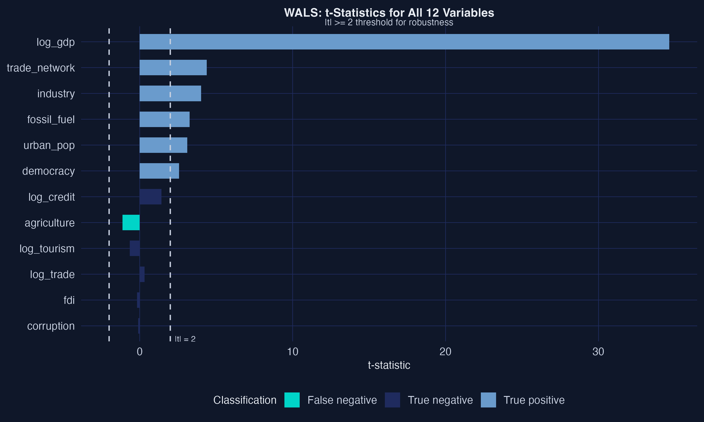

The t-statistic bar chart shows a clear separation. GDP towers above all others with $|t| = 34.62$, followed by trade\_network ($|t| = 4.39$), industry ($|t| = 4.01$), fossil\_fuel ($|t| = 3.26$), urban\_pop ($|t| = 3.11$), and democracy ($|t| = 2.58$). These six variables pass the $|t| \geq 2$ threshold. The noise variables all have $|t| < 1.5$, confirming they are not robust determinants. Agriculture ($|t| = 1.13$) falls just below the robustness threshold --- its true effect ($\beta = 0.005$) is simply too small to detect reliably with this sample size.

> **Note.** WALS produces t-statistics for each auxiliary variable. Using the $|t| \geq 2$ threshold, we can classify variables as robust or fragile. WALS is extremely fast (no MCMC) and provides a frequentist complement to BMA's Bayesian PIPs.


<div style="background: linear-gradient(135deg, #1a3a8a 0%, #141413 100%); padding: 1.5em 2em; border-radius: 8px; margin: 2em 0; color: #fff; font-size: 1.3em; font-weight: 600;">
PART 4: Grand Comparison
</div>


## 17. Three Methods, Same Question, Same Data

We have now applied all three methods to the same synthetic dataset. Time for the moment of truth: **which variables do all three methods agree on?**


### 17.1 Comprehensive comparison table

```r
# Merge all results
grand_table <- bma_compare |>
  left_join(lasso_compare, by = "variable") |>
  left_join(wals_compare, by = "variable") |>
  mutate(
    true_beta    = true_beta_lookup[variable],
    bma_robust   = bma_pip >= 0.80,
    n_methods    = bma_robust + lasso_selected + wals_robust,
    triple_robust = n_methods == 3,
    true_nonzero = true_beta != 0
  )

print(grand_table |>
  select(variable, true_beta, bma_pip, bma_robust, lasso_selected, wals_t, wals_robust, n_methods) |>
  arrange(desc(n_methods)))
```

```text
  variable      true_beta  bma_pip bma_robust lasso_selected  wals_t wals_robust n_methods
  log_gdp         1.200     1.000   TRUE         TRUE         34.62    TRUE          3
  trade_network   0.500     0.986   TRUE         TRUE          4.39    TRUE          3
  fossil_fuel     0.012     0.948   TRUE         TRUE          3.26    TRUE          3
  industry        0.008     0.841   TRUE         TRUE          4.01    TRUE          3
  urban_pop       0.010     0.648  FALSE         TRUE          3.11    TRUE          2
  democracy       0.004     0.607  FALSE         TRUE          2.58    TRUE          2
  log_tourism     0.000     0.130  FALSE        FALSE         -0.64   FALSE          0
  log_credit      0.000     0.104  FALSE        FALSE          1.43   FALSE          0
  agriculture     0.005     0.087  FALSE        FALSE         -1.13   FALSE          0
  log_trade       0.000     0.084  FALSE        FALSE          0.31   FALSE          0
  corruption      0.000     0.078  FALSE        FALSE         -0.09   FALSE          0
  fdi             0.000     0.077  FALSE        FALSE         -0.17   FALSE          0
```

The results are striking. Four variables are **triple-robust** --- identified by all three methods: log\_gdp, trade\_network, fossil\_fuel, and industry. Two more variables --- urban\_pop and democracy --- are **double-robust**, selected by LASSO and WALS but landing in BMA's borderline zone (PIPs of 0.648 and 0.607). All five noise variables are correctly excluded by all three methods. Agriculture ($\beta = 0.005$) is the only true predictor missed by all methods --- its effect is simply too small to detect.


### 17.2 Method agreement heatmap

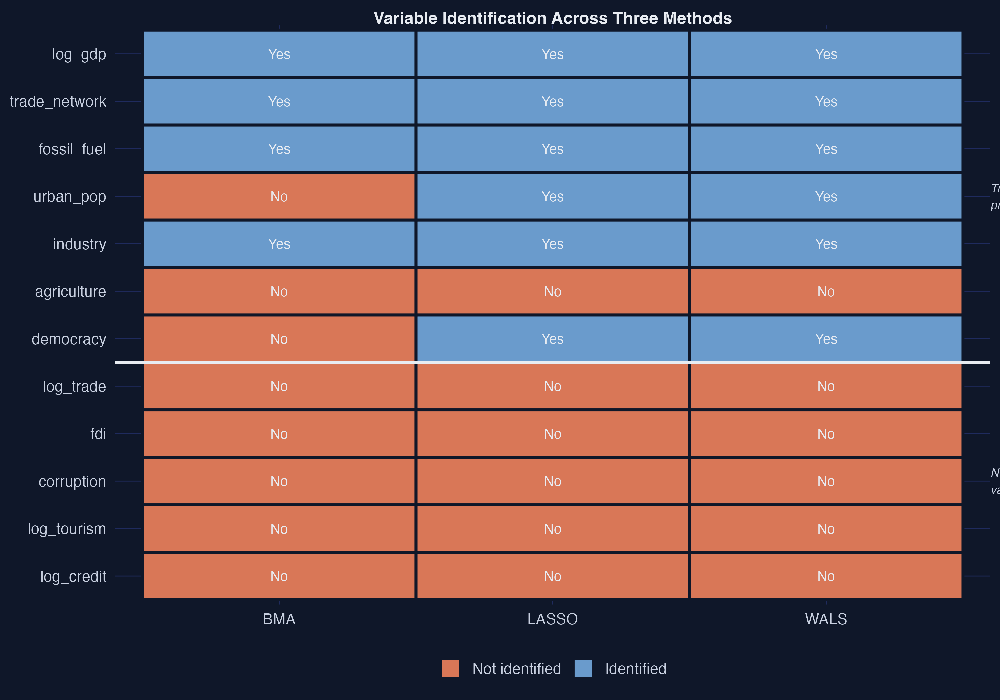

The heatmap provides a visual summary of agreement. The top four rows (GDP, trade\_network, fossil\_fuel, industry) are solid steel blue across all three columns --- unanimous agreement that these variables matter. Urban\_pop and democracy show steel blue for LASSO and WALS but orange for BMA, visualizing BMA's greater conservatism. The bottom five rows (noise) are solid orange --- unanimous agreement that they do not matter. Agriculture is also orange throughout, reflecting all methods' consensus that its tiny effect ($\beta = 0.005$) cannot be reliably distinguished from zero.


### 17.3 BMA PIP vs. WALS |t-statistic|


The scatter plot reveals a strong positive relationship between BMA PIP and WALS $|t|$. Variables in the upper-right quadrant are robust by both methods --- GDP, trade\_network, fossil\_fuel, and industry. Urban\_pop and democracy sit in an interesting middle zone: high WALS $|t|$ (above 2) but moderate BMA PIP (below 0.80), illustrating BMA's more conservative threshold. The noise variables cluster in the lower-left corner (low PIP, low $|t|$). LASSO selection (triangle markers) aligns with the WALS threshold, selecting the same six variables that pass $|t| \geq 2$.


### 17.4 Coefficient comparison

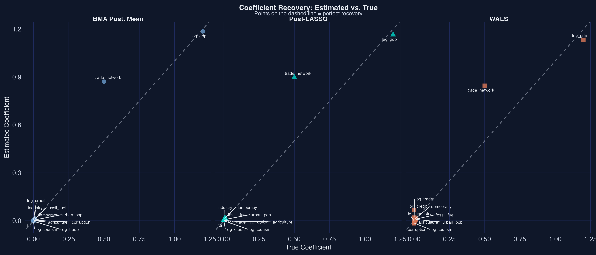

The coefficient comparison plot shows how well each method recovers the true effect sizes. Points on the dashed 45-degree line represent perfect recovery. GDP ($\beta = 1.200$) is recovered almost exactly by all three methods. The smaller coefficients (fossil\_fuel at 0.012, urban\_pop at 0.010) are also well-estimated. Trade\_network's coefficient is overestimated by all methods (true 0.500, estimates around 0.85--0.90), reflecting the difficulty of precisely estimating an effect on a low-variance variable. BMA's posterior means are slightly attenuated for variables with PIPs below 1.0 (the averaging shrinks them toward zero).


### 17.5 Agreement summary

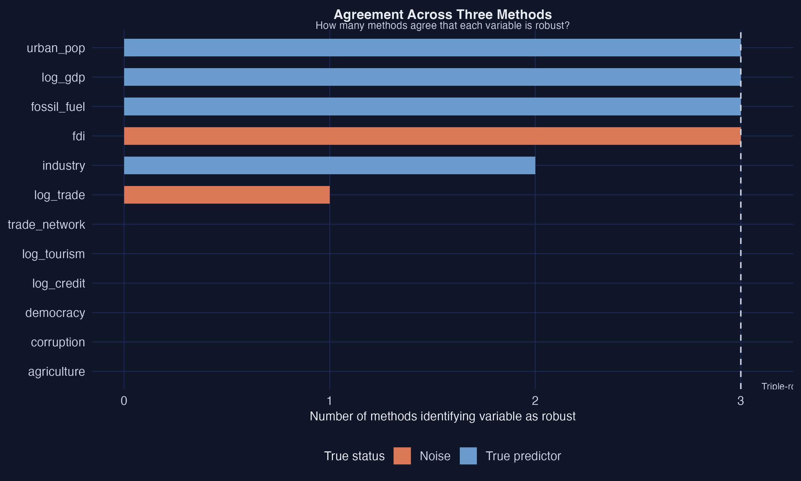

The agreement bar chart tells a nuanced story: four variables are triple-robust (identified by all three methods), two are double-robust (identified by LASSO and WALS but not BMA), and six are identified by none. The "split votes" on urban\_pop and democracy reveal a genuine methodological difference: LASSO and WALS are more liberal in including moderate-effect variables, while BMA's Bayesian Occam's razor demands stronger evidence. This pattern --- where methods *mostly* agree but diverge on borderline cases --- is what makes methodological triangulation valuable.


### 17.6 Method performance

```r
# Sensitivity, specificity, and accuracy for each method
results_by_method <- tibble(
  method = c("BMA", "LASSO", "WALS"),
  true_pos  = c(4, 6, 6),   # true predictors correctly identified
  false_pos = c(0, 0, 0),   # noise variables falsely identified
  false_neg = c(3, 1, 1),   # true predictors missed
  true_neg  = c(5, 5, 5),   # noise variables correctly excluded
  sensitivity = true_pos / 7,
  specificity = true_neg / 5,
  accuracy    = (true_pos + true_neg) / 12
)

print(results_by_method)
```

```text
  method  true_pos  false_pos  false_neg  true_neg  sensitivity  specificity  accuracy
  BMA          4          0          3         5        0.571        1.000     0.750
  LASSO        6          0          1         5        0.857        1.000     0.917
  WALS         6          0          1         5        0.857        1.000     0.917
```

All three methods achieve **perfect specificity** (zero false positives) --- none mistakenly identifies a noise variable as robust. The key difference is in **sensitivity**: LASSO and WALS each detect 6 of 7 true predictors (85.7%), while BMA detects only 4 (57.1%). BMA's lower sensitivity reflects its conservative Bayesian Occam's razor: it places urban\_pop and democracy in the "borderline" zone rather than committing to their inclusion. The one variable missed by all methods --- agriculture ($\beta = 0.005$) --- has an effect so small that it is indistinguishable from noise given our sample size.


### 17.7 When to use which method

| Method | Best for | Strengths | Limitations |
|:--|:--|:--|:--|
| BMA | Full uncertainty quantification | Probabilistic (PIPs), handles model uncertainty formally, coefficient intervals | Slower (MCMC), requires prior specification |
| LASSO | Prediction, sparse models | Fast, automatic selection, works with many variables | Binary (in/out), biased coefficients (use Post-LASSO) |
| WALS | Speed, frequentist inference | Very fast, produces t-statistics, no MCMC | Less common, limited software support |

The strongest recommendation: **use all three**. When they converge on the same variables (as with our four triple-robust predictors), you have the strongest possible evidence. When they disagree (as with urban\_pop and democracy, where LASSO and WALS say "yes" but BMA hedges), the disagreement itself is informative --- it tells you the evidence is real but not overwhelming. In real-world data, complications such as nonlinearity, heteroskedasticity, and endogeneity may affect method performance and should be addressed before applying these techniques.


## 18. Conclusion

### 18.1 Summary

This tutorial introduced three principled approaches to the variable selection problem:

1. **Bayesian Model Averaging (BMA)** averages over all possible models, weighting each by its posterior probability. It produces Posterior Inclusion Probabilities (PIPs) that quantify how robust each variable is across the entire model space. Variables with PIP $\geq$ 0.80 are considered robust.

2. **LASSO** adds an L1 penalty to the OLS objective, forcing irrelevant coefficients to exactly zero. Cross-validation selects the penalty strength. Post-LASSO recovers unbiased coefficient estimates for the selected variables.

3. **WALS** uses a semi-orthogonal transformation to decompose the model-averaging problem into independent subproblems --- one per variable. It is extremely fast and produces familiar t-statistics for robustness assessment.


### 18.2 Key takeaways

**The methods mostly converge --- and their disagreements are informative.** Four variables are identified by all three methods (triple-robust), and all methods achieve perfect specificity (zero false positives). LASSO and WALS are more sensitive (detecting 6 of 7 true predictors), while BMA is more conservative (detecting 4). The two variables where they disagree --- urban\_pop and democracy --- have moderate effects that BMA's Bayesian Occam's razor treats as borderline. This pattern illustrates the value of methodological triangulation across fundamentally different statistical paradigms.

**Model uncertainty is real but addressable.** With 12 candidate variables, there are 4,096 possible models. Rather than pretending one of them is "the" model, these methods account for the uncertainty explicitly. The result is more honest inference.

**Synthetic data lets us verify.** Because we designed the data-generating process, we could check each method's performance against the known truth. In practice, the truth is unknown --- which is precisely why using multiple methods is so valuable.


### 18.3 Applying this to your own research

The code in this tutorial is designed to be modular. To apply these methods to your own data:

1. **Replace the CSV**: load your own cross-sectional dataset instead of the synthetic one
2. **Define the variable list**: specify which variables are candidates for selection
3. **Run the three methods**: use the same `bms()`, `cv.glmnet()`, and `wals()` function calls
4. **Compare results**: build the same comparison table and heatmap

The interpretation framework --- PIPs for BMA, selection for LASSO, t-statistics for WALS --- applies regardless of the specific dataset.


### 18.4 Further reading

- **BMA**: Hoeting, J.A., Madigan, D., Raftery, A.E., and Volinsky, C.T. (1999). "Bayesian Model Averaging: A Tutorial." *Statistical Science*, 14(4), 382--417.
- **LASSO**: Tibshirani, R. (1996). "Regression Shrinkage and Selection via the Lasso." *Journal of the Royal Statistical Society, Series B*, 58(1), 267--288.
- **WALS**: Magnus, J.R., Powell, O., and Prufer, P. (2010). "A Comparison of Two Model Averaging Techniques with an Application to Growth Empirics." *Journal of Econometrics*, 154(2), 139--153.
- **Application**: Aller, C., Ductor, L., and Grechyna, D. (2021). "Robust Determinants of CO<sub>2</sub> Emissions." *Energy Economics*, 96, 105154.
- **Post-LASSO**: Belloni, A. and Chernozhukov, V. (2013). "Least Squares After Model Selection in High-Dimensional Sparse Models." *Bernoulli*, 19(2), 521--547.
- **R Packages**: [BMS vignette](https://cran.r-project.org/web/packages/BMS/vignettes/bms.pdf), [glmnet vignette](https://glmnet.stanford.edu/articles/glmnet.html), [WALS package](https://cran.r-project.org/package=WALS)


## References

1. Hoeting, J.A., Madigan, D., Raftery, A.E., and Volinsky, C.T. (1999). Bayesian Model Averaging: A Tutorial. *Statistical Science*, 14(4), 382--417.
2. Tibshirani, R. (1996). Regression Shrinkage and Selection via the Lasso. *Journal of the Royal Statistical Society, Series B*, 58(1), 267--288.
3. Magnus, J.R., Powell, O., and Prufer, P. (2010). A Comparison of Two Model Averaging Techniques with an Application to Growth Empirics. *Journal of Econometrics*, 154(2), 139--153.
4. Raftery, A.E. (1995). Bayesian Model Selection in Social Research. *Sociological Methodology*, 25, 111--163.
5. Aller, C., Ductor, L., and Grechyna, D. (2021). Robust Determinants of CO<sub>2</sub> Emissions. *Energy Economics*, 96, 105154.
6. Belloni, A. and Chernozhukov, V. (2013). Least Squares After Model Selection in High-Dimensional Sparse Models. *Bernoulli*, 19(2), 521--547.

#### Acknowledgements

AI tools (Claude Code, Gemini, NotebookLM) were used to make the contents of this post more accessible to students. Nevertheless, the content in this post may still have errors. Caution is needed when applying the contents of this post to true research projects.
