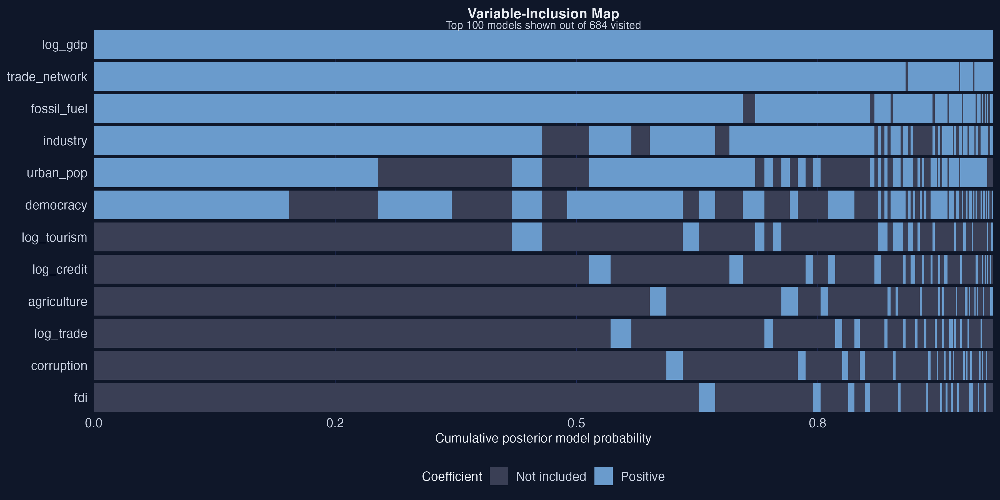
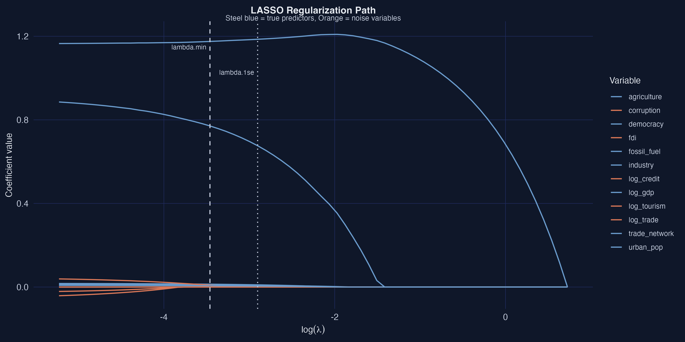
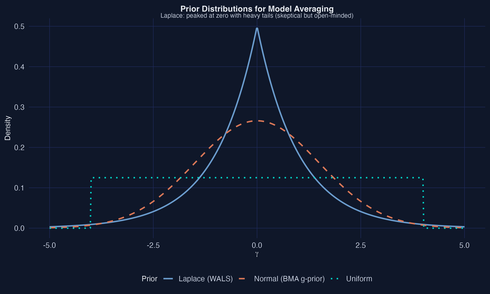
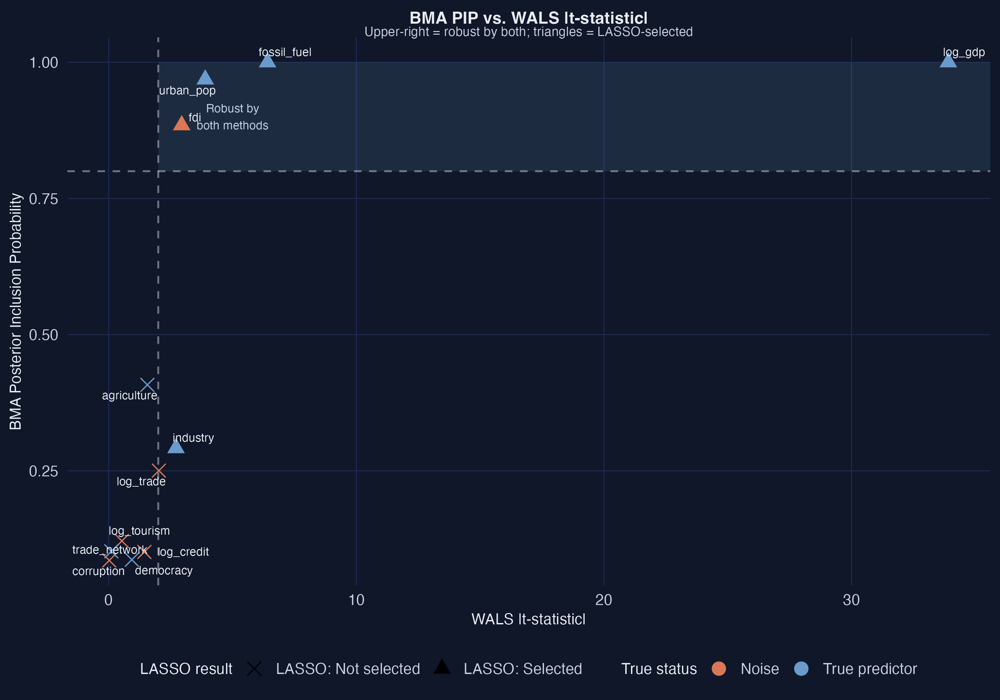

# The Tension {.divider background-color="#d97757"}

[Act I]{.act}

## With 12 candidate drivers, $2^{12}=4{,}096$ models give 4,096 different answers

You advise a government on climate policy. You have a dozen candidate drivers of CO$_2$ emissions and a limited budget.

. . .

Run one regression and report it, and you have assumed the other **4,095** models are wrong. *Which subset truly matters — and which are red herrings?*

::: {.notes}
This is the variable-selection problem. Specification searching — try many models, drop the insignificant, report the winner — inflates false discoveries through the file-drawer and pretesting problems. The same data can yield opposite answers depending on the selection rule.
:::

## We built an answer key: 7 true predictors, 5 pure-noise impostors

::: {.notes}
Spoiler / setup figure. 120 synthetic countries, 12 candidate regressors. set.seed(2017). Seven coefficients are truly nonzero, five are exactly zero. The five noise variables are correlated with GDP, so in OLS they "borrow" explanatory power. Because we designed the DGP, we know the truth and can grade each method.
:::

## Naive OLS already flirts with spurious significance {background-color="#141413"}

[0.98]{.bignum}

[$R^2$ of the kitchen-sink OLS — a great fit that still cannot tell signal from noise]{.bignum-label}

::: {.notes}
Throw all 12 regressors into lm(): R² = 0.98, but noise variables get non-negligible coefficients. log_trade t = −0.86, corruption t = 0.05 — not significant here, yet in a different draw they could cross 5%. That fragility is exactly what principled selection fixes.
:::

## Where we're going

::: {.incremental}
- The lab: 120 countries, 12 candidate regressors, a known answer key
- **BMA** — average 4,096 models, read off Posterior Inclusion Probabilities
- **LASSO** — an L1 penalty that zeroes weak controls automatically
- **WALS** — fast frequentist averaging that returns t-statistics
- The payoff: which variables survive *all three*
:::

# The Investigation {.divider background-color="#6a9bcc"}

[Act II]{.act}

## Three mechanically distinct answers to one question

:::: {.columns}
::: {.column width="33%"}
### BMA
- Average all 4,096 models
- Weight by posterior probability
- Output: $\Pr(M_k\mid y)$ → PIP
:::
::: {.column width="33%"}
### LASSO
- One L1-penalized fit
- Drives weak coefficients to zero
- Output: a sparse subset
:::
::: {.column width="33%"}
### WALS
- Frequentist averaging
- Orthogonalize, then average
- Output: t-statistics
:::
::::

[Different machinery, same target — agreement across them is what earns credibility.]{.comment}

::: {.notes}
The pedagogical spine. BMA is Bayesian and explores the whole model space; LASSO finds one MAP-style sparse model; WALS averages in closed form. They share the goal of separating signal from noise but get there by genuinely different routes — the precondition for triangulation.
:::

## BMA is just Bayes' rule applied to 4,096 models

$$P(M_k\mid y)=\frac{P(y\mid M_k)\,P(M_k)}{\sum_{l=1}^{2^K} P(y\mid M_l)\,P(M_l)}$$

[The marginal likelihood $P(y\mid M_k)$ is a built-in Occam's razor — complex models spread their probability thin.]{.comment}

::: {.notes}
Replace "fair coin / biased coin" with "which variables belong in the model." Uniform model prior P(M_k)=1/4096, so the posterior is driven entirely by the data. With 12 regressors the sampler explores all 4,096 models efficiently.
:::

## A variable's PIP is a weighted democratic vote across models

$$\text{PIP}_j=\sum_{k:\,j\in M_k} P(M_k\mid y)$$

Each of the 4,096 models votes for which variables matter — but better-fitting models get louder voices. We call PIP $\geq 0.80$ "robust" (Raftery 1995).

::: {.notes}
PIP is the total posterior mass on models containing variable j. The toy 3-variable example makes this concrete: log_gdp PIP = 1.000, fossil_fuel = 0.965, the noise variable log_trade = 0.099 — exactly the pattern we want.
:::

## BMA flags four robust drivers and zero false positives

::: {.notes}
Clear signal/noise separation. Urban_pop (0.648) and democracy (0.607) land borderline — true predictors whose effects are moderate enough that BMA hedges. Agriculture (β = 0.005, PIP = 0.087) is missed: BMA prioritizes precision over sensitivity.
:::

## The top models agree: the same four variables, every time

::: {.notes}
x-axis is cumulative posterior model probability, so wide columns are the models the data strongly supports. log_gdp, trade_network, fossil_fuel, industry are solid blue across nearly the entire axis. Noise variables flicker in and out, sometimes with the wrong (orange) sign — a visual signature of fragility.
:::

## LASSO trades a little bias for a large cut in variance

$$\text{MSE}=\text{Bias}^2+\text{Variance}+\text{Irreducible noise}$$

::: {.notes}
OLS is unbiased but high-variance with many correlated regressors. A penalty acts like a budget constraint: variables that don't earn their keep get zeroed. The whole point of LASSO is to sit at the minimum of this U-shaped total error.
:::

## The L1 diamond has corners — that is why LASSO selects

$$\hat\beta_{\text{LASSO}}=\arg\min_\beta\ \frac{1}{2n}\|y-X\beta\|^2+\lambda\sum_{j=1}^{p}|\beta_j|$$

::: {.notes}
The $\lambda\sum_j|\beta_j|$ penalty is what makes corners. Ridge's L2 ball has none, so it shrinks but never selects. LASSO does estimation and selection simultaneously; Ridge only estimates.
:::

## Noise dies first; GDP is the last variable standing

::: {.notes}
10-fold CV chooses λ. Reading the path left to right, noise variables are eliminated first because they buy too little prediction to justify their penalty cost. GDP requires the largest penalty to be killed — the strongest signal in the data.
:::

## At the parsimonious penalty, LASSO keeps six variables — all real

::: {.notes}
The parsimonious 1-SE model keeps log_gdp, industry, fossil_fuel, urban_pop, democracy, trade_network. Only agriculture is dropped among the true predictors. Perfect specificity — every noise variable correctly excluded.
:::

## Post-LASSO un-shrinks the coefficients back toward the truth

| Variable | LASSO $\hat\beta$ | Post-LASSO $\hat\beta$ | True $\beta$ |
|---|---:|---:|---:|
| log_gdp | 1.190 | [1.165]{.key} | 1.200 |
| fossil_fuel | 0.007 | 0.012 | 0.012 |
| urban_pop | 0.004 | 0.008 | 0.010 |
| trade_network | 0.631 | 0.898 | 0.500 |

[LASSO selects; OLS on the selected set estimates — recovering unbiased magnitudes.]{.comment}

::: {.notes}
L1 shrinks coefficients by design, so raw LASSO estimates are too small (fossil_fuel 0.007 vs true 0.012). Post-LASSO (Belloni–Chernozhukov 2013) refits OLS on the selected support: fossil_fuel snaps to 0.012, exactly the truth. Trade_network overshoots (0.898) — a low-variance regressor is genuinely hard to pin down.
:::

## WALS averages with the *same* prior LASSO uses for selection

$$p(\gamma_j)\propto\exp(-|\gamma_j|/\tau)$$

::: {.notes}
Remarkable connection: LASSO's MAP estimate under a Laplace prior gives $\lambda=\sigma^2/\tau$. Same prior, used two ways — LASSO zeros coefficients, WALS averages them. And WALS orthogonalizes the auxiliaries, so the 4,096-model problem becomes 12 independent ones — no MCMC, near-instant.
:::

## WALS makes GDP tower: $|t|=34.62$, far above every other variable

::: {.notes}
WALS returns familiar t-statistics. Using |t| ≥ 2 (the frequentist analog of PIP ≥ 0.80): GDP 34.62, trade_network 4.39, industry 4.01, fossil_fuel 3.26, urban_pop 3.11, democracy 2.58 all pass. Agriculture (|t| = 1.13) falls just short — its β = 0.005 is too small to detect at n = 120.
:::

# The Resolution {.divider background-color="#00d4c8"}

[Act III]{.act}

## Four variables are triple-robust — the strongest claims the data supports

| Variable | BMA PIP | LASSO | WALS $\|t\|$ | Methods |
|---|---:|:--:|---:|:--:|
| log_gdp | 1.000 | yes | 34.62 | [3]{.key} |
| trade_network | 0.986 | yes | 4.39 | [3]{.key} |
| fossil_fuel | 0.948 | yes | 3.26 | [3]{.key} |
| industry | 0.841 | yes | 4.01 | [3]{.key} |
| urban_pop | 0.648 | yes | 3.11 | 2 |
| democracy | 0.607 | yes | 2.58 | 2 |

[All five noise variables: flagged by none. Agreement across mechanically distinct methods is what earns credibility.]{.comment}

::: {.notes}
The convergence slide. GDP, trade network, fossil fuel, industry are flagged by all three — triple-robust. Urban_pop and democracy are double-robust: LASSO and WALS say yes, BMA hedges in its borderline zone. That split is itself informative — the evidence is real but not overwhelming.
:::

## Three columns of agreement — and two honest splits

::: {.notes}
The visual of triangulation. Unanimous blue at the top, unanimous orange at the bottom. The two split rows are exactly the moderate-effect true predictors where BMA's stricter Occam's razor diverges from LASSO and WALS. Disagreement is concentrated precisely where the truth is borderline.
:::

## BMA and WALS line up — but BMA's bar is set higher

::: {.notes}
Strong positive relationship between the Bayesian and frequentist robustness measures. The interesting zone is the middle: urban_pop and democracy clear WALS's |t| ≥ 2 but miss BMA's PIP ≥ 0.80. LASSO selection (triangles) tracks the WALS threshold — the same six variables.
:::

## All three recover GDP almost exactly; small effects are harder

::: {.notes}
GDP (β = 1.200) recovered almost exactly everywhere. Fossil_fuel (0.012) and urban_pop (0.010) well estimated. Trade_network is overshot (true 0.500, estimates ~0.85–0.90) because its variance is low. BMA's posterior means are slightly attenuated for PIPs below 1.0 — averaging pulls them toward zero.
:::

## Same data, perfect specificity — but LASSO/WALS see more

| Method | Sensitivity | Specificity | Accuracy |
|---|---:|---:|---:|
| BMA | 57.1% | 100% | 75.0% |
| LASSO | [85.7%]{.key} | 100% | 91.7% |
| WALS | [85.7%]{.key} | 100% | 91.7% |

[Zero false positives across the board; the gap is in catching the moderate true effects.]{.comment}

::: {.notes}
All three reach 100% specificity — no noise variable is ever flagged. LASSO and WALS detect 6 of 7 true predictors (85.7%); BMA detects 4 (57.1%) because it parks urban_pop and democracy in the borderline zone. Agriculture (β = 0.005) is missed by all — too small to distinguish from noise at n = 120.
:::

## Does triangulation make this causal? No — it disciplines selection, not identification

[Objection.]{.objection} Agreeing across three methods still can't manufacture a causal effect.

. . .

[Response.]{.rebuttal} Correct. Triangulation buys **robustness of selection**, not identification. These coefficients are conditional associations; causal claims would still need exogeneity, no confounding, and correct functional form. The synthetic answer key validates the *methods*, not a CO$_2$ policy.

::: {.notes}
Steelman, don't strawman. The value here is methodological: variables flagged by mechanically distinct procedures are credible *as robust determinants in this regression*. Nonlinearity, heteroskedasticity, and endogeneity must still be addressed before any causal reading.
:::

# When three different methods agree, believe the variable — not any single model. {.divider background-color="#141413"}

::: {.notes}
The one takeaway. Model uncertainty is real (4,096 models) but addressable. BMA, LASSO, and WALS converge on four triple-robust drivers and unanimously reject the noise; their two disagreements pinpoint exactly where the evidence is genuinely borderline. Triangulation across paradigms turns model uncertainty into honest inference.
:::
