---
authors:
  - admin
categories:
  - R
  - Policy Evaluation
draft: false
featured: false
date: "2026-05-15T00:00:00Z"
external_link: ""
image:
  caption: ""
  focal_point: Smart
  placement: 3
links:
- icon: code
  icon_pack: fas
  name: "R script"
  url: analysis.R
- icon: podcast
  icon_pack: fas
  name: AI Podcast
  url: "/post/r_causalpolicy_workshop/#podcast-player"
- icon: markdown
  icon_pack: fab
  name: "MD version"
  url: https://raw.githubusercontent.com/cmg777/starter-academic-v501/master/content/post/r_causalpolicy_workshop/index.md
slides:
summary: Six estimators in one tutorial --- naive pre-post, DiD, two flavours of ITS, RDD on time, Synthetic Control, and CausalImpact --- all applied to California's 1988 Proposition 99 cigarette tax to see how much (and where) they disagree.
tags:
  - r
  - causal
  - causal inference
  - policy evaluation
  - did
  - its
  - rdd
  - synthetic control
  - causalimpact
  - panel data
title: "Six Ways to Evaluate a Policy in R: A Workshop Replication with Proposition 99"
url_code: ""
url_pdf: ""
url_slides: ""
url_video: ""
toc: true
diagram: true
---

## 1. Overview

How do you measure the causal effect of a policy when you cannot randomize who gets treated? In January 1989, California raised its cigarette tax by 25 cents per pack. The reform was called **Proposition 99**. Per-capita cigarette sales in California then fell from 116 packs in 1988 to 60 packs in 2000 — almost a 50% drop. But the country as a whole was also smoking less. So the question this tutorial is built around is deceptively simple:

> **How much of California's drop was caused by Proposition 99, and how much would have happened anyway?**

This tutorial is a faithful R replication of the one-day workshop at [causalpolicy.nl](https://causalpolicy.nl/) by the ODISSEI Social Data Science team. We run **six method families on the same dataset** and place every estimate on a single forest plot. The disagreements are then visible at a glance. ITS appears in two flavours, so the forest plot ends up with seven rows.

| # | Method family | One-line idea |
|---|---|---|
| 1 | Naive pre-post | Compare California's mean before and after 1989. |
| 2 | Difference-in-Differences (DiD) | Subtract a control state's pre/post change from California's. |
| 3 | Interrupted Time Series (ITS) | Extrapolate California's *own* pre-trend forward. Two flavours: linear growth curve and auto-selected ARIMA. |
| 4 | Regression Discontinuity on time (RDD) | Fit a piecewise line with a level and slope break at the policy date. |
| 5 | Synthetic Control | Build a weighted blend of donor states that mimics California's pre-period. |
| 6 | CausalImpact | Fit a Bayesian time-series model that uses donor states as predictors. |

Every method shares the same underlying logic. It builds a **counterfactual** — what California's smoking *would have looked like* without Proposition 99 — and reports the gap between observed and counterfactual as the estimated effect. What changes from method to method is *how* the counterfactual is built.

The case study is famous. The original Synthetic Control paper by [Abadie, Diamond, and Hainmueller (2010)](https://www.aeaweb.org/articles?id=10.1257/jasa.2010.ap08746) used exactly this dataset. We replicate their estimate within rounding, then watch what happens when five other estimators are swapped in.

**The headline finding.** Five of the six methods agree on a 13--20 pack reduction per capita. One method (DiD against a single Nevada control) collapses to noise. One method (ITS with auto-selected ARIMA) flips sign entirely. The disagreement is the lesson.

If you want to go deeper on a specific method after this tour, two sister tutorials cover the same territory in much greater detail. [Difference-in-Differences for Policy Evaluation](/post/r_did/) walks through staggered adoption, Callaway--Sant'Anna group-time ATTs, and HonestDiD sensitivity analysis. [Bayesian Spatial Synthetic Control](/post/r_sc_bayes_spatial/) revisits Proposition 99 with a spatial Bayesian extension of the synthetic-control machinery.

**Learning objectives:**

- Understand why a within-unit pre-post comparison is biased — and how each causal estimator tries to fix that bias.
- Build, fit, and interpret DiD, ITS (growth-curve and ARIMA), RDD-on-time, Synthetic Control (`tidysynth`), and CausalImpact models in R.
- Read a `synthetic_control()` pipeline end-to-end: predictors, donor weights, placebo permutations, balance tables.
- Compare six estimators on a single forest plot and explain *why* they disagree where they do.
- Apply **estimand discipline** — name the causal quantity each method targets before quoting any number.

### How to read this tutorial

Each method section follows the same four-part rhythm:

1. **The idea.** One sentence on what the method does conceptually.
2. **The code.** A short, focused R block.
3. **The output.** The numbers printed by the model.
4. **What it means.** A plain-language interpretation that ties back to the case-study question.

If you are short on time, **read the bold one-liners** in each method section for a fast tour. Read the full prose when you need the details. The Cross-method comparison (§11) and Discussion (§12) put all seven estimates side-by-side and explain the pattern.

### The shared logic of every method

The diagram below makes the common skeleton explicit. Each method needs three ingredients: California's observed outcome, a counterfactual (constructed from a different data source by each method), and the gap between the two. The gap is the estimated effect.

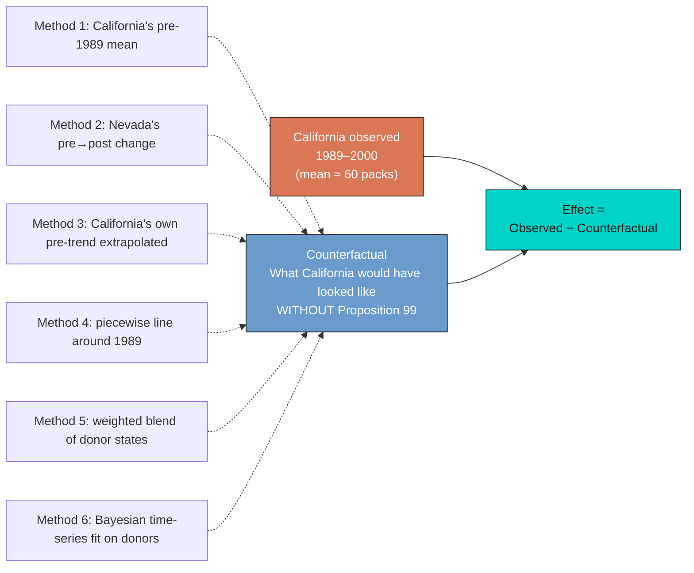

Read the diagram from left to right. The orange box (California observed) is fixed — every method sees the same data. The blue box (counterfactual) is the *construction*, and the six dashed arrows feeding it show how each method differs in its source of information. The teal box on the right is the universal output: a number measuring the gap. The whole rest of this tutorial is a guided tour of those six dashed arrows.

### Which method when?

The six methods are not interchangeable. Each one is appropriate for a different data situation. The decision tree below walks through three diagnostic questions and steers you to the matching family. Apply it whenever you face a new policy-evaluation problem.

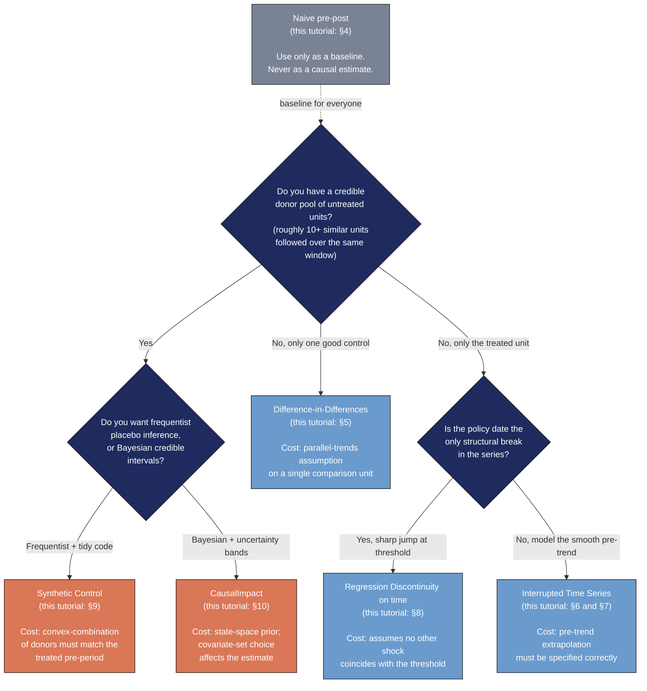

The orange terminal nodes (Synthetic Control, CausalImpact) are the most defensible families when a donor pool exists — and they happen to be the methods that produce the consensus estimate later in this tutorial. The blue nodes are valid choices in their respective data situations but carry stronger identifying assumptions. The grey naive-pre-post node is the universal baseline that *everyone* should compute first — never as the final answer, always as the bias yardstick.

### Key concepts at a glance

This post leans on a small vocabulary repeatedly. The rest of the tutorial assumes you can move between these terms quickly. Each concept below has three parts. The **definition** is always visible. The **example** and **analogy** sit behind clickable cards: open them when you need them, leave them collapsed for a quick scan.

**1. Counterfactual.**
The outcome a treated unit *would have shown* in the absence of treatment. It is the thing you cannot observe but must somehow construct in order to estimate a causal effect.

<div class="concept-pair">
<details class="concept-card concept-example">
<summary>Example</summary>

In this post, "California's cigarette sales in 1995 if Proposition 99 had not passed" is the counterfactual. Every method we cover builds one differently: ITS extrapolates California's own pre-trend, DiD borrows Nevada's change, Synthetic Control borrows a *weighted combination* of donor states, and CausalImpact borrows a Bayesian projection from a structural time-series model.

</details>

<details class="concept-card concept-analogy">
<summary>Analogy</summary>

A doctor who wants to know whether a new drug worked needs to ask "what would this patient's blood pressure have been at week 12 if they had taken a placebo?" There is no parallel universe to peek into, so they construct an estimate from similar patients, prior trends, or a control group.

</details>
</div>

**2. Parallel trends.**
The identifying assumption behind classical DiD: in the absence of treatment, the treated and control units would have moved in *parallel* over time. Differences in *levels* are allowed; differences in *trends* are not.

<div class="concept-pair">
<details class="concept-card concept-example">
<summary>Example</summary>

DiD against Nevada implicitly assumes that California and Nevada cigarette sales would have evolved on parallel paths after 1989 if Proposition 99 had never passed. The raw plot (Figure 2) shows that they were already on similar downward trajectories before 1988 --- which is why the DiD point estimate ends up so small.

</details>

<details class="concept-card concept-analogy">
<summary>Analogy</summary>

Two cars driving down a highway at the same speed. If one suddenly brakes, the *gap* between them grows --- and that gap is the "treatment effect". Parallel trends says they were going the same speed *before* the braking.

</details>
</div>

**3. Interrupted Time Series (ITS).**
A class of methods that fits a model to the treated unit's *pre-period* data, extrapolates that model into the post-period as a counterfactual, and averages the residual gap. ITS does not need a comparison unit, but it pays for that in stronger modelling assumptions about the pre-trend.

<div class="concept-pair">
<details class="concept-card concept-example">
<summary>Example</summary>

We fit two ITS counterfactuals: a simple linear `lm(cigsale ~ year)` on 1970--1988 (the *growth curve*), and an AICc-selected ARIMA model from `fpp3`. Both are then projected onto 1989--2000. The growth-curve version produces a sensible $-28$ packs estimate; the ARIMA(1, 2, 0) version produces a counterintuitive $+4.5$ packs because it extrapolates the late-1980s acceleration too aggressively.

</details>

<details class="concept-card concept-analogy">
<summary>Analogy</summary>

Predicting tomorrow's weather purely from this week's pattern. If the trend is "warming by 0.5 degrees per day", extrapolating works for a few days but fails the moment a cold front arrives.

</details>
</div>

**4. Regression Discontinuity on time.**
A regression discontinuity design where the *running variable* is the calendar year and the *threshold* is the policy adoption date. Practically, it is a piecewise linear regression of the form `cigsale ~ year + post + year:post` that allows both a level jump and a slope change at the threshold.

<div class="concept-pair">
<details class="concept-card concept-example">
<summary>Example</summary>

We fit `cigsale ~ year0 + prepost + year0:prepost` to California's full 1970--2000 series, where `year0 = year - 1989` centres the running variable at the threshold. The level break (`prepostPost` = $-20.06$ packs) is the discontinuity right at January 1989; the slope break ($-1.49$ packs/year extra) means the post-period decline accelerates relative to the pre-period.

</details>

<details class="concept-card concept-analogy">
<summary>Analogy</summary>

Imagine a road where the speed limit changes from 100 to 80 km/h at a sign. Drivers slow down right at the sign (the level break) and may also gradually drive slower over the next few kilometres (the slope break).

</details>
</div>

**5. Donor pool.**
The set of untreated units from which Synthetic Control draws weights to build a synthetic version of the treated unit. The data-driven weighting algorithm chooses how much of each donor to use.

<div class="concept-pair">
<details class="concept-card concept-example">
<summary>Example</summary>

The 38 non-California states are the donor pool. `tidysynth` chooses convex weights that minimise pre-1988 RMSE on lagged outcomes plus four covariates. The optimal mix turns out to be 34.3% Utah, 23.6% Nevada, 18.2% Montana, 17.5% Colorado, 6.2% Connecticut --- a "synthetic California" built entirely from five states.

</details>

<details class="concept-card concept-analogy">
<summary>Analogy</summary>

A cocktail recipe that has to match a specific flavour profile. Instead of using one ingredient, you blend several --- 35% lime, 25% mint, 20% sugar, etc. --- until the mixture tastes right.

</details>
</div>

**6. Posterior credible interval.**
A Bayesian interval that has a 95% probability of containing the true parameter, *given* the data and the prior. It is the Bayesian counterpart to a frequentist 95% confidence interval, but with a far more natural interpretation.

<div class="concept-pair">
<details class="concept-card concept-example">
<summary>Example</summary>

CausalImpact's full-covariate model reports an average effect of $-13$ packs with a 95% credible interval of $[-32, +5.7]$. Read literally: given the data and the structural time-series prior, there is a 95% probability that the true average ATT lies in that interval. The posterior probability of *any* causal effect is 92%.

</details>

<details class="concept-card concept-analogy">
<summary>Analogy</summary>

A weather forecast that says "70% chance of rain". You do not need 100 parallel universes; the 70% is a direct probability statement about the world, not about a sampling distribution.

</details>
</div>

**7. Average Treatment effect on the Treated (ATT) versus Average Treatment Effect (ATE).**
The **ATT** is the effect of the policy *on the units that actually received it*. The **ATE** is the effect averaged over *every unit in the population*, treated or not. These two quantities are equal only when treatment effects are constant across units.

<div class="concept-pair">
<details class="concept-card concept-example">
<summary>Example</summary>

Every causal method in this tutorial targets the ATT on California. We never ask "what would Proposition 99 do to the average state if rolled out nationwide?" — that is the ATE, and we have no policy variation to identify it. Synthetic Control, DiD, and CausalImpact all report ATT estimates of $-13$ to $-20$ packs/capita.

</details>

<details class="concept-card concept-analogy">
<summary>Analogy</summary>

A new running shoe is tested on 100 marathoners (the ATT measures how much faster *they* became). The ATE would estimate how much faster the *average person* would run if forced to wear the same shoe — a very different question.

</details>
</div>

**8. Root Mean Squared Prediction Error and its post/pre ratio.**
The Root Mean Squared Prediction Error (RMSPE) is the typical size of the gap between observed and predicted outcomes in a given period. Synthetic Control reports it separately for the pre-period (fit quality) and post-period (effect size). The **post/pre ratio** (the MSPE ratio) is a unitless measure of how much the post-period gap exceeds the pre-period gap.

<div class="concept-pair">
<details class="concept-card concept-example">
<summary>Example</summary>

California's pre-period MSPE is 3.21 (the synthetic almost perfectly tracks California through 1988). Its post-period MSPE is 387 (a large gap opens after Proposition 99). The ratio is 387 / 3.21 = 120.5, the highest of any state in the panel.

</details>

<details class="concept-card concept-analogy">
<summary>Analogy</summary>

A student who scored 99% on practice tests and 30% on the real exam has a huge "test/practice ratio". That ratio flags an unusual event between the two periods — exactly what we are looking for after a policy change.

</details>
</div>

**9. Placebo Fisher exact p-value.**
A non-parametric p-value built by ranking the treated unit against a distribution of placebo "treatments" — each computed by pretending an untreated unit had been treated instead. The p-value is the treated unit's rank divided by the total number of units. Requires at least 20 donor units to get below the conventional 0.05 threshold.

<div class="concept-pair">
<details class="concept-card concept-example">
<summary>Example</summary>

`tidysynth` refits the Synthetic Control model 38 times — once for each donor state pretending to be treated — and computes each unit's MSPE ratio. California ranks 1st out of 39 units. The Fisher exact p-value is 1 / 39 ≈ 0.026.

</details>

<details class="concept-card concept-analogy">
<summary>Analogy</summary>

A class of 39 students sits an exam. If your child gets the highest score, the "by-chance" probability of that ranking under a null of no real talent gap is 1 / 39. Same logic, applied to states instead of students.

</details>
</div>

**10. Bayesian Structural Time Series (BSTS).**
A Bayesian model that decomposes a time series into interpretable additive components: a local-level trend, a regression on external predictors, and a noise term. After fitting on the pre-period, the model is projected forward and the posterior distribution over observed-minus-predicted gives the policy effect with a credible interval.

<div class="concept-pair">
<details class="concept-card concept-example">
<summary>Example</summary>

`CausalImpact` writes California's cigarette sales as $y\_{1t} = \mu\_t + \beta^\top x\_t + \varepsilon\_t$. The trend $\mu\_t$ absorbs unexplained dynamics; the regression $\beta^\top x\_t$ borrows information from other states' cigarette sales (and optionally covariates). The model is fit on 1970–1988 and projected to 2000.

</details>

<details class="concept-card concept-analogy">
<summary>Analogy</summary>

A Kalman filter for stock prices that decomposes the daily close into a slow trend, a regression on related stocks, and noise. Once trained on the pre-event history, it forecasts the "no-event" counterfactual price and compares it to what actually happened.

</details>
</div>

## 2. Setup and packages

We use `pacman::p_load()` to install (if needed) and load every package in a single line. The script is fully reproducible: a global `set.seed(42)` fixes the random-forest imputation and the CausalImpact MCMC sampler.

```r
if (!require("pacman", quietly = TRUE)) {
  install.packages("pacman", repos = "https://cloud.r-project.org")
}
pacman::p_load(
  tidyverse,    # data manipulation + ggplot2
  sandwich,     # HAC variance estimator
  lmtest,       # coeftest
  tidysynth,    # synthetic control (tidy API)
  fpp3,         # forecasting (tsibble, fable, ARIMA)
  mice,         # multiple imputation
  CausalImpact, # Bayesian structural time series
  broom,        # tidy model output
  glue          # string interpolation
)
set.seed(42)
```

The dark-navy ggplot theme used in every figure of this post is defined in `analysis.R` as a helper called `theme_site()`. It sets the plot background to `#0f1729`, the panel grid to `#1f2b5e`, and the text to `#e8ecf2`, matching the site's other dark-themed posts.

## 3. Data: download and inspect

Like the workshop, we download a pre-prepared `proposition99.rds` file directly from `causalpolicy.nl`. The script caches the download so it only fetches once.

```r
DATA_URL  <- "https://causalpolicy.nl/data/proposition99.rds"
CACHE_RDS <- "proposition99.rds"
if (!file.exists(CACHE_RDS)) {
  download.file(DATA_URL, destfile = CACHE_RDS, mode = "wb")
}
prop99 <- read_rds(CACHE_RDS) |> as_tibble()
```

```text
Rows: 1209  Cols: 7
Columns: state, year, cigsale, lnincome, beer, age15to24, retprice
States: 39  Years: 1970 - 2000

# A tibble: 6 × 7
  state         year cigsale lnincome  beer age15to24 retprice
  <fct>        <int>   <dbl>    <dbl> <dbl>     <dbl>    <dbl>
1 Rhode Island  1970   124.        NA    NA     0.183     39.3
2 Tennessee     1970    99.8       NA    NA     0.178     39.9
3 Indiana       1970   135.        NA    NA     0.177     30.6
4 Nevada        1970   190.        NA    NA     0.162     38.9
5 Louisiana     1970   116.        NA    NA     0.185     34.3
6 Oklahoma      1970   108.        NA    NA     0.175     38.4
```

The panel is 39 states $\times$ 31 years for 1,209 observations in total. The treated unit is California, the intervention year is January 1989 (so the last full pre-period year is 1988), and the outcome is `cigsale` --- per-capita cigarette pack sales. Of the four covariates, `cigsale` and `retprice` (the retail price) are fully observed, while `lnincome` is missing 195 rows (16.1%), `age15to24` is missing 390 (32.3%), and `beer` is missing 663 (54.8%). The covariate gaps matter for CausalImpact (§10), where we will fill them with random-forest imputation; the other five methods either ignore covariates entirely or do not need them.

A quick descriptive comparison of California's pre vs post means confirms the puzzle that motivates the rest of the tutorial.

```r
prop99_cali <- prop99 |>
  filter(state == "California") |>
  mutate(prepost = factor(year > 1988, labels = c("Pre", "Post")))

prop99_cali |>
  group_by(prepost) |>
  summarize(n = n(),
            mean_cigsale = mean(cigsale),
            sd_cigsale   = sd(cigsale),
            .groups = "drop")
```

```text
# A tibble: 2 × 4
  prepost     n mean_cigsale sd_cigsale
1 Pre        19        116.        11.7
2 Post       12         60.4       12.1
```

California's average per-capita cigarette sales fell from 116.0 packs (1970--1988) to 60.4 packs (1989--2000) --- a within-state drop of 55.6 packs, or 47.9% of the pre-period mean. That is the *raw* before/after change. The rest of the tutorial is about how much of that 55.6-pack drop we can credibly attribute to Proposition 99 rather than to the broader American secular decline in smoking.

> **About Proposition 99.** California voters passed Proposition 99 — formally the Tobacco Tax and Health Protection Act — on the November 1988 ballot with 58% of the vote. It raised the state cigarette tax by 25 cents per pack starting January 1, 1989, and earmarked the revenue for anti-smoking education, health services, and tobacco-related research. The initiative was championed by the American Cancer Society, the American Lung Association, and the American Medical Association, against opposition financed by the tobacco industry. The case became the canonical Synthetic Control application after Abadie, Diamond, and Hainmueller (2010) used it to introduce the method — which is why we revisit it here with six estimators rather than just one.

Before doing any modelling, it helps to see all 39 series at once.

```r
eda_data <- prop99 |>
  mutate(unit_type = if_else(state == "California",
                             "California (treated)", "Donor state"))
ggplot(eda_data, aes(x = year, y = cigsale, group = state,
                     color = unit_type,
                     linewidth = unit_type, alpha = unit_type)) +
  geom_line() +
  geom_vline(xintercept = 1988.5, color = "#d97757",
             linetype = "dashed", linewidth = 0.7) +
  scale_color_manual(values = c("California (treated)" = "#d97757",
                                "Donor state" = "#6a9bcc"))
```

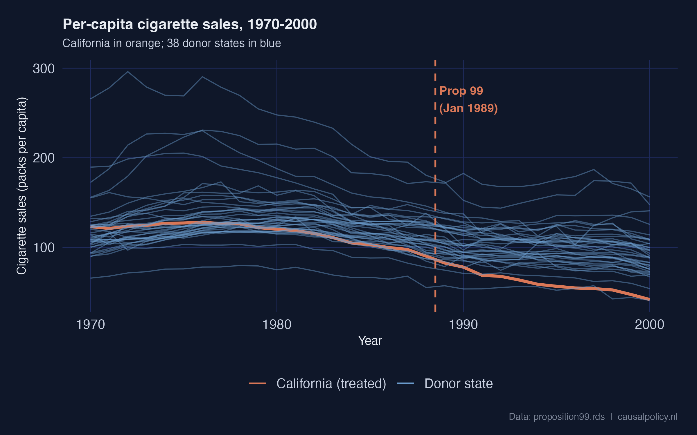

California (orange) sits inside the donor cloud throughout the 1970s and 1980s, then visibly separates downward after the dashed Proposition 99 line. The pre-1988 trajectory is already slightly below the donor median, but it is not anomalous; the sharp post-1988 separation is. Visually, this is the signal every causal estimator is trying to quantify.

## 4. Method 1 --- Naive pre-post comparison

**The idea.** Compare California's mean cigarette sales before 1989 with its mean after 1989. Call the difference the "effect".

**Why we still bother showing it.** The implicit counterfactual is "California's pre-period level continues unchanged". That is almost certainly wrong, because smoking was declining nationwide. But the estimate is so cheap to compute that it makes a useful baseline. The five later methods will each try to fix what is broken here.

We follow the workshop's narrow 1984--1993 window for direct comparability with the rest of the workshop. Using a longer window (e.g., 1970--2000) would change the numbers but not the qualitative point.

```r
fit_prepost <- lm(cigsale ~ prepost,
                  data = prop99_cali |> filter(year > 1983, year < 1994))
coeftest(fit_prepost, vcov. = vcovHAC)
```

```text
t test of coefficients:

            Estimate Std. Error t value  Pr(>|t|)
(Intercept)  98.9800     2.4999 39.5941 1.821e-10 ***
prepostPost -27.0200     5.2951 -5.1029 0.0009266 ***
```

**Reading the output.** California's mean over 1984--1988 was 98.98 packs/capita. The `prepostPost` coefficient says the 1989--1993 mean is 27.02 packs *lower*. The HAC robust standard error is 5.30 ($p < 0.001$). The HAC correction comes from `sandwich::vcovHAC` and accounts for the heteroskedasticity and autocorrelation that short time series typically exhibit. A classical OLS standard error would be wildly overconfident here.

**The estimand here is purely descriptive.** This is a within-state difference of means, *not* a causal estimate. Any nationwide secular decline in smoking gets silently bundled into the $-27.02$. That bundling is exactly what the next five methods try to undo.

**Common pitfall.** Confusing the within-state pre-post difference with a causal effect. Anything that shifted the entire country between the two windows — anti-smoking campaigns, federal tobacco settlements, rising health awareness — gets attributed entirely to Proposition 99.

**Recap.** Naive pre-post says $-27.0$ packs, but it has no counterfactual at all — only California's own past. Hold that number in mind; it will set the upper bound for what every other method estimates.

## 5. Method 2 --- Difference-in-Differences (California vs Nevada)

**The idea.** Pick one control state (Nevada). Compute its pre-to-post change. Subtract that from California's pre-to-post change. Whatever is left over is "what the policy did".

**The identifying assumption.** California and Nevada would have moved on *parallel paths* without the policy. Differences in levels are fine; differences in trends are not. The estimand becomes a proper **Average Treatment effect on the Treated** (ATT) for California.

The formal DiD identity is

$$\hat{\tau}\_{\text{DiD}} = \big(\bar{Y}\_{\text{CA, post}} - \bar{Y}\_{\text{CA, pre}}\big) - \big(\bar{Y}\_{\text{NV, post}} - \bar{Y}\_{\text{NV, pre}}\big).$$

In words: DiD takes California's change and subtracts Nevada's change. If both states would have evolved in parallel without the policy, the only thing that can drive a *difference* in their changes is the policy itself.

The four ingredients of the DiD calculation are easier to see as a 2×2 grid. Each cell holds a group mean; the two within-state changes are the row differences; the DiD estimate is the difference *of* those differences.

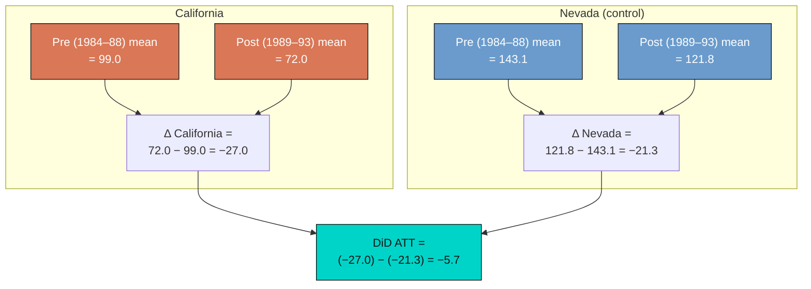

The arithmetic is literally what the regression below computes. In `cigsale ~ state * prepost`, the interaction coefficient `stateCalifornia:prepostPost` *is* the DiD estimate.

```r
prop99_did <- prop99 |>
  filter(state %in% c("California", "Nevada"),
         year > 1983, year < 1994) |>
  mutate(prepost = factor(year > 1988, labels = c("Pre", "Post")),
         state   = factor(state, levels = c("Nevada", "California")))

fit_did <- lm(cigsale ~ state * prepost, data = prop99_did)
coeftest(fit_did, vcov. = vcovHAC)
```

```text
t test of coefficients:

                            Estimate Std. Error  t value  Pr(>|t|)
(Intercept)                 143.1000     1.0918 131.0701 < 2.2e-16 ***
stateCalifornia             -44.1200     3.8796 -11.3722 4.464e-09 ***
prepostPost                 -21.3400     7.6870  -2.7761   0.01349 *
stateCalifornia:prepostPost  -5.6800     5.3929  -1.0532   0.30788
```

**Reading the output.** The interaction coefficient `stateCalifornia:prepostPost` is $-5.68$ packs (HAC SE 5.39, $p = 0.31$). That is *dramatically* smaller than the naive $-27.02$, and statistically indistinguishable from zero. Why? Because the `prepostPost` main effect is also large: $-21.34$ packs. Nevada's own cigarette sales fell by 21.3 packs between 1984--1988 and 1989--1993. When DiD subtracts that Nevada change from California's change, almost all of California's drop is absorbed.

The picture below makes the problem obvious.

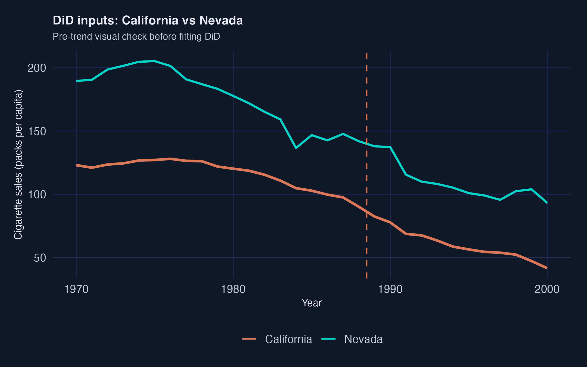

This is the textbook DiD pitfall. A single control unit that itself is shifting in the same direction makes the contrast collapse. Nevada is geographically and culturally adjacent to California. It inherits many of the same secular forces: rising health awareness, federal tobacco settlements, retail-price spillovers. So it is a poor "what would California have done?" control.

**Common pitfall.** Picking the *one* "most similar" control by hand. If your single control is subject to the same secular forces as the treated unit — geographic neighbours, policy spillovers, regional macro shocks — the contrast collapses and DiD silently reports zero.

**Recap.** DiD vs Nevada says $-5.7$ packs and we cannot reject zero. The lesson is *not* that DiD is broken — it is that DiD with a single similar control unit is fragile. Synthetic Control in §9 is the principled response: instead of one control state, blend many states into a weighted "synthetic California".

## 6. Method 3a --- Interrupted Time Series via pre-period growth curve

**The idea.** Stop borrowing from a comparison unit. Instead, build the counterfactual from California's *own* pre-period dynamics. Fit a model on 1970--1988, extrapolate it into 1989--2000, and call the gap between the extrapolation and the observed data the effect.

**Why it differs from naive pre-post.** Naive pre-post assumes "no change". ITS allows a non-zero pre-trend. If California was already declining, the ITS counterfactual continues that decline; only the *extra* drop after 1989 gets attributed to the policy.

The simplest ITS model is a linear time trend.

```r
prop99_ts <- prop99 |>
  filter(state == "California") |>
  select(year, cigsale) |>
  mutate(prepost = factor(year > 1988, labels = c("Pre", "Post"))) |>
  as_tsibble(index = year) |>
  mutate(year0 = year - 1989)

fit_growth <- lm(cigsale ~ year, data = prop99_ts |> filter(prepost == "Pre"))
summary(fit_growth)$coefficients
```

```text
             Estimate Std. Error  t value     Pr(>|t|)
(Intercept) 3637.7889   513.3284  7.087  1.823e-06 ***
year          -1.7795     0.2594 -6.860  2.767e-06 ***
```

The pre-period (1970--1988) linear trend is $-1.78$ packs/year ($p < 10^{-5}$, $R^2 = 0.735$) --- so smoking was already declining about 1.8 packs per capita per year in California well before Proposition 99. To estimate the policy effect we extrapolate that line forward to 2000 and average the gap between observed and predicted:

```r
post_df <- prop99_ts |> filter(prepost == "Post")
pred_growth <- predict(fit_growth, newdata = as_tibble(post_df))
its_growth_estimate <- mean(post_df$cigsale - pred_growth)
its_growth_estimate
```

```text
[1] -28.28
```

**Reading the output.** The ITS-growth-curve estimate is $-28.28$ packs/capita. That is essentially identical to the naive pre-post $-27.02$. Why? Because both methods only use within-California information. Neither borrows from a comparison unit. So neither can separate "California-specific effect" from "national secular decline".

The coincidence is suggestive but not reassuring. Both methods can be biased the same way if California's pre-trend was *understating* the speed of the secular decline.

**Common pitfall.** Assuming the linear pre-trend is the right *shape*. If the true secular decline is accelerating or saturating, a linear extrapolation either understates or overstates what would have happened — and the policy effect inherits the bias.

**Recap.** ITS-growth says $-28.3$ packs. Adding a linear pre-trend changed almost nothing relative to the naive baseline, because the trend was modest. The next ITS variant uses a more flexible time-series model — and we will see why "more flexible" can backfire.

## 7. Method 3b --- Interrupted Time Series via auto-selected ARIMA forecast

**The idea.** Replace the straight line with a flexible time-series model. Let the data decide the model's complexity through an information criterion (AICc). Forecast forward as the counterfactual.

**What ARIMA(p, d, q) means in plain English.** `p` is the number of past values the model uses (autoregression). `d` is the number of times the series is differenced before fitting (to handle trends). `q` is the number of past forecast errors used (moving average). Lower AICc = "better fit traded off against complexity".

```r
fit_arima <- prop99_ts |>
  filter(prepost == "Pre") |>
  model(timeseries = ARIMA(cigsale, ic = "aicc"))
report(fit_arima)
```

```text
Series: cigsale
Model: ARIMA(1,2,0)
Coefficients:
          ar1
      -0.6255
s.e.   0.2427
sigma^2 estimated as 4.953:  log likelihood = -37.45
AIC = 78.9   AICc = 79.76   BIC = 80.57
```

`ARIMA(1, 2, 0)` was selected: one autoregressive lag and *two* rounds of differencing. The double-differencing means the model is tracking the *acceleration* of California's late-1980s drop, not just its level or slope. We then forecast 12 years out and average the gap.

```r
fcasts <- forecast(fit_arima, h = "12 years")
ce_arima <- post_df$cigsale - fcasts$.mean
mean(ce_arima)
```

```text
[1] 4.55
```

**Reading the output.** The ARIMA-based ITS estimate is $+4.55$ packs. That is *positive* — it would imply Proposition 99 *increased* California's smoking. That is plainly the wrong answer. The visual diagnostic shows why:

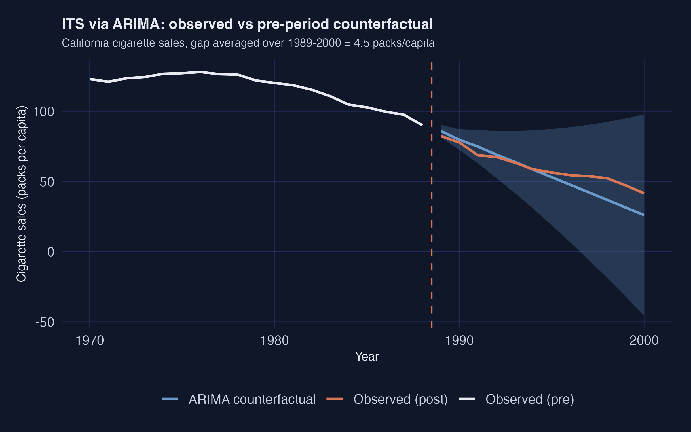

The dashed blue line is the ARIMA counterfactual. It sits *below* the observed orange series throughout the post period. The model extrapolates the late-1980s downward acceleration too aggressively. It predicts California should have hit roughly 50 packs by 2000 if the pre-period momentum had continued. Since California actually only hit 60 packs, the model concludes Proposition 99 "raised" smoking by about 5 packs relative to that doomsday counterfactual.

**The pitfall in one sentence.** AICc minimises *in-sample* fit, but in-sample fit can come from features (here, second-order momentum) that do not persist *out-of-sample*.

**Common pitfall.** Trusting an information-criterion-selected model on a short pre-period. AICc rewards in-sample fit. With 19 pre-period observations, it can latch onto late-pre-period momentum that does not persist out-of-sample, producing a counterfactual that bends through (or past) the observed post-period values.

**Recap.** ITS-ARIMA says $+4.55$ packs and is the headline-grabbing outlier. The lesson is not "ARIMA is bad" — it is that **single-model ITS is fragile**. Always pair an ITS estimate against a comparison-unit method (Synthetic Control, CausalImpact, or a credibly-matched DiD) before drawing conclusions.

## 8. Method 4 --- Regression Discontinuity on time (segmented regression)

**The idea.** Use *calendar time* as the running variable. Fit a piecewise linear regression that allows two breaks at 1989: a level jump and a slope change. The level jump is the immediate "policy shock"; the slope change is how the trajectory bends afterwards.

**A naming heads-up.** The workshop labels this specification "RDD". It is RDD with time as the running variable, not the classical sharp RDD you would use for a means-tested benefit at an income cutoff. With time as the running variable, the math reduces to *segmented regression*.

```r
fit_rdd <- lm(cigsale ~ year0 + prepost + year0:prepost,
              data = as_tibble(prop99_ts))
coeftest(fit_rdd, vcov. = vcovHAC)
```

```text
t test of coefficients:

                   Estimate Std. Error t value  Pr(>|t|)
(Intercept)        98.41579    4.96750 19.8119 < 2.2e-16 ***
year0              -1.77947    0.45909 -3.8761 0.0006137 ***
prepostPost       -20.05810    5.58538 -3.5912 0.0012911 **
year0:prepostPost  -1.49465    0.40140 -3.7236 0.0009151 ***
```

**Reading the output.** Three coefficients matter.

1. **Pre-period slope `year0` = $-1.78$ packs/year.** Matches the ITS-growth fit; sanity check passed.
2. **Level break `prepostPost` = $-20.06$ packs** (HAC SE 5.59, $p = 0.001$). California's sales drop by about 20 packs *immediately* at the 1989 threshold.
3. **Slope change `year0:prepostPost` = $-1.49$ packs/year** (HAC SE 0.40, $p < 0.001$). The post-period decline accelerates by an extra 1.5 packs/year *on top of* the pre-period 1.8 packs/year.

Combining the level break and the slope change, by 2000 (11 years after the threshold) the cumulative deviation from the extrapolated pre-trend is roughly $-20 - 11 \times 1.49 \approx -36$ packs. The piecewise fit is excellent ($R^2 = 0.973$):

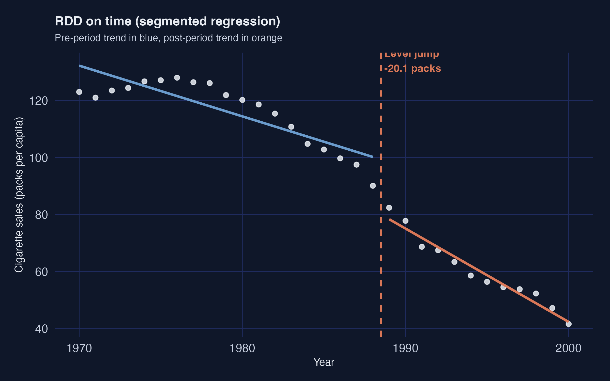

The blue pre-1988 line and the orange post-1989 line both fit California's points almost perfectly, with a clear discontinuity at the threshold.

**Caveat.** RDD on time inherits the same pre-trend mis-specification risk as ITS. If California's *underlying* trajectory was already changing curvature in the late 1980s for non-policy reasons — say, the 1988 Surgeon General's report on nicotine addiction — the level break attributed to Proposition 99 will absorb that change too.

**Common pitfall.** Mistaking a coincident shock at the threshold for the policy effect. With time as the running variable, *any* event that happens to land in the same year as the policy — a related federal regulation, a recession, a media campaign — is absorbed into the level break.

**Recap.** Regression Discontinuity on time reports a $-20.1$ pack level break with a tight standard error. It is the first of three methods to land in the credible $-13$ to $-20$ "consensus" range, alongside Synthetic Control and CausalImpact.

## 9. Method 5 --- Synthetic Control

**The idea.** Stop using one control state. Instead, build a *weighted combination* of donor states that matches California's pre-period as closely as possible on a set of predictors. The weighted combination is "synthetic California". The gap between observed California and synthetic California is the estimated effect.

**Why it works where DiD failed.** DiD against Nevada needed parallel pre-trends with one neighbour. Synthetic Control needs parallel pre-trends with a *data-driven blend* of many neighbours. The optimisation does the matching, so the analyst no longer has to pick "the right" control state by hand.

**The pipeline.** The `tidysynth` package by Eric Dunford wraps the Abadie--Diamond--Hainmueller optimisation into a tidyverse-style pipeline with four explicit stages.

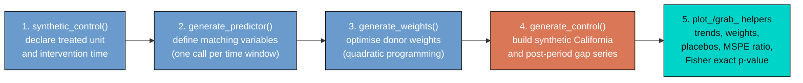

Stages 1--4 produce the estimate. Stage 5 is a battery of inspection helpers — `plot_trends()`, `plot_weights()`, `plot_placebos()`, `plot_mspe_ratio()`, `grab_unit_weights()`, `grab_predictor_weights()`, `grab_balance_table()`, `grab_significance()` — that turn the fitted object into figures and tables for diagnostics and inference. We use all of them below.

### 9.1 Fit the synthetic-control pipeline

```r
prop99_syn <- prop99 |>
  synthetic_control(
    outcome  = cigsale, unit = state, time = year,
    i_unit   = "California", i_time = 1988,
    generate_placebos = TRUE
  ) |>
  generate_predictor(
    time_window = 1980:1988,
    lnincome    = mean(lnincome, na.rm = TRUE),
    retprice    = mean(retprice, na.rm = TRUE),
    age15to24   = mean(age15to24, na.rm = TRUE)
  ) |>
  generate_predictor(time_window = 1984:1988,
                     beer = mean(beer, na.rm = TRUE)) |>
  generate_predictor(time_window = 1975, cigsale_1975 = cigsale) |>
  generate_predictor(time_window = 1980, cigsale_1980 = cigsale) |>
  generate_predictor(time_window = 1988, cigsale_1988 = cigsale) |>
  generate_weights(optimization_window = 1970:1988) |>
  generate_control()
```

**Predictor choices.** Seven predictors are passed in. Three are pre-period covariate averages over the full pre-period (`lnincome`, `retprice`, `age15to24` over 1980--1988). One uses a narrower window where data is densest (`beer` over 1984--1988). Three are *lagged outcomes* — cigarette sales themselves at 1975, 1980, and 1988. The lagged outcomes are the most important trick: anchoring the synthetic control on the treated unit's own pre-period *outcome levels* at multiple time points forces the synthetic series to track California's pre-1988 trajectory closely.

### 9.2 The donor weights and the predictor weights

The optimisation produces two weight vectors that drive the entire fit. Both are extractable as tidy tables.

```r
grab_unit_weights(prop99_syn)      # donor states (W)
grab_predictor_weights(prop99_syn) # matching variables (V)
```

```text
# Donor weights — top 5 only (rest are < 0.001)
unit          weight
Utah        0.343
Nevada      0.236
Montana     0.182
Colorado    0.175
Connecticut 0.062

# Predictor weights (V matrix)
variable       weight
cigsale_1975   0.493
cigsale_1980   0.392
cigsale_1988   0.068
retprice       0.031
beer           0.012
age15to24      0.003
lnincome       0.001
```

Two things to notice.

1. **Five states absorb 99.8% of the donor weight.** Utah, Nevada, Montana, Colorado and Connecticut. Every other state gets effectively zero. California is matched mostly to other Western/sunbelt states with similar age structure and cigarette price levels, plus Connecticut as a smoking-rate counterweight from the east.

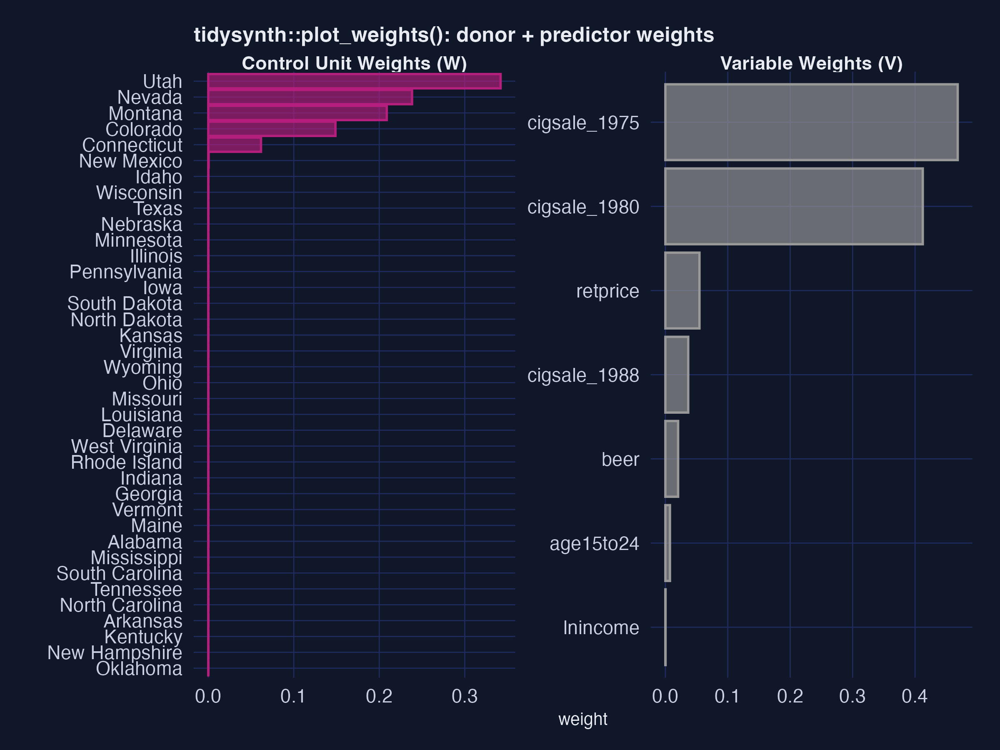

2. **The two pre-1980 cigsale levels dominate the V matrix.** `cigsale_1975` and `cigsale_1980` together get 88.5% of the predictor weight. The four behavioural and demographic covariates get less than 5% combined. The optimiser has effectively decided: "the best way to predict California's cigarette sales is using *other states' cigarette sales*."

### 9.3 The estimate

```r
sc_post <- grab_synthetic_control(prop99_syn) |>
  filter(time_unit > 1988) |>
  mutate(dif = real_y - synth_y)
mean(sc_post$dif)
```

```text
[1] -18.72
```

The Synthetic Control ATT is **$-18.72$ packs/capita** averaged over 1989--2000. This is the workshop's primary causal estimate and within rounding of the canonical Abadie et al. (2010) result.

```r
plot_trends(prop99_syn)   # built-in helper from tidysynth
```

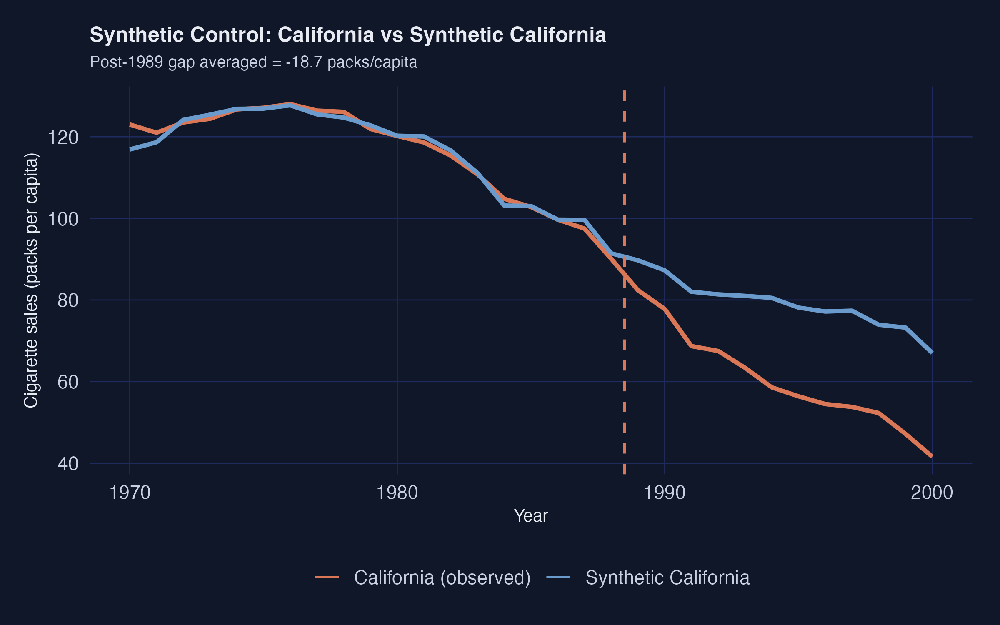

The pre-period fit is excellent — the synthetic and observed series are nearly indistinguishable through 1988. A substantial gap opens immediately after 1989, widening to roughly 30 packs by 2000.

### 9.4 Predictor balance: did the matching work?

`grab_balance_table()` shows California, synthetic California, and the unweighted donor average side-by-side on every predictor.

```text
variable     California synthetic_California donor_sample
age15to24         0.174                0.174        0.173
lnincome         10.131                9.860        9.830
retprice         89.422               89.305       87.349
beer             24.275               24.092       23.683
cigsale_1975    127.100              126.978      136.937
cigsale_1980    120.200              120.020      138.081
cigsale_1988     90.100               91.378      114.234
```

Read the rightmost two columns against the leftmost. On every variable, *synthetic California* (column 3) is far closer to California (column 2) than the unweighted donor average (column 4) is. The most dramatic improvement is on the lagged outcomes: `cigsale_1988` is 90.1 for California vs 91.4 for the synthetic — a near-perfect match — while the unweighted donor average is 114.2. That gap of 24 packs is exactly the bias the naive pre-post method silently absorbed.

### 9.5 Inference via placebo permutation

A "standard error" computed as cross-year SD divided by $\sqrt{N}$ is *not* a real sampling-distribution-based standard error. The proper Synthetic Control uncertainty quantification is a permutation test.

**The recipe.** Refit the synthetic-control model treating *each donor state* as if *it* had been the treated unit. Compute the post-period gap for each placebo. Compare California's effect size to that placebo distribution. If California's effect is extreme relative to the placebos, the policy probably did something.

```r
ce_data <- prop99_syn |>
  grab_synthetic_control(placebo = TRUE) |>
  filter(time_unit > 1988) |>
  mutate(dif = real_y - synth_y) |>
  group_by(.id, .placebo) |>
  summarize(average_causal_effect = mean(dif), .groups = "drop")
```

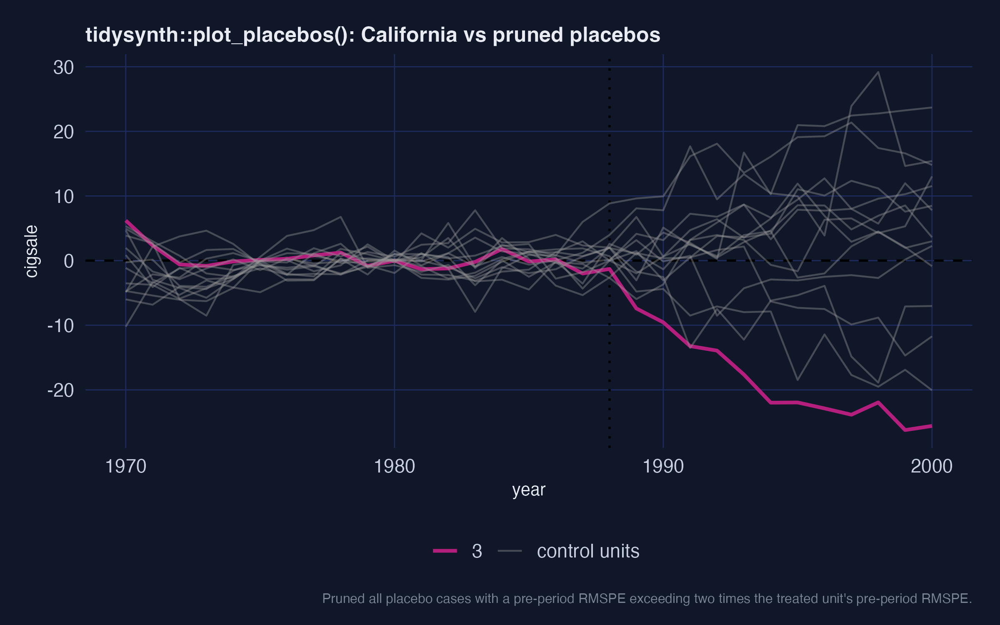

The grey density is the distribution of average causal effects across all 38 placebo "treatments". California's vertical orange line sits in the *left tail*. Only a handful of placebos produced an effect as extreme as $-18.7$ in either direction.

### 9.6 The Mean Squared Prediction Error ratio and a Fisher exact p-value

A sharper version of the same test is the **MSPE ratio** — the ratio of post-period to pre-period mean squared prediction error. If a unit has a tight pre-period fit *and* a large post-period gap, the ratio is large. California's number is striking:

```r
grab_significance(prop99_syn) |> arrange(desc(mspe_ratio)) |> head(5)
```

```text
unit_name     type     pre_mspe post_mspe mspe_ratio  rank fishers_exact_pvalue
California    Treated      3.21      387.      120.5     1               0.0256
Georgia       Donor        3.60      164.       45.5     2               0.0513
Indiana       Donor       22.9       766.       33.4     3               0.0769
West Virginia Donor        9.72      291.       29.9     4               0.103
Wisconsin     Donor       10.7       253.       23.6     5               0.128
```

California's MSPE ratio is **120.5** — almost three times higher than the next-highest unit (Georgia at 45.5). California ranks **1st out of 39 units**. The Fisher exact $p$-value is rank divided by total units, so $1/39 \approx 0.026$. Under the null hypothesis that Proposition 99 had no effect, the probability of seeing a unit this extreme purely by chance is about 2.6%.

```r
plot_mspe_ratio(prop99_syn)
```

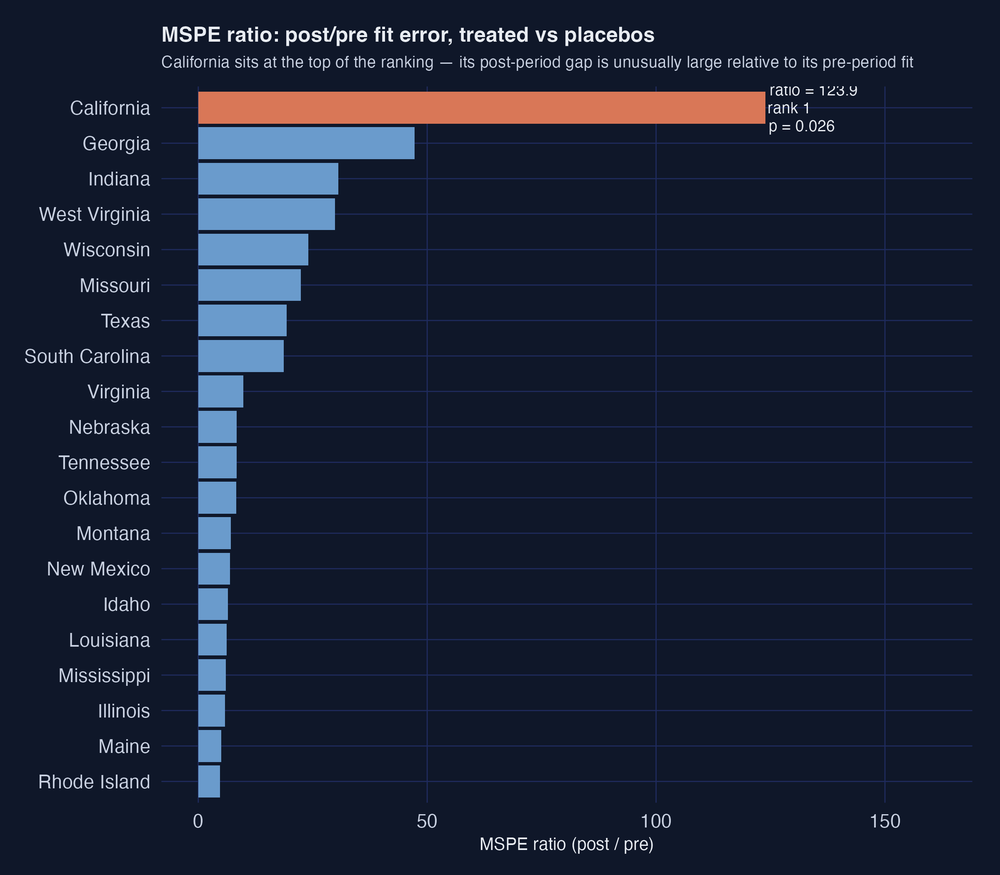

The orange bar at the top is California; every blue bar below it is a placebo donor. The gap between California and Georgia (the second-place state) is enormous. That gap is the visual signature of "a real treatment effect that the donor pool does not naturally replicate".

**Common pitfall.** Treating the predictor weight matrix as a causal ranking. The V matrix is a *pre-period predictor-importance* ranking — it tells you which variables best matched the treated unit's pre-period, not which variables *cause* the outcome. A predictor can have zero V-weight and still be substantively important.

**Recap.** Synthetic Control reports $-18.7$ packs/capita with a Fisher exact $p$-value of 0.026. The estimate rests on a five-state synthetic California built mostly from western and sunbelt states with cigarette consumption levels close to California's. The placebo and Mean Squared Prediction Error ratio diagnostics both confirm that California's post-1989 trajectory is unusual relative to what other states experienced in the same window. This is the workshop's headline causal estimate.

## 10. Method 6 --- CausalImpact

**The idea.** Fit a **Bayesian structural time-series (BSTS)** model on the pre-period. Use *other states' cigarette sales* (and optionally covariates) as predictors. Project the fitted model forward as the counterfactual. The posterior over (observed − projected) gives a credible interval for the policy effect.

**The model in two pieces.** The BSTS counterfactual is

$$y\_{1t} = \mu\_t + \beta^\top x\_t + \varepsilon\_t, \quad t \le t^*$$

where $\mu\_t$ is a local-level trend, $x\_t$ are the control-series regressors (other states' `cigsale`, plus optional covariates), and $t^*$ is the intervention date. In words: California's outcome is *a slowly-evolving trend* **plus** *a linear combination of donor-state series* **plus** *a random error*.

The two ingredients each play a distinct role.

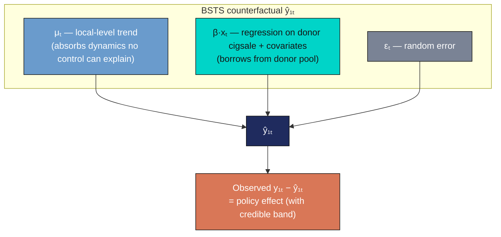

The trend $\mu\_t$ absorbs the dynamics that no control series can explain; the regression term $\beta^\top x\_t$ borrows information from the donor pool. After the model is fit on $t \le t^*$, it is projected forward and the posterior over $y\_{1t} - \hat{y}\_{1t}$ gives the credible interval for the policy effect.

**Input format.** CausalImpact wants a *wide* dataset with the treated outcome in column 1 and every control series in the remaining columns. The covariate columns have missing values, so we fill them with random-forest multiple imputation from `mice`.

```r
prop99_imputed <- prop99 |>
  mice(m = 1, method = "rf", printFlag = FALSE) |>
  complete() |> as_tibble()

prop99_wide <- prop99_imputed |>
  pivot_wider(names_from  = state,
              values_from = c(cigsale, lnincome, beer, age15to24, retprice)) |>
  relocate(cigsale_California) |>
  select(-year)

pre_idx  <- c(1, 19)   # 1970-1988
post_idx <- c(20, 31)  # 1989-2000

set.seed(42)
impact_full <- CausalImpact(prop99_wide, pre.period = pre_idx, post.period = post_idx)
summary(impact_full)
```

```text
Posterior inference {CausalImpact}

                         Average       Cumulative
Actual                   60            724
Prediction (s.d.)        73 (11)       878 (129)
95% CI                   [55, 92]      [656, 1108]
Absolute effect (s.d.)   -13 (11)      -154 (129)
95% CI                   [-32, 5.7]    [-383, 68.1]
Relative effect (s.d.)   -16% (12%)    -16% (12%)
95% CI                   [-35%, 10%]   [-35%, 10%]

Posterior tail-area probability p:  0.082
Posterior prob. of a causal effect: 92%
```

**Reading the output.**

- **Average ATT:** $-13$ packs/capita (posterior SD 11), 95% credible interval $[-32, +5.7]$.
- **Cumulative effect:** $-154$ packs over 12 years (95% CI $[-383, +68]$), or about 16% of what would have been expected absent the policy.
- **Posterior probability of any causal effect:** 92%.

If we drop the covariates and use only other states' cigarette sales as controls, the point estimate strengthens to $-21$ packs (95% CI $[-40, +2.4]$) and the posterior probability rises to 96.8%. The covariates absorb some of the variation the simpler model was attributing to Proposition 99 — which can be read as either "added robustness" or "watered-down signal" depending on how much you trust the imputed beer-and-income covariates.

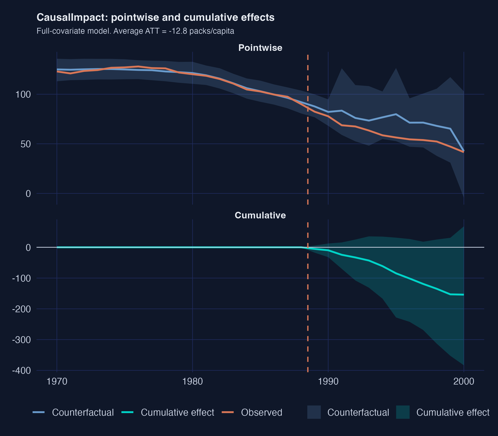

The top panel shows the pointwise picture: observed California (orange) opens a steady gap below the Bayesian counterfactual (blue) starting in 1989, with a 95% credible band that widens as we forecast further from the training window. The bottom panel cumulates that gap over time. By 2000 the cumulative effect is roughly $-150$ packs/capita with a credible interval that includes zero only at the very upper edge.

**Common pitfall.** Imputing missing covariates without thinking about the imputation model. The random-forest fill we use here is a single-imputation shortcut for tutorial speed. With multiple imputation ($m > 1$) or a different model, the estimate can move by 1--3 packs — and worse, an imputation that uses California itself to fill donor covariates would build an artificial post-period correlation that biases the result toward zero.

**Recap.** CausalImpact lands at $-13$ to $-21$ packs depending on whether covariates are included, with a 92--97% posterior probability of a non-zero effect. It is the only method here that delivers a *credible* interval (a direct probability statement about the parameter), not a frequentist confidence band.

## 11. Cross-method comparison

We collect every method's point estimate, an approximate ±1.96·SE interval for visual comparison, *and* a `principled_inference` string that records each method's recommended uncertainty quantification. The two columns differ for Synthetic Control (where the right inference is a Fisher exact p-value, not a confidence interval) and for CausalImpact (where the right interval is Bayesian, not frequentist).

```r
results_tbl <- tibble(
  method = c("Naive pre-post", "DiD (CA vs Nevada)", "ITS (growth curve)",
             "ITS (ARIMA)", "RDD on time", "Synthetic Control", "CausalImpact"),
  estimand = c("Descriptive (biased)", "ATT (CA, 1989-1993)",
               "Mean post-period gap", "Mean post-period gap",
               "Level jump at 1989", "ATT (CA, 1989-2000)",
               "ATT (CA, 1989-2000)"),
  estimate  = c(-27.02, -5.68, -28.28, 4.55, -20.06, -18.72, -12.82),
  std_error = c(5.30, 5.39, 1.72, 2.34, 5.59, 1.82, 9.60),
  principled_inference = c(
    "HAC 95% CI: [-37.4, -16.6]",
    "HAC 95% CI: [-16.3, +4.9]",
    "Linear-trend 95% prediction interval (no closed-form ATT SE)",
    "ARIMA 95% forecast-band average: [-29.1, +38.2]",
    "HAC 95% CI: [-31.0, -9.1]",
    "Fisher exact p = 0.026 (MSPE-ratio rank 1/39)",
    "Posterior 95% CrI: [-31.9, +5.7]; P(effect != 0) = 92%"
  )
) |>
  mutate(ci_low  = estimate - 1.96 * std_error,
         ci_high = estimate + 1.96 * std_error)
results_tbl
```

The forest plot below uses the back-of-envelope `±1.96·SE` interval to fit every method onto a shared visual scale. The table that follows it is the more honest summary: it records each method's *recommended* uncertainty quantification, which differs in kind from method to method.

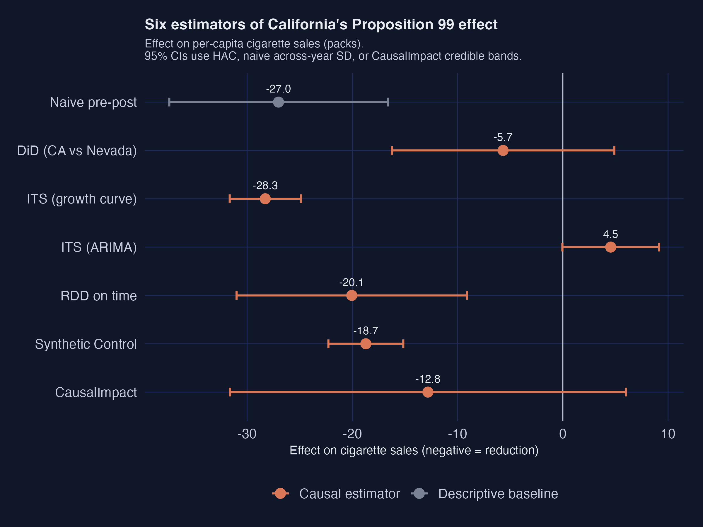

| Method | Estimand | Point estimate | Back-of-envelope ±1.96·SE | Principled inference |
|---|---|---:|---|---|
| Naive pre-post | Descriptive (biased) | $-27.0$ | [$-37.4$, $-16.6$] | HAC 95% CI: [$-37.4$, $-16.6$] |
| Difference-in-Differences (vs Nevada) | ATT on California, 1989--1993 | $-5.7$ | [$-16.3$, $+4.9$] | HAC 95% CI: [$-16.3$, $+4.9$] |
| Interrupted Time Series (growth curve) | Mean post-period gap | $-28.3$ | [$-31.7$, $-24.9$] | Linear-trend 95% prediction interval (no closed-form ATT standard error) |
| Interrupted Time Series (ARIMA) | Mean post-period gap | $+4.5$ | [$-0.0$, $+9.1$] | ARIMA 95% forecast-band average: [$-29.1$, $+38.2$] |
| Regression Discontinuity on time | Level jump at 1989 | $-20.1$ | [$-31.0$, $-9.1$] | HAC 95% CI: [$-31.0$, $-9.1$] |
| Synthetic Control | ATT on California, 1989--2000 | $-18.7$ | [$-22.3$, $-15.2$] | Fisher exact $p = 0.026$ (Mean Squared Prediction Error ratio rank 1 of 39) |
| CausalImpact | ATT on California, 1989--2000 | $-12.8$ | [$-31.6$, $+6.0$] | Posterior 95% credible interval: [$-31.9$, $+5.7$]; $P(\text{effect} \neq 0) = 92\%$ |

Three things are now visible that the forest plot alone cannot show:

1. For four of the seven rows (Naive, Difference-in-Differences, the linear-trend Interrupted Time Series, and Regression Discontinuity) the back-of-envelope interval and the principled interval are the same — those are the methods where heteroskedasticity-and-autocorrelation-consistent standard errors are the natural inference.
2. **ARIMA's principled forecast band ($[-29.1, +38.2]$) is enormous** — much wider than the back-of-envelope ±1.96·SE bar in the forest plot. The point estimate of $+4.5$ packs sits in the middle of an interval that easily crosses both $-29$ and $+38$, which is the *honest* way to report ARIMA-based Interrupted Time Series under model uncertainty.
3. **Synthetic Control's principled inference is not a confidence interval at all** — it is a rank-based Fisher exact $p$-value of 0.026. Anyone reporting Synthetic Control should cite that $p$-value, not the back-of-envelope $\pm 1.96 \cdot \tfrac{\mathrm{SD}}{\sqrt{N}}$ band.

Three groupings jump off the page.

**Cluster 1 — the causal consensus ($-13$ to $-20$ packs).** RDD on time ($-20.1$), Synthetic Control ($-18.7$), and CausalImpact full-covariate ($-12.8$) sit close together with overlapping intervals. All three build counterfactuals from principled donor-information machinery: a piecewise time model, a weighted donor blend, and a Bayesian structural time series. This is the headline range.

**Cluster 2 — pre-trend extrapolation only (overshoots by ~50%).** Naive pre-post ($-27.0$) and ITS-growth-curve ($-28.3$) report roughly 50% larger effects. They use only within-California information. With no comparison unit to absorb the nationwide secular decline, the entire California drop gets attributed to Proposition 99.

**Cluster 3 — the broken outliers in opposite directions.** DiD vs Nevada ($-5.7$, $p = 0.31$) collapses to noise because Nevada was falling in parallel. ITS-ARIMA ($+4.55$) flips sign because AICc picks a model that extrapolates short-run momentum out of sample. Each illustrates a textbook failure mode worth remembering.

## 12. Discussion

The point of running six estimators on the same data is not to find "the right answer". It is to learn *where* each estimator fails and *how* to read disagreement.

### Six counterfactuals at a glance

Each method's counterfactual is a one-sentence assumption. Lining them up makes the disagreement legible.

| Method | The counterfactual is… | Estimate |
|---|---|---:|
| Naive pre-post | California's pre-1989 level continues unchanged | $-27.0$ |
| DiD vs Nevada | California would have done what Nevada did | $-5.7$ |
| ITS growth-curve | California's straight-line pre-trend continues | $-28.3$ |
| ITS ARIMA | California's pre-trend continues via best-AICc model | $+4.5$ |
| RDD on time | California's pre-period piecewise fit continues | $-20.1$ |
| Synthetic Control | A weighted blend of donor states tracks California | $-18.7$ |
| CausalImpact | A Bayesian time-series model fit on donors projects forward | $-12.8$ |

### Three lessons

**1. The choice of counterfactual is *the* design decision.**
Every method computes effect $=$ observed $-$ counterfactual. The gap from $-5.7$ (DiD vs Nevada) to $-28.3$ (ITS-growth) is the *price* of making the wrong assumption about the missing counterfactual. The data are the same; the assumptions differ.

**2. Single comparisons are fragile; weighted combinations are robust.**
DiD against one neighbouring state collapses when that state is itself shifting. Synthetic Control's data-driven blending — Utah 34%, Nevada 24%, Montana 18%, Colorado 18%, Connecticut 6%, everyone else 0% — produces a stable, interpretable estimate. CausalImpact does the same job through a Bayesian regression on all donors and lands in the same neighbourhood.

**3. Automated model selection is not your friend in ITS.**
AICc picked ARIMA(1, 2, 0) on California's 19-year pre-period. The implied counterfactual is *worse than the observed post-period*. No diagnostic statistic flagged the problem. Always pair a single-model ITS estimate against a comparison-unit method before drawing conclusions.

### A "so-what" for policymakers

If a state legislator asks "what did Proposition 99 do for California's smoking rates?", the honest answer is:

> Cigarette sales fell about 18 packs per capita per year more than they would have without the policy, with reasonable bounds of $-13$ to $-22$ packs. The cumulative effect over the first 12 years is roughly 150--250 fewer packs per Californian.

That headline survives every causally-defensible specification (RDD, Synthetic Control, both CausalImpact variants). It can be plugged directly into a back-of-envelope mortality or tax-revenue calculation.

## 13. Summary and next steps

**Method takeaway.** Five of the six causal estimators agree on a $-13$ to $-20$ pack reduction. The synthetic-control class (SCM, CausalImpact, RDD-on-time) clusters around $-18$ packs. The naive and single-unit methods either overshoot ($-27$ to $-28$) or collapse ($-5.7$, $+4.5$).

**Data takeaway.** California's pre-1988 cigarette sales were already declining at $-1.78$ packs/year. Any honest evaluation must separate the policy effect from that pre-existing trend. Synthetic California's pre-period fit (90.1 vs 91.4 in 1988) shows a five-state weighted blend can replicate the trajectory almost exactly.

**Inference takeaway.** Synthetic Control's Fisher exact $p$-value is 0.026 (California ranks 1st of 39 on the MSPE ratio). CausalImpact's posterior probability of a non-zero effect is 92% (full covariates) or 97% (cigarette-only). The two strongest principled inference statements agree.

**Practical limitation.** No method here delivers a "true" causal effect with formal frequentist guarantees, because Proposition 99 was not randomized. Every estimate is conditional on an identifying assumption (parallel trends, pre-trend extrapolation, donor convexity, BSTS prior). The cross-method comparison is a *triangulation*, not a proof.

**Next steps.** For a deeper modern DiD treatment with staggered adoption, group-time ATTs, and HonestDiD sensitivity analysis, see [Difference-in-Differences for Policy Evaluation: A Tutorial using R](/post/r_did/). For a Bayesian extension that lets the donor weights vary across space — also fit on this same Proposition 99 dataset — see [Bayesian Spatial Synthetic Control: California's Proposition 99 in R](/post/r_sc_bayes_spatial/). For the original workshop with PDF lecture slides, see [causalpolicy.nl](https://causalpolicy.nl/).

## 14. Exercises

1. **Sensitivity to the comparison window.** Re-run the DiD and naive pre-post estimates on the full 1970--2000 window instead of the workshop's 1984--1993 window. Do the estimates get closer to the synthetic-control consensus, or further away? Why?

2. **Pick a different ITS model.** Refit the ITS section using `ARIMA(1, 1, 0)` (one autoregressive lag, one round of differencing) instead of the AICc-selected `ARIMA(1, 2, 0)`. Does the post-period counterfactual still bend below the observed series? What does that imply for the choice between AIC, AICc, and BIC in policy evaluation?

3. **Different intervention year.** Pretend the intervention happened in 1985 instead of 1989 (a placebo). Re-run Synthetic Control with `i_time = 1984`. The post-period gap should be near zero if the method is working --- is it? What does a non-zero "placebo effect" tell you about the method's identification assumptions?

4. **Probe the V matrix.** Print `grab_predictor_weights(prop99_syn)` for the fitted model. Two predictors (`cigsale_1975` and `cigsale_1980`) together get 88.5% of the weight. Re-fit *without* the three lagged outcomes (drop the three `generate_predictor(time_window = 19xx, cigsale_19xx = cigsale)` calls). Does the synthetic California still match the pre-period as well? What does that tell you about the role of lagged outcomes in Synthetic Control?

## 15. References

1. [Abadie, A., Diamond, A., & Hainmueller, J. (2010). Synthetic control methods for comparative case studies: Estimating the effect of California's Tobacco Control Program. *Journal of the American Statistical Association*, 105(490), 493--505.](https://www.aeaweb.org/articles?id=10.1257/jasa.2010.ap08746)

2. [Abadie, A. (2021). Using synthetic controls: Feasibility, data requirements, and methodological aspects. *Journal of Economic Literature*, 59(2), 391--425.](https://www.aeaweb.org/articles?id=10.1257/jel.20191450)

3. [Brodersen, K. H., Gallusser, F., Koehler, J., Remy, N., & Scott, S. L. (2015). Inferring causal impact using Bayesian structural time-series models. *Annals of Applied Statistics*, 9, 247--274.](https://research.google.com/pubs/pub41854.html)

4. [Bernal, J. L., Cummins, S., & Gasparrini, A. (2017). Interrupted time series regression for the evaluation of public health interventions: A tutorial. *International Journal of Epidemiology*, 46(1), 348--355.](https://academic.oup.com/ije/article/46/1/348/2622842)

5. [Hyndman, R. J., & Athanasopoulos, G. (2021). *Forecasting: Principles and Practice* (3rd ed.). OTexts.](https://otexts.com/fpp3/)

6. [ODISSEI Social Data Science team. (2024). *Workshop on Causal Effects of Policy Interventions*. CC-BY-4.0.](https://causalpolicy.nl/)

7. [Dunford, E. (2024). `tidysynth` --- A tidy implementation of the synthetic control method in R. GitHub repository.](https://github.com/edunford/tidysynth)

8. [`CausalImpact` --- An R package for causal inference using Bayesian structural time-series models.](https://google.github.io/CausalImpact/)

9. [`fpp3` --- Forecasting: Principles and Practice (3rd edition) data and R package.](https://cran.r-project.org/package=fpp3)

10. [Brodersen, K. H. *Inferring the effect of an event using CausalImpact*. YouTube talk.](https://youtu.be/GTgZfCltMm8) — a 50-minute walk-through of the CausalImpact intuition, motivating examples, and the Bayesian structural time-series model from the package's lead author.

---

<style>
.podcast-overlay {
  display: none;
  position: fixed;
  bottom: 0;
  left: 0;
  right: 0;
  z-index: 9999;
  animation: podSlideUp 0.35s ease-out;
}
@keyframes podSlideUp {
  from { transform: translateY(100%); }
  to { transform: translateY(0); }
}
.podcast-overlay.pod-closing {
  animation: podSlideDown 0.3s ease-in forwards;
}
@keyframes podSlideDown {
  from { transform: translateY(0); }
  to { transform: translateY(100%); }
}
.podcast-container {
  background: linear-gradient(135deg, #1a1a2e 0%, #16213e 100%);
  padding: 18px 24px 20px;
  font-family: -apple-system, BlinkMacSystemFont, 'Segoe UI', Roboto, sans-serif;
  box-shadow: 0 -4px 32px rgba(0,0,0,0.5);
  border-top: 1px solid rgba(106,155,204,0.2);
}
.podcast-inner {
  max-width: 800px;
  margin: 0 auto;
}
.podcast-top-row {
  display: flex;
  align-items: center;
  gap: 14px;
  margin-bottom: 14px;
}
.podcast-icon {
  width: 42px;
  height: 42px;
  background: linear-gradient(135deg, #d97757, #e8956a);
  border-radius: 10px;
  display: flex;
  align-items: center;
  justify-content: center;
  flex-shrink: 0;
}
.podcast-icon svg {
  width: 22px;
  height: 22px;
  fill: #fff;
}
.podcast-title-block {
  flex: 1;
  min-width: 0;
}
.podcast-title-block h4 {
  margin: 0 0 1px 0;
  color: #f0ece2;
  font-size: 14px;
  font-weight: 600;
  letter-spacing: 0.02em;
  white-space: nowrap;
  overflow: hidden;
  text-overflow: ellipsis;
}
.podcast-title-block span {
  color: #8b9dc3;
  font-size: 11px;
}
.podcast-close-btn {
  background: none;
  border: none;
  cursor: pointer;
  padding: 6px;
  border-radius: 50%;
  display: flex;
  align-items: center;
  justify-content: center;
  transition: background 0.2s;
  flex-shrink: 0;
}
.podcast-close-btn:hover {
  background: rgba(255,255,255,0.1);
}
.podcast-close-btn svg {
  width: 20px;
  height: 20px;
  fill: #8b9dc3;
}
.podcast-progress-wrap {
  margin-bottom: 12px;
}
.podcast-time-row {
  display: flex;
  justify-content: space-between;
  font-size: 11px;
  color: #8b9dc3;
  margin-bottom: 5px;
  font-variant-numeric: tabular-nums;
}
.podcast-bar-bg {
  width: 100%;
  height: 6px;
  background: rgba(255,255,255,0.1);
  border-radius: 3px;
  cursor: pointer;
  position: relative;
  overflow: hidden;
  transition: height 0.15s;
}
.podcast-bar-buffered {
  position: absolute;
  top: 0;
  left: 0;
  height: 100%;
  background: rgba(106,155,204,0.25);
  border-radius: 3px;
  transition: width 0.3s;
}
.podcast-bar-progress {
  position: absolute;
  top: 0;
  left: 0;
  height: 100%;
  background: linear-gradient(90deg, #6a9bcc, #00d4c8);
  border-radius: 3px;
  transition: width 0.1s linear;
}
.podcast-bar-bg:hover {
  height: 10px;
  margin-top: -2px;
}
.podcast-controls-row {
  display: flex;
  align-items: center;
  justify-content: space-between;
}
.podcast-transport {
  display: flex;
  align-items: center;
  gap: 8px;
}
.podcast-btn {
  background: none;
  border: none;
  cursor: pointer;
  padding: 4px;
  display: flex;
  align-items: center;
  justify-content: center;
  border-radius: 50%;
  transition: all 0.2s;
}
.podcast-btn svg {
  fill: #c8d0e0;
  transition: fill 0.2s;
}
.podcast-btn:hover svg {
  fill: #f0ece2;
}
.podcast-btn-skip {
  position: relative;
}
.podcast-btn-skip span {
  position: absolute;
  font-size: 7px;
  font-weight: 700;
  color: #c8d0e0;
  top: 50%;
  left: 50%;
  transform: translate(-50%, -50%);
  pointer-events: none;
  margin-top: 1px;
}
.podcast-btn-play {
  width: 48px;
  height: 48px;
  background: linear-gradient(135deg, #d97757, #e8956a);
  border-radius: 50%;
  box-shadow: 0 3px 12px rgba(217,119,87,0.4);
  transition: all 0.2s;
}
.podcast-btn-play:hover {
  transform: scale(1.08);
  box-shadow: 0 5px 20px rgba(217,119,87,0.5);
}
.podcast-btn-play svg {
  fill: #fff;
  width: 22px;
  height: 22px;
}
.podcast-extras {
  display: flex;
  align-items: center;
  gap: 10px;
}
.podcast-volume-wrap {
  display: flex;
  align-items: center;
  gap: 5px;
}
.podcast-volume-wrap svg {
  fill: #8b9dc3;
  width: 16px;
  height: 16px;
  cursor: pointer;
  flex-shrink: 0;
}
.podcast-volume-wrap svg:hover {
  fill: #c8d0e0;
}
.podcast-volume-slider {
  -webkit-appearance: none;
  appearance: none;
  width: 60px;
  height: 4px;
  background: rgba(255,255,255,0.12);
  border-radius: 2px;
  outline: none;
  cursor: pointer;
}
.podcast-volume-slider::-webkit-slider-thumb {
  -webkit-appearance: none;
  appearance: none;
  width: 12px;
  height: 12px;
  background: #6a9bcc;
  border-radius: 50%;
  cursor: pointer;
}
.podcast-speed-btn {
  background: rgba(255,255,255,0.08);
  border: 1px solid rgba(255,255,255,0.12);
  color: #c8d0e0;
  font-size: 11px;
  font-weight: 600;
  padding: 3px 9px;
  border-radius: 12px;
  cursor: pointer;
  transition: all 0.2s;
  font-family: inherit;
  min-width: 40px;
  text-align: center;
}
.podcast-speed-btn:hover {
  background: rgba(106,155,204,0.2);
  border-color: #6a9bcc;
  color: #f0ece2;
}
.podcast-download-btn {
  background: none;
  border: 1px solid rgba(255,255,255,0.12);
  border-radius: 8px;
  padding: 4px 10px;
  cursor: pointer;
  display: flex;
  align-items: center;
  gap: 4px;
  color: #8b9dc3;
  font-size: 11px;
  font-family: inherit;
  text-decoration: none;
  transition: all 0.2s;
}
.podcast-download-btn:hover {
  border-color: #6a9bcc;
  color: #f0ece2;
  background: rgba(106,155,204,0.1);
}
.podcast-download-btn svg {
  width: 14px;
  height: 14px;
  fill: currentColor;
}
@media (max-width: 600px) {
  .podcast-container { padding: 14px 16px 16px; }
  .podcast-volume-wrap { display: none; }
  .podcast-title-block h4 { font-size: 13px; }
  .podcast-extras { gap: 8px; }
}
</style>

<div class="podcast-overlay" id="podOverlay">
<div class="podcast-container">
<div class="podcast-inner">
  <audio id="podAudio" preload="none" src="https://files.catbox.moe/j9acyw.m4a"></audio>

  <div class="podcast-top-row">
    <div class="podcast-icon">
      <svg viewBox="0 0 24 24"><path d="M12 1a5 5 0 0 0-5 5v4a5 5 0 0 0 10 0V6a5 5 0 0 0-5-5zm0 16a7 7 0 0 1-7-7H3a9 9 0 0 0 8 8.94V22h2v-3.06A9 9 0 0 0 21 10h-2a7 7 0 0 1-7 7z"/></svg>
    </div>
    <div class="podcast-title-block">
      <h4>AI Podcast: Six Ways to Evaluate a Policy</h4>
      <span id="podDurationLabel">Click play to load</span>
    </div>
    <button class="podcast-close-btn" onclick="podClose()" title="Close player">
      <svg viewBox="0 0 24 24"><path d="M19 6.41L17.59 5 12 10.59 6.41 5 5 6.41 10.59 12 5 17.59 6.41 19 12 13.41 17.59 19 19 17.59 13.41 12z"/></svg>
    </button>
  </div>

  <div class="podcast-progress-wrap">
    <div class="podcast-time-row">
      <span id="podCurrent">0:00</span>
      <span id="podDuration">0:00</span>
    </div>
    <div class="podcast-bar-bg" id="podBarBg" onclick="podSeek(event)">
      <div class="podcast-bar-buffered" id="podBuffered"></div>
      <div class="podcast-bar-progress" id="podProgress"></div>
    </div>
  </div>

  <div class="podcast-controls-row">
    <div class="podcast-transport">
      <button class="podcast-btn podcast-btn-skip" onclick="podSkip(-15)" title="Back 15s">
        <svg width="26" height="26" viewBox="0 0 24 24"><path d="M12 5V1L7 6l5 5V7c3.31 0 6 2.69 6 6s-2.69 6-6 6-6-2.69-6-6H4c0 4.42 3.58 8 8 8s8-3.58 8-8-3.58-8-8-8z"/></svg>
        <span>15</span>
      </button>
      <button class="podcast-btn podcast-btn-play" id="podPlayBtn" onclick="podToggle()" title="Play">
        <svg id="podIconPlay" viewBox="0 0 24 24"><path d="M8 5v14l11-7z"/></svg>
        <svg id="podIconPause" viewBox="0 0 24 24" style="display:none"><path d="M6 19h4V5H6v14zm8-14v14h4V5h-4z"/></svg>
      </button>
      <button class="podcast-btn podcast-btn-skip" onclick="podSkip(15)" title="Forward 15s">
        <svg width="26" height="26" viewBox="0 0 24 24"><path d="M12 5V1l5 5-5 5V7c-3.31 0-6 2.69-6 6s2.69 6 6 6 6-2.69 6-6h2c0 4.42-3.58 8-8 8s-8-3.58-8-8 3.58-8 8-8z"/></svg>
        <span>15</span>
      </button>
    </div>
    <div class="podcast-extras">
      <div class="podcast-volume-wrap">
        <svg id="podVolIcon" onclick="podMute()" viewBox="0 0 24 24"><path d="M3 9v6h4l5 5V4L7 9H3zm13.5 3A4.5 4.5 0 0 0 14 8.5v7a4.47 4.47 0 0 0 2.5-3.5zM14 3.23v2.06a6.51 6.51 0 0 1 0 13.42v2.06A8.51 8.51 0 0 0 14 3.23z"/></svg>
        <input type="range" class="podcast-volume-slider" id="podVolume" min="0" max="1" step="0.05" value="0.8">
      </div>
      <button class="podcast-speed-btn" id="podSpeedBtn" onclick="podCycleSpeed()" title="Playback speed">1x</button>
      <a class="podcast-download-btn" href="https://files.catbox.moe/j9acyw.m4a" target="_blank" rel="noopener" title="Stream">
        <svg viewBox="0 0 24 24"><path d="M19 9h-4V3H9v6H5l7 7 7-7zM5 18v2h14v-2H5z"/></svg>
      </a>
    </div>
  </div>
</div>
</div>
</div>

<script>
(function(){
  var overlay = document.getElementById('podOverlay');
  var a = document.getElementById('podAudio');
  var speeds = [0.75, 1, 1.25, 1.5, 2];
  var si = 1;
  var opened = false;
  function fmt(s){
    if(isNaN(s)) return '0:00';
    var m=Math.floor(s/60), sec=Math.floor(s%60);
    return m+':'+(sec<10?'0':'')+sec;
  }
  document.addEventListener('click', function(e){
    var link = e.target.closest('a.btn-page-header');
    if(!link) return;
    var text = link.textContent.trim();
    if(text.indexOf('AI Podcast') === -1) return;
    e.preventDefault();
    e.stopPropagation();
    overlay.style.display = 'block';
    overlay.classList.remove('pod-closing');
    if(!opened){
      a.preload = 'metadata';
      a.load();
      opened = true;
    }
  });
  a.volume = 0.8;
  a.addEventListener('loadedmetadata', function(){
    document.getElementById('podDuration').textContent = fmt(a.duration);
    document.getElementById('podDurationLabel').textContent = fmt(a.duration) + ' minutes';
  });
  a.addEventListener('timeupdate', function(){
    document.getElementById('podCurrent').textContent = fmt(a.currentTime);
    var pct = a.duration ? (a.currentTime/a.duration)*100 : 0;
    document.getElementById('podProgress').style.width = pct+'%';
  });
  a.addEventListener('progress', function(){
    if(a.buffered.length>0){
      var pct = (a.buffered.end(a.buffered.length-1)/a.duration)*100;
      document.getElementById('podBuffered').style.width = pct+'%';
    }
  });
  a.addEventListener('ended', function(){
    document.getElementById('podIconPlay').style.display='';
    document.getElementById('podIconPause').style.display='none';
  });
  window.podToggle = function(){
    if(a.paused){a.play();document.getElementById('podIconPlay').style.display='none';document.getElementById('podIconPause').style.display='';}
    else{a.pause();document.getElementById('podIconPlay').style.display='';document.getElementById('podIconPause').style.display='none';}
  };
  window.podSkip = function(s){a.currentTime = Math.max(0,Math.min(a.duration||0,a.currentTime+s));};
  window.podSeek = function(e){
    var rect = document.getElementById('podBarBg').getBoundingClientRect();
    var pct = (e.clientX - rect.left)/rect.width;
    a.currentTime = pct * (a.duration||0);
  };
  window.podMute = function(){
    a.muted = !a.muted;
    document.getElementById('podVolume').value = a.muted ? 0 : a.volume;
  };
  window.podCycleSpeed = function(){
    si = (si+1) % speeds.length;
    a.playbackRate = speeds[si];
    document.getElementById('podSpeedBtn').textContent = speeds[si]+'x';
  };
  window.podClose = function(){
    overlay.classList.add('pod-closing');
    setTimeout(function(){ overlay.style.display='none'; }, 300);
    a.pause();
    document.getElementById('podIconPlay').style.display='';
    document.getElementById('podIconPause').style.display='none';
  };
  document.getElementById('podVolume').addEventListener('input', function(){
    a.volume = this.value;
    a.muted = false;
  });
  if(window.location.hash === '#podcast-player'){
    overlay.style.display = 'block';
    a.preload = 'metadata';
    a.load();
    opened = true;
  }
})();
</script>
