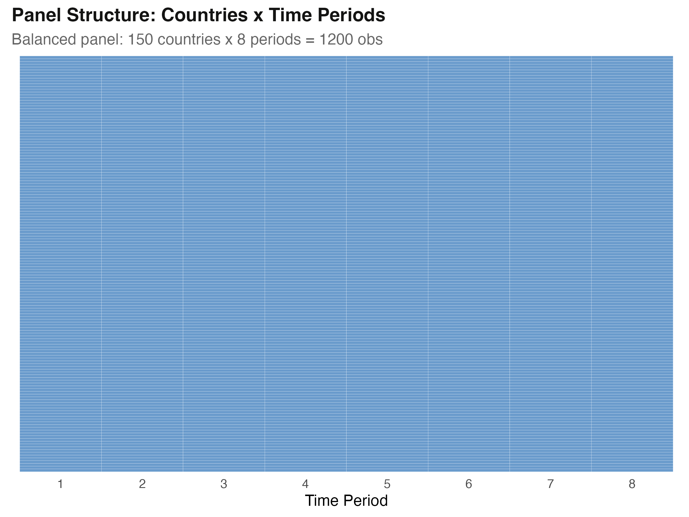
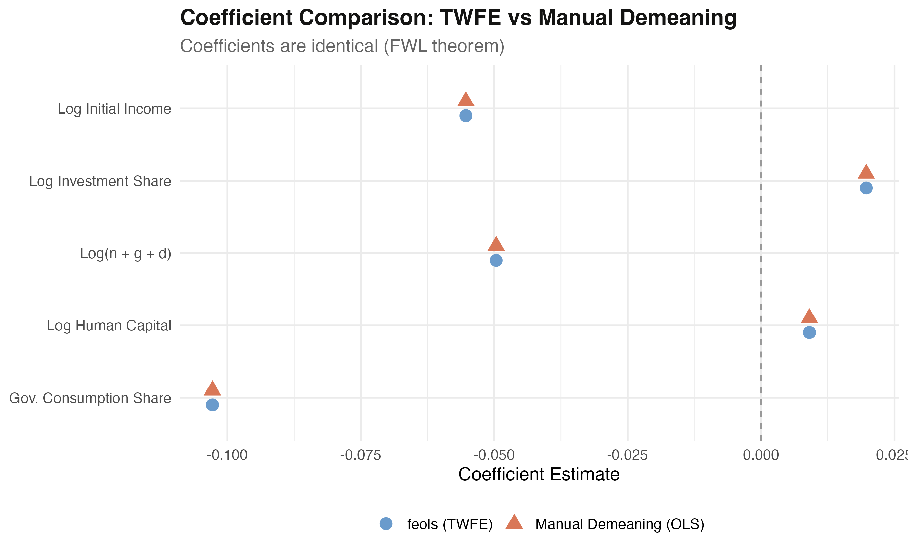
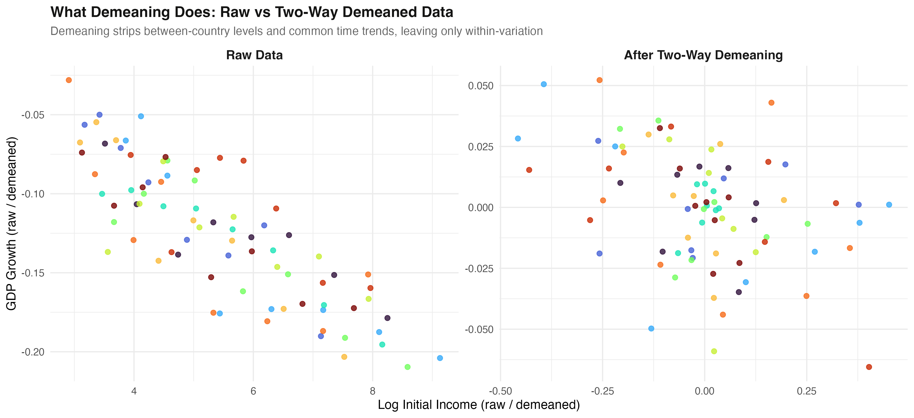
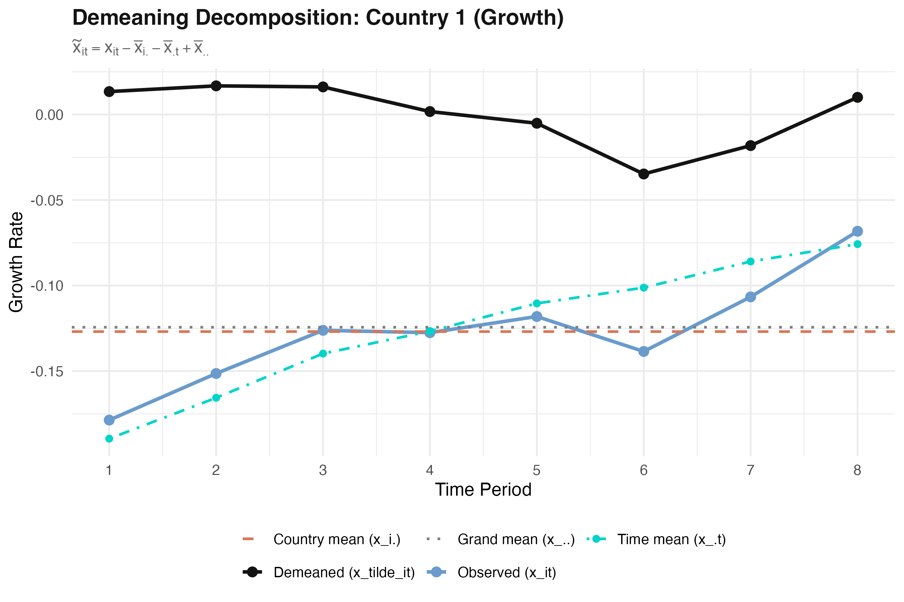
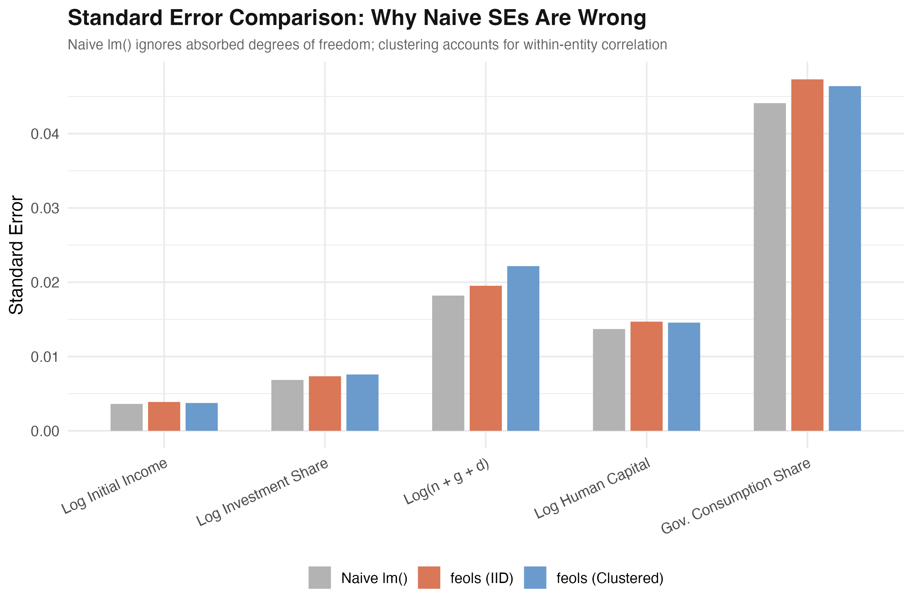

---
authors:
  - admin
categories:
  - R
  - Fixed Effects and TWFE
draft: false
featured: false
date: "2026-04-02T00:00:00Z"
external_link: ""
image:
  caption: ""
  focal_point: Smart
  placement: 3
links:
- icon: chalkboard-teacher
  icon_pack: fas
  name: "Slides (HTML)"
  url: slides/index.html
- icon: laptop-code
  icon_pack: fas
  name: "Web app"
  url: web_app/index.html
- icon: google-colab
  icon_pack: ai
  name: "[R] Google Colab"
  url: https://colab.research.google.com/github/cmg777/starter-academic-v501/blob/master/content/post/r_demeaning_twfe/notebook.ipynb
- icon: code
  icon_pack: fas
  name: "R script"
  url: analysis.R
- icon: book
  icon_pack: fas
  name: "Jupyter notebook"
  url: notebook.ipynb
- icon: file-code
  icon_pack: fas
  name: "Quarto project (.zip)"
  url: r_demeaning_twfe.zip
- icon: database
  icon_pack: fas
  name: "Source data"
  url: https://raw.githubusercontent.com/cmg777/starter-academic-v501/master/content/post/r_demeaning_twfe/referenceMaterials/barro_convergence_panel.csv
- icon: markdown
  icon_pack: fab
  name: "MD version"
  url: https://raw.githubusercontent.com/cmg777/starter-academic-v501/master/content/post/r_demeaning_twfe/index.md
slides:
summary: Manual demeaning vs two-way fixed effects --- showing that TWFE is just OLS on demeaned data through the Frisch-Waugh-Lovell theorem, with a hands-on proof using a Barro convergence panel of 150 countries.
tags:
  - r
  - econometrics
  - panel
  - twfe
  - fixed-effects
  - panel data
title: "What Does TWFE Actually Do? Manual Demeaning and the FWL Theorem"
url_code: ""
url_pdf: ""
url_slides: ""
url_video: ""
toc: true
diagram: true
---

## Abstract

Two-way fixed effects (TWFE) is among the most widely used estimators in applied economics, yet packages like `fixest` hide what the estimator mechanically does to the data, leaving users unsure why time-invariant regressors get dropped or whether running OLS on hand-demeaned data should return the same answer. This tutorial takes TWFE apart to show that it is nothing more than ordinary least squares applied to two-way demeaned data, a result guaranteed by the Frisch-Waugh-Lovell (FWL) theorem. The analysis uses a balanced Barro convergence panel of 150 countries observed over 8 time periods (1,200 observations), regressing GDP per capita growth on log initial income, investment share, population growth, human capital, and government consumption. It estimates the model with country and time fixed effects via `feols()`, then replicates the coefficients by hand—subtracting country means, subtracting time means, and adding back the grand mean before running base R's `lm()`. The two routes match to at least 12 significant digits: the convergence coefficient is -0.055286 with both methods, and the maximum absolute coefficient difference across all five regressors is 3.05 × 10⁻¹⁶, on the order of machine epsilon. The within R² is 0.177 against an adjusted R² of 0.755, showing the fixed effects absorb most variation. However, naive `lm()` standard errors understate uncertainty by 7—22% because they ignore the 157 degrees of freedom consumed by the fixed effects. The practical implication is clear: demeaning explains why fixed-effects models cannot identify time-invariant characteristics, but correct point estimates do not guarantee correct inference, so analysts should always use a dedicated panel estimator for standard errors and hypothesis testing.

## 1. Overview

Two-way fixed effects (TWFE) is one of the most widely used estimators in applied economics. Packages like `fixest` make it easy to estimate TWFE models with a single line of code. But what does the estimator actually *do* to the data? Why do time-invariant regressors like geography or colonial origin get dropped? And if you run `lm()` on manually demeaned data, should you get the same answer?

This tutorial answers these questions by taking TWFE apart. We estimate a standard growth regression with country and time fixed effects, then replicate the exact same coefficients by hand --- subtracting country means, time means, and adding back the grand mean before running ordinary least squares. The result is not an approximation: the coefficients match to 12 significant digits. The theoretical foundation for this equivalence is the **Frisch-Waugh-Lovell (FWL) theorem**, a fundamental result in econometrics that connects controlling for variables in a regression to projecting them out by residualization.

We use a balanced panel of 150 countries observed over 8 time periods from the Barro convergence dataset. Along the way, we also discover why standard errors from naive `lm()` on demeaned data are wrong --- and why you should always use a dedicated panel estimator for inference.

**Learning objectives:**

- Understand what two-way fixed effects does mechanically to the data and why time-invariant regressors are dropped
- Implement the two-way demeaning formula step by step: subtract country means, subtract time means, add back the grand mean
- Verify the Frisch-Waugh-Lovell theorem empirically by comparing `feols()` and `lm()` coefficients
- Interpret why naive standard errors from `lm()` on demeaned data are incorrect and how `fixest` corrects them
- Visualize the demeaning transformation to build intuition about within-variation identification

### Key concepts at a glance

The post leans on a small vocabulary repeatedly. The rest of the tutorial assumes you can move between these terms quickly. Each concept below has three parts. The **definition** is always visible. The **example** and **analogy** sit behind clickable cards: open them when you need them, leave them collapsed for a quick scan. If a later section mentions "demeaning" or "FWL theorem" and the term feels slippery, this is the section to re-read.

**1. Two-way fixed effects (TWFE)** $y\_{it} = \alpha\_i + \lambda\_t + \beta x\_{it} + u\_{it}$.
A panel regression with both unit fixed effects $\alpha\_i$ and time fixed effects $\lambda\_t$. Each unit gets its own intercept. Each period gets its own intercept. Together they absorb every time-invariant unit characteristic and every unit-invariant time shock.

<div class="concept-pair">
<details class="concept-card concept-example">
<summary>Example</summary>

In this post the TWFE regression of `growth` on `ln_y_initial` over 150 countries × 8 periods adds 150 country fixed effects and 8 period fixed effects. The convergence coefficient is -0.055286 (within R² = 0.1768).

</details>

<details class="concept-card concept-analogy">
<summary>Analogy</summary>

Subtract each player's career-average score *and* each season's league-average score before measuring how a single match performance compares.

</details>
</div>

**2. Demeaning (within transformation)** $\tilde y\_{it} = y\_{it} - \bar y\_i - \bar y\_t + \bar{\bar y}$.
Subtract the unit's time-average, subtract the time period's cross-section average, then add back the grand mean. The grand-mean correction prevents double-subtraction. What remains is variation *within* each unit *and* within each period.

<div class="concept-pair">
<details class="concept-card concept-example">
<summary>Example</summary>

In the Barro panel, demeaning `growth` for Brazil in 1965 means: subtract Brazil's 8-period average growth, subtract 1965's 150-country average growth, then add back the grand mean over all 1,200 observations. Repeat for every variable in the regression.

</details>

<details class="concept-card concept-analogy">
<summary>Analogy</summary>

Photographers call it "white-balance correction." Subtract the room's tint, subtract the camera's tint, then add back the average tint so colours stay calibrated.

</details>
</div>

**3. Frisch-Waugh-Lovell (FWL) theorem** $\hat\beta\_{\mathrm{full}} = \hat\beta\_{\mathrm{residualized}}$.
The coefficient on $X$ in a multivariate regression equals the slope from a simple regression of *residualized* $Y$ on *residualized* $X$, where the residuals are taken from regressing each variable on the other controls. TWFE is the special case where the "other controls" are the unit and time dummies.

<div class="concept-pair">
<details class="concept-card concept-example">
<summary>Example</summary>

In this post FWL predicts that running plain OLS on the demeaned `growth` and demeaned `ln_y_initial` columns must give the *same* coefficient as `feols()` with two-way fixed effects. The post verifies this: both routes give -0.055286.

</details>

<details class="concept-card concept-analogy">
<summary>Analogy</summary>

Two paths to the same summit. Either climb with all the ropes attached at once, or strip the ropes one by one and climb the bare rock — you arrive at the same height.

</details>
</div>

**4. Grand mean adjustment** $+ \bar{\bar y}$.
The "+grand-mean" term in two-way demeaning. Without it you subtract the mean *twice* — once via the unit average and once via the time average — leaving the data biased. Adding the grand mean back exactly cancels the double-subtraction.

<div class="concept-pair">
<details class="concept-card concept-example">
<summary>Example</summary>

In the post, omitting the grand-mean term shifts every demeaned `growth` value downward by the global average growth rate. The OLS slope on the still-balanced design is unchanged, but the intercept and predicted levels are wrong. The post explicitly walks through the fix.

</details>

<details class="concept-card concept-analogy">
<summary>Analogy</summary>

Refunding a sale: if both the manufacturer and the store gave you a discount that overlapped, you would owe a small surcharge back so the total discount is correct.

</details>
</div>

**5. β-convergence** negative slope on initial income.
The classic Barro test: poor units catching up with rich ones produces a *negative* slope of growth on log initial income. The TWFE-with-fixed-effects version is the conditional version of this test.

<div class="concept-pair">
<details class="concept-card concept-example">
<summary>Example</summary>

In this post the TWFE coefficient on `ln_y_initial` is -0.055286: a country one log-point poorer at the start of a period grows about 5.5 percentage points faster on average, conditional on country and period fixed effects.

</details>

<details class="concept-card concept-analogy">
<summary>Analogy</summary>

Slower runners closing the gap on faster ones. A negative slope on the head start means the back of the pack is gaining ground on average.

</details>
</div>

**6. Within R²** $R^2\_{\mathrm{within}}$.
The fraction of *within-unit* variation in $y$ explained by the regressors after the fixed effects are partialled out. Always smaller than the total R² of a TWFE regression because the fixed effects already explain a lot.

<div class="concept-pair">
<details class="concept-card concept-example">
<summary>Example</summary>

In this post the TWFE within R² is 0.1768 — `ln_y_initial` explains about 18% of the variation in growth that remains *after* country and period fixed effects soak up persistent differences. The total adjusted R² is 0.755 because the fixed effects do most of the absorbing.

</details>

<details class="concept-card concept-analogy">
<summary>Analogy</summary>

After equalising for player skill and match-day weather, how much of the remaining variation in performance does the tactic of the day explain?

</details>
</div>

**7. Numerical equivalence** $\hat\beta\_{\mathrm{TWFE}} = \hat\beta\_{\mathrm{OLS\,on\,demeaned}}$.
Up to numerical precision, the TWFE point estimate from `feols()` equals the OLS point estimate from `lm()` on the demeaned columns. This is the post's empirical proof of FWL applied to TWFE.

<div class="concept-pair">
<details class="concept-card concept-example">
<summary>Example</summary>

In this post, `feols()` gives -0.055286 and `lm()` on demeaned columns gives -5.529e-02. The maximum coefficient difference across all regressors is -4.16e-17 — pure floating-point noise. The two routes are *the same calculation* in two notations.

</details>

<details class="concept-card concept-analogy">
<summary>Analogy</summary>

Adding a column of numbers in two different orders. Same total, different order of operations.

</details>
</div>

**8. Standard error caveat** $\mathrm{df}$ adjustment.
While the *coefficients* match exactly, the *standard errors* from `lm()` on demeaned data are wrong. The naive `lm()` does not subtract degrees of freedom for the implicit fixed effects, so its SEs are too small. `fixest::feols()` corrects this automatically.

<div class="concept-pair">
<details class="concept-card concept-example">
<summary>Example</summary>

In this post the `feols()` SE accounts for the 150 country FE plus 8 period FE that were absorbed; the `lm()` SE on demeaned data does not. The point estimate is identical (-0.055286), but only `feols()` reports honest inference.

</details>

<details class="concept-card concept-analogy">
<summary>Analogy</summary>

Two judges agree on the verdict but disagree on the sentence. Same conclusion, different precision because they account for different prior cases.

</details>
</div>

## 2. The Frisch-Waugh-Lovell Theorem

Before diving into code, let us build the conceptual foundation. The FWL theorem answers a simple question: if you want to estimate the effect of $X$ on $Y$ while controlling for a set of variables $Z$, do you need to include everything in one big regression?

Think of it like noise-canceling headphones. Instead of listening to music with the engine noise mixed in, the headphones first *subtract out* the engine noise from what you hear. The result is the same music you would hear in a silent room. The FWL theorem says: instead of including all control variables in one regression, you can first "subtract them out" from both $Y$ and $X$, and then regress the residuals on each other. The coefficient on $X$ will be identical either way.

### Applying FWL to two-way fixed effects

In a TWFE model, the "controls" $Z$ are the full set of country dummies and time dummies. Including all these dummies is equivalent to subtracting group means. For a variable $x\_{it}$ observed for country $i$ in period $t$, the **two-way demeaned** version is:

$$\tilde{x}\_{it} = x\_{it} - \bar{x}\_{i \cdot} - \bar{x}\_{\cdot t} + \bar{x}\_{\cdot \cdot}$$

In words, this formula says: take the observed value, subtract the country average (to remove persistent country differences), subtract the time-period average (to remove common shocks), and add back the overall average (to correct for double-subtracting the grand mean).

Here is what each symbol means:

- $x\_{it}$ is the observed value for country $i$ at time $t$ --- in code, this is a single cell in the panel dataset
- $\bar{x}\_{i \cdot}$ is the **country mean** --- the average of $x$ across all periods for country $i$
- $\bar{x}\_{\cdot t}$ is the **time mean** --- the average of $x$ across all countries in period $t$
- $\bar{x}\_{\cdot \cdot}$ is the **grand mean** --- the overall average of $x$ across all observations

### Why add back the grand mean?

When we subtract both the country mean and the time mean, the grand mean gets subtracted *twice* --- once as part of $\bar{x}\_{i \cdot}$ and once as part of $\bar{x}\_{\cdot t}$. Adding $\bar{x}\_{\cdot \cdot}$ back corrects for this double subtraction. Think of it like a Venn diagram with two overlapping circles. If you subtract both circles entirely, the overlap region gets removed twice. Adding the overlap back once restores the correct amount. Without this correction, the demeaned variables would not be centered at zero, and the equivalence with TWFE would break.

The FWL theorem guarantees this equivalence formally:

$$\hat{\beta}\_{\text{TWFE}} = \hat{\beta}\_{\text{OLS on demeaned data}}$$

In words, the slope coefficients from a regression that includes a full set of entity and time dummies are exactly equal to the slopes from OLS applied to the two-way demeaned data. Not approximately --- exactly. Let us verify this with real data.

## 3. Setup

We need `fixest` for TWFE estimation and `tidyverse` for data wrangling and visualization. The `scales` package provides axis formatting utilities.

```r
library(fixest)
library(tidyverse)
library(scales)

set.seed(42)

# Site color palette
STEEL_BLUE   <- "#6a9bcc"
WARM_ORANGE  <- "#d97757"
NEAR_BLACK   <- "#141413"
TEAL         <- "#00d4c8"

# Variables to demean
VARS_TO_DEMEAN <- c("growth", "ln_y_initial", "log_s_k",
                     "log_n_gd", "log_hcap", "gov_cons")
```

We define the six variables that will be demeaned: the dependent variable (`growth`) and all five regressors. Keeping them in a vector allows us to apply the demeaning formula programmatically rather than copying and pasting for each variable.

## 4. Data Loading and Panel Structure

We load a balanced panel dataset with 150 countries observed over 8 time periods. The data comes from a Barro convergence exercise where the key question is whether poorer countries grow faster (conditional convergence). We convert `id` and `time` to factors so R treats them as categorical grouping variables.

```r
panel_data <- read.csv("referenceMaterials/barro_convergence_panel.csv")
panel_data$id   <- factor(panel_data$id)
panel_data$time <- factor(panel_data$time)

cat("Countries:", nlevels(panel_data$id), "\n")
cat("Time periods:", nlevels(panel_data$time), "\n")
cat("Total observations:", nrow(panel_data), "\n")
cat("Balanced panel:", all(table(panel_data$id) == nlevels(panel_data$time)), "\n")
```

```text
Countries: 150
Time periods: 8
Total observations: 1200
Balanced panel: TRUE
```

The dataset is a perfectly balanced panel of 150 countries observed across 8 time periods, yielding 1,200 total observations. A balanced panel means every country appears in every period with no missing cells --- the ideal setting for demonstrating the demeaning formula. The key variables are:

- `growth`: annualized GDP per capita growth rate (dependent variable)
- `ln_y_initial`: log of initial income (convergence term)
- `log_s_k`: log of the investment share
- `log_n_gd`: log of population growth plus depreciation
- `log_hcap`: log of human capital
- `gov_cons`: government consumption share


*Panel structure heatmap showing all 150 countries observed across 8 time periods with no missing cells.*

The heatmap confirms the balanced structure. Every one of the 150 countries is observed in all 8 time periods. This balance simplifies our demeaning procedure because we can use the closed-form formula directly, without the iterative projection that unbalanced panels would require.

## 5. TWFE Estimation with fixest

The `fixest` package makes TWFE estimation straightforward. The formula uses `|` to separate the regressors (left) from the fixed effects dimensions (right). Writing `| id + time` tells `feols()` to absorb both country and time fixed effects. Internally, `fixest` performs an efficient iterative demeaning algorithm to remove the fixed effects before estimating the slope coefficients.

```r
twfe_model <- feols(
  growth ~ ln_y_initial + log_s_k + log_n_gd + log_hcap + gov_cons | id + time,
  data = panel_data
)

summary(twfe_model)
```

```text
OLS estimation, Dep. Var.: growth
Observations: 1,200
Fixed-effects: id: 150,  time: 8
Standard-errors: Clustered (id)
              Estimate Std. Error    t value  Pr(>|t|)
ln_y_initial -0.055286   0.003744 -14.765156 < 2.2e-16 ***
log_s_k       0.019725   0.007583   2.601311  0.010223 *
log_n_gd     -0.049614   0.022168  -2.238117  0.026696 *
log_hcap      0.009081   0.014564   0.623549  0.533877
gov_cons     -0.102795   0.046398  -2.215501  0.028243 *

RMSE: 0.020517     Adj. R2: 0.755103
                 Within R2: 0.176777
```

The TWFE model reveals strong conditional beta-convergence --- the hypothesis that poorer countries tend to grow faster, so income levels converge over time. The coefficient on log initial income is -0.055 (t = -14.77, p < 2.2e-16), meaning that a 1% higher initial income is associated with 0.055 percentage points slower subsequent growth, after controlling for the other covariates. Investment has the expected positive effect (0.020, p = 0.010), population growth has the expected negative effect (-0.050, p = 0.027), and government consumption is significantly negative (-0.103, p = 0.028). Human capital is positive but not statistically significant (0.009, p = 0.534). The model explains 75.5% of total variation (Adj. R-squared = 0.755), though only 17.7% of the within-variation (Within R-squared = 0.177) --- typical for panel models where fixed effects absorb most cross-country heterogeneity.

Now let us replicate these coefficients by hand.

## 6. Manual Demeaning --- Step by Step

We now walk through the demeaning procedure one step at a time. The goal is to transform every variable so that the country and time effects are removed. We will then run plain OLS on the result and verify that the coefficients match.

### Step 1: Country means

For each country, we compute the average of each variable across all time periods. This gives us one mean per country per variable --- capturing persistent country characteristics like geography, institutions, or long-run income level.

```r
country_means <- panel_data |>
  group_by(id) |>
  summarise(across(all_of(VARS_TO_DEMEAN), mean), .groups = "drop")
```

### Step 2: Time means

For each time period, we compute the average of each variable across all countries. These time means capture common shocks or trends that affect all countries in a given period --- for instance, a global recession or a worldwide productivity boom.

```r
time_means <- panel_data |>
  group_by(time) |>
  summarise(across(all_of(VARS_TO_DEMEAN), mean), .groups = "drop")
```

### Step 3: Grand mean

The grand mean is simply the overall average of each variable across all countries and all time periods. It is a single number per variable, and we need it to correct for the double subtraction.

```r
grand_means <- colMeans(panel_data[VARS_TO_DEMEAN])
```

```text
      growth ln_y_initial      log_s_k     log_n_gd     log_hcap     gov_cons
  -0.1243637    5.3643127   -1.5699117   -2.6569021    0.6645657    0.1461335
```

### Step 4: Apply the demeaning formula

Now we bring everything together. We merge the country means and time means back into the main dataset, then apply the formula $\tilde{x}\_{it} = x\_{it} - \bar{x}\_{i \cdot} - \bar{x}\_{\cdot t} + \bar{x}\_{\cdot \cdot}$ programmatically to each variable.

```r
# Merge means
panel_dm <- panel_data |>
  left_join(
    country_means |> rename_with(~ paste0(.x, "_cmean"), all_of(VARS_TO_DEMEAN)),
    by = "id"
  ) |>
  left_join(
    time_means |> rename_with(~ paste0(.x, "_tmean"), all_of(VARS_TO_DEMEAN)),
    by = "time"
  )

# Apply demeaning formula
for (v in VARS_TO_DEMEAN) {
  panel_dm[[paste0(v, "_dm")]] <-
    panel_dm[[v]] -
    panel_dm[[paste0(v, "_cmean")]] -
    panel_dm[[paste0(v, "_tmean")]] +
    grand_means[v]
}
```

Let us verify that the demeaning worked correctly. If the formula is implemented right, the mean of each demeaned variable should be approximately zero.

```text
Mean of demeaned variables (should be ~0):
  growth_dm           : -8.114169e-17
  ln_y_initial_dm     : 8.295170e-15
  log_s_k_dm          : -1.482923e-15
  log_n_gd_dm         : 1.599953e-15
  log_hcap_dm         : 5.384582e-17
  gov_cons_dm         : 1.832302e-16
```

All six demeaned variables have means on the order of $10^{-15}$ to $10^{-17}$ --- effectively zero within floating-point precision. The demeaning formula is implemented correctly: the within-variation that remains is purely the deviation from both entity-specific and time-specific patterns.

## 7. OLS on the Demeaned Data

With the demeaning complete, we run a standard OLS regression on the demeaned variables using base R's `lm()`. We deliberately use `lm()` rather than `feols()` to emphasize that this is plain ordinary least squares --- no fixed effects machinery is involved.

```r
manual_model <- lm(
  growth_dm ~ ln_y_initial_dm + log_s_k_dm + log_n_gd_dm + log_hcap_dm + gov_cons_dm,
  data = panel_dm
)

summary(manual_model)
```

```text
Coefficients:
                  Estimate Std. Error t value Pr(>|t|)
(Intercept)      5.035e-16  5.938e-04   0.000  1.00000
ln_y_initial_dm -5.529e-02  3.618e-03 -15.282  < 2e-16 ***
log_s_k_dm       1.972e-02  6.846e-03   2.881  0.00403 **
log_n_gd_dm     -4.961e-02  1.820e-02  -2.726  0.00651 **
log_hcap_dm      9.081e-03  1.370e-02   0.663  0.50751
gov_cons_dm     -1.028e-01  4.411e-02  -2.331  0.01994 *

Residual standard error: 0.02057 on 1194 degrees of freedom
Multiple R-squared:  0.1768
```

Two things stand out. First, the **intercept is 5.03 x 10^-16** --- effectively zero. After proper two-way demeaning, the mean of all demeaned variables is near zero, so there is nothing left for the intercept to capture. This is a good sanity check: if the grand mean correction had been omitted, the intercept would be non-zero. Second, the **slope coefficients** look identical to those from `feols()`. But "look identical" is not the same as "are identical." The next section proves they are.

## 8. Coefficient Comparison: The Proof

We now place the coefficients from both approaches side by side and compute their difference. If the FWL theorem holds, the slope coefficients must be identical up to floating-point precision.

```r
twfe_coefs   <- coef(twfe_model)
manual_coefs <- coef(manual_model)[-1]  # drop intercept
names(manual_coefs) <- names(twfe_coefs)

comparison <- data.frame(
  feols_TWFE   = round(twfe_coefs, 12),
  Manual_OLS   = round(manual_coefs, 12),
  Difference   = twfe_coefs - manual_coefs
)

all.equal(unname(twfe_coefs), unname(manual_coefs))
```

```text
Side-by-side coefficient comparison:
      variable      feols_TWFE      manual_OLS      difference
 ln_y_initial -0.055286009819 -0.055286009819 -4.163336342e-17
      log_s_k  0.019724899416  0.019724899416  3.469446952e-18
     log_n_gd -0.049613972524 -0.049613972524 -2.775557562e-16
     log_hcap  0.009081150621  0.009081150621  3.469446952e-17
     gov_cons -0.102795317426 -0.102795317426 -3.053113318e-16

Maximum absolute difference: 3.053113e-16
all.equal() test: TRUE
```

This is the central result of the tutorial. All five slope coefficients are identical to at least 12 significant digits. The largest difference is 3.05 x 10^-16 --- on the order of IEEE 754 double-precision machine epsilon (~2.2 x 10^-16). R's `all.equal()` function confirms equality within its default tolerance. This is not an approximation: it is an exact algebraic identity guaranteed by the Frisch-Waugh-Lovell theorem.


*Coefficient comparison: feols TWFE (blue circles) and manual demeaning OLS (orange triangles) occupy the exact same positions.*

The dot plot makes the equivalence visually concrete. For each of the five covariates, the steel blue circle (feols TWFE) and warm orange triangle (manual demeaning OLS) occupy the exact same position. Government consumption has the largest coefficient in magnitude at -0.103, while the convergence parameter (log initial income) sits at -0.055. The dashed zero line helps distinguish positive from negative effects.

## 9. Visualizing What Demeaning Does

The coefficient equivalence is proven, but what does demeaning *look like*? How does it change the data? The following visualizations build intuition about the transformation.


*Before vs after two-way demeaning: the wide cross-country spread (left) collapses to a narrow range around zero (right).*

The faceted scatter plot tells the story. In the left panel (raw data), 10 countries are plotted with log initial income on the x-axis and growth on the y-axis. Each country's observations form a distinct cluster at different income levels --- the x-axis spans roughly 3 to 9. In the right panel (after demeaning), the same data is compressed to approximately -0.5 to 0.3 around zero. The between-country income differences and common time trends have been stripped away, leaving only the **within-variation** --- the deviations from each country's own average and each period's common trend. This is the variation that identifies the TWFE coefficient.

### Decomposing the formula for one country

To see exactly how the formula works, let us trace each component for Country 1's growth rate across all 8 periods.


*Demeaning decomposition for Country 1: observed growth (blue), country mean (orange dashed), time means (teal), grand mean (gray), and the demeaned residual (black).*

The decomposition makes the formula concrete. The observed growth values (blue line) decline from about -0.18 to -0.07. The country mean (orange dashed line) is a flat horizontal at -0.127 --- this is $\bar{x}\_{i \cdot}$. The time means (teal dot-dash line) capture the common cross-country trend, declining from -0.189 to -0.076 --- this is $\bar{x}\_{\cdot t}$. The grand mean (gray dotted) sits at -0.124 --- this is $\bar{x}\_{\cdot \cdot}$. The demeaned series (black line) is the residual: $\tilde{x}\_{it} = x\_{it} - \bar{x}\_{i \cdot} - \bar{x}\_{\cdot t} + \bar{x}\_{\cdot \cdot}$. It fluctuates around zero, capturing only the within-country, within-period deviations that TWFE uses for identification.

## 10. A Caveat: Standard Errors Differ

While the coefficients are identical, the **standard errors** from `lm()` on demeaned data are wrong. This is a critical practical point that many textbooks gloss over.

```r
se_naive     <- summary(manual_model)$coefficients[-1, "Std. Error"]
se_feols_iid <- se(twfe_model, se = "iid")
se_feols_cl  <- se(twfe_model)  # default: clustered by first FE
```

```text
Standard error comparison:
      variable se_naive_lm se_feols_iid se_feols_cluster
 ln_y_initial  0.00361766   0.00388000       0.00374436
      log_s_k  0.00684559   0.00734199       0.00758268
     log_n_gd  0.01820117   0.01952104       0.02216773
     log_hcap  0.01369872   0.01469209       0.01456365
     gov_cons  0.04410809   0.04730660       0.04639822
```

Why do they differ? The `lm()` function does not know that 157 degrees of freedom were consumed by estimating 150 country effects and 8 time effects (minus 1 for normalization). It uses $df = N \times T - K = 1{,}195$ when the correct value is $N \times T - N - T + 1 - K = 1{,}038$. This makes naive SEs systematically too small --- they understate uncertainty by 7--22% depending on the variable.


*Standard error comparison: naive lm() (gray) systematically underestimates uncertainty compared to feols IID (orange) and clustered (blue).*

The grouped bar chart makes the pattern clear. For every variable, the gray bars (naive `lm()`) are shorter than the orange (feols IID) and blue (feols clustered) bars. The gap is most visible for `log(n+g+d)`, where the naive SE is 0.0182 versus 0.0222 for clustered --- a 22% understatement. The feols IID SEs correct for the degrees-of-freedom adjustment, while the clustered SEs additionally account for within-entity serial correlation. The practical lesson: **always use a dedicated panel estimator for inference**, even though `lm()` on demeaned data gives the correct point estimates.

## 11. Discussion

This tutorial has demonstrated a fundamental equivalence in econometrics. TWFE is not a special estimator --- it is ordinary least squares applied to data that has been demeaned by entity and time. The `fixest` package automates this process efficiently, but the underlying operation is straightforward subtraction. The FWL theorem guarantees the equivalence mathematically, and our empirical verification confirms it to machine precision.

Three practical insights emerge:

1. **Demeaning reveals what FE can and cannot identify.** Any variable that does not vary within a country over time (like geography or colonial history) has a country mean equal to itself. After demeaning, such a variable becomes zero everywhere and drops out of the regression. This is why fixed effects models cannot estimate the effect of time-invariant characteristics.

2. **The grand mean correction is not optional.** Omitting the $+ \bar{x}\_{\cdot \cdot}$ term in the demeaning formula would double-subtract the overall level, producing a non-zero intercept and subtly wrong demeaned values. The correction is algebraically necessary for the FWL equivalence to hold.

3. **Correct coefficients do not mean correct inference.** The `lm()` standard errors are too small because they ignore the degrees of freedom consumed by the absorbed fixed effects. In applied work, this means artificially narrow confidence intervals and inflated t-statistics. Always use `feols()` or an equivalent panel estimator for standard errors and hypothesis testing.

## 12. Summary and Next Steps

**Key takeaways:**

1. TWFE estimation via `feols()` and OLS on manually demeaned data produce identical coefficients --- the maximum difference across 5 coefficients is 3.05 x 10^-16, confirming the FWL theorem.

2. The demeaning formula subtracts entity means and time means, then adds back the grand mean to correct for double subtraction. After demeaning, all variable means are effectively zero (order of 10^-15).

3. The Within R-squared of 0.177 versus the overall Adjusted R-squared of 0.755 shows that most variation in growth is absorbed by the fixed effects, not by the regressors.

4. Naive `lm()` standard errors understate uncertainty by 7--22% because they ignore the 157 degrees of freedom consumed by the fixed effects. Always use a dedicated panel estimator for inference.

**Limitations:**

- The dataset is simulated, so coefficient values reflect the data-generating process rather than real-world economic dynamics.
- The tutorial assumes a balanced panel. With unbalanced panels, the simple closed-form demeaning still works algebraically, but `fixest` uses a more efficient iterative algorithm.
- The SE comparison covers only IID and entity-clustered SEs. Other corrections (heteroskedasticity-robust, Driscoll-Kraay for cross-sectional dependence) may be relevant in applied work.

**Next steps:**

- Apply the demeaning logic to understand why specific variables drop out of your own FE models.
- Explore heterogeneous treatment effects with interaction-weighted TWFE estimators.
- Read Cunningham (2021), *Causal Inference: The Mixtape*, Chapter 9, for the connection between TWFE demeaning and difference-in-differences designs.

## 13. Exercises

1. **Omit the grand mean correction.** Modify the demeaning formula to skip the $+ \bar{x}\_{\cdot \cdot}$ term. Run `lm()` on the incorrectly demeaned data. What happens to the intercept? Do the slope coefficients still match the TWFE estimates? Why or why not?

2. **One-way demeaning.** Repeat the exercise using only entity demeaning (subtract country means, skip time means). Compare the coefficients to a one-way FE model (`feols(growth ~ ... | id)`). Verify the equivalence and examine how the coefficients change compared to the two-way specification.

3. **Visualize a different variable.** Recreate the demeaning decomposition plot (Section 9) for `log_s_k` (investment share) instead of `growth`. Does the country mean, time mean, or within-variation dominate for this variable? What does this tell you about the source of variation that identifies its coefficient?

## 14. References

1. Frisch, R. and Waugh, F.V. (1933). "Partial Time Regressions as Compared with Individual Trends." *Econometrica*, 1(4), 387--401.

2. Lovell, M.C. (1963). "Seasonal Adjustment of Economic Time Series and Multiple Regression Analysis." *Journal of the American Statistical Association*, 58(304), 993--1010.

3. Berge, L. (2018). *fixest: Fast Fixed-Effects Estimations*. R package. [CRAN](https://cran.r-project.org/package=fixest)

4. Cunningham, S. (2021). *Causal Inference: The Mixtape*. Yale University Press. [Online edition](https://mixtape.scunning.com/)

5. Barro, R.J. and Sala-i-Martin, X. (2004). *Economic Growth*. 2nd edition. MIT Press.

#### Acknowledgements

AI tools (Claude Code, Gemini, NotebookLM) were used to make the contents of this post more accessible to students. Nevertheless, the content in this post may still have errors. Caution is needed when applying the contents of this post to true research projects.
