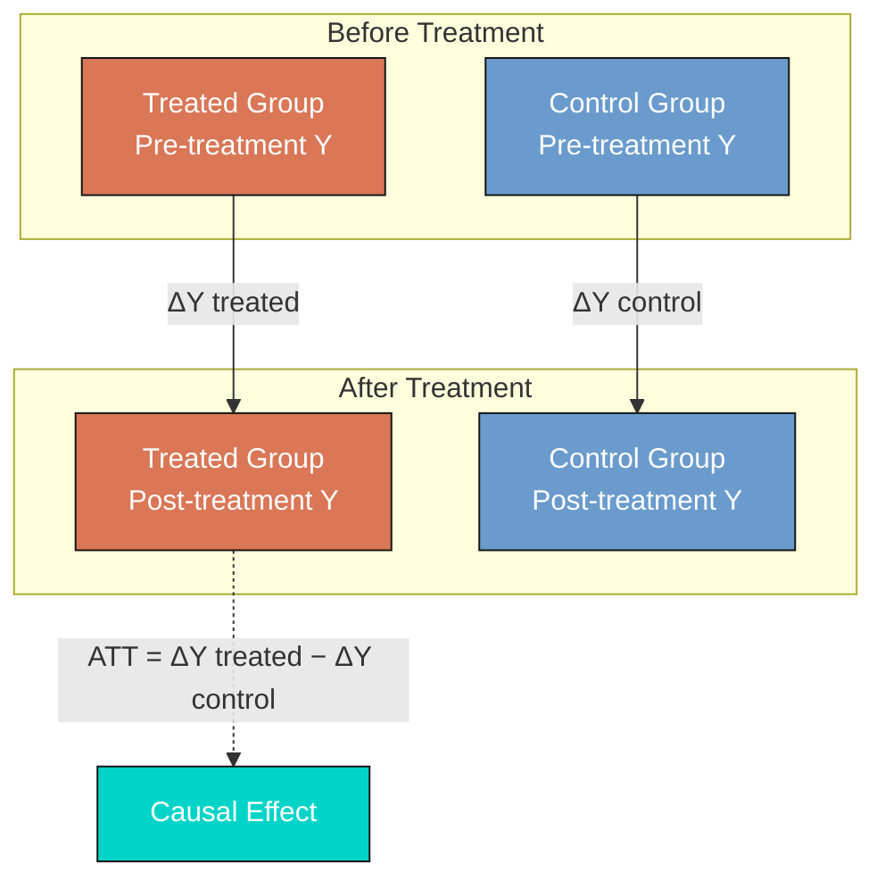
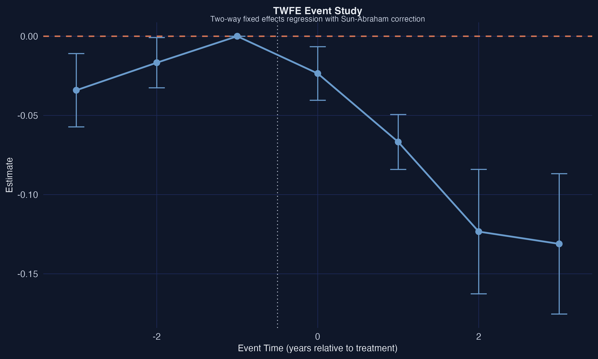
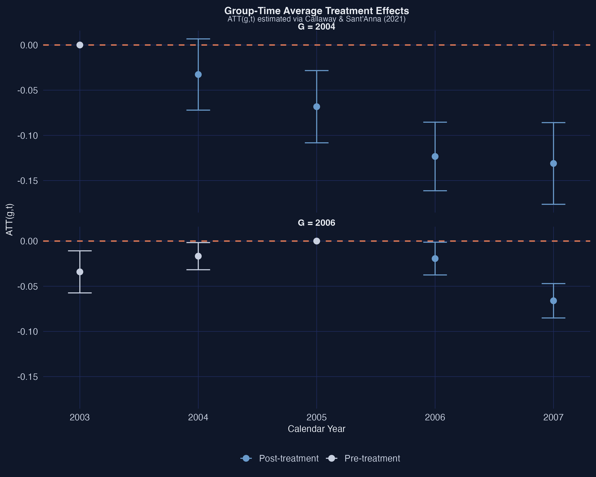
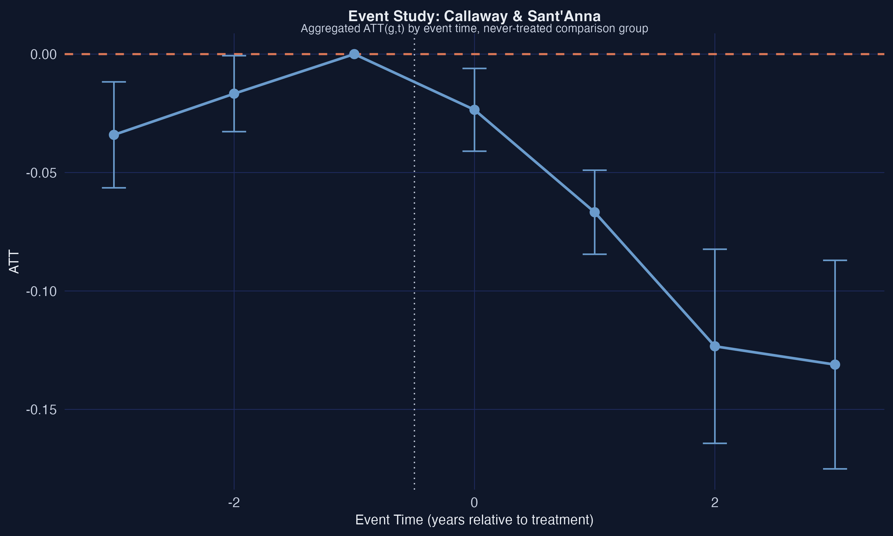
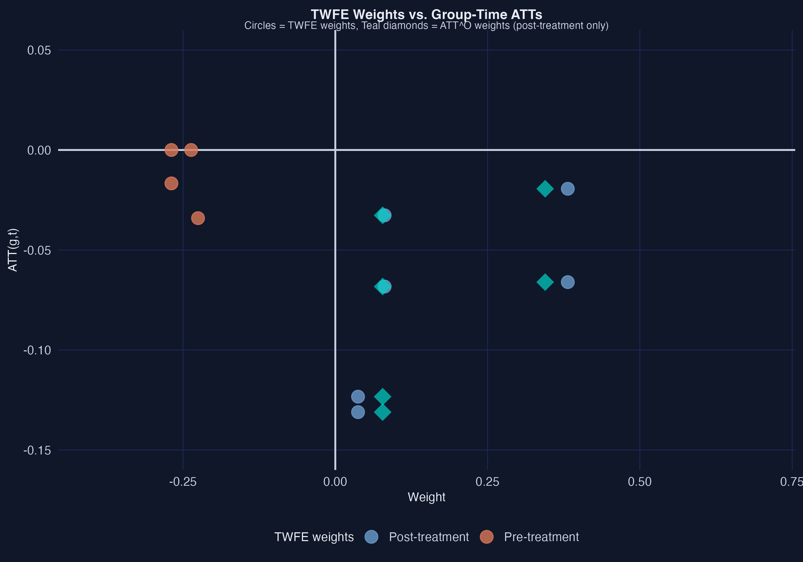
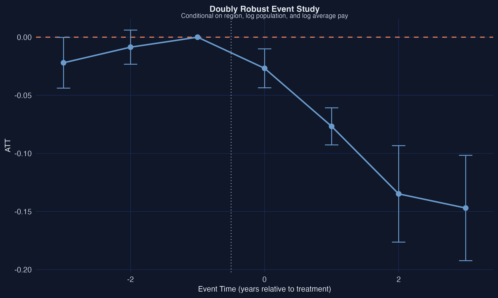
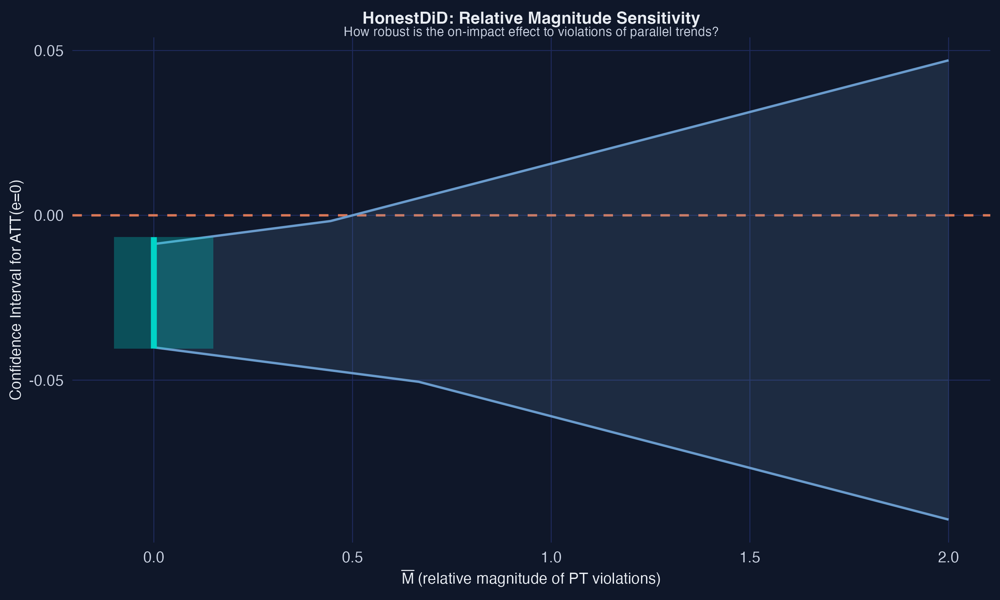
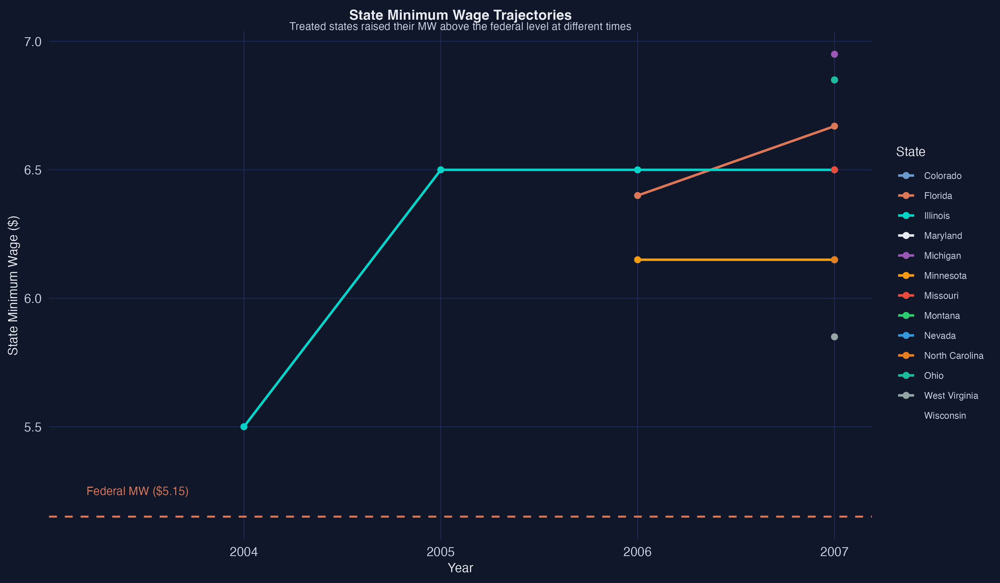
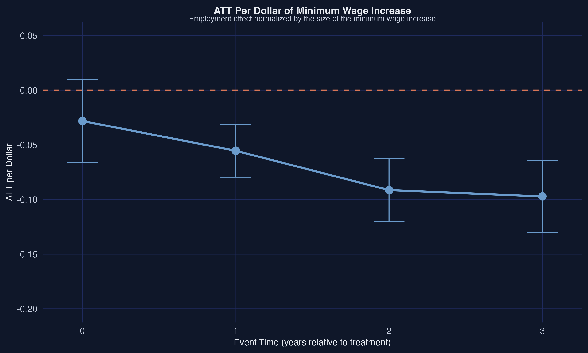

---
authors:
  - admin
categories:
  - R
  - Causal Inference
  - Tutorial
  - Panel Data
draft: false
featured: false
date: "2026-03-26T00:00:00Z"
external_link: ""
image:
  caption: ""
  focal_point: Smart
  placement: 3
links:
- icon: code
  icon_pack: fas
  name: "R script"
  url: analysis.R
slides:
summary: A guide to Difference-in-Differences with staggered treatment --- from TWFE pitfalls through Callaway-Sant'Anna group-time ATTs, doubly robust estimation, and HonestDiD sensitivity analysis --- applied to minimum wage effects on teen employment.
tags:
  - r
  - causal
  - causal inference
title: "Difference-in-Differences for Policy Evaluation: A Tutorial using R"
url_code: ""
url_pdf: ""
url_slides: ""
url_video: ""
toc: true
diagram: true
---

## 1. Overview

Does raising the minimum wage reduce employment among young workers? This question has been at the center of one of the longest-running debates in labor economics, and the **Difference-in-Differences (DID)** method has been the primary tool for answering it. In this tutorial, we analyze how state-level minimum wage increases between 2001 and 2007 affected teen employment in the United States --- a period when the federal minimum wage was frozen at \\$5.15 per hour, while individual states raised their own minimum wages at different times. This variation in treatment timing creates a natural experiment ideally suited for DID.

For decades, applied researchers implemented DID using a simple **two-way fixed effects (TWFE)** regression --- a panel regression with unit and time fixed effects. Recent research has revealed that this approach can produce severely biased estimates when there is **staggered treatment adoption** (units treated at different times) and **treatment effect heterogeneity** (effects that vary across groups or over time). The TWFE regression implicitly makes "forbidden comparisons" that use already-treated units as the comparison group, and it assigns negative weights to some group-time treatment effects. These problems are not theoretical curiosities --- they lead to meaningful differences in empirical estimates.

This tutorial walks through the complete modern DID workflow. We begin with the traditional TWFE regression and demonstrate its limitations. We then introduce the **Callaway and Sant'Anna (2021)** framework for estimating group-time average treatment effects, $ATT(g,t)$, that cleanly separate identification from estimation. We extend the analysis with covariates using doubly robust estimation, assess the sensitivity of results to violations of parallel trends using **HonestDiD** (Rambachan and Roth, 2023), and explore how to handle heterogeneous treatment doses across states. The tutorial is based on Callaway's (2022) chapter "Difference-in-Differences for Policy Evaluation" and the accompanying LSU workshop materials.

**Learning objectives:**

- Understand the parallel trends assumption and why TWFE regressions break down with staggered treatment adoption and treatment effect heterogeneity
- Estimate group-time average treatment effects using `att_gt()` from the `did` package and aggregate them into overall ATTs and event studies
- Diagnose TWFE bias through weight decomposition, identifying negative weights and pre-treatment contamination
- Apply doubly robust estimation with conditional parallel trends and assess robustness to base period and comparison group choices
- Conduct HonestDiD sensitivity analysis to evaluate how robust findings are to violations of parallel trends

## 2. Setup

```r
# Install packages if needed
cran_packages <- c("did", "fixest", "HonestDiD", "DRDID", "BMisc",
                   "modelsummary", "ggplot2", "dplyr", "pte")
missing <- cran_packages[!sapply(cran_packages, requireNamespace, quietly = TRUE)]
if (length(missing) > 0) install.packages(missing)

# twfeweights is GitHub-only
if (!requireNamespace("twfeweights", quietly = TRUE)) {
  remotes::install_github("bcallaway11/twfeweights")
}
# pte may also require GitHub install if not on CRAN
if (!requireNamespace("pte", quietly = TRUE)) {
  remotes::install_github("bcallaway11/pte")
}

library(did)
library(fixest)
library(twfeweights)
library(HonestDiD)
library(DRDID)
library(BMisc)
library(modelsummary)
library(ggplot2)
library(dplyr)
```

## 3. Data Loading and Exploration

The dataset comes from Callaway and Sant'Anna (2021) and contains county-level panel data on teen employment and state minimum wages across the United States from 2001 to 2007. During this period, the federal minimum wage remained constant at \\$5.15 per hour, while several states raised their state-level minimum wages above the federal floor at different points in time. States that raised their minimum wages form the "treated" groups, identified by the year their first increase took effect. States that never raised their minimum wage above the federal level during this period form the "never-treated" comparison group.

```r
# Load data from Callaway's GitHub repository
load(url("https://github.com/bcallaway11/did_chapter/raw/master/mw_data_ch2.RData"))

# Filter: keep groups 0 (never-treated), 2004, 2006; drop Northeast region
mw_data_ch2 <- subset(mw_data_ch2,
                       (G %in% c(2004, 2006, 2007, 0)) & (region != "1"))

# Main analysis subset: drop G=2007, keep year >= 2003
data2 <- subset(mw_data_ch2, G != 2007 & year >= 2003)

head(data2[, c("id", "year", "G", "lemp", "lpop", "region")])
```

```text
     id year    G     lemp     lpop region
6  1001 2003    0 5.253534 10.07352      3
7  1001 2004    0 5.288267 10.06966      3
8  1001 2005    0 5.267858 10.06235      3
9  1001 2006    0 5.298317 10.05546      3
10 1001 2007    0 5.232025 10.04953      3
31 1003 2003    0 6.822197 11.16740      3
```

```r
# Counties by treatment group
data2 %>%
  filter(year == 2003) %>%
  group_by(G) %>%
  summarise(n_counties = n(), .groups = "drop")
```

```text
     G n_counties
1    0       1417
2 2004        102
3 2006        226
```

The dataset contains 8,725 county-year observations spanning 1,745 counties over five years (2003--2007). There are two treatment groups: 102 counties in states that first raised their minimum wage in 2004 (G=2004) and 226 counties in states that did so in 2006 (G=2006). The remaining 1,417 counties are in states that kept their minimum wage at the federal level throughout the period and serve as the never-treated comparison group. We drop the G=2007 group (states raising their minimum wage right before the federal increase) to maintain a cleaner analysis window, following the workshop approach.

```r
# Summary statistics
summary(data2[, c("lemp", "lpop", "lavg_pay")])
```

```text
      lemp             lpop          lavg_pay
 Min.   : 1.099   Min.   : 6.397   Min.   : 9.646
 1st Qu.: 4.615   1st Qu.: 9.149   1st Qu.:10.117
 Median : 5.517   Median : 9.931   Median :10.225
 Mean   : 5.594   Mean   :10.030   Mean   :10.245
 3rd Qu.: 6.458   3rd Qu.:10.762   3rd Qu.:10.352
 Max.   :11.173   Max.   :15.492   Max.   :11.223
```

The outcome variable `lemp` is log teen employment, with a mean of 5.59 (corresponding to roughly 270 teen workers per county). The covariates `lpop` (log county population, mean 10.03) and `lavg_pay` (log average county pay, mean 10.25) capture differences in county size and economic conditions that could affect employment trends. These covariates will become important when we condition the parallel trends assumption on observables in Section 7.

## 4. The Basic DID Framework

### 4.1 DID Intuition and Parallel Trends

The core idea behind Difference-in-Differences is simple: compare how outcomes change over time for the treated group relative to a comparison group. If the treated and comparison groups would have followed **parallel trends** in the absence of treatment, then any divergence after treatment can be attributed to the treatment itself. Formally, the Average Treatment Effect on the Treated (ATT) is identified as:

$$ATT = E[\Delta Y\_{t^{\ast}} \mid D=1] - E[\Delta Y\_{t^{\ast}} \mid D=0]$$

where $\Delta Y\_{t^{\ast}}$ is the change in outcomes from the pre-treatment period to the post-treatment period, $D=1$ indicates treated units, and $D=0$ indicates untreated units. The ATT equals the change in outcomes for the treated group, adjusted by the change in outcomes for the comparison group.



In the textbook case with exactly two periods and two groups, the TWFE regression $Y\_{it} = \theta\_t + \eta\_i + \alpha D\_{it} + v\_{it}$ delivers an estimate of $\alpha$ that is numerically identical to the simple DID estimator, even in the presence of treatment effect heterogeneity. Here, $\theta\_t$ represents time fixed effects (captured by `year` in the regression), $\eta\_i$ represents unit fixed effects (captured by `id`), $D\_{it}$ is the treatment indicator (`post`), and $v\_{it}$ are idiosyncratic unobservables.

However, this equivalence breaks down when there are **multiple time periods** and **variation in treatment timing**. In our application, states raised their minimum wages at different times (2004 and 2006), creating a staggered treatment adoption design.

The TWFE regression implicitly makes two types of comparisons: (1) "good comparisons" that compare treated groups to not-yet-treated groups, and (2) "bad comparisons" (sometimes called "forbidden comparisons") that use already-treated groups as the comparison group. To see why this is problematic, imagine grading a student's improvement by comparing them to classmates who already took the test last week --- those "comparison" students are themselves affected by the test, so they no longer represent a valid counterfactual. Similarly, already-treated units may themselves be experiencing treatment effects, contaminating the estimate.

Moreover, under treatment effect heterogeneity, the TWFE coefficient $\alpha$ is a weighted average of underlying group-time treatment effects, and some of these weights can be **negative**. It is as if you tried to compute an average score but accidentally gave some students a negative weight --- their positive performance would drag the average down. This means TWFE could, in principle, produce a negative estimate even when all true treatment effects are positive.

### 4.2 TWFE Regression

Let us start with the traditional TWFE approach to establish a baseline estimate.

```r
twfe_res <- fixest::feols(lemp ~ post | id + year,
                          data = data2,
                          cluster = "id")
summary(twfe_res)
```

```text
OLS estimation, Dep. Var.: lemp
Observations: 8,725
Fixed-effects: id: 1,745,  year: 5
Standard-errors: Clustered (id)
     Estimate Std. Error  t value   Pr(>|t|)
post -0.03812   0.008489 -4.49036 7.5762e-06 ***
---
RMSE: 0.116264     Adj. R2: 0.9926
                 Within R2: 0.003711
```

The TWFE regression estimates that minimum wage increases reduced log teen employment by 0.038 (SE = 0.008), which is statistically significant. Interpreted naively, this suggests that states raising their minimum wage experienced a 3.8% decline in teen employment relative to states that did not. However, this single coefficient attempts to summarize the entire treatment effect across two different treatment groups, multiple post-treatment periods, and varying lengths of exposure --- a task that, as we will show, is not well-served by TWFE under treatment effect heterogeneity.



The TWFE event study above uses `fixest::sunab()` to estimate dynamic treatment effects within the TWFE framework. The coefficients suggest a small pre-trend violation at event time $-3$ and increasingly negative post-treatment effects. While the Sun-Abraham correction improves upon the standard TWFE event study by addressing some of the weighting issues, we will see that the Callaway-Sant'Anna approach provides a more principled decomposition of the treatment effect.

## 5. Group-Time ATT: The Callaway-Sant'Anna Approach

### 5.1 Estimating ATT(g,t)

The Callaway and Sant'Anna (2021) framework addresses the limitations of TWFE by working with **group-time average treatment effects**:

$$ATT(g,t) = E[Y\_t(g) - Y\_t(0) \mid G = g]$$

where $Y\_t(g)$ is the potential outcome at time $t$ if first treated in period $g$, $Y\_t(0)$ is the untreated potential outcome, and $G = g$ identifies units in treatment group $g$. In words, $ATT(g,t)$ is the average treatment effect for units first treated in period $g$, measured at time $t$. These building-block parameters are identified under the parallel trends assumption using clean comparisons: each treated group is compared only to units that are never treated (or not yet treated), avoiding the forbidden comparisons that plague TWFE.

```r
attgt <- did::att_gt(yname = "lemp",
                     idname = "id",
                     gname = "G",
                     tname = "year",
                     data = data2,
                     control_group = "nevertreated",
                     base_period = "universal")

tidy(attgt)[, 1:5]
```

```text
              term group time    estimate   std.error
   ATT(2004,2003)  2004 2003  0.00000000          NA
   ATT(2004,2004)  2004 2004 -0.03266653  0.02149279
   ATT(2004,2005)  2004 2005 -0.06827991  0.02098524
   ATT(2004,2006)  2004 2006 -0.12335404  0.02089502
   ATT(2004,2007)  2004 2007 -0.13109136  0.02326712
   ATT(2006,2003)  2006 2003 -0.03408910  0.01165128
   ATT(2006,2004)  2006 2004 -0.01669977  0.00817406
   ATT(2006,2005)  2006 2005  0.00000000          NA
   ATT(2006,2006)  2006 2006 -0.01939335  0.00892409
   ATT(2006,2007)  2006 2007 -0.06607568  0.00965073
```

The `att_gt()` function estimates each $ATT(g,t)$ separately. For the G=2004 group, the treatment effect grows over time: $-0.033$ on impact (2004), $-0.068$ one year later (2005), $-0.123$ two years later (2006), and $-0.131$ three years later (2007). This pattern suggests **treatment effect dynamics** --- the negative employment effect of minimum wage increases deepens with longer exposure. For the G=2006 group, the on-impact effect is smaller ($-0.019$) and grows to $-0.066$ after one year. The pre-treatment estimates for G=2006 show a concerning value of $-0.034$ at event time $-3$ (year 2003), suggesting a possible violation of the parallel trends assumption for this group --- a point we will revisit in the sensitivity analysis.



### 5.2 Aggregation: Overall ATT and Event Study

Group-time ATTs are informative but numerous. The `aggte()` function aggregates them into summary parameters. The **overall ATT** weights each $ATT(g,t)$ by the group size and the number of post-treatment periods:

```r
attO <- did::aggte(attgt, type = "group")
summary(attO)
```

```text
Overall summary of ATT's based on group/cohort aggregation:
     ATT    Std. Error     [ 95%  Conf. Int.]
 -0.0571        0.008    -0.0727     -0.0415 *

Group Effects:
 Group Estimate Std. Error [95% Simult.  Conf. Band]
  2004  -0.0888     0.0197       -0.1309     -0.0468 *
  2006  -0.0427     0.0083       -0.0604     -0.0251 *
```

The overall ATT is $-0.057$ (SE = 0.008), substantially larger in magnitude than the TWFE estimate of $-0.038$. The Callaway-Sant'Anna framework reveals that TWFE **understated** the negative employment effect by about one-third. The group-level results show that the G=2004 group experienced a larger average effect ($-0.089$) than the G=2006 group ($-0.043$), which makes sense because the G=2004 group has been treated for more periods and thus accumulates more treatment effect dynamics.

The **event study** aggregation is equally informative:

```r
attes <- did::aggte(attgt, type = "dynamic")
summary(attes)
```

```text
Overall summary of ATT's based on event-study/dynamic aggregation:
     ATT    Std. Error     [ 95%  Conf. Int.]
 -0.0862        0.0124    -0.1106     -0.0618 *

Dynamic Effects:
 Event time Estimate Std. Error [95% Simult.  Conf. Band]
         -3  -0.0341     0.0119       -0.0623     -0.0059 *
         -2  -0.0167     0.0076       -0.0348      0.0014
         -1   0.0000         NA            NA          NA
          0  -0.0235     0.0081       -0.0426     -0.0044 *
          1  -0.0668     0.0086       -0.0870     -0.0465 *
          2  -0.1234     0.0203       -0.1714     -0.0753 *
          3  -0.1311     0.0230       -0.1855     -0.0767 *
```



The event study reveals a clear pattern: the on-impact effect at $e=0$ is $-0.024$, growing to $-0.067$ at $e=1$, $-0.123$ at $e=2$, and $-0.131$ at $e=3$. The post-treatment effects are all statistically significant and increasingly negative, consistent with the minimum wage having a cumulative negative effect on teen employment over time. However, the pre-trend at $e=-3$ is $-0.034$ and marginally significant, which raises a flag about the validity of the parallel trends assumption. The pre-trend at $e=-2$ is smaller ($-0.017$) and not significant. We will formally assess the robustness of these results to parallel trends violations using HonestDiD in Section 8.

### 5.3 TWFE Weight Decomposition

Why does TWFE produce a different estimate than Callaway-Sant'Anna? Both the TWFE coefficient and the overall $ATT^O$ can be written as weighted averages of the same underlying $ATT(g,t)$ values:

$$ATT^O = \sum\_{g,t} w^O(g,t) \cdot ATT(g,t)$$

The difference lies in the weights. The proper $ATT^O$ weights reflect group size and number of post-treatment periods, while the TWFE weights are driven by the estimation method and can assign nonzero weight to pre-treatment periods or even negative weight to some post-treatment cells. The `twfeweights` package makes these weights explicit.

```r
tw_obj <- twfeweights::twfe_weights(attgt)
tw <- tw_obj$weights_df

wO_obj <- twfeweights::attO_weights(attgt)
wO <- wO_obj$weights_df
```

```text
TWFE estimate from weights: -0.0381
ATT^O estimate from weights: -0.0571
TWFE post-treatment component: -0.0503
Pre-treatment contamination: 0.0122
Total TWFE bias: 0.019
Fraction of bias from pre-treatment: 0.6422
Fraction of bias from post-treatment weighting: 0.3578
```



The weight decomposition is revealing. The TWFE estimate ($-0.038$) differs from the proper overall ATT ($-0.057$) by a total bias of $0.019$ --- meaning TWFE attenuates the negative employment effect toward zero. Of this bias, **64.2%** comes from pre-treatment contamination: the TWFE regression assigns nonzero weights to pre-treatment $ATT(g,t)$ values, which should receive zero weight in any proper treatment effect parameter. The remaining **35.8%** of the bias comes from TWFE assigning different post-treatment weights than the proper $ATT^O$ weights. The figure shows this visually: the orange pre-treatment dots receive nonzero TWFE weights (horizontal position), and the post-treatment TWFE weights (blue circles) differ systematically from the proper $ATT^O$ weights (teal diamonds).

## 6. Relaxing Parallel Trends

### 6.1 Conditional Parallel Trends with Covariates

The unconditional parallel trends assumption may be too strong if treatment and comparison groups differ on observable characteristics that affect outcome trends. For example, states that raised their minimum wages may have larger populations or higher average pay levels, and these characteristics could correlate with employment trends even absent the minimum wage change. **Conditional parallel trends** weakens the assumption: trends need only be parallel after conditioning on covariates. The `did` package offers three estimation methods for this setting. Regression adjustment models the outcome as a function of covariates; inverse probability weighting (IPW) reweights the comparison group to match the treated group's covariate distribution; and the **doubly robust** (DR) estimator combines both approaches, remaining consistent if either the outcome model or the propensity score model is correctly specified --- like wearing both a belt and suspenders.

```r
# Regression adjustment
cs_reg <- att_gt(yname = "lemp", tname = "year", idname = "id", gname = "G",
                 xformla = ~lpop + lavg_pay,
                 control_group = "nevertreated", base_period = "universal",
                 est_method = "reg", data = data2)
attO_reg <- aggte(cs_reg, type = "group")

# Inverse probability weighting
cs_ipw <- att_gt(yname = "lemp", tname = "year", idname = "id", gname = "G",
                 xformla = ~lpop + lavg_pay,
                 control_group = "nevertreated", base_period = "universal",
                 est_method = "ipw", data = data2)
attO_ipw <- aggte(cs_ipw, type = "group")

# Doubly robust
cs_dr <- att_gt(yname = "lemp", tname = "year", idname = "id", gname = "G",
                xformla = ~lpop + lavg_pay,
                control_group = "nevertreated", base_period = "universal",
                est_method = "dr", data = data2)
attO_dr <- aggte(cs_dr, type = "group")
```

| Method           | Overall ATT | SE    |
| ---------------- | ----------- | ----- |
| Unconditional    | $-0.057$    | 0.008 |
| Regression adj.  | $-0.064$    | 0.008 |
| IPW              | $-0.065$    | 0.008 |
| Doubly robust    | $-0.065$    | 0.008 |

Controlling for log population and log average pay increases the estimated negative employment effect from $-0.057$ to approximately $-0.065$ across all three conditional methods. The three estimation methods produce nearly identical estimates, which is reassuring. The fact that all three methods agree suggests that covariate adjustment is not introducing model-dependence artifacts.



The doubly robust event study shows the same qualitative pattern as the unconditional analysis: near-zero pre-trends (the pre-trend at $e=-3$ shrinks from $-0.034$ to $-0.022$ and is no longer significant) and increasingly negative post-treatment effects ($-0.027$ at $e=0$, $-0.077$ at $e=1$, $-0.135$ at $e=2$, $-0.147$ at $e=3$). The improved pre-trend behavior after conditioning on covariates suggests that some of the apparent pre-trend violations in the unconditional analysis were driven by differences in county characteristics between treatment and comparison groups.

### 6.2 Robustness: Base Period, Comparison Group, and Anticipation

The Callaway-Sant'Anna framework allows the researcher to make several important choices. We now check that our results are robust to these choices.

**Varying base period:** Instead of comparing all pre-treatment and post-treatment periods to a single universal base period ($t = g-1$), we can use a varying base period that compares each period $t$ to period $t-1$.

```r
cs_varying <- att_gt(yname = "lemp", tname = "year", idname = "id", gname = "G",
                     xformla = ~lpop + lavg_pay,
                     control_group = "nevertreated", base_period = "varying",
                     est_method = "dr", data = data2)
attO_varying <- aggte(cs_varying, type = "group")
```

```text
Varying base period ATT^O: -0.0646 (SE: 0.0081)
```

**Not-yet-treated comparison group:** Instead of using only the never-treated group as the comparison, we can also include units that are not yet treated at time $t$.

```r
cs_nyt <- att_gt(yname = "lemp", tname = "year", idname = "id", gname = "G",
                 xformla = ~lpop + lavg_pay,
                 control_group = "notyettreated", base_period = "universal",
                 est_method = "dr", data = data2)
attO_nyt <- aggte(cs_nyt, type = "group")
```

```text
Not-yet-treated ATT^O: -0.0649 (SE: 0.008)
```

**Anticipation:** If states announced their minimum wage increases before they took effect, workers and firms might adjust their behavior in anticipation. We allow for one period of anticipation by setting `anticipation = 1`.

```r
cs_antic <- att_gt(yname = "lemp", tname = "year", idname = "id", gname = "G",
                   xformla = ~lpop + lavg_pay,
                   control_group = "nevertreated", base_period = "universal",
                   est_method = "dr", anticipation = 1, data = data2)
attO_antic <- aggte(cs_antic, type = "group")
```

```text
With anticipation (1 period) ATT^O: -0.0396 (SE: 0.0098)
```

The results are reassuringly stable across specifications. Switching to a varying base period ($-0.065$) or using the not-yet-treated comparison group ($-0.065$) produces virtually identical estimates to our baseline doubly robust result ($-0.065$). Allowing for one period of anticipation reduces the estimated ATT to $-0.040$ (SE = 0.010), which makes sense --- if some of the treatment effect occurs before the official implementation date, excluding that period from post-treatment narrows the estimated effect. The consistency across the first three specifications gives us confidence that the main findings are not driven by specific methodological choices.

## 7. Sensitivity Analysis: When Parallel Trends May Fail

Even after conditioning on covariates, the parallel trends assumption is not directly testable --- pre-trends being close to zero is necessary but not sufficient for parallel trends to hold in post-treatment periods. The **HonestDiD** approach of Rambachan and Roth (2023) provides a principled sensitivity analysis: it asks how large violations of parallel trends can be before the post-treatment results break down. The "relative magnitude" variant compares the size of potential post-treatment violations to the observed size of pre-treatment deviations from parallel trends.

The `HonestDiD` package requires a small helper function to interface with the `did` package's event study objects. This helper (available in the companion R script and in [Callaway's workshop materials](https://github.com/bcallaway11/did_chapter)) extracts the influence function (a statistical tool for computing standard errors in complex estimators) and variance-covariance matrix from the event study, then passes them to `HonestDiD`'s sensitivity routines. The parameter $\bar{M}$ bounds the ratio of the maximum post-treatment deviation from parallel trends to the maximum pre-treatment deviation --- in other words, it is a stress test asking "how much worse can things get after treatment compared to what we already see before treatment?"

```r
# Helper function from Callaway's workshop (references/honest_did.R)
# Bridges the did package's AGGTEobj to HonestDiD's sensitivity functions
source("references/honest_did.R")

attgt_hd <- did::att_gt(yname = "lemp", idname = "id", gname = "G",
                        tname = "year", data = data2,
                        control_group = "nevertreated",
                        base_period = "universal")
cs_es_hd <- aggte(attgt_hd, type = "dynamic")

hd_rm <- honest_did(es = cs_es_hd, e = 0, type = "relative_magnitude")
```

```text
Original CI: [-0.0404, -0.0066]
Robust CIs:
        lb       ub  Mbar
  -0.0401 -0.00871 0.000
  -0.0435 -0.00523 0.222
  -0.0470 -0.00174 0.444
  -0.0505  0.00523 0.667
  -0.0575  0.01220 0.889
  -0.0644  0.01920 1.111
```



The sensitivity analysis reveals that the on-impact effect ($e=0$) is robust to moderate violations of parallel trends, but not to large ones. The original 95% confidence interval is $[-0.040, -0.007]$, comfortably below zero. As $\bar{M}$ increases --- meaning we allow post-treatment violations of parallel trends to be larger relative to pre-treatment violations --- the confidence interval widens. The **breakdown point** is at $\bar{M} \approx 0.67$: if post-treatment violations are no more than about 67% as large as the pre-treatment deviations from parallel trends, the negative employment effect remains statistically significant. Beyond that threshold, the confidence interval includes zero and we can no longer rule out a null effect. Given the moderate pre-trend violations we observed (especially at $e=-3$), this suggests that the results should be interpreted with some caution --- the evidence is suggestive of a negative employment effect, but it is not bulletproof.

## 8. More Complicated Treatment Regimes

### 8.1 Heterogeneous Treatment Doses

So far, we have treated all minimum wage increases as a binary "treated or not" event. But states raised their minimum wages by very different amounts --- some by as little as \\$0.10 above the federal floor, others by over \\$1.00. A \\$0.25 increase and a \\$1.70 increase should not be expected to have the same employment effect. To account for this, we can normalize the treatment effect by the size of the minimum wage increase, computing an **ATT per dollar**.

```r
# Use full data including G=2007 for more treated states
data3 <- subset(mw_data_ch2, year >= 2003)
treated_state_list <- unique(subset(data3, G != 0)$state_name)
```



The figure reveals substantial variation across states. Illinois raised its minimum wage early (2004) and by a relatively large amount, while Florida and Colorado made smaller increases later. This heterogeneity in treatment dose motivates the per-dollar normalization.

### 8.2 ATT Per Dollar Event Study

We compute state-specific ATTs using the doubly robust panel DID estimator from the `DRDID` package, then divide each by the size of the minimum wage increase above the federal level.

```r
# For each treated state and post-treatment period, compute ATT
# using the doubly robust panel estimator, then normalize by dose
for (state in treated_state_list) {
  g <- unique(subset(data3, state_name == state)$G)
  for (period in 2004:2007) {
    Y1 <- c(subset(data3, state_name == state & year == period)$lemp,
            subset(data3, G == 0 & year == period)$lemp)
    Y0 <- c(subset(data3, state_name == state & year == g - 1)$lemp,
            subset(data3, G == 0 & year == g - 1)$lemp)
    D <- c(rep(1, sum(data3$state_name == state & data3$year == period)),
           rep(0, sum(data3$G == 0 & data3$year == period)))
    attst <- DRDID::drdid_panel(Y1, Y0, D, covariates = NULL)
    treat_amount <- unique(subset(data3, state_name == state &
                                    year == period)$state_mw) - 5.15
    att_per_dollar <- attst$ATT / treat_amount
  }
}
# Note: this is a simplified excerpt. See analysis.R for the full
# implementation with result storage, event study aggregation, and plots.
```

```text
Overall ATT per dollar: -0.0297 (SE: 0.0155)

Event study ATT per dollar:
  event_time     att      se  ci_lower  ci_upper
           0 -0.028   0.020   -0.066    0.010
           1 -0.055   0.012   -0.079   -0.031
           2 -0.091   0.015   -0.120   -0.062
           3 -0.097   0.017   -0.130   -0.064
```



The dose-normalized results tell a consistent story. The on-impact effect per dollar is $-0.028$ (not quite significant at the 5% level), but the effect grows substantially with exposure: $-0.055$ after one year, $-0.091$ after two years, and $-0.097$ after three years. These per-dollar estimates imply that a \\$1 increase in the minimum wage is associated with a decline of 0.055 log points in teen employment after one year (approximately 5.3%) and 0.097 log points after three years (approximately 9.2%). The post-treatment estimates from $e=1$ onward are all statistically significant. The overall ATT per dollar of $-0.030$ (SE = 0.016) averages across all post-treatment periods, but the event study makes clear that the cumulative effects are substantially larger.

## 9. Alternative Identification Strategies

The DID framework relies on the parallel trends assumption. Alternative identification strategies relax this assumption in different ways. The `pte` package implements a **lagged outcomes** strategy, which conditions on lagged outcome values rather than assuming parallel trends. Instead of assuming that treated and untreated groups would have followed the same trend, this approach assumes that controlling for the previous period's outcome level makes treatment assignment as good as random --- counties with the same employment level last year are equally likely to be in a state that raised its minimum wage, regardless of which state they are in.

```r
library(pte)
data2_lo <- data2
data2_lo$G2 <- data2_lo$G

lo_res <- pte::pte_default(yname = "lemp", tname = "year", idname = "id",
                           gname = "G2", data = data2_lo,
                           d_outcome = FALSE, lagged_outcome_cov = TRUE)
summary(lo_res)
```

```text
Overall ATT: -0.061 (SE: 0.008, 95% CI: [-0.077, -0.045])

Dynamic Effects:
 Event Time Estimate Std. Error   [95%  Conf. Band]
         -2   0.014     0.008    -0.010      0.038
         -1   0.010     0.007    -0.009      0.030
          0  -0.024     0.009    -0.049      0.000
          1  -0.074     0.008    -0.097     -0.050 *
          2  -0.129     0.019    -0.185     -0.073 *
          3  -0.140     0.023    -0.206     -0.074 *
```

The lagged outcomes strategy produces an overall ATT of $-0.061$ (SE = 0.008), very close to the DID estimates with covariates ($-0.065$). The pre-trends under this alternative identification strategy are close to zero (0.014 at $e=-2$ and 0.010 at $e=-1$, both insignificant), and the post-treatment trajectory ($-0.024$ on impact, $-0.074$ at $e=1$, $-0.129$ at $e=2$, $-0.140$ at $e=3$) closely mirrors the DID event study. The convergence of results across different identification strategies strengthens the case that the estimated negative employment effects are reflecting a genuine causal relationship rather than an artifact of any particular set of assumptions.

## 10. Discussion and Takeaways

This tutorial demonstrates why **TWFE regressions are unreliable** with staggered treatment adoption and treatment effect heterogeneity, and how modern DID methods provide a principled alternative. The TWFE coefficient of $-0.038$ understates the true overall ATT of $-0.057$ by about one-third, with the bias driven primarily by pre-treatment contamination (64% of the total bias) and improper post-treatment weighting (36%). The Callaway-Sant'Anna framework cleanly separates identification from estimation by first computing group-time ATTs and then aggregating them into target parameters of interest.

The substantive findings suggest that state-level minimum wage increases above the federal floor reduced teen employment, with effects that grew over time. The doubly robust estimator with covariates yields an overall ATT of $-0.065$ (SE = 0.008), and the dose-normalized analysis finds effects of approximately $-0.055$ per dollar after one year and $-0.097$ per dollar after three years. These results are robust across estimation methods (regression adjustment, IPW, doubly robust), comparison group definitions (never-treated, not-yet-treated), and base period choices (universal, varying).

However, the results come with important caveats. The HonestDiD sensitivity analysis shows that the on-impact effect loses statistical significance when post-treatment parallel trends violations exceed about 67% of the pre-treatment deviations. The pre-treatment coefficient at $e=-3$ is moderately significant in the unconditional analysis, though it shrinks after covariate adjustment. These patterns suggest that while the evidence points toward negative employment effects, the magnitude should be interpreted with some caution. As Callaway (2022) notes, this application is primarily intended to illustrate the methodology rather than to settle the minimum wage debate.

The modern DID toolkit demonstrated here --- `did` for group-time ATTs, `twfeweights` for diagnosing TWFE problems, `HonestDiD` for sensitivity analysis, and `DRDID` for doubly robust estimation --- provides applied researchers with a complete workflow for credible causal inference in staggered treatment settings. The key lesson is that DID is not just a regression --- it is an identification strategy that requires careful attention to the structure of the treatment, the comparison group, and the plausibility of the underlying assumptions.

**Key takeaways:**

1. TWFE understates the true ATT by ~33% ($-0.038$ vs $-0.057$), with 64% of the bias from pre-treatment contamination and 36% from improper post-treatment weighting
2. The doubly robust ATT of $-0.065$ is stable across estimation methods (regression, IPW, DR), comparison groups (never-treated, not-yet-treated), and base periods (universal, varying)
3. Employment effects accumulate over time: $-0.027$ on impact, growing to $-0.147$ after three years under the doubly robust specification
4. The on-impact effect is robust to parallel trends violations up to 67% of pre-trend magnitude ($\bar{M} \approx 0.67$), but not beyond
5. Per-dollar normalization reveals that a \\$1 minimum wage increase reduces teen employment by approximately 5.3% after one year and 9.2% after three years

## 11. Exercises

1. **Expand the sample:** Re-run the analysis using `data3` (which includes the G=2007 group) and compare the results. Does including the additional treatment group change the overall ATT or the event study pattern?

2. **Alternative covariates:** Experiment with different covariate specifications in the doubly robust estimator. What happens if you include only `lpop`? Only `lavg_pay`? Does the choice of covariates meaningfully affect the pre-trends?

3. **Smoothness sensitivity:** Run the HonestDiD smoothness-based sensitivity analysis (`type = "smoothness"`) in addition to the relative magnitude analysis. How do the two approaches compare in terms of the robustness of the results?

## 12. References

1. Callaway, B. (2022). Difference-in-Differences for Policy Evaluation. In *Handbook of Labor, Human Resources, and Population Economics*. Springer. [Published version](https://link.springer.com/referenceworkentry/10.1007/978-3-319-57365-6_352-1) | [Working paper](https://bcallaway11.github.io/files/Callaway-Chapter-2022/main.pdf)

2. Callaway, B. and Sant'Anna, P.H.C. (2021). Difference-in-Differences with Multiple Time Periods. *Journal of Econometrics*, 225(2), 200--230. [doi:10.1016/j.jeconom.2020.12.001](https://doi.org/10.1016/j.jeconom.2020.12.001)

3. Goodman-Bacon, A. (2021). Difference-in-differences with variation in treatment timing. *Journal of Econometrics*, 225(2), 254--277. [doi:10.1016/j.jeconom.2021.03.014](https://doi.org/10.1016/j.jeconom.2021.03.014)

4. Rambachan, A. and Roth, J. (2023). A More Credible Approach to Parallel Trends. *Review of Economic Studies*, 90(5), 2555--2591. [doi:10.1093/restud/rdad018](https://doi.org/10.1093/restud/rdad018)

5. de Chaisemartin, C. and D'Haultfoeuille, X. (2020). Two-Way Fixed Effects Estimators with Heterogeneous Treatment Effects. *American Economic Review*, 110(9), 2964--2996.

6. Sun, L. and Abraham, S. (2021). Estimating dynamic treatment effects in event studies with heterogeneous treatment effects. *Journal of Econometrics*, 225(2), 175--199.

7. `did` package: [CRAN](https://cran.r-project.org/package=did) | [GitHub](https://github.com/bcallaway11/did)

8. `fixest` package: [CRAN](https://cran.r-project.org/package=fixest) | [Documentation](https://lrberge.github.io/fixest/)

9. `twfeweights` package: [GitHub](https://github.com/bcallaway11/twfeweights)

10. `HonestDiD` package: [CRAN](https://cran.r-project.org/package=HonestDiD) | [GitHub](https://github.com/asheshrambachan/HonestDiD)
