---
authors:
  - admin
categories:
  - R
  - Difference-in-Differences (DiD)
draft: false
featured: false
date: "2026-05-17T00:00:00Z"
external_link: ""
image:
  caption: ""
  focal_point: Smart
  placement: 3
links:
- icon: chalkboard-teacher
  icon_pack: fas
  name: "Slides (HTML)"
  url: slides/index.html
- icon: laptop-code
  icon_pack: fas
  name: "Web app"
  url: web_app/index.html
- icon: code
  icon_pack: fas
  name: "R script"
  url: analysis.R
- icon: markdown
  icon_pack: fab
  name: "MD version"
  url: https://raw.githubusercontent.com/cmg777/starter-academic-v501/master/content/post/r_did2/index.md
- icon: file-code
  icon_pack: fas
  name: "Quarto project (.zip)"
  url: r_did2.zip
- icon: podcast
  icon_pack: fas
  name: AI Podcast
  url: "/post/r_did2/#podcast-player"
slides:
summary: A case study on the Affordable Care Act's Medicaid expansion --- working through 2x2 cell-means, TWFE, covariate-adjusted DRDID, 2xT and Callaway-Sant'Anna staggered event studies, and HonestDiD sensitivity --- to show how population weighting changes the target parameter when the units are regions of very different sizes.
tags:
  - r
  - causal
  - causal inference
  - difference-in-differences
  - panel data
  - regional
title: "Difference-in-Differences for Regional Data: Did Medicaid Expansion Reduce Mortality?"
url_code: ""
url_pdf: ""
url_slides: ""
url_video: ""
toc: true
diagram: true
---

## Abstract

When the units in a difference-in-differences (DiD) study are regions that differ in size by orders of magnitude, the choice of whether to weight by population is not a precision detail but a decision about which causal parameter is being estimated. This tutorial uses the Affordable Care Act's staggered Medicaid expansion to ask whether the program reduced adult mortality, and to show how population weighting changes the target parameter. The data are CDC county-level mortality counts (deaths per 100,000 adults aged 20-64) merged with state Medicaid-expansion timing, cleaned into a balanced panel of 2,604 counties across 11 years (2009-2019, 28,644 county-year rows; 978 counties expanded in 2014, with 1,222 never expanding). Following Baker, Callaway, Cunningham, Goodman-Bacon and Sant'Anna's (2025) practitioner's guide, the analysis runs an eight-stage R pipeline — 2x2 cell means, three equivalent TWFE specifications, covariate-adjusted OR/IPW/DRDID, a 2xT event study, the Callaway-Sant'Anna staggered ATT(g,t) design, and a Rambachan-Roth HonestDiD sensitivity analysis — computing every estimate both unweighted and weighted by 2013 adult population. The headline 2x2 ATT(2014) flips sign with weighting, from +0.122 deaths per 100,000 unweighted to -2.563 weighted, while the pre-period gap stays nearly identical (-54.77 vs -53.68). Covariate adjustment narrows but does not close the gap (DRDID -1.226 unweighted vs -3.756 weighted), and none of the six 95% confidence intervals excludes zero. The unweighted 2xT effect reaches +16.96 by year five (CI [+6.83, +27.09]) while the weighted trajectory stays near zero, and HonestDiD breakdown values are uncomfortably low (the unweighted positive sign collapses by M-bar = 0.25). The implication is that the data are too underpowered to settle the policy question, and that the unweighted and weighted estimands answer different questions — the typical treated county versus the typical treated adult — rather than competing for the same answer.

## 1. Overview

Did the Affordable Care Act's Medicaid expansion reduce adult mortality? Between 2014 and 2019, twenty-nine states (plus DC) opened Medicaid eligibility to low-income adults who had previously been uncovered; the remaining states did not. That staggered roll-out is a natural experiment, and **Difference-in-Differences (DiD)** is the standard tool for turning it into a causal estimate of how the program affected the death rate of working-age adults. The empirical question matters: roughly twenty million people gained insurance under the expansion, and a reduction of even a few deaths per 100,000 adults would translate into thousands of lives saved each year.

The challenge is that the unit of analysis here is the *county*, not the individual --- and U.S. counties differ in size by three orders of magnitude. Los Angeles County has more adults than Wyoming, Vermont, and Alaska combined. When you compute an average treatment effect, you must decide whether each county should count equally (an unweighted average across counties), or whether each adult should count equally (an average weighted by county population). This is not just a precision choice. **Weighting changes the target parameter.** The unweighted answer estimates the effect on the *typical treated county*; the weighted answer estimates the effect on the *typical treated adult*. When treatment effects vary across counties of different sizes, those two parameters can disagree --- sometimes dramatically.

This tutorial is inspired by the empirical example from Baker, Callaway, Cunningham, Goodman-Bacon and Sant'Anna's (2025) *Difference-in-Differences Designs: A Practitioner's Guide* ([arXiv:2503.13323](https://arxiv.org/abs/2503.13323)). We walk through eight stages of the modern DiD pipeline using R, and at every stage we compute the answer twice, once unweighted and once weighted by county adult population in 2013. The headline finding previews what is coming: in the simplest possible four-cell 2x2 calculation, the unweighted DiD is $+0.12$ deaths per 100,000 (suggesting Medicaid did nothing, or even raised mortality slightly), while the population-weighted DiD is $-2.56$ deaths per 100,000 (suggesting it saved lives). The remainder of the post examines whether that sign reversal survives covariate adjustment, staggered cohorts, and a HonestDiD sensitivity analysis. Spoiler: it largely does --- and the punchline is that the two estimands are not in competition. They answer different policy questions.

**Learning objectives.** After working through this tutorial you will be able to:

- **Understand** the parallel-trends assumption and why it is the *only* identifying restriction needed for a 2x2 DiD with two cohorts and two periods.
- **Estimate** the 2x2 cell-means DiD, three equivalent TWFE specifications, and the full Callaway-Sant'Anna $\text{ATT}(g, t)$ design in R using `fixest` and the `did` package.
- **Adjust** for covariates via outcome regression (OR), inverse propensity weighting (IPW), and the Sant'Anna-Zhao doubly robust DiD (DRDID).
- **Compare** unweighted and population-weighted estimands at every stage, and read the gap between them as a difference in *target parameter*, not in precision.
- **Assess** robustness to violations of parallel trends using the Rambachan-Roth `HonestDiD` package, and identify the smallest pre-trend violation that would overturn the conclusion.

### Key concepts at a glance

The post leans on a small vocabulary repeatedly. The rest of the tutorial assumes you can move between these terms quickly. Each concept below has three parts. The **definition** is always visible. The **example** and **analogy** sit behind clickable cards: open them when you need them, leave them collapsed for a quick scan. If a later section mentions "parallel trends" or "M-bar" and the term feels slippery, this is the section to re-read.

**1. Parallel-trends assumption.**
Counterfactually, treated and control groups would have moved together. If Medicaid expansion had not happened, the mortality trend in expansion counties would have matched the trend in never-expansion counties.

<div class="concept-pair">
<details class="concept-card concept-example">
<summary>Example</summary>

Between 2013 and 2014, never-expansion counties saw mortality rise by $9.15$ deaths per 100,000 (unweighted) or $6.30$ (weighted). The parallel-trends assumption says expansion counties would have seen the same change *had they not expanded*. The 2x2 DiD measures the actual deviation from that counterfactual trend: $+0.12$ unweighted, $-2.56$ weighted.

</details>

<details class="concept-card concept-analogy">
<summary>Analogy</summary>

Two identical twins grow up in different households. We assume their height curves would have stayed in sync had nothing changed. Then one twin starts a growth-hormone treatment. The height gap that opens up *after* the treatment, minus any gap that was already there, is the treatment effect. Parallel trends says the gap *would* have stayed constant absent the intervention.

</details>
</div>

**2. 2x2 DiD** $\text{ATT}(2014) = (\bar{Y}\_{T, \text{post}} - \bar{Y}\_{T, \text{pre}}) - (\bar{Y}\_{C, \text{post}} - \bar{Y}\_{C, \text{pre}})$.
The treated group's change minus the control group's change. Two groups, two periods, four means --- no regression required.

<div class="concept-pair">
<details class="concept-card concept-example">
<summary>Example</summary>

Treated cell means: $419.23$ (2013) and $428.50$ (2014); control cell means: $474.00$ (2013) and $483.15$ (2014). The treated trend is $+9.27$; the control trend is $+9.15$; the 2x2 DiD is the difference, $+0.12$. (All values are unweighted; population-weighted versions appear in `table_2x2_means.csv`.)

</details>

<details class="concept-card concept-analogy">
<summary>Analogy</summary>

Two restaurants raise prices, but only one adds a delivery service. We compare the change in revenue at the delivery restaurant to the change at the non-delivery restaurant. The price increase affects both equally; the delivery effect is the *extra* change at the treated restaurant.

</details>
</div>

**3. Estimand: ATT under weighting.**
The Average Treatment effect on the Treated, evaluated under a specific weighting scheme. Equal weights give the ATT for the typical *treated county*; population weights give the ATT for the typical *treated adult*.

<div class="concept-pair">
<details class="concept-card concept-example">
<summary>Example</summary>

In our 2x2, the equal-weight ATT is $+0.12$ deaths per 100,000 (an estimate averaged across the 978 expansion counties as units). The population-weight ATT is $-2.56$ (an estimate averaged across the 84 million adults living in those counties). Both are causal parameters; they just describe different averaging targets.

</details>

<details class="concept-card concept-analogy">
<summary>Analogy</summary>

If you survey "the average classroom" you ask each *classroom* one question. If you survey "the average student" you give each *student* one vote. A classroom of 30 students moves the second average thirty times as much as the first. Same data, different question.

</details>
</div>

**4. Staggered adoption** $G\_i \in \\{2014, 2015, 2016, 2019, \infty\\}$.
Different units start treatment in different years. There is no single "post" period for the whole sample; each cohort has its own clock.

<div class="concept-pair">
<details class="concept-card concept-example">
<summary>Example</summary>

In this study, $978$ counties expanded in 2014, $171$ in 2015, $93$ in 2016, and $140$ in 2019. A further $1{,}222$ counties never expanded ($G\_i = \infty$). The Callaway-Sant'Anna design estimates a separate $\text{ATT}(g, t)$ for each cohort-year cell, then aggregates them.

</details>

<details class="concept-card concept-analogy">
<summary>Analogy</summary>

Four cohorts of swimmers enter a relay race at staggered start times, plus a fifth cohort that never swims. We measure each cohort's improvement from start to finish separately, then average. We never make a swimmer who is mid-race serve as the "control" for a swimmer who hasn't started yet --- a mistake that two-way fixed effects can quietly make.

</details>
</div>

**5. Doubly-robust DiD (DRDID).**
A 2x2 estimator that uses both an outcome model (control-group regression) and a propensity-score model (treatment-group balancing weights). It is consistent if *either* model is correctly specified.

<div class="concept-pair">
<details class="concept-card concept-example">
<summary>Example</summary>

For the 2014 cohort, our population-weighted estimates are: outcome regression (OR) $-3.46$, inverse propensity weighting (IPW) $-3.84$, doubly robust (DRDID) $-3.76$. DRDID sits between OR and IPW because it is essentially a weighted combination; if both were correctly specified it would agree with both.

</details>

<details class="concept-card concept-analogy">
<summary>Analogy</summary>

Belt-and-suspenders insurance. The belt (outcome model) holds your pants up if it works; the suspenders (propensity model) hold your pants up if they work. As long as *at least one* is functional, you stay decent. DRDID is the same idea applied to causal identification.

</details>
</div>

**6. HonestDiD sensitivity** with parameter $\bar{M}$.
A robustness analysis that asks "how big could a post-period parallel-trends violation be --- relative to the largest violation seen in the pre-period --- before the conclusion changes?" Smaller $\bar{M}$ is a stricter assumption; larger $\bar{M}$ is more permissive.

<div class="concept-pair">
<details class="concept-card concept-example">
<summary>Example</summary>

At $\bar{M} = 0$ (exact parallel trends), the unweighted dynamic ATT bound is $[+2.01, +14.09]$ --- entirely positive --- while the weighted bound is $[-6.07, +6.07]$ --- straddling zero. By $\bar{M} = 0.25$ both bounds cross zero; by $\bar{M} = 1$ they saturate at the package's grid limits of $\pm 66.7$.

</details>

<details class="concept-card concept-analogy">
<summary>Analogy</summary>

A stress test. We do not believe parallel trends holds exactly. We ask: "If next year's deviation is at most as large as the biggest deviation we observed in the past, would our answer change?" The smallest violation that flips the conclusion is the *breakdown value*.

</details>
</div>

### Methodological roadmap

This tutorial walks through eight estimation stages. Each stage estimates the same ATT but under a slightly more general design; the figure below shows how the stages compose into a single pipeline. The thread that runs through all eight stages is the unweighted-vs-weighted contrast: at every step, we compute both versions side-by-side.

```mermaid
graph LR
  A[Raw data:<br/>2604 counties<br/>x 11 years] --> B[2x2 cell means<br/>headline sign reversal]
  B --> C[2x2 TWFE<br/>three specs, two weights]
  C --> D[Covariate balance<br/>+ propensity scores]
  D --> E[OR / IPW / DRDID<br/>covariate-adjusted 2x2]
  E --> F[2xT event study<br/>2014 cohort dynamics]
  F --> G[GxT staggered design<br/>all 4 cohorts pooled]
  G --> H[HonestDiD<br/>parallel-trends sensitivity]
  style A fill:#6a9bcc,stroke:#141413,color:#fff
  style B fill:#d97757,stroke:#141413,color:#fff
  style C fill:#d97757,stroke:#141413,color:#fff
  style D fill:#1a3a8a,stroke:#141413,color:#fff
  style E fill:#1a3a8a,stroke:#141413,color:#fff
  style F fill:#00d4c8,stroke:#141413,color:#141413
  style G fill:#00d4c8,stroke:#141413,color:#141413
  style H fill:#141413,stroke:#6a9bcc,color:#fff
```



The first two stages (orange) are the simplest possible DiD; they recover the headline result with arithmetic plus a regression. The next two (navy) introduce covariate adjustment, useful when treated and control groups differ on observables. The 2xT and GxT stages (teal) extend the design to multiple post-periods and multiple cohorts. The final stage (black) asks the only question a 2x2 cannot answer: *how robust is the answer to violations of the assumption that buys identification in the first place?*

## 2. Setup and imports

The R session needs nine packages: `tidyverse` for data manipulation and `ggplot2`, `fixest` for fast fixed-effects regression, `did` for the Callaway-Sant'Anna group-time estimator, `DRDID` for the doubly-robust DiD engine, `HonestDiD` for the Rambachan-Roth sensitivity analysis, `broom` for tidy regression output, `scales` for percentage labels, `here` for project-anchored paths, and `pacman` to handle installation if any of those are missing. We also fix the random seed and set the bootstrap iteration count to 2,000 (the manuscript's reference scripts use 25,000; this is fine for tutorial-grade results).

```r
set.seed(42)

if (!require("pacman")) install.packages("pacman", repos = "https://cloud.r-project.org")
pacman::p_load(
  tidyverse,    # data manipulation + ggplot
  fixest,       # fast fixed-effects regression (`feols`, `feglm`)
  did,          # Callaway & Sant'Anna group-time ATT(g,t) estimator
  DRDID,        # the doubly-robust DiD engine used inside `did`
  HonestDiD,    # Rambachan-Roth sensitivity analysis
  broom,        # tidy regression output
  scales,       # nice axis labels
  here          # filepath helper (project root anchored)
)

BITERS <- 2000
```

Three of these packages deserve a brief introduction. The [`did`](https://bcallaway11.github.io/did/) package implements Callaway and Sant'Anna's (2021) group-time ATT estimator via `att_gt()` and aggregates the resulting cells via `aggte()`. The [`DRDID`](https://psantanna.com/DRDID/) package is the doubly-robust DiD engine that lives underneath `did`'s `est_method = "dr"` option. The [`HonestDiD`](https://github.com/asheshrambachan/HonestDiD) package implements the Rambachan-Roth (2023) sensitivity analysis for parallel-trends violations. All three are CRAN-published.

A dark-themed `ggplot` palette is registered once at the top of the script so every figure inherits it; this keeps the eight figures visually consistent without per-plot styling.

```r
BG_DARK    <- "#0f1729"
GRID_DARK  <- "#1f2b5e"
TEXT_LIGHT <- "#c8d0e0"
TEXT_WHITE <- "#e8ecf2"
BLUE   <- "#6a9bcc"   # unweighted series
ORANGE <- "#d97757"   # population-weighted series
TEAL   <- "#00d4c8"   # highlights

theme_dark_dampoostle <- function(base_size = 12) {
  theme_minimal(base_size = base_size) +
    theme(
      plot.background  = element_rect(fill = BG_DARK, color = NA),
      panel.background = element_rect(fill = BG_DARK, color = NA),
      panel.grid.major = element_line(color = GRID_DARK, linewidth = 0.35),
      axis.text  = element_text(color = TEXT_LIGHT),
      axis.title = element_text(color = TEXT_WHITE),
      legend.position = "bottom"
    )
}
theme_set(theme_dark_dampoostle())
```

The two weighting regimes are color-coded throughout: steel blue (`#6a9bcc`) for unweighted, warm orange (`#d97757`) for population-weighted. That convention makes every comparison figure visually self-documenting. Every figure in this post uses the dark-navy theme above; if your browser is in light mode and the figures look unexpectedly dark, that is by design rather than a rendering bug.

## 3. Data: CDC mortality + ACA expansion timing

The source data are CDC county-level mortality counts (deaths per 100,000 adults aged 20--64) merged with state-level Medicaid-expansion timing. We follow the manuscript's inclusion criteria: drop the five jurisdictions that expanded before 2014 (DC, DE, MA, NY, VT) because they cannot serve cleanly as either treated or control in a 2014-centered design; require full mortality coverage 2009--2019; and require full covariate coverage in 2013 and 2014.

```r
covs <- c("perc_female", "perc_white", "perc_hispanic",
          "unemp_rate", "poverty_rate", "median_income")

DATA_URL <- "https://raw.githubusercontent.com/cmg777/starter-academic-v501/master/content/post/r_did2/reference/data/county_mortality_data.csv"
df_raw <- read_csv(DATA_URL, show_col_types = FALSE, na = c("", "NA"))

df_prep <- df_raw %>%
  mutate(
    state_abb     = str_sub(county, nchar(county) - 1, nchar(county)),
    perc_white    = population_20_64_white    / population_20_64 * 100,
    perc_hispanic = population_20_64_hispanic / population_20_64 * 100,
    perc_female   = population_20_64_female   / population_20_64 * 100,
    unemp_rate    = unemp_rate * 100,
    median_income = median_income / 1000,
    yaca          = suppressWarnings(as.numeric(yaca))
  ) %>%
  filter(!(state_abb %in% c("DC", "DE", "MA", "NY", "VT"))) %>%
  select(state_abb, county, county_code, year, population_20_64, yaca,
         crude_rate_20_64, all_of(covs)) %>%
  drop_na(!yaca) %>%
  group_by(county_code) %>%
  filter(sum(year %in% c(2013, 2014)) == 2) %>%
  filter(sum(!is.na(crude_rate_20_64)) == 11) %>%
  ungroup() %>%
  group_by(county_code) %>%
  mutate(set_wt = population_20_64[which(year == 2013)]) %>%
  ungroup() %>%
  mutate(
    treat_year = if_else(!is.na(yaca) & yaca <= 2019, yaca, 0),
    Treat_2014 = if_else(!is.na(yaca) & yaca == 2014, 1L, 0L),
    Post       = if_else(year >= 2014, 1L, 0L)
  )
```

The cleaning produces a balanced panel of 2,604 counties across 11 years (28,644 county-year rows). The `treat_year` column follows the `did` package convention: it holds the actual expansion year for treated counties and a literal $0$ for never-treated counties. The `set_wt` column is each county's 2013 adult population, held constant across all 11 years so that weighting does not conflate population growth with mortality change. After the cleaning, the breakdown of cohorts is:

```text
Loaded 31843 rows x 22 cols from county_mortality_data.csv
After cleaning: 2604 counties x 11 years = 28644 county-year rows
Treatment cohorts (treat_year):
  treat_year n_counties
1          0       1222
2       2014        978
3       2015        171
4       2016         93
5       2019        140
```

The five cohorts hide an asymmetry that is the seed of everything that follows. Built on county counts, the never-expansion cohort makes up 46.9% of the sample and the 2014 cohort 37.6%. Built on 2013 adult population, the never-expansion cohort makes up only 38.2% while the 2014 cohort makes up 49.5%. Switching weighting regimes silently swings 11 percentage points of mass between the two largest cohorts. The three smaller cohorts (2015, 2016, 2019) shrink even further under weighting, from 6.6 / 3.6 / 5.4% of counties down to 7.0 / 2.0 / 3.4% of adults.

| treat_year | n_counties | n_states | pop_adult (2013) | share_counties | share_pop |
|---:|---:|---:|---:|---:|---:|
| 0 (never)  | 1,222 | 17 | 65,171,521 | 46.9% | 38.2% |
| 2014       |   978 | 22 | 84,421,489 | 37.6% | 49.5% |
| 2015       |   171 |  3 | 11,906,556 |  6.6% |  7.0% |
| 2016       |    93 |  2 |  3,329,529 |  3.6% |  2.0% |
| 2019       |   140 |  2 |  5,811,224 |  5.4% |  3.4% |

The 11-percentage-point gap between county shares and population shares for the two largest cohorts is the proximate cause of the sign reversal that the next section produces. When you switch from equal weighting to population weighting, you are quietly rebalancing the comparison toward larger, more urban expansion counties and smaller, more rural never-expansion counties. That is not a precision change; it is a different comparison.

## 4. The headline 2x2 DiD --- four cell means

The simplest possible DiD uses only four numbers: mean mortality in (Expansion, Never-Expansion) $\times$ (2013, 2014). The treatment effect is the treated group's pre-to-post change minus the control group's pre-to-post change. We do this twice, once with equal weights and once with population weights, using a small helper that takes the weighting column as an argument.

```r
short_data <- df_prep %>%
  filter(year %in% c(2013, 2014),
         (treat_year == 2014) | (treat_year == 0)) %>%
  mutate(D = Treat_2014)

cell_means <- function(d, wt = NULL) {
  if (is.null(wt)) {
    d %>% group_by(D, year) %>%
      summarise(y = mean(crude_rate_20_64), .groups = "drop")
  } else {
    d %>% group_by(D, year) %>%
      summarise(y = weighted.mean(crude_rate_20_64, w = .data[[wt]]),
                .groups = "drop")
  }
}

cells_unw <- cell_means(short_data)
cells_wt  <- cell_means(short_data, wt = "set_wt")

att_2x2 <- function(cells) {
  T_pre  <- cells$y[cells$D == 1 & cells$year == 2013]
  T_post <- cells$y[cells$D == 1 & cells$year == 2014]
  C_pre  <- cells$y[cells$D == 0 & cells$year == 2013]
  C_post <- cells$y[cells$D == 0 & cells$year == 2014]
  list(T_pre = T_pre, T_post = T_post, C_pre = C_pre, C_post = C_post,
       trend_T = T_post - T_pre, trend_C = C_post - C_pre,
       att = (T_post - T_pre) - (C_post - C_pre))
}
e_unw <- att_2x2(cells_unw)
e_wt  <- att_2x2(cells_wt)

cat(sprintf("Unweighted 2x2 ATT(2014) = %.3f\n", e_unw$att))
cat(sprintf("Weighted   2x2 ATT(2014) = %.3f\n", e_wt$att))
```

```text
Unweighted 2x2 ATT(2014) = 0.122
Weighted   2x2 ATT(2014) = -2.563
```

The estimand here is the average treatment effect on the treated (ATT) for the 2014 expansion cohort, evaluated either under equal weights across counties or under population weights. Formally:

$$\text{ATT}\_\omega(2014) = \Big( \mathbb{E}\_\omega[Y\_{i, 2014} \mid D\_i = 1] - \mathbb{E}\_\omega[Y\_{i, 2013} \mid D\_i = 1] \Big) - \Big( \mathbb{E}\_\omega[Y\_{i, 2014} \mid D\_i = 0] - \mathbb{E}\_\omega[Y\_{i, 2013} \mid D\_i = 0] \Big)$$

In words, this is the treated group's change in mean mortality from 2013 to 2014, minus the control group's change over the same period --- where both means are computed under weighting scheme $\omega$. The weight $\omega$ is either equal across counties or proportional to 2013 adult population. The subscript on the expectation $\mathbb{E}\_\omega$ is what carries the weighting choice through the definition of the parameter itself; the manuscript discusses this at lines 169--170. In our code, the four conditional means map to `T_pre`, `T_post`, `C_pre`, `C_post`; the ATT is `(T_post - T_pre) - (C_post - C_pre)`.

The full four-cell table makes the arithmetic transparent:

| row | unw_T | unw_C | unw_gap | wt_T | wt_C | wt_gap |
|---|---:|---:|---:|---:|---:|---:|
| 2013 (pre)      | 419.23 | 474.00 | $-54.77$ | 322.72 | 376.40 | $-53.68$ |
| 2014 (post)     | 428.50 | 483.15 | $-54.65$ | 326.46 | 382.70 | $-56.25$ |
| Trend (post-pre) |  $+9.27$ |  $+9.15$ |  $+0.12$ |  $+3.74$ |  $+6.30$ |  $-2.56$ |

The cell-means visualization (Figure 1) plots the four points and connects them by group; the gap between the two slopes is the DiD.

```r
fig1_df <- bind_rows(
  cells_unw %>% mutate(weighting = "Unweighted"),
  cells_wt  %>% mutate(weighting = "Population-weighted")
) %>%
  mutate(group = if_else(D == 1, "2014 Expansion counties",
                                 "Never-expansion counties"),
         weighting = factor(weighting,
           levels = c("Unweighted", "Population-weighted")))

p1 <- ggplot(fig1_df, aes(x = year, y = y, color = group, group = group)) +
  geom_line(linewidth = 1.2) +
  geom_point(size = 3.2) +
  scale_color_manual(values = c("2014 Expansion counties"  = ORANGE,
                                "Never-expansion counties" = BLUE)) +
  facet_wrap(~ weighting) +
  labs(title    = "The 2x2 DiD flips sign when you use population weights",
       subtitle = "Mortality (per 100,000 adults aged 20-64): 2014 expanders vs never-expanders",
       x = NULL, y = "Mortality rate")
ggsave("r_did2_01_headline_2x2.png", p1, width = 10, height = 5.5,
       dpi = 300, bg = BG_DARK)
```


The numbers carry the headline. Under equal weighting, 2014-expansion counties saw mortality rise by $9.27$ deaths per 100,000 between 2013 and 2014; never-expansion counties rose by $9.15$. The treated trend is essentially indistinguishable from the control trend, and the DiD is $+0.122$. Under population weighting, expansion counties rose by only $3.74$ deaths per 100,000 while never-expansion counties rose by $6.30$ --- a divergence that yields a DiD of $-2.563$. Crucially, the pre-period gap between treated and control means is *essentially identical* across the two weightings ($-54.77$ unweighted, $-53.68$ weighted): the reversal is driven entirely by which counties dominate the 2014 averages.

This precisely reproduces the manuscript's flagship example (line 215, Table `tab:two_by_two_ex`), which reports $+0.1$ deaths per 100,000 unweighted and $-2.6$ weighted: "Without weighting ... 0.1 deaths per 100,000 ... In contrast, the DiD result using population weights suggests that Medicaid expansion caused a reduction of 2.6 deaths per 100,000 for the average adult in expansion states." The ATT is a *weighted* average treatment effect on the treated; choosing the weight is choosing the question.

## 5. The same 2x2, written as a regression

Most applied researchers reach for a regression, not cell means. The manuscript's algebraic Result 1 (line 234) states that on a balanced 2x2 panel, three apparently different regression specifications all recover exactly the same DiD coefficient. Demonstrating that equivalence removes mystery from "Two-Way Fixed Effects" (TWFE) and makes the only substantive choice in the 2x2 case --- the *weighting* --- visible.

The three specifications are: (a) a levels regression with treatment, post, and their interaction; (b) a two-way fixed-effects regression with county and year fixed effects; and (c) a long-difference regression of the 2014-minus-2013 outcome change on the treatment indicator. We run each twice (unweighted and weighted) for a total of six fits, all using `fixest::feols()` with county-clustered standard errors.

```r
short_long_diff <- short_data %>%
  group_by(county_code) %>%
  summarise(set_wt = mean(set_wt),
            diff   = crude_rate_20_64[which(year == 2014)] -
                     crude_rate_20_64[which(year == 2013)],
            D      = mean(D),
            .groups = "drop")

twfe_levels_unw <- feols(crude_rate_20_64 ~ D * Post,
                          data = short_data, cluster = ~county_code)
twfe_fe_unw     <- feols(crude_rate_20_64 ~ D:Post | county_code + year,
                          data = short_data, cluster = ~county_code)
twfe_long_unw   <- feols(diff ~ D,
                          data = short_long_diff, cluster = ~county_code)
twfe_levels_wt  <- feols(crude_rate_20_64 ~ D * Post,
                          data = short_data, weights = ~set_wt,
                          cluster = ~county_code)
twfe_fe_wt      <- feols(crude_rate_20_64 ~ D:Post | county_code + year,
                          data = short_data, weights = ~set_wt,
                          cluster = ~county_code)
twfe_long_wt    <- feols(diff ~ D,
                          data = short_long_diff, weights = ~set_wt,
                          cluster = ~county_code)
```

The levels specification recovers the DiD as the coefficient on `D:Post`; the FE specification absorbs the main effects through fixed effects and identifies the DiD off the same interaction; the long-difference specification collapses each county to one row and identifies the DiD as the coefficient on $D$. All three are algebraically equivalent on a balanced 2x2 panel:

$$Y\_{i, t} = \beta\_0 + \beta\_1 \mathbf{1}\\{D\_i = 1\\} + \beta\_2 \mathbf{1}\\{t = 2014\\} + \beta^{2 \times 2} \big( \mathbf{1}\\{D\_i = 1\\} \times \mathbf{1}\\{t = 2014\\} \big) + \varepsilon\_{i, t}$$

In words, this regression says that mortality $Y\_{i, t}$ for county $i$ in year $t$ depends on a baseline level $\beta\_0$, a treatment-group shift $\beta\_1$, a post-period shift $\beta\_2$, and a treatment-and-post interaction $\beta^{2 \times 2}$ that captures the differential change for treated counties after the policy. In our code, $Y\_{i, t}$ is `crude_rate_20_64`, $D\_i$ is the `D` indicator, $t = 2014$ activates the `Post` dummy, and $\beta^{2 \times 2}$ is the `D:Post` coefficient that `extract_did()` pulls out of each model. The manuscript's `eqn:twfe_2_by_2` at line 217 states this specification; the algebraic result we are about to demonstrate is that the same coefficient $\beta^{2 \times 2}$ is also recovered (numerically, not just in expectation) when one drops $\beta\_1$ and $\beta\_2$ in favor of unit and time fixed effects, or when one collapses the panel to long differences.

```r
extract_did <- function(m, label, weighting) {
  co <- coef(m); se <- se(m)
  did_name <- if ("D:Post" %in% names(co)) "D:Post" else "D"
  tibble(spec = label, weighting = weighting,
         est  = unname(co[did_name]),
         se   = unname(se[did_name]),
         lo95 = est - 1.96 * se, hi95 = est + 1.96 * se)
}

twfe_tbl <- bind_rows(
  extract_did(twfe_levels_unw, "Levels (D:Post)",     "Unweighted"),
  extract_did(twfe_fe_unw,     "Two-way FE (D:Post)", "Unweighted"),
  extract_did(twfe_long_unw,   "Long difference",     "Unweighted"),
  extract_did(twfe_levels_wt,  "Levels (D:Post)",     "Population-weighted"),
  extract_did(twfe_fe_wt,      "Two-way FE (D:Post)", "Population-weighted"),
  extract_did(twfe_long_wt,    "Long difference",     "Population-weighted")
)
print(twfe_tbl)
```

```text
2x2 TWFE estimates:
  spec                weighting              est    se  lo95  hi95
1 Levels (D:Post)     Unweighted           0.122  3.75 -7.23 7.47
2 Two-way FE (D:Post) Unweighted           0.122  3.75 -7.22 7.47
3 Long difference     Unweighted           0.122  3.75 -7.22 7.47
4 Levels (D:Post)     Population-weighted -2.56   1.49 -5.48 0.358
5 Two-way FE (D:Post) Population-weighted -2.56   1.49 -5.48 0.357
6 Long difference     Population-weighted -2.56   1.49 -5.48 0.357
```

The point estimates are numerically identical within each weighting regime: $0.122$ unweighted and $-2.563$ weighted, agreeing to three decimals across all three specifications. This is the manuscript's algebraic Result 1 in action: "the estimate of $\beta^{2 \times 2}$ is numerically the same if the regression instead contains fixed effects for each unit (columns 2 and 5) or if one regresses outcome changes on a constant and the treatment group dummy" (line 234).

The standard errors are also indistinguishable across specifications --- $3.75$ unweighted, $1.49$ weighted --- but they differ sharply *across weightings*: the weighted SE is roughly $2.5\times$ tighter than the unweighted SE. The 95% confidence interval for the weighted estimate, $[-5.48, +0.36]$, narrowly fails to exclude zero; the unweighted CI, $[-7.23, +7.47]$, is far from rejecting the null.

The forest plot makes the point visually: within a weighting, the three rows are essentially superimposed; across weightings, the two color groups are clearly separated.

```r
p2 <- ggplot(twfe_tbl, aes(x = est, y = spec, color = weighting)) +
  geom_vline(xintercept = 0, color = TEXT_LIGHT, linetype = "dashed") +
  geom_errorbar(aes(xmin = lo95, xmax = hi95), width = 0.18, linewidth = 0.9,
                orientation = "y", position = position_dodge(width = 0.55)) +
  geom_point(size = 3.4, position = position_dodge(width = 0.55)) +
  scale_color_manual(values = c("Unweighted" = BLUE,
                                "Population-weighted" = ORANGE)) +
  labs(title = "Three TWFE specifications, two weighting choices",
       x = "DiD coefficient (deaths per 100,000)", y = NULL)
ggsave("r_did2_02_twfe_2x2.png", p2, width = 10, height = 5.5,
       dpi = 300, bg = BG_DARK)
```


The lesson from this stage is structural. For the 2x2 design on a balanced panel, there is *no methodological choice between Levels, TWFE, and Long Difference*: they are the same estimator written three ways. The only substantive choice is whether to weight. Every later stage of the pipeline carries that lesson forward.

## 6. Covariate balance and propensity scores

Parallel trends is easier to defend when treated and control groups look similar at baseline. If 2014-expansion counties were already very different from never-expansion counties in 2013, the assumption that they would have shared the same counterfactual trend becomes harder to justify. We assess balance using two complementary tools: the *normalized difference* for each covariate, and the *propensity score* (the predicted probability of treatment given covariates).

The normalized difference is defined as

$$\text{Norm. Diff}\_{\omega, X} = \frac{\bar{X}\_{\omega, T} - \bar{X}\_{\omega, C}}{\sqrt{(S\_{\omega, T}^2 + S\_{\omega, C}^2) / 2}}$$

In words, this is the difference of treated and control means divided by the average of their within-group standard deviations, all computed under weighting scheme $\omega$. The denominator scales the gap by the units' typical spread, so the metric is comparable across covariates with very different ranges (percentages versus dollars versus rates). The rule of thumb the manuscript adopts (line 275, following Imbens and Rubin 2015): values in excess of $0.25$ in absolute value indicate "potentially problematic imbalance." In our code, $\bar{X}\_{\omega, T}$ is `mean_T` (weighted or unweighted), $\bar{X}\_{\omega, C}$ is `mean_C`, and the denominator combines `var_T` and `var_C` (with `wtd_var()` substituting for `var()` under weighting).

```r
wtd_var <- function(x, w) {
  ok <- !is.na(x + w); x <- x[ok]; w <- w[ok]
  xbar <- weighted.mean(x, w)
  sum(w * (x - xbar)^2) / (sum(w) - 1)
}

balance_unw <- short_data %>% filter(year == 2013) %>%
  pivot_longer(all_of(covs), names_to = "variable", values_to = "value") %>%
  group_by(variable, D) %>%
  summarise(mean = mean(value), var = var(value), .groups = "drop") %>%
  pivot_wider(names_from = D, values_from = c(mean, var)) %>%
  mutate(weighting = "Unweighted",
         norm_diff = (mean_1 - mean_0) / sqrt((var_1 + var_0) / 2))

balance_wt <- short_data %>% filter(year == 2013) %>%
  pivot_longer(all_of(covs), names_to = "variable", values_to = "value") %>%
  group_by(variable, D) %>%
  summarise(mean = weighted.mean(value, set_wt),
            var  = wtd_var(value, set_wt), .groups = "drop") %>%
  pivot_wider(names_from = D, values_from = c(mean, var)) %>%
  mutate(weighting = "Population-weighted",
         norm_diff = (mean_1 - mean_0) / sqrt((var_1 + var_0) / 2))
```

The full balance table (`table_covariate_balance.csv`) reports the six covariates under each weighting. The point estimates of the means and their normalized differences are:

| weighting | variable | mean_C (never) | mean_T (2014) | norm_diff |
|---|---|---:|---:|---:|
| Unweighted | median_income | 43.04 | 47.97 | $+0.427$ |
| Unweighted | perc_female   | 49.43 | 49.33 | $-0.034$ |
| Unweighted | perc_hispanic |  9.64 |  8.23 | $-0.105$ |
| Unweighted | perc_white    | 81.64 | 90.48 | $+0.586$ |
| Unweighted | poverty_rate  | 19.28 | 16.53 | $-0.423$ |
| Unweighted | unemp_rate    |  7.61 |  8.01 | $+0.157$ |
| Population-weighted | median_income | 49.31 | 57.86 | $+0.685$ |
| Population-weighted | perc_female   | 50.48 | 50.07 | $-0.238$ |
| Population-weighted | perc_hispanic | 17.01 | 18.86 | $+0.107$ |
| Population-weighted | perc_white    | 77.91 | 79.54 | $+0.115$ |
| Population-weighted | poverty_rate  | 17.24 | 15.29 | $-0.375$ |
| Population-weighted | unemp_rate    |  7.00 |  8.01 | $+0.503$ |

Six of twelve cells exceed the $\pm 0.25$ threshold in absolute value: under equal weighting, expansion counties are notably *whiter* (`perc_white` = $+0.586$), *richer* (`median_income` = $+0.427$), and *less impoverished* (`poverty_rate` = $-0.423$) than never-expansion counties; under population weighting, the gap shifts toward unemployment and income (`unemp_rate` = $+0.503$, `median_income` = $+0.685$). The manuscript flags this pattern at line 279 (Table `tab:cov_balance`): "Expansion counties in 2013 were whiter and had a higher unemployment rate despite lower poverty and higher median income." Imbalance does not invalidate parallel trends, but it makes the *unconditional* parallel-trends assumption harder to swallow on its own --- which motivates the covariate-adjusted estimators in Section 7.

The propensity score summarizes all six covariates in a single number: the predicted probability of being a 2014-expansion county given the 2013 covariates. We fit a logit for $P(D = 1 \mid X)$ under each weighting using `fixest::feglm()`.

```r
ps_form <- as.formula(paste("D ~", paste(covs, collapse = " + ")))
ps_unw  <- feglm(ps_form, data = short_data %>% filter(year == 2013),
                 family = "binomial", vcov = "hetero")
ps_wt   <- feglm(ps_form, data = short_data %>% filter(year == 2013),
                 family = "binomial", vcov = "hetero", weights = ~set_wt)
```

The propensity-score logit estimates (`table_propensity_models.csv`) corroborate the normalized-difference picture: every covariate except `poverty_rate` (unweighted) is significant at the 5% level, and the unemployment-rate coefficient under weighting is striking ($+0.680$, $p = 1.2 \times 10^{-15}$). To assess *overlap* --- whether treated and control units occupy the same propensity-score region, a precondition for credible IPW --- we plot the density of predicted probabilities by group, faceted by weighting.

```r
ps_plot_df <- bind_rows(
  short_data %>% filter(year == 2013) %>%
    mutate(p = predict(ps_unw, ., type = "response"),
           wt_use = 1, weighting = "Unweighted"),
  short_data %>% filter(year == 2013) %>%
    mutate(p = predict(ps_wt, ., type = "response"),
           wt_use = set_wt, weighting = "Population-weighted")
) %>%
  mutate(group = if_else(D == 1, "Expansion", "Non-expansion"),
         weighting = factor(weighting,
                            levels = c("Unweighted", "Population-weighted")))

p3 <- ggplot(ps_plot_df, aes(x = p, fill = group, weight = wt_use)) +
  geom_density(alpha = 0.55, color = NA, adjust = 1.2) +
  scale_fill_manual(values = c("Expansion" = ORANGE,
                               "Non-expansion" = BLUE)) +
  facet_wrap(~ weighting) +
  labs(title = "Propensity-score overlap, by weighting",
       x = "Estimated propensity score", y = "Density")
ggsave("r_did2_03_propensity.png", p3, width = 10, height = 5.5,
       dpi = 300, bg = BG_DARK)
```


Under equal weighting the two density curves overlap substantially, with treated and control units occupying similar regions of propensity-score space. Under population weighting the picture is markedly worse: treated counties pile up near a propensity of $0.85$ while non-expansion counties spread bimodally across the full range. Weighting amplifies imbalance because California and Texas (very large expansion and non-expansion counties, respectively) pull the conditional means apart. This is the reason covariate adjustment becomes *more* consequential under population weighting --- and why the next section computes three different covariate-adjusted estimators rather than picking one.

## 7. Covariate-adjusted 2x2 --- OR, IPW, and DRDID

The Section 4 cell-means estimate assumed *unconditional* parallel trends: treated and control counties would have moved together absent expansion, full stop. The imbalance documented in Section 6 makes that assumption brittle. The fix is *conditional* parallel trends: treated and control counties with similar covariate values would have moved together. Three estimators implement this fix, each leaning on a different model:

- **Outcome regression (OR).** Fit a model for $Y\_{i, t}(0)$ on the control group as a function of covariates; predict counterfactuals for the treated group; subtract from observed outcomes.
- **Inverse propensity weighting (IPW).** Reweight the control group so its covariate distribution matches the treated group's; compute the DiD on the reweighted sample.
- **Doubly robust DiD (DRDID).** Combine OR and IPW in a way that yields a consistent estimate if *either* model is correctly specified.

All three are implemented in the `did` package via the `est_method` argument to `att_gt()`. We wrap them in a single helper that toggles weighting on or off.

```r
data_cs_2x2 <- short_data %>%
  mutate(treat_year_cs = if_else(D == 1, 2014, 0),
         id_num        = as.numeric(county_code)) %>%
  select(id_num, year, crude_rate_20_64, treat_year_cs, set_wt, all_of(covs))

xformla <- as.formula(paste("~", paste(covs, collapse = " + ")))

cs_one <- function(method, weighted) {
  if (weighted) {
    res <- did::att_gt(yname = "crude_rate_20_64", tname = "year",
                       idname = "id_num", gname = "treat_year_cs",
                       xformla = xformla, data = data_cs_2x2, panel = TRUE,
                       control_group = "nevertreated",
                       base_period   = "universal",
                       bstrap = TRUE, est_method = method, biters = BITERS,
                       weightsname = "set_wt")
  } else {
    res <- did::att_gt(yname = "crude_rate_20_64", tname = "year",
                       idname = "id_num", gname = "treat_year_cs",
                       xformla = xformla, data = data_cs_2x2, panel = TRUE,
                       control_group = "nevertreated",
                       base_period   = "universal",
                       bstrap = TRUE, est_method = method, biters = BITERS)
  }
  agg <- suppressMessages(aggte(res, type = "simple", na.rm = TRUE))
  tibble(method = method,
         weighting = if (weighted) "Population-weighted" else "Unweighted",
         est = agg$overall.att, se = agg$overall.se)
}

cs_2x2_tbl <- bind_rows(
  cs_one("reg", FALSE), cs_one("reg", TRUE),
  cs_one("ipw", FALSE), cs_one("ipw", TRUE),
  cs_one("dr",  FALSE), cs_one("dr",  TRUE)
)
```

The doubly robust DRDID estimator (Sant'Anna and Zhao 2020) takes the form

$$\widehat{\text{ATT}}\_{\text{DR}} = \frac{1}{n} \sum\_{i = 1}^{n} \Big( \hat{w}\_{D = 1}(D\_i) - \hat{w}\_{D = 0}(D\_i, X\_i) \Big) \Big( \Delta Y\_{i} - \hat{\mu}\_{\Delta, D = 0}(X\_i) \Big)$$

In words, each county contributes a weighted residual: the weight $\hat{w}\_{D = 1} - \hat{w}\_{D = 0}$ depends on its treatment status and (through the propensity score) its covariates, while the residual $\Delta Y\_i - \hat{\mu}\_{\Delta, D = 0}(X\_i)$ measures how much that county's 2013-to-2014 change differed from what the outcome regression predicted for an untreated unit with the same covariates. In our code, $\Delta Y\_i$ is the long-difference outcome (`crude_rate_20_64` in 2014 minus 2013), $\hat{\mu}\_{\Delta, D = 0}(X\_i)$ comes from the OR step under the hood of `att_gt(est_method = "dr")`, and the propensity weights $\hat{w}$ come from the same logit we fit in Section 6. The "double" in doubly robust is that the estimator stays consistent if *either* the OR or the propensity model is correctly specified; it does not require both. The manuscript states the formula at line 446 (`eqn:ATT_DR_estimator`).

```text
2x2 covariate-adjusted estimates:
  method weighting              est    se method_label                lo95  hi95
1 reg    Unweighted          -1.62   4.66 Outcome regression (OR)   -10.7   7.51
2 reg    Population-weighted -3.46   2.29 Outcome regression (OR)    -7.95  1.03
3 ipw    Unweighted          -0.859  4.84 Inverse propensity weigh… -10.3   8.62
4 ipw    Population-weighted -3.84   3.19 Inverse propensity weigh… -10.1   2.42
5 dr     Unweighted          -1.23   5.05 Doubly robust (DRDID)     -11.1   8.68
6 dr     Population-weighted -3.76   3.29 Doubly robust (DRDID)     -10.2   2.69
```

| method | weighting | est | se | 95% CI |
|---|---|---:|---:|---|
| Outcome regression (OR)            | Unweighted          | $-1.615$ | 4.66 | $[-10.74, +7.51]$ |
| Outcome regression (OR)            | Population-weighted | $-3.459$ | 2.29 | $[-7.95, +1.03]$  |
| Inverse propensity weighting (IPW) | Unweighted          | $-0.859$ | 4.84 | $[-10.34, +8.62]$ |
| Inverse propensity weighting (IPW) | Population-weighted | $-3.842$ | 3.19 | $[-10.10, +2.42]$ |
| Doubly robust (DRDID)              | Unweighted          | $-1.226$ | 5.05 | $[-11.13, +8.68]$ |
| Doubly robust (DRDID)              | Population-weighted | $-3.756$ | 3.29 | $[-10.20, +2.69]$ |

The forest plot, combining the three covariate-adjusted estimators with the no-covariates TWFE long-difference baseline from Section 5, makes the comparison visual.

```r
forest_df <- bind_rows(
  twfe_tbl %>% filter(spec == "Long difference") %>%
    transmute(method_label = "TWFE long diff (no covs)",
              weighting, est, se, lo95, hi95),
  cs_2x2_tbl %>%
    mutate(method_label = recode(method,
                                 reg = "Outcome regression (OR)",
                                 ipw = "Inverse propensity weighting (IPW)",
                                 dr  = "Doubly robust (DRDID)"),
           lo95 = est - 1.96 * se, hi95 = est + 1.96 * se) %>%
    select(method_label, weighting, est, se, lo95, hi95)
)

p4 <- ggplot(forest_df, aes(x = est, y = method_label, color = weighting)) +
  geom_vline(xintercept = 0, color = TEXT_LIGHT, linetype = "dashed") +
  geom_errorbar(aes(xmin = lo95, xmax = hi95), width = 0.2, linewidth = 0.9,
                orientation = "y", position = position_dodge(width = 0.55)) +
  geom_point(size = 3.3, position = position_dodge(width = 0.55)) +
  scale_color_manual(values = c("Unweighted" = BLUE,
                                "Population-weighted" = ORANGE)) +
  labs(title = "Covariate-adjusted 2x2 estimates",
       x = "ATT(2014) (deaths per 100,000)", y = NULL)
ggsave("r_did2_04_drdid_forest.png", p4, width = 11, height = 5.5,
       dpi = 300, bg = BG_DARK)
```


Covariate adjustment moves the unweighted point estimate from $+0.122$ (cell means) down to $-1.226$ (DRDID), and shifts the weighted estimate from $-2.563$ to $-3.756$. The unweighted-to-weighted gap remains roughly $2.5$ deaths per 100,000 --- *larger* than the gap between estimators within each weighting (which is at most $0.8$ deaths per 100,000). The manuscript notes (line 425) that "the weighted IPW estimate is almost twice as large as the RA [regression-adjustment] estimate, despite neither being statistically significant"; we see a similar but smaller divergence ($-3.84$ vs $-3.46$, a $1.1\times$ ratio), with DRDID landing between them. Crucially, **none of the six 95% confidence intervals excludes zero**. Covariate adjustment matters for *interpretation* (the unweighted point estimate is now a small negative rather than a small positive), but it does not buy statistical significance --- and the weighting choice still dwarfs the methodological choice.

A note on causal language: covariate adjustment is being deployed here for *confounding control* under observational identification. This is not a randomized experiment with precision-improving covariates; the covariates change the *target parameter* (from unconditional ATT to ATT conditional on $X$). The manuscript discusses this at lines 264--449.

## 8. The 2xT event study --- 2014 expanders vs never-expanders

The 2x2 design throws away nine of our eleven years. A *dynamic* event study estimates an ATT for *every* year relative to expansion, treating $e = -1$ (the year before treatment) as the omitted baseline. The leads ($e \leq -2$) double as a placebo test for parallel trends: if the assumption holds, they should hover around zero. The lags ($e \geq 0$) trace out how the effect evolves over time. We restrict the panel to 2014-expanders and never-treated counties (still no staggered cohorts yet) and use `did::att_gt()` with `est_method = "dr"`, then aggregate to event time via `aggte(type = "dynamic")`.

```r
data_2xt <- df_prep %>%
  filter(treat_year %in% c(0, 2014)) %>%
  mutate(id_num = as.numeric(county_code)) %>%
  select(id_num, year, crude_rate_20_64, treat_year, set_wt, all_of(covs))

att_2xt_unw <- att_gt(yname = "crude_rate_20_64", tname = "year",
                      idname = "id_num", gname = "treat_year",
                      xformla = xformla, data = data_2xt, panel = TRUE,
                      control_group = "nevertreated",
                      base_period   = "universal",
                      bstrap = TRUE, est_method = "dr", biters = BITERS)
att_2xt_wt  <- att_gt(yname = "crude_rate_20_64", tname = "year",
                      idname = "id_num", gname = "treat_year",
                      xformla = xformla, data = data_2xt, panel = TRUE,
                      control_group = "nevertreated",
                      base_period   = "universal",
                      bstrap = TRUE, est_method = "dr",
                      weightsname = "set_wt", biters = BITERS)

es_2xt_unw <- aggte(att_2xt_unw, type = "dynamic", na.rm = TRUE)
es_2xt_wt  <- aggte(att_2xt_wt,  type = "dynamic", na.rm = TRUE)

event_2xt_tbl <- bind_rows(
  tibble(e = es_2xt_unw$egt, est = es_2xt_unw$att.egt,
         se = es_2xt_unw$se.egt, weighting = "Unweighted"),
  tibble(e = es_2xt_wt$egt,  est = es_2xt_wt$att.egt,
         se = es_2xt_wt$se.egt, weighting = "Population-weighted")
)
```

```text
2xT event study (ATT(e)):
       e   est    se weighting      lo95  hi95
 1    -5  8.48  4.35 Unweighted  -0.0363 17.0
 2    -4  1.69  4.18 Unweighted  -6.51    9.88
 3    -3  3.84  4.30 Unweighted  -4.59   12.3
 4    -2  7.33  5.32 Unweighted  -3.10   17.8
 5    -1  0    NA    Unweighted  NA      NA
 6     0 -1.23  5.00 Unweighted -11.0     8.58
 7     1  5.36  4.90 Unweighted  -4.24   15.0
 8     2 12.2   4.76 Unweighted   2.90   21.6
 9     3 13.5   5.19 Unweighted   3.38   23.7
10     4  9.69  5.65 Unweighted  -1.38   20.8
```

The full 22-row panel covers $e = -5$ to $+5$ for each weighting:

| e | est (unw) | se (unw) | 95% CI (unw) | est (wt) | se (wt) | 95% CI (wt) |
|---:|---:|---:|---|---:|---:|---|
| $-5$ |  $+8.48$ | 4.35 | $[-0.04, +17.00]$ | $+1.75$ | 3.33 | $[-4.78, +8.27]$ |
| $-4$ |  $+1.69$ | 4.18 | $[-6.51, +9.88]$  | $+0.34$ | 3.28 | $[-6.09, +6.77]$ |
| $-3$ |  $+3.84$ | 4.30 | $[-4.59, +12.26]$ | $+2.87$ | 2.92 | $[-2.84, +8.59]$ |
| $-2$ |  $+7.33$ | 5.32 | $[-3.10, +17.76]$ | $+1.51$ | 4.51 | $[-7.33, +10.35]$ |
| $-1$ |  $0$     |  --  | (reference)       |  $0$    |  --  | (reference)      |
|  $0$ |  $-1.23$ | 5.00 | $[-11.03, +8.58]$ | $-3.76$ | 3.14 | $[-9.91, +2.40]$ |
|  $+1$ |  $+5.36$ | 4.90 | $[-4.24, +14.96]$ | $-1.31$ | 4.78 | $[-10.68, +8.05]$ |
|  $+2$ | $+12.24$ | 4.76 | $[+2.90, +21.57]$ | $+3.28$ | 4.02 | $[-4.60, +11.16]$ |
|  $+3$ | $+13.54$ | 5.19 | $[+3.38, +23.71]$ | $-4.71$ | 5.41 | $[-15.31, +5.89]$ |
|  $+4$ |  $+9.69$ | 5.65 | $[-1.38, +20.76]$ | $-0.08$ | 5.29 | $[-10.46, +10.29]$ |
|  $+5$ | $+16.96$ | 5.17 | $[+6.83, +27.09]$ | $+2.48$ | 5.73 | $[-8.75, +13.70]$ |

```r
p5 <- ggplot(event_2xt_tbl, aes(x = e, y = est,
                                 color = weighting, fill = weighting)) +
  geom_hline(yintercept = 0, color = TEXT_LIGHT, linetype = "dashed") +
  geom_vline(xintercept = -0.5, color = ORANGE, linetype = "dotted") +
  geom_ribbon(aes(ymin = est - 1.96 * se, ymax = est + 1.96 * se),
              alpha = 0.18, color = NA, na.rm = TRUE) +
  geom_line(linewidth = 1.1) +
  geom_point(size = 2.6) +
  scale_color_manual(values = c("Unweighted" = BLUE,
                                "Population-weighted" = ORANGE),
                     aesthetics = c("color", "fill")) +
  labs(title = "Event study: 2014 expanders vs never-expanders",
       x = "Years since Medicaid expansion (e)",
       y = "ATT(e) (deaths per 100,000)")
ggsave("r_did2_05_event_2xT.png", p5, width = 11, height = 5.5,
       dpi = 300, bg = BG_DARK)
```


The leads tell a more nuanced parallel-trends story than the 2x2 could. The unweighted leads at $e = -5$ and $e = -2$ are $+8.48$ and $+7.33$ --- both visibly above zero, with the $e = -5$ CI narrowly straddling zero ($[-0.04, +17.00]$). The weighted leads are markedly flatter, ranging from $+0.34$ to $+2.87$ across the same window. After expansion, the trajectories diverge sharply: unweighted ATT(e) climbs from $-1.23$ at $e = 0$ to $+16.96$ at $e = 5$ --- a 95% CI of $[+6.83, +27.09]$ that *excludes zero* --- while weighted ATT(e) wanders between $-4.71$ and $+3.28$ with every CI overlapping zero. The dynamic-aggregated ATT averaged over $e \geq 0$ is $+9.43$ unweighted versus $-0.68$ weighted, a 10-death gap that is wider than the 2x2's $2.7$-death gap.

The manuscript's `fig:2XT_ES` (line 535) reports the population-weighted version and concludes "the point estimates do not suggest large mortality effects from Medicaid expansion among expansion counties." That conclusion follows from the weighted view; the unweighted view tells a strikingly different story. The 2xT design's identifying assumption --- parallel trends in *every* post-period, manuscript Assumption `ass:parallel-trends-ES` at line 518 --- looks more credible under population weighting in this application, both because the pre-period leads are flatter and because the implied trend across the post-period is more stable.

## 9. The full GxT staggered design --- all four cohorts

The 2xT design used only the 2014 cohort. To use *all* the variation in expansion timing, we need the Callaway-Sant'Anna $\text{ATT}(g, t)$ framework. Define $G\_i$ as the year unit $i$ first expanded (or $\infty$ for never-expanders). The group-time ATT is

$$\text{ATT}(g, t) = \mathbb{E}\_\omega \big[ Y\_{i, t}(g) - Y\_{i, t}(\infty) \mid G\_i = g \big]$$

In words, this is the average treatment effect of starting treatment in year $g$ (relative to never starting) at calendar time $t$, restricted to units whose actual treatment year is $g$. The estimand exists separately for every cohort-year cell; aggregation comes later. The identifying assumption is parallel trends with respect to the never-treated group: $\mathbb{E}\_\omega[Y\_{i, t}(\infty) - Y\_{i, t - 1}(\infty) \mid G\_i = g] = \mathbb{E}\_\omega[Y\_{i, t}(\infty) - Y\_{i, t - 1}(\infty) \mid G\_i = \infty]$, for every cohort $g$ and every period $t$ (manuscript Assumption `ass:gt-parallel-trends-never`, line 642).

```r
data_gxt <- df_prep %>%
  mutate(id_num = as.numeric(county_code)) %>%
  select(id_num, year, crude_rate_20_64, treat_year, set_wt, all_of(covs))

att_gxt_unw <- att_gt(yname = "crude_rate_20_64", tname = "year",
                      idname = "id_num", gname = "treat_year",
                      xformla = xformla, data = data_gxt, panel = TRUE,
                      control_group = "nevertreated",
                      base_period   = "universal",
                      bstrap = TRUE, est_method = "dr", biters = BITERS)
att_gxt_wt  <- att_gt(yname = "crude_rate_20_64", tname = "year",
                      idname = "id_num", gname = "treat_year",
                      xformla = xformla, data = data_gxt, panel = TRUE,
                      control_group = "nevertreated",
                      base_period   = "universal",
                      bstrap = TRUE, est_method = "dr",
                      weightsname = "set_wt", biters = BITERS)
```

The raw output contains an $\text{ATT}(g, t)$ for each of $4 \times 11 = 44$ cohort-year cells, times two weightings --- 88 values in total, stored in `table_attgt_gxt.csv`. To extract a comprehensible summary, we aggregate two ways. First, *by cohort*: average each cohort's post-treatment ATT(g, t) values into one ATT per cohort. Second, *by event time*: pool across cohorts and produce one ATT(e) per event time, the same shape as the 2xT event study but using every cohort's variation.

### 9a. By-cohort ATT(g)

```r
agg_grp_unw <- aggte(att_gxt_unw, type = "group", na.rm = TRUE)
agg_grp_wt  <- aggte(att_gxt_wt,  type = "group", na.rm = TRUE)
grp_tbl <- bind_rows(
  tibble(group = agg_grp_unw$egt, est = agg_grp_unw$att.egt,
         se = agg_grp_unw$se.egt, weighting = "Unweighted"),
  tibble(group = agg_grp_wt$egt,  est = agg_grp_wt$att.egt,
         se = agg_grp_wt$se.egt,  weighting = "Population-weighted")
)
print(grp_tbl)
```

```text
Group-specific ATT(g) (averaged over post periods):
  group     est    se weighting             lo95   hi95
1  2014   9.43   3.84 Unweighted            1.90 17.0
2  2015   4.94   5.90 Unweighted           -6.61 16.5
3  2016 -17.3   11.0  Unweighted          -38.9   4.24
4  2019   3.48   8.85 Unweighted          -13.9  20.8
5  2014  -0.684  3.78 Population-weighted  -8.09  6.73
6  2015  10.0    2.92 Population-weighted   4.31 15.8
7  2016 -12.6    6.18 Population-weighted -24.7  -0.451
8  2019   3.31   4.46 Population-weighted  -5.44 12.1
```

| cohort g | est (unw) | 95% CI (unw) | est (wt) | 95% CI (wt) |
|---:|---:|---|---:|---|
| 2014 |  $+9.43$  | $[+1.90, +16.96]$ | $-0.68$ | $[-8.09, +6.73]$   |
| 2015 |  $+4.94$  | $[-6.61, +16.50]$ | $+10.04$ | $[+4.31, +15.77]$ |
| 2016 | $-17.31$  | $[-38.85, +4.24]$ | $-12.57$ | $[-24.68, -0.45]$ |
| 2019 |  $+3.48$  | $[-13.88, +20.83]$ | $+3.31$ | $[-5.44, +12.06]$  |

```r
p6 <- ggplot(grp_tbl %>%
               mutate(lo95 = est - 1.96 * se, hi95 = est + 1.96 * se),
             aes(x = factor(group), y = est, fill = weighting)) +
  geom_hline(yintercept = 0, color = TEXT_LIGHT, linetype = "dashed") +
  geom_col(position = position_dodge(width = 0.7), width = 0.6, alpha = 0.9) +
  geom_errorbar(aes(ymin = lo95, ymax = hi95),
                position = position_dodge(width = 0.7), width = 0.18,
                color = TEXT_WHITE) +
  scale_fill_manual(values = c("Unweighted" = BLUE,
                               "Population-weighted" = ORANGE)) +
  labs(title = "By-cohort ATT(g), Callaway-Sant'Anna staggered design",
       x = "Expansion cohort (year)", y = "ATT(g) (deaths per 100,000)")
ggsave("r_did2_06_attgt_groups.png", p6, width = 10, height = 5.5,
       dpi = 300, bg = BG_DARK)
```


The four cohorts show four distinct patterns. The **2014 cohort** flips sign with weighting --- unweighted $+9.43$ (95% CI $[+1.90, +16.96]$, significant) versus weighted $-0.68$ (95% CI $[-8.09, +6.73]$, not significant). The manuscript's verdict on this cohort (line 723) is "Medicaid did not lead to significant changes in adult mortality rates," which agrees with the *weighted* result and disagrees with the unweighted one. The **2015 cohort** agrees in sign across weights but grows under weighting --- $+4.94 \to +10.04$, the latter significant ($[+4.31, +15.77]$). The **2016 cohort** agrees in sign under both weightings and is the only cohort whose weighted CI excludes zero in the *negative* direction ($-12.57$, CI $[-24.68, -0.45]$), but it is based on only 93 counties carrying 2% of the panel's adult population. The **2019 cohort** has only one post-period of data and unsurprisingly produces a noisy estimate ($+3.48 \pm 8.85$ unweighted, $+3.31 \pm 4.46$ weighted) with wide CIs in both weights.

The manuscript explicitly cautions (line 725) that "the 2015, 2016, and 2019 expansion groups are relatively small ... analyzing these groups separately may be 'too noisy.'" That caveat is doing real work here: the 2016 cohort's negative weighted estimate is the only thing keeping the cohort-aggregated story from being a flat "no effect."

### 9b. Dynamic event-study aggregation

Aggregating the same $\text{ATT}(g, t)$ cells across cohorts (rather than across time within a cohort) produces an event-study analog to Section 8, but now pooled across all four expansion cohorts. Event time $e$ ranges from $-10$ (the small 2019 cohort has the longest pre-history) to $+5$.

```r
es_gxt_unw <- aggte(att_gxt_unw, type = "dynamic", na.rm = TRUE)
es_gxt_wt  <- aggte(att_gxt_wt,  type = "dynamic", na.rm = TRUE)
event_gxt_tbl <- bind_rows(
  tibble(e = es_gxt_unw$egt, est = es_gxt_unw$att.egt,
         se = es_gxt_unw$se.egt, weighting = "Unweighted"),
  tibble(e = es_gxt_wt$egt,  est = es_gxt_wt$att.egt,
         se = es_gxt_wt$se.egt,  weighting = "Population-weighted")
)
```

```text
GxT dynamic event study:
       e     est    se weighting     lo95  hi95
 1   -10 -23.5   10.1  Unweighted -43.4   -3.65
 2    -9 -25.1    9.47 Unweighted -43.7   -6.55
 3    -8 -12.8   10.6  Unweighted -33.5    7.92
 4    -7  -0.341  8.25 Unweighted -16.5   15.8
 5    -6  -1.27   7.96 Unweighted -16.9   14.3
 6    -5   6.13   3.56 Unweighted  -0.836 13.1
 7    -4   2.01   3.27 Unweighted  -4.39   8.41
 8    -3   4.04   3.34 Unweighted  -2.51  10.6
 9    -2   5.62   3.84 Unweighted  -1.91  13.1
10    -1   0     NA    Unweighted  NA     NA
```

A condensed table of the GxT event-study ATT(e):

| e | est (unw) | se (unw) | est (wt) | se (wt) |
|---:|---:|---:|---:|---:|
| $-10$ | $-23.54$ | 10.15 | $-15.35$ |  8.28 |
|  $-9$ | $-25.11$ |  9.47 | $-25.79$ |  8.19 |
|  $-8$ | $-12.81$ | 10.58 | $-17.26$ |  8.33 |
|  $-7$ |  $-0.34$ |  8.25 |  $-3.60$ |  6.78 |
|  $-6$ |  $-1.27$ |  7.96 |  $+2.87$ |  7.34 |
|  $-5$ |  $+6.13$ |  3.56 |  $+0.75$ |  2.93 |
|  $-4$ |  $+2.01$ |  3.27 |  $+1.01$ |  2.74 |
|  $-3$ |  $+4.04$ |  3.34 |  $+2.82$ |  2.52 |
|  $-2$ |  $+5.62$ |  3.84 |  $+1.92$ |  3.73 |
|  $-1$ |   $0$    |   --  |   $0$    |   --  |
|   $0$ |  $-0.45$ |  3.72 |  $-2.65$ |  2.62 |
|   $+1$ |  $+3.91$ |  3.97 |  $+0.23$ |  3.89 |
|   $+2$ |  $+8.60$ |  3.85 |  $+4.49$ |  3.68 |
|   $+3$ |  $+9.20$ |  4.20 |  $-3.74$ |  4.75 |
|   $+4$ |  $+9.28$ |  4.89 |  $+0.79$ |  4.70 |
|   $+5$ | $+16.96$ |  5.31 |  $+2.48$ |  5.88 |

```r
p7 <- ggplot(event_gxt_tbl, aes(x = e, y = est,
                                 color = weighting, fill = weighting)) +
  geom_hline(yintercept = 0, color = TEXT_LIGHT, linetype = "dashed") +
  geom_vline(xintercept = -0.5, color = ORANGE, linetype = "dotted") +
  geom_ribbon(aes(ymin = est - 1.96 * se, ymax = est + 1.96 * se),
              alpha = 0.18, color = NA, na.rm = TRUE) +
  geom_line(linewidth = 1.1) +
  geom_point(size = 2.6) +
  scale_color_manual(values = c("Unweighted" = BLUE,
                                "Population-weighted" = ORANGE),
                     aesthetics = c("color", "fill")) +
  labs(title = "GxT event study: all expansion cohorts pooled",
       x = "Years since each cohort's expansion (e)",
       y = "ATT(e) (deaths per 100,000)")
ggsave("r_did2_07_event_gxt.png", p7, width = 11, height = 5.5,
       dpi = 300, bg = BG_DARK)
```


The pre-period leads at $e = -10$ and $e = -9$ are dramatically negative under both weightings ($\approx -23$ to $-26$ deaths per 100,000, with 95% CIs excluding zero) and the leads at $e = -8$ are still sizable. These are driven *entirely* by the small 2019 cohort, the only cohort with a pre-history long enough to produce data at $e = -10$. From $e = -7$ onward the leads settle near zero with confidence intervals comfortably covering it, restoring approximate parallel trends across the bulk of the comparison window.

Post-treatment, the unweighted ATT(e) climbs from $-0.45$ at $e = 0$ to $+16.96$ at $e = 5$ --- a stronger upward trajectory than the 2xT-only estimate produced. The weighted ATT(e) stays much flatter, oscillating within $[-3.74, +4.49]$. The dynamic-aggregated ATT averaged over $e \geq 0$ is $+7.917$ unweighted versus $+0.266$ weighted: pooling across all four cohorts shrinks the weighting gap (from $10.1$ in the 2xT to $7.7$ in the GxT) but does not flip the sign on the weighted estimate. The 2014 cohort's $-0.68$ is partially offset by the 2015 and 2016 cohorts under weighting; the cohort-by-cohort variation we saw in Figure 6 is the source of the pooled GxT's small positive sign.

## 10. HonestDiD sensitivity to parallel-trends violations

Every previous section has assumed parallel trends. The HonestDiD framework of Rambachan and Roth (2023) asks the question every honest analyst should care about: *how badly can parallel trends be wrong before our conclusion overturns?* The "relative magnitudes" version of the procedure, $\Delta^{RM}$, parameterizes the worst possible post-period violation as a multiple $\bar{M}$ of the worst observed pre-period violation. $\bar{M} = 0$ assumes exact parallel trends; $\bar{M} = 0.5$ allows the post-period deviation to be up to half as large as the worst pre-deviation; $\bar{M} = 1$ allows it to be just as large; $\bar{M} = 2$ allows it to be twice as large.

The mechanics involve mapping a `did::aggte()` object into HonestDiD's expected input format (a coefficient vector $\hat{\beta}$, its variance-covariance matrix $V$, and a linear combination vector $l$ that selects the aggregate of interest). We wrap that translation in an S3 method on `AGGTEobj`.

```r
honest_did <- function(es, type = "relative_magnitude",
                       gridPoints = 100, ...) {
  inf <- es$inf.function$dynamic.inf.func.e
  n   <- nrow(inf)
  V   <- t(inf) %*% inf / n / n
  ref <- -1
  idx  <- which(es$egt == ref)
  V    <- V[-idx, -idx]
  beta <- es$att.egt[-idx]
  egt2 <- es$egt[-idx]
  npre  <- sum(egt2 < ref)
  npost <- length(beta) - npre
  l_vec <- matrix(rep(1 / npost, npost))
  orig <- HonestDiD::constructOriginalCS(betahat = beta, sigma = V,
                                         numPrePeriods = npre,
                                         numPostPeriods = npost,
                                         l_vec = l_vec)
  rob  <- HonestDiD::createSensitivityResults_relativeMagnitudes(
            betahat = beta, sigma = V,
            numPrePeriods = npre, numPostPeriods = npost,
            l_vec = l_vec, gridPoints = gridPoints,
            Mbarvec = c(0, 0.25, 0.5, 0.75, 1, 1.5, 2), ...)
  list(robust = rob, orig = orig)
}

hd_unw <- honest_did(es_gxt_unw, type = "relative_magnitude")
hd_wt  <- honest_did(es_gxt_wt,  type = "relative_magnitude")
```

```text
HonestDiD relative-magnitudes sensitivity:
       lb    ub method   Delta    Mbar weighting
 1   2.01 14.1  C-LF     DeltaRM  0    Unweighted
 2 -16.8  32.9  C-LF     DeltaRM  0.25 Unweighted
 3 -40.9  57.0  C-LF     DeltaRM  0.5  Unweighted
 4 -63.7  66.4  C-LF     DeltaRM  0.75 Unweighted
 5 -66.4  66.4  C-LF     DeltaRM  1    Unweighted
 8  -6.07  6.07 C-LF     DeltaRM  0    Population-weighted
 9 -22.2  22.2  C-LF     DeltaRM  0.25 Population-weighted
10 -42.5  43.8  C-LF     DeltaRM  0.5  Population-weighted
15   1.41 14.4  Original <NA>    NA    Unweighted
16  -6.27  6.80 Original <NA>    NA    Population-weighted
```

The full bound table across the $\bar{M}$ grid:

| weighting | $\bar{M}$ | lb | ub | method |
|---|---:|---:|---:|---|
| Unweighted          | original | $+1.41$  | $+14.43$ | Original CI |
| Unweighted          | 0.00     | $+2.01$  | $+14.09$ | $\Delta^{RM}$ |
| Unweighted          | 0.25     | $-16.77$ | $+32.87$ | $\Delta^{RM}$ |
| Unweighted          | 0.50     | $-40.92$ | $+57.02$ | $\Delta^{RM}$ |
| Unweighted          | 0.75     | $-63.73$ | $+66.42$ | $\Delta^{RM}$ |
| Unweighted          | 1.00     | $-66.42$ | $+66.42$ | saturated |
| Unweighted          | 1.50     | $-66.42$ | $+66.42$ | saturated |
| Unweighted          | 2.00     | $-66.42$ | $+66.42$ | saturated |
| Population-weighted | original | $-6.27$  | $+6.80$  | Original CI |
| Population-weighted | 0.00     | $-6.07$  | $+6.07$  | $\Delta^{RM}$ |
| Population-weighted | 0.25     | $-22.24$ | $+22.24$ | $\Delta^{RM}$ |
| Population-weighted | 0.50     | $-42.46$ | $+43.81$ | $\Delta^{RM}$ |
| Population-weighted | 0.75     | $-64.02$ | $+64.02$ | $\Delta^{RM}$ |
| Population-weighted | 1.00     | $-66.72$ | $+66.72$ | saturated |
| Population-weighted | 1.50     | $-66.72$ | $+66.72$ | saturated |
| Population-weighted | 2.00     | $-66.72$ | $+66.72$ | saturated |

```r
p8 <- ggplot(hd_tbl %>% filter(!is.na(Mbar)),
             aes(x = Mbar, y = (lb + ub) / 2)) +
  geom_hline(yintercept = 0, color = TEXT_LIGHT, linetype = "dashed") +
  geom_ribbon(aes(ymin = lb, ymax = ub, fill = weighting), alpha = 0.4) +
  geom_line(aes(color = weighting), linewidth = 1.1) +
  scale_color_manual(values = c("Unweighted" = BLUE,
                                "Population-weighted" = ORANGE),
                     aesthetics = c("color", "fill")) +
  facet_wrap(~ weighting) +
  labs(title = "HonestDiD: how robust is the post-period ATT to pre-trend violations?",
       x = expression(bar(M)),
       y = "ATT bound (deaths per 100,000)",
       caption = "The saturation near +/- 66 is the HonestDiD grid limit, not a feature of the data.")
ggsave("r_did2_08_honestdid.png", p8, width = 11, height = 5.5,
       dpi = 300, bg = BG_DARK)
```

![Figure 8: HonestDiD bounds across $\bar{M}$, faceted by weighting. At $\bar{M} = 0$ the unweighted bound is entirely positive ($[+2.01, +14.09]$); the weighted bound straddles zero ($[-6.07, +6.07]$). Both bounds cross zero by $\bar{M} = 0.25$; both saturate at the package grid limits ($\pm 66$) by $\bar{M} = 1$.](r_did2_08_honestdid.png)

At $\bar{M} = 0$ --- exact parallel trends --- the unweighted bound on the dynamic ATT is $[+2.01, +14.09]$, *entirely positive*, suggesting Medicaid expansion *raised* mortality. (Recall the unweighted GxT dynamic aggregate was $+7.92$.) The weighted bound at $\bar{M} = 0$ is $[-6.07, +6.07]$, straddling zero with no clear sign. By $\bar{M} = 0.25$ both bounds already cross zero; the unweighted bound is $[-16.77, +32.87]$ and the weighted is $[-22.24, +22.24]$. By $\bar{M} = 0.5$ both bounds span $[-40, +57]$, and by $\bar{M} = 1$ both saturate at the HonestDiD package's default grid range ($\pm 66.4$ unweighted, $\pm 66.7$ weighted). The saturation is a feature of the grid, not the data, and is annotated in the figure caption.

The breakdown value $\bar{M}^\*$ --- the smallest violation that overturns the conclusion --- is informative. For the unweighted result, the (positive-sign) conclusion breaks at $\bar{M}$ between $0$ and $0.25$ (somewhere in the first quarter-multiple of the worst pre-trend). For the weighted result, there is no sign conclusion at $\bar{M} = 0$ to break in the first place; the bound already includes zero. The manuscript's verdict at line 556 applies symmetrically here: "Rambachan-Roth's method underscores how little information the pre-trend estimates convey ... the identified set spans implausibly large effects in both directions." **Even the weighted-only conclusion of a small negative ATT is fragile to modest parallel-trends violations** ($\bar{M} \approx 0.25$ is enough to lose any sign), which reinforces the manuscript's caution that this empirical case should be read as pedagogical rather than as a definitive estimate of Medicaid's mortality effect (manuscript line 134).

## 11. Headline summary

A compact comparison of the five stages where we computed a single overall ATT, twice each:

| stage | unweighted | weighted | weighting gap |
|---|---:|---:|---:|
| 2x2 cell-means ATT(2014)        | $+0.122$ | $-2.563$ | $2.685$  |
| 2x2 TWFE long-difference        | $+0.122$ | $-2.563$ | $2.685$  |
| 2x2 DRDID (Callaway-Sant'Anna)  | $-1.226$ | $-3.756$ | $2.530$  |
| 2xT dynamic ATT (avg $e \geq 0$) | $+9.428$ | $-0.684$ | $10.112$ |
| GxT dynamic ATT (avg $e \geq 0$) | $+7.917$ | $+0.266$ | $7.651$  |

The "weighting gap" column makes the central pedagogical point explicit: across all five estimation stages, switching from equal weights to population weights moves the point estimate by between $2.5$ and $10.1$ deaths per 100,000. The gap is *largest* when staggered cohort heterogeneity is in play (2xT and GxT, where the within-cohort treatment effects can disagree across cohorts of very different sizes) and *smallest* when the four-cell 2x2 design forces a single ATT(2014) (where there is only one cohort and one comparison). The methodological choice between estimators within each row is much smaller than the choice between rows of the same color.

## 12. Discussion: what did Medicaid expansion do to mortality?

Return to the question that opened the post: did the ACA Medicaid expansion reduce adult mortality? The cleanest empirical answer this analysis can give is "the data are not powerful enough to settle the question, and the answer depends on which estimand you have in mind." For the **typical treated adult** (population-weighted ATT), the GxT dynamic aggregate is $+0.27$ deaths per 100,000 with the 2014-cohort component at $-0.68$ and the cell-means 2x2 at $-2.56$; the point estimates range from a small negative to a small positive, and no 95% confidence interval at any stage excludes zero by a comfortable margin. For the **typical treated county** (unweighted ATT), the GxT dynamic aggregate is $+7.92$ deaths per 100,000, with the 2xT post-treatment trajectory reaching $+16.96$ by year $+5$ with a CI that does exclude zero ($[+6.83, +27.09]$); HonestDiD shows that conclusion holds at $\bar{M} = 0$ but collapses by $\bar{M} = 0.25$.

Why did weighting change the answer? The mechanical reason is the asymmetry documented in Section 3: the never-expansion cohort is 47% of counties but only 38% of adults, while the 2014 expansion cohort is 38% of counties but 50% of adults. Equal weighting overweights small, rural never-expansion counties (e.g., counties in Texas and Florida that are demographically different from the typical American adult) and overweights small, rural 2014-expansion counties. Population weighting shifts the comparison toward larger, more urban counties on both sides. When treatment effects are heterogeneous --- as they almost certainly are, since "Medicaid expansion" interacts with each state's existing healthcare infrastructure and pre-expansion eligibility rules --- those two weighting choices produce different averages of different functions of the same data. They are answers to *different causal questions*, not better and worse answers to the same question. The manuscript states this directly at lines 169--170: "If interest lies in the average treatment effect of Medicaid on mortality in the average treated *county* ... the relevant target parameter is an equally weighted average ... If, on the other hand, the parameter of interest is the average treatment effect of Medicaid on mortality in the county in which the average treated *adult* lives, then population weights are appropriate. When treatment effect heterogeneity is related to the weights, weighted and unweighted target parameters differ meaningfully."

What should a policymaker take away? In a setting like Medicaid expansion, where the policy choice is "should we cover *adults*?", the population-weighted estimand is the more decision-relevant target. It answers "what was the expected effect on the typical newly covered adult?" --- and that estimate is small and statistically indistinguishable from zero (weighted DRDID $= -3.76 \pm 3.29$, weighted GxT dynamic $= +0.27$). The unweighted estimate, by contrast, answers "what was the average effect on the typical treated county-as-a-unit?", which is a useful object for understanding heterogeneity but not the primary policy parameter when the policy is denominated in *people*. A federal cost-benefit assessment would weight by people. A study of which county types saw the largest local effects would not weight at all. Both are legitimate; the report-writer should be explicit about which one is on offer.

## 13. Summary and next steps

**Takeaways** :

- **The 2x2 sign reversal is real and reproduces the manuscript's flagship example.** Unweighted ATT(2014) $= +0.122$ deaths per 100,000; weighted ATT(2014) $= -2.563$ (manuscript line 215). The pre-period gap is essentially identical in both weightings ($-54.77$ vs $-53.68$), confirming the reversal is driven entirely by which counties dominate the post-period averages --- a feature of weighted estimands, not a bug.
- **Covariate adjustment closes part of the gap but does not eliminate it.** DRDID under each weighting is $-1.226$ unweighted and $-3.756$ weighted; the within-weighting estimator spread (OR, IPW, DRDID) is at most $0.8$ deaths per 100,000, while the across-weighting gap remains $2.5$ deaths per 100,000. Methodology and target parameter are orthogonal axes of choice, and the second dominates the first.
- **Power is the binding constraint, not method.** None of the six 2x2 covariate-adjusted 95% confidence intervals excludes zero. The 2xT unweighted post-period at $e = 5$ does ($[+6.83, +27.09]$), but in the opposite-of-expected direction. The weighted estimates are smaller in magnitude than the unweighted ones and never reach statistical significance.
- **HonestDiD breakdown values are uncomfortably low.** The unweighted positive-sign conclusion at $\bar{M} = 0$ collapses by $\bar{M} = 0.25$; the weighted bound straddles zero already at $\bar{M} = 0$. Both bounds saturate at the HonestDiD package's grid limit ($\pm 66.7$) by $\bar{M} = 1$. We learn very little from the pre-trends in this application.
- **Staggered cohort heterogeneity matters more than the 2x2 lets on.** The 2014 cohort flips sign with weighting ($+9.43 \to -0.68$); the 2016 cohort produces a large negative effect that is significant under weighting but is based on only 93 counties; the 2015 cohort grows from $+4.94$ to $+10.04$ under weighting. The GxT dynamic aggregate ($+7.92$ unweighted, $+0.27$ weighted) hides this cohort-level variation by averaging across it.

**Limitations.** The bootstrap iteration count was held at $\text{BITERS} = 2{,}000$ for tutorial speed; the manuscript's reference scripts use $25{,}000$, which would tighten the third significant figure of every confidence interval. The mortality outcome is the CDC crude death rate, not age-adjusted; an age-adjusted rate would address compositional differences across cohorts more cleanly but requires restricted data. The manuscript itself flags the case as pedagogical (line 134): "The results are pedagogical in spirit and do not represent the best possible estimates of Medicaid's effect on adult mortality."

**Next steps.** The natural extensions are (1) synthetic-control estimates on the 2016 and 2019 cohorts to see whether their large weighted negatives survive a different counterfactual construction; (2) placebo tests on the 2007--2013 pre-period (with a sham 2010 expansion date) to check whether the post-2014 ATT estimates exceed what one would see by chance; and (3) an age-adjusted version of the same pipeline using CDC's standard-population weighting --- which is *another* weighting choice that changes the estimand and would interact with the population weights examined here.

## 14. Exercises

The script reproduces faithfully and the post's headline numbers carry through to four decimals; the data are publicly available. Three self-study challenges that build directly on the materials:

1. **Switch the control group.** The Callaway-Sant'Anna `att_gt()` calls use `control_group = "nevertreated"`. Re-run the GxT design with `control_group = "notyettreated"` (which uses not-yet-treated cohorts as comparison units when never-treated counties run out). How does the dynamic event-study aggregate change? Where in the cohort structure does the comparison-group choice bite hardest?
2. **Substitute a different outcome.** The data include other mortality categories (cardiovascular, drug-related, etc., depending on what the CDC file contains in your version). Replace `crude_rate_20_64` with a more narrowly defined cause of death and rerun the GxT design. Does the sign reversal still appear in the 2x2? Are the breakdown $\bar{M}^\*$ values larger or smaller?
3. **Try the smoothness sensitivity instead.** The `honest_did()` helper accepts `type = "smoothness"`, which parameterizes parallel-trends violations as smooth functions of $t$ rather than as bounded multiples of the worst pre-period violation. Compare the bound widths at small $\Delta$ values for both weightings. Which restriction is the data more informative about?

## 15. References

1. [Baker, A., Callaway, B., Cunningham, S., Goodman-Bacon, A., and Sant'Anna, P. H. (2025). Difference-in-Differences Designs: A Practitioner's Guide. *arXiv preprint* arXiv:2503.13323.](https://arxiv.org/abs/2503.13323)
2. [Callaway, B. and Sant'Anna, P. H. C. (2021). Difference-in-Differences with multiple time periods. *Journal of Econometrics*, 225(2), 200--230.](https://doi.org/10.1016/j.jeconom.2020.12.001)
3. [Rambachan, A. and Roth, J. (2023). A More Credible Approach to Parallel Trends. *Review of Economic Studies*, 90(5), 2555--2591.](https://doi.org/10.1093/restud/rdad018)
4. [Sant'Anna, P. H. C. and Zhao, J. (2020). Doubly robust difference-in-differences estimators. *Journal of Econometrics*, 219(1), 101--122.](https://doi.org/10.1016/j.jeconom.2020.06.003)
5. [`did` --- Callaway-Sant'Anna group-time ATT estimator (R package documentation)](https://bcallaway11.github.io/did/)
6. [`DRDID` --- Doubly robust DiD (R package documentation)](https://psantanna.com/DRDID/)
7. [`HonestDiD` --- Rambachan-Roth sensitivity analysis (R package documentation)](https://github.com/asheshrambachan/HonestDiD)
8. [`fixest` --- Fast fixed-effects regression (R package documentation)](https://lrberge.github.io/fixest/)
9. [Imbens, G. W. and Rubin, D. B. (2015). *Causal Inference for Statistics, Social, and Biomedical Sciences*. Cambridge University Press.](https://doi.org/10.1017/CBO9781139025751) --- source of the $\pm 0.25$ normalized-difference threshold.

---

<style>
.podcast-overlay {
  display: none;
  position: fixed;
  bottom: 0;
  left: 0;
  right: 0;
  z-index: 9999;
  animation: podSlideUp 0.35s ease-out;
}
@keyframes podSlideUp {
  from { transform: translateY(100%); }
  to { transform: translateY(0); }
}
.podcast-overlay.pod-closing {
  animation: podSlideDown 0.3s ease-in forwards;
}
@keyframes podSlideDown {
  from { transform: translateY(0); }
  to { transform: translateY(100%); }
}
.podcast-container {
  background: linear-gradient(135deg, #1a1a2e 0%, #16213e 100%);
  padding: 18px 24px 20px;
  font-family: -apple-system, BlinkMacSystemFont, 'Segoe UI', Roboto, sans-serif;
  box-shadow: 0 -4px 32px rgba(0,0,0,0.5);
  border-top: 1px solid rgba(106,155,204,0.2);
}
.podcast-inner {
  max-width: 800px;
  margin: 0 auto;
}
.podcast-top-row {
  display: flex;
  align-items: center;
  gap: 14px;
  margin-bottom: 14px;
}
.podcast-icon {
  width: 42px;
  height: 42px;
  background: linear-gradient(135deg, #d97757, #e8956a);
  border-radius: 10px;
  display: flex;
  align-items: center;
  justify-content: center;
  flex-shrink: 0;
}
.podcast-icon svg {
  width: 22px;
  height: 22px;
  fill: #fff;
}
.podcast-title-block {
  flex: 1;
  min-width: 0;
}
.podcast-title-block h4 {
  margin: 0 0 1px 0;
  color: #f0ece2;
  font-size: 14px;
  font-weight: 600;
  letter-spacing: 0.02em;
  white-space: nowrap;
  overflow: hidden;
  text-overflow: ellipsis;
}
.podcast-title-block span {
  color: #8b9dc3;
  font-size: 11px;
}
.podcast-close-btn {
  background: none;
  border: none;
  cursor: pointer;
  padding: 6px;
  border-radius: 50%;
  display: flex;
  align-items: center;
  justify-content: center;
  transition: background 0.2s;
  flex-shrink: 0;
}
.podcast-close-btn:hover {
  background: rgba(255,255,255,0.1);
}
.podcast-close-btn svg {
  width: 20px;
  height: 20px;
  fill: #8b9dc3;
}
.podcast-progress-wrap {
  margin-bottom: 12px;
}
.podcast-time-row {
  display: flex;
  justify-content: space-between;
  font-size: 11px;
  color: #8b9dc3;
  margin-bottom: 5px;
  font-variant-numeric: tabular-nums;
}
.podcast-bar-bg {
  width: 100%;
  height: 6px;
  background: rgba(255,255,255,0.1);
  border-radius: 3px;
  cursor: pointer;
  position: relative;
  overflow: hidden;
  transition: height 0.15s;
}
.podcast-bar-buffered {
  position: absolute;
  top: 0;
  left: 0;
  height: 100%;
  background: rgba(106,155,204,0.25);
  border-radius: 3px;
  transition: width 0.3s;
}
.podcast-bar-progress {
  position: absolute;
  top: 0;
  left: 0;
  height: 100%;
  background: linear-gradient(90deg, #6a9bcc, #00d4c8);
  border-radius: 3px;
  transition: width 0.1s linear;
}
.podcast-bar-bg:hover {
  height: 10px;
  margin-top: -2px;
}
.podcast-controls-row {
  display: flex;
  align-items: center;
  justify-content: space-between;
}
.podcast-transport {
  display: flex;
  align-items: center;
  gap: 8px;
}
.podcast-btn {
  background: none;
  border: none;
  cursor: pointer;
  padding: 4px;
  display: flex;
  align-items: center;
  justify-content: center;
  border-radius: 50%;
  transition: all 0.2s;
}
.podcast-btn svg {
  fill: #c8d0e0;
  transition: fill 0.2s;
}
.podcast-btn:hover svg {
  fill: #f0ece2;
}
.podcast-btn-skip {
  position: relative;
}
.podcast-btn-skip span {
  position: absolute;
  font-size: 7px;
  font-weight: 700;
  color: #c8d0e0;
  top: 50%;
  left: 50%;
  transform: translate(-50%, -50%);
  pointer-events: none;
  margin-top: 1px;
}
.podcast-btn-play {
  width: 48px;
  height: 48px;
  background: linear-gradient(135deg, #d97757, #e8956a);
  border-radius: 50%;
  box-shadow: 0 3px 12px rgba(217,119,87,0.4);
  transition: all 0.2s;
}
.podcast-btn-play:hover {
  transform: scale(1.08);
  box-shadow: 0 5px 20px rgba(217,119,87,0.5);
}
.podcast-btn-play svg {
  fill: #fff;
  width: 22px;
  height: 22px;
}
.podcast-extras {
  display: flex;
  align-items: center;
  gap: 10px;
}
.podcast-volume-wrap {
  display: flex;
  align-items: center;
  gap: 5px;
}
.podcast-volume-wrap svg {
  fill: #8b9dc3;
  width: 16px;
  height: 16px;
  cursor: pointer;
  flex-shrink: 0;
}
.podcast-volume-wrap svg:hover {
  fill: #c8d0e0;
}
.podcast-volume-slider {
  -webkit-appearance: none;
  appearance: none;
  width: 60px;
  height: 4px;
  background: rgba(255,255,255,0.12);
  border-radius: 2px;
  outline: none;
  cursor: pointer;
}
.podcast-volume-slider::-webkit-slider-thumb {
  -webkit-appearance: none;
  appearance: none;
  width: 12px;
  height: 12px;
  background: #6a9bcc;
  border-radius: 50%;
  cursor: pointer;
}
.podcast-speed-btn {
  background: rgba(255,255,255,0.08);
  border: 1px solid rgba(255,255,255,0.12);
  color: #c8d0e0;
  font-size: 11px;
  font-weight: 600;
  padding: 3px 9px;
  border-radius: 12px;
  cursor: pointer;
  transition: all 0.2s;
  font-family: inherit;
  min-width: 40px;
  text-align: center;
}
.podcast-speed-btn:hover {
  background: rgba(106,155,204,0.2);
  border-color: #6a9bcc;
  color: #f0ece2;
}
.podcast-download-btn {
  background: none;
  border: 1px solid rgba(255,255,255,0.12);
  border-radius: 8px;
  padding: 4px 10px;
  cursor: pointer;
  display: flex;
  align-items: center;
  gap: 4px;
  color: #8b9dc3;
  font-size: 11px;
  font-family: inherit;
  text-decoration: none;
  transition: all 0.2s;
}
.podcast-download-btn:hover {
  border-color: #6a9bcc;
  color: #f0ece2;
  background: rgba(106,155,204,0.1);
}
.podcast-download-btn svg {
  width: 14px;
  height: 14px;
  fill: currentColor;
}
@media (max-width: 600px) {
  .podcast-container { padding: 14px 16px 16px; }
  .podcast-volume-wrap { display: none; }
  .podcast-title-block h4 { font-size: 13px; }
  .podcast-extras { gap: 8px; }
}
</style>

<div class="podcast-overlay" id="podOverlay">
<div class="podcast-container">
<div class="podcast-inner">
  <audio id="podAudio" preload="none" src="https://files.catbox.moe/o9v6if.m4a"></audio>

  <div class="podcast-top-row">
    <div class="podcast-icon">
      <svg viewBox="0 0 24 24"><path d="M12 1a5 5 0 0 0-5 5v4a5 5 0 0 0 10 0V6a5 5 0 0 0-5-5zm0 16a7 7 0 0 1-7-7H3a9 9 0 0 0 8 8.94V22h2v-3.06A9 9 0 0 0 21 10h-2a7 7 0 0 1-7 7z"/></svg>
    </div>
    <div class="podcast-title-block">
      <h4>AI Podcast: DiD for Regional Data</h4>
      <span id="podDurationLabel">Click play to load</span>
    </div>
    <button class="podcast-close-btn" onclick="podClose()" title="Close player">
      <svg viewBox="0 0 24 24"><path d="M19 6.41L17.59 5 12 10.59 6.41 5 5 6.41 10.59 12 5 17.59 6.41 19 12 13.41 17.59 19 19 17.59 13.41 12z"/></svg>
    </button>
  </div>

  <div class="podcast-progress-wrap">
    <div class="podcast-time-row">
      <span id="podCurrent">0:00</span>
      <span id="podDuration">0:00</span>
    </div>
    <div class="podcast-bar-bg" id="podBarBg" onclick="podSeek(event)">
      <div class="podcast-bar-buffered" id="podBuffered"></div>
      <div class="podcast-bar-progress" id="podProgress"></div>
    </div>
  </div>

  <div class="podcast-controls-row">
    <div class="podcast-transport">
      <button class="podcast-btn podcast-btn-skip" onclick="podSkip(-15)" title="Back 15s">
        <svg width="26" height="26" viewBox="0 0 24 24"><path d="M12 5V1L7 6l5 5V7c3.31 0 6 2.69 6 6s-2.69 6-6 6-6-2.69-6-6H4c0 4.42 3.58 8 8 8s8-3.58 8-8-3.58-8-8-8z"/></svg>
        <span>15</span>
      </button>
      <button class="podcast-btn podcast-btn-play" id="podPlayBtn" onclick="podToggle()" title="Play">
        <svg id="podIconPlay" viewBox="0 0 24 24"><path d="M8 5v14l11-7z"/></svg>
        <svg id="podIconPause" viewBox="0 0 24 24" style="display:none"><path d="M6 19h4V5H6v14zm8-14v14h4V5h-4z"/></svg>
      </button>
      <button class="podcast-btn podcast-btn-skip" onclick="podSkip(15)" title="Forward 15s">
        <svg width="26" height="26" viewBox="0 0 24 24"><path d="M12 5V1l5 5-5 5V7c-3.31 0-6 2.69-6 6s2.69 6 6 6 6-2.69 6-6h2c0 4.42-3.58 8-8 8s-8-3.58-8-8 3.58-8 8-8z"/></svg>
        <span>15</span>
      </button>
    </div>
    <div class="podcast-extras">
      <div class="podcast-volume-wrap">
        <svg id="podVolIcon" onclick="podMute()" viewBox="0 0 24 24"><path d="M3 9v6h4l5 5V4L7 9H3zm13.5 3A4.5 4.5 0 0 0 14 8.5v7a4.47 4.47 0 0 0 2.5-3.5zM14 3.23v2.06a6.51 6.51 0 0 1 0 13.42v2.06A8.51 8.51 0 0 0 14 3.23z"/></svg>
        <input type="range" class="podcast-volume-slider" id="podVolume" min="0" max="1" step="0.05" value="0.8">
      </div>
      <button class="podcast-speed-btn" id="podSpeedBtn" onclick="podCycleSpeed()" title="Playback speed">1x</button>
      <a class="podcast-download-btn" href="https://files.catbox.moe/o9v6if.m4a" target="_blank" rel="noopener" title="Stream">
        <svg viewBox="0 0 24 24"><path d="M19 9h-4V3H9v6H5l7 7 7-7zM5 18v2h14v-2H5z"/></svg>
      </a>
    </div>
  </div>
</div>
</div>
</div>

<script>
(function(){
  var overlay = document.getElementById('podOverlay');
  var a = document.getElementById('podAudio');
  var speeds = [0.75, 1, 1.25, 1.5, 2];
  var si = 1;
  var opened = false;
  function fmt(s){
    if(isNaN(s)) return '0:00';
    var m=Math.floor(s/60), sec=Math.floor(s%60);
    return m+':'+(sec<10?'0':'')+sec;
  }
  document.addEventListener('click', function(e){
    var link = e.target.closest('a.btn-page-header');
    if(!link) return;
    var text = link.textContent.trim();
    if(text.indexOf('AI Podcast') === -1) return;
    e.preventDefault();
    e.stopPropagation();
    overlay.style.display = 'block';
    overlay.classList.remove('pod-closing');
    if(!opened){
      a.preload = 'metadata';
      a.load();
      opened = true;
    }
  });
  a.volume = 0.8;
  a.addEventListener('loadedmetadata', function(){
    document.getElementById('podDuration').textContent = fmt(a.duration);
    document.getElementById('podDurationLabel').textContent = fmt(a.duration) + ' minutes';
  });
  a.addEventListener('timeupdate', function(){
    document.getElementById('podCurrent').textContent = fmt(a.currentTime);
    var pct = a.duration ? (a.currentTime/a.duration)*100 : 0;
    document.getElementById('podProgress').style.width = pct+'%';
  });
  a.addEventListener('progress', function(){
    if(a.buffered.length>0){
      var pct = (a.buffered.end(a.buffered.length-1)/a.duration)*100;
      document.getElementById('podBuffered').style.width = pct+'%';
    }
  });
  a.addEventListener('ended', function(){
    document.getElementById('podIconPlay').style.display='';
    document.getElementById('podIconPause').style.display='none';
  });
  window.podToggle = function(){
    if(a.paused){a.play();document.getElementById('podIconPlay').style.display='none';document.getElementById('podIconPause').style.display='';}
    else{a.pause();document.getElementById('podIconPlay').style.display='';document.getElementById('podIconPause').style.display='none';}
  };
  window.podSkip = function(s){a.currentTime = Math.max(0,Math.min(a.duration||0,a.currentTime+s));};
  window.podSeek = function(e){
    var rect = document.getElementById('podBarBg').getBoundingClientRect();
    var pct = (e.clientX - rect.left)/rect.width;
    a.currentTime = pct * (a.duration||0);
  };
  window.podMute = function(){
    a.muted = !a.muted;
    document.getElementById('podVolume').value = a.muted ? 0 : a.volume;
  };
  window.podCycleSpeed = function(){
    si = (si+1) % speeds.length;
    a.playbackRate = speeds[si];
    document.getElementById('podSpeedBtn').textContent = speeds[si]+'x';
  };
  window.podClose = function(){
    overlay.classList.add('pod-closing');
    setTimeout(function(){ overlay.style.display='none'; }, 300);
    a.pause();
    document.getElementById('podIconPlay').style.display='';
    document.getElementById('podIconPause').style.display='none';
  };
  document.getElementById('podVolume').addEventListener('input', function(){
    a.volume = this.value;
    a.muted = false;
  });
  if(window.location.hash === '#podcast-player'){
    overlay.style.display = 'block';
    a.preload = 'metadata';
    a.load();
    opened = true;
  }
})();
</script>
