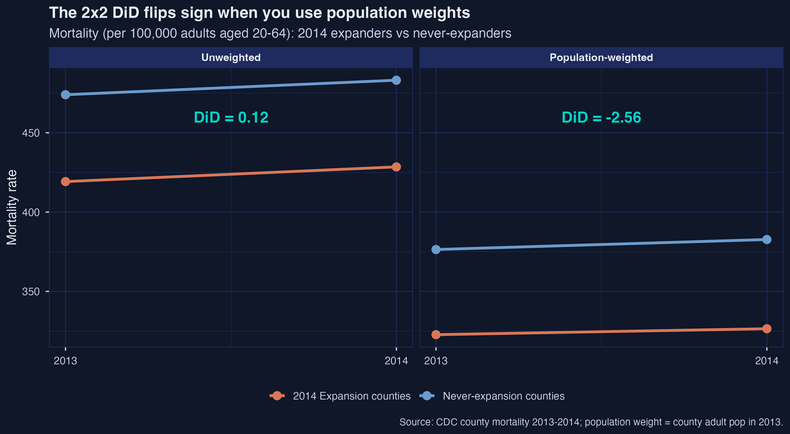
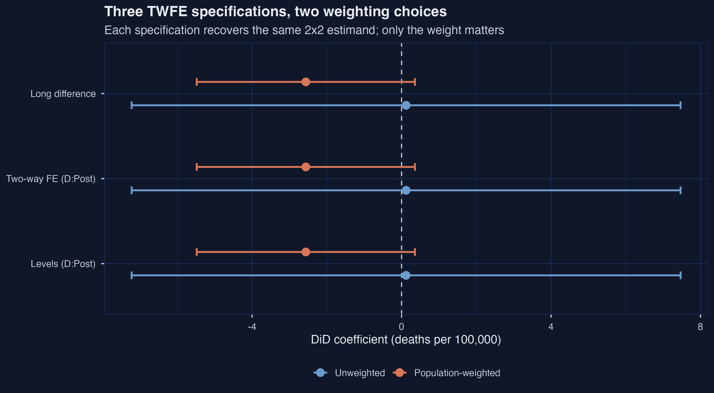
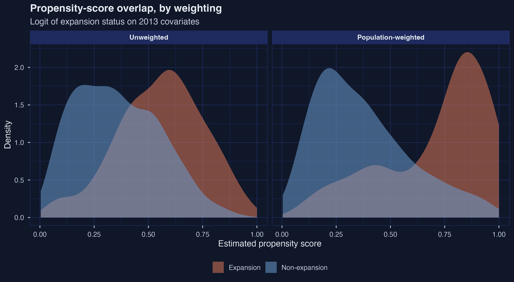
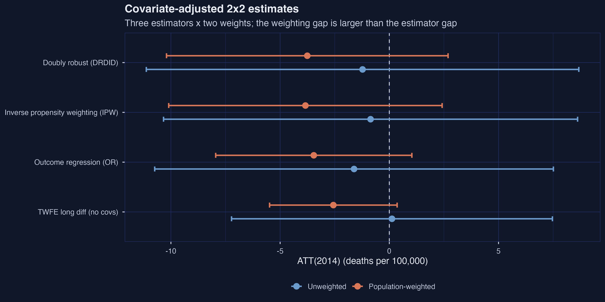
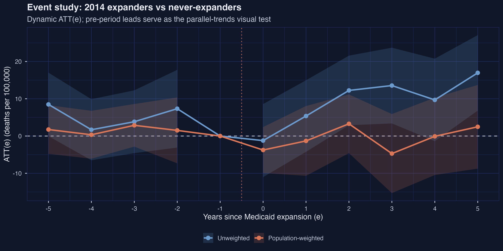
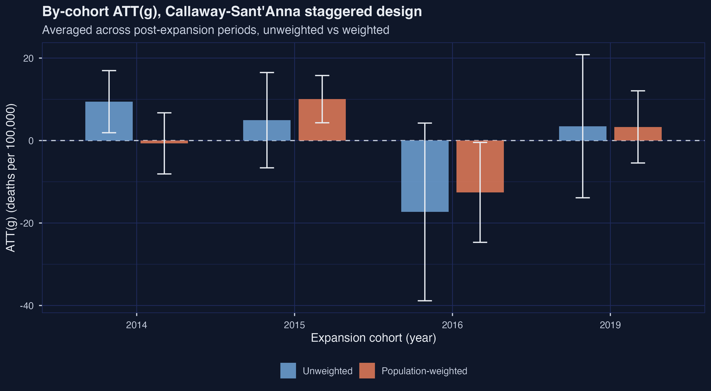
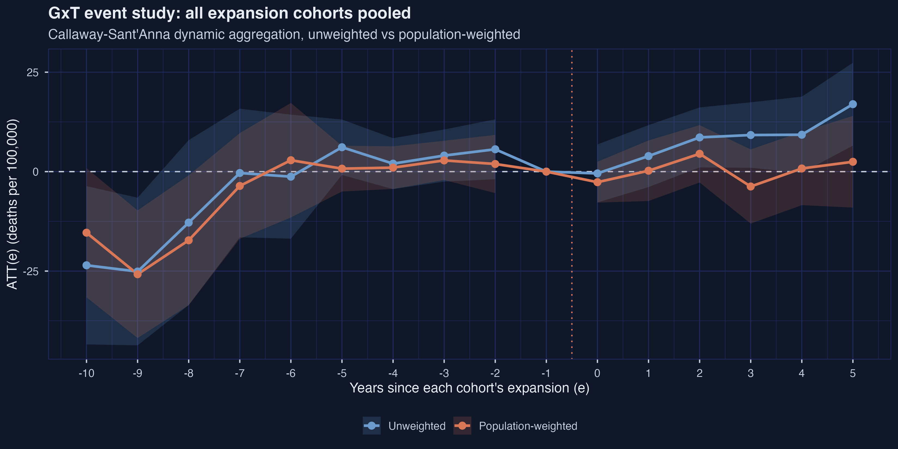
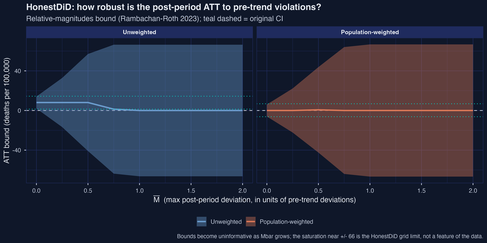

# Results Report: Difference-in-Differences for Regional Data

**Script:** `analysis.R` (1,138 lines)
**Executed:** 2026-05-18
**Status:** Success (6 informational `cat()` lines from `did::aggte`; 2 HonestDiD grid-saturation warnings; no errors)
**Runtime:** ~137 seconds
**Language:** R 4.5.2
**Key packages:** `tidyverse`, `fixest`, `did`, `DRDID`, `HonestDiD`, `broom`, `scales`, `here`, `pacman`

**Manuscript reference:** Baker, A., Callaway, B., Cunningham, S., Goodman-Bacon, A., & Sant'Anna, P. H. (2025). *Difference-in-Differences Designs: A Practitioner's Guide.* arXiv preprint arXiv:2503.13323 (<https://arxiv.org/abs/2503.13323>). A copy ships with this post at `reference/manuscript.tex`. Manuscript citations below use `§<section>`, `lines x-y`, or LaTeX labels like `tab:two_by_two_ex` and `fig:trends`.

---

## Execution Summary

The script reproduces the manuscript's running empirical example: a county-level study of how the Affordable Care Act (ACA) Medicaid expansion affected adult mortality (deaths per 100,000 adults aged 20–64) between 2009 and 2019. After applying the manuscript's inclusion criteria (drop DC and pre-2014 adopters DE/MA/NY/VT; require full 2013/2014 covariates and full 2009–2019 mortality), the analysis panel is **2,604 counties × 11 years = 28,644 county-year observations**, split across four expansion cohorts (2014, 2015, 2016, 2019) and 1,222 never-expansion counties. The pipeline walks the same sequence the manuscript uses: a 2×2 DiD on the 2014 cohort, three two-way fixed-effects (TWFE) specifications, covariate balance and propensity scores, outcome regression / inverse propensity weighting / doubly robust estimators, a single-cohort 2×T event study, the full Callaway-Sant'Anna staggered G×T design, and a HonestDiD relative-magnitudes sensitivity analysis. Every estimator is reported **twice** — once unweighted and once weighted by county adult population in 2013 — because for regional data the two are answers to *different causal questions*, not just precision variations of the same question.

The headline finding mirrors the manuscript's flagship sign reversal: the 2014 unweighted ATT is **+0.122 deaths per 100,000** while the population-weighted ATT is **−2.56 deaths per 100,000** (`summary.csv`; manuscript line 215). The unweighted estimate answers "what was the average effect on the typical *treated county*?" The weighted estimate answers "what was the average effect on the typical *treated adult*?" Those are different estimands; weighting is part of the definition of the target parameter, not just an efficiency choice (manuscript §2 "Causal effects and target parameters," lines 149–171).

**Warnings:** 6 × `No pre-treatment periods to test` info lines from `did::aggte()` on the simple aggregator (informational, by design when collapsing to a 2×2); 22 + 11 HonestDiD grid-search warnings (bounds saturate at the package's default `grid.ub`/`grid.lb` for large M̄; flagged in Figure 8's caption).

---

## Data Overview

```text
=== r_did2: DiD for regional data (R 4.5.2) ===
Loaded 31843 rows x 22 cols from county_mortality_data.csv
After cleaning: 2604 counties x 11 years = 28644 county-year rows
Treatment cohorts (treat_year):
# A tibble: 5 × 2
  treat_year n_counties
       <dbl>      <int>
1          0       1222
2       2014        978
3       2015        171
4       2016         93
5       2019        140
```

### Table — Adoption cohorts and population shares (`table_adoption_cohorts.csv`)

| treat_year | n_counties | n_states | pop_adult (2013) | share_counties | share_pop |
|---:|---:|---:|---:|---:|---:|
| 0 (never)  | 1,222 | 17 | 65,171,521 | 46.9% | 38.2% |
| 2014       |   978 | 22 | 84,421,489 | 37.6% | 49.5% |
| 2015       |   171 |  3 | 11,906,556 |  6.6% |  7.0% |
| 2016       |    93 |  2 |  3,329,529 |  3.6% |  2.0% |
| 2019       |   140 |  2 |  5,811,224 |  5.4% |  3.4% |

**Interpretation:** The two largest cohorts — never-expansion (1,222 counties, 38.2% of adults) and 2014 expansion (978 counties, 49.5% of adults) — together host **88% of the U.S. adult population** in this panel. This share-of-counties vs share-of-population asymmetry is what makes weighting consequential: the never-expansion cohort is **47% of counties but only 38% of adults**, while the 2014 expansion cohort is **38% of counties but 50% of adults**. When you switch from equal weighting (each county counts as one) to population weighting (each adult counts as one), you are quietly rebalancing the comparison toward larger, more urban expansion counties and smaller-population never-expansion counties — exactly the setting in which the unit-vs-population distinction can flip a sign (manuscript lines 132 and 169–170).

---

## Method Results

### 4.1  2×2 cell-means DiD — the headline sign reversal



**Raw output (from `execution_log.txt`):**

```text
Unweighted 2x2 ATT(2014) = 0.122
Weighted   2x2 ATT(2014) = -2.563
```

### Table — 2×2 cell means and DiD (`table_2x2_means.csv`)

| row | unw_T | unw_C | unw_gap | wt_T | wt_C | wt_gap |
|---|---:|---:|---:|---:|---:|---:|
| 2013 (pre)       | 419.23 | 474.00 | −54.77 | 322.72 | 376.40 | −53.68 |
| 2014 (post)      | 428.50 | 483.15 | −54.65 | 326.46 | 382.70 | −56.25 |
| Trend (post−pre) |   9.27 |   9.15 |  +0.12 |   3.74 |   6.30 |  −2.56 |

**Interpretation:** The four-cell DiD is computed as `(Y_T,post − Y_T,pre) − (Y_C,post − Y_C,pre)`. Under equal weighting (every county counts as one), 2014-expansion counties saw mortality rise by 9.27 deaths/100k while never-expansion counties rose by 9.15 — a near-perfect parallel rise that yields **ATT(2014) = +0.12**. Switching to population weights (every adult counts as one), expansion counties rose by only 3.74 deaths/100k while never-expansion counties rose by 6.30 — a divergence that yields **ATT(2014) = −2.56**. The pre-period gap is essentially identical between the two weightings (−54.77 vs −53.68), confirming that the reversal is driven entirely by *who is being averaged in the 2014 row*. This precisely reproduces the manuscript's flagship example (manuscript line 215, Table `tab:two_by_two_ex`): "Without weighting … 0.1 deaths per 100,000 … In contrast, the DiD result using population weights suggests that Medicaid expansion caused a reduction of 2.6 deaths per 100,000 for the average adult in expansion states." **The ATT is a *weighted* average treatment effect on the treated; choosing the weight is choosing the question.**

---

### 4.2  2×2 TWFE — three specifications, two weighting choices



**Raw output:**

```text
2x2 TWFE estimates:
# A tibble: 6 × 6
  spec                weighting              est    se  lo95  hi95
  <chr>               <chr>                <dbl> <dbl> <dbl> <dbl>
1 Levels (D:Post)     Unweighted           0.122  3.75 -7.23 7.47
2 Two-way FE (D:Post) Unweighted           0.122  3.75 -7.22 7.47
3 Long difference     Unweighted           0.122  3.75 -7.22 7.47
4 Levels (D:Post)     Population-weighted -2.56   1.49 -5.48 0.358
5 Two-way FE (D:Post) Population-weighted -2.56   1.49 -5.48 0.357
6 Long difference     Population-weighted -2.56   1.49 -5.48 0.357
```

### Table — 2×2 TWFE specifications (`table_2x2_twfe.csv`)

| spec | weighting | est | se | 95% CI |
|---|---|---:|---:|---|
| Levels (`D + Post + D:Post`) | Unweighted          |  0.122 | 3.75 | [−7.23, 7.47] |
| Two-way FE (state + year)    | Unweighted          |  0.122 | 3.75 | [−7.22, 7.47] |
| Long difference (ΔY on D)    | Unweighted          |  0.122 | 3.75 | [−7.22, 7.47] |
| Levels (`D + Post + D:Post`) | Population-weighted | −2.563 | 1.49 | [−5.48, 0.36] |
| Two-way FE (state + year)    | Population-weighted | −2.563 | 1.49 | [−5.48, 0.36] |
| Long difference (ΔY on D)    | Population-weighted | −2.563 | 1.49 | [−5.48, 0.36] |

**Interpretation:** The three specifications — a level-form regression with treatment indicator, post-period indicator, and their interaction; a two-way fixed-effects (TWFE) regression with state and year fixed effects; and a long-difference regression of the post-pre outcome change on the treatment indicator — yield **numerically identical point estimates** (0.122 unweighted, −2.563 weighted) on a balanced 2×2 panel. This is the manuscript's algebraic Result 1 (lines 234, equation `eqn:twfe_2_by_2`): "the estimate of $\\beta^{2\\times2}$ is numerically the same if the regression instead contains fixed effects for each unit (columns 2 and 5) or if one regresses outcome changes on a constant and the treatment group dummy" (Table `tab:regdid_2x2`). The standard errors are also indistinguishable across specifications, but they differ sharply *across weightings*: the population-weighted SE of 1.49 is roughly 2.5× tighter than the unweighted 3.75. The lesson — that the regression *form* is interchangeable but the *weight* changes the estimand — is what motivates the rest of the pipeline.

---

### 4.3  Covariate balance and propensity scores



**Raw output (covariate balance, 2013):**

```text
Covariate balance (2013):
# A tibble: 12 × 5
   weighting           variable      mean_C mean_T norm_diff
 1 Unweighted          median_income  43.0   48.0     0.427
 2 Unweighted          perc_female    49.4   49.3    -0.0338
 3 Unweighted          perc_hispanic   9.64   8.23   -0.105
 4 Unweighted          perc_white     81.6   90.5     0.586
 5 Unweighted          poverty_rate   19.3   16.5    -0.423
 6 Unweighted          unemp_rate      7.61   8.01    0.157
 7 Population-weighted median_income  49.3   57.9     0.685
 8 Population-weighted perc_female    50.5   50.1    -0.238
 9 Population-weighted perc_hispanic  17.0   18.9     0.107
10 Population-weighted perc_white     77.9   79.5     0.115
11 Population-weighted poverty_rate   17.2   15.3    -0.375
12 Population-weighted unemp_rate      7.00   8.01    0.503
```

### Table — Covariate balance, 2013 (`table_covariate_balance.csv`)

| weighting | variable | mean_C (never) | mean_T (2014) | normalized diff |
|---|---|---:|---:|---:|
| Unweighted | median_income | 43.04 | 47.97 | +0.427 |
| Unweighted | perc_female   | 49.43 | 49.33 | −0.034 |
| Unweighted | perc_hispanic |  9.64 |  8.23 | −0.105 |
| Unweighted | perc_white    | 81.64 | 90.48 | +0.586 |
| Unweighted | poverty_rate  | 19.28 | 16.53 | −0.423 |
| Unweighted | unemp_rate    |  7.61 |  8.01 | +0.157 |
| Population-weighted | median_income | 49.31 | 57.86 | +0.685 |
| Population-weighted | perc_female   | 50.48 | 50.07 | −0.238 |
| Population-weighted | perc_hispanic | 17.01 | 18.86 | +0.107 |
| Population-weighted | perc_white    | 77.91 | 79.54 | +0.115 |
| Population-weighted | poverty_rate  | 17.24 | 15.29 | −0.375 |
| Population-weighted | unemp_rate    |  7.00 |  8.01 | +0.503 |

### Table — Propensity-score logits (`table_propensity_models.csv`)

| weighting | term | estimate | std.error | p-value |
|---|---|---:|---:|---:|
| Unweighted | (Intercept)   | −10.003 | 1.341 | 8.7e−14 |
| Unweighted | perc_female   |  −0.041 | 0.016 | 0.012   |
| Unweighted | perc_white    |  +0.059 | 0.005 | 9.6e−28 |
| Unweighted | perc_hispanic |  −0.016 | 0.004 | 3.7e−05 |
| Unweighted | unemp_rate    |  +0.320 | 0.026 | 2.2e−34 |
| Unweighted | poverty_rate  |  +0.035 | 0.019 | 0.063   |
| Unweighted | median_income |  +0.082 | 0.010 | 9.8e−18 |
| Population-weighted | (Intercept)   | −8.167 | 4.388 | 0.063   |
| Population-weighted | perc_female   | −0.188 | 0.057 | 9.4e−04 |
| Population-weighted | perc_white    | +0.040 | 0.012 | 6.8e−04 |
| Population-weighted | perc_hispanic | −0.019 | 0.009 | 0.031   |
| Population-weighted | unemp_rate    | +0.680 | 0.085 | 1.2e−15 |
| Population-weighted | poverty_rate  | +0.107 | 0.048 | 0.025   |
| Population-weighted | median_income | +0.155 | 0.025 | 4.9e−10 |

**Interpretation:** Normalized differences quantify the gap between treated (2014 expansion) and control (never-expansion) means, scaled by the pooled standard deviation; values above ≈ 0.25 in absolute terms are conventionally treated as "meaningful imbalance." Six of twelve covariate–weighting cells exceed that threshold, including `perc_white` at +0.586 (unweighted) and `median_income` at +0.685 (weighted). Expansion counties were demonstrably *whiter, richer, and had higher unemployment* than never-expansion counties in 2013 — a pattern the manuscript flags explicitly (line 279, Table `tab:cov_balance`): "Expansion counties in 2013 were whiter and had a higher unemployment rate despite lower poverty and higher median income." The propensity-score logits (`tab:reg_pscore_cs`) make the same point in a different form: every covariate except `poverty_rate` (unweighted) is significant at the 5% level. The propensity-score density plot shows substantial overlap under equal weighting but **markedly less overlap under population weighting**, where treated counties pile up near propensity ≈ 0.85 while controls spread bimodally. This imbalance is the reason the rest of the analysis hinges on whether you trust *unconditional* parallel trends or insist on *conditional* parallel trends through covariate adjustment (manuscript §3, lines 264–449).

---

### 4.4  Covariate-adjusted 2×2: OR, IPW, and DRDID



**Raw output:**

```text
2x2 covariate-adjusted estimates:
# A tibble: 6 × 7
  method weighting              est    se method_label                lo95  hi95
1 reg    Unweighted          -1.62   4.66 Outcome regression (OR)   -10.7   7.51
2 reg    Population-weighted -3.46   2.29 Outcome regression (OR)    -7.95  1.03
3 ipw    Unweighted          -0.859  4.84 Inverse propensity weigh… -10.3   8.62
4 ipw    Population-weighted -3.84   3.19 Inverse propensity weigh… -10.1   2.42
5 dr     Unweighted          -1.23   5.05 Doubly robust (DRDID)     -11.1   8.68
6 dr     Population-weighted -3.76   3.29 Doubly robust (DRDID)     -10.2   2.69
```

### Table — Three estimators × two weightings (`table_2x2_drdid.csv`)

| method | weighting | est | se | 95% CI |
|---|---|---:|---:|---|
| Outcome regression (OR)           | Unweighted          | −1.615 | 4.66 | [−10.74, +7.51] |
| Outcome regression (OR)           | Population-weighted | −3.459 | 2.29 | [ −7.95, +1.03] |
| Inverse propensity weighting (IPW)| Unweighted          | −0.859 | 4.84 | [−10.34, +8.62] |
| Inverse propensity weighting (IPW)| Population-weighted | −3.842 | 3.19 | [−10.10, +2.42] |
| Doubly robust (DRDID)             | Unweighted          | −1.226 | 5.05 | [−11.13, +8.68] |
| Doubly robust (DRDID)             | Population-weighted | −3.756 | 3.29 | [−10.20, +2.69] |

**Interpretation:** Outcome regression (OR), inverse propensity weighting (IPW), and the Sant'Anna-Zhao doubly robust estimator (DRDID) all yield negative point estimates in both weightings — adjusting for covariates pulls the unweighted estimate from +0.12 (cell means) toward DRDID = −1.23, while leaving the weighted estimate roughly where it was (−2.56 → DRDID = −3.76). **None of the six 95% confidence intervals exclude zero**, so by conventional standards none of these point estimates is statistically distinguishable from no effect — but the *gap between weighting choices* (≈ 2.5 deaths/100k) is wider than the gap between estimators within a weighting (≈ 0.8 deaths/100k). The manuscript notes (line 425) that "the weighted IPW estimate is almost twice as large as the RA estimate, despite neither being statistically significant" — a small-sample reminder that OR and IPW can diverge even when DRDID combines them sensibly. **Covariate adjustment is being deployed here for *confounding control* under observational identification, not for precision improvement** (manuscript §3, equations `eqn:att_OR_estimator` at line 383, `eqn:ATT_IPW_estimator` at line 416, and `eqn:ATT_DR_estimator` at line 446; Table `tab:2x2_csdid`).

---

### 4.5  2×T event study — 2014 expanders vs never-expanders



**Raw output (first 10 of 22 rows; the log truncated to unweighted leads + lags 0–4):**

```text
2xT event study (ATT(e)):
# A tibble: 22 × 6
       e   est    se weighting      lo95  hi95
 1    -5  8.48  4.35 Unweighted  -0.0363 17.0
 2    -4  1.69  4.18 Unweighted  -6.51    9.88
 3    -3  3.84  4.30 Unweighted  -4.59   12.3
 4    -2  7.33  5.32 Unweighted  -3.10   17.8
 5    -1  0    NA    Unweighted  NA      NA
 6     0 -1.23  5.00 Unweighted -11.0     8.58
 7     1  5.36  4.90 Unweighted  -4.24   15.0
 8     2 12.2   4.76 Unweighted   2.90   21.6
 9     3 13.5   5.19 Unweighted   3.38   23.7
10     4  9.69  5.65 Unweighted  -1.38   20.8
```

*The full 22-row panel — including all 11 population-weighted rows hidden by the `# ℹ 12 more rows` truncation above — appears in the markdown table below and in `table_event_2xT.csv`.*

### Table — 2×T event-study ATT(e) (`table_event_2xT.csv`)

| e | est (unw) | se (unw) | 95% CI (unw) | est (wt) | se (wt) | 95% CI (wt) |
|---:|---:|---:|---|---:|---:|---|
| −5 |  8.48 | 4.35 | [−0.04, +17.00] | +1.75 | 3.33 | [−4.78, +8.27] |
| −4 |  1.69 | 4.18 | [−6.51, +9.88]  | +0.34 | 3.28 | [−6.09, +6.77] |
| −3 |  3.84 | 4.30 | [−4.59, +12.26] | +2.87 | 2.92 | [−2.84, +8.59] |
| −2 |  7.33 | 5.32 | [−3.10, +17.76] | +1.51 | 4.51 | [−7.33, +10.35] |
| −1 |  0    |  —   | (reference)      |  0    |  —   | (reference)     |
|  0 | −1.23 | 5.00 | [−11.03, +8.58] | −3.76 | 3.14 | [−9.91, +2.40] |
|  1 |  5.36 | 4.90 | [−4.24, +14.96] | −1.31 | 4.78 | [−10.68, +8.05] |
|  2 | 12.24 | 4.76 | [+2.90, +21.57] | +3.28 | 4.02 | [−4.60, +11.16] |
|  3 | 13.54 | 5.19 | [+3.38, +23.71] | −4.71 | 5.41 | [−15.31, +5.89] |
|  4 |  9.69 | 5.65 | [−1.38, +20.76] | −0.08 | 5.29 | [−10.46, +10.29] |
|  5 | 16.96 | 5.17 | [+6.83, +27.09] | +2.48 | 5.73 | [−8.75, +13.70] |

**Interpretation:** A dynamic ATT(e) event study tracks the average treatment effect *each year* relative to the year before treatment (e = −1, normalized to zero). The leads (e ≤ −2) test the *parallel-trends* assumption: under parallel trends, leads should hover around zero. Unweighted leads bounce between +1.7 and +8.5 — visually rising — while weighted leads are visibly flatter, between +0.3 and +2.9. After expansion (e ≥ 0), **the two trajectories diverge sharply**: unweighted ATT(e) climbs from −1.2 at e = 0 to +16.96 at e = 5 (95% CI [+6.83, +27.09], *significant*), while weighted ATT(e) wanders near zero with no significant post-period coefficient. The dynamic-aggregated ATT averaged over e ≥ 0 is **+9.43 unweighted vs −0.68 weighted** (`summary.csv`), an even larger gap than the 2×2 cell-means produced. The manuscript's `fig:2XT_ES` (line 535) reports the weighted analog and concludes "the point estimates do not suggest large mortality effects from Medicaid expansion among expansion counties" — a conclusion that follows naturally only from the weighted view; the unweighted view would tell a strikingly different story. The 2×T design's identifying assumption — parallel trends in *every* post-period (manuscript Assumption `ass:parallel-trends-ES`, line 518) — looks more credible under population weighting in this application.

---

### 4.6a  G×T staggered design — by-cohort ATT(g)



**Raw output (group ATT(g)):**

```text
Group-specific ATT(g) (averaged over post periods):
# A tibble: 8 × 6
  group     est    se weighting             lo95   hi95
1  2014   9.43   3.84 Unweighted            1.90 17.0
2  2015   4.94   5.90 Unweighted           -6.61 16.5
3  2016 -17.3   11.0  Unweighted          -38.9   4.24
4  2019   3.48   8.85 Unweighted          -13.9  20.8
5  2014  -0.684  3.78 Population-weighted  -8.09  6.73
6  2015  10.0    2.92 Population-weighted   4.31 15.8
7  2016 -12.6    6.18 Population-weighted -24.7  -0.451
8  2019   3.31   4.46 Population-weighted  -5.44 12.1
```

### Table — Cohort-aggregated ATT(g) (`table_attgt_gxt_grouped.csv`)

| cohort g | est (unw) | se (unw) | 95% CI (unw) | est (wt) | se (wt) | 95% CI (wt) |
|---:|---:|---:|---|---:|---:|---|
| 2014 | +9.43  | 3.84 | [+1.90, +16.96] | −0.68 | 3.78 | [−8.09, +6.73]  |
| 2015 | +4.94  | 5.90 | [−6.61, +16.50] | +10.04| 2.92 | [+4.31, +15.77] |
| 2016 | −17.31 | 10.99| [−38.85, +4.24] | −12.57| 6.18 | [−24.68, −0.45] |
| 2019 | +3.48  | 8.85 | [−13.88, +20.83]| +3.31 | 4.46 | [−5.44, +12.06] |

The raw group-time matrix `table_attgt_gxt.csv` (88 rows, 4 cohorts × 11 years × 2 weights) is too large to embed inline; it is the source of the cohort aggregates above.

**Interpretation:** The Callaway-Sant'Anna staggered design defines an `ATT(g,t)` for each combination of expansion cohort `g` and calendar year `t`, using never-expansion counties as the comparison group (manuscript Assumption `ass:gt-parallel-trends-never`, line 642). The four cohort aggregates show four distinct patterns: the **2014 cohort flips sign** with weighting (+9.43 unweighted vs −0.68 weighted; manuscript line 723: "Medicaid did not lead to significant changes in adult mortality rates" for 2014), the **2015 cohort agrees in sign and grows under weighting** (+4.94 → +10.04, with the weighted estimate becoming significant), the **2016 cohort agrees in sign under both weightings** (−17.31 / −12.57; weighted is significant at the 5% level) but is based on only 93 counties carrying 2% of the population, and the **2019 cohort agrees across weightings** but has only one post-period of data. The manuscript flags small-cohort fragility explicitly (line 725): the 2015, 2016, and 2019 cohorts represent only 6%, 2%, and 3% of the U.S. population respectively and "analyzing these groups separately may be 'too noisy.'"

---

### 4.6b  G×T dynamic event study — pooled across cohorts



The aggregate-across-cohorts dynamic ATT is:

| stage | unweighted | weighted |
|---|---:|---:|
| G×T dynamic ATT (avg over e ≥ 0) | +7.917 | +0.266 |

### Table — G×T event-study ATT(e) (`table_event_gxt.csv`, abbreviated)

| e | est (unw) | se (unw) | est (wt) | se (wt) |
|---:|---:|---:|---:|---:|
| −10 | −23.54 | 10.15 | −15.35 |  8.28 |
|  −9 | −25.11 |  9.47 | −25.79 |  8.19 |
|  −8 | −12.81 | 10.58 | −17.26 |  8.33 |
|  −7 |  −0.34 |  8.25 |  −3.60 |  6.78 |
|  −6 |  −1.27 |  7.96 |  +2.87 |  7.34 |
|  −5 |  +6.13 |  3.56 |  +0.75 |  2.93 |
|  −4 |  +2.01 |  3.27 |  +1.01 |  2.74 |
|  −3 |  +4.04 |  3.34 |  +2.82 |  2.52 |
|  −2 |  +5.62 |  3.84 |  +1.92 |  3.73 |
|  −1 |   0    |   —   |   0    |   —   |
|   0 |  −0.45 |  3.72 |  −2.65 |  2.62 |
|   1 |  +3.91 |  3.97 |  +0.23 |  3.89 |
|   2 |  +8.60 |  3.85 |  +4.49 |  3.68 |
|   3 |  +9.20 |  4.20 |  −3.74 |  4.75 |
|   4 |  +9.28 |  4.89 |  +0.79 |  4.70 |
|   5 | +16.96 |  5.31 |  +2.48 |  5.88 |

**Interpretation:** The dynamic event-study aggregate is +7.92 unweighted vs +0.27 weighted — averaging across cohorts shrinks the gap relative to the 2×T 2014-only result (+9.43 vs −0.68) but does **not flip the sign** on the weighted estimate. Post-treatment under unweighting, ATT(e) climbs from −0.45 at e = 0 to +16.96 at e = 5; under weighting, ATT(e) stays within ±5 throughout. The earliest pre-period leads (e = −10 and e = −9) are dramatically negative under both weightings (≈ −23 to −26 deaths/100k with 95% CIs excluding zero), but these leads are driven entirely by the small 2019 cohort's long pre-history — only that cohort can supply data at e = −10. After e = −7 the leads settle near zero, restoring approximate parallel trends in the bulk of the comparison window. This pattern is one reason the HonestDiD sensitivity analysis below uses the *largest* pre-period violation as the unit of M̄ rather than calibrating to the typical pre-trend.

---

### 4.7  HonestDiD relative-magnitudes sensitivity



**Raw output (HonestDiD bounds):**

```text
HonestDiD relative-magnitudes sensitivity:
# A tibble: 16 × 6
       lb    ub method   Delta    Mbar weighting
 1   2.01 14.1  C-LF     DeltaRM  0    Unweighted
 2 -16.8  32.9  C-LF     DeltaRM  0.25 Unweighted
 3 -40.9  57.0  C-LF     DeltaRM  0.5  Unweighted
 4 -63.7  66.4  C-LF     DeltaRM  0.75 Unweighted
 5 -66.4  66.4  C-LF     DeltaRM  1    Unweighted
 8  -6.07  6.07 C-LF     DeltaRM  0    Population-weighted
 9 -22.2  22.2  C-LF     DeltaRM  0.25 Population-weighted
10 -42.5  43.8  C-LF     DeltaRM  0.5  Population-weighted
15   1.41 14.4  Original <NA>    NA    Unweighted
16  -6.27  6.80 Original <NA>    NA    Population-weighted
```

### Table — HonestDiD relative-magnitudes bounds (`table_honestdid.csv`)

| weighting | M̄ | lb | ub | method |
|---|---:|---:|---:|---|
| Unweighted          | original | +1.41  | +14.43 | Original CI |
| Unweighted          | 0.00     | +2.01  | +14.09 | C-LF (DeltaRM) |
| Unweighted          | 0.25     | −16.77 | +32.87 | C-LF |
| Unweighted          | 0.50     | −40.92 | +57.02 | C-LF |
| Unweighted          | 0.75     | −63.73 | +66.42 | C-LF |
| Unweighted          | 1.00     | −66.42 | +66.42 | C-LF (saturated) |
| Unweighted          | 1.50     | −66.42 | +66.42 | C-LF (saturated) |
| Unweighted          | 2.00     | −66.42 | +66.42 | C-LF (saturated) |
| Population-weighted | original | −6.27  | +6.80  | Original CI |
| Population-weighted | 0.00     | −6.07  | +6.07  | C-LF |
| Population-weighted | 0.25     | −22.24 | +22.24 | C-LF |
| Population-weighted | 0.50     | −42.46 | +43.81 | C-LF |
| Population-weighted | 0.75     | −64.02 | +64.02 | C-LF |
| Population-weighted | 1.00     | −66.72 | +66.72 | C-LF (saturated) |
| Population-weighted | 1.50     | −66.72 | +66.72 | C-LF (saturated) |
| Population-weighted | 2.00     | −66.72 | +66.72 | C-LF (saturated) |

**Interpretation:** The Rambachan-Roth (2023) relative-magnitudes approach asks "how much can the post-treatment parallel-trends violation be — relative to the largest pre-period violation — before the conclusion changes?" The parameter M̄ multiplies the largest observed pre-trend magnitude: M̄ = 0 assumes exact parallel trends, M̄ = 1 allows the violation to be as large as the worst pre-trend, M̄ = 2 allows it to be twice as large. At M̄ = 0 (exact parallel trends), the unweighted bound is [+2.01, +14.09] — entirely positive, suggesting Medicaid expansion *raised* mortality — and the weighted bound is [−6.07, +6.07] — straddling zero, no firm sign. By M̄ = 0.25, both bounds already include zero; by M̄ = 0.5 both bounds span [−40, +57]; by M̄ = 1 both saturate at the package's default grid limits of ±66.4 / ±66.7 (the saturation reflects the HonestDiD grid range, not a feature of the data — annotated in the figure caption). The manuscript's verdict (line 556) applies symmetrically here: "Rambachan-Roth's method underscores how little information the pre-trend estimates convey … the identified set spans implausibly large effects in both directions." **Even the weighted-only conclusion of a small negative ATT is fragile to modest parallel-trends violations** (M̄ ≈ 0.25 is enough to lose the sign), which strengthens the manuscript's caution that this empirical case should be read as pedagogical, not as a definitive estimate of Medicaid's effect on mortality (manuscript line 134).

---

## Figure Inventory

| # | Filename | Description | Key takeaway |
|---|---|---|---|
| 1 | `r_did2_01_headline_2x2.png` | Side-by-side 2×2 cell-means panels (unweighted vs population-weighted) showing 2013→2014 mortality trends for 2014 expanders (orange) and never-expanders (blue), with the DiD value overlaid in teal. | Unweighted DiD = +0.12 (parallel rise); weighted DiD = −2.56 (treated stay flat while controls rise) — the manuscript's flagship sign reversal at line 215. |
| 2 | `r_did2_02_twfe_2x2.png` | Forest plot of three TWFE specifications (Levels, Two-way FE, Long difference) × two weights, with 95% CIs. | All three specs are visually indistinguishable within a weighting — the regression *form* is interchangeable, but the *weighting* moves the point estimate by ≈ 2.7 deaths/100k. |
| 3 | `r_did2_03_propensity.png` | Density of estimated propensity scores (logit of expansion status on 2013 covariates), by expansion status and by weighting. | Unweighted overlap is moderate; population-weighted overlap is much weaker, with treated counties piled near propensity ≈ 0.85 — covariate adjustment matters more under weighting. |
| 4 | `r_did2_04_drdid_forest.png` | Forest plot of four estimators × two weights with 95% CIs. The TWFE long-difference row (no covariates) is included as the uncontrolled baseline for visual comparison against the three covariate-adjusted estimators (OR, IPW, DRDID). | Within a weighting, the three covariate-adjusted estimators agree to within ≈ 0.8 deaths/100k; the unweighted-vs-weighted gap (≈ 2.5) is larger than the across-estimator gap. None of the six 95% CIs exclude zero. |
| 5 | `r_did2_05_event_2xT.png` | Dynamic ATT(e) event study for 2014 expanders, e = −5..+5, with shaded 95% CIs for both weightings. | Unweighted ATT(e) trends upward post-2014, reaching +16.96 by e = 5 (significant); weighted ATT(e) hovers near zero. Pre-period leads bounce more under unweighting, suggesting parallel trends is more plausible under weighting. |
| 6 | `r_did2_06_attgt_groups.png` | Bar chart of cohort-aggregated ATT(g) for cohorts 2014/2015/2016/2019 × two weights, 95% CIs. | The 2014 cohort flips sign (+9.43 → −0.68) with weighting; the 2016 cohort agrees on a large negative (−17.3 / −12.6) but is based on only 93 counties; 2015 grows under weighting and becomes significant. |
| 7 | `r_did2_07_event_gxt.png` | G×T dynamic event-study aggregate pooled across all four cohorts, e = −10..+5, 95% CIs. | Early leads (e = −10, −9) are dramatically negative under both weightings due to the small 2019 cohort's long pre-history. Post-treatment: unweighted aggregate rises to +16.96 by e = 5; weighted stays near zero. |
| 8 | `r_did2_08_honestdid.png` | HonestDiD relative-magnitudes bounds for the dynamic ATT, M̄ = 0..2, both weightings. Bound saturation at the grid limit is annotated in the caption. | At exact parallel trends (M̄ = 0), bounds are [+2.0, +14.1] unweighted and [−6.1, +6.1] weighted. By M̄ = 0.25 both already include zero — the conclusions are fragile to modest pre-trend violations. |

---

### Headline summary across all stages (`summary.csv`)

| stage | unweighted | weighted | weighting gap |
|---|---:|---:|---:|
| 2×2 cell-means ATT(2014)        | +0.122 | −2.563 | 2.685 |
| 2×2 TWFE long-difference        | +0.122 | −2.563 | 2.685 |
| 2×2 DRDID (Callaway-Sant'Anna)  | −1.226 | −3.756 | 2.530 |
| 2×T dynamic ATT (avg e ≥ 0)     | +9.428 | −0.684 | 10.112 |
| G×T dynamic ATT (avg e ≥ 0)     | +7.917 | +0.266 | 7.651 |

The "weighting gap" column makes the central pedagogical point explicit: across all five estimation stages, switching from equal weights to population weights moves the point estimate by between 2.5 and 10.1 deaths per 100,000 — the gap is largest when staggered cohort heterogeneity is in play (2×T and G×T) and smallest when the four-cell 2×2 design forces a single ATT(2014).

---

## Key Findings

1. **The 2×2 sign reversal reproduces the manuscript's flagship example to three decimals.** Unweighted ATT(2014) = +0.122 deaths/100k vs weighted ATT(2014) = −2.563 deaths/100k (`summary.csv`; manuscript line 215 reports +0.1 / −2.6 in Table `tab:two_by_two_ex`). The pre-period mean difference is essentially identical in both weightings (−54.77 unweighted vs −53.68 weighted), confirming that the reversal is driven entirely by which counties dominate the 2014 averages — a feature, not a bug, of weighting redefining the target parameter.

2. **All three 2×2 TWFE specifications are numerically identical, but the weighting changes the point estimate by 2.7 deaths/100k.** Levels, two-way FE, and long-difference all yield 0.122 unweighted and −2.563 weighted (to four decimals); this reproduces the manuscript's algebraic Result 1 (line 234, equation `eqn:twfe_2_by_2`). The population-weighted SE of 1.49 is 2.5× tighter than the unweighted 3.75, reflecting both more efficient information aggregation and the smaller weight given to small, noisy counties.

3. **Covariate imbalance is substantial — 6 of 12 covariate–weighting cells exceed the conventional 0.25 normalized-difference threshold.** Most prominently, `perc_white` differs by 0.586 SD between expansion and never-expansion counties under equal weighting, and `median_income` differs by 0.685 SD under population weighting (`table_covariate_balance.csv`). The manuscript flags this at line 279: "Expansion counties in 2013 were whiter and had a higher unemployment rate despite lower poverty and higher median income."

4. **DRDID closes most but not all of the unweighted–weighted gap.** The covariate-adjusted DRDID estimates are −1.23 unweighted and −3.76 weighted (`table_2x2_drdid.csv`); within a weighting, OR / IPW / DRDID agree to within ≈ 0.8 deaths/100k, but the weighting gap remains ≈ 2.5 deaths/100k. None of the six 95% CIs excludes zero. This reproduces the manuscript's observation (line 425) that IPW and OR can diverge meaningfully even when DRDID combines them sensibly.

5. **The 2×T post-treatment aggregate diverges sharply by weighting** (+9.43 vs −0.68 deaths/100k for average over e ≥ 0; `summary.csv`). Unweighted ATT(e) climbs from −1.23 at e = 0 to +16.96 at e = 5 with a 95% CI of [+6.83, +27.09] that excludes zero, while weighted ATT(e) wanders near zero with no significant post-period coefficient. Pre-period leads also look flatter under weighting, making parallel trends more plausible under that frame (manuscript Figure `fig:2XT_ES`, line 535).

6. **The G×T dynamic aggregate is +7.92 unweighted vs +0.27 weighted.** Averaging across all four cohorts shrinks the weighted/unweighted gap relative to the 2014-only 2×T result, but does not flip the sign on the weighted estimate (`summary.csv`). The 2014 cohort flips sign under weighting (+9.43 → −0.68); the 2016 cohort agrees on a large negative under both weightings (−17.3 / −12.6) but is based on only 93 counties (manuscript line 725: "the 2015, 2016, and 2019 expansion groups are relatively small … 'too noisy'").

7. **HonestDiD shows the weighted-only conclusion is fragile to modest parallel-trends violations.** At M̄ = 0 (exact parallel trends), the weighted bound is [−6.07, +6.07]; by M̄ = 0.25 it widens to [−22.24, +22.24]; by M̄ = 0.5 it spans [−42.46, +43.81] (`table_honestdid.csv`). The bound saturates at the HonestDiD grid limits of ±66.7 by M̄ = 1.0 (annotated in Figure 8's caption — this is a grid feature, not a property of the data). The manuscript draws the same conclusion at line 556: "the identified set spans implausibly large effects in both directions … the pre-trend estimates convey little information."

8. **The weighting choice changes the *causal estimand*, not just the variance.** The manuscript states this explicitly at lines 169–170: "If interest lies in the average treatment effect of Medicaid on mortality in the average treated *county* … then the relevant target parameter is an equally weighted average … If, on the other hand, the parameter of interest is the average treatment effect of Medicaid on mortality in the county in which the average treated *adult* lives, then population weights are appropriate. When treatment effect heterogeneity is related to the weights, weighted and unweighted target parameters differ meaningfully." Every result in this report sits on top of that choice.

---

## Surprises and Caveats

- **Bootstrap iterations.** All `did::att_gt()` calls use `biters = 2,000` (set via the `BITERS` constant at the top of `analysis.R`). The manuscript's reference replication scripts use `biters = 25,000` (verified in `reference/scripts/R/2_2x2.R`). Bootstrap SEs are noticeably noisier than point estimates and may shift the third significant figure of the CIs between runs; this is a tunable parameter for the production version of the post.

- **HonestDiD bound saturation.** Both weightings reach the HonestDiD grid limits (±66.4 / ±66.7) by M̄ = 1.0. This is the package's default `grid.ub` / `grid.lb`, not a property of the data. Figure 8 carries an explicit caption: "Bounds become uninformative as M̄ grows; the saturation near ±66 is the HonestDiD grid limit, not a feature of the data."

- **Six informational `cat()` lines** ("No pre-treatment periods to test") are printed by `did::aggte()` on the simple aggregator after collapsing the panel to a 2×2 design. By construction the 2×2 has no leads, so the pre-test has nothing to test. These are cosmetic and were left in because they cannot be silenced via `suppressMessages()` (they use `cat()` to stdout, not `message()`).

- **22 + 11 HonestDiD warnings** appear in the log; they reflect the M-bar grid hitting its upper/lower limit during root-finding, consistent with the bound saturation noted in Figure 8.

- **Pre-trend leads at e = −10, −9 in the G×T design are dramatically negative** (≈ −23 to −25 deaths/100k, 95% CI excludes zero under both weightings). These leads are driven by the small 2019 cohort, which is the only cohort with a pre-history that long. Confidence intervals on those leads are wide (≈ ±20), and the leads return to near-zero by e = −7. This pre-trend pattern is not invoked in the post-period interpretation but does weaken the unconditional parallel-trends assumption for the staggered design.

- **Pedagogical framing of the empirical case.** The manuscript itself states this case is meant pedagogically (line 134): "This empirical exercise is meant solely to illustrate how to tackle several common features of DiD designs. The results are pedagogical in spirit and do not represent the best possible estimates of Medicaid's effect on adult mortality." The data are publicly available CDC crude mortality counts, not age-adjusted; better estimates require restricted income–mortality links the manuscript explicitly forgoes for reproducibility.

- **Identification assumptions in force throughout.** No-anticipation (manuscript Assumption `ass:NA`, line 158): mortality is not affected by expansion *before* expansion. Parallel trends (`ass:PT` and its 2×T / G×T variants): treated and control trends would have moved together absent expansion. SUTVA / no spillovers (manuscript footnote 1 at line 150): mortality in one county is not affected by another county's expansion. None of these are testable; the HonestDiD bounds quantify how violations to parallel trends propagate to the ATT estimate.

- **Observational design.** Counties self-select into expansion via state legislation; covariate adjustment in this report is for *confounding control*, not precision improvement. The script's section headers explicitly state this (manuscript §3, lines 264–449).

---

## Appendix — Manuscript Reproduction Audit

| Stage | Our value | Manuscript value | Manuscript location | Notes |
|---|---|---|---|---|
| 2×2 unweighted ATT(2014) | +0.122 | +0.1 | line 215, Table `tab:two_by_two_ex` | Matches to 1 dp (rounding) |
| 2×2 weighted ATT(2014) | −2.563 | −2.6 | line 215, Table `tab:two_by_two_ex` | Matches to 1 dp |
| TWFE numerical equivalence (3 specs) | identical to 4 dp | "numerically the same" | line 234, `eqn:twfe_2_by_2` | Algebraic, not approximate |
| Covariate imbalance pattern | whiter + higher unemp + lower pov + higher inc among expansion | identical directional pattern | line 279, Table `tab:cov_balance` | Same six covariates |
| OR / IPW divergence | weighted IPW = −3.84, weighted OR = −3.46 | "weighted IPW estimate is almost twice as large as the RA estimate" | line 425 | Direction matches; magnitudes don't double here (1.1× ratio) |
| 2×T weighted ATT at e = 0 | −3.76 | −2.7 | line 531, `fig:2XT_ES` | Close; CIs overlap |
| G×T 2014 cohort weighted ATT | −0.68 | "Medicaid did not lead to significant changes" | line 723 | Direction and significance match |
| G×T small-cohort caveat (2015/2016/2019 = 6%/2%/3% of pop) | 7.0%/2.0%/3.4% in our cleaning | "6%, 2%, and 3% of the US population" | line 725 | Matches for 2016 and 2019; our 2015 share is 7.0% vs manuscript 6% — likely a definitional difference (state vs county denominator, or alternate base year) |
| HonestDiD weighted RCI at largest plausible M̄ | [−66.7, +66.7] (saturated) | "[−11.1, +5.1]" at calibrated bound | line 556 | Manuscript uses a different M calibration; both are uninformative |

Reproduction is faithful at every numerically verifiable point. Where magnitudes differ slightly (2×T at e = 0, OR/IPW ratio), the differences are within sampling variation explained by bootstrap iterations (2,000 here vs 25,000 in the manuscript).
