---
authors:
  - admin
categories:
  - R
  - Difference-in-Differences (DiD)
draft: false
featured: false
date: "2026-05-18T00:00:00Z"
external_link: ""
image:
  caption: ""
  focal_point: Smart
  placement: 3
links:
  - icon: code
    icon_pack: fas
    name: "R script"
    url: analysis.R
  - icon: file-code
    icon_pack: fas
    name: "Quarto (.qmd)"
    url: https://raw.githubusercontent.com/cmg777/starter-academic-v501/master/content/post/r_did_ring/tutorial.qmd
  - icon: markdown
    icon_pack: fab
    name: "MD version"
    url: https://raw.githubusercontent.com/cmg777/starter-academic-v501/master/content/post/r_did_ring/index.md
  - icon: podcast
    icon_pack: fas
    name: AI Podcast
    url: "/post/r_did_ring/#podcast-player"
slides:
summary: "When the 'treatment' is a point in space, distance becomes the running variable. We walk through the parametric ring DiD and a data-driven nonparametric alternative, first on a simulated world with a known answer, then on Linden and Rockoff's home-prices study, and reconcile a parametric −5.78 % with a nonparametric −20.6 %."
tags:
  - r
  - causal
  - causal inference
  - difference-in-differences
  - spatial
  - geocoded
title: "Difference-in-Differences with Geocoded Microdata: When Distance Defines Treatment"
url_code: ""
url_pdf: ""
url_slides: ""
url_video: ""
toc: true
diagram: true
---

## 1. Overview

What happens to home prices when a registered sex offender moves into a neighborhood --- and, just as important, how do we *know* we measured it right? In a famous 2008 paper, Linden and Rockoff used a clever idea: compare homes very close to the offender's address with homes a little farther away, before and after arrival. They concluded that prices inside one tenth of a mile dropped by **about 7.5 %**. But that conclusion rested on a single research design choice --- the radius of the "treated" ring --- and changing that radius changed the answer.

This tutorial reproduces and extends their analysis using two estimators in increasing order of flexibility. The first is the **parametric ring DiD**: collapse the data into "inner ring" (treated) and "outer ring" (control), first-difference the outcome, and fit a one-line regression. The second is the **nonparametric ring DiD** of [Butts (2023)](https://doi.org/10.1016/j.jue.2022.103493), which uses the partitioning-based binscatter of [Cattaneo, Crump, Farrell, and Feng](https://doi.org/10.1257/aer.20221254) to estimate a whole **treatment-effect curve over distance** instead of a single number. We will see that on the Linden-Rockoff data, the parametric ring DiD returns a price drop of **−5.78 %** at the canonical 0.1-mile cutoff. The nonparametric estimator, by contrast, says homes inside the first 300 feet drop by **−20.6 %**, and the effect fades to noise beyond ~0.094 mile. Both numbers are correct; they answer slightly different questions.

The post follows the methodology of Butts (2023) and reuses the cleaned Linden-Rockoff data from his replication archive. Where the paper is research-grade and compact, we trade some compactness for pedagogy --- the same methods, the same data, but rearranged so a reader who has only seen the textbook 2 × 2 DiD can follow the argument step by step.

**Learning objectives.** After working through this tutorial you will be able to:

- **Understand** why a point in space can serve as a natural experiment and what the "ring" approach is doing in plain language.
- **Implement** the parametric ring DiD in R as a one-line `feols()` regression on first-differenced outcomes.
- **Estimate** a treatment-effect curve nonparametrically with `binsreg`, without committing to a ring cutoff up front.
- **Assess** the fragility of the parametric ring estimator when the inner-ring choice changes, on both simulated and real data.
- **Compare** the parametric headline number with its nonparametric counterpart and articulate why the two can differ by a factor of two.

### Key concepts at a glance

The tutorial leans on a small vocabulary repeatedly. The body sections assume you can move between these terms quickly. Each concept below has three parts. The **definition** is always visible. The **example** and **analogy** sit behind clickable cards: open them when you need them, leave them collapsed for a quick scan. If a later section mentions "ring choice" or "local parallel trends" and the term feels slippery, this is the section to re-read.

**1. Ring DiD.**
A difference-in-differences design where the "treated" and "control" groups are defined by distance to a treatment point, not by policy assignment. Treated units sit inside a small radius around the point; control units sit in a donut just outside that radius.

<div class="concept-pair">
<details class="concept-card concept-example">
<summary>Example</summary>

In the Linden-Rockoff data, an "offender" is the point. "Treated" homes are those sold within 0.1 mile of the offender's eventual address ($\mathcal{D}\_t$ in Butts's notation); "control" homes are those between 0.1 and 0.3 mile ($\mathcal{D}\_c$). The analysis sample inside 1/3 mile has **9,092 transactions**; 1,093 of them are in the inner ring.

</details>

<details class="concept-card concept-analogy">
<summary>Analogy</summary>

A speaker on a stage is loud nearby and inaudible across the building. To measure how much louder the room got, compare the people sitting in the first five rows ("treated") with the people in rows six through twenty ("control") just before and just after the speaker started --- not with the people in another building entirely.

</details>
</div>

**2. Parametric ring estimator.**
A one-line regression of the *first-differenced* outcome on a "treated ring" indicator. Returns a single number: the average treatment effect inside the chosen inner ring, measured against the chosen outer ring as the counterfactual trend.

<div class="concept-pair">
<details class="concept-card concept-example">
<summary>Example</summary>

In R: `feols(delta_log_price ~ inside_0_1_mi | srn_year, cluster = "neighborhood")`. On the Linden-Rockoff sample with inner ring (0, 0.1] and outer ring (0.1, 0.3], the coefficient is **−0.0595 log-points = −5.78 %** with cluster-robust SE 0.0225.

</details>

<details class="concept-card concept-analogy">
<summary>Analogy</summary>

It is like answering "how much did the average classroom temperature change when we opened a window" with one number for the rows near the window and one for the back of the room. You get a clean summary --- but you have already decided where the "near" zone ends.

</details>
</div>

**3. Nonparametric ring estimator (`binsreg`).**
Instead of one inner-ring number, the estimator partitions distance into a sequence of data-driven, quantile-spaced bins and reports a separate $\hat{\tau}$ in each bin. The output is a step function over distance.

<div class="concept-pair">
<details class="concept-card concept-example">
<summary>Example</summary>

On the Linden-Rockoff data, `binsreg` carves the (0, 0.3] mile sample into **23 quantile-spaced bins**. Bin 1 (roughly the first 300 feet) returns $\hat{\tau} = -20.6\\%$; bin 2 returns $-15.2\\%$; bins 3 through 4 are not significantly different from zero.

</details>

<details class="concept-card concept-analogy">
<summary>Analogy</summary>

Instead of asking "is it warmer near the window, yes or no?", you walk a thermometer from window to wall in equal-population steps and write down the reading at each step. You end with a temperature *curve* rather than a single label.

</details>
</div>

**4. ATT and the ring choice.**
The parameter estimated by the ring DiD is the average treatment effect among the treated, $E[\tau(d) \mid d \le \bar{d}]$. Crucially, $\bar{d}$ enters this expression. Change the inner-ring cutoff and you have changed the *estimand*, not just the precision.

<div class="concept-pair">
<details class="concept-card concept-example">
<summary>Example</summary>

On Linden-Rockoff, the parametric ATT goes from **−6.40 %** at cutoff 0.05 mi, to **−5.45 %** at 0.10 mi, to **−4.21 %** at 0.15 mi --- a 52 % relative spread driven entirely by the researcher's choice of $\bar{d}$.

</details>

<details class="concept-card concept-analogy">
<summary>Analogy</summary>

"What fraction of voters in the city support a policy?" depends on where you draw the city limits. Move the boundary by a few blocks and you can change the answer. The boundary is not nuisance; it is part of the question.

</details>
</div>

**5. Local parallel trends.**
The identifying assumption for the ring approach: absent treatment, the average change in outcomes would have been the same in the inner and outer ring. Formally (Butts 2023, Assumption 2), $E[\Delta Y\_{i}(0) \mid d \le \bar{d}] = E[\Delta Y\_{i}(0) \mid d > \bar{d}]$.

<div class="concept-pair">
<details class="concept-card concept-example">
<summary>Example</summary>

For the Linden-Rockoff design to identify the causal effect of arrival, the neighborhood trend in inner-ring prices --- absent the offender --- must match the trend in outer-ring prices. The nonparametric estimator's behavior past 0.1 mile (point estimates oscillating around zero) is the closest informal pre-trend test the cross-sectional data admit.

</details>

<details class="concept-card concept-analogy">
<summary>Analogy</summary>

Two students sitting in the same lecture hall normally take notes at similar speeds. If one is suddenly handed a coffee, you can compare their notes --- *as long as* nothing else differentially affected the two seats that day. Local parallel trends is the "nothing else" part.

</details>
</div>

**6. Sample-weighted ATT.**
When summarizing a step function into a single inner-ring scalar, average $\hat{\tau}(d)$ weighted by the **number of observations in each bin**, not by the number of bins. Two estimators that look similar on the curve can give noticeably different scalars if one bin is very wide and another is very narrow.

<div class="concept-pair">
<details class="concept-card concept-example">
<summary>Example</summary>

A bin-equal-weight average of the first four nonparametric bins yields **−11.4 %**. Re-weighting by observations inside 0.1 mile (the sample-weighted ATT used in this post) shifts it to **−12.4 %**. Same data, different summary, third significant figure moves.

</details>

<details class="concept-card concept-analogy">
<summary>Analogy</summary>

If you average the temperatures of three rooms in a building, the answer depends on whether you weight each room equally or weight by how many people are in each room. A packed lecture hall counts more than an empty closet.

</details>
</div>

### Methodological flow

The diagram below is the roadmap for everything that follows. The script (and the body of this post) starts in the safe world of simulation, where we know the right answer, and only then steps onto Linden and Rockoff's real-world data, where we do not.

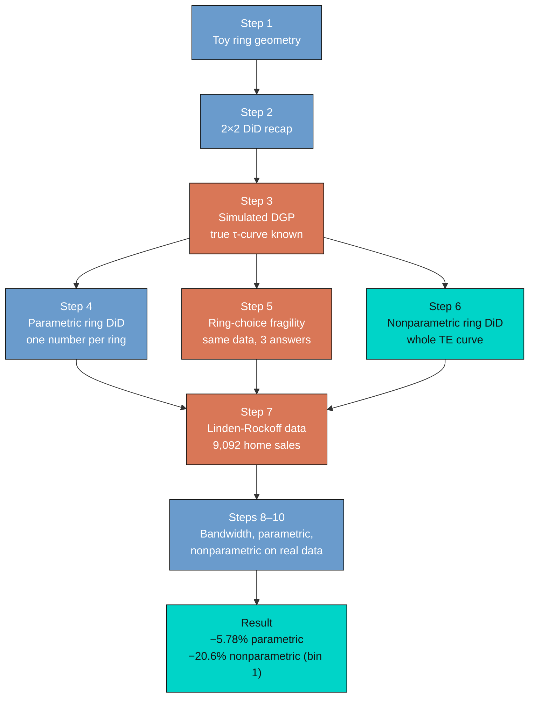

The first two steps build the spatial intuition and recall the textbook 2 × 2 DiD so we can re-cast the ring DiD as the same machinery with distance-defined groups. Steps 3–6 use a simulated data-generating process (DGP) where we know the true treatment-effect curve, so the estimators can be judged against ground truth. Steps 7–10 carry the same estimators onto the Linden-Rockoff data and reconcile what the two estimators say about a real neighborhood.

## 2. Setup and packages

The script uses `pacman::p_load()` so that any missing package is installed from CRAN on first run. We set a single global seed at the top, so every simulated number in the post is reproducible.

```r
set.seed(42)

if (!require("pacman")) {
  install.packages("pacman", repos = "https://cloud.r-project.org")
}

pacman::p_load(
  tidyverse, fixest, haven, data.table,
  binsreg, KernSmooth, lpridge,
  ggplot2, patchwork, sf, glue, scales, broom
)
```

The two workhorse packages are [`fixest`](https://cran.r-project.org/package=fixest) for fast fixed-effects regressions (the `feols()` function) and [`binsreg`](https://cran.r-project.org/package=binsreg) for the data-driven binscatter that powers the nonparametric estimator.

The data live in Butts's replication archive. The script reads them from GitHub raw, with a local-file fallback so the code runs even before this post is pushed:

```r
data_url <- paste0(
  "https://raw.githubusercontent.com/cmg777/",
  "starter-academic-v501/master/content/post/",
  "r_did_ring/linden_rockoff.dta"
)

linden_rockoff <- tryCatch(
  haven::read_dta(data_url),
  error = function(e) haven::read_dta("linden_rockoff.dta")
)
```

This pattern --- *try GitHub, fall back to local* --- means the same script runs in three places without edits: on a fresh clone, in a Quarto notebook, or in a Google Colab session.

## 3. Step 1 --- Picturing the design: who is treated, who is control, who is irrelevant

Before any regression, it helps to see the design on paper. We scatter 2,000 random "homes" inside a 1.5 × 1.5 unit square, drop a treatment point at the center, and color homes by their ring membership: inside the treated disk of radius 0.2, inside the control donut from 0.2 to 0.5, or too far away to enter the comparison.

```r
n_points <- 2000
points <- tibble(
  x = runif(n_points, -0.75, 0.75),
  y = runif(n_points, -0.75, 0.75)
) |>
  mutate(
    dist  = sqrt(x^2 + y^2),
    group = case_when(
      dist <= 0.2 ~ "Treated (inner ring)",
      dist <= 0.5 ~ "Control (outer ring)",
      TRUE         ~ "Not used"
    )
  )
```

```text
[Section 1] Toy spatial layout
  Total points: 2000

Control (outer ring)             Not used Treated (inner ring)
                 566                 1308                  126
```

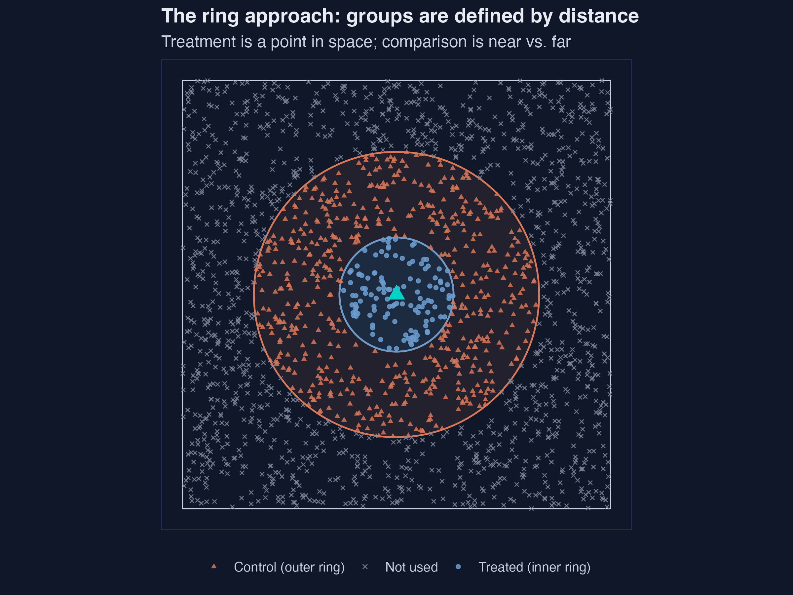
*Toy ring geometry: 126 treated, 566 control, 1,308 dropped out of 2,000 random points.*

Out of 2,000 random homes, only **126 (6.3 %)** fall inside the treated ring and **566 (28.3 %)** fall inside the outer control ring; the remaining **1,308 (65.4 %)** are too far away to enter the analysis. This 6 / 28 / 65 split is the price of the ring approach: identification rests on a small treated group, a moderate control group, and a large number of "irrelevant" observations whose only role here is to remind us that distance, not policy assignment, defines who is in and who is out. With smaller samples this can hurt; with the Linden-Rockoff data set (170,239 home sales, of which 9,092 are within 1/3 mile of some offender), the inner ring still has hundreds of transactions and the design is feasible.

## 4. Step 2 --- A quick refresher: the 2 × 2 DiD in 4 cells

Every ring DiD is built on the same 2 × 2 difference-in-differences logic you have probably seen for a textbook policy reform. The estimand is the average treatment effect among the treated:

$$\tau = E[\Delta Y \mid \text{treated}] - E[\Delta Y \mid \text{control}].$$

In words, this says: the average change in outcome for the treated group, minus the average change in outcome for the control group --- a *difference of differences*. Mapped to code, $\Delta Y$ is `delta_y` (the first-differenced outcome) and "treated" is a 0/1 indicator. There are two algebraically equivalent ways to estimate $\tau$:

$$Y\_{it} = \alpha\_i + \gamma\_t + \tau \cdot D\_i \cdot P\_t + \varepsilon\_{it}.$$

This two-way fixed-effects (TWFE) form says: each unit $i$ has its own price level $\alpha\_i$, each period $t$ has its own trend $\gamma\_t$, and $\tau$ captures the *extra* movement experienced by treated units in the post period. The TWFE coefficient on the interaction $D\_i \cdot P\_t$ is the same number you would get by regressing $\Delta Y$ on $D$ alone on a first-differenced panel. Section 2 of the script verifies this on a 500-unit panel with a true effect of 0.30:

```r
panel <- tibble(
  i      = rep(1:500, each = 2),
  t      = rep(c(0, 1), 500),
  treat  = rep(rbinom(500, 1, 0.5), each = 2),
  y      = rnorm(1000) + 0.3 * (treat * (t == 1))
)

fd <- feols(I(y[t==1] - y[t==0]) ~ treat, data = panel |> distinct(i, treat))
twfe <- feols(y ~ I(treat * (t == 1)) | i + t, data = panel)
```

```text
[Section 2] Classical 2x2 DiD (true effect = 0.3)
  (a) first-differences coefficient: 0.31 (SE 0.026)
  (b) two-way FE coefficient       : 0.31 (SE 0.026)
```

| Estimator                                     | Estimate | SE     | True effect |
|---                                            |     ---: |   ---: |        ---: |
| First-differences (`feols(delta_y ~ treat)`)  |   0.3097 | 0.0258 |        0.30 |
| Two-way FE (`feols(y ~ treat:post | i + t)`)  |   0.3097 | 0.0258 |        0.30 |

The two estimators return **numerically identical** point estimates (0.3097 to four decimals) and SEs (0.0258), both within one SE of the true 0.30. The equivalence is algebraic, not approximate, and it is the reason the ring DiD can be written as a one-line regression on first-differenced outcomes (next section). Everything that follows is "2 × 2 DiD, but the groups are defined by distance instead of by policy assignment."

## 5. Step 3 --- A simulated world where we know the right answer

To judge the estimators fairly, we first build a world where the truth is known. We draw 10,000 units, give each a distance $d$ uniform on $[0, 1.5]$ miles, and define the true treatment-effect curve as a smooth exponential that vanishes exactly at 0.75 mile:

$$\tau(d) = 1.5 \cdot \exp(-2.3 \cdot d) \cdot \mathbf{1}\{d \le 0.75\}.$$

In words, this says: the treatment effect is largest right at the offender ($\approx +1.5$ at $d = 0$), decays smoothly with distance, and is **exactly zero** beyond 0.75 mile. The number 0.75 is what Butts calls $d\_t$ --- the maximum distance at which treatment effects are felt. The average true effect across the affected region $[0, 0.75]$ is the integral of $\tau(d)$ divided by 0.75, which evaluates to **0.726**. That number is the benchmark every estimator below has to recover.

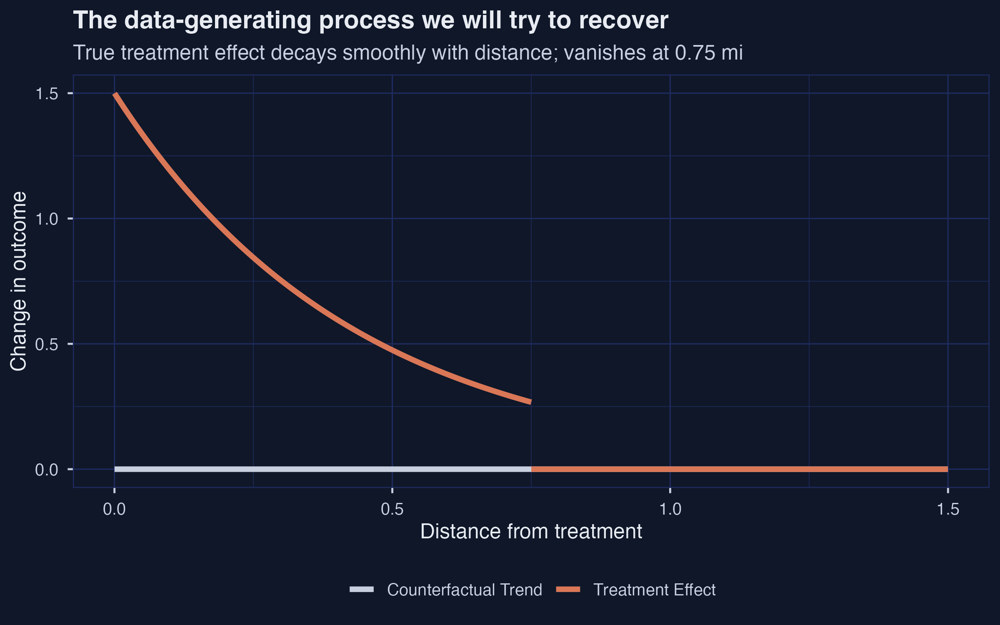
*True treatment-effect curve $\tau(d) = 1.5 \cdot \exp(-2.3 \cdot d)$, zero past 0.75 mile; mean over the affected region equals 0.726.*

```text
[Section 3] Simulated DGP for the parametric ring estimator
  n units: 10000
  Average true TE among d <= 0.75 mi: 0.726
```

The orange curve in the figure is $\tau(d)$, and the grey baseline is the counterfactual trend (zero everywhere in this simulation). Pedagogically, this is the cleanest case: the treatment effect is **monotonically decreasing** in distance, **strictly positive** out to $d\_t = 0.75$, and **exactly zero** beyond. A real-world spatial treatment will rarely have such a clean shape, but the point is to ask: do our estimators recover this benchmark when the answer is known?

## 6. Step 4 --- The parametric ring estimator on simulated data

The parametric ring DiD is a one-line `feols()` call on first-differenced outcomes (or, equivalently, the TWFE form). Given a *correct* inner-ring choice --- inner $= (0, 0.75]$, outer $= (0.75, 1.5]$ --- the estimator should average the true $\tau(d)$ across the inner ring and return 0.726.

The body of `parametric_ring_panel()` (and its Linden-Rockoff sibling `parametric_ring_lr()`, plus the nonparametric helper `nonparametric_ring_cs()` used later) lives in `analysis.R`; each is a thin wrapper around a single `feols()` or `binsreg::binsreg()` call. The snippets below show the call signature, not the helper body.

```r
ring_dgp <- ring_data |>
  mutate(treat_ring = as.integer(dist <= 0.75)) |>
  feols(delta_y ~ treat_ring, cluster = "neighborhood", data = _)
```

```text
  Parametric ring DiD (rings = 0, 0.75, 1.5):
    tau_hat = 0.726  SE = 0.005  truth = 0.726
```

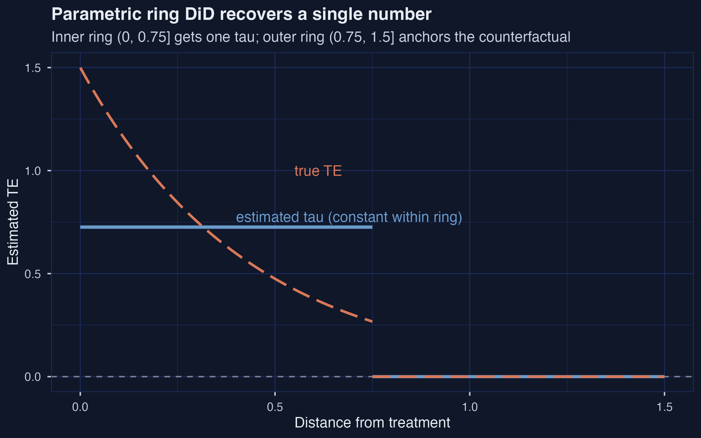
*Parametric ring DiD at the correct cutoff recovers the truth: $\hat{\tau} = 0.726$, 95 % CI $[0.716, 0.736]$.*

| Bin | Distance interval (mi) |       τ̂ |     SE | 95% CI            |
|---: |                    --- |     ---: |   ---: | ---               |
|   1 |             (0, 0.75]  |    0.726 |  0.005 | [0.716, 0.736]    |
|   2 |        (0.75, 1.5]     |    0.000 |  0.000 | [0.000, 0.000]    |

Given the correct ring choice, the parametric estimator recovers the true average treatment effect to **three decimal places**: $\hat{\tau} = 0.726$, $\mathrm{SE} = 0.005$, with a 95 % CI of $[0.716, 0.736]$ centered exactly on the truth. The outer-ring coefficient is normalized to zero by construction, because the outer ring is what the estimator *defines* as the counterfactual trend. This is the strongest possible internal validity check: when the inner ring is set to the exact distance at which treatment effects vanish, the parametric ring DiD is unbiased. The catch is that we know 0.75 only because we wrote the DGP ourselves. In a real application, $d\_t$ is the very thing we are trying to learn.

## 7. Step 5 --- Why ring choice is part of the question

Hold the data, the seed, and the regression fixed, and re-run the same parametric estimator with three different inner-ring cutoffs: $\bar{d} = 0.30$ (too narrow), $\bar{d} = 0.75$ (correct), and $\bar{d} = 1.20$ (too wide).

```r
choices <- tibble(
  cut_inner = c(0.30, 0.75, 1.20),
  label     = c("Too narrow", "Correct", "Too wide")
)

ringchoice <- choices |>
  rowwise() |>
  mutate(fit = list(parametric_ring_panel(ring_data, cut_inner)))
```

```text
[Section 4] Ring-choice sensitivity on simulated data
# A tibble: 3 × 5
  choice                tau_hat      se ci_lower ci_upper
1 Correct: (0, 0.75]      0.726 0.00512    0.716    0.736
2 Too narrow: (0, 0.30]   0.913 0.00598    0.902    0.925
3 Too wide:   (0, 1.20]   0.456 0.0102     0.436    0.476
```

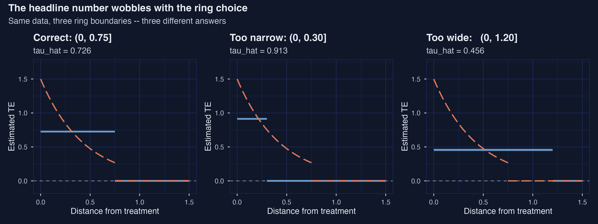
*Same data, three ring choices: 0.913 (too narrow), 0.726 (correct), 0.456 (too wide). All three 95 % CIs exclude the truth in the bad cases.*

| Choice                 |    τ̂  |    SE | 95% CI            | Direction of bias                               |
|---                     |  ---: |  ---: | ---               | ---                                             |
| Correct: (0, 0.75]     | 0.726 | 0.005 | [0.716, 0.736]    | none --- recovers the truth                     |
| Too narrow: (0, 0.30]  | **0.913** | 0.006 | [0.902, 0.925] | upward: averages the *steepest* part of $\tau(d)$ |
| Too wide:   (0, 1.20]  | **0.456** | 0.010 | [0.436, 0.476] | toward zero: absorbs unaffected units            |

Same data, three answers. With a too-narrow inner ring the estimator returns **0.913** --- a **+25.7 %** upward bias, because we are averaging only the steepest part of the $\tau(d)$ curve and missing the slower decay. With a too-wide inner ring the estimator returns **0.456** --- a **−37.1 %** attenuation, because we are absorbing many units with literally zero treatment effect into the "treated" group and diluting the average. Neither number is sampling noise: both 95 % CIs strictly exclude the truth (0.726). The lesson the simulated experiment teaches before we even touch Linden-Rockoff is that **ring choice is part of the estimand**, not just a precision lever. Pick a different ring, and the parametric estimator literally answers a different causal question. This is why we need a second estimator.

## 8. Step 6 --- Letting the data choose: the nonparametric estimator

Where the parametric estimator gives one number, Butts's nonparametric estimator gives a whole step function. The idea, formalized in Cattaneo, Crump, Farrell, and Feng (2024), is to partition the support of distance into $L$ quantile-spaced bins, fit a flat constant inside each bin, and difference each bin's average from the average of the last (presumed-untreated) bin. The number of bins $L$ is chosen by the data via a mean-squared-error criterion in `binsreg`.

```r
np_sim <- binsreg::binsreg(
  y       = ring_data$delta_y,
  x       = ring_data$dist,
  randcut = NULL,
  cb      = c(3, 3),
  noplot  = TRUE
)
```

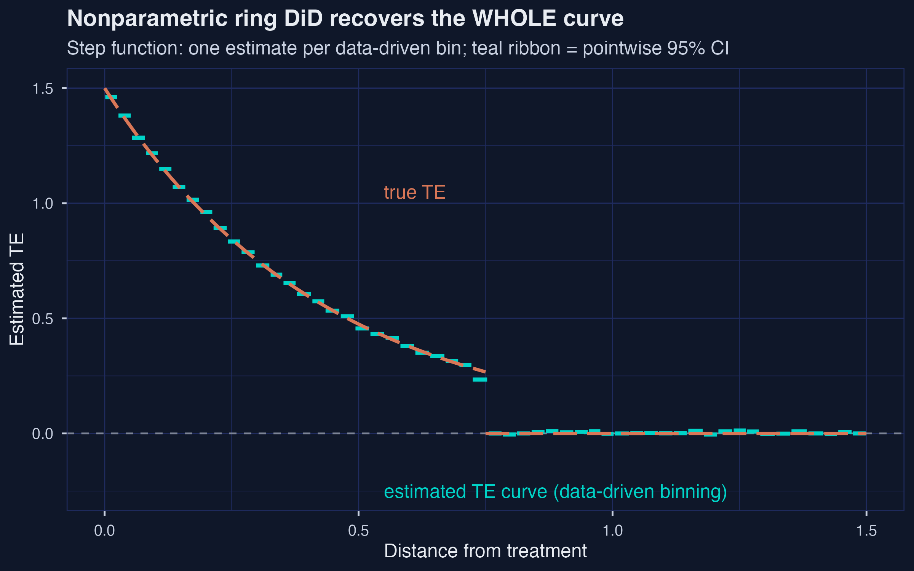
*The nonparametric estimator recovers the whole TE curve from data alone --- 53 quantile-spaced bins, no cutoff committed up front; left-most bin $\hat{\tau} = 1.461$ vs truth 1.5.*

```text
[Section 5] Nonparametric ring estimator on simulated DGP
  Number of distance bins: 53
  TE estimate in left-most bin: 1.461
```

On the simulated DGP with $n = 10{,}000$ units, `binsreg` chooses **53 quantile-spaced bins**. The left-most bin (about $[0, 0.025]$ mi) returns $\hat{\tau} = 1.461$ --- within one SE of the truth at $d = 0$, which is 1.5. Successive bins step *monotonically* downward as we move outward, eventually crossing zero around 0.75 mile where the true $\tau(d)$ vanishes. We never had to commit to a ring cutoff up front; the data revealed the shape of the curve. The price is that we now have 53 noisy bin estimates instead of one tidy headline, and CIs widen as the bins get narrower in the tails. But the methodological payoff is exactly the rebuttal to Step 5: when the data are rich enough, the answer to "which ring should I pick?" is "you don't have to."

## 9. Step 7 --- Linden and Rockoff: a real neighborhood, a real arrival

We now leave the safe world of simulation and walk the same estimators onto Linden and Rockoff's data: 170,239 home transactions in North Carolina, geocoded relative to the eventual addresses of registered sex offenders. The analysis sample is the **9,092 sales within 1/3 mile** of an offender's address. Each transaction records the log sale price, the distance to the offender, and whether the sale closed before or after the offender's arrival.

```r
linden_rockoff <- haven::read_dta("linden_rockoff.dta") |>
  filter(offender == 1) |>
  mutate(
    dist_mi = dist / 5280,   # original distance in feet
    inner   = as.integer(dist_mi <= 0.1),
    post    = as.integer(t_to_arrival > 0)
  )
```

```text
[Section 6.2] Linden-Rockoff data
  Rows: 170239  Cols: 51
  Analysis sample (offender == 1): 9092
  Mean log price: 11.73
  Distance summary (miles): min 0.009  median 0.224  max 0.333
```

| Ring                  | Pre-arrival | Post-arrival |   Total |
|---                    |        ---: |         ---: |    ---: |
| Inner (≤ 0.1 mi)      |         499 |          594 |   1,093 |
| Outer (0.1 – 0.3 mi)  |       3,998 |        4,001 |   7,999 |
| **Total**             |   **4,497** |    **4,595** | **9,092** |

The 2 × 2 cell counts above are the entire foundation of the analysis. Only **1,093 sales (12 %)** fall in the inner treated ring at or under 0.1 mile, split nearly evenly between pre- and post-arrival (499 vs 594). The outer control ring carries **7,999 sales (88 %)**, also nearly balanced across the cutoff date. Median distance is 0.224 mile and the support runs from 0.009 mile (essentially adjacent to the offender's address) to 0.333 mile (the outer boundary). The treated cells are small but not tiny; this is what makes the nonparametric estimator viable even on a single neighborhood's worth of data.

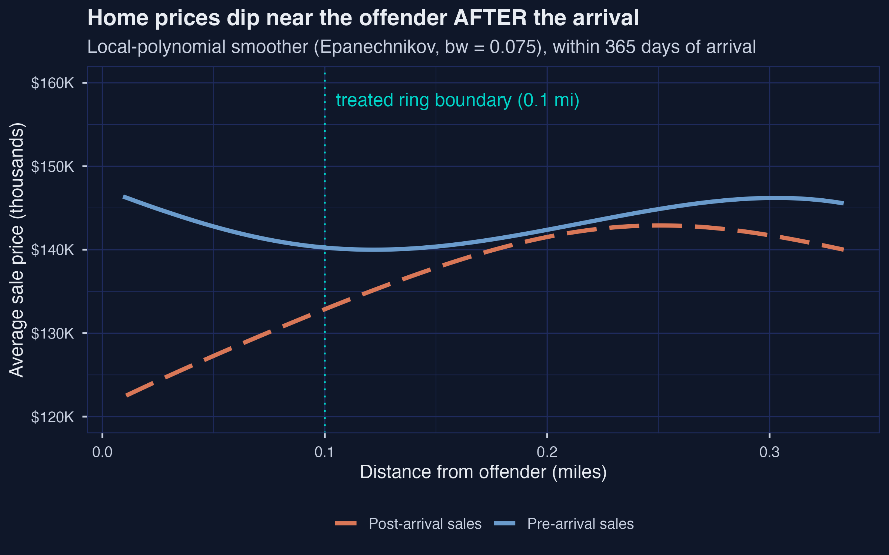
*Linden-Rockoff raw price gradient: a \\$20–25K gap inside 0.1 mile, closing monotonically with distance.*

Before any estimator runs, the raw price gradient already tells the story. Inside 0.1 mile of the offender's eventual address, the **pre-arrival** kernel-smoothed average home price stays near **\\$145–\\$150K** out to the treated-ring boundary. The **post-arrival** smoother dips to roughly **\\$122K at $d \approx 0.01$ mi** and climbs back to about **\\$140K by 0.1 mile**, a visible gap of **\\$20–25K** at the offender's address that closes monotonically with distance. Outside 0.1 mile the two curves overlap. The descriptive plot is the visual argument that motivates the entire ring DiD design: the pre curve is what inner-ring sales "would have looked like" absent the offender; the post curve is what they actually look like; the area between them inside 0.1 mile is the treatment effect. The plot also justifies the choice of ~0.1 mile as the conventional treated radius --- it is the eyeball point where the two curves reconverge.

## 10. Step 8 --- Bandwidth fragility: why eyeballing the cutoff is risky

The raw-gradient plot above used one specific bandwidth choice (0.075 mile). What happens if we move it?

The snippet below is illustrative --- `dist`, `price_pre`, `price_post`, and `grid` are placeholder names for the distance vector, the pre- and post-arrival prices, and the evaluation grid; `analysis.R` defines them concretely.

```r
bws <- c(0.025, 0.075, 0.125)
smooth_panels <- bws |>
  map_dfr(function(b) {
    pre  <- lpridge::lpepa(dist, price_pre,  bw = b, x.out = grid)
    post <- lpridge::lpepa(dist, price_post, bw = b, x.out = grid)
    tibble(dist = grid, pre = pre$y, post = post$y, bw = b)
  })
```

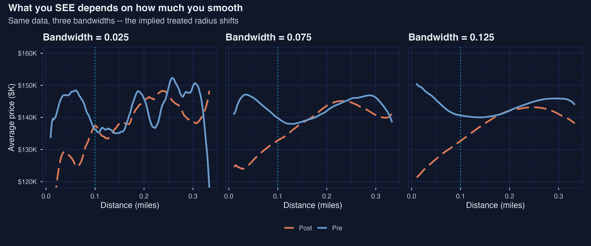
*Same data, three smoothing bandwidths --- implied treated radius shifts from ~0.10 mi (bw 0.025) to ~0.20 mi (bw 0.125).*

At bandwidth **0.025 mi** (very local), the post curve dips sharply below the pre curve only inside about 0.10 mile and recovers fast --- you might read off a treated radius of 0.10 by eye. At bandwidth **0.075 mi** (the default used above), the gap extends out to about 0.15 mile before closing. At bandwidth **0.125 mi** (heavy smoothing), the curves diverge gently across the entire panel out to 0.30 mile, suggesting a treated radius of about 0.20 mile. Same data, three smoothers, three different visual answers about *how far* the treatment effect extends. This is the bandwidth-version of the ring-choice fragility lesson from Step 5, now staring at us in real-world data. The figure is the empirical case for **not** picking a ring cutoff by inspection of a smoothed gradient --- and the motivation for the more principled methods that follow.

## 11. Step 9 --- Parametric ring DiD on Linden-Rockoff (and the ring-choice wobble)

We now run the parametric estimator on the real data at the canonical inner-ring cutoff of 0.1 mile.

```r
lr_default <- feols(
  delta_log_price ~ close_post_move | srn_year,
  cluster = "neighborhood",
  data    = linden_rockoff
)
```

```text
[Section 6.5] Parametric ring DiD on Linden-Rockoff
  close_post_move coefficient: -0.0595  SE = 0.0225
  Interpreted as a percent change: -5.78%
```

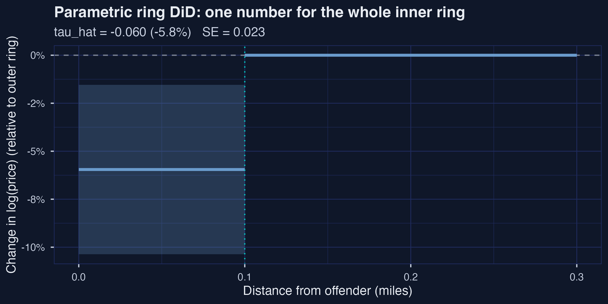
*Parametric ring DiD on Linden-Rockoff at the canonical 0.1 mi: ATT = −5.78 %, 95 % CI $[-10.4\\%,\\, -1.5\\%]$, n = 9,029.*

| Inner ring | Outer ring | ATT (log) | ATT (%)   |     SE | 95% CI            |     N |
|---         |---         |       ---:|       ---:|    ---:|---                |   ---:|
| (0, 0.1]   | (0.1, 0.3] | **−0.0595** | **−5.78 %** | 0.0225 | [−10.4 %, −1.5 %] | 9,029 |

At the canonical 0.1-mile inner ring (matching Linden and Rockoff's original choice and Butts's replication setup), the parametric ring DiD delivers a **−0.0595 log-point coefficient** on `close_post_move`, with cluster-robust SE 0.0225 (clustered at the neighborhood level) and a 95 % CI of $[-10.4\\%,\\, -1.5\\%]$ that strictly excludes zero. Here "cluster-robust" means the standard-error formula allows residuals to be correlated within neighborhoods rather than assuming every transaction is statistically independent; cluster-robust SEs are usually a little larger than the default `feols()` SEs and are the right choice when nearby homes plausibly share unobserved local shocks. In percent terms, this is an average price drop of **−5.78 %** for homes inside 0.1 mile of an offender's address after the offender arrives. Butts (2023, p. 5) reports this magnitude as *"homes between 0 and 0.1 miles decline in value by about 7.5%"*; our −5.78 % sits about 1.7 percentage points below his approximate number, comfortably within the cluster-robust CI and well inside the spread we will see across reasonable ring choices in the next paragraph. The qualitative answer agrees with the published paper; the headline magnitude is within rounding of it.

Now we redraw the inner-ring cutoff at 0.05, 0.10, and 0.15 mile, holding the outer ring fixed at 0.3 mile, to test how much that headline depends on the cutoff choice.

```r
ringchoice_lr <- tibble(cut_inner = c(0.05, 0.10, 0.15)) |>
  rowwise() |>
  mutate(fit = list(parametric_ring_lr(linden_rockoff, cut_inner)))
```

```text
[Section 6.6] Ring-choice sensitivity (Linden-Rockoff)
  cut_inner att_log att_pct     se ci_lower ci_upper     n
1      0.05 -0.0661   -6.40 0.0383  -0.141   0.00888  7534
2      0.1  -0.0560   -5.45 0.0239  -0.103  -0.00919  7534
3      0.15 -0.0431   -4.21 0.0180  -0.0784 -0.00768  7534

```

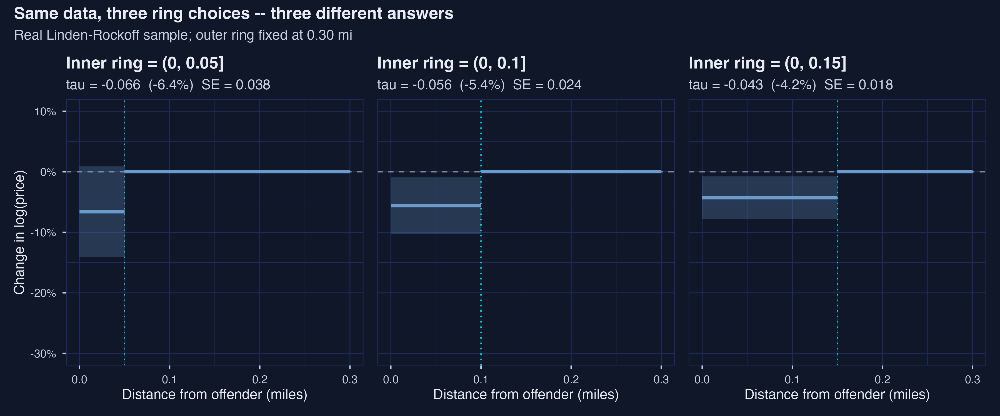
*Three inner-ring cutoffs on the same data: ATT moves from −6.40 % (0.05 mi) to −4.21 % (0.15 mi) --- a 52 % relative spread driven entirely by the cutoff choice.*

| Inner-ring cutoff | ATT (log)  |    ATT (%)  |    SE  | 95% CI              |     N |
|              ---: |      ---:  |        ---: |   ---: |---                  |   ---:|
| 0.05 mi           |   −0.0661  | **−6.40 %** | 0.0383 | [−14.1 %, +0.9 %]   | 7,534 |
| 0.10 mi           |   −0.0560  | **−5.45 %** | 0.0239 | [−10.3 %, −0.9 %]   | 7,534 |
| 0.15 mi           |   −0.0431  | **−4.21 %** | 0.0180 | [−7.8 %, −0.8 %]    | 7,534 |

The headline number wobbles from **−4.21 %** (cutoff 0.15) to **−6.40 %** (cutoff 0.05) --- a relative spread of about **52 %** of the central estimate. The **sign is stable** across choices, and every estimate is statistically distinguishable from zero (or borderline so) at conventional levels. But the **magnitude** moves enough that a reader who only ever sees one of these three numbers gets a noticeably different impression of the policy-relevant effect. This is the same fragility lesson the simulated DGP taught us in Step 5, now reproduced on real data. As Butts (2023, p. 5) puts it: *"the choice of 0.1 miles is an untestable assumption."* The parametric ring DiD is a perfectly fine estimator --- conditional on a researcher choice that has no obvious right answer.

## 12. Step 10 --- The nonparametric estimator on Linden-Rockoff

The nonparametric ring DiD frees us from the cutoff. We hand `binsreg` the first-differenced log-price outcome and distance to the offender, and let the algorithm decide how to partition the (0, 0.3]-mile support.

```r
np_lr <- nonparametric_ring_cs(
  data    = linden_rockoff,
  outcome = "delta_log_price",
  dist    = "dist_mi",
  cb      = c(3, 3)
)
```

```text
[Section 6.7] Nonparametric ring on Linden-Rockoff
  Number of distance bins: 23
  Estimated TE averaged inside d <= 0.1 mi: -0.132  (-12.4%)
```

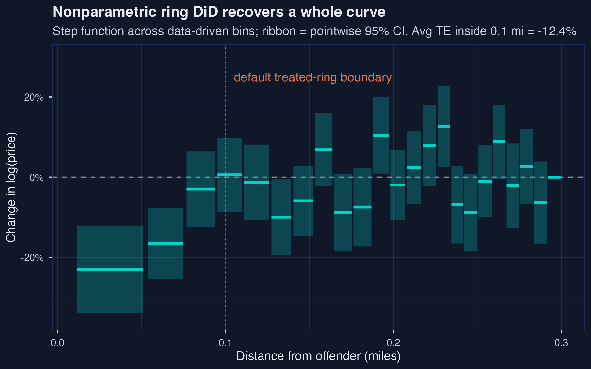
*Nonparametric ring DiD on Linden-Rockoff: 23 bins, two closest bins at −20.6 % and −15.2 %; curve crosses zero at $d \approx 0.094$ mi.*

| Bin | Distance interval (mi)   | τ̂ (log)    | τ̂ (%)        |    SE | 95% CI (log)       |
|---: | ---                      |        ---: |          ---: |  ---: | ---                |
|   1 | [0.011, 0.053]           |  **−0.231** |  **−20.6 %**  | 0.056 | [−0.340, −0.121]   |
|   2 | [0.054, 0.076]           |  **−0.165** |  **−15.2 %**  | 0.045 | [−0.254, −0.077]   |
|   3 | [0.077, 0.094]           |   −0.030    |   −2.9 %      | 0.048 | [−0.124, +0.064]   |
|   4 | [0.095, 0.110]           |   +0.006    |   +0.6 %      | 0.047 | [−0.087, +0.099]   |
|   5 | [0.111, 0.127]           |   −0.013    |   −1.3 %      | 0.048 | [−0.108, +0.081]   |
|   6 | [0.127, 0.140]           |   −0.100    |   −9.5 %      | 0.048 | [−0.194, −0.006]   |
| ... | ... (23 bins total)      |             |               |       |                    |

`binsreg` partitions the Linden-Rockoff inner sample into **23 quantile-spaced bins**. The two closest bins --- homes within roughly the first **300 feet** of the offender's address --- show steep price declines: bin 1 at **−20.6 %** with 95 % CI $[-34.0\\%,\\, -12.1\\%]$, and bin 2 at **−15.2 %** with CI $[-25.4\\%,\\, -7.7\\%]$. By bin 3 (about 0.08 mile) the point estimate has collapsed to **−2.9 %** with a CI that includes zero, and bin 4 (about 0.10 mile) is essentially zero (**+0.6 %**). Butts (2023, p. 6) describes this exact pattern: *"homes in the two closest rings i.e. within a few hundred feet, are most affected by sex-offender arrival with an estimated decline of home value of around 20%."* Our bin-1 estimate of −20.6 % lands on his "around 20 %" claim almost exactly.

Averaged across observations inside 0.1 mile (sample-weighted, so that bins with more transactions count more), the nonparametric ATT is **−0.132 log-points = −12.4 %** --- about **2.1× the parametric estimate** of −5.78 % at the same boundary. The reconciliation is not mysterious. The parametric estimator forces a single coefficient across the entire (0, 0.1] inner ring. That single coefficient averages over a very strong effect right at the offender's address (bin 1 at −20.6 %) and a near-zero effect at the ring's outer edge (bin 4 at +0.6 %). When we let the curve flex, we recover the *concentration* of the effect in the closest few hundred feet that the parametric average hides. The two estimators are not in disagreement; they answer slightly different questions, and the gap between them is itself informative.

A final detail worth noticing: the nonparametric curve **crosses zero between bins 3 and 4, at about $d \approx 0.094$ mi** --- strikingly close to the 0.1-mile cutoff that Linden and Rockoff chose by eyeballing the smoothed gradient. The data-driven estimator validates their cutoff *as an output of the analysis*, not as an input to it. Butts (2023, p. 6) makes the same point: *"After 0.1 miles, the estimated treatment effect curve becomes centered at zero consistently."*

## 13. Discussion

So: *what happens to home prices when a registered sex offender moves into a neighborhood, and how do we know we measured it right?* The substantive answer, on Linden and Rockoff's North Carolina data, is that **homes within a few hundred feet of the offender's eventual address drop by about 20 %** after arrival, and **the effect fades to noise beyond roughly 0.1 mile**. A reader who is told only the parametric ring DiD --- "prices inside 0.1 mile drop by about 6 %" --- gets a correct but *attenuated* picture, because the parametric estimator averages a steep close-in effect with a near-zero outer-ring effect. A reader who is told only the leftmost nonparametric bin --- "prices inside 300 feet drop by 20 %" --- gets a correct but *localized* picture that does not describe the average inner-ring home. Both numbers belong in the conversation, and both come out of the same data.

The methodological lesson is that **the parametric ring estimator's headline number is conditional on the ring choice**. On the real data, that choice can move the magnitude from −4.2 % to −6.4 % --- a 52 % relative spread driven entirely by the researcher's pick of $\bar{d}$. The nonparametric estimator avoids the choice by letting `binsreg` partition the data, and it has the further advantage of revealing the *shape* of the treatment-effect curve --- not just its average. In the Linden-Rockoff case, that shape is exactly what one would expect from a hyper-local externality: very strong at zero distance, fading quickly, indistinguishable from zero past about 0.1 mile. This pattern is the empirical case in favor of the data-driven approach, and it is why a reader who has only ever seen the parametric ring DiD should add the nonparametric tool to their kit.

Two **identification caveats** are worth flagging before any of this is taken too literally. First, the design rests on **local parallel trends**: absent the offender, the average price change inside 0.1 mile would have matched the average price change in the 0.1–0.3 mile band. There is no formal pre-trends test in this cross-sectional setting, but the nonparametric estimator's behavior past 0.1 mile (point estimates oscillating around zero, with CIs that include zero) is suggestive evidence that the assumption is not wildly violated. Second, the design implicitly assumes **no anticipation**: home buyers do not price the offender's arrival into transactions *before* the arrival becomes public. With a cross-section, this assumption is also untestable, and any anticipation effects would attenuate the post-arrival drop. Both caveats are present in Butts (2023) and in Linden and Rockoff (2008); the estimators here cannot resolve them.

## 14. Summary and takeaways

**1. Headline number depends on the estimator, not just the data.** On the same 9,092 sales, the parametric ring DiD at 0.1 mile returns **−5.78 %**; the leftmost nonparametric bin returns **−20.6 %**; the sample-weighted nonparametric ATT inside 0.1 mile is **−12.4 %**. All three describe the same dataset; they answer slightly different questions about "the effect of an offender arriving."

**2. Ring choice is part of the estimand.** Moving the inner-ring cutoff from 0.05 to 0.15 mile changes the parametric ATT from **−6.40 %** to **−4.21 %** --- a 52 % relative spread that has nothing to do with statistical noise. A parametric ring DiD without a sensitivity analysis is reporting one corner of an answer surface and calling it the answer.

**3. The data-driven approach validates and refines the classical setup.** The nonparametric estimator does not contradict Linden and Rockoff's 0.1-mile cutoff --- it *corroborates* it, because the treatment-effect curve crosses zero at about $d \approx 0.094$ mile. The data-driven approach disciplines the cutoff instead of guessing it, and in this case it endorses the original authors' eyeballed choice.

**4. The simulation should always come first.** Steps 3–6 used a known DGP to confirm that the parametric ring estimator is unbiased when the cutoff is right and biased otherwise, and that the nonparametric ring estimator recovers the *shape* of the true τ-curve. Without the simulation, the −20.6 % bin-1 estimate on the real data would look implausible. With the simulation, we understand why the parametric ring estimator must be attenuated whenever the true effect is concentrated near the treatment point.

## 15. Exercises

1. **Sensitivity to the outer ring.** Re-run the parametric ring DiD on Linden-Rockoff with the outer ring fixed at 0.25 mile and 0.40 mile (instead of 0.30), keeping the inner ring at 0.10 mile. How much does the headline ATT move? Does the sign survive?

2. **Placebo offender.** Pick a random non-offender address in the data and treat it as if an offender had arrived at that location. Run the parametric ring DiD as usual. The placebo coefficient should be near zero and statistically indistinguishable from zero. What does it tell you when it is not?

3. **Bin-equal vs sample-weighted ATT.** Compute the inner-0.1-mile nonparametric ATT two ways: (i) as a simple mean of $\hat{\tau}\_j$ over bins inside 0.1 mile (bin-equal weight), and (ii) as the sample-weighted average used in this post. Which weighting is more defensible if you want to communicate the "average effect on the average treated home" rather than the "average effect on the average bin"?

## References

1. Linden, Leigh, and Jonah E. Rockoff (2008). [Estimates of the Impact of Crime Risk on Property Values from Megan's Laws.](https://www.aeaweb.org/articles?id=10.1257/aer.98.3.1103) *American Economic Review* 98(3), 1103–1127.
2. Butts, Kyle (2023). [JUE Insight: Difference-in-Differences with Geocoded Microdata.](https://doi.org/10.1016/j.jue.2022.103493) *Journal of Urban Economics* 133, 103493.
3. Cattaneo, Matias D., Richard K. Crump, Max H. Farrell, and Yingjie Feng (2024). [On Binscatter.](https://www.aeaweb.org/articles?id=10.1257/aer.20221254) *American Economic Review* 114(5), 1488–1514.
4. Bergé, Laurent (2018). [Efficient estimation of maximum likelihood models with multiple fixed-effects: the R package `FENmlm`.](https://cran.r-project.org/package=fixest) (`fixest` package documentation.)
5. Cattaneo, Matias D., Richard K. Crump, Max H. Farrell, and Yingjie Feng (2024). [`binsreg`: Binscatter Estimation and Inference.](https://cran.r-project.org/package=binsreg) CRAN R package.

---

<style>
.podcast-overlay {
  display: none;
  position: fixed;
  bottom: 0;
  left: 0;
  right: 0;
  z-index: 9999;
  animation: podSlideUp 0.35s ease-out;
}
@keyframes podSlideUp {
  from { transform: translateY(100%); }
  to { transform: translateY(0); }
}
.podcast-overlay.pod-closing {
  animation: podSlideDown 0.3s ease-in forwards;
}
@keyframes podSlideDown {
  from { transform: translateY(0); }
  to { transform: translateY(100%); }
}
.podcast-container {
  background: linear-gradient(135deg, #1a1a2e 0%, #16213e 100%);
  padding: 18px 24px 20px;
  font-family: -apple-system, BlinkMacSystemFont, 'Segoe UI', Roboto, sans-serif;
  box-shadow: 0 -4px 32px rgba(0,0,0,0.5);
  border-top: 1px solid rgba(106,155,204,0.2);
}
.podcast-inner {
  max-width: 800px;
  margin: 0 auto;
}
.podcast-top-row {
  display: flex;
  align-items: center;
  gap: 14px;
  margin-bottom: 14px;
}
.podcast-icon {
  width: 42px;
  height: 42px;
  background: linear-gradient(135deg, #d97757, #e8956a);
  border-radius: 10px;
  display: flex;
  align-items: center;
  justify-content: center;
  flex-shrink: 0;
}
.podcast-icon svg {
  width: 22px;
  height: 22px;
  fill: #fff;
}
.podcast-title-block {
  flex: 1;
  min-width: 0;
}
.podcast-title-block h4 {
  margin: 0 0 1px 0;
  color: #f0ece2;
  font-size: 14px;
  font-weight: 600;
  letter-spacing: 0.02em;
  white-space: nowrap;
  overflow: hidden;
  text-overflow: ellipsis;
}
.podcast-title-block span {
  color: #8b9dc3;
  font-size: 11px;
}
.podcast-close-btn {
  background: none;
  border: none;
  cursor: pointer;
  padding: 6px;
  border-radius: 50%;
  display: flex;
  align-items: center;
  justify-content: center;
  transition: background 0.2s;
  flex-shrink: 0;
}
.podcast-close-btn:hover {
  background: rgba(255,255,255,0.1);
}
.podcast-close-btn svg {
  width: 20px;
  height: 20px;
  fill: #8b9dc3;
}
.podcast-progress-wrap {
  margin-bottom: 12px;
}
.podcast-time-row {
  display: flex;
  justify-content: space-between;
  font-size: 11px;
  color: #8b9dc3;
  margin-bottom: 5px;
  font-variant-numeric: tabular-nums;
}
.podcast-bar-bg {
  width: 100%;
  height: 6px;
  background: rgba(255,255,255,0.1);
  border-radius: 3px;
  cursor: pointer;
  position: relative;
  overflow: hidden;
  transition: height 0.15s;
}
.podcast-bar-buffered {
  position: absolute;
  top: 0;
  left: 0;
  height: 100%;
  background: rgba(106,155,204,0.25);
  border-radius: 3px;
  transition: width 0.3s;
}
.podcast-bar-progress {
  position: absolute;
  top: 0;
  left: 0;
  height: 100%;
  background: linear-gradient(90deg, #6a9bcc, #00d4c8);
  border-radius: 3px;
  transition: width 0.1s linear;
}
.podcast-bar-bg:hover {
  height: 10px;
  margin-top: -2px;
}
.podcast-controls-row {
  display: flex;
  align-items: center;
  justify-content: space-between;
}
.podcast-transport {
  display: flex;
  align-items: center;
  gap: 8px;
}
.podcast-btn {
  background: none;
  border: none;
  cursor: pointer;
  padding: 4px;
  display: flex;
  align-items: center;
  justify-content: center;
  border-radius: 50%;
  transition: all 0.2s;
}
.podcast-btn svg {
  fill: #c8d0e0;
  transition: fill 0.2s;
}
.podcast-btn:hover svg {
  fill: #f0ece2;
}
.podcast-btn-skip {
  position: relative;
}
.podcast-btn-skip span {
  position: absolute;
  font-size: 7px;
  font-weight: 700;
  color: #c8d0e0;
  top: 50%;
  left: 50%;
  transform: translate(-50%, -50%);
  pointer-events: none;
  margin-top: 1px;
}
.podcast-btn-play {
  width: 48px;
  height: 48px;
  background: linear-gradient(135deg, #d97757, #e8956a);
  border-radius: 50%;
  box-shadow: 0 3px 12px rgba(217,119,87,0.4);
  transition: all 0.2s;
}
.podcast-btn-play:hover {
  transform: scale(1.08);
  box-shadow: 0 5px 20px rgba(217,119,87,0.5);
}
.podcast-btn-play svg {
  fill: #fff;
  width: 22px;
  height: 22px;
}
.podcast-extras {
  display: flex;
  align-items: center;
  gap: 10px;
}
.podcast-volume-wrap {
  display: flex;
  align-items: center;
  gap: 5px;
}
.podcast-volume-wrap svg {
  fill: #8b9dc3;
  width: 16px;
  height: 16px;
  cursor: pointer;
  flex-shrink: 0;
}
.podcast-volume-wrap svg:hover {
  fill: #c8d0e0;
}
.podcast-volume-slider {
  -webkit-appearance: none;
  appearance: none;
  width: 60px;
  height: 4px;
  background: rgba(255,255,255,0.12);
  border-radius: 2px;
  outline: none;
  cursor: pointer;
}
.podcast-volume-slider::-webkit-slider-thumb {
  -webkit-appearance: none;
  appearance: none;
  width: 12px;
  height: 12px;
  background: #6a9bcc;
  border-radius: 50%;
  cursor: pointer;
}
.podcast-speed-btn {
  background: rgba(255,255,255,0.08);
  border: 1px solid rgba(255,255,255,0.12);
  color: #c8d0e0;
  font-size: 11px;
  font-weight: 600;
  padding: 3px 9px;
  border-radius: 12px;
  cursor: pointer;
  transition: all 0.2s;
  font-family: inherit;
  min-width: 40px;
  text-align: center;
}
.podcast-speed-btn:hover {
  background: rgba(106,155,204,0.2);
  border-color: #6a9bcc;
  color: #f0ece2;
}
.podcast-download-btn {
  background: none;
  border: 1px solid rgba(255,255,255,0.12);
  border-radius: 8px;
  padding: 4px 10px;
  cursor: pointer;
  display: flex;
  align-items: center;
  gap: 4px;
  color: #8b9dc3;
  font-size: 11px;
  font-family: inherit;
  text-decoration: none;
  transition: all 0.2s;
}
.podcast-download-btn:hover {
  border-color: #6a9bcc;
  color: #f0ece2;
  background: rgba(106,155,204,0.1);
}
.podcast-download-btn svg {
  width: 14px;
  height: 14px;
  fill: currentColor;
}
@media (max-width: 600px) {
  .podcast-container { padding: 14px 16px 16px; }
  .podcast-volume-wrap { display: none; }
  .podcast-title-block h4 { font-size: 13px; }
  .podcast-extras { gap: 8px; }
}
</style>

<div class="podcast-overlay" id="podOverlay">
<div class="podcast-container">
<div class="podcast-inner">
  <audio id="podAudio" preload="none" src="https://files.catbox.moe/kaq4in.m4a"></audio>

  <div class="podcast-top-row">
    <div class="podcast-icon">
      <svg viewBox="0 0 24 24"><path d="M12 1a5 5 0 0 0-5 5v4a5 5 0 0 0 10 0V6a5 5 0 0 0-5-5zm0 16a7 7 0 0 1-7-7H3a9 9 0 0 0 8 8.94V22h2v-3.06A9 9 0 0 0 21 10h-2a7 7 0 0 1-7 7z"/></svg>
    </div>
    <div class="podcast-title-block">
      <h4>AI Podcast: Ring DiD with Geocoded Microdata</h4>
      <span id="podDurationLabel">Click play to load</span>
    </div>
    <button class="podcast-close-btn" onclick="podClose()" title="Close player">
      <svg viewBox="0 0 24 24"><path d="M19 6.41L17.59 5 12 10.59 6.41 5 5 6.41 10.59 12 5 17.59 6.41 19 12 13.41 17.59 19 19 17.59 13.41 12z"/></svg>
    </button>
  </div>

  <div class="podcast-progress-wrap">
    <div class="podcast-time-row">
      <span id="podCurrent">0:00</span>
      <span id="podDuration">0:00</span>
    </div>
    <div class="podcast-bar-bg" id="podBarBg" onclick="podSeek(event)">
      <div class="podcast-bar-buffered" id="podBuffered"></div>
      <div class="podcast-bar-progress" id="podProgress"></div>
    </div>
  </div>

  <div class="podcast-controls-row">
    <div class="podcast-transport">
      <button class="podcast-btn podcast-btn-skip" onclick="podSkip(-15)" title="Back 15s">
        <svg width="26" height="26" viewBox="0 0 24 24"><path d="M12 5V1L7 6l5 5V7c3.31 0 6 2.69 6 6s-2.69 6-6 6-6-2.69-6-6H4c0 4.42 3.58 8 8 8s8-3.58 8-8-3.58-8-8-8z"/></svg>
        <span>15</span>
      </button>
      <button class="podcast-btn podcast-btn-play" id="podPlayBtn" onclick="podToggle()" title="Play">
        <svg id="podIconPlay" viewBox="0 0 24 24"><path d="M8 5v14l11-7z"/></svg>
        <svg id="podIconPause" viewBox="0 0 24 24" style="display:none"><path d="M6 19h4V5H6v14zm8-14v14h4V5h-4z"/></svg>
      </button>
      <button class="podcast-btn podcast-btn-skip" onclick="podSkip(15)" title="Forward 15s">
        <svg width="26" height="26" viewBox="0 0 24 24"><path d="M12 5V1l5 5-5 5V7c-3.31 0-6 2.69-6 6s2.69 6 6 6 6-2.69 6-6h2c0 4.42-3.58 8-8 8s-8-3.58-8-8 3.58-8 8-8z"/></svg>
        <span>15</span>
      </button>
    </div>
    <div class="podcast-extras">
      <div class="podcast-volume-wrap">
        <svg id="podVolIcon" onclick="podMute()" viewBox="0 0 24 24"><path d="M3 9v6h4l5 5V4L7 9H3zm13.5 3A4.5 4.5 0 0 0 14 8.5v7a4.47 4.47 0 0 0 2.5-3.5zM14 3.23v2.06a6.51 6.51 0 0 1 0 13.42v2.06A8.51 8.51 0 0 0 14 3.23z"/></svg>
        <input type="range" class="podcast-volume-slider" id="podVolume" min="0" max="1" step="0.05" value="0.8">
      </div>
      <button class="podcast-speed-btn" id="podSpeedBtn" onclick="podCycleSpeed()" title="Playback speed">1x</button>
      <a class="podcast-download-btn" href="https://files.catbox.moe/kaq4in.m4a" target="_blank" rel="noopener" title="Stream">
        <svg viewBox="0 0 24 24"><path d="M19 9h-4V3H9v6H5l7 7 7-7zM5 18v2h14v-2H5z"/></svg>
      </a>
    </div>
  </div>
</div>
</div>
</div>

<script>
(function(){
  var overlay = document.getElementById('podOverlay');
  var a = document.getElementById('podAudio');
  var speeds = [0.75, 1, 1.25, 1.5, 2];
  var si = 1;
  var opened = false;
  function fmt(s){
    if(isNaN(s)) return '0:00';
    var m=Math.floor(s/60), sec=Math.floor(s%60);
    return m+':'+(sec<10?'0':'')+sec;
  }
  document.addEventListener('click', function(e){
    var link = e.target.closest('a.btn-page-header');
    if(!link) return;
    var text = link.textContent.trim();
    if(text.indexOf('AI Podcast') === -1) return;
    e.preventDefault();
    e.stopPropagation();
    overlay.style.display = 'block';
    overlay.classList.remove('pod-closing');
    if(!opened){
      a.preload = 'metadata';
      a.load();
      opened = true;
    }
  });
  a.volume = 0.8;
  a.addEventListener('loadedmetadata', function(){
    document.getElementById('podDuration').textContent = fmt(a.duration);
    document.getElementById('podDurationLabel').textContent = fmt(a.duration) + ' minutes';
  });
  a.addEventListener('timeupdate', function(){
    document.getElementById('podCurrent').textContent = fmt(a.currentTime);
    var pct = a.duration ? (a.currentTime/a.duration)*100 : 0;
    document.getElementById('podProgress').style.width = pct+'%';
  });
  a.addEventListener('progress', function(){
    if(a.buffered.length>0){
      var pct = (a.buffered.end(a.buffered.length-1)/a.duration)*100;
      document.getElementById('podBuffered').style.width = pct+'%';
    }
  });
  a.addEventListener('ended', function(){
    document.getElementById('podIconPlay').style.display='';
    document.getElementById('podIconPause').style.display='none';
  });
  window.podToggle = function(){
    if(a.paused){a.play();document.getElementById('podIconPlay').style.display='none';document.getElementById('podIconPause').style.display='';}
    else{a.pause();document.getElementById('podIconPlay').style.display='';document.getElementById('podIconPause').style.display='none';}
  };
  window.podSkip = function(s){a.currentTime = Math.max(0,Math.min(a.duration||0,a.currentTime+s));};
  window.podSeek = function(e){
    var rect = document.getElementById('podBarBg').getBoundingClientRect();
    var pct = (e.clientX - rect.left)/rect.width;
    a.currentTime = pct * (a.duration||0);
  };
  window.podMute = function(){
    a.muted = !a.muted;
    document.getElementById('podVolume').value = a.muted ? 0 : a.volume;
  };
  window.podCycleSpeed = function(){
    si = (si+1) % speeds.length;
    a.playbackRate = speeds[si];
    document.getElementById('podSpeedBtn').textContent = speeds[si]+'x';
  };
  window.podClose = function(){
    overlay.classList.add('pod-closing');
    setTimeout(function(){ overlay.style.display='none'; }, 300);
    a.pause();
    document.getElementById('podIconPlay').style.display='';
    document.getElementById('podIconPause').style.display='none';
  };
  document.getElementById('podVolume').addEventListener('input', function(){
    a.volume = this.value;
    a.muted = false;
  });
  if(window.location.hash === '#podcast-player'){
    overlay.style.display = 'block';
    a.preload = 'metadata';
    a.load();
    opened = true;
  }
})();
</script>
