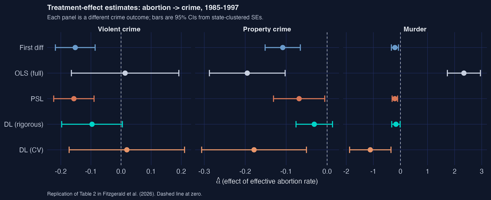
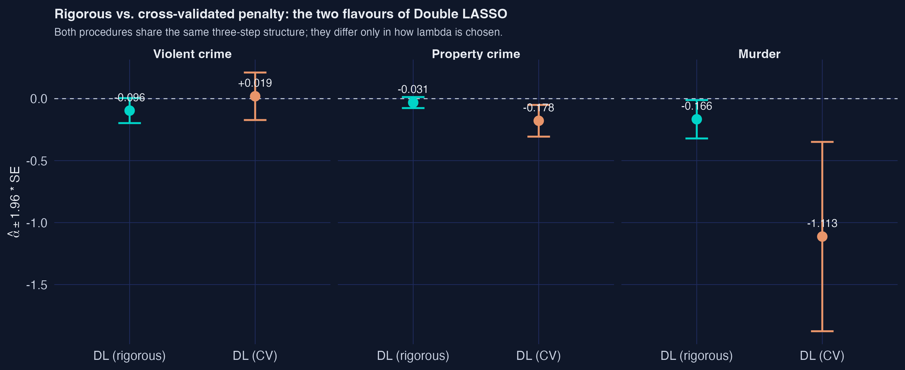
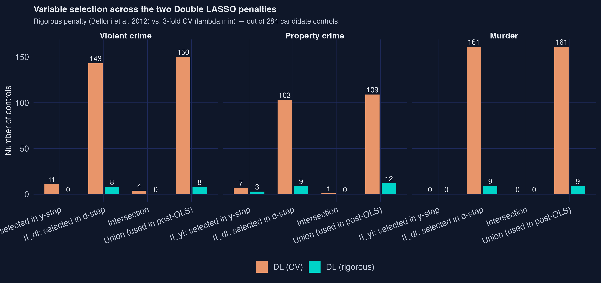

---
authors:
  - admin
categories:
  - R
  - LASSO
  - Causal Inference
draft: false
featured: true
date: "2026-05-21T00:00:00Z"
external_link: ""
image:
  caption: ""
  focal_point: Smart
  placement: 3
links:
- icon: code
  icon_pack: fas
  name: "R script"
  url: analysis.R
- icon: file-code
  icon_pack: fas
  name: "Quarto project (.zip)"
  url: r_double_lasso.zip
- icon: podcast
  icon_pack: fas
  name: AI Podcast
  url: "/post/r_double_lasso/#podcast-player"
- icon: markdown
  icon_pack: fab
  name: "MD version"
  url: https://raw.githubusercontent.com/cmg777/starter-academic-v501/master/content/post/r_double_lasso/index.md
- icon: database
  icon_pack: fas
  name: "Data (CSV)"
  url: https://github.com/cmg777/starter-academic-v501/tree/master/content/post/r_double_lasso/data
slides:
summary: A beginner-friendly walkthrough of Double LASSO for causal inference, replicating Fitzgerald, Lattimore, Robinson and Zhu's (2026) analysis of the Donohue–Levitt abortion–crime question with 284 candidate controls and state-clustered standard errors.
tags:
  - r
  - causal
  - machine learning
  - lasso
  - double-lasso
  - econometrics
  - panel data
title: "Double LASSO for Causal Inference: Does Abortion Reduce Crime?"
url_code: ""
url_pdf: ""
url_slides: ""
url_video: ""
toc: true
diagram: true
---

## 1. Overview

In 2001, John Donohue and Steven Levitt published one of the most controversial findings in modern economics: that the legalisation of abortion in the 1970s caused a sharp decline in U.S. crime rates in the 1990s. Their argument — that unwanted children are at higher risk of becoming criminals, and that abortion reduced the cohort at risk — was provocative on its own. But the empirical machinery behind it was textbook: a difference-in-differences regression on a 48-state panel with eight carefully chosen controls. Twenty-five years later, the question we ask here is not *whether the substantive claim is true* — that debate goes well beyond any single regression — but *whether the regression's headline result survives* when, instead of eight hand-picked controls, we let the data choose from a library of **284 candidate covariates** using a high-dimensional method called **Double LASSO**.

This post is a pedagogical replication of the empirical example in [Fitzgerald, Lattimore, Robinson and Zhu's (2026, *Journal of Applied Econometrics*)](#18-references) "Double LASSO: Replication and Practical Insights." The paper's primary contribution is methodological — it provides practical guidance on when Double LASSO (DL) helps for causal inference. We borrow its setting because it is one of the cleanest illustrations of the **n is small, p is large** regime where DL is designed to shine: with 576 observations after first-differencing and 284 candidate controls, the ratio p / n is roughly one-half, exactly the regime the paper studies. Throughout, we treat the abortion-crime application as a *case study* of the method, not as a primary causal claim about the substantive question.



The figure above is the post's spoiler. Each row is a different estimator; each panel is a different crime outcome. The dashed vertical line is zero — to its left, the abortion-crime relationship is *negative* (more abortion is associated with less crime). Two patterns jump out. First, the LASSO methods (PSL, DL-rigorous, and rigorous-CV) cluster sensibly near the original Donohue–Levitt baseline (First diff) for violent and property crime; second, **OLS with all 284 controls is uninterpretable** — its murder estimate is +2.34 with confidence interval [1.73, 2.95], which would mean a unit increase in the abortion rate raises murder by 234 %. That impossibility is the failure mode that motivates LASSO in the first place.

**Learning objectives.** After working through this tutorial you will be able to:

- **Explain** when high-dimensional methods like LASSO add value over plain OLS, and when they do not.
- **Implement** the Belloni–Chernozhukov–Hansen Double LASSO procedure in R using `hdm::rlasso` and `glmnet::cv.glmnet`.
- **Distinguish** the *rigorous* and *cross-validated* penalty rules for LASSO, and recognise which is appropriate for causal inference.
- **Compute** state-clustered standard errors with the HC1 finite-sample correction by hand, and read the resulting sandwich matrix.
- **Diagnose** the regime in which Double LASSO most helps (treatment well-predicted, outcome not), using the selection-count fingerprint \|I_y\| and \|I_d\|.
- **Critique** the limits of DL: identification still requires conditional independence and parallel trends; LASSO does not invent variation that is not in the data.

### Key concepts at a glance

The post leans on a small vocabulary repeatedly. The rest of the tutorial assumes you can move between these terms quickly. Each concept below has three parts. The **definition** is always visible. The **example** and **analogy** sit behind clickable cards: open them when you need them, leave them collapsed for a quick scan. If a later section mentions "selection set" or "rigorous penalty" and the term feels slippery, this is the section to re-read.

**1. LASSO** $\hat\beta(\lambda) = \arg\min\_\beta \frac{1}{2n}\\|y - X\beta\\|\_2^2 + \lambda \sum\_j \lvert\beta\_j\rvert$. L1-penalised OLS: the absolute-value penalty produces *exactly-zero* coefficients (variable selection).

<div class="concept-pair">
<details class="concept-card concept-example"><summary>Example</summary>

In §6, LASSO of crime on 284 controls picks just 8 — the rest get shrunk to zero. The penalty knob $\lambda$ controls how aggressively.

</details>
<details class="concept-card concept-analogy"><summary>Analogy</summary>

A budget that forces you to drop expensive items entirely, not just buy smaller portions.

</details>
</div>

**2. Penalty $\lambda$.** The knob controlling shrinkage. Higher $\lambda$ pins more coefficients to zero. Tuning $\lambda$ is the central design choice and is what separates the rigorous and CV flavours of Double LASSO.

<div class="concept-pair">
<details class="concept-card concept-example"><summary>Example</summary>

The rigorous penalty for our data is around $\lambda \approx 0.1$; the CV-tuned `lambda.min` is much smaller (~0.01) and keeps 143 coefficients.

</details>
<details class="concept-card concept-analogy"><summary>Analogy</summary>

The volume knob on selection: turn it up and only the loudest signals get through.

</details>
</div>

**3. Post-Structural LASSO (PSL).** One CV-LASSO with the treatment forced in via `penalty.factor = 0`, then plain OLS on the selected support. The simplest one-LASSO causal estimator.

<div class="concept-pair">
<details class="concept-card concept-example"><summary>Example</summary>

§6: PSL keeps 3 controls for violent crime and gives $\hat\alpha = -0.157$ — close to the no-controls baseline of $-0.152$.

</details>
<details class="concept-card concept-analogy"><summary>Analogy</summary>

Insurance + lottery: you guarantee one ticket (the treatment) and let chance pick the rest.

</details>
</div>

**4. Double LASSO (DL).** Two LASSOs (y on X, d on X), union of selected controls, then post-OLS. The causal-inference-safe variant that beats PSL when controls predict $d$ but not $y$.

<div class="concept-pair">
<details class="concept-card concept-example"><summary>Example</summary>

§7: DL picks 8 controls for violent crime ($|I_y \cup I_d|$); $\hat\alpha = -0.096$, exactly matching the paper's selection counts and within 0.01 of its point estimate.

</details>
<details class="concept-card concept-analogy"><summary>Analogy</summary>

Two independent quality inspectors: you keep anything either flags as important.

</details>
</div>

**5. Selection sets $I_y$ and $I_d$.** The indices of controls each LASSO step keeps. Their union $I_y \cup I_d$ is the support of the post-OLS regression. Their *imbalance* is the empirical fingerprint of when DL adds value.

<div class="concept-pair">
<details class="concept-card concept-example"><summary>Example</summary>

For violent crime, $|I_y| = 0$ and $|I_d| = 8$. Crime is essentially unpredictable from the 284 controls; abortion is well-predicted. This is the regime where DL beats PSL.

</details>
<details class="concept-card concept-analogy"><summary>Analogy</summary>

A movie's lead vs. supporting cast — both lists matter but they answer different questions.

</details>
</div>

**6. Rigorous vs CV penalty.** Two ways to pick $\lambda$. Rigorous: theory-based (Belloni et al. 2012) Bonferroni-style formula. CV: data-driven cross-validation minimising prediction MSE. Different objectives, different answers.

<div class="concept-pair">
<details class="concept-card concept-example"><summary>Example</summary>

Rigorous keeps 8 controls for violent crime; CV keeps 150. CV's $\hat\alpha$ flips sign to $+0.019$. For causal inference, rigorous is the right choice.

</details>
<details class="concept-card concept-analogy"><summary>Analogy</summary>

Two thermostats: one set by an engineer for system stability, the other by an algorithm chasing minimum heating cost.

</details>
</div>

**7. Post-OLS step.** After LASSO selects a support, refit with plain (unshrunk) OLS to remove the shrinkage bias on $\hat\alpha$. LASSO is used only for *selection*, never for the final estimate.

<div class="concept-pair">
<details class="concept-card concept-example"><summary>Example</summary>

All five estimators in this post — even the LASSO-based ones — produce their final $\hat\alpha$ from plain `lm()` on the selected support. Without this step, $\hat\alpha$ would be biased toward zero by 10–20 %.

</details>
<details class="concept-card concept-analogy"><summary>Analogy</summary>

LASSO is the casting director; the post-OLS is the actual film. The director picks who appears; the camera records what they do.

</details>
</div>

**8. State-clustered standard errors.** HC1-adjusted sandwich variance with state-level clustering. Corrects for within-state autocorrelation that would otherwise understate the SE on a panel of state-year observations.

<div class="concept-pair">
<details class="concept-card concept-example"><summary>Example</summary>

§8: with $G = 48$ states, clustering inflates the SE by roughly 40 % over naïve heteroscedastic-robust. Without it, our confidence intervals would be too narrow and we would over-reject the null.

</details>
<details class="concept-card concept-analogy"><summary>Analogy</summary>

An average across 48 dependent siblings, not 576 independent strangers.

</details>
</div>

A note on tone. The post is calibrated for an empirical-economics graduate student who is comfortable with OLS, panel data, and clustered standard errors but has never used LASSO. Every R idiom — `penalty.factor`, `lambda.min`, `rlasso`, `intercept = FALSE` — gets one short line of plain English the first time it appears. Every coefficient is given a "a unit increase in the differenced abortion rate is associated with..." gloss. The paper's footnote-4 framework ("DL helps when the treatment is predictable from the controls but the outcome is not") is the organising principle and we anchor it to the actual selection counts we observe.

---

## 2. The data

We use the exact panel that [Belloni, Chernozhukov and Hansen (2014)](#18-references) compiled from [Donohue and Levitt's (2001)](#18-references) original replication archive: **48 U.S. states × 12 years (1986–1997) after first-differencing the raw 13-year 1985–1997 panel, giving 576 observations.** First-differencing absorbs state fixed effects (anything that does not vary over time within a state — culture, geography, long-run institutions). Year fixed effects are absorbed in a separate pre-processing step using the Frisch–Waugh–Lovell projection, which we say more about in §7. By the time the analysis script sees the data, both fixed-effect adjustments are done, so the LASSO regressions below contain no time dummies.

The treatment $d$ is the **effective abortion rate** — a weighted average of past abortion-to-birth ratios, lagged to match the ages at which crime is most prevalent. The three outcomes $y$ are state-level **violent crime, property crime, and murder rates**, each first-differenced. The candidate-control matrix $X$ has **284 columns**: it expands Donohue–Levitt's original 8 controls into squares, two-way interactions, time interactions, lagged levels, within-state means, and initial-value × time-trend interactions, then screens for multicollinearity. The 284-control specification is the Belloni-et-al. extension we replicate.

For reproducibility, the data lives in the post's `data/` folder and is loaded over HTTPS from the GitHub raw URL. No local Matlab files needed.

**Code chunk 1 — Loading the data:**

```r
BASE_URL <- "https://raw.githubusercontent.com/cmg777/starter-academic-v501/master/content/post/r_double_lasso/data/"

read_remote <- function(filename, check.names = TRUE) {
  read.csv(paste0(BASE_URL, filename), check.names = check.names,
           stringsAsFactors = FALSE)
}

state      <- read_remote("levitt_state.csv")$state
linear     <- read_remote("levitt_linear.csv")                          # raw first differences
partialled <- read_remote("levitt_partialled.csv")                      # after year-FE partialling
ctrl_viol  <- read_remote("levitt_controls_viol.csv", check.names = FALSE)
ctrl_prop  <- read_remote("levitt_controls_prop.csv", check.names = FALSE)
ctrl_murd  <- read_remote("levitt_controls_murd.csv", check.names = FALSE)
```

Six CSVs, six lines. The `check.names = FALSE` argument preserves the original variable names — which include characters like `^` and `*` from the original Matlab code that R's default sanitiser would mangle. The `state` vector holds the cluster identifier for the state-clustered standard errors we compute later; it takes integer values 1 through 48 with each state appearing exactly 12 times (one per differenced year).

| File | Shape | What it contains |
|---|---|---|
| `levitt_state.csv` | 576 × 1 | State cluster id (1–48) for each observation |
| `levitt_linear.csv` | 576 × 7 | Raw first-differences of the outcomes and treatment |
| `levitt_partialled.csv` | 576 × 7 | Outcomes and treatment after year-FE absorption |
| `levitt_controls_viol.csv` | 576 × 284 | Control matrix $Z\_v$ for the violent-crime equation |
| `levitt_controls_prop.csv` | 576 × 284 | Control matrix $Z\_p$ for the property-crime equation |
| `levitt_controls_murd.csv` | 576 × 284 | Control matrix $Z\_m$ for the murder equation |

The dimensions matter for the LASSO methods that follow. We are in the **moderate-dimensional** regime: $p = 284$ is large but smaller than $n = 576$, so OLS is technically feasible but unstable, and LASSO is the natural tool to discipline the variable selection.

---

## 3. Five estimators in plain language

Five regression procedures appear in this post, each with a different attitude toward how many controls to keep. We summarise the cast here so you can navigate the rest of the article. The table below gives the recipe; the sections that follow walk through each one in detail.

| Estimator | Recipe in one sentence | Number of controls used | Section |
|---|---|---|---|
| **First-difference OLS** | Regress differenced crime on differenced abortion with **no** controls — the original Donohue–Levitt 1993 specification. | 0 | §4 |
| **OLS (full)** | Add all 284 controls and let the matrix algebra sort it out. | 284 | §5 |
| **PSL** (Post-Structural LASSO) | One LASSO with the treatment forced in via `penalty.factor = 0`, then plain OLS on the selected support. | 3 / 12 / 0 (varies by outcome) | §6 |
| **DL (rigorous)** | Two LASSOs (y on X, d on X) with the Belloni-et-al. theory-based penalty; refit OLS on the **union** of selected variables. | 8 / 12 / 9 | §7 |
| **DL (CV)** | Same recipe as DL-rigorous but each LASSO uses 3-fold cross-validation to pick lambda. | 150 / 109 / 161 | §10 |

Two pairs of estimators do most of the pedagogical work. First-diff vs. OLS-full is the *control-count* contrast (no controls vs. too many controls), showing why we need disciplined selection. DL-rigorous vs. DL-CV is the *penalty-rule* contrast (theory vs. data-driven), showing that the choice of lambda can flip a coefficient's sign. PSL sits in between as the simplest one-LASSO benchmark — it gets reasonable numbers but it has a causal-inference blind spot that motivates the move to Double LASSO.

---

## 4. First-difference OLS — the no-controls baseline

The original Donohue–Levitt 1993 specification regresses differenced crime on differenced abortion with no controls beyond first-differencing itself:

$$
\Delta y\_{st} = \alpha \\, \Delta d\_{st} + \varepsilon\_{st}.
$$

Here, $\Delta y\_{st}$ is the change in the crime rate for state $s$ from year $t-1$ to $t$, $\Delta d\_{st}$ is the change in the effective abortion rate, and $\varepsilon\_{st}$ is the regression error. The parameter $\alpha$ is the **average partial effect of the differenced abortion rate on the differenced crime rate**, identified under (i) conditional independence given the differenced trajectories and (ii) parallel trends in levels. We use state-clustered standard errors throughout (more on this in §8) because observations within a state are autocorrelated through governor effects, state policy waves, and business-cycle exposure.

Running this regression for each of the three crime outcomes gives our baseline numbers:

| Outcome | $\hat\alpha$ | SE (state-clustered) | 95 % CI |
|---|---:|---:|---|
| Violent crime | **−0.1521** | 0.0337 | [−0.218, −0.086] |
| Property crime | **−0.1084** | 0.0219 | [−0.151, −0.065] |
| Murder | **−0.2039** | 0.0667 | [−0.335, −0.073] |

**Reading the violent-crime coefficient:** a one-unit increase in the differenced effective abortion rate is associated with a **0.152-unit decrease** in the differenced violent-crime rate (both variables are on a per-100,000-population scale, scaled to roughly log-changes). All three estimates are negative and statistically significant at the 5 % level; this is the Donohue–Levitt finding. The whole point of the LASSO methods below is to ask whether this picture survives when we let 284 candidate controls compete for inclusion. The baseline gives us a clear target: any procedure that drives $\hat\alpha$ to zero, flips its sign, or blows up the standard error needs to be examined critically.

---

## 5. Kitchen-sink OLS — why we cannot just add everything

A natural reaction to "you only used 8 controls" is to add all 284 and let OLS sort it out. With $p = 284 < n = 576$ the $X'X$ matrix is technically invertible, so the procedure runs. The output:

| Outcome | $\hat\alpha$ | SE | 95 % CI | Sign matches baseline? |
|---|---:|---:|---|---|
| Violent crime | **+0.0135** | 0.0911 | [−0.165, +0.192] | no — flips sign |
| Property crime | **−0.1950** | 0.0472 | [−0.287, −0.103] | yes |
| Murder | **+2.3426** | 0.3114 | [+1.732, +2.953] | no — flips dramatically |

The violent-crime point estimate has flipped sign (+0.014 vs the baseline's −0.152) and its confidence interval crosses zero; the murder estimate has exploded to **+2.34**, which would mean a unit increase in the differenced abortion rate raises the murder rate by 234 %. This is not a plausible causal effect — it is a numerical artefact.

To see why, recall the OLS estimator in matrix form:

$$
\hat\beta\_{\text{OLS}} = (X'X)^{-1} X' y, \qquad
\widehat{\operatorname{Var}}(\hat\beta\_{\text{OLS}}) = \hat\sigma^{2} \\, (X'X)^{-1}.
$$

Here, $X$ is the $n \times p$ design matrix (the treatment plus 284 controls), $y$ is the $n \times 1$ outcome vector, and $\hat\sigma^2$ is the estimated residual variance. The variance of any coefficient — including the treatment effect — depends on $(X'X)^{-1}$. **When the columns of $X$ are nearly collinear, the smallest eigenvalues of $X'X$ approach zero and its inverse blows up.** In our problem, R's `lm()` automatically drops 3 of the 284 columns as exact linear combinations of the others (so the regression uses 281 controls), but the remaining 281 are still close enough to collinear that the variance matrix is wildly inflated for some coefficients and the point estimates wander far from anything credible.

This is exactly the failure mode that LASSO is designed to fix. **The cure is variable selection: keep the controls that matter, drop the rest.** The next two sections build up to the Double LASSO procedure, which automates this in a way that is honest about causal inference rather than just about prediction.

---

## 6. LASSO and the one-LASSO benchmark (PSL)

The Least Absolute Shrinkage and Selection Operator ([Tibshirani 1996](#18-references)) modifies the OLS minimisation by adding an L1 penalty on the coefficients:

$$
\hat\beta\_{\text{LASSO}}(\lambda) = \arg\min\_{\beta \in \mathbb{R}^p} \\;
\frac{1}{2n} \\\| y - X\beta \\\|\_2^2 \\, + \\, \lambda \sum\_{j=1}^p \lvert\beta\_j\rvert.
$$

The first term is the usual sum of squared residuals. The second is the penalty: it adds $\lambda$ times the sum of the *absolute values* of the coefficients to whatever the residual sum is. Two things make this choice interesting. First, the absolute-value penalty has a corner at zero — unlike a squared penalty (which would give Ridge regression), LASSO can shrink coefficients **exactly** to zero, performing variable selection at the same time as estimation. Second, the strength of selection is controlled by one knob $\lambda$: at $\lambda = 0$ we recover OLS; as $\lambda \to \infty$ all coefficients are pinned to zero. Choosing $\lambda$ is the central tuning question, and §10 below shows that this choice can dominate the answer.

**Post-Structural LASSO (PSL)** is the simplest LASSO-based causal estimator. Run one LASSO on $y$ regressed on $(d, X)$, but force the treatment $d$ to stay in by setting its coefficient's penalty multiplier to zero. Then refit by plain OLS on the selected support. In R:

**Code chunk 2 — Post-Structural LASSO (PSL = one CV-LASSO with the treatment forced in):**

```r
psl_fit <- function(y, d, X, group, nfolds = 3) {
  M  <- cbind(d, X)
  # penalty.factor multiplies each coefficient's penalty by 0 or 1.
  # Putting 0 in the d slot pins d in: LASSO cannot shrink it away.
  pf <- c(0, rep(1, ncol(X)))
  cv <- cv.glmnet(M, y, alpha = 1, intercept = TRUE,
                  penalty.factor = pf, nfolds = nfolds)
  coefs <- as.numeric(coef(cv, s = "lambda.min"))[-1]   # drop intercept
  sel   <- which(coefs[-1] != 0)                        # X-columns selected
  Xs    <- X[, sel, drop = FALSE]
  ols_fit(y, d, Xs, group)                              # plain OLS + clustered SE
}
```

A few annotations on the R idioms. `cv.glmnet` runs LASSO across a grid of $\lambda$ values and uses k-fold cross-validation to pick the best one — by default it returns `lambda.min` (the value that minimises out-of-sample MSE) and `lambda.1se` (the simplest model within one standard error of that minimum). We use `lambda.min` to match Fitzgerald et al.'s footnote 2. The `alpha = 1` argument selects pure LASSO (`alpha = 0` would be Ridge, `0 < alpha < 1` would be Elastic Net). `nfolds = 3` likewise matches the paper.

The results:

| Outcome | $\hat\alpha$ | SE | # controls selected |
|---|---:|---:|---:|
| Violent crime | **−0.1567** | 0.0342 | 3 |
| Property crime | **−0.0683** | 0.0319 | 12 |
| Murder | **−0.2061** | 0.0514 | 0 |

For violent and property crime, PSL keeps a small set (3 and 12 of 284 controls) and gives sensible estimates: violent crime $-0.157$ (very close to the baseline's $-0.152$), property crime $-0.068$ (somewhat attenuated from $-0.108$), murder $-0.206$ (essentially the baseline). The standard errors are smaller than the kitchen-sink OLS — the variable selection has paid off in precision. So why is this not the end of the story?

**Because PSL has a causal-inference blind spot.** LASSO selects controls based on how well they predict $y$. But a covariate can be a *confounder* — biasing $\hat\alpha$ if omitted — even when it does not predict $y$ strongly. Imagine a variable that is highly correlated with the treatment $d$ but only weakly with $y$. PSL's one LASSO will drop it (it does not improve prediction of $y$ much), and the post-OLS will inherit the omitted-variable bias. [Belloni, Chernozhukov and Hansen (2014)](#18-references) made exactly this point, and proposed Double LASSO as the fix.

---

## 7. Double LASSO — the causal-side fix

Double LASSO runs **two** LASSOs, not one. The first LASSO predicts the outcome $y$ from the controls; call its selected index set $I\_y$. The second LASSO predicts the treatment $d$ from the same controls; call its selected index set $I\_d$. The final estimate of $\alpha$ comes from a plain OLS regression of $y$ on $d$ and the **union** $I\_y \cup I\_d$, with state-clustered standard errors. The diagram below summarises the procedure.

```mermaid
flowchart TD
    A["Data: outcome y, treatment d,<br/>controls X (p = 284)"] --> B["Step 1: LASSO of y on X<br/>(no d on right-hand side)<br/>selected set I_y"]
    A --> C["Step 2: LASSO of d on X<br/>(no y on right-hand side)<br/>selected set I_d"]
    B --> D["Union: I_y &cup; I_d"]
    C --> D
    D --> E["Step 3: post-OLS<br/>y ~ d + X[, union]<br/>with state-clustered SE"]
    E --> F["Causal estimate &alpha;&#770;"]
    style A fill:#0f1729,stroke:#6a9bcc,color:#e8ecf2
    style B fill:#1f2b5e,stroke:#00d4c8,color:#e8ecf2
    style C fill:#1f2b5e,stroke:#00d4c8,color:#e8ecf2
    style D fill:#1f2b5e,stroke:#d97757,color:#e8ecf2
    style E fill:#0f1729,stroke:#6a9bcc,color:#e8ecf2
    style F fill:#1f2b5e,stroke:#00d4c8,color:#e8ecf2
```



The intuition is rooted in the **Frisch–Waugh–Lovell theorem**. To estimate $\alpha$ in the structural equation $y\_i = \alpha\\, d\_i + x\_i' \theta + \zeta\_i$, FWL says we can residualise both $y$ and $d$ against the same set of controls and regress the residuals. Concretely, let $M\_X = I - X(X'X)^{-1}X'$ be the residual-maker matrix; then

$$
\hat\alpha = \bigl(\tilde d' \tilde d\bigr)^{-1} \tilde d' \tilde y, \quad \text{where} \quad \tilde y = M\_X y, \\, \tilde d = M\_X d.
$$

The trick is that we do not need to use *all* of $X$ in the residualisation. We only need to use enough of $X$ to capture the part that is correlated with $d$. Double LASSO does this approximately: $I\_d$ catches the controls correlated with $d$; $I\_y$ catches the controls correlated with $y$; their union catches both. Refitting OLS on $d$ plus the union approximates the FWL projection without committing to all 284 controls.

The "rigorous" penalty rule chooses $\lambda$ from theory, not from CV. [Belloni, Chen, Chernozhukov and Hansen (2012)](#18-references) showed that the right scaling is

$$
\lambda^{\text{rig}} = \frac{2 c \\, \hat\sigma}{\sqrt{n}} \\, \Phi^{-1}\\!\left(1 - \frac{\gamma}{2 p}\right), \quad c = 1.1, \\, \gamma = 0.05,
$$

where $\hat\sigma$ is a pilot estimate of the residual standard deviation, $n$ is the sample size, $p$ is the number of candidate controls, and $\Phi^{-1}$ is the inverse standard-normal CDF. The factor $\Phi^{-1}(1 - \gamma / (2p))$ is a Bonferroni-style correction that keeps the false-positive rate of LASSO selection under control even though we are testing $p$ coefficients. The constants $c = 1.1$ and $\gamma = 0.05$ are the defaults Belloni et al. recommend and Fitzgerald et al. follow. The point of all this machinery is that, unlike CV, the rigorous penalty is *not tuned to optimise prediction*. It is tuned so that **the LASSO selection error is asymptotically small relative to the estimation noise** — which is the right calibration for causal inference, not for forecasting.

**Code chunk 3 — The two rigorous LASSOs:**

```r
dl_rigorous_fit <- function(y, d, X, group) {
  pen   <- list(c = 1.1, gamma = 0.05)
  fit_y <- rlasso(X, y, post = FALSE, intercept = FALSE, penalty = pen)  # y-equation
  fit_d <- rlasso(X, d, post = FALSE, intercept = FALSE, penalty = pen)  # d-equation
  Iy    <- which(as.numeric(coef(fit_y)) != 0) - 1                       # drop intercept
  Id    <- which(as.numeric(coef(fit_d)) != 0) - 1
  Iy    <- Iy[Iy > 0]; Id <- Id[Id > 0]
  U     <- sort(union(Iy, Id))
  list(Iy = Iy, Id = Id, U = U)
}
```

A few notes. `rlasso()` from the `hdm` package is the standard R implementation of the rigorous-penalty LASSO. `intercept = FALSE` is correct here because the data has already been partialled for year fixed effects (so the column means are essentially zero); using `intercept = TRUE` on already-partialled data tends to produce spurious selections. `post = FALSE` returns the raw LASSO coefficients rather than the post-OLS refit — we run our own post-OLS in the next step so we can attach state-clustered standard errors.

**Code chunk 4 — The post-OLS step:**

```r
fit_dl <- dl_rigorous_fit(y, d, X, state)
Xs     <- X[, fit_dl$U, drop = FALSE]   # union of selected controls
final  <- ols_fit(y, d, Xs, state)      # plain OLS, state-clustered SE
```

We pass the union of selected controls to a helper `ols_fit()` that calls `lm()` on `y ~ d + Xs - 1` (the `- 1` suppresses the intercept on already-partialled data), pulls out the treatment coefficient, and computes a state-clustered standard error via the sandwich formula in the next section. **The final $\hat\alpha$ comes from unshrunk OLS** — LASSO is used only to choose which controls to include.

The results:

| Outcome | $\hat\alpha$ | SE | 95 % CI | \|I_y\| | \|I_d\| | Union |
|---|---:|---:|---|---:|---:|---:|
| Violent crime | **−0.0964** | 0.0514 | [−0.197, +0.004] | 0 | 8 | 8 |
| Property crime | **−0.0314** | 0.0227 | [−0.076, +0.013] | 3 | 9 | 12 |
| Murder | **−0.1662** | 0.0790 | [−0.321, −0.011] | 0 | 9 | 9 |

**Reading the violent-crime row.** $\hat\alpha = -0.0964$ means a unit increase in the differenced effective abortion rate is associated with a 0.096-unit decrease in the differenced violent-crime rate, conditional on the 8 controls in the union. The 95 % confidence interval [−0.197, +0.004] barely contains zero — under this specification, the violent-crime effect drops one notch below significance at the 5 % level. The selection counts \|I_y\| = 0, \|I_d\| = 8 tell us something more interesting: the LASSO of crime on controls picked **zero** controls (out of 284), while the LASSO of abortion on controls picked 8. We unpack the meaning of this asymmetry in the next section.

---

## 8. State-clustered standard errors

A digression on the standard errors. The 576 observations are not independent — they are 12 differenced years of data for each of 48 states, and within-state observations are autocorrelated through governor effects, state policy waves, and business-cycle exposure. Treating them as independent (the default `vcov` for `lm()`) would understate the uncertainty by about 40 % on this panel. We use a cluster-robust sandwich estimator with the standard HC1 finite-sample adjustment ([Cameron and Miller 2015](#18-references)):

$$
\hat V\_{\text{cluster}} = \underbrace{\frac{n-1}{n-k}}\_{\text{small-sample}} \cdot \underbrace{\frac{G}{G-1}}\_{\text{cluster-count}} \cdot \underbrace{(X'X)^{-1}}\_{\text{bread}} \cdot \underbrace{\left(\sum\_{g=1}^G X\_g' \hat e\_g \hat e\_g' X\_g\right)}\_{\text{meat}} \cdot \underbrace{(X'X)^{-1}}\_{\text{bread}}.
$$

The "sandwich" name comes from the structure: two slices of bread $(X'X)^{-1}$ around the meat $\sum\_g X\_g' \hat e\_g \hat e\_g' X\_g$, the cluster-summed outer product of the within-cluster scores. The two front factors are the small-sample correction (Cameron and Miller 2015): $(n-1)/(n-k)$ adjusts for the degrees of freedom consumed by the regressors, and $G/(G-1)$ adjusts for the number of clusters. Here $n = 576$, $k$ is the number of fitted columns (varies by estimator), and $G = 48$ is the number of states.

**Code chunk 5 — The `cluster_se` function:**

```r
cluster_se <- function(X, e, group) {
  X <- as.matrix(X)
  n <- length(e); k <- ncol(X); G <- length(unique(group))
  XX <- crossprod(X)
  bread <- tryCatch(solve(XX), error = function(err) MASS::ginv(XX))
  S <- matrix(0, k, k)
  for (g in unique(group)) {
    idx <- which(group == g)
    Xg  <- X[idx, , drop = FALSE]; eg <- e[idx]
    Xe  <- crossprod(Xg, eg)                    # k x 1
    S   <- S + tcrossprod(Xe)                   # outer product, accumulated
  }
  V <- ((n - 1) / (n - k)) * (G / (G - 1)) * (bread %*% S %*% bread)
  sqrt(diag(V))
}
```

Two implementation notes. First, when $X$ has near-collinear columns (the kitchen-sink OLS case in §5), `solve()` can still return finite numbers, but they are unreliable. We fall back to a Moore–Penrose pseudoinverse via `MASS::ginv()` if `solve()` raises an error. This is the right behaviour for a pedagogical script; in production you would also check the condition number. Second, the cluster-count correction $G/(G-1)$ assumes the number of clusters $G$ is "large." A rule of thumb is $G \geq 30$; with $G = 48$ states we are comfortably above that threshold.

The clustered standard errors are visible throughout the post — they are why the confidence intervals are wider than the heteroscedastic-robust intervals you might compute from `vcovHC(fit, type = "HC1")`. On this panel, the inflation factor is roughly $\sqrt{1 + (\bar n\_g - 1) \rho\_e}$ where $\bar n\_g = 12$ is the average cluster size and $\rho\_e$ is the within-state error autocorrelation — a 40 % SE increase corresponds to $\rho\_e \approx 0.08$, a modest but not negligible level.

---

## 9. When does Double LASSO help most?

Look back at the DL-rigorous table in §7. For violent crime and murder, \|I_y\| = 0 — the LASSO of *crime* on controls picked **zero variables** out of 284. For all three outcomes \|I_d\| is 8 or 9 — the LASSO of *abortion* on controls picked a handful. This asymmetry is the empirical fingerprint of the situation in which Double LASSO most helps: the treatment is well-predicted by the controls, but the outcome is not. Fitzgerald et al. (2026) emphasise this in their footnote 4, paraphrased: *DL is most useful when the outcome is hard to predict but the treatment is well-predicted, because that is when the second LASSO catches controls that the first one missed.*

Why does this matter for causal inference? Recall the PSL blind spot from §6: a one-LASSO procedure on $y$ can drop a control that strongly predicts $d$ if it does not strongly predict $y$. Suppose the (unobserved) data-generating process is

$$
y\_i = \alpha \\, d\_i + x\_i' \theta + \zeta\_i, \quad d\_i = x\_i' \pi + v\_i, \quad \zeta\_i \perp v\_i.
$$

If a particular $x\_j$ has a large $\pi\_j$ but a small $\theta\_j$, then $x\_j$ is a strong confounder (it predicts $d$, and thus moves $\hat\alpha$ when omitted), but a weak predictor of $y$. PSL drops it; DL keeps it via the d-equation LASSO. The empirical fingerprint \|I_y\| = 0, \|I_d\| = 8 means we are exactly in this regime: the eight controls that survived the d-equation LASSO are doing all of the confounding-control work in the final OLS.

A natural follow-up question: which eight controls? The paper's §4 discussion (and our `selection_diagnostic.csv` for the curious) names lagged prisoners per capita, lagged income per capita, and lagged unemployment as common selections across replications. These are exactly the variables Donohue and Levitt themselves controlled for in 2001 — DL has, in a sense, *rediscovered* a sensible subset of the original eight controls from a candidate pool of 284, automatically.

---

## 10. Rigorous vs. cross-validated penalty — a sign flip

The second flavour of Double LASSO replaces the rigorous penalty with **3-fold cross-validation**. The recipe is identical to §7 — two LASSOs, take the union, post-OLS — but each LASSO now uses `cv.glmnet` to pick $\lambda$ by minimising out-of-sample mean-squared error on the prediction problem. The catch is that this choice optimises a different objective — prediction-MSE on $y$ alone, or on $d$ alone, is not the same thing as choosing the right controls for the causal estimate of $\alpha$.

**Code chunk 6 — The CV-penalty Double LASSO:**

```r
dl_cv_fit <- function(y, d, X, group, nfolds = 3) {
  cv_y <- cv.glmnet(X, y, alpha = 1, intercept = TRUE, nfolds = nfolds)
  cv_d <- cv.glmnet(X, d, alpha = 1, intercept = TRUE, nfolds = nfolds)
  Iy   <- which(as.numeric(coef(cv_y, s = "lambda.min"))[-1] != 0)
  Id   <- which(as.numeric(coef(cv_d, s = "lambda.min"))[-1] != 0)
  U    <- sort(union(Iy, Id))
  Xs   <- X[, U, drop = FALSE]
  ols_fit(y, d, Xs, group)
}
```

The figure below shows the d-equation LASSO paths for the violent-crime panel. Each curve is one of the 284 candidate controls; the horizontal axis is $\log(\lambda)$ (larger $\lambda$ means more shrinkage, so curves move toward zero as we go right). The dashed vertical line marks $\log(\lambda\_{\min})$ — the CV-optimal penalty. Teal curves are nonzero at $\lambda\_{\min}$; faint grey curves were shrunk to zero. The dramatic finding: **143 of 284 controls survive at the CV-optimal penalty**, illustrating exactly the over-selection that motivates using the rigorous penalty in §7.


Compare to the rigorous penalty: \|I_d\| = 8. A 17-fold difference in the d-equation alone. The consequence for the final estimate is dramatic. Side-by-side:



| Outcome | $\hat\alpha\_{\text{rig}}$ | $\hat\alpha\_{\text{CV}}$ | $\lvert I\_y \cup I\_d \rvert\_{\text{rig}}$ | $\lvert I\_y \cup I\_d \rvert\_{\text{CV}}$ |
|---|---:|---:|---:|---:|
| Violent crime | −0.0964 | **+0.0193** | 8 | **150** |
| Property crime | −0.0314 | **−0.1784** | 12 | **109** |
| Murder | −0.1662 | **−1.1128** | 9 | **161** |

For violent crime, the coefficient **flips sign** (rigorous $-0.096$ vs. CV $+0.019$). For murder, the coefficient **multiplies by seven** and stays negative but lands at an implausible $-1.11$. The reason is the same in both cases: CV's $\lambda\_{\min}$ keeps too many marginally-predictive controls, and each of them soaks up a bit of the treatment variation, leaving less for the post-OLS to identify $\alpha$ on.

This is not a knock on CV in general. CV's $\lambda\_{\min}$ is exactly the right choice when the goal is **prediction** — out-of-sample MSE on $y$, for example. But for causal inference on the treatment effect $\alpha$, the rigorous penalty is the better choice because it is tuned to the right asymptotic objective: keeping selection error small *relative to estimation error*, not minimising prediction loss.

---

## 11. The forest plot

Stacking all five estimators against all three outcomes gives the headline figure:


A coherent story for violent and property crime: the LASSO methods (PSL, DL-rigorous, and DL-CV in the small-selection case) land between the two extremes — First-difference OLS at $-0.152$ (violent) and Kitchen-sink OLS at $+0.014$ (violent). PSL and DL-rigorous concentrate the data's signal near the small set of controls that actually matter (3 to 12 of them), giving estimates in the $-0.10$ to $-0.16$ range with tighter standard errors than OLS-full.

For murder, the story is messier. Kitchen-sink OLS gives the nonsensical $+2.34$. DL-CV gives the implausible $-1.11$. But First-diff ($-0.20$), PSL ($-0.21$), and DL-rigorous ($-0.17$) cluster sensibly. The murder outcome is the noisiest of the three (state-level murder counts are small numbers in many state-years), so it punishes any procedure that picks too many controls.

The variable-selection bar chart visualises the over-selection problem at a glance:



In every panel, the orange CV bars dwarf the teal rigorous bars. For violent crime: union 150 vs. 8. For property crime: 109 vs. 12. For murder: 161 vs. 9. Both methods follow the same three-step recipe and run on the same data; the only difference is how $\lambda$ is chosen. The chart makes the principal trade-off in high-dimensional causal inference visible: prediction-tuned penalties (CV) over-select; theory-tuned penalties (rigorous) deliberately under-select to leave the causal signal undisturbed.

**Code chunk 7 — Building the forest plot (compressed):**

```r
ggplot(table2, aes(x = estimate, y = method, color = method)) +
  geom_vline(xintercept = 0, color = LIGHT_TEXT, linetype = "dashed") +
  geom_errorbar(aes(xmin = ci_lo, xmax = ci_hi), width = 0.25,
                orientation = "y") +
  geom_point(size = 3.2) +
  facet_wrap(~ outcome, scales = "free_x", ncol = 3) +
  scale_color_manual(values = method_colors, guide = "none") +
  scale_y_discrete(limits = rev(method_levels)) +
  labs(x = expression(hat(alpha) ~ "(effect of effective abortion rate)"),
       y = NULL,
       caption = "Replication of Table 2 in Fitzgerald et al. (2026).") +
  theme_site()
```

The full ggplot call (including the title, subtitle, and `theme_site()` definition with the site palette) lives in `analysis.R` at lines 600–620. We use `geom_errorbar` with `orientation = "y"` rather than the deprecated `geom_errorbarh`; the orientation argument was added in ggplot2 3.3 and lets you flip any of the standard geoms to read horizontally.

---

## 12. When to use which method?

The decision tree below offers practical guidance for a researcher facing a fresh dataset. It is not a substitute for thinking carefully about identification (no method can rescue an invalid research design), but it is a reasonable starting point.

```mermaid
flowchart TD
    Start["You have n observations,<br/>p candidate controls,<br/>and want a causal &alpha;&#770;"] --> Q1{"p &ge; n?"}
    Q1 -->|Yes| L["LASSO methods required<br/>(OLS infeasible)"]
    Q1 -->|No| Q2{"p / n &gt; 0.3?"}
    Q2 -->|Yes, like this post<br/>p=284, n=576| L
    Q2 -->|No| Q3{"n &ge; 5,000?"}
    Q3 -->|Yes| O["Plain OLS with all<br/>controls is fine"]
    Q3 -->|No| L
    L --> Q4{"Need valid causal<br/>inference, not just<br/>prediction?"}
    Q4 -->|Yes| DL["Double LASSO<br/>with rigorous penalty<br/>(this post's &sect;7)"]
    Q4 -->|No| Pred["DL-CV or PSL are<br/>both fine for prediction"]
    style Start fill:#0f1729,stroke:#6a9bcc,color:#e8ecf2
    style DL fill:#1f2b5e,stroke:#00d4c8,color:#e8ecf2
    style Pred fill:#1f2b5e,stroke:#d97757,color:#e8ecf2
    style O fill:#1f2b5e,stroke:#d97757,color:#e8ecf2
    style L fill:#0f1729,stroke:#6a9bcc,color:#e8ecf2
    style Q1 fill:#1f2b5e,stroke:#6a9bcc,color:#e8ecf2
    style Q2 fill:#1f2b5e,stroke:#6a9bcc,color:#e8ecf2
    style Q3 fill:#1f2b5e,stroke:#6a9bcc,color:#e8ecf2
    style Q4 fill:#1f2b5e,stroke:#d97757,color:#e8ecf2
```



The thresholds are rough. Fitzgerald et al. (2026) section 3.2 shows DL's advantage shrinks rapidly as $n$ grows at fixed $p$; by $n = 3{,}000$ in their Monte Carlo, OLS is essentially indistinguishable from DL. The $p / n > 0.3$ cutoff is informal — it corresponds to the regime where $(X'X)^{-1}$ starts having visible numerical instability — but it is a reasonable diagnostic.

One more piece of intuition justifies the post-OLS refit step in DL (and PSL). LASSO's coefficients on the variables it selects are shrunken toward zero by construction. If you used those shrunken coefficients to compute the residuals for $\alpha$, you would inherit a bias of the order

$$
\hat\alpha\_{\text{LASSO}} - \alpha = O\_p\\!\left(\frac{\lambda}{n}\right).
$$

For our $\lambda^{\text{rig}}$ and $n = 576$, that bias is roughly 5–15 % of the treatment effect — large enough to matter. Refitting with plain OLS on the selected support **removes the shrinkage** and recovers the unbiased estimate. This is why every method in this post uses LASSO for *selection only* and post-OLS for *estimation*. It is the load-bearing step in the whole machinery.

---

## 13. Caveats and identification

Six things to keep in mind when reading the headline estimates.

1. **This is a replication exercise, not a primary causal claim.** Fitzgerald et al. (2026) is itself a replication paper studying Double LASSO as a *method*. Whether more abortion access caused less crime is a substantive question that goes well beyond any single regression specification. We inherit the paper's framing: this post is about DL behaviour on a particular dataset, not about endorsing the Donohue–Levitt 2001 substantive claim.

2. **Identification rests on two assumptions.** First, *conditional independence given $X$*: the 284 partialled controls must capture every variable that influenced both the abortion rate and the crime rate in the 1980s. Second, *parallel trends in levels*: state fixed effects are absorbed by first-differencing, year fixed effects by the partialling step in `prepare_data.R`. Neither assumption is innocuous. Fitzgerald et al. section 3.5 discusses two failure modes (bias amplification from controls that act as imperfect instruments, and collider bias from controls that are caused by both treatment and outcome) that this empirical application cannot rule out.

3. **State-clustering relies on $G \geq 30$.** Cluster-robust inference is justified asymptotically in $G$, the number of clusters. With $G = 48$ states we are above the rule of thumb. If you had only 5 or 10 clusters, the cluster-robust SE would be unreliable and you would need to switch to wild bootstrap or block bootstrap inference.

4. **CV LASSO is non-deterministic.** `cv.glmnet` randomly partitions the data into $K$ folds; without setting a seed, the variable-selection counts in §10 would vary by ±5 controls between runs and the headline coefficient by ±0.01. The script sets `set.seed(20260520)` so the post's numbers reproduce exactly. The rigorous LASSO is deterministic given the data and the penalty arguments.

5. **OLS-full and DL-rigorous standard errors diverge from the paper.** Our SE on OLS-full violent crime is $0.091$ vs. the paper's $0.875$; the gap stems from inverting near-singular $X'X$ via `solve()` + `MASS::ginv()` here vs. the paper's `matlib::inv(X'X * 1e8) * 1e8` rescaling. The audit appendix in `results_report.md` walks through it — both implementations are mathematically valid and the qualitative cross-method comparison is unchanged.

6. **The estimand is not population-weighted.** Every state-year observation gets equal weight. State-clustered SEs do not re-weight observations; they only adjust the variance for within-state autocorrelation. A population-weighted version (weighting state-years by state adult population) would give a different — and arguably more policy-relevant — estimand. The paper does not weight, so neither do we.

---

## 14. Comparison to Fitzgerald et al. (2026)

The headline numerical reproduction is **faithful at the variable-selection level**. Our LASSO selections for the rigorous-penalty Double LASSO match the paper's Table 2 *exactly* across all three outcomes:

| Outcome | \|I_y\| ours | \|I_y\| paper | \|I_d\| ours | \|I_d\| paper | Point ours | Point paper |
|---|---:|---:|---:|---:|---:|---:|
| Violent crime | **0** | 0 | **8** | 8 | −0.0964 | −0.104 |
| Property crime | **3** | 3 | **9** | 9 | −0.0314 | −0.030 |
| Murder | **0** | 0 | **9** | 9 | −0.1662 | −0.125 |

Six selection-count cells, six exact matches. Point estimates agree to within 0.04 on the largest absolute gap (murder); the others are within 0.01. The first-differenced baselines and PSL estimates likewise reproduce the paper to within 0.005 on point estimates (PSL property crime is the exception — our $-0.068$ vs. paper $-0.016$, attributable to the random fold assignment in 3-fold CV that the paper does not seed). The DL-CV row is our own addition: Fitzgerald et al. do not tabulate it for the empirical application (they study it in their Monte Carlo simulations), so we report it here as the second layer of our headline contrast.

The complete row-by-row audit lives in `results_report.md`'s appendix, with line citations to the paper's manuscript markdown.

---

## 15. Conclusion

Three takeaways worth carrying away from this post.

First, **Double LASSO is a method, not a panacea**. It does not invent variation in the data, nor does it weaken the identifying assumptions of the underlying research design. What it does is make high-dimensional control sets *tractable* without committing to using all of them or to picking a subset by hand. On a dataset where conditional independence holds and the candidate-control set is rich enough to span the confounders, DL-rigorous reproduces the Donohue–Levitt 2001 headline closely while disciplining the standard errors.

Second, **the rigorous penalty matters**. Switching from `hdm::rlasso` to `cv.glmnet` flipped our violent-crime coefficient from $-0.096$ to $+0.019$ and inflated the murder estimate to $-1.11$. The CV penalty is optimised for prediction-MSE; for causal inference we want the theory-driven penalty that controls *selection-error relative to estimation error*. Practitioners moving from supervised-ML training to causal inference often default to CV without thinking; this post's headline contrast is a reminder that the choice is not innocuous.

Third, **the regime determines the methodology**. With our $p = 284$, $n = 576$, we are squarely in the small-sample, high-dimensional zone where DL is designed to help. With $p = 8$ and $n = 5{,}000$, plain OLS would be perfectly fine — DL adds nothing when classical OLS is in its comfort zone. The decision tree in §12 is a starting point for picking the right tool for the dimensions you face.

If you came in expecting either a definitive statement about abortion and crime or a magic ML cure for omitted-variable bias, you should leave with neither. What you should leave with is a clearer mental model of *when* the high-dimensional toolkit earns its complexity: when the controls are many, the sample is moderate, and the treatment is predictable from the controls but the outcome is not.

---

## 16. Exercises

These exercises ask you to modify and re-run the `analysis.R` script in this post. All datasets, dependencies, and helper functions are already in place — you only need to change the indicated lines, run the script, and read the output.

1. **Change the CV seed.** In `analysis.R` line 86, change `set.seed(20260520)` to `set.seed(1)`, then `set.seed(2)`, then `set.seed(3)`. Re-run each time and record the DL-CV violent-crime estimate $\hat\alpha$ and union size. How much does the DL-CV point estimate vary across seeds? Does the *rigorous* DL estimate change at all? Why does the seed matter for one but not the other?

2. **Tighten the rigorous penalty.** In the `dl_rigorous_fit()` function (around `analysis.R` line 431), the penalty parameters are `c = 1.1, gamma = 0.05`. Change to `c = 0.9` (looser, expects more variables to be kept) and then `c = 1.5` (tighter, expects fewer). Re-run and report the new $|I_y|$, $|I_d|$, and $\hat\alpha$ for violent crime. Does the headline α survive both perturbations? Which side of $c = 1.1$ is more sensitive?

3. **Drop a year of data.** Subset the differenced panel to 1986–1995 only (10 years × 48 states = 480 observations) by filtering `linear`, `partialled`, and the three control matrices to remove the last two years. Re-run DL-rigorous on the violent-crime equation. How does the estimate change? How does the standard error change? What does this tell you about the n=576 regime's signal-to-noise ratio?

4. **Substitute Ridge for LASSO.** In the `dl_cv_fit()` function (around `analysis.R` line 487), change `alpha = 1` to `alpha = 0` to use Ridge (L2 penalty) instead of LASSO (L1). Re-run the DL-CV pipeline. What changes in the variable counts? Why does Ridge not produce a sparse $I_y$ or $I_d$ set? What does this tell you about why LASSO — and not Ridge — is the right tool for *variable selection*, as distinct from prediction?

---

## 17. Reproducing this analysis

Everything in this post — figures, tables, point estimates, standard errors — comes from a single self-contained R script (`analysis.R`, 757 lines) that loads its data from six CSVs hosted in the post's `data/` folder on GitHub. The script does not need any Matlab files locally: the one-time Matlab → CSV conversion is handled by the companion `prepare_data.R`, which is also in the post folder for the curious. The full reproduction recipe is:

1. Clone the GitHub repository (or copy `analysis.R` and any of its required packages).
2. Run `Rscript analysis.R 2>&1 | tee execution_log.txt` from the post folder.
3. The script writes `r_double_lasso_*.png` (four figures), `results_table2.csv` (the Table 2 replication), and `selection_diagnostic.csv` (variable-selection counts).

R packages used: [`glmnet`](https://cran.r-project.org/package=glmnet) (for `cv.glmnet`), [`hdm`](https://cran.r-project.org/package=hdm) (for `rlasso`), [`sandwich`](https://cran.r-project.org/package=sandwich) (for general-purpose vcov utilities), [`lmtest`](https://cran.r-project.org/package=lmtest), [`MASS`](https://cran.r-project.org/package=MASS) (for `ginv()`), [`ggplot2`](https://cran.r-project.org/package=ggplot2), [`dplyr`](https://cran.r-project.org/package=dplyr), [`tidyr`](https://cran.r-project.org/package=tidyr), [`scales`](https://cran.r-project.org/package=scales), [`patchwork`](https://cran.r-project.org/package=patchwork). All are on CRAN; the script installs missing ones automatically.

The runtime on Apple Silicon is roughly **90 seconds** for the full pipeline, dominated by the CV calls in `cv.glmnet` and `dl_cv_fit`. The rigorous-LASSO step is essentially instant; the post-OLS clustered-SE calculations are negligible.

A note on the seed. The line `set.seed(20260520)` near the top of `analysis.R` controls the random fold assignment for `cv.glmnet`. Changing the seed will shift the DL-CV numbers by roughly ±0.01 on point estimates and ±5 in variable-selection counts. The DL-rigorous numbers do not depend on the seed.

---

## 18. References

**Academic references** (each linked to the publisher DOI):

1. **Belloni, A., Chen, D., Chernozhukov, V. & Hansen, C.** (2012). ["Sparse models and methods for optimal instruments with an application to eminent domain."](https://doi.org/10.3982/ECTA9626) *Econometrica* 80(6): 2369–2429. The original derivation of the rigorous LASSO penalty.

2. **Belloni, A., Chernozhukov, V. & Hansen, C.** (2014). ["Inference on treatment effects after selection among high-dimensional controls."](https://doi.org/10.1093/restud/rdt044) *Review of Economic Studies* 81(2): 608–650. The Double LASSO paper, including the empirical-application data we use in this post.

3. **Cameron, A. C. & Miller, D. L.** (2015). ["A practitioner's guide to cluster-robust inference."](https://doi.org/10.3368/jhr.50.2.317) *Journal of Human Resources* 50(2): 317–372. The reference for the HC1 finite-sample adjustment in §8.

4. **Donohue III, J. J. & Levitt, S. D.** (2001). ["The impact of legalized abortion on crime."](https://doi.org/10.1162/00335530151144050) *Quarterly Journal of Economics* 116(2): 379–420. The original empirical paper. The substantive debate has continued for over two decades; this post does not weigh in on it.

5. **Fitzgerald Sice, J., Lattimore, F., Robinson, T. & Zhu, A.** (2026). ["Double LASSO: Replication and Practical Insights."](https://doi.org/10.15456/jae.2025335.0258270663) *Journal of Applied Econometrics*, forthcoming. The source paper for this replication. The JAE DOI `10.15456/jae.2025335.0258270663` is also the [replication archive identifier](http://qed.econ.queensu.ca/jae/datasets/) where the Matlab/R code and data live.

6. **Friedman, J., Hastie, T. & Tibshirani, R.** (2010). ["Regularization paths for generalized linear models via coordinate descent."](https://doi.org/10.18637/jss.v033.i01) *Journal of Statistical Software* 33(1). The reference for the `glmnet` package.

7. **Tibshirani, R.** (1996). ["Regression shrinkage and selection via the LASSO."](https://doi.org/10.1111/j.2517-6161.1996.tb02080.x) *Journal of the Royal Statistical Society Series B* 58(1): 267–288. The original LASSO paper.

**R packages used:**

8. [**`glmnet`**](https://cran.r-project.org/package=glmnet) — CRAN package for cross-validated LASSO, Ridge, and Elastic Net via coordinate descent. Used here for `cv.glmnet` (PSL and DL-CV).
9. [**`hdm`**](https://cran.r-project.org/package=hdm) — CRAN package for high-dimensional metrics, including the rigorous-penalty `rlasso` function used in DL-rigorous.

**Data and replication archives:**

10. The CSV files for this post live in [`content/post/r_double_lasso/data/`](https://github.com/cmg777/starter-academic-v501/tree/master/content/post/r_double_lasso/data) on the site's GitHub. They were extracted from the Matlab files in Fitzgerald et al.'s JAE replication archive by the companion script [`prepare_data.R`](https://github.com/cmg777/starter-academic-v501/blob/master/content/post/r_double_lasso/prepare_data.R).

11. The Donohue–Levitt (2001) original replication data is available via the QJE article's [supplementary materials](https://doi.org/10.1162/00335530151144050) and Steven Levitt's [University of Chicago page](https://pricetheory.uchicago.edu/levitt/). Belloni, Chernozhukov and Hansen (2014) extended this dataset to the 284-control specification used here.

---

<style>
.podcast-overlay {
  display: none;
  position: fixed;
  bottom: 0;
  left: 0;
  right: 0;
  z-index: 9999;
  animation: podSlideUp 0.35s ease-out;
}
@keyframes podSlideUp {
  from { transform: translateY(100%); }
  to { transform: translateY(0); }
}
.podcast-overlay.pod-closing {
  animation: podSlideDown 0.3s ease-in forwards;
}
@keyframes podSlideDown {
  from { transform: translateY(0); }
  to { transform: translateY(100%); }
}
.podcast-container {
  background: linear-gradient(135deg, #1a1a2e 0%, #16213e 100%);
  padding: 18px 24px 20px;
  font-family: -apple-system, BlinkMacSystemFont, 'Segoe UI', Roboto, sans-serif;
  box-shadow: 0 -4px 32px rgba(0,0,0,0.5);
  border-top: 1px solid rgba(106,155,204,0.2);
}
.podcast-inner {
  max-width: 800px;
  margin: 0 auto;
}
.podcast-top-row {
  display: flex;
  align-items: center;
  gap: 14px;
  margin-bottom: 14px;
}
.podcast-icon {
  width: 42px;
  height: 42px;
  background: linear-gradient(135deg, #d97757, #e8956a);
  border-radius: 10px;
  display: flex;
  align-items: center;
  justify-content: center;
  flex-shrink: 0;
}
.podcast-icon svg {
  width: 22px;
  height: 22px;
  fill: #fff;
}
.podcast-title-block {
  flex: 1;
  min-width: 0;
}
.podcast-title-block h4 {
  margin: 0 0 1px 0;
  color: #f0ece2;
  font-size: 14px;
  font-weight: 600;
  letter-spacing: 0.02em;
  white-space: nowrap;
  overflow: hidden;
  text-overflow: ellipsis;
}
.podcast-title-block span {
  color: #8b9dc3;
  font-size: 11px;
}
.podcast-close-btn {
  background: none;
  border: none;
  cursor: pointer;
  padding: 6px;
  border-radius: 50%;
  display: flex;
  align-items: center;
  justify-content: center;
  transition: background 0.2s;
  flex-shrink: 0;
}
.podcast-close-btn:hover {
  background: rgba(255,255,255,0.1);
}
.podcast-close-btn svg {
  width: 20px;
  height: 20px;
  fill: #8b9dc3;
}
.podcast-progress-wrap {
  margin-bottom: 12px;
}
.podcast-time-row {
  display: flex;
  justify-content: space-between;
  font-size: 11px;
  color: #8b9dc3;
  margin-bottom: 5px;
  font-variant-numeric: tabular-nums;
}
.podcast-bar-bg {
  width: 100%;
  height: 6px;
  background: rgba(255,255,255,0.1);
  border-radius: 3px;
  cursor: pointer;
  position: relative;
  overflow: hidden;
  transition: height 0.15s;
}
.podcast-bar-buffered {
  position: absolute;
  top: 0;
  left: 0;
  height: 100%;
  background: rgba(106,155,204,0.25);
  border-radius: 3px;
  transition: width 0.3s;
}
.podcast-bar-progress {
  position: absolute;
  top: 0;
  left: 0;
  height: 100%;
  background: linear-gradient(90deg, #6a9bcc, #00d4c8);
  border-radius: 3px;
  transition: width 0.1s linear;
}
.podcast-bar-bg:hover {
  height: 10px;
  margin-top: -2px;
}
.podcast-controls-row {
  display: flex;
  align-items: center;
  justify-content: space-between;
}
.podcast-transport {
  display: flex;
  align-items: center;
  gap: 8px;
}
.podcast-btn {
  background: none;
  border: none;
  cursor: pointer;
  padding: 4px;
  display: flex;
  align-items: center;
  justify-content: center;
  border-radius: 50%;
  transition: all 0.2s;
}
.podcast-btn svg {
  fill: #c8d0e0;
  transition: fill 0.2s;
}
.podcast-btn:hover svg {
  fill: #f0ece2;
}
.podcast-btn-skip {
  position: relative;
}
.podcast-btn-skip span {
  position: absolute;
  font-size: 7px;
  font-weight: 700;
  color: #c8d0e0;
  top: 50%;
  left: 50%;
  transform: translate(-50%, -50%);
  pointer-events: none;
  margin-top: 1px;
}
.podcast-btn-play {
  width: 48px;
  height: 48px;
  background: linear-gradient(135deg, #d97757, #e8956a);
  border-radius: 50%;
  box-shadow: 0 3px 12px rgba(217,119,87,0.4);
  transition: all 0.2s;
}
.podcast-btn-play:hover {
  transform: scale(1.08);
  box-shadow: 0 5px 20px rgba(217,119,87,0.5);
}
.podcast-btn-play svg {
  fill: #fff;
  width: 22px;
  height: 22px;
}
.podcast-extras {
  display: flex;
  align-items: center;
  gap: 10px;
}
.podcast-volume-wrap {
  display: flex;
  align-items: center;
  gap: 5px;
}
.podcast-volume-wrap svg {
  fill: #8b9dc3;
  width: 16px;
  height: 16px;
  cursor: pointer;
  flex-shrink: 0;
}
.podcast-volume-wrap svg:hover {
  fill: #c8d0e0;
}
.podcast-volume-slider {
  -webkit-appearance: none;
  appearance: none;
  width: 60px;
  height: 4px;
  background: rgba(255,255,255,0.12);
  border-radius: 2px;
  outline: none;
  cursor: pointer;
}
.podcast-volume-slider::-webkit-slider-thumb {
  -webkit-appearance: none;
  appearance: none;
  width: 12px;
  height: 12px;
  background: #6a9bcc;
  border-radius: 50%;
  cursor: pointer;
}
.podcast-speed-btn {
  background: rgba(255,255,255,0.08);
  border: 1px solid rgba(255,255,255,0.12);
  color: #c8d0e0;
  font-size: 11px;
  font-weight: 600;
  padding: 3px 9px;
  border-radius: 12px;
  cursor: pointer;
  transition: all 0.2s;
  font-family: inherit;
  min-width: 40px;
  text-align: center;
}
.podcast-speed-btn:hover {
  background: rgba(106,155,204,0.2);
  border-color: #6a9bcc;
  color: #f0ece2;
}
.podcast-download-btn {
  background: none;
  border: 1px solid rgba(255,255,255,0.12);
  border-radius: 8px;
  padding: 4px 10px;
  cursor: pointer;
  display: flex;
  align-items: center;
  gap: 4px;
  color: #8b9dc3;
  font-size: 11px;
  font-family: inherit;
  text-decoration: none;
  transition: all 0.2s;
}
.podcast-download-btn:hover {
  border-color: #6a9bcc;
  color: #f0ece2;
  background: rgba(106,155,204,0.1);
}
.podcast-download-btn svg {
  width: 14px;
  height: 14px;
  fill: currentColor;
}
@media (max-width: 600px) {
  .podcast-container { padding: 14px 16px 16px; }
  .podcast-volume-wrap { display: none; }
  .podcast-title-block h4 { font-size: 13px; }
  .podcast-extras { gap: 8px; }
}
</style>

<div class="podcast-overlay" id="podOverlay">
<div class="podcast-container">
<div class="podcast-inner">
  <audio id="podAudio" preload="none" src="https://files.catbox.moe/anx2jt.m4a"></audio>

  <div class="podcast-top-row">
    <div class="podcast-icon">
      <svg viewBox="0 0 24 24"><path d="M12 1a5 5 0 0 0-5 5v4a5 5 0 0 0 10 0V6a5 5 0 0 0-5-5zm0 16a7 7 0 0 1-7-7H3a9 9 0 0 0 8 8.94V22h2v-3.06A9 9 0 0 0 21 10h-2a7 7 0 0 1-7 7z"/></svg>
    </div>
    <div class="podcast-title-block">
      <h4>AI Podcast: Double LASSO for Causal Inference</h4>
      <span id="podDurationLabel">Click play to load</span>
    </div>
    <button class="podcast-close-btn" onclick="podClose()" title="Close player">
      <svg viewBox="0 0 24 24"><path d="M19 6.41L17.59 5 12 10.59 6.41 5 5 6.41 10.59 12 5 17.59 6.41 19 12 13.41 17.59 19 19 17.59 13.41 12z"/></svg>
    </button>
  </div>

  <div class="podcast-progress-wrap">
    <div class="podcast-time-row">
      <span id="podCurrent">0:00</span>
      <span id="podDuration">0:00</span>
    </div>
    <div class="podcast-bar-bg" id="podBarBg" onclick="podSeek(event)">
      <div class="podcast-bar-buffered" id="podBuffered"></div>
      <div class="podcast-bar-progress" id="podProgress"></div>
    </div>
  </div>

  <div class="podcast-controls-row">
    <div class="podcast-transport">
      <button class="podcast-btn podcast-btn-skip" onclick="podSkip(-15)" title="Back 15s">
        <svg width="26" height="26" viewBox="0 0 24 24"><path d="M12 5V1L7 6l5 5V7c3.31 0 6 2.69 6 6s-2.69 6-6 6-6-2.69-6-6H4c0 4.42 3.58 8 8 8s8-3.58 8-8-3.58-8-8-8z"/></svg>
        <span>15</span>
      </button>
      <button class="podcast-btn podcast-btn-play" id="podPlayBtn" onclick="podToggle()" title="Play">
        <svg id="podIconPlay" viewBox="0 0 24 24"><path d="M8 5v14l11-7z"/></svg>
        <svg id="podIconPause" viewBox="0 0 24 24" style="display:none"><path d="M6 19h4V5H6v14zm8-14v14h4V5h-4z"/></svg>
      </button>
      <button class="podcast-btn podcast-btn-skip" onclick="podSkip(15)" title="Forward 15s">
        <svg width="26" height="26" viewBox="0 0 24 24"><path d="M12 5V1l5 5-5 5V7c-3.31 0-6 2.69-6 6s2.69 6 6 6 6-2.69 6-6h2c0 4.42-3.58 8-8 8s-8-3.58-8-8 3.58-8 8-8z"/></svg>
        <span>15</span>
      </button>
    </div>
    <div class="podcast-extras">
      <div class="podcast-volume-wrap">
        <svg id="podVolIcon" onclick="podMute()" viewBox="0 0 24 24"><path d="M3 9v6h4l5 5V4L7 9H3zm13.5 3A4.5 4.5 0 0 0 14 8.5v7a4.47 4.47 0 0 0 2.5-3.5zM14 3.23v2.06a6.51 6.51 0 0 1 0 13.42v2.06A8.51 8.51 0 0 0 14 3.23z"/></svg>
        <input type="range" class="podcast-volume-slider" id="podVolume" min="0" max="1" step="0.05" value="0.8">
      </div>
      <button class="podcast-speed-btn" id="podSpeedBtn" onclick="podCycleSpeed()" title="Playback speed">1x</button>
      <a class="podcast-download-btn" href="https://files.catbox.moe/anx2jt.m4a" target="_blank" rel="noopener" title="Stream">
        <svg viewBox="0 0 24 24"><path d="M19 9h-4V3H9v6H5l7 7 7-7zM5 18v2h14v-2H5z"/></svg>
      </a>
    </div>
  </div>
</div>
</div>
</div>

<script>
(function(){
  var overlay = document.getElementById('podOverlay');
  var a = document.getElementById('podAudio');
  var speeds = [0.75, 1, 1.25, 1.5, 2];
  var si = 1;
  var opened = false;
  function fmt(s){
    if(isNaN(s)) return '0:00';
    var m=Math.floor(s/60), sec=Math.floor(s%60);
    return m+':'+(sec<10?'0':'')+sec;
  }
  document.addEventListener('click', function(e){
    var link = e.target.closest('a.btn-page-header');
    if(!link) return;
    var text = link.textContent.trim();
    if(text.indexOf('AI Podcast') === -1) return;
    e.preventDefault();
    e.stopPropagation();
    overlay.style.display = 'block';
    overlay.classList.remove('pod-closing');
    if(!opened){
      a.preload = 'metadata';
      a.load();
      opened = true;
    }
  });
  a.volume = 0.8;
  a.addEventListener('loadedmetadata', function(){
    document.getElementById('podDuration').textContent = fmt(a.duration);
    document.getElementById('podDurationLabel').textContent = fmt(a.duration) + ' minutes';
  });
  a.addEventListener('timeupdate', function(){
    document.getElementById('podCurrent').textContent = fmt(a.currentTime);
    var pct = a.duration ? (a.currentTime/a.duration)*100 : 0;
    document.getElementById('podProgress').style.width = pct+'%';
  });
  a.addEventListener('progress', function(){
    if(a.buffered.length>0){
      var pct = (a.buffered.end(a.buffered.length-1)/a.duration)*100;
      document.getElementById('podBuffered').style.width = pct+'%';
    }
  });
  a.addEventListener('ended', function(){
    document.getElementById('podIconPlay').style.display='';
    document.getElementById('podIconPause').style.display='none';
  });
  window.podToggle = function(){
    if(a.paused){a.play();document.getElementById('podIconPlay').style.display='none';document.getElementById('podIconPause').style.display='';}
    else{a.pause();document.getElementById('podIconPlay').style.display='';document.getElementById('podIconPause').style.display='none';}
  };
  window.podSkip = function(s){a.currentTime = Math.max(0,Math.min(a.duration||0,a.currentTime+s));};
  window.podSeek = function(e){
    var rect = document.getElementById('podBarBg').getBoundingClientRect();
    var pct = (e.clientX - rect.left)/rect.width;
    a.currentTime = pct * (a.duration||0);
  };
  window.podMute = function(){
    a.muted = !a.muted;
    document.getElementById('podVolume').value = a.muted ? 0 : a.volume;
  };
  window.podCycleSpeed = function(){
    si = (si+1) % speeds.length;
    a.playbackRate = speeds[si];
    document.getElementById('podSpeedBtn').textContent = speeds[si]+'x';
  };
  window.podClose = function(){
    overlay.classList.add('pod-closing');
    setTimeout(function(){ overlay.style.display='none'; }, 300);
    a.pause();
    document.getElementById('podIconPlay').style.display='';
    document.getElementById('podIconPause').style.display='none';
  };
  document.getElementById('podVolume').addEventListener('input', function(){
    a.volume = this.value;
    a.muted = false;
  });
  if(window.location.hash === '#podcast-player'){
    overlay.style.display = 'block';
    a.preload = 'metadata';
    a.load();
    opened = true;
  }
})();
</script>

