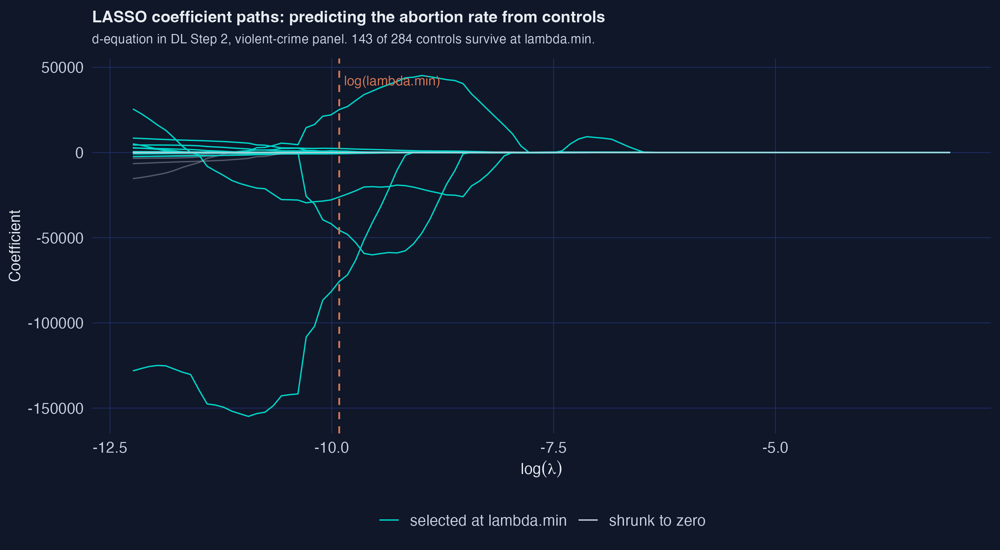

# The Tension {.divider background-color="#d97757"}

[Act I]{.act}

## With 284 candidate controls, the answer depends on which ones you keep

Donohue & Levitt found more abortion access tracked less crime. Belloni–Chernozhukov–Hansen then expanded 8 controls into **284**.

. . .

Keep too few and you risk confounding. Keep too many and the signal drowns. *Which subset?*

::: {.notes}
This is the central tension of high-dimensional causal inference: variable selection decides the result. The same data will give opposite answers depending on the selection rule.
:::

## Five estimators, three crimes — wildly different answers from one dataset


::: {.notes}
Spoiler figure. Don't explain every bar yet — just plant that the estimators disagree, sometimes flipping sign. We earn each one in Act II and come back to this picture.
:::

## Where we're going

::: {.incremental}
- The data: a 48-state, 12-year panel with 284 candidate controls
- Five estimators, escalating discipline
- Double LASSO — selecting on the outcome *and* the treatment
- The lesson: theory-tuned vs prediction-tuned penalties
:::

# The Investigation {.divider background-color="#6a9bcc"}

[Act II]{.act}

## The lab: 48 states × 12 years, 576 rows, 284 candidate controls

::: {.incremental}
- **Outcome** — one of three crime rates (violent, property, murder)
- **Treatment** — the "effective abortion rate"
- **Controls** — 8 original covariates expanded to **284** (lags, interactions, trends)
:::

[State fixed effects absorbed by first-differencing; year effects partialled out (Frisch–Waugh–Lovell). p/n ≈ 0.49 — the high-dimensional regime where Double LASSO is meant to help.]{.comment}

## Five estimators ask the same question with escalating discipline

::: {.incremental}
- **First-difference OLS** — no controls (the Donohue–Levitt baseline)
- **Kitchen-sink OLS** — all 284 controls at once
- **PSL** — one LASSO, treatment forced in
- **Double LASSO (rigorous)** — two LASSOs, theory-chosen penalty
- **Double LASSO (CV)** — two LASSOs, cross-validated penalty
:::

## With zero controls, more abortion tracks less crime: −0.152

| Outcome | α̂ | SE | Sig. 5%? |
|---|---:|---:|:--:|
| Violent | [−0.152]{.key} | 0.034 | yes |
| Property | −0.108 | 0.022 | yes |
| Murder | −0.204 | 0.067 | yes |

[This is the result the four LASSO methods stress-test — not one they generate.]{.comment}

::: {.notes}
All three negative and significant with state-clustered standard errors (48 clusters). A one-unit rise in the differenced abortion rate ≈ a 15% fall in violent crime. Does this survive adding 284 controls?
:::

## Throw in all 284 controls and OLS claims abortion raises murder by 234% {background-color="#141413"}

[+2.34]{.bignum}

[Kitchen-sink OLS, murder (α̂); violent crime *flips sign* to +0.014]{.bignum-label}

::: {.notes}
p = 284 < n = 576, so OLS technically inverts — but near-collinear controls make the estimate nonsense and the SEs balloon (R silently drops 3 rank-deficient columns). The cautionary tale that motivates disciplined selection.
:::

## Double LASSO selects on the outcome *and* the treatment, then runs OLS

$$\hat\beta(\lambda)=\arg\min_\beta\ \frac{1}{2n}\sum_{i=1}^{n}\big(y_i-x_i^\top\beta\big)^2+\lambda\sum_{j=1}^{p}|\beta_j|$$

Run it twice — once for $y$ on $X$ (set $I_y$), once for $d$ on $X$ (set $I_d$) — then OLS of $y$ on $d$ and the **union** $I_y\cup I_d$.

[The L1 penalty $\lambda\sum_j|\beta_j|$ zeroes weak controls; the union keeps anything that predicts *either* side.]{.comment}

::: {.notes}
PSL selects only on y, so it can drop a control that predicts the treatment but not the outcome — exactly the omitted variable that biases α. Double LASSO's second LASSO (d on X) catches it. Frisch–Waugh–Lovell guarantees the post-OLS α is unbiased if the union captures the confounding.
:::

## Six lines fit the rigorous Double-LASSO in R

``` {.r code-line-numbers="2-3|4|5|6"}
library(hdm); library(sandwich); library(lmtest)
Iy <- which(rlasso(X, y)$index)     # controls that predict crime
Id <- which(rlasso(X, d)$index)     # controls that predict abortion
S  <- union(Iy, Id)                  # the union is the Double-LASSO safeguard
fit <- lm(y ~ d + X[, S])            # post-OLS on the selected support
coeftest(fit, vcov = vcovCL, cluster = state)["d", ]
```

::: {.notes}
"Rigorous" means hdm::rlasso chooses λ from Belloni et al.'s theory (c = 1.1, γ = 0.05), not from cross-validation. The post-OLS step is load-bearing: α comes from unshrunk OLS on the selected support, never from LASSO's shrunk coefficients.
:::

## Theory keeps 8 controls; cross-validation keeps 150


::: {.notes}
For violent crime the rigorous union is 8; the CV union is 150 — twenty times more. |I_y| = 0 for violent and murder: no control predicts crime well enough to survive the rigorous threshold, while |I_d| = 8–9 says abortion is predictable. That asymmetry is exactly when DL helps most.
:::

## Theory-tuned λ protects the causal signal; prediction-tuned λ flips it

:::: {.columns}
::: {.column width="50%"}
### Rigorous (theory)

- λ from Belloni et al. theory
- 8–12 controls kept
- violent α̂ = **−0.096**
- selection matches the paper exactly
:::
::: {.column width="50%"}
### CV (prediction)

- λ minimises prediction MSE
- 109–161 controls kept
- violent α̂ = **+0.019** (sign flip)
- murder α̂ = **−1.11** (explodes)
:::
::::

::: {.notes}
Same three-step recipe, same data — only λ differs. CV optimises prediction, so it includes marginally-useful controls; cumulatively they soak up the treatment's variation.
:::

## Cross-validation's λ is so small that 143 of 284 controls survive



::: {.notes}
Even in the treatment equation alone, CV's MSE-optimal λ keeps 143 controls. Prediction-optimal is not selection-optimal for a causal target — the whole lesson in one picture.
:::

# The Resolution {.divider background-color="#00d4c8"}

[Act III]{.act}

## Rigorous Double-LASSO restores a sensible −0.096 for violent crime {background-color="#141413"}

[−0.096]{.bignum}

[α̂, rigorous Double-LASSO (SE 0.051) · matches the paper's −0.104; selection counts match exactly]{.bignum-label}

::: {.notes}
Between the no-controls baseline (−0.152) and the kitchen-sink mess (+0.014), the rigorous DL lands at −0.096 off just 8 controls. The 95% CI [−0.197, +0.004] barely contains zero — one notch below 5% significance, an honest result.
:::

## Does LASSO make this causal? No — two assumptions still carry the weight

[Objection.]{.objection} Machine-selecting controls can't manufacture identification.

. . .

[Response.]{.rebuttal} Correct. α is identified only under **conditional independence given X** and **parallel trends**. LASSO just chooses controls flexibly; it can't rule out collider bias or bias amplification. The paper evaluates a *method*, not the abortion–crime claim.

::: {.notes}
Steelman, don't strawman. DL disciplines selection; it does not relax the identifying assumptions. Fitzgerald et al. explicitly disclaim a substantive causal reading.
:::

# Let the theory, not the cross-validator, choose your controls. {.divider background-color="#141413"}

::: {.notes}
The single takeaway. In the high-dimensional, small-sample regime, a theory-tuned penalty under-selects on purpose to leave the causal signal undisturbed — the difference between −0.096 and a sign flip.
:::
