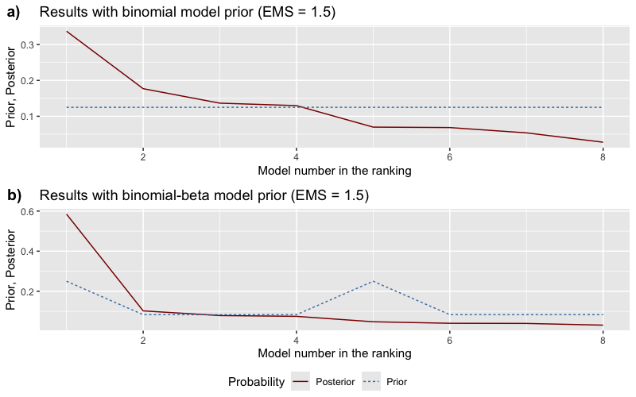
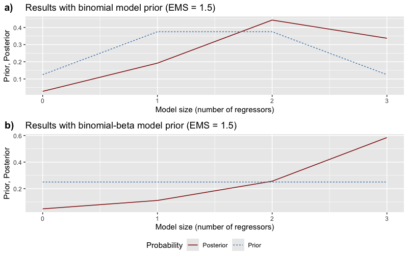
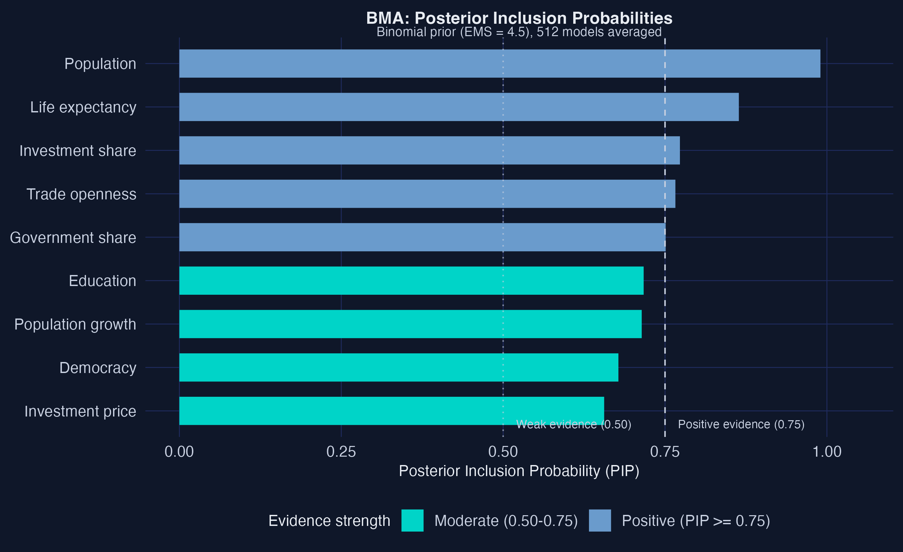
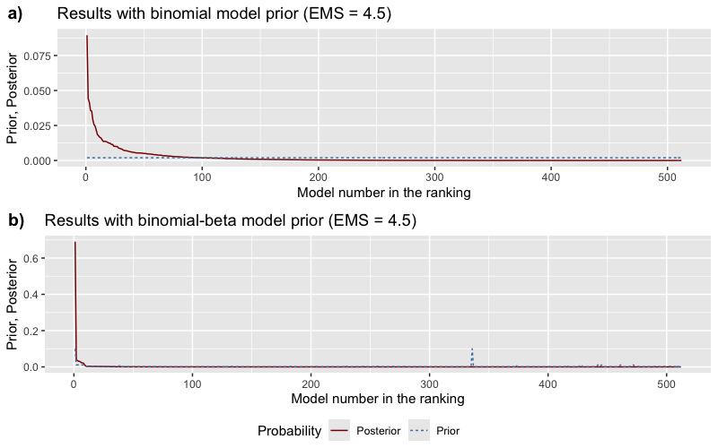
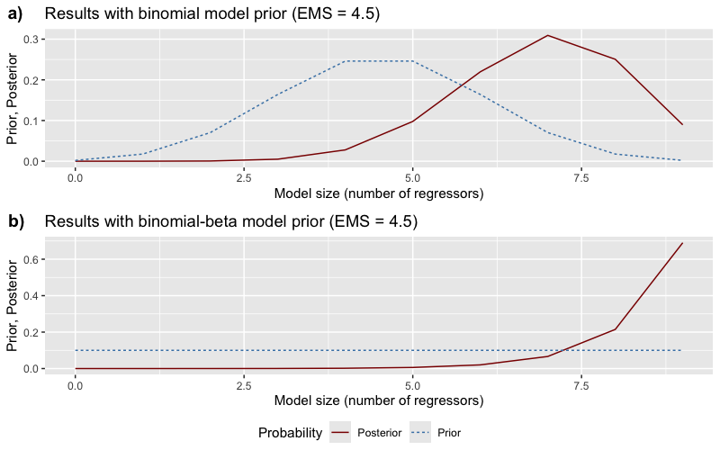
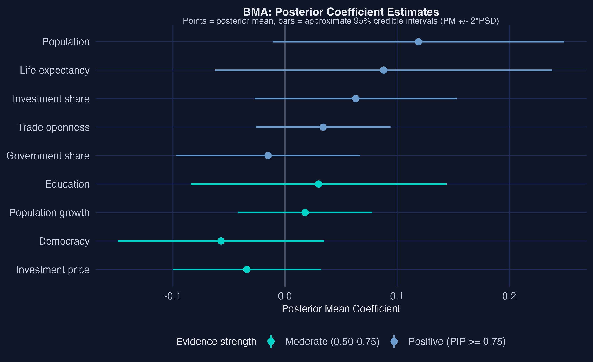
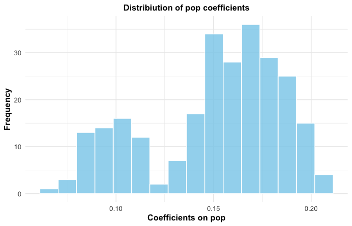
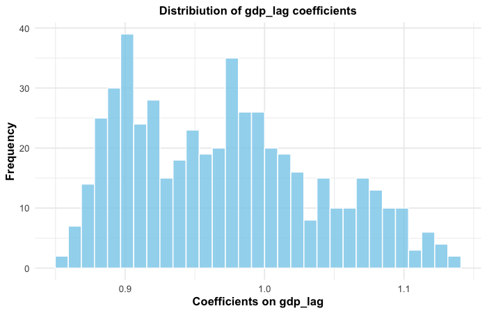
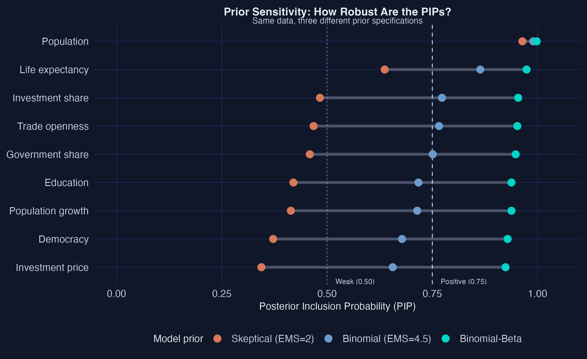
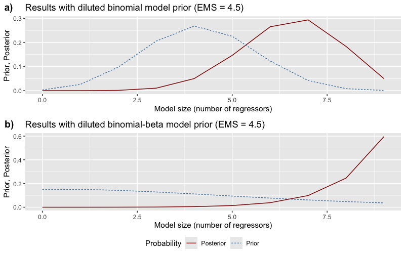

---
authors:
  - admin
categories:
  - R
  - Tutorial
  - Econometrics
draft: false
featured: false
date: "2026-03-29T00:00:00Z"
external_link: ""
image:
  caption: ""
  focal_point: Smart
  placement: 3
links:
- icon: code
  icon_pack: fas
  name: "R script"
  url: analysis.R
slides:
summary: Dynamic panel Bayesian Model Averaging with the Bayesian Dynamic Systems Modeling (BDSM) R package, applied to cross-country economic growth determinants --- handling reverse causality through lagged dependent variables, fixed effects, and weak exogeneity.
tags:
  - r
  - econometrics
  - panel
  - world
title: "Dynamic Panel BMA: Which Factors Truly Drive Economic Growth?"
url_code: ""
url_pdf: ""
url_slides: ""
url_video: ""
toc: true
diagram: true
---

## 1. Overview

Imagine you are advising a government on how to accelerate long-run economic growth. Your team has compiled a panel dataset covering 73 countries across four decades, with nine candidate drivers: investment, education, population growth, trade openness, government spending, life expectancy, democracy, investment prices, and population size. The natural question is: **which of these factors truly drive economic growth --- and can we trust our answers when today's GDP might itself be shaped by those same factors?**

What is BMA? Imagine trying to predict salaries using education, experience, age, and industry. You could build one model with all four variables, or drop industry, or use only experience and education. With just 4 candidates, there are $2^4 = 16$ possible models. Which is correct? **Bayesian Model Averaging (BMA)** does not pick one --- it averages predictions from all 16, giving more weight to models that fit the data well. This avoids betting everything on one specification that might be wrong.

This last concern is *reverse causality* --- the possibility that GDP growth causes higher investment rather than the other way around. Cross-sectional BMA handles model uncertainty this way, but it assumes regressors are strictly exogenous. When that assumption fails, BMA can confidently point to the wrong variables.

This tutorial introduces the [Bayesian Dynamic Systems Modeling](https://cran.r-project.org/web/packages/bdsm/index.html) R package --- which extends BMA to dynamic panel data with weakly exogenous regressors. Built on the methodology of Moral-Benito (2012, 2013, 2016), it simultaneously addresses model uncertainty and reverse causality by incorporating a lagged dependent variable, entity fixed effects, and time fixed effects into the BMA framework.

> **Companion tutorial.** For a cross-sectional perspective using BMA, LASSO, and WALS on synthetic data, see the [R tutorial on variable selection](/post/r_bma_lasso_wals/). The current tutorial builds on those foundations by moving from cross-sectional to panel data and from strict to weak exogeneity.

**Learning objectives:**

- Understand why cross-sectional BMA can be misleading when regressors are endogenous, and how dynamic panel BMA addresses this
- Prepare panel data for the Bayesian DSM package using `join_lagged_col()` and `feature_standardization()`
- Run Bayesian Model Averaging with `bma()` and interpret Posterior Inclusion Probabilities (PIPs --- how often a variable appears in the best-fitting models), posterior means, and model probabilities
- Assess the sensitivity of results to prior specification by varying the expected model size (how many variables the prior expects to matter) and applying dilution priors (which adjust for correlated variables)
- Analyze jointness (which variables tend to appear in models together) to discover which growth determinants are complements versus substitutes

The tutorial proceeds in two stages. First, a **warm-up** with only 3 regressors and 8 models to build intuition for the workflow. Then the **full analysis** with all 9 regressors and 512 models, including sensitivity analysis and jointness.

**Data Prep** (lag DV, demean, standardize) **&rarr; Model Space** (estimate all 2<sup>K</sup> models)
**&rarr; BMA** (PIPs, posterior means) **&rarr; Sensitivity** (vary priors, EMS, dilution) **&rarr; Jointness** (complements vs. substitutes) **&rarr; Findings** (robust growth determinants)

## 2. Setup

We need the Bayesian Dynamic Systems Modeling package for dynamic panel BMA and `tidyverse` for data manipulation. The `parallel` package (included with base R) enables parallel computing for the model space estimation step.

```r
# Install bdsm if needed
if (!requireNamespace("bdsm", quietly = TRUE)) {
  install.packages("bdsm")
}

# Load packages
library(bdsm)
library(tidyverse)
library(parallel)

set.seed(42)
```

## 3. Why Dynamic Panel BMA?

### 3.1 The endogeneity problem

Standard BMA assumes that all regressors are *strictly exogenous* --- meaning they are determined outside the model and are uncorrelated with the error term at any point in time. In growth economics, this assumption almost never holds.

Think of it this way: imagine judging a runner's training program by their final race time, but faster runners also *chose* better programs. You cannot tell whether the program caused the speed or the speed attracted the program. This is **reverse causality**, and it contaminates cross-sectional regressions. Countries that grow faster invest more, trade more, urbanize faster, and attract more education spending --- not just the other way around.

When BMA is applied to cross-sectional data with endogenous regressors, it can confidently assign high inclusion probabilities to variables that appear important only because they are *consequences* of growth rather than *causes* of it. The model averaging machinery works perfectly --- but the individual models it averages over are biased.

The solution is to include *last period's GDP* as a regressor. By controlling for where a country *was*, we isolate which new factors push it forward --- breaking the feedback loop. The next section shows why this dynamic structure arises naturally from economic growth theory.

### 3.2 From the Solow model to a dynamic equation

Why does a dynamic equation --- one with lagged GDP on the right-hand side --- arise naturally in growth economics? The answer comes from the **Solow growth model** and its convergence prediction.

The Solow model predicts that poorer countries should grow faster than richer ones, conditional on their structural characteristics. This is called **beta convergence**. Mathematically, the model implies that around the steady state, log GDP per capita evolves according to (Barro and Sala-i-Martin, 2004):

$$\ln y\_{it} = (1 - e^{-\lambda \tau}) \ln y^*\_i + e^{-\lambda \tau} \ln y\_{i,t-1}$$

In words, a country's current GDP ($\ln y\_{it}$) is a weighted average of two forces: its long-run steady-state level ($\ln y^*\_i$), determined by fundamentals like savings and technology, and its GDP in the previous period ($\ln y\_{i,t-1}$), which captures where the country currently stands. The parameter $\lambda$ is the **speed of convergence** --- how fast countries close the gap to their steady state --- and $\tau$ is the time between observations (10 years in our data).

Now define $\alpha = e^{-\lambda \tau}$. The convergence equation becomes:

$$\ln y\_{it} = \alpha \ln y\_{i,t-1} + (1 - \alpha) \ln y^*\_i$$

This is already a dynamic equation --- current GDP depends on lagged GDP. The next step is to recognize that the steady state $\ln y^*\_i$ is not observed directly. Instead, it depends on country characteristics such as investment rates, education, trade openness, and institutional quality. Writing these as $\beta' x\_{it}$, and adding country fixed effects ($\eta\_i$) for unobserved fundamentals, time effects ($\zeta\_t$) for global shocks, and an error term ($v\_{it}$), we arrive at:

$$\ln y\_{it} = \alpha \ln y\_{i,t-1} + \beta' x\_{it} + \eta\_i + \zeta\_t + v\_{it}$$

This is the **dynamic panel model** that the Bayesian DSM package estimates. The coefficient $\alpha$ has a direct economic interpretation: it measures the **persistence of GDP** across periods. A value of $\alpha$ close to 1 means slow convergence --- countries stay near their current income level for a long time. A value close to 0 means fast convergence --- countries quickly reach their steady state. Our BMA results will reveal $\alpha \approx 0.92$, indicating very slow convergence: after a decade, countries have closed only about 8% of the gap between their current GDP and their steady state.

The key insight is that the lagged dependent variable is not an ad hoc addition --- it arises directly from the Solow model's convergence prediction. Any study of growth determinants that omits lagged GDP is implicitly assuming $\alpha = 0$, which means assuming *instantaneous convergence* --- a prediction strongly rejected by the data.

### 3.3 Weak exogeneity and the role of each component

Each component of the dynamic panel equation plays a distinct role:

- **Lagged dependent variable** ($y\_{it-1}$): Think of this as a student's previous exam score --- it captures all the accumulated history that got a country to its current level. After controlling for where a country *was*, we can ask: among countries at the same starting point, which factors predict who grows faster?
- **Entity fixed effects** ($\eta\_i$): Like grading on a curve within each classroom --- these absorb time-invariant country traits such as geography, colonial history, and institutional heritage. We compare each country to its own average, not to other countries.
- **Time fixed effects** ($\zeta\_t$): These remove global shocks that affect all countries simultaneously, such as oil crises or the Asian financial crisis.

To understand this assumption, consider a concrete example. Suppose an oil price shock in 1985 affects both GDP and trade openness simultaneously. Weak exogeneity allows this kind of contemporaneous correlation between regressors and the fixed effects. What it rules out is that the *unexplained* part of today's GDP shock --- the idiosyncratic error $v\_{it}$ --- directly causes today's investment to change within the same period.

The key assumption is **weak exogeneity**: current regressors can be correlated with *past* shocks but not with the *current* shock $v\_{it}$. This is much weaker than strict exogeneity --- it allows past GDP growth to influence current investment (feedback effects) while requiring only that the current unexpected shock to GDP does not simultaneously cause changes in investment. In practical terms, weak exogeneity permits the realistic feedback loops that plague growth regressions while still allowing consistent estimation.

### 3.4 From cross-sectional to dynamic panel BMA

**Cross-sectional BMA** uses a single time snapshot, assumes strict exogeneity, includes no lagged dependent variable, and has no fixed effects. **Dynamic panel BMA** uses multiple time periods, requires only weak exogeneity, includes a lagged dependent variable, and controls for entity and time fixed effects. Both approaches address model uncertainty by averaging across all possible model specifications.

In the [companion cross-sectional tutorial](/post/r_bma_lasso_wals/), we averaged across 4,096 models of CO<sub>2</sub> emissions using synthetic data. Here we apply the same BMA principle --- weighting models by how well they fit the data --- but to a panel of 73 countries over four decades, using the methodology that handles the endogeneity that cross-sectional BMA cannot.

## 4. Warm-Up: BMA with 3 Regressors

Before tackling the full 9-regressor model space, let us start with a smaller example to build intuition. The package ships with a precomputed `small_model_space` object that uses only 3 regressors: investment share (`ish`), secondary education (`sed`), and population growth (`pgrw`). With 3 regressors, there are $2^3 = 8$ possible models --- small enough to inspect every one.

```r
# Load the precomputed small model space
data("economic_growth")
data("small_model_space")

# Prepare data with only the 3 matching regressors
data_small <- economic_growth %>%
  select(year, country, gdp, ish, sed, pgrw)

data_small_std <- feature_standardization(
  df = data_small,
  excluded_cols = c(country, year, gdp)
)

data_small_prep <- feature_standardization(
  df = data_small_std,
  group_by_col = year,
  excluded_cols = country,
  scale = FALSE
)

# Run BMA
bma_small <- bma(small_model_space, df = data_small_prep, round = 3)
print(bma_small[[1]])  # Binomial prior
```

*Focus on two columns: **PIP** (how certain are we this variable matters? higher = more certain) and **PM** (our best estimate of its effect size).*

```text
          PIP     PM   PSD  PSDR  PMcon PSDcon PSDRcon %(+)
gdp_lag    NA  1.081 0.099 0.199  1.081  0.099   0.199  100
ish     0.720  0.085 0.059 0.084  0.118  0.031   0.077  100
sed     0.712 -0.051 0.067 0.137 -0.072  0.069   0.158    0
pgrw    0.657 -0.014 0.035 0.077 -0.021  0.042   0.094    0
```

Even with only 8 models to average over, the BMA results are informative. The lagged dependent variable (`gdp_lag`) is included in every model by construction, with a posterior mean of 1.081 --- indicating strong persistence in GDP levels across decades.

Investment share (`ish`) has PIP = 0.720 and a positive posterior mean of 0.085, suggesting moderate evidence that higher investment drives growth. Secondary education (`sed`) has PIP = 0.712 but a negative sign, which is surprising --- we will revisit this when we include all 9 regressors. Population growth (`pgrw`) shows the weakest evidence at PIP = 0.657 with a near-zero posterior mean of --0.014.

Why is education's sign negative? This is surprising --- theory predicts education should boost growth. In this small 3-variable model, education may be picking up a confounding effect that is better explained by the missing variables. When we include all 9 regressors in the full analysis, the education sign becomes positive. This illustrates exactly why model uncertainty matters: conclusions can flip depending on which variables are included.

Let us visualize the prior and posterior model probabilities to see how the data reshapes our beliefs about which models are best.

A brief note on terminology: the *prior* represents our initial guess about which models are good, before seeing any data. The *posterior* is what the data tells us after we look at the evidence. If the data is informative, the posterior will concentrate on a few good models, even if the prior treated all models equally.

```r
# Prior vs. posterior model probabilities
pmp_small <- model_pmp(bma_small)
```



The prior assigns roughly equal probability to all 8 models, but the posterior concentrates mass on just a few. The best model receives the largest share, and the top 3 models account for the majority of posterior probability.

```r
# Model sizes: prior vs. posterior
sizes_small <- model_sizes(bma_small)
```



The posterior favors models with 2 regressors (plus the lagged DV), matching the posterior expected model size of 2.09. This makes sense: with only 3 candidates and moderate PIPs for each, the data supports including about two of the three variables. Now let us scale up to the full model space.

## 5. The Dataset

### 5.1 Loading the data

The package includes two versions of the Moral-Benito (2016) economic growth dataset. The `economic_growth` version has the lagged dependent variable already merged into the panel structure (with NAs in the initial period), while `original_economic_growth` keeps it as a separate column.

```r
data("economic_growth")
data("original_economic_growth")

cat("economic_growth:", dim(economic_growth), "\n")
cat("Countries:", length(unique(economic_growth$country)), "\n")
cat("Years:", sort(unique(economic_growth$year)), "\n")
head(economic_growth, 5)
```

```text
economic_growth: 365 12
Countries: 73
Years: 1960 1970 1980 1990 2000

# A tibble: 5 x 12
   year country   gdp    ish    sed    pgrw   pop   ipr    opem    gsh lnlex polity
  <dbl>   <dbl> <dbl>  <dbl>  <dbl>   <dbl> <dbl> <dbl>   <dbl>  <dbl> <dbl>  <dbl>
1  1960       1  8.25 NA     NA     NA       NA    NA   NA      NA     NA     NA
2  1970       1  8.37  0.122  0.139  0.0235  10.9  61.1  1.08    0.191  3.88   0.15
3  1980       1  8.54  0.207  0.141  0.0300  13.9  92.3  1.06    0.203  4.00   0.15
4  1990       1  8.63  0.203  0.28   0.0303  18.9 100.   0.898   0.232  4.10   0.15
5  2000       1  8.66  0.115  0.774  0.0215  25.3  81.2  0.636   0.219  4.21   0.575
```

The panel covers 73 countries observed at 10-year intervals from 1960 to 2000, yielding 5 periods per country (365 total rows, including the initial 1960 observation). The 1960 row for each country contains only the initial GDP level --- all regressors are NA because there is no "previous decade" to compute changes from. The four subsequent decades (1970--2000) contain the 292 usable observations.

### 5.2 Variable descriptions

The dataset contains the dependent variable (log GDP per capita) and 9 candidate growth determinants:

| Variable | Description | Expected sign |
|----------|-------------|:-------------:|
| `gdp` | Log real GDP per capita (dependent variable) | --- |
| `ish` | Investment share of GDP | + |
| `sed` | Secondary school enrollment rate | + |
| `pgrw` | Population growth rate | -- |
| `pop` | Population (millions) | ? |
| `ipr` | Investment price (relative to US) | -- |
| `opem` | Trade openness (imports + exports / GDP) | + |
| `gsh` | Government consumption share of GDP | -- |
| `lnlex` | Log life expectancy at birth | + |
| `polity` | Democracy index (0 = autocracy, 1 = democracy) | ? |

These variables are standard in the empirical growth literature, following Sala-i-Martin, Doppelhofer, and Miller (2004). Investment share and education are expected to have positive effects on growth, while population growth and government consumption are typically associated with slower growth. The signs for population and democracy are theoretically ambiguous.

### 5.3 Summary statistics

```r
summary(original_economic_growth)
```

```text
    country        year           gdp            lag_gdp
 Min.   : 1   Min.   :1970   Min.   : 6.177   Min.   : 6.021
 1st Qu.:19   1st Qu.:1978   1st Qu.: 7.595   1st Qu.: 7.441
 Median :37   Median :1985   Median : 8.518   Median : 8.358
 Mean   :37   Mean   :1985   Mean   : 8.505   Mean   : 8.311
 3rd Qu.:55   3rd Qu.:1992   3rd Qu.: 9.481   3rd Qu.: 9.194
 Max.   :73   Max.   :2000   Max.   :10.445   Max.   :10.222

      ish               sed              pgrw
 Min.   :0.01224   Min.   :0.0120   Min.   :-0.005952
 1st Qu.:0.09719   1st Qu.:0.2968   1st Qu.: 0.010662
 Median :0.16003   Median :0.8125   Median : 0.021321
 Mean   :0.16886   Mean   :1.1204   Mean   : 0.019377
 3rd Qu.:0.22837   3rd Qu.:1.5668   3rd Qu.: 0.027277
 Max.   :0.65279   Max.   :5.0880   Max.   : 0.058159
```

The 292 usable observations span 73 countries over four decades. Log GDP per capita ranges from 6.02 to 10.45, reflecting substantial income inequality --- the richest country is roughly 80 times wealthier than the poorest in per capita terms. Investment share averages 16.9% of GDP but ranges from 1.2% to 65.3%, indicating enormous variation in capital accumulation across countries and decades. Population growth averages 1.9% per decade, with one country experiencing slight population decline (--0.6%).

## 6. Data Preparation

The Bayesian DSM package requires two data preprocessing steps before estimation: standardization (scaling) and demeaning (removing entity and time fixed effects). These steps ensure numerical stability and allow the model to focus on within-country, within-period variation.

### 6.1 Understanding the data structure

If your data has the lagged dependent variable as a separate column (like `original_economic_growth`), you first need to merge it into the panel structure using [`join_lagged_col()`](https://cran.r-project.org/web/packages/bdsm/vignettes/bdsm_vignette.Rnw). This function creates the initial period row with NAs:

```r
# Demonstration: converting original format to package format
eg_joined <- join_lagged_col(
  df = original_economic_growth,
  col = gdp,
  col_lagged = lag_gdp,
  timestamp_col = year,
  entity_col = country,
  timestep = 10  # 10-year intervals
)
cat("Result:", dim(eg_joined), "\n")
```

```text
Result: 365 12
```

The `economic_growth` dataset already has this structure, so we can use it directly.

### 6.2 Standardization and demeaning

Data preparation involves two calls to [`feature_standardization()`](https://cran.r-project.org/web/packages/bdsm/vignettes/bdsm_vignette.Rnw). The first call *standardizes* all regressors to have mean zero and unit variance --- this puts all variables on the same scale so that the BMA coefficients are directly comparable. The second call *demeans* by time period to remove time fixed effects.

Think of demeaning by time as subtracting the global average for each decade. If every country's GDP grew in the 1990s due to the tech boom, demeaning removes that common trend. What remains is each country's deviation from the global pattern --- the variation that country-specific factors must explain.

```r
# Step 1: Standardize all regressors (mean=0, sd=1)
# Makes variables comparable: GDP and population are on vastly different scales
data_std <- feature_standardization(
  df = economic_growth,
  excluded_cols = c(country, year, gdp)
)

# Step 2: Demean by time period (remove time fixed effects)
# Subtracts each decade's global average, isolating country-specific variation
data_prepared <- feature_standardization(
  df = data_std,
  group_by_col = year,
  excluded_cols = country,
  scale = FALSE
)

head(data_prepared, 5)
```

```text
# A tibble: 5 x 12
   year country     gdp    ish    sed   pgrw    pop     ipr   opem     gsh  lnlex polity
  <dbl>   <dbl>   <dbl>  <dbl>  <dbl>  <dbl>  <dbl>   <dbl>  <dbl>   <dbl>  <dbl>  <dbl>
1  1960       1  0.292  NA     NA     NA     NA     NA      NA     NA     NA     NA
2  1970       1  0.121  -0.493 -0.534  0.163 -0.151 -0.271   1.13   0.0496 -0.549  -0.578
3  1980       1  0.0573  0.241 -0.697  0.942 -0.181  0.0635  1.07  -0.0226  0.0167 -0.578
4  1990       1  0.0724  0.456 -0.932  1.09  -0.203  0.208   0.724  0.101  -0.0655 -0.578
5  2000       1 -0.0823 -0.505 -0.778  0.465 -0.218 -0.0620 -0.120  0.120  -0.107   0.112
```

After preparation, all regressor values are centered around zero. Country 1's investment share (`ish`) was 0.49 standard deviations below the global average in 1970 but 0.46 standard deviations above average in 1990, showing meaningful within-country variation over time. The GDP column retains its original scale because it is the dependent variable.

## 7. Estimating the Full Model Space

With 9 candidate regressors, there are $2^9 = 512$ possible regression models. The package estimates every single one via numerical optimization of the *marginal likelihood* --- the probability of observing the data given a particular model, after integrating out all parameter uncertainty. Think of this as a cooking competition with 512 recipes --- each uses a different combination of 9 ingredients, and the marginal likelihood scores each recipe by balancing flavor (fit) against unnecessary complexity (overfitting).

To be concrete: model 1 might include only investment and education. Model 2 adds trade openness. Model 3 uses education and democracy but drops investment. Each of the 512 combinations gets its own likelihood estimated separately, and BMA weights them by how well they fit the data.

The [`optim_model_space()`](https://cran.r-project.org/web/packages/bdsm/vignettes/bdsm_vignette.Rnw) function handles this computation. For the full 9-regressor case, this is the most computationally intensive step --- it can take several minutes depending on the machine. The package helpfully includes a precomputed `full_model_space` object so we can skip the wait:

```r
# Load precomputed model space (or compute from scratch)
data("full_model_space")

# To compute from scratch (takes several minutes):
# full_model_space <- optim_model_space(
#   df = data_prepared,
#   dep_var_col = gdp,
#   timestamp_col = year,
#   entity_col = country,
#   init_value = 0.5
# )

cat("Parameters matrix:", dim(full_model_space$params), "\n")
cat("Statistics matrix:", dim(full_model_space$stats), "\n")
```

```text
Parameters matrix: 106 512
Statistics matrix: 22 512
```

The result is a list with two elements. The `$params` matrix contains 106 estimated parameters for each of the 512 models --- these include the structural parameters ($\alpha$, $\beta$), reduced-form parameters, and variance components. The `$stats` matrix stores 22 statistics per model, including the log-likelihood, BIC, regular standard errors, and robust (heteroskedasticity-consistent) standard errors.

Why use marginal likelihood instead of R-squared? Unlike R-squared, which always improves when you add variables, the marginal likelihood penalizes complexity. It accounts for the fact that more parameters make it easier to fit noise. A model with 9 regressors that barely improves fit over a 5-regressor model will receive a *lower* marginal likelihood score --- the extra parameters were not worth the complexity cost.

Before jumping into BMA, let us first establish a benchmark using a standard regression approach --- this will help us appreciate what BMA adds.

## 8. Benchmark: Kitchen-Sink Fixed Effects

Before running BMA, it is useful to establish a benchmark. What happens if we simply throw all 9 regressors into a single fixed effects regression? This "kitchen-sink" approach is the default in applied work --- but it commits to one model specification and ignores the uncertainty about which variables belong.

```r
# Kitchen-sink FE regression with all 9 regressors
fe_full <- lm(gdp ~ lag_gdp + ish + sed + pgrw + pop + ipr +
              opem + gsh + lnlex + polity +
              factor(country) + factor(year),
              data = original_economic_growth)
summary(fe_full)
```

```text
FE regression coefficients:
        Estimate Std. Error t value Pr(>|t|)
lag_gdp   0.6188     0.0501 12.3521   0.0000
ish       0.4646     0.2331  1.9934   0.0475
sed       0.0162     0.0337  0.4798   0.6319
pgrw     -2.3352     2.1409 -1.0907   0.2767
pop       0.0016     0.0004  4.5092   0.0000
ipr      -0.0003     0.0003 -1.0817   0.2806
opem      0.1199     0.0379  3.1652   0.0018
gsh      -0.7448     0.2700 -2.7585   0.0063
lnlex     0.1153     0.2440  0.4727   0.6369
polity   -0.1656     0.0570 -2.9065   0.0041

Significant at 5%: lag_gdp, ish, pop, opem, gsh, polity
R-squared: 0.988
N observations: 292
```

The kitchen-sink model finds 6 of 10 variables significant at the 5% level: lagged GDP, investment share, population, trade openness, government share, and democracy. Education, population growth, investment price, and life expectancy are insignificant. But this result depends entirely on this particular specification --- drop one variable or add another, and the significance pattern may change. This is the model uncertainty problem that BMA is designed to solve.

The lagged GDP coefficient of 0.619 is notably lower than the BMA posterior mean (0.919), suggesting that the kitchen-sink model's coefficient estimates are pulled by multicollinearity among the 9 regressors. BMA handles this by averaging over specifications that include different subsets.

Notice how the FE model forces a binary judgment: education is 'insignificant' (p = 0.63) and trade is 'significant' (p = 0.002). BMA replaces this all-or-nothing verdict with a nuanced probability scale: education has PIP = 0.72 (moderate evidence) and trade has PIP = 0.77 (positive evidence). The difference between 'insignificant' and 'moderate evidence' matters for policy --- a policymaker who ignores education entirely because of a p-value threshold may be discarding useful information.

The kitchen-sink model commits to one specification and produces one set of p-values. But we saw that which variables look 'significant' depends entirely on which others are in the model. Drop one variable, and the significance pattern reshuffles. BMA solves this by never committing to a single specification --- it averages over all 512, letting the data decide which matter most.

## 9. Bayesian Model Averaging

### 9.1 Running BMA

Now we can perform Bayesian Model Averaging across all 512 models. The [`bma()`](https://cran.r-project.org/web/packages/bdsm/vignettes/bdsm_vignette.Rnw) function takes the precomputed model space and the prepared data, weights each model by its posterior probability, and computes weighted averages of the coefficients:

*Focus on two columns: **PIP** (how important is this variable?) and **%(+)** (is its effect consistently positive or negative?).*

```r
bma_results <- bma(full_model_space, df = data_prepared, round = 3)

# Binomial prior results
print(bma_results[[1]])
```

```text
          PIP     PM   PSD  PSDR  PMcon PSDcon PSDRcon    %(+)
gdp_lag    NA  0.919 0.077 0.109  0.919  0.077   0.109 100.000
ish     0.773  0.063 0.045 0.062  0.082  0.034   0.059 100.000
sed     0.717  0.030 0.057 0.074  0.042  0.064   0.084  69.922
pgrw    0.714  0.018 0.030 0.052  0.025  0.033   0.060  99.609
pop     0.990  0.119 0.065 0.082  0.121  0.064   0.081 100.000
ipr     0.656 -0.034 0.033 0.044 -0.051  0.027   0.046   0.000
opem    0.766  0.034 0.030 0.033  0.044  0.026   0.031 100.000
gsh     0.751 -0.015 0.041 0.091 -0.020  0.046   0.104  30.859
lnlex   0.864  0.088 0.075 0.098  0.102  0.071   0.099 100.000
polity  0.678 -0.057 0.046 0.053 -0.084  0.030   0.044   0.000
```

The binomial prior results reveal a clear hierarchy among the 9 candidate regressors. Population size (`pop`) dominates with PIP = 0.990 --- appearing in virtually every high-quality model --- followed by life expectancy (`lnlex`) at 0.864 and investment share (`ish`) at 0.773. At the other end, investment price (`ipr`) at 0.656 and democracy (`polity`) at 0.678 show the weakest evidence, though even these exceed 0.5. The lagged GDP coefficient of 0.919 confirms strong persistence: a country's current GDP is heavily determined by its past GDP.

### 9.2 Understanding the BMA statistics

Each column in the BMA output captures a different aspect of the evidence:

> **Beginner tip:** For a first reading, focus on three columns: **PIP** (does this variable matter?), **PM** (what is its average effect?), and **%(+)** (is the effect consistently positive or negative?). The remaining columns (PSDR, PMcon, PSDcon, PSDRcon) are useful for advanced robustness checks but can be skipped on a first pass.

| Statistic | Full name | Interpretation |
|-----------|-----------|----------------|
| **PIP** | Posterior Inclusion Probability | Fraction of posterior probability mass in models that include this variable. Think of it as a **batting average**: PIP = 0.99 means the variable appeared in 99% of high-scoring models |
| **PM** | Posterior Mean | Weighted average of the coefficient across all models (including zeros from models that exclude the variable) |
| **PSD** | Posterior Standard Deviation | Uncertainty around PM, incorporating both within-model and across-model variation |
| **PSDR** | Posterior SD Ratio | PSD divided by the conditional PM --- a robustness measure |
| **PMcon** | Conditional Posterior Mean | Average coefficient only across models that *include* the variable |
| **PSDcon** | Conditional PSD | Uncertainty conditional on inclusion |
| **%(+)** | Positive sign share | Percentage of models where the coefficient is positive. Values near 0% or 100% indicate stable sign |

The central quantity driving all these statistics is the **posterior model probability** (PMP). Each model $M\_j$ receives a weight proportional to its marginal likelihood times its prior probability:

$$\mathbb{P}(M\_j | \text{data}) = \frac{\exp(-\frac{1}{2} BIC\_j) \cdot \mathbb{P}(M\_j)}{\sum\_{i=1}^{2^K} \exp(-\frac{1}{2} BIC\_i) \cdot \mathbb{P}(M\_i)}$$

In words, this equation says that each model's posterior probability is its prior probability times a data-fit term (approximated by the BIC), divided by the sum across all $2^K$ models to ensure the probabilities add to 1. Models that fit the data well without too many parameters receive higher posterior probability. The PIP for a variable is then the sum of PMPs across all models that include it.

To make this concrete: if model A has BIC = --800 and model B has BIC = --790, model A fits the data better. After exponentiating and normalizing, model A might receive 73% of the posterior probability while model B gets 27%. The PIP of a variable included only in model A would then be at least 0.73.

The **PSDR** (or equivalently |PM/PSD|) is a key robustness criterion. Raftery (1995) considers a variable *robust* when |PM/PSD| > 1. More stringent thresholds include |PM/PSD| > 1.3 (Masanjala and Papageorgiou, 2008) and |PM/PSD| > 2 (Sala-i-Martin et al., 2004).

### 9.3 Interpreting PIPs with Raftery's classification

Raftery (1995) provides a standard classification for the strength of evidence based on PIP values:

| PIP range | Evidence |
|-----------|----------|
| > 0.99 | Very strong |
| 0.95 -- 0.99 | Strong |
| 0.75 -- 0.95 | Positive |
| 0.50 -- 0.75 | Weak |

Under the binomial prior, `pop` (PIP = 0.990) reaches *strong* evidence --- just short of the "very strong" threshold at 0.99. Life expectancy (`lnlex` at 0.864), investment share (`ish` at 0.773), trade openness (`opem` at 0.766), and government share (`gsh` at 0.751) fall in the *positive* evidence range. The remaining four variables --- education, population growth, investment price, and democracy --- show *weak* evidence (0.65--0.72). No variable has PIP below 0.5, suggesting the data supports relatively large models.

The **sign stability** column (%(+)) provides an additional robustness check. Seven of the nine regressors have perfectly stable signs: investment share, population growth, population, trade openness, and life expectancy are always positive (100%), while investment price and democracy are always negative (0%). Government share has %(+) = 30.9%, meaning its sign is negative in about 70% of models --- moderately unstable. Education has %(+) = 69.9%, with a positive coefficient in about 70% of models but negative in 30%.

The following chart visualizes the PIPs with color-coded evidence tiers. We first define a dark-theme palette and extract the BMA statistics into a data frame, then build the plot:

```r
# Dark theme palette (matching site navbar/footer)
DARK_BG      <- "#0f1729"
LIGHT_TEXT   <- "#c8d0e0"
LIGHTER_TEXT <- "#e8ecf2"

# Extract BMA statistics into a data frame
bma_tab <- bma_results[[1]]
pip_df <- data.frame(
  variable = rownames(bma_tab)[-1],
  pip      = bma_tab[-1, "PIP"],
  pm       = bma_tab[-1, "PM"],
  psd      = bma_tab[-1, "PSD"],
  sign_pos = bma_tab[-1, "%(+)"]
)

# Readable labels and robustness classification
var_labels <- c(ish = "Investment share", sed = "Education",
  pgrw = "Population growth", pop = "Population",
  ipr = "Investment price", opem = "Trade openness",
  gsh = "Government share", lnlex = "Life expectancy",
  polity = "Democracy")
pip_df$label <- var_labels[pip_df$variable]
pip_df$robustness <- cut(pip_df$pip,
  breaks = c(0, 0.50, 0.75, 1),
  labels = c("Weak (PIP < 0.50)", "Moderate (0.50-0.75)",
             "Positive (PIP >= 0.75)"),
  include.lowest = TRUE)

# PIP bar chart
ggplot(pip_df, aes(x = reorder(label, pip), y = pip,
                   fill = robustness)) +
  geom_col(width = 0.65) +
  geom_hline(yintercept = 0.75, linetype = "dashed",
             color = LIGHT_TEXT) +
  geom_hline(yintercept = 0.50, linetype = "dotted",
             color = LIGHT_TEXT, alpha = 0.6) +
  coord_flip() +
  scale_fill_manual(values = c(
    "Positive (PIP >= 0.75)" = "#6a9bcc",
    "Moderate (0.50-0.75)"   = "#00d4c8",
    "Weak (PIP < 0.50)"     = "#d97757")) +
  labs(x = NULL, y = "Posterior Inclusion Probability (PIP)",
       fill = "Evidence strength",
       title = "BMA: Posterior Inclusion Probabilities",
       subtitle = "Binomial prior (EMS = 4.5), 512 models averaged")
```



Population dominates the chart at PIP = 0.990, followed by life expectancy at 0.864. Five variables clear the 0.75 "positive evidence" threshold, while the remaining four --- democracy, education, population growth, and investment price --- fall in the "moderate" zone between 0.50 and 0.75. Compared to the kitchen-sink benchmark where 6 of 10 variables were significant at 5%, BMA paints a more nuanced picture: it grades each variable on a continuous scale of importance rather than imposing a binary significant/insignificant cutoff.

## 10. Visualizing Model Probabilities

### 10.1 Prior versus posterior model probabilities

The [`model_pmp()`](https://cran.r-project.org/web/packages/bdsm/vignettes/bdsm_vignette.Rnw) function visualizes how the data transforms our prior beliefs about which models are best. The prior assigns probability to each of the 512 models, and the data concentrates posterior mass on the models that fit best:

```r
pmp_plots <- model_pmp(bma_results)
```



The prior (dashed line) is relatively flat, reflecting the uniform prior assumption. The posterior (solid line) concentrates dramatically: a handful of models capture the bulk of the posterior mass, while most models receive negligible probability. This concentration is the signature of informative data --- the 73-country, 4-decade panel provides enough information to strongly favor certain model specifications.

### 10.2 Model sizes

The [`model_sizes()`](https://cran.r-project.org/web/packages/bdsm/vignettes/bdsm_vignette.Rnw) function shows the distribution of prior and posterior probabilities across model sizes (number of included regressors, excluding the lagged dependent variable):

```r
size_plots <- model_sizes(bma_results)
```



The expected model sizes confirm this visually:

```r
print(bma_results[[16]])
```

```text
              Prior models size Posterior model size
Binomial                    4.5                6.908
Binomial-beta               4.5                8.556
```

The posterior strongly favors larger models. While the binomial prior centers mass on models with 4--5 regressors (EMS = 4.5), the posterior shifts toward 7 regressors (6.908). Under the binomial-beta prior, the shift is even more dramatic: the posterior expected model size reaches 8.556, meaning the data wants to include nearly all 9 candidate regressors. This is consistent with the finding that all variables have PIP above 0.65 --- the data sees signal in most candidates.

## 11. Examining Top Models

The [`best_models()`](https://cran.r-project.org/web/packages/bdsm/vignettes/bdsm_vignette.Rnw) function lets us inspect the specific variable combinations and coefficient estimates in the top-ranked models:

```r
best8 <- best_models(bma_results, criterion = 1, best = 8)
print(best8[[1]])  # Inclusion matrix
```

*Reading the inclusion matrix: each column is a model (ranked by fit), each row is a variable. A value of 1 means the variable is included in that model. Look for variables that appear in every top model --- those are the most robust.*

```text
        'No. 1' 'No. 2' 'No. 3' 'No. 4' 'No. 5' 'No. 6' 'No. 7' 'No. 8'
gdp_lag   1.000   1.000   1.000   1.000   1.000   1.000   1.000   1.000
ish       1.000   1.000   1.000   1.000   1.000   1.000   1.000   0.000
sed       1.000   1.000   1.000   0.000   1.000   1.000   1.000   1.000
pgrw      1.000   1.000   1.000   1.000   0.000   1.000   1.000   1.000
pop       1.000   1.000   1.000   1.000   1.000   1.000   1.000   1.000
ipr       1.000   0.000   1.000   1.000   1.000   1.000   1.000   1.000
opem      1.000   1.000   1.000   1.000   1.000   1.000   0.000   1.000
gsh       1.000   1.000   1.000   1.000   1.000   0.000   1.000   1.000
lnlex     1.000   1.000   1.000   1.000   1.000   1.000   1.000   1.000
polity    1.000   1.000   0.000   1.000   1.000   1.000   1.000   1.000
PMP       0.089   0.044   0.042   0.036   0.035   0.029   0.026   0.025
```

A striking pattern emerges: the top model includes *all 9 regressors* (PMP = 8.9%), and the next 7 best models are each formed by dropping exactly one variable from the full set. This "kitchen sink minus one" pattern confirms that the data supports large models.

Two variables are never dropped across the top 8 models: `pop` and `lnlex` --- they appear in all 8, consistent with their high PIPs of 0.990 and 0.864. The variables dropped in models 2--8 are `ipr`, `polity`, `sed`, `pgrw`, `gsh`, `opem`, and `ish` --- precisely the variables with the lowest PIPs.

We can also examine the coefficient estimates in the best model using the knitr-formatted output:

```r
# Estimation results for the best model (knitr format)
print(best8[[5]])
```

```text
Best model (No. 1) estimates:
gdp_lag  0.954 (0.076)***    pop    0.065 (0.056)
ish      0.079 (0.032)**     ipr   -0.056 (0.027)**
sed      0.034 (0.065)       opem   0.043 (0.025)*
pgrw     0.025 (0.033)       gsh   -0.043 (0.050)
lnlex    0.151 (0.060)**     polity -0.092 (0.032)***
```

In the best model (No. 1), the lagged GDP coefficient is 0.954 (SE = 0.076, significant at 1%), confirming the very slow convergence we derived from the Solow model. Investment share has a positive and significant coefficient of 0.079, while democracy has a negative and highly significant coefficient of --0.092. Life expectancy is positive and significant at 0.151. Education, despite being included in 7 of the top 8 models, has a large standard error (0.034, SE = 0.065) --- explaining its moderate PIP despite frequent inclusion.

This combination --- high inclusion rate but imprecise coefficient --- happens when most models agree that education *belongs* in the model but disagree about its magnitude. Some estimate a positive effect of +0.08, others a negative --0.02. The variable is probably relevant, but the data does not pin down its direction.

Beyond these top models, how do the coefficients distribute across all 512 specifications? The next section examines the full posterior distributions.

## 12. Coefficient Distributions

Before examining individual coefficient distributions, it is helpful to see all posterior means and their uncertainty at a glance. We compute approximate 95% credible intervals as the posterior mean plus or minus two posterior standard deviations:

```r
# Approximate 95% credible intervals
pip_df$ci_low  <- pip_df$pm - 2 * pip_df$psd
pip_df$ci_high <- pip_df$pm + 2 * pip_df$psd

# Coefficient point-range plot
ggplot(pip_df, aes(x = reorder(label, pip), y = pm,
                   color = robustness)) +
  geom_hline(yintercept = 0, linetype = "solid",
             color = LIGHT_TEXT, alpha = 0.4) +
  geom_pointrange(aes(ymin = ci_low, ymax = ci_high),
                  size = 0.6, linewidth = 0.8) +
  coord_flip() +
  scale_color_manual(values = c(
    "Positive (PIP >= 0.75)" = "#6a9bcc",
    "Moderate (0.50-0.75)"   = "#00d4c8",
    "Weak (PIP < 0.50)"     = "#d97757")) +
  labs(x = NULL, y = "Posterior Mean Coefficient",
       color = "Evidence strength",
       title = "BMA: Posterior Coefficient Estimates",
       subtitle = "Points = posterior mean, bars = PM +/- 2*PSD")
```



Population and life expectancy have the largest positive posterior means, with credible intervals that do not cross zero --- consistent with their high PIPs. Democracy (polity) has a clearly negative effect, also with an interval that excludes zero. Investment price is negative but with a wider interval. Education and government share have credible intervals that straddle zero, reflecting sign instability. Compared to the kitchen-sink FE model, BMA produces posterior means that account for model uncertainty: the intervals are wider than standard confidence intervals because they incorporate variation *across* model specifications, not just *within* a single specification.

The [`coef_hist()`](https://cran.r-project.org/web/packages/bdsm/vignettes/bdsm_vignette.Rnw) function provides more detailed views of the full posterior distribution of each coefficient across all 512 models, weighted by posterior model probability:

```r
coef_plots <- coef_hist(bma_results)
```

**Population** --- the most robust determinant:

```r
print(coef_plots[[5]])
```



**Lagged GDP** --- the persistence parameter:

```r
print(coef_plots[[1]])
```



Population has a tight, entirely positive distribution centered around 0.12, confirming strong and stable evidence for a positive effect on growth. The lagged GDP distribution is tightly concentrated around 0.92, confirming strong persistence.

These results hold under the default binomial prior. But how sensitive are they to our choice of prior? The next section stress-tests the findings.

## 13. Sensitivity to Prior Specification

A critical step in any BMA analysis is checking whether the results change when we alter our prior beliefs. If a variable's PIP is high under one prior but low under another, we should be cautious about declaring it a robust determinant. The following chart compares PIPs across three prior specifications at a glance:

```r
# Extract PIPs from three prior specifications
bma_tab_bb   <- bma_results[[2]]  # Binomial-beta
bma_tab_ems2 <- bma_ems2[[1]]     # Skeptical (EMS = 2)

sens_df <- data.frame(
  label    = pip_df$label,
  Binomial = pip_df$pip,
  BinBeta  = bma_tab_bb[-1, "PIP"],
  EMS2     = bma_tab_ems2[-1, "PIP"])

# Pivot to long format for ggplot
sens_long <- sens_df %>%
  pivot_longer(cols = c(Binomial, BinBeta, EMS2),
               names_to = "prior", values_to = "pip") %>%
  mutate(prior = factor(prior,
    levels = c("EMS2", "Binomial", "BinBeta"),
    labels = c("Skeptical (EMS=2)", "Binomial (EMS=4.5)",
               "Binomial-Beta")))

# Connecting segments showing the range across priors
seg_df <- sens_df %>%
  mutate(pip_min = pmin(Binomial, BinBeta, EMS2),
         pip_max = pmax(Binomial, BinBeta, EMS2))

# Dumbbell chart
ggplot() +
  geom_vline(xintercept = 0.75, linetype = "dashed",
             color = LIGHT_TEXT) +
  geom_vline(xintercept = 0.50, linetype = "dotted",
             color = LIGHT_TEXT, alpha = 0.6) +
  geom_segment(data = seg_df,
    aes(x = pip_min, xend = pip_max,
        y = reorder(label, Binomial),
        yend = reorder(label, Binomial)),
    color = LIGHT_TEXT, alpha = 0.3, linewidth = 1.5) +
  geom_point(data = sens_long,
    aes(x = pip, y = reorder(label, pip), color = prior),
    size = 3.5) +
  scale_color_manual(values = c(
    "Skeptical (EMS=2)"  = "#d97757",
    "Binomial (EMS=4.5)" = "#6a9bcc",
    "Binomial-Beta"      = "#00d4c8")) +
  labs(x = "Posterior Inclusion Probability (PIP)", y = NULL,
       color = "Model prior",
       title = "Prior Sensitivity: How Robust Are the PIPs?",
       subtitle = "Same data, three different prior specifications")
```



The width of each horizontal segment shows how much a variable's PIP changes across priors. Population is rock-solid: its PIP barely moves (0.964--0.998) regardless of the prior. Life expectancy shows moderate sensitivity (0.637--0.974). The bottom four variables --- democracy, education, population growth, and investment price --- are the most sensitive, with PIPs ranging from 0.34--0.94 depending on the prior. This visual makes the key message immediately clear: **only population and life expectancy are robust across all prior specifications**.

### 13.1 Binomial versus binomial-beta prior

The default analysis already computes both priors. The **binomial prior** assigns each variable an independent probability of inclusion equal to EMS/K (where EMS is the expected model size and K is the number of regressors). The **binomial-beta prior** is more flexible --- it places a prior on the inclusion probability itself, allowing the data to determine how many variables should be included.

*Compare these PIPs to the binomial results above --- notice how the rankings stay the same but the absolute values increase.*

```r
# Binomial-beta results (already computed)
print(bma_results[[2]])
```

```text
          PIP     PM   PSD  PSDR  PMcon PSDcon PSDRcon    %(+)
gdp_lag    NA  0.943 0.078 0.130  0.943  0.078   0.130 100.000
ish     0.954  0.076 0.036 0.066  0.079  0.032   0.065 100.000
sed     0.938  0.035 0.063 0.094  0.037  0.064   0.097  69.922
pgrw    0.938  0.024 0.033 0.059  0.026  0.033   0.061  99.609
pop     0.998  0.080 0.062 0.083  0.080  0.062   0.083 100.000
ipr     0.924 -0.050 0.030 0.052 -0.054  0.027   0.052   0.000
opem    0.952  0.041 0.026 0.034  0.043  0.025   0.034 100.000
gsh     0.948 -0.034 0.049 0.120 -0.036  0.049   0.123  30.859
lnlex   0.974  0.134 0.069 0.105  0.138  0.066   0.104 100.000
polity  0.929 -0.084 0.038 0.053 -0.090  0.031   0.049   0.000
```

Under the binomial-beta prior, all PIPs increase substantially. Population reaches 0.998, life expectancy reaches 0.974, and even the lowest-ranked variable (investment price) reaches 0.924. The posterior expected model size jumps to 8.556 --- the binomial-beta prior allows the data to express its preference for large models even more strongly than the binomial prior.

Comparing PIPs across the two priors:

| Variable | PIP (Binomial) | PIP (Binomial-Beta) | Sign | Evidence strength |
|----------|:--------------:|:-------------------:|:----:|:-----------------:|
| pop | 0.990 | 0.998 | + | Very strong |
| lnlex | 0.864 | 0.974 | + | Strong |
| ish | 0.773 | 0.954 | + | Positive → Strong |
| opem | 0.766 | 0.952 | + | Positive → Strong |
| gsh | 0.751 | 0.948 | --/+ | Positive → Strong |
| sed | 0.717 | 0.938 | +/-- | Weak → Strong |
| pgrw | 0.714 | 0.938 | + | Weak → Strong |
| polity | 0.678 | 0.929 | -- | Weak → Strong |
| ipr | 0.656 | 0.924 | -- | Weak → Strong |

The ranking is stable across priors --- `pop` and `lnlex` remain the top two, and `ipr` and `polity` remain the bottom two. However, the absolute PIP values depend heavily on the prior, with the binomial-beta prior being far more inclusive. This is expected: the binomial-beta prior concentrates mass on larger models when the data supports them.

### 13.2 Varying expected model size

The expected model size (EMS) controls how many regressors the prior expects to be relevant. The default EMS = K/2 = 4.5. Let us see what happens with a skeptical prior (EMS = 2, expecting only 2 of 9 regressors to matter) and a generous prior (EMS = 8):

*Watch how dramatically the PIPs drop when the prior is skeptical about how many variables matter.*

```r
# Skeptical prior: EMS = 2
bma_ems2 <- bma(full_model_space, df = data_prepared, round = 3, EMS = 2)
print(bma_ems2[[1]])
```

```text
          PIP     PM   PSD  PSDR  PMcon PSDcon PSDRcon    %(+)
gdp_lag    NA  0.922 0.081 0.102  0.922  0.081   0.102 100.000
ish     0.483  0.042 0.050 0.059  0.088  0.034   0.057 100.000
sed     0.420  0.015 0.046 0.057  0.036  0.065   0.084  69.922
pgrw    0.414  0.009 0.025 0.040  0.023  0.034   0.061  99.609
pop     0.964  0.144 0.066 0.082  0.149  0.061   0.079 100.000
ipr     0.344 -0.019 0.031 0.037 -0.055  0.028   0.045   0.000
opem    0.468  0.024 0.032 0.033  0.052  0.026   0.030 100.000
gsh     0.459 -0.003 0.032 0.071 -0.007  0.047   0.105  30.859
lnlex   0.637  0.051 0.068 0.087  0.081  0.069   0.097 100.000
polity  0.372 -0.029 0.042 0.046 -0.079  0.031   0.043   0.000
```

With the skeptical EMS = 2 prior, only `pop` (PIP = 0.964) and `lnlex` (PIP = 0.637) remain above 0.5 under the binomial prior. Investment share drops to 0.483 and democracy falls to 0.372. This tells us that population and life expectancy are the most robust determinants --- they survive even when the prior is heavily biased toward sparse models.

With EMS = 8, all PIPs exceed 0.94 --- nearly identical to the binomial-beta results, confirming that the data's preference for large models is consistent across prior specifications.

### 13.3 Dilution prior

Imagine two variables that measure almost the same thing --- say, 'years of schooling' and 'literacy rate.' Including both in a model is redundant, and any model that includes both gets an inflated likelihood simply because it has two ways to capture the same variation.

When regressors are correlated with each other, standard priors can overcount evidence by giving high probability to models that include near-duplicate variables. The **dilution prior** (George, 2010) penalizes models whose regressors are highly correlated, adjusting the model prior by the determinant of the correlation matrix:

$$\mathbb{P}\_D(M\_j) \propto \mathbb{P}(M\_j) \cdot |COR\_j|^{\omega}$$

In words, this formula says that the diluted prior for model $j$ equals the standard prior multiplied by a penalty term. The penalty is the determinant of the correlation matrix among model $j$'s regressors, raised to the power $\omega$. When regressors are highly correlated, this determinant is close to zero, pushing the diluted prior toward zero. The parameter $\omega$ controls the strength of the penalty (default = 0.5).

```r
# Dilution prior with default omega = 0.5
bma_dil <- bma(full_model_space, df = data_prepared,
               round = 3, dilution = 1)
print(bma_dil[[1]])
```

```text
          PIP     PM   PSD  PSDR  PMcon PSDcon PSDRcon    %(+)
gdp_lag    NA  0.919 0.077 0.107  0.919  0.077   0.107 100.000
ish     0.718  0.058 0.046 0.062  0.081  0.034   0.059 100.000
sed     0.640  0.026 0.055 0.070  0.041  0.064   0.084  69.922
pgrw    0.653  0.017 0.030 0.050  0.026  0.034   0.060  99.609
pop     0.989  0.125 0.065 0.082  0.126  0.064   0.081 100.000
ipr     0.638 -0.033 0.033 0.044 -0.052  0.027   0.045   0.000
opem    0.743  0.034 0.030 0.033  0.046  0.026   0.031 100.000
gsh     0.740 -0.013 0.040 0.090 -0.017  0.046   0.104  30.859
lnlex   0.808  0.081 0.075 0.098  0.100  0.071   0.099 100.000
polity  0.598 -0.049 0.047 0.053 -0.083  0.030   0.044   0.000
```

The dilution prior modestly reduces PIPs compared to the standard binomial prior --- for example, `ish` drops from 0.773 to 0.718, and `polity` drops from 0.678 to 0.598. The posterior expected model size decreases from 6.91 to 6.53. Importantly, the ranking remains unchanged: `pop` and `lnlex` stay at the top, and the sign stability is unaffected. The dilution prior provides a useful robustness check against multicollinearity inflation.

```r
sizes_dil <- model_sizes(bma_dil)
```



## 14. Jointness Analysis

### 14.1 What is jointness?

So far we have examined each regressor individually. But growth determinants do not work in isolation --- they interact. **Jointness** measures whether two regressors tend to appear in models *together* (complements) or *separately* (substitutes).

Think of peanut butter and jelly: each is fine alone, but they show up together so often that their inclusion is correlated. In growth regressions, investment and trade openness might be complements --- countries that invest heavily also trade more, and models that capture one effect benefit from including the other. Conversely, two measures of education (enrollment and literacy) might be substitutes --- including one makes the other redundant.

### 14.2 Three jointness measures

The package implements three jointness measures. The [`jointness()`](https://cran.r-project.org/web/packages/bdsm/vignettes/bdsm_vignette.Rnw) function computes pairwise relationships between all regressors:

**Hofmarcher et al. (HCGHM)** ranges from --1 (perfect substitutes) to +1 (perfect complements), with 0 indicating independence. This is the recommended default measure.

**Ley-Strazicich (LS)** ranges from 0 to infinity, where higher values indicate stronger complementarity.

**Doppelhofer-Weeks (DW)** classifies relationships as: below --2 (strong substitutes), --2 to --1 (significant substitutes), --1 to 1 (unrelated), 1 to 2 (significant complements), above 2 (strong complements).

### 14.3 Jointness matrices

The HCGHM jointness matrix (above diagonal = binomial prior, below diagonal = binomial-beta prior):

```r
jointness(bma_results, measure = "HCGHM")
```

```text
         ish   sed  pgrw   pop   ipr  opem   gsh lnlex polity
ish       NA 0.216 0.207 0.530 0.150 0.262 0.243 0.366  0.181
sed    0.805    NA 0.154 0.421 0.115 0.199 0.189 0.288  0.125
pgrw   0.805 0.778    NA 0.416 0.124 0.198 0.186 0.283  0.131
pop    0.905 0.874 0.874    NA 0.304 0.517 0.489 0.711  0.346
ipr    0.781 0.756 0.758 0.845    NA 0.153 0.138 0.209  0.102
opem   0.829 0.801 0.802 0.902 0.780    NA 0.241 0.372  0.169
gsh    0.821 0.794 0.794 0.893 0.772 0.819    NA 0.340  0.154
lnlex  0.864 0.835 0.835 0.944 0.810 0.863 0.853    NA  0.227
polity 0.790 0.763 0.764 0.855 0.744 0.787 0.779 0.817     NA
```

All HCGHM values are positive, meaning every pair of regressors acts as complements rather than substitutes. The strongest complementarity under the binomial prior (above diagonal) is between `pop` and `lnlex` at 0.711 --- population size and life expectancy tend to appear in the best models together. The `pop`-`ish` pair (0.530) and `pop`-`opem` pair (0.517) are also moderately complementary. Investment price (`ipr`) shows the weakest complementarity with other variables, consistent with its lowest PIP.

Under the binomial-beta prior (below diagonal), all jointness values increase substantially --- reaching 0.944 for the `pop`-`lnlex` pair. This is because the binomial-beta prior favors larger models, making it more likely that any two variables appear together.

The Doppelhofer-Weeks measure confirms these patterns: all pairwise DW values fall between --1 and +1, with the strongest relationship again between population and life expectancy (DW = 0.153).

Having examined the evidence from every angle --- PIPs, coefficients, sensitivity, and jointness --- let us now synthesize the findings.

## 15. Summary of Findings

### 15.1 The robust determinants

Combining evidence across all prior specifications, we can classify each regressor by its robustness:

| Variable | PIP (Bin.) | PIP (Bin-Beta) | PIP (EMS=2) | Sign | Verdict |
|----------|:----------:|:--------------:|:-----------:|:----:|:-------:|
| pop | 0.990 | 0.998 | 0.964 | + | **Robust** |
| lnlex | 0.864 | 0.974 | 0.637 | + | **Robust** |
| ish | 0.773 | 0.954 | 0.483 | + | Positive |
| opem | 0.766 | 0.952 | 0.468 | + | Positive |
| gsh | 0.751 | 0.948 | 0.459 | -- | Positive |
| sed | 0.717 | 0.938 | 0.420 | +/-- | Sensitive |
| pgrw | 0.714 | 0.938 | 0.414 | + | Sensitive |
| polity | 0.678 | 0.929 | 0.372 | -- | Sensitive |
| ipr | 0.656 | 0.924 | 0.344 | -- | Sensitive |

> **Bottom line:** If you are advising a government on growth policy, population dynamics and public health (life expectancy) are the two levers with the strongest evidence across all modeling assumptions. Investment and trade openness show promise under the default prior but become ambiguous under skeptical specifications. Education and democracy --- despite their intuitive appeal --- are fragile in this framework.

Only two variables --- **population** and **life expectancy** --- survive as robust determinants across all prior specifications, maintaining PIP above 0.5 even under the most skeptical prior (EMS = 2). Both have stable positive signs and their coefficients are precisely estimated. Investment share and trade openness show positive evidence under the default prior but become ambiguous under the skeptical prior.

### 15.2 Connecting to cross-sectional results

In the [companion cross-sectional tutorial](/post/r_bma_lasso_wals/), we found that BMA, LASSO, and WALS converged on the same set of robust variables for CO<sub>2</sub> emissions in synthetic data. The dynamic panel BMA analysis here reveals an important nuance: **controlling for reverse causality through the lagged dependent variable and fixed effects changes the landscape of robust determinants**. The strong persistence of GDP (lagged coefficient = 0.92) absorbs much of the cross-sectional variation, leaving fewer variables with strong independent explanatory power. This is exactly the kind of insight that cross-sectional BMA misses.

## 16. Conclusion

### 16.1 Key takeaways

1. **Method insight:** Dynamic panel BMA handles endogeneity that cross-sectional BMA cannot. By including a lagged dependent variable ($\alpha$ = 0.92) and entity/time fixed effects, the Bayesian DSM package allows BMA to work with weakly exogenous regressors, avoiding the bias that plagues standard growth regressions.

2. **Data insight:** Of 9 candidate growth determinants, only population size (PIP = 0.990) and life expectancy (PIP = 0.864) are robust across all prior specifications. This confirms the "fragility" of growth determinants documented by Sala-i-Martin et al. (2004) --- most variables that appear important in one specification become ambiguous under different priors.

3. **Sensitivity insight:** Results are moderately sensitive to prior choice. Under the skeptical EMS = 2 prior, only `pop` (PIP = 0.964) remains very strong, while even `lnlex` drops to 0.637. The binomial-beta prior pushes all variables above PIP = 0.92, reflecting the data's preference for large models (posterior EMS = 8.6).

4. **Jointness insight:** All regressor pairs are complements (HCGHM > 0), with the strongest complementarity between population and life expectancy (0.71). No substitution effects were detected, suggesting these growth determinants capture distinct dimensions of the development process.

### 16.2 Limitations and next steps

- **Computation cost:** The `optim_model_space()` step estimates all $2^K$ models via numerical optimization. With 9 regressors (512 models), this is feasible. With 15+ regressors ($2^{15}$ = 32,768 models), computation time grows exponentially. For larger variable sets, Markov Chain Monte Carlo (MCMC) sampling over the model space may be necessary.

- **Weak exogeneity assumption:** While weaker than strict exogeneity, the weak exogeneity assumption still requires that current regressors are uncorrelated with current shocks. If contemporaneous feedback is strong (e.g., a GDP shock immediately changes investment in the same period), the estimates may still be biased.

- **Extensions:** The package offers additional features not covered here, including parallel computing for faster model space estimation (`cl` parameter in `optim_model_space()`), robust standard errors for heteroskedasticity, and the full suite of reduced-form parameters for understanding the dynamic feedback structure.

### 16.3 Exercises

1. **Vary the dilution parameter.** Run `bma()` with `dilution = 1` and `dil.Par = 2` (stronger dilution). How do the PIPs change compared to `dil.Par = 0.5`? Which variables are most affected by multicollinearity adjustment?

2. **Examine the small model space.** Use `small_model_space` with only `ish`, `sed`, and `pgrw`. Run the full BMA workflow (including `model_pmp()`, `model_sizes()`, `best_models()`, and `jointness()`). Do the PIP rankings change when the competition among regressors is limited to 3?

3. **Compare standard and robust standard errors.** Run `best_models()` with `robust = TRUE` and compare the coefficient significance to the default (regular SE). Are there variables that lose or gain significance under robust inference?

---

## References

1. [Moral-Benito, E. (2012). Determinants of Economic Growth: A Bayesian Panel Data Approach. *Review of Economics and Statistics*, 94(2), 566--579.](https://doi.org/10.1162/REST_a_00154)
2. [Moral-Benito, E. (2013). Likelihood-Based Estimation of Dynamic Panels with Predetermined Regressors. *Journal of Business and Economic Statistics*, 31(4), 451--472.](https://doi.org/10.1080/07350015.2013.818003)
3. [Moral-Benito, E. (2016). Growth Empirics in Panel Data Under Model Uncertainty and Weak Exogeneity. *Journal of Applied Econometrics*, 31(3), 582--602.](https://doi.org/10.1002/jae.2429)
4. [Wyszynski, M., Beck, K., and Dubel, M. (2025). Bayesian Dynamic Systems Modeling. R package version 0.3.0. CRAN.](https://cran.r-project.org/web/packages/bdsm/index.html)
5. [Sala-i-Martin, X., Doppelhofer, G., and Miller, R.I. (2004). Determinants of Long-Term Growth: A Bayesian Averaging of Classical Estimates (BACE) Approach. *American Economic Review*, 94(4), 813--835.](https://doi.org/10.1257/0002828042002570)
6. [Fernandez, C., Ley, E., and Steel, M.F.J. (2001). Model Uncertainty in Cross-Country Growth Regressions. *Journal of Applied Econometrics*, 16(5), 563--576.](https://doi.org/10.1002/jae.623)
7. [Doppelhofer, G. and Weeks, M. (2009). Jointness of Growth Determinants. *Journal of Applied Econometrics*, 24(2), 209--244.](https://doi.org/10.1002/jae.1046)
8. [Ley, E. and Steel, M.F.J. (2009). On the Effect of Prior Assumptions in Bayesian Model Averaging with Applications to Growth Regression. *Journal of Applied Econometrics*, 24(4), 651--674.](https://doi.org/10.1002/jae.1057)
9. [Raftery, A.E. (1995). Bayesian Model Selection in Social Research. *Sociological Methodology*, 25, 111--163.](https://doi.org/10.2307/271063)
