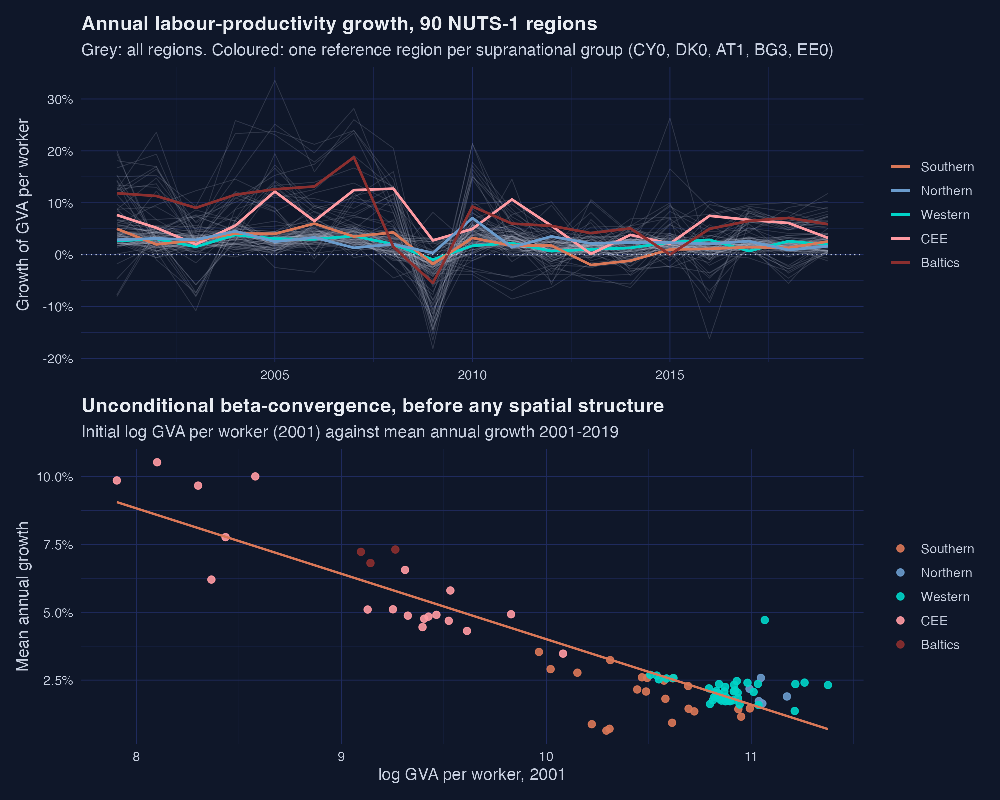
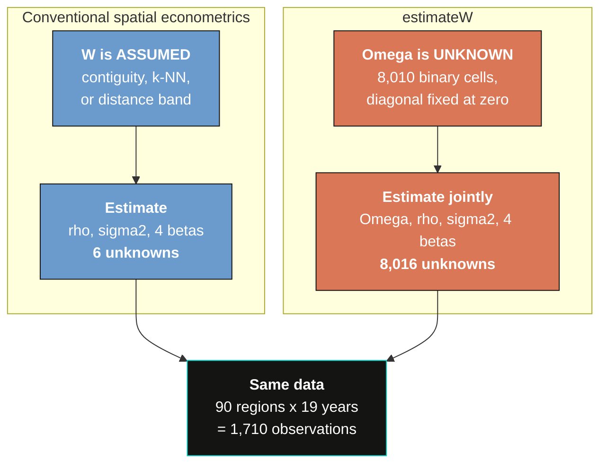
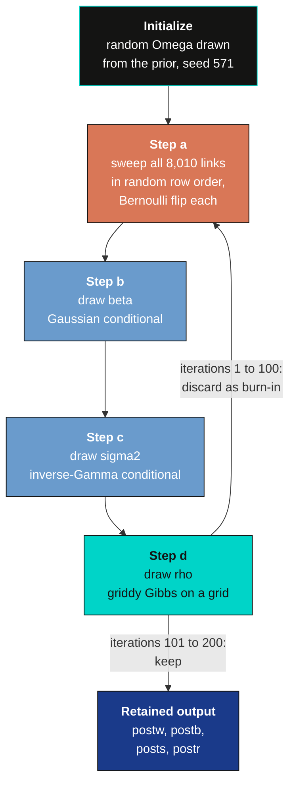
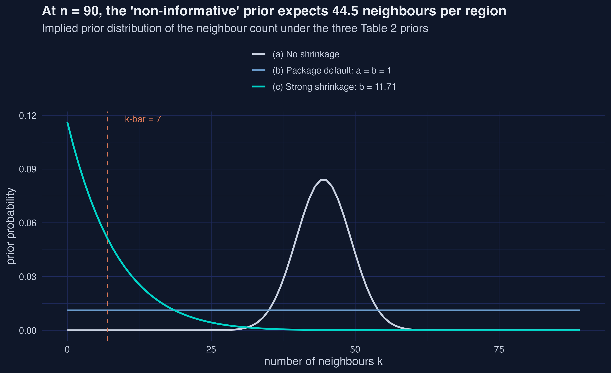
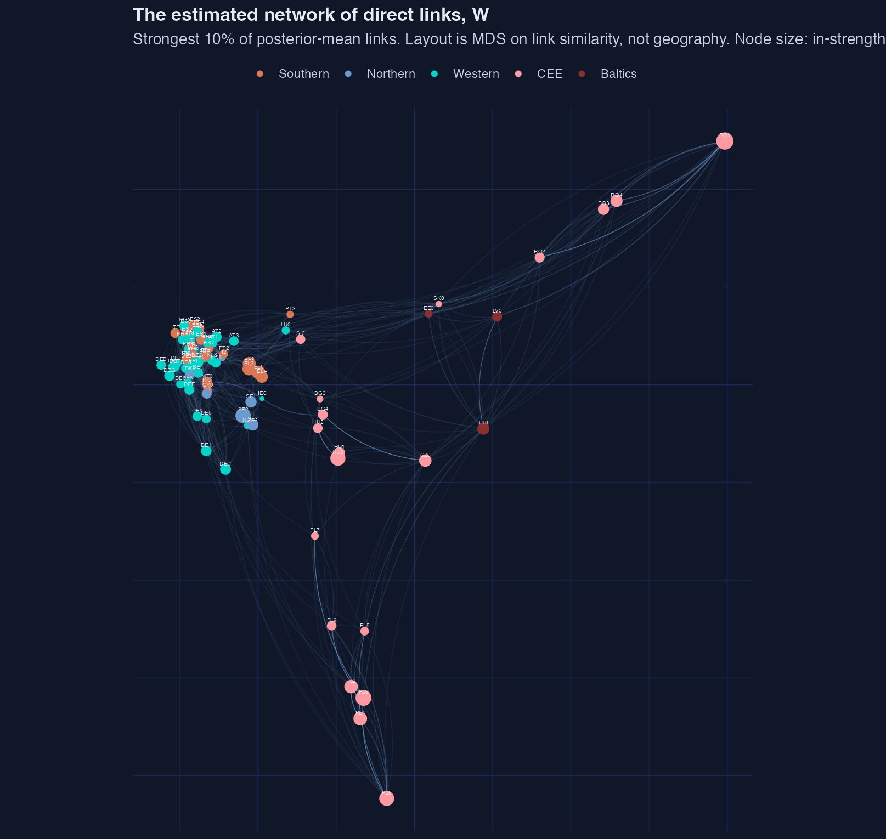
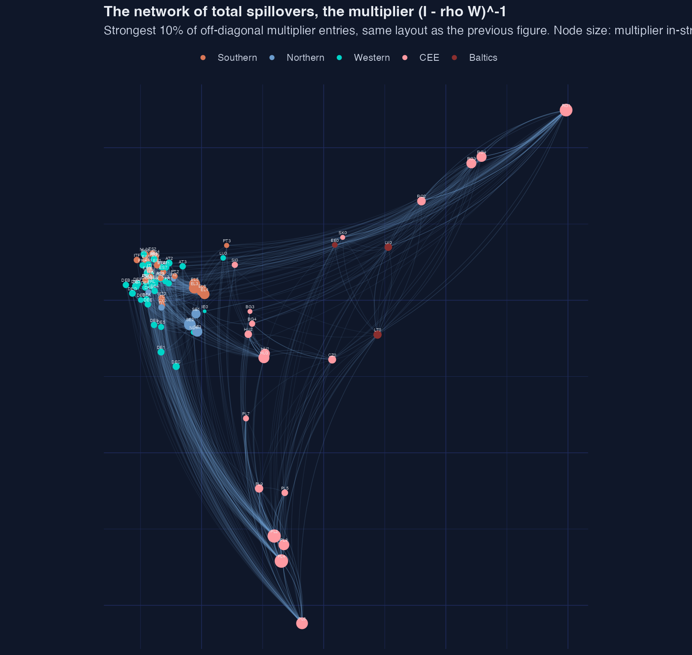
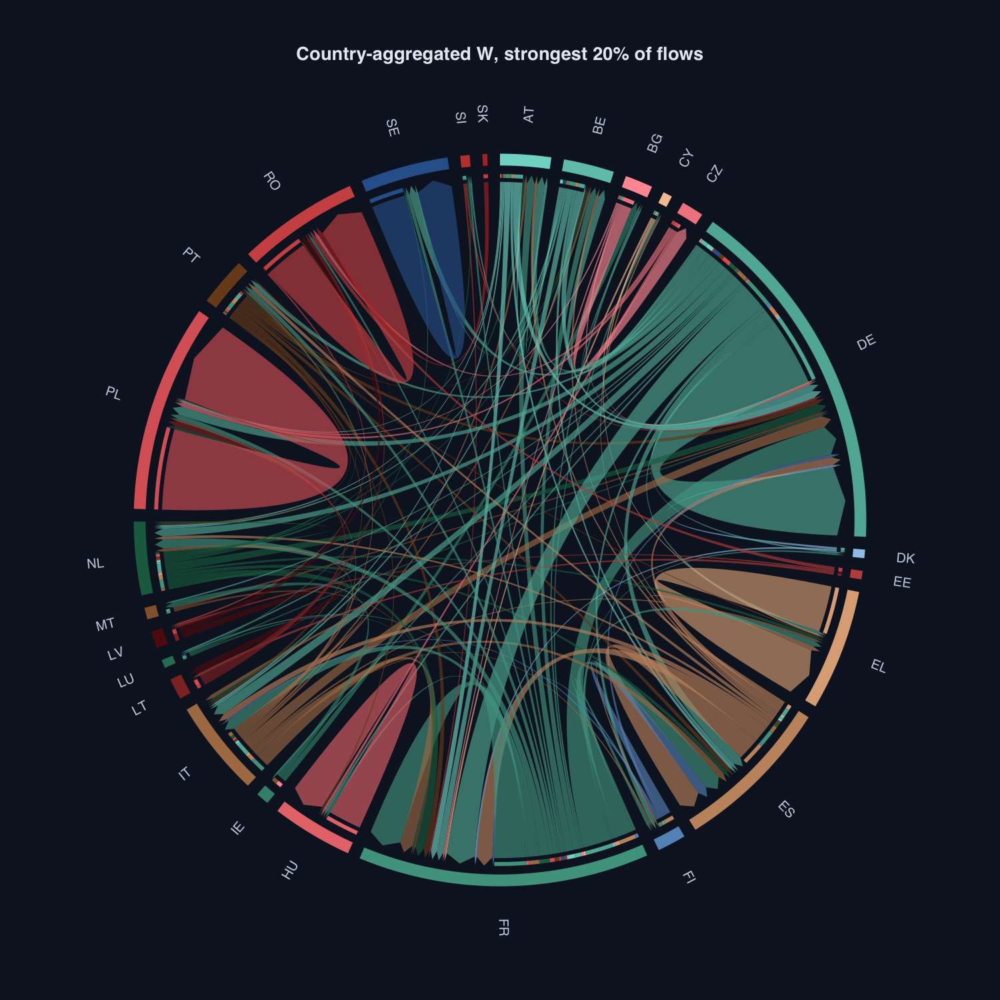
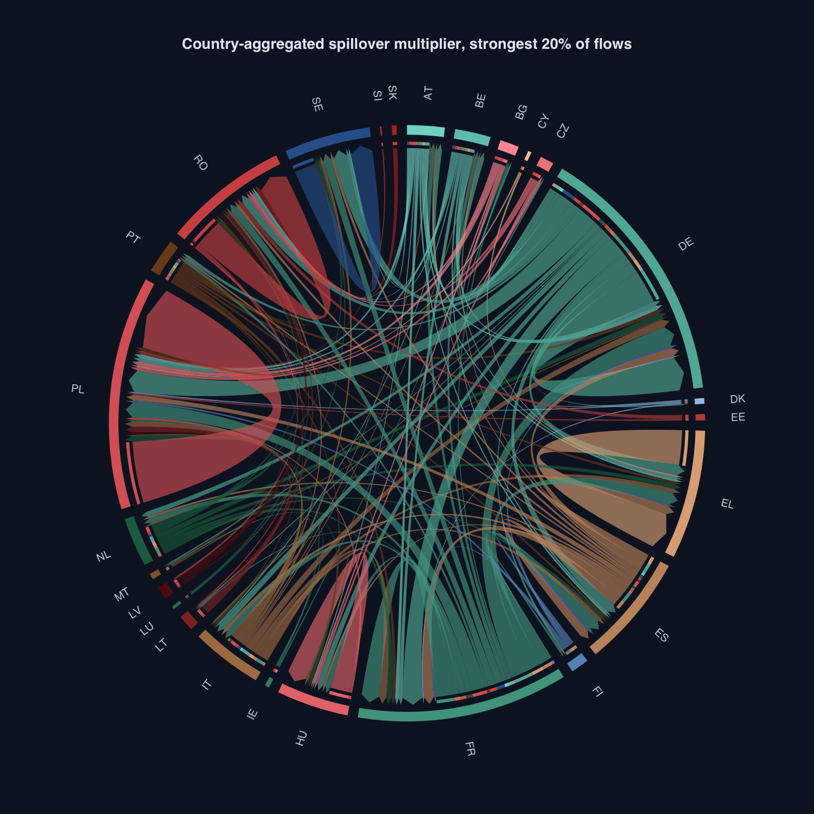
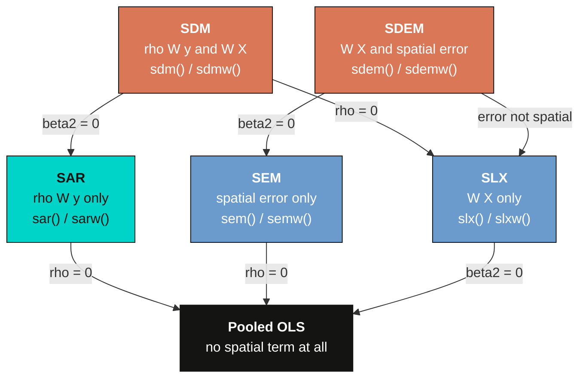

---
authors:
  - admin
categories:
  - R
  - Spatial Regression (SAR, SEM, SDM)
date: "2026-07-30T00:00:00Z"
draft: false
featured: false
external_link: ""
image:
  caption: ""
  focal_point: Smart
  placement: 3
links:
  - icon: chalkboard-teacher
    icon_pack: fas
    name: "Slides (HTML)"
    url: slides/index.html
  - icon: file-pdf
    icon_pack: fas
    name: "AI slides (PDF)"
    url: https://carlos-mendez.org/post/r_estimatew/AI-slides-Bayesian_Spatial_Weight_Estimation.pdf
  - icon: laptop-code
    icon_pack: fas
    name: "Web app"
    url: web_app/index.html
  - icon: code
    icon_pack: fas
    name: "R script"
    url: analysis.R
  - icon: file-code
    icon_pack: fas
    name: "Quarto project (.zip)"
    url: r_estimateW.zip
  - icon: spotify
    icon_pack: fab
    name: "Podcast"
    url: https://creators.spotify.com/pod/profile/carlex777/episodes/Who-Are-My-Neighbors--Bayesian-Estimation-of-Spatial-Weight-Matrices-e3mpcgu/a-acq0ta7
  - icon: markdown
    icon_pack: fab
    name: "MD version"
    url: https://raw.githubusercontent.com/cmg777/starter-academic-v501/master/content/post/r_estimateW/index.md
slides:
summary: "Spatial econometrics usually hands you the neighborhood map before you start. This tutorial estimates it from the data instead, using the estimateW package on 90 European NUTS-1 regions, 2001-2019."
tags:
  - r
  - spatial
  - bayesian
  - mcmc
  - spatial spillovers
  - panel data
  - europe
title: "Who Are My Neighbors? Bayesian Estimation of Spatial Weight Matrices"
url_code: ""
url_pdf: ""
url_slides: ""
url_video: ""
toc: true
diagram: true
---

## Abstract

Every spatial econometric result rests on a neighbourhood map that somebody chose before the analysis began, and if that map is wrong, every spillover estimate built on it is wrong too. This tutorial does not choose the map: it estimates it. Using the `estimateW` package and its built-in `nuts1growth` panel — 90 European NUTS-1 regions observed annually from 2001 to 2019, 1,710 observations, assembled from Eurostat regional accounts — it treats all 8,010 off-diagonal cells of the spatial adjacency matrix as unknown parameters and samples them jointly with the spatial autoregressive parameter, the slope coefficients and the error variance. Estimation uses a Gibbs sampler with element-wise Bernoulli updates for the links, a griddy-Gibbs step for the spatial parameter, and a beta-binomial sparsity prior anchored at seven expected neighbours per region. The replication reproduces all twelve published quantities of Krisztin and Piribauer's Table 3 to five decimal places, recovering a spatial autoregressive parameter of 0.71322 with a posterior standard deviation of 0.01574. The indirect impact of initial productivity, −0.03972, is 2.11 times the direct impact of −0.01880, so most of the growth response to a region's starting position is felt outside its own borders. The estimated network turns out to be organised by country rather than by shared borders. The practical implication is that reported spillovers are only as credible as the neighbourhood map behind them, and here the map the data choose disagrees with the one geography would have supplied.

## 1. Overview

Imagine you have the full transcript of a long conference dinner: who laughed at which joke, who fell silent when, who picked up whose thread. What you do not have is the seating chart. You could still work out who was sitting near whom, because people who sit together react together.

Spatial econometrics normally works the other way around. It hands you the seating chart first — drawn by a cartographer, from shared borders or straight-line distances — and asks you to trust it. Every conclusion about spillovers is then conditional on that chart being right.

This tutorial asks the obvious question: **which European regions actually behave as each other's neighbours for productivity growth — and does it matter whether we assume that map or estimate it?**

The tool is [`estimateW`](https://CRAN.R-project.org/package=estimateW), an R package by Tamás Krisztin and Philipp Piribauer that treats the neighbourhood structure as something to be inferred rather than assumed. We replicate their published European application exactly, then push past it: we check the sampler against a network we build ourselves, we tour the rest of the model family, and we set the estimated map side by side with the contiguity map we would otherwise have used.

**This tutorial assumes no prior spatial econometrics and no prior Bayesian statistics.** Both are built from zero. If you already know one of them, the relevant section will read quickly; nothing later depends on you having skipped it.

If you want the conventional treatment first — the same model family with the neighbourhood map fixed in advance — the companion post [Spatial Dynamic Panel Data Modeling in R](/post/r_SDPDmod/) fits SAR, SDM and their dynamic extensions to US cigarette demand with an assumed contiguity matrix. Read side by side, the two posts are the same machinery with the map moved from the inputs to the outputs.


Read the arrows as escalating trust. Step 2 makes an impossible-looking problem tractable, step 3 shows the machinery works on a case where we know the answer, and only then does step 4 spend that credibility on real data. The last box is the payoff: one model, three different neighbourhood maps, three different answers.

### 1.1 Learning objectives

- **Explain** what a spatial weight matrix is, why row-standardization matters, and why fixing it in advance is a modelling assumption rather than a fact.
- **Derive** the Bernoulli conditional posterior that lets a Gibbs sampler switch a single link on or off, and the griddy-Gibbs step that handles the spatial parameter.
- **Estimate** a spatial autoregressive panel with an unknown neighbourhood structure using `sarw()`, reproducing the published spatial parameter of 0.713 and the full impact decomposition.
- **Assess** whether the sampler works by recovering a network you built yourself with `sim_dgp()`, and by reading trace plots, effective sample sizes and multi-chain diagnostics.
- **Compare** the estimated map against contiguity and nearest-neighbour maps built from real NUTS-1 geometry, and judge which conclusions survive the change.

### 1.2 Key concepts at a glance

This post leans on a small vocabulary repeatedly, and everything after Section 5 assumes you can move between these terms quickly. Each concept below has three parts. The **definition** is always visible. The **example** and **analogy** sit behind clickable cards: open them when you need them, leave them collapsed for a quick scan. If a later section mentions the *spatial multiplier* or the *sparsity prior* and the term feels slippery, this is the section to re-read.

**1. Spatial weight matrix** $W$.
An $n \times n$ table of neighbour weights. Row $i$ says who influences region $i$. Row-standardization makes every row sum to one. So $W y$ is just each region's neighbour average.

<div class="concept-pair">
<details class="concept-card concept-example">
<summary>Example</summary>

Here $W$ is 90 by 90, one row and one column per European region. A region with 7 estimated neighbours gives each of them weight $1/7 \approx 0.143$. The other 82 entries in that row are exactly zero.

</details>

<details class="concept-card concept-analogy">
<summary>Analogy</summary>

A phone contact list where your daily call minutes are split evenly among everyone on it. Adding a name does not buy you more minutes. It just gives everyone a thinner slice. That even split is row-standardization.

</details>
</div>

**2. Adjacency matrix** $\Omega$.
The raw yes-or-no version of $W$. Each entry $\omega\_{ij}$ is 1 if $j$ is a neighbour of $i$, and 0 otherwise. The diagonal is fixed at zero. Conventional models fix every entry in advance. Here every entry is estimated.

<div class="concept-pair">
<details class="concept-card concept-example">
<summary>Example</summary>

With $n = 90$ regions, $\Omega$ has $90^2 - 90 = 8{,}010$ off-diagonal cells, and each one is a separate unknown parameter. We have only $90 \times 19 = 1{,}710$ observations to pin them down.

</details>

<details class="concept-card concept-analogy">
<summary>Analogy</summary>

An old telephone switchboard with 8,010 unlabelled sockets. Each one is either patched or not. Somebody threw away the wiring diagram, and you have to reconstruct it from listening to the calls.

</details>
</div>

**3. Spatial autoregressive parameter** $\rho$.
One number for the whole system. It scales how strongly neighbours' outcomes feed into your own. At $\rho = 0$ space is irrelevant. Stability requires $|\rho| < 1$.

<div class="concept-pair">
<details class="concept-card concept-example">
<summary>Example</summary>

We estimate $\rho = 0.713$ with a posterior standard deviation of 0.016. A one-point rise in a region's neighbour-average growth rate moves its own growth by about 0.713 points, before any feedback.

</details>

<details class="concept-card concept-analogy">
<summary>Analogy</summary>

The gain knob on a public-address system. Every speaker feeds every microphone a little. Turn the knob up and the room gets louder and louder from the same original sound. Past one, it howls.

</details>
</div>

**4. Spatial multiplier** $(I\_n - \rho W)^{-1}$.
The device that turns one local shock into a system-wide outcome. Round one hits your neighbours. Round two hits their neighbours. Powers of $\rho$ shrink each later round.

<div class="concept-pair">
<details class="concept-card concept-example">
<summary>Example</summary>

With $\rho = 0.713$ the second round still carries weight $0.713^2 = 0.508$ and the third $0.362$. That is why the multiplier network is far denser than $W$ itself: almost everyone eventually reaches almost everyone.

</details>

<details class="concept-card concept-analogy">
<summary>Analogy</summary>

A rumour retold office to office. Each retelling reaches more people and loses a little detail. It never quite stops, but it does get quieter every time it is passed on.

</details>
</div>

**5. Direct, indirect and total impacts.**
Slope coefficients are not marginal effects in a spatial model. The direct impact is the own-region effect. The indirect impact is the spillover onto everyone else. Total is the two added.

<div class="concept-pair">
<details class="concept-card concept-example">
<summary>Example</summary>

For initial productivity the direct impact is $-0.0188$ and the indirect is $-0.0397$. The spillover is 2.11 times the own-region effect, so most of the action happens outside the region's own borders.

</details>

<details class="concept-card concept-analogy">
<summary>Analogy</summary>

Your shop cuts its prices. The direct effect is what happens at your own till. The indirect effect is what happens at every other till on the street. On a busy street the second number is the bigger one.

</details>
</div>

**6. Prior, likelihood, posterior.**
The prior is what you believed before seeing the data. The likelihood says how well each candidate explains the data. The posterior is the updated belief. Bayesian output is always a posterior distribution, never a single number.

<div class="concept-pair">
<details class="concept-card concept-example">
<summary>Example</summary>

Before seeing any data, each of the 8,010 possible links carries a prior probability of $7/89 = 0.079$. After the sampler runs, a handful of them sit far above that and most sit far below.

</details>

<details class="concept-card concept-analogy">
<summary>Analogy</summary>

A weather app that opens with the seasonal average for today's date, then revises the forecast with every new radar sweep. The seasonal average is the prior. The radar is the likelihood. What you actually read on screen is the posterior.

</details>
</div>

**7. Gibbs sampling.**
A way to sample from a huge joint distribution one piece at a time. Hold everything else fixed. Draw one unknown from its conditional distribution. Repeat, thousands of times.

<div class="concept-pair">
<details class="concept-card concept-example">
<summary>Example</summary>

Each sweep of our sampler visits all 8,010 possible links in random row order. For each one it computes the probability that the link is on, given everything else, and flips a weighted coin.

</details>

<details class="concept-card concept-analogy">
<summary>Analogy</summary>

Tuning a piano string by string. You never solve the whole instrument at once. You fix one string given how the others currently sound, then move on, and go round again until nothing changes.

</details>
</div>

**8. Sparsity prior.**
A prior on how many neighbours each region has, rather than on which ones. It pulls the network toward being sparse. The seemingly neutral alternative quietly expects a very dense network.

<div class="concept-pair">
<details class="concept-card concept-example">
<summary>Example</summary>

We anchor the prior at $\underline{k} = 7$ expected neighbours, which sets $\underline{b}\_\omega = (89 - 7)/7 = 11.71$. The flat alternative would instead expect 44.5 neighbours per region — half of Europe.

</details>

<details class="concept-card concept-analogy">
<summary>Analogy</summary>

A hiring budget that does not forbid any particular offer, but quietly assumes you will end up with about seven people. You can hire the eighth. You just have to justify it.

</details>
</div>

## 2. Setup

The analysis needs `estimateW` for the samplers and its built-in data, `sf` for the NUTS-1 geometry used in the benchmark section, `coda` for convergence diagnostics, `circlize` for the chord diagrams, and the usual `ggplot2` and `dplyr` stack. Everything is on CRAN and pure R except `sf`, which needs GDAL. Section 13 is the only part that touches the network, and even that is cached after the first run.

```r
cran_packages <- c("estimateW", "ggplot2", "dplyr", "tidyr", "readr", "tibble",
                   "purrr", "glue", "scales", "patchwork", "coda", "sf", "circlize")
missing <- cran_packages[!sapply(cran_packages, requireNamespace, quietly = TRUE)]
if (length(missing) > 0) install.packages(missing, repos = "https://cloud.r-project.org")

library(estimateW)
library(ggplot2); library(dplyr); library(tidyr); library(coda); library(sf)

packageVersion("estimateW")
```

```text
[1] '0.2.0'
```

Pin that version. Every number in this post comes from `estimateW` 0.2.0 under R 4.5.2, and the exact-reproduction claim in Section 9 depends on both.

All figures use the site's dark-navy palette, defined once and reused:

```r
BG <- "#0f1729"; GRID <- "#1f2b5e"; TEXT <- "#c8d0e0"; WHITE <- "#e8ecf2"
STEEL <- "#6a9bcc"; ORANGE <- "#d97757"; TEAL <- "#00d4c8"
# theme_dark_site() and save_fig() are defined in analysis.R
```

## 3. The data: 90 European regions, 19 years

The package ships the panel used in the published application, so nothing has to be downloaded.

```r
data(nuts1growth)
str(nuts1growth)
```

```text
'data.frame':	1710 obs. of  6 variables:
 $ NUTS1        : chr  "AT1" "AT2" "AT3" "BE1" ...
 $ year         : int  2001 2001 2001 2001 2001 2001 2001 2001 2001 2001 ...
 $ growth_gdp_pw: num  0.0264 0.021 0.0249 0.0223 0.0139 ...
 $ init_gdp_pw  : num  11 10.8 10.9 11.3 11 ...
 $ loweduc      : num  22.5 22.6 26.2 37.5 40.4 44.5 34.5 30.5 38.5 13.9 ...
 $ higheduc     : num  15.9 11.5 13.5 37 26.6 25 15.2 21.2 25.1 11.5 ...
```

Six columns and 1,710 rows. `growth_gdp_pw` is the annual growth rate of real gross value added per worker — labour productivity growth, our outcome. `init_gdp_pw` is the log level of productivity in the previous year, the conditional-convergence term. `loweduc` and `higheduc` are the shares of the working-age population with the lowest and highest ISCED education levels, both lagged one year; the omitted middle category is the benchmark. The rows are stacked year by year, and the region order repeats identically in each of the 19 blocks — a detail that matters, because the sampler indexes the weight matrix by row position, not by region code.

The model matrices follow the published specification exactly. There are no spatially lagged regressors here, so everything goes into `Z`:

```r
Y <- as.matrix(nuts1growth$growth_gdp_pw)
Z <- cbind(1, nuts1growth$init_gdp_pw,
           nuts1growth$loweduc,
           nuts1growth$higheduc)
n <- 90
tt <- 19
dim(Y); dim(Z)
```

```text
[1] 1710    1
[1] 1710    4
```

That is $n \times T = 90 \times 19 = 1{,}710$ rows, and four columns in `Z`: an intercept, initial productivity, and the two education shares. Note what is *not* in the call — no weight matrix. That absence is the whole point of the exercise.

The 90 regions come from 26 countries. Following the published grouping, we sort them into five supranational blocs, which will do a lot of work when we come to read the estimated network:

```r
table(regions$country_group)
```

```text
Southern Northern  Western      CEE  Baltics 
      21        6       41       19        3 
```

Western Europe supplies 41 of the 90 regions, largely because Germany alone contributes 16 and France 13. Eleven countries — Cyprus, Czechia, Denmark, Estonia, Ireland, Lithuania, Luxembourg, Latvia, Malta, Slovenia and Slovakia — are a single NUTS-1 region each. Keep that asymmetry in mind: a finding that "regions cluster within countries" is partly mechanical for Germany and impossible for Malta.

## 4. What the growth data look like before we assume anything spatial

Before introducing any neighbourhood structure, it is worth seeing what is in the data.

```r
p1a <- ggplot(panel, aes(year, growth_gdp_pw, group = NUTS1)) +
  geom_line(colour = TEXT, alpha = 0.16, linewidth = 0.3) +
  geom_line(data = filter(panel, NUTS1 %in% hi),
            aes(colour = country_group), linewidth = 0.9)
p1b <- ggplot(panel_summary, aes(init_gdp_pw_2001, mean_growth,
                                 colour = country_group)) +
  geom_point(size = 2.1) +
  geom_smooth(method = "lm", se = FALSE, colour = ORANGE)
save_fig(p1a / p1b, "01_panel_overview", w = 10, h = 8)
```


*Figure 1. Top: growth paths, with the 2009 crisis visible as a synchronised collapse across every region. Bottom: initially poorer regions grew faster over 2001–2019.*

Two things stand out. First, the growth paths move together — the 2009 trough is a single downward spike shared by essentially all 90 regions. That common movement is exactly what a spatial model tries to explain, and also exactly what makes the exercise hard: co-movement can come from genuine spillovers or from shocks that hit everyone at once. Second, the scatter shows textbook beta-convergence, with the Central and Eastern European regions in the poor-and-fast corner and the Western European regions in the rich-and-slow one.

A pooled OLS regression makes the convergence pattern numerical, and gives us a baseline with no spatial structure whatsoever:

```r
ols <- lm(growth_gdp_pw ~ init_gdp_pw + loweduc + higheduc, data = panel)
summary(ols)$coefficients
```

```text
                 Estimate   Std. Error     t value     Pr(>|t|)
(Intercept)  4.199319e-01 0.0185948061  22.5832924 5.132094e-99
init_gdp_pw -3.677661e-02 0.0019464708 -18.8939955 1.900699e-72
loweduc     -6.120117e-05 0.0000692265  -0.8840715 3.767822e-01
higheduc     2.638630e-04 0.0001544331   1.7085905 8.770872e-02
```

A one-log-point higher starting productivity is associated with 3.68 percentage points slower annual growth. Hold on to that number: when we add spatial structure, the coefficient on the same variable will fall to −1.69 percentage points. Nothing about the data will have changed. What changes is the bookkeeping — the non-spatial model credits each region alone with everything that happens near it, while the spatial model splits the same association into an own-region part and a spillover part.

Nothing above used the word *neighbour*. That word is about to do an enormous amount of work, so we define it next.

## 5. A spatial weight matrix, and why choosing one is a decision

### 5.1 From a yes-or-no adjacency matrix to weights

Spatial models need a single object that says who is next to whom. It starts as a yes-or-no table, the adjacency matrix $\Omega$, whose entry $\omega\_{ij}$ is 1 when region $j$ counts as a neighbour of region $i$ and 0 otherwise. The diagonal is fixed at zero: you are not your own neighbour.

Raw counts of neighbours are awkward to compare, because a region with eight neighbours would mechanically get eight times the spatial pull of a region with one. Row-standardization fixes that:

$$w\_{ij} = \frac{\omega\_{ij}}{\sum\_{j=1}^{n} \omega\_{ij}}$$

In words, this says that each link's weight is its share of that region's total links, so every row of $W$ adds up to one. A region with 7 neighbours gives each of them $1/7$. A region with no neighbours at all keeps a row of zeros. In code, $\omega\_{ij}$ is a cell of the sampled adjacency matrix and $w\_{ij}$ is the corresponding cell of `postw`, the array of retained draws.

It is worth building one by hand once, on four regions arranged in a line:

```r
Omega <- matrix(0, 4, 4)
Omega[1, 2] <- 1
Omega[2, c(1, 3)] <- 1
Omega[3, c(2, 4)] <- 1
Omega[4, 3] <- 1
W <- Omega / rowSums(Omega)
Omega
W
```

```text
     [,1] [,2] [,3] [,4]
[1,]    0    1    0    0
[2,]    1    0    1    0
[3,]    0    1    0    1
[4,]    0    0    1    0

     [,1] [,2] [,3] [,4]
[1,]  0.0  1.0  0.0  0.0
[2,]  0.5  0.0  0.5  0.0
[3,]  0.0  0.5  0.0  0.5
[4,]  0.0  0.0  1.0  0.0
```

Region 1 sits at the end of the line and has one neighbour, so that neighbour gets the full weight of 1. Region 2 sits in the middle with two neighbours, so each gets 0.5. Multiply any vector of regional outcomes by this $W$ and you get, for each region, the average outcome of its neighbours — nothing more exotic than that.

If the phrase *spatial weights matrix* is new, the post [Exploratory Spatial Data Analysis in Python](/post/python_esda2/) builds one from scratch with PySAL's Queen contiguity and shows what Moran's I does with it, and [How to build a spatial weights matrix](/post/python_how_to_build_w/) is the shorter, purely mechanical companion.

### 5.2 The model, and why coefficients are not effects

The general specification in the package is the spatial Durbin model, which nests the rest of the family:

$$y\_t = \rho W y\_t + X\_t \beta\_1 + W X\_t \beta\_2 + Z\_t \beta\_3 + \varepsilon\_t$$

In words, a region's outcome this year depends on its neighbours' outcomes, on its own covariates, on its neighbours' covariates, on covariates that never get spatially lagged, and on noise. Here $y\_t$ is the year-$t$ slice of `Y`, $Z\_t$ is the year-$t$ slice of `Z`, $\rho$ is stored in `postr`, the slopes in `postb`, and $W$ in `postw`.

The published application uses the simpler spatial autoregressive form, with no spatially lagged regressors:

$$y\_t = \rho W y\_t + Z\_{t-1} \beta + \varepsilon\_t$$

In words, labour-productivity growth in a region equals a fraction $\rho$ of its neighbours' average growth, plus the effect of last year's conditions, plus noise. The outcome $y\_t$ is `growth_gdp_pw`; the lagged conditions in $Z\_{t-1}$ are `init_gdp_pw`, `loweduc`, `higheduc` and an intercept; errors are normal with variance $\sigma^2$.

That $\rho W y\_t$ term on the right-hand side is what makes the model interesting and what makes its coefficients hard to read. Solve for $y\_t$ and you get the reduced form:

$$y\_t = (I\_n - \rho W)^{-1}(Z\_{t-1} \beta + \varepsilon\_t)$$

In words, once you untangle the simultaneity, every region's outcome is a function of *every* region's covariates and shocks, not just its own. The matrix $(I\_n - \rho W)^{-1}$ that does the untangling is the spatial multiplier, and it has an illuminating expansion:

$$(I\_n - \rho W)^{-1} = I\_n + \rho W + \rho^2 W^2 + \rho^3 W^3 + \cdots$$

In words, the multiplier is the sum of all the bounces: yourself first, then your neighbours, then your neighbours' neighbours, each round discounted by another power of $\rho$. With the value we will estimate, $\rho = 0.713$, the second round still carries weight 0.508 and the third 0.362. Nothing is local for long.

The immediate consequence is that $\beta$ is not a marginal effect. We will return to the right summaries — direct, indirect and total impacts — in Section 9, once we have a fitted model to attach them to.

### 5.3 Counting the unknowns

Now the uncomfortable arithmetic. If $W$ is known, the model has very few unknowns. If $W$ is not known, it has an enormous number:

$$\text{Number of unknowns} = 2 + (n^2 - n) + 2q\_1 + q\_2$$

In words, $\rho$ and $\sigma^2$ make two, every off-diagonal cell of the adjacency matrix is another, and then come the slope coefficients. With $n = 90$, no spatially lagged regressors ($q\_1 = 0$) and four ordinary ones ($q\_2 = 4$):

```r
n <- 90; tt <- 19; q1 <- 0; q2 <- 4
c(unknown_links   = n^2 - n,
  total_unknowns  = 2 + (n^2 - n) + 2 * q1 + q2,
  observations    = n * tt,
  params_per_obs  = (2 + (n^2 - n) + 2 * q1 + q2) / (n * tt))
```

```text
 unknown_links total_unknowns   observations params_per_obs 
   8010.000000    8016.000000    1710.000000       4.687719 
```

| | Assumed $W$ | Estimated $W$ |
|---|---:|---:|
| $\rho$ and $\sigma^2$ | 2 | 2 |
| Slope coefficients | 4 | 4 |
| Off-diagonal cells of $\Omega$ | 0 (fixed) | 8,010 |
| **Total unknowns** | **6** | **8,016** |
| Observations ($nT$) | 1,710 | 1,710 |
| Observations per unknown | 285 | **0.21** |



Both columns end at the same 1,710 numbers. The left column asks those numbers to pin down 6 unknowns, which is comfortable. The right column asks them to pin down 8,016, which is impossible by likelihood alone.

**A model with 4.7 parameters per observation cannot be estimated by likelihood alone. Everything below depends on the prior. That is not a caveat about the method; it *is* the method.** The next two sections are about nothing else.

## 6. Bayesian machinery, from zero

### 6.1 Prior, likelihood, posterior

If you have never used a Bayesian method, here is the whole idea in one line:

$$p(\theta \mid \mathcal{D}) \propto p(\mathcal{D} \mid \theta) \\, p(\theta)$$

In words, your belief after seeing the data is proportional to how well each candidate explains the data, times your belief before seeing it. The symbol $\theta$ stands for all the unknowns at once — here $\rho$, $\sigma^2$, the four slopes, and all 8,010 links — and $\mathcal{D}$ is the data.

Think of a weather app. It opens with the seasonal average for today's date; that is $p(\theta)$, the prior. Then radar sweeps come in, and each one is more consistent with some forecasts than others; that is the likelihood $p(\mathcal{D} \mid \theta)$. What you actually read on the screen is the reconciliation of the two, the posterior. The app never shows you a single certain temperature, and neither will we: every output in this post is a distribution, summarised by its mean and standard deviation.

The reason a Bayesian approach is not optional here is Section 5.3. With 4.7 unknowns per observation, the likelihood alone does not have a unique peak to climb. The prior is what makes the problem well posed. Another Bayesian spatial MCMC application on this site, with a different purpose, is [Bayesian Spatial Synthetic Control](/post/r_sc_bayes_spatial/).

### 6.2 The likelihood of a spatial panel

The likelihood for the spatial autoregressive panel is the usual Gaussian fit term with one extra factor:

$$p(\mathcal{D} \mid \cdot) = \frac{|S|}{(2\pi\sigma^2)^{nT/2}} \exp\left[-\frac{1}{2\sigma^2}(SY - U\beta)'(SY - U\beta)\right]$$

In words, this is the familiar sum-of-squared-errors criterion, multiplied by a Jacobian $|S|$ that charges the model for the spatial feedback it uses. Here $S = I\_T \otimes (I\_n - \rho W)$ is the spatial filter applied to every time period, $Y$ is the stacked outcome, and $U$ collects the regressors — in our specification simply `Z`.

That determinant is not decoration. Without it, the model could raise $\rho$ for free: more spatial feedback would always fit better, and $\rho$ would run to its upper bound. The Jacobian is the price of borrowing strength from your neighbours, and it is also the reason the sampler needs a fast way to recompute a determinant, which we come to in Section 6.4.

### 6.3 Gibbs sampling, and the one-link Bernoulli step

Sampling 8,016 unknowns jointly is hopeless. Gibbs sampling makes it tractable by never doing anything jointly: it draws one block at a time, conditioning on the current values of everything else, and cycles.

For the links, the conditional distribution is remarkably simple. A link is either on or off, so once everything else is held fixed there are only two states to evaluate:

$$p(\omega\_{ij} \mid \Omega\_{-ij}, \cdot, \mathcal{D}) \sim \text{Bernoulli}\left(\frac{\bar{p}^{(1)}\_{ij}}{\bar{p}^{(0)}\_{ij} + \bar{p}^{(1)}\_{ij}}\right)$$

In words: score the model with the link switched on, score it with the link switched off, normalise the two scores so they sum to one, and flip a coin weighted by the result. Here $\bar{p}^{(1)}\_{ij}$ is the likelihood times the prior evaluated at $\omega\_{ij} = 1$, and $\bar{p}^{(0)}\_{ij}$ the same at $\omega\_{ij} = 0$. Because this holds for any proper prior on a binary quantity, ordinary Gibbs sampling works for every one of the 8,010 cells.

That is genuinely all there is to it. The sampler is tuning a piano string by string: it never solves the whole instrument at once, it just fixes one string given how the others currently sound, and goes round again.

### 6.4 Griddy Gibbs for $\rho$, and why the sampler is fast

The slopes and the variance have textbook conditional distributions — Gaussian and inverse-Gamma respectively — so they are drawn directly. The spatial parameter $\rho$ does not:

$$p(\rho \mid \cdot, \mathcal{D}) \propto p(\rho) |S| \exp\left[-\frac{1}{2\sigma^2}(SY - U\beta)'(SY - U\beta)\right]$$

In words, this has no closed form you can sample from, because $\rho$ sits inside both the determinant and the quadratic form. The package therefore evaluates this density on a fine grid over the admissible range and samples from the grid as if it were a histogram — the *griddy Gibbs* step.

**Griddy Gibbs.** A trick for a parameter with no textbook conditional distribution. Score its density on a fine grid. Then sample from the grid in proportion to the scores. It is like measuring a hill's height every ten metres and then picking a spot in proportion to the heights you measured. The consequence is visible in the trace plots later: $\rho$ takes visibly *stepped* values, because it can only ever land on one of the grid points.

The remaining problem is speed. Every one of the 8,010 link updates changes $W$, which changes $S$, which changes $|S|$ — and a determinant of a $90 \times 90$ matrix costs $O(n^3)$. At 200 iterations that would be 1.6 million such determinants. The package avoids nearly all of that cost by noticing that flipping one link is a *rank-one* change to $W$, so the Sherman-Morrison identity updates both $\log|S|$ and $(I\_n - \rho W)^{-1}$ exactly, at trivial cost. This is why estimating 8,010 links takes minutes rather than weeks.



Step (a) is where the 8,010 unknowns live, and it is the reason the Sherman-Morrison update matters. Steps (b) and (c) are ordinary Bayesian regression. Step (d) is the grid. Notice that the map changes between every draw of $\beta$ — which is exactly why Section 11 has to check that $\beta$ mixes at all.

## 7. The prior architecture

The prior on the links has two independent parts, and separating them is the design decision that makes the package usable:

$$\underline{p}\_{ij} \propto \underline{\omega}\_{ij} \\, \underline{m}(k\_i)$$

In words, the prior probability of a link is *where you think links can be* times *how many links you think each region has*. The first component $\underline{\omega}\_{ij}$ is supplied through the `W_prior` argument, the second $\underline{m}(k\_i)$ through `nr_neighbors_prior`. One says where, the other says how many.

### 7.1 The spatial component: where links can be

Each $\underline{\omega}\_{ij}$ lives in $[0, 1]$. A value of 0.5 means "I have no idea, estimate it". A value of 0 means "this link cannot exist". A value of 1 means "this link definitely exists". The package's default is 0.5 everywhere off the diagonal.

The paper illustrates the possibilities on a stylised linear city of 30 regions, where region 1 borders region 2, region 2 borders 1 and 3, and so on. We reproduce all four cases:

```r
NC <- 30
d_lin <- abs(outer(1:NC, 1:NC, "-"))
mk <- function(m) { diag(m) <- 0; m }
prior_cases <- list(
  "A. All links unknown (the default)" = mk(matrix(0.5, NC, NC)),
  "B. Known 10-nearest-neighbour W"    = mk((d_lin <= 5) * 1),
  "C. Distance band, unknown inside"   = mk((d_lin <= 8) * 0.5),
  "D. Mixed: forced, unknown, excluded" = mk(ifelse(d_lin == 1, 1,
                                             ifelse(d_lin <= 8, 0.5, 0)))
)
```


*Figure 2. Replication of the paper's Figure 1. Dark navy = excluded, blue = unknown and estimated, orange = forced.*

Case A is the default we will use: nothing is ruled in or out, and all 870 off-diagonal cells are sampled. Case C encodes partial knowledge — links beyond a distance band are ruled out, leaving 408 cells to estimate — which both injects information and cuts the computational cost, because cells fixed at 0 or 1 are never sampled at all.

Case B deserves a sentence of its own, because it is the whole conventional literature in one panel. **Setting `W_prior` to a matrix of zeros and ones reduces `sarw()` to `sar()`.** Standard spatial econometrics is not a different method from this one; it is this method with a degenerate prior, in which the neighbourhood map is asserted with probability one and never questioned. Everything that follows is about what happens when you relax that assertion.

### 7.2 The sparsity component: how many links there are

The second component governs how many neighbours each region has. Write $k\_i = \sum\_j \omega\_{ij}$ for the number of neighbours of region $i$. The package's default puts a beta-binomial prior on $k\_i$, which in terms of the weight you actually supply is:

$$\underline{m}(k\_i) = \Gamma(\underline{a}\_\omega + k\_i) \\, \Gamma(n - 1 + \underline{b}\_\omega - k\_i)$$

In words, this is a flexible weight attached to each possible neighbour count, whose shape is controlled by two numbers $\underline{a}\_\omega$ and $\underline{b}\_\omega$. In code it is exactly `bbinompdf(0:(n-1), nsize = n-1, a = a_pr, b = b_pr)`.

There are three natural choices, and comparing them is the most important thing in this section:

```r
n <- 30; k <- 0:(n - 1); kbar <- 5
m_flat      <- rep(1, n)
m_default   <- bbinompdf(k, nsize = n - 1, a = 1, b = 1)
m_shrinkage <- bbinompdf(k, nsize = n - 1, a = 1, b = ((n - 1) - kbar) / kbar)
# the implied prior on k multiplies by the number of ways to choose k neighbours
p_k <- function(m) { p <- choose(n - 1, k) * m; p / sum(p) }
sapply(list(m_flat, m_default, m_shrinkage), function(m) sum(k * p_k(m)))
```

```text
[1] 14.5 14.5  5.0
```


*Figure 3. Replication of the paper's Table 2 for n = 30. Top row: the weight you supply. Bottom row: the prior it implies. Orange line: prior mean degree.*

The figure repays careful reading, because the two rows tell different stories. Look at the middle column: the weight $\underline{m}(k)$ you supply is violently U-shaped, with all its mass at 0 and 29 neighbours and essentially nothing in between — it looks like the most opinionated prior imaginable. But the bottom row shows the prior it actually implies on the neighbour count, and that is perfectly *uniform* across 0 to 29. The binomial coefficient $\binom{n-1}{k}$ does the reconciling: there are astronomically more ways to pick 15 neighbours out of 29 than to pick 0, and the U-shaped weight exactly cancels that combinatorial explosion. **What you supply is not what you get, and only the bottom row is the prior you are actually asserting.**

The left column carries the warning that matters most in practice. A flat weight, `rep(1, n)`, is the natural thing to write if you want to "not impose anything". But it implies a Binomial$(n-1, 0.5)$ prior on the neighbour count, centred at $(n-1)/2$. At our real sample size that is not 14.5 but **44.5 neighbours per region** — a prior belief that every European region is directly connected to half of Europe.


*Figure 4. At the real sample size, the two "non-informative" priors expect 44.5 neighbours per region. Only the shrinkage prior expects a sparse network.*

Neither the flat nor the default prior is neutral at $n = 90$. Both put their mass on extremely dense networks, and with only 19 time periods that prior would dominate the likelihood rather than be updated by it. This is the concrete reason the published application uses shrinkage.

### 7.3 Anchoring the expected degree

To impose sparsity you fix $\underline{a}\_\omega = 1$ and solve for the $\underline{b}\_\omega$ that delivers a target expected number of neighbours $\underline{k}$:

$$\underline{b}\_\omega = \frac{(n - 1) - \underline{k}}{\underline{k}}$$

In words, pick how many neighbours you think a region has, and this formula gives you the prior hyperparameter that encodes it. With $n = 90$ and $\underline{k} = 7$, that is $\underline{b}\_\omega = (89 - 7)/7 = 11.714$, and a prior probability of $7/89 = 7.87\\%$ for any individual link.

```r
kbar <- 7
Wprior <- matrix(0.5, ncol = n, nrow = n)
diag(Wprior) <- 0
a_pr <- 1
b_pr <- ((n - 1) - kbar) / kbar
priorW_hierarchical <- bbinompdf(0:(n - 1), nsize = (n - 1), a = a_pr, b = b_pr)
AA <- W_priors(n = n, W_prior = Wprior,
               nr_neighbors_prior = priorW_hierarchical)
c(b_prior = b_pr, prior_link_prob = kbar / (n - 1))
```

```text
        b_prior prior_link_prob 
    11.71428571      0.07865169 
```

If this construction feels familiar from a completely different setting, it should. It is the Ley and Steel model-size prior from Bayesian model averaging, applied to the number of *links* instead of the number of *regressors*. The post [Bayesian Model Averaging, LASSO and WALS in R](/post/r_bma_lasso_wals/) derives the same prior in a setting with no geography at all.

The value 7 is a researcher choice, and it should be reported as one. Section 15 returns to this; the honest practice is to report a sweep over $\underline{k}$, never a single value.

### 7.4 Priors for the remaining parameters

The other three blocks take conventional, deliberately diffuse priors, and the defaults are what the published application uses:

```r
beta_priors(k = 4)     # Gaussian, mean 0, variance 100 * I
sigma_priors()         # inverse-Gamma, shape = rate = 0.001
str(rho_priors())      # 4-parameter Beta, plus the sampler's own settings
```

```text
List of 11
 $ rho_a_prior     : num 1
 $ rho_b_prior     : num 1
 $ griddy_n        : num 60
 $ rho_min         : num 0
 $ rho_max         : num 1
 $ init_rho_scale  : num 1
 $ use_griddy_gibbs: logi TRUE
 $ use_pace_barry  : logi TRUE
 $ mh_tune_low     : num 0.4
 $ mh_tune_high    : num 0.6
 $ mh_tune_scale   : num 0.1
```

`rho_priors()` carries more than a prior: `griddy_n = 60` is the number of grid points the griddy-Gibbs step scores each sweep, which is why $\rho$ can only ever take 60 distinct values; `use_pace_barry = TRUE` selects the Barry-Pace approximation for the log-determinant grid; and setting `use_griddy_gibbs = FALSE` swaps in a self-tuning Metropolis-Hastings step instead.

Note the support of the prior on $\rho$: it is $(0, 1)$, not $(-1, 1)$. Positive spatial dependence is *assumed*, not tested. That is the one genuinely non-standard restriction in the whole setup, it exists to help identification when $W$ is unknown, and Section 14 spells out what it costs you.

## 8. Does the sampler actually work? A network we built ourselves

Section 5.3 left an uncomfortable arithmetic on the table: 8,016 unknowns against 1,710 observations. Section 7 explained how the prior makes that tractable. Neither of those is a demonstration that it *works*.

The only way to check an estimator is to run it on data whose answer you already know. Think of a driving test on a course where you placed the cones yourself: you can score the driver precisely because you know where everything was supposed to be. So before letting this loose on Europe, we build a network, generate data from it, hide it, and see what comes back.

The package supplies the generator:

```r
set.seed(4242)
sim <- sim_dgp(n = 40, tt = 20, rho = 0.6,
               beta3 = c(0.5, -1), sigma2 = 0.05,
               n_neighbor = 4, intercept = TRUE)
W_true  <- sim$W
Om_true <- (W_true > 0) * 1
c(n = 40, tt = 20, observations = 800, unknown_cells = 40^2 - 40,
  true_rho = 0.6, neighbours_each = mean(rowSums(Om_true)))
```

```text
Simulated panel: n = 40, T = 20, true rho = 0.6, true sigma2 = 0.05, 4 neighbours per unit by construction
Unknown off-diagonal cells: 1,560 against 800 observations
```

The ratio is deliberately unforgiving — 1,560 unknown links against 800 observations, nearly two parameters per data point, the same predicament as the European panel. We give the sampler the sparsity prior anchored at the truth ($\underline{k} = 4$), a proper budget of 2,000 iterations with 1,000 retained, and nothing else. In particular it never sees `W_true`.

```r
prior_sim <- W_priors(n = 40,
  W_prior = { m <- matrix(0.5, 40, 40); diag(m) <- 0; m },
  nr_neighbors_prior = bbinompdf(0:39, nsize = 39, a = 1, b = (39 - 4) / 4))
res_sim <- sarw(Y = sim$Y, tt = 20, Z = sim$Z,
                niter = 2000, nretain = 1000, W_prior = prior_sim)
pip_sim <- apply(res_sim$postw > 0, c(1, 2), mean)
```


*Figure 18. Recovering a network we built ourselves. The estimated probabilities separate true links from non-links almost perfectly; the parameter posteriors are another story.*

```r
sim_recovery
```

```text
              metric    value truth    q025     q975 covered
                 auc  0.97560    NA      NA       NA      NA
    precision_at_0.5  0.91430    NA      NA       NA      NA
       recall_at_0.5  0.60000    NA      NA       NA      NA
     accuracy_at_0.5  0.95320    NA      NA       NA      NA
          youden_cut  0.06300    NA      NA       NA      NA
    recall_at_youden  0.91250    NA      NA       NA      NA
 precision_at_youden  0.57030    NA      NA       NA      NA
      hamming_at_0.5 73.00000    NA      NA       NA      NA
         mean_degree  3.05100  4.00      NA       NA      NA
           intercept  0.58420  0.50  0.5485  0.62180   FALSE
              beta_x -1.03200 -1.00 -1.0530 -1.00900   FALSE
                 rho  0.52820  0.60  0.5085  0.54240   FALSE
              sigma2  0.06368  0.05  0.0559  0.07251   FALSE
```

**The network recovery is excellent.** The area under the ROC curve is 0.976: rank all 1,560 candidate cells by their estimated probability and a randomly chosen true link outranks a randomly chosen non-link 98 times out of 100. At the natural 0.5 cutoff, 91.4 per cent of the links the model asserts are real ones, and overall 95.3 per cent of the 1,560 cells are classified correctly, for a Hamming distance of 73. The sampler genuinely finds the network.

It is, however, **conservative**: recall at the 0.5 cut is only 0.600, so it misses two of every five true links, and the estimated mean degree is 3.05 against a true 4. That is the sparsity prior doing exactly what we asked it to do — when the evidence for a link is weak, shrinkage wins. Lower the threshold to the value that best balances the two errors, 0.063, and recall jumps to 0.913 at the cost of precision falling to 0.570. There is no free lunch, only a dial, and where you set it should depend on whether false links or missing links are worse for your question.

**Now the part that must not be glossed over: none of the four parameters' 95 per cent credible intervals contain the truth.** The spatial parameter is estimated at 0.528 with an interval of [0.509, 0.542] when the true value is 0.600. The error variance comes out at 0.064 against a true 0.050. The slopes are close — −1.032 against −1.000 — but still outside their intervals.

Two things are happening, and they compound. The sparsity prior recovers a slightly *sparser* network than the truth, and a model with fewer channels for spatial transmission compensates by attributing less to $\rho$ — that is a real bias, not noise, and it is the price of the regularisation that made the problem estimable at all. On top of that, the intervals are simply too narrow: an autocorrelated chain reports less uncertainty than it has earned.

The bottom-right panels of Figure 18 also show something worth recognising when you see it in your own output. The posterior of $\rho$ is not a smooth curve but a **comb** of narrow spikes, while the slopes and the variance are smooth. That is the griddy-Gibbs step from Section 6.4 made visible: $\rho$ is drawn from a 60-point grid, so it can only ever land on one of 60 values, and a kernel density of those draws looks like a picket fence. It is an artefact of the sampler's design, not a sign that anything is broken — but if you need a finer resolution on $\rho$ than 1/60 of its range, raise `griddy_n` in `rho_priors()` or switch to the Metropolis-Hastings alternative.

So the honest summary is: **this method locates the network well and should be trusted for questions about structure; its credible intervals for the structural parameters are overconfident at tutorial scale and should not be reported as though they were calibrated.** One simulated dataset is not a Monte Carlo study — Krisztin and Piribauer (2023) run a proper one, across many designs, and find good recovery of both the network and the parameters. What our single draw establishes is the direction of the failure mode you should watch for, and it applies with at least equal force to the European results in the next section, which run on a *tenth* of this chain length with more than twice as many regions.

The cones were where we put them. Now the real course, where nobody knows where the cones are.

## 9. The headline: European regional growth with an estimated W

### 9.1 Running the sampler at the paper's budget

Everything is now in place. The call is short, because all the modelling decisions live in the prior object:

```r
set.seed(571)
res_sarw <- sarw(Y = Y, tt = tt, Z = Z,
                 niter = 200, nretain = 100,
                 W_prior = AA)
```

**Two hundred iterations, of which the first hundred are discarded, is a deliberately tiny budget.** The package authors chose it so their vignette runs in minutes, and we reproduce it exactly because reproducing the published table is the point of this section. It is not enough for careful inference, and Section 11 measures precisely how much it is not enough. Read the numbers below as a faithful replication, not as a final answer.

The run took 350 seconds on the machine used for this post — about 1.75 seconds per iteration, essentially all of it spent visiting the 8,010 candidate links. The returned object carries every retained draw of every unknown:

```r
str(res_sarw[c("postb", "posts", "postr", "postw",
               "post.direct", "post.indirect", "post.total")], max.level = 1)
```

```text
  postb          4 x 100
  posts          1 x 100
  postr          1 x 100
  postw          90 x 90 x 100
  post.direct    4 x 100
  post.indirect  4 x 100
  post.total     4 x 100
```

Note the shape of `postw`: it is a $90 \times 90 \times 100$ array — a complete neighbourhood map for each of the 100 retained draws. We are not getting one estimated network, we are getting a posterior distribution over networks, and Section 10 is about reading it.

The package's own quick overview is a plain `summary()`:

```r
summary(res_sarw)
```

```text
       Z1               Z2                 Z3                   Z4           
 Min.   :0.1533   Min.   :-0.01972   Min.   :-9.303e-05   Min.   :0.0002104  
 1st Qu.:0.1688   1st Qu.:-0.01768   1st Qu.:-3.015e-06   1st Qu.:0.0003732  
 Median :0.1757   Median :-0.01687   Median : 3.122e-05   Median :0.0004329  
 Mean   :0.1765   Mean   :-0.01692   Mean   : 3.570e-05   Mean   :0.0004413  
 3rd Qu.:0.1839   3rd Qu.:-0.01603   3rd Qu.: 7.138e-05   3rd Qu.:0.0005137  
 Max.   :0.2033   Max.   :-0.01429   Max.   : 1.619e-04   Max.   :0.0007710  
     sigma2               rho        
 Min.   :0.0004679   Min.   :0.6780  
 1st Qu.:0.0005116   1st Qu.:0.6949  
 Median :0.0005260   Median :0.7119  
 Mean   :0.0005285   Mean   :0.7132  
 3rd Qu.:0.0005445   3rd Qu.:0.7288  
 Max.   :0.0005862   Max.   :0.7458  
```

The columns are labelled `Z1` to `Z4` in the order the regressors were supplied — intercept, initial productivity, low education, high education. The posterior mean of $\rho$ is 0.7132, and every retained draw of $\rho$ lies between 0.678 and 0.746, so the data are quite sure that spatial dependence is strong. Note also that `Z3`, the low-education share, has a posterior that straddles zero: its minimum is negative and its maximum positive.


*Figure 5. Everything the model reports, with credible intervals. The low-education interval crosses zero; nothing else does.*

### 9.2 Table 3, reproduced and audited

Before the table, a word about what "reproduction" can even mean for an MCMC result. A Gibbs sampler compares likelihood ratios against uniform random draws, so a single flipped coin early in the chain sends the two runs down permanently different paths. Identical seed, identical package version, identical random-number generator and identical linear-algebra library reproduce a chain *exactly*; change any one of them and you should expect agreement only up to Monte Carlo noise. So the audit below reports not just the difference but how large that difference is relative to the Monte Carlo standard error of our own estimate.

```r
table3_audit |>
  transmute(quantity, paper_mean, our_mean = signif(our_mean, 5),
            abs_diff = signif(abs_diff, 3), verdict)
```

| Quantity | Paper | Ours | Difference | Verdict |
|---|---:|---:|---:|:---|
| intercept | 0.17651 | 0.17651 | 1.0e-06 | exact |
| log initial GVA per worker | −0.01692 | −0.016922 | 2.0e-06 | exact |
| share low education | 0.00004 | 0.000036 | 4.3e-06 | exact |
| share high education | 0.00044 | 0.000441 | 1.3e-06 | exact |
| $\rho$ | 0.71322 | 0.71322 | 3.4e-07 | exact |
| $\sigma^2$ | 0.00053 | 0.000529 | 1.5e-06 | exact |
| av. direct, log initial GVA | −0.01880 | −0.018797 | 3.4e-06 | exact |
| av. direct, share low education | 0.00004 | 0.000040 | 3.9e-07 | exact |
| av. direct, share high education | 0.00049 | 0.000490 | 2.6e-07 | exact |
| av. indirect, log initial GVA | −0.03972 | −0.039723 | 3.1e-06 | exact |
| av. indirect, share low education | 0.00008 | 0.000084 | 4.3e-06 | exact |
| av. indirect, share high education | 0.00104 | 0.001036 | 3.5e-06 | exact |

All twelve published quantities reproduce to the full five decimal places the paper prints; every difference is below $10^{-5}$, which is the resolution of the printed table rather than a real discrepancy. That is the strongest form of replication available for a stochastic algorithm, and it happened because the seed, the package version (0.2.0), the random-number generator (Mersenne-Twister with inversion) and the reference BLAS all matched. If you run this on a machine with a different linear-algebra backend and get agreement only to two or three decimals, that is expected behaviour, not a bug — and it is why the script reports the difference in units of Monte Carlo standard error as well as in absolute terms.

Reading the estimates themselves: $\rho = 0.713$ with a posterior standard deviation of 0.016 says spatial dependence is both strong and precisely estimated. The coefficient on initial productivity is −0.0169, so conditional convergence survives once space is accounted for, though at less than half the magnitude the naive pooled regression in Section 4 reported (−0.0368). Tertiary education attainment enters positively at 0.00044, roughly four posterior standard deviations from zero. The low-education share is 0.000036 with a standard deviation of 0.000053 — **indistinguishable from zero**, and it should be reported that way rather than as a positive effect.

### 9.3 Impacts: direct, indirect and total

The slope coefficients above are not marginal effects, for the reason set out in Section 5.2: a change anywhere propagates everywhere through the multiplier. The right summaries collapse the full $n \times n$ effect matrix

$$\Pi\_l = (I\_n - \rho W)^{-1}(I\_n \beta\_{1,l} + W \beta\_{2,l})$$

into two numbers. The average direct impact is the average of its diagonal, and the average indirect impact is the average of everything off the diagonal:

$$\text{Average direct impact} = \frac{\text{trace}(\Pi\_l)}{n}$$

$$\text{Average indirect impact} = \frac{\mathbf{1}\_n'(\Pi\_l - \text{diag}(\Pi\_l))\mathbf{1}\_n}{n}$$

In words, the direct impact is what happens in the region where the change occurred, including feedback that leaves and comes back; the indirect impact is everything that happens in all the other regions; and the total is the sum. In code these are `post.direct`, `post.indirect` and `post.total`, each a matrix of retained draws with one row per variable.

| Variable | Direct | Indirect | Total | Indirect ÷ direct |
|---|---:|---:|---:|---:|
| log initial GVA per worker | −0.01880 | −0.03972 | −0.05852 | 2.11 |
| share low education | 0.000040 | 0.000084 | 0.000124 | 2.13 |
| share high education | 0.00049 | 0.00104 | 0.00153 | 2.11 |

The spillover is roughly **2.1 times the own-region effect for every variable**, and that repetition is not a coincidence. In a spatial autoregressive model with no spatially lagged regressors, $\Pi\_l = (I\_n - \rho W)^{-1}\beta\_l$, so the split between diagonal and off-diagonal depends only on $\rho$ and $W$ — never on which variable you shock. Every explanatory variable in a SAR model is forced to share the same indirect-to-direct ratio. If you need those ratios to differ across variables, you need a Durbin specification, which is one of the models we fit in Section 12.

Substantively, the education result is the one with policy content. A region that raises its tertiary attainment share by one percentage point is associated with about 0.049 percentage points of extra annual productivity growth at home and 0.104 percentage points spread across the rest of the system — **about twice as much growth outside its own borders as inside them**. Whoever pays for the universities captures roughly a third of the measured return. That is the textbook case for funding higher education above the regional level, and it is invisible to a model that ignores spillovers: the pooled OLS in Section 4 reported a single education coefficient of 0.00026 and had nowhere to put the other two-thirds.

## 10. Reading the estimated network

Everything so far has treated the network as a nuisance to be integrated over. But `postw` holds 100 complete neighbourhood maps, and they are the most interesting output the model produces.

### 10.1 From draws to a posterior mean map

Two summaries do most of the work. The **posterior mean weight** averages $w\_{ij}$ over draws. The **posterior inclusion probability** is the share of draws in which the link was switched on at all.

**Posterior link probability** $\Pr(\omega\_{ij} = 1 \mid \mathcal{D})$. The share of retained draws in which region $i$ treated region $j$ as a neighbour. It lives between 0 and 1, and it is the evidence for that one specific connection. Think of re-drawing an office org chart a hundred times and counting how often two names end up side by side.

```r
W_mean <- apply(res_sarw$postw, c(1, 2), mean)          # posterior mean weights
W_pip  <- apply(res_sarw$postw > 0, c(1, 2), mean)      # inclusion probabilities
degree <- t(apply(res_sarw$postw > 0, 3,
                  function(m) rowSums(matrix(m, 90, 90))))   # draws x regions
c(mean_degree = mean(colMeans(degree)),
  mean_pip    = mean(W_pip[row(W_pip) != col(W_pip)]),
  share_pip_above_half = mean(W_pip[row(W_pip) != col(W_pip)] > 0.5))
```

```text
Estimated degree: mean 6.47 | median 6.9 | min 1 | max 16.11  (prior anchor k-bar = 7)
Posterior inclusion probability: mean 0.0727 | max 1 | share above 0.5: 0.41%
```

The average region ends up with **6.47 neighbours**, slightly below the prior anchor of 7 — the data pulled the network a little sparser than the prior expected, which is reassuring: the prior is being updated, not merely obeyed. But the range is what matters. Some region gets a single neighbour and another gets 16, and that heterogeneity is information the prior did not contain, since the prior treats all 90 regions identically. The mean inclusion probability, 0.0727, is likewise just below the prior's 0.0787.


*Figure 9. Posterior probability that region i (row) treats region j (column) as a neighbour. Thin lines mark country borders.*

The block structure along the diagonal is the headline. Regions of the same country light up together, and that is not something anyone told the model.


*Figure 10. Estimated degree per region. Most regions sit near the prior anchor; a few sit far above it.*

We can put a number on the clustering by comparing the share of estimated link mass that stays within a country against the share you would get if links were scattered at random, respecting only how many regions each country has:

```r
share_same_country <- sum(edge$w_mean[edge$same_country]) / sum(edge$w_mean)
cs <- as.vector(table(regions$country))
rand_same_country <- sum(cs * (cs - 1)) / (90 * 89)
```

```text
Link mass inside the same country: 35.6% (random benchmark 7.1%)
Link mass inside the same supranational group: 60.5% (random benchmark 30.4%)
```

**Regions put five times more of their neighbourhood weight on compatriots than chance would predict**, and twice as much on their supranational bloc. This is the paper's qualitative claim — that regions of the same country are more strongly interconnected — turned into a testable ratio. It is worth pausing on how surprising it should be: nothing in the specification mentions countries. The model was given only growth rates, initial productivity and education shares, and it reconstructed national borders from co-movement alone.

### 10.2 The strongest links

Plotting all 8,010 possible links produces an unreadable hairball, so the paper shows only the strongest 10 per cent, and we follow that convention. The layout is deliberately *not* geographic: it is classical multidimensional scaling on the estimated link probabilities, so regions sit close together when the data say they are connected, not when they happen to be near each other.

```r
top10 <- edge |> slice_max(w_mean, n = ceiling(0.10 * nrow(edge)))
head(arrange(top10, desc(w_mean)), 10)
```

```text
 rank from  to same_country w_mean  pip
    1  EL4 EL6         TRUE 1.0000 1.00
    2  PL4 PL2         TRUE 1.0000 1.00
    3  PL8 PL6         TRUE 1.0000 1.00
    4  EL6 EL5         TRUE 0.9950 1.00
    5  EL5 EL3         TRUE 0.9900 1.00
    6  BG4 CZ0        FALSE 0.9833 1.00
    7  PL2 PL4         TRUE 0.9550 1.00
    8  HU2 HU3         TRUE 0.9508 1.00
    9  HU1 HU3         TRUE 0.9135 0.99
   10  PL7 PL8         TRUE 0.8900 0.92
```

Nine of the ten strongest links are within a country — Greek region to Greek region, Polish to Polish, Hungarian to Hungarian. A weight of 1.0000 with an inclusion probability of 1.00 means that region was given exactly one neighbour, the same one, in every single retained draw. The exception at rank 6 is instructive: `BG4`, south-western and south-central Bulgaria, links to `CZ0`, Czechia, with weight 0.98 in every retained draw — two countries that share no border and whose centroids sit 1,084 km apart. A contiguity matrix scores that link zero by construction, and a 7-nearest-neighbour matrix would not come close either.


*Figure 11. The estimated network of direct links. Position reflects estimated connectedness, not location.*


*Figure 12. The multiplier network, on identical coordinates. Everything reaches everything, eventually.*

### 10.3 Country-level chord diagrams

Aggregating the 90 × 90 matrix up to 26 × 26 by country makes the pattern legible at a glance. Following the paper, we keep the strongest 20 per cent of country-to-country flows and, importantly, we keep the diagonal: the claim being visualised is precisely that most of a country's inflow comes from itself.


*Figure 13. Country-aggregated W. The self-loops dominate.*


*Figure 14. Country-aggregated multiplier. Indirect reach spreads the flows out.*

### 10.4 The multiplier network is not the W network

It is tempting to read the estimated $W$ as "the network", but the object that actually governs how shocks travel is the multiplier from Section 5.2. They are very different:

```r
c(density_W          = mean(edge$w_mean > 0),
  density_multiplier = mean(edge$mult > 1e-8),
  rank_correlation   = cor(rank(edge$w_mean), rank(edge$mult)))
```

```text
Density: W 70.6% of off-diagonal cells non-zero, multiplier 92.9%; Spearman rank correlation of the two link rankings = 0.718
```

Two distinct things are going on here, and it is worth separating them carefully. The multiplier is denser than $W$ *for a substantive reason*: with $\rho = 0.713$, second-order neighbours still carry weight 0.508 and third-order 0.362, so almost every region eventually reaches almost every other one. That is the Neumann expansion made visible, and it is why the rumour analogy in the concept cards matters — the retelling never quite stops.

But the 70.6% figure for $W$ needs a caveat that is easy to miss. **In any single draw a region has about 6.5 neighbours, which is 7.3 per cent of its possible partners. The 70.6 per cent counts cells that were switched on in at least one of the 100 retained draws.** Averaging over an uncertain network makes the average look far denser than any network the model ever actually entertained. The posterior mean of $W$ is a summary of uncertainty, not a network you should interpret as though it were drawn once.

## 11. Convergence, and what 100 draws can and cannot support

The conditional posterior of the slope coefficients depends on the current state of $W$, which is being rewritten link by link inside every sweep. It is not obvious that anything mixes at all under that much churn, so this section checks.


*Figure 6. Replication of the paper's Figure 3. Note that rho moves in visible steps: griddy Gibbs samples it from a 60-point grid.*

The chains fluctuate around a stable level with no trend or drift, which is the paper's conclusion and ours. But "no visible trend" is a weak standard, so we ran two further independent chains of 400 iterations each, at different seeds:

```r
res_long_a <- sarw(Y = Y, tt = tt, Z = Z, niter = 400, nretain = 200, W_prior = AA)  # seed 20260731
res_long_b <- sarw(Y = Y, tt = tt, Z = Z, niter = 400, nretain = 200, W_prior = AA)  # seed 20260732
coda::gelman.diag(coda::mcmc.list(scalar_mcmc(res_long_a), scalar_mcmc(res_long_b)),
                  autoburnin = FALSE, multivariate = FALSE)
```

```text
Gelman-Rubin potential scale reduction factors (2 chains):
                           Point est. Upper C.I.
intercept                      1.0168     1.0350
log initial GVA per worker     1.0228     1.0451
share low education            1.0073     1.0366
share high education           1.0136     1.0144
rho                            0.9998     1.0047
sigma2                         1.0114     1.0493
```

Every scale reduction factor is at or below 1.023, comfortably inside the conventional 1.05 threshold, and the upper confidence limits stay below 1.05 too. Two chains started from independent random networks agree on where the posterior is. That is genuine evidence that the sampler works despite the shifting topology.


*Figure 7. Two chains, different seeds, same answers.*

The point estimates barely move between budgets, which is the reassuring half of the story:

| | Paper chain | Chain A | Chain B |
|---|---:|---:|---:|
| iterations / retained | 200 / 100 | 400 / 200 | 400 / 200 |
| $\rho$ posterior mean | 0.7132 | 0.7131 | 0.7140 |
| $\rho$ posterior SD | 0.01574 | 0.01678 | 0.01602 |
| ESS($\rho$) | **26.5** | 34.8 | 28.4 |
| ESS(share high education) | 122.2 | 84.3 | 130.9 |
| runtime (seconds) | 350 | 847 | 811 |

Now the uncomfortable half.


*Figure 8. Running means, effective sample sizes and Geweke z-scores.*

Three separate claims need to be kept apart, and conflating them is the most common way to over-read a result like this one.

**Posterior means are trustworthy.** They reproduce the published table exactly, they barely move when the chain is doubled, and the multi-chain diagnostic passes. If all you want is the point estimate of $\rho$ or of the indirect impact, 100 draws is enough.

**Posterior standard deviations and intervals are not.** The effective sample size for $\rho$ is **26.5** out of 100 retained draws — the chain is strongly autocorrelated, because $\rho$ is being resampled from a grid conditional on a network that only changes a little each sweep. An ESS of 26 supports a mean; it does not support a credible interval you would defend in a referee report. The Geweke z-score for $\rho$ in the paper chain is −3.74, outside the ±1.96 band, which formally rejects stationarity for that parameter at that budget. We report this rather than hide it: the paper's own framing is that this is an illustration, and the diagnostic agrees.

**Individual link rankings are the least reliable of all.** With 100 retained draws, a posterior link probability can only take the values 0, 0.01, 0.02, … , 1. A link seen in 3 draws is indistinguishable from one seen in 1, and the boundary of the "strongest 10 per cent" in Figure 11 falls exactly in that noisy region. The links at the *top* of the ranking are solid — several appear in all 100 draws — but the marginal ones are close to arbitrary. If your research question is about a specific pair of regions rather than about the aggregate structure, run tens of thousands of iterations, not two hundred.

For contrast on how bad this can get, the [Bayesian Spatial Synthetic Control](/post/r_sc_bayes_spatial/) post on this site reports an effective sample size of 3 for its spatial parameter. Small ESS is the normal state of affairs for tutorial-scale spatial MCMC, and the right response is to say so.

## 12. The rest of the family

Everything so far has used one model, the spatial autoregressive panel. The package covers the standard taxonomy, and the lattice below reads top to bottom as restrictions: each arrow switches off one channel of spatial dependence.



The teal box is the model we estimated in Section 9. Every other box is one function call away, and every box has two doors — which is the package's whole design:

| Model | What carries the spatial lag | Fixed $W$ | Estimated $W$ |
|---|---|---|---|
| Spatial Durbin (SDM) | dependent variable **and** covariates | `sdm()` | `sdmw()` |
| Spatial Durbin error (SDEM) | covariates **and** errors | `sdem()` | `sdemw()` |
| Spatial autoregressive (SAR) | dependent variable only | `sar()` | `sarw()` |
| Spatial error (SEM) | errors only | `sem()` | `semw()` |
| Spatial lag of X (SLX) | covariates only | `slx()` | `slxw()` |

**The rule is simple: the plain name takes a neighbourhood map you supply; the `w` suffix estimates it.** Everything else about the interface is identical. That doubling is why Section 7.1's observation matters — the two columns are not two methods, they are the same method with different priors on $W$.

Three practical differences are worth knowing before you reach for them. `slx()` and `slxw()` have no $\rho$ at all, since nothing is spatially lagged on the left-hand side, so they return no `postr`. `sem()`, `semw()`, `sdem()` and `sdemw()` return no impact decomposition, because in an error-only specification a covariate has no spillover to decompose — the spatial structure is a nuisance parameter, not a transmission channel. And in the Durbin family `X` and `Z` must be **disjoint**: the package builds the regressor block as $[X, WX, Z]$, so a variable placed in both appears twice and the design becomes rank deficient. It does not warn you.

### 12.1 Fitting the family

Estimating $W$ is expensive and the cost grows fast with $n$, so the two halves of the tour use different data on purpose. The **estimated-W** models run on a small simulated panel where we know the answer; the **exogenous-W** models run on the real European panel, where they cost almost nothing because there is no network to sample.

For the estimated-W half we generate 25 units over 15 periods from a Durbin process — $\rho = 0.5$, covariates entering both directly and spatially lagged, three neighbours each — and fit all five specifications with the same sparsity prior:

```r
sim_tax <- sim_dgp(n = 25, tt = 15, rho = 0.5, beta1 = 1, beta2 = -0.5,
                   beta3 = c(0.5, 1), sigma2 = 0.05, n_neighbor = 3, intercept = TRUE)
sarw(Y = Yt, tt = 15, Z = Zt, niter = 400, nretain = 200, W_prior = prior_tax)
sdmw(Y = Yt, tt = 15, X = Xt, Z = Zt, niter = 400, nretain = 200, W_prior = prior_tax)
# ... semw(), sdemw(), slxw() likewise
```

| Model | Function | $\rho$ (true 0.5) | Mean degree (true 3) | Slopes | Impacts? | Runtime |
|---|---|---:|---:|---:|:--:|---:|
| SDEM | `sdemw()` | **0.438** | 3.05 | 4 | no | 33 s |
| SDM | `sdmw()` | **0.414** | 2.93 | 4 | yes | 32 s |
| SAR | `sarw()` | 0.169 | 3.08 | 2 | yes | 29 s |
| SEM | `semw()` | 0.112 | 2.87 | 2 | no | 31 s |
| SLX | `slxw()` | — | 2.99 | 4 | no | 13 s |

Every specification recovers the network density well — mean degree lands between 2.87 and 3.08 against a truth of 3 — but the **spatial parameter is only recovered by the specifications that include the spatially lagged regressors**. SDM and SDEM, which match the data-generating process, return 0.41 and 0.44 against a true 0.5. SAR and SEM, which omit the $WX$ terms, collapse to 0.17 and 0.11. That is classic omitted-variable bias wearing a spatial hat: with no channel for neighbours' *covariates* to matter, the model cannot express the pattern and shrinks the only spatial parameter it has left. **Getting the neighbourhood map right does not rescue you from getting the specification wrong.**

Now the exogenous-W half, on the real panel with a fixed queen-contiguity matrix and a proper 2,000-iteration chain:

| Model | Function | $W$ | $\rho$ | Slopes | Runtime |
|---|---|---|---:|---:|---:|
| SAR | `sar()` | 7-nearest-neighbour | 0.719 | 4 | 6.5 s |
| SDEM | `sdem()` | queen | 0.634 | 7 | 9.6 s |
| SEM | `sem()` | queen | 0.632 | 4 | 9.2 s |
| SDM | `sdm()` | queen | 0.624 | 7 | 6.7 s |
| SAR | `sar()` | queen | 0.607 | 4 | 6.7 s |
| SLX | `slx()` | queen | — | 7 | 0.6 s |

Compare the runtimes across the two tables and the arithmetic of this method becomes concrete. Estimating $W$ on **25** units for **400** iterations takes 30 seconds; taking $W$ as given lets you fit **90** units for **2,000** iterations in 7. The unknown network is essentially the entire computational cost, and it is why the authors put the practical ceiling at around 300 regions.

Note also that under a fixed queen matrix, every specification lands on $\rho$ between 0.607 and 0.634 — the choice of *model* barely moves it, while the choice of *map* (queen 0.607 versus 7-nearest-neighbour 0.719) moves it a great deal. For this dataset the neighbourhood map is the more consequential modelling decision, which is the argument of the whole post in one line.

One thing this section deliberately does **not** do is rank these models. `estimateW` ships no marginal likelihood or information criterion that would let you compare across the family, and 400 iterations would not support such a comparison even if it did. This is a tour of the interface, not model selection. If you want Bayesian model comparison over the same family, [Spatial Dynamic Panel Data Modeling in R](/post/r_SDPDmod/) does exactly that with `blmpSDPD()`; the Stata companions [cross-sectional](/post/stata_sp_regression_cross_section/) and [panel](/post/stata_sp_regression_panel/) walk through the whole family with likelihood-ratio tests instead.

## 13. Estimated W versus the maps we would have assumed

A subway map and a road map of the same city disagree about who is close. Neither is wrong; they answer different questions. This section asks which map the growth data prefer.

### 13.1 Building the maps we would otherwise have used

To make a fair comparison we need the real geography, which the `nuts1growth` panel does not ship. The NUTS-1 boundaries come from Eurostat's GISCO service; the script fetches them once and caches the result so re-runs work offline.

```r
u <- paste0("https://gisco-services.ec.europa.eu/distribution/v2/nuts/",
            "geojson/NUTS_RG_20M_2021_3035_LEVL_1.geojson")
geo <- sf::st_read(u, quiet = TRUE) |>
  filter(CNTR_CODE %in% target_countries, NUTS_ID != "FRY")   # FRY = French overseas
geo <- geo[match(regions$nuts1, geo$NUTS_ID), ]               # align to panel order
nrow(geo)
```

```text
[1] 90
```

Filtering GISCO to the 26 countries in the panel and dropping the French overseas regions gives exactly the 90 we need, with no unmatched codes in either direction. Aligning the geometry to the panel's row order is not optional: the sampler indexes $W$ by position, so a silently mis-sorted geometry would produce a plausible-looking but completely wrong map.

Queen contiguity — regions that share any boundary point — is then one call, and it immediately runs into a problem that is worth dwelling on:

```r
touch <- sf::st_touches(geo, sparse = TRUE)
isolates <- geo$NUTS_ID[lengths(touch) == 0]
```

```text
[geo] queen isolates repaired with nearest neighbour (10): CY0, EL4, ES7, FI2, FRM, IE0, ITG, MT0, PT2, PT3
[geo] queen: mean degree 3.8 | kNN-7: mean degree 7
```

**Ten of the ninety regions have no queen neighbour at all.** Cyprus and Malta are islands; so are the Greek Aegean islands, the Canaries, Åland, Corsica, Sicily-and-Sardinia, the Azores and Madeira; and Ireland shares no land border with any other region in the sample. A contiguity matrix leaves all ten with an empty row, which breaks row-standardization and effectively deletes them from the spatial model. The standard patch — give each isolate its nearest neighbour by centroid distance — is what we do, but notice what just happened: **we made ten arbitrary modelling decisions before estimating anything, and they are invisible in the final table.** That is the case for estimating $W$ in one paragraph.


*Figure 15. The two neighbourhood maps we would otherwise have assumed, in the same ordering as Figure 9.*

### 13.2 Does the estimated map look like any of them?

Treating the posterior link probability as a classifier of each assumed map gives a compact answer:

```r
W_comparison_metrics
```

| Comparator | Links | AUC of link probability | Jaccard with top 10% | Share of top links matched | Mean link distance |
|---|---:|---:|---:|---:|---:|
| Same country | 570 | **0.753** | 0.214 | 30.2% | 407 km |
| Queen contiguity | 342 | 0.698 | 0.137 | 17.2% | 238 km |
| Same supranational group | 2,438 | 0.693 | 0.184 | 62.8% | 801 km |
| 7-nearest neighbours | 630 | 0.631 | 0.154 | 23.9% | 360 km |
| *Estimated, strongest 10%* | *801* | — | 1.000 | 100% | *921 km* |
| *All region pairs* | *8,010* | — | — | — | *1,331 km* |

**Sharing a country predicts the estimated network better than sharing a border does** — an AUC of 0.753 against 0.698 — and both beat the nearest-neighbour map. That is the central empirical finding of the exercise, and it is a genuine ordering, not a rounding artefact: the same ranking shows up in the correlations, in the Jaccard overlaps, and in the share of top links matched.

Geography has not disappeared, though. The strongest estimated links average 921 km, against 1,331 km for a randomly chosen pair — a 31 per cent reduction. Distance still matters; it is just a much weaker organising principle than nationality. And relative to how common each kind of pair is, the enrichment is similar for both: 17.2 per cent of the top links share a border against a 4.3 per cent base rate (4.0 times), and 30.2 per cent are within a country against a 7.1 per cent base rate (4.2 times).

One refinement is worth stating, because it complicates the headline in an interesting way. The AUC integrates over the *whole* ranking of 8,010 pairs. If you instead look only at the links the model is most confident about — the 33 pairs with a posterior probability of at least 0.5 — the picture tilts back toward geography: 60.6 per cent of them share a border, which against a 4.3 per cent base rate is an enrichment of **14.2 times**, while 75.8 per cent are within a country, an enrichment of 10.6 times. So the handful of links the data are *certain* about are disproportionately the geographic ones, even though across the full ranking nationality is the better predictor. Both statements are true, and they answer different questions: "what organises this network?" versus "what does the model know for sure?". The [interactive companion](web_app/index.html) lets you slide that threshold and watch the two curves cross.


*Figure 16. Link probability decays with distance, but the assumed maps recover only part of the estimated one.*


*Figure 17. The estimated map drawn over the real one. Orange dominates: most strong estimated links connect regions that do not touch.*

Figure 17 makes the point better than any table. If the estimated network were essentially contiguity, the map would be a mesh of short teal arcs hugging borders. Instead it is dominated by long orange arcs — Bulgaria to Czechia, Iberia to the Baltic, Greece to Ireland. Whether those links represent trade, migration, shared exposure to European business cycles, or common institutional shocks is a question this model cannot answer; Section 15 returns to that.

### 13.3 One model, three maps, three answers

Comparing maps is only interesting if it changes the numbers a policymaker would use. So we fit the *same* SAR specification three times, changing nothing but $W$:

```r
sar(Y = Y, tt = tt, W = W_queen, Z = Z, niter = 2000, nretain = 1000)
sar(Y = Y, tt = tt, W = W_knn,   Z = Z, niter = 2000, nretain = 1000)
# versus the estimated-W fit from Section 9
```

| | Estimated $W$ | Queen contiguity | 7-nearest-neighbour |
|---|---:|---:|---:|
| How the map was chosen | from the data | shares a border | 7 closest centroids |
| Mean neighbours per region | 6.47 | 3.80 | 7.00 |
| Regions with no neighbour | 0 | 10 (repaired) | 0 |
| $\rho$ | 0.7132 | 0.6068 | 0.7186 |
| **Initial productivity** — direct | −0.01880 | −0.02076 | −0.02000 |
| — indirect | −0.03972 | −0.02498 | −0.04396 |
| — total | −0.05852 | −0.04574 | −0.06396 |
| **High education** — direct | 0.000490 | 0.000299 | 0.000233 |
| — indirect | 0.001036 | 0.000361 | 0.000512 |
| — total | **0.001527** | **0.000659** | **0.000744** |
| Indirect ÷ direct | 2.11 | 1.20 | 2.20 |


*Figure 19. The same SAR model, three neighbourhood maps. Signs agree; magnitudes do not.*

**Every qualitative conclusion survives the change of map.** Conditional convergence is negative under all three, education spillovers are positive under all three, and the indirect effect exceeds the direct effect under all three. A referee asking "would your story change with a different $W$?" gets a reassuring answer.

**Every quantitative conclusion does not.** The total impact of tertiary education is 0.00153 under the estimated map, 0.00066 under contiguity and 0.00074 under nearest neighbours — the data-chosen map yields **more than twice** the total effect of either assumed one, and almost three times the spillover. The spillover-to-direct ratio is 2.11 under the estimated map but only 1.20 under contiguity, which is the difference between "most of the return leaks across borders" and "roughly half of it does". If you are deciding how much of a regional university programme a national or European budget should co-fund, those two numbers imply materially different answers.

The pattern in $\rho$ is worth noticing too. Queen contiguity, the sparsest map at 3.8 neighbours per region, produces the lowest spatial parameter (0.607); the 7-nearest-neighbour map, at exactly 7, produces the highest (0.719); and the estimated map, at 6.47, lands essentially between them at 0.713. Sparser maps concentrate weight on fewer partners and leave less co-movement for $\rho$ to explain. That is a mechanical relationship, and it is precisely why choosing $W$ by eye and then interpreting $\rho$ as a structural quantity is uncomfortable.

## 14. What has to be true for any of this to be identified

Letting $W$ be unknown creates identification problems that do not arise when it is fixed, because $\rho$ and the network jointly determine how shocks travel: a strong parameter on a sparse network can mimic a weak parameter on a dense one. De Paula, Rasul and Souza (2025) give six sufficient conditions under which the parameters are globally identified. It is worth walking all six, because four of them hold automatically, one is genuinely tested, and one is *assumed* — and knowing which is which changes how you read every number above.

```r
identification
```

| # | What it requires | How `estimateW` handles it | Our check |
|---|---|---|---|
| I | No self-links, $[W]\_{ii} = 0$ | Diagonal of $\Omega$ fixed at zero | by construction — max $\lvert W\_{ii} \rvert$ over draws is exactly 0 |
| II | $\sum\_j \lvert \rho [W]\_{ij} \rvert < 1$ and $\rho < 1$ | Row-stochastic $W$, $\rho$ support $(0,1)$ | by construction — largest row sum over all draws is 0.7458 |
| III | $\rho\beta\_{1,q} + \beta\_{2,q} \neq 0$ | Not imposed | **tested** — no draw has $\lvert \rho\beta \rvert$ below $10^{-4}$; the mean is 0.0121 |
| IV | At least one row of $W$ sums to a known constant | Row-standardization makes every row sum to 1 (or 0) | by construction — holds in every draw |
| V | Diagonal of $W^2$ not constant | Not imposed | **tested** — its cross-region standard deviation is 0.13 to 0.23 across draws, comfortably non-constant |
| VI | $\rho > 0$ and $[W]\_{ij} \geq 0$ | Non-negativity by construction; the sign of $\rho$ comes from the prior support | **imposed, not tested** — the prior support is $(0,1)$, so no draw could have been negative |

Conditions I, II and IV are satisfied mechanically, which is a design feature of the package rather than a finding. Conditions III and V are real tests and both pass: the interaction between the spatial parameter and the slope is nowhere near zero, and the second-order neighbourhood structure is heterogeneous enough that regions are distinguishable from one another.

Condition VI is the one to be careful about, and it is the single most likely thing for a reader to misinterpret. **The estimate $\rho = 0.713$ is evidence about the *magnitude* of positive spatial dependence. It is not evidence against negative spatial dependence, because negative values were excluded before the data were seen.** The prior support is $(0, 1)$ by default, and every one of the 100 retained draws lies between 0.678 and 0.746 — inside a region the prior had already declared to be the only possibility. If you want to let the data speak to the sign, you can set `rho_min = -1` in `rho_priors()`, but Krisztin and Piribauer recommend against doing that while also leaving $W$ completely unrestricted, because the sign of $\rho$ and the density of $W$ then trade off against each other in ways the data cannot separate. The honest options are: keep the sign restriction and say so, or relax it and impose more structure on $W$ instead.

## 15. Discussion

The Overview asked which European regions actually behave as each other's neighbours for productivity growth, and whether it matters that we assume the map rather than estimate it. Both halves now have answers.

**Which regions are neighbours.** The estimated network is organised by nationality and by supranational bloc far more than by adjacency. Regions place 35.6 per cent of their neighbourhood weight on regions of the same country when chance would give 7.1 per cent, and 60.5 per cent within their supranational group against a 30.4 per cent benchmark. Ranking all 8,010 candidate pairs by their estimated link probability predicts "same country" with an area under the curve of 0.753, better than it predicts "shares a border" at 0.698. Nine of the ten strongest links join regions of the same country. None of this was supplied to the model, which saw only growth rates, initial productivity and education shares. Geography has not vanished — the strongest links average 921 km against 1,331 km for a random pair — but national and institutional boundaries organise co-movement more strongly than borders do. That corroborates Piribauer, Glocker and Krisztin's finding at the NUTS-2 level, on independent data and at a different level of aggregation.

**Whether it matters.** For the sign of anything, no. For the size of the thing you would actually put in a policy memo, very much. The total impact of tertiary education attainment is more than twice as large under the estimated map as under either assumed map, and the share of the effect that leaks across regional borders rises from about 55 per cent under contiguity to about 68 per cent. A ministry deciding what fraction of a regional skills programme to co-fund from a national or European budget is reading a different number depending on a matrix somebody chose before the analysis started.

**What this cannot claim.** The estimated $W$ is a statistical object, not a map of economic relationships. A posterior probability of 1.0 on the link from south-western Bulgaria to Czechia means that residual co-movement in growth is better explained with that link than without it, given a prior that expected seven neighbours. It does not mean trade, commuting, foreign investment or supply chains. Two regions that respond identically to a common European shock will look connected to this model even if nothing flows between them, and with $T = 19$ annual observations there is no way to separate genuine transmission from shared exposure. Naming the mechanism requires data on the mechanism. The right way to use these estimates is as a description of the dependence structure and as a robustness benchmark for exogenous maps — not as evidence about channels.

Two further limits are worth stating plainly. **The method does not scale indefinitely.** Cost is driven by the $n^2 - n$ candidate links visited every sweep, and the authors put the practical ceiling near 300 regions; our own timings show the jump from 25 units to 90 dominating everything else in the script. Moving to NUTS-2, where $n \approx 280$, is feasible but sits at the edge, and the sensible response is to use a distance-band prior to rule out implausible links before sampling rather than to buy a bigger machine. **And $\underline{k}$ is a researcher choice.** We used 7 because the paper did, and the data moved the posterior only modestly, to 6.47. A prior that expects a denser network will deliver one. Prior sensitivity here is not a footnote to be waved at; it is the first thing a referee should ask about, and the honest practice is to report a sweep over $\underline{k}$ rather than a single value.

Finally, the caveat that governs everything above. The headline chain retains 100 draws with an effective sample size of 26.5 for $\rho$, and our own ground-truth simulation — run at ten times that budget — still produced credible intervals that failed to cover the truth for all four structural parameters. Point estimates from this machinery have earned trust. Interval estimates have not.

## 16. Summary and takeaways

- **Method.** Treating the neighbourhood map as unknown adds 8,010 parameters to a 1,710-observation panel, taking the model from 285 observations per unknown to 0.21. That is only estimable because the beta-binomial sparsity prior anchored at $\underline{k} = 7$ replaces the flat prior's implicit expectation of 44.5 neighbours per region. The prior is not a technicality here; it is what makes the question askable.
- **Validation.** On a network we built ourselves — 40 units, 20 periods, four true neighbours each — the sampler separates true links from non-links with an area under the curve of 0.976 and classifies 95.3 per cent of the 1,560 candidate cells correctly. It is conservative, recovering 3.05 neighbours per unit against a true 4, and its parameter credible intervals did not cover the truth. Structure: trustworthy. Interval widths: not.
- **Data.** For 90 European NUTS-1 regions over 2001–2019, $\rho = 0.71322$ with a posterior standard deviation of 0.01574, reproducing the published table to five decimals. The indirect impact of initial productivity, −0.0397, is 2.11 times the direct impact of −0.0188, and that ratio is identical for every variable because in a SAR model it depends only on $\rho$ and $W$.
- **Finding.** The estimated network is organised by nationality more than by adjacency. Regions place 35.6 per cent of their neighbourhood weight on compatriots against a 7.1 per cent chance benchmark, and the posterior link probability predicts "same country" better (AUC 0.753) than it predicts "shares a border" (0.698). Nobody told the model about countries.
- **Limitation.** The headline chain retains 100 draws, with an effective sample size of 26.5 for $\rho$ and a Geweke statistic that formally rejects stationarity. Posterior means are stable across chains and budgets; standard deviations, credible intervals and marginal link rankings are not. Report the first, hedge the second.
- **Next step.** Re-run at NUTS-2, where $n \approx 280$ approaches the package's practical ceiling of about 300, using a distance-band prior (case C of Figure 2) to rule out implausible links before sampling and cut the parameter count. Add country fixed effects to `Z` and see how much of the within-country clustering survives.

## 17. Exercises

1. **Move the anchor.** Re-run Section 9 with $\underline{k} = 3$, 7 and 15, changing only `b_pr`. Does the posterior mean degree track the anchor one-for-one, or does the likelihood pull back toward its own preference? Report $\rho$, the mean estimated degree and the indirect impact of initial productivity for each, in the three-column table you would show a referee who asked about prior sensitivity.
2. **Give the model a hint.** Using the cached GISCO centroids from Section 13, build a case-C prior: `W_prior` set to 0.5 for pairs within 500 km and 0 beyond. How many of the 8,010 cells are you no longer sampling, how much faster is the run, and does $\rho$ move? Then argue whether the speed-up is worth the assumption — remembering that the strongest single cross-country link found in Section 10 spans 1,084 km and would have been ruled out.
3. **Break the SAR straitjacket.** Section 9.3 showed every variable is forced to share the same indirect-to-direct ratio. Fit `sdmw()` with the two education shares entering both directly and spatially lagged, and check whether their ratios now differ. Then compute $\rho\beta\_{1,q} + \beta\_{2,q}$ for each variable from the draws and report the share of draws where it is within 0.001 of zero — this is identification condition III from Section 14, which a Durbin specification makes a live concern rather than an automatic pass.
4. **Two chains, one question.** Run `sarw()` twice at 5,000 iterations with different seeds. Compute `coda::effectiveSize()` and the Gelman-Rubin statistic for $\rho$, then compare the two posterior link-probability matrices cell by cell. How many of the "strongest 10 per cent" links from Figure 11 appear in both chains? That overlap is the honest reliability of any claim about a specific pair of regions.

## 18. References

1. Krisztin, T. and Piribauer, P. (2026). *estimateW: a Bayesian R package for estimating spatial weight matrices, with an application to European regional growth*. Springer, open access. — the paper replicated here.
2. [Krisztin, T. and Piribauer, P. (2026). *estimateW: Estimation of Spatial Weight Matrices*. R package version 0.2.0, CRAN](https://CRAN.R-project.org/package=estimateW) — the software, and the source of the `nuts1growth` data.
3. [Krisztin, T. and Piribauer, P. (2023). A Bayesian approach for the estimation of weight matrices in spatial autoregressive models. *Spatial Economic Analysis* 18(1), 44–63](https://doi.org/10.1080/17421772.2022.2095426) — the method: the Bernoulli conditional posterior, the Sherman-Morrison updates, and the Monte Carlo evidence that the estimator recovers the true network.
4. [De Paula, Á., Rasul, I. and Souza, P. C. (2025). Identifying network ties from panel data: theory and an application to tax competition. *Review of Economic Studies* 92(4), 2691–2729](https://doi.org/10.1093/restud/rdae088) — the six identification conditions walked through in Section 14.
5. [Piribauer, P., Glocker, C. and Krisztin, T. (2023). Beyond distance: the spatial relationships of European regional economic growth. *Journal of Economic Dynamics and Control* 155, 104735](https://doi.org/10.1016/j.jedc.2023.104735) — the NUTS-2 study this application follows, and the source of the country colouring and the network visualisations.
6. [LeSage, J. P. and Pace, R. K. (2009). *Introduction to Spatial Econometrics*. Chapman and Hall/CRC](https://doi.org/10.1201/9781420064254) — direct, indirect and total impacts; the four-parameter beta prior for $\rho$; the griddy-Gibbs scheme.
7. [Elhorst, J. P. (2010). Applied spatial econometrics: raising the bar. *Spatial Economic Analysis* 5(1), 9–28](https://doi.org/10.1080/17421770903541772) — the model taxonomy reproduced in Section 12.
8. [Ley, E. and Steel, M. F. J. (2009). On the effect of prior assumptions in Bayesian model averaging with applications to growth regression. *Journal of Applied Econometrics* 24(4), 651–674](https://doi.org/10.1002/jae.1057) — the beta-binomial model-size prior, reused here on the number of links.
9. [Ritter, C. and Tanner, M. A. (1992). Facilitating the Gibbs sampler: the Gibbs stopper and the griddy-Gibbs sampler. *Journal of the American Statistical Association* 87(419), 861–868](https://doi.org/10.1080/01621459.1992.10475289) — the grid-based step used for $\rho$.
10. [Barry, R. P. and Pace, R. K. (1999). Monte Carlo estimates of the log determinant of large sparse matrices. *Linear Algebra and its Applications* 289(1–3), 41–54](https://doi.org/10.1016/S0024-3795%2897%2910009-X) — the log-determinant approximation enabled by `use_pace_barry`.
11. [Bramoullé, Y., Djebbari, H. and Fortin, B. (2009). Identification of peer effects through social networks. *Journal of Econometrics* 150(1), 41–55](https://doi.org/10.1016/j.jeconom.2008.12.021) — the network-asymmetry condition tested in Section 14.
12. [Gu, Z., Gu, L., Eils, R., Schlesner, M. and Brors, B. (2014). circlize implements and enhances circular visualization in R. *Bioinformatics* 30(19), 2811–2812](https://doi.org/10.1093/bioinformatics/btu393) — the chord diagrams.
13. [Pebesma, E. (2018). Simple Features for R: standardized support for spatial vector data. *The R Journal* 10(1), 439–446](https://doi.org/10.32614/RJ-2018-009) — the `sf` package used for the NUTS-1 geometry and the contiguity benchmark.
14. [Eurostat regional economic accounts and educational attainment statistics](https://ec.europa.eu/eurostat/web/regions/database) — the underlying data behind `nuts1growth`.
15. [Eurostat GISCO NUTS 2021 boundaries](https://ec.europa.eu/eurostat/web/gisco/geodata/statistical-units/territorial-units-statistics) — the NUTS-1 geometry used in Section 13, cached in the replication bundle.

#### Acknowledgements

AI tools (Claude Code, Gemini, NotebookLM) were used to make the contents of this post more accessible to students. Nevertheless, the content in this post may still have errors. Caution is needed when applying the contents of this post to true research projects.
