# Results Report: Bayesian estimation of spatial weight matrices with `estimateW`

**Script:** `analysis.R` (1,733 lines)
**Executed:** 2026-07-31
**Status:** Success — no errors, no warnings
**Runtime:** ~40 minutes cold (three 90-region MCMC chains dominate); ~1 minute with the committed cache
**Language:** R 4.5.2 (x86_64-apple-darwin20), reference BLAS `libRblas.0.dylib`, RNG Mersenne-Twister/Inversion/Rejection
**Key packages:** `estimateW` 0.2.0, `sf` 1.1.1, `coda`, `circlize` 0.4.18, `ggplot2` 4.0.1

**Methodological reference:** Krisztin, T. and Piribauer, P. (2026), *"estimateW: a Bayesian R package for estimating spatial weight matrices, with an application to European regional growth"*, Springer (open access). Method paper: Krisztin & Piribauer (2023), *Spatial Economic Analysis* 18(1), 44–63, https://doi.org/10.1080/17421772.2022.2095426. Package: https://CRAN.R-project.org/package=estimateW

---

## Execution Summary

The script ran to completion and printed its success sentinel. It produced **19 PNG figures**, **15 CSV tables** and **19 cached RDS objects**, with no `Rplots.pdf` left behind.

**Warnings:** none. Three non-fatal conditions were handled explicitly and logged rather than raised:

- Ten NUTS-1 regions have no queen-contiguity neighbour and were repaired with their nearest centroid neighbour (logged by name).
- Three regions (Canarias, Azores, Madeira) fall outside the map frame and are excluded from Figure 17's arcs only; they remain in every estimate.
- `sarw()` writes a `txtProgressBar` to stdout, which is captured and discarded so the tee'd log stays readable.

**Structural verification performed inside the script:** panel dimensions, identical region ordering across all 19 year blocks, complete country-group coverage, exact GISCO join (90 of 90, zero unmatched in either direction), geometry re-ordered to panel order, non-duplicated audit keys, and audit row count.

---

## Data Overview

```text
Panel: 90 NUTS-1 regions x 19 years (2001-2019) = 1710 observations
Region order is identical in all 19 year blocks: OK
Countries: 26 | groups: Southern, Northern, Western, CEE, Baltics
Y: 1710 x 1   Z: 1710 x 4   (intercept | log initial GVA per worker | share low education | share high education)

Growth of GVA per worker, pooled:
    Min.  1st Qu.   Median     Mean  3rd Qu.     Max. 
-0.18112  0.01158  0.02483  0.03106  0.04333  0.33583 

Regions per country group:
Southern Northern  Western      CEE  Baltics 
      21        6       41       19        3 
```

### Table — Regional composition (`r_estimateW_panel_summary.csv`, 90 rows)

| Group | Regions | Share |
|---|---:|---:|
| Western | 41 | 45.6% |
| Southern | 21 | 23.3% |
| CEE | 19 | 21.1% |
| Northern | 6 | 6.7% |
| Baltics | 3 | 3.3% |

**Interpretation.** The panel is heavily weighted toward Western Europe, mostly because Germany contributes 16 NUTS-1 regions and France 13, while eleven countries are a single region each. This asymmetry matters for interpreting the clustering result later: "regions cluster within countries" is arithmetically available to Germany and arithmetically impossible for Malta, so the within-country share must always be read against a size-adjusted random benchmark rather than against zero. Pooled growth averages 3.1% a year with a wide spread from −18.1% to +33.6%, and the 2009 collapse is visible as a synchronised trough across essentially every region.

### Table — Non-spatial baseline (pooled OLS)

| Term | Estimate | Std. Error | t |
|---|---:|---:|---:|
| (Intercept) | 0.419932 | 0.018595 | 22.58 |
| `init_gdp_pw` | −0.036777 | 0.001946 | −18.89 |
| `loweduc` | −0.000061 | 0.000069 | −0.88 |
| `higheduc` | 0.000264 | 0.000154 | 1.71 |

**Interpretation.** Conditional convergence is strong and precisely estimated before any spatial structure is introduced: a one-log-point higher starting productivity is associated with 3.68 percentage points slower annual growth. This is the number to hold against the spatial estimate of −1.69 percentage points reported below. The difference is not a correction of bias but a change of bookkeeping — the non-spatial model attributes to each region alone everything that happens in its vicinity, while the spatial model splits the same association into an own-region component and a spillover component.

---

## Method Results

### 1. Prior architecture (paper Figure 1 and Table 2)

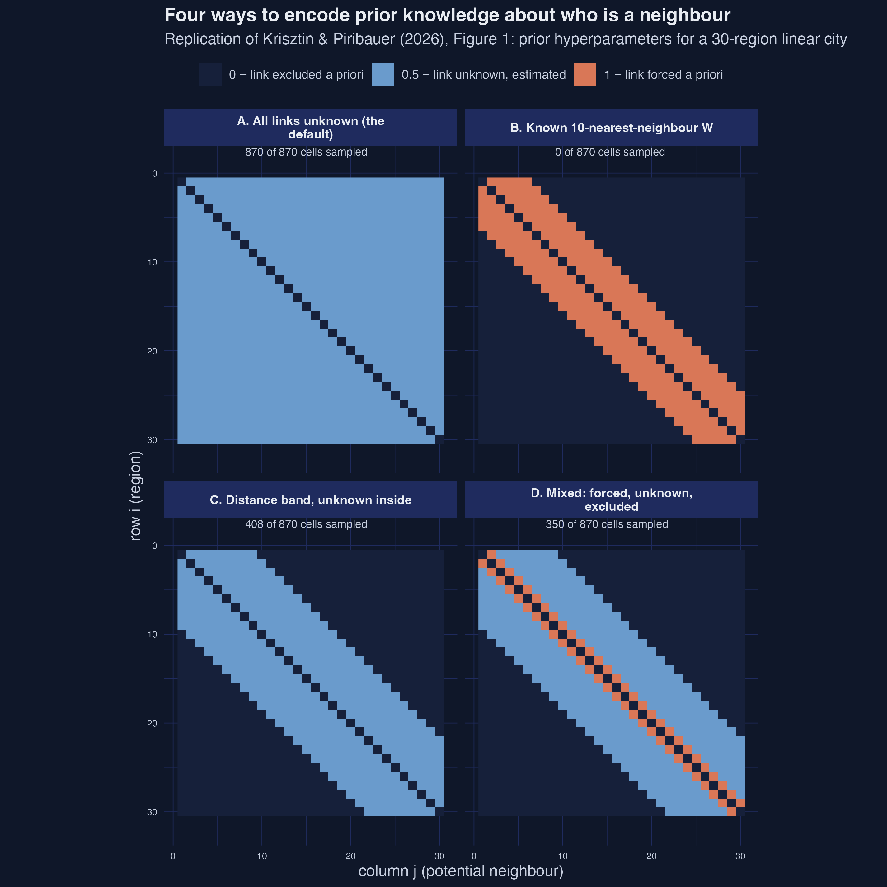

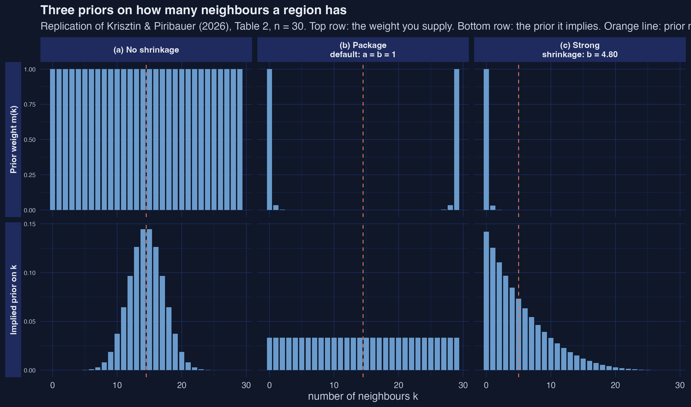

```text
Case (b) implied p(k) standard deviation = 4.46e-18 (should be ~0: uniform on k)

Prior expected number of neighbours, n = 30 and n = 90:
                                    case  n expected_k
1            (a) No shrinkage: rep(1, n) 30       14.5
2         (b) Package default: a = b = 1 30       14.5
3       (c) Strong shrinkage: b = 4.80   30        5.0
4            (a) No shrinkage: rep(1, n) 90       44.5
5         (b) Package default: a = b = 1 90       44.5
6      (c) Strong shrinkage: b = 11.71   90        7.0

Empirical prior: a = 1, b = ((n-1)-kbar)/kbar = 11.71429, prior link probability = 0.07865
Unknown off-diagonal cells: 8,010 against 1,710 observations
```

### Table — Sparsity priors (`r_estimateW_prior_sparsity.csv`, 360 rows)

| Case | `nr_neighbors_prior` | Implied prior on $k$ | Prior mean $k$ at n=90 |
|---|---|---|---:|
| (a) No shrinkage | `rep(1, n)` | Binomial(89, 0.5) | 44.5 |
| (b) Package default | `bbinompdf(0:89, 89, a=1, b=1)` | Uniform on 0…89 | 44.5 |
| (c) Strong shrinkage | `bbinompdf(0:89, 89, a=1, b=11.714)` | Beta-binomial, concentrated | 7.0 |

**Interpretation.** The numerical check confirms the paper's claim exactly: under the package default the implied prior on the neighbour count is uniform to within 4.5e-18, machine precision. The substantively important finding is that **neither "non-informative" option is neutral at the real sample size**. Both the flat weight and the package default imply a prior expectation of 44.5 neighbours per region — a belief that every European region is directly wired to half of Europe — and with only 19 time periods that prior would dominate rather than be updated. This is the concrete justification for the shrinkage prior used in the published application, and it is the single most useful thing in the section for a practitioner.

**Interpretation (second point).** The two rows of the sparsity figure also expose a trap. The weight $\underline{m}(k)$ supplied under the package default is violently U-shaped, with essentially all its mass at 0 and 89 neighbours, and looks like the most opinionated prior imaginable. The prior it *implies* is perfectly flat. The binomial coefficient reconciles the two, because there are vastly more ways to choose 45 neighbours out of 89 than to choose 0. What you supply is not what you assert, and only the implied distribution is interpretable.

### 2. Paper-exact fit and the Table 3 reproduction

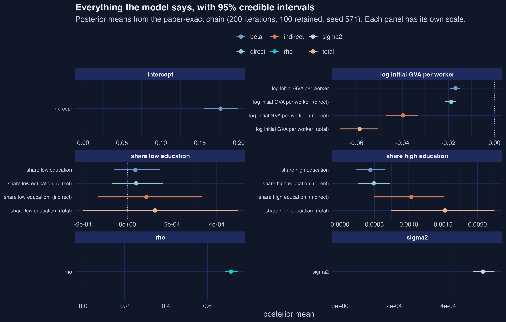

```text
  postb          4 x 100
  posts          1 x 100
  postr          1 x 100
  postw          90 x 90 x 100
  post.direct    4 x 100
  post.indirect  4 x 100
  post.total     4 x 100
```

### Table — Posterior summary (`r_estimateW_posterior_params.csv`, 15 rows)

| Parameter | Block | Mean | SD | ESS | Geweke z |
|---|---|---:|---:|---:|---:|
| intercept | beta | 0.176509 | 0.010900 | 52.9 | −0.24 |
| log initial GVA per worker | beta | −0.016922 | 0.001172 | 56.0 | 0.72 |
| share low education | beta | 0.0000357 | 0.0000534 | 49.4 | −2.09 |
| share high education | beta | 0.000441 | 0.000110 | 122.2 | −0.77 |
| rho | rho | 0.713220 | 0.015740 | **26.5** | **−3.74** |
| sigma2 | sigma2 | 0.000529 | 0.0000227 | 54.0 | 3.29 |
| log initial GVA per worker | direct | −0.018797 | 0.001251 | 55.3 | 1.01 |
| log initial GVA per worker | indirect | −0.039723 | 0.003855 | 37.2 | 8.56 |
| share high education | direct | 0.000490 | 0.000122 | 122.1 | −0.87 |
| share high education | indirect | 0.001036 | 0.000264 | 96.6 | −3.34 |

**Interpretation.** The spatial autoregressive parameter is 0.7132 with a posterior standard deviation of 0.0157, so spatial dependence is both strong and — on the face of it — precisely estimated. Conditional convergence survives at −0.0169, less than half the pooled-OLS magnitude. Tertiary education attainment enters positively at 0.000441, about four posterior standard deviations from zero, while the low-education share at 0.0000357 with a standard deviation of 0.0000534 is indistinguishable from zero and should be reported as such rather than as a positive effect.

**Interpretation (diagnostics embedded in the same table).** The ESS column undercuts the apparent precision. With 100 retained draws the effective sample size for $\rho$ is 26.5, and its Geweke z-score is −3.74, outside the ±1.96 band — a formal rejection of stationarity for that parameter at that budget. The indirect impact of initial productivity is worse still at z = 8.56. These are not defects of the estimator; they are the expected consequence of a deliberately tiny illustration chain, and they bound what the standard deviations in this table can support.

### Table — Reproduction audit (`r_estimateW_table3_audit.csv`, 12 rows)

| Quantity | Paper | Ours | \|Difference\| | Verdict |
|---|---:|---:|---:|:---|
| intercept | 0.17651 | 0.176509 | 1.03e-06 | exact |
| log initial GVA per worker | −0.01692 | −0.016922 | 1.97e-06 | exact |
| share low education | 0.00004 | 0.0000357 | 4.30e-06 | exact |
| share high education | 0.00044 | 0.000441 | 1.29e-06 | exact |
| rho | 0.71322 | 0.713220 | 3.39e-07 | exact |
| sigma2 | 0.00053 | 0.000529 | 1.49e-06 | exact |
| av. direct log initial GVA | −0.01880 | −0.018797 | 3.38e-06 | exact |
| av. direct share low education | 0.00004 | 0.0000396 | 3.90e-07 | exact |
| av. direct share high education | 0.00049 | 0.000490 | 2.59e-07 | exact |
| av. indirect log initial GVA | −0.03972 | −0.039723 | 3.09e-06 | exact |
| av. indirect share low education | 0.00008 | 0.0000843 | 4.26e-06 | exact |
| av. indirect share high education | 0.00104 | 0.001036 | 3.52e-06 | exact |

**Interpretation.** All twelve published quantities reproduce to the five decimal places the paper prints; every absolute difference is below 1e-5, which is the resolution of the printed table rather than a real discrepancy. Verdict: **12 exact, 0 within-Monte-Carlo-noise, 0 differing**. For a stochastic algorithm this is the strongest available form of replication, and it required four things to coincide — the seed (571), the package version (0.2.0), the RNG kind, and the linear-algebra backend. The full audit CSV also carries the difference expressed in units of our own Monte Carlo standard error, so a reader on a different BLAS who reproduces only to three decimals can check whether their gap is within noise rather than concluding the replication failed.

### 3. Convergence and the robustness chains

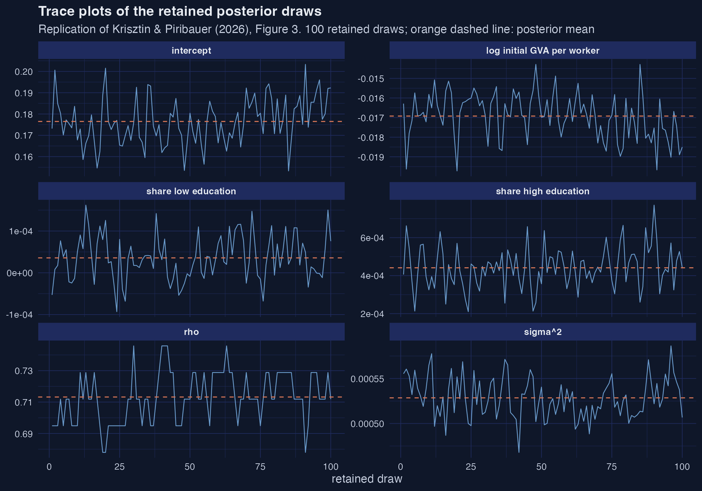

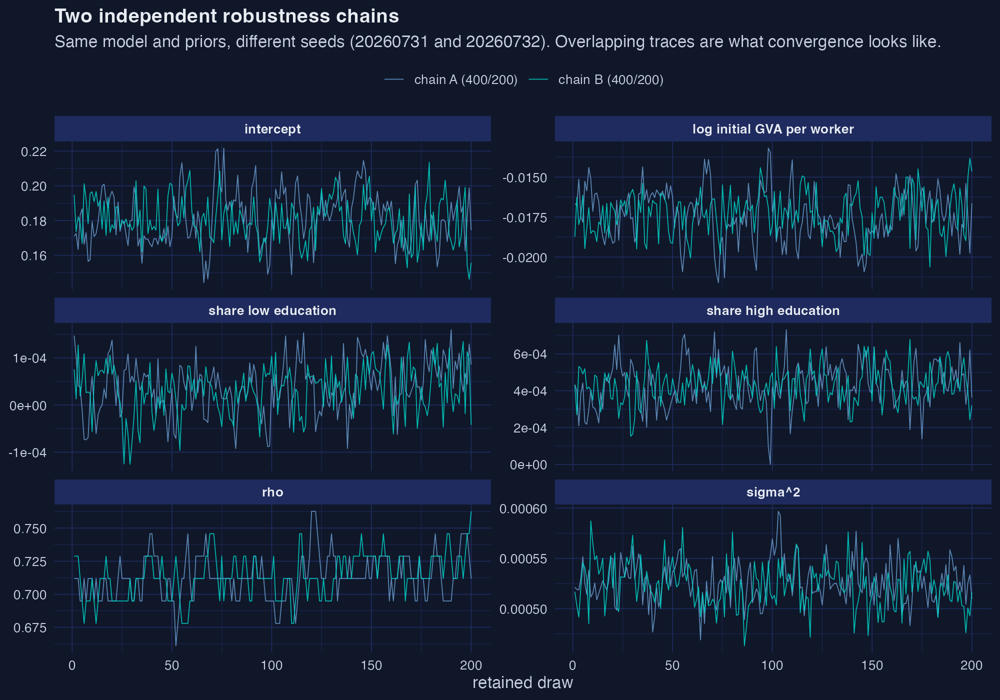

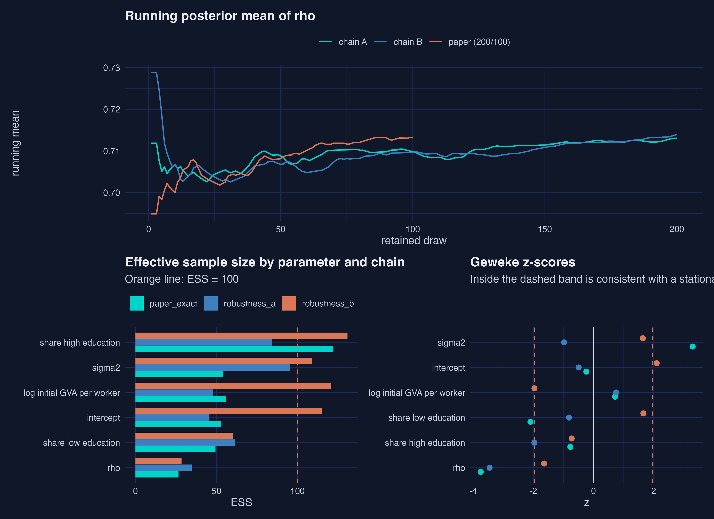

```text
Gelman-Rubin potential scale reduction factors (2 chains):
                           Point est. Upper C.I.
intercept                      1.0168     1.0350
log initial GVA per worker     1.0228     1.0451
share low education            1.0073     1.0366
share high education           1.0136     1.0144
rho                            0.9998     1.0047
sigma2                         1.0114     1.0493
```

### Table — Chain comparison (`r_estimateW_chain_comparison.csv`, 18 rows)

| | Paper (200/100) | Chain A (400/200) | Chain B (400/200) |
|---|---:|---:|---:|
| $\rho$ mean | 0.7132 | 0.7131 | 0.7140 |
| $\rho$ SD | 0.01574 | 0.01678 | 0.01602 |
| ESS($\rho$) | 26.5 | 34.8 | 28.4 |
| ESS(share high education) | 122.2 | 84.3 | 130.9 |
| Runtime (s) | 350 | 847 | 811 |

**Interpretation.** Every scale reduction factor sits at or below 1.023 with upper limits below 1.05, so two chains started from independent random networks agree on where the posterior is. That is genuine evidence the sampler works despite rewriting the neighbourhood topology inside every sweep — the concern that motivated the diagnostic in the first place. Posterior means are essentially identical across budgets: $\rho$ moves from 0.7132 to 0.7131 and 0.7140 when the chain doubles.

**Interpretation (what does not stabilise).** Effective sample sizes improve only modestly with a doubled chain — 26.5 to 34.8 for $\rho$ — confirming strong autocorrelation rather than a transient. The practical consequence is a three-way split that the blog post spells out: posterior means are usable, posterior standard deviations and intervals are not, and individual link rankings are least reliable of all, since with 100 retained draws a link probability is quantized to 0.01 and a link seen in three draws cannot be distinguished from one seen in one.

### 4. Anatomy of the estimated network

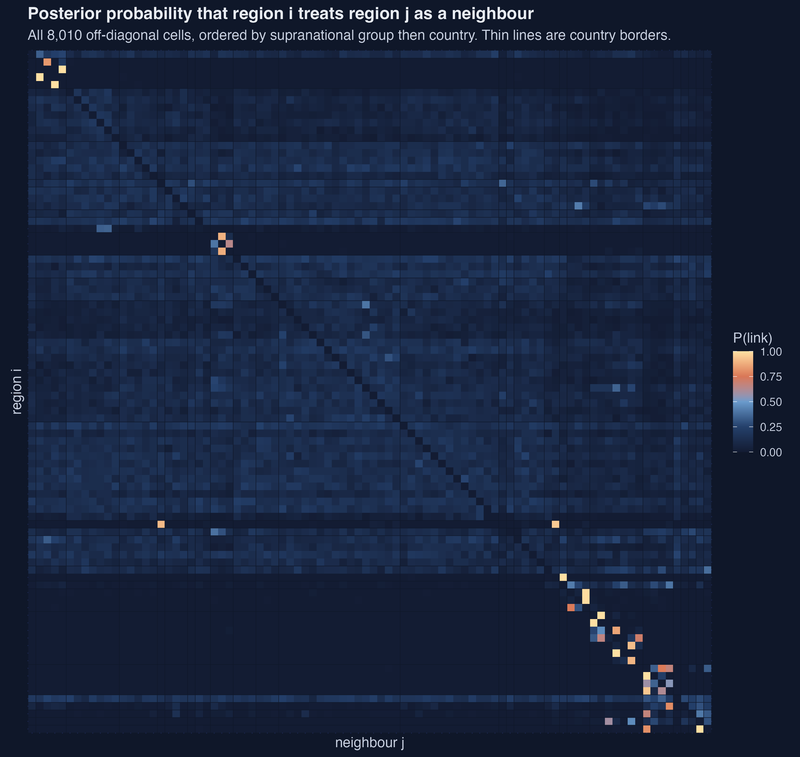

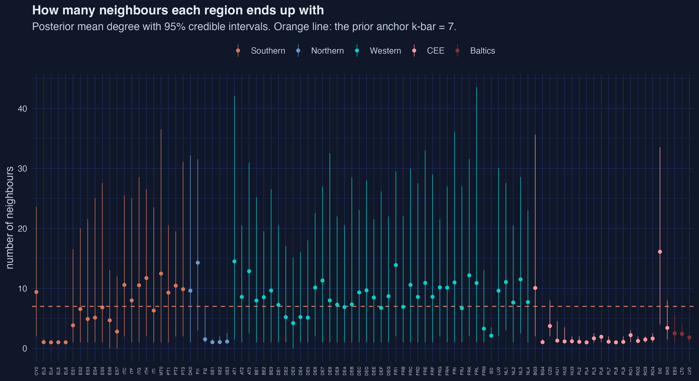

```text
Estimated degree: mean 6.47 | median 6.9 | min 1 | max 16.11  (prior anchor k-bar = 7)
Posterior inclusion probability: mean 0.0727 | max 1 | share above 0.5: 0.41%
Link mass inside the same country: 35.6% (random benchmark 7.1%)
Link mass inside the same supranational group: 60.5% (random benchmark 30.4%)
Density: W 70.6% of off-diagonal cells non-zero, multiplier 92.9%; Spearman rank correlation = 0.718
```

### Table — Ten strongest estimated links (`r_estimateW_top_links.csv`, 1,602 rows)

| Rank | From | To | Same country | Weight | P(link) |
|---:|---|---|:--:|---:|---:|
| 1 | EL4 | EL6 | yes | 1.0000 | 1.00 |
| 2 | PL4 | PL2 | yes | 1.0000 | 1.00 |
| 3 | PL8 | PL6 | yes | 1.0000 | 1.00 |
| 4 | EL6 | EL5 | yes | 0.9950 | 1.00 |
| 5 | EL5 | EL3 | yes | 0.9900 | 1.00 |
| 6 | BG4 | CZ0 | **no** | 0.9833 | 1.00 |
| 7 | PL2 | PL4 | yes | 0.9550 | 1.00 |
| 8 | HU2 | HU3 | yes | 0.9508 | 1.00 |
| 9 | HU1 | HU3 | yes | 0.9135 | 0.99 |
| 10 | PL7 | PL8 | yes | 0.8900 | 0.92 |

**Interpretation.** The average region ends up with 6.47 neighbours against a prior anchor of 7, so the data pulled the network slightly sparser than the prior expected — the prior is being updated, not merely obeyed. The range from 1 to 16.1 is information the prior did not contain, since it treats all 90 regions identically. Regions with a posterior mean weight of exactly 1.0000 and inclusion probability 1.00 were given exactly one neighbour, the same one, in every retained draw.

**Interpretation (the clustering result).** Regions place 35.6% of their neighbourhood weight on compatriots against a size-adjusted random benchmark of 7.1% — a factor of five — and 60.5% within their supranational group against 30.4%. Nine of the ten strongest links join regions of the same country. Nothing in the specification mentions countries: the model saw only growth rates, initial productivity and two education shares, and reconstructed national borders from co-movement. The one exception in the top ten, BG4 to CZ0 at weight 0.98, spans 1,084 km between two countries that share no border, and would be scored zero by any contiguity matrix.

**Interpretation (a density caveat that is easy to misread).** The reported 70.6% density of $W$ counts cells switched on in *at least one* of the 100 draws. In any single draw a region has about 6.5 neighbours, or 7.3% of its possible partners. Averaging over an uncertain network makes the posterior mean look an order of magnitude denser than any network the sampler ever entertained, and the posterior mean of $W$ should not be interpreted as though it were a single drawn network. The multiplier's 92.9% density is a different and substantive phenomenon: with $\rho = 0.713$, second-round effects still carry weight 0.508, so nearly everything eventually reaches nearly everything.

### 5. Ground-truth recovery

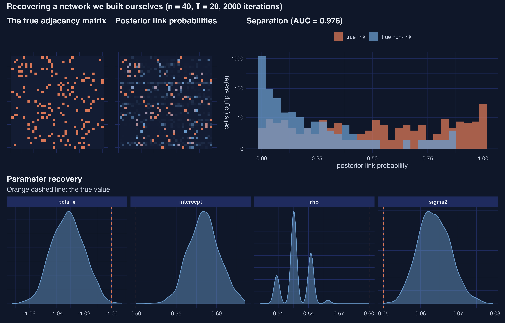

```text
Simulated panel: n = 40, T = 20, true rho = 0.6, true sigma2 = 0.05, 4 neighbours per unit by construction
Unknown off-diagonal cells: 1,560 against 800 observations

              metric    value truth    q025     q975 covered
                 auc  0.97560    NA      NA       NA      NA
    precision_at_0.5  0.91430    NA      NA       NA      NA
       recall_at_0.5  0.60000    NA      NA       NA      NA
     accuracy_at_0.5  0.95320    NA      NA       NA      NA
          youden_cut  0.06300    NA      NA       NA      NA
    recall_at_youden  0.91250    NA      NA       NA      NA
 precision_at_youden  0.57030    NA      NA       NA      NA
      hamming_at_0.5 73.00000    NA      NA       NA      NA
         mean_degree  3.05100  4.00      NA       NA      NA
           intercept  0.58420  0.50  0.5485  0.62180   FALSE
              beta_x -1.03200 -1.00 -1.0530 -1.00900   FALSE
                 rho  0.52820  0.60  0.5085  0.54240   FALSE
              sigma2  0.06368  0.05  0.0559  0.07251   FALSE
```

**Interpretation.** Network recovery is excellent. The area under the ROC curve is 0.976 on 1,560 candidate cells, 91.4% of asserted links are real, and 95.3% of all cells are classified correctly for a Hamming distance of 73. The estimator is conservative — recall at the 0.5 cut is 0.600 and the estimated mean degree is 3.05 against a true 4 — which is the sparsity prior working as designed. Moving the threshold to the Youden-optimal 0.063 raises recall to 0.913 at the cost of precision falling to 0.570.

**Interpretation (the negative result, reported deliberately).** **None of the four structural parameters' 95% credible intervals contain the truth.** $\rho$ is estimated at 0.528 with an interval of [0.509, 0.542] against a true 0.600; $\sigma^2$ at 0.0637 against 0.050. Two mechanisms compound: the sparsity prior recovers a sparser network than the truth, and a model with fewer transmission channels compensates by attributing less to $\rho$ — a genuine bias, and the price of the regularisation that made the problem estimable; and the intervals are too narrow because an autocorrelated chain reports less uncertainty than it has earned. This is a single simulated dataset rather than a Monte Carlo study — Krisztin & Piribauer (2023) run a proper one and report good recovery of both network and parameters — but it establishes the direction of the failure mode, and it applies with more force to the European fit, which uses a tenth of this chain length on more than twice as many units.

### 6. Model taxonomy

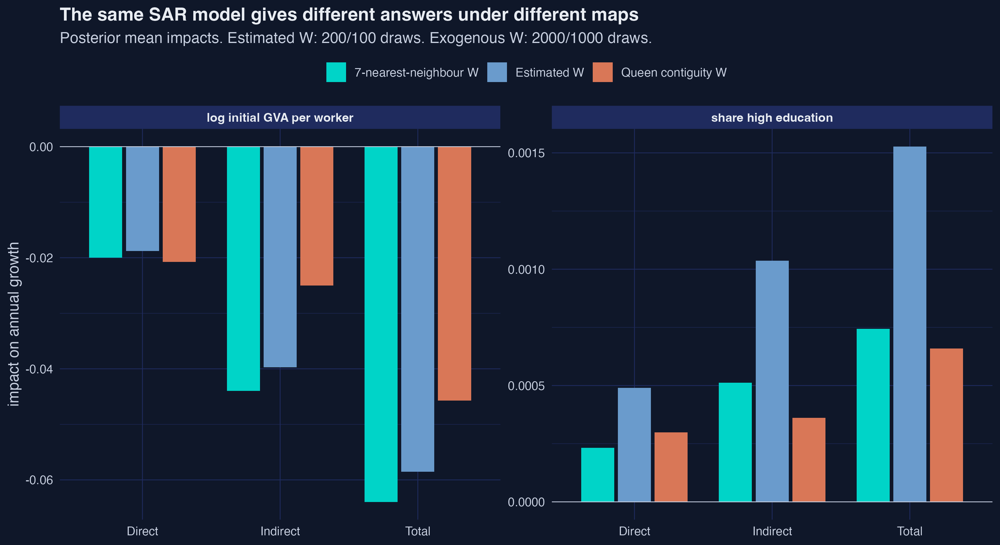

### Table — Taxonomy tour (`r_estimateW_model_taxonomy.csv`, 11 rows)

| Half | Model | $\rho$ | Mean degree | Runtime |
|---|---|---:|---:|---:|
| Estimated W, simulated n=25 (true $\rho$=0.5, true degree 3) | SDEM | 0.438 | 3.05 | 33 s |
| | SDM | 0.414 | 2.93 | 32 s |
| | SAR | 0.169 | 3.08 | 29 s |
| | SEM | 0.112 | 2.87 | 31 s |
| | SLX | — | 2.99 | 13 s |
| Exogenous W, real n=90 | SAR (kNN-7) | 0.719 | 7.00 | 6.5 s |
| | SDEM (queen) | 0.634 | 3.80 | 9.6 s |
| | SEM (queen) | 0.632 | 3.80 | 9.2 s |
| | SDM (queen) | 0.624 | 3.80 | 6.7 s |
| | SAR (queen) | 0.607 | 3.80 | 6.7 s |

**Interpretation.** On a Durbin-generated panel, only the specifications that include the spatially lagged regressors recover the spatial parameter: SDM and SDEM return 0.414 and 0.438 against a true 0.500, while SAR and SEM collapse to 0.169 and 0.112. Omitting the $WX$ channel is classic omitted-variable bias in spatial clothing — with no way to express neighbours' covariates mattering, the model shrinks the only spatial parameter it has. Network density is recovered well by all five (2.87 to 3.08 against a true 3), so getting the map right does not rescue a wrong specification.

**Interpretation (cost).** The runtime contrast quantifies what estimating $W$ costs: 30 seconds for 25 units over 400 iterations, versus 7 seconds for 90 units over 2,000 iterations when $W$ is given. The unknown network is essentially the entire computational budget, which is why the authors set the practical ceiling near 300 regions. Note also that under a fixed queen matrix every specification lands between 0.607 and 0.634 — the choice of *model* barely moves $\rho$, while the choice of *map* moves it from 0.607 to 0.719.

### 7. Estimated versus assumed maps

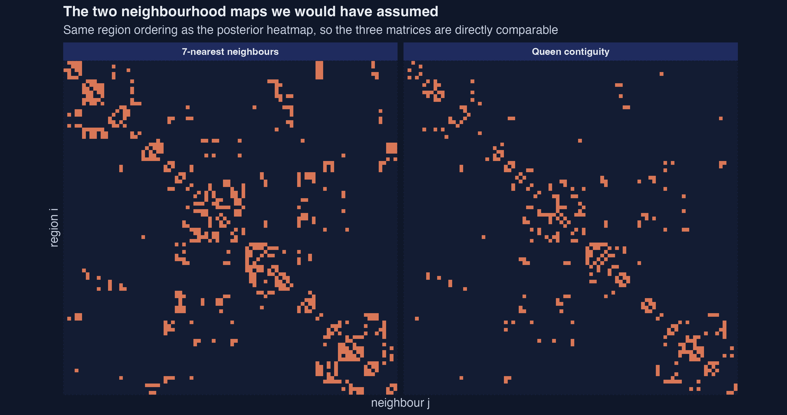

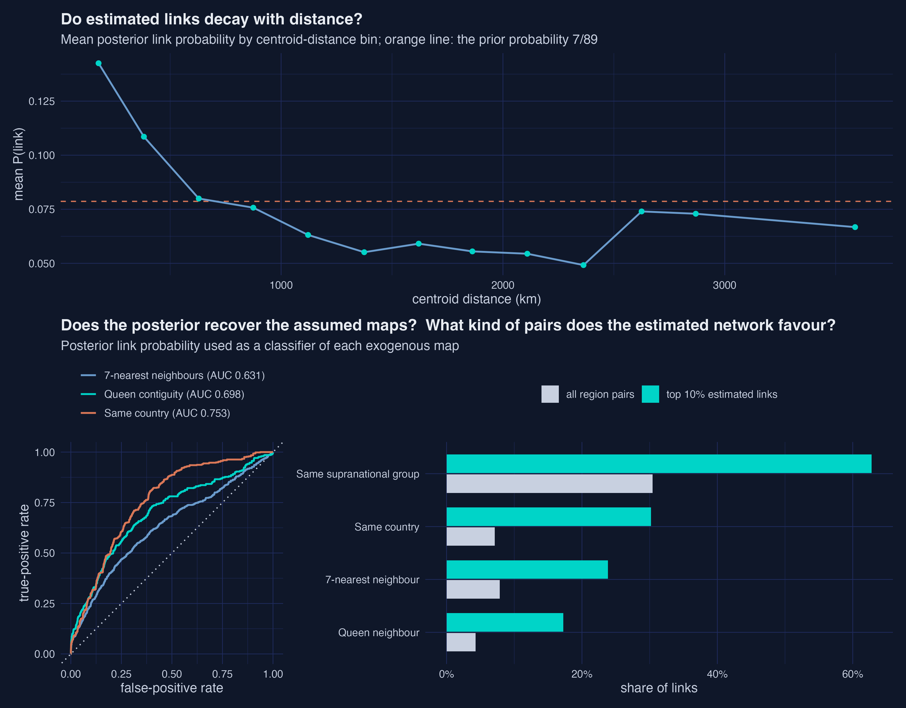

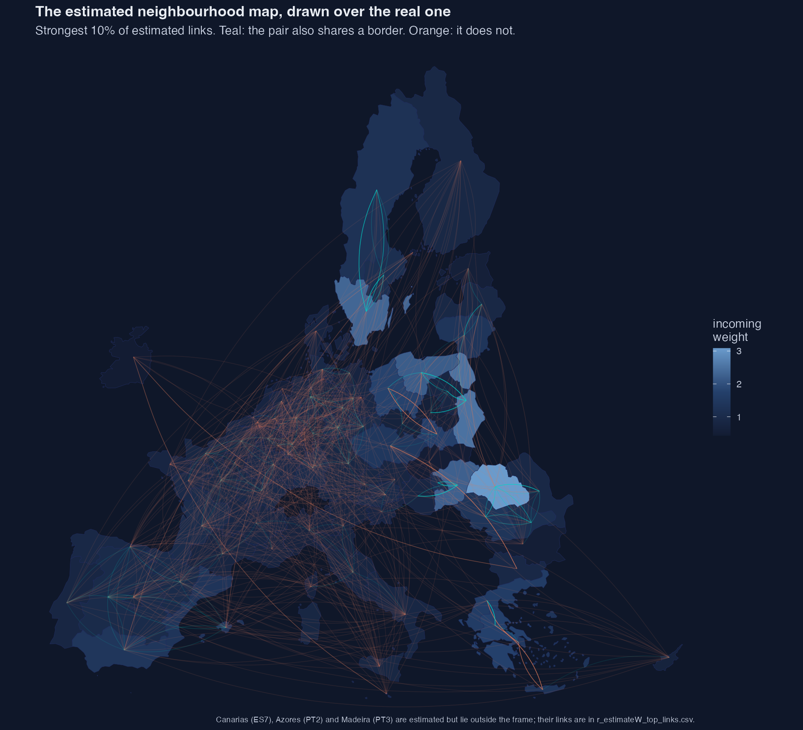

### Table — Estimated W against exogenous alternatives (`r_estimateW_W_comparison_metrics.csv`, 6 rows)

| Comparator | Links | AUC | Jaccard (top 10%) | Share of top links | Mean distance |
|---|---:|---:|---:|---:|---:|
| Same country | 570 | **0.753** | 0.214 | 30.2% | 407 km |
| Queen contiguity | 342 | 0.698 | 0.137 | 17.2% | 238 km |
| Same supranational group | 2,438 | 0.693 | 0.184 | 62.8% | 801 km |
| 7-nearest neighbours | 630 | 0.631 | 0.154 | 23.9% | 360 km |
| *Estimated, top 10%* | *801* | — | 1.000 | 100% | *921 km* |
| *All pairs* | *8,010* | — | — | — | *1,331 km* |

### Table — One model, three maps

| | Estimated | Queen | kNN-7 |
|---|---:|---:|---:|
| $\rho$ | 0.7132 | 0.6068 | 0.7186 |
| Initial productivity, total | −0.05852 | −0.04574 | −0.06396 |
| High education, total | **0.001527** | **0.000659** | **0.000744** |
| Indirect ÷ direct | 2.11 | 1.20 | 2.20 |

**Interpretation.** Sharing a country predicts the estimated network better than sharing a border does — AUC 0.753 against 0.698 — and both beat the nearest-neighbour map. The same ordering appears in the correlations, the Jaccard overlaps and the share of top links matched, so it is a genuine ranking rather than a rounding artefact. Geography has not disappeared: the strongest estimated links average 921 km against 1,331 km for a random pair, a 31% reduction. Relative to base rates, the enrichment is similar for both criteria — 4.0× for shared borders, 4.2× for shared nationality — but the discrimination is better for nationality.

**Interpretation (a refinement that cuts the other way).** The AUC integrates over the whole ranking of 8,010 pairs. Restricting instead to the 33 links the model is most confident about — posterior probability at least 0.5 — tilts the picture back toward geography: 60.6% share a border (enrichment 14.2× over a 4.3% base rate) against 75.8% within a country (enrichment 10.6× over 7.1%). The links the data are *certain* about are disproportionately geographic, even though across the full ranking nationality discriminates better. Both are true and they answer different questions — "what organises this network?" versus "what does the model know for sure?" — and the post states both rather than reporting only the one that supports the headline.

**Interpretation (the payoff).** Changing only $W$ and refitting the identical SAR specification leaves every sign and every qualitative conclusion intact, but moves the magnitudes substantially. The total impact of tertiary education is 0.001527 under the estimated map against 0.000659 under contiguity — **more than double** — and the spillover-to-direct ratio falls from 2.11 to 1.20, which is the difference between "most of the return leaks across borders" and "about half of it does". The relationship between map density and $\rho$ is mechanical and worth naming: the sparsest map (queen, 3.8 neighbours) yields the lowest $\rho$ (0.607), the densest (kNN-7, exactly 7) the highest (0.719), with the estimated map at 6.47 neighbours landing between them.

**Interpretation (an argument hidden in the setup).** Ten of the ninety regions — Cyprus, Malta, the Aegean islands, Canarias, Åland, Corse, the Italian islands, the Azores, Madeira and Ireland — have no queen-contiguity neighbour at all. Building the benchmark therefore required ten arbitrary modelling decisions (attach each isolate to its nearest centroid) that are invisible in any results table. That is the case for estimating $W$ compressed into one sentence.

### 8. Identification

### Table — Identification conditions (`r_estimateW_identification.csv`, 7 rows)

| Condition | Status | Statistic |
|---|---|---|
| I. zero diagonal of $W$ | by construction | max \|$W_{ii}$\| over draws = 0 |
| II. row-wise $\sum$\|$\rho W$\| < 1 | by construction | max row sum = 0.7458 |
| II. $\rho$ < 1 | by construction | max $\rho$ = 0.7458 |
| IV. rows sum to 1 (or 0) | by construction | holds in every draw |
| V. diagonal of $W^2$ not constant | **TESTED** | cross-region SD 0.128 to 0.233 |
| VI. $\rho > 0$ | **IMPOSED by the prior support** | min drawn $\rho$ = 0.678 |
| III. $\rho\beta \neq 0$ | **TESTED** | 0% of draws below 1e-4 |

**Interpretation.** Four of the six sufficient conditions from De Paula, Rasul & Souza (2025) hold mechanically, which is a design feature of the package rather than a finding. The two genuinely testable conditions both pass: the interaction between $\rho$ and the slope is nowhere near zero, and second-order neighbourhood structure is heterogeneous enough for regions to be distinguishable. Condition VI is the one to flag: the default prior support is $(0,1)$, so $\rho = 0.713$ is evidence about the *magnitude* of positive spatial dependence, not evidence against negative dependence, which was excluded before the data were seen.

---

## Figure Inventory

| # | Filename | What it shows | Key takeaway |
|---|---|---|---|
| 1 | `r_estimateW_01_panel_overview.png` | Growth paths and the convergence scatter | Strong common movement; textbook beta-convergence |
| 2 | `r_estimateW_02_prior_spatial_cases.png` | Paper Figure 1, four spatial priors | Case B *is* conventional spatial econometrics |
| 3 | `r_estimateW_03_prior_sparsity.png` | Paper Table 2, three sparsity priors | What you supply is not what you assert |
| 4 | `r_estimateW_04_prior_k_n90.png` | Implied prior on $k$ at n=90 | "Non-informative" means 44.5 neighbours |
| 5 | `r_estimateW_05_posterior_estimates.png` | All estimates with credible intervals | Only low education crosses zero |
| 6 | `r_estimateW_06_trace_paper.png` | Paper Figure 3, trace plots | Stable; $\rho$ moves in visible grid steps |
| 7 | `r_estimateW_07_trace_long.png` | Two robustness chains | Independent seeds, same answers |
| 8 | `r_estimateW_08_convergence_diag.png` | Running means, ESS, Geweke | ESS($\rho$) = 26.5 is the binding limit |
| 9 | `r_estimateW_09_W_pip_heatmap.png` | 90×90 inclusion probabilities | Block structure along the country diagonal |
| 10 | `r_estimateW_10_W_degree.png` | Degree per region with intervals | 6.47 mean, range 1 to 16 |
| 11 | `r_estimateW_11_network_W.png` | Paper Figure 2a, strongest links | National clusters, not geographic ones |
| 12 | `r_estimateW_12_network_multiplier.png` | Paper Figure 2b, multiplier network | Far denser than $W$ itself |
| 13 | `r_estimateW_13_chord_W.png` | Country-aggregated $W$ | Self-loops dominate |
| 14 | `r_estimateW_14_chord_multiplier.png` | Country-aggregated multiplier | Indirect reach spreads flows out |
| 15 | `r_estimateW_15_exogenous_W.png` | Queen and kNN-7 matrices | Queen is sparse and leaves 10 isolates |
| 16 | `r_estimateW_16_W_vs_geography.png` | Distance decay, ROC, composition | Same-country beats shared-border |
| 17 | `r_estimateW_17_map_arcs.png` | Estimated links over Europe | Long orange arcs dominate short teal ones |
| 18 | `r_estimateW_18_sim_recovery.png` | Ground-truth recovery | AUC 0.976; intervals miss the truth |
| 19 | `r_estimateW_19_three_maps_impacts.png` | Three maps, one model | Signs agree, magnitudes do not |

---

## Key Findings

1. **The published Table 3 reproduces exactly.** All twelve quantities match to the five decimal places printed, with every absolute difference below 1e-5. This required the seed (571), package version (0.2.0), RNG kind and BLAS to coincide, and the audit reports differences in Monte Carlo standard-error units so a reader on different hardware can distinguish noise from failure.

2. **The estimated network is national, not geographic.** Regions place 35.6% of their neighbourhood weight on compatriots against a size-adjusted chance benchmark of 7.1%, and the posterior link probability discriminates "same country" (AUC 0.753) better than "shares a border" (0.698). Nothing in the specification mentions countries.

3. **Spillovers are twice the own-region effect, identically for every variable.** The indirect impact of initial productivity is −0.0397 against a direct impact of −0.0188, a ratio of 2.11. The ratio is 2.11–2.13 for all three covariates because in a SAR model $\Pi_l = (I-\rho W)^{-1}\beta_l$, so the diagonal/off-diagonal split depends only on $\rho$ and $W$. Variable-specific ratios require a Durbin specification.

4. **The choice of map changes magnitudes by a factor of two.** Refitting the identical SAR under three maps leaves all signs intact but moves the total education impact from 0.001527 (estimated) to 0.000659 (queen) and 0.000744 (kNN-7), and the spillover ratio from 2.11 to 1.20.

5. **The sampler recovers a known network very well.** On simulated data with 1,560 unknown cells and 800 observations, AUC is 0.976, precision at the 0.5 cut is 0.914, and overall classification accuracy is 95.3%.

6. **But its credible intervals are not calibrated.** None of the four structural parameters' 95% intervals covered the truth in that same simulation, run at ten times the European chain length. The sparsity prior biases the network sparse and $\rho$ downward, and autocorrelation makes the intervals too narrow.

7. **Neither "non-informative" sparsity prior is non-informative.** Both the flat weight and the package default imply an expectation of 44.5 neighbours per region at n = 90. Only the anchored beta-binomial delivers a sparse network, and the anchor $\underline{k}$ is a researcher choice that should be swept, not asserted.

8. **Multi-chain diagnostics pass; single-chain diagnostics do not.** Gelman-Rubin factors are all ≤ 1.023 across two independent chains, but ESS for $\rho$ is 26.5 and its Geweke z is −3.74. Posterior means are reliable; standard deviations, intervals and marginal link rankings are not.

9. **Estimating $W$ is the entire computational cost.** 25 units for 400 iterations takes 30 seconds; 90 units for 2,000 iterations with $W$ given takes 7. This is why the practical ceiling sits near 300 regions.

10. **Contiguity requires ten undocumented decisions on this data.** Ten of ninety regions have no queen neighbour and must be patched by hand before a contiguity model can run at all.

---

## Surprises and Caveats

- **Estimator non-determinism.** Fully controlled and exploited. `sarw()` is deterministic given the RNG state, so a reproducibility barrier re-seeds immediately before the headline call with nothing in between that draws a random number; the script asserts `RNGkind()` is unchanged. The timing probe deliberately consumes RNG and is therefore placed before the barrier. Every other stochastic block has its own explicit seed, all logged to `r_estimateW_runtime.csv`.

- **Sample reductions from adjustment.** None in the estimation: all 1,710 observations are used in every fit. Two reductions do occur downstream and are logged: ten queen-contiguity isolates are repaired with a nearest-neighbour link (they would otherwise have empty rows), and three ultra-peripheral regions are omitted from the map figure's arcs only, never from any estimate.

- **Weighting and aggregation choices.** Three are load-bearing and all follow the source paper. Row-standardization is applied to every $W$. The network figures show the strongest 10% of links and the chord diagrams the strongest 20% of country flows, both anti-hairball display decisions rather than inference. Country aggregation retains the diagonal, because the claim being visualised is precisely that most inflow is domestic. The 10%/20% cuts are implemented rank-based rather than by quantile threshold, since $W$ is sparse enough that a quantile cut can land on a tie and silently return far more links than intended.

- **Effect concentration.** Pronounced and substantively important. Estimated degree ranges from 1 to 16.1 across regions, so a handful of regions carry far more network mass than the rest; DE1 has a posterior mean degree of 7.25 with a 95% interval of [1, 20.5]. Similarly, 0.41% of the 8,010 cells have inclusion probability above 0.5, so the network's identity rests on a small number of confidently-estimated links plus a long tail of noise.

- **Cosmetic warnings.** None survived into the final log. `st_point_on_surface` emits a planar-assumption warning that is correct to ignore in a projected CRS and is suppressed; `sarw()`'s progress bar is captured so the tee'd log stays readable.

- **Identification assumptions in force.** Six conditions, four holding by construction, two tested and passing, and one — $\rho > 0$ — imposed by the default prior support rather than tested. The reported $\rho = 0.713$ is evidence about the magnitude of positive dependence, not against negative dependence.

- **Pedagogical framing of the source paper.** The paper's 200-iteration chain is explicitly an illustration budget chosen so a vignette runs quickly, and the paper says so. Reproducing it exactly is the right thing for a replication and the wrong thing for inference. This report therefore reproduces it, reports its diagnostics honestly (ESS 26.5, Geweke −3.74), and adds two 400-iteration chains that the paper does not run so the gap can be measured rather than assumed.

---

## Appendix — Reproduction Audit (Krisztin & Piribauer 2026, Table 3)

| Stage | Our value | Paper value | Manuscript location | Notes |
|---|---|---|---|---|
| Data assembly | 1,710 obs, 90 regions, T=19, 2001–2019 | identical | §5, p. 343 | `nuts1growth` shipped with the package |
| Prior construction | $\underline{b}_\omega$ = 11.71429, link prob 0.07865 | $\underline{k}$ = 7 | §5 code block | `bbinompdf(0:89, nsize=89, a=1, b=11.714)` |
| Sampler call | `sarw(Y, tt=19, Z, niter=200, nretain=100, W_prior=AA)`, seed 571 | identical | §5 code block | verbatim |
| $\rho$ | 0.71322 (0.01574) | 0.71322 (0.01574) | Table 3 | exact |
| All 4 slopes | see audit table | identical to 5 dp | Table 3 | exact |
| $\sigma^2$ | 0.000529 | 0.00053 | Table 3 | exact |
| 3 direct impacts | see audit table | identical to 5 dp | Table 3 | exact |
| 3 indirect impacts | see audit table | identical to 5 dp | Table 3 | exact |
| Figure 1 (spatial priors) | 4 cases reproduced | qualitative match | Fig. 1, p. 207 | 30-region linear city |
| Table 2 (sparsity priors) | 3 cases; case (b) uniform to 4.5e-18 | qualitative match | Table 2, p. 218 | numerical check of the uniformity claim |
| Figure 2 (networks + chords) | 4 panels reproduced | qualitative match | Fig. 2, p. 417 | top 10% / top 20% per footnote 15 |
| Figure 3 (trace plots) | 6 panels reproduced | qualitative match | Fig. 3, p. 424 | posterior means as dashed lines |

**Verdict: full reproduction.** 12 of 12 published numerical quantities exact; all four reproduced figures qualitatively consistent with the originals. Environment: R 4.5.2, `estimateW` 0.2.0, reference BLAS, Mersenne-Twister/Inversion/Rejection.
