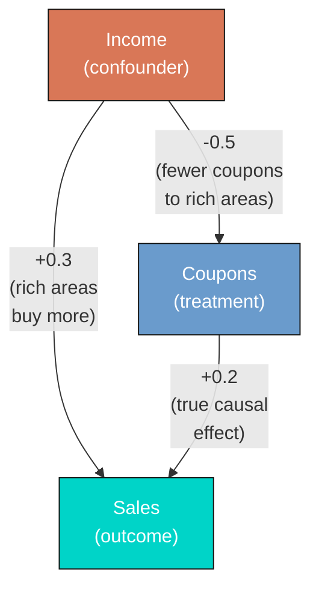
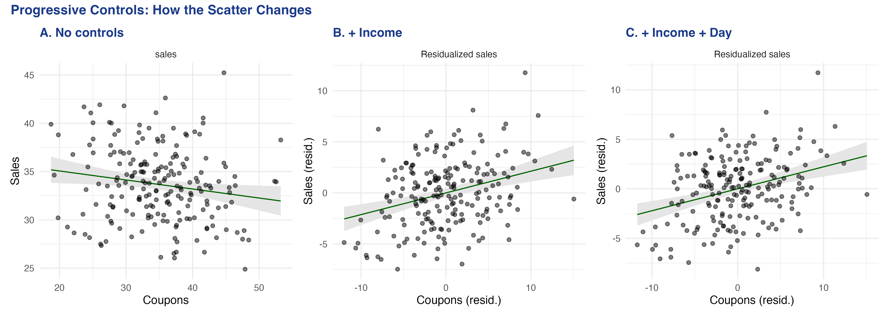
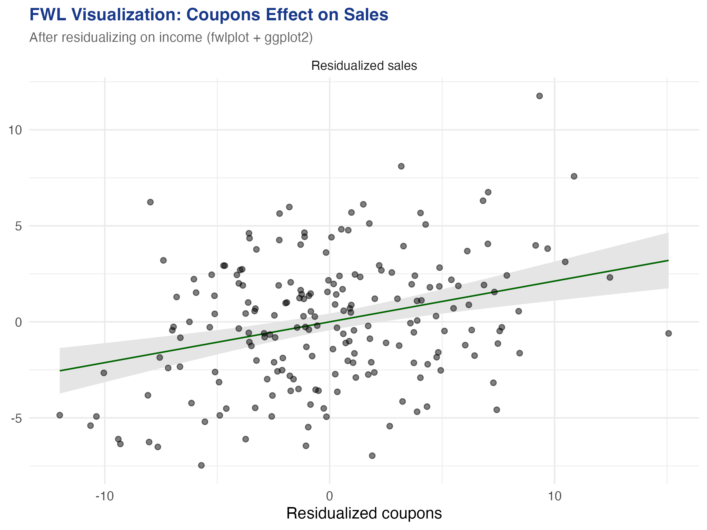

---
authors:
  - admin
categories:
  - R
  - Econometrics
  - Tutorial
  - Cross-sectional Data
  - FWL Theorem
draft: false
featured: false
date: "2026-03-27T00:00:00Z"
external_link: ""
image:
  caption: ""
  focal_point: Smart
  placement: 3
links:
- icon: code
  icon_pack: fas
  name: "R script"
  url: analysis.R
- icon: database
  icon_pack: fas
  name: "Datasets (CSV)"
  url: store_data.csv
slides:
summary: A hands-on guide to the fwlplot package in R --- from understanding the Frisch-Waugh-Lovell theorem through simulated confounding to visualizing fixed effects in real panel data --- showing what "controlling for" looks like as a scatter plot.
tags:
  - r
  - causal
  - causal inference
  - panel
title: "Visualizing Regression with the FWL Theorem in R"
url_code: ""
url_pdf: ""
url_slides: ""
url_video: ""
toc: true
diagram: true
---

## 1. Overview

"What does it actually mean to *control for* a variable?" This is perhaps the most common question in applied regression --- and one of the hardest to answer intuitively. When we say "the effect of coupons on sales, controlling for income," we are describing a relationship that lives in multidimensional space and cannot be directly plotted on a 2D scatter plot. Or can it?

The **Frisch-Waugh-Lovell (FWL) theorem** provides the answer. It says that the coefficient on any variable in a multiple regression equals the slope from a simple bivariate regression --- after first "partialling out" the other variables from both the outcome and the variable of interest. Partialling out means regressing a variable on the controls and keeping only the leftover (residual) variation --- the part that the controls cannot explain. This means we *can* visualize any regression coefficient as a 2D scatter plot, as long as we first remove the influence of the controls from both axes.

The [fwlplot](https://cran.r-project.org/package=fwlplot) R package (Butts & McDermott, 2024) turns this into a one-liner. It uses the same formula syntax as [`fixest::feols()`](https://lrberge.github.io/fixest/reference/feols.html) --- including the `|` operator for fixed effects --- and produces a scatter plot of the residualized data with the regression line overlaid. The result is a visual answer to "what does controlling for X look like?"

This tutorial builds intuition progressively. We start with simulated data where we *know* the true effect, show how confounding creates a misleading picture, and use `fwl_plot()` to reveal the truth. We then extend to real data with high-dimensional fixed effects --- first flights data (controlling for origin and destination airports) and then panel wage data (controlling for unobserved individual ability).

**Learning objectives:**

- State the FWL theorem and explain its geometric intuition
- Use `fwl_plot()` to visualize a bivariate relationship before and after controlling for confounders
- Demonstrate that manual FWL residualization reproduces `feols()` coefficients exactly
- Visualize what fixed effects "do" to data by comparing raw vs. residualized scatter plots
- Apply `fwl_plot()` to real panel data with high-dimensional fixed effects
- Connect FWL to omitted variable bias and Simpson's paradox

### Key concepts at a glance

The post leans on a small vocabulary repeatedly. The rest of the tutorial assumes you can move between these terms quickly. Each concept below has three parts. The **definition** is always visible. The **example** and **analogy** sit behind clickable cards: open them when you need them, leave them collapsed for a quick scan. If a later section mentions "FWL theorem" or "Simpson's paradox" and the term feels slippery, this is the section to re-read.

**1. Frisch-Waugh-Lovell theorem** $\hat\beta\_1 = \hat\beta\_1^{\mathrm{resid}}$.
The coefficient on $X\_1$ from the full regression equals the slope from a simple regression of $\tilde Y$ on $\tilde X\_1$, where the tildes are residuals after partial-ing out the other controls. Two routes, one number.

<div class="concept-pair">
<details class="concept-card concept-example">
<summary>Example</summary>

In the simulated store data, regressing `sales` on `coupons` and `income` jointly gives a coupon coefficient of +0.212. Manual FWL — residualize `coupons` against `income`, residualize `sales` against `income`, then regress one residual on the other — returns +0.212288. Same number, two paths.

</details>

<details class="concept-card concept-analogy">
<summary>Analogy</summary>

Two routes to the same summit. One is the direct multivariable highway; the other is the scenic residualize-then-regress trail. They end at the identical viewpoint.

</details>
</div>

**2. Confounding** $X\_2$ correlated with both $Y$ and $X\_1$.
A third variable that creates a spurious link between the regressor and the outcome. It is why a raw scatter plot can lie outright about the direction of an effect.

<div class="concept-pair">
<details class="concept-card concept-example">
<summary>Example</summary>

In the n=200 store panel, high-income shoppers receive *fewer* coupons (correlation `coupons`-`income` = -0.709) and buy *more* (correlation `income`-`sales` = +0.500). Income is the confounder hiding the true positive coupon effect of +0.2.

</details>

<details class="concept-card concept-analogy">
<summary>Analogy</summary>

A third character pulling on both protagonists from off-stage. The audience sees the two leads moving in opposite directions and assumes they dislike each other; really, a hidden hand is tugging them apart.

</details>
</div>

**3. Residualization** $\tilde y = y - \hat y$.
Replace each variable with the part *not* explained by the other controls. The leftover — the residual — is the variation FWL operates on.

<div class="concept-pair">
<details class="concept-card concept-example">
<summary>Example</summary>

Regress `coupons` on `income` and keep the residuals: that is the part of `coupons` that income cannot predict. Regress `sales` on `income` and keep the residuals. Plot one set of residuals against the other to reveal the controlled relationship.

</details>

<details class="concept-card concept-analogy">
<summary>Analogy</summary>

Wiping a foggy window before looking through it. The fog is the variation explained by the controls; once it is gone, the actual scene snaps into focus.

</details>
</div>

**4. Omitted variable bias** $\mathrm{OVB} = \gamma \cdot \delta$.
The naive slope of $Y$ on $X\_1$ differs from the true slope by $\gamma \cdot \delta$, where $\gamma$ is the effect of the omitted $X\_2$ on $Y$ and $\delta$ is the slope of $X\_2$ on $X\_1$.

<div class="concept-pair">
<details class="concept-card concept-example">
<summary>Example</summary>

In our store data, $\gamma$ = +0.3004 (income coefficient on `sales` in the full model) and $\delta$ = -0.4937 (slope of `coupons` regressed on `income`). OVB = $\gamma \cdot \delta$ = -0.1483. The naive coupon slope is -0.093 vs the controlled +0.212; the gap is +0.305, which is `-OVB` exactly. The bias was *precisely* what FWL predicted.

</details>

<details class="concept-card concept-analogy">
<summary>Analogy</summary>

The exact tilt of a foggy lens. If you know how the fog distorts colors, you can subtract that distortion and recover the true hue underneath.

</details>
</div>

**5. Added-variable plot** scatter of $\tilde y$ vs $\tilde x\_1$.
Each point shows the residual variation in $Y$ against residual variation in $X\_1$. The slope of this scatter equals the FWL coefficient — it is the picture that matches the multivariable regression number.

<div class="concept-pair">
<details class="concept-card concept-example">
<summary>Example</summary>

Calling `fwl_plot(sales ~ coupons | income, data = ...)` draws this scatter automatically and overlays the +0.212 line. The raw `sales` vs `coupons` scatter, by contrast, slopes the wrong way at -0.093.

</details>

<details class="concept-card concept-analogy">
<summary>Analogy</summary>

The scatter you *should* have looked at. The raw scatter is a tourist photo with strangers blocking the view; the added-variable plot is the same shot with the strangers Photoshopped out.

</details>
</div>

**6. Within (FE) demeaning** $y\_{it} - \bar y\_i$.
Subtract each unit's own mean from each variable. What remains is variation *within* the unit, scrubbed of every time-invariant unit-level confounder at once.

<div class="concept-pair">
<details class="concept-card concept-example">
<summary>Example</summary>

Writing `feols(lwage ~ exper | id, data = panel)` silently demeans `lwage` and `exper` per individual before fitting. The reported coefficient is the within-person return to experience — the slope estimated using only how each person changes over time.

</details>

<details class="concept-card concept-analogy">
<summary>Analogy</summary>

Subtract each person's "normal" to see their deviations. Two people may have very different baselines, but the within transformation aligns everyone at zero so only their movements matter.

</details>
</div>

**7. Simpson's paradox** sign reversal across subgroups.
The aggregate slope can carry the *opposite* sign of every within-subgroup slope when subgroup means differ along the regressor. The whole and the parts disagree.

<div class="concept-pair">
<details class="concept-card concept-example">
<summary>Example</summary>

The raw `coupons`-`sales` correlation across all 200 stores is -0.166. Within any narrow income band, the correlation flips positive. The aggregate sign reversed exactly because high-income stores receive fewer coupons but spend more — a textbook Simpson reversal driven by the same confounding FWL repairs.

</details>

<details class="concept-card concept-analogy">
<summary>Analogy</summary>

Looking at the shore from a moving boat. The shoreline appears to drift one way, but it is actually you moving the other. Mistaking aggregate motion for subgroup motion is the same illusion.

</details>
</div>

## 2. The Modeling Pipeline


We start where the answer is known (simulated data), see the result with `fwl_plot()` first, then peek under the hood with manual FWL verification. From there we apply the same one-liner to increasingly complex real-world settings.

## 3. Setup and Data

### 3.1 Install and load packages

```r
# Install packages if needed
cran_packages <- c("fwlplot", "fixest", "ggplot2", "patchwork",
                    "nycflights13", "wooldridge")
missing <- cran_packages[!sapply(cran_packages, requireNamespace, quietly = TRUE)]
if (length(missing) > 0) install.packages(missing)

library(fwlplot)
library(fixest)
library(ggplot2)
library(patchwork)
library(nycflights13)
library(wooldridge)
```

The `fwlplot` package provides the `fwl_plot()` function for FWL-residualized scatter plots. It is built on `fixest`, which handles the residualization computation using fast demeaning algorithms. The `patchwork` package lets us combine multiple ggplot2 plots side by side. The `nycflights13` and `wooldridge` packages provide the real datasets we will use later.

### 3.2 Simulated confounding data

To build intuition, we simulate a retail scenario where a store manager wants to know whether distributing coupons increases sales. The catch: **income is a confounder** --- wealthier neighborhoods receive fewer coupons (the store targets promotions at lower-income areas) but have higher baseline sales. This creates a spurious negative correlation between coupons and sales, even though coupons genuinely boost sales.

The causal structure looks like this:



Income opens a "backdoor path" from coupons to sales: coupons ← income → sales. Unless we block this path by controlling for income, the naive estimate will be biased. The data generating process is:

$$\text{income} \sim N(50, 10)$$

$$\text{coupons} = 60 - 0.5 \times \text{income} + \epsilon\_1, \quad \epsilon\_1 \sim N(0, 5)$$

$$\text{sales} = 10 + 0.2 \times \text{coupons} + 0.3 \times \text{income} + \epsilon\_2, \quad \epsilon\_2 \sim N(0, 3)$$

In words, the true causal effect of coupons on sales is **+0.2**: each additional coupon increases sales by 0.2 units. But because income negatively drives coupons ($-0.5$) and positively drives sales ($+0.3$), a naive regression of sales on coupons alone will confound the coupon effect with the income effect, producing a biased estimate. The noise terms $\epsilon\_1$ and $\epsilon\_2$ correspond to the `rnorm()` calls in the code below.

```r
set.seed(42)
n <- 200

income    <- rnorm(n, mean = 50, sd = 10)
dayofweek <- sample(1:7, n, replace = TRUE)
coupons   <- 60 - 0.5 * income + rnorm(n, 0, 5)
sales     <- 10 + 0.2 * coupons + 0.3 * income + 0.5 * dayofweek + rnorm(n, 0, 3)

store_data <- data.frame(
  sales   = round(sales, 2),
  coupons = round(coupons, 2),
  income  = round(income, 2),
  dayofweek = dayofweek
)

head(store_data)
```

```text
  sales coupons income dayofweek
1 40.02   27.79  63.71         4
2 31.37   34.03  44.35         5
3 31.30   28.01  53.63         6
4 34.37   28.68  56.33         4
5 42.62   35.91  54.04         5
6 39.50   33.45  48.94         4
```

```r
round(cor(store_data[, c("sales", "coupons", "income")]), 3)
```

```text
         sales coupons income
sales    1.000  -0.166  0.500
coupons -0.166   1.000 -0.709
income   0.500  -0.709  1.000
```

The correlation matrix confirms the confounding structure. Coupons and sales have a *negative* raw correlation (-0.166), even though the true causal effect is positive (+0.2). This is because income is strongly negatively correlated with coupons (-0.709) and strongly positively correlated with sales (0.500). A naive analysis would conclude that coupons hurt sales --- a classic instance of **Simpson's paradox**, where the direction of an association reverses when a confounding variable is accounted for.

## 4. fwl\_plot() in Action: Naive vs. Controlled

### 4.1 The naive scatter

The simplest way to see why confounding is dangerous: plot the raw relationship with `fwl_plot()`. When no controls are specified, `fwl_plot()` produces a standard scatter plot with a regression line:

```r
fwl_plot(sales ~ coupons, data = store_data, ggplot = TRUE)
```

The slope is **-0.093** ($p = 0.019$): coupons appear to *reduce* sales. This is statistically significant but substantively wrong --- the true effect is +0.2. The store manager who trusts this analysis would cancel the coupon program, losing real revenue.

### 4.2 Controlling for income: one line of code

Now watch what happens when we add `income` as a control --- just add it to the formula:

```r
fwl_plot(sales ~ coupons + income, data = store_data, ggplot = TRUE)
```

The slope reverses to **+0.212** ($p < 0.001$) --- close to the true value of +0.2. The `fwl_plot()` function residualized both coupons and sales on income behind the scenes, then plotted the residuals. The figure below shows both panels side by side:


The left panel shows the raw relationship: more coupons, lower sales (a downward slope). The right panel shows the *same* data after removing the influence of income from both axes. Once income is partialled out, the true positive effect of coupons emerges clearly. This is what "controlling for income" looks like geometrically --- and `fwl_plot()` produces it in a single line.

### 4.3 The regression table confirms

The `fixest::feols()` function produces the same coefficient, confirmed by `etable()` for side-by-side comparison:

```r
fe_naive <- feols(sales ~ coupons, data = store_data)
fe_full  <- feols(sales ~ coupons + income, data = store_data)
etable(fe_naive, fe_full, headers = c("Naive", "Controlled"))
```

```text
                         fe_naive            fe_full
                            Naive         Controlled
Dependent Var.:             sales              sales

Constant         36.93*** (1.397)   11.34*** (3.008)
coupons         -0.0934* (0.0393) 0.2123*** (0.0467)
income                            0.3004*** (0.0325)
_______________ _________________ __________________
S.E. type                     IID                IID
Observations                  200                200
R2                        0.02768            0.32148
Adj. R2                   0.02277            0.31459
```

Adding income as a control flips the coupon coefficient from -0.093 to +0.212 and increases the R-squared from 0.028 to 0.321. The income coefficient (0.300) is close to the true value of 0.3. Every number in this table corresponds to a visual feature of the `fwl_plot()` scatter plots above.

## 5. Under the Hood: Manual FWL Verification

### 5.1 The three-step recipe

The FWL theorem can be stated as a simple recipe. Think of it like measuring height *for your age*: instead of comparing raw heights, you compare how much taller or shorter each person is than the average for their age group. Similarly, FWL compares how much more or fewer coupons a store had *for its income level*, against how much more or fewer sales it had *for its income level*.

The three steps are:

1. **Regress sales on income**, save the residuals (the part of sales that income cannot explain)
2. **Regress coupons on income**, save the residuals (the part of coupons that income cannot explain)
3. **Regress the sales residuals on the coupon residuals** --- the slope is the coupon coefficient

```r
# Step 1: Residualize sales on income
resid_y <- resid(lm(sales ~ income, data = store_data))
# Step 2: Residualize coupons on income
resid_x <- resid(lm(coupons ~ income, data = store_data))
# Step 3: Regress residuals on residuals
fwl_manual <- lm(resid_y ~ resid_x)

# Compare coefficients
cat("feols coefficient:     ", round(coef(fe_full)["coupons"], 6), "\n")
cat("Manual FWL coefficient:", round(coef(fwl_manual)["resid_x"], 6), "\n")
```

```text
feols coefficient:      0.212288
Manual FWL coefficient: 0.212288
```

The coefficients match to six decimal places. This is not an approximation --- it is an exact algebraic identity. Every time you run a multiple regression, the software is implicitly performing these three steps for each coefficient.

### 5.2 The formal theorem

For those who want the math, the FWL theorem states that in the regression $Y = X\_1 \beta\_1 + X\_2 \beta\_2 + \epsilon$, the coefficient $\hat{\beta}\_1$ equals:

$$\hat{\beta}\_1 = (\tilde{X}\_1' \tilde{X}\_1)^{-1} \tilde{X}\_1' \tilde{Y}, \quad \text{where} \quad \tilde{Y} = M\_{X\_2} Y, \quad \tilde{X}\_1 = M\_{X\_2} X\_1$$

Here $M\_{X\_2} = I - X\_2(X\_2'X\_2)^{-1}X\_2'$ is the "residual-maker" matrix that projects out the effect of $X\_2$. In our example, $Y$ is `sales`, $X\_1$ is `coupons`, and $X\_2$ is `income`. The tilded variables $\tilde{Y}$ and $\tilde{X}\_1$ are the residuals from the `resid()` calls above.

### 5.3 Omitted variable bias: predicting the error

The confounding we saw is not mysterious --- the **omitted variable bias (OVB) formula** predicts it exactly. When we omit income from the regression, the bias on the coupon coefficient is:

$$\text{bias} = \hat{\gamma} \times \hat{\delta}$$

In words, the bias equals the effect of the omitted variable on the outcome ($\hat{\gamma}$) multiplied by the relationship between the omitted variable and the treatment ($\hat{\delta}$). Here $\hat{\gamma}$ is the effect of income on sales (in the full model) and $\hat{\delta}$ is the coefficient from regressing coupons on income.

```r
gamma_hat <- coef(fe_full)["income"]       # 0.3004
delta_hat <- coef(lm(coupons ~ income, data = store_data))["income"]  # -0.4937
ovb <- gamma_hat * delta_hat               # -0.1483

cat("OVB = gamma * delta:", round(ovb, 4), "\n")
cat("Naive ≈ True + OVB:", round(coef(fe_full)["coupons"] + ovb, 4), "\n")
cat("Actual naive:", round(coef(fe_naive)["coupons"], 4), "\n")
```

```text
OVB = gamma * delta: -0.1483
Naive ≈ True + OVB: 0.064
Actual naive: -0.0934
```

The OVB formula predicts a bias of -0.148: income's positive effect on sales ($\hat{\gamma} = 0.300$) times its negative relationship with coupons ($\hat{\delta} = -0.494$) produces a large negative bias. The predicted naive coefficient (true + bias = 0.212 + (-0.148) = 0.064) is close to the actual naive coefficient (-0.093) --- the small discrepancy comes from sampling variation with $n = 200$. The key insight: the bias is *predictable*. If you know the direction of the confounder's effects on both the treatment and the outcome, you know which way the naive estimate is biased.

### 5.4 Adding more controls

The FWL theorem extends naturally to any number of controls. The `fwl_plot()` call handles it automatically:

```r
fe_full3 <- feols(sales ~ coupons + income + dayofweek, data = store_data)
etable(fe_naive, fe_full, fe_full3,
       headers = c("Naive", "+ Income", "+ Income + Day"))
```

```text
                         fe_naive            fe_full           fe_full3
                            Naive           + Income     + Income + Day
Dependent Var.:             sales              sales              sales

Constant         36.93*** (1.397)   11.34*** (3.008)    9.640** (2.953)
coupons         -0.0934* (0.0393) 0.2123*** (0.0467) 0.2219*** (0.0454)
income                            0.3004*** (0.0325) 0.2961*** (0.0316)
dayofweek                                            0.4029*** (0.1095)
_______________ _________________ __________________ __________________
S.E. type                     IID                IID                IID
Observations                  200                200                200
R2                        0.02768            0.32148            0.36535
Adj. R2                   0.02277            0.31459            0.35564
```



The coupon coefficient progresses from -0.093 (naive, wrong sign), to +0.212 (controlling for income), to +0.222 (adding day of week). The R-squared jumps from 0.028 to 0.365 as we add controls. Each `fwl_plot()` panel shows a tighter cloud as more variation is absorbed by the controls --- the residualized scatter becomes more focused on the *coupon-specific* variation in sales.

## 6. Visualizing Fixed Effects

### 6.1 What are fixed effects?

Fixed effects are a special case of the FWL theorem applied to group dummy variables. When we include airport fixed effects in a regression, we are "partialling out" airport-specific means --- in other words, **demeaning**. Demeaning means subtracting each group's average from every observation in that group. The result is that we compare each airport to *itself* rather than comparing different airports to each other.

Think of it like a race handicap. Raw times compare runners who started at different positions. Demeaning each runner's times converts them to "how much faster or slower than their personal average," making the comparison fair. The FWL theorem guarantees that this demeaning procedure produces the same coefficients as including a full set of dummy variables in the regression.

### 6.2 Flights data: progressive fixed effects

The `nycflights13` dataset contains all domestic flights from New York's three airports (EWR, JFK, LGA) in 2013. We ask: what is the relationship between air time and departure delay?

```r
data("flights", package = "nycflights13")
flights_clean <- flights[complete.cases(flights[, c("dep_delay", "air_time", "origin", "dest")]), ]
flights_clean <- flights_clean[flights_clean$dep_delay < 120 & flights_clean$dep_delay > -30, ]

# Remove singleton origin-dest combos for stable FE estimation
od_counts <- table(paste(flights_clean$origin, flights_clean$dest))
flights_clean <- flights_clean[paste(flights_clean$origin, flights_clean$dest) %in%
                                names(od_counts[od_counts > 1]), ]

cat("Observations:", nrow(flights_clean), "\n")
```

```text
Observations: 317578
```

We sample 5,000 flights for plotting (the regression line uses all data, only the plotted points are sampled to avoid overplotting):

```r
set.seed(123)
flights_sample <- flights_clean[sample(nrow(flights_clean), 5000), ]
```

Now the power of `fwl_plot()` --- three one-liners that progressively add fixed effects. In `fixest` syntax, the `|` operator separates regular covariates (left) from fixed effects (right), so `dep_delay ~ air_time | origin + dest` means "regress departure delay on air time, with origin and destination fixed effects":

```r
# No fixed effects
fwl_plot(dep_delay ~ air_time, data = flights_sample, ggplot = TRUE)

# Origin airport FE
fwl_plot(dep_delay ~ air_time | origin, data = flights_sample, ggplot = TRUE)

# Origin + destination FE
fwl_plot(dep_delay ~ air_time | origin + dest, data = flights_sample, ggplot = TRUE)
```


The visual transformation is striking. Panel A (no FE) shows a vague cloud with a nearly flat slope. Panel B (origin FE) removes the three origin-airport means, tightening the horizontal spread. Panel C (origin + destination FE) removes the 103 destination means as well, collapsing the air-time variation to *within-route* deviations.

### 6.3 Comparing regression tables

```r
fe_none   <- feols(dep_delay ~ air_time, data = flights_clean)
fe_origin <- feols(dep_delay ~ air_time | origin, data = flights_clean)
fe_both   <- feols(dep_delay ~ air_time | origin + dest, data = flights_clean)

etable(fe_none, fe_origin, fe_both,
       headers = c("No FE", "Origin FE", "Origin + Dest FE"))
```

```text
                    fe_none           fe_origin           fe_both
                      No FE           Origin FE  Origin + Dest FE
Dependent Var.:   dep_delay           dep_delay         dep_delay

air_time        -0.0031*** (0.0004) -0.0061*** (0.0005) -0.0067. (0.0034)
Fixed-Effects:  ------------------- ------------------- -----------------
origin                           No                 Yes               Yes
dest                             No                  No               Yes
_______________ ___________________ ___________________ _________________
Observations                317,578             317,578           317,578
R2                          0.00016             0.00594           0.01296
Within R2                        --             0.00058           1.19e-5
```

The air time coefficient changes as we add fixed effects: -0.003 (no FE), -0.006 (origin FE), -0.007 (origin + destination FE, significant at the 10% level only --- the `.` marker indicates $p < 0.10$). The residualized scatter in Panel C answers a sharper question: "For flights on the *same route*, does longer-than-usual air time predict higher-than-usual departure delay?" The answer is weakly negative --- routes with variable air times show slightly less delay when the flight takes longer, possibly because longer air times reflect favorable wind conditions.

## 7. Panel Data: Returns to Experience

### 7.1 The wage panel

The `wagepan` dataset from the Wooldridge textbook contains panel data on 545 individuals observed over 8 years (1980--1987). A classic question in labor economics is: what is the return to experience?

The challenge is **unobserved ability**. Two people with 5 years of experience may earn very different wages because one is more talented, motivated, or well-connected. These personal traits --- which we cannot directly measure --- are the "unobserved ability" that creates omitted variable bias. More talented workers earn higher wages *and* tend to accumulate experience in higher-paying jobs, so the naive correlation between experience and wages confounds ability with genuine experience effects.

```r
data("wagepan", package = "wooldridge")
cat("Observations:", nrow(wagepan), "\n")
cat("Individuals:", length(unique(wagepan$nr)), "\n")
cat("Years:", length(unique(wagepan$year)), "\n")
```

```text
Observations: 4360
Individuals: 545
Years: 8
```

### 7.2 Pooled OLS vs. individual fixed effects

```r
fe_pool <- feols(lwage ~ educ + exper + expersq, data = wagepan)
fe_fe   <- feols(lwage ~ exper + expersq | nr, data = wagepan)
fe_twfe <- feols(lwage ~ exper + expersq | nr + year, data = wagepan)

etable(fe_pool, fe_fe, fe_twfe,
       headers = c("Pooled OLS", "Individual FE", "Individual + Year FE"))
```

```text
                            fe_pool               fe_fe              fe_twfe
                         Pooled OLS       Individual FE Individual + Year FE
Dependent Var.:               lwage               lwage                lwage

Constant           -0.0564 (0.0639)
educ             0.1021*** (0.0047)
exper            0.1050*** (0.0102)  0.1223*** (0.0082)
expersq         -0.0036*** (0.0007) -0.0045*** (0.0006)  -0.0054*** (0.0007)
Fixed-Effects:  ------------------- -------------------  -------------------
nr                               No                 Yes                  Yes
year                             No                  No                  Yes
_______________ ___________________ ___________________  ___________________
Observations                  4,360               4,360                4,360
R2                          0.14772             0.61727              0.61850
Within R2                        --             0.17270              0.01534
```

Several things change as we add fixed effects. First, the `educ` coefficient disappears from the individual FE column --- education is time-invariant for most individuals, so it is perfectly collinear with person dummies. Second, the `exper` linear term disappears from the two-way FE column --- because experience increments by exactly one year for everyone, it is perfectly collinear with year dummies. Only `expersq` (which varies non-linearly across individuals) survives.

In the individual FE model, the experience coefficient *increases* from 0.105 to 0.122. This means the within-person return to experience is larger than the pooled estimate. The R-squared jumps from 0.148 to 0.617, showing that individual fixed effects explain the majority of wage variation --- most of the "action" in wages comes from *who you are*, not *how many years you have worked*.

### 7.3 Visualizing the within-person variation

Again, `fwl_plot()` produces the before/after comparison in two one-liners. We sample 150 individuals for visual clarity (with 545 individuals the plot would be too dense):

```r
set.seed(456)
sample_ids <- sample(unique(wagepan$nr), 150)
wage_sample <- wagepan[wagepan$nr %in% sample_ids, ]

# Raw bivariate relationship
fwl_plot(lwage ~ exper, data = wage_sample, ggplot = TRUE)

# With individual fixed effects
fwl_plot(lwage ~ exper | nr, data = wage_sample, ggplot = TRUE)
```


The visual difference is dramatic. Panel A plots the raw bivariate relationship with a shallow slope of about 0.03. The wide fan of points reflects unobserved ability differences: individuals at the same experience level have wildly different wages. Panel B (individual FE) strips away each person's average wage and average experience, leaving only the *within-person* deviations. The slope steepens to 0.122 --- more than three times larger --- showing that a one-year increase in experience raises wages by about 12.2% *within the same individual*. The tighter cloud in Panel B shows that once we account for who each person is, the experience-wage relationship is much more precisely identified.

## 8. Customization and Quick Reference

### 8.1 ggplot2 integration

The `fwl_plot()` function can return a ggplot2 object by setting `ggplot = TRUE`, allowing full customization with ggplot2 layers and themes. This is useful for publication-quality figures with consistent styling, faceting, or combining multiple plots with `patchwork`:

```r
p <- fwl_plot(sales ~ coupons + income, data = store_data, ggplot = TRUE)

fig5 <- p +
  labs(title = "FWL Visualization: Coupons Effect on Sales",
       subtitle = "After residualizing on income") +
  theme_minimal(base_size = 13)
```



### 8.2 Quick reference: fwl\_plot() recipes

Here are the most common `fwl_plot()` patterns you will use:

```r
# 1. Raw scatter (no controls)
fwl_plot(y ~ x, data = df)

# 2. Control for one or more variables
fwl_plot(y ~ x + control1 + control2, data = df)

# 3. Fixed effects (use | to separate)
fwl_plot(y ~ x | group_fe, data = df)

# 4. Multiple fixed effects
fwl_plot(y ~ x | fe1 + fe2, data = df)

# 5. Return ggplot2 object for customization
fwl_plot(y ~ x + control, data = df, ggplot = TRUE) + theme_minimal()

# 6. Sample points for large datasets (line uses all data)
fwl_plot(y ~ x | fe, data = big_data, n_sample = 5000)
```

### 8.3 Key arguments

| Argument | Purpose | Example |
|----------|---------|---------|
| `formula` | Same as `feols()`: `y ~ x + controls \| FE` | `sales ~ coupons + income` |
| `data` | Input data frame | `store_data` |
| `ggplot` | Return ggplot2 object (default: base R) | `ggplot = TRUE` |
| `n_sample` | Sample N points for large datasets | `n_sample = 5000` |
| `vcov` | Variance-covariance specification | `vcov = "hetero"` |

For large datasets like the flights data (317K+ observations), the `n_sample` argument is essential to avoid overplotting. The regression line is always computed on the full data --- only the *plotted points* are sampled, so the slope is unaffected.

## 9. Discussion

The FWL theorem is not just a mathematical curiosity --- it is the foundation of how modern regression software works. When `fixest::feols()` estimates a model with fixed effects, it does not literally create and invert a matrix with thousands of dummy variables. Instead, it uses the FWL logic to demean the data and run OLS on the residuals. This is why `fixest` can handle millions of observations with hundreds of thousands of fixed effects: the demeaning step is $O(N)$, while creating the full dummy matrix would be $O(N \times K)$.

As a diagnostic tool, FWL scatter plots reveal problems that regression tables hide. If the residualized scatter shows a curved relationship, your linear specification may be wrong. If it shows outliers, they may be driving the coefficient. If the cloud collapses to a near-vertical line (as in Panel C of the flights figure), the within-group variation may be too small to identify the effect reliably.

The FWL theorem also connects to more advanced methods. **Double Machine Learning** (Chernozhukov et al., 2018) generalizes the partialling-out idea by using machine learning models instead of linear regression to residualize the data. The Python FWL tutorial on this site takes that next step. The `fwlplot` package does not do DML, but the visual intuition --- "look at the residualized scatter to see the conditional relationship" --- carries over directly.

One limitation: the FWL theorem applies only to linear regression. For logistic regression, Poisson regression, or other nonlinear models, the partialling-out logic does not hold exactly. The residualized scatter plot for a nonlinear model is at best an approximation of the conditional relationship, not an exact representation.

## 10. Summary and Next Steps

- **Confounding produces misleading regressions:** in our simulated data, the naive coupon coefficient was -0.093 (coupons "hurt" sales), while the true causal effect is +0.2. After controlling for income via `fwl_plot()`, the estimate was +0.212, recovering the true effect.
- **The OVB formula predicts the bias exactly:** the bias was $0.300 \times (-0.494) = -0.148$, correctly predicting the negative direction and approximate magnitude of the confounding.
- **FWL is not an approximation --- it is an exact algebraic identity:** the coefficient from partialling out controls matches `feols()` to six decimal places. Every multiple regression coefficient *can* be visualized as a bivariate scatter plot.
- **Fixed effects are FWL applied to group dummies:** the flights data showed how adding origin and destination FE progressively transformed the scatter. The air-time coefficient changed from -0.003 (no FE) to -0.007 (origin + destination FE).
- **Panel FE reveal within-person effects:** the wage data showed that controlling for individual ability via FE steepened the bivariate experience slope from 0.03 (pooled, no controls) to 0.122 (within-person), more than tripling the estimated return to experience.

For further study, see the companion [Python FWL tutorial](/post/python_fwl/) that extends the partialling-out logic to Double Machine Learning, and the [R DID tutorial](/post/r_did/) that uses `fixest` for difference-in-differences with staggered treatment adoption.

## 11. Exercises

1. **Omitted variable direction.** Use the OVB formula from Section 5.3 to predict what happens if you also omit `dayofweek` (in addition to income). Run the naive regression `lm(sales ~ coupons)` and compare the bias to $\hat{\gamma}\_{income} \times \hat{\delta}\_{income} + \hat{\gamma}\_{day} \times \hat{\delta}\_{day}$. Does the extended OVB formula still predict the direction correctly?

2. **Multiple controls.** Use `fwl_plot()` to visualize the coupon effect after controlling for both income and `dayofweek`. Compare this to controlling for income alone. Does the scatter change visually? Does the coefficient change?

3. **Your own data.** Pick a dataset from the `wooldridge` package (e.g., `hprice1`, `wage2`, `crime2`) and use `fwl_plot()` to visualize a regression relationship before and after adding controls. Does the coefficient change substantially? Can you identify what the confounder is doing?

## 12. Datasets

The datasets used in this tutorial are saved as CSV files in the post directory for reuse in other tutorials:

| File | Rows | Description |
|------|------|-------------|
| `store_data.csv` | 200 | Simulated retail data (sales, coupons, income, dayofweek) |
| `flights_sample.csv` | 5,000 | Cleaned NYC flights sample (delays, air time, origin, dest) |
| `wagepan.csv` | 4,360 | Wooldridge wage panel (545 individuals, 8 years) |

## 13. References

1. [Butts, K. & McDermott, G. (2024). fwlplot: Scatter Plot After Residualizing. CRAN.](https://cran.r-project.org/package=fwlplot)
2. [Frisch, R. & Waugh, F. V. (1933). Partial Time Regressions as Compared with Individual Trends. *Econometrica*, 1(4), 387--401.](https://doi.org/10.2307/1907330)
3. [Lovell, M. C. (1963). Seasonal Adjustment of Economic Time Series and Multiple Regression Analysis. *JASA*, 58(304), 993--1010.](https://doi.org/10.1080/01621459.1963.10480682)
4. [Berge, L. (2018). fixest: Fast Fixed-Effects Estimations in R. CRAN.](https://cran.r-project.org/package=fixest)
5. [Angrist, J. D. & Pischke, J.-S. (2009). *Mostly Harmless Econometrics.* Princeton University Press.](https://press.princeton.edu/books/paperback/9780691120355/mostly-harmless-econometrics)
6. [Chernozhukov, V. et al. (2018). Double/Debiased Machine Learning for Treatment and Structural Parameters. *The Econometrics Journal*, 21(1), C1--C68.](https://doi.org/10.1111/ectj.12097)

#### Acknowledgements

AI tools (Claude Code, Gemini, NotebookLM) were used to make the contents of this post more accessible to students. Nevertheless, the content in this post may still have errors. Caution is needed when applying the contents of this post to true research projects.
