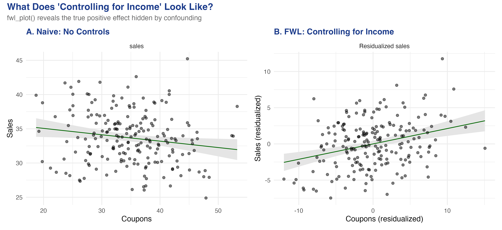
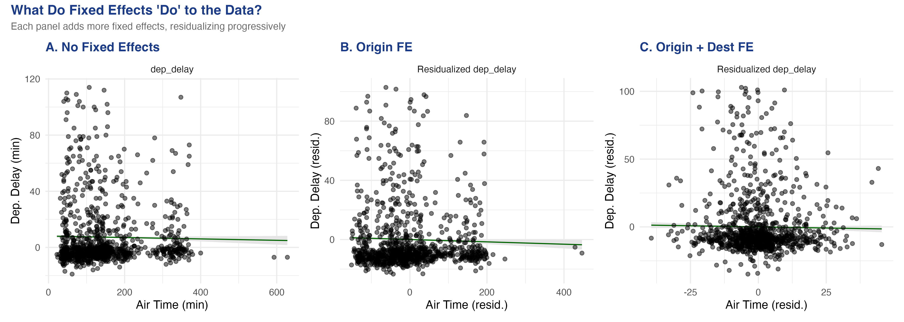
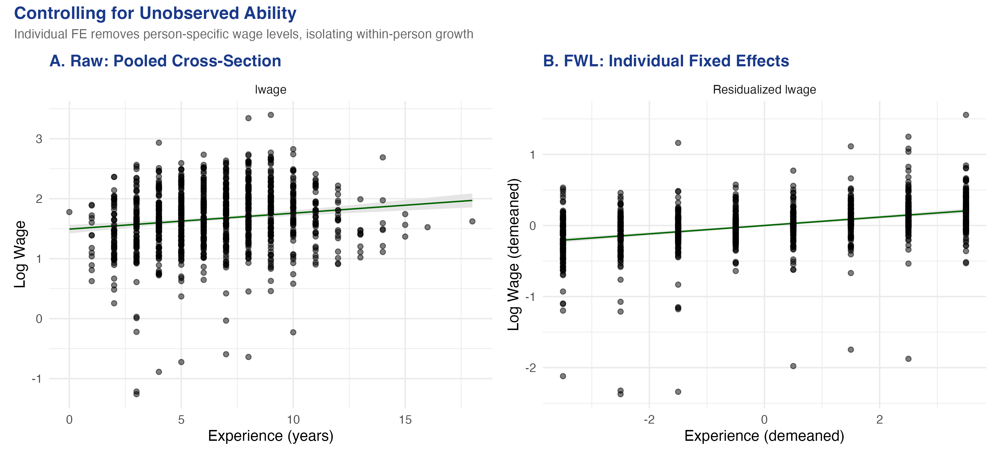

# The Tension {.divider background-color="#d97757"}

[Act I]{.act}

## "Controlling for income" is a 4-D claim we keep trying to draw in 2-D

"The effect of coupons on sales, *controlling for income*" is a relationship in many dimensions.

. . .

You cannot put it on a scatter plot. *Or can you?*

::: {.notes}
This is the most common question in applied regression and one of the hardest to answer with a picture. A multiple-regression coefficient summarises a multidimensional relationship; a scatter plot has two axes. The whole tutorial is about closing that gap.
:::

## A raw scatter says coupons *hurt* sales — and it is lying



::: {.notes}
Spoiler figure. Don't explain the residualization yet — just plant the shock: the left panel slope is negative (coupons reduce sales) while the true causal effect is +0.2. The right panel, the FWL-residualized scatter, is the picture we earn over the next dozen slides.
:::

## Where we're going

::: {.incremental}
- A simulated store where we *know* the true coupon effect is +0.2
- `fwl_plot()`: "controlling for income" in one line of R
- Manual residualization that reproduces `feols()` to six decimals
- Fixed effects = FWL on group dummies: flights, then a wage panel
:::

# The Investigation {.divider background-color="#6a9bcc"}

[Act II]{.act}

## The lab: 200 stores where income secretly drives both coupons and sales

::: {.incremental}
- **Outcome** — `sales`
- **Treatment** — `coupons` (true effect $+0.2$)
- **Confounder** — `income`: rich areas get *fewer* coupons ($-0.5$) but buy *more* ($+0.3$)
:::

[Income opens a backdoor path coupons ← income → sales. Block it, or the naive slope is biased.]{.takeaway .fragment}

::: {.notes}
We simulate so the true answer is known. The store targets promotions at lower-income areas, so income is negatively linked to coupons and positively linked to sales — a textbook confounder. The data-generating process is sales = 10 + 0.2·coupons + 0.3·income + 0.5·dayofweek + noise.
:::

## The correlation matrix already shows the trap: coupons–sales is −0.166

| Pair | correlation |
|---|---:|
| coupons ↔ sales (raw) | [−0.166]{.key} |
| income ↔ coupons | −0.709 |
| income ↔ sales | +0.500 |

[A negative *raw* coupon–sales correlation, even though the true effect is positive — Simpson's paradox in one table.]{.takeaway .fragment}

::: {.notes}
Income is strongly negative with coupons (−0.709) and strongly positive with sales (+0.500). Those two channels combine to drag the raw coupons–sales correlation negative. A naive analyst cancels the coupon program and loses revenue.
:::

## FWL: partial the controls out of *both* axes, then run one simple regression

$$\hat\beta_1=(\tilde X_1'\tilde X_1)^{-1}\tilde X_1'\tilde Y,\qquad \tilde Y=M_{X_2}Y,\quad \tilde X_1=M_{X_2}X_1$$

[$M_{X_2}=I-X_2(X_2'X_2)^{-1}X_2'$ is the residual-maker: it strips the influence of the controls $X_2$ from whatever it multiplies.]{.takeaway .fragment}

::: {.notes}
The Frisch–Waugh–Lovell theorem: the coefficient on X1 in the full regression equals the slope of a simple regression of the residualized outcome on the residualized regressor. Two routes, one number. The residual-maker matrix M projects out X2. Here Y is sales, X1 is coupons, X2 is income.
:::

## Controlling for income is one line — and it flips the slope to +0.212

``` {.r code-line-numbers="1|2|1-2"}
fwl_plot(sales ~ coupons,          data = store_data, ggplot = TRUE)  # slope −0.093
fwl_plot(sales ~ coupons + income, data = store_data, ggplot = TRUE)  # slope +0.212
```

`fwl_plot()` residualizes both `coupons` and `sales` on `income` behind the scenes, then plots the residuals with the regression line on top.

::: {.notes}
Same formula syntax as fixest::feols(), including the | operator for fixed effects later. Adding income to the formula is the only change. The naive slope is −0.093 (p = 0.019, significant but wrong); the controlled slope is +0.212 (p < 0.001), close to the true +0.2.
:::

## The regression table confirms what the picture showed

| Term | Naive | Controlled |
|---|---:|---:|
| coupons | −0.0934 | [+0.2123]{.key} |
| income | — | +0.3004 |
| R² | 0.028 | 0.321 |

[Every number here is a visual feature of the `fwl_plot()` scatter: the slope, and how tight the cloud is.]{.takeaway .fragment}

::: {.notes}
etable(fe_naive, fe_full) from feols. Adding income flips coupons from −0.093 to +0.212 and lifts R² from 0.028 to 0.321. The income coefficient 0.300 recovers the true 0.3. The picture and the table are the same fact.
:::

## Under the hood: residualize, residualize, regress — three lines

``` {.r code-line-numbers="2|3|4|2-4"}
# FWL by hand
resid_y <- resid(lm(sales   ~ income, data = store_data))  # sales income can't explain
resid_x <- resid(lm(coupons ~ income, data = store_data))  # coupons income can't explain
fwl_manual <- lm(resid_y ~ resid_x)                         # slope = the coupon coefficient
```

[Like comparing height *for your age*: judge each store's coupons and sales relative to its income level.]{.takeaway .fragment}

::: {.notes}
The three-step recipe IS the FWL theorem. Step 1 residualizes sales on income, step 2 residualizes coupons on income, step 3 regresses one residual on the other. Every multiple regression is doing this implicitly for each coefficient.
:::

## Manual FWL reproduces feols to six decimals — it is an exact identity {background-color="#141413"}

[0.212288]{.bignum}

[`feols` coefficient = manual FWL coefficient, to the sixth decimal]{.bignum-label}

::: {.notes}
This is not an approximation; it is an exact algebraic identity. The byte-for-byte match (0.212288 = 0.212288) is the proof that the residualized scatter is a faithful picture of the regression coefficient, not a rough analogy.
:::

## The bias was no mystery — the OVB formula predicted it

$$\text{bias}=\hat\gamma\times\hat\delta = 0.300\times(-0.494) = -0.148$$

[$\hat\gamma$ = income's effect on sales; $\hat\delta$ = slope of coupons on income. True $+0.212$ plus bias $-0.148$ ≈ the naive $-0.093$.]{.takeaway .fragment}

::: {.notes}
Omitted-variable bias = (effect of omitted variable on outcome) × (slope of omitted on treatment) = 0.300 × (−0.494) = −0.148. True + bias = 0.212 − 0.148 = 0.064, close to the actual naive −0.093 (the gap is n = 200 sampling noise). The point: if you know the signs of the confounder's two effects, you know which way the naive estimate tilts.
:::

## Fixed effects are just FWL applied to group dummies — i.e. demeaning

Including airport (or person) fixed effects = partialling out each group's mean from every variable.

. . .

[A race handicap: convert raw times into "faster or slower than your own average," then compare fairly.]{.takeaway .fragment}

::: {.notes}
Demeaning subtracts each group's average from every observation in that group, so we compare each unit to itself, not to other units. FWL guarantees this demeaning gives the same coefficients as a full set of dummy variables — which is exactly how fixest scales to millions of rows: demeaning is O(N), the dummy matrix is O(N×K).
:::

## More fixed effects = a tighter residual cloud: the flights data, panel by panel



::: {.notes}
317,578 cleaned flights from EWR/JFK/LGA in 2013; 5,000 sampled for plotting (the line uses all data). Panel A is a vague flat cloud; Panel B removes the 3 origin means; Panel C also removes 103 destination means, collapsing air-time to within-route deviations. Same one-liner, just more terms after the | operator.
:::

## Once you compare flights on the same route, the air-time slope is barely there

| Model | air_time | Within R² |
|---|---:|---:|
| No FE | −0.0031 | — |
| Origin FE | −0.0061 | 0.00058 |
| Origin + Dest FE | [−0.0067]{.key} | 1.19e-5 |

[Within-route, longer-than-usual air time predicts *slightly less* delay — possibly tail-wind days.]{.takeaway .fragment}

::: {.notes}
The coefficient moves from −0.003 to −0.007 (the "." marker = significant only at 10%). Panel C answers a sharper question than Panel A: "for flights on the same route, does longer-than-usual air time predict higher-than-usual delay?" Weakly negative. The vanishing within R² warns the within-route variation is almost too small to identify anything.
:::

## In a wage panel, controlling for *who you are* steepens the experience slope



::: {.notes}
Wooldridge wagepan: 545 individuals over 8 years (1980–1987), 4,360 rows; 150 individuals sampled for clarity. Panel A is the raw bivariate slope ≈ 0.03 with a wide fan reflecting unobserved ability. Panel B demeans each person's wage and experience, leaving only within-person deviations — a tighter cloud and a much steeper line.
:::

## Within-person, the return to experience more than triples: 0.03 → 0.122 {background-color="#141413"}

[0.122]{.bignum}

[within-person return to experience (R² 0.148 → 0.617 once individual FE are added)]{.bignum-label}

::: {.notes}
The pooled slope is ≈ 0.03; with individual fixed effects it steepens to 0.122 — a one-year experience increase raises wages ~12.2% within the same person. R² jumps from 0.148 to 0.617: most wage variation is who you are, not how long you've worked. Education drops out (time-invariant, collinear with person dummies); the linear exper term drops under two-way FE (collinear with year dummies).
:::

# The Resolution {.divider background-color="#00d4c8"}

[Act III]{.act}

## The residualized scatter is the exact picture of every regression coefficient

:::: {.columns}
::: {.column width="50%"}
### Raw scatter
- All confounding still mixed in
- Slope can flip sign (−0.093)
- Lies about direction
:::
::: {.column width="50%"}
### FWL scatter
- Controls partialled from both axes
- Slope = the regression coefficient
- The picture you *should* look at
:::
::::

::: {.notes}
The added-variable plot — residual Y vs residual X1 — has a slope equal to the multivariable coefficient. It is not a metaphor for the regression; it is the regression, drawn. And it doubles as a diagnostic: curvature flags nonlinearity, outliers flag leverage, a near-vertical collapse flags weak identification.
:::

## Does FWL make a regression causal? No — it only makes it *visible*

[Objection.]{.objection} If a residualized scatter recovers the "true" $+0.212$, doesn't FWL deliver the causal effect?

. . .

[Response.]{.rebuttal} No. FWL is an *algebraic* identity, not an identification strategy. The plot is honest only if you control for the *right* variables; partial out the wrong set and the scatter faithfully draws a biased number. And it holds exactly only for linear models.

::: {.notes}
Steelman, don't strawman. FWL guarantees the residualized slope equals the regression coefficient — full stop. Whether that coefficient is causal still rests on the usual assumptions (no remaining confounding). For logistic, Poisson, and other nonlinear models the partialling-out logic is only approximate.
:::

# Want to *see* a coefficient? Partial the controls out of both axes and plot the residuals. {.divider background-color="#141413"}

::: {.notes}
The single takeaway. Every regression coefficient already is a bivariate slope hiding inside a higher-dimensional fit; fwl_plot() just draws it. Next step: the companion Python FWL tutorial generalises partialling-out to Double Machine Learning.
:::
