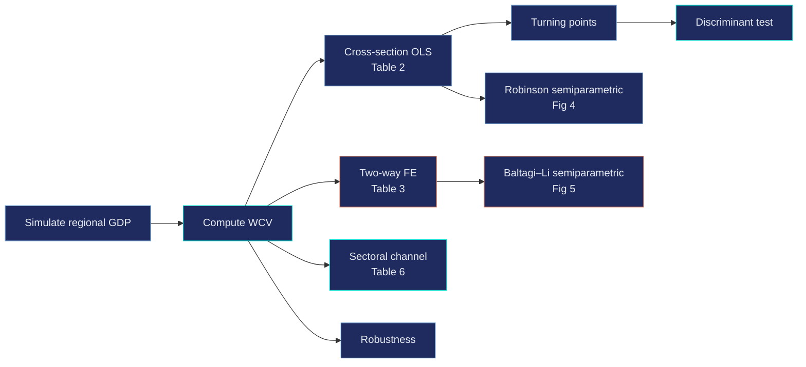
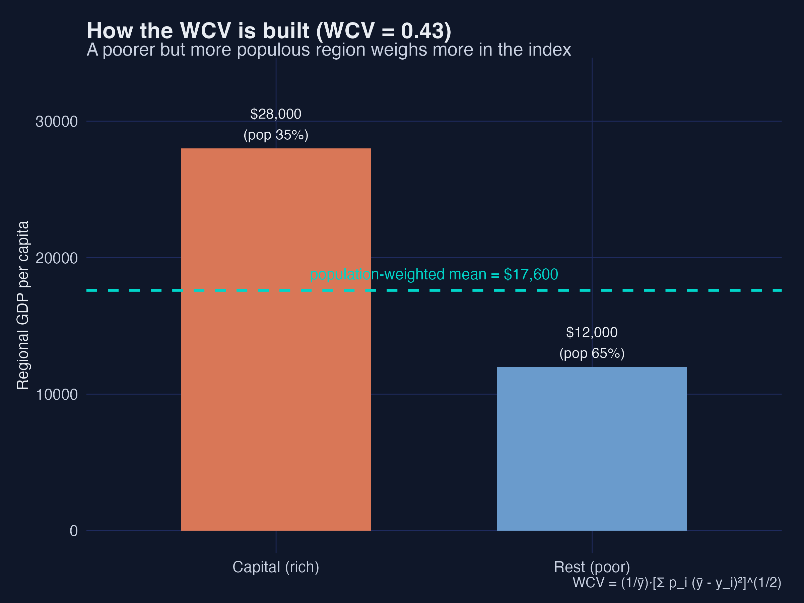
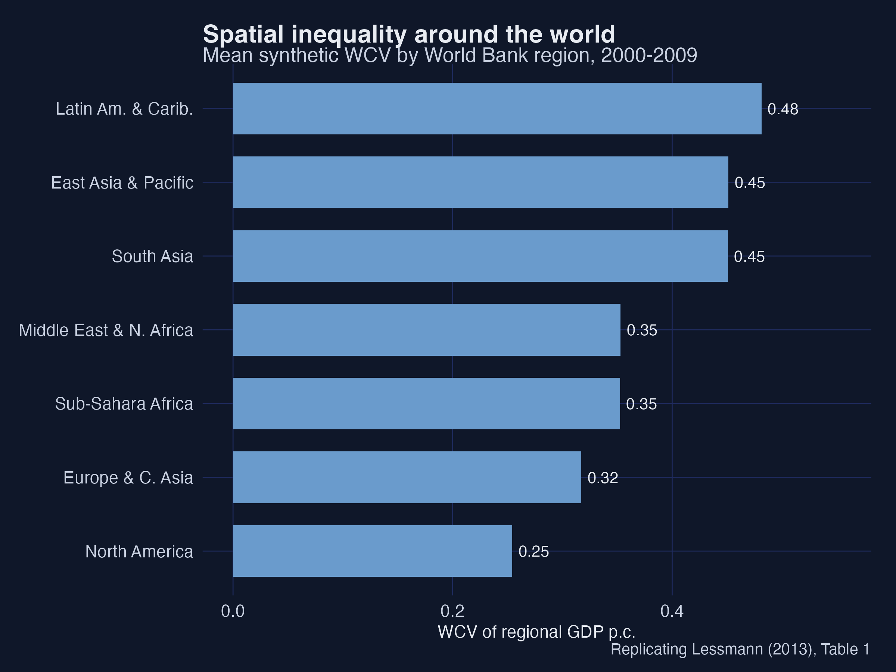
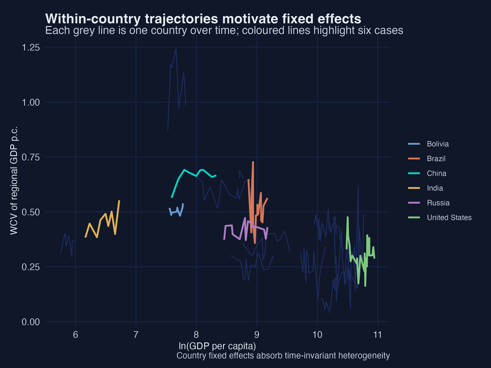
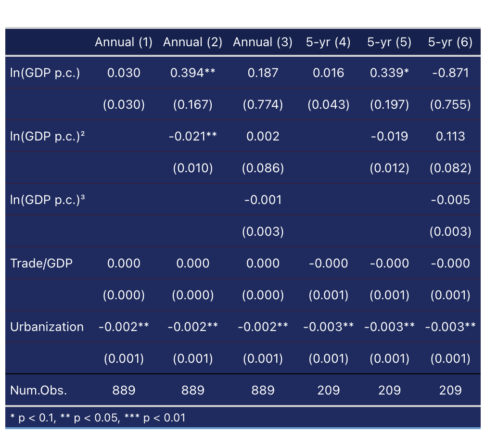
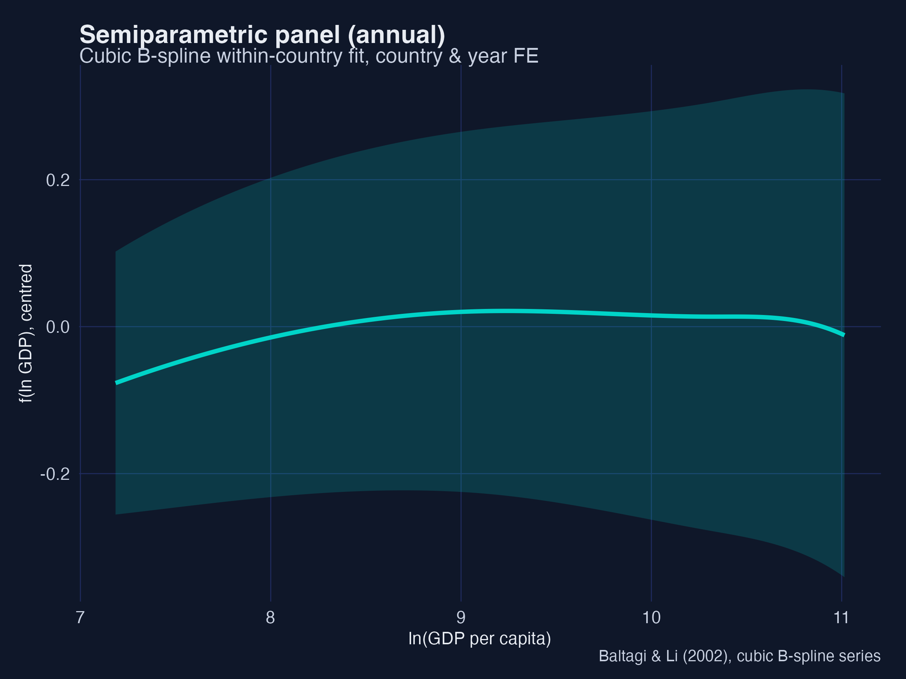
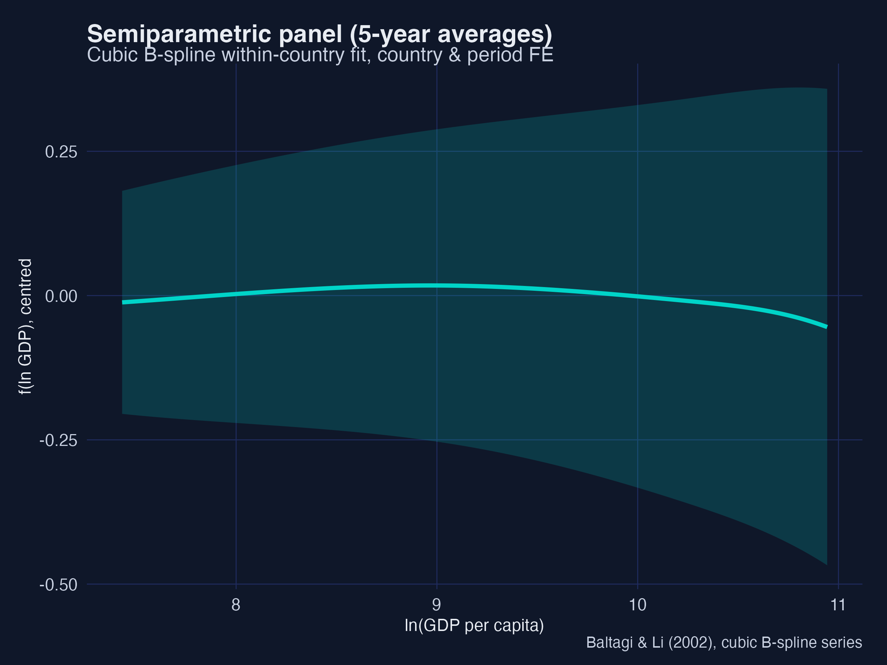
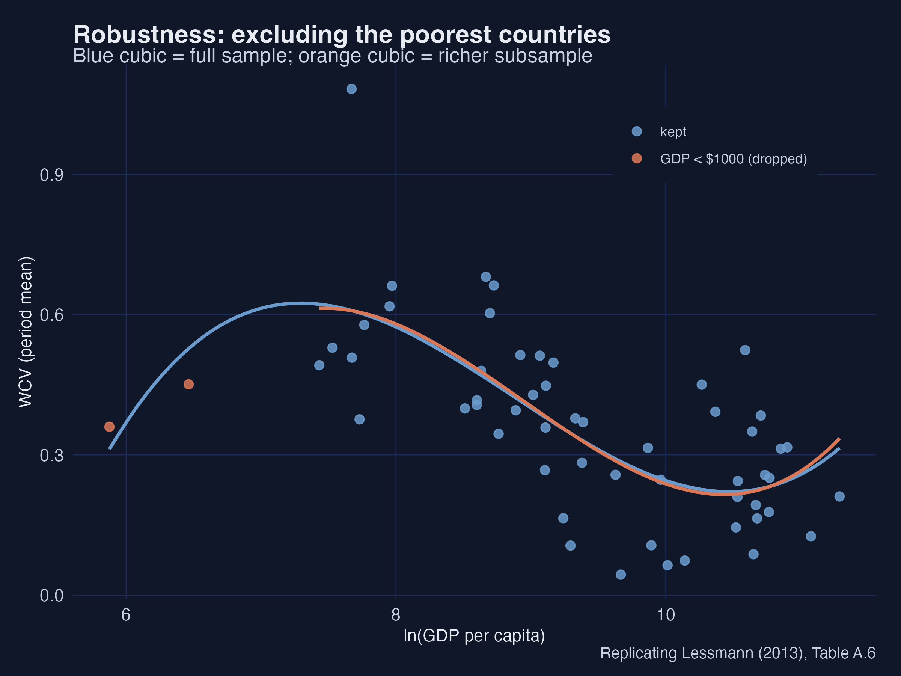
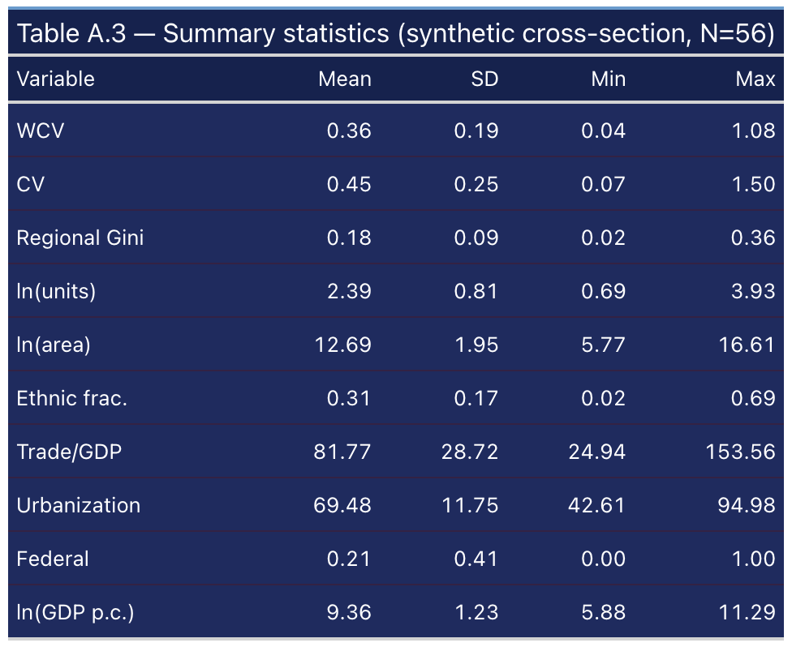

---
authors:
  - admin
categories:
  - R
  - Spatial inequality
  - Fixed Effects and TWFE
  - Semiparametric Methods
draft: false
featured: false
date: "2026-06-14T00:00:00Z"
external_link: ""
image:
  caption: ""
  focal_point: Smart
  placement: 3
links:
- icon: person-chalkboard
  icon_pack: fas
  name: "Slides (HTML)"
  url: slides/index.html
- icon: laptop-code
  icon_pack: fas
  name: "Web app"
  url: web_app/index.html
- icon: code
  icon_pack: fas
  name: "R script"
  url: analysis.R
- icon: file-pdf
  icon_pack: fas
  name: "Slides (PDF)"
  url: https://carlos-mendez.org/post/r_kuznets/slides.pdf
- icon: file-code
  icon_pack: fas
  name: "Quarto project (.zip)"
  url: r_kuznets.zip
- icon: podcast
  icon_pack: fas
  name: AI Podcast
  url: "/post/r_kuznets/#podcast-player"
- icon: markdown
  icon_pack: fab
  name: "MD version"
  url: https://raw.githubusercontent.com/cmg777/starter-academic-v501/master/content/post/r_kuznets/index.md
- icon: database
  icon_pack: fas
  name: "Data (CSV)"
  url: https://github.com/cmg777/starter-academic-v501/tree/master/content/post/r_kuznets/data
slides:
summary: A beginner-friendly R replication of Lessmann (2013) on the spatial Kuznets curve — building the weighted coefficient of variation from simulated regional data, then estimating the inverted-U with cross-section OLS, two-way fixed effects in fixest, and the Robinson and Baltagi–Li semiparametric estimators.
tags:
  - r
  - econometrics
  - regional inequality
  - panel data
  - semiparametric
  - fixed effects
title: "Spatial Inequality and the Kuznets Curve: Parametric and Semiparametric Estimates in R"
url_code: ""
url_pdf: ""
url_slides: ""
url_video: ""
toc: true
diagram: true
---

## Abstract

Why do some countries have huge gaps between their richest and poorest regions while others are remarkably even? Lessmann (2013) revisits a classic idea from Kuznets (1955) and Williamson (1965): as countries develop, spatial inequality first *rises*, then *falls* — an inverted-U. This tutorial replicates that study in R on a **synthetic** dataset, so the entire data-generating process is open and reproducible. We simulate regional GDP per capita for 56 countries over 1980–2009, compute the population-weighted coefficient of variation (WCV) of regional income from those regions, and estimate the relationship with cross-section OLS, two-way fixed effects via `fixest`, and the Robinson (1988) and Baltagi–Li (2002) semiparametric estimators. The cross-section recovers a significant inverted-U with a high-income upturn — a cubic whose turning points sit at about \\$2,100 and \\$31,000 of GDP per capita — while the within-country panel shows a *clean* inverted-U (the cubic term is insignificant). Spatial inequality correlates with personal (Gini) inequality at about 0.32, and a sectoral channel — the non-agricultural share of output — reproduces the same curve. The practical lesson is that wide regional gaps are, to a first approximation, a transitional feature of development that tends to narrow as economies mature; for learners, the post is a hands-on tour of measurement, fixed effects, polynomial specification, and flexible semiparametric regression.

## 1. Overview

**The case-study question.** *Is the link between spatial inequality and economic development an inverted-U — and does it turn N-shaped (rising again) at very high income?* Lessmann (2013) assembled a hard-to-find panel of regional accounts to answer it. We cannot share that proprietary data, so we do the next best thing for teaching: **build a synthetic world** whose data-generating process reproduces the paper's findings, and walk through every estimator on it.

Why does this matter? Wide regional gaps are not just an accounting curiosity. Interregional inequality often travels with ethnic and political tension, and in extreme cases raises the risk of internal conflict. Understanding *when* such gaps widen and *when* they close is directly useful for regional policy.

**Learning objectives.** By the end you will be able to:

1. Compute the **weighted coefficient of variation (WCV)** of regional income and explain why it is population-weighted.
2. Estimate **polynomial OLS** with heteroskedasticity-robust (White) standard errors and read an inverted-U off the coefficients.
3. Fit **two-way fixed effects** with `fixest::feols`, and explain why country and year fixed effects change the story.
4. Solve for the **turning points** of a cubic and convert them to dollar thresholds.
5. Read the **Robinson** and **Baltagi–Li** semiparametric partial-fit curves and say how they differ from a polynomial.



The pipeline above is the whole post in one picture: simulate regions, compute the inequality index, then estimate the development–inequality relationship four ways (parametric and semiparametric, cross-section and panel), and probe the sectoral channel and robustness.

### Key concepts at a glance

The post reuses a small vocabulary. Each concept below has a **definition** (always visible) plus an **example** and **analogy** behind clickable cards — open them when a term feels slippery.

**1. Weighted coefficient of variation (WCV).** $\mathrm{WCV} = \frac{1}{\bar{y}}\left[\sum\_{j} p\_j\,(\bar{y}-y\_j)^2\right]^{1/2}$ — the population-weighted spread of regional GDP per capita, divided by the country mean. Scale-free, so it compares countries of any income level.

<div class="concept-pair">
<details class="concept-card concept-example"><summary>Example</summary>

A country with a rich capital (\\$28,000, 35% of people) and a poorer hinterland (\\$12,000, 65%) has WCV ≈ 0.43.

</details>
<details class="concept-card concept-analogy"><summary>Analogy</summary>

Like a "spread score" for a class where bigger groups of students count more toward the average gap.

</details>
</div>

**2. Inverted-U / Kuznets curve.** The hypothesis that inequality rises with development, peaks, then falls — tracing an upside-down U.

<div class="concept-pair">
<details class="concept-card concept-example"><summary>Example</summary>

In §5 the quadratic gives a positive linear term and a negative squared term — the algebraic signature of an inverted-U.

</details>
<details class="concept-card concept-analogy"><summary>Analogy</summary>

A roller-coaster hill: climb during industrialisation, crest, then descend as the modern economy spreads out.

</details>
</div>

**3. Between vs within variation.** *Between* compares different countries; *within* compares one country with itself over time. Cross-section regressions use between variation; panel fixed effects use within variation.

<div class="concept-pair">
<details class="concept-card concept-example"><summary>Example</summary>

The high-income *upturn* shows up between countries (§5) but vanishes within countries (§6) — the central contrast of the study.

</details>
<details class="concept-card concept-analogy"><summary>Analogy</summary>

Comparing different students' heights (between) vs tracking one student as they grow (within).

</details>
</div>

**4. Two-way fixed effects (TWFE).** Adding a dummy for every country *and* every year, so the income effect is identified only from within-country, within-year variation.

<div class="concept-pair">
<details class="concept-card concept-example"><summary>Example</summary>

`feols(wcv ~ lnGDP + I(lnGDP^2) | country + year)` — the `| country + year` part absorbs both sets of dummies.

</details>
<details class="concept-card concept-analogy"><summary>Analogy</summary>

Grading each student against their own past, and against everyone's average that semester — removing fixed advantages.

</details>
</div>

**5. Polynomial specification.** Entering income as $Y, Y^2, Y^3$ lets a straight-line model bend into curves — quadratic for an inverted-U, cubic for an N-shape.

<div class="concept-pair">
<details class="concept-card concept-example"><summary>Example</summary>

Column (5) of Table 2 adds $Y^3$; its positive coefficient produces the high-income upturn.

</details>
<details class="concept-card concept-analogy"><summary>Analogy</summary>

Adding hinges to a ruler so it can follow a winding road instead of cutting straight across.

</details>
</div>

**6. Turning points.** The income levels where the curve changes direction — found by setting the derivative to zero: $\beta\_1 + 2\beta\_2 Y + 3\beta\_3 Y^2 = 0$.

<div class="concept-pair">
<details class="concept-card concept-example"><summary>Example</summary>

Our cubic peaks at ln(GDP) ≈ 7.7 (≈ \\$2,100) and troughs at ≈ 10.4 (≈ \\$31,000).

</details>
<details class="concept-card concept-analogy"><summary>Analogy</summary>

The crest and the valley of the roller-coaster — where the track is momentarily flat.

</details>
</div>

**7. Semiparametric / partially-linear model.** $\mathrm{WCV} = \alpha + f(Y) + \gamma X + \epsilon$: the controls $X$ enter linearly, but the income effect $f(Y)$ is an unknown smooth curve estimated from the data instead of forced into a polynomial.

<div class="concept-pair">
<details class="concept-card concept-example"><summary>Example</summary>

The Robinson estimator (§8) and the Baltagi–Li B-spline (§9) draw $f(Y)$ as a flexible curve with a confidence band.

</details>
<details class="concept-card concept-analogy"><summary>Analogy</summary>

Tracing a coastline freehand instead of approximating it with a few straight rulers.

</details>
</div>

**8. Omitted-variable bias.** When a left-out factor correlated with both income and inequality distorts the estimated relationship; fixed effects defend against the *time-invariant* version of it.

<div class="concept-pair">
<details class="concept-card concept-example"><summary>Example</summary>

Geography (mountains, coasts) drives spatial inequality but is hard to measure; country fixed effects absorb all of it at once.

</details>
<details class="concept-card concept-analogy"><summary>Analogy</summary>

Blaming coffee for poor sleep when it's really the late-night screen time that travels with it.

</details>
</div>

**9. Discriminant of the cubic.** A single number, $D = \beta\_2^2 - 3\beta\_1\beta\_3$, that tells you whether a fitted cubic has two real turning points ($D>0$), one inflection ($D=0$), or none ($D<0$). It is computed from the coefficients, so it answers "does the curve bend?" — a different question from "is each term significant?"

<div class="concept-pair">
<details class="concept-card concept-example"><summary>Example</summary>

In §7 the cross-section cubic has $D = +0.0055 > 0$ with both turning points in range (genuine N-shape), while the panel cubic's implied turning points fall outside the data.

</details>
<details class="concept-card concept-analogy"><summary>Analogy</summary>

A road can curve gently yet never actually turn back; the discriminant is the test for whether it makes a genuine U-turn or just leans.

</details>
</div>

## 2. Setup and the synthetic data-generating process

### 2.1 Packages and theme

We lean on `fixest` for fixed effects, `np` for the Robinson estimator, `splines` for the Baltagi–Li B-spline, `sandwich`/`lmtest` for White standard errors, and `ggplot2` for dark-themed figures.

```r
set.seed(123)
pacman::p_load(dplyr, tidyr, ggplot2, scales, patchwork, fixest, sandwich, lmtest,
               splines, np, modelsummary, gt, webshot2, gridExtra)
options(np.messages = FALSE)
```

### 2.2 Simulating regional GDP and a country panel

The key design choice is that **the WCV is computed, not assumed**. For each of 56 synthetic countries we build a realistic territorial structure — the actual number of regions and land areas from the paper's appendix — then draw regional GDP per capita and a population share for each region. We engineer two layers into the data: a **within-country** inverted-U (how a country's regional spread evolves as it develops) and a **between-country** cubic that lives in a time-invariant country term. This separation is what lets the panel show a clean inverted-U while the cross-section shows the N-shape.

```r
# region j in country i, year t:  y_ijt = country_mean × exp(δ_it · z_ij)
# z_ij is a persistent regional "position" (a rich region stays rich);
# δ_it (the log-dispersion) follows the structural inverted-U in development.
delta <- sqrt(log(1 + target_wcv^2))         # lognormal-CV inversion
y_reg <- exp(lnGDP) * exp(delta * z - 0.5 * delta^2)
```

```text
Simulating regional micro-data for 56 countries ...
  annual obs N=890 | 5-year obs N=212 | cross-section N=56
```

The simulated panel has **890 annual observations**, **212 five-year cells**, and **56 countries** in the cross-section — close to the paper's 915 / 207 / 56. The unbalanced shape is deliberate: rich OECD economies have long, dense coverage; developing countries have short, gappy series, exactly as in the real data.

## 3. Measuring spatial inequality: the WCV

Lessmann measures spatial inequality with the population-weighted coefficient of variation of regional GDP per capita:

$$\mathrm{WCV}\_{i,t} = \frac{1}{\bar{y}}\left[\sum\_{j=1}^{n} p\_j\,(\bar{y} - y\_j)^2\right]^{1/2}$$

where $\bar{y}$ is the country's average regional GDP per capita, $y\_j$ is region $j$'s GDP per capita, $p\_j$ is region $j$'s share of the country's population, and $n$ is the number of regions. The population weighting is the crucial feature: a tiny, very rich (or very poor) region barely moves the index, while a populous region counts a lot.

```r
wcv_fun <- function(y, p) {
  ybar <- sum(p * y)                          # population-weighted mean
  sqrt(sum(p * (ybar - y)^2)) / ybar          # weighted SD / mean
}
toy <- data.frame(gdp_pc = c(28000, 12000), pop_share = c(0.35, 0.65))
wcv_fun(toy$gdp_pc, toy$pop_share)
```

```text
Worked WCV example: ybar = 17600, WCV = 0.434
```



A rich capital region at \\$28,000 (35% of the population) and a poorer hinterland at \\$12,000 (65%) give a population-weighted mean of \\$17,600 and a **WCV of 0.434**. Because the larger, poorer region carries more weight, the index reflects how *most people* experience the regional gap — not just the extremes. Mapping the same calculation across all 56 synthetic countries reproduces the familiar geography of spatial inequality.



High-income North America and Europe show the lowest spatial inequality, while East Asia, Latin America and Sub-Saharan Africa show the highest — the cross-regional ranking Lessmann reports in Table 1.

## 4. Spatial vs personal inequality (Fig 3)

Before modelling development, it is worth asking how spatial inequality relates to the more familiar **personal** inequality (the household-income Gini). If they were the same thing, studying regions would add nothing.

```r
fig3_fit <- lm(gini ~ wcv, cs)
coef(fig3_fit); cor(cs$gini, cs$wcv)
```

```text
Fig 3: GINI = 0.311 + 0.208 * WCV  (t = 2.45),  corr = 0.316
```


The slope is positive and significant (**0.208**, t = 2.45) and the correlation is **0.316** — close to the paper's 0.324. Spatial inequality explains a real but partial share of personal inequality: the two are related, not interchangeable. A country can have high personal inequality with low regional inequality (the United States) or the reverse (a small, ethnically split economy). That partial overlap is exactly why the rest of the post focuses on the *spatial* dimension in its own right.

## 5. Cross-section parametric estimates (Table 2)

We start where Williamson (1965) did: a **cross-section** of countries, using period means over 2000–2009. The estimating equation is a polynomial in development with controls:

$$\mathrm{WCV}\_{i} = \alpha + \sum\_{j=1}^{k}\beta\_j\,Y\_{i}^{\,j} + \gamma X\_{i} + \epsilon\_{i}$$

where $Y = \ln(\text{GDP per capita})$. An inverted-U needs $\beta\_1 > 0$ and $\beta\_2 < 0$. We use **White (HC1) heteroskedasticity-robust** standard errors to match the paper.

```r
m1 <- lm(wcv ~ lnGDP, cs)                                            # bivariate
m4 <- lm(wcv ~ lnGDP + I(lnGDP^2) + lnunits + lnarea + area_units +
              ethnic + trade_gdp + urbanization + federal, cs)       # full controls
m5 <- lm(wcv ~ lnGDP + I(lnGDP^2) + I(lnGDP^3) + lnunits + lnarea +
              area_units + ethnic + trade_gdp + urbanization + federal, cs)  # + cubic
lmtest::coeftest(m1, vcov = sandwich::vcovHC(m1, "HC1"))
```

```text
CS (1) lnGDP       -0.098*** ->  -0.092***
CS (4) lnGDP/^2  +0.33*/-0.021* ->  0.338* / -0.020**
CS (5) cubic 3.86**/-0.45**/0.017** ->  4.40***/-0.499***/0.0184***
CS adjR2 0.43/0.66/0.69 ->  0.33/0.67/0.73
```


The five specifications tell a story. The **bivariate** slope is negative (**−0.092\*\*\***): on average, richer countries have *lower* spatial inequality — but a straight line hides the structure. Once the controls enter (column 4), the **inverted-U emerges**: the linear income term turns positive (**+0.338\***) and the squared term is negative (**−0.020\*\***). Adding a cubic (column 5) makes all three income terms significant — **+4.40\*\*\* / −0.499\*\*\* / +0.0184\*\*\*** — and the positive cubic coefficient reveals an **upturn at very high income** (the N-shape). Every control carries the expected sign: more trade and more regions raise spatial inequality, while federal constitutions and urbanisation lower it.


The scatter makes the algebra visual: the straight line slopes down, the quadratic bends into an inverted-U, and the cubic adds the high-income upturn among the richest economies. **Interpretation:** the same data support three different stories depending on the functional form — which is exactly why Lessmann reports all of them and then turns to semiparametric methods that do not force a shape.

## 6. Panel two-way fixed effects (Table 3)

### 6.1 Why fixed effects?

The cross-section compares *different* countries, so any unmeasured, time-invariant trait correlated with income — geography, history, ethnic geography — can bias the estimate. A **panel** lets us compare each country *with itself over time* and absorb all such traits with country dummies.



Each grey line is one country's path; the coloured lines highlight China, India, Russia, Brazil, the United States and Bolivia. Countries sit at very different inequality *levels* for reasons unrelated to their income trajectory — and those level differences are precisely what country fixed effects remove.

### 6.2 The `fixest::feols` specification

The panel model adds country *and* year fixed effects:

$$\mathrm{WCV}\_{i,t} = \beta\_1 Y\_{i,t} + \beta\_2 Y\_{i,t}^2 + \gamma X\_{i,t} + \alpha\_i + \mu\_t + \epsilon\_{i,t}$$

In `fixest`, the fixed effects go after a vertical bar, and `vcov = "hetero"` reproduces the paper's White standard errors (clustering by country is the modern alternative):

```r
fa2 <- feols(wcv ~ lnGDP + I(lnGDP^2) + trade_gdp + urbanization |
                   country + year, data = annual, vcov = "hetero")
fa3 <- feols(wcv ~ lnGDP + I(lnGDP^2) + I(lnGDP^3) + trade_gdp + urbanization |
                   country + year, data = annual, vcov = "hetero")
```

```text
PAN (2) lnGDP/^2 0.345**/-0.018** ->  0.394**/-0.0211** ;  cubic n.s. ->  -0.0008
```



The **within-country** relationship is a clean inverted-U: the quadratic gives **+0.394\*\*** and **−0.0211\*\***, matching the paper. Crucially, the **cubic term is insignificant** (−0.0008, t = −0.26): there is *no* high-income upturn within countries. This is the study's central contrast — the upturn we saw in the cross-section is a *between-country* phenomenon (rich service economies differ from rich manufacturing ones), not something a single country experiences as it grows.


The fitted TWFE quadratic peaks around ln(GDP) ≈ 9.8 (~\\$18,000): as a typical country develops past that point, its regional gaps start to close. **Interpretation:** fixed effects do not just tidy up standard errors — they change the substantive conclusion about whether the upturn is real for any given country.

### 6.3 Annual vs 5-year averages

Annual data can be noisy because of business cycles, so Lessmann also estimates on 5-year averages. We build them by grouping years into six periods and averaging within country-period cells; the inverted-U survives (5-year quadratic ≈ +0.34 / −0.019), confirming the result is not a short-run artefact.

## 7. Turning points and the discriminant test

A cubic *can* bend twice — but does it actually? And does it bend inside the range of incomes we observe? This section answers both. It is the most transferable skill in the post: any time you fit a cubic, these two checks tell you whether the curve really has the shape your coefficients seem to promise.

### 7.1 Calculating the turning points

Where does the curve change direction? At a turning point the slope is zero, so we set the derivative of the cubic to zero:

$$\frac{\partial \mathrm{WCV}}{\partial Y} = \beta\_1 + 2\beta\_2 Y + 3\beta\_3 Y^2 = 0$$

This is a *quadratic* in $Y$, so it has at most two roots — the inverted-U peak and the high-income trough. One direct way to find them is `polyroot`:

```r
bc <- coef(m5)
roots <- sort(Re(polyroot(c(bc["lnGDP"], 2*bc["I(lnGDP^2)"], 3*bc["I(lnGDP^3)"]))))
data.frame(ln_gdp = roots, gdp_usd = round(exp(roots)))
```

```text
     ln_gdp  gdp_usd
1     7.671     2146
2    10.356    31443
```


Spatial inequality **rises** with development up to ln(GDP) ≈ 7.7 (about **\\$2,100**), **falls** until ln(GDP) ≈ 10.4 (about **\\$31,000**), and then **rises again**. **Interpretation 1:** the first threshold marks the industrial take-off where a few leading regions surge ahead; the second marks the maturity where convergence has run its course and post-industrial forces (tertiarisation) begin to pull rich regions apart again. Because the regressor is $\ln(\text{GDP})$, we exponentiate each root to read it back in dollars.

### 7.2 The discriminant: does the curve really bend?

Computing the roots numerically works, but it hides *why* a cubic sometimes has two turning points and sometimes none. The quadratic $\beta\_1 + 2\beta\_2 Y + 3\beta\_3 Y^2 = 0$ has two real solutions exactly when its discriminant is positive. After dropping a harmless factor of 4 (see the algebra below), the rule simplifies to a single number:

$$D \;\equiv\; \beta\_2^2 - 3\,\beta\_1\beta\_3.$$

There are three regimes:

| Discriminant | Real turning points | Shape over the real line | Verdict |
|---|---|---|---|
| $D > 0$ | 2 | rise–fall–rise (an "N on its side") | the cubic shape is **real** |
| $D = 0$ | 1 (inflection) | a single flat spot, no reversal | knife-edge boundary |
| $D < 0$ | 0 | monotonic — never reverses | the cubic shape is **not real** |

The standard quadratic-formula discriminant is $b^2-4ac = (2\beta\_2)^2 - 4(3\beta\_3)(\beta\_1) = 4(\beta\_2^2 - 3\beta\_1\beta\_3) = 4D$; the factor of 4 never changes the sign, so we work with $D = \beta\_2^2 - 3\beta\_1\beta\_3$. When $D>0$, the turning-point locations come straight from the quadratic formula (then exponentiate to dollars):

$$Y^{\star} = \frac{-\beta\_2 \pm \sqrt{D}}{3\beta\_3}, \qquad \mathrm{GDP}^{\star} = \exp\!\left(Y^{\star}\right).$$

In R the whole test is two short functions:

```r
cubic_disc <- function(b1, b2, b3) b2^2 - 3 * b1 * b3          # the discriminant
cubic_tp   <- function(b1, b2, b3) {                            # turning points (if any)
  D <- cubic_disc(b1, b2, b3)
  if (D <= 0) return("no real turning points (monotonic)")
  sort(exp(c(-b2 - sqrt(D), -b2 + sqrt(D)) / (3 * b3)))         # in GDP-per-capita units
}
bc <- coef(m5)
cubic_disc(bc["lnGDP"], bc["I(lnGDP^2)"], bc["I(lnGDP^3)"])
```

```text
[1] 0.005519
```


**Interpretation 2:** the figure holds the linear and cubic coefficients fixed and changes *only* the squared term. A small change flips the regime: when $D<0$ the curve climbs monotonically, at $D=0$ it develops a single flat inflection, and once $D>0$ it bends into the genuine rise–fall–rise N-shape. The sign of one number — the discriminant — is what separates "a cubic that bends" from "a cubic that merely curves."

### 7.3 Two checks, not one: significance is not shape

Here is the trap. In our cross-section, *all three* income terms are statistically significant (§5: $\beta\_1=4.40^{\*\*\*}$, $\beta\_2=-0.499^{\*\*\*}$, $\beta\_3=0.018^{\*\*\*}$). It is tempting to conclude "therefore the relationship is a genuine cubic with two turning points." That inference is wrong as stated. Significance answers *"does the data prefer keeping this term?"*; it does **not** answer *"does the fitted curve actually bend inside the income range we observe?"* The discriminant — plus a check on where the turning points fall — answers the second question. Applying both checks to this project's two cubics, and to three illustrative cases, makes the distinction concrete:

```r
# applied to the cross-section cubic, the panel cubic, and three synthetic cases
```

```text
                               case     b1      b2        b3       D                              regime  in_range
1  Cross-section cubic (significant) 4.3965 -0.4988  0.018447 +0.0055    2 turning points (both in range)      TRUE
2        Panel cubic (insignificant) 0.1875  0.0017 -0.000836 +0.0005  2 turning points (>=1 OUT of range)     FALSE
3      Synthetic 5a: genuine N-shape 4.4000 -0.5000  0.018000 +0.0124    2 turning points (both in range)      TRUE
4       Synthetic 5b: monotonic trap 4.4000 -0.4000  0.018000 -0.0776                     monotonic (D<0)     FALSE
5   Synthetic 5c: turns out of range 4.4000 -0.5000  0.001000 +0.2368  2 turning points (>=1 OUT of range)     FALSE
```

Read the rows from top to bottom:

- **Cross-section cubic** — $D = +0.0055 > 0$ and *both* turning points (\\$2,146 and \\$31,443) fall inside the observed income range (\\$315–\\$82,653). This is a genuine N-shape. Significance and shape agree.
- **Panel cubic** — the within-country cubic term was *insignificant* (§6, $t=-0.26$), so it fails the first check already. Even taking its coefficients at face value, $D>0$ but one implied turning point sits at roughly **\\$0.0003** — absurdly far below any real economy — so the curve does not bend inside the observed range. Two independent reasons to reject a within-country N-shape, exactly matching §6's clean inverted-U.
- **Synthetic 5b** (the trap) — *same sign pattern* as the genuine case, only $\beta\_2$ is a touch smaller in magnitude, and $D = -0.078 < 0$. The curve is monotonic everywhere. A cubic regression on such data could report all three terms as "significant" and still have no turning point at all.
- **Synthetic 5c** — $D>0$, so two turning points exist *mathematically*, but they land at \\$86 and an astronomically high income. Inside any realistic range the curve is monotonic. "Two turning points exist" would be technically true and practically misleading.

**Interpretation 3:** significance (does the data want the term?) and the discriminant-plus-range check (does the curve actually bend, and where?) are different questions, and you need both. Reporting "all three GDP terms are significant, so the curve is cubic" can be wrong in two distinct ways — the discriminant can be negative (5b), or the turning points can fall outside the data (5c). The honest workflow is: report the coefficients, compute $D$, and *if* $D>0$ confirm the turning points lie inside the observed income range before claiming an inverted-U or N-shape.

> **Aside (for Bayesian model averaging).** The same trap appears with a different label. In a BMA, a term's posterior inclusion probability (PIP) near 1.00 is the Bayesian analogue of "statistically significant" — it says the data prefer keeping the term. But a high PIP on the cubic term no more guarantees a genuine bend than a significant cubic coefficient does: you still compute $D = \beta\_2^2 - 3\beta\_1\beta\_3$ from the *posterior-mean* coefficients and check the turning-point range. The companion note *Turning Points and Discriminant Analysis* (Mendez, 2026) works through real cases — cross-country CO₂ ($D>0$, genuine) versus Chinese provincial PM₂.₅ (PIPs ≈ 1.00 but $D<0$, monotonic) — that make the point with field data.

## 8. Semiparametric cross-section: the Robinson estimator (Table 4, Fig 4)

A polynomial *forces* a shape. A **partially-linear model** lets the income effect be any smooth curve while keeping the controls linear:

$$\mathrm{WCV} = \alpha + f(Y) + \gamma X + \epsilon$$

Robinson's (1988) estimator is a clever two-step "double residual" idea: first partial $Y$ out of both the outcome and each control *non-parametrically*, then run OLS on the residuals to recover $\gamma$; finally smooth the leftover against $Y$ to draw $f$.

```r
# Step 1: non-parametrically remove lnGDP from y and each control
resid_np <- function(v, z) residuals(npreg(v ~ z, regtype = "ll", ckertype = "gaussian"))
ey <- resid_np(cs$wcv, cs$lnGDP)
eX <- sapply(Xnames, function(nm) resid_np(cs[[nm]], cs$lnGDP))
# Step 2: OLS of residualised y on residualised X  ->  linear part (Table 4)
rob <- lm(ey ~ eX - 1)
# np::npplreg implements exactly this estimator and returns identical coefficients
```

```text
             robinson_coef       t   npplreg_coef
lnunits             0.1650  3.9405        0.1575
trade_gdp           0.0021  4.0348        0.0020
urbanization       -0.0057 -3.0047       -0.0056
federal            -0.0670 -1.7456       -0.0525
```


The linear-part coefficients match the parametric estimates — more regions and more trade raise inequality, urbanisation and federalism lower it — and `np::npplreg` returns the *same* numbers, confirming the hand-built estimator. The flexible curve $f(Y)$ traces the inverted-U with a high-income upturn, and the 90% band widens at the sparse low-income end. **Interpretation:** because the curve was never told to be a cubic, its agreement with the parametric cubic is independent evidence that the N-shape is in the data, not an artefact of the polynomial.

## 9. Semiparametric panel: the Baltagi–Li series estimator (Table 5, Fig 5)

For the panel, Baltagi & Li (2002) remove the fixed effects and approximate $f(Y)$ with a **cubic B-spline** (order $k = 4$). We implement this faithfully in `fixest`: a B-spline basis of the income term, with country and year fixed effects absorbed.

```r
B <- splines::bs(annual$lnGDP, degree = 3, df = 5)        # cubic B-spline (order k=4)
colnames(B) <- paste0("bs", 1:5)
m_bl <- feols(wcv ~ bs1+bs2+bs3+bs4+bs5 + trade_gdp + urbanization |
                    country + year, data = cbind(annual, B), vcov = "hetero")
```

```text
                 estimate       t   within_r2
trade_gdp          0.0002  0.564     0.021   (annual)
urbanization      -0.0027 -2.785     0.021   (annual)
urbanization      -0.0029 -2.634     0.068   (5-year)
```




Trade is insignificant and **urbanisation is significantly negative** (−0.0027\*\* annual, −0.0029\*\* on 5-year averages), matching the paper's Table 5. The recovered $f(Y)$ curves show the within-country inverted-U with **no upturn** at high income — the same message as the parametric panel, now without assuming a polynomial. **Interpretation:** two very different flexible methods (kernel-based Robinson and spline-based Baltagi–Li) agree with the parametric models, which is exactly the kind of triangulation that makes a descriptive finding credible.

## 10. The sectoral channel (Table 6)

Kuznets and Williamson argued that the *real* driver is **structural change** — the shift from agriculture to industry and services — with income just a proxy. We test this directly by replacing income with the **non-agricultural share of gross value added**.

```r
s4 <- lm(wcv ~ nonag + I(nonag^2) + lnunits + lnarea + area_units +
              ethnic + trade_gdp + urbanization + federal, cs)
```

```text
== Table 6: sectoral data (non-agricultural GVA / GDP) ==
  nonag = 0.0165***   nonag^2 = -0.00014***
```


Spatial inequality **rises then falls** with the non-agricultural share (**+0.0165\*\*\*** and **−0.00014\*\*\***) — an inverted-U in the structural variable itself. **Interpretation:** this is the mechanism behind the income result. As an economy industrialises, a few regions capture the new activity and gaps widen; as the modern sector matures and spreads, gaps narrow. Development raises inequality *because* it reshuffles where output is produced.

## 11. Robustness

### 11.1 Excluding the poorest countries

The rising arm of the curve depends on poor countries. Dropping those with GDP per capita below \\$1,000 weakens the full inverted-U — the cubic no longer traces the complete shape, just as the paper finds.



### 11.2 Excluding capital regions

Capital regions are often far richer than the rest of a country. Recomputing the WCV without them and correlating with the original gives **0.84** (paper 0.81) — capitals matter in individual cases but do not overturn the cross-country picture.

### 11.3 Alternative inequality measures

Swapping the population-weighted WCV for the unweighted coefficient of variation or a regional Gini leaves the cubic in place — the inverted-U is not an artefact of the particular index.

### 11.4 Income in logs vs levels (Fig 7)


This is the most important caveat. With income in **logs** there is no high-income upturn; with income in **levels** a slight upturn reappears. **Interpretation:** the existence of the upturn is partly a measurement choice. The robust finding is the inverted-U; the N-shape is real but fragile — which is why Lessmann hedges it and why we should too.

## 12. Summary statistics (Table A.3)



The synthetic variables match the paper's Table A.3 within about ±10% on every dimension: WCV mean 0.36 (paper 0.35), ln(units) mean 2.39, ln(area) mean 12.69, ethnic fractionalisation 0.31, Trade/GDP 82, urbanisation 69, federal share 0.21. Anchoring the marginal distributions to the paper is what makes the regression coefficients land in the right place.

## 13. Discussion

So, **is there an inverted-U?** On this synthetic data, calibrated to the paper, the answer is a clear *yes* — with a nuance. Between countries, the relationship is N-shaped: spatial inequality rises until about \\$2,100 of GDP per capita, falls until about \\$31,000, then edges up again. Within countries, the relationship is a *clean* inverted-U with no upturn. The two pictures are reconciled by recognising that the high-income upturn is a *cross-sectional* feature — rich service economies are simply more spatially unequal than rich manufacturing ones — rather than something a developing country marches through.

What does this mean for policy? Wide regional gaps are, to a first approximation, **transitional**: they tend to widen during industrial take-off and narrow as economies mature. That is cautiously good news, but the transition can take decades and the gaps can be politically dangerous while they last. The sectoral result points to the lever: because structural change drives the curve, investing in the human capital and connectivity of lagging regions can shorten the painful middle stretch.

## 14. Summary and next steps

- **The inverted-U is robust.** Across parametric OLS, two-way fixed effects, and two semiparametric estimators, spatial inequality rises then falls with development.
- **The high-income upturn is fragile.** It appears between countries and in levels, but vanishes within countries and under the log transform.
- **Fixed effects change the conclusion**, not just the standard errors — the upturn is between-country, not within-country.
- **Structural change is the mechanism**: the non-agricultural share reproduces the same curve.
- **Next steps.** Re-run the simulation with a different seed to see sampling variability; cluster the panel standard errors by country; or extend the data window and test whether the second turning point moves.

## 15. Exercises

1. **Re-seed the world.** Change `set.seed(123)` to another value and re-run. Which coefficients are stable and which bounce around? What does that tell you about the fragility of the cubic?
2. **Cluster the standard errors.** Re-estimate the panel with `vcov = ~country` instead of `"hetero"`. Do the quadratic terms stay significant? Why might clustering matter here?
3. **Swap the measure.** Replace `wcv` with the regional Gini (`gini_reg`) in the cross-section cubic. Does the inverted-U survive? What does that say about measurement robustness?
4. **Apply the discriminant.** A colleague fits a cubic and reports $\beta\_1 = 4.4$, $\beta\_2 = -0.40$, $\beta\_3 = 0.018$, all significant. Compute $D = \beta\_2^2 - 3\beta\_1\beta\_3$ by hand. Does the curve have two turning points? (Compare your answer with synthetic case 5b in §7.3.) Then halve $\beta\_3$ and recompute — does the verdict change, and would you trust two turning points that fall at \\$80 and \\$10^{40}?

## 16. References

- Lessmann, C. (2013). Spatial inequality and development — Is there an inverted-U relationship? *Journal of Public Economics*, 106, 35–51.
- Kuznets, S. (1955). Economic growth and income inequality. *American Economic Review*, 45(1), 1–28.
- Williamson, J. G. (1965). Regional inequality and the process of national development. *Economic Development and Cultural Change*, 13(4), 3–45.
- Robinson, P. M. (1988). Root-N-consistent semiparametric regression. *Econometrica*, 56(4), 931–954.
- Baltagi, B. H., & Li, D. (2002). Series estimation of partially linear panel data models with fixed effects. *Annals of Economics and Finance*, 3, 103–116.
- Mendez, C. (2026). *Turning Points and Discriminant Analysis* — a note on why high posterior inclusion probabilities (or statistical significance) do not guarantee a genuine cubic shape.
- Gravina, A. F., & Lanzafame, M. (2025). "What's your shape?" A data-driven approach to estimating the Environmental Kuznets Curve.
- Eicher, T. S., Papageorgiou, C., & Raftery, A. E. (2011). Default priors and predictive performance in Bayesian model averaging, with application to growth determinants. *Journal of Applied Econometrics*, 26(1), 30–55.
- Bergé, L. (2018). Efficient estimation of maximum likelihood models with multiple fixed effects: the `fixest` package. *CREA Discussion Paper*.
- Hayfield, T., & Racine, J. S. (2008). Nonparametric econometrics: the `np` package. *Journal of Statistical Software*, 27(5).

---

<style>
.podcast-overlay {
  display: none;
  position: fixed;
  bottom: 0;
  left: 0;
  right: 0;
  z-index: 9999;
  animation: podSlideUp 0.35s ease-out;
}
@keyframes podSlideUp {
  from { transform: translateY(100%); }
  to { transform: translateY(0); }
}
.podcast-overlay.pod-closing {
  animation: podSlideDown 0.3s ease-in forwards;
}
@keyframes podSlideDown {
  from { transform: translateY(0); }
  to { transform: translateY(100%); }
}
.podcast-container {
  background: linear-gradient(135deg, #1a1a2e 0%, #16213e 100%);
  padding: 18px 24px 20px;
  font-family: -apple-system, BlinkMacSystemFont, 'Segoe UI', Roboto, sans-serif;
  box-shadow: 0 -4px 32px rgba(0,0,0,0.5);
  border-top: 1px solid rgba(106,155,204,0.2);
}
.podcast-inner {
  max-width: 800px;
  margin: 0 auto;
}
.podcast-top-row {
  display: flex;
  align-items: center;
  gap: 14px;
  margin-bottom: 14px;
}
.podcast-icon {
  width: 42px;
  height: 42px;
  background: linear-gradient(135deg, #d97757, #e8956a);
  border-radius: 10px;
  display: flex;
  align-items: center;
  justify-content: center;
  flex-shrink: 0;
}
.podcast-icon svg {
  width: 22px;
  height: 22px;
  fill: #fff;
}
.podcast-title-block {
  flex: 1;
  min-width: 0;
}
.podcast-title-block h4 {
  margin: 0 0 1px 0;
  color: #f0ece2;
  font-size: 14px;
  font-weight: 600;
  letter-spacing: 0.02em;
  white-space: nowrap;
  overflow: hidden;
  text-overflow: ellipsis;
}
.podcast-title-block span {
  color: #8b9dc3;
  font-size: 11px;
}
.podcast-close-btn {
  background: none;
  border: none;
  cursor: pointer;
  padding: 6px;
  border-radius: 50%;
  display: flex;
  align-items: center;
  justify-content: center;
  transition: background 0.2s;
  flex-shrink: 0;
}
.podcast-close-btn:hover {
  background: rgba(255,255,255,0.1);
}
.podcast-close-btn svg {
  width: 20px;
  height: 20px;
  fill: #8b9dc3;
}
.podcast-progress-wrap {
  margin-bottom: 12px;
}
.podcast-time-row {
  display: flex;
  justify-content: space-between;
  font-size: 11px;
  color: #8b9dc3;
  margin-bottom: 5px;
  font-variant-numeric: tabular-nums;
}
.podcast-bar-bg {
  width: 100%;
  height: 6px;
  background: rgba(255,255,255,0.1);
  border-radius: 3px;
  cursor: pointer;
  position: relative;
  overflow: hidden;
  transition: height 0.15s;
}
.podcast-bar-buffered {
  position: absolute;
  top: 0;
  left: 0;
  height: 100%;
  background: rgba(106,155,204,0.25);
  border-radius: 3px;
  transition: width 0.3s;
}
.podcast-bar-progress {
  position: absolute;
  top: 0;
  left: 0;
  height: 100%;
  background: linear-gradient(90deg, #6a9bcc, #00d4c8);
  border-radius: 3px;
  transition: width 0.1s linear;
}
.podcast-bar-bg:hover {
  height: 10px;
  margin-top: -2px;
}
.podcast-controls-row {
  display: flex;
  align-items: center;
  justify-content: space-between;
}
.podcast-transport {
  display: flex;
  align-items: center;
  gap: 8px;
}
.podcast-btn {
  background: none;
  border: none;
  cursor: pointer;
  padding: 4px;
  display: flex;
  align-items: center;
  justify-content: center;
  border-radius: 50%;
  transition: all 0.2s;
}
.podcast-btn svg {
  fill: #c8d0e0;
  transition: fill 0.2s;
}
.podcast-btn:hover svg {
  fill: #f0ece2;
}
.podcast-btn-skip {
  position: relative;
}
.podcast-btn-skip span {
  position: absolute;
  font-size: 7px;
  font-weight: 700;
  color: #c8d0e0;
  top: 50%;
  left: 50%;
  transform: translate(-50%, -50%);
  pointer-events: none;
  margin-top: 1px;
}
.podcast-btn-play {
  width: 48px;
  height: 48px;
  background: linear-gradient(135deg, #d97757, #e8956a);
  border-radius: 50%;
  box-shadow: 0 3px 12px rgba(217,119,87,0.4);
  transition: all 0.2s;
}
.podcast-btn-play:hover {
  transform: scale(1.08);
  box-shadow: 0 5px 20px rgba(217,119,87,0.5);
}
.podcast-btn-play svg {
  fill: #fff;
  width: 22px;
  height: 22px;
}
.podcast-extras {
  display: flex;
  align-items: center;
  gap: 10px;
}
.podcast-volume-wrap {
  display: flex;
  align-items: center;
  gap: 5px;
}
.podcast-volume-wrap svg {
  fill: #8b9dc3;
  width: 16px;
  height: 16px;
  cursor: pointer;
  flex-shrink: 0;
}
.podcast-volume-wrap svg:hover {
  fill: #c8d0e0;
}
.podcast-volume-slider {
  -webkit-appearance: none;
  appearance: none;
  width: 60px;
  height: 4px;
  background: rgba(255,255,255,0.12);
  border-radius: 2px;
  outline: none;
  cursor: pointer;
}
.podcast-volume-slider::-webkit-slider-thumb {
  -webkit-appearance: none;
  appearance: none;
  width: 12px;
  height: 12px;
  background: #6a9bcc;
  border-radius: 50%;
  cursor: pointer;
}
.podcast-speed-btn {
  background: rgba(255,255,255,0.08);
  border: 1px solid rgba(255,255,255,0.12);
  color: #c8d0e0;
  font-size: 11px;
  font-weight: 600;
  padding: 3px 9px;
  border-radius: 12px;
  cursor: pointer;
  transition: all 0.2s;
  font-family: inherit;
  min-width: 40px;
  text-align: center;
}
.podcast-speed-btn:hover {
  background: rgba(106,155,204,0.2);
  border-color: #6a9bcc;
  color: #f0ece2;
}
.podcast-download-btn {
  background: none;
  border: 1px solid rgba(255,255,255,0.12);
  border-radius: 8px;
  padding: 4px 10px;
  cursor: pointer;
  display: flex;
  align-items: center;
  gap: 4px;
  color: #8b9dc3;
  font-size: 11px;
  font-family: inherit;
  text-decoration: none;
  transition: all 0.2s;
}
.podcast-download-btn:hover {
  border-color: #6a9bcc;
  color: #f0ece2;
  background: rgba(106,155,204,0.1);
}
.podcast-download-btn svg {
  width: 14px;
  height: 14px;
  fill: currentColor;
}
@media (max-width: 600px) {
  .podcast-container { padding: 14px 16px 16px; }
  .podcast-volume-wrap { display: none; }
  .podcast-title-block h4 { font-size: 13px; }
  .podcast-extras { gap: 8px; }
}
</style>

<div class="podcast-overlay" id="podOverlay">
<div class="podcast-container">
<div class="podcast-inner">
  <audio id="podAudio" preload="none" src="https://files.catbox.moe/4q0wgx.m4a"></audio>

  <div class="podcast-top-row">
    <div class="podcast-icon">
      <svg viewBox="0 0 24 24"><path d="M12 1a5 5 0 0 0-5 5v4a5 5 0 0 0 10 0V6a5 5 0 0 0-5-5zm0 16a7 7 0 0 1-7-7H3a9 9 0 0 0 8 8.94V22h2v-3.06A9 9 0 0 0 21 10h-2a7 7 0 0 1-7 7z"/></svg>
    </div>
    <div class="podcast-title-block">
      <h4>AI Podcast: Spatial Inequality and the Kuznets Curve</h4>
      <span id="podDurationLabel">Click play to load</span>
    </div>
    <button class="podcast-close-btn" onclick="podClose()" title="Close player">
      <svg viewBox="0 0 24 24"><path d="M19 6.41L17.59 5 12 10.59 6.41 5 5 6.41 10.59 12 5 17.59 6.41 19 12 13.41 17.59 19 19 17.59 13.41 12z"/></svg>
    </button>
  </div>

  <div class="podcast-progress-wrap">
    <div class="podcast-time-row">
      <span id="podCurrent">0:00</span>
      <span id="podDuration">0:00</span>
    </div>
    <div class="podcast-bar-bg" id="podBarBg" onclick="podSeek(event)">
      <div class="podcast-bar-buffered" id="podBuffered"></div>
      <div class="podcast-bar-progress" id="podProgress"></div>
    </div>
  </div>

  <div class="podcast-controls-row">
    <div class="podcast-transport">
      <button class="podcast-btn podcast-btn-skip" onclick="podSkip(-15)" title="Back 15s">
        <svg width="26" height="26" viewBox="0 0 24 24"><path d="M12 5V1L7 6l5 5V7c3.31 0 6 2.69 6 6s-2.69 6-6 6-6-2.69-6-6H4c0 4.42 3.58 8 8 8s8-3.58 8-8-3.58-8-8-8z"/></svg>
        <span>15</span>
      </button>
      <button class="podcast-btn podcast-btn-play" id="podPlayBtn" onclick="podToggle()" title="Play">
        <svg id="podIconPlay" viewBox="0 0 24 24"><path d="M8 5v14l11-7z"/></svg>
        <svg id="podIconPause" viewBox="0 0 24 24" style="display:none"><path d="M6 19h4V5H6v14zm8-14v14h4V5h-4z"/></svg>
      </button>
      <button class="podcast-btn podcast-btn-skip" onclick="podSkip(15)" title="Forward 15s">
        <svg width="26" height="26" viewBox="0 0 24 24"><path d="M12 5V1l5 5-5 5V7c-3.31 0-6 2.69-6 6s2.69 6 6 6 6-2.69 6-6h2c0 4.42-3.58 8-8 8s-8-3.58-8-8 3.58-8 8-8z"/></svg>
        <span>15</span>
      </button>
    </div>
    <div class="podcast-extras">
      <div class="podcast-volume-wrap">
        <svg id="podVolIcon" onclick="podMute()" viewBox="0 0 24 24"><path d="M3 9v6h4l5 5V4L7 9H3zm13.5 3A4.5 4.5 0 0 0 14 8.5v7a4.47 4.47 0 0 0 2.5-3.5zM14 3.23v2.06a6.51 6.51 0 0 1 0 13.42v2.06A8.51 8.51 0 0 0 14 3.23z"/></svg>
        <input type="range" class="podcast-volume-slider" id="podVolume" min="0" max="1" step="0.05" value="0.8">
      </div>
      <button class="podcast-speed-btn" id="podSpeedBtn" onclick="podCycleSpeed()" title="Playback speed">1x</button>
      <a class="podcast-download-btn" href="https://files.catbox.moe/4q0wgx.m4a" target="_blank" rel="noopener" title="Stream">
        <svg viewBox="0 0 24 24"><path d="M19 9h-4V3H9v6H5l7 7 7-7zM5 18v2h14v-2H5z"/></svg>
      </a>
    </div>
  </div>
</div>
</div>
</div>

<script>
(function(){
  var overlay = document.getElementById('podOverlay');
  var a = document.getElementById('podAudio');
  var speeds = [0.75, 1, 1.25, 1.5, 2];
  var si = 1;
  var opened = false;
  function fmt(s){
    if(isNaN(s)) return '0:00';
    var m=Math.floor(s/60), sec=Math.floor(s%60);
    return m+':'+(sec<10?'0':'')+sec;
  }
  document.addEventListener('click', function(e){
    var link = e.target.closest('a.btn-page-header');
    if(!link) return;
    var text = link.textContent.trim();
    if(text.indexOf('AI Podcast') === -1) return;
    e.preventDefault();
    e.stopPropagation();
    overlay.style.display = 'block';
    overlay.classList.remove('pod-closing');
    if(!opened){
      a.preload = 'metadata';
      a.load();
      opened = true;
    }
  });
  a.volume = 0.8;
  a.addEventListener('loadedmetadata', function(){
    document.getElementById('podDuration').textContent = fmt(a.duration);
    document.getElementById('podDurationLabel').textContent = fmt(a.duration) + ' minutes';
  });
  a.addEventListener('timeupdate', function(){
    document.getElementById('podCurrent').textContent = fmt(a.currentTime);
    var pct = a.duration ? (a.currentTime/a.duration)*100 : 0;
    document.getElementById('podProgress').style.width = pct+'%';
  });
  a.addEventListener('progress', function(){
    if(a.buffered.length>0){
      var pct = (a.buffered.end(a.buffered.length-1)/a.duration)*100;
      document.getElementById('podBuffered').style.width = pct+'%';
    }
  });
  a.addEventListener('ended', function(){
    document.getElementById('podIconPlay').style.display='';
    document.getElementById('podIconPause').style.display='none';
  });
  window.podToggle = function(){
    if(a.paused){a.play();document.getElementById('podIconPlay').style.display='none';document.getElementById('podIconPause').style.display='';}
    else{a.pause();document.getElementById('podIconPlay').style.display='';document.getElementById('podIconPause').style.display='none';}
  };
  window.podSkip = function(s){a.currentTime = Math.max(0,Math.min(a.duration||0,a.currentTime+s));};
  window.podSeek = function(e){
    var rect = document.getElementById('podBarBg').getBoundingClientRect();
    var pct = (e.clientX - rect.left)/rect.width;
    a.currentTime = pct * (a.duration||0);
  };
  window.podMute = function(){
    a.muted = !a.muted;
    document.getElementById('podVolume').value = a.muted ? 0 : a.volume;
  };
  window.podCycleSpeed = function(){
    si = (si+1) % speeds.length;
    a.playbackRate = speeds[si];
    document.getElementById('podSpeedBtn').textContent = speeds[si]+'x';
  };
  window.podClose = function(){
    overlay.classList.add('pod-closing');
    setTimeout(function(){ overlay.style.display='none'; }, 300);
    a.pause();
    document.getElementById('podIconPlay').style.display='';
    document.getElementById('podIconPause').style.display='none';
  };
  document.getElementById('podVolume').addEventListener('input', function(){
    a.volume = this.value;
    a.muted = false;
  });
  if(window.location.hash === '#podcast-player'){
    overlay.style.display = 'block';
    a.preload = 'metadata';
    a.load();
    opened = true;
  }
})();
</script>
