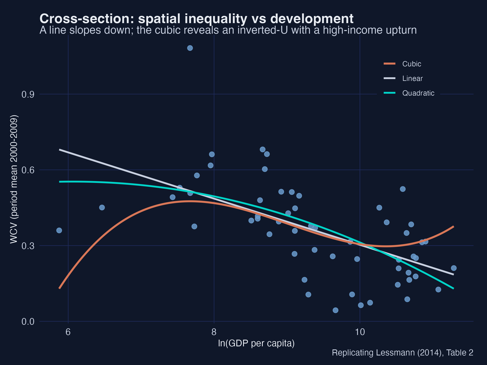
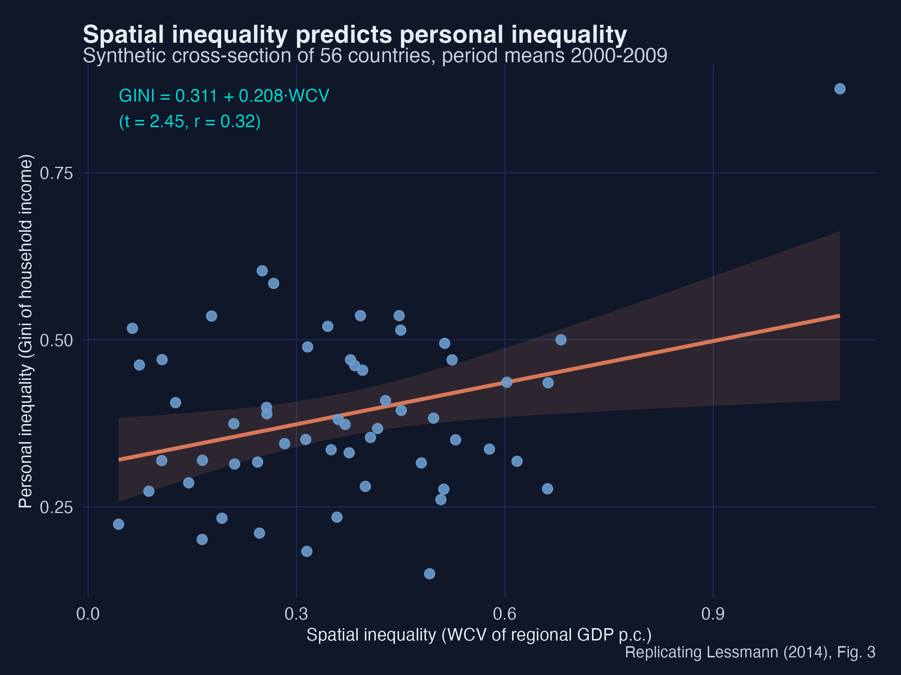
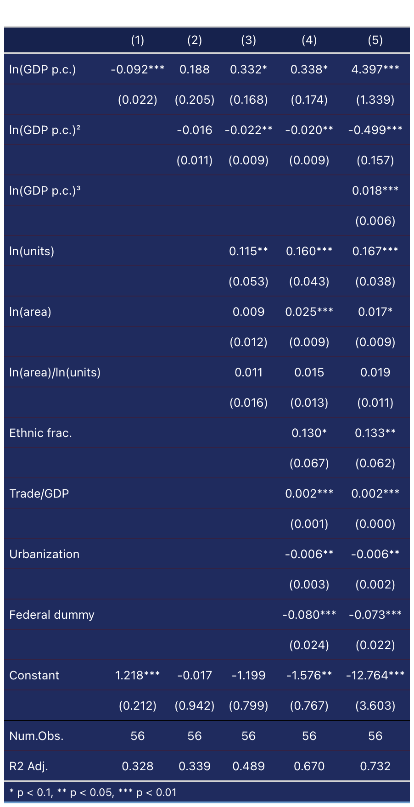
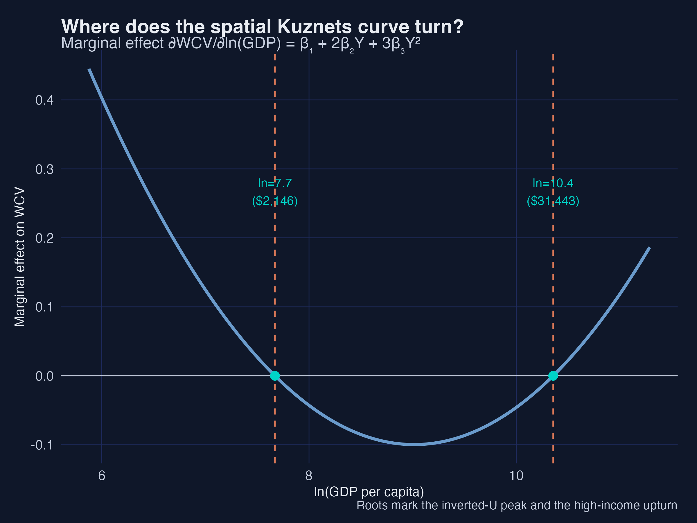
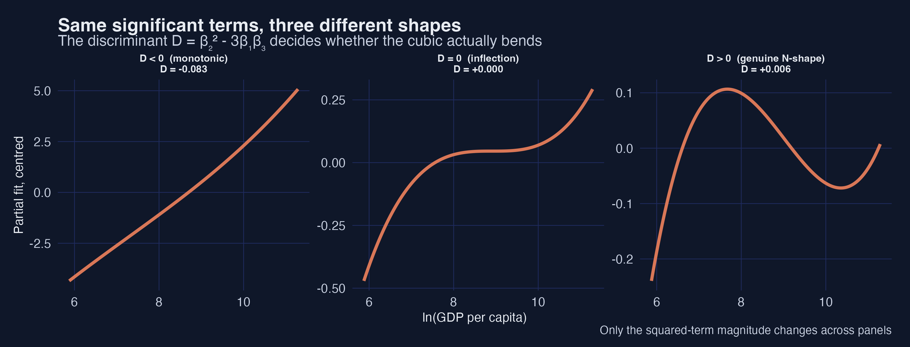
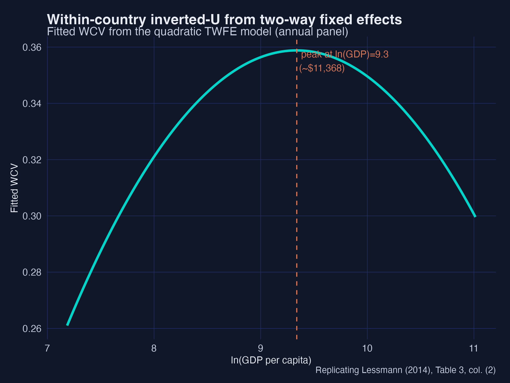
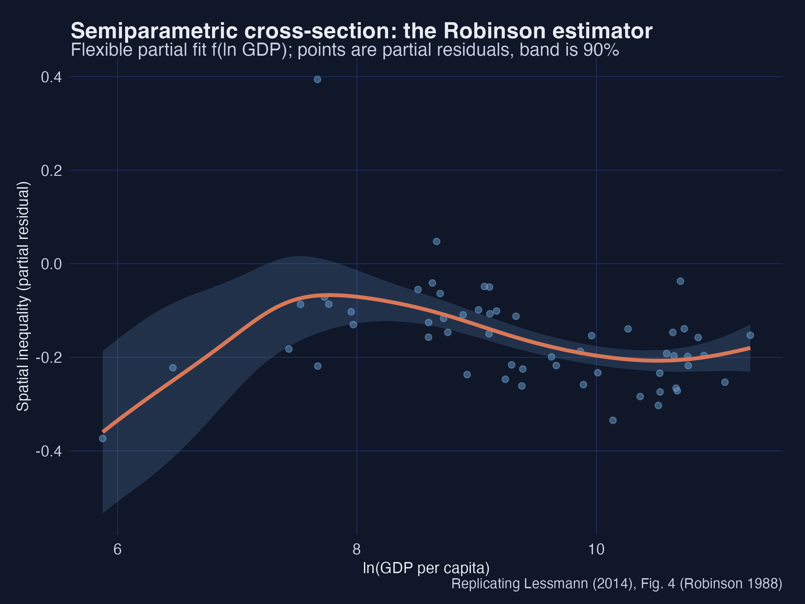
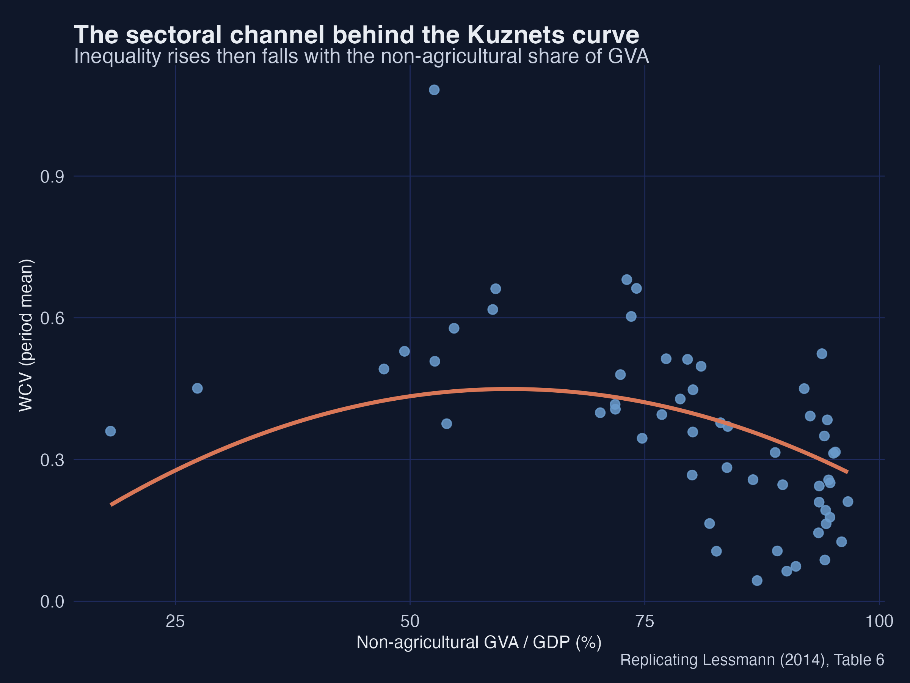
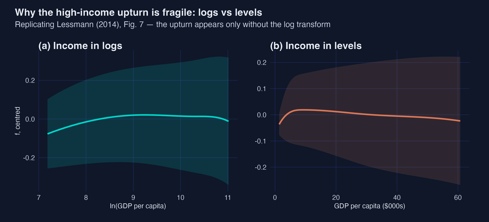

# The Tension {.divider background-color="#d97757"}

[Act I]{.act}

## Why do some countries have huge regional gaps and others almost none?

Kuznets (1955) and Williamson (1965) had an answer: as countries develop, spatial inequality first **rises**, then **falls** — an inverted-U.

. . .

But the data to test it — regional accounts for poor *and* rich countries — barely exist. Lessmann (2014) assembled them. We rebuild the exercise on **synthetic** data so the whole pipeline is open.

::: {.notes}
The hook: an old, intuitive hypothesis that was very hard to test because of data. We make it teachable by simulating a world calibrated to the paper.
:::

## Two pictures of the same question — and they disagree

::: {.notes}
Plant the puzzle: the shape you see depends on the functional form. We earn each curve in Act II, then resolve the between-vs-within tension.
:::

## Where we're going

::: {.incremental}
- **Measure** spatial inequality: the weighted coefficient of variation (WCV)
- **Cross-section** OLS — the inverted-U and a high-income upturn
- **Panel** two-way fixed effects with `fixest` — a *clean* inverted-U
- **Semiparametric** checks — Robinson and Baltagi–Li
- The twist: the upturn is **between** countries, not **within** them
:::

# The Investigation {.divider background-color="#6a9bcc"}

[Act II]{.act}

## We *compute* inequality, not assume it

$$\mathrm{WCV} = \frac{1}{\bar{y}}\left[\sum_{j} p_j\,(\bar{y}-y_j)^2\right]^{1/2}$$

Population-weighted spread of regional GDP per capita. A populous poor region counts; a tiny rich enclave barely moves it.

. . .

We simulate regions for **56 countries**, 1980–2009, and compute the WCV from them — 890 annual observations.

## Spatial inequality is related to personal inequality — but not the same

::: {.notes}
Motivates why we study the spatial dimension on its own: it explains a third of personal inequality, not all of it.
:::

## Cross-section: the inverted-U emerges with controls, and a cubic adds the upturn

{width="62%"}

::: {.notes}
Column 4: +0.34* / −0.02** — the inverted-U. Column 5: cubic significant — the N-shape upturn.
:::

## Where does the curve turn? Set the derivative to zero

::: {.notes}
Three phases: rise during take-off, fall through convergence, rise again at the post-industrial top.
:::

## Significant ≠ a genuine bend — check the discriminant

All three cubic terms can be significant and the curve still **not** bend in range. The test is the discriminant $D=\beta_2^2-3\beta_1\beta_3$:

::: {.incremental}
- $D>0$ → two turning points · $D=0$ → inflection only · $D<0$ → monotonic
- Cross-section: $D=+0.006>0$, both turning points in range → **genuine N-shape**
- Panel cubic: insignificant, and a turning point falls far outside the data → **no within-country bend**
- Always also check the turning points lie inside the observed income range
:::

## The discriminant decides the shape

::: {.notes}
Same sign pattern, vary only the squared term: D<0 monotonic, D=0 inflection, D>0 genuine N. In BMA the same trap reads "high PIP ≠ a genuine bend." See the companion note (Mendez 2026).
:::

## Fixed effects change the story, not just the standard errors

`feols(wcv ~ lnGDP + I(lnGDP^2) | country + year, vcov = "hetero")`

::: {.incremental}
- Within-country quadratic: **+0.39\*\* / −0.021\*\*** — a clean inverted-U
- Cubic term: **insignificant** — *no* within-country upturn
- The upturn was a *between*-country artefact all along
:::

## The within-country inverted-U

{width="70%"}

## Semiparametric, no polynomial assumed — same shape

{width="68%"}

::: {.notes}
Triangulation: a kernel-based estimator that never sees the word "cubic" recovers the same curve. Baltagi–Li (B-spline FE) agrees within countries.
:::

# The Resolution {.divider background-color="#00d4c8"}

[Act III]{.act}

## Structural change is the mechanism

{width="68%"}

::: {.notes}
Development raises inequality because it reshuffles where output is made; as the modern sector spreads, gaps close.
:::

## The high-income upturn is real but fragile

{width="85%"}

## What we learned

::: {.incremental}
- **Inverted-U confirmed** across OLS, fixest TWFE, and two semiparametric estimators
- **Turning points** at ~\$2,100 and ~\$31,000 of GDP per capita
- **The upturn is between-country, not within-country** — fixed effects reveal it
- Wide regional gaps are largely a **transitional** feature of development
:::

## Thank you

Full tutorial, code, data and web app: **carlos-mendez.org/post/r_kuznets**

::: {.notes}
Reference: Lessmann, C. (2014). Spatial inequality and development — Is there an inverted-U relationship? Journal of Development Economics 106, 35–51. Synthetic data; pedagogical replication.
:::
