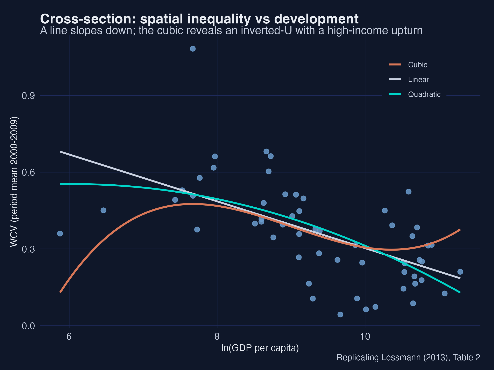
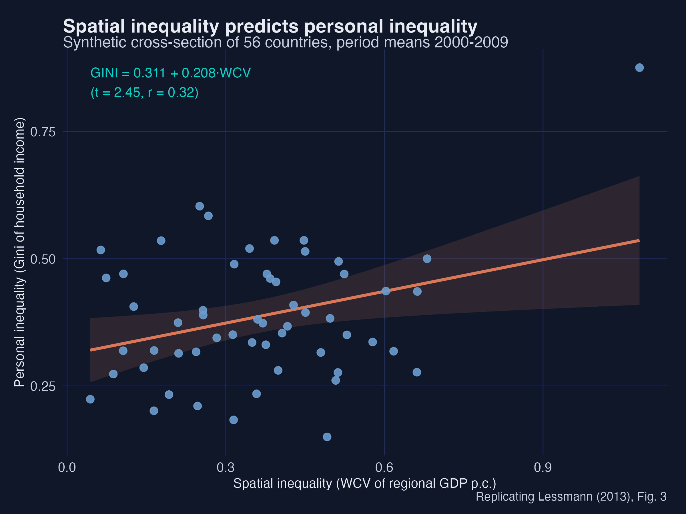
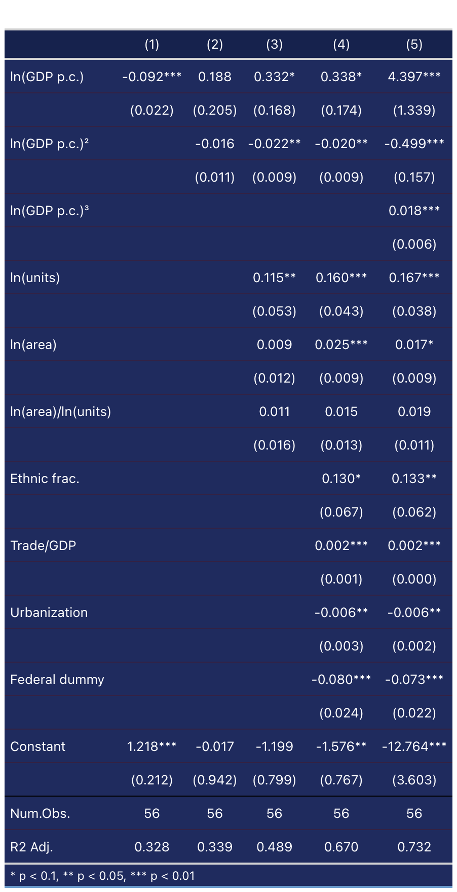
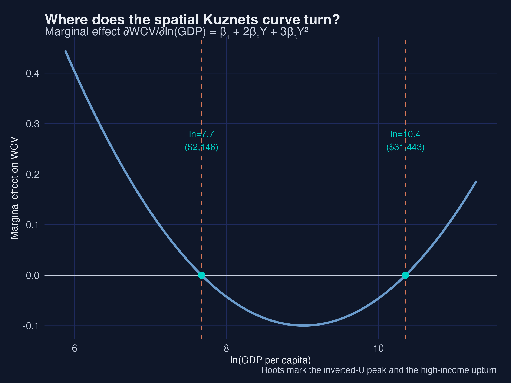
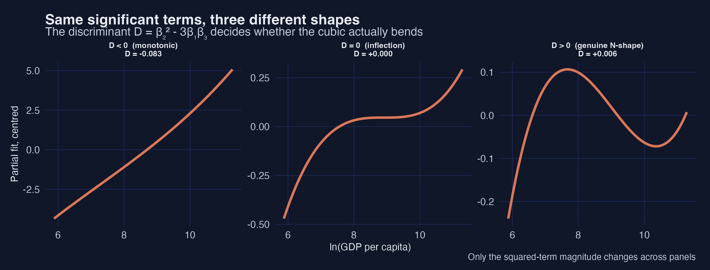
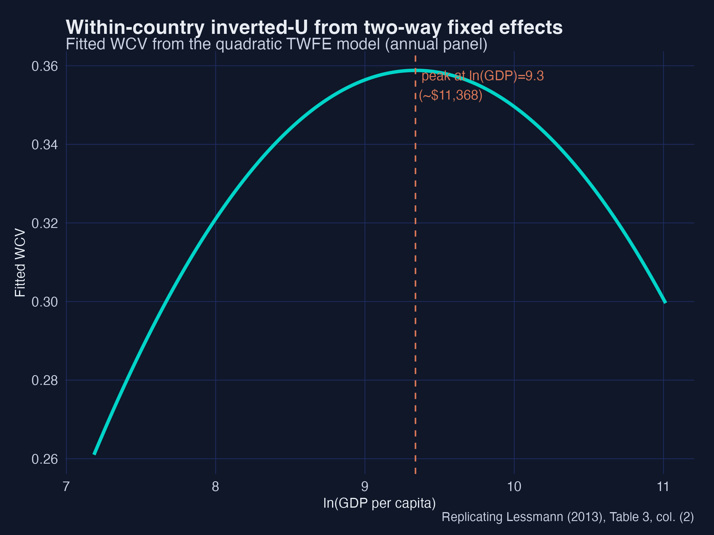
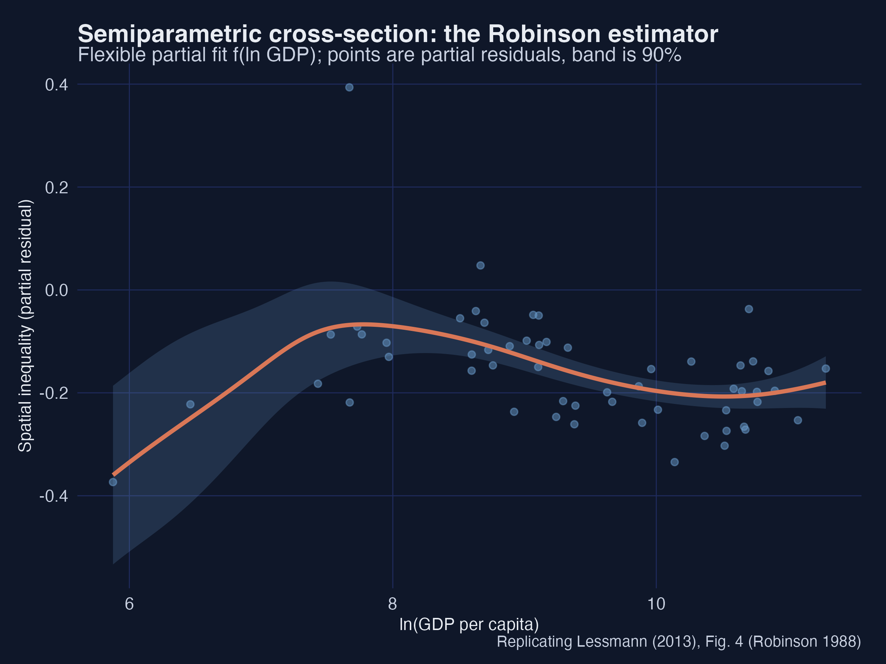
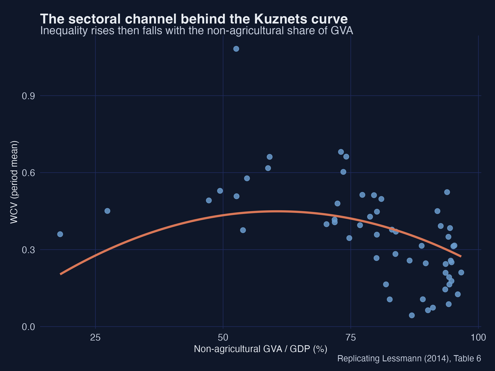
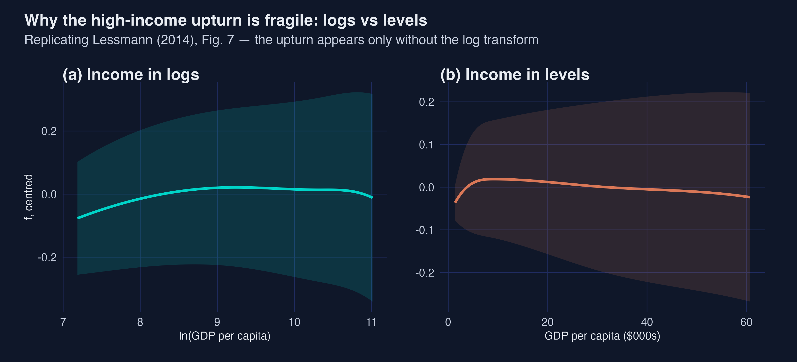

# The Tension {.divider background-color="#d97757"}

[Act I]{.act}

## Why do some countries have huge regional gaps and others almost none?

Kuznets and Williamson had an answer: **rise, then fall**.

. . .

Nobody could test it — the regional data barely exist.

[Lessmann (2014) built them. We rebuild the whole exercise on **synthetic** data.]{.takeaway .fragment}

::: {.notes}
The hook: an old, intuitive hypothesis — Kuznets (1955) and Williamson (1965) — that was very hard to test, because testing it needs regional accounts for poor *and* rich countries, and those barely exist. Lessmann (2014) assembled them; the data are proprietary, so we rebuild the exercise on synthetic data calibrated to the paper. That keeps the whole pipeline open and reproducible, which is what makes it teachable.
:::

## Two pictures of the same question — and they disagree



[The shape you see depends on the functional form you assume.]{.takeaway .fragment}

::: {.notes}
Plant the puzzle: the same scatter supports three different stories depending on the polynomial. We earn each curve in Act II, then resolve the between-vs-within tension.
:::

## Four estimators, one question — and they don't all agree

::: {.incremental}
- **Measure** it — the weighted coefficient of variation (WCV)
- **Estimate** it — cross-section OLS, panel fixed effects, two semiparametric checks
- **The twist** — the upturn is **between** countries, not **within** them
:::

[Same data, three shapes. Fixed effects settle which one is real.]{.takeaway .fragment}

::: {.notes}
The roadmap. The four estimators are cross-section polynomial OLS, two-way fixed effects with fixest, Robinson (1988) and Baltagi–Li (2002). Each asks the same question with fewer shape assumptions than the last. The payoff is the between-vs-within contrast at the end — that is where the deck is going.
:::

# The Investigation {.divider background-color="#6a9bcc"}

[Act II]{.act}

## We *compute* inequality, not assume it

$$\mathrm{WCV} = \frac{1}{\bar{y}}\left[\sum_{j} p_j\,(\bar{y}-y_j)^2\right]^{1/2}$$

Population-weighted spread of regional GDP per capita.

. . .

**56 countries · 1980–2009 · 890 annual observations**

[A populous poor region counts; a tiny rich enclave barely moves it.]{.takeaway .fragment}

::: {.notes}
We simulate regions inside each country and compute the WCV from them, rather than taking an inequality index off the shelf. Here p_j is region j's share of the country's population and ybar is the country's population-weighted mean regional income; the index is scale-free, so it compares a \$400 economy with an \$80,000 one. The synthetic panel has 890 annual country-year observations over 56 countries, 1980–2009 — close to the paper's 915 / 56. The worked two-region example in the post gives WCV = 0.434.
:::

## Spatial inequality is related to personal inequality — but not the same



[Regional gaps explain about a third of the cross-country variation in personal inequality — not all of it.]{.takeaway .fragment}

::: {.notes}
Motivates why we study the spatial dimension in its own right: the correlation is 0.32, close to the paper's 0.324, so spatial inequality explains a real but partial share of personal inequality. A country can have high personal inequality with low regional inequality, or the reverse.
:::

## Cross-section: the inverted-U emerges with controls, and a cubic adds the upturn

{width="80%"}

[With controls the inverted-U appears (+0.34\* / −0.02\*\*); the cubic term adds the high-income upturn.]{.takeaway .fragment}

::: {.notes}
Column 1: the bivariate slope is negative (−0.092***) — richer countries look more equal, but a straight line hides the structure. Column 4: +0.34* / −0.02** — the inverted-U. Column 5: cubic significant on all three income terms (+4.40*** / −0.499*** / +0.0184***) — the N-shape upturn. Every control carries the paper's sign: trade and the number of regions raise spatial inequality; federalism and urbanisation lower it.
:::

## Where does the curve turn? Set the derivative to zero



[Three phases: gaps widen up to \$2,100, close until \$31,000, then widen again.]{.takeaway .fragment}

::: {.notes}
Three phases: rise during the industrial take-off, fall through convergence, rise again at the post-industrial top. The roots come out in logs — ln(GDP) = 7.67 and 10.36 — so exponentiate to read them in dollars (\$2,146 and \$31,443). The paper reports ≈ \$2,000 and ≈ \$24,000.
:::

## Significant ≠ a genuine bend — check the discriminant

The test: $D=\beta_2^2-3\beta_1\beta_3$

::: {.incremental}
- $D>0$ → two turning points · $D=0$ → inflection only · $D<0$ → monotonic
- Cross-section: $D=+0.0055>0$, both turning points in range → **genuine N-shape**
- Panel cubic: insignificant, and a turning point falls far outside the data → **no within-country bend**
:::

[Significance says keep the term; the discriminant says whether the curve bends.]{.takeaway .fragment}

::: {.notes}
Say this aloud: all three cubic terms can be significant and the curve still not bend inside the observed range. Significance answers "does the data prefer keeping this term?"; the discriminant answers "does the fitted curve actually reverse?" — and a third check asks "does it reverse *inside* the data?" The cross-section passes all three (D = +0.0055, turning points \$2,146 and \$31,443 inside the observed \$315–\$82,653). The panel cubic fails on significance (t = −0.26) and, taken at face value, puts one turning point near \$0.0003.
:::

## The discriminant decides the shape



[One number — the sign of $D$ — separates a cubic that bends from one that merely curves.]{.takeaway .fragment}

::: {.notes}
Same sign pattern, vary only the squared term: D<0 monotonic, D=0 inflection, D>0 genuine N. In BMA the same trap reads "high PIP ≠ a genuine bend." See the companion note (Mendez 2026).
:::

## Fixed effects change the story, not just the standard errors

``` {.r}
feols(wcv ~ lnGDP + I(lnGDP^2) + trade_gdp + urbanization |
            country + year, data = annual, vcov = "hetero")
```

::: {.incremental}
- Within-country quadratic, **two-way fixed effects (TWFE)**: **+0.394\*\* / −0.021\*\***  — a clean inverted-U
- Cubic term: **insignificant** — *no* within-country upturn
:::

[The upturn was a *between*-country artefact all along.]{.takeaway .fragment}

::: {.notes}
The vertical bar in fixest absorbs the country and year dummies; vcov = "hetero" reproduces the paper's White standard errors (clustering by country is the modern alternative). Cross-section comparisons mix countries that sit at very different inequality levels for reasons unrelated to income; the panel compares each country with itself. The within-country cubic term is −0.0008 with t = −0.26 — no upturn. The 5-year averages give the same inverted-U, so this is not a business-cycle artefact.
:::

## Within a country, inequality peaks near \$18,000 and then falls

{width="70%"}

[Past the peak, a country's regional gaps start to close as it keeps growing.]{.takeaway .fragment}

::: {.notes}
The fitted two-way fixed-effects quadratic peaks at ln(GDP) ≈ 9.8, about \$18,000 per capita. Read it as the within-country trajectory: below the peak, growth widens regional gaps; above it, growth narrows them. This is the panel counterpart of the cross-section peak at \$2,100 — a different question, so a different number.
:::

## Semiparametric, no polynomial assumed — same shape

{width="68%"}

[A curve that was never told to be a cubic traces the same shape.]{.takeaway .fragment}

::: {.notes}
Triangulation: a kernel-based estimator that never sees the word "cubic" recovers the same curve, and the 90% band widens where the data are sparse. The linear-part coefficients match the parametric ones, and np::npplreg returns the same point estimates as the hand-built double-residual version. Baltagi–Li (B-spline FE) agrees within countries — inverted-U, no upturn.
:::

## Structural change tracks the curve

{width="68%"}

[Swap income for the non-agricultural share and the same inverted-U appears (+0.0165\*\*\* / −0.00014\*\*\*).]{.takeaway .fragment}

::: {.notes}
Kuznets and Williamson argued that the real driver is structural change, with income only a proxy. As an economy industrialises a few regions capture the new activity and gaps widen; as the modern sector spreads, gaps close. Estimand note: this is an association, not identification — the whole study is descriptive, so "mechanism" here means a channel consistent with the data, not an estimated causal effect.
:::

## The strongest objection — and the answer

[Objection.]{.objection} The high-income upturn is a measurement artefact — it shows up with income in levels and disappears in logs — and the data are synthetic anyway.

. . .

[Response.]{.rebuttal} Agreed on the upturn: we report it as fragile, not as a finding. The inverted-U itself survives logs, levels, fixed effects and both semiparametric estimators.

::: {.notes}
Steelman the critique from §11.4 of the post: the existence of the upturn is partly a measurement choice, which is exactly why Lessmann hedges it and why we hedge it too. It also weakens when the poorest countries are dropped. On the data: the synthetic world is calibrated to the paper's published estimates, so it demonstrates the estimators — it is not independent evidence for the hypothesis.
:::

# The Resolution {.divider background-color="#00d4c8"}

[Act III]{.act}

## Four estimators agree on the inverted-U — and disagree only on the upturn

::: {.incremental}
- **Inverted-U confirmed** across cross-section OLS, panel TWFE, and two semiparametric estimators
- **Turning points** at ~\$2,100 and ~\$31,000 of GDP per capita
- **The upturn is between-country, not within-country** — fixed effects reveal it
:::

All of it on **synthetic** data calibrated to Lessmann (2014) — a method demo, not new evidence.

[The shape is robust; only the upturn depends on whether you look between or within countries.]{.takeaway .fragment}

::: {.notes}
The scorecard. Four estimators, one shape: the inverted-U appears in the cross-section with controls, within countries under two-way fixed effects, and in both semiparametric fits. They part company only on the high-income upturn, which the cross-section shows and the panel does not. Keep the caveat audible: these are engineered numbers that reproduce the paper's estimates, so the exercise teaches the estimators rather than testing the hypothesis afresh.
:::

## The high-income upturn is real but fragile

{width="85%"}

[Report the inverted-U with confidence; report the upturn with a caveat.]{.takeaway .fragment}

::: {.notes}
The post's most important caveat (§11.4): with income in logs there is no high-income upturn; with income in levels a slight upturn reappears. So the existence of the upturn is partly a measurement choice. The robust finding is the inverted-U; the N-shape is real but fragile — which is why Lessmann hedges it and why we should too.
:::

## Wide regional gaps are a transitional stage of development — not a destination

The high-income upturn lives **between** countries, not **within** them.

Full tutorial, code, data and web app: **carlos-mendez.org/post/r_kuznets**

::: {.notes}
Reference: Lessmann, C. (2014). Spatial inequality and development — Is there an inverted-U relationship? Journal of Development Economics 106, 35–51. Synthetic data; pedagogical replication. The policy reading: gaps tend to widen during take-off and narrow as economies mature, but the transition can take decades, and the sectoral result points to the lever — human capital and connectivity in lagging regions.
:::
