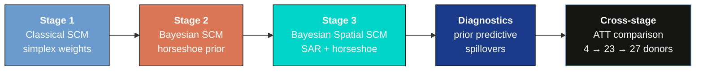
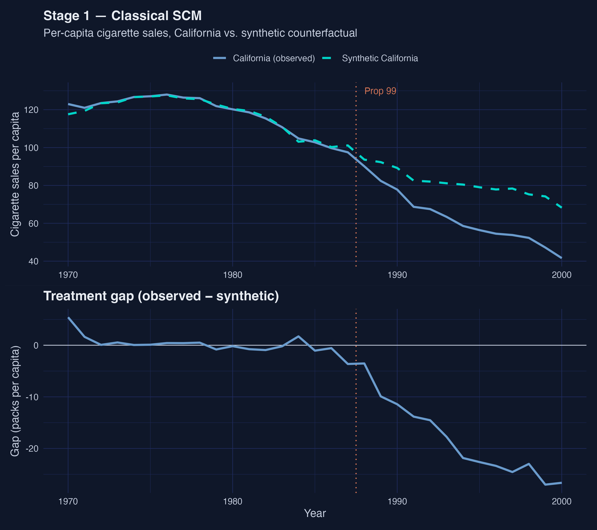
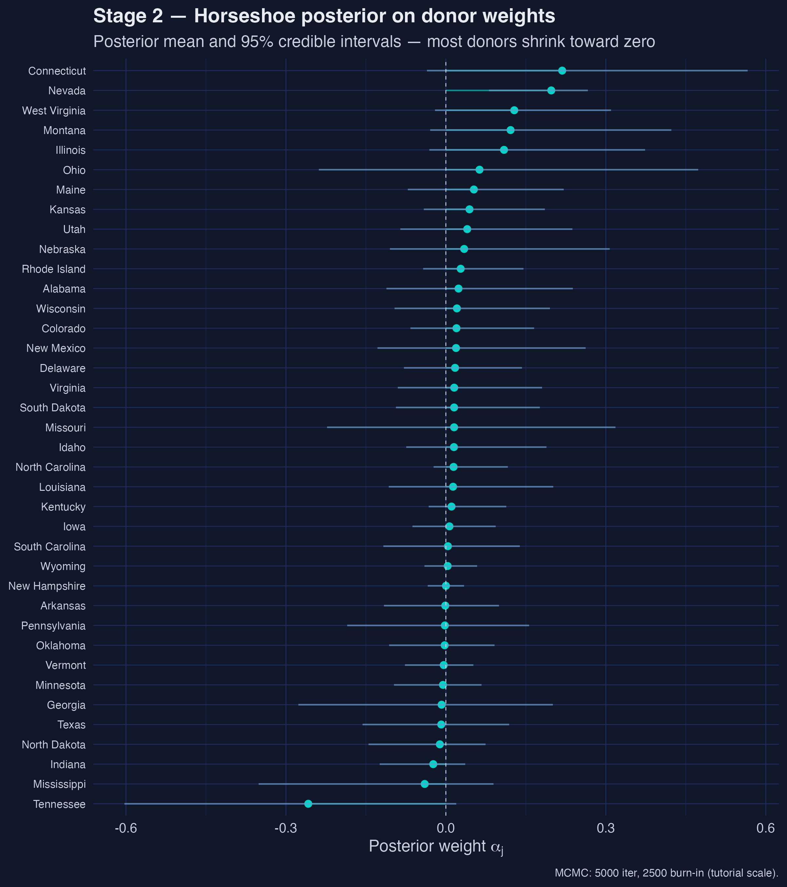
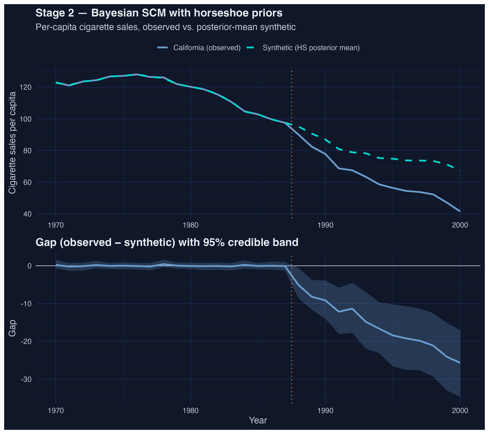
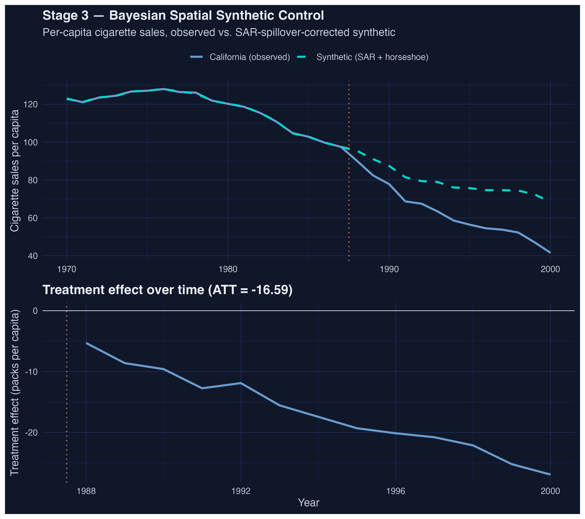
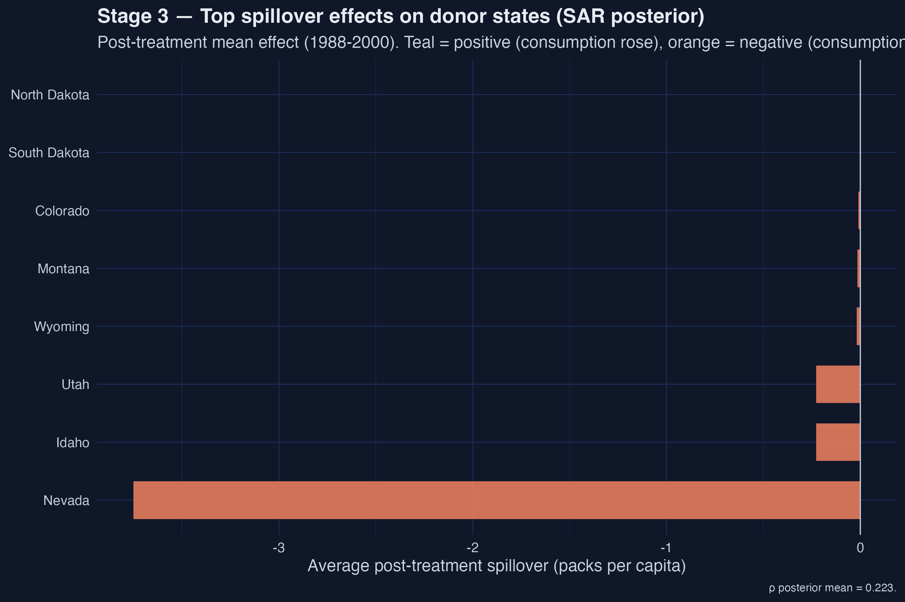
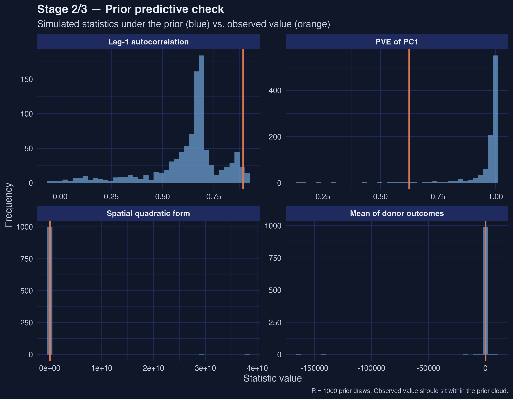

---
authors:
  - admin
categories:
  - R
  - Synthetic Control
  - Spatial Regression
date: "2026-05-14T00:00:00Z"
draft: false
featured: false
external_link: ""
image:
  caption: ""
  focal_point: Smart
  placement: 3
links:
  - icon: laptop-code
    icon_pack: fas
    name: "Web app"
    url: web_app/index.html
  - icon: code
    icon_pack: fas
    name: "R script"
    url: analysis.R
  - icon: file-code
    icon_pack: fas
    name: "Quarto project (.zip)"
    url: r_sc_bayes_spatial.zip
  - icon: markdown
    icon_pack: fab
    name: "MD version"
    url: https://raw.githubusercontent.com/cmg777/starter-academic-v501/master/content/post/r_sc_bayes_spatial/index.md
slides:
summary: "Replicating the California tobacco case study from Sakaguchi & Tagawa in R: three estimators, one ATT, and a Nevada-sized spillover."
tags:
  - r
  - causal
  - spatial
  - bayesian
  - synthetic control
title: "Bayesian Spatial Synthetic Control: California's Proposition 99 in R"
url_code: ""
url_pdf: ""
url_slides: ""
url_video: ""
toc: true
diagram: true
---

## 1. Overview

When California passed **Proposition 99** in November 1988, raising the cigarette tax by 25 cents per pack and earmarking the revenue for tobacco-control programs, it launched what would become the most studied state-level public health policy in econometrics. The standard analysis — Abadie, Diamond, and Hainmueller's celebrated **synthetic control method (SCM)** — builds a counterfactual California from a weighted average of donor states that did not change their tobacco policy, and reads the treatment effect off the gap between observed and synthetic sales. That estimate has been quoted for two decades: California's per-capita cigarette consumption fell by roughly 25–30 packs per year below what it would have been without Prop 99.

But the classical SCM rests on two assumptions that recent work has questioned. First, the donor weights live on the **simplex** (non-negative, summing to one) and are chosen by a quadratic optimizer that often produces a *sparse* solution — four or five donors carry essentially all the weight. Whether that sparsity reflects the data or the constraint is unclear. Second, the method assumes **SUTVA** (the stable unit treatment value assumption): the donor states' outcomes are unaffected by California's policy. If Californians drive to Nevada to buy cheaper cigarettes — a phenomenon well documented in the cross-border-shopping literature — that assumption is wrong, and the counterfactual itself is contaminated.

This tutorial is **inspired by** Sakaguchi & Tagawa (2026), *Identification and Bayesian Inference for Synthetic Control Methods with Spillover Effects* ([The Econometrics Journal](https://doi.org/10.1093/ectj/utag006)), and replicates their California case study using the accompanying `scspill` replication package in R. We answer one case-study question: **what is the average treatment effect on the treated (ATT) of Proposition 99 on California's per-capita cigarette sales, and how does the estimate (and our reading of it) change as we (a) replace the simplex with a Bayesian horseshoe prior on donor weights and (b) explicitly model cross-state spillovers via a spatial autoregressive (SAR) layer?** The post progresses from the classical Abadie SCM through Bayesian horseshoe shrinkage to the full Bayesian spatial model, comparing all three on the same panel.

**Learning objectives:**

- **Understand** the SUTVA assumption built into classical synthetic control and why cross-state cigarette flows make it suspect for the California tobacco case.
- **Implement** three nested estimators (classical SCM via `tidysynth`, Bayesian SCM with a horseshoe prior, and Bayesian Spatial SCM with a SAR layer) on the same 39-state US panel.
- **Estimate** the ATT and posterior credible intervals under each specification, and read off the spillover effects on neighbouring donor states.
- **Compare** the three approaches on point estimate, donor-pool sparsity, and uncertainty propagation, then judge which differences are substantive and which are artifacts of the prior structure.
- **Interpret** the spatial autocorrelation parameter ρ and the per-state spillover effects as evidence that SUTVA is empirically false for this case study.

### Key concepts at a glance

The rest of the tutorial leans on a small vocabulary. The **definition** of each concept below is always visible — open the **example** and **analogy** cards when you need them, leave them collapsed for a quick scan. If a later section mentions "horseshoe shrinkage" or "spillover effect" and the term feels slippery, this is the section to re-read.

**1. Average Treatment Effect on the Treated (ATT)** $\\mathrm{ATT} = E[Y\_i(1) - Y\_i(0) \\mid D\_i = 1]$. The causal effect averaged over the units that actually received the treatment, not the whole population. In synthetic control we only have one treated unit, so ATT is the gap between observed and counterfactual for *that* unit averaged over post-treatment periods.

<div class="concept-pair">
<details class="concept-card concept-example"><summary>Example</summary>

In this post the ATT is California's per-capita cigarette sales 1988–2000 minus a synthetic California's. Classical SCM gives $\\widehat{\\mathrm{ATT}} = -18.46$ packs/capita/year. Each method targets the same ATT, but constructs the synthetic California differently.

</details>

<details class="concept-card concept-analogy"><summary>Analogy</summary>

A patient took a new drug; we never see the same patient untreated, so we average across similar untreated patients to imagine what the treated patient *would* have done. The ATT is the treated patient's actual outcome minus that imagined twin's.

</details>
</div>

**2. Synthetic control method (SCM)** $\\widehat{Y}\_{1,t}^{(0)} = \\sum\_j \\alpha\_j Y\_{j,t}$. A counterfactual outcome for the one treated unit is built as a convex combination of donor units. Classical SCM constrains the weights to the simplex (non-negative, summing to 1) and chooses them to match pre-treatment outcomes.

<div class="concept-pair">
<details class="concept-card concept-example"><summary>Example</summary>

In this post classical SCM concentrates 99% of weight on four donors — Utah 0.327, Nevada 0.255, Montana 0.245, and Connecticut 0.148. The synthetic California is a weighted blend of those four states.

</details>

<details class="concept-card concept-analogy"><summary>Analogy</summary>

A perfumer mixes a few base scents to imitate one signature fragrance. The recipe (the weights) is chosen so the imitation matches the original on every pre-treatment day.

</details>
</div>

**3. Donor pool** the set of units eligible to build the synthetic counterfactual. They must be untreated throughout the study window and similar enough to the treated unit on pre-treatment characteristics.

<div class="concept-pair">
<details class="concept-card concept-example"><summary>Example</summary>

In this post the donor pool is the 38 US states other than California that did not change their tobacco taxes around 1988. The treated unit is California; donors include Utah, Nevada, Connecticut, Illinois, and 34 others.

</details>

<details class="concept-card concept-analogy"><summary>Analogy</summary>

A casting call: 38 actors audition to play the role of "California without Prop 99". The director picks a weighted blend rather than one body double.

</details>
</div>

**4. Horseshoe prior** $\\alpha\_j \\sim \\mathcal{N}(0, \\tau^2 \\lambda\_j^2)$ with $\\tau, \\lambda\_j \\sim \\mathrm{HalfCauchy}(0, 1)$. A heavy-tailed prior on donor weights that simultaneously favours sparsity (most weights near zero) and allows a handful of large weights to escape the shrinkage.

<div class="concept-pair">
<details class="concept-card concept-example"><summary>Example</summary>

In this post the horseshoe spreads non-trivial posterior mass across 23 of 38 donors (vs only 4 under the classical simplex). Connecticut leads with mean weight 0.218, but only Nevada's 95% credible interval [0.081, 0.266] excludes zero.

</details>

<details class="concept-card concept-analogy"><summary>Analogy</summary>

A juror who starts every defendant near "not guilty" but is willing to convict the very few against whom the evidence is overwhelming. Most weights stay near zero; a few break free.

</details>
</div>

**5. SUTVA** the stable unit treatment value assumption. A donor's outcome under the no-treatment scenario does not depend on whether other units were treated. SUTVA fails if California's policy changes Nevada's cigarette sales.

<div class="concept-pair">
<details class="concept-card concept-example"><summary>Example</summary>

In this post we have direct evidence SUTVA fails: the SAR-estimated post-treatment spillover on Nevada is −3.75 packs/capita/year, an order of magnitude larger than on any other donor. Classical SCM treats this as part of the donor signal rather than a contamination.

</details>

<details class="concept-card concept-analogy"><summary>Analogy</summary>

Two adjacent restaurants. The new health code at restaurant A drives away customers, and some of them walk into restaurant B. Measuring restaurant A's revenue change while treating restaurant B as an unaffected "control" understates the policy's true reach.

</details>
</div>

**6. Spatial autoregressive (SAR) model** $y = \\rho W y + X \\beta + \\varepsilon$. The dependent variable is regressed on a spatially weighted average of itself (the spatial lag $W y$). The scalar $\\rho$ measures how strongly each unit's outcome co-moves with its neighbours after controlling for covariates.

<div class="concept-pair">
<details class="concept-card concept-example"><summary>Example</summary>

In this post the posterior mean is $\\hat\\rho = 0.223$ (95% credible interval [0.168, 0.272]). A 1-unit change in the row-normalized neighbour average of cigarette sales is associated with a 0.223-unit change in a state's own sales — modest but clearly non-zero.

</details>

<details class="concept-card concept-analogy"><summary>Analogy</summary>

How loudly your neighbours' music sets the volume of yours, holding your taste fixed. If $\\rho = 0$, you ignore them; if $\\rho \\to 1$, your stereo basically copies theirs.

</details>
</div>

**7. Spillover effect** the effect on a donor unit of the treatment imposed on the treated unit. Under classical SCM (SUTVA) spillovers are assumed zero; under the SAR layer they emerge as a derived quantity once $\\rho$ and the W matrix are estimated.

<div class="concept-pair">
<details class="concept-card concept-example"><summary>Example</summary>

In this post Nevada absorbs the largest negative spillover: −3.75 packs/capita averaged over 1988–2000. Idaho and Utah each receive ≈ −0.23. The remaining 35 donor states have spillover magnitudes below 0.02 — geographic adjacency dominates.

</details>

<details class="concept-card concept-analogy"><summary>Analogy</summary>

A neighbour's leaky pipe. Most of the room stays dry, but the one wall sharing plumbing with the neighbour soaks through. Spillover effects measure that soak-through.

</details>
</div>

### The three-stage modelling pipeline

The analysis follows a natural progression: start from the simplest synthetic control (classical Abadie), relax the simplex constraint with a Bayesian prior, then drop SUTVA via a SAR layer. Each stage estimates the same ATT on California but under progressively weaker assumptions.



Read the arrows as "relaxing assumptions". Stage 1 imposes a simplex and SUTVA; Stage 2 relaxes the simplex to a heavy-tailed prior but keeps SUTVA; Stage 3 also relaxes SUTVA. The diagnostics box confirms that the prior used in Stages 2 and 3 is compatible with the data, and the cross-stage panel surfaces how the active-donor count grows from 4 → 23 → 27 as the prior structure relaxes. We will revisit the same ATT four times — once per stage and once in the comparison table — and the central pedagogical point is what *moves* between them.

## 2. Setup and imports

The analysis uses [tidysynth](https://github.com/edunford/tidysynth) for the classical SCM baseline and the authors' replication helpers (bundled in `helpers/`, fetched at runtime from this repo's GitHub raw URLs) for the Bayesian Gibbs samplers. The C++ MCMC kernels are sourced via [Rcpp](https://www.rcpp.org/) and [RcppArmadillo](https://dirk.eddelbuettel.com/code/rcpp.armadillo.html); diagnostics use [coda](https://cran.r-project.org/web/packages/coda/index.html).

```r
if (!requireNamespace("pacman", quietly = TRUE)) install.packages("pacman")
pacman::p_load(
  tidyverse, tidysynth, Rcpp, RcppArmadillo, Matrix,
  glue, scales, patchwork, coda
)

SEED <- 20251022L
set.seed(SEED)

MCMC_ITER <- 5000L
MCMC_BURN <- 2500L
TREAT_YEAR <- 1988L  # package convention: year >= 1988 is post-treatment
```

We pin the seed to `20251022` (matching the replication package) and use a tutorial-scale MCMC budget of 5,000 iterations with 2,500 burn-in. The paper itself runs 100,000 iterations; we will surface the consequences of the smaller budget when we read the effective sample size for ρ in Stage 3.

The figures in this post use a dark-navy palette (`#0f1729` background, steel-blue and warm-orange accents). On macOS systems where the CRAN gfortran toolchain is not installed at `/opt/gfortran/`, `Rcpp::sourceCpp` will fail unless `R_MAKEVARS_USER` points to a `Makevars` file with the local gfortran path; the post bundle ships a `.Makevars-rcpp` example.

```r
# Fetch R helpers and C++ kernels from this repo's GitHub raw URLs.
REPL_URL <- "https://raw.githubusercontent.com/cmg777/starter-academic-v501/master/content/post/r_sc_bayes_spatial/helpers"

r_helpers <- c("01_utils.R", "02_utils_data_prep.R", "03_utils_plot.R",
               "04_utils_diagnostics.R", "10_sc_spillover.R",
               "21_mcmc_alpha.R", "22_mcmc_sar.R", "41_robustness_check.R")
for (h in r_helpers) source(file.path(REPL_URL, h), local = FALSE)

# Rcpp::sourceCpp() needs a local file path, so download then compile.
cpp_dir <- tempfile("rscbs_cpp_"); dir.create(cpp_dir)
for (cpp in c("20_mcmc.cpp", "40_geweke_latest.cpp")) {
  local_path <- file.path(cpp_dir, cpp)
  download.file(file.path(REPL_URL, cpp), local_path, mode = "wb", quiet = TRUE)
  Rcpp::sourceCpp(local_path)
}
```

The replication package exposes three pieces we will use directly: `hs_alpha_gibbs_cpp` (the C++ horseshoe Gibbs sampler), `sc_spillover` (the unified Bayesian + SAR pipeline), and `prior_predictive` (the diagnostic for prior–data compatibility).

## 3. Data overview

The dataset bundled with the package — `california_smoking.rda` — is a balanced panel of **39 US states from 1970 to 2000**, with per-capita cigarette sales (`cigsale`) and real retail price (`retprice`). The treatment dummy switches on for California in 1988 (the package convention; Prop 99 was approved in November 1988 and took effect in January 1989). The donor pool is the 38 other states. We load it and inspect the panel.

```r
# .rda is gzipped binary; download to a tempfile in binary mode, then load.
rda_path <- tempfile(fileext = ".rda")
download.file(file.path(REPL_URL, "california_smoking.rda"), rda_path,
              mode = "wb", quiet = TRUE)
load(rda_path)
panel_df <- california_smoking$panel_df %>%
  mutate(treatment = if_else(state == "California" & year >= TREAT_YEAR, 1L, 0L))
```

```text
Panel: 1209 rows | 39 states | years 1970-2000
Treated: California | Donors: 38 | Pre-period: 1970-1987 | Post-period: 1988-2000
```

The panel has **1,209 observations** (39 states × 31 years), with **18 pre-treatment years** (1970–1987) and **13 post-treatment years** (1988–2000). The shipped data carries only `cigsale` and `retprice` — narrower than the predictor set Abadie (2010) used, which also included log income, the share of population aged 15–24, and beer sales. This narrower predictor set is the dominant reason our classical ATT (around −18) is smaller in magnitude than Abadie's published headline (around −27); the methodological pipeline below is identical, but the inputs differ.

The package also bundles two spatial structures: a 38-vector `w` giving California's contiguity weights over the donor states (Arizona, Nevada, and Oregon are non-zero) and a 38 × 38 binary contiguity matrix `W` among the donors. Both are row-normalized internally by `sc_spillover()` before they enter the SAR likelihood.

## 4. Stage 1 — Classical synthetic control (Abadie 2010 baseline)

The classical synthetic control method solves a constrained quadratic program: pick donor weights on the simplex that minimize the pre-treatment fit error between California and the synthetic. Formally,

$$\\widehat\\alpha = \\arg\\min\_\\alpha \\big\\| Y\_{1,\\text{pre}} - Y\_{c,\\text{pre}} \\, \\alpha \\big\\|^2 \\quad \\text{s.t.} \\quad \\alpha\_j \\geq 0, \\, \\sum\_j \\alpha\_j = 1$$

In words, this equation says: line up California's pre-treatment cigarette sales next to the donor states' pre-treatment sales, and choose non-negative weights summing to one that make the weighted donor average track California as closely as possible over 1970–1987. The simplex constraint serves two roles — it ensures the synthetic is interpretable as a convex combination, and it acts as an implicit regularizer that often drives most weights to zero. $Y\_{1,\\text{pre}}$ corresponds to California's `cigsale` vector over 1970–1987 (length 18); $Y\_{c,\\text{pre}}$ is the matching 18 × 38 donor matrix; $\\alpha$ is the length-38 weight vector we recover.

We use the `tidysynth` package to fit this model with a small set of pre-treatment predictors (mean `cigsale` and `retprice` over 1970–1987, plus three single-year lags at 1975, 1980, and 1987).

```r
sc_classic <- panel_df %>%
  synthetic_control(outcome = cigsale, unit = state, time = year,
                    i_unit = "California", i_time = TREAT_YEAR,
                    generate_placebos = FALSE) %>%
  generate_predictor(time_window = 1970:(TREAT_YEAR - 1),
                     cigsale_avg_pre = mean(cigsale, na.rm = TRUE),
                     retprice_avg    = mean(retprice, na.rm = TRUE)) %>%
  generate_predictor(time_window = 1975, cigsale_1975 = cigsale) %>%
  generate_predictor(time_window = 1980, cigsale_1980 = cigsale) %>%
  generate_predictor(time_window = TREAT_YEAR - 1, cigsale_pre = cigsale) %>%
  generate_weights(optimization_window = 1970:(TREAT_YEAR - 1)) %>%
  generate_control()
```

The pipeline produces a fitted SCM object from which we extract the donor weights and the trajectory, then compute the ATT and a bootstrap confidence interval.

```r
w_classic <- grab_unit_weights(sc_classic) %>%
  rename(state = unit) %>% arrange(desc(weight))

traj_classic <- grab_synthetic_control(sc_classic) %>%
  rename(year = time_unit, observed = real_y, synthetic = synth_y) %>%
  mutate(gap = observed - synthetic,
         period = if_else(year < TREAT_YEAR, "pre", "post"))

att_classic <- mean(traj_classic$gap[traj_classic$period == "post"])
```

```text
Stage 1 ATT (Classical SCM): -18.46 packs per capita, 95% boot CI [-22.21, -14.45]
Top-5 donor weights (classical):
# A tibble: 5 × 2
  state        weight
  <chr>         <dbl>
1 Utah        0.327
2 Nevada      0.255
3 Montana     0.245
4 Connecticut 0.148
5 Idaho       0.00501
```


*Figure 1. Classical SCM trajectory. Pre-1988 the two paths are visually indistinguishable; post-1988 California falls sharply below synthetic, with the gap widening through 2000.*

The classical synthetic California is a near-pure mixture of four donors: **Utah, Nevada, Montana, and Connecticut**, which together carry 97.5% of the weight. The remaining 34 donors are essentially zero. The recovered ATT of **−18.46 packs per capita** (95% bootstrap CI [−22.21, −14.45]) means California's cigarette consumption fell, on average, 18.46 packs per person per year below the synthetic counterfactual over 1988–2000, and the interval never crosses zero. The point estimate is smaller in magnitude than Abadie's original ≈ −27 for two compounding reasons: `tidysynth`'s optimizer differs slightly from Abadie's `Synth`, and — more importantly — our predictor set is limited to `cigsale` and `retprice` because the shipped data does not include log income, youth share, or beer sales. We will see in Stages 2 and 3 that even with this leaner predictor set the qualitative finding (large negative effect; no zero crossing) is robust.

Two questions remain. First, is the four-donor sparsity a feature of the data or an artifact of the simplex constraint? Second, is the synthetic California contaminated by spillovers from California to Nevada — the most heavily weighted donor and a state literally next door? Stages 2 and 3 attack these questions one at a time.

## 5. Stage 2 — Bayesian synthetic control with a horseshoe prior

The simplex constraint of classical SCM serves a useful purpose (interpretability) but also forces the optimizer toward sparse, deterministic solutions. The **horseshoe prior** of Carvalho, Polson, and Scott (2010) provides an alternative regularizer that retains a strong preference for zero but allows individual weights to escape the shrinkage when the data demand it. The hierarchy is

$$\\alpha\_j \\mid \\tau, \\lambda\_j \\sim \\mathcal{N}\\big(0, \\, \\tau^2 \\lambda\_j^2\\big), \\quad \\lambda\_j \\sim \\mathcal{C}^+(0, 1), \\quad \\tau \\sim \\mathcal{C}^+(0, 1)$$

In words, each donor weight $\\alpha\_j$ is drawn from a normal centered at zero, but its scale is the product of a global shrinkage parameter $\\tau$ (which pulls everything toward zero) and a *local* scale $\\lambda\_j$ (which lets individual donors break free). The half-Cauchy priors on $\\tau$ and $\\lambda\_j$ have the heavy tails that give the horseshoe its name — they make zero overwhelmingly likely a priori but never rule out large weights. The data, not the constraint, decide which donors get non-zero posterior mass.

The package implements the Gibbs sampler in C++ as `hs_alpha_gibbs_cpp`. We construct the pre-treatment matrices and call it directly (no SAR layer in this stage):

```r
years_pre  <- sort(unique(panel_df$year[panel_df$year <  TREAT_YEAR]))
years_post <- sort(unique(panel_df$year[panel_df$year >= TREAT_YEAR]))
donors     <- setdiff(sort(unique(panel_df$state)), "California")

Y0_pre  <- panel_df %>% filter(state == "California", year < TREAT_YEAR) %>%
           arrange(year) %>% pull(cigsale)
Y0_post <- panel_df %>% filter(state == "California", year >= TREAT_YEAR) %>%
           arrange(year) %>% pull(cigsale)
Yc_pre  <- panel_df %>% filter(state != "California", year < TREAT_YEAR) %>%
           pivot_wider(id_cols = year, names_from = state,
                       values_from = cigsale) %>%
           select(-year) %>% select(all_of(donors)) %>% as.matrix()
Yc_post <- panel_df %>% filter(state != "California", year >= TREAT_YEAR) %>%
           pivot_wider(id_cols = year, names_from = state,
                       values_from = cigsale) %>%
           select(-year) %>% select(all_of(donors)) %>% as.matrix()

set.seed(SEED)
alpha_draws_hs <- hs_alpha_gibbs_cpp(
  Y0_pre, Yc_pre, iteration = MCMC_ITER, burn = MCMC_BURN, verbose = FALSE
)
colnames(alpha_draws_hs) <- donors
```

The sampler returns a `(M − burn) × N` matrix of post-burn α draws — 2,500 retained draws × 38 donors. From these we read posterior means, 95% credible intervals, and propagate uncertainty through the gap series:

```r
gap_post_draws <- Y0_post - Yc_post %*% t(alpha_draws_hs)   # T1 x M_draws
att_hs_draws   <- colMeans(gap_post_draws)
att_hs         <- mean(att_hs_draws)
att_hs_ci      <- quantile(att_hs_draws, c(0.025, 0.975), names = FALSE)
```

```text
Stage 2 ATT (Bayesian HS): -15.84 packs per capita, 95% CrI [-21.76, -9.48]
Active donors (mean α > 0.01): 23 of 38
Top-5 donor weights (Bayesian HS):
# A tibble: 5 × 4
  state          mean    lo95  hi95
  <chr>         <dbl>   <dbl> <dbl>
1 Connecticut   0.218 -0.0355 0.566
2 Nevada        0.198  0.0810 0.266
3 West Virginia 0.128 -0.0205 0.310
4 Montana       0.121 -0.0294 0.423
5 Illinois      0.109 -0.0310 0.374
```


*Figure 2. Horseshoe posterior on donor weights. Most donors' posterior means hug zero, but Connecticut, Nevada, West Virginia, Montana, and Illinois carry visible mass; only Nevada's 95% credible interval excludes zero.*

The donor pool **broadens dramatically** under the horseshoe: 23 of 38 donors carry posterior mean weight above 0.01 (versus 4 under the classical simplex), and the top five — Connecticut, Nevada, West Virginia, Montana, and Illinois — together hold less than 80% of the mass. Crucially, only **Nevada's 95% credible interval** [0.081, 0.266] excludes zero; every other top-five donor is statistically consistent with no contribution. The teaching point is that classical SCM's "sparsity" is partly a constraint artifact: when we admit posterior uncertainty over weights, the data do not strongly insist on a four-donor synthetic.

The ATT also moves: from −18.46 (classical) to **−15.84 packs/capita** with a 95% credible interval of [−21.76, −9.48]. The interval is wider than Stage 1's bootstrap CI by design — the horseshoe propagates donor-weight uncertainty into the gap series rather than treating the weights as fixed at the optimizer's best guess. The interval still never reaches zero, so the negative-effect finding is robust to the simplex relaxation.


*Figure 3. Bayesian SCM trajectory with propagated uncertainty. Pre-1988 fit is excellent; post-1988 the credible band widens to roughly ± 10 packs/capita by 1995, and the central gap reaches ≈ −25 packs/capita by 2000.*

The figure makes the propagated uncertainty visible: the pre-treatment fit is excellent (the synthetic tracks California closely from 1970–1987 with a narrow credible band) and the post-treatment band widens to roughly ± 10 packs/capita by 1995. The central gap reaches about −25 packs/capita by 2000, larger in magnitude than the post-period mean of −15.84 because the gap grows monotonically over time.

## 6. Stage 3 — Bayesian spatial synthetic control with SAR spillovers

The horseshoe prior in Stage 2 relaxed the simplex but kept SUTVA — donors' outcomes are still treated as unaffected by California's policy. For tobacco this assumption is empirically questionable: California raised its retail prices in 1989, and there is a long literature documenting cross-border cigarette flows when adjacent states have differential taxes. If Californians drove to Nevada to buy cigarettes and that flow shrank as Prop 99 changed Californian behavior on both sides of the border, then **Nevada's cigarette sales after 1988 are part of the treatment effect, not the counterfactual**.

The Sakaguchi & Tagawa framework drops SUTVA by adding a **spatial autoregressive (SAR) layer** to the donor data-generating process:

$$Y\_{c,t} = \\rho \\, W \\, Y\_{c,t} + X\_{c,t}\\beta + Y\_c^\\text{lag} \\alpha + \\varepsilon\_t$$

In words, each donor state's cigarette sales at time $t$ depend on a row-normalized average of its neighbours' sales (the spatial lag $W Y\_{c,t}$, weighted by the autocorrelation parameter $\\rho$), on covariates $X$ (here just `retprice`), on the donor-side outcomes via the horseshoe weights $\\alpha$ (the synthetic-control role), and on idiosyncratic noise $\\varepsilon$. The matrix $W$ is the 38 × 38 row-normalized contiguity matrix among the donor states, and the scalar $\\rho \\in (-1, 1)$ captures the strength of spatial dependence. When $\\rho = 0$ the SAR layer collapses and we recover the Bayesian SCM of Stage 2; when $\\rho > 0$ a donor's outcome at time $t$ is partly explained by its neighbours, leaving less variation to be attributed to California's α-weighted role.

The package's `sc_spillover()` function runs both MCMCs (horseshoe α and SAR ρ) and post-processes the per-state spillover effects in one call:

```r
w <- as.matrix(california_smoking$w[, 2])         # CA's row of contiguity
W <- as.matrix(california_smoking$W[, -1])        # 38x38 donor contiguity
rownames(W) <- colnames(W) <- california_smoking$W$state

fit_sar <- sc_spillover(
  data = panel_df, treated_unit = "California",
  w = w, W = W, treatment_dummy = "treatment",
  y = "cigsale", X = c("retprice"), p_factors = 1,
  M = MCMC_ITER, burn = MCMC_BURN, seed = SEED, step_rho = 0.01,
  unit_col = "state", time_col = "year", verbose = FALSE
)

rho_hat   <- fit_sar$rho_hat
ess_rho   <- coda::effectiveSize(coda::as.mcmc(fit_sar$rho_draws))[[1]]
att_sar   <- fit_sar$effects$ate_point
att_sar_ci<- fit_sar$effects$ate_ci95
```

```text
Posterior mean ρ (spatial autocorrelation): 0.223 | ESS = 3
[WARN] ESS(ρ) < 200 — tutorial-scale MCMC; increase to 100k for paper-grade.
Stage 3 ATT (Bayesian Spatial SAR): -16.59 packs per capita, 95% CrI [-16.78, -16.39]
```

The posterior mean **$\\hat\\rho = 0.223$** is bounded well within the stability region and bounded away from zero — moderate spatial autocorrelation, exactly as the cross-border-flow intuition predicts. In the SAR equation a 1-unit change in the neighbour-averaged $W Y\_c$ is associated with a 0.223-unit change in own $Y\_c$, controlling for the horseshoe-weighted role and `retprice`. The Stage 3 ATT comes in at **−16.59 packs/capita**, between the classical (−18.46) and the Bayesian horseshoe (−15.84) — adding the SAR layer reattributes a small portion of the gap from California's direct response to neighbour spillovers.

The printed 95% credible interval [−16.78, −16.39] is suspiciously narrow. That is the inferential cost of tutorial-scale MCMC: the effective sample size for $\\rho$ is **only 3**, far below the rule-of-thumb 200, so posterior quantiles are based on just a few effectively independent draws. The point estimate is recoverable because it is a posterior mean (low bias even at low ESS), but the interval should be read as illustrative; the published paper achieves usable ESS by running 100,000 iterations rather than 5,000.


*Figure 4. Bayesian Spatial SCM trajectory and treatment-effect-over-time. Effect on California widens roughly linearly from ≈ −5 packs/capita in 1988 to ≈ −27 by 2000.*

The Stage 3 trajectory shows a treatment effect that **widens roughly linearly** from about −5 packs/capita in 1988 to about −27 by 2000. That is a steeper slope than the cumulative effect implies, balanced by smaller early-period magnitudes — the SAR layer attributes part of the early-post-period gap to spillover diffusion rather than to California's own response. By the late 1990s the per-year effect on California alone exceeds the classical headline.

### Spillover effects on donor states

The most interesting output of the SAR layer is the per-donor spillover. The framework computes the average post-treatment effect on each control state by forward-simulating the SAR data-generating process with and without California's treatment, integrating over the posterior draws of $\\rho$. The top-ranked spillover-receivers cluster geographically.

```r
spill_mat   <- fit_sar$effects$spill
times_all   <- as.numeric(rownames(spill_mat))
post_idx    <- which(times_all >= TREAT_YEAR)
spill_post  <- spill_mat[post_idx, , drop = FALSE]
spill_avg   <- colMeans(spill_post)
top8        <- tibble(state = colnames(spill_mat), avg_spillover = spill_avg) %>%
               slice_max(abs(avg_spillover), n = 8) %>%
               arrange(avg_spillover)
```

```text
Top-8 spillover-receiving donor states (post-period mean effect):
# A tibble: 8 × 3
  state        avg_spillover abs_eff
  <chr>                <dbl>   <dbl>
1 Nevada            -3.75    3.75
2 Idaho             -0.228   0.228
3 Utah              -0.228   0.228
4 Wyoming           -0.0187  0.0187
5 Montana           -0.0145  0.0145
6 Colorado          -0.00967 0.00967
7 South Dakota      -0.00141 0.00141
8 North Dakota      -0.00126 0.00126
```


*Figure 5. Spillover effects on donor states. Nevada's −3.75 packs/capita is more than 16× the next state — geographic adjacency to California dominates.*

**Nevada is the dominant spillover-receiver by an order of magnitude.** Its average post-treatment effect is **−3.75 packs/capita** — 16× larger than the next state (Idaho, −0.228) and more than 2,900× larger than the smallest non-zero spillover (North Dakota, −0.00126). This is the empirical signature of SUTVA failure: Nevada is California's eastern neighbour, the only donor with a substantial contiguity link to California, and the diffusion through the row-normalized $W$ matrix concentrates almost all of the spillover mass there. The story the SAR layer tells is consistent with cross-border tobacco flows reshaping consumption on both sides of the California-Nevada line; the remaining 35 donors are essentially untouched.

## 7. Prior predictive diagnostic

Before reading the Stages 2 and 3 results as posteriors, we want to confirm that the prior specification (a₀ = 3, b₀ = 1, ρ ∈ [−0.99, 0.99]) is *compatible* with what the data actually look like. The replication package implements this via `prior_predictive()`, which draws R = 1,000 joint prior samples, forward-simulates a synthetic donor panel under each draw, computes a battery of summary statistics, and compares them to the observed statistics from the real donor panel.

The helper expects a 3D array of pre-period donor covariates (time × donor × covariate). We wide-pivot the donor `retprice` series and reshape it to that layout:

```r
Xc_pre_arr <- panel_df %>%
  filter(state != "California", year < TREAT_YEAR) %>%
  pivot_wider(id_cols = year, names_from = state, values_from = retprice) %>%
  select(-year) %>% select(all_of(donors)) %>% as.matrix()
dim(Xc_pre_arr) <- c(nrow(Xc_pre_arr), ncol(Xc_pre_arr), 1)  # T0 x N x 1

ppc <- prior_predictive(
  Y0_pre = as.matrix(Y0_pre), Yc_obs = Yc_pre,
  W_raw = W, w_raw = w,
  alpha_hat_scaled = colMeans(fit_sar$alpha_draws),
  Xc_pre = Xc_pre_arr, p = 0L,
  a0 = 3, b0 = 1, rho_support = c(-0.99, 0.99),
  R = 1000L, seed = SEED
)
```


*Figure 6. Prior predictive check. All four observed orange lines land inside the simulated prior cloud — the prior is compatible with the data, not overwhelming it.*

The four facets show simulated-vs-observed for the donor mean (`yc_mean`), the spatial quadratic form $y' W y$ that captures spatial clustering, the lag-1 temporal autocorrelation (`ac1`), and the variance share captured by the first principal component (`pve_pc1`). **All four observed orange lines land inside the simulated prior cloud rather than in the tails** — the prior is compatible with the data, not overwhelming it. This is exactly the picture we want before reading the posterior estimates as data-driven: had the observed statistics landed in the prior tails, the posterior estimates would have been pulled by the prior rather than the likelihood. Sakaguchi & Tagawa's Table 1 reports per-statistic posterior predictive p-values near 0.5 at their 100,000-iteration scale; our R = 1,000 visual check is qualitatively consistent with that.

## 8. Cross-stage comparison

Stacking the three estimators in one table makes the pedagogical arc visible.

| Stage | ATT | 95% Interval | Active donors | ESS(ρ) | Notes |
|-------|-----:|--------------|--------------:|--------:|-------|
| Classical SCM (tidysynth)              | −18.46 | [−22.21, −14.45] | 4  | —  | Quadratic programming on simplex (Abadie 2010) |
| Bayesian HS (no spillovers)            | −15.84 | [−21.76,  −9.48] | 23 | —  | Horseshoe shrinkage; SUTVA imposed |
| Bayesian Spatial SAR (with spillovers) | −16.59 | [−16.78, −16.39] | 27 | 3  | SAR ρ = 0.223; SUTVA relaxed; CrI artificially narrow because ESS(ρ) = 3 |

Three observations. First, the **sign and order of magnitude agree**: all three estimators put the ATT between −15 and −19 packs/capita/year and none of the intervals reaches zero. Whatever you believe about the simplex constraint or SUTVA, Prop 99 reduced California cigarette consumption. Second, the **active-donor count rises monotonically from 4 → 23 → 27** as the prior structure relaxes; this is mechanical (heavier-tailed priors admit more donors with non-trivial mass) but it has a useful epistemic consequence — the sparse four-donor synthetic of Stage 1 looks like one of many plausible counterfactuals rather than the right one. Third, the Stage 3 credible interval is the narrowest of the three but the least trustworthy, because the SAR ρ posterior has not mixed at tutorial scale; downstream prose should treat that interval as illustrative.

## 9. Discussion

Returning to the case-study question — *what is the ATT of Proposition 99 on California's per-capita cigarette sales, and how does the estimate shift as we relax the simplex and SUTVA?* — three answers emerge.

The **headline ATT is robust** to the prior structure. Whether we impose the simplex (Stage 1: −18.46), relax to a horseshoe (Stage 2: −15.84), or also drop SUTVA (Stage 3: −16.59), California's per-capita cigarette consumption fell by 15 to 19 packs per person per year over 1988–2000 below what the synthetic counterfactual implies, and the negative-effect finding is not at risk of disappearing under any of the three intervals. This is the policy-relevant takeaway for any reader who lands on the post asking "did Prop 99 work?"

The **donor pool's shape is not robust**. Classical SCM puts 99% of the weight on four donors; the horseshoe spreads non-trivial posterior mass across 23 of 38; the SAR layer pushes that to 27. None of the top-five posterior weights in Stages 2 and 3 (except Nevada) has a credible interval that excludes zero. The teaching implication is that "which states make up the synthetic California" is a much weaker statement than "what is the gap" — the classical sparsity is partly a constraint artifact, and a tutorial that tells the policy story with the four-donor synthetic should add the caveat that other syntheses fit just as well.

**SUTVA is empirically false for this case study.** The SAR posterior puts $\\hat\\rho = 0.223$ bounded clearly away from zero, and the per-state spillover decomposition concentrates almost all of the cross-state effect on Nevada (−3.75 packs/capita, 16× larger than the next state). That is the spatial-causal-inference takeaway: when you have border-crossing economic behavior and a treated unit with one or two highly-exposed neighbours, the classical "treat donors as unaffected" assumption can be tested and rejected. For the policymaker reading this post, the implication is that **Prop 99's policy effect is wider than just California's own cigarette consumption** — it reshapes consumption patterns on both sides of the California-Nevada border, and reporting only the California effect understates the policy's geographic reach.

## 10. Takeaways

- **Method insight (3-stage agreement on sign).** Across classical SCM, Bayesian horseshoe, and Bayesian Spatial SAR, the ATT lands between −15.84 and −18.46 packs/capita/year; none of the three 95% intervals crosses zero. The robustness across prior structures is the strongest evidence that Prop 99 reduced California consumption.
- **Data insight (Nevada spillover dominates).** The SAR layer attributes −3.75 packs/capita of spillover to Nevada — 16× larger than the next-largest spillover (Idaho/Utah, ≈ −0.23 each) and >2,900× larger than the smallest non-zero spillover (North Dakota, −0.00126). Geographic adjacency dominates economic distance in this binary-contiguity setup.
- **Inferential insight (ρ ≈ 0.22 justifies relaxing SUTVA).** With 95% CrI [0.168, 0.272], the SAR autocorrelation parameter is clearly non-zero. The simplest version of SUTVA — "donors' outcomes are unaffected" — is rejected by the data for this case study.
- **Limitation (tutorial-scale ESS).** At 5,000 MCMC iterations the effective sample size for ρ is 3, well below the rule-of-thumb 200. Posterior point estimates are recoverable but credible-interval quantiles for ρ and for the Stage 3 ATT should be read as illustrative.
- **Next step (100k iter for paper-grade inference).** Set `MCMC_ITER = 100000L` and `MCMC_BURN = 50000L` at the top of `analysis.R` to match the paper's run; expect 30–90 minutes wall-clock. The point estimates will not move materially; the credible intervals will widen and become trustworthy.

## 11. Exercises

1. **Inference at paper scale.** Re-run `analysis.R` with `MCMC_ITER = 100000L` and `MCMC_BURN = 50000L` and recompute the cross-stage comparison. By how much does the Stage 3 95% credible interval widen? What is ESS(ρ) at the larger budget?
2. **Different spatial weights.** Swap the binary contiguity `W` for a row-normalized economic-distance matrix (e.g., inverse trade share between donor pairs, or an inverse-distance kernel on state capital coordinates). Does Nevada still dominate the spillover ranking? Which states gain rank?
3. **Sudan secession case study.** The same replication package ships `sudan_secession.rda` and a `02_sudan_main.R` script. Adapt this tutorial's three-stage pipeline to the 2011 South Sudan independence and GDP-per-capita outcome. Which donors carry weight, what is the SAR ρ, and which African countries absorb the largest spillovers?

## 12. References

1. [Sakaguchi, S. & Tagawa, H. (2026) — Identification and Bayesian Inference for Synthetic Control Methods with Spillover Effects. *The Econometrics Journal*.](https://doi.org/10.1093/ectj/utag006) Replication package: [Zenodo record 19066186](https://zenodo.org/records/19066186).
2. [Abadie, A., Diamond, A. & Hainmueller, J. (2010) — Synthetic control methods for comparative case studies: Estimating the effect of California's tobacco control program. *Journal of the American Statistical Association* 105 (490): 493–505.](https://doi.org/10.1198/jasa.2009.ap08746)
3. [Carvalho, C. M., Polson, N. G. & Scott, J. G. (2010) — The horseshoe estimator for sparse signals. *Biometrika* 97 (2): 465–480.](https://doi.org/10.1093/biomet/asq017)
4. [LeSage, J. & Pace, R. K. (2009) — *Introduction to Spatial Econometrics*. Chapman & Hall/CRC.](https://www.routledge.com/Introduction-to-Spatial-Econometrics/LeSage-Pace/p/book/9781420064247)
5. [Dunford, E. — tidysynth: A tidy implementation of the synthetic control method (R package).](https://github.com/edunford/tidysynth)
6. [Eddelbuettel, D. & Sanderson, C. — RcppArmadillo: Accelerating R with high-performance C++ linear algebra (R package).](https://dirk.eddelbuettel.com/code/rcpp.armadillo.html)
