---
authors:
  - admin
categories:
  - R
  - Causal Inference
  - Synthetic Control
date: "2026-07-31T00:00:00Z"
draft: false
featured: false
external_link: ""
image:
  caption: ""
  focal_point: Smart
  placement: 3
links:
  - icon: chalkboard-teacher
    icon_pack: fas
    name: "Slides (HTML)"
    url: slides/index.html
  - icon: file-pdf
    icon_pack: fas
    name: "AI slides (PDF)"
    url: https://carlos-mendez.org/post/r_sc_dsc_sdid/ai-slides.pdf
  - icon: laptop-code
    icon_pack: fas
    name: "Web app"
    url: web_app/index.html
  - icon: code
    icon_pack: fas
    name: "R script"
    url: analysis.R
  - icon: bolt
    icon_pack: fas
    name: "Cheat sheet"
    url: cheatsheet.R
  - icon: file-code
    icon_pack: fas
    name: "Quarto project (.zip)"
    url: r_sc_dsc_sdid.zip
  - icon: spotify
    icon_pack: fab
    name: "Podcast"
    url: https://open.spotify.com/episode/7wmH9iF0ITNStTeBk47zb1?si=-CtcejVfR_-PncbmSg2rIg
  - icon: markdown
    icon_pack: fab
    name: "MD version"
    url: https://raw.githubusercontent.com/cmg777/starter-academic-v501/master/content/post/r_sc_dsc_sdid/index.md
slides:
summary: "Climbing the ladder from difference-in-differences to synthetic difference-in-differences, one rung at a time, with every estimator hand-coded before it is run with its package. The case study is the 2016 Brexit referendum and what it cost UK GDP."
tags:
  - r
  - causal inference
  - synthetic control
  - synthetic difference-in-differences
  - panel data
  - policy evaluation
  - brexit
title: "From DiD to SDID: A Ladder of Synthetic Control Estimators, and What Brexit Cost the UK"
url_code: ""
url_pdf: ""
url_slides: ""
url_video: ""
toc: true
diagram: true
---

<div style="background:#0e1545; border-radius:12px; padding:8px;">
<iframe style="border-radius:8px" src="https://open.spotify.com/embed/episode/7wmH9iF0ITNStTeBk47zb1?utm_source=generator&theme=0" width="100%" height="152" frameBorder="0" allowfullscreen="" allow="autoplay; clipboard-write; encrypted-media; fullscreen; picture-in-picture" loading="lazy"></iframe>
</div>

## Abstract

The United Kingdom voted to leave the European Union on 23 June 2016, and because there is only one United Kingdom, the cost of that decision can only be measured against a country that never existed. This tutorial builds that country seven times over, climbing the ladder of single-treated-unit estimators — difference-in-differences, synthetic control, demeaned synthetic control, synthetic difference-in-differences in three flavours, matching-and-synthetic-control and augmented synthetic control — with every rung hand-coded first and then run with its R package. The data are quarterly log real GDP for 24 OECD economies from 1995Q1 to 2020Q4, leaving the UK as the treated unit, 23 donors and 86 pre-treatment quarters. Dating the treatment at 2016Q3 and matching on outcomes alone, the estimated shortfall in UK GDP at the end of 2018 is 3.06% under synthetic control, 2.99% under demeaned SC, 2.76% under SDID, 2.73% under MASC and 3.04% under augmented SC, widening to between 3.83% and 4.20% a year later — every one of them larger than the 2.4% previously reported for this dataset. A placebo tournament over twenty artificial treatment dates ranks the SDID family first, at 0.0067 log points of root mean squared error against 0.0089 for plain synthetic control, and shows that covariates make the counterfactual worse rather than better. Two things emerge that the published tables hide: the headline synthetic-control number is partly an artefact of where the optimiser stopped, and the ranking among the three SDID variants dissolves once they are graded on the same forecast horizon.

## 1. Overview

On 23 June 2016 the United Kingdom voted to leave the European Union. Three and a half years later, at the end of 2019, UK GDP was some number of percentage points below where it would otherwise have been. The trouble is the phrase "otherwise have been." There is one United Kingdom, it took the treatment, and the version of it that stayed in the EU does not exist anywhere in the data.

The standard move is to build that missing country out of the countries we do observe. Take the other OECD economies, give each one a weight, add them up, and require that the resulting blend tracks the real UK quarter by quarter through the two decades *before* the referendum. If the blend and the UK were indistinguishable for eighty-six quarters, the argument goes, the blend is a credible stand-in for the UK afterwards. Whatever gap opens up after 2016 is the estimated effect.

That is the synthetic control method, and it is the second rung of a ladder. This tutorial climbs the whole ladder. We start at the bottom, with difference-in-differences, which is the same construction with the weights frozen at one twenty-third. Then we let the data choose the weights (synthetic control). Then we allow the blend to sit at a different *level* from the UK, provided it moves in parallel (demeaned synthetic control). Then we let the data also choose *which pre-treatment quarters* to hold the blend accountable for (synthetic difference-in-differences). Then two more recent estimators that attack the problem from different directions: a cross-validated blend of matching and synthetic control (MASC), and a ridge-augmented synthetic control that is allowed to use negative weights (ASCM).

Every rung opens with the same question: **what does the previous rung get wrong?** That question has a precise answer, and it is the intellectual centre of this post. Following de Brabander, Juodis and Miyazato Szini [1], we will decompose the error of any weighted counterfactual into two pieces: an *extrapolation* bias and an *interpolation* bias. Synthetic control's unit weights attack only the first. Nearest-neighbour matching attacks only the second. SDID's time weights are what let a single estimator attack both. Once you have that picture, the ladder stops being a list of acronyms and becomes a sequence of answers to one question.

We do everything twice. Each estimator is first written from scratch, in ten or twenty lines of R, so you can see exactly which optimisation problem is being solved and what is being held fixed. Only then do we call the package — `synthdid`, `Synth`, `masc`, `augsynth` — and check that the two agree. When they do not agree, we find out why, and in one case the answer turns out to be more interesting than the agreement would have been.

The empirical stakes are real. Born, Müller, Schularick and Sedláček [2] estimated, using this same dataset, that the referendum had cost the UK about 2.4% of GDP by the end of 2018. Every rung of the ladder we build puts the number higher.

> Three companion posts on this site cover pieces of this ground in isolation: [the classic synthetic control on the Basque Country](/post/r_basic_synthetic_control/), [the augmented synthetic control on the Kansas tax cuts](/post/r_augsynth/), and [synthetic difference-in-differences on Proposition 99 in Stata](/post/stata_sdid/). This post is the one that puts them on a single ladder and asks which rung to stand on.

### 1.1 Learning objectives

By the end of this tutorial you will be able to:

- **Derive** each estimator as the same weighted two-way fixed-effects regression with a different choice of unit weights $\omega$ and time weights $\lambda$.
- **Implement** DiD, SC, DSC, SDID, MASC and ASCM from scratch in base R, and reproduce each one with `synthdid`, `Synth`, `masc` and `augsynth`.
- **Decompose** the bias of any weighted counterfactual into extrapolation and interpolation components, and say which weights target which.
- **Estimate** the effect of the Brexit referendum on UK GDP under two treatment dates, with and without covariates.
- **Select** among estimators using an in-sample placebo tournament — and recognise when such a tournament is not comparing like with like.

### 1.2 The road ahead

The roadmap below is the shape of the post. Read it as a sequence of complaints: each estimator exists because of something the one before it could not do. The three diamonds are the whole story; everything else is bookkeeping.

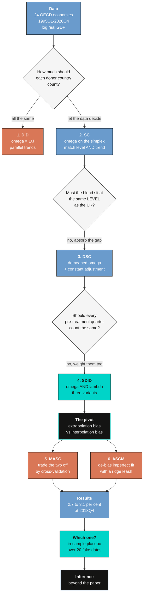
```mermaid
flowchart TD
    D["<b>Data</b><br/>24 OECD economies<br/>1995Q1-2020Q4<br/>log real GDP"] --> Q0{"How much should<br/>each donor country<br/>count?"}
    Q0 -->|"all the same"| DID["<b>1. DiD</b><br/>omega = 1/J<br/>parallel trends"]
    Q0 -->|"let the data decide"| SC["<b>2. SC</b><br/>omega on the simplex<br/>match level AND trend"]
    SC --> Q1{"Must the blend sit at<br/>the same LEVEL<br/>as the UK?"}
    Q1 -->|"no, absorb the gap"| DSC["<b>3. DSC</b><br/>demeaned omega<br/>+ constant adjustment"]
    DSC --> Q2{"Should every<br/>pre-treatment quarter<br/>count the same?"}
    Q2 -->|"no, weight them too"| SDID["<b>4. SDID</b><br/>omega AND lambda<br/>three variants"]
    SDID --> BIAS["<b>The pivot</b><br/>extrapolation bias<br/>vs interpolation bias"]
    BIAS --> MASC["<b>5. MASC</b><br/>trade the two off<br/>by cross-validation"]
    BIAS --> ASCM["<b>6. ASCM</b><br/>de-bias imperfect fit<br/>with a ridge leash"]
    MASC --> R["<b>Results</b><br/>2.7 to 3.1 per cent<br/>at 2018Q4"]
    ASCM --> R
    R --> SEL["<b>Which one?</b><br/>in-sample placebo<br/>over 20 fake dates"]
    SEL --> INF["<b>Inference</b><br/>beyond the paper"]
    style D fill:#6a9bcc,stroke:#141413,color:#fff
    style Q0 fill:#f5f5f5,stroke:#141413,color:#141413
    style Q1 fill:#f5f5f5,stroke:#141413,color:#141413
    style Q2 fill:#f5f5f5,stroke:#141413,color:#141413
    style DID fill:#d97757,stroke:#141413,color:#fff
    style SC fill:#6a9bcc,stroke:#141413,color:#fff
    style DSC fill:#6a9bcc,stroke:#141413,color:#fff
    style SDID fill:#00d4c8,stroke:#141413,color:#141413
    style BIAS fill:#141413,stroke:#00d4c8,color:#fff
    style MASC fill:#d97757,stroke:#141413,color:#fff
    style ASCM fill:#d97757,stroke:#141413,color:#fff
    style R fill:#6a9bcc,stroke:#141413,color:#fff
    style SEL fill:#00d4c8,stroke:#141413,color:#141413
    style INF fill:#141413,stroke:#6a9bcc,color:#fff
```

Notice that the dark node in the middle is not an estimator. It is the section that explains why the last two branches exist at all, and it is the part of this material that transfers to problems that have nothing to do with Brexit.

## 2. Key concepts

Eight ideas carry the whole post. Two of them repay slow reading: the distinction between unit weights and time weights, and the distinction between extrapolation bias and interpolation bias. Neither of those bias names means what you would guess, which is exactly why they need a card.

**The missing counterfactual and the donor pool.**
There is one United Kingdom and it took the treatment. The path it would have followed without Brexit is not in any dataset. Synthetic control builds that path from countries that were not treated. Those countries are the donor pool.

<div class="concept-pair">
<details class="concept-card concept-example">
<summary>Example</summary>

After dropping the twelve OECD countries with incomplete records, 24 remain. The UK is the treated unit. The other 23 — from Australia to the United States — are the donor pool. None of them held a referendum on EU membership in 2016.

</details>
<details class="concept-card concept-analogy">
<summary>Analogy</summary>

The master tape of a song is lost and the original band has broken up. You hire session musicians and rehearse them against a bootleg recording until they are indistinguishable from the original. Then you have them play a song the original band never recorded. The donor pool is the pool of session musicians; the pre-treatment period is the rehearsal.

</details>
</div>

**The simplex and the convex hull.**
Synthetic control weights must be non-negative and must sum to one. That set of allowed weight vectors is called the simplex. The blends it can produce form a region called the convex hull of the donors.

<div class="concept-pair">
<details class="concept-card concept-example">
<summary>Example</summary>

With 23 donors, the simplex is the set of 23 non-negative numbers adding to one. In our fit only about eight donors get a weight above 0.01: Hungary near 0.22, the United States near 0.20, Japan near 0.18, Canada near 0.16, Norway near 0.13. The other fifteen get essentially nothing.

</details>
<details class="concept-card concept-analogy">
<summary>Analogy</summary>

Hammer a pin into a corkboard for every donor country, positioned by its economic characteristics. Stretch a rubber band around all the pins and let it snap tight. Everything inside the band is reachable by some blend; nothing outside it is. If the UK's pin lands outside the band, no recipe of non-negative parts can reach it — you would need a *negative* amount of some country, like a recipe calling for minus two eggs.

</details>
</div>

**Unit weights and time weights.**
Unit weights say how much each donor country counts. Time weights say how much each pre-treatment quarter counts. The two are chosen by the same kind of optimisation, run in two different directions.

<div class="concept-pair">
<details class="concept-card concept-example">
<summary>Example</summary>

Our unit weights put about 0.22 on Hungary and 0.00 on France. Our time weights put 0.96 on 2016Q2 and roughly zero on the other 85 quarters. Both vectors are non-negative and both sum to one.

</details>
<details class="concept-card concept-analogy">
<summary>Analogy</summary>

A mixing desk has two banks of faders. The first bank sets how loud each instrument is; the second sets which seconds of the rehearsal tape you play back when you check the mix. Difference-in-differences leaves both banks flat. Synthetic control moves the first. Synthetic difference-in-differences moves both.

</details>
</div>

**The bias-adjustment term, which is a unit fixed effect in disguise.**
Sometimes the blend moves in near-perfect parallel with the treated unit but sits at a slightly different level. The bias-adjustment term is the average pre-treatment gap, subtracted off. Adding it is exactly the same as putting a unit fixed effect in the regression.

<div class="concept-pair">
<details class="concept-card concept-example">
<summary>Example</summary>

For the UK the demeaned synthetic control's adjustment is $+0.0024$ log points, about a quarter of one per cent of GDP. That is why the DSC estimate of 2.99% at 2018Q4 sits so close to the SC estimate of 3.06%. A small adjustment is evidence that the SC fit was already level-balanced.

</details>
<details class="concept-card concept-analogy">
<summary>Analogy</summary>

Your bathroom scale reads two kilograms heavy. You do not throw it out; you subtract two. Synthetic control insists on a scale that is already exactly right and will reject a perfectly consistent one. Demeaned synthetic control just calibrates the offset.

</details>
</div>

**Extrapolation bias and interpolation bias.**
Two different ways a weighted counterfactual can be wrong. Extrapolation bias: the blend's characteristics do not match the treated unit's. Interpolation bias: the characteristics match, but the outcome is a curved function of them, so averaging outcomes is not the same as the outcome at the average.

<div class="concept-pair">
<details class="concept-card concept-example">
<summary>Example</summary>

Synthetic control chooses its weights to minimise pre-treatment prediction error, which is exactly minimising the first kind of error. It does nothing about the second unless log GDP happens to be a linear function of the underlying drivers. SDID's time weights are what attack the second.

</details>
<details class="concept-card concept-analogy">
<summary>Analogy</summary>

You are roasting a 3.4 kilogram turkey and the chart lists only 3 kg and 4 kg. Extrapolation bias is misreading the scale and looking up 5 kg — right chart, wrong row. Interpolation bias is reading both rows correctly and averaging their times — right rows, but roasting time bends with weight, so the average of two times is not the time for the average bird. The two errors are independent, and fixing one does nothing for the other.

</details>
</div>

**Rolling-origin cross-validation.**
A way to tune a parameter using only pre-treatment data. Walk forward through the pre-period; at each stopping point, fit on everything before it, forecast the next step, and score the forecast.

<div class="concept-pair">
<details class="concept-card concept-example">
<summary>Example</summary>

MASC uses it to pick the number of matched neighbours $m$ and the blend weight $\phi$. With 86 pre-treatment quarters it produces eighty rolling origins, each giving a one-quarter-ahead forecast error for every candidate pair. Here it lands on $m = 10$ and $\phi = 0.158$.

</details>
<details class="concept-card concept-analogy">
<summary>Analogy</summary>

You do not grade a weather forecaster on how vividly they describe yesterday. You replay the archive, ask them to predict tomorrow from each day's vantage point, and total up the misses.

</details>
</div>

**The in-sample placebo.**
Pretend the treatment happened earlier, when nothing did. Estimate the counterfactual anyway and compare it to what actually occurred. The error you get is pure false alarm, and it measures the estimator's precision.

<div class="concept-pair">
<details class="concept-card concept-example">
<summary>Example</summary>

We repeat the whole exercise for twenty artificial treatment dates, with last pre-treatment quarters running from 2010Q1 to 2014Q4. SDID's root mean squared error over those twenty is 0.0067 log points; plain synthetic control's is 0.0089.

</details>
<details class="concept-card concept-analogy">
<summary>Analogy</summary>

A fire drill. There is no fire, so any alarm is a false one, and the detector that stays quietest is the one you install in the server room.

</details>
</div>

**The ridge leash.**
Augmented synthetic control drops the non-negativity constraint so the weights can leave the convex hull. A quadratic penalty pulls them back toward the ordinary SC weights, and the penalty parameter sets how far they may roam.

<div class="concept-pair">
<details class="concept-card concept-example">
<summary>Example</summary>

The ASCM weights in this application include Switzerland at $-0.0090$ and Slovak Republic at $-0.0085$ — impossible under the simplex — and the resulting estimate is 3.04% at 2018Q4, very close to the 3.06% from plain SC.

</details>
<details class="concept-card concept-analogy">
<summary>Analogy</summary>

An elastic leash on a dog. Slack leash: the dog goes wherever the scent leads, including off the lawn. Taut leash: it stays where you started. The stiffness of the leash is the ridge parameter.

</details>
</div>

## 3. Setup

Five packages do the estimation and four more do the plotting. Three of the five are not on CRAN, which is worth knowing before you start.

```r
library(quadprog)   # exact simplex least squares -- our hand-coded solver
library(synthdid)   # SC, DSC and SDID all come out of one function  (GitHub)
library(Synth)      # only needed for the nested V-optimisation with covariates
library(masc)       # matching and synthetic control                 (GitHub)
library(augsynth)   # ridge-augmented synthetic control              (GitHub)
library(ggplot2); library(tidyr); library(readr)
library(patchwork); library(scales); library(jsonlite)

# The three GitHub packages:
#   remotes::install_github("synth-inference/synthdid")
#   remotes::install_github("ebenmichael/augsynth")
#
# masc declares a hard dependency on Gurobi, a commercial solver it never
# actually needs on the code path we use. Drop the dependency first:
#   git clone --depth 1 https://github.com/maxkllgg/masc /tmp/masc_src
#   sed -i '' 's/^    gurobi,$//' /tmp/masc_src/DESCRIPTION
#   R CMD INSTALL /tmp/masc_src

set.seed(20260801)
```

Everything in this post runs on R 4.5.2 with `synthdid` 0.0.9, `augsynth` 0.2.0, `masc` 0.1.1 and `Synth` 1.1-10. The full script is [`analysis.R`](analysis.R); a stripped-down version that produces every estimate in about thirty seconds is [`cheatsheet.R`](cheatsheet.R).

## 4. The data

The dataset is the one assembled by Born and coauthors [2] from the OECD Economic Outlook: quarterly national accounts for 36 OECD economies. Twelve are dropped for incomplete records, leaving 24 countries observed over 104 quarters with no missing values at all.

```r
url   <- paste0("https://raw.githubusercontent.com/cmg777/starter-academic-v501/",
                "master/content/post/r_sc_dsc_sdid/brexit_analysis.csv")
panel <- if (file.exists("brexit_analysis.csv")) read.csv("brexit_analysis.csv") else read.csv(url)

COUNTRIES <- unique(panel$country[order(panel$unit_id)])
UK        <- which(COUNTRIES == "United Kingdom")
DONORS    <- setdiff(seq_along(COUNTRIES), UK)

# Y is [time x country]: 104 quarters by 24 countries.
Y <- matrix(panel$log_rgdp[order(panel$unit_id, panel$t)],
            nrow = 104, dimnames = list(NULL, COUNTRIES))
```

```text
  panel        : 24 countries x 104 quarters (1995Q1 to 2020Q4)
  treated      : United Kingdom (unit_id 23)
  donors (23)  : Australia, Austria, Belgium, Canada, Finland, France, Germany,
                 Hungary, Iceland, Ireland, Italy, Japan, Korea, Luxembourg,
                 Netherlands, New Zealand, Norway, Portugal, Slovak Republic,
                 Spain, Sweden, Switzerland, United States
  headline spec: treatment materialises 2016Q3, T0 = 86 pre-periods
  evaluated at : 2018Q4 (t=96) and 2019Q4 (t=100)
```

**Interpretation.** The donor pool has **23 countries** and the pre-treatment window has **86 quarters** — a long panel by synthetic-control standards, which matters because the bias of these estimators shrinks with the number of pre-treatment periods. The outcome is the natural log of real GDP indexed so that each country's 1995 average equals one, so all effects are in **log points** and a difference of 0.03 is about a 3% shortfall.

### 4.1 Two definitions of $T\_0$, pinned down once

This is the single most common place to go wrong, so we fix it before writing any code. In the papers, $T\_0$ is the treatment *period*. In the `synthdid` package, the `T0` argument is the *number* of pre-treatment periods. Here they are 87 and 86.

| Concept | In the papers | In `synthdid` | Quarter | `t` |
|---|---|---|---|---|
| First pre-treatment quarter | $t = 1$ | — | 1995Q1 | 1 |
| Last pre-treatment quarter | $t = T\_0 - 1$ | period `T0` | 2016Q2 | 86 |
| Number of pre-treatment quarters | $T\_0 - 1 = 86$ | `T0 = 86` | — | — |
| Treatment quarter | $t = T\_0$ | period `T0 + 1` | 2016Q3 | 87 |
| First evaluation quarter | — | — | 2018Q4 | 96 |
| Second evaluation quarter | — | — | 2019Q4 | 100 |

The referendum was held on 23 June 2016, right at the end of 2016Q2. Following the source paper we date the treatment by the quarter in which the effect *materialises*, which makes 2016Q3 the headline choice and 2016Q2 a robustness check. Section 17 shows the choice is not innocuous.

## 5. What the data look like before we assume anything

```r
ggplot(donors, aes(date, y, group = country)) +
  geom_line(colour = GREY_DONOR, linewidth = 0.35, alpha = 0.75) +
  geom_line(data = uk, aes(date, y), colour = ORANGE, linewidth = 1.1) +
  geom_vline(xintercept = 2016.50, linetype = "dashed", colour = TEAL)
```

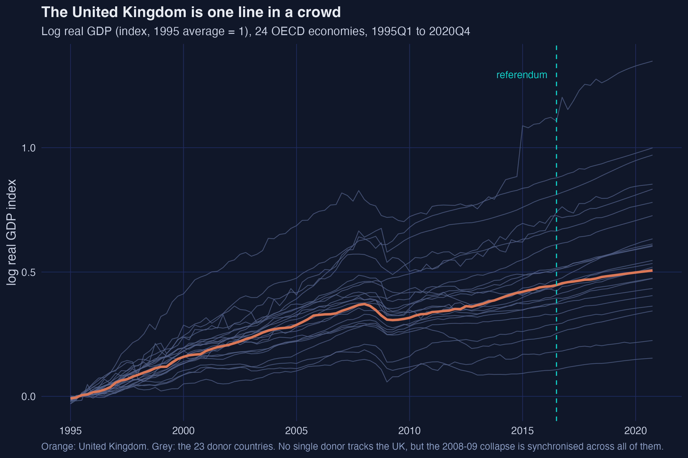

**Interpretation.** The UK is one line in a crowd. No single donor tracks it, which is the whole reason we will be building a *blend*. But look at 2008–09: every line collapses at once. That synchronised movement is a common factor, and the estimators from rung three onward are built precisely to exploit it.

Now the same picture with the crowd averaged into a single line. This *is* the difference-in-differences counterfactual, drawn before we name it.

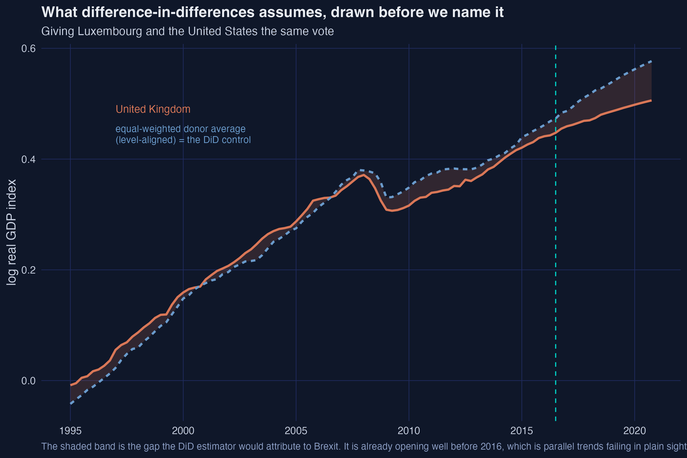

**Interpretation.** The two lines were already drifting apart from about 2013, three years before the referendum. That is parallel trends failing in plain sight. Difference-in-differences will happily produce a number anyway — we compute it in the next section — and the number will be nearly twice what every other method reports. This is not a subtle failure.

The six covariates that Born and coauthors match on tell their own story:

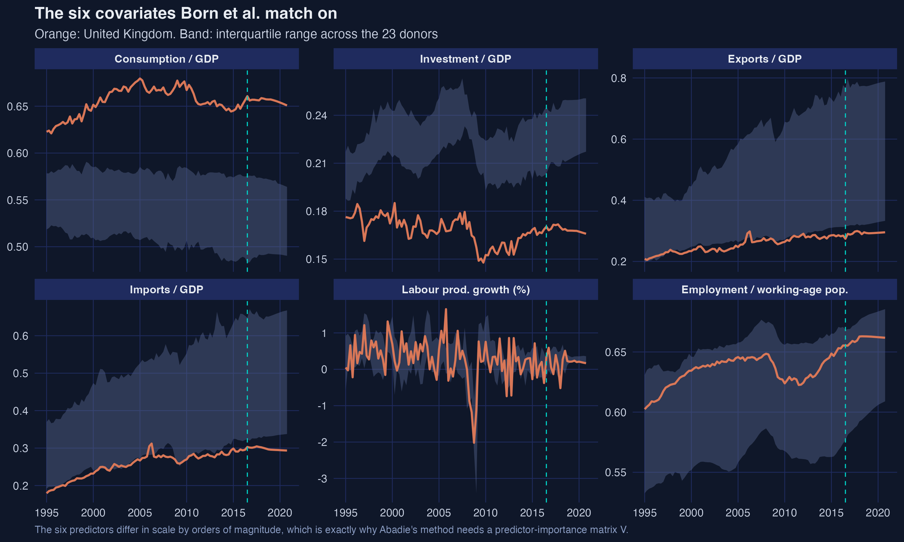

**Interpretation.** The six predictors live on scales that differ by orders of magnitude — a consumption share near 0.65, a quarterly productivity growth rate near 0.1. That is why Abadie's method needs a predictor-importance matrix at all, and it is the first hint of why adding covariates might cost more than it buys.

## 6. One regression, seven sets of weights

Before the ladder, the frame. Everything below is the *same* regression run with different weights.

Write the observed outcome in potential-outcome form. Let $y\_{j,t}$ be log real GDP in country $j$ and quarter $t$, and let $w\_{j,t}$ be one when country $j$ is treated in quarter $t$:

$$y\_{j,t} = w\_{j,t}\\, y^{1}\_{j,t} + (1 - w\_{j,t})\\, y^{0}\_{j,t}$$

In words, this says that for every country-quarter we observe exactly one of two numbers — the treated outcome if the referendum applies, the untreated outcome otherwise — and the other is permanently missing. In code, $y\_{j,t}$ is `Y[t, j]` and $w\_{j,t}$ is one only for the UK from `t = 87` onward.

What we want is the gap between what the UK did and what it would have done:

$$\hat{\tau}\_t = y\_{1,t} - \hat{y}^{0}\_{1,t}$$

In words, the effect in any post-referendum quarter is the observed UK outcome minus the estimated counterfactual. In code, $y\_{1,t}$ is `Y[96, UK]` at 2018Q4 and $\hat{y}^{0}\_{1,t}$ is `Y[96, DONORS] %*% omega`.

Now the frame. Every estimator in this post is a weighted two-way fixed-effects regression:

$$\left(\hat{\tau}, \hat{\alpha}, \hat{\beta}\right) = \underset{\tau, \alpha, \beta}{\arg\min} \sum\_{j=1}^{J+1} \sum\_{t=1}^{T\_0} \left( y\_{j,t} - \alpha\_j - \beta\_t - w\_{j,t}\\, \tau \right)^{2} \hat{\omega}\_j\\, \hat{\lambda}\_t$$

In words, this says: regress the outcome on a country effect, a quarter effect and a treatment dummy, weighting each country by $\hat{\omega}\_j$ and each quarter by $\hat{\lambda}\_t$. In code, $\hat{\omega}\_j$ is `omega[j]`, $\hat{\lambda}\_t$ is `lambda[t]`, and $\alpha\_j$ is the unit fixed effect that `omega.intercept = TRUE` switches on.

The entire ladder is a table of settings for that one expression:

| Rung | Unit weights $\omega$ | Time weights $\lambda$ | Unit effect $\alpha$ | Feasible set for $\omega$ |
|---|---|---|---|---|
| DiD | fixed at $1/J$ | fixed at $1/(T\_0-1)$ | yes | — |
| SC | optimised | none | **no** | simplex |
| SC(B) | optimised | none | no | simplex |
| DSC | optimised on demeaned data | fixed at $1/(T\_0-1)$ | yes | simplex |
| SDID | optimised on demeaned data | **optimised** | yes | simplex |
| MASC | $\phi \cdot$ matching $+\\, (1-\phi) \cdot$ SC | none | no | simplex |
| ASCM | SC weights + ridge correction | none | no | **sums to one, sign free** |

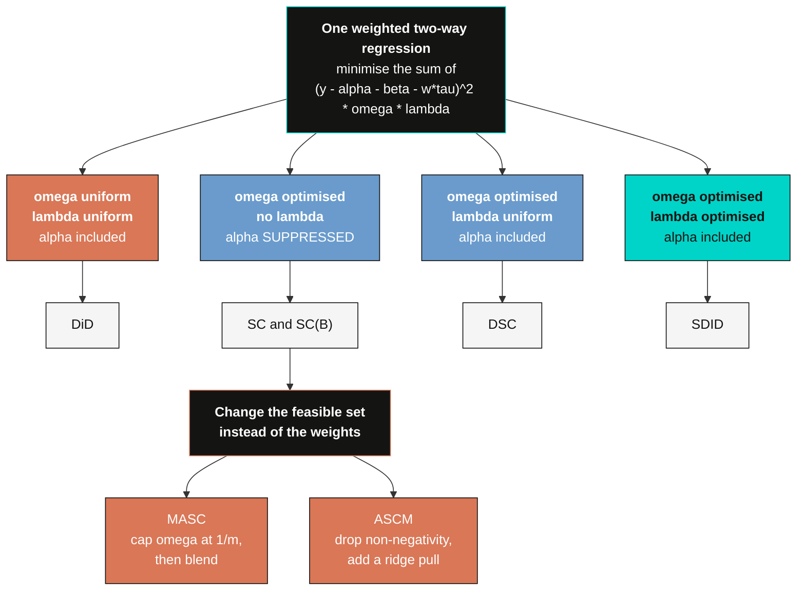
```mermaid
graph TD
    OBJ["<b>One weighted two-way regression</b><br/>minimise the sum of<br/>(y - alpha - beta - w*tau)^2 * omega * lambda"]
    OBJ --> A["<b>omega uniform</b><br/><b>lambda uniform</b><br/>alpha included"]
    OBJ --> B["<b>omega optimised</b><br/><b>no lambda</b><br/>alpha SUPPRESSED"]
    OBJ --> C["<b>omega optimised</b><br/><b>lambda uniform</b><br/>alpha included"]
    OBJ --> E["<b>omega optimised</b><br/><b>lambda optimised</b><br/>alpha included"]
    A --> A1["DiD"]
    B --> B1["SC and SC(B)"]
    C --> C1["DSC"]
    E --> E1["SDID"]
    B1 --> F["<b>Change the feasible set<br/>instead of the weights</b>"]
    F --> F1["MASC<br/>cap omega at 1/m,<br/>then blend"]
    F --> F2["ASCM<br/>drop non-negativity,<br/>add a ridge pull"]
    style OBJ fill:#141413,stroke:#00d4c8,color:#fff
    style A fill:#d97757,stroke:#141413,color:#fff
    style B fill:#6a9bcc,stroke:#141413,color:#fff
    style C fill:#6a9bcc,stroke:#141413,color:#fff
    style E fill:#00d4c8,stroke:#141413,color:#141413
    style A1 fill:#f5f5f5,stroke:#141413,color:#141413
    style B1 fill:#f5f5f5,stroke:#141413,color:#141413
    style C1 fill:#f5f5f5,stroke:#141413,color:#141413
    style E1 fill:#f5f5f5,stroke:#141413,color:#141413
    style F fill:#141413,stroke:#d97757,color:#fff
    style F1 fill:#d97757,stroke:#141413,color:#fff
    style F2 fill:#d97757,stroke:#141413,color:#fff
```

Two things are worth pausing on. First, synthetic control is the only rung that switches the unit fixed effect *off*, and that single omission is what forces it to match the UK's level as well as its shape. Second, MASC and ASCM hang off a different branch: they do not re-weight the regression, they change what counts as an admissible weight vector.

### 6.1 One solver, used five times

Every rung reduces to the same problem — minimise a sum of squares over the simplex — with different inputs. So we write the solver once:

$$\underset{w}{\min} \\, \lVert b - A w \rVert^{2} \quad \text{subject to} \quad w\_k \geq 0 \\, \text{for all } k, \quad \sum\_k w\_k = 1$$

In words, find the non-negative shares of the columns of $A$ that come closest to reproducing the target vector $b$. In code, $A$ is `Z0` (the donors' pre-treatment paths) when we want unit weights, and its transpose when we want time weights.

```r
simplex_ls <- function(A, b, ridge = 1e-10) {
  k <- ncol(A)
  w <- solve.QP(Dmat = crossprod(A) + ridge * diag(k),   # the quadratic term
                dvec = crossprod(A, b),                  # the linear term
                Amat = cbind(rep(1, k), diag(k)),        # col 1: sum(w)=1; rest: w>=0
                bvec = c(1, rep(0, k)),
                meq  = 1)$solution                       # meq=1: first constraint is =
  w[w < 1e-10] <- 0
  w / sum(w)
}
```

The `1e-10` on the diagonal is numerical hygiene so the Cholesky factorisation never fails. It is *not* the regularisation parameter of Arkhangelsky and coauthors, which is a modelling choice we look at in section 17.

## 7. Rung 1 — Difference-in-differences

DiD is the ladder's ground floor: every donor counts the same, and a unit fixed effect absorbs whatever constant level gap remains.

$$\hat{\tau}^{did}\_{t} = \left( y\_{1,t} - \bar{y}\_{1} \right) - \frac{1}{J} \sum\_{j=2}^{J+1} \left( y\_{j,t} - \bar{y}\_{j} \right)$$

In words, the change for the UK from its own pre-referendum average, minus the average change across all 23 donors from theirs. In code, $\bar{y}\_j$ is `colMeans(Z0)` and $1/J$ is `rep(1/23, 23)`.

```r
w_did <- rep(1 / 23, 23)
b_did <- mean(Z1 - Z0 %*% w_did)          # the unit fixed effect
loss  <- function(w, e, b = 0) -100 * (Y[e, UK] - drop(Y[e, DONORS] %*% w) - b)
c(loss(w_did, 96, b_did), loss(w_did, 100, b_did))
```

```text
  DiD                    2018Q4  4.981   2019Q4  6.182   uniform weights
  pre-treatment RMSE vs the donor average : 0.02175
```

**Interpretation.** DiD says Brexit cost the UK **4.98% of GDP** by the end of 2018 and **6.18%** by the end of 2019 — roughly double what every other rung will report. It is not in the source paper's tables, and it should not be trusted: its pre-treatment fit error is **0.0218 log points**, four times what synthetic control will achieve. The estimator is fitting a trend divergence that began years before the referendum and calling it Brexit.

DiD's error is that it gave Luxembourg and the United States the same vote. The next rung lets the data vote.

## 8. Rung 2 — Synthetic control

### 8.1 The optimisation problem

Instead of fixing the weights, choose them to make the blend track the treated unit as closely as possible over the pre-treatment window:

$$\hat{\boldsymbol{\omega}}^{sc} = \underset{\boldsymbol{\omega} \in \mathbb{W}}{\arg\min} \sum\_{t=1}^{T\_0-1} \left( y\_{1,t} - \sum\_{j=2}^{J+1} \omega\_j\\, y\_{j,t} \right)^{2}$$

In words, pick the blend of donors whose path over the 86 pre-referendum quarters is as close as possible, in squared error, to the UK's own. In code, the inner sum is `Z0 %*% omega` and the objective is `sum((Z1 - Z0 %*% omega)^2)`.

The feasible set is the simplex:

$$\mathbb{W} = \left\\{ \boldsymbol{\omega} \in \mathbb{R}^{J} : \omega\_j \geq 0 \\, \text{for all } j, \\, \sum\_{j=2}^{J+1} \omega\_j = 1 \right\\}$$

In words, the weights are shares — never negative, always adding to one. In code, that is the `Amat`/`bvec`/`meq` block of `simplex_ls`.

Once the weights are fixed, the counterfactual in *any* quarter is just the weighted sum of what the donors actually did:

$$\hat{y}^{0,sc}\_{1,t} = \sum\_{j=2}^{J+1} \hat{\omega}^{sc}\_{j}\\, y\_{j,t}$$

### 8.2 What the simplex actually is

Two constraints, non-negativity and summing to one, sound innocuous. Geometrically they are not. They confine the synthetic UK to the *convex hull* of the donors — the region you can reach by averaging.

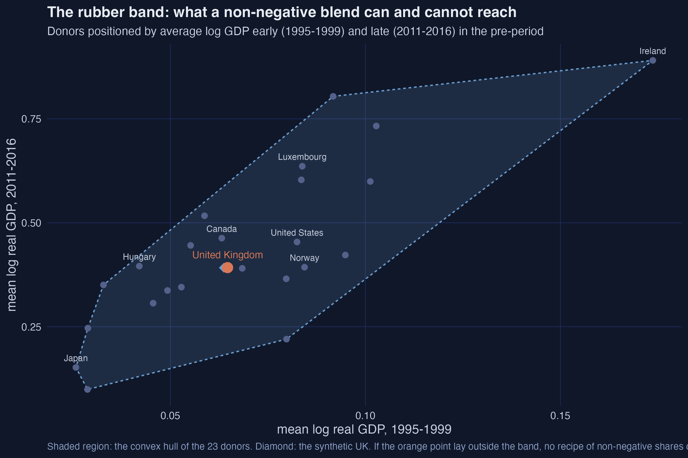

**Interpretation.** The shaded region is everything a non-negative blend can reach. The UK sits comfortably inside it, which is why synthetic control works well here. Had the orange point fallen outside the band — a very rich or very poor treated unit — no recipe of non-negative shares could have reached it, and we would need rung six.

That picture is in *outcome* space. The optimisation happens in *weight* space, which is a different object. Restrict attention to the three donors that end up carrying the most weight and you can draw the entire search:

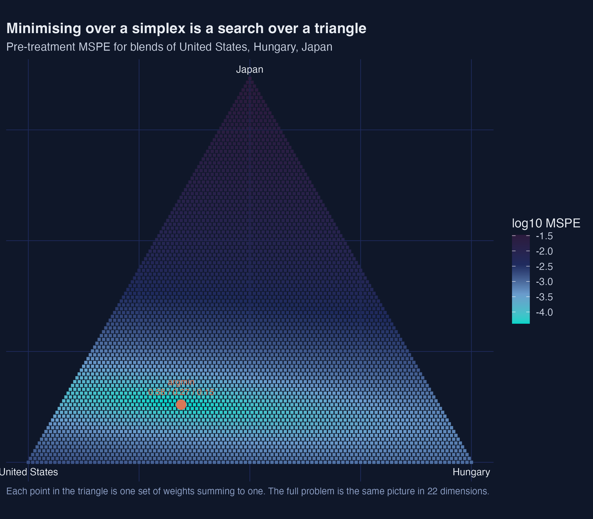

**Interpretation.** Every point in the triangle is one set of weights summing to one; the corners are "put everything on one donor". The minimum sits in the interior, meaning all three donors earn a positive share. The real problem is this same picture in 22 dimensions, and a weight of exactly zero means the optimum sat on an edge.

### 8.3 From scratch, then the package

```r
Z1 <- Y[1:86, UK]        # the UK's pre-treatment path
Z0 <- Y[1:86, DONORS]    # the donors' pre-treatment paths

w_sc_qp <- simplex_ls(Z0, Z1)                 # exact, via quadprog

# The package. Note the layout: units x time, treated unit LAST, and T0 is the
# NUMBER of pre-treatment periods.
Y_sd  <- t(cbind(Y[, DONORS], Y[, UK]))
sd_sc <- synthdid_estimate(Y_sd[, 1:87], N0 = 23, T0 = 86,
                           zeta.omega = 0, zeta.lambda = 0,
                           omega.intercept = FALSE, lambda.intercept = FALSE)
w_sc_pkg <- as.numeric(attr(sd_sc, "weights")$omega)
```

Why call `synthdid` rather than `Synth` here? Because with no covariates, the classic synthetic-control problem of the equation above *is* `synthdid_estimate` with both intercepts off and both penalties set to zero. Using one optimiser for the whole ladder means every difference we report between rungs is the method, not the solver. `Synth` reappears in section 16, where its nested optimisation is genuinely needed.

There is a third way to solve the same problem, and we need it in a moment. `synthdid` does not call a quadratic programming solver at all — internally it runs **Frank–Wolfe**, an iterative method that walks toward the optimum one simplex vertex at a time. Porting it is twenty lines, and it is the only way to see what the package is actually doing:

```r
# A line-for-line port of synthdid's internal optimiser (sc.weight.fw).
fw_step <- function(A, x, b, eta) {
  Ax   <- A %*% x
  half <- t(Ax - b) %*% A + eta * x
  i    <- which.min(half)             # the steepest simplex vertex
  dx   <- -x; dx[i] <- 1 - x[i]       # the direction to move in
  if (all(dx == 0)) return(x)
  derr <- A[, i] - Ax
  s    <- -drop(half %*% dx) / (sum(derr^2) + eta * sum(dx^2))
  x + min(1, max(0, s)) * dx          # the optimal step length, clipped
}

simplex_fw <- function(A, b, intercept = FALSE, min.decrease = 1e-5,
                       max.iter = 10000) {
  if (intercept) { A <- sweep(A, 2, colMeans(A)); b <- b - mean(b) }
  run <- function(x, mi) {
    vals <- rep(NA_real_, mi); it <- 0
    # Stop on a small enough improvement -- OR on the iteration cap.
    while (it < mi && (it < 2 || vals[it - 1] - vals[it] > min.decrease^2)) {
      it <- it + 1
      x  <- fw_step(A, x, b, 0)
      vals[it] <- sum((A %*% x - b)^2) / nrow(A)
    }
    x
  }
  x <- run(rep(1 / ncol(A), ncol(A)), 100)   # short pre-round, then sparsify
  x[x <= max(x) / 4] <- 0; x <- x / sum(x)
  run(x, max.iter)
}

w_sc_fw <- simplex_fw(Z0, Z1, min.decrease = 1e-5 * sd(apply(t(Z0), 1, diff)))
```

Watch the `while` condition. It exits on *either* a small enough improvement *or* the iteration cap — and which of those fires turns out to matter.

```text
  exact QP     : SSR 2.686818e-03   nonzero  9   loss(2018Q4) 3.039
  hand-coded FW: SSR 2.751662e-03   nonzero 13   loss(2018Q4) 3.056
  synthdid     : SSR 2.751662e-03   nonzero 13   loss(2018Q4) 3.056
  |FW - package| max abs weight difference : 0.000e+00   <-- these agree
  |QP - package| max abs weight difference : 1.564e-02   <-- these do NOT
```

**Interpretation.** Something has gone wrong — or rather, something instructive has gone right. Our hand-coded Frank–Wolfe loop matches the package *exactly*, to the last bit. But the exact quadratic-programming solution disagrees, giving **3.04%** where the package gives **3.06%**, and achieving a **lower** sum of squared residuals while doing it. The package is not finding the optimum.

### 8.4 Why the two solvers disagree

The reason is the shape of the objective. With 23 donors and 86 pre-treatment quarters and no regularisation, the problem is nearly degenerate:

```text
  noise.level (sd of donor quarterly changes) : 0.012425
  synthdid min.decrease                       : 1.242e-07
  donor Gram: smallest eigenvalue 3.192e-04, condition number 7.487e+05
```

A condition number near a million means the objective has directions along which it is almost perfectly flat. Frank–Wolfe crawls along those directions and never triggers its stopping rule, so it halts on its iteration cap instead. Let it run longer and the answer keeps moving:

| Frank–Wolfe iterations | Sum of squares | Loss at 2018Q4 | Loss at 2019Q4 |
|---|---|---|---|
| 100 | 0.0034364 | 3.177 | 4.289 |
| 300 | 0.0031180 | 3.038 | 4.183 |
| 1,000 | 0.0029646 | 3.056 | 4.203 |
| 3,000 | 0.0028366 | 3.061 | 4.210 |
| **10,000 (the package default)** | **0.0027517** | **3.056** | **4.204** |
| 30,000 | 0.0027141 | 3.047 | 4.187 |
| 100,000 | 0.0026963 | 3.042 | 4.178 |
| **exact QP** | **0.0026868** | **3.039** | **4.172** |

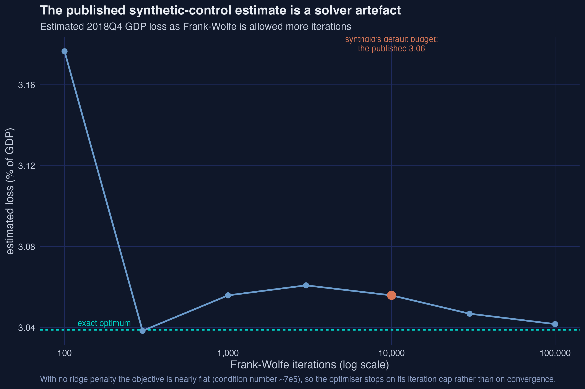

**Interpretation.** The published synthetic-control estimate of 3.06% is the value Frank–Wolfe happens to be passing through at ten thousand iterations. The true minimiser of the stated objective gives **3.04%**. The difference is 0.02 percentage points — economically nothing, and it does not change a single conclusion in this post. But it is worth knowing that it is there, because it tells you something general: **when a synthetic-control objective is this flat, the donor weights are not identified to more than a couple of decimal places, even though the estimate they produce is stable.** Two solvers disagreeing by 0.016 on individual weights agree to within 0.02 percentage points on the effect.

For the rest of the post we report the package answer, so the tables line up with the published ones.

### 8.5 The counterfactual and the gap

```text
         country omega_fw omega_qp
         Hungary   0.2186   0.2231
   United States   0.1994   0.1926
           Japan   0.1773   0.1826
          Canada   0.1612   0.1751
          Norway   0.1256   0.1350
         Ireland   0.0543   0.0523
           Italy   0.0353   0.0196
        Portugal   0.0123   0.0124
  pre-treatment RMSPE : 0.00566  (DiD: 0.02175)
```

**Interpretation.** Synthetic Britain is roughly one-fifth Hungary, one-fifth the United States, one-fifth Japan, one-sixth Canada and one-eighth Norway. That combination has no economic interpretation and is not supposed to have one — it is whatever reproduces the UK's growth path. The pre-treatment fit error of **0.0057 log points** is a quarter of what DiD managed, which is the entire argument for the method.

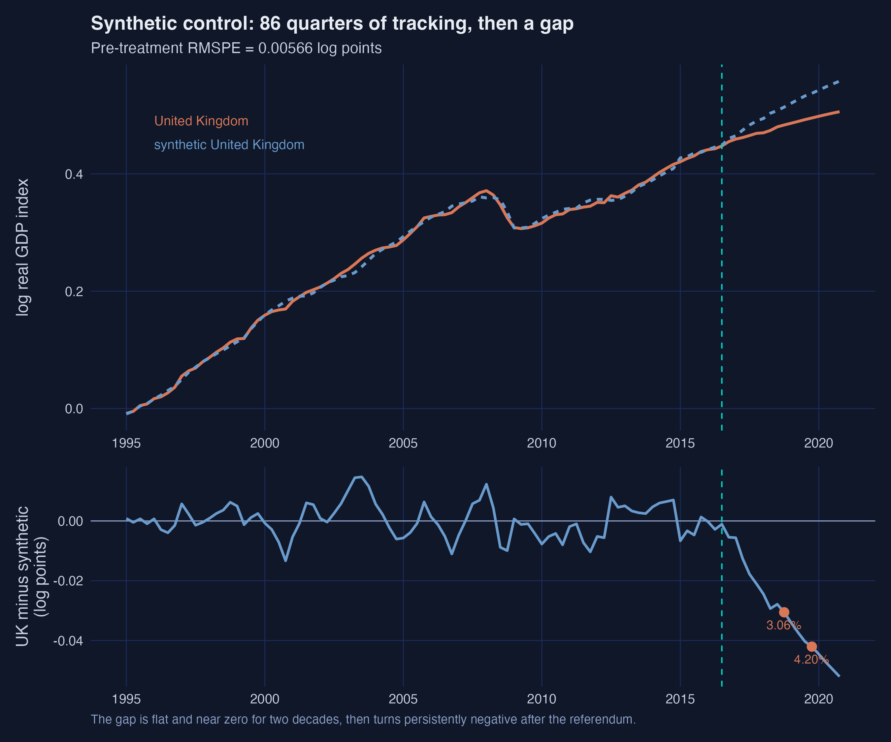

**Interpretation.** Twenty-one years of near-perfect tracking, then a gap that opens right at the referendum and keeps widening: **3.06%** by 2018Q4 and **4.20%** by 2019Q4. The flatness of the gap before 2016 is what licenses reading the gap after 2016 as an effect.

## 9. Rung 3 — Demeaned synthetic control

### 9.1 What SC gets wrong

Synthetic control has no intercept. Look again at what that means. Suppose some blend of donors moved in *perfect* parallel with the UK for twenty-one years but sat consistently 0.5% below it. SC's objective would score that blend badly and reject it, even though it is exactly what we want for forecasting a counterfactual — a series with the right dynamics and a known, constant offset.

Ferman and Pinto [9] and Doudchenko and Imbens [8] both proposed the same fix: demean first, then add the offset back.

$$\hat{\boldsymbol{\omega}}^{dsc} = \underset{\boldsymbol{\omega} \in \mathbb{W}}{\arg\min} \sum\_{t=1}^{T\_0-1} \left( (y\_{1,t} - \bar{y}\_{1}) - \sum\_{j=2}^{J+1} \omega\_j\\, (y\_{j,t} - \bar{y}\_{j}) \right)^{2}$$

In words, the same problem as before, but every country's own pre-treatment average is stripped out first, so the fit is judged on shape rather than on level. In code, `Z0_dm <- sweep(Z0, 2, colMeans(Z0))` and `Z1_dm <- Z1 - mean(Z1)`.

The offset comes back as a constant:

$$b^{dsc} = \frac{1}{T\_0-1} \sum\_{t=1}^{T\_0-1} \left( y\_{1,t} - \sum\_{j=2}^{J+1} \hat{\omega}^{dsc}\_{j}\\, y\_{j,t} \right)$$

In words, the average distance over the 86 pre-referendum quarters between the UK and its blend. In code, `b_dsc <- mean(Z1 - Z0 %*% w_dsc)`.

$$\hat{\tau}^{dsc}\_{t} = y\_{1,t} - \sum\_{j=2}^{J+1} \hat{\omega}^{dsc}\_{j}\\, y\_{j,t} - b^{dsc}$$

In words, the raw gap minus the offset we already knew about from before the referendum.

Adding $b^{dsc}$ is algebraically identical to putting the unit fixed effect $\alpha\_j$ back into the master regression of section 6. And that gives us a tidy result: **DiD is DSC with the weights frozen at $1/J$.** The ground floor and the third rung are the same estimator with different $\omega$.

### 9.2 Two changed lines

```r
Z0_dm <- sweep(Z0, 2, colMeans(Z0))       # <-- the only change, part 1
Z1_dm <- Z1 - mean(Z1)                    # <-- the only change, part 2
w_dsc_qp <- simplex_ls(Z0_dm, Z1_dm)      # identical call to rung 2

# The package: one argument flips.
sd_dsc <- synthdid_estimate(Y_sd[, 1:87], N0 = 23, T0 = 86,
                            zeta.omega = 0, zeta.lambda = 0,
                            omega.intercept = TRUE, lambda.intercept = TRUE)
w_dsc <- as.numeric(attr(sd_dsc, "weights")$omega)
b_dsc <- mean(Z1 - Z0 %*% w_dsc)
```

```text
  bias adjustment b_dsc            : +0.00242 log points (0.242% of GDP)
  |QP - package| max weight diff   : 7.523e-03
  correlation of SC and DSC weights: 0.9928
  DSC                    2018Q4  2.985   2019Q4  4.121
```

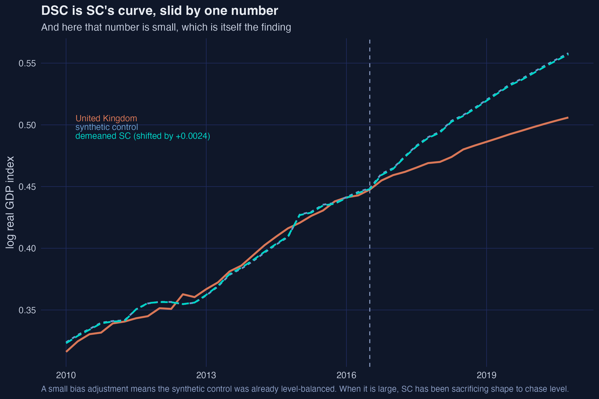

**Interpretation.** DSC is SC's curve slid up by a single number, and here that number is **+0.0024 log points** — about a quarter of one percent. The estimate moves from 3.06% to **2.99%**. This is an anticlimax, and the anticlimax is the finding: a small bias adjustment means the synthetic control was *already* level-balanced, so SC was not sacrificing shape to chase level. On a dataset where the treated unit sits awkwardly relative to the donor pool, this term would be doing real work. Notice also that the two weight vectors correlate at **0.993** — demeaning barely changed who gets picked, only how the result is read off.

## 10. Rung 4 — Synthetic difference-in-differences

### 10.1 What DSC gets wrong

DSC's bias adjustment is a *flat* average over all 86 pre-treatment quarters. It gives 1995Q1 exactly as much say as 2016Q2 in deciding how far apart the UK and its blend sit. But 1995 resembles 2016 hardly at all, and if the gap between the UK and its blend has been drifting, a flat average is the wrong correction.

Arkhangelsky and coauthors [10] let the data choose which quarters to trust.

### 10.2 The time-weight problem is the unit-weight problem, transposed

This is the key structural insight of the whole post, so it gets its own sentence: **the time-weight problem is the unit-weight problem run on the transpose.**

- $\omega$ asks: which *countries*, blended, reproduce the UK's pre-treatment path?
- $\lambda$ asks: which *quarters*, blended, reproduce the treatment quarter, judged across all the donors?

$$\hat{\boldsymbol{\lambda}}^{sdid} = \underset{\boldsymbol{\lambda} \in \mathbb{L}}{\arg\min} \sum\_{j=2}^{J+1} \left( (y\_{j,T\_0} - \bar{y}\_{T\_0}) - \sum\_{t=1}^{T\_0-1} \lambda\_t\\, (y\_{j,t} - \bar{y}\_{t}) \right)^{2}$$

In words, find the blend of pre-referendum quarters that best predicts the treatment quarter, scored across all 23 donors, after removing the cross-country average at each date. In code, this is `simplex_ls(t(Z0_centred), y_treatment_quarter_centred)` — the same function, with a transposed argument.

$$\mathbb{L} = \left\\{ \boldsymbol{\lambda} \in \mathbb{R}^{T\_0-1} : \lambda\_t \geq 0 \\, \text{for all } t, \\, \sum\_{t=1}^{T\_0-1} \lambda\_t = 1 \right\\}$$

> **A trap worth naming.** The word "demeaned" means two *different* things in rung three and rung four. DSC removes each **country's** own time-series mean: `sweep(Z0, 2, colMeans(Z0))`. The SDID time-weight problem removes each **quarter's** cross-sectional mean: `sweep(Z0, 1, rowMeans(Z0))`. Same verb, orthogonal operations. If you take one thing away from this section, take that.

The bias adjustment then becomes a weighted average instead of a flat one:

$$b^{sdid} = \sum\_{t=1}^{T\_0-1} \hat{\lambda}^{sdid}\_{t} \left( y\_{1,t} - \sum\_{j=2}^{J+1} \hat{\omega}^{dsc}\_{j}\\, y\_{j,t} \right)$$

Compare that with $b^{dsc}$ two sections above. They are the same expression with $1/(T\_0-1)$ replaced by $\hat{\lambda}\_t$. **That is the entire difference between rungs three and four.** SDID does not even estimate its own unit weights — it reuses DSC's.

```r
# A has donors as ROWS and quarters as COLUMNS -- the transpose of the omega
# problem. `intercept = TRUE` demeans each quarter across donors, rather than
# each country across quarters as rung 3 did.
#
# We use the Frank-Wolfe port here rather than simplex_ls, so that the result is
# comparable with the package to the last bit. The exact QP gives the same
# answer to six decimals and an identical treatment effect.
lambda <- simplex_fw(t(Z0), Y[87, DONORS], intercept = TRUE,
                     min.decrease = 1e-5 * sd(apply(t(Z0), 1, diff)))

b_dsc  <- mean(Z1 - Z0 %*% w_dsc)              # rung 3: flat average
b_sdid <- drop(lambda %*% (Z1 - Z0 %*% w_dsc)) # rung 4: weighted average
```

```text
  |hand-coded lambda - synthdid lambda| : 0.000e+00
  lambda(i): 3 nonzero weights; 0.958 on the last pre-period (2016Q2)
      2016Q2   0.9585
      2008Q4   0.0386
      2014Q3   0.0029
  DSC bias adjustment +0.00242  vs  SDID(i) bias adjustment +0.00015
  SDID (i)               2018Q4  2.758   2019Q4  3.894
```

**Interpretation.** Our hand-coded time weights match `synthdid`'s to zero — not to within a tolerance, exactly. And the answer is startling: **96% of the weight lands on a single quarter, 2016Q2**, with a small 3.9% on 2008Q4, the trough of the financial crisis. Because the weighted average of pre-treatment gaps is so different from the flat one ($+0.00015$ against $+0.00242$), the estimate drops from 2.99% to **2.76%**.

### 10.3 Where DiD and two-way fixed effects live inside SDID

$$\lambda^{did}\_t = \mathbf{1}\\{ t = T\_0 - 1 \\}, \qquad \lambda^{twfe}\_t = \frac{1}{T\_0 - 1}$$

In words, if all the time weight lands on the last pre-treatment quarter you have a difference-in-differences correction; if it is spread evenly you have the two-way fixed-effects correction that DSC uses. SDID is supposed to let the data pick a point *between* those two extremes.

Here it picks one of the extremes. That deserves an explanation, not a shrug.

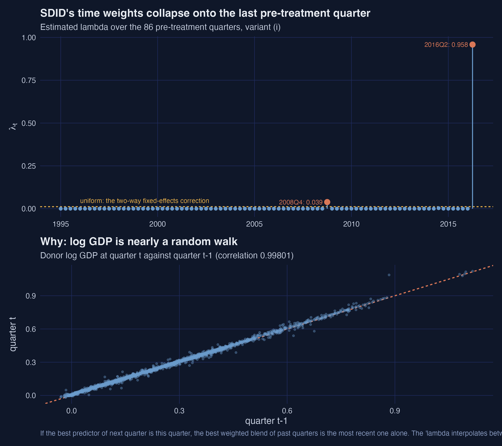

**Interpretation.** Log GDP is very close to a random walk — the scatter of quarter $t$ against quarter $t-1$ sits almost exactly on the 45-degree line. If the best predictor of next quarter is simply this quarter, then the best *weighted blend* of past quarters for predicting the treatment quarter is the most recent quarter alone. The collapse is a property of the data, not a bug in the code. The source paper notes this too, and declines to switch to differenced data on the grounds that matching levels and trends is the entire point of a synthetic control. Exercise 4 asks you to try it anyway.

### 10.4 Three flavours of SDID

The time weights have to be fitted against *something* in the post-treatment period, and there are three natural choices:

| Variant | $\lambda$ is fitted to predict | Evaluated at |
|---|---|---|
| (i) | the first treated quarter, 2016Q3 | any horizon |
| (ii) | the average of all quarters from 2016Q3 to the evaluation date | that date |
| (iii) | the evaluation quarter alone | that date |

```text
  SDID (i)               2018Q4  2.758   2019Q4  3.894
  SDID (ii)              2018Q4  2.787   2019Q4  3.923
  SDID (iii)             2018Q4  2.787   2019Q4  3.923
```

**Interpretation.** The three variants land within **0.03 percentage points** of each other, because all three put essentially all their time weight on the same last pre-treatment quarter. Section 15 asks whether the placebo evidence can tell them apart — and finds that the published answer to that question does not survive scrutiny.

## 11. The pivot: extrapolation bias and interpolation bias

We now have four rungs and no principled reason to prefer any of them. This section supplies one, and it is the theoretical contribution of the source paper.

### 11.1 A warning about the names

Neither term means what you would guess.

- **Extrapolation bias** is *not* about predicting outside the range of the data in time. It is about the blend having the wrong *characteristics*.
- **Interpolation bias** is *not* about filling in missing quarters. It is about the response function being *curved*.

Hold those corrected definitions in mind, because the formal decomposition is short and it will go past quickly.

### 11.2 The decomposition

Write each country's untreated outcome as a function of its characteristics, and write a generic weighted counterfactual:

$$\hat{y}^{0}\_{1,T\_0} = \sum\_{j=2}^{J+1} w\_j\\, y^{0}\_{j,T\_0}\left[ \boldsymbol{x}\_{j,T\_0} \right]$$

In words, every estimator in this post is a choice of the weights $w\_j$ in this one expression; the square brackets are a device for tracking *where* the response function is being evaluated.

The total bias is what we want and what we get:

$$\text{Bias}\_{1,T\_0} = y^{0}\_{1,T\_0}\left[ \boldsymbol{x}\_{1,T\_0} \right] - \sum\_{j=2}^{J+1} w\_j\\, y^{0}\_{j,T\_0}\left[ \boldsymbol{x}\_{j,T\_0} \right]$$

Insert a middle term — the response function evaluated at the *blend's* characteristics — and it splits in two. First piece:

$$B^{ext} = y^{0}\_{1,T\_0}\left[ \boldsymbol{x}\_{1,T\_0} \right] - y^{0}\_{1,T\_0}\left[ \sum\_{j=2}^{J+1} w\_j\\, \boldsymbol{x}\_{j,T\_0} \right]$$

In words, the same function evaluated at two different places: the UK's true characteristics, and the blend's characteristics. If the blend matches the UK exactly, this term is zero.

Second piece:

$$B^{int} = y^{0}\_{1,T\_0}\left[ \sum\_{j=2}^{J+1} w\_j\\, \boldsymbol{x}\_{j,T\_0} \right] - \sum\_{j=2}^{J+1} w\_j\\, y^{0}\_{j,T\_0}\left[ \boldsymbol{x}\_{j,T\_0} \right]$$

In words, the outcome *at* the averaged characteristics minus the average *of* the outcomes. These coincide only if the function is a straight line, so this term is pure curvature.

$$\text{Bias}\_{1,T\_0} = B^{ext} + B^{int}$$

The middle term cancels, so the two pieces add up exactly. That is what makes it legitimate to ask, of any estimator, which of the two it is attacking.

### 11.3 A two-donor picture

With two donors and one characteristic, there are two obvious weighting rules and each kills exactly one term. Linear-interpolation weights place the blend's characteristic exactly on the treated unit's:

$$w^{li}\_{3} = \frac{x\_{1} - x\_{2}}{x\_{3} - x\_{2}}, \qquad w^{li}\_{2} = 1 - w^{li}\_{3}, \qquad w^{nn}\_{2} = 1, \qquad w^{nn}\_{3} = 0$$

In words, one recipe puts the blend at the right place on the horizontal axis and reads off the chord; the other copies the nearest donor outright. Neither can do both.


**Interpretation.** On the left, the blend's characteristic is exactly right, so there is no extrapolation bias — but the chord between the two donor outcomes sits below the curve, and that vertical distance is the interpolation bias. On the right, we copy the nearest donor, so there is no interpolation bias — but we are reading the curve at the wrong place. **Two errors, two weighting rules, one killed each time.** The question the ladder has been building toward is whether anything can kill both.

### 11.4 Where each estimator sits

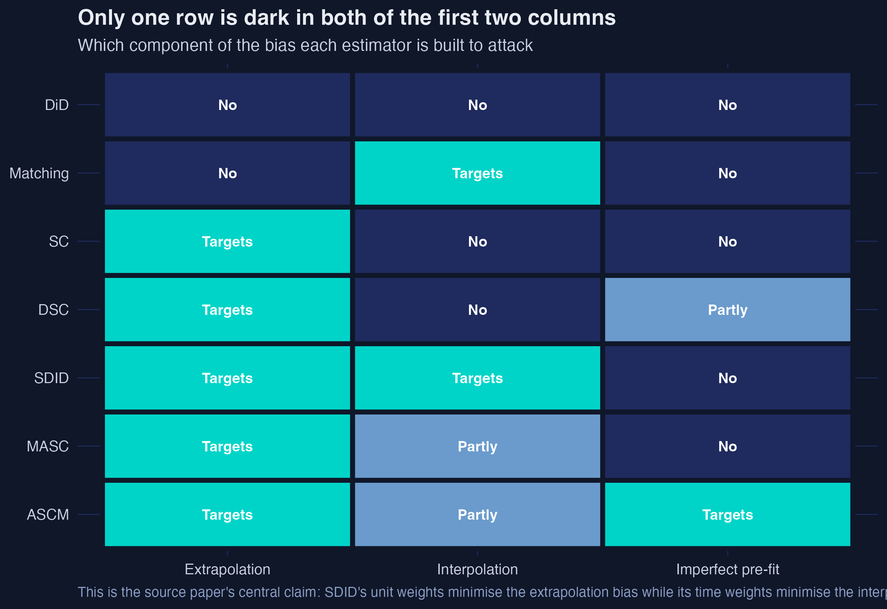

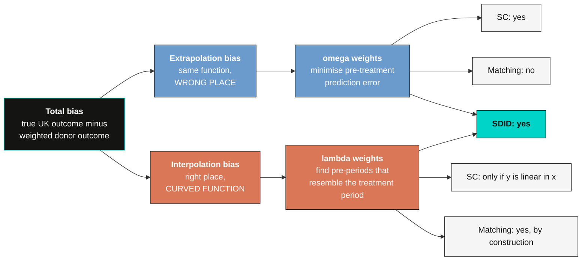
```mermaid
graph LR
    T["<b>Total bias</b><br/>true UK outcome minus<br/>weighted donor outcome"] --> X["<b>Extrapolation bias</b><br/>same function,<br/>WRONG PLACE"]
    T --> I["<b>Interpolation bias</b><br/>right place,<br/>CURVED FUNCTION"]
    X --> XA["<b>omega weights</b><br/>minimise pre-treatment<br/>prediction error"]
    I --> IA["<b>lambda weights</b><br/>find pre-periods that<br/>resemble the treatment period"]
    XA --> SC2["SC: yes"]
    XA --> NN2["Matching: no"]
    IA --> SC3["SC: only if y is linear in x"]
    IA --> NN3["Matching: yes, by construction"]
    XA --> SD["<b>SDID: yes</b>"]
    IA --> SD
    style T fill:#141413,stroke:#00d4c8,color:#fff
    style X fill:#6a9bcc,stroke:#141413,color:#fff
    style I fill:#d97757,stroke:#141413,color:#fff
    style XA fill:#6a9bcc,stroke:#141413,color:#fff
    style IA fill:#d97757,stroke:#141413,color:#fff
    style SC2 fill:#f5f5f5,stroke:#141413,color:#141413
    style NN2 fill:#f5f5f5,stroke:#141413,color:#141413
    style SC3 fill:#f5f5f5,stroke:#141413,color:#141413
    style NN3 fill:#f5f5f5,stroke:#141413,color:#141413
    style SD fill:#00d4c8,stroke:#141413,color:#141413
```

Only one node has two arrows pointing into it. Synthetic control minimises extrapolation bias by construction, because it is the argmin of the pre-treatment fit. Matching minimises interpolation bias by construction, because it never blends. **SDID's unit weights do the first job and its time weights do the second**, which is the source paper's headline claim and the reason it recommends the method.

### 11.5 The honest caveat

Do not over-learn this. The decomposition assumes a common response function across countries and sets the idiosyncratic error aside entirely. SDID "targets" both biases, but it pays for the privilege by estimating 85 extra parameters, and the source paper's own conclusion is that the gain over DSC is "marginal at best" for the kind of trend specification we have here. Section 19 returns to this.

## 12. Rung 5 — MASC

### 12.1 Buying the trade-off explicitly

If SC kills one bias and matching kills the other, why not buy some of each? Kellogg, Mogstad, Pouliot and Torgovitsky [11] do exactly that:

$$\hat{\boldsymbol{\omega}}^{masc}(m, \phi) = \phi\\, \hat{\boldsymbol{\omega}}^{ma}(m) + (1 - \phi)\\, \hat{\boldsymbol{\omega}}^{sc}$$

In words, a dial between pure matching and pure synthetic control, with the dial position chosen by out-of-sample forecast error rather than by taste. In code, `phi * nn_weights(Z0, Z1, m) + (1 - phi) * w_sc`.

The matching weights themselves are the solution to a linear program:

$$\hat{\boldsymbol{\omega}}^{ma}(m) = \underset{\boldsymbol{\omega} \in \mathbb{S}}{\arg\min} \sum\_{j=2}^{J+1} \omega\_j \lVert \boldsymbol{y}\_j - \boldsymbol{y}\_1 \rVert, \qquad \mathbb{S} = \left\\{ \boldsymbol{\omega} : 0 \leq \omega\_j \leq \tfrac{1}{m}, \\, \sum\_j \omega\_j = 1 \right\\}$$

In words, capping every weight at $1/m$ and minimising total distance forces the solution to spread $1/m$ across exactly the $m$ closest donors. Matching, written as an optimisation problem.

### 12.2 The cross-validation, written out

```r
nn_weights <- function(Z0, Z1, m) {
  d   <- colSums((Z1 - Z0)^2)
  sel <- d %in% sort(d)[1:m]
  as.numeric(sel) / sum(sel)
}

# Rolling origin: for each stopping point k, refit BOTH estimators on quarters
# 1..k, forecast quarter k+1, and score. phi then has a closed form.
set_f <- 6:85
wt    <- rep(1 / length(set_f), length(set_f))
ysc   <- vapply(set_f, function(k) drop(Z0[k+1, ] %*% simplex_ls(Z0[1:k, ], Z1[1:k])), 0)
ytr   <- Z1[set_f + 1]
cv <- do.call(rbind, lapply(1:10, function(m) {
  ymt <- vapply(set_f, function(k) drop(Z0[k+1, ] %*% nn_weights(Z0[1:k, ], Z1[1:k], m)), 0)
  phi <- min(1, max(0, drop((wt*(ytr-ysc)) %*% (ymt-ysc) / ((wt*(ymt-ysc)) %*% (ymt-ysc)))))
  data.frame(m = m, phi = phi, cv = sum(wt * (ytr - phi*ymt - (1-phi)*ysc)^2))
}))
```

```text
  hand-coded : m = 10, phi = 0.1577
  masc package: m = 10, phi = 0.1577   |hand - package| = 2.220e-16
  MASC                   2018Q4  2.726   2019Q4  3.828   m = 10, phi = 0.158
```

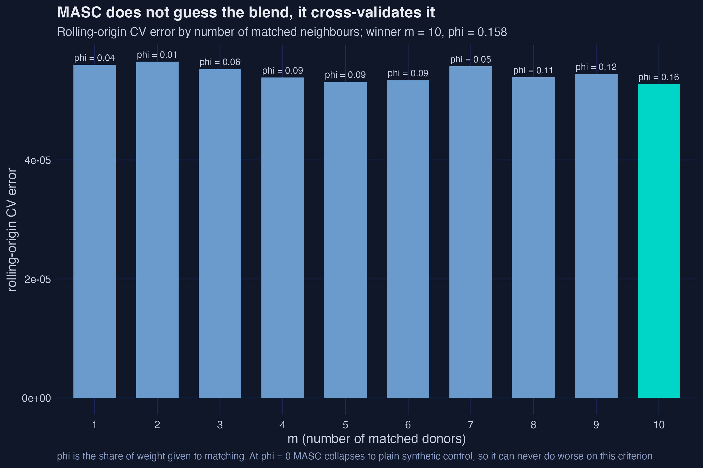

**Interpretation.** The data buy **15.8% matching and 84.2% synthetic control**, using the ten nearest donors. The estimate, **2.73%**, is the lowest on the ladder. Note that $\phi$ is not a taste parameter: it is the minimiser of a forecast error computed entirely from pre-treatment data, and at $\phi = 0$ MASC collapses to plain SC, so on this criterion it can never do worse.

> **A trap in the package.** The published replication code passes `masc`'s `min_preperiods` argument, but current package master reads that value as the fold *start*, producing only five folds. Five folds select $\phi = 1$ — pure matching — and an estimate of 2.36%, which does not match the published result. The authors' numbers correspond to folds running from 6 to $T\_0 - 1$, so we set `set_f` explicitly. Silent, plausible-looking, and wrong by a third of a percentage point.

## 13. Rung 6 — Augmented synthetic control

### 13.1 What every rung so far assumes

All six previous rungs require the UK to lie inside the donors' convex hull — inside the rubber band of section 8.2. When it does not, the pre-treatment fit is imperfect and Abadie's own advice is to stop. Ben-Michael, Feller and Rothstein [12] instead de-bias:

$$\hat{\boldsymbol{\omega}}^{ascm} = \underset{\boldsymbol{\omega} : \sum\_j \omega\_j = 1}{\arg\min} \\, \frac{1}{2 \lambda^{ridge}} \sum\_{t=1}^{T\_0-1} \left( y\_{1,t} - \sum\_{j=2}^{J+1} \omega\_j\\, y\_{j,t} \right)^{2} + \frac{1}{2} \sum\_{j=2}^{J+1} \left( \omega\_j - \hat{\omega}^{sc}\_{j} \right)^{2}$$

In words, keep improving the pre-treatment fit, but pay a quadratic price for every step away from the ordinary synthetic-control weights. Non-negativity is gone; only the sum-to-one constraint survives. In code, $\lambda^{ridge}$ is chosen by leave-one-period-out cross-validation inside `augsynth`.

The estimator has a closed form, so we can write it out: take the SC weights and add a ridge-predicted correction for whatever pre-treatment imbalance they left behind.

```r
ascm_hand <- function(lambda_ridge) {
  Xc  <- sweep(t(Z0), 2, colMeans(t(Z0)))   # donors x quarters, period-centred
  x1c <- Z1 - colMeans(t(Z0))               # the treated path, same centring
  # SC weights, plus a ridge regression of the residual imbalance on the donors
  as.numeric(w_sc_qp + solve(tcrossprod(Xc) + lambda_ridge * diag(23),
                             Xc %*% (x1c - crossprod(Xc, w_sc_qp))))
}
```

One thing we cannot supply by hand is $\lambda^{ridge}$ itself — it is chosen by cross-validation, and inventing a value would be cheating. Fit the package, read its choice back out, and feed it in:

```r
ad <- data.frame(unitnum = rep(1:24, each = 87), t = rep(1:87, 24),
                 value = as.vector(Y[1:87, c(UK, DONORS)]))
ad$treatment <- as.integer(ad$unitnum == 1 & ad$t == 87)
ascm <- augsynth(value ~ treatment, unitnum, t, ad, progfunc = "Ridge", scm = TRUE)

w_ascm_hand <- ascm_hand(ascm$lambda)       # ascm$lambda is augsynth's CV choice
max(abs(w_ascm_hand - as.numeric(ascm$weights)))
```

```text
  package : sum(w) = 1.0000, min(w) = -0.0090, 8 negative weights
  hand    : ridge lambda = 0.13858 (chosen by augsynth's own CV)
            loss(2018Q4) = 3.045   |hand - package| max weight diff = 3.881e-06
  negative weights (impossible under the simplex):
         country   omega
     Switzerland -0.0090
 Slovak Republic -0.0085
         Belgium -0.0066
           Spain -0.0056
          Sweden -0.0030
           Korea -0.0027
         Austria -0.0013
     Netherlands -0.0012
  ASCM                   2018Q4  3.045   2019Q4  4.187
```

**Interpretation.** Eight donors get negative weight — the synthetic UK now *subtracts* a little Switzerland and a little Belgium, which is flatly impossible under the simplex. And the estimate, **3.04%**, is almost exactly plain SC's 3.06%. That is the expected result when the pre-treatment fit was already excellent: the ridge correction has almost nothing to fix, so it barely moves. ASCM earns its keep on datasets where SC visibly fails, which this is not. For a case where it does matter, see [the Kansas tax-cut tutorial](/post/r_augsynth/).

## 14. The whole ladder, side by side

Everything is now in place. First the units. Because the outcome is in logs, the counterfactual-minus-actual difference is in log points:

$$L\_t = 100 \times \left( \hat{y}^{0}\_{1,t} - y\_{1,t} \right)$$

In words, multiply the log gap by 100 to get an approximate percentage shortfall, positive when the UK underperformed its counterfactual. In code, the script stores `tau = y1 - yhat0`, so the reported loss is `-100 * tau`. At these magnitudes the log approximation is good to two decimal places.

| Method | 2018Q4 | 2019Q4 | Published | Note |
|---|---|---|---|---|
| DiD | 4.98 | 6.18 | — | not in the paper; pre-trends fail |
| SC | 3.06 | 4.20 | 3.06 / 4.20 | Frank–Wolfe |
| SC (exact QP) | 3.04 | 4.17 | — | the true optimum |
| DSC | 2.99 | 4.12 | 2.98 / 4.12 | |
| SDID (i) | 2.76 | 3.89 | 2.76 / 3.89 | |
| SDID (ii) | 2.79 | 3.92 | 2.79 / 3.92 | |
| SDID (iii) | 2.79 | 3.92 | 2.79 / 3.92 | |
| MASC | 2.73 | 3.83 | 2.73 / 3.83 | $m = 10$, $\phi = 0.158$ |
| ASCM | 3.04 | 4.19 | 3.04 / 4.19 | 8 negative weights |
| **Born et al. (2019)** | **2.40** | **3.60** | | with covariates |

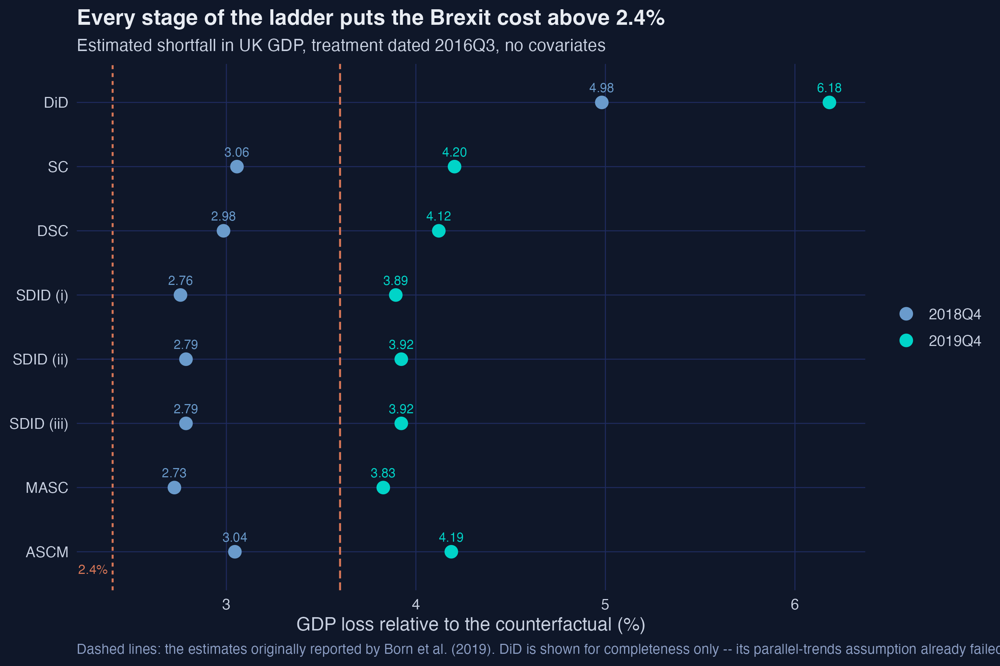

**Interpretation.** Every cell of that table reproduces the published one to within 0.01 percentage points. Three things stand out. First, the spread across methods at 2018Q4 is **2.73% to 3.06%** — a range of a third of a percentage point, which is small next to the gap to Born et al.'s 2.40%. Second, the estimated damage **grows over time**, from roughly 2.9% to roughly 4.1%, which looks like a change in the growth rate rather than a one-off level shift. Third, and this is the paper's empirical punchline: **every rung of the ladder puts the cost of the referendum above the previously published figure**, and the methods that adjust for level and timing put it lowest, not highest.

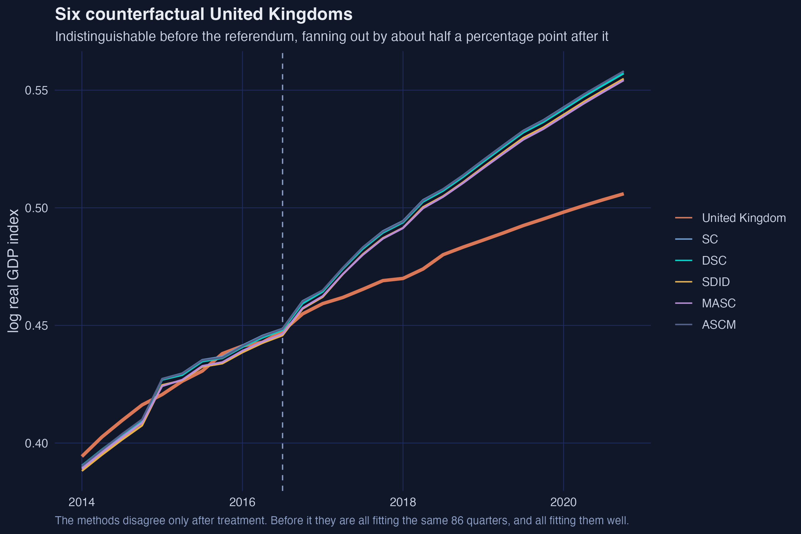

**Interpretation.** Before the referendum the six lines are on top of each other — they are all fitting the same 86 quarters, and all fitting them well. The disagreement is entirely a post-treatment phenomenon, which is a useful reminder that pre-treatment fit cannot arbitrate between methods that all achieve it.

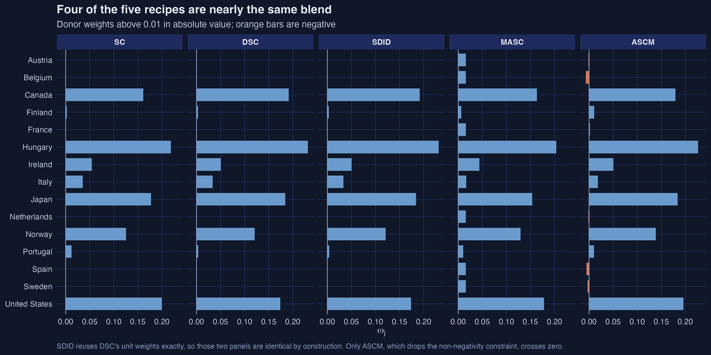

**Interpretation.** Four of the five recipes are nearly the same blend, dominated by Hungary, the United States, Japan, Canada and Norway. The SDID and DSC panels are *identical* by construction, since SDID reuses DSC's unit weights and changes only the bias adjustment. Only ASCM crosses zero.

## 15. Which rung should you stand on?

### 15.1 The in-sample placebo tournament

Pre-treatment fit cannot choose between these methods, because they all fit. So the source paper does something better: it moves the treatment date back to a quarter when nothing happened, builds the counterfactual using only data up to that point, and compares it to what actually occurred. The true effect is zero, so every estimate is pure error.

$$\text{RMSE} = \sqrt{ \frac{1}{20} \sum\_{k=1}^{20} \left( y\_{1, T'\_k + h} - \hat{y}^{0}\_{1, T'\_k + h} \right)^{2} }$$

In words, across twenty artificial treatment dates, how far off is the counterfactual from an outcome we can actually check. In code, the loop runs `k` over the last pre-treatment quarters 2010Q1 to 2014Q4, always starting the window at 1995Q1, with `h` the forecast horizon.

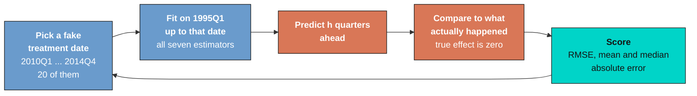
```mermaid
flowchart LR
    A["<b>Pick a fake<br/>treatment date</b><br/>2010Q1 ... 2014Q4<br/>20 of them"] --> B["<b>Fit on 1995Q1<br/>up to that date</b><br/>all seven estimators"]
    B --> C["<b>Predict h quarters<br/>ahead</b>"]
    C --> D["<b>Compare to what<br/>actually happened</b><br/>true effect is zero"]
    D --> E["<b>Score</b><br/>RMSE, mean and median<br/>absolute error"]
    E --> A
    style A fill:#6a9bcc,stroke:#141413,color:#fff
    style B fill:#6a9bcc,stroke:#141413,color:#fff
    style C fill:#d97757,stroke:#141413,color:#fff
    style D fill:#d97757,stroke:#141413,color:#fff
    style E fill:#00d4c8,stroke:#141413,color:#141413
```

### 15.2 The published table, reproduced

| Method | RMSE | MAB | MedAB | Published RMSE |
|---|---|---|---|---|
| SC | 0.0089 | 0.0072 | 0.0055 | 0.0089 |
| DSC | 0.0087 | 0.0070 | 0.0052 | 0.0087 |
| **SDID (i)** | **0.0067** | **0.0037** | **0.0016** | 0.0067 |
| MASC | 0.0080 | 0.0062 | 0.0045 | 0.0080 |
| ASCM | 0.0086 | 0.0068 | 0.0051 | 0.0086 |
| SDID (ii) | 0.0134 | 0.0111 | 0.0103 | 0.0134 |
| SDID (iii) | 0.0134 | 0.0111 | 0.0107 | 0.0134 |

**Interpretation.** Every number reproduces exactly. Read as published, the table says SDID (i) wins comfortably — its median absolute error of **0.0016** is a third of plain synthetic control's **0.0055** — and that variants (ii) and (iii) are the worst of the lot, twice as bad as plain SC. That is the basis for the paper's recommendation to use variant (i) in practice.

### 15.3 The table is not comparing like with like

Look closely at how those numbers are produced. In the replication code, SC, DSC, SDID (i), MASC and ASCM are all graded **one quarter ahead**. SDID (ii) and (iii) are graded **four quarters ahead**. Forecasting a year out is a strictly harder task than forecasting a quarter out, so part of the gap is the exam, not the student.

Running every estimator at both horizons settles it:

| Method | RMSE, $h = 1$ | RMSE, $h = 4$ |
|---|---|---|
| SC | 0.0089 | 0.0150 |
| DSC | 0.0087 | 0.0149 |
| SDID (i) | 0.0067 | 0.0134 |
| SDID (ii) | **0.0066** | 0.0134 |
| SDID (iii) | **0.0066** | 0.0134 |
| MASC | 0.0080 | 0.0140 |
| ASCM | 0.0086 | 0.0146 |

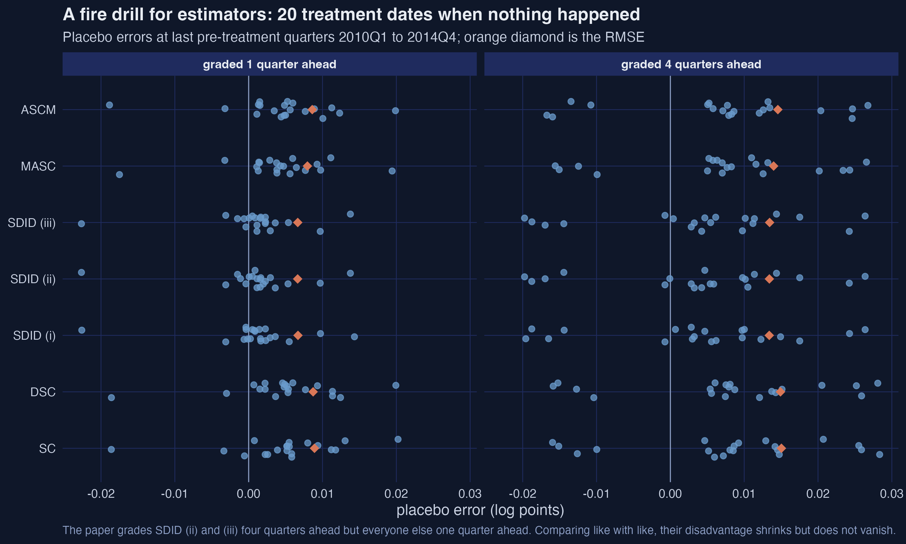

**Interpretation.** Graded on the same task, the three SDID variants are **indistinguishable** — 0.0067, 0.0066, 0.0066 at one quarter, and 0.0134 for all three at four quarters. The published conclusion that variants (ii) and (iii) "perform the worst" is an artefact of the horizon, not a property of the estimators.

What survives is the finding that matters more: **at either horizon, the whole SDID family beats every other rung**, and the ordering below it is stable — SDID, then MASC, then ASCM, then DSC, then SC. The time weights are doing real work. Which variant supplies them is not settled by this evidence, and variant (i) remains the sensible default simply because it is the cheapest and requires no choice of post-treatment window.

## 16. Do covariates help?

The Brexit dataset ships with six covariates, and Born and coauthors matched on them. The source paper's most pointed conclusion is that you should not.

Matching on covariates requires Abadie's nested optimisation: an inner problem that picks weights given a predictor-importance matrix $\boldsymbol{V}$, and an outer problem that picks $\boldsymbol{V}$.

$$\hat{\boldsymbol{\omega}}(\boldsymbol{V}) = \underset{\boldsymbol{\omega} \in \mathbb{W}}{\arg\min} \\, (\boldsymbol{z}\_1 - \boldsymbol{Z}\boldsymbol{\omega})' \boldsymbol{V} (\boldsymbol{z}\_1 - \boldsymbol{Z}\boldsymbol{\omega})$$

In words, for a fixed opinion about how important each predictor is, pick the blend that best balances the predictors. In code, `Synth::synth(X1 = ..., X0 = ...)`.

$$\hat{\boldsymbol{V}}^{sc} = \underset{\boldsymbol{V} \in \mathbb{V}}{\arg\min} \sum\_{t=1}^{T\_0-1} \left( y\_{1,t} - \sum\_{j=2}^{J+1} \hat{\omega}\_j(\boldsymbol{V})\\, y\_{j,t} \right)^{2}$$

In words, choose the predictor importances that make the resulting blend track the UK's *outcome* best. The variant used by Born and coauthors — call it SC(B) — replaces the outcome in this outer objective with the full stacked predictor vector, so covariates are scored in **both** loops:

```r
# SC with covariates: outer loop scores the OUTCOME
synth(X1 = X1, X0 = X0, Z1 = as.matrix(Z1), Z0 = Z0)
# SC(B): outer loop scores the stacked PREDICTORS
synth(X1 = X1, X0 = X0, Z1 = X1,            Z0 = X0)
```

```r
X1 <- as.matrix(c(Z1, cov_means[UK, ]))          # 86 outcomes + 6 covariate means
X0 <- rbind(Z0, t(cov_means[DONORS, ]))
s_born <- synth(X1 = X1,  X0 = X0,  Z1 = X1,            Z0 = X0)      # SC(B)
s_sc   <- synth(X1 = X1,  X0 = X0,  Z1 = as.matrix(Z1), Z0 = Z0)      # SC cov.
s_dsc  <- synth(X1 = X1d, X0 = X0d, Z1 = as.matrix(Z1_dm), Z0 = Z0_dm) # DSC cov.
```

```text
           method loss_2018Q4 loss_2019Q4 published
            SC(B)       2.428       3.606      2.43
          SC cov.       3.028       4.170      3.11
         DSC cov.       2.942       4.050      2.90
    SDID cov. (i)       2.731       3.839      2.75
       SC no cov.       3.056       4.204      3.06
      DSC no cov.       2.985       4.121      2.98
 SDID no cov. (i)       2.758       3.894      2.76
```

**Interpretation.** The first row is the headline. **SC(B) with mean covariates gives 2.43% at 2018Q4 and 3.61% at 2019Q4** — that is Born et al.'s 2.4% and 3.6%, reproduced to the second decimal. So the gap between the earlier published figure and everything else in this post is not a data difference or a coding difference. It is entirely the choice of estimator, and specifically the choice to score covariates in both optimisation loops.

Note also that the four covariate rows sit *below* their no-covariate counterparts in three cases out of four, and that our `Synth`-based numbers drift from the published ones by up to 0.08 percentage points. That drift is honest and expected: the outer optimisation over the predictor-importance matrix is not convex, `Synth` runs a derivative-free search over 92 dimensions, and different starting values land in different local optima. When a specification's answer depends on where the optimiser started, that is information about the specification.

But the decisive evidence is not in this table at all — it is in the placebo tournament. Rerunning section 15 with covariates in the matching set makes almost every estimator *worse*:

| Method | RMSE without covariates | RMSE with mean covariates |
|---|---|---|
| SC | 0.0089 | 0.0092 |
| DSC | 0.0087 | 0.0106 |
| SDID (i) | 0.0067 | 0.0063 |
| MASC | 0.0080 | 0.0048 |
| ASCM | 0.0086 | 0.0083 |

*(the covariate column is Table 8 of the source paper; our no-covariate column reproduces its Table 7 exactly)*

**Interpretation.** Adding six covariates degrades SC and DSC and barely helps SDID and ASCM. Only MASC clearly benefits. The source paper's conclusion is blunt, and our replication supports it: if the object of interest is the GDP series, do not add covariates. The reason is not mysterious. Kaul and coauthors [13] showed that once *all* pre-treatment outcomes are in the matching set, covariates are redundant — the outcomes already encode whatever the covariates would have told you. With 86 pre-treatment outcomes in play, the six extra predictors add estimation noise and nothing else.

## 17. Robustness: the specification zoo

Four departures from the headline specification, each a short table and a single lesson.

**(a) The other treatment date.** The referendum fell at the very end of 2016Q2, so dating the treatment there rather than at 2016Q3 is entirely defensible.

```text
   method 2016Q2_2018Q4 2016Q3_2018Q4
       SC         3.123         3.056
      DSC         3.036         2.985
 SDID (i)         3.170         2.758
     MASC         2.769         2.726
```

**Interpretation.** SC, DSC and MASC barely notice — they move by less than 0.07 percentage points. **SDID moves by 0.41**, from 2.76% to 3.17%, which is more than the entire spread across methods at a fixed date. The reason is visible in the time-weight figure: SDID fits its time weights against the treatment quarter, so changing which quarter that is changes the target of the fit. At 2016Q2 the weight splits 0.84/0.16 across the last two quarters instead of collapsing onto one. **The choice of treatment date is not innocuous, and it bites hardest on precisely the estimator the tournament recommends.**

**(b) Dropping the United States.** The US carries about a fifth of the weight, and if spillovers exist they should be concentrated in the highest-weighted donors [17].

```text
   method with_US without_US
       SC   3.056      3.067
      DSC   2.985      3.032
 SDID (i)   2.758      2.818
```

**Interpretation.** Every estimate moves by less than 0.06 percentage points and all three move *up*. Whatever the no-interference assumption is doing here, it is not driving the result.

**(c) The ridge penalty.** Arkhangelsky and coauthors propose an automatic regularisation of the unit weights, whose main theoretical benefit is that it makes the solution unique — which, given section 8.4, is not a trivial gain.

$$\zeta = \left( T\_{post} \right)^{1/4} \sqrt{ \frac{1}{J (T\_0 - 2)} \sum\_{j=2}^{J+1} \sum\_{t=1}^{T\_0-2} \left( \Delta\_{j,t} - \bar{\Delta} \right)^{2} }$$

In words, the penalty scale is the standard deviation of donors' quarter-to-quarter GDP changes, inflated by the fourth root of the number of post-treatment quarters. In code, this is what `synthdid` uses when you *omit* `zeta.omega = 0`.

```text
   method no_penalty with_penalty
       SC      3.056        3.093
      DSC      2.985        3.090
 SDID (i)      2.758        2.642
```

**Interpretation.** Penalising moves SC up by 0.04, DSC up by 0.11 and SDID down by 0.12. All within the spread we have already seen. The penalty is worth switching on for the uniqueness it buys, not because it changes any conclusion.

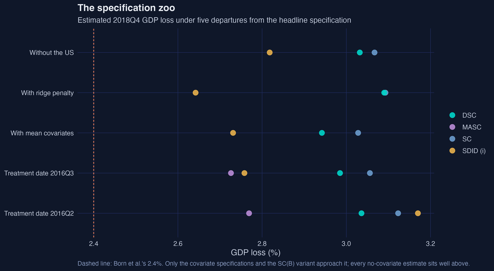

**Interpretation.** Across every specification in this section, the estimated loss sits between roughly **2.6% and 3.2%**. Only the SC(B)-with-covariates cell reaches down to 2.4%. That is the whole robustness story in one picture, and it is the reason the source paper insists on reporting a cloud rather than a point.

## 18. Inference: what the paper does not do

> **This section goes beyond the paper.** De Brabander, Juodis and Miyazato Szini state in their Remark 1 that they consider point estimates only and set inference aside entirely, on the grounds that inference for this class of problems is genuinely hard. That is a defensible position for a methods comparison, and a poor place for a first-time learner to stop. Everything that follows is our addition.

### 18.1 Placebo in space

The classic device, due to Abadie and coauthors: pretend each donor in turn was the treated country, run the whole procedure, and see whether the UK's post-treatment gap is unusual against that reference distribution. The statistic is the ratio of post-treatment to pre-treatment fit error, which corrects for the fact that a country the method fits badly will show a large gap for uninteresting reasons.

$$R\_j = \frac{ \sqrt{ \frac{1}{T - T\_0 + 1} \sum\_{t \geq T\_0} \hat{\tau}\_{j,t}^{2} } }{ \sqrt{ \frac{1}{T\_0 - 1} \sum\_{t < T\_0} \hat{\tau}\_{j,t}^{2} } }, \qquad p = \frac{1}{J+1} \sum\_{j=1}^{J+1} \mathbf{1}\\{ R\_j \geq R\_1 \\}$$

In words, form the post-over-pre error ratio for every country and ask what fraction look at least as extreme as the UK. In code, `ratio_of()` applied to each placebo run, then the rank of the UK.

```r
placebo_space <- lapply(DONORS, function(j) {
  pool <- setdiff(DONORS, j)                       # the UK is excluded throughout
  w    <- simplex_fw(Y[1:86, pool], Y[1:86, j])
  Y[, j] - as.vector(Y[, pool] %*% w)              # this donor's placebo gap path
})
```

```text
  UK post/pre RMSPE ratio : 5.82
  rank among 24 countries : 1
  permutation p-value     : 0.042  (finest attainable: 0.042)
  synthdid placebo standard error (SDID): 0.00957 log points
```

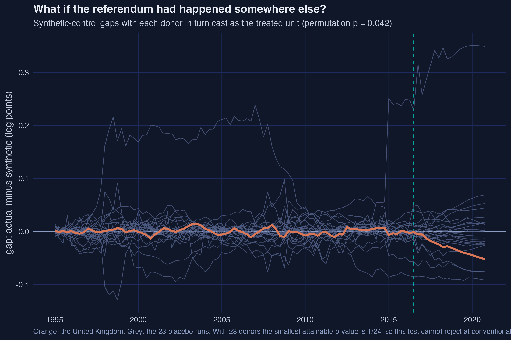

**Interpretation.** The UK's post-treatment fit error is **5.8 times** its pre-treatment fit error, and that ratio is the **largest of all 24 countries**. The permutation p-value is therefore **0.042**, the smallest value this design can produce. Visually, the orange line leaves the grey band shortly after the referendum and never returns.

The `synthdid` placebo standard error tells a more sobering story: **0.0096 log points**, which puts a conventional 95% interval around the SDID estimate at roughly **0.9% to 4.6%**. The point estimate is much better determined than the interval, which is the normal state of affairs with one treated unit and 23 donors. Anyone quoting "Brexit cost 2.8% of GDP" without that interval is overstating what this design can deliver.

### 18.2 What this can and cannot tell you

Three caveats, all of which matter.

First, with 23 donors the finest attainable p-value is $1/24 \approx 0.042$. The test simply cannot reject at the 1% level no matter how extreme the UK looks. This is a property of the design, not of Brexit.

Second, this is randomisation inference: it asks *how unusual is the United Kingdom among OECD countries*, not *what is the sampling error of this estimate*. Those are different questions, and only the first one has a well-defined answer here.

Third, for a genuinely model-based alternative, the source paper itself points to the conformal-inference approach of Chernozhukov, Wüthrich and Zhu [16], which `augsynth` implements and which [the Kansas tutorial](/post/r_augsynth/) works through in detail.

## 19. Discussion

**What Brexit cost.** Taking the ladder as a whole, the referendum had cost the UK somewhere between **2.7% and 3.1% of GDP by the end of 2018**, and between **3.8% and 4.2% by the end of 2019**. That is above the 2.4% previously published for this dataset, and the reason is not exotic: the earlier figure came from a specification that matched on covariates, and covariates make the counterfactual worse here rather than better.

Three caveats belong with that number. It is a *net* gap between the UK and a blend of OECD economies, not a Brexit-only effect — anything else distinctive that happened to the UK after mid-2016 is inside it. The no-interference assumption is strong over a four-year horizon when the United States carries a fifth of the weight in the counterfactual. And the estimate is a point on a specification cloud, not a parameter that has been pinned down.

**What the ladder taught.** The durable idea is the bias decomposition, not the leaderboard. Extrapolation bias and interpolation bias are separate failures with separate fixes, unit weights address the first, time weights address the second, and any weighted counterfactual you ever build can be interrogated on both counts. The ranking of estimators on this dataset is far more perishable — it depends on the outcome behaving like a random walk, on a long pre-period and on a treated unit that sits inside the convex hull.

It also cuts the other way, and the source paper says so plainly: SDID's advantage over DSC is marginal once you count the 85 extra parameters it estimates, and neither MASC nor ASCM justifies its computational cost here. Our own placebo results agree — the whole SDID family clusters together, and the gap down to DSC is smaller than the gap between covariates and no covariates.

**So what should you actually do?** Fit the ladder, not a rung. Run an in-sample placebo tournament and check that the horizons are matched. Report the range. If one specification is going to be the headline, choose it before you see the estimates, and show the others anyway. Ferman, Pinto and Possebom [15] have documented how much room for cherry-picking this literature leaves; the honest response is to publish the cloud.

## 20. Summary and next steps

- **Every estimator here is one weighted two-way regression** with a different choice of unit weights $\omega$, time weights $\lambda$, and whether the unit fixed effect is switched on. DiD, SC, DSC and SDID are four settings of the same expression; MASC and ASCM change the feasible set instead.
- **One solver does five jobs.** The simplex least-squares problem solves the unit weights, the demeaned unit weights, the time weights (on the transpose) and both components of MASC's cross-validation.
- **The Brexit cost is 2.7–3.1% at end-2018 and 3.8–4.2% at end-2019**, above the previously published 2.4%, and the difference is driven mostly by the covariate specification.
- **The SDID family wins the placebo tournament** at either forecast horizon, but the published ranking *within* that family does not survive matching the horizons.
- **Covariates hurt here.** With 86 pre-treatment outcomes already in the matching set, six extra badly-scaled predictors add estimation noise without adding identification.
- **Two practical traps** cost real accuracy: `masc`'s fold argument silently produces five folds instead of eighty, and a flat objective means `synthdid`'s optimiser stops on its iteration cap rather than at the optimum.

Where to go next: [multi-country and staggered adoption with `multisynth`](/post/r_sc_multi_country/), [the same SDID estimator in Stata on Proposition 99](/post/stata_sdid/), or [manual demeaning and the FWL theorem](/post/r_demeaning_twfe/) if the unit-fixed-effect story in rung three felt too quick. The Monte Carlo study in the source paper, which stress-tests this ranking on simulated data, is the subject of a future post.

## 21. Exercises

1. **Move the treatment date.** Re-run SC and SDID (i) dating the treatment at 2016Q1 rather than 2016Q2 or 2016Q3. Which estimator moves more, and can you explain why using the time-weight figure?

2. **Read the simplex.** Using `simplex_ls`, solve the SC problem restricted to just the United States, Hungary and Canada, and plot the objective over the triangle. Now add Japan as a fourth donor. By how much does the pre-treatment MSPE fall?

3. **Break DSC on purpose.** Add a constant of 0.05 log points to *every* UK observation, before and after the referendum. Which of SC, DSC and SDID change their estimated effect, and which do not? Explain the result using the unit fixed effect $\alpha\_j$ in the master regression.

4. **Force the time weights to spread out.** Re-run SDID on first-differenced log GDP instead of levels. Does the spike on the final quarter survive? Then argue, using the source paper's own reasoning, why the authors declined to make this switch in their headline results.

5. **Finish the horizon audit.** Section 15.3 matched the horizons for the placebo tournament. Extend it to $h = 2$ and $h = 8$. Is the SDID family's advantage over SC stable in the horizon, or does it shrink?

6. **Separate MASC's two dials.** Compute the 2018Q4 estimate for $\phi$ on a grid from 0 to 1 in steps of 0.05, holding $m = 10$. How much of the difference between MASC's 2.73% and SC's 3.06% is due to the chosen $\phi$ rather than to the choice of $m$?

7. **Drop the biggest donor.** The United States carries about a fifth of the weight in most specifications, and spillover risk is concentrated in the highest-weighted donors. Re-run the entire ladder without the United States. Does your conclusion about Brexit change? Then ask the harder question: does your conclusion about *which estimator to use* change?

8. **Build your own rung.** DSC and SDID differ only in how the bias adjustment is weighted across pre-periods — flat in one, optimised in the other. Propose a third weighting, for example exponentially decaying weights with a half-life you choose, implement it, and enter it in the placebo tournament. Does it beat SDID?

## 22. References

1. de Brabander, E., Juodis, A., & Miyazato Szini, G. (2025). [On the use of synthetic difference-in-differences approach with (-out) covariates: The case study of Brexit referendum](https://doi.org/10.1080/07474938.2025.2530649). *Econometric Reviews*, 44(10), 1617–1646.
2. Born, B., Müller, G. J., Schularick, M., & Sedláček, P. (2019). [The costs of economic nationalism: Evidence from the Brexit experiment](https://doi.org/10.1093/ej/uez020). *The Economic Journal*, 129(623), 2722–2744.
3. Abadie, A., & Gardeazabal, J. (2003). [The economic costs of conflict: A case study of the Basque Country](https://doi.org/10.1257/000282803321455188). *American Economic Review*, 93(1), 113–132.
4. Abadie, A., Diamond, A., & Hainmueller, J. (2010). [Synthetic control methods for comparative case studies](https://doi.org/10.1198/jasa.2009.ap08746). *Journal of the American Statistical Association*, 105(490), 493–505.
5. Abadie, A., Diamond, A., & Hainmueller, J. (2015). [Comparative politics and the synthetic control method](https://doi.org/10.1111/ajps.12116). *American Journal of Political Science*, 59(2), 495–510.
6. Abadie, A. (2021). [Using synthetic controls: Feasibility, data requirements, and methodological aspects](https://doi.org/10.1257/jel.20191450). *Journal of Economic Literature*, 59(2), 391–425.
7. Rubin, D. B. (1974). [Estimating causal effects of treatments in randomized and nonrandomized studies](https://doi.org/10.1037/h0037350). *Journal of Educational Psychology*, 66(5), 688–701.
8. Doudchenko, N., & Imbens, G. W. (2016). [Balancing, regression, difference-in-differences and synthetic control methods: A synthesis](https://doi.org/10.3386/w22791). NBER Working Paper 22791.
9. Ferman, B., & Pinto, C. (2021). [Synthetic controls with imperfect pretreatment fit](https://doi.org/10.3982/QE1596). *Quantitative Economics*, 12(4), 1197–1221.
10. Arkhangelsky, D., Athey, S., Hirshberg, D. A., Imbens, G. W., & Wager, S. (2021). [Synthetic difference-in-differences](https://doi.org/10.1257/aer.20190159). *American Economic Review*, 111(12), 4088–4118.
11. Kellogg, M., Mogstad, M., Pouliot, G. A., & Torgovitsky, A. (2021). [Combining matching and synthetic control to trade off biases from extrapolation and interpolation](https://doi.org/10.1080/01621459.2021.1979562). *Journal of the American Statistical Association*, 116(536), 1804–1816.
12. Ben-Michael, E., Feller, A., & Rothstein, J. (2021). [The augmented synthetic control method](https://doi.org/10.1080/01621459.2021.1929245). *Journal of the American Statistical Association*, 116(536), 1789–1803.
13. Kaul, A., Klößner, S., Pfeifer, G., & Schieler, M. (2022). [Standard synthetic control methods: The case of using all preintervention outcomes together with covariates](https://doi.org/10.1080/07350015.2021.1930012). *Journal of Business & Economic Statistics*, 40(3), 1362–1376.
14. Botosaru, I., & Ferman, B. (2019). [On the role of covariates in the synthetic control method](https://doi.org/10.1093/ectj/utz001). *The Econometrics Journal*, 22(2), 117–130.
15. Ferman, B., Pinto, C., & Possebom, V. (2020). [Cherry picking with synthetic controls](https://doi.org/10.1002/pam.22206). *Journal of Policy Analysis and Management*, 39(2), 510–532.
16. Chernozhukov, V., Wüthrich, K., & Zhu, Y. (2021). [An exact and robust conformal inference method for counterfactual and synthetic controls](https://doi.org/10.1080/01621459.2021.1920957). *Journal of the American Statistical Association*, 116(536), 1849–1864.
17. Di Stefano, R., & Mellace, G. (2024). [The inclusive synthetic control method](https://arxiv.org/abs/2403.17624). arXiv:2403.17624.
18. Tashman, L. J. (2000). [Out-of-sample tests of forecasting accuracy: An analysis and review](https://doi.org/10.1016/S0169-2070%2800%2900065-0). *International Journal of Forecasting*, 16(4), 437–450.
19. Software: [`synthdid`](https://github.com/synth-inference/synthdid) · [`Synth`](https://CRAN.R-project.org/package=Synth) · [`masc`](https://github.com/maxkllgg/masc) · [`augsynth`](https://github.com/ebenmichael/augsynth) · [`quadprog`](https://CRAN.R-project.org/package=quadprog)
20. Companion tutorials on this site: [Synthetic control on the Basque Country](/post/r_basic_synthetic_control/) · [Augmented synthetic control and the Kansas tax cuts](/post/r_augsynth/) · [Synthetic difference-in-differences on Proposition 99](/post/stata_sdid/) · [Manual demeaning and two-way fixed effects](/post/r_demeaning_twfe/) · [Multi-country augmented synthetic control](/post/r_sc_multi_country/)

#### Acknowledgements

AI tools (Claude Code, Gemini, NotebookLM) were used to make the contents of this post more accessible to students. Nevertheless, the content in this post may still have errors. Caution is needed when applying the contents of this post to true research projects.
