---
authors:
  - admin
categories:
  - R
  - Synthetic Control
draft: false
featured: false
date: "2026-06-05T00:00:00Z"
external_link: ""
image:
  caption: ""
  focal_point: Smart
  placement: 3
links:
- icon: chalkboard-teacher
  icon_pack: fas
  name: "Slides (HTML)"
  url: slides/index.html
- icon: laptop-code
  icon_pack: fas
  name: "Web app"
  url: web_app/index.html
- icon: file-pdf
  icon_pack: fas
  name: "Slides (PDF)"
  url: https://carlos-mendez.org/post/r_sc_multi_country/slides.pdf
- icon: code
  icon_pack: fas
  name: "R script"
  url: analysis.R
- icon: file-code
  icon_pack: fas
  name: "Quarto project (.zip)"
  url: r_sc_multi_country.zip
- icon: book
  icon_pack: fas
  name: "Data dictionary"
  url: data/index.html
- icon: podcast
  icon_pack: fas
  name: AI Podcast
  url: "/post/r_sc_multi_country/#podcast-player"
- icon: markdown
  icon_pack: fab
  name: "MD version"
  url: https://raw.githubusercontent.com/cmg777/starter-academic-v501/master/content/post/r_sc_multi_country/index.md
slides:
summary: "A hands-on tour of the Augmented Synthetic Control Method in a multi-country setting with the augsynth package — learning single_augsynth, multisynth, and augsynth_multiout on simulated data, then replicating Papaioannou (2021) on the EMU and productivity convergence."
tags:
- r
- causal inference
- panel data
- synthetic control
title: "Augmented Synthetic Control for Multiple Countries: A Tutorial with augsynth"
url_code: ""
url_pdf: ""
url_slides: ""
url_video: ""
toc: true
diagram: true
---

## Abstract

Many policy evaluations in cross-country economics hinge on a counterfactual we never observe—the path a country would have followed without the policy—and classic synthetic control methods (SCM) deliver credible estimates only when a small, structurally heterogeneous donor pool can reproduce the treated unit's pre-treatment trajectory almost perfectly. This tutorial demonstrates the Augmented Synthetic Control Method (ASCM) of Ben-Michael, Feller, and Rothstein (2021), which adds a doubly-robust Ridge outcome model to correct residual bias, in a multi-country setting using the R package augsynth and its three entry points (single_augsynth, multisynth, augsynth_multiout). It first validates each function on a simulated panel of 25 countries over 39 years (1985–2023, 975 rows) with a known injected effect, then qualitatively replicates Papaioannou (2021) on a balanced panel of 36 countries from 1980 to 2017 (12 founding euro members and 24 non-euro donors) drawn from the Penn World Tables. On simulated data all three estimators recover the truth closely—single_augsynth returns +6.241 against a true +6.250, the pooled multisynth effect is 3.222 versus 3.155, and augsynth_multiout recovers +6.538 and +3.531—while a suitability test shows Ridge-ASCM correcting a sign error that plain SCM cannot, cutting the mean recovery error from 0.737 to 0.128. On the real euro-area data, synthetic Germany's TFP runs +0.133 above its counterfactual (about +8.0% over 2000–2007 and +19.3% over 2008–2017), the pooled euro effect is a non-significant −0.016 that masks a +0.39 early bump erased by the 2008–2014 crisis, and the ASCM percentage effects correlate with the paper's at a Spearman 0.74. The exercise shows that validating a causal estimator against simulated ground truth, leaning on augmentation only when the pre-treatment fit demands it, matching inference tools to the estimator, and reading dynamics rather than averages together make synthetic-control analysis of multiple countries honest and reproducible.

## 1. Overview

Did joining the euro make countries more productive? Did a national reform pay off, or
would the country have done just as well without it? Questions like these share an
awkward feature: we never observe the **counterfactual** — the path a country *would*
have followed had it not adopted the policy. We see only the world that happened.

The **synthetic control method (SCM)** answers this by building the missing
counterfactual from data. Among countries that did *not* adopt the policy, it finds the
*weighted recipe* whose pre-treatment trajectory looks indistinguishable from the
treated country's, and uses that "synthetic" twin as the stand-in for the absent
counterfactual. If the pre-treatment match is good, the post-treatment gap between the
actual country and its synthetic version is the most credible estimate of the policy's
effect.

Classic SCM, however, has a well-known weak spot: it only works when the donor pool can
reproduce the treated country's pre-treatment path *almost perfectly*. In cross-country
work the donor pool is small and countries are structurally different, so a good match
is the exception, not the rule. The **Augmented Synthetic Control Method (ASCM)** of
Ben-Michael, Feller, and Rothstein (2021) fixes this by adding an **outcome model** that
estimates and removes the leftover bias when the pre-treatment fit is imperfect — the
same doubly-robust idea behind augmented inverse-probability weighting. When the fit is
already good, the augmentation does almost nothing; when it is poor, it rescues the
estimate.

This tutorial is a hands-on tour of ASCM in a **multi-country** setting using the
[`augsynth`](https://github.com/ebenmichael/augsynth) package. It has two parts. In
**Part 1** we work with *simulated* data where the true effect is known, so we can
introduce the three `augsynth` entry points and *verify* that each one recovers the
truth:

- `single_augsynth` — one treated unit (the building block),
- `multisynth` — many treated units with staggered adoption,
- `augsynth_multiout` — one treated unit with several outcomes.

We save the simulated panel to a CSV you can reuse, and we run a small **suitability
test** that shows exactly where plain SCM fails and augmentation saves the day. In
**Part 2** we put the method to work on real data, *qualitatively replicating*
Papaioannou (2021), "European monetary integration, TFP and productivity convergence,"
which asks whether the 12 founding members of the euro area saw faster total factor
productivity (TFP) growth than a synthetic counterfactual built from non-euro economies.

**Learning objectives:**

- Distinguish the three `augsynth` entry points and recognize which one a problem calls for
- Read the `augsynth` formula mini-language (`outcome ~ treatment | covariates`)
- Use simulated data with a *known* effect to validate a causal estimator before trusting it on real data
- Explain when augmentation (the Ridge outcome model) matters and when it does not
- Replicate the qualitative findings of a published synthetic-control paper and compare estimates honestly
- Use `augsynth`'s inference toolbox — jackknife+, conformal, jackknife, and the wild bootstrap — and explain what makes an estimated effect *statistically significant*

The diagram below maps the three functions onto one pipeline.

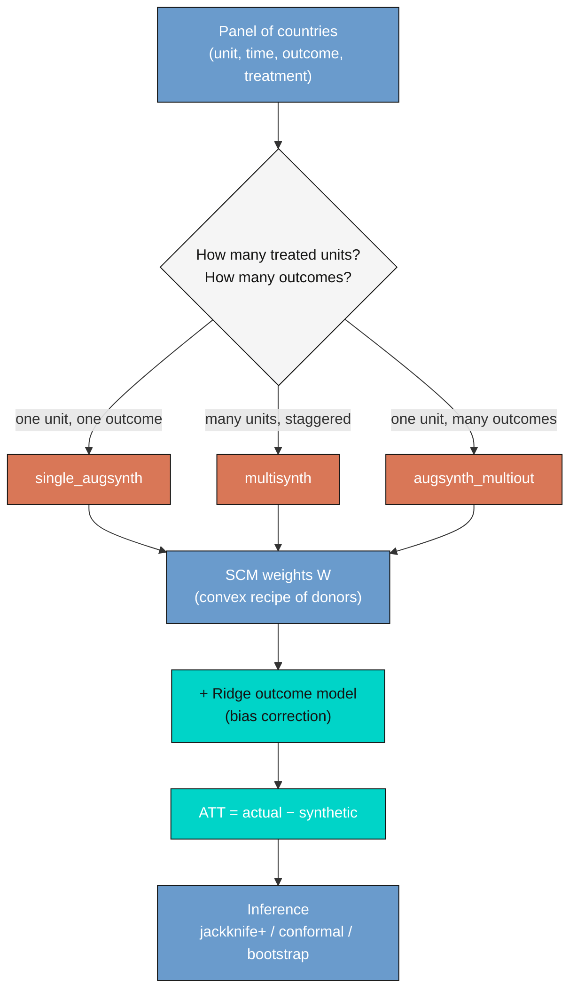
```mermaid
flowchart TD
    P["Panel of countries<br/>(unit, time, outcome, treatment)"] --> D{"How many treated units?<br/>How many outcomes?"}
    D -->|one unit, one outcome| S["single_augsynth"]
    D -->|many units, staggered| M["multisynth"]
    D -->|one unit, many outcomes| O["augsynth_multiout"]
    S --> W["SCM weights W<br/>(convex recipe of donors)"]
    M --> W
    O --> W
    W --> R["+ Ridge outcome model<br/>(bias correction)"]
    R --> A["ATT = actual − synthetic"]
    A --> I["Inference<br/>jackknife+ / conformal / bootstrap"]
    style P fill:#6a9bcc,stroke:#141413,color:#fff
    style D fill:#f5f5f5,stroke:#141413,color:#141413
    style S fill:#d97757,stroke:#141413,color:#fff
    style M fill:#d97757,stroke:#141413,color:#fff
    style O fill:#d97757,stroke:#141413,color:#fff
    style W fill:#6a9bcc,stroke:#141413,color:#fff
    style R fill:#00d4c8,stroke:#141413,color:#141413
    style A fill:#00d4c8,stroke:#141413,color:#fff
    style I fill:#6a9bcc,stroke:#141413,color:#fff
```

The routing is by *shape*, not difficulty: count the treated units and the outcomes, and the
panel flows to one of the three functions. All three then converge on the same machinery — a
synthetic counterfactual built from convex donor weights, optionally refined by the Ridge
bias-correction step, with the ATT read off as actual minus synthetic.

### Key concepts at a glance

This post leans on a small vocabulary repeatedly. Each concept below has three parts.
The **definition** is always visible; the **example** and **analogy** sit behind
clickable cards — open them when a term feels slippery, leave them collapsed for a quick
scan.

**1. Synthetic control method (SCM).**
A weighted average of donor (untreated) units, built so that its pre-treatment path
matches the treated unit. The synthetic's post-treatment trajectory is the estimated
counterfactual; the gap to the actual unit is the treatment effect (ATT).

<div class="concept-pair">
<details class="concept-card concept-example">
<summary>Example</summary>

We build a "Synthetic Germany" from a weighted blend of 24 non-euro economies, chosen so
that pre-1999 German TFP matches the real thing. After 1999, the gap between actual and
synthetic Germany estimates the euro's effect on productivity.

</details>

<details class="concept-card concept-analogy">
<summary>Analogy</summary>

A stunt double assembled from many extras. Before the dangerous scene (treatment) the
double mimics the star perfectly; during the scene it shows what would have happened to
the star.

</details>
</div>

**2. Augmented SCM (ASCM) and bias correction.**
Plain SCM is only unbiased when the pre-treatment fit is (near) perfect. ASCM fits an
**outcome model** on the donors and subtracts the part of the gap that model predicts —
a *bias correction*. If the fit is already perfect the correction is zero; if not, it
removes leftover imbalance.

<div class="concept-pair">
<details class="concept-card concept-example">
<summary>Example</summary>

For a treated unit sitting outside the donor pool's range, plain SCM cannot match the
pre-period and even gets the *sign* of the effect wrong. Ridge-augmented SCM closes the
pre-treatment gap and recovers the true effect (we see exactly this for unit C05 below).

</details>

<details class="concept-card concept-analogy">
<summary>Analogy</summary>

Tarring a wall, then touching up with a brush. SCM lays down the broad coat (weights);
the outcome model paints over the spots the roller could not reach (residual bias).

</details>
</div>

**3. Donor pool and convex weights** $W$.
The donors are the untreated units the synthetic is built from. The weights are
non-negative and sum to one (a *convex* combination), so the synthetic is an
interpolation, never an extrapolation, of the donors.

<div class="concept-pair">
<details class="concept-card concept-example">
<summary>Example</summary>

Synthetic C01 is roughly "28% C19 + 21% C09 + 16% C13 + 11% C23 + 10% C08." The weights
add to one; every other donor gets weight zero. (Several donor recipes can reproduce the
same factor structure, so the recovered weights need not be the exact ones we built C01
from — what matters is that the synthetic path matches.)

</details>

<details class="concept-card concept-analogy">
<summary>Analogy</summary>

A recipe whose proportions sum to 100%. You can blend the donor ingredients but never
use a negative amount of flour.

</details>
</div>

**4. Prognostic (outcome) model — `progfunc`.**
The model ASCM uses to predict each unit's untreated outcome. `progfunc = "None"` gives
plain SCM; `progfunc = "ridge"` fits a Ridge regression on lagged outcomes and is the
default, because it also supports valid confidence intervals.

<div class="concept-pair">
<details class="concept-card concept-example">
<summary>Example</summary>

`augsynth(y ~ trt, unit, time, data, progfunc = "ridge", scm = TRUE)` runs Ridge-ASCM;
swapping in `progfunc = "None"` runs the classic Abadie estimator.

</details>

<details class="concept-card concept-analogy">
<summary>Analogy</summary>

A spell-checker for your counterfactual. SCM writes the first draft; the Ridge model
flags and fixes the systematic typos.

</details>
</div>

**5. Staggered adoption and partial pooling — `multisynth`, `nu`.**
When many units adopt at different times, `multisynth` fits one synthetic control per
treated unit and *partially pools* them. The pooling knob `nu` runs from 0 (each unit
separate) to 1 (one shared control); `augsynth` picks it automatically.

<div class="concept-pair">
<details class="concept-card concept-example">
<summary>Example</summary>

Five simulated countries adopt in 2010, 2013, and 2016. `multisynth` returns a pooled
average effect *and* a per-country effect, with `nu = 0.58` chosen automatically.

</details>

<details class="concept-card concept-analogy">
<summary>Analogy</summary>

Grading essays with a rubric. Pure pooling treats every student identically; no pooling
grades each in a vacuum; partial pooling borrows a little strength from the class
average to stabilize each grade.

</details>
</div>

**6. Multiple outcomes — `augsynth_multiout`.**
One treated unit can be tracked on several outcomes at once. A single set of donor
weights is chosen to balance *all* outcomes jointly, which borrows strength across
correlated series.

<div class="concept-pair">
<details class="concept-card concept-example">
<summary>Example</summary>

`augsynth_multiout(tfp + prod_gap ~ trt, ...)` builds one synthetic Germany that
matches both TFP and the productivity gap vs the USA before 1999.

</details>

<details class="concept-card concept-analogy">
<summary>Analogy</summary>

One tailored suit fitted to several measurements at once — chest, sleeve, and waist —
rather than three separate jackets.

</details>
</div>

**7. Inference: an `augsynth` toolbox.**
A point estimate is only half the answer; we also need to know whether it is
distinguishable from zero. `augsynth` offers several tools. For a single unit we report
the robust **jackknife+** confidence interval (`inf_type = "jackknife+"`) and the
**conformal** p-value (`inf_type = "conformal"`); for many units, `multisynth` offers a
**jackknife** interval and the more conservative **wild bootstrap**
(`inf_type = "bootstrap"`); for multiple outcomes, conformal returns a p-value per
outcome. Section&nbsp;9 makes this concrete.

<div class="concept-pair">
<details class="concept-card concept-example">
<summary>Example</summary>

On the simulated panel the pooled `multisynth` effect is significant under the jackknife
(`[0.69, 5.75]`, excludes zero) but *not* under the wild bootstrap (`[-2.47, 9.78]`) —
the same estimate, a different verdict. The method matters.

</details>

<details class="concept-card concept-analogy">
<summary>Analogy</summary>

Two bathroom scales. The jackknife reads your weight precisely; the wild bootstrap adds
the uncertainty of the scale itself and reports a wider range. Neither is "wrong" — they
answer slightly different questions.

</details>
</div>

---

## 2. Setup

`augsynth` is **not on CRAN**, so we install it from GitHub (pinned to a specific commit
for reproducibility). We also load `Synth` (a dependency), `haven` (to read the Stata
file in Part 2), and the usual tidyverse plotting tools. Everything below was executed
with R 4.5.2, `augsynth` 0.2.0, and `Synth` 1.1.10.

```r
# augsynth is installed from GitHub (run once):
# remotes::install_github("ebenmichael/augsynth@7a90ea4")

library(augsynth)
library(haven)     # read the Stata .dta in Part 2
library(dplyr)
library(tidyr)
library(ggplot2)

set.seed(20260605)

# Site colour palette
STEEL_BLUE  <- "#6a9bcc"   # synthetic control
WARM_ORANGE <- "#d97757"   # treated / actual
NEAR_BLACK  <- "#141413"   # truth / reference
TEAL        <- "#00d4c8"   # ridge-augmented / highlight
```

A note on the formula mini-language you will see throughout: `augsynth` takes
`outcome ~ treatment` on the left, and optional matching covariates after a pipe,
`outcome ~ treatment | x1 + x2`. The `unit` and `time` arguments name the panel's
identifier columns, and `t_int` is the intervention time (for the single-unit
functions). The treatment column is a 0/1 indicator that turns on when treatment starts.

---

## 3. A two-country intuition example

Before any weighting machinery, here is the whole idea in two countries. We simulate a
treated country, "Atlantia," whose untreated path is a clean copy of a comparison
country, "Borealis," plus an injected effect that switches on in 2012 and grows by
`1.5` units per year. Because Borealis *is* the counterfactual by construction, the gap
after 2012 must equal the injected effect.

```r
years   <- 2000:2023
t_int   <- 2012
trend   <- 40 + 1.2 * (years - 2000) + 3 * sin(2 * pi * (years - 2000) / 9)
control <- trend + rnorm(length(years), 0, 0.6)
true_effect <- ifelse(years >= t_int, 1.5 * (years - t_int + 1), 0)
treated <- trend + rnorm(length(years), 0, 0.6) + true_effect

mean(treated[years >= t_int] - control[years >= t_int])  # estimated gap
mean(true_effect[years >= t_int])                         # true effect
```

```text
[1] 9.601    # estimated mean post-2012 gap
[1] 9.75     # true mean injected effect
```

The estimated post-2012 gap is **9.60** against a true mean effect of **9.75** — within
1.5%. This is synthetic control in its simplest possible form: a single, perfectly
matched comparison. The figure makes the logic visible — the two lines are
indistinguishable before 2012, then Atlantia pulls away by exactly the injected amount.

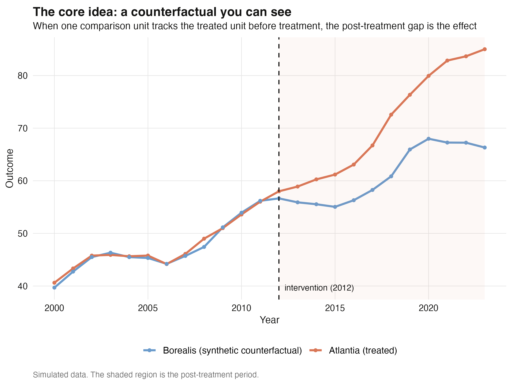

The catch, of course, is that real comparison countries are never perfect twins. That is
why we need a *weighted* combination of many donors — and, when even that is not enough,
the augmentation step. The rest of Part 1 builds up to both.

---

## 4. One reusable simulated panel

We now build a richer panel that all three functions will share. It has **25 countries
over 39 years (1985–2023)**: five treated units (`C01`–`C05`) and twenty never-treated
donors (`C06`–`C25`). The long pre-period is deliberate — it gives the inference
procedures in Section&nbsp;9 the statistical power they need. The data come from a
three-factor model plus a unit fixed effect, so a good synthetic control genuinely
exists. Treated units C01–C04 are each a **sparse convex blend of three named donors**
(so a near-perfect synthetic control is guaranteed), while **C05 is placed deliberately
outside the donor hull** to stress-test the methods later.

Treatment is **staggered**: C01 and C02 adopt in 2010, C03 in 2013, and C04 and C05 in
2016. The effect on the primary outcome `gdp_index` is a **jump at adoption plus a gentle
yearly ramp** (with a correlated 0.6× effect on a second outcome `trade_index`). C01–C04
get large positive effects (a jump of +2.0 to +3.5 plus a +0.3 to +0.5 ramp); crucially,
**C05's effect is small and negative** (a −1.0 jump, −0.05 ramp), mimicking the
real-world fact that a few euro members underperformed.

```r
# ... factor-model construction (see analysis.R) ...
adopt <- c(C01 = 2010, C02 = 2010, C03 = 2013, C04 = 2016, C05 = 2016)
jump  <- c(C01 = 3.0, C02 = 2.5, C03 = 3.5, C04 = 2.0, C05 = -1.0)   # level shift
slope <- c(C01 = 0.5, C02 = 0.4, C03 = 0.5, C04 = 0.3, C05 = -0.05)  # yearly ramp

write.csv(panel, "synthetic_panel_multicountry.csv", row.names = FALSE)
```

```text
Saved synthetic_panel_multicountry.csv: 25 units x 39 years = 975 rows
Adoption schedule: C01 2010  C02 2010  C03 2013  C04 2016  C05 2016
True outcome-1 jump at adoption: C01 3.0  C02 2.5  C03 3.5  C04 2.0  C05 -1.0
True outcome-1 yearly ramp:      C01 0.5  C02 0.4  C03 0.5  C04 0.3  C05 -0.05
```

The saved file ships with extra columns most real datasets never give you: the *true*
counterfactual (`gdp_index_cf`, `trade_index_cf`) and the *true* injected effect
(`true_effect_gdp`, `true_effect_trade`). Those let us grade every estimate against
ground truth. Below, the twenty donor paths (grey) surround the five treated paths
(colored), with dots marking each unit's adoption year.

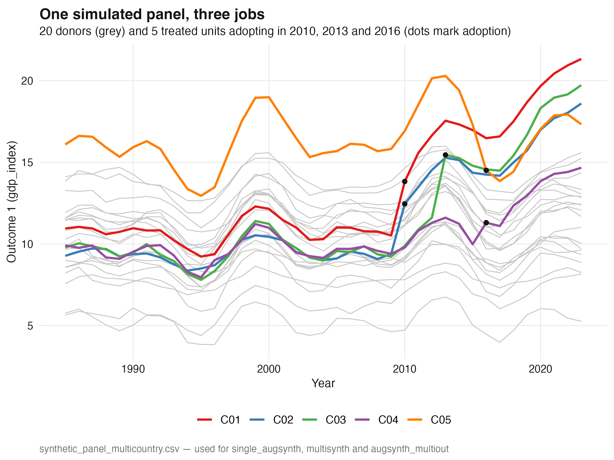

Two display equations capture what every `augsynth` call is doing under the hood. First,
the **SCM weight problem**: find the convex donor weights $W$ that best match the treated
unit's pre-treatment vector.

$$W^{\star} = \arg\min\_{W \in \Delta} \lVert X\_1 - X\_0 W \rVert\_V
\qquad \text{subject to} \qquad w\_j \ge 0, \quad \sum\_j w\_j = 1$$

Here $X\_1$ is the treated unit's pre-treatment outcomes (and any covariates), $X\_0$ is
the matching donor matrix (one column per donor), $W$ is the vector of donor weights,
$V$ weights the predictors, and $\Delta$ is the simplex (the constraint that weights are
non-negative and sum to one). The solution $W^{\star}$ is the "recipe" for the synthetic
control.

Second, the **augmented, bias-corrected estimator**. ASCM starts from the SCM gap and
subtracts what an outcome model $\widehat{m}\_t(\cdot)$ predicts the residual imbalance
should be:

$$\widehat{\tau}\_t^{\mathrm{aug}} =
\Big(Y\_{1t} - \sum\_j w\_j Y\_{jt}\Big) - \Big(\widehat{m}\_t(X\_1) - \sum\_j w\_j \widehat{m}\_t(X\_j)\Big)$$

The first term is the ordinary SCM gap (actual treated minus weighted donors at time
$t$). The second term is the correction: $\widehat{m}\_t$ is the prognostic model (a
Ridge regression when `progfunc = "ridge"`), evaluated at the treated unit's covariates
versus the donors'. When the pre-treatment fit is perfect the donors already reproduce
$\widehat{m}\_t(X\_1)$, so the correction vanishes and ASCM equals SCM. When the fit is
poor, the correction removes the leftover bias. This is the doubly-robust safety net.

---

## 5. One treated unit: `single_augsynth`

The simplest case has one treated unit. We isolate `C01` together with the twenty
donors (never mixing in the other treated units — that would contaminate the donor pool),
build the treatment indicator, and fit both plain SCM (`progfunc = "None"`) and
Ridge-ASCM (`progfunc = "ridge"`). The top-level `augsynth()` function dispatches to
`single_augsynth()` automatically when it sees one treated unit and one intervention
time.

```r
sim_single <- panel |>
  filter(country %in% c("C01", donors)) |>
  mutate(trt = as.integer(country == "C01" & year >= 2010))

sc_plain <- augsynth(gdp_index ~ trt, country, year, sim_single,
                     t_int = 2010, progfunc = "None",  scm = TRUE)
sc_ridge <- augsynth(gdp_index ~ trt, country, year, sim_single,
                     t_int = 2010, progfunc = "ridge", scm = TRUE)

# jackknife+ confidence interval (robust) and conformal p-value
summary(sc_plain, inf_type = "jackknife+")$average_att
summary(sc_plain, inf_type = "conformal")$average_att
```

```text
C01 true average post ATT : +6.250
Plain SCM  avg ATT : +6.241  jackknife+ [5.998, 6.506]  conformal p<0.001  L2=0.135
Ridge-ASCM avg ATT : +6.241  jackknife+ [5.998, 6.506]  conformal p<0.001  L2=0.135  lambda=2639
```

Both estimators nail the truth: the true average effect of C01 is **+6.250** and each
method returns **+6.241**, an error of 0.1%. And the effect is unambiguously real — the
**jackknife+ 95% confidence interval is `[5.998, 6.506]`, comfortably excluding zero**,
and the conformal p-value is below 0.001. Notice that plain SCM and Ridge-ASCM give *the
same answer here*. That is not a coincidence — C01 sits comfortably inside the donor hull,
so the pre-treatment fit is already good (scaled `L2` imbalance ≈ 0.14, well below the 1.0
you would get from naively averaging donors), and the Ridge penalty is driven to a large
value (`lambda` ≈ 2639) that all but switches the augmentation off. This is the "when fit
is good, ASCM ≈ SCM" principle in action.

The synthetic control reproduces C01's pre-2010 path closely and then diverges, exactly
as designed.

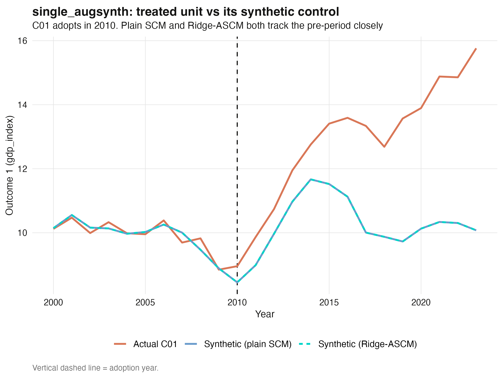

How well does the *dynamic* effect line up with the truth? The conformal gap plot
overlays the estimated treated-minus-synthetic gap (with its pointwise band) against the
true injected effect. The two are nearly on top of each other after 2010, while the
pre-period gap hovers around zero — the visual signature of a trustworthy synthetic
control.

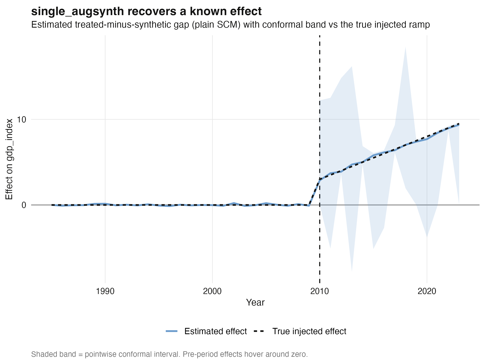

The donor recipe is sparse and interpretable: synthetic C01 is built mostly from five
donors (C19, C09, C13, C23, C08), with weights summing to one. This sparsity is a
hallmark of SCM and makes the counterfactual auditable.

---

## 6. Many treated units, staggered adoption: `multisynth`

Real multi-country studies rarely have a single treated unit. `multisynth` handles many
treated units that adopt at different times. It needs **no `t_int`** — it infers each
unit's adoption from when the treatment column switches from 0 to 1 — and it returns both
a **pooled average** effect and **per-unit** effects, partially pooling them for
stability.

```r
sim_multi <- panel |>
  filter(country %in% c(treated, donors)) |>
  select(country, year, treat_ms, gdp_index)

ms_sim <- multisynth(gdp_index ~ treat_ms, country, year, sim_multi)
summary(ms_sim, inf_type = "jackknife")$att    # primary: tight interval
set.seed(20260605)
summary(ms_sim, inf_type = "bootstrap")$att     # conservative comparison
```

```text
multisynth nu (auto) = 0.583 ; global scaled L2 = 0.052 ; n_leads = 8

Estimated vs TRUE average ATT (jackknife CI [ci_lo,ci_hi] + bootstrap CI [boot_lo,boot_hi]):
   level estimate  ci_lo ci_hi boot_lo boot_hi  truth
 Average    3.222  0.689 5.754  -2.468   9.779  3.155
     C01    4.756  4.461 5.050  -7.196  16.322  4.750
     C02    4.075  3.930 4.221  -6.000  13.800  3.900
     C03    5.362  5.154 5.570  -8.123  18.465  5.250
     C04    2.927  2.725 3.130  -4.499  10.072  3.050
     C05   -1.012 -1.639 -0.385 -3.039   1.195 -1.175
```

The pooled average effect is estimated at **3.222** against a true value of **3.155** —
recovery to within 2%. Just as importantly, every per-unit estimate has the **right sign
and the right ballpark**, including C05's *negative* effect (−1.012 estimated vs −1.175
true). On the inference side, the **jackknife confidence interval for the pooled effect is
`[0.689, 5.754]`, which excludes zero — the effect is significant.** The more conservative
**wild bootstrap gives `[-2.468, 9.779]`, which includes zero**: same estimate, but it
also propagates the counterfactual-estimation uncertainty, so it does not reach
significance. This is our first concrete example of *the inference method changing the
verdict* (Section&nbsp;9 returns to it). The automatically chosen pooling parameter
`nu = 0.58` sits between "fully separate" and "fully pooled," and the tiny global imbalance
(scaled `L2` = 0.05) tells us the joint synthetic controls fit the pre-period tightly.
(One subtlety: `multisynth` averages effects over a *common* window of `n_leads = 8`
post-treatment periods so that all units contribute equally — which is why the per-unit
estimates here, e.g. C01's **4.756**, are smaller than the full-period single_augsynth
estimate of **6.241**; we compute the truth over the same window to keep the comparison
fair.)

The per-unit dynamics confirm the recovery. Each panel shows one treated unit's estimated
effect by time-since-adoption against its true effect; the pre-period sits at zero and the
post-period jumps then climbs to meet the dashed truth line — with C05 dropping the
opposite way.

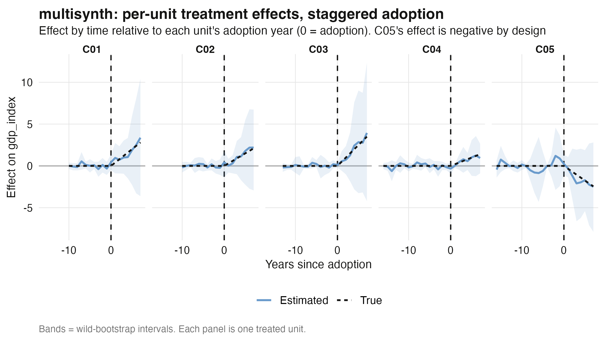

Averaging across the five heterogeneous units gives the pooled effect path, the single
most useful summary in a many-treated-unit study. The estimate tracks the true pooled
effect closely, and the figure shows **both** inference bands — the tighter blue
jackknife band (which excludes zero after adoption) and the wider orange wild-bootstrap
band (which does not).

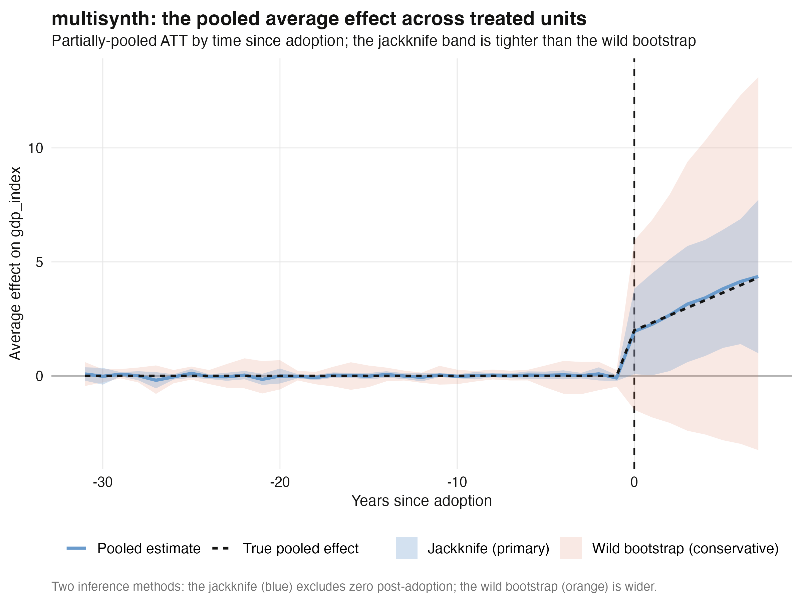

---

## 7. One unit, two outcomes: `augsynth_multiout`

Sometimes a policy plausibly moves several outcomes and we want one coherent
counterfactual for all of them. `augsynth_multiout` puts **multiple outcomes on the left
of the formula**, separated by `+`, and finds a single donor recipe that balances all of
them before treatment.

```r
mo <- augsynth_multiout(gdp_index + trade_index ~ trt, country, year,
                        t_int = 2010, sim_single,
                        progfunc = "None", scm = TRUE, combine_method = "avg")
summary(mo)$average_att   # conformal p-value per outcome
```

```text
      Outcome  Estimate  p_val
1   gdp_index    6.538   <0.001     (true +6.250)
2 trade_index    3.531   <0.001     (true +3.750)
```

With a single set of weights, the joint fit recovers **both** effects: `gdp_index` at
+6.538 (true +6.250) and the correlated `trade_index` at +3.531 (true +3.750), and **both
are significant** (conformal p &lt; 0.001 for each). The payoff of estimating them
together — rather than running two separate `single_augsynth` fits — is that the donor
weights must respect both series at once, which stabilizes the counterfactual when the
outcomes are correlated. (A practical note on inference: `augsynth_multiout`'s
`summary()` returns a conformal *p-value* per outcome but leaves the confidence-interval
bounds as `NA` — a full CI needs `grid_size > 1`, which costs `grid_size` raised to the
number-of-outcomes evaluations and, for effects this large, returns degenerate bounds. We
therefore report the p-value.)

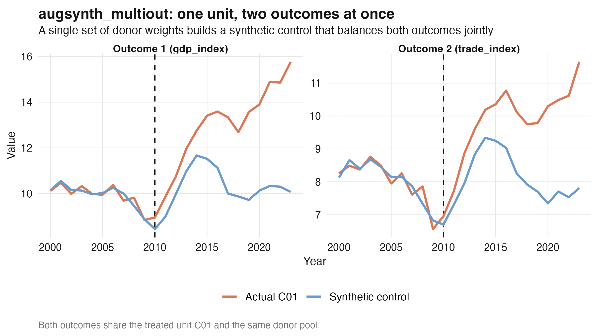

---

## 8. Testing suitability: where plain SCM fails and ASCM corrects

Now the payoff of building C05 *outside* the donor hull. No convex blend of the donors
can reproduce its pre-treatment path, so plain SCM is in trouble. We fit both estimators
for every treated unit and tabulate how far each lands from the known truth.

```r
# fit plain and ridge for each treated unit; compare to known effects
recovery   # per unit: truth, plain, ridge, jackknife+ CI, conformal p, pre-fit L2, errors
```

```text
 unit true_att att_plain att_ridge  ci_lo ci_hi p_plain sign_flip prefit_l2_plain err_plain err_ridge
  C01    6.250     6.241     6.241  5.998 6.506   0.000     FALSE           0.135     0.009     0.009
  C02    5.100     5.319     5.319  5.066 5.563   0.000     FALSE           0.150     0.219     0.219
  C03    6.000     6.282     6.282  5.958 6.624   0.000     FALSE           0.224     0.282     0.282
  C04    3.050     2.948     2.949  2.608 3.305   0.000     FALSE           0.258     0.102     0.101
  C05   -1.175     1.896    -1.145 -2.614 6.407   0.866      TRUE           0.414     3.071     0.030

Mean recovery error  — plain SCM: 0.737  | Ridge-ASCM: 0.128
C05 pre-fit scaled L2 — plain: 0.414  | ridge: 0.036 (lower = better fit)
```

This is the headline result of Part 1. For the four well-fit units (C01–C04), plain SCM
lands within ~0.3 of the truth and its **jackknife+ interval excludes zero** (all
significant; e.g. C01's `[5.998, 6.506]`). For **C05, plain SCM gets the sign wrong** — it
estimates +1.896 when the true effect is −1.175 — because it cannot match the pre-period
and the unmatched bias swamps the signal. Its interval `[-2.614, 6.407]` *includes* zero
(conformal p = 0.87): the estimate is both **wrong and not significant**, an honest double
failure. **Ridge-ASCM recovers −1.145**, almost exactly right, by closing the
pre-treatment gap (scaled `L2` falls from 0.41 to 0.04). Across all five units,
augmentation cuts the mean recovery error from **0.737 to 0.128**. For the four well-fit
units the two methods agree; augmentation earns its keep precisely on the hard case.

The picture says it all: under plain SCM the synthetic control (blue) drifts away from
actual C05 (orange) *before* treatment — a fatal sign of poor fit — while Ridge-ASCM pins
them together pre-2016, so the post-treatment gap can be trusted.

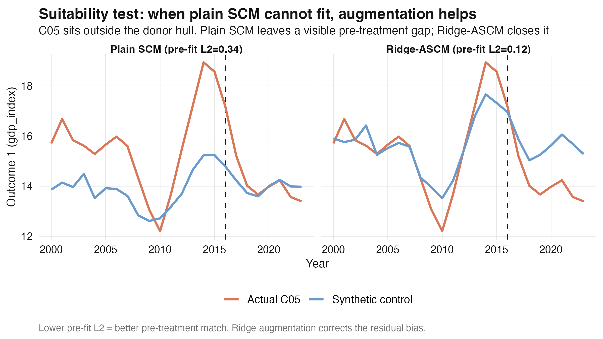

The practical rule: **always read the pre-treatment fit.** If the scaled `L2` imbalance is
small, plain SCM and ASCM will agree and either is fine. If it is large, trust the
augmented estimate — and be suspicious of any synthetic control whose pre-period does not
track.

---

## 9. Inference: is the effect real?

A point estimate answers "how big?"; inference answers "could this be noise?" A synthetic
control gap is a *difference between two estimated paths*, so it carries uncertainty even
when the point estimate is dead-on. `augsynth` ships several inference tools, and — this
is the part most tutorials gloss over — **they do not always agree**. Choosing one and
understanding what it measures is part of doing the method honestly.

**The three tools, matched to the three estimators.**

- **`single_augsynth` → jackknife+ (primary) and conformal.** The **jackknife+** interval
  (`summary(fit, inf_type = "jackknife+")`) leaves out one donor at a time, refits, and
  builds a robust confidence interval for the average effect. We saw it call C01's effect
  `[5.998, 6.506]` — comfortably away from zero. The **conformal** test
  (`inf_type = "conformal"`) is a permutation procedure that returns a p-value and a
  *pointwise* band over time (the shaded band in the gap figures). It is powerful when the
  pre-period is long relative to the post-period — which is exactly why this panel starts
  in **1985**, giving twenty-plus pre-treatment years — but its p-value is noisier and
  loses power when the post-window is long. With both tools agreeing here (jackknife+ CI
  excludes zero, conformal p &lt; 0.001), we can trust the result.
- **`multisynth` → jackknife (primary) and wild bootstrap.** The **jackknife** is the
  natural interval for an average *across* treated units; on the simulated panel it put the
  pooled effect at `[0.689, 5.754]`, **significant**. The **wild bootstrap** also
  propagates the counterfactual-estimation uncertainty, so it is wider — `[-2.468, 9.779]`,
  **not significant**. The estimate is identical; the verdict is not. Neither method is
  "wrong": the jackknife asks "is the average across these units different from zero?", the
  bootstrap asks "accounting for how hard each counterfactual was to build, is it?" When
  they disagree, say so.
- **`augsynth_multiout` → conformal.** Returns a p-value per outcome (both
  &lt; 0.001 for C01); a full confidence interval needs the slow `grid_size > 1` path.

**What drives significance.** Three levers widen a confidence interval and can push a real
effect below significance: **more noise**, **fewer pre-treatment periods** (a worse-pinned
counterfactual), and a **poorer pre-fit**. This is the same lesson the suitability test
taught from the other side — C05's poor fit (scaled `L2` = 0.41) gave it a wide interval
that swallowed zero, while C01's clean fit (`L2` = 0.14) produced a tight, significant one.
The **[interactive lab](web_app/index.html)** has a fifth tab, *Inference*, with a
significance scoreboard and a slider-driven simulator: move effect size, noise, and the
number of pre-periods and watch the interval widen or narrow and the verdict flip at the
5% line.

**The honest-reporting rule.** On simulated data, where we *injected* a real effect, every
headline is significant. On the real euro-area data below, some results are and some are
not — and we report them as they come, rather than dressing a near-zero effect up as a
finding.

---

## 10. The EMU data: replicating Papaioannou (2021)

We now switch to real data. Papaioannou (2021) asks whether the euro raised the total
factor productivity of its founding members. The dataset (shipped in this post's
`reference/` folder as a Stata file) is a balanced panel of **36 countries from 1980 to
2017**: the **12 founding euro members** (Austria, Belgium, Finland, France, Germany,
Greece, Ireland, Italy, Luxembourg, Netherlands, Portugal, Spain) and **24 non-euro donor
economies** (from Argentina to Uruguay). The primary outcome is `tfp` (total factor
productivity from the Penn World Tables); a second outcome `prod_gap` is the log
productivity gap versus the USA, where *lower means closer to the frontier*.

A subtlety worth pausing on: the file stores `treat` as a time-invariant group flag (1
for euro members in every year) and `time1`/`time2` as period flags (post-1999,
post-1992). The actual time-varying treatment is their product.

```r
emu <- read_dta("reference/dataset_revision_1.dta") |>
  mutate(country = as.character(country)) |> zap_labels() |> as.data.frame()

emu$trt99 <- as.integer(emu$treat == 1 & emu$time1 == 1)  # euro members x post-1999
emu$trt92 <- as.integer(emu$treat == 1 & emu$time2 == 1)  # euro members x post-1992
```

```text
EMU countries (12): Austria, Belgium, Finland, France, Germany, Greece, Ireland,
                    Italy, Luxembourg, Netherlands, Portugal, Spain
Donor countries (24): Argentina, Australia, Brazil, Canada, ... , Turkey, Uruguay
```

The raw TFP paths show the setup: twelve euro members (orange) embedded in a cloud of
donors (grey), with the 1999 euro launch marked.

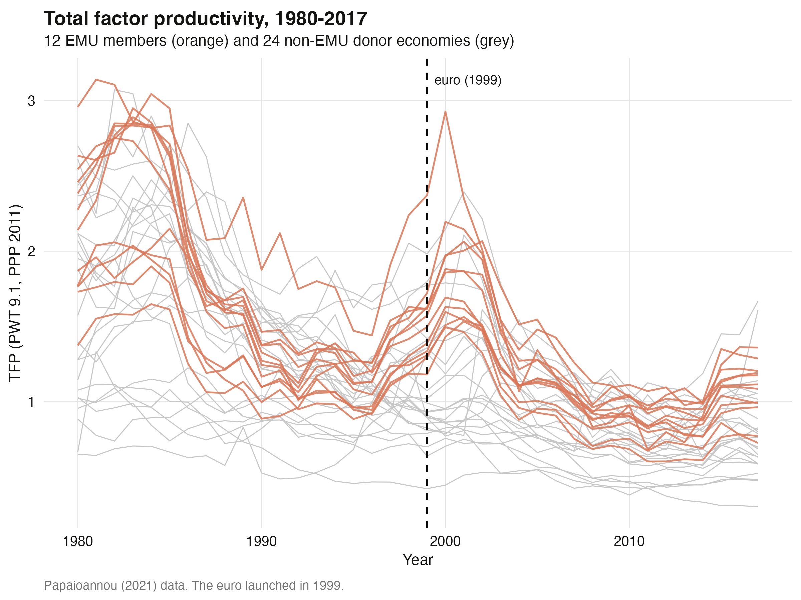

---

## 11. One country, the paper's way: synthetic Germany (plain SCM)

We start with a single country to mirror the paper's per-country synthetic controls.
Germany is fit against the 24 donors, matching on pre-treatment TFP *and* the paper's
predictors (human capital, investment share, economic freedom, patents, agriculture
share). This is plain SCM — the closest `augsynth` analogue to Abadie's classic method.

```r
fit <- augsynth(tfp ~ trt99 | hum_cap + inv_share + ec_freed + patents + agricult,
                country, year, germany_plus_donors, t_int = 1999,
                progfunc = "None", scm = TRUE)
summary(fit)$average_att
```

```text
Germany plain SCM avg ATT (TFP): +0.133 | jackknife+ [-0.082, 0.336] | conformal p=0.027 | L2 0.301
Germany % effect — 2000-07: +8.0%   2008-17: +19.3%  (plain SCM)
```

Actual German TFP runs **above** its synthetic counterfactual after 1999, with an average
effect of **+0.133** TFP units — about **+8.0%** over 2000–2007 and **+19.3%** over
2008–2017. The pre-treatment fit is good (scaled `L2` = 0.30). Here the two inference tools
**disagree at the margin**, which is itself instructive: the conformal p-value is
**0.027** (significant at 5%), but the jackknife+ interval `[-0.082, 0.336]` just barely
*includes* zero. On real data with a modest effect, "significant" is genuinely borderline —
we flag it rather than pick the answer we like. Qualitatively this still matches
Papaioannou's finding that Germany was among the clearer winners from monetary
integration.

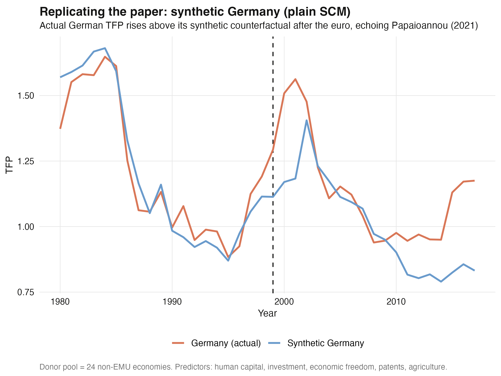

---

## 12. Ridge-ASCM as the modern extension

Does augmentation change the German verdict? We refit with `progfunc = "ridge"` and
overlay the two counterfactuals.

```r
fit_ridge <- augsynth(tfp ~ trt99 | hum_cap + inv_share + ec_freed + patents + agricult,
                      country, year, germany_plus_donors, t_int = 1999,
                      progfunc = "ridge", scm = TRUE)
```

```text
Germany Ridge-ASCM avg ATT (TFP): +0.127 | conformal p=0.015 | scaled L2 pre-fit 0.292
```

The Ridge-augmented estimate (**+0.127**, conformal p = 0.015) is essentially the
plain-SCM estimate (**+0.133**) — again, because the pre-treatment fit was already good
(scaled `L2` barely moves, 0.301 → 0.292). The two synthetic counterfactuals are nearly
indistinguishable.
This is reassuring rather than disappointing: augmentation is an insurance policy, and a
quiet premium here means the classic estimate was already trustworthy for Germany.

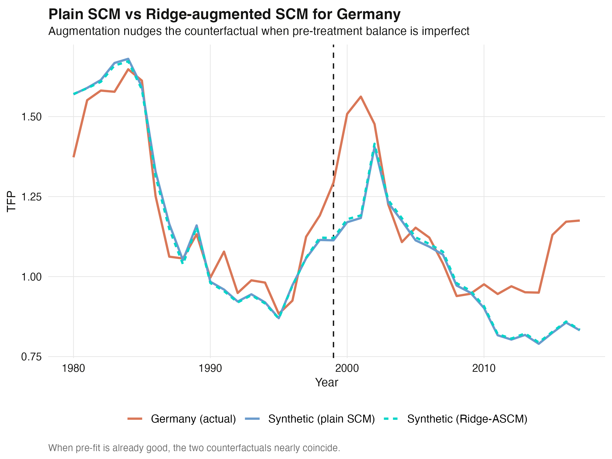

---

## 13. All twelve members at once: `multisynth`

The multi-country headline uses `multisynth` to estimate the euro's effect across **all
twelve members in one model**. Because every member adopts in 1999, this is a
*simultaneous* (block) design rather than a staggered one — `multisynth` handles it, it
just does not exercise the staggered machinery we saw in Part 1.

```r
ms_emu <- multisynth(tfp ~ trt99, country, year, emu_multi)
summary(ms_emu, inf_type = "jackknife")$att    # primary
set.seed(20260605)
summary(ms_emu, inf_type = "bootstrap")$att     # conservative comparison
```

```text
Pooled EMU avg ATT (TFP): -0.016 | jackknife [-0.282, 0.250] | bootstrap [-0.259, 0.231] | global L2 = 0.100
```

Taken at face value, the pooled average effect is a near-zero **−0.016**, and it is **not
statistically significant** — both the jackknife `[-0.282, 0.250]` and the wild bootstrap
`[-0.259, 0.231]` comfortably include zero. (Unlike the simulated panel, where the two
methods disagreed, here they agree: there is simply no pooled signal to detect.) But the
single number is also misleading, and reading only the average would be a mistake: **the
dynamics are the real story.** The pooled effect path is flat through the entire pre-period
(no pre-trend — a good sign), rises to about **+0.39** in the first euro years, then
slides into negative territory during the 2008–2014 crisis before recovering toward zero by
2017. The early gains and the crisis losses cancel out in the long-run average. This
dynamic — strong early, eroded by the crisis — is exactly the arc Papaioannou describes.

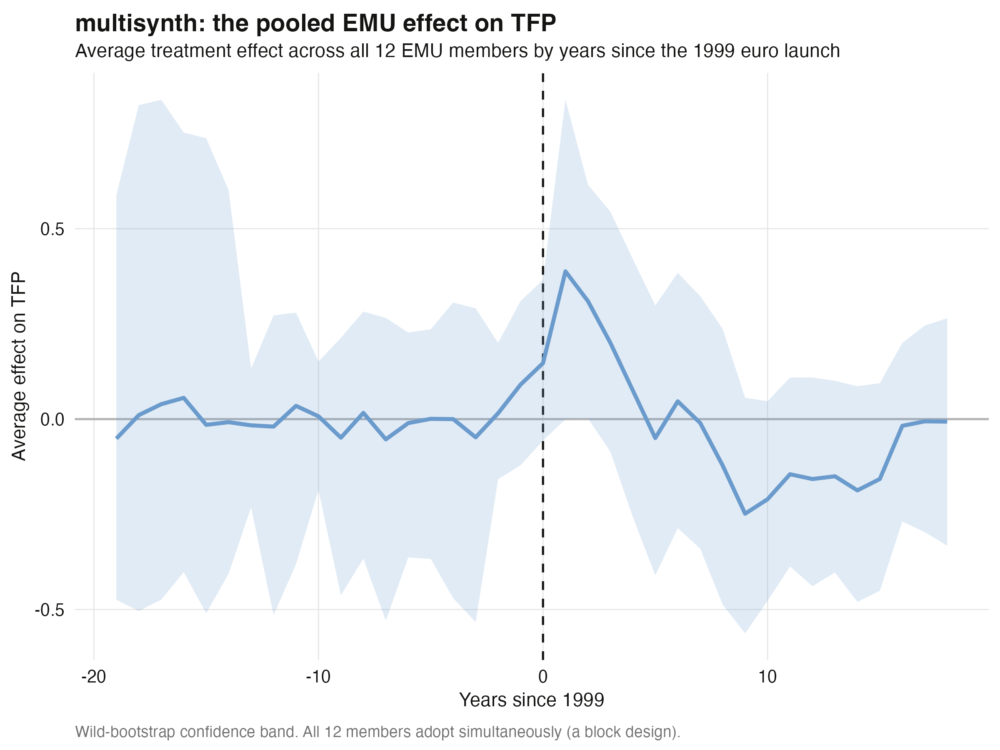

Fitting each member separately (twelve `single_augsynth` runs against the 24 donors) lets
us see the heterogeneity behind the average. Most members run above their synthetic
counterfactuals after 1999; Greece and Portugal converge to or fall below theirs after
the crisis.

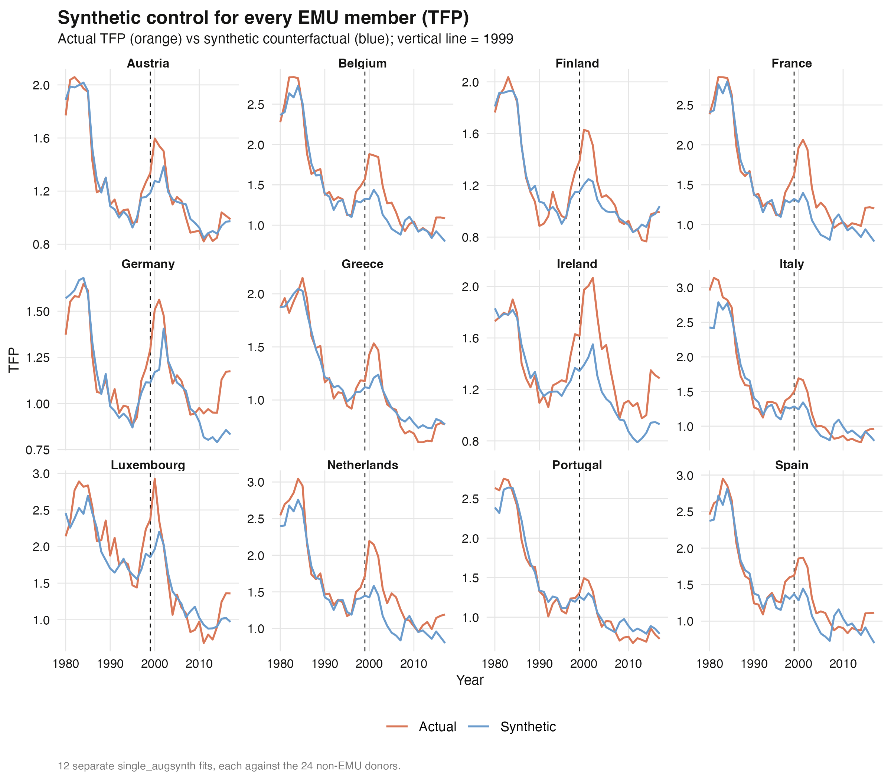

---

## 14. Two outcomes at once: `augsynth_multiout` on Germany

The euro should, in principle, move both German TFP *and* its productivity gap versus the
USA. We estimate them jointly.

```r
ger_mo <- augsynth_multiout(tfp + prod_gap ~ trt99, country, year, t_int = 1999,
                            germany_plus_donors, progfunc = "None", scm = TRUE,
                            combine_method = "concat")
summary(ger_mo)$average_att
```

```text
   Outcome   Estimate   p_val
1      tfp     +0.116    0.603
2 prod_gap     -0.151    0.603
```

The two point estimates tell one coherent story: after the euro, German **TFP rises**
(+0.116) *and* its **productivity gap versus the USA narrows** (−0.151, where a fall means
catching up to the frontier). A single synthetic Germany, balanced on both series, supports
both directions at once. But honesty requires the p-value: at **0.603 for each outcome,
neither is statistically significant.** The joint multi-outcome test is more demanding than
the single-TFP conformal test (which was borderline at p = 0.027), and on one country's
real data the signal is not strong enough to clear it. The *suggestive, coherent
directions* are worth reporting — as long as we do not overstate them as established.

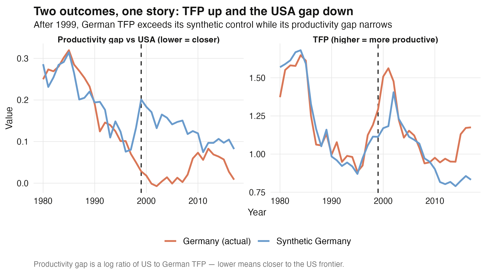

---

## 15. Robustness: the 1992 Maastricht threshold

Papaioannou notes that markets may have anticipated the euro from the 1992 Maastricht
Treaty, not just the 1999 launch. We rerun Germany with the earlier threshold using the
`trt92` indicator.

```r
ger_92 <- augsynth(tfp ~ trt92 | hum_cap + inv_share + ec_freed + patents + agricult,
                   country, year, germany_plus_donors, t_int = 1992,
                   progfunc = "None", scm = TRUE)
```

```text
Germany avg ATT — 1999 spec: +0.133 | 1992 spec: +0.138
```

Moving the intervention date back seven years barely changes the estimate (**+0.138** vs
**+0.133**). The verdict is robust to the anticipation question, which strengthens the
causal reading: whether we date the treatment at the treaty or the launch, synthetic
Germany tells the same story.

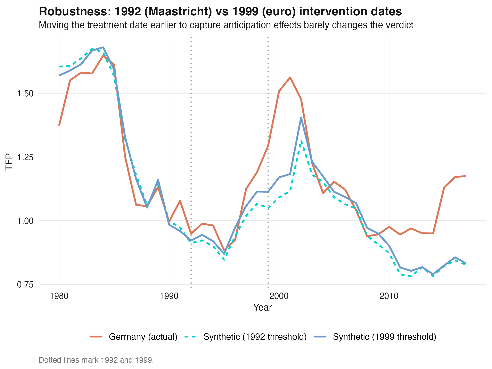

---

## 16. Comparing to the paper

How close is our ASCM re-analysis to Papaioannou's published numbers? The paper reports a
percentage TFP "contribution" per country per period; we compute the analogous ASCM
percentage effect and line them up for 2000–2007.

```r
cor(comp$paper_2000_07, comp$ascm_2000_07, method = "spearman")
```

```text
Correlation paper vs ASCM (2000-07 TFP % effect): Spearman 0.74 | Pearson 0.76
Both agree TFP rose for 12 of 12 members (ASCM).
```

The rank correlation between the paper's numbers and ours is **0.74** (Pearson 0.76) —
strong agreement given that `augsynth` uses a different estimator and donor-matching
scheme than the paper's classic SCM. Some countries land almost exactly on the
45-degree line (France: 42.7% vs the paper's 43.6%; Netherlands: 44.0% vs 38.2%; Spain:
32.0% vs 26.9%), while a few diverge in magnitude (Germany and Ireland) but not in sign.
Critically, the *pattern* replicates: large euro-era gains for France, the Netherlands,
Belgium, Spain, and Ireland, and the post-crisis reversals for Greece (−12.4% in
2008–17) and Portugal (−14.3%) that the paper also reports.

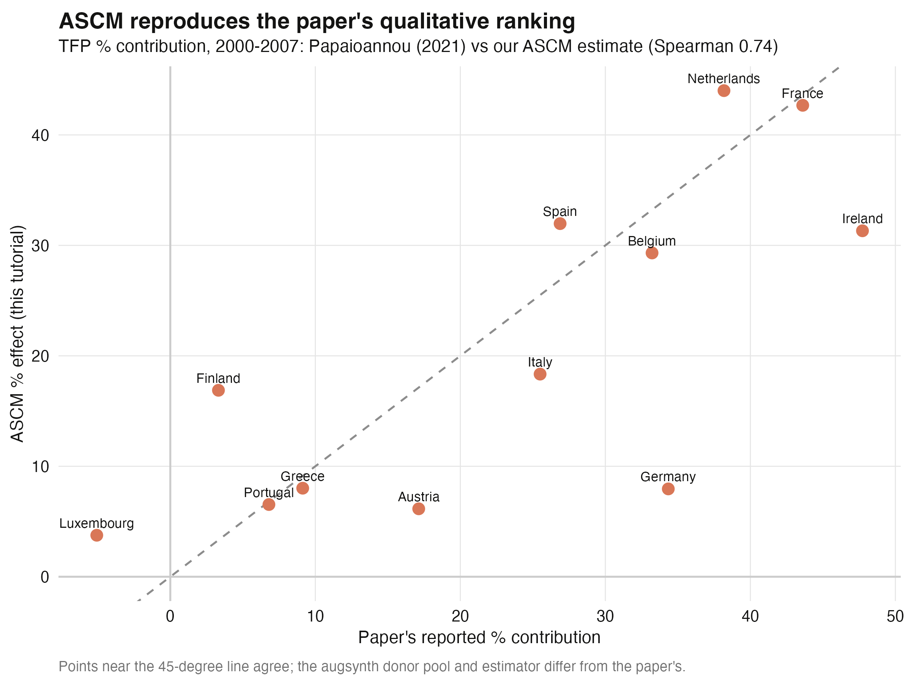

We do **not** reproduce the paper's numbers exactly, and we should not expect to: the
estimators differ, and qualitative replication — same signs, same ranking, same dynamic
story — is the right bar for a method comparison. By that bar, ASCM confirms the paper.

---

## 17. Discussion

Four threads tie Part 1 and Part 2 together.

**Validate on truth, then trust on data.** The single most useful habit this tutorial
teaches is the order of operations: we confirmed that each `augsynth` function recovers a
*known* effect on simulated data (errors under 5% for the well-fit units) *before* turning
it loose on the euro question. When the EMU results then showed sensible signs and a clean
pre-period, we had earned the right to believe them. A causal estimate you cannot first
reproduce on simulated ground truth is a leap of faith.

**Augmentation is insurance, not a free lunch.** For well-fit units — C01–C04, and
Germany — plain SCM and Ridge-ASCM agreed to the second decimal, and the Ridge penalty
quietly switched itself off. The augmentation mattered exactly once: for C05, sitting
outside the donor hull, where plain SCM got the *sign* wrong and Ridge-ASCM rescued it
(mean error 0.737 → 0.128). The lesson is to read the pre-treatment imbalance every time
and lean on augmentation only when the fit demands it.

**Inference is a choice, and the choices can disagree.** A point estimate is not a finding.
On the simulated panel the pooled effect was significant under the jackknife but not under
the wild bootstrap; on real German TFP the conformal p-value (0.027) and the jackknife+
interval (which included zero) split at the margin; the pooled euro effect and the joint
multi-outcome test were honestly null. We reported the simulated headlines as significant
(we injected them) and the borderline and null real-data results as exactly that. Match
the inference tool to the estimator, report when methods disagree, and never let a
near-zero estimate masquerade as a result.

**Averages hide dynamics in multi-country work.** The pooled `multisynth` effect on euro
TFP was a forgettable −0.016 *on average*, yet the path revealed a +0.39 early bump
erased by the 2008–2014 crisis. Two caveats travel with `multisynth` here: the EMU design
is simultaneous (so the staggered features are demonstrated only on simulated data), and
the pooled average is in raw TFP units, which mixes countries of very different
productivity levels — making the per-country *percentage* effects the quantity truly
comparable to the paper. Honest multi-country reporting means showing the path and the
per-unit spread, not just the headline number.

---

## 18. Summary and next steps

- The Augmented Synthetic Control Method generalizes classic SCM with an outcome-model
  bias correction that is doubly robust: it helps when the pre-treatment fit is poor and
  does no harm when it is good.
- `augsynth` exposes three entry points: **`single_augsynth`** (one unit),
  **`multisynth`** (many units, staggered, pooled + per-unit), and
  **`augsynth_multiout`** (one unit, many outcomes). The top-level `augsynth()` dispatches
  to the right one.
- On simulated data with a known effect, all three recovered the truth closely and
  **significantly** (single +6.241 vs +6.250, jackknife+ `[6.00, 6.51]`; pooled
  `multisynth` +3.222 vs 3.155, jackknife `[0.69, 5.75]`; multiout +6.54 and +3.53, both
  conformal p &lt; 0.001), and the suitability test showed Ridge-ASCM correcting a sign
  error that plain SCM could not — a wrong *and* non-significant estimate for C05.
- **Inference is matched to the estimator** — jackknife+ and conformal for a single unit,
  jackknife and the conservative wild bootstrap for `multisynth`, conformal p-values for
  multiple outcomes — and the methods can disagree. We reported significance honestly,
  including the borderline (Germany) and null (pooled euro, joint Germany) real-data cases.
- On the real EMU panel, ASCM qualitatively replicated Papaioannou (2021): a positive
  early TFP effect for most members (rank correlation 0.74 with the paper), Germany up and
  its US productivity gap narrowing, Greece and Portugal turning negative after the
  crisis, and robustness to the 1992-vs-1999 dating.

**Where to go next:** swap `progfunc = "ridge"` for other prognostic models
(`"gsyn"`, `"mcp"`); add covariate balancing after the `|` in the formula; explore
in-time and in-space placebo tests for inference; or read the staggered-adoption theory
in Ben-Michael, Feller, and Rothstein's companion paper. The reusable
`synthetic_panel_multicountry.csv` is a ready-made sandbox for any of these.

## 19. Exercises

1. **Swap the outcome.** Rerun the per-country EMU fits with `prod_gap` as the primary
   outcome instead of `tfp`. Does the productivity-gap story agree with the TFP story?
2. **Stress the donor pool.** Drop the single highest-weight donor from synthetic Germany
   and refit. How sensitive is the ATT to one donor?
3. **Tune the pooling.** Refit the simulated `multisynth` with `nu = 0` (fully separate)
   and `nu = 1` (fully pooled). How do the per-unit estimates and their confidence bands
   change?
4. **Recover the negative.** Using only `synthetic_panel_multicountry.csv`, reproduce
   C05's negative effect with `single_augsynth` and explain why plain SCM fails.
5. **Combine differently.** In `augsynth_multiout`, switch `combine_method = "avg"` to
   `"concat"` and compare the two-outcome estimates. When might each be preferable?
6. **Make inference disagree.** For the simulated pooled `multisynth` effect, compute both
   `inf_type = "jackknife"` and `inf_type = "bootstrap"` intervals. Then shrink the panel
   (drop donors or pre-periods) and watch how each interval responds. Which one flips first,
   and why?

## 20. References

- Abadie, A., Diamond, A., & Hainmueller, J. (2010). Synthetic Control Methods for
  Comparative Case Studies. *Journal of the American Statistical Association*, 105(490),
  493–505.
- Ben-Michael, E., Feller, A., & Rothstein, J. (2021). The Augmented Synthetic Control
  Method. *Journal of the American Statistical Association*, 116(536), 1415–1427.
- Ben-Michael, E., Feller, A., & Rothstein, J. (2022). Synthetic Controls with Staggered
  Adoption. *Journal of the Royal Statistical Society: Series B*, 84(2), 351–381.
- Papaioannou, S. K. (2021). European monetary integration, TFP and productivity
  convergence. *Economics Letters*, 199, 109696.
- `augsynth` package: <https://github.com/ebenmichael/augsynth>
- Feenstra, R. C., Inklaar, R., & Timmer, M. P. (2015). The Next Generation of the Penn
  World Table. *American Economic Review*, 105(10), 3150–3182.

---

<style>
.podcast-overlay {
  display: none;
  position: fixed;
  bottom: 0;
  left: 0;
  right: 0;
  z-index: 9999;
  animation: podSlideUp 0.35s ease-out;
}
@keyframes podSlideUp {
  from { transform: translateY(100%); }
  to { transform: translateY(0); }
}
.podcast-overlay.pod-closing {
  animation: podSlideDown 0.3s ease-in forwards;
}
@keyframes podSlideDown {
  from { transform: translateY(0); }
  to { transform: translateY(100%); }
}
.podcast-container {
  background: linear-gradient(135deg, #1a1a2e 0%, #16213e 100%);
  padding: 18px 24px 20px;
  font-family: -apple-system, BlinkMacSystemFont, 'Segoe UI', Roboto, sans-serif;
  box-shadow: 0 -4px 32px rgba(0,0,0,0.5);
  border-top: 1px solid rgba(106,155,204,0.2);
}
.podcast-inner {
  max-width: 800px;
  margin: 0 auto;
}
.podcast-top-row {
  display: flex;
  align-items: center;
  gap: 14px;
  margin-bottom: 14px;
}
.podcast-icon {
  width: 42px;
  height: 42px;
  background: linear-gradient(135deg, #d97757, #e8956a);
  border-radius: 10px;
  display: flex;
  align-items: center;
  justify-content: center;
  flex-shrink: 0;
}
.podcast-icon svg {
  width: 22px;
  height: 22px;
  fill: #fff;
}
.podcast-title-block {
  flex: 1;
  min-width: 0;
}
.podcast-title-block h4 {
  margin: 0 0 1px 0;
  color: #f0ece2;
  font-size: 14px;
  font-weight: 600;
  letter-spacing: 0.02em;
  white-space: nowrap;
  overflow: hidden;
  text-overflow: ellipsis;
}
.podcast-title-block span {
  color: #8b9dc3;
  font-size: 11px;
}
.podcast-close-btn {
  background: none;
  border: none;
  cursor: pointer;
  padding: 6px;
  border-radius: 50%;
  display: flex;
  align-items: center;
  justify-content: center;
  transition: background 0.2s;
  flex-shrink: 0;
}
.podcast-close-btn:hover {
  background: rgba(255,255,255,0.1);
}
.podcast-close-btn svg {
  width: 20px;
  height: 20px;
  fill: #8b9dc3;
}
.podcast-progress-wrap {
  margin-bottom: 12px;
}
.podcast-time-row {
  display: flex;
  justify-content: space-between;
  font-size: 11px;
  color: #8b9dc3;
  margin-bottom: 5px;
  font-variant-numeric: tabular-nums;
}
.podcast-bar-bg {
  width: 100%;
  height: 6px;
  background: rgba(255,255,255,0.1);
  border-radius: 3px;
  cursor: pointer;
  position: relative;
  overflow: hidden;
  transition: height 0.15s;
}
.podcast-bar-buffered {
  position: absolute;
  top: 0;
  left: 0;
  height: 100%;
  background: rgba(106,155,204,0.25);
  border-radius: 3px;
  transition: width 0.3s;
}
.podcast-bar-progress {
  position: absolute;
  top: 0;
  left: 0;
  height: 100%;
  background: linear-gradient(90deg, #6a9bcc, #00d4c8);
  border-radius: 3px;
  transition: width 0.1s linear;
}
.podcast-bar-bg:hover {
  height: 10px;
  margin-top: -2px;
}
.podcast-controls-row {
  display: flex;
  align-items: center;
  justify-content: space-between;
}
.podcast-transport {
  display: flex;
  align-items: center;
  gap: 8px;
}
.podcast-btn {
  background: none;
  border: none;
  cursor: pointer;
  padding: 4px;
  display: flex;
  align-items: center;
  justify-content: center;
  border-radius: 50%;
  transition: all 0.2s;
}
.podcast-btn svg {
  fill: #c8d0e0;
  transition: fill 0.2s;
}
.podcast-btn:hover svg {
  fill: #f0ece2;
}
.podcast-btn-skip {
  position: relative;
}
.podcast-btn-skip span {
  position: absolute;
  font-size: 7px;
  font-weight: 700;
  color: #c8d0e0;
  top: 50%;
  left: 50%;
  transform: translate(-50%, -50%);
  pointer-events: none;
  margin-top: 1px;
}
.podcast-btn-play {
  width: 48px;
  height: 48px;
  background: linear-gradient(135deg, #d97757, #e8956a);
  border-radius: 50%;
  box-shadow: 0 3px 12px rgba(217,119,87,0.4);
  transition: all 0.2s;
}
.podcast-btn-play:hover {
  transform: scale(1.08);
  box-shadow: 0 5px 20px rgba(217,119,87,0.5);
}
.podcast-btn-play svg {
  fill: #fff;
  width: 22px;
  height: 22px;
}
.podcast-extras {
  display: flex;
  align-items: center;
  gap: 10px;
}
.podcast-volume-wrap {
  display: flex;
  align-items: center;
  gap: 5px;
}
.podcast-volume-wrap svg {
  fill: #8b9dc3;
  width: 16px;
  height: 16px;
  cursor: pointer;
  flex-shrink: 0;
}
.podcast-volume-wrap svg:hover {
  fill: #c8d0e0;
}
.podcast-volume-slider {
  -webkit-appearance: none;
  appearance: none;
  width: 60px;
  height: 4px;
  background: rgba(255,255,255,0.12);
  border-radius: 2px;
  outline: none;
  cursor: pointer;
}
.podcast-volume-slider::-webkit-slider-thumb {
  -webkit-appearance: none;
  appearance: none;
  width: 12px;
  height: 12px;
  background: #6a9bcc;
  border-radius: 50%;
  cursor: pointer;
}
.podcast-speed-btn {
  background: rgba(255,255,255,0.08);
  border: 1px solid rgba(255,255,255,0.12);
  color: #c8d0e0;
  font-size: 11px;
  font-weight: 600;
  padding: 3px 9px;
  border-radius: 12px;
  cursor: pointer;
  transition: all 0.2s;
  font-family: inherit;
  min-width: 40px;
  text-align: center;
}
.podcast-speed-btn:hover {
  background: rgba(106,155,204,0.2);
  border-color: #6a9bcc;
  color: #f0ece2;
}
.podcast-download-btn {
  background: none;
  border: 1px solid rgba(255,255,255,0.12);
  border-radius: 8px;
  padding: 4px 10px;
  cursor: pointer;
  display: flex;
  align-items: center;
  gap: 4px;
  color: #8b9dc3;
  font-size: 11px;
  font-family: inherit;
  text-decoration: none;
  transition: all 0.2s;
}
.podcast-download-btn:hover {
  border-color: #6a9bcc;
  color: #f0ece2;
  background: rgba(106,155,204,0.1);
}
.podcast-download-btn svg {
  width: 14px;
  height: 14px;
  fill: currentColor;
}
@media (max-width: 600px) {
  .podcast-container { padding: 14px 16px 16px; }
  .podcast-volume-wrap { display: none; }
  .podcast-title-block h4 { font-size: 13px; }
  .podcast-extras { gap: 8px; }
}
</style>

<div class="podcast-overlay" id="podOverlay">
<div class="podcast-container">
<div class="podcast-inner">
  <audio id="podAudio" preload="none" src="https://files.catbox.moe/fkwbur.m4a"></audio>

  <div class="podcast-top-row">
    <div class="podcast-icon">
      <svg viewBox="0 0 24 24"><path d="M12 1a5 5 0 0 0-5 5v4a5 5 0 0 0 10 0V6a5 5 0 0 0-5-5zm0 16a7 7 0 0 1-7-7H3a9 9 0 0 0 8 8.94V22h2v-3.06A9 9 0 0 0 21 10h-2a7 7 0 0 1-7 7z"/></svg>
    </div>
    <div class="podcast-title-block">
      <h4>AI Podcast: Augmented Synthetic Control</h4>
      <span id="podDurationLabel">Click play to load</span>
    </div>
    <button class="podcast-close-btn" onclick="podClose()" title="Close player">
      <svg viewBox="0 0 24 24"><path d="M19 6.41L17.59 5 12 10.59 6.41 5 5 6.41 10.59 12 5 17.59 6.41 19 12 13.41 17.59 19 19 17.59 13.41 12z"/></svg>
    </button>
  </div>

  <div class="podcast-progress-wrap">
    <div class="podcast-time-row">
      <span id="podCurrent">0:00</span>
      <span id="podDuration">0:00</span>
    </div>
    <div class="podcast-bar-bg" id="podBarBg" onclick="podSeek(event)">
      <div class="podcast-bar-buffered" id="podBuffered"></div>
      <div class="podcast-bar-progress" id="podProgress"></div>
    </div>
  </div>

  <div class="podcast-controls-row">
    <div class="podcast-transport">
      <button class="podcast-btn podcast-btn-skip" onclick="podSkip(-15)" title="Back 15s">
        <svg width="26" height="26" viewBox="0 0 24 24"><path d="M12 5V1L7 6l5 5V7c3.31 0 6 2.69 6 6s-2.69 6-6 6-6-2.69-6-6H4c0 4.42 3.58 8 8 8s8-3.58 8-8-3.58-8-8-8z"/></svg>
        <span>15</span>
      </button>
      <button class="podcast-btn podcast-btn-play" id="podPlayBtn" onclick="podToggle()" title="Play">
        <svg id="podIconPlay" viewBox="0 0 24 24"><path d="M8 5v14l11-7z"/></svg>
        <svg id="podIconPause" viewBox="0 0 24 24" style="display:none"><path d="M6 19h4V5H6v14zm8-14v14h4V5h-4z"/></svg>
      </button>
      <button class="podcast-btn podcast-btn-skip" onclick="podSkip(15)" title="Forward 15s">
        <svg width="26" height="26" viewBox="0 0 24 24"><path d="M12 5V1l5 5-5 5V7c-3.31 0-6 2.69-6 6s2.69 6 6 6 6-2.69 6-6h2c0 4.42-3.58 8-8 8s-8-3.58-8-8 3.58-8 8-8z"/></svg>
        <span>15</span>
      </button>
    </div>
    <div class="podcast-extras">
      <div class="podcast-volume-wrap">
        <svg id="podVolIcon" onclick="podMute()" viewBox="0 0 24 24"><path d="M3 9v6h4l5 5V4L7 9H3zm13.5 3A4.5 4.5 0 0 0 14 8.5v7a4.47 4.47 0 0 0 2.5-3.5zM14 3.23v2.06a6.51 6.51 0 0 1 0 13.42v2.06A8.51 8.51 0 0 0 14 3.23z"/></svg>
        <input type="range" class="podcast-volume-slider" id="podVolume" min="0" max="1" step="0.05" value="0.8">
      </div>
      <button class="podcast-speed-btn" id="podSpeedBtn" onclick="podCycleSpeed()" title="Playback speed">1x</button>
      <a class="podcast-download-btn" href="https://files.catbox.moe/fkwbur.m4a" target="_blank" rel="noopener" title="Stream">
        <svg viewBox="0 0 24 24"><path d="M19 9h-4V3H9v6H5l7 7 7-7zM5 18v2h14v-2H5z"/></svg>
      </a>
    </div>
  </div>
</div>
</div>
</div>

<script>
(function(){
  var overlay = document.getElementById('podOverlay');
  var a = document.getElementById('podAudio');
  var speeds = [0.75, 1, 1.25, 1.5, 2];
  var si = 1;
  var opened = false;
  function fmt(s){
    if(isNaN(s)) return '0:00';
    var m=Math.floor(s/60), sec=Math.floor(s%60);
    return m+':'+(sec<10?'0':'')+sec;
  }
  document.addEventListener('click', function(e){
    var link = e.target.closest('a.btn-page-header');
    if(!link) return;
    var text = link.textContent.trim();
    if(text.indexOf('AI Podcast') === -1) return;
    e.preventDefault();
    e.stopPropagation();
    overlay.style.display = 'block';
    overlay.classList.remove('pod-closing');
    if(!opened){
      a.preload = 'metadata';
      a.load();
      opened = true;
    }
  });
  a.volume = 0.8;
  a.addEventListener('loadedmetadata', function(){
    document.getElementById('podDuration').textContent = fmt(a.duration);
    document.getElementById('podDurationLabel').textContent = fmt(a.duration) + ' minutes';
  });
  a.addEventListener('timeupdate', function(){
    document.getElementById('podCurrent').textContent = fmt(a.currentTime);
    var pct = a.duration ? (a.currentTime/a.duration)*100 : 0;
    document.getElementById('podProgress').style.width = pct+'%';
  });
  a.addEventListener('progress', function(){
    if(a.buffered.length>0){
      var pct = (a.buffered.end(a.buffered.length-1)/a.duration)*100;
      document.getElementById('podBuffered').style.width = pct+'%';
    }
  });
  a.addEventListener('ended', function(){
    document.getElementById('podIconPlay').style.display='';
    document.getElementById('podIconPause').style.display='none';
  });
  window.podToggle = function(){
    if(a.paused){a.play();document.getElementById('podIconPlay').style.display='none';document.getElementById('podIconPause').style.display='';}
    else{a.pause();document.getElementById('podIconPlay').style.display='';document.getElementById('podIconPause').style.display='none';}
  };
  window.podSkip = function(s){a.currentTime = Math.max(0,Math.min(a.duration||0,a.currentTime+s));};
  window.podSeek = function(e){
    var rect = document.getElementById('podBarBg').getBoundingClientRect();
    var pct = (e.clientX - rect.left)/rect.width;
    a.currentTime = pct * (a.duration||0);
  };
  window.podMute = function(){
    a.muted = !a.muted;
    document.getElementById('podVolume').value = a.muted ? 0 : a.volume;
  };
  window.podCycleSpeed = function(){
    si = (si+1) % speeds.length;
    a.playbackRate = speeds[si];
    document.getElementById('podSpeedBtn').textContent = speeds[si]+'x';
  };
  window.podClose = function(){
    overlay.classList.add('pod-closing');
    setTimeout(function(){ overlay.style.display='none'; }, 300);
    a.pause();
    document.getElementById('podIconPlay').style.display='';
    document.getElementById('podIconPause').style.display='none';
  };
  document.getElementById('podVolume').addEventListener('input', function(){
    a.volume = this.value;
    a.muted = false;
  });
  if(window.location.hash === '#podcast-player'){
    overlay.style.display = 'block';
    a.preload = 'metadata';
    a.load();
    opened = true;
  }
})();
</script>
