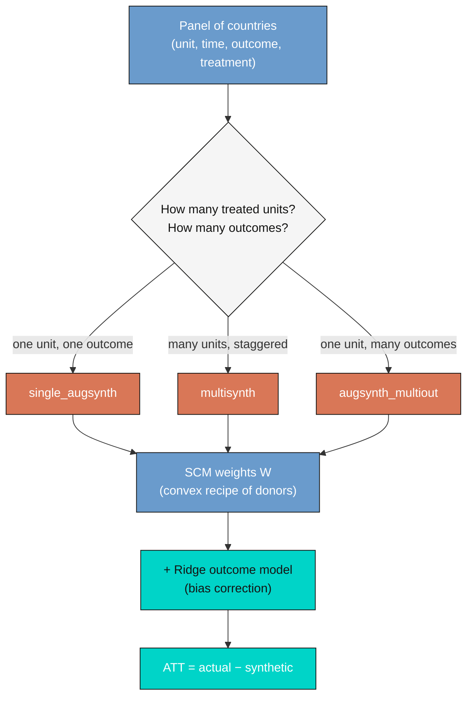

---
authors:
  - admin
categories:
  - R
  - Synthetic Control
draft: false
featured: false
date: "2026-06-05T00:00:00Z"
external_link: ""
image:
  caption: ""
  focal_point: Smart
  placement: 3
links:
- icon: laptop-code
  icon_pack: fas
  name: "Web app"
  url: web_app/index.html
- icon: file-pdf
  icon_pack: fas
  name: "Slides (PDF)"
  url: https://carlos-mendez.org/post/r_sc_multi_country/slides.pdf
- icon: code
  icon_pack: fas
  name: "R script"
  url: analysis.R
- icon: file-code
  icon_pack: fas
  name: "Quarto project (.zip)"
  url: r_sc_multi_country.zip
- icon: database
  icon_pack: fas
  name: "Data (CSV)"
  url: https://github.com/cmg777/starter-academic-v501/tree/master/content/post/r_sc_multi_country
- icon: podcast
  icon_pack: fas
  name: AI Podcast
  url: "/post/r_sc_multi_country/#podcast-player"
- icon: markdown
  icon_pack: fab
  name: "MD version"
  url: https://raw.githubusercontent.com/cmg777/starter-academic-v501/master/content/post/r_sc_multi_country/index.md
slides:
summary: "A hands-on tour of the Augmented Synthetic Control Method in a multi-country setting with the augsynth package — learning single_augsynth, multisynth, and augsynth_multiout on simulated data, then replicating Papaioannou (2021) on the EMU and productivity convergence."
tags:
- r
- causal inference
- panel data
- synthetic control
title: "Augmented Synthetic Control for Multiple Countries: A Tutorial with augsynth"
url_code: ""
url_pdf: ""
url_slides: ""
url_video: ""
toc: true
diagram: true
---

## 1. Overview

Did joining the euro make countries more productive? Did a national reform pay off, or
would the country have done just as well without it? Questions like these share an
awkward feature: we never observe the **counterfactual** — the path a country *would*
have followed had it not adopted the policy. We see only the world that happened.

The **synthetic control method (SCM)** answers this by building the missing
counterfactual from data. Among countries that did *not* adopt the policy, it finds the
*weighted recipe* whose pre-treatment trajectory looks indistinguishable from the
treated country's, and uses that "synthetic" twin as the stand-in for the absent
counterfactual. If the pre-treatment match is good, the post-treatment gap between the
actual country and its synthetic version is the most credible estimate of the policy's
effect.

Classic SCM, however, has a well-known weak spot: it only works when the donor pool can
reproduce the treated country's pre-treatment path *almost perfectly*. In cross-country
work the donor pool is small and countries are structurally different, so a good match
is the exception, not the rule. The **Augmented Synthetic Control Method (ASCM)** of
Ben-Michael, Feller, and Rothstein (2021) fixes this by adding an **outcome model** that
estimates and removes the leftover bias when the pre-treatment fit is imperfect — the
same doubly-robust idea behind augmented inverse-probability weighting. When the fit is
already good, the augmentation does almost nothing; when it is poor, it rescues the
estimate.

This tutorial is a hands-on tour of ASCM in a **multi-country** setting using the
[`augsynth`](https://github.com/ebenmichael/augsynth) package. It has two parts. In
**Part 1** we work with *simulated* data where the true effect is known, so we can
introduce the three `augsynth` entry points and *verify* that each one recovers the
truth:

- `single_augsynth` — one treated unit (the building block),
- `multisynth` — many treated units with staggered adoption,
- `augsynth_multiout` — one treated unit with several outcomes.

We save the simulated panel to a CSV you can reuse, and we run a small **suitability
test** that shows exactly where plain SCM fails and augmentation saves the day. In
**Part 2** we put the method to work on real data, *qualitatively replicating*
Papaioannou (2021), "European monetary integration, TFP and productivity convergence,"
which asks whether the 12 founding members of the euro area saw faster total factor
productivity (TFP) growth than a synthetic counterfactual built from non-euro economies.

**Learning objectives:**

- Distinguish the three `augsynth` entry points and recognize which one a problem calls for
- Read the `augsynth` formula mini-language (`outcome ~ treatment | covariates`)
- Use simulated data with a *known* effect to validate a causal estimator before trusting it on real data
- Explain when augmentation (the Ridge outcome model) matters and when it does not
- Replicate the qualitative findings of a published synthetic-control paper and compare estimates honestly
- Choose between conformal and bootstrap inference depending on the function

The diagram below maps the three functions onto one pipeline.



The routing is by *shape*, not difficulty: count the treated units and the outcomes, and the
panel flows to one of the three functions. All three then converge on the same machinery — a
synthetic counterfactual built from convex donor weights, optionally refined by the Ridge
bias-correction step, with the ATT read off as actual minus synthetic.

### Key concepts at a glance

This post leans on a small vocabulary repeatedly. Each concept below has three parts.
The **definition** is always visible; the **example** and **analogy** sit behind
clickable cards — open them when a term feels slippery, leave them collapsed for a quick
scan.

**1. Synthetic control method (SCM).**
A weighted average of donor (untreated) units, built so that its pre-treatment path
matches the treated unit. The synthetic's post-treatment trajectory is the estimated
counterfactual; the gap to the actual unit is the treatment effect (ATT).

<div class="concept-pair">
<details class="concept-card concept-example">
<summary>Example</summary>

We build a "Synthetic Germany" from a weighted blend of 24 non-euro economies, chosen so
that pre-1999 German TFP matches the real thing. After 1999, the gap between actual and
synthetic Germany estimates the euro's effect on productivity.

</details>

<details class="concept-card concept-analogy">
<summary>Analogy</summary>

A stunt double assembled from many extras. Before the dangerous scene (treatment) the
double mimics the star perfectly; during the scene it shows what would have happened to
the star.

</details>
</div>

**2. Augmented SCM (ASCM) and bias correction.**
Plain SCM is only unbiased when the pre-treatment fit is (near) perfect. ASCM fits an
**outcome model** on the donors and subtracts the part of the gap that model predicts —
a *bias correction*. If the fit is already perfect the correction is zero; if not, it
removes leftover imbalance.

<div class="concept-pair">
<details class="concept-card concept-example">
<summary>Example</summary>

For a treated unit sitting outside the donor pool's range, plain SCM cannot match the
pre-period and even gets the *sign* of the effect wrong. Ridge-augmented SCM closes the
pre-treatment gap and recovers the true effect (we see exactly this for unit C05 below).

</details>

<details class="concept-card concept-analogy">
<summary>Analogy</summary>

Tarring a wall, then touching up with a brush. SCM lays down the broad coat (weights);
the outcome model paints over the spots the roller could not reach (residual bias).

</details>
</div>

**3. Donor pool and convex weights** $W$.
The donors are the untreated units the synthetic is built from. The weights are
non-negative and sum to one (a *convex* combination), so the synthetic is an
interpolation, never an extrapolation, of the donors.

<div class="concept-pair">
<details class="concept-card concept-example">
<summary>Example</summary>

Synthetic C01 is roughly "23% C14 + 21% C08 + 21% C10 + 19% C06 + 15% C16." The weights
add to one; every other donor gets weight zero.

</details>

<details class="concept-card concept-analogy">
<summary>Analogy</summary>

A recipe whose proportions sum to 100%. You can blend the donor ingredients but never
use a negative amount of flour.

</details>
</div>

**4. Prognostic (outcome) model — `progfunc`.**
The model ASCM uses to predict each unit's untreated outcome. `progfunc = "None"` gives
plain SCM; `progfunc = "ridge"` fits a Ridge regression on lagged outcomes and is the
default, because it also supports valid confidence intervals.

<div class="concept-pair">
<details class="concept-card concept-example">
<summary>Example</summary>

`augsynth(y ~ trt, unit, time, data, progfunc = "ridge", scm = TRUE)` runs Ridge-ASCM;
swapping in `progfunc = "None"` runs the classic Abadie estimator.

</details>

<details class="concept-card concept-analogy">
<summary>Analogy</summary>

A spell-checker for your counterfactual. SCM writes the first draft; the Ridge model
flags and fixes the systematic typos.

</details>
</div>

**5. Staggered adoption and partial pooling — `multisynth`, `nu`.**
When many units adopt at different times, `multisynth` fits one synthetic control per
treated unit and *partially pools* them. The pooling knob `nu` runs from 0 (each unit
separate) to 1 (one shared control); `augsynth` picks it automatically.

<div class="concept-pair">
<details class="concept-card concept-example">
<summary>Example</summary>

Five simulated countries adopt in 2010, 2013, and 2016. `multisynth` returns a pooled
average effect *and* a per-country effect, with `nu = 0.57` chosen automatically.

</details>

<details class="concept-card concept-analogy">
<summary>Analogy</summary>

Grading essays with a rubric. Pure pooling treats every student identically; no pooling
grades each in a vacuum; partial pooling borrows a little strength from the class
average to stabilize each grade.

</details>
</div>

**6. Multiple outcomes — `augsynth_multiout`.**
One treated unit can be tracked on several outcomes at once. A single set of donor
weights is chosen to balance *all* outcomes jointly, which borrows strength across
correlated series.

<div class="concept-pair">
<details class="concept-card concept-example">
<summary>Example</summary>

`augsynth_multiout(tfp + prod_gap ~ trt, ...)` builds one synthetic Germany that
matches both TFP and the productivity gap vs the USA before 1999.

</details>

<details class="concept-card concept-analogy">
<summary>Analogy</summary>

One tailored suit fitted to several measurements at once — chest, sleeve, and waist —
rather than three separate jackets.

</details>
</div>

**7. Inference: conformal vs bootstrap.**
`single_augsynth` and `augsynth_multiout` use **conformal** inference
(`summary(fit, inf_type = "conformal")`); `multisynth` uses a **wild bootstrap**
(`inf_type = "bootstrap"`). They are not interchangeable — each is matched to its
estimator.

<div class="concept-pair">
<details class="concept-card concept-example">
<summary>Example</summary>

We seed the random number generator before each bootstrap so the `multisynth`
confidence bands are reproducible.

</details>

<details class="concept-card concept-analogy">
<summary>Analogy</summary>

Two different rulers for two different jobs. Using the bootstrap ruler on a conformal
problem (or vice versa) measures the wrong thing.

</details>
</div>

---

## 2. Setup

`augsynth` is **not on CRAN**, so we install it from GitHub (pinned to a specific commit
for reproducibility). We also load `Synth` (a dependency), `haven` (to read the Stata
file in Part 2), and the usual tidyverse plotting tools. Everything below was executed
with R 4.5.2, `augsynth` 0.2.0, and `Synth` 1.1.10.

```r
# augsynth is installed from GitHub (run once):
# remotes::install_github("ebenmichael/augsynth@7a90ea4")

library(augsynth)
library(haven)     # read the Stata .dta in Part 2
library(dplyr)
library(tidyr)
library(ggplot2)

set.seed(20260605)

# Site colour palette
STEEL_BLUE  <- "#6a9bcc"   # synthetic control
WARM_ORANGE <- "#d97757"   # treated / actual
NEAR_BLACK  <- "#141413"   # truth / reference
TEAL        <- "#00d4c8"   # ridge-augmented / highlight
```

A note on the formula mini-language you will see throughout: `augsynth` takes
`outcome ~ treatment` on the left, and optional matching covariates after a pipe,
`outcome ~ treatment | x1 + x2`. The `unit` and `time` arguments name the panel's
identifier columns, and `t_int` is the intervention time (for the single-unit
functions). The treatment column is a 0/1 indicator that turns on when treatment starts.

---

## 3. A two-country intuition example

Before any weighting machinery, here is the whole idea in two countries. We simulate a
treated country, "Atlantia," whose untreated path is a clean copy of a comparison
country, "Borealis," plus an injected effect that switches on in 2012 and grows by
`1.5` units per year. Because Borealis *is* the counterfactual by construction, the gap
after 2012 must equal the injected effect.

```r
years   <- 2000:2023
t_int   <- 2012
trend   <- 40 + 1.2 * (years - 2000) + 3 * sin(2 * pi * (years - 2000) / 9)
control <- trend + rnorm(length(years), 0, 0.6)
true_effect <- ifelse(years >= t_int, 1.5 * (years - t_int + 1), 0)
treated <- trend + rnorm(length(years), 0, 0.6) + true_effect

mean(treated[years >= t_int] - control[years >= t_int])  # estimated gap
mean(true_effect[years >= t_int])                         # true effect
```

```text
[1] 9.601    # estimated mean post-2012 gap
[1] 9.75     # true mean injected effect
```

The estimated post-2012 gap is **9.60** against a true mean effect of **9.75** — within
1.5%. This is synthetic control in its simplest possible form: a single, perfectly
matched comparison. The figure makes the logic visible — the two lines are
indistinguishable before 2012, then Atlantia pulls away by exactly the injected amount.


The catch, of course, is that real comparison countries are never perfect twins. That is
why we need a *weighted* combination of many donors — and, when even that is not enough,
the augmentation step. The rest of Part 1 builds up to both.

---

## 4. One reusable simulated panel

We now build a richer panel that all three functions will share. It has **20 countries
over 24 years (2000–2023)**: five treated units (`C01`–`C05`) and fifteen never-treated
donors (`C06`–`C20`). The data come from a three-factor model — two common factors plus a
unit fixed effect — so a good synthetic control genuinely exists. Treated units C01–C04
are constructed as convex blends of the donors (inside the donor "hull"), while **C05 is
placed deliberately outside it** to stress-test the methods later.

Treatment is **staggered**: C01 and C02 adopt in 2010, C03 in 2013, and C04 and C05 in
2016. Each treated unit gets a known per-year effect on a primary outcome `gdp_index`
(and a correlated 0.6× effect on a second outcome `trade_index`). Crucially, **C05's
effect is negative** (−0.35 per year), mimicking the real-world fact that a few euro
members underperformed.

```r
# ... factor-model construction (see analysis.R) ...
adopt <- c(C01 = 2010, C02 = 2010, C03 = 2013, C04 = 2016, C05 = 2016)
beta1 <- c(C01 = 0.40, C02 = 0.30, C03 = 0.50, C04 = 0.20, C05 = -0.35)

write.csv(panel, "synthetic_panel_multicountry.csv", row.names = FALSE)
```

```text
Saved synthetic_panel_multicountry.csv: 20 units x 24 years = 480 rows
Adoption schedule: C01 2010  C02 2010  C03 2013  C04 2016  C05 2016
True outcome-1 ramps (per year): C01 0.40  C02 0.30  C03 0.50  C04 0.20  C05 -0.35
```

The saved file ships with extra columns most real datasets never give you: the *true*
counterfactual (`gdp_index_cf`, `trade_index_cf`) and the *true* injected effect
(`true_effect_gdp`, `true_effect_trade`). Those let us grade every estimate against
ground truth. Below, the fifteen donor paths (grey) surround the five treated paths
(colored), with dots marking each unit's adoption year.


Two display equations capture what every `augsynth` call is doing under the hood. First,
the **SCM weight problem**: find the convex donor weights $W$ that best match the treated
unit's pre-treatment vector.

$$W^{\star} = \arg\min\_{W \in \Delta} \lVert X\_1 - X\_0 W \rVert\_V
\qquad \text{subject to} \qquad w\_j \ge 0, \quad \sum\_j w\_j = 1$$

Here $X\_1$ is the treated unit's pre-treatment outcomes (and any covariates), $X\_0$ is
the matching donor matrix (one column per donor), $W$ is the vector of donor weights,
$V$ weights the predictors, and $\Delta$ is the simplex (the constraint that weights are
non-negative and sum to one). The solution $W^{\star}$ is the "recipe" for the synthetic
control.

Second, the **augmented, bias-corrected estimator**. ASCM starts from the SCM gap and
subtracts what an outcome model $\widehat{m}\_t(\cdot)$ predicts the residual imbalance
should be:

$$\widehat{\tau}\_t^{\mathrm{aug}} =
\Big(Y\_{1t} - \sum\_j w\_j Y\_{jt}\Big) - \Big(\widehat{m}\_t(X\_1) - \sum\_j w\_j \widehat{m}\_t(X\_j)\Big)$$

The first term is the ordinary SCM gap (actual treated minus weighted donors at time
$t$). The second term is the correction: $\widehat{m}\_t$ is the prognostic model (a
Ridge regression when `progfunc = "ridge"`), evaluated at the treated unit's covariates
versus the donors'. When the pre-treatment fit is perfect the donors already reproduce
$\widehat{m}\_t(X\_1)$, so the correction vanishes and ASCM equals SCM. When the fit is
poor, the correction removes the leftover bias. This is the doubly-robust safety net.

---

## 5. One treated unit: `single_augsynth`

The simplest case has one treated unit. We isolate `C01` together with the fifteen
donors (never mixing in the other treated units — that would contaminate the donor pool),
build the treatment indicator, and fit both plain SCM (`progfunc = "None"`) and
Ridge-ASCM (`progfunc = "ridge"`). The top-level `augsynth()` function dispatches to
`single_augsynth()` automatically when it sees one treated unit and one intervention
time.

```r
sim_single <- panel |>
  filter(country %in% c("C01", donors)) |>
  mutate(trt = as.integer(country == "C01" & year >= 2010))

sc_plain <- augsynth(gdp_index ~ trt, country, year, sim_single,
                     t_int = 2010, progfunc = "None",  scm = TRUE)
sc_ridge <- augsynth(gdp_index ~ trt, country, year, sim_single,
                     t_int = 2010, progfunc = "ridge", scm = TRUE)

summary(sc_plain, inf_type = "conformal")$average_att
```

```text
C01 true average post ATT      : +2.600
Plain SCM   estimated avg ATT  : +2.651  (p=0.329, scaled L2 pre-fit=0.407)
Ridge-ASCM  estimated avg ATT  : +2.651  (scaled L2 pre-fit=0.406, lambda=803.0)
```

Both estimators nail the truth: the true average effect of C01 is **+2.600** and each
method returns **+2.651**, an error of about 2%. Notice that plain SCM and Ridge-ASCM
give *the same answer here*. That is not a coincidence — C01 sits comfortably inside the
donor hull, so the pre-treatment fit is already good (scaled `L2` imbalance ≈ 0.41, well
below the 1.0 you would get from naively averaging donors), and the Ridge penalty is
driven to a large value (`lambda` ≈ 803) that all but switches the augmentation off. This
is the "when fit is good, ASCM ≈ SCM" principle in action.

The synthetic control reproduces C01's pre-2010 path closely and then diverges, exactly
as designed.


How well does the *dynamic* effect line up with the truth? The conformal gap plot
overlays the estimated treated-minus-synthetic gap (with its pointwise band) against the
true injected ramp. The two are nearly on top of each other after 2010, while the
pre-period gap hovers around zero — the visual signature of a trustworthy synthetic
control.


The donor recipe is sparse and interpretable: synthetic C01 is built mostly from five
donors (C14, C08, C10, C06, C16), with weights summing to one. This sparsity is a
hallmark of SCM and makes the counterfactual auditable.

---

## 6. Many treated units, staggered adoption: `multisynth`

Real multi-country studies rarely have a single treated unit. `multisynth` handles many
treated units that adopt at different times. It needs **no `t_int`** — it infers each
unit's adoption from when the treatment column switches from 0 to 1 — and it returns both
a **pooled average** effect and **per-unit** effects, partially pooling them for
stability.

```r
sim_multi <- panel |>
  filter(country %in% c(treated, donors)) |>
  select(country, year, treat_ms, gdp_index)

ms_sim <- multisynth(gdp_index ~ treat_ms, country, year, sim_multi)
set.seed(20260605)
summary(ms_sim, inf_type = "bootstrap")$att
```

```text
multisynth nu (auto) = 0.570 ; global scaled L2 = 0.060 ; n_leads = 8

Estimated vs TRUE average post-treatment ATT (over the common n_leads window):
   level estimate  ci_lo ci_hi  truth
 Average    0.718 -0.537 2.264  0.735
     C01    1.494 -1.688 4.639  1.400
     C02    1.140 -1.555 3.556  1.050
     C03    1.831 -2.089 5.670  1.750
     C04    0.592 -0.554 1.694  0.700
     C05   -1.468 -4.656 1.671 -1.225
```

The pooled average effect is estimated at **0.718** against a true value of **0.735** —
recovery to within 2.5%. Just as importantly, every per-unit estimate has the **right
sign and the right ballpark**, including C05's *negative* effect (−1.468 estimated vs
−1.225 true). The automatically chosen pooling parameter `nu = 0.57` sits between "fully
separate" and "fully pooled," and the tiny global imbalance (scaled `L2` = 0.06) tells us
the joint synthetic controls fit the pre-period tightly. (One subtlety: `multisynth`
averages effects over a *common* window of `n_leads = 8` post-treatment periods so that
all units contribute equally — we compute the truth over the same window to keep the
comparison fair.)

The per-unit dynamics confirm the recovery. Each panel shows one treated unit's estimated
effect by time-since-adoption against its true ramp; the pre-period sits at zero and the
post-period climbs to meet the dashed truth line — with C05 sloping the opposite way.


Averaging across the five heterogeneous units gives the pooled effect path, the single
most useful summary in a many-treated-unit study. The estimate (with its wild-bootstrap
band) tracks the true pooled effect closely.


---

## 7. One unit, two outcomes: `augsynth_multiout`

Sometimes a policy plausibly moves several outcomes and we want one coherent
counterfactual for all of them. `augsynth_multiout` puts **multiple outcomes on the left
of the formula**, separated by `+`, and finds a single donor recipe that balances all of
them before treatment.

```r
mo <- augsynth_multiout(gdp_index + trade_index ~ trt, country, year,
                        t_int = 2010, sim_single,
                        progfunc = "None", scm = TRUE, combine_method = "avg")
summary(mo)$average_att
```

```text
      Outcome Estimate
1   gdp_index 2.709     (true +2.600)
2 trade_index 1.720     (true +1.560)
```

With a single set of weights, the joint fit recovers **both** effects: `gdp_index` at
+2.709 (true +2.600) and the correlated `trade_index` at +1.720 (true +1.560), each
within about 0.16 of the truth. The payoff of estimating them together — rather than
running two separate `single_augsynth` fits — is that the donor weights must respect both
series at once, which stabilizes the counterfactual when the outcomes are correlated.


---

## 8. Testing suitability: where plain SCM fails and ASCM corrects

Now the payoff of building C05 *outside* the donor hull. No convex blend of the donors
can reproduce its pre-treatment path, so plain SCM is in trouble. We fit both estimators
for every treated unit and tabulate how far each lands from the known truth.

```r
# fit plain and ridge for each treated unit; compare to known effects
recovery   # one row per unit: true_att, att_plain, att_ridge, pre-fit L2, errors
```

```text
 unit true_att att_plain att_ridge prefit_l2_plain prefit_l2_ridge err_plain err_ridge
  C01    2.600     2.651     2.651           0.407           0.406     0.051     0.051
  C02    1.950     2.004     2.157           0.168           0.009     0.054     0.207
  C03    2.500     2.585     2.585           0.470           0.470     0.085     0.085
  C04    0.700     0.499     0.500           0.647           0.647     0.201     0.200
  C05   -1.225     0.335    -1.316           0.343           0.117     1.560     0.091

Mean recovery error  — plain SCM: 0.390  | Ridge-ASCM: 0.127
C05 pre-fit scaled L2 — plain: 0.343  | ridge: 0.117 (lower = better fit)
```

This is the headline result of Part 1. For C05, **plain SCM gets the sign wrong** — it
estimates +0.335 when the true effect is −1.225 — because it cannot match the pre-period
and the unmatched bias swamps the signal. **Ridge-ASCM recovers −1.316**, almost exactly
right, by closing the pre-treatment gap (scaled `L2` falls from 0.34 to 0.12). Across all
five units, augmentation cuts the mean recovery error from **0.390 to 0.127**. For the
four well-fit units the two methods agree; augmentation earns its keep precisely on the
hard case.

The picture says it all: under plain SCM the synthetic control (blue) drifts away from
actual C05 (orange) *before* treatment — a fatal sign of poor fit — while Ridge-ASCM pins
them together pre-2016, so the post-treatment gap can be trusted.


The practical rule: **always read the pre-treatment fit.** If the scaled `L2` imbalance is
small, plain SCM and ASCM will agree and either is fine. If it is large, trust the
augmented estimate — and be suspicious of any synthetic control whose pre-period does not
track.

---

## 9. The EMU data: replicating Papaioannou (2021)

We now switch to real data. Papaioannou (2021) asks whether the euro raised the total
factor productivity of its founding members. The dataset (shipped in this post's
`reference/` folder as a Stata file) is a balanced panel of **36 countries from 1980 to
2017**: the **12 founding euro members** (Austria, Belgium, Finland, France, Germany,
Greece, Ireland, Italy, Luxembourg, Netherlands, Portugal, Spain) and **24 non-euro donor
economies** (from Argentina to Uruguay). The primary outcome is `tfp` (total factor
productivity from the Penn World Tables); a second outcome `prod_gap` is the log
productivity gap versus the USA, where *lower means closer to the frontier*.

A subtlety worth pausing on: the file stores `treat` as a time-invariant group flag (1
for euro members in every year) and `time1`/`time2` as period flags (post-1999,
post-1992). The actual time-varying treatment is their product.

```r
emu <- read_dta("reference/dataset_revision_1.dta") |>
  mutate(country = as.character(country)) |> zap_labels() |> as.data.frame()

emu$trt99 <- as.integer(emu$treat == 1 & emu$time1 == 1)  # euro members x post-1999
emu$trt92 <- as.integer(emu$treat == 1 & emu$time2 == 1)  # euro members x post-1992
```

```text
EMU countries (12): Austria, Belgium, Finland, France, Germany, Greece, Ireland,
                    Italy, Luxembourg, Netherlands, Portugal, Spain
Donor countries (24): Argentina, Australia, Brazil, Canada, ... , Turkey, Uruguay
```

The raw TFP paths show the setup: twelve euro members (orange) embedded in a cloud of
donors (grey), with the 1999 euro launch marked.


---

## 10. One country, the paper's way: synthetic Germany (plain SCM)

We start with a single country to mirror the paper's per-country synthetic controls.
Germany is fit against the 24 donors, matching on pre-treatment TFP *and* the paper's
predictors (human capital, investment share, economic freedom, patents, agriculture
share). This is plain SCM — the closest `augsynth` analogue to Abadie's classic method.

```r
fit <- augsynth(tfp ~ trt99 | hum_cap + inv_share + ec_freed + patents + agricult,
                country, year, germany_plus_donors, t_int = 1999,
                progfunc = "None", scm = TRUE)
summary(fit)$average_att
```

```text
Germany plain SCM avg ATT (TFP level): +0.133 | scaled L2 pre-fit 0.301
Germany % effect — 2000-07: +8.0%   2008-17: +19.3%  (plain SCM)
```

Actual German TFP runs **above** its synthetic counterfactual after 1999, with an average
effect of **+0.133** TFP units — about **+8.0%** over 2000–2007 and **+19.3%** over
2008–2017. The pre-treatment fit is good (scaled `L2` = 0.30). Qualitatively this matches
Papaioannou's finding that Germany was among the clearer winners from monetary
integration.


---

## 11. Ridge-ASCM as the modern extension

Does augmentation change the German verdict? We refit with `progfunc = "ridge"` and
overlay the two counterfactuals.

```r
fit_ridge <- augsynth(tfp ~ trt99 | hum_cap + inv_share + ec_freed + patents + agricult,
                      country, year, germany_plus_donors, t_int = 1999,
                      progfunc = "ridge", scm = TRUE)
```

```text
Germany Ridge-ASCM avg ATT (TFP level): +0.127 | scaled L2 pre-fit 0.292
```

The Ridge-augmented estimate (**+0.127**) is essentially the plain-SCM estimate
(**+0.133**) — again, because the pre-treatment fit was already good (scaled `L2` barely
moves, 0.301 → 0.292). The two synthetic counterfactuals are nearly indistinguishable.
This is reassuring rather than disappointing: augmentation is an insurance policy, and a
quiet premium here means the classic estimate was already trustworthy for Germany.


---

## 12. All twelve members at once: `multisynth`

The multi-country headline uses `multisynth` to estimate the euro's effect across **all
twelve members in one model**. Because every member adopts in 1999, this is a
*simultaneous* (block) design rather than a staggered one — `multisynth` handles it, it
just does not exercise the staggered machinery we saw in Part 1.

```r
ms_emu <- multisynth(tfp ~ trt99, country, year, emu_multi)
set.seed(20260605)
summary(ms_emu, inf_type = "bootstrap")$att   # pooled "Average" + per-country
```

```text
Pooled EMU average ATT (TFP level): -0.016  [-0.259, 0.231]; scaled global L2 = 0.100
```

Taken at face value, the pooled average effect is a near-zero **−0.016**. But the single
number is misleading, and reading only the average would be a mistake: **the dynamics are
the real story.** The pooled effect path is flat through the entire pre-period (no
pre-trend — a good sign), jumps to **+0.39 by 2000** in the first euro years, then slides
into negative territory during the 2008–2014 crisis before recovering toward zero by
2017. The early gains and the crisis losses cancel out in the long-run average. This
dynamic — strong early, eroded by the crisis — is exactly the arc Papaioannou describes.


Fitting each member separately (twelve `single_augsynth` runs against the 24 donors) lets
us see the heterogeneity behind the average. Most members run above their synthetic
counterfactuals after 1999; Greece and Portugal converge to or fall below theirs after
the crisis.


---

## 13. Two outcomes at once: `augsynth_multiout` on Germany

The euro should, in principle, move both German TFP *and* its productivity gap versus the
USA. We estimate them jointly.

```r
ger_mo <- augsynth_multiout(tfp + prod_gap ~ trt99, country, year, t_int = 1999,
                            germany_plus_donors, progfunc = "None", scm = TRUE,
                            combine_method = "concat")
summary(ger_mo)$average_att
```

```text
   Outcome   Estimate
1      tfp   +0.116
2 prod_gap   -0.151
```

The two estimates tell one coherent story: after the euro, German **TFP rises** (+0.116)
*and* its **productivity gap versus the USA narrows** (−0.151, where a fall means catching
up to the frontier). A single synthetic Germany, balanced on both series, supports both
conclusions at once — a tidy illustration of why estimating correlated outcomes jointly
is more than a convenience.


---

## 14. Robustness: the 1992 Maastricht threshold

Papaioannou notes that markets may have anticipated the euro from the 1992 Maastricht
Treaty, not just the 1999 launch. We rerun Germany with the earlier threshold using the
`trt92` indicator.

```r
ger_92 <- augsynth(tfp ~ trt92 | hum_cap + inv_share + ec_freed + patents + agricult,
                   country, year, germany_plus_donors, t_int = 1992,
                   progfunc = "None", scm = TRUE)
```

```text
Germany avg ATT — 1999 spec: +0.133 | 1992 spec: +0.138
```

Moving the intervention date back seven years barely changes the estimate (**+0.138** vs
**+0.133**). The verdict is robust to the anticipation question, which strengthens the
causal reading: whether we date the treatment at the treaty or the launch, synthetic
Germany tells the same story.


---

## 15. Comparing to the paper

How close is our ASCM re-analysis to Papaioannou's published numbers? The paper reports a
percentage TFP "contribution" per country per period; we compute the analogous ASCM
percentage effect and line them up for 2000–2007.

```r
cor(comp$paper_2000_07, comp$ascm_2000_07, method = "spearman")
```

```text
Correlation paper vs ASCM (2000-07 TFP % effect): Spearman 0.74 | Pearson 0.76
Both agree TFP rose for 12 of 12 members (ASCM).
```

The rank correlation between the paper's numbers and ours is **0.74** (Pearson 0.76) —
strong agreement given that `augsynth` uses a different estimator and donor-matching
scheme than the paper's classic SCM. Some countries land almost exactly on the
45-degree line (France: 42.7% vs the paper's 43.6%; Netherlands: 44.0% vs 38.2%; Spain:
32.0% vs 26.9%), while a few diverge in magnitude (Germany and Ireland) but not in sign.
Critically, the *pattern* replicates: large euro-era gains for France, the Netherlands,
Belgium, Spain, and Ireland, and the post-crisis reversals for Greece (−12.4% in
2008–17) and Portugal (−14.3%) that the paper also reports.


We do **not** reproduce the paper's numbers exactly, and we should not expect to: the
estimators differ, and qualitative replication — same signs, same ranking, same dynamic
story — is the right bar for a method comparison. By that bar, ASCM confirms the paper.

---

## 16. Discussion

Three threads tie Part 1 and Part 2 together.

**Validate on truth, then trust on data.** The single most useful habit this tutorial
teaches is the order of operations: we confirmed that each `augsynth` function recovers a
*known* effect on simulated data (errors of 2–6%) *before* turning it loose on the euro
question. When the EMU results then showed sensible signs and a clean pre-period, we had
earned the right to believe them. A causal estimate you cannot first reproduce on
simulated ground truth is a leap of faith.

**Augmentation is insurance, not a free lunch.** For well-fit units — C01–C04, and
Germany — plain SCM and Ridge-ASCM agreed to the second decimal, and the Ridge penalty
quietly switched itself off. The augmentation mattered exactly once: for C05, sitting
outside the donor hull, where plain SCM got the *sign* wrong and Ridge-ASCM rescued it
(mean error 0.390 → 0.127). The lesson is to read the pre-treatment imbalance every time
and lean on augmentation only when the fit demands it.

**Averages hide dynamics in multi-country work.** The pooled `multisynth` effect on euro
TFP was a forgettable −0.016 *on average*, yet the path revealed a +0.39 early bump
erased by the 2008–2014 crisis. Two caveats travel with `multisynth` here: the EMU design
is simultaneous (so the staggered features are demonstrated only on simulated data), and
the pooled average is in raw TFP units, which mixes countries of very different
productivity levels — making the per-country *percentage* effects the quantity truly
comparable to the paper. Honest multi-country reporting means showing the path and the
per-unit spread, not just the headline number.

---

## 17. Summary and next steps

- The Augmented Synthetic Control Method generalizes classic SCM with an outcome-model
  bias correction that is doubly robust: it helps when the pre-treatment fit is poor and
  does no harm when it is good.
- `augsynth` exposes three entry points: **`single_augsynth`** (one unit),
  **`multisynth`** (many units, staggered, pooled + per-unit), and
  **`augsynth_multiout`** (one unit, many outcomes). The top-level `augsynth()` dispatches
  to the right one.
- On simulated data with a known effect, all three recovered the truth within a few
  percent (single +2.651 vs +2.600; pooled 0.718 vs 0.735; multiout within 0.16), and the
  suitability test showed Ridge-ASCM correcting a sign error that plain SCM could not.
- On the real EMU panel, ASCM qualitatively replicated Papaioannou (2021): a positive
  early TFP effect for most members (rank correlation 0.74 with the paper), Germany up and
  its US productivity gap narrowing, Greece and Portugal turning negative after the
  crisis, and robustness to the 1992-vs-1999 dating.

**Where to go next:** swap `progfunc = "ridge"` for other prognostic models
(`"gsyn"`, `"mcp"`); add covariate balancing after the `|` in the formula; explore
in-time and in-space placebo tests for inference; or read the staggered-adoption theory
in Ben-Michael, Feller, and Rothstein's companion paper. The reusable
`synthetic_panel_multicountry.csv` is a ready-made sandbox for any of these.

## 18. Exercises

1. **Swap the outcome.** Rerun the per-country EMU fits with `prod_gap` as the primary
   outcome instead of `tfp`. Does the productivity-gap story agree with the TFP story?
2. **Stress the donor pool.** Drop the single highest-weight donor from synthetic Germany
   and refit. How sensitive is the ATT to one donor?
3. **Tune the pooling.** Refit the simulated `multisynth` with `nu = 0` (fully separate)
   and `nu = 1` (fully pooled). How do the per-unit estimates and their confidence bands
   change?
4. **Recover the negative.** Using only `synthetic_panel_multicountry.csv`, reproduce
   C05's negative effect with `single_augsynth` and explain why plain SCM fails.
5. **Combine differently.** In `augsynth_multiout`, switch `combine_method = "avg"` to
   `"concat"` and compare the two-outcome estimates. When might each be preferable?

## 19. References

- Abadie, A., Diamond, A., & Hainmueller, J. (2010). Synthetic Control Methods for
  Comparative Case Studies. *Journal of the American Statistical Association*, 105(490),
  493–505.
- Ben-Michael, E., Feller, A., & Rothstein, J. (2021). The Augmented Synthetic Control
  Method. *Journal of the American Statistical Association*, 116(536), 1415–1427.
- Ben-Michael, E., Feller, A., & Rothstein, J. (2022). Synthetic Controls with Staggered
  Adoption. *Journal of the Royal Statistical Society: Series B*, 84(2), 351–381.
- Papaioannou, S. K. (2021). European monetary integration, TFP and productivity
  convergence. *Economics Letters*, 199, 109696.
- `augsynth` package: <https://github.com/ebenmichael/augsynth>
- Feenstra, R. C., Inklaar, R., & Timmer, M. P. (2015). The Next Generation of the Penn
  World Table. *American Economic Review*, 105(10), 3150–3182.

---

<style>
.podcast-overlay {
  display: none;
  position: fixed;
  bottom: 0;
  left: 0;
  right: 0;
  z-index: 9999;
  animation: podSlideUp 0.35s ease-out;
}
@keyframes podSlideUp {
  from { transform: translateY(100%); }
  to { transform: translateY(0); }
}
.podcast-overlay.pod-closing {
  animation: podSlideDown 0.3s ease-in forwards;
}
@keyframes podSlideDown {
  from { transform: translateY(0); }
  to { transform: translateY(100%); }
}
.podcast-container {
  background: linear-gradient(135deg, #1a1a2e 0%, #16213e 100%);
  padding: 18px 24px 20px;
  font-family: -apple-system, BlinkMacSystemFont, 'Segoe UI', Roboto, sans-serif;
  box-shadow: 0 -4px 32px rgba(0,0,0,0.5);
  border-top: 1px solid rgba(106,155,204,0.2);
}
.podcast-inner {
  max-width: 800px;
  margin: 0 auto;
}
.podcast-top-row {
  display: flex;
  align-items: center;
  gap: 14px;
  margin-bottom: 14px;
}
.podcast-icon {
  width: 42px;
  height: 42px;
  background: linear-gradient(135deg, #d97757, #e8956a);
  border-radius: 10px;
  display: flex;
  align-items: center;
  justify-content: center;
  flex-shrink: 0;
}
.podcast-icon svg {
  width: 22px;
  height: 22px;
  fill: #fff;
}
.podcast-title-block {
  flex: 1;
  min-width: 0;
}
.podcast-title-block h4 {
  margin: 0 0 1px 0;
  color: #f0ece2;
  font-size: 14px;
  font-weight: 600;
  letter-spacing: 0.02em;
  white-space: nowrap;
  overflow: hidden;
  text-overflow: ellipsis;
}
.podcast-title-block span {
  color: #8b9dc3;
  font-size: 11px;
}
.podcast-close-btn {
  background: none;
  border: none;
  cursor: pointer;
  padding: 6px;
  border-radius: 50%;
  display: flex;
  align-items: center;
  justify-content: center;
  transition: background 0.2s;
  flex-shrink: 0;
}
.podcast-close-btn:hover {
  background: rgba(255,255,255,0.1);
}
.podcast-close-btn svg {
  width: 20px;
  height: 20px;
  fill: #8b9dc3;
}
.podcast-progress-wrap {
  margin-bottom: 12px;
}
.podcast-time-row {
  display: flex;
  justify-content: space-between;
  font-size: 11px;
  color: #8b9dc3;
  margin-bottom: 5px;
  font-variant-numeric: tabular-nums;
}
.podcast-bar-bg {
  width: 100%;
  height: 6px;
  background: rgba(255,255,255,0.1);
  border-radius: 3px;
  cursor: pointer;
  position: relative;
  overflow: hidden;
  transition: height 0.15s;
}
.podcast-bar-buffered {
  position: absolute;
  top: 0;
  left: 0;
  height: 100%;
  background: rgba(106,155,204,0.25);
  border-radius: 3px;
  transition: width 0.3s;
}
.podcast-bar-progress {
  position: absolute;
  top: 0;
  left: 0;
  height: 100%;
  background: linear-gradient(90deg, #6a9bcc, #00d4c8);
  border-radius: 3px;
  transition: width 0.1s linear;
}
.podcast-bar-bg:hover {
  height: 10px;
  margin-top: -2px;
}
.podcast-controls-row {
  display: flex;
  align-items: center;
  justify-content: space-between;
}
.podcast-transport {
  display: flex;
  align-items: center;
  gap: 8px;
}
.podcast-btn {
  background: none;
  border: none;
  cursor: pointer;
  padding: 4px;
  display: flex;
  align-items: center;
  justify-content: center;
  border-radius: 50%;
  transition: all 0.2s;
}
.podcast-btn svg {
  fill: #c8d0e0;
  transition: fill 0.2s;
}
.podcast-btn:hover svg {
  fill: #f0ece2;
}
.podcast-btn-skip {
  position: relative;
}
.podcast-btn-skip span {
  position: absolute;
  font-size: 7px;
  font-weight: 700;
  color: #c8d0e0;
  top: 50%;
  left: 50%;
  transform: translate(-50%, -50%);
  pointer-events: none;
  margin-top: 1px;
}
.podcast-btn-play {
  width: 48px;
  height: 48px;
  background: linear-gradient(135deg, #d97757, #e8956a);
  border-radius: 50%;
  box-shadow: 0 3px 12px rgba(217,119,87,0.4);
  transition: all 0.2s;
}
.podcast-btn-play:hover {
  transform: scale(1.08);
  box-shadow: 0 5px 20px rgba(217,119,87,0.5);
}
.podcast-btn-play svg {
  fill: #fff;
  width: 22px;
  height: 22px;
}
.podcast-extras {
  display: flex;
  align-items: center;
  gap: 10px;
}
.podcast-volume-wrap {
  display: flex;
  align-items: center;
  gap: 5px;
}
.podcast-volume-wrap svg {
  fill: #8b9dc3;
  width: 16px;
  height: 16px;
  cursor: pointer;
  flex-shrink: 0;
}
.podcast-volume-wrap svg:hover {
  fill: #c8d0e0;
}
.podcast-volume-slider {
  -webkit-appearance: none;
  appearance: none;
  width: 60px;
  height: 4px;
  background: rgba(255,255,255,0.12);
  border-radius: 2px;
  outline: none;
  cursor: pointer;
}
.podcast-volume-slider::-webkit-slider-thumb {
  -webkit-appearance: none;
  appearance: none;
  width: 12px;
  height: 12px;
  background: #6a9bcc;
  border-radius: 50%;
  cursor: pointer;
}
.podcast-speed-btn {
  background: rgba(255,255,255,0.08);
  border: 1px solid rgba(255,255,255,0.12);
  color: #c8d0e0;
  font-size: 11px;
  font-weight: 600;
  padding: 3px 9px;
  border-radius: 12px;
  cursor: pointer;
  transition: all 0.2s;
  font-family: inherit;
  min-width: 40px;
  text-align: center;
}
.podcast-speed-btn:hover {
  background: rgba(106,155,204,0.2);
  border-color: #6a9bcc;
  color: #f0ece2;
}
.podcast-download-btn {
  background: none;
  border: 1px solid rgba(255,255,255,0.12);
  border-radius: 8px;
  padding: 4px 10px;
  cursor: pointer;
  display: flex;
  align-items: center;
  gap: 4px;
  color: #8b9dc3;
  font-size: 11px;
  font-family: inherit;
  text-decoration: none;
  transition: all 0.2s;
}
.podcast-download-btn:hover {
  border-color: #6a9bcc;
  color: #f0ece2;
  background: rgba(106,155,204,0.1);
}
.podcast-download-btn svg {
  width: 14px;
  height: 14px;
  fill: currentColor;
}
@media (max-width: 600px) {
  .podcast-container { padding: 14px 16px 16px; }
  .podcast-volume-wrap { display: none; }
  .podcast-title-block h4 { font-size: 13px; }
  .podcast-extras { gap: 8px; }
}
</style>

<div class="podcast-overlay" id="podOverlay">
<div class="podcast-container">
<div class="podcast-inner">
  <audio id="podAudio" preload="none" src="https://files.catbox.moe/fkwbur.m4a"></audio>

  <div class="podcast-top-row">
    <div class="podcast-icon">
      <svg viewBox="0 0 24 24"><path d="M12 1a5 5 0 0 0-5 5v4a5 5 0 0 0 10 0V6a5 5 0 0 0-5-5zm0 16a7 7 0 0 1-7-7H3a9 9 0 0 0 8 8.94V22h2v-3.06A9 9 0 0 0 21 10h-2a7 7 0 0 1-7 7z"/></svg>
    </div>
    <div class="podcast-title-block">
      <h4>AI Podcast: Augmented Synthetic Control</h4>
      <span id="podDurationLabel">Click play to load</span>
    </div>
    <button class="podcast-close-btn" onclick="podClose()" title="Close player">
      <svg viewBox="0 0 24 24"><path d="M19 6.41L17.59 5 12 10.59 6.41 5 5 6.41 10.59 12 5 17.59 6.41 19 12 13.41 17.59 19 19 17.59 13.41 12z"/></svg>
    </button>
  </div>

  <div class="podcast-progress-wrap">
    <div class="podcast-time-row">
      <span id="podCurrent">0:00</span>
      <span id="podDuration">0:00</span>
    </div>
    <div class="podcast-bar-bg" id="podBarBg" onclick="podSeek(event)">
      <div class="podcast-bar-buffered" id="podBuffered"></div>
      <div class="podcast-bar-progress" id="podProgress"></div>
    </div>
  </div>

  <div class="podcast-controls-row">
    <div class="podcast-transport">
      <button class="podcast-btn podcast-btn-skip" onclick="podSkip(-15)" title="Back 15s">
        <svg width="26" height="26" viewBox="0 0 24 24"><path d="M12 5V1L7 6l5 5V7c3.31 0 6 2.69 6 6s-2.69 6-6 6-6-2.69-6-6H4c0 4.42 3.58 8 8 8s8-3.58 8-8-3.58-8-8-8z"/></svg>
        <span>15</span>
      </button>
      <button class="podcast-btn podcast-btn-play" id="podPlayBtn" onclick="podToggle()" title="Play">
        <svg id="podIconPlay" viewBox="0 0 24 24"><path d="M8 5v14l11-7z"/></svg>
        <svg id="podIconPause" viewBox="0 0 24 24" style="display:none"><path d="M6 19h4V5H6v14zm8-14v14h4V5h-4z"/></svg>
      </button>
      <button class="podcast-btn podcast-btn-skip" onclick="podSkip(15)" title="Forward 15s">
        <svg width="26" height="26" viewBox="0 0 24 24"><path d="M12 5V1l5 5-5 5V7c-3.31 0-6 2.69-6 6s2.69 6 6 6 6-2.69 6-6h2c0 4.42-3.58 8-8 8s-8-3.58-8-8 3.58-8 8-8z"/></svg>
        <span>15</span>
      </button>
    </div>
    <div class="podcast-extras">
      <div class="podcast-volume-wrap">
        <svg id="podVolIcon" onclick="podMute()" viewBox="0 0 24 24"><path d="M3 9v6h4l5 5V4L7 9H3zm13.5 3A4.5 4.5 0 0 0 14 8.5v7a4.47 4.47 0 0 0 2.5-3.5zM14 3.23v2.06a6.51 6.51 0 0 1 0 13.42v2.06A8.51 8.51 0 0 0 14 3.23z"/></svg>
        <input type="range" class="podcast-volume-slider" id="podVolume" min="0" max="1" step="0.05" value="0.8">
      </div>
      <button class="podcast-speed-btn" id="podSpeedBtn" onclick="podCycleSpeed()" title="Playback speed">1x</button>
      <a class="podcast-download-btn" href="https://files.catbox.moe/fkwbur.m4a" target="_blank" rel="noopener" title="Stream">
        <svg viewBox="0 0 24 24"><path d="M19 9h-4V3H9v6H5l7 7 7-7zM5 18v2h14v-2H5z"/></svg>
      </a>
    </div>
  </div>
</div>
</div>
</div>

<script>
(function(){
  var overlay = document.getElementById('podOverlay');
  var a = document.getElementById('podAudio');
  var speeds = [0.75, 1, 1.25, 1.5, 2];
  var si = 1;
  var opened = false;
  function fmt(s){
    if(isNaN(s)) return '0:00';
    var m=Math.floor(s/60), sec=Math.floor(s%60);
    return m+':'+(sec<10?'0':'')+sec;
  }
  document.addEventListener('click', function(e){
    var link = e.target.closest('a.btn-page-header');
    if(!link) return;
    var text = link.textContent.trim();
    if(text.indexOf('AI Podcast') === -1) return;
    e.preventDefault();
    e.stopPropagation();
    overlay.style.display = 'block';
    overlay.classList.remove('pod-closing');
    if(!opened){
      a.preload = 'metadata';
      a.load();
      opened = true;
    }
  });
  a.volume = 0.8;
  a.addEventListener('loadedmetadata', function(){
    document.getElementById('podDuration').textContent = fmt(a.duration);
    document.getElementById('podDurationLabel').textContent = fmt(a.duration) + ' minutes';
  });
  a.addEventListener('timeupdate', function(){
    document.getElementById('podCurrent').textContent = fmt(a.currentTime);
    var pct = a.duration ? (a.currentTime/a.duration)*100 : 0;
    document.getElementById('podProgress').style.width = pct+'%';
  });
  a.addEventListener('progress', function(){
    if(a.buffered.length>0){
      var pct = (a.buffered.end(a.buffered.length-1)/a.duration)*100;
      document.getElementById('podBuffered').style.width = pct+'%';
    }
  });
  a.addEventListener('ended', function(){
    document.getElementById('podIconPlay').style.display='';
    document.getElementById('podIconPause').style.display='none';
  });
  window.podToggle = function(){
    if(a.paused){a.play();document.getElementById('podIconPlay').style.display='none';document.getElementById('podIconPause').style.display='';}
    else{a.pause();document.getElementById('podIconPlay').style.display='';document.getElementById('podIconPause').style.display='none';}
  };
  window.podSkip = function(s){a.currentTime = Math.max(0,Math.min(a.duration||0,a.currentTime+s));};
  window.podSeek = function(e){
    var rect = document.getElementById('podBarBg').getBoundingClientRect();
    var pct = (e.clientX - rect.left)/rect.width;
    a.currentTime = pct * (a.duration||0);
  };
  window.podMute = function(){
    a.muted = !a.muted;
    document.getElementById('podVolume').value = a.muted ? 0 : a.volume;
  };
  window.podCycleSpeed = function(){
    si = (si+1) % speeds.length;
    a.playbackRate = speeds[si];
    document.getElementById('podSpeedBtn').textContent = speeds[si]+'x';
  };
  window.podClose = function(){
    overlay.classList.add('pod-closing');
    setTimeout(function(){ overlay.style.display='none'; }, 300);
    a.pause();
    document.getElementById('podIconPlay').style.display='';
    document.getElementById('podIconPause').style.display='none';
  };
  document.getElementById('podVolume').addEventListener('input', function(){
    a.volume = this.value;
    a.muted = false;
  });
  if(window.location.hash === '#podcast-player'){
    overlay.style.display = 'block';
    a.preload = 'metadata';
    a.load();
    opened = true;
  }
})();
</script>
