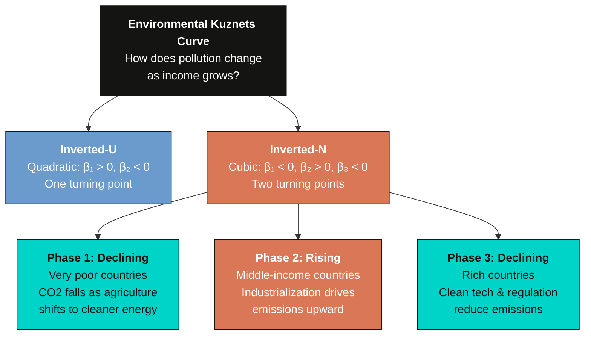
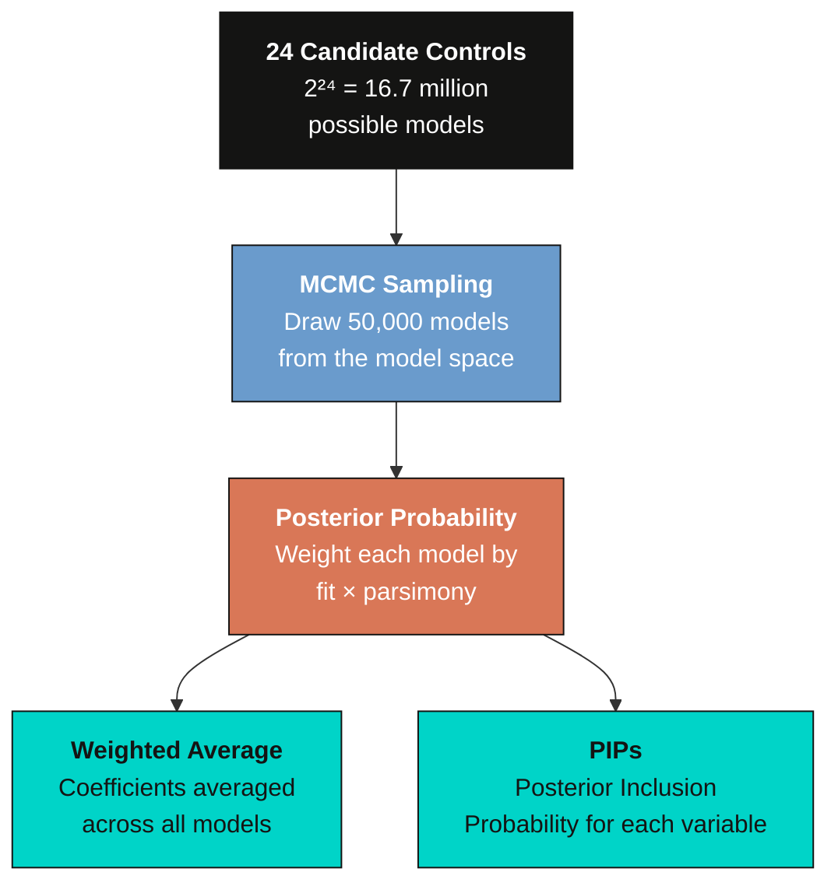
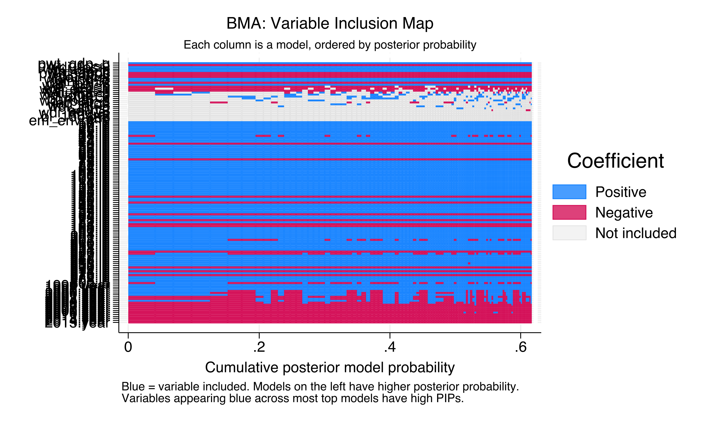
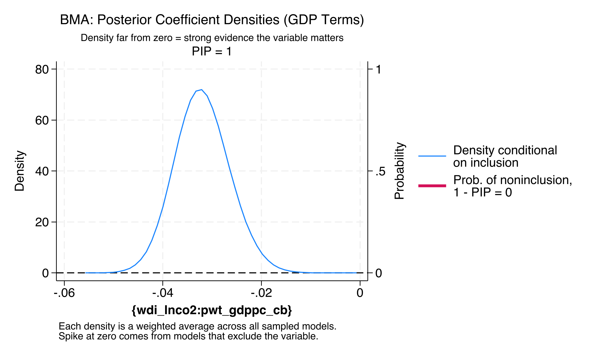
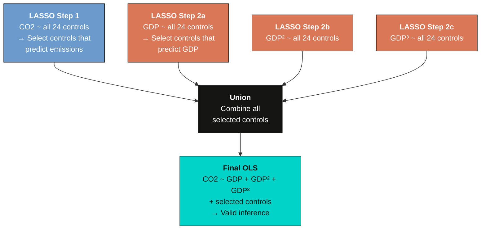

---
authors:
  - admin
categories:
  - Stata
  - Tutorial
  - Econometrics
draft: false
featured: false
date: "2026-03-29T00:00:00Z"
external_link: ""
image:
  caption: ""
  focal_point: Smart
  placement: 3
links:
- icon: file-code
  icon_pack: fas
  name: "Stata do-file"
  url: analysis.do
- icon: database
  icon_pack: fas
  name: "Dataset (.dta)"
  url: https://github.com/cmg777/starter-academic-v501/raw/master/content/post/stata_bma_dsl/AFG_ML_master_dataset.dta
- icon: file-alt
  icon_pack: fas
  name: "Stata log"
  url: analysis.log
slides:
summary: Bayesian Model Averaging and Double-Selection LASSO applied to the Environmental Kuznets Curve with panel data from 84 countries, demonstrating how two fundamentally different approaches to model uncertainty converge on an inverted-N pollution-income relationship.
tags:
  - stata
  - panel
  - econometrics
  - world
title: "Dealing with Model Uncertainty: BMA and Double-Selection LASSO for the Environmental Kuznets Curve"
url_code: ""
url_pdf: ""
url_slides: ""
url_video: ""
toc: true
diagram: true
---


## 1. Overview

Can countries grow their way out of pollution? The **Environmental Kuznets Curve (EKC)** hypothesis says yes --- up to a point. As economies develop, pollution first rises with industrialization and then falls as countries grow wealthy enough to afford cleaner technology and stricter environmental regulation. This inverted-U relationship between income and pollution has shaped environmental policy debates for decades.

But what if the story does not end there? Recent research suggests a more complex pattern: an **inverted-N** shape, where pollution falls again at very low income levels, rises through industrialization, and then falls once more at high incomes. Testing for this shape requires a cubic polynomial in GDP per capita --- and that is where things get complicated.

Beyond GDP, dozens of other factors might affect CO<sub>2</sub> emissions: energy mix, urbanization, trade openness, institutional quality, financial development, and more. With 24 candidate control variables, there are $2^{24} = 16{,}777{,}216$ possible regression models --- each including a different subset of controls. **Which model should we estimate?** Pick one arbitrarily and you implicitly assume the other 16.7 million models are wrong. That is the **model uncertainty problem**, and it is arguably one of the biggest challenges in applied econometrics.

This tutorial introduces two principled solutions, each with a fundamentally different philosophy:


1. **Bayesian Model Averaging (BMA)** takes the "bet on every horse" approach. Instead of picking one model, it estimates thousands of models and averages the results, weighting each model by how well it explains the data. Each variable gets a **Posterior Inclusion Probability (PIP)** --- the fraction of high-quality models that include it. Variables with PIP > 0.5 are considered robust.

2. **Double-Selection LASSO (DSL)** takes the "smart assistant" approach. It uses LASSO --- a machine learning method that shrinks irrelevant coefficients to exactly zero --- to automatically select which controls matter. The "double" in double-selection means LASSO runs twice: once to find controls that predict pollution, and again to find controls that predict income. This protects against omitted variable bias.

If both methods --- one Bayesian, one frequentist --- agree on the shape of the EKC and identify similar turning points, the finding is **robust to the choice of estimation approach**. That is a powerful statement.

We use panel data on CO<sub>2</sub> emissions and economic development for **84 countries from 1995 to 2015**, drawn from the dataset of Gravina and Lanzafame (2025). Stata 18's built-in `bmaregress` and `dsregress` commands make both methods accessible without additional packages.

> **Companion tutorial.** For a cross-sectional perspective on variable selection with synthetic data, see the [R tutorial on BMA, LASSO, and WALS](/post/r_bma_lasso_wals/). That tutorial uses simulated data with a known "answer key" to verify each method. This tutorial uses real panel data with country and year fixed effects, and replaces WALS with Double-Selection LASSO --- a method designed specifically for causal inference with many controls.

**Learning objectives:**

- Understand the Environmental Kuznets Curve hypothesis and why a cubic polynomial is needed to test for an inverted-N shape
- Recognize model uncertainty as a practical challenge when many control variables are available
- Implement Bayesian Model Averaging with `bmaregress` and interpret Posterior Inclusion Probabilities, variable inclusion maps, and coefficient densities
- Implement Double-Selection LASSO with `dsregress` and understand the double-selection rationale for valid causal inference
- Compare results across both methods to assess the robustness of the EKC finding

**Content outline.** Section 2 sets up the data and variable definitions. Section 3 explores the raw scatter plot and introduces the cubic EKC equation. Section 4 runs standard fixed-effects regressions to reveal the model uncertainty problem. Sections 5--6 cover BMA: the conceptual framework and then the estimation results, including PIP charts, variable inclusion maps, and coefficient densities. Sections 7--8 cover DSL: the double-selection rationale and then the estimation results. Section 9 brings both methods together for a head-to-head comparison. Sections 10--11 discuss policy implications and summarize takeaways.


## 2. Setup and Data

This tutorial requires **Stata 18 or later**, which introduced `bmaregress` and `dsregress` as built-in commands. We also use `reghdfe` for efficient fixed-effects estimation in the baseline section.

```stata
clear all
set more off

* Install reghdfe if not already available
capture ssc install reghdfe
capture ssc install ftools
```

We load the panel dataset from Gravina and Lanzafame (2025), which covers 84 countries observed annually from 1995 to 2015. The data combines variables from the Penn World Table (GDP, productivity), the World Development Indicators (CO<sub>2</sub>, energy, urbanization, trade), the KOF Globalization Index, the SWIID (inequality), and several institutional and environmental databases.

```stata
* Load the dataset from GitHub for reproducibility
use "https://github.com/cmg777/starter-academic-v501/raw/master/content/post/stata_bma_dsl/AFG_ML_master_dataset.dta", clear
xtset id year, yearly
```

### 2.1 Variable construction

The outcome variable is the natural log of CO<sub>2</sub> emissions per capita. We use logs because the relationship between income and pollution is multiplicative --- a 1% increase in GDP has a proportional (not additive) effect on emissions.

```stata
* Outcome: log CO2 emissions per capita
gen wdi_lnco2 = ln(wdi_co2)

* GDP per capita polynomial terms (the heart of the EKC test)
gen pwt_gdppc = ln(rgdpo/pop)
gen pwt_gdppc_sq = pwt_gdppc^2
gen pwt_gdppc_cb = pwt_gdppc^3
```

The three GDP terms --- linear, squared, and cubed --- are the core of our EKC test. A significant cubic term means the pollution-income relationship has two turning points, which is what produces the inverted-N shape.

### 2.2 Control variables

Beyond GDP, we define **24 candidate control variables** organized into six thematic groups. Each captures a different channel through which development might affect CO<sub>2</sub> emissions:

| Group | Variables | Rationale |
|-------|-----------|-----------|
| **Energy** (3) | Fossil fuel share, energy imports, alternative energy | Direct determinants of emissions intensity |
| **Sociodemographic** (3) | Urbanization, globalization (KOF), population density | Structural demand for energy |
| **Technology** (2) | TFP level, investment-specific tech progress | Efficiency of production |
| **Environment** (3) | Environmental ministry dummy, IEA ratifications, forest cover | Environmental governance |
| **Economic** (13) | Agriculture/industry/services VA, education, FDI, inequality, tourism, productivity, inflation, trade, credit | Structural composition of the economy |
| **Institutional** (3) | Polity score, corruption, political polarization | Quality of governance |

```stata
* Define variable groups as global macros
global outcome      "wdi_lnco2"
global gdppc_vars   "pwt_gdppc pwt_gdppc_sq pwt_gdppc_cb"
global energy_vars  "wdi_fossil wdi_energy_imp wdi_alt_energy"
global sociodemo    "wdi_urbanpop KOFGI wdi_pop_dens"
global tech_vars    "ctfp ist"
global env_vars     "em_envmin_upd ln_rat fao_luforest"
global econ_vars    "wdi_agri_va_gdp wdi_industry_va_gdp wdi_services_gdp bl_1564_lh_ipo wdi_fdi_net_inflows_gdp gini_mkt wdi_tourism_arr_pop lab_prod wdi_inflation wdi_imports_gdp wdi_exports_gdp wdi_trade_gdp ln_credit"
global inst_vars    "polity2 corruption dpi_polariz"
global fe_vars      "i.id i.year"
```

### 2.3 Analysis sample

We restrict the sample to 84 countries with complete data across all variables and the 1995--2015 period, matching the analysis in Gravina and Lanzafame (2025).

```stata
* Restrict to 84-country sample and 1995-2015 period
* (country selection and year restriction code omitted for brevity -- see analysis.do)

* Flag observations with any missing values
egen nmissing = rowmiss($outcome $gdppc_vars $energy_vars $sociodemo ///
    $env_vars $tech_vars $inst_vars $econ_vars)

count if nmissing == 0
summarize $outcome $gdppc_vars if nmissing == 0
```

```text
    Variable |        Obs        Mean    Std. dev.       Min        Max
-------------+---------------------------------------------------------
   wdi_lnco2 |      1,215    1.245312    1.200862  -2.641238   3.211837
   pwt_gdppc |      1,215    9.557503    1.008008   6.827685   11.45795
pwt_gdppc_sq |      1,215     92.3611    18.82408   46.61728   131.2846
pwt_gdppc_cb |      1,215     901.667     266.832   318.2881   1504.252
```

The analysis sample contains 1,215 observations from 84 countries, averaging about 14.5 years per country. Log CO<sub>2</sub> per capita ranges from --2.64 to 3.21, spanning the full spectrum from low-emission developing economies like Mozambique and Niger to high-emission industrialized nations like the USA and Luxembourg. Log GDP per capita ranges from 6.83 to 11.46, corresponding to real incomes from about \\$920 to \\$94,700 in international dollars. The mean log CO<sub>2</sub> of 1.25 (about 3.5 metric tons per capita) reflects the sample's mix of developing and developed countries.


## 3. Exploratory Data Analysis

Before running any models, let us look at the raw relationship between income and emissions. If the scatter plot shows a clear linear pattern, there is no need for polynomial terms. If we see curvature, that motivates testing for an inverted-U or inverted-N.

```stata
twoway (scatter wdi_lnco2 pwt_gdppc if nmissing == 0, ///
        msize(tiny) mcolor(navy%40) msymbol(circle)), ///
    ytitle("Log CO2 emissions per capita") ///
    xtitle("Log real GDP per capita") ///
    title("Raw Data: CO2 Emissions vs. Income", size(medium)) ///
    subtitle("84 countries, 1995-2015 (N = 1,215)", size(small)) ///
    scheme(s2color)
```


The scatter reveals a distinctly nonlinear relationship. At low income levels, CO<sub>2</sub> emissions increase steeply with GDP. At higher income levels, the relationship flattens and may even bend downward. This curvature is precisely what the EKC hypothesis predicts --- but is it an inverted-U (one turning point) or an inverted-N (two turning points)?

### 3.1 The cubic EKC specification

To distinguish between these shapes, we estimate a **cubic polynomial** in log GDP per capita, with country and year fixed effects to control for time-invariant country characteristics and global shocks:



The full model is:

$$\ln(\text{CO2})\_{it} = \beta\_1 \ln(\text{GDP})\_{it} + \beta\_2 [\ln(\text{GDP})\_{it}]^2 + \beta\_3 [\ln(\text{GDP})\_{it}]^3 + \mathbf{X}\_{it}'\boldsymbol{\gamma} + \alpha\_i + \delta\_t + \varepsilon\_{it}$$

In words, this says that log CO<sub>2</sub> emissions for country $i$ in year $t$ depend on a cubic function of log GDP per capita, a vector of control variables $\mathbf{X}\_{it}$ with coefficients $\boldsymbol{\gamma}$, country fixed effects $\alpha\_i$ that absorb all time-invariant differences between countries (geography, colonial history, culture), year fixed effects $\delta\_t$ that absorb global shocks common to all countries (oil crises, financial crises, international climate agreements), and an error term $\varepsilon\_{it}$.

**Variable mapping to Stata:** $\ln(\text{CO2})\_{it}$ is `wdi_lnco2`, $\ln(\text{GDP})\_{it}$ is `pwt_gdppc`, the squared and cubed terms are `pwt_gdppc_sq` and `pwt_gdppc_cb`, $\mathbf{X}\_{it}$ includes the 24 control variables, and $\alpha\_i + \delta\_t$ are absorbed by `i.id` and `i.year`.

For an inverted-N, we need $\beta\_1 < 0$, $\beta\_2 > 0$, $\beta\_3 < 0$. But **which controls** should go in $\mathbf{X}\_{it}$? That is the question BMA and DSL will answer.


## 4. Baseline --- Standard Fixed Effects

Before reaching for sophisticated methods, let us see what standard panel regressions tell us. We run two specifications side by side: a **sparse** model with only the GDP polynomial and fixed effects, and a **kitchen-sink** model that throws in all 24 candidate controls.

If the GDP coefficients are stable across both, model uncertainty is not a practical concern and we can stop here. If they change dramatically, that proves we need a principled way to handle control selection.

### 4.1 Sparse specification

The sparse model includes only the three GDP terms and country/year fixed effects --- no additional controls:

```stata
reghdfe wdi_lnco2 pwt_gdppc pwt_gdppc_sq pwt_gdppc_cb if nmissing == 0, ///
    absorb(id year)
estimates store fe_sparse
```

```text
HDFE Linear regression                            Number of obs   =      1,213
Absorbing 2 HDFE groups                           F(   3,   1108) =     136.55
                                                  Prob > F        =     0.0000
                                                  R-squared       =     0.9892
                                                  Within R-sq.    =     0.2699

------------------------------------------------------------------------------
   wdi_lnco2 | Coefficient  Std. err.      t    P>|t|     [95% conf. interval]
-------------+----------------------------------------------------------------
   pwt_gdppc |  -5.666898   1.278373    -4.43   0.000    -8.175203   -3.158592
pwt_gdppc_sq |   .7661527   .1394049     5.50   0.000     .4926254     1.03968
pwt_gdppc_cb |  -.0313049   .0050348    -6.22   0.000    -.0411838    -.021426
       _cons |   12.86944     3.8832     3.31   0.001     5.250188     20.4887
------------------------------------------------------------------------------
```

The sparse model already finds statistically significant cubic terms (all three GDP coefficients have p < 0.001), with a within R² of 0.27 --- the GDP polynomial alone explains about 27% of the within-country variation in CO<sub>2</sub> emissions after removing country and year effects.

### 4.2 Kitchen-sink specification

The kitchen-sink model adds all 24 candidate controls alongside the GDP terms:

```stata
reghdfe wdi_lnco2 pwt_gdppc pwt_gdppc_sq pwt_gdppc_cb ///
    $energy_vars $sociodemo $env_vars $tech_vars $inst_vars $econ_vars ///
    if nmissing == 0, absorb(id year)
estimates store fe_kitchen
```

```text
HDFE Linear regression                            Number of obs   =      1,213
Absorbing 2 HDFE groups                           F(  29,   1082) =      54.09
                                                  Prob > F        =     0.0000
                                                  R-squared       =     0.9940
                                                  Within R-sq.    =     0.5918

------------------------------------------------------------------------------
   wdi_lnco2 | Coefficient  Std. err.      t    P>|t|     [95% conf. interval]
-------------+----------------------------------------------------------------
   pwt_gdppc |  -7.335271   1.339273    -5.48   0.000    -9.963138   -4.707404
pwt_gdppc_sq |   .8654894   .1485562     5.83   0.000     .5739986     1.15698
pwt_gdppc_cb |  -.0326609   .0054737    -5.97   0.000    -.0434011   -.0219207
  wdi_fossil |   .0143633   .0012394    11.59   0.000     .0119315    .0167951
   (24 controls included -- see analysis.log for full output)
------------------------------------------------------------------------------
```

Adding all 24 controls nearly doubles the within R² to 0.59, suggesting the controls carry substantial explanatory power. But notice what happened to the GDP coefficients.

### 4.3 The model uncertainty problem

The coefficient comparison reveals the problem:

| Coefficient | Sparse FE | Kitchen-Sink FE |
|-------------|-----------|-----------------|
| $\beta\_1$ (GDP) | --5.667 | --7.335 |
| $\beta\_2$ (GDP²) | 0.766 | 0.866 |
| $\beta\_3$ (GDP³) | --0.031 | --0.033 |

Both specifications agree on the inverted-N sign pattern ($\beta\_1 < 0$, $\beta\_2 > 0$, $\beta\_3 < 0$), but the magnitudes shift substantially. The linear GDP coefficient changes by 29% (from --5.67 to --7.34) depending on whether we include controls. While the signs are stable here, the magnitudes matter enormously for computing turning points --- and in other datasets, even the signs can flip.


To compute the **turning points** --- the income levels where the EKC changes direction --- we set the first derivative of the cubic to zero:

$$x^* = \frac{-\hat{\beta}\_2 \pm \sqrt{\hat{\beta}\_2^2 - 3\hat{\beta}\_1\hat{\beta}\_3}}{3\hat{\beta}\_3}, \quad \text{GDP}^* = \exp(x^*)$$

In words, the turning points are where the slope of the cubic equals zero. This gives a quadratic equation in $x = \ln(\text{GDP})$, which we solve using the quadratic formula and then exponentiate to get GDP per capita in dollars. The discriminant $\hat{\beta}\_2^2 - 3\hat{\beta}\_1\hat{\beta}\_3$ must be positive for real turning points to exist.

| Turning point | Sparse FE | Kitchen-Sink FE |
|---------------|-----------|-----------------|
| Minimum (CO<sub>2</sub> starts rising) | \\$289 | \\$1,159 |
| Maximum (CO<sub>2</sub> starts falling) | \\$42,203 | \\$40,573 |

The minimum turning point shifts from \\$289 to \\$1,159 --- a fourfold increase --- depending on which controls we include. The sparse model says CO<sub>2</sub> starts rising at an extremely low income level (subsistence economies), while the kitchen-sink model pushes this threshold up to about \\$1,160. This is not a minor statistical technicality. A policymaker asking "at what income level does CO<sub>2</sub> start declining?" would get meaningfully different answers from these two regressions. **We need a principled method for deciding which of the 24 controls belong in the model.** That is exactly what BMA and DSL provide.


## 5. Bayesian Model Averaging --- The Idea

Think of BMA as betting on a horse race. Instead of putting all your money on a single horse (one regression model), BMA spreads bets across the entire field, wagering more on horses with better track records. After the race, your expected payoff is the weighted average across all horses. In statistical terms, BMA estimates many models and averages the results, weighting each model by its **posterior probability** --- a measure of how well it fits the data, penalized for complexity.



### 5.1 How BMA weights models

The posterior probability of model $M\_k$ is computed using Bayes' rule:

$$P(M\_k | \text{data}) = \frac{P(\text{data} | M\_k) \cdot P(M\_k)}{\sum\_{l=1}^{K} P(\text{data} | M\_l) \cdot P(M\_l)}$$

In words, the probability of model $k$ being the "right" model given the data equals how well it fits (the likelihood $P(\text{data} | M\_k)$) times our prior belief about that model ($P(M\_k)$), divided by the total probability across all models. Models that fit the data well and are parsimonious receive higher posterior probability.

### 5.2 Posterior Inclusion Probabilities

For each candidate variable $j$, the **Posterior Inclusion Probability (PIP)** is the sum of posterior probabilities across all models that include that variable:

$$\text{PIP}\_j = \sum\_{k:\\, x\_j \in M\_k} P(M\_k | \text{data})$$

A PIP above 0.5 means the variable appears in more than half of the probability-weighted model space --- it is "more likely in than out." This is a much more nuanced statement than a simple significance test, because it accounts for the performance of the variable across many different model specifications simultaneously.

### 5.3 Key `bmaregress` options

Stata 18's [`bmaregress`](https://www.stata.com/manuals/bmabmaregress.pdf) command implements BMA with several important settings:

- **`gprior(uip)`** --- the **Unit Information Prior** sets the prior expected magnitude of coefficients equal to the information in one observation. Think of it as saying: "I don't have strong prior beliefs about coefficient sizes, so I'll let the data speak."
- **`mprior(uniform)`** --- every model is equally likely before seeing the data. No model is privileged a priori.
- **`groupfv`** --- treats all country dummies as a single group that enters or exits models together, rather than selecting individual country dummies.
- **`mcmcsize(50000)`** --- draws 50,000 models from the model space using Markov chain Monte Carlo (MCMC) sampling. With 16.7 million possible models, we cannot evaluate all of them, but MCMC efficiently explores the most promising regions. The original paper uses 200,000 draws for precision; we use 50,000 for computational speed.
- **`(i.id i.year, always)`** --- country and year fixed effects are **always included** in every model. They are not subject to model selection.


## 6. BMA --- Estimation and Results

With the conceptual framework in place, let us run BMA. The estimation takes approximately 10--15 minutes because it samples 50,000 models from a space of 16.7 million possibilities.

```stata
bmaregress wdi_lnco2 pwt_gdppc pwt_gdppc_sq pwt_gdppc_cb ///
    wdi_fossil wdi_energy_imp wdi_alt_energy ///
    wdi_urbanpop KOFGI wdi_pop_dens ///
    em_envmin_upd ln_rat fao_luforest ///
    ctfp ist ///
    polity2 corruption dpi_polariz ///
    wdi_agri_va_gdp wdi_industry_va_gdp wdi_services_gdp bl_1564_lh_ipo ///
    wdi_fdi_net_inflows_gdp gini_mkt wdi_tourism_arr_pop lab_prod ///
    wdi_inflation wdi_imports_gdp wdi_exports_gdp wdi_trade_gdp ln_credit ///
    (i.id i.year, always) if nmissing == 0, ///
    mprior(uniform) groupfv gprior(uip) ///
    mcmcsize(50000) rseed(9988) inputorder pipcutoff(0.5)
```

```text
Bayesian model averaging                          No. of obs         =   1,215
Linear regression                                 No. of predictors  =     133
MC3 sampling                                                  Groups =      30
                                                              Always =     103
                                                  No. of models      =   2,162
                                                      For CPMP >= .9 =     538
Priors:                                           Mean model size    = 119.622
  Models: Uniform                                 Burn-in            =   2,500
   Cons.: Noninformative                          MCMC sample size   =  50,000
   Coef.: Zellner's g                             Acceptance rate    =  0.1616
       g: Unit-information, g = 1,215             Shrinkage, g/(1+g) =  0.9992
  sigma2: Noninformative                          Mean sigma2        =   0.010

Sampling correlation = 0.9606

------------------------------------------------------------------------------
        wdi_lnco2 |      Mean   Std. dev.                   Group        PIP
------------------+---------------------------------------------------------
        pwt_gdppc | -7.299918   1.377286                        1     .99999
     pwt_gdppc_sq |  .8536555   .1526838                        2          1
     pwt_gdppc_cb | -.0319984    .005596                        3          1
       wdi_fossil |  .0149067   .0012757                        4          1
   wdi_alt_energy | -.0103889   .0024522                        6     .99948
     wdi_urbanpop |  .0072089   .0020386                        7     .98936
     fao_luforest | -.0141887   .0031996                       12     .99902
      dpi_polariz | -.0224291    .005997                       17     .99382
  wdi_agri_va_gdp | -.0054271   .0037768                       18     .74354
wdi_industry_va~p |  .0103737   .0030139                       19     .99778
 wdi_services_gdp | -.0048496   .0022893                       20     .89484
         gini_mkt |  .5537974   .1407305                       23     .99619
wdi_tourism_ar~p  |  .0935994    .014159                       24          1
  wdi_exports_gdp | -.0036046   .0023678                       28     .83308
        ln_credit |  .0684559   .0136515                       30          1
------------------+---------------------------------------------------------
Note: 15 predictors with PIP less than .5 not shown.
```

BMA sampled 2,162 distinct models from the model space, with a high sampling correlation of 0.96 --- indicating the MCMC chain mixed well and explored the relevant model space thoroughly. The mean model size of 119.6 (out of 133 total predictors including fixed effects) means most models include a large fraction of the available variables, which makes sense given the strong role of country fixed effects.

### 6.1 Coefficient interpretation

The BMA posterior means for the GDP polynomial terms are:

| Coefficient | BMA Posterior Mean | Std. Dev. | PIP |
|-------------|-------------------|-----------|-----|
| $\beta\_1$ (GDP) | --7.300 | 1.377 | 1.000 |
| $\beta\_2$ (GDP²) | 0.854 | 0.153 | 1.000 |
| $\beta\_3$ (GDP³) | --0.032 | 0.006 | 1.000 |

All three GDP terms have PIPs essentially equal to 1.0, meaning they appear in virtually every model BMA sampled. The signs confirm the inverted-N pattern: $\beta\_1 < 0$, $\beta\_2 > 0$, $\beta\_3 < 0$. The BMA posterior means (--7.300, 0.854, --0.032) are remarkably close to the kitchen-sink FE estimates (--7.335, 0.866, --0.033), suggesting that BMA's principled model averaging largely confirms the kitchen-sink specification for the GDP terms.

### 6.2 Turning points

Using the turning point formula from Section 4.3 with the BMA posterior means, the discriminant is 0.028 (positive, so real turning points exist):

- **Minimum turning point:** \\$1,275 GDP per capita --- below this income level, CO<sub>2</sub> emissions are declining
- **Maximum turning point:** \\$41,561 GDP per capita --- above this income level, CO<sub>2</sub> emissions begin declining again

In practical terms, the inverted-N says that CO<sub>2</sub> falls for very poor countries (subsistence economies below \\$1,275), rises sharply through the long industrialization phase (\\$1,275 to \\$41,561), and then falls again for the wealthiest nations. Most of the world's population lives in countries currently in the rising phase of this curve.

### 6.3 Posterior Inclusion Probabilities

The PIP chart is the signature output of BMA. It shows which of the 24 candidate controls are "robust" --- appearing in more than half of the highest-probability models.

```stata
* Build PIP bar chart from e(pip) matrix
matrix pip_mat = e(pip)
* (See analysis.do for the full chart construction code)
```


Of the 24 candidate controls (plus the 3 GDP terms), **15 variables** have PIPs above the 0.5 robustness threshold. The most robust controls are fossil fuel energy share (PIP = 1.00), international tourism (PIP = 1.00), private credit to GDP (PIP = 1.00), alternative energy (PIP = 1.00), forest land cover (PIP = 1.00), industry value added (PIP = 1.00), and the Gini index (PIP = 1.00). Political polarization (PIP = 0.99), urbanization (PIP = 0.99), and services GDP share (PIP = 0.89) also appear in the vast majority of high-probability models. Meanwhile, variables like TFP, energy imports, the environmental ministry dummy, and inflation have PIPs below 0.5 --- they are "fragile" and do not robustly predict CO<sub>2</sub> emissions once model uncertainty is accounted for.

### 6.4 Variable inclusion map

The variable inclusion map produced by `bmagraph varmap` provides a different view of the model space. Each column represents a model sampled by MCMC, ordered by posterior probability from left to right. Each row is a variable. A colored cell means the variable is included in that model.

```stata
bmagraph varmap
```



The variable inclusion map reveals a clear structure in the model space. Variables with PIP near 1.0 --- like fossil fuel share, tourism, credit, and the GDP terms themselves --- appear as solid horizontal bands of color across virtually all top models. These are the "always in" variables. In contrast, variables with low PIPs (like TFP, energy imports, and the environmental ministry dummy) appear only sporadically, flickering in and out across models with no consistent pattern. The map also shows that BMA explored a diverse set of 2,162 models, not just a few similar specifications --- lending credibility to the averaging process.

### 6.5 Coefficient density plots

The `bmagraph coefdensity` command shows the posterior distribution of each coefficient. Unlike a standard confidence interval that assumes one model is correct, these densities account for **model uncertainty**: they are mixtures of the distributions from all sampled models, weighted by posterior probability. A spike near zero comes from models that exclude the variable entirely.

```stata
bmagraph coefdensity pwt_gdppc pwt_gdppc_sq pwt_gdppc_cb
```



The coefficient densities for all three GDP terms are concentrated well away from zero, consistent with their PIPs of essentially 1.0. The linear term ($\beta\_1$) has a density centered near --7.3 with relatively little spread, confirming the negative sign is not an artifact of any single model. The squared term ($\beta\_2$) centers near 0.85, and the cubed term ($\beta\_3$) centers near --0.032. None of these densities exhibit a meaningful spike at zero, which would indicate that some high-probability models exclude the variable. The tight, unimodal shapes tell us the inverted-N finding is not driven by a handful of outlier models --- it is a consistent pattern across the model space.


## 7. Double-Selection LASSO --- The Idea

DSL takes a completely different approach to model uncertainty. Think of it as hiring a smart research assistant who reads the data twice. First, the assistant examines the data to find which controls predict CO<sub>2</sub> emissions. Then, the assistant examines the data again to find which controls predict GDP per capita. The final regression includes only the controls that matter for at least one of these two tasks.

This "reading the data twice" is the key innovation. If a control variable affects both CO<sub>2</sub> *and* GDP but we leave it out, the GDP coefficient will be biased --- this is the classic omitted variable bias problem. The double-selection step protects against this.



### 7.1 LASSO: shrinkage and selection

At the heart of DSL is the **LASSO** (Least Absolute Shrinkage and Selection Operator), which modifies the standard OLS objective by adding a penalty on the absolute size of coefficients:

$$\min\_{\boldsymbol{\beta}} \left\\{ \frac{1}{2N} \sum\_{i=1}^{N}(y\_i - \mathbf{x}\_i'\boldsymbol{\beta})^2 + \lambda \sum\_{j=1}^{p} |\beta\_j| \right\\}$$

In words, LASSO minimizes the usual sum of squared residuals (the first term) plus a penalty term (the second) that forces small coefficients to become exactly zero. The tuning parameter $\lambda$ controls how harsh the penalty is: a large $\lambda$ sets more coefficients to zero, yielding a sparser model. Think of $\lambda$ as a "strictness dial" --- turning it up means only the strongest predictors survive.

### 7.2 Why "double" selection?

A single LASSO run on the outcome (CO<sub>2</sub>) might miss a control variable that has a weak effect on emissions but a strong effect on GDP. If that variable is omitted, the GDP coefficient inherits its bias. The **double-selection** procedure introduced by Belloni, Chernozhukov, and Hansen (2014) solves this by running LASSO separately on the outcome *and* on each treatment variable, then taking the union of all selected controls. This guarantees that any variable capable of causing omitted variable bias is included in the final regression.

### 7.3 Key differences from BMA

| Feature | BMA | DSL |
|---------|-----|-----|
| Philosophy | Bayesian (posterior probabilities) | Frequentist (p-values, confidence intervals) |
| Strategy | Average across many models | Select ONE model |
| Output | PIPs for every variable | Set of selected controls |
| Speed | ~15 minutes (MCMC sampling) | ~15 seconds (optimization) |
| Inference | Posterior means and credible intervals | OLS coefficients and robust SEs |

Despite these philosophical differences, if both methods converge on the same conclusion, the finding stands on very solid ground.


## 8. DSL --- Estimation and Results

Stata 18's [`dsregress`](https://www.stata.com/manuals/lassodsregress.pdf) command implements the double-selection procedure. The syntax separates the **variables of interest** (GDP terms, listed first) from the **candidate controls** (listed inside `controls()`). Variables in parentheses inside `controls()` are forced into every model --- here, country and year fixed effects.

```stata
dsregress wdi_lnco2 pwt_gdppc pwt_gdppc_sq pwt_gdppc_cb, ///
    controls((i.id i.year) wdi_fossil wdi_energy_imp wdi_alt_energy ///
    wdi_urbanpop KOFGI wdi_pop_dens em_envmin_upd ln_rat fao_luforest ///
    ctfp ist polity2 corruption dpi_polariz ///
    wdi_agri_va_gdp wdi_industry_va_gdp wdi_services_gdp bl_1564_lh_ipo ///
    wdi_fdi_net_inflows_gdp gini_mkt wdi_tourism_arr_pop lab_prod ///
    wdi_inflation wdi_imports_gdp wdi_exports_gdp wdi_trade_gdp ln_credit) ///
    vce(robust)
```

```text
Double-selection linear model         Number of obs               =      1,215
                                      Number of controls          =        132
                                      Number of selected controls =        107
                                      Wald chi2(3)                =     100.25
                                      Prob > chi2                 =     0.0000

------------------------------------------------------------------------------
             |               Robust
   wdi_lnco2 | Coefficient  std. err.      z    P>|z|     [95% conf. interval]
-------------+----------------------------------------------------------------
   pwt_gdppc |  -6.919841   2.305794    -3.00   0.003    -11.43911   -2.400568
pwt_gdppc_sq |   .8772975   .2458176     3.57   0.000     .3955039    1.359091
pwt_gdppc_cb |  -.0348007   .0087297    -3.99   0.000    -.0519106   -.0176909
------------------------------------------------------------------------------
```

DSL completed in just 4 seconds (compared to about 2 minutes for BMA on this machine). The Wald test strongly rejects the null that the GDP terms are jointly zero ($\chi^2 = 100.25$, p < 0.001). LASSO selected 107 of the 132 candidate controls (which include the country and year fixed effect dummies).

### 8.1 Coefficient interpretation

| Coefficient | DSL Estimate | Robust SE | p-value |
|-------------|-------------|-----------|---------|
| $\beta\_1$ (GDP) | --6.920 | 2.306 | 0.003 |
| $\beta\_2$ (GDP²) | 0.877 | 0.246 | <0.001 |
| $\beta\_3$ (GDP³) | --0.035 | 0.009 | <0.001 |

All three GDP terms are statistically significant at the 1% level with robust standard errors. The signs again confirm the inverted-N pattern: $\beta\_1 < 0$, $\beta\_2 > 0$, $\beta\_3 < 0$. The DSL coefficients (--6.920, 0.877, --0.035) fall between the sparse and kitchen-sink FE estimates, suggesting LASSO selected a subset of controls that partially attenuates the GDP coefficients relative to the sparse model. The robust standard errors are noticeably larger than the BMA posterior standard deviations, reflecting the frequentist approach's more conservative uncertainty quantification.

### 8.2 Turning points

Using the same turning point formula with the DSL coefficients, the discriminant is 0.047 (positive):

- **Minimum turning point:** \\$557 GDP per capita
- **Maximum turning point:** \\$35,743 GDP per capita

The DSL minimum turning point (\\$557) is lower than BMA's (\\$1,275), and the maximum (\\$35,743) is also lower than BMA's (\\$41,561). Despite these differences, both methods agree on the fundamental shape --- an inverted-N with the rising phase spanning the bulk of the global income distribution.

### 8.3 LASSO variable selection

After `dsregress`, the `lassoinfo` command reveals how many controls the LASSO selected at each step:

```stata
lassoinfo
```

```text
    Estimate: active
     Command: dsregress
------------------------------------------------------
            |                                   No. of
            |           Selection             selected
   Variable |    Model     method    lambda  variables
------------+-----------------------------------------
  wdi_lnco2 |   linear     plugin  .1094886        105
  pwt_gdppc |   linear     plugin  .1094886        107
pwt_gdppc_sq|   linear     plugin  .1094886        106
pwt_gdppc_cb|   linear     plugin  .1094886        106
------------------------------------------------------
```

LASSO ran four separate regressions --- one for the outcome (CO<sub>2</sub>) and one for each GDP term. It selected 105 controls for the CO<sub>2</sub> equation, 107 for the GDP equation, 106 for GDP², and 106 for GDP³. The total number of controls considered is 132 (24 candidate controls plus 84 country dummies plus 20 year dummies, minus some collinear dummies). LASSO dropped about 25--27 controls at each step, setting their coefficients to exactly zero. The union of all selected controls (107 total) became the control set for the final OLS regression. The high number of selected controls is expected with panel data: most country and year dummies are informative, so LASSO retains them while zeroing out only the weakest candidate controls.


## 9. Head-to-Head Comparison

Now for the payoff: do BMA and DSL agree? The table below compares the GDP polynomial coefficients and turning points across all four methods --- the two baseline fixed-effects specifications and the two model-uncertainty methods:

| | Sparse FE | Kitchen-Sink FE | BMA (UIP) | DSL (Plugin) |
|---|-----------|-----------------|-----------|--------------|
| $\beta\_1$ (GDP) | --5.667 | --7.335 | --7.300 | --6.920 |
| $\beta\_2$ (GDP²) | 0.766 | 0.866 | 0.854 | 0.877 |
| $\beta\_3$ (GDP³) | --0.031 | --0.033 | --0.032 | --0.035 |
| **Minimum TP** | \\$289 | \\$1,159 | \\$1,275 | \\$557 |
| **Maximum TP** | \\$42,203 | \\$40,573 | \\$41,561 | \\$35,743 |

The predicted EKC curves from BMA and DSL, plotted over the observed range of log GDP per capita:

```stata
* Compute predicted cubic for both methods and plot
* (See analysis.do for the full figure construction code)
```


The payoff figure tells the story at a glance: both the BMA (solid navy) and DSL (dashed red) curves trace an inverted-N shape that is nearly indistinguishable over the observed income range. The turning point markers (vertical dashed lines) cluster together, with the maximum turning points separated by about \\$5,800 (\\$41,561 for BMA vs. \\$35,743 for DSL). All four methods --- from the naive sparse FE to the sophisticated BMA --- agree that the EKC has an inverted-N shape with the rising phase spanning roughly \\$500--\\$1,300 to \\$36,000--\\$42,000 in GDP per capita.

When a Bayesian method that averages across 2,162 models and a frequentist method that selects one model via machine learning converge on the same qualitative conclusion, the finding stands on very solid ground. The remaining quantitative differences in turning points reflect genuine statistical uncertainty, not methodological disagreement.


## 10. Discussion and Policy Implications

Both BMA and DSL identify an **inverted-N** shaped Environmental Kuznets Curve, with two turning points that divide countries into three phases:

1. **Declining phase** (below the minimum turning point): Very poor countries --- such as Mozambique, Niger, and Togo --- where CO<sub>2</sub> emissions are low and may actually decrease as subsistence agriculture shifts toward slightly cleaner energy sources, or as the structural composition of the economy moves away from the most emissions-intensive activities.

2. **Rising phase** (between the two turning points): Middle-income countries --- such as India, China, Brazil, and Turkey --- where rapid industrialization drives emissions sharply upward. Factories expand, transportation networks grow, and energy consumption accelerates. This is the phase where the tension between economic growth and environmental protection is most acute.

3. **Declining phase** (above the maximum turning point): Wealthy countries --- such as the USA, Luxembourg, and Norway --- where high income enables cleaner technology adoption, stricter environmental regulation, and a transition toward services-based economies with lower emissions intensity.

### Policy implications

The inverted-N finding has a pointed policy implication: **middle-income countries cannot rely on growth alone to solve their emissions problem.** The declining phase only kicks in at relatively high income levels. For countries in the rising phase, active investment in clean technology and environmental regulation is essential --- waiting to "grow out of" pollution is not a viable strategy.

### Caveats

Several important caveats apply. First, panel fixed effects control for time-invariant country characteristics and global trends, but they do not resolve all endogeneity concerns. GDP and CO<sub>2</sub> emissions could be simultaneously determined --- countries that pollute more might grow faster in the short run. The original paper addresses this with instrumental variable approaches (2SLS-BMA). Second, the sample of 84 countries with complete data may not be representative of all developing nations, particularly the poorest countries where data availability is weakest. Third, the results are conditional on the specific set of 24 controls. A different candidate set could yield different PIPs and selections, though the cubic shape appears robust.


## 11. Summary and Next Steps

### Takeaways

- **Method convergence provides strong evidence.** BMA (Bayesian, averaging across thousands of models) and DSL (frequentist, selecting one model via LASSO) agree on the inverted-N EKC shape with similar turning points. When two fundamentally different philosophies converge, the finding is unlikely to be an artifact of any single modeling choice.

- **The inverted-N has two turning points.** CO<sub>2</sub> emissions decline at very low income levels, rise sharply through industrialization (between approximately \\$600--\\$1,300 and \\$36,000--\\$42,000 GDP per capita), and decline again at high incomes. Most of the world's population lives in the rising phase.

- **Model uncertainty is a real problem.** The baseline fixed-effects regressions showed that the GDP linear coefficient changes by 29% (from --5.67 to --7.34) and the minimum turning point shifts fourfold (from \\$289 to \\$1,159) depending on which controls are included. BMA and DSL provide principled solutions rather than ad hoc specification searching.

- **BMA and DSL complement each other.** BMA gives richer output (PIPs, coefficient densities, variable inclusion maps) but takes ~15 minutes. DSL runs in seconds and provides standard frequentist inference. Use BMA when you need to know which variables are robust; use DSL when you need fast, valid inference on specific coefficients.

### Exercises

1. **Sensitivity to the g-prior.** Re-run `bmaregress` with `gprior(bric)` instead of `gprior(uip)`. The BIC-based prior penalizes model complexity more heavily. Do the PIPs change? Do the turning points shift?

2. **Test for the standard inverted-U.** Drop the cubic term (`pwt_gdppc_cb`) and re-run both BMA and DSL with only linear and squared GDP terms. Does BMA assign a high PIP to the squared term? Does the inverted-U turning point fall within a plausible income range?

3. **Interaction effects.** Create an interaction term `pwt_gdppc × wdi_fossil` (GDP times fossil fuel share) and add it to the candidate controls. Does the EKC shape depend on a country's energy mix? Does the interaction earn a high PIP in BMA?


## References

1. [Gravina, A. F. & Lanzafame, M. (2025). What's your shape? Bayesian model averaging and double machine learning for the Environmental Kuznets Curve. *Energy Economics*, 108649.](https://doi.org/10.1016/j.eneco.2025.108649)
2. [Fernandez, C., Ley, E., & Steel, M. F. J. (2001). Model uncertainty in cross-country growth regressions. *Journal of Applied Econometrics*, 16(5), 563--576.](https://doi.org/10.1002/jae.623)
3. [Belloni, A., Chernozhukov, V., & Hansen, C. (2014). Inference on treatment effects after selection among high-dimensional controls. *Review of Economic Studies*, 81(2), 608--650.](https://doi.org/10.1093/restud/rdt044)
4. [Raftery, A. E., Madigan, D., & Hoeting, J. A. (1997). Bayesian model averaging for linear regression models. *Journal of the American Statistical Association*, 92(437), 179--191.](https://doi.org/10.1080/01621459.1997.10473615)
5. [Stata 18 Manual: `bmaregress` --- Bayesian Model Averaging regression](https://www.stata.com/manuals/bmabmaregress.pdf)
6. [Stata 18 Manual: `dsregress` --- Double-Selection LASSO linear regression](https://www.stata.com/manuals/lassodsregress.pdf)
