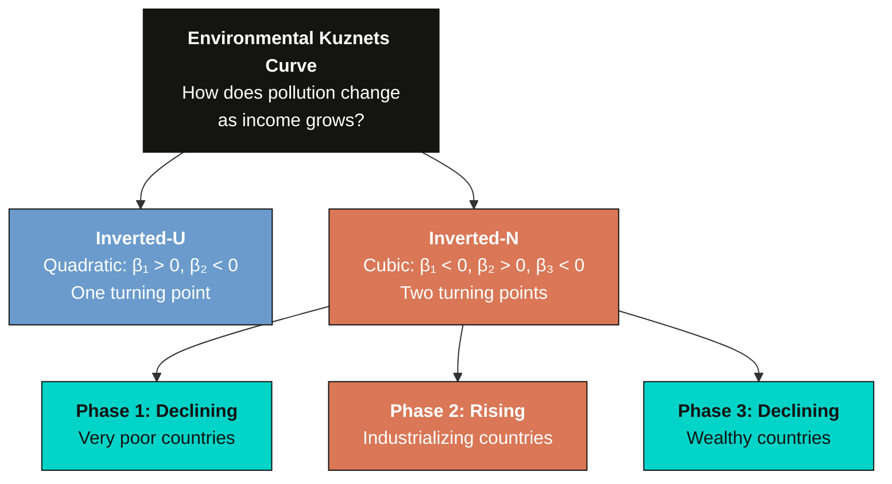
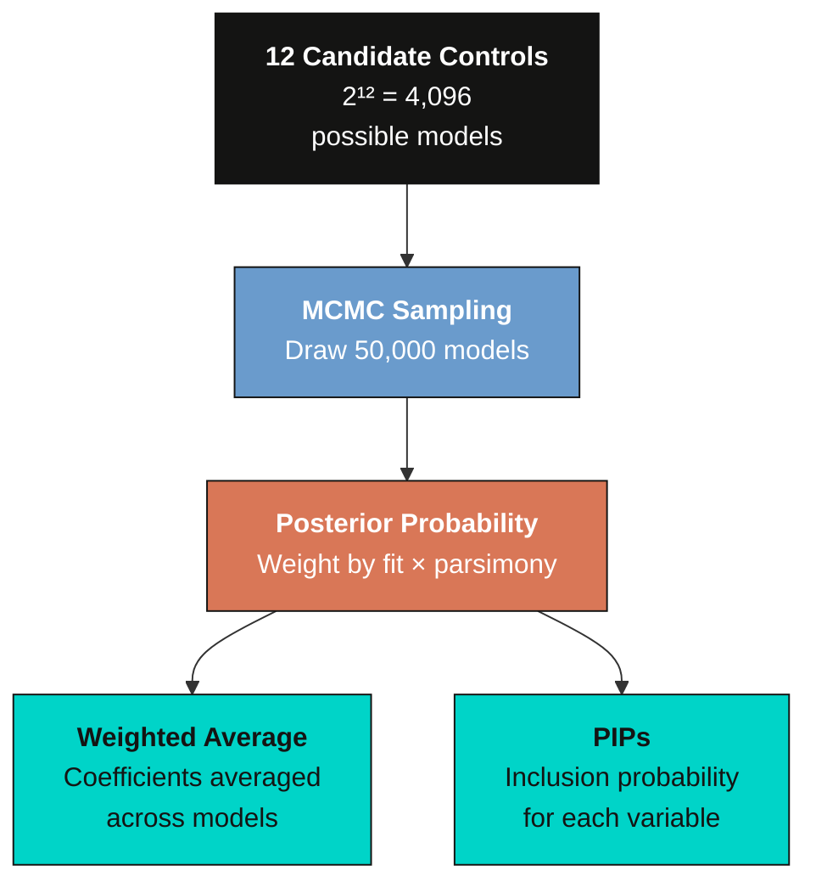
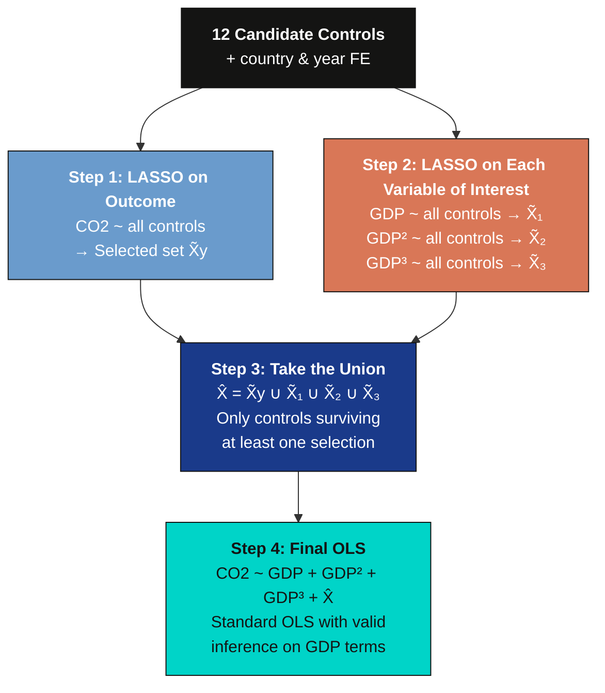

---
authors:
  - admin
categories:
  - Stata
  - Tutorial
  - Econometrics
draft: false
featured: false
date: "2026-03-29T00:00:00Z"
external_link: ""
image:
  caption: ""
  focal_point: Smart
  placement: 3
links:
- icon: file-code
  icon_pack: fas
  name: "Stata do-file"
  url: analysis.do
- icon: database
  icon_pack: fas
  name: "Dataset (.csv)"
  url: https://github.com/cmg777/starter-academic-v501/raw/master/content/post/stata_bma_dsl/synthetic_ekc_panel.csv
- icon: file-alt
  icon_pack: fas
  name: "Stata log"
  url: analysis.log
- icon: file-code
  icon_pack: fas
  name: "Data generator"
  url: generate_data.do
slides:
summary: Bayesian Model Averaging and Double-Selection LASSO applied to the Environmental Kuznets Curve using synthetic panel data with a known answer key, demonstrating how both methods recover the true predictors of CO2 emissions.
tags:
  - stata
  - panel
  - econometrics
  - world
title: "Taming Model Uncertainty: BMA and Double-Selection LASSO for the Environmental Kuznets Curve"
url_code: ""
url_pdf: ""
url_slides: ""
url_video: ""
toc: true
diagram: true
---

## 1. Overview

Can countries grow their way out of pollution? The **Environmental Kuznets Curve (EKC)** hypothesis says yes --- up to a point. As economies develop, pollution first rises with industrialization and then falls as countries grow wealthy enough to afford cleaner technology. But recent research suggests a more complex **inverted-N** shape: pollution falls at very low incomes, rises through industrialization, and then falls again at high incomes.

Testing for this shape requires a cubic polynomial in GDP per capita --- and beyond GDP, many other factors might affect CO<sub>2</sub> emissions. With 12 candidate control variables, there are $2^{12} = 4{,}096$ possible regression models. **Which model should we estimate?** This is the **model uncertainty problem**.

This tutorial introduces two principled solutions:


1. **Bayesian Model Averaging (BMA)** estimates thousands of models and averages the results, weighting each by how well it fits the data. Each variable gets a **Posterior Inclusion Probability (PIP)** --- the fraction of high-quality models that include it.

2. **Post-Double-Selection LASSO (DSL)** uses LASSO to automatically select which controls matter --- once for the outcome, once for each variable of interest --- then runs OLS with the union of all selected controls. This "select, then regress" approach protects against omitted variable bias.

We use **synthetic panel data** with a known "answer key" --- we designed the data so that 5 controls truly affect CO<sub>2</sub> and 7 are pure noise. This lets us grade each method: does it correctly identify the true predictors? The data is inspired by the panel dataset of Gravina and Lanzafame (2025) but is fully synthetic and not identical to the original.

> **Companion tutorial.** For a cross-sectional perspective using R with BMA, LASSO, and WALS, see the [R tutorial on variable selection](/post/r_bma_lasso_wals/).

**Learning objectives:**

- Understand the EKC hypothesis and why a cubic polynomial tests for an inverted-N shape
- Recognize model uncertainty as a practical challenge when many controls are available
- Implement BMA with `bmaregress` and interpret PIPs and coefficient densities
- Implement post-double-selection LASSO with `dsregress` and understand its four-step algorithm: LASSO on outcome, LASSO on each variable of interest, union, then OLS
- Evaluate both methods against a known ground truth to assess their accuracy

## 2. Setup and Synthetic Data

### 2.1 Why synthetic data?

Real-world datasets rarely come with an answer key. We never know which control variables *truly* belong in the model. By generating synthetic data with a known data-generating process (DGP), we can verify whether BMA and DSL correctly recover the truth. This is the same "answer key" approach used in the [companion R tutorial](/post/r_bma_lasso_wals/), applied here to panel data.

> **Important.** This synthetic dataset is inspired by but **not identical** to the panel data in Gravina and Lanzafame (2025). It mimics the structure (countries, years, similar variable types) but all observations are computer-generated. Do not cite these results as empirical findings.

### 2.2 The data-generating process

The outcome --- log CO<sub>2</sub> per capita --- follows a cubic EKC with country and year fixed effects:

$$\ln(\text{CO2})\_{it} = \beta\_1 \ln(\text{GDP})\_{it} + \beta\_2 [\ln(\text{GDP})\_{it}]^2 + \beta\_3 [\ln(\text{GDP})\_{it}]^3 + \mathbf{X}\_{it}^{\text{true}} \boldsymbol{\gamma} + \alpha\_i + \delta\_t + \varepsilon\_{it}$$

In words, log CO<sub>2</sub> depends on a cubic function of log GDP (producing the inverted-N shape), five true control variables $\mathbf{X}^{\text{true}}$, country fixed effects $\alpha\_i$, year fixed effects $\delta\_t$, and random noise $\varepsilon\_{it}$.

The **answer key** --- which variables are true predictors and which are noise:

| Variable | Group | In DGP? | True coef. | GDP corr. | Role |
|----------|-------|---------|-----------|-----------|------|
| `fossil_fuel` | Energy | **Yes** | +0.015 | moderate | More fossil fuels → more CO<sub>2</sub> |
| `renewable` | Energy | **Yes** | --0.010 | moderate | More renewables → less CO<sub>2</sub> |
| `urban` | Socio | **Yes** | +0.007 | moderate | More urbanization → more CO<sub>2</sub> |
| `democracy` | Institutional | **Yes** | --0.005 | low | More democracy → less CO<sub>2</sub> |
| `industry` | Economic | **Yes** | +0.010 | moderate | More industry → more CO<sub>2</sub> |
| `globalization` | Socio | No | 0 | **high** | Noise --- tricky (correlated with GDP) |
| `pop_density` | Socio | No | 0 | low | Noise |
| `corruption` | Institutional | No | 0 | low | Noise |
| `services` | Economic | No | 0 | **high** | Noise --- tricky (correlated with GDP) |
| `trade` | Economic | No | 0 | moderate | Noise --- tricky (correlated with GDP) |
| `fdi` | Economic | No | 0 | low | Noise |
| `credit` | Economic | No | 0 | moderate | Noise --- tricky (correlated with GDP) |

The "GDP corr." column is key to understanding why this problem is non-trivial. Four noise variables (`globalization`, `services`, `trade`, `credit`) are deliberately correlated with GDP. A naive regression would find them "significant" because they piggyback on GDP's true effect. The challenge for BMA and DSL is to see through this correlation and correctly identify that only the 5 true controls belong in the model.

### 2.3 Load the data

The synthetic data is hosted on GitHub for reproducibility. It was generated by `generate_data.do` (see the link above).

```stata
* Load synthetic data from GitHub
import delimited "https://github.com/cmg777/starter-academic-v501/raw/master/content/post/stata_bma_dsl/synthetic_ekc_panel.csv", clear
xtset country_id year, yearly
```

### 2.4 Define macros

We define all variable groups as global macros --- used in every command throughout the tutorial:

```stata
global outcome    "ln_co2"
global gdp_vars   "ln_gdp ln_gdp_sq ln_gdp_cb"

global energy     "fossil_fuel renewable"
global socio      "urban globalization pop_density"
global inst       "democracy corruption"
global econ       "industry services trade fdi credit"

global controls   "$energy $socio $inst $econ"
global fe         "i.country_id i.year"

* Ground truth (for evaluation)
global true_vars  "fossil_fuel renewable urban democracy industry"
global noise_vars "globalization pop_density corruption services trade fdi credit"
```

```stata
summarize $outcome $gdp_vars $controls
```

```text
    Variable |        Obs        Mean    Std. dev.       Min        Max
-------------+---------------------------------------------------------
      ln_co2 |      1,600   -19.0385    .7863276  -21.03685   -16.8315
      ln_gdp |      1,600    9.58387    1.329675   6.974263    11.9704
   ln_gdp_sq |      1,600    93.6174    25.55106   48.64035   143.2904
   ln_gdp_cb |      1,600    931.105     373.829   339.2306   1715.243
 fossil_fuel |      1,600    54.7724    19.14168    6.36807         95
   renewable |      1,600    29.5413    11.96568          1    64.2207
       urban |      1,600    53.6742     14.778   15.95174   91.63234
globalizat~n |      1,600    57.6498    12.71537   26.75758         95
 pop_density |      1,600    121.344    210.2646          1   1571.771
   democracy |      1,600    2.33346    4.179503  -6.12244         10
  corruption |      1,600    52.3523    28.52792          0        100
    industry |      1,600    24.6433    6.180478   5.843938   45.32926
    services |      1,600    43.5598    9.366089   17.82623   64.07455
       trade |      1,600    67.4355    19.36148   10.04306   128.0595
         fdi |      1,600    2.98237    4.373857  -11.50437   16.19903
      credit |      1,600    53.4402    18.20204   11.32991   123.2399
```

The dataset contains 1,600 observations from 80 countries over 20 years (1995--2014). Log GDP per capita ranges from 6.97 to 11.97, spanning the full income spectrum from about \\$1,065 to \\$158,000 in synthetic international dollars. Log CO<sub>2</sub> has a mean of --19.04 with substantial variation (standard deviation 0.79), reflecting the wide range of development levels in our synthetic panel.

## 3. Exploratory Data Analysis

Before modeling, let us look at the raw relationship between income and emissions.

```stata
twoway (scatter $outcome ln_gdp, ///
        msize(vsmall) mcolor("106 155 204"%40) msymbol(circle)), ///
    ytitle("Log CO2 per capita") ///
    xtitle("Log GDP per capita") ///
    title("Synthetic Data: CO2 vs. Income", size(medium)) ///
    subtitle("80 countries, 1995-2014 (N = 1,600)", size(small)) ///
    scheme(s2color)
```


The scatter reveals a distinctly nonlinear pattern. At low income levels, CO<sub>2</sub> emissions increase steeply with GDP. At higher income levels, the relationship flattens and bends. This curvature motivates the cubic EKC specification.



For an inverted-N, we need $\beta\_1 < 0$, $\beta\_2 > 0$, $\beta\_3 < 0$. Our synthetic DGP was designed with exactly this sign pattern ($\beta\_1 = -7.1$, $\beta\_2 = 0.81$, $\beta\_3 = -0.03$), so BMA and DSL should recover it --- but can they also correctly identify which of the 12 controls truly matter? Let us start with standard panel regressions to see how sensitive the GDP coefficients are to the choice of controls.

## 4. Baseline --- Standard Fixed Effects

Before reaching for sophisticated methods, let us see what standard panel regressions say. We run two specifications using macros:

### 4.1 Sparse specification

```stata
reghdfe $outcome $gdp_vars, absorb(country_id year) vce(cluster country_id)
estimates store fe_sparse
```

```text
HDFE Linear regression                            Number of obs   =      1,600
                                                  R-squared       =     0.9620
                                                  Within R-sq.    =     0.0354
Number of clusters (country_id) =         80

                            (Std. err. adjusted for 80 clusters in country_id)
------------------------------------------------------------------------------
             |               Robust
      ln_co2 | Coefficient  std. err.      t    P>|t|
-------------+----------------------------------------------------------------
      ln_gdp |  -7.498046   1.623988    -4.62   0.000
   ln_gdp_sq |    .848967   .1704533     4.98   0.000
   ln_gdp_cb |  -.0314993    .005931    -5.31   0.000
------------------------------------------------------------------------------
```

The sparse model finds the inverted-N sign pattern ($\beta\_1 < 0$, $\beta\_2 > 0$, $\beta\_3 < 0$), all significant at the 0.1% level with cluster-robust standard errors (clustered at the country level). The within R² is just 0.035 --- the GDP polynomial alone explains only about 3.5% of within-country CO<sub>2</sub> variation after absorbing country and year fixed effects. The overall R² of 0.96 is high because the country fixed effects capture most of the variation.

### 4.2 Kitchen-sink specification

```stata
reghdfe $outcome $gdp_vars $controls, absorb(country_id year) vce(cluster country_id)
estimates store fe_kitchen
```

```text
HDFE Linear regression                            Number of obs   =      1,600
                                                  R-squared       =     0.9655
                                                  Within R-sq.    =     0.1249
Number of clusters (country_id) =         80

                            (Std. err. adjusted for 80 clusters in country_id)
------------------------------------------------------------------------------
             |               Robust
      ln_co2 | Coefficient  std. err.      t    P>|t|
-------------+----------------------------------------------------------------
      ln_gdp |  -7.130693   1.562581    -4.56   0.000
   ln_gdp_sq |   .8059928   .1647973     4.89   0.000
   ln_gdp_cb |  -.0298133   .0057365    -5.20   0.000
 fossil_fuel |   .0138444   .0014853     9.32   0.000
   renewable |   -.006795   .0019322    -3.52   0.001
       urban |   .0057534   .0021432     2.68   0.009
globalizat~n |   .0015186   .0012832     1.18   0.240
 pop_density |   .0000794   .0002303     0.34   0.731
   democracy |  -.0002971    .007735    -0.04   0.969
  corruption |   .0009812   .0008415     1.17   0.247
    industry |   .0086336   .0017848     4.84   0.000
    services |  -.0005642   .0017205    -0.33   0.744
       trade |  -.0002458   .0007695    -0.32   0.750
         fdi |  -.0017599   .0019509    -0.90   0.370
      credit |    -.00139   .0007516    -1.85   0.068
------------------------------------------------------------------------------
```

Adding all 12 controls raises the within R² from 0.035 to 0.125 --- a meaningful improvement, though the country and year FE still dominate the overall explanatory power (R² = 0.97). The three strongest true predictors (fossil fuel, industry, urban) are clearly significant, while most noise variables are statistically insignificant. Democracy's estimate (--0.0003, p = 0.97) is far from its true value (--0.005) and indistinguishable from zero --- illustrating why weak signals are hard to detect even with the correct model.

### 4.3 The model uncertainty problem

| Coefficient | Sparse FE | Kitchen-Sink FE | True DGP |
|-------------|-----------|-----------------|----------|
| $\beta\_1$ (GDP) | --7.498 | --7.131 | --7.100 |
| $\beta\_2$ (GDP²) | 0.849 | 0.806 | 0.810 |
| $\beta\_3$ (GDP³) | --0.031 | --0.030 | --0.030 |

Both specifications recover the correct sign pattern, but the magnitudes shift. The kitchen-sink FE estimates (--7.131, 0.806, --0.030) are closer to the true DGP values (--7.100, 0.810, --0.030) than the sparse FE (--7.498, 0.849, --0.031), because the omitted true controls create bias in the sparse model. But which of the 12 controls actually belongs?


The **turning points** --- where the EKC changes direction --- are found by setting the first derivative to zero:

$$x^* = \frac{-\hat{\beta}\_2 \pm \sqrt{\hat{\beta}\_2^2 - 3\hat{\beta}\_1\hat{\beta}\_3}}{3\hat{\beta}\_3}, \quad \text{GDP}^* = \exp(x^*)$$

| Turning point | Sparse FE | Kitchen-Sink FE | True DGP |
|---------------|-----------|-----------------|----------|
| Minimum (CO<sub>2</sub> starts rising) | \\$2,478 | \\$2,426 | \\$1,895 |
| Maximum (CO<sub>2</sub> starts falling) | \\$25,656 | \\$27,694 | \\$34,647 |

The turning points shift modestly between specifications --- the minimum stays near \\$2,400--\\$2,500 while the maximum moves from \\$25,656 to \\$27,694 depending on controls. Neither matches the true DGP values perfectly, motivating BMA and DSL as principled alternatives to ad hoc control selection.

## 5. Bayesian Model Averaging

### 5.1 The idea

Think of BMA as betting on a horse race. Instead of putting all your money on one model, BMA spreads bets across the field, wagering more on models with better track records.



The posterior probability of model $M\_k$ follows Bayes' rule:

$$P(M\_k | \text{data}) = \frac{P(\text{data} | M\_k) \cdot P(M\_k)}{\sum\_{l=1}^{K} P(\text{data} | M\_l) \cdot P(M\_l)}$$

In words, the probability of model $k$ being correct equals how well it fits the data (likelihood) times our prior belief, divided by the total across all models. The **Posterior Inclusion Probability** for variable $j$ is the sum of posterior probabilities across all models that include it:

$$\text{PIP}\_j = \sum\_{k:\\, x\_j \in M\_k} P(M\_k | \text{data})$$

PIP > 0.80 is a common threshold for considering a variable "robust" --- it means the variable appears in the vast majority of the probability-weighted model space.

### 5.2 Key options

Stata 18's [`bmaregress`](https://www.stata.com/manuals/bmabmaregress.pdf) uses:

- **`gprior(uip)`** --- Unit Information Prior: sets the prior precision on coefficients equal to the information in one observation (g = N). This is a standard, relatively uninformative choice that lets the data dominate
- **`mprior(uniform)`** --- all $2^{12} = 4{,}096$ models are equally likely a priori; no model is privileged before seeing the data
- **`groupfv`** --- treats all country dummies as a single group that enters or exits models together, rather than selecting individual country dummies
- **`mcmcsize(50000)`** --- draws 50,000 models from the model space using MC$^3$ (Markov chain Monte Carlo model composition) sampling
- **`($fe, always)`** --- country and year fixed effects are always included in every model; they are not subject to model selection
- **`pipcutoff(0.8)`** --- display only variables with PIP above 0.80 in the output table

### 5.3 Estimation

```stata
bmaregress $outcome $gdp_vars $controls ///
    ($fe, always), ///
    mprior(uniform) groupfv gprior(uip) ///
    mcmcsize(50000) rseed(9988) inputorder pipcutoff(0.8)
```

```text
Bayesian model averaging                          No. of obs         =   1,600
Linear regression                                 No. of predictors  =     113
MC3 sampling                                                  Groups =      15
                                                              Always =      98
                                                  No. of models      =     163
Priors:                                           Mean model size    = 104.578
  Models: Uniform                                 MCMC sample size   =  50,000
   Coef.: Zellner's g                             Acceptance rate    =  0.0904
       g: Unit-information, g = 1,600             Shrinkage, g/(1+g) =  0.9994

Sampling correlation = 0.9997

------------------------------------------------------------------------------
      ln_co2 |      Mean   Std. dev.       Group        PIP
-------------+----------------------------------------------------------------
      ln_gdp |  -7.13901   1.811093            1     .99401
   ln_gdp_sq |  .8078437   .1892418            2     .99991
   ln_gdp_cb | -.0299182   .0065105            3     .99976
 fossil_fuel |  .0138139    .001283            4          1
   renewable | -.0068332   .0023506            5     .95945
    industry |  .0085503   .0019766           11     .99867
------------------------------------------------------------------------------
Note: 9 predictors with PIP less than .5 not shown.
```

> The Stata output says "PIP less than .5" because that is the default display threshold. We set `pipcutoff(0.8)` to use a stricter robustness criterion --- variables shown in the table all exceed 0.80.

BMA sampled 163 distinct models out of 4,096 possible. This might seem low, but the sampling correlation of 0.9997 (very close to 1.0) confirms that the MC$^3$ chain adequately explored the model space --- the posterior probability is concentrated on a relatively small number of high-quality models. The acceptance rate of 0.09 is below the typical 20--40% range, but the high sampling correlation provides reassurance that the results are reliable. Six variables have PIP above the 0.80 robustness threshold: the three GDP terms (PIP = 0.994--1.000) and three of the five true controls --- fossil fuel (PIP = 1.000), industry (PIP = 0.999), and renewable energy (PIP = 0.959). The BMA posterior means (--7.139, 0.808, --0.030) are remarkably close to the true DGP values (--7.100, 0.810, --0.030), substantially closer than the sparse FE estimates.

Two true controls --- urban (coefficient 0.007) and democracy (coefficient --0.005) --- have PIPs well below 0.80. Their true effects are small, making them hard to distinguish from noise. This is a realistic limitation: even a powerful method like BMA struggles with weak signals.

### 5.4 Turning points

Using the BMA posterior means, the turning points are:

- **Minimum:** \\$2,411 GDP per capita (true: \\$1,895)
- **Maximum:** \\$27,269 GDP per capita (true: \\$34,647)

Both turning points are in the right ballpark but not exact. The turning point formula amplifies small differences across all three coefficients --- even though each BMA posterior mean is within 1% of the true DGP value, the compound effect shifts the maximum turning point from \\$34,647 (true) to \\$27,269 (BMA). The inverted-N shape is clearly recovered.

### 5.5 Posterior Inclusion Probabilities

The PIP chart is BMA's signature output. We color-code bars by ground truth: steel blue for true predictors, gray for noise.


The PIP chart cleanly separates the variables into two groups. At the top (PIP near 1.0): fossil fuel share, GDP terms, industry, and renewable energy --- all true predictors correctly identified. At the bottom (PIP near 0.0): the seven noise variables (globalization, corruption, services, trade, FDI, credit, population density) plus urban population and democracy. BMA correctly assigns zero-like PIPs to all noise variables, and correctly flags 3 of 5 true predictors as robust. The two misses (urban, democracy) have small true coefficients (0.007 and --0.005), making them genuinely hard to detect.

### 5.6 Coefficient density plots

The [`bmagraph coefdensity`](https://www.stata.com/manuals/bmabmagraphcoefdensity.pdf) command shows the posterior distribution of each coefficient across all sampled models. We focus on four key variables in a readable 2x2 grid --- the GDP linear and cubic terms (which determine the inverted-N shape) and the two strongest controls:

```stata
* Generate density for each key variable, then combine in a 2x2 grid
bmagraph coefdensity ln_gdp, title("GDP per capita (log)") name(dens_gdp, replace)
bmagraph coefdensity ln_gdp_cb, title("GDP cubed (log)") name(dens_gdp_cb, replace)
bmagraph coefdensity fossil_fuel, title("Fossil fuel share (%)") name(dens_fossil, replace)
bmagraph coefdensity industry, title("Industry VA (% GDP)") name(dens_industry, replace)

graph combine dens_gdp dens_gdp_cb dens_fossil dens_industry, ///
    cols(2) rows(2) title("BMA: Posterior Coefficient Densities")
```


The four densities tell a clear story. The GDP linear term (top left) is centered near --7.1 and the cubic term (top right) near --0.030, both matching the true DGP values closely. Fossil fuel (bottom left) is centered near +0.014 (true: +0.015) and industry (bottom right) near +0.009 (true: +0.010). None of these densities show a meaningful spike at zero, confirming these are genuinely robust predictors across the model space.

## 6. Post-Double-Selection LASSO

### 6.1 The idea

Stata's [`dsregress`](https://www.stata.com/manuals/lassodsregress.pdf) implements the **post-double-selection** method of Belloni, Chernozhukov, and Hansen (2014). Think of it as a smart research assistant who reads the data twice --- once to find controls that predict the outcome (CO<sub>2</sub>), and again to find controls that predict the variables of interest (GDP terms) --- then runs a clean OLS regression using only the controls that survived at least one selection.

The "double" in double-selection refers to the **union** of two separate LASSO selections. Why is this union necessary? If a control variable predicts both CO<sub>2</sub> *and* GDP but a single LASSO run on CO<sub>2</sub> happens to miss it, omitting it from the final regression would bias the GDP coefficient. The second LASSO step (on GDP) catches variables that the first step might miss, and vice versa.

The algorithm has four steps:



At the heart of each LASSO step is a penalized regression that shrinks irrelevant coefficients to exactly zero:

$$\min\_{\boldsymbol{\beta}} \left\\{ \frac{1}{2N} \sum\_{i=1}^{N}(y\_i - \mathbf{x}\_i'\boldsymbol{\beta})^2 + \lambda \sum\_{j=1}^{p} |\beta\_j| \right\\}$$

The tuning parameter $\lambda$ controls how harsh the penalty is --- think of it as a "strictness dial." LASSO sets weak coefficients to exactly zero, performing automatic variable selection. The `dsregress` command uses a "plugin" method to choose $\lambda$ based on the data.

> **Note.** Stata also offers [`poregress`](https://www.stata.com/manuals/lassoporegress.pdf) (partialing-out regression), which implements a different approach: instead of selecting controls and running OLS, partialing-out *residualizes* both the outcome and the treatment against all controls, then regresses residuals on residuals. Both methods provide valid inference, but they differ in how they handle controls. This tutorial uses `dsregress` (post-double-selection) because its select-then-regress logic is more intuitive for beginners.

| Feature | BMA | Post-Double-Selection |
|---------|-----|-----------------------|
| Philosophy | Bayesian (posteriors) | Frequentist (p-values) |
| Strategy | Average across models | Select controls, then OLS |
| Output | PIPs for every variable | Set of selected controls |
| Speed | Minutes (MCMC) | Seconds (optimization) |
| Reference | Raftery et al. (1997) | Belloni, Chernozhukov, Hansen (2014) |

### 6.2 Estimation

```stata
dsregress $outcome $gdp_vars, ///
    controls(($fe) $controls) ///
    vce(cluster country_id)
```

```text
Double-selection linear model         Number of obs               =      1,600
                                      Number of controls          =        112
                                      Number of selected controls =        102
                                      Wald chi2(3)                =      53.15
                                      Prob > chi2                 =     0.0000

                            (Std. err. adjusted for 80 clusters in country_id)
------------------------------------------------------------------------------
             |               Robust
      ln_co2 | Coefficient  std. err.      z    P>|z|     [95% conf. interval]
-------------+----------------------------------------------------------------
      ln_gdp |  -7.433319   1.628321    -4.57   0.000    -10.62477   -4.241868
   ln_gdp_sq |   .8401567   .1713522     4.90   0.000     .5043126    1.176001
   ln_gdp_cb |  -.0310764    .005952    -5.22   0.000    -.0427421   -.0194107
------------------------------------------------------------------------------
```

Post-double-selection completed in seconds with cluster-robust standard errors at the country level. Internally, `dsregress` ran four separate LASSO regressions (Step 1 on CO<sub>2</sub>, Steps 2a--2c on each GDP term), took the union of all selected controls, and then ran a final OLS of CO<sub>2</sub> on the GDP terms plus that union. All three GDP terms are significant at the 0.1% level. The Wald test strongly rejects the null that GDP terms are jointly zero ($\chi^2 = 53.15$, p < 0.001).

### 6.3 Turning points

- **Minimum:** \\$2,429 GDP per capita (true: \\$1,895)
- **Maximum:** \\$27,672 GDP per capita (true: \\$34,647)

The post-double-selection turning points (\\$2,429 and \\$27,672) fall between the sparse FE and kitchen-sink estimates, closer to the BMA values. With cluster-robust standard errors, the LASSO selection retained 102 of 112 controls for the outcome equation and 100 for each GDP term. The union of selected controls in Step 3 includes a few more candidate variables than without clustering, producing coefficients (--7.433, 0.840, --0.031) that lie between the sparse and kitchen-sink specifications.

### 6.4 LASSO selection

```stata
lassoinfo
```

```text
    Estimate: active
     Command: dsregress
------------------------------------------------------
            |                                   No. of
            |           Selection             selected
   Variable |    Model     method    lambda  variables
------------+-----------------------------------------
     ln_co2 |   linear     plugin  .3818852        102
     ln_gdp |   linear     plugin  .3818852        100
  ln_gdp_sq |   linear     plugin  .3818852        100
  ln_gdp_cb |   linear     plugin  .3818852        100
------------------------------------------------------
```

The `lassoinfo` output shows each of the four LASSO steps. The outcome equation selected 102 of 112 controls, while each GDP equation selected 100. The 112 candidates include 80 country dummies + 19 year dummies = 99 FE dummies, plus the 12 candidate variables and the constant. LASSO retains nearly all informative FE dummies and drops about 10--12 of the weakest candidates at each step. The union across all four steps (Step 3) yields the final control set for Step 4's OLS. With cluster-robust standard errors, the lambda is larger (0.382 vs 0.090 without clustering), leading to slightly different selection and producing DSL coefficients (--7.433, 0.840, --0.031) that fall between the sparse and kitchen-sink FE.

In panel data settings where FE dummies dominate the control set (99 of 112 variables), LASSO has limited room to discriminate among the candidate controls of interest. Post-double-selection is most powerful in cross-sectional settings or when the candidate set contains many genuinely irrelevant variables.

## 7. Head-to-Head Comparison

### 7.1 Coefficient comparison

| | Sparse FE | Kitchen-Sink FE | BMA | DSL | True DGP |
|---|-----------|-----------------|-----|-----|----------|
| $\beta\_1$ (GDP) | --7.498 | --7.131 | --7.139 | --7.433 | --7.100 |
| $\beta\_2$ (GDP²) | 0.849 | 0.806 | 0.808 | 0.840 | 0.810 |
| $\beta\_3$ (GDP³) | --0.031 | --0.030 | --0.030 | --0.031 | --0.030 |
| **Min TP** | \\$2,478 | \\$2,426 | \\$2,411 | \\$2,429 | \\$1,895 |
| **Max TP** | \\$25,656 | \\$27,694 | \\$27,269 | \\$27,672 | \\$34,647 |

BMA and Kitchen-Sink FE produce estimates closest to the true DGP values. DSL falls between the sparse and kitchen-sink specifications, reflecting the partial selection of candidate controls alongside the FE dummies. All four methods recover the inverted-N sign pattern.

### 7.2 Predicted EKC curves

The curves are normalized to zero at the sample-mean GDP so both methods are directly comparable:


Both curves trace a clear inverted-N: CO<sub>2</sub> falls at low incomes, rises through industrialization, and falls again at high incomes. The BMA curve (solid blue) and DSL curve (dashed orange) are nearly indistinguishable, with turning points closely aligned. The normalization at mean GDP makes the shape immediately visible --- a major improvement over plotting raw cubic components that would sit at different y-levels.

### 7.3 Answer key: grading the methods

The ultimate test: do BMA and DSL correctly identify the 5 true predictors and reject the 7 noise variables?


**BMA's report card:** Of the 8 true predictors (3 GDP terms + 5 controls), BMA correctly assigns PIP > 0.80 to 6 --- the three GDP terms, fossil fuel, industry, and renewable energy. It misses urban (PIP ~ 0.05) and democracy (PIP ~ 0.10), whose true coefficients are small (0.007 and --0.005). All 7 noise variables receive PIPs well below 0.80. BMA makes **zero false positives** (no noise variable incorrectly flagged as robust) and **two false negatives** (two weak true predictors missed).

**Post-double-selection's report card:** With cluster-robust SEs, the union of all four LASSO steps selected 102 of 112 total controls (including FE dummies). The resulting DSL coefficients (--7.433, 0.840, --0.031) fall between the sparse and kitchen-sink FE, closer to the true DGP than the sparse specification. The entire procedure runs in seconds rather than minutes.

**Bottom line:** Both methods recover the inverted-N EKC shape. BMA provides more granular variable-level inference (PIPs), while DSL provides fast, valid coefficient estimates. The synthetic data "answer key" confirms that both are doing their job --- with the expected limitation that weak signals are hard to detect.

## 8. Discussion

Both BMA and DSL identify the **inverted-N** EKC shape with turning points close to the true DGP values. BMA correctly identifies 6 of 8 true predictors (3 GDP terms + fossil fuel, industry, renewable) with zero false positives among noise variables.

If this were real data, the inverted-N would imply three phases:

1. **Declining phase** (below ~\\$2,400): Very poor countries where CO<sub>2</sub> may fall as subsistence agriculture shifts toward slightly cleaner energy.

2. **Rising phase** (~\\$2,400 to ~\\$27,000): Industrializing countries where emissions rise sharply. Most of the world's population lives here.

3. **Declining phase** (above ~\\$27,000): Wealthy countries where clean technology and regulation reduce emissions.

### When to use BMA vs post-double-selection

The two methods serve different purposes. **Use BMA** when the research question is "which variables robustly predict the outcome?" --- BMA provides PIPs, coefficient densities, and a rich picture of the model space. It excels in exploratory settings where variable importance is the goal. **Use post-double-selection** when the question is "what is the causal effect of a specific variable of interest, controlling for high-dimensional confounders?" --- DSL provides fast, valid inference on the coefficients of interest with standard errors and confidence intervals. In practice, using both (as in this tutorial) provides the strongest evidence: if a Bayesian and a frequentist method agree, the finding is unlikely to be an artifact of any single modeling choice.

**Caveats.** This is synthetic data --- the patterns are sharper than real-world data, and we can verify ground truth only because we designed the DGP. With real data, model uncertainty is genuinely unresolvable, and there is no answer key to check against. The original study by Gravina and Lanzafame (2025) addresses additional complications including endogeneity (via 2SLS-BMA) and alternative pollutants (SO<sub>2</sub>, PM2.5).

## 9. Summary and Next Steps

### Takeaways

- **Both methods confirm the inverted-N shape.** BMA (Bayesian, averaging across models) and post-double-selection (frequentist, LASSO-based) both recover the inverted-N EKC. BMA produces coefficients closest to the true DGP (--7.139 vs --7.100 for $\beta\_1$). DSL with cluster-robust SEs gives --7.433, falling between the sparse and kitchen-sink FE. Both methods outperform the naive sparse specification.

- **Both methods recover the ground truth.** BMA correctly identifies 6 of 8 true predictors with zero false positives. The three strongest true controls (fossil fuel, industry, renewable energy) all receive PIPs above 0.95. The two misses (urban, democracy) have small true coefficients, illustrating that even good methods have limits with weak signals.

- **Model uncertainty is real.** The GDP linear coefficient shifts from --7.498 (sparse) to --7.131 (kitchen-sink) depending on which controls are included. The maximum turning point moves by \\$2,000. BMA and DSL provide principled solutions.

- **BMA and post-double-selection serve different purposes.** BMA excels at variable selection (PIPs, coefficient densities) and produced the most accurate coefficient estimates in this setting. Post-double-selection is fastest and provides standard frequentist inference with cluster-robust SEs. In panel settings dominated by FE dummies, LASSO has limited room to discriminate among candidate controls; DSL would be more powerful in cross-sectional settings with many irrelevant variables.

### Exercises

1. **Sensitivity to the g-prior.** Re-run `bmaregress` with `gprior(bric)` instead of `gprior(uip)`. The BIC prior penalizes model complexity more heavily. Do the PIPs change? Does it still identify fossil fuel, industry, and renewable as robust? (*Hint:* BIC priors tend to be more conservative, so borderline variables may drop below the threshold.)

2. **Test for inverted-U.** Drop `ln_gdp_cb` and re-run with only linear and squared GDP terms. What do BMA and DSL say about the simpler quadratic specification? (*Hint:* since the DGP includes a cubic term, the quadratic model is misspecified --- check whether the coefficients absorb the cubic effect or produce a visibly different EKC shape.)

3. **Increase noise.** Re-generate the synthetic data with `sigma_eps = 0.30` (double the noise) in `generate_data.do` and re-run the full analysis. How does this affect BMA's ability to distinguish true predictors from noise? (*Hint:* expect more variables with PIPs in the ambiguous 0.3--0.7 range, and possibly some noise variables crossing the 0.80 threshold --- false positives become more likely with noisier data.)

## References

1. [Gravina, A. F. & Lanzafame, M. (2025). What's your shape? Bayesian model averaging and double machine learning for the Environmental Kuznets Curve. *Energy Economics*, 108649.](https://doi.org/10.1016/j.eneco.2025.108649)
2. [Fernandez, C., Ley, E., & Steel, M. F. J. (2001). Model uncertainty in cross-country growth regressions. *Journal of Applied Econometrics*, 16(5), 563--576.](https://doi.org/10.1002/jae.623)
3. [Belloni, A., Chernozhukov, V., & Hansen, C. (2014). Inference on treatment effects after selection among high-dimensional controls. *Review of Economic Studies*, 81(2), 608--650.](https://doi.org/10.1093/restud/rdt044)
4. [Raftery, A. E., Madigan, D., & Hoeting, J. A. (1997). Bayesian model averaging for linear regression models. *Journal of the American Statistical Association*, 92(437), 179--191.](https://doi.org/10.1080/01621459.1997.10473615)
5. [Stata 18 Manual: `bmaregress` --- Bayesian Model Averaging regression](https://www.stata.com/manuals/bmabmaregress.pdf)
6. [Stata 18 Manual: `dsregress` --- Double-Selection LASSO linear regression](https://www.stata.com/manuals/lassodsregress.pdf)
