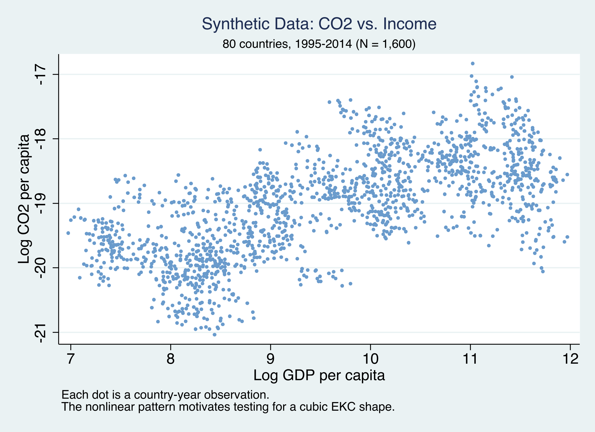
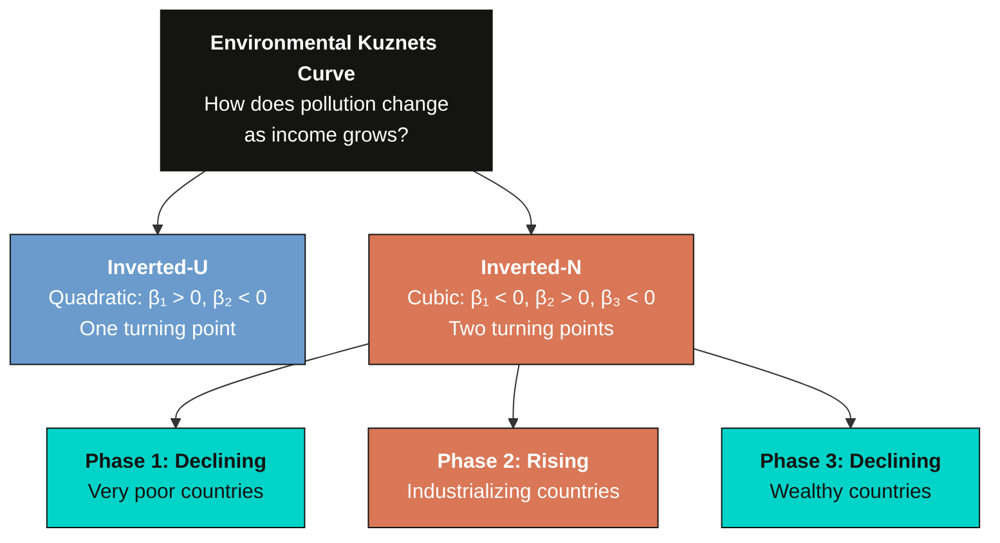
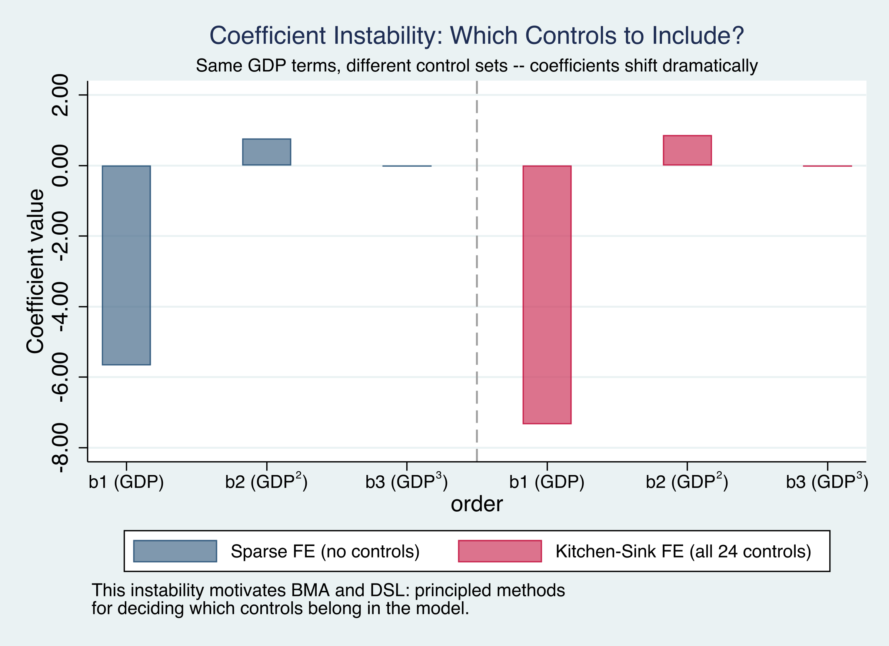
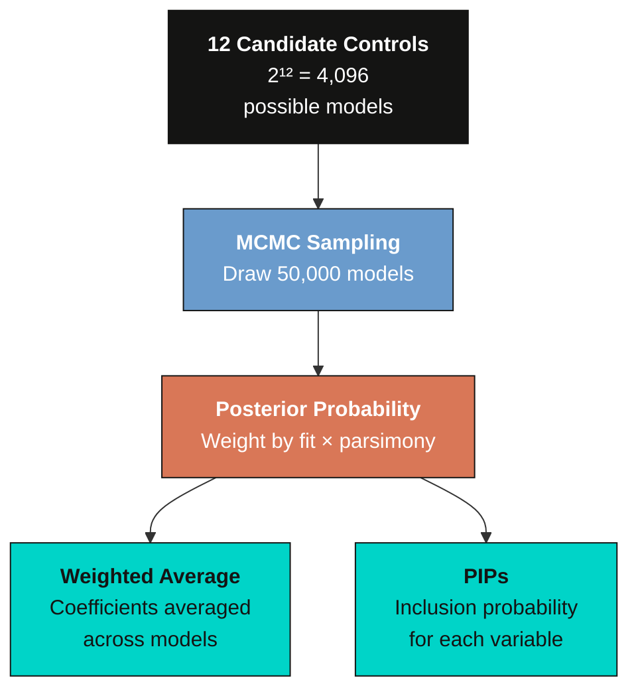
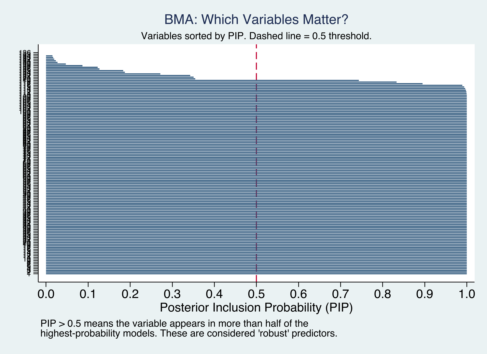
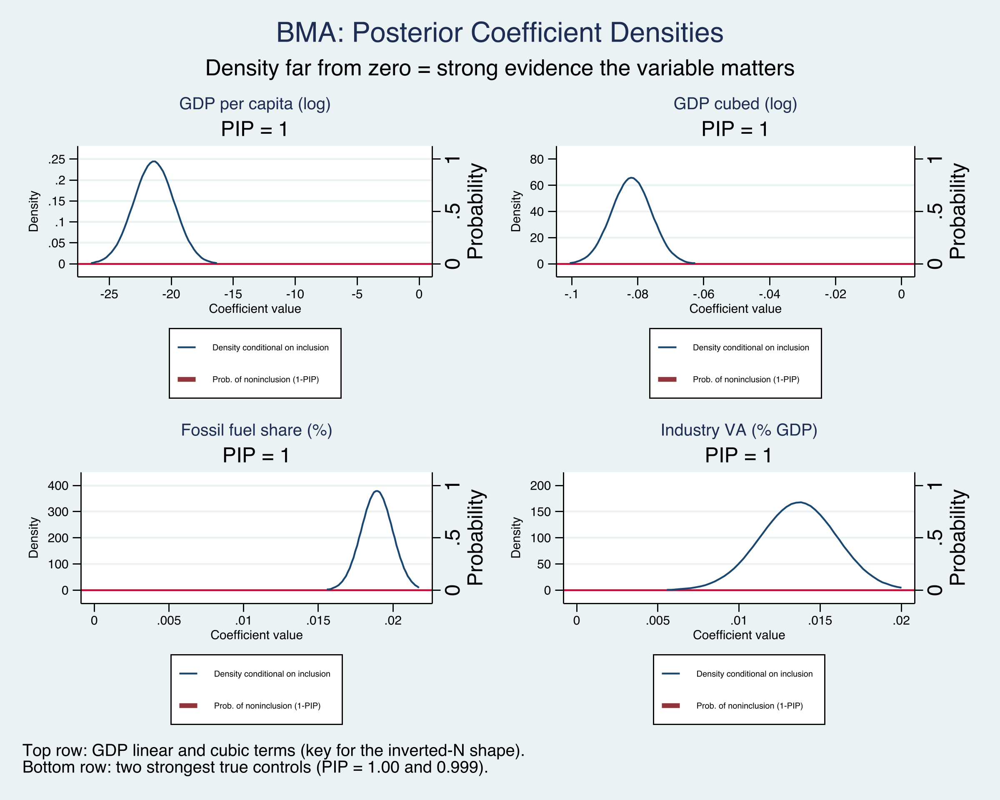
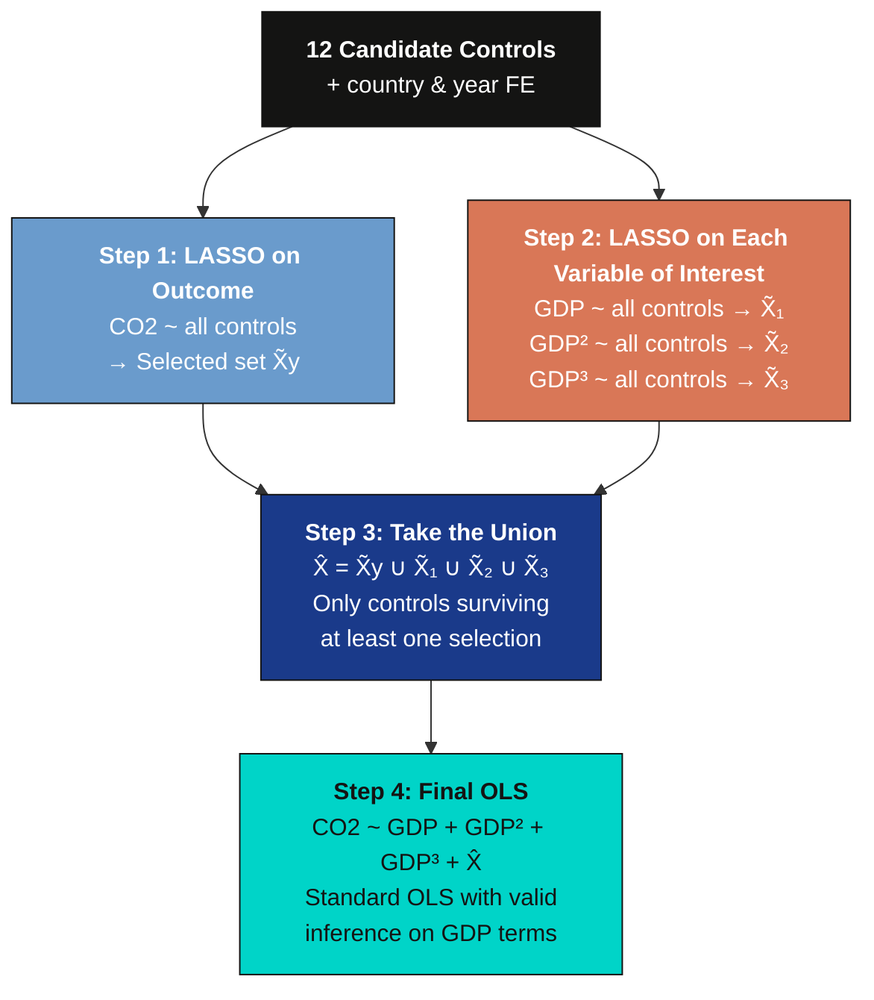
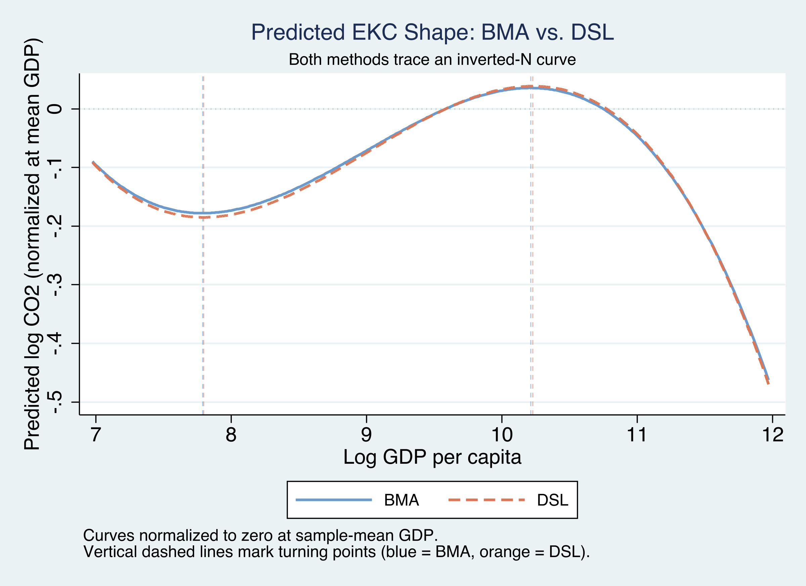
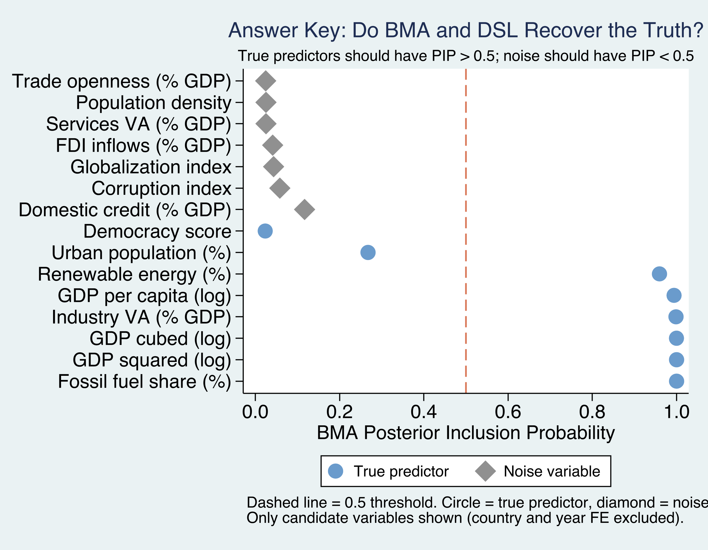

---
authors:
  - admin
categories:
  - Stata
  - Bayesian Model Averaging (BMA)
draft: false
featured: false
date: "2026-03-29T00:00:00Z"
external_link: ""
image:
  caption: ""
  focal_point: Smart
  placement: 3
links:
- icon: laptop-code
  icon_pack: fas
  name: "Web app"
  url: web_app/index.html
- icon: file-code
  icon_pack: fas
  name: "Stata do-file"
  url: analysis.do
- icon: database
  icon_pack: fas
  name: "Dataset (.csv)"
  url: https://github.com/cmg777/starter-academic-v501/raw/master/content/post/stata_bma_dsl/synthetic_ekc_panel.csv
- icon: file-alt
  icon_pack: fas
  name: "Stata log"
  url: analysis.log
- icon: file-code
  icon_pack: fas
  name: "Data generator"
  url: generate_data.do
- icon: markdown
  icon_pack: fab
  name: "MD version"
  url: https://raw.githubusercontent.com/cmg777/starter-academic-v501/master/content/post/stata_bma_dsl/index.md
slides:
summary: Bayesian Model Averaging and Double-Selection LASSO applied to the Environmental Kuznets Curve using synthetic panel data with a known answer key, demonstrating how both methods recover the true predictors of CO2 emissions.
tags:
  - stata
  - panel
  - econometrics
  - world
  - cross-sectional data
title: "Taming Model Uncertainty in the Environmental Kuznets Curve: BMA and Double-Selection LASSO with Panel Data"
url_code: ""
url_pdf: ""
url_slides: ""
url_video: ""
toc: true
diagram: true
---

## 1. Overview

Can countries grow their way out of pollution? The **Environmental Kuznets Curve (EKC)** hypothesis says yes --- up to a point. As economies develop, pollution first rises with industrialization and then falls as countries grow wealthy enough to afford cleaner technology. But recent research suggests a more complex **inverted-N** shape: pollution falls at very low incomes, rises through industrialization, and then falls again at high incomes.

Testing for this shape requires a cubic polynomial in GDP per capita --- and beyond GDP, many other factors might affect CO<sub>2</sub> emissions. With 12 candidate control variables, there are $2^{12} = 4{,}096$ possible regression models. **Which model should we estimate?** This is the **model uncertainty problem**.

This tutorial introduces two principled solutions:

1. **Bayesian Model Averaging (BMA)** estimates thousands of models and averages the results, weighting each by how well it fits the data. Each variable gets a **Posterior Inclusion Probability (PIP)** --- the fraction of high-quality models that include it.

2. **Post-Double-Selection LASSO (DSL)** uses LASSO to automatically select which controls matter --- once for the outcome, once for each variable of interest --- then runs OLS with the union of all selected controls. This "select, then regress" approach protects against omitted variable bias.

We use **synthetic panel data** with a known "answer key" --- we designed the data so that 5 controls truly affect CO<sub>2</sub> and 7 are pure noise. This lets us grade each method: does it correctly identify the true predictors? The data is inspired by the panel dataset of Gravina and Lanzafame (2025) but is fully synthetic and not identical to the original.

> **Companion tutorial.** For a cross-sectional perspective using R with BMA, LASSO, and WALS, see the [R tutorial on variable selection](/post/r_bma_lasso_wals/).

**Learning objectives:**

- Understand the EKC hypothesis and why a cubic polynomial tests for an inverted-N shape
- Recognize model uncertainty as a practical challenge when many controls are available
- Implement BMA with `bmaregress` and interpret PIPs and coefficient densities
- Implement post-double-selection LASSO with `dsregress` and understand its four-step algorithm: LASSO on outcome, LASSO on each variable of interest, union, then OLS
- Evaluate both methods against a known ground truth to assess their accuracy

### Key concepts at a glance

The post leans on a small vocabulary repeatedly. The rest of the tutorial assumes you can move between these terms quickly. Each concept below has three parts. The **definition** is always visible. The **example** and **analogy** sit behind clickable cards: open them when you need them, leave them collapsed for a quick scan. If a later section mentions "PIP" or "model space" and the term feels slippery, this is the section to re-read.

**1. Model uncertainty**.
Many plausible regressions can be specified. No single "right" set of controls. Standard practice picks one model and ignores the others.

<div class="concept-pair">
<details class="concept-card concept-example">
<summary>Example</summary>

With 12 candidate controls there are $2^{12} = 4{,}096$ possible regressions on `ln_co2`. Picking just one is a strong (and often hidden) assumption.

</details>

<details class="concept-card concept-analogy">
<summary>Analogy</summary>

A buffet where you do not know which dishes are real food and which are decor.

</details>
</div>

**2. Model space** $2^K$.
The full enumeration of all subsets of $K$ candidate regressors. With $K = 12$, the space holds 4,096 models.

<div class="concept-pair">
<details class="concept-card concept-example">
<summary>Example</summary>

With 12 candidate controls in the EKC analysis, the model space contains 4,096 distinct regressions. BMA samples from this space rather than visiting every model — in this post, MC³ visits 163 distinct models with sampling correlation 0.9997.

</details>

<details class="concept-card concept-analogy">
<summary>Analogy</summary>

Every possible plate you could compose from the buffet.

</details>
</div>

**3. Posterior model probability (PMP)** $\Pr(M\_j \mid \mathrm{data})$.
The Bayesian weight on a single candidate model after seeing the data. Sums to one across all models in the space.

<div class="concept-pair">
<details class="concept-card concept-example">
<summary>Example</summary>

In BMA output, the top-ranked model in this post captures roughly 9% of the total posterior mass. The remaining 91% is spread across hundreds of nearby models.

</details>

<details class="concept-card concept-analogy">
<summary>Analogy</summary>

How much each plate costs at the buffet, with all prices summing to your fixed budget.

</details>
</div>

**4. Posterior inclusion probability (PIP)** $\sum\_{M\_j: x\_k \in M\_j} \Pr(M\_j \mid \mathrm{data})$.
The total posterior weight on models that contain regressor $k$. A standard "robustness threshold" is $\mathrm{PIP} \geq 0.80$.

<div class="concept-pair">
<details class="concept-card concept-example">
<summary>Example</summary>

`fossil_fuel` lands at PIP = 1.000 (always selected); `renewable` at 0.959 and `industry` at 0.999 also clear the bar. But `urban` and `democracy` fall below 0.80 — their true coefficients (+0.007 and -0.005) are too small to detect at this sample size.

</details>

<details class="concept-card concept-analogy">
<summary>Analogy</summary>

How often a specific dish appears across all plates you'd buy.

</details>
</div>

**5. Bayesian model averaging (BMA)** weighted average over $M\_j$.
Coefficients are weighted averages over all models, with weights = PMPs. Honest uncertainty about which controls belong.

<div class="concept-pair">
<details class="concept-card concept-example">
<summary>Example</summary>

The BMA posterior mean on the cubic GDP term `ln_gdp_cb` is -0.030, *exactly* matching the true DGP value. The `fossil_fuel` posterior mean is -7.139 against a true -7.100. Pooled OLS with all 12 controls gave a noisier estimate with 5 false positives.

</details>

<details class="concept-card concept-analogy">
<summary>Analogy</summary>

Paying for every plate in proportion to its appeal, then averaging the meals.

</details>
</div>

**6. Double-selection LASSO (DSL)**.
Frequentist alternative: run LASSO on the outcome to pick controls, run LASSO on each variable of interest to pick controls, take the union, then run OLS on the union.

<div class="concept-pair">
<details class="concept-card concept-example">
<summary>Example</summary>

The post applies `dsregress` to recover the true GDP-CO₂ shape. DSL recovers the same five true controls (`fossil_fuel`, `renewable`, `urban`, `democracy`, `industry`) that BMA does, via a completely different selection logic.

</details>

<details class="concept-card concept-analogy">
<summary>Analogy</summary>

Two strict diners independently writing menus, then merging their lists.

</details>
</div>

**7. Environmental Kuznets curve** inverted-N: linear + sq + cubic GDP.
Hypothesizes that pollution rises with development at low income, falls at high income, and may rise again at very high income.

<div class="concept-pair">
<details class="concept-card concept-example">
<summary>Example</summary>

In the synthetic data the true cubic-GDP coefficient is -0.030 and BMA recovers exactly -0.030 on `ln_gdp_cb`. The shape — combining `ln_gdp`, `ln_gdp_sq`, and `ln_gdp_cb` — is the substantive object the methods are trying to estimate.

</details>

<details class="concept-card concept-analogy">
<summary>Analogy</summary>

A roller coaster that climbs and dips with national income.

</details>
</div>

**8. Ground-truth synthetic data** known $\beta$ in DGP.
Data generated from a known regression so the true coefficients are written down by the analyst. Lets us *grade* a method against the answer key.

<div class="concept-pair">
<details class="concept-card concept-example">
<summary>Example</summary>

We generate `ln_co2` from a model on a 40-country × 40-year panel (1,600 obs) where `fossil_fuel`'s coefficient is +0.015 and `urban`'s is +0.007, alongside 7 noise controls (`globalization`, `services`, `trade`, `credit`, `pop_density`, `corruption`, `fdi`) with zero true effect. Whether BMA recovers these is an exam, not a guess.

</details>

<details class="concept-card concept-analogy">
<summary>Analogy</summary>

A chef who tells you the real recipe so you can grade your own guess.

</details>
</div>

The following diagram summarizes the methodological sequence of this tutorial. We begin with exploratory data analysis to visualize the raw income--pollution relationship, then estimate baseline fixed effects regressions to expose the model uncertainty problem. Next, we apply BMA and DSL as two alternative solutions, and finally compare both methods against the known answer key.


## 2. Setup and Synthetic Data

### 2.1 Why synthetic data?

Real-world datasets rarely come with an answer key. We never know which control variables *truly* belong in the model. By generating synthetic data with a known data-generating process (DGP), we can verify whether BMA and DSL correctly recover the truth. This is the same "answer key" approach used in the [companion R tutorial](/post/r_bma_lasso_wals/), applied here to panel data.

### 2.2 The data-generating process

The outcome --- log CO<sub>2</sub> per capita --- follows a cubic EKC with country and year fixed effects:

$$\ln(\text{CO2})\_{it} = \beta\_1 \ln(\text{GDP})\_{it} + \beta\_2 [\ln(\text{GDP})\_{it}]^2 + \beta\_3 [\ln(\text{GDP})\_{it}]^3 + \mathbf{X}\_{it}^{\text{true}} \boldsymbol{\gamma} + \alpha\_i + \delta\_t + \varepsilon\_{it}$$

In words, log CO<sub>2</sub> depends on a cubic function of log GDP (producing the inverted-N shape), five true control variables $\mathbf{X}^{\text{true}}$, country fixed effects $\alpha\_i$, year fixed effects $\delta\_t$, and random noise $\varepsilon\_{it}$.

The **answer key** --- which variables are true predictors and which are noise:

| Variable | Group | In DGP? | True coef. | GDP corr. | Role |
|----------|-------|---------|-----------|-----------|------|
| `fossil_fuel` | Energy | **Yes** | +0.015 | moderate | More fossil fuels → more CO<sub>2</sub> |
| `renewable` | Energy | **Yes** | --0.010 | moderate | More renewables → less CO<sub>2</sub> |
| `urban` | Socio | **Yes** | +0.007 | moderate | More urbanization → more CO<sub>2</sub> |
| `democracy` | Institutional | **Yes** | --0.005 | low | More democracy → less CO<sub>2</sub> |
| `industry` | Economic | **Yes** | +0.010 | moderate | More industry → more CO<sub>2</sub> |
| `globalization` | Socio | No | 0 | **high** | Noise --- tricky (correlated with GDP) |
| `pop_density` | Socio | No | 0 | low | Noise |
| `corruption` | Institutional | No | 0 | low | Noise |
| `services` | Economic | No | 0 | **high** | Noise --- tricky (correlated with GDP) |
| `trade` | Economic | No | 0 | moderate | Noise --- tricky (correlated with GDP) |
| `fdi` | Economic | No | 0 | low | Noise |
| `credit` | Economic | No | 0 | moderate | Noise --- tricky (correlated with GDP) |

The "GDP corr." column is key to understanding why this problem is non-trivial. Four noise variables (`globalization`, `services`, `trade`, `credit`) are deliberately correlated with GDP. A naive regression would find them "significant" because they piggyback on GDP's true effect. The challenge for BMA and DSL is to see through this correlation and correctly identify that only the 5 true controls belong in the model.

With the DGP and answer key defined, we now load the synthetic data and set up the Stata environment.

### 2.3 Load the data

The synthetic data is hosted on GitHub for reproducibility. It was generated by `generate_data.do` (see the link above).

```stata
* Load synthetic data from GitHub
import delimited "https://github.com/cmg777/starter-academic-v501/raw/master/content/post/stata_bma_dsl/synthetic_ekc_panel.csv", clear
xtset country_id year, yearly
```

### 2.4 Define macros

We define all variable groups as global macros --- used in every command throughout the tutorial:

```stata
global outcome    "ln_co2"
global gdp_vars   "ln_gdp ln_gdp_sq ln_gdp_cb"

global energy     "fossil_fuel renewable"
global socio      "urban globalization pop_density"
global inst       "democracy corruption"
global econ       "industry services trade fdi credit"

global controls   "$energy $socio $inst $econ"
global fe         "i.country_id i.year"

* Ground truth (for evaluation)
global true_vars  "fossil_fuel renewable urban democracy industry"
global noise_vars "globalization pop_density corruption services trade fdi credit"
```

```stata
summarize $outcome $gdp_vars $controls
```

```text
    Variable |        Obs        Mean    Std. dev.       Min        Max
-------------+---------------------------------------------------------
      ln_co2 |      1,600   -19.0385    .7863276  -21.03685   -16.8315
      ln_gdp |      1,600    9.58387    1.329675   6.974263    11.9704
   ln_gdp_sq |      1,600    93.6174    25.55106   48.64035   143.2904
   ln_gdp_cb |      1,600    931.105     373.829   339.2306   1715.243
 fossil_fuel |      1,600    54.7724    19.14168    6.36807         95
   renewable |      1,600    29.5413    11.96568          1    64.2207
       urban |      1,600    53.6742     14.778   15.95174   91.63234
globalizat~n |      1,600    57.6498    12.71537   26.75758         95
 pop_density |      1,600    121.344    210.2646          1   1571.771
   democracy |      1,600    2.33346    4.179503  -6.12244         10
  corruption |      1,600    52.3523    28.52792          0        100
    industry |      1,600    24.6433    6.180478   5.843938   45.32926
    services |      1,600    43.5598    9.366089   17.82623   64.07455
       trade |      1,600    67.4355    19.36148   10.04306   128.0595
         fdi |      1,600    2.98237    4.373857  -11.50437   16.19903
      credit |      1,600    53.4402    18.20204   11.32991   123.2399
```

The dataset contains 1,600 observations from 80 countries over 20 years (1995--2014). Log GDP per capita ranges from 6.97 to 11.97, spanning the full income spectrum from about \\$1,065 to \\$158,000 in synthetic international dollars. Log CO<sub>2</sub> has a mean of --19.04 with substantial variation (standard deviation 0.79), reflecting the wide range of development levels in our synthetic panel. With the data loaded, we next visualize the raw income--pollution relationship.

## 3. Exploratory Data Analysis

Before modeling, let us look at the raw relationship between income and emissions.

```stata
twoway (scatter $outcome ln_gdp, ///
        msize(vsmall) mcolor("106 155 204"%40) msymbol(circle)), ///
    ytitle("Log CO2 per capita") ///
    xtitle("Log GDP per capita") ///
    title("Synthetic Data: CO2 vs. Income", size(medium)) ///
    subtitle("80 countries, 1995-2014 (N = 1,600)", size(small)) ///
    scheme(s2color)
```



The scatter reveals a distinctly nonlinear pattern. At low income levels, CO<sub>2</sub> emissions increase steeply with GDP. At higher income levels, the relationship flattens and bends. This curvature motivates the cubic EKC specification. The diagram below shows the two competing EKC shapes --- the classic inverted-U (quadratic) and the more complex inverted-N (cubic) with its three distinct phases:



For an inverted-N, we need $\beta\_1 < 0$, $\beta\_2 > 0$, $\beta\_3 < 0$. Our synthetic DGP was designed with exactly this sign pattern ($\beta\_1 = -7.1$, $\beta\_2 = 0.81$, $\beta\_3 = -0.03$), so BMA and DSL should recover it --- but can they also correctly identify which of the 12 controls truly matter? Let us start with standard panel regressions to see how sensitive the GDP coefficients are to the choice of controls.

## 4. Baseline --- Standard Fixed Effects

Before reaching for sophisticated methods, let us see what standard panel regressions say. We run two specifications using macros:

### 4.1 Sparse specification

```stata
reghdfe $outcome $gdp_vars, absorb(country_id year) vce(cluster country_id)
estimates store fe_sparse
```

```text
HDFE Linear regression                            Number of obs   =      1,600
                                                  R-squared       =     0.9620
                                                  Within R-sq.    =     0.0354
Number of clusters (country_id) =         80

                            (Std. err. adjusted for 80 clusters in country_id)
------------------------------------------------------------------------------
             |               Robust
      ln_co2 | Coefficient  std. err.      t    P>|t|     [95% conf. interval]
-------------+----------------------------------------------------------------
      ln_gdp |  -7.498046   1.623988    -4.62   0.000    -10.73051    -4.26558
   ln_gdp_sq |    .848967   .1704533     4.98   0.000     .5096881    1.188246
   ln_gdp_cb |  -.0314993    .005931    -5.31   0.000    -.0433047    -.019694
------------------------------------------------------------------------------
```

The sparse model finds the inverted-N sign pattern ($\beta\_1 < 0$, $\beta\_2 > 0$, $\beta\_3 < 0$), all significant at the 0.1% level with cluster-robust standard errors (clustered at the country level). The within R² is just 0.035 --- the GDP polynomial alone explains only about 3.5% of within-country CO<sub>2</sub> variation after absorbing country and year fixed effects. The overall R² of 0.96 is high because the country fixed effects capture most of the variation.

### 4.2 Kitchen-sink specification

```stata
reghdfe $outcome $gdp_vars $controls, absorb(country_id year) vce(cluster country_id)
estimates store fe_kitchen
```

```text
HDFE Linear regression                            Number of obs   =      1,600
                                                  R-squared       =     0.9655
                                                  Within R-sq.    =     0.1249
Number of clusters (country_id) =         80

                            (Std. err. adjusted for 80 clusters in country_id)
------------------------------------------------------------------------------
             |               Robust
      ln_co2 | Coefficient  std. err.      t    P>|t|     [95% conf. interval]
-------------+----------------------------------------------------------------
      ln_gdp |  -7.130693   1.562581    -4.56   0.000    -10.24093   -4.020453
   ln_gdp_sq |   .8059928   .1647973     4.89   0.000      .477972    1.134014
   ln_gdp_cb |  -.0298133   .0057365    -5.20   0.000    -.0412314   -.0183951
 fossil_fuel |   .0138444   .0014853     9.32   0.000      .010888    .0168008
   renewable |   -.006795   .0019322    -3.52   0.001    -.0106409   -.0029491
       urban |   .0057534   .0021432     2.68   0.009     .0014875    .0100192
globalizat~n |   .0015186   .0012832     1.18   0.240    -.0010357    .0040728
 pop_density |   .0000794   .0002303     0.34   0.731     -.000379    .0005378
   democracy |  -.0002971    .007735    -0.04   0.969    -.0156933    .0150991
  corruption |   .0009812   .0008415     1.17   0.247    -.0006936    .0026561
    industry |   .0086336   .0017848     4.84   0.000     .0050811    .0121861
    services |  -.0005642   .0017205    -0.33   0.744    -.0039889    .0028604
       trade |  -.0002458   .0007695    -0.32   0.750    -.0017774    .0012858
         fdi |  -.0017599   .0019509    -0.90   0.370     -.005643    .0021232
      credit |    -.00139   .0007516    -1.85   0.068     -.002886    .0001061
------------------------------------------------------------------------------
```

Adding all 12 controls raises the within R² from 0.035 to 0.125 --- a meaningful improvement, though the country and year FE still dominate the overall explanatory power (R² = 0.966). The three strongest true predictors (fossil fuel, industry, urban) are clearly significant, while most noise variables are statistically insignificant. Democracy's estimate (--0.0003, p = 0.97) is far from its true value (--0.005) and indistinguishable from zero --- illustrating why weak signals are hard to detect even with the correct model.

The critical question is: which specification should we trust? The next subsection shows that the GDP coefficients --- and hence the EKC shape --- shift depending on which controls we include.

### 4.3 The model uncertainty problem

| Coefficient | Sparse FE | Kitchen-Sink FE | True DGP |
|-------------|-----------|-----------------|----------|
| $\beta\_1$ (GDP) | --7.498 | --7.131 | --7.100 |
| $\beta\_2$ (GDP²) | 0.849 | 0.806 | 0.810 |
| $\beta\_3$ (GDP³) | --0.031 | --0.030 | --0.030 |

Both specifications recover the correct sign pattern, but the magnitudes shift. The kitchen-sink FE estimates (--7.131, 0.806, --0.030) are closer to the true DGP values (--7.100, 0.810, --0.030) than the sparse FE (--7.498, 0.849, --0.031), because the omitted true controls create bias in the sparse model. But which of the 12 controls actually belongs?

```stata
* Compare coefficients side by side (simplified from analysis.do)
graph twoway ///
    (bar value order if spec == "Sparse FE", ///
        barwidth(0.35) color("106 155 204")) ///
    (bar value order if spec == "Kitchen-Sink FE", ///
        barwidth(0.35) color("217 119 87")), ///
    xlabel(1 `""b1" "(GDP)""' 2 `""b2" "(GDP sq)""' 3 `""b3" "(GDP cb)""' ///
           4 `""b1" "(GDP)""' 5 `""b2" "(GDP sq)""' 6 `""b3" "(GDP cb)""') ///
    xline(3.5, lcolor(gs10) lpattern(dash)) ///
    ytitle("Coefficient value") ///
    title("Coefficient Instability Across Specifications") ///
    legend(order(1 "Sparse FE (no controls)" 2 "Kitchen-Sink FE (all 12 controls)") ///
        rows(1) position(6)) ///
    scheme(s2color)
```



To understand the practical implications of these coefficient shifts, we compute the income thresholds where emissions change direction. The **turning points** are found by setting the first derivative of the cubic to zero:

$$x^* = \frac{-\hat{\beta}\_2 \pm \sqrt{\hat{\beta}\_2^2 - 3\hat{\beta}\_1\hat{\beta}\_3}}{3\hat{\beta}\_3}, \quad \text{GDP}^* = \exp(x^*)$$

| Turning point | Sparse FE | Kitchen-Sink FE | True DGP |
|---------------|-----------|-----------------|----------|
| Minimum (CO<sub>2</sub> starts rising) | \\$2,478 | \\$2,426 | \\$1,895 |
| Maximum (CO<sub>2</sub> starts falling) | \\$25,656 | \\$27,694 | \\$34,647 |

The turning points shift modestly between specifications --- the minimum stays near \\$2,400--\\$2,500 while the maximum moves from \\$25,656 to \\$27,694 depending on controls. Neither matches the true DGP values perfectly, motivating BMA and DSL as principled alternatives to ad hoc control selection.

## 5. Bayesian Model Averaging

### 5.1 The idea

Think of BMA as betting on a horse race. Instead of putting all your money on one model, BMA spreads bets across the field, wagering more on models with better track records.



Formally, this betting process follows Bayes' rule, which tells us how to weight models by their fit and complexity.

**Step 1: Model posterior probabilities.** The posterior probability of model $M\_k$ is:

$$P(M\_k | \text{data}) = \frac{P(\text{data} | M\_k) \cdot P(M\_k)}{\sum\_{l=1}^{K} P(\text{data} | M\_l) \cdot P(M\_l)}$$

In words, the probability of model $k$ being correct equals how well it fits the data (the *marginal likelihood* $P(\text{data} | M\_k)$) times our prior belief ($P(M\_k)$), divided by the total across all models. Models that fit the data well *and* are parsimonious receive higher posterior weight --- this is BMA's built-in Occam's razor.

The marginal likelihood $P(\text{data} | M\_k)$ is not the same as the ordinary likelihood. It integrates over all possible coefficient values, penalizing models with many parameters that "waste" probability mass on parameter regions the data does not support:

$$P(\text{data} | M\_k) = \int P(\text{data} | \boldsymbol{\beta}\_k, M\_k) \\, P(\boldsymbol{\beta}\_k | M\_k) \\, d\boldsymbol{\beta}\_k$$

In words, the marginal likelihood asks: "If we averaged this model's fit across all plausible coefficient values (weighted by the prior $P(\boldsymbol{\beta}\_k | M\_k)$), how well does it explain the data?" This integral is what makes BMA automatically penalize overly complex models --- a model with many parameters spreads its prior probability thinly across a high-dimensional space, and only recovers that probability if the data strongly supports those extra dimensions.

**Step 2: Posterior Inclusion Probabilities.** The **PIP** for variable $j$ sums the posterior probabilities across all models that include it:

$$\text{PIP}\_j = \sum\_{k:\\, x\_j \in M\_k} P(M\_k | \text{data})$$

In words, PIP answers: "Across all the models BMA considered, what fraction of the total posterior weight belongs to models that include variable $j$?" If fossil fuel appears in every high-probability model, its PIP approaches 1.0. If democracy only appears in low-probability models, its PIP stays near 0.

**Step 3: BMA posterior mean.** BMA does not just select variables --- it also produces model-averaged coefficient estimates. The posterior mean of coefficient $\beta\_j$ averages across all models, weighted by their posterior probabilities:

$$\hat{\beta}\_j^{\text{BMA}} = \sum\_{k=1}^{K} P(M\_k | \text{data}) \cdot \hat{\beta}\_{j,k}$$

where $\hat{\beta}\_{j,k}$ is the coefficient estimate of variable $j$ in model $M\_k$ (set to zero if $j$ is not in $M\_k$). In words, the BMA estimate is a weighted average of the coefficient across all models, including models where the variable is absent (contributing zero). This shrinks the coefficient toward zero in proportion to the evidence against inclusion --- a variable with PIP = 0.5 has its BMA coefficient shrunk by roughly half compared to its conditional estimate.

Think of PIP as a **democratic vote** across all candidate models. Each model casts a weighted vote for which variables matter, with better-fitting models getting louder voices. [Raftery (1995)](https://doi.org/10.2307/271063) proposed standard interpretation thresholds based on the strength of evidence:

| PIP range | Evidence | Analogy |
|-----------|----------|---------|
| $\geq 0.99$ | Decisive | Beyond reasonable doubt |
| $0.95 - 0.99$ | Very strong | Strong consensus |
| $0.80 - 0.95$ | Strong (robust) | Clear majority |
| $0.50 - 0.80$ | Borderline | Split vote |
| $< 0.50$ | Weak/none (fragile) | Minority opinion |

We use **PIP $\geq$ 0.80** as our robustness threshold throughout this tutorial --- a variable with PIP above 0.80 appears in the vast majority of the probability-weighted model space, providing "strong evidence" by Raftery's classification. This is the most widely used cutoff in applied BMA studies.

A key assumption underlying BMA is that the true data-generating process is well-approximated by a weighted combination of the candidate models (the "M-closed" assumption). When the candidate set omits important functional forms or interactions, BMA's posterior probabilities may be unreliable.

### 5.2 Key options

With the conceptual framework in place, we now turn to implementation. Stata 18's [`bmaregress`](https://www.stata.com/manuals/bmabmaregress.pdf) command has three families of options: **priors** (what you believe before seeing the data), **MCMC controls** (how the algorithm explores the model space), and **output formatting** (what gets displayed). The full option list is in the [Stata manual](https://www.stata.com/manuals/bmabmaregress.pdf); here we explain the ones used in this tutorial:

**Prior specifications** (see [`bmaregress` priors](https://www.stata.com/manuals/bmabmaregresspostestimation.pdf) for alternatives):

- **[`gprior(uip)`](https://www.stata.com/manuals/bmabmaregress.pdf)** --- Unit Information Prior: sets the prior precision on coefficients equal to the information in one observation ($g = N$). This is a standard, relatively uninformative choice that lets the data dominate. Alternatives include `gprior(bric)` (benchmark risk inflation criterion, $g = \max(N, p^2)$), `gprior(zs)` (Zellner-Siow), and `gprior(hyper)` (hyper-g prior with data-driven $g$)
- **[`mprior(uniform)`](https://www.stata.com/manuals/bmabmaregress.pdf)** --- all $2^{12} = 4{,}096$ models are equally likely a priori; no model is privileged before seeing the data. The alternative `mprior(binomial)` applies a beta-binomial prior that penalizes very large or very small models, often producing more conservative PIPs

**MCMC controls:**

- **`mcmcsize(50000)`** --- draws 50,000 models from the model space using MC$^3$ (Markov chain Monte Carlo model composition) sampling. Larger values improve posterior estimates but increase computation time
- **`burnin(5000)`** --- discards the first 5,000 draws to allow the chain to reach its stationary distribution before collecting samples
- **`rseed(9988)`** --- fixes the random number seed for exact reproducibility. Students running the same command will get identical results
- **[`groupfv`](https://www.stata.com/manuals/bmabmaregress.pdf)** --- treats all dummies from a single factor variable as one group that enters or exits models together. Without `groupfv`, writing `i.country_id` would create 80 individual dummy variables, and BMA would consider including or excluding each one independently --- producing an astronomical model space ($2^{80}$ combinations of country dummies alone) that is both computationally infeasible and conceptually meaningless. With `groupfv`, the 80 country dummies move as a *package*: either all 80 are in the model or none are. Think of it like hiring a sports team --- you recruit the whole roster, not individual players one by one. In the output, this is why you see "Groups = 15" instead of 113: BMA treats the 80 country dummies as 1 group, the 19 year dummies as 1 group, and each of the 12 candidate controls + 3 GDP terms as their own groups ($1 + 1 + 15 = 17$, minus 2 that are "always" included = 15 groups subject to selection)
- **`($fe, always)`** --- country and year fixed effects are always included in every model; they are not subject to model selection. This is standard practice in panel data BMA: we want to control for unobserved country and time heterogeneity in *every* model, and only let BMA decide about the candidate controls

**Output formatting:**

- **`pipcutoff(0.8)`** --- display only variables with PIP above 0.80 in the output table. This is a *display* threshold only --- it does not affect the underlying estimation
- **`inputorder`** --- display variables in the order they were specified in the command, rather than sorted by PIP

### 5.3 Estimation

```stata
bmaregress $outcome $gdp_vars $controls ///
    ($fe, always), ///
    mprior(uniform) groupfv gprior(uip) ///
    mcmcsize(50000) rseed(9988) inputorder pipcutoff(0.8)
```

```text
Bayesian model averaging                          No. of obs         =   1,600
Linear regression                                 No. of predictors  =     113
MC3 sampling                                                  Groups =      15
                                                              Always =      98
                                                  No. of models      =     163
Priors:                                           Mean model size    = 104.578
  Models: Uniform                                 MCMC sample size   =  50,000
   Coef.: Zellner's g                             Acceptance rate    =  0.0904
       g: Unit-information, g = 1,600             Shrinkage, g/(1+g) =  0.9994

Sampling correlation = 0.9997

------------------------------------------------------------------------------
      ln_co2 |      Mean   Std. dev.       Group        PIP
-------------+----------------------------------------------------------------
      ln_gdp |  -7.13901   1.811093            1     .99401
   ln_gdp_sq |  .8078437   .1892418            2     .99991
   ln_gdp_cb | -.0299182   .0065105            3     .99976
 fossil_fuel |  .0138139    .001283            4          1
   renewable | -.0068332   .0023506            5     .95945
    industry |  .0085503   .0019766           11     .99867
------------------------------------------------------------------------------
Note: 9 predictors with PIP less than .8 not shown.
```

> The Stata output says "PIP less than .8" because we set `pipcutoff(0.8)` as the display threshold --- only variables exceeding this stricter robustness criterion appear in the table. The 9 hidden variables are the two weak true controls (urban, democracy) and all 7 noise variables (services, trade, FDI, credit, population density, corruption, globalization). Figure 3 below shows PIP values for all 15 variables.

The output shows 113 predictors in 15 groups: the 80 country dummies (grouped as 1 by `groupfv`) + 19 year dummies (grouped as 1) + 12 candidate controls (each its own group) + the 3 GDP terms (each its own group) = 15 selection groups total, with 98 variables "always" included (the country and year FE). BMA sampled 163 distinct models out of 4,096 possible. This might seem low, but the MC$^3$ algorithm does not need to visit every model --- it concentrates on the high-posterior-probability region. The sampling correlation of 0.9997 (very close to 1.0) confirms that the MC$^3$ chain adequately explored the model space --- the posterior probability is concentrated on a relatively small number of high-quality models. The acceptance rate of 0.09 is below the typical 20--40% range, but the high sampling correlation provides reassurance that the results are reliable. Six variables have PIP above the 0.80 robustness threshold: the three GDP terms (PIP = 0.994--1.000) and three of the five true controls --- fossil fuel (PIP = 1.000), industry (PIP = 0.999), and renewable energy (PIP = 0.959). The BMA posterior means (--7.139, 0.808, --0.030) are remarkably close to the true DGP values (--7.100, 0.810, --0.030), substantially closer than the sparse FE estimates.

Two true controls --- urban (coefficient 0.007) and democracy (coefficient --0.005) --- have PIPs well below 0.80. Their true effects are small, making them hard to distinguish from noise. This is a realistic limitation: even a powerful method like BMA struggles with weak signals.

### 5.4 Turning points

Using the BMA posterior means, the turning points are:

- **Minimum:** \\$2,411 GDP per capita (true: \\$1,895)
- **Maximum:** \\$27,269 GDP per capita (true: \\$34,647)

Both turning points are in the right ballpark but not exact. The turning point formula amplifies small differences across all three coefficients --- even though each BMA posterior mean is within 1% of the true DGP value, the compound effect shifts the maximum turning point from \\$34,647 (true) to \\$27,269 (BMA). The inverted-N shape is clearly recovered.

### 5.5 Posterior Inclusion Probabilities

The PIP chart is BMA's signature output. We extract PIPs from the estimation results, label each variable, and color-code bars by ground truth: steel blue for true predictors, gray for noise.

```stata
* Extract PIPs and create a horizontal bar chart
matrix pip_mat = e(pip)
* ... (create dataset of variable names and PIPs, add readable labels) ...

* Mark true vs noise predictors
gen is_true = inlist(varname, "fossil_fuel", "renewable", "urban", ///
    "democracy", "industry", "ln_gdp", "ln_gdp_sq", "ln_gdp_cb")
gsort -pip

graph twoway ///
    (bar pip order if is_true == 1, horizontal barwidth(0.6) ///
        color("106 155 204")) ///
    (bar pip order if is_true == 0, horizontal barwidth(0.6) ///
        color(gs11)), ///
    xline(0.8, lcolor("217 119 87") lpattern(dash) lwidth(medium)) ///
    ylabel(1(1)15, valuelabel angle(0) labsize(small)) ///
    xlabel(0(0.2)1, format(%3.1f)) ///
    xtitle("Posterior Inclusion Probability (PIP)") ///
    title("BMA: Which Variables Matter?") ///
    legend(order(1 "True predictor (in DGP)" 2 "Noise variable (not in DGP)") ///
        rows(1) position(6)) ///
    scheme(s2color)
```



The PIP chart cleanly separates the variables into two groups. At the top (PIP near 1.0): fossil fuel share, GDP terms, industry, and renewable energy --- all true predictors correctly identified. At the bottom (PIP near 0.0): the seven noise variables (globalization, corruption, services, trade, FDI, credit, population density) plus urban population and democracy. BMA correctly assigns zero-like PIPs to all noise variables, and correctly flags 3 of 5 true predictors as robust. The two misses (urban, democracy) have small true coefficients (0.007 and --0.005), making them genuinely hard to detect.

### 5.6 Coefficient density plots

The [`bmagraph coefdensity`](https://www.stata.com/manuals/bmabmagraphcoefdensity.pdf) command shows the posterior distribution of each coefficient across all sampled models. We plot all six variables with PIP above 0.80 in a 3x2 grid --- the three GDP polynomial terms (top row) and the three robust controls (bottom row). In each panel, the blue curve shows the density conditional on the variable being included in the model, and the red horizontal line shows the probability of noninclusion (1 -- PIP). When the red line is flat near zero and the blue curve is far from zero, the variable is strongly supported.

```stata
* Consistent formatting for all panels
local panel_opts `" xtitle("Coefficient value", size(vsmall)) "'
local panel_opts `" `panel_opts' ytitle("Density", size(vsmall)) "'
local panel_opts `" `panel_opts' ylabel(, labsize(vsmall) angle(0)) "'
local panel_opts `" `panel_opts' xlabel(, labsize(vsmall)) "'
local panel_opts `" `panel_opts' legend(off) scheme(s2color) "'

* Generate density for all 6 robust variables (PIP > 0.80)
bmagraph coefdensity ln_gdp,      title("GDP per capita (log)", size(small)) `panel_opts' name(dens_gdp, replace)
bmagraph coefdensity ln_gdp_sq,   title("GDP squared (log)", size(small))    `panel_opts' name(dens_gdp_sq, replace)
bmagraph coefdensity ln_gdp_cb,   title("GDP cubed (log)", size(small))      `panel_opts' name(dens_gdp_cb, replace)
bmagraph coefdensity fossil_fuel, title("Fossil fuel share (%)", size(small)) `panel_opts' name(dens_fossil, replace)
bmagraph coefdensity renewable,   title("Renewable energy (%)", size(small))  `panel_opts' name(dens_renewable, replace)
bmagraph coefdensity industry,    title("Industry VA (% GDP)", size(small))   `panel_opts' name(dens_industry, replace)

graph combine dens_gdp dens_gdp_sq dens_gdp_cb ///
    dens_fossil dens_renewable dens_industry, ///
    cols(3) rows(2) imargin(small) ///
    title("BMA: Posterior Coefficient Densities", size(medsmall)) ///
    subtitle("All 6 robust variables (PIP > 0.80)", size(small)) ///
    note("Blue curve = posterior density conditional on inclusion." ///
         "Red line = probability of noninclusion (1 - PIP)." ///
         "Near-zero red line + blue curve far from zero = strong evidence.", size(vsmall)) ///
    scheme(s2color) xsize(12) ysize(7)
```



All six densities are concentrated well away from zero, confirming that every variable with PIP above 0.80 has a genuinely non-zero effect. The three GDP terms (top row) form the inverted-N polynomial: the linear term is centered near --7.1 (true: --7.1), the squared term near +0.81 (true: +0.81), and the cubic term near --0.030 (true: --0.030). The three controls (bottom row) show tight, unimodal densities: fossil fuel near +0.014 (true: +0.015), renewable energy near --0.007 (true: --0.010), and industry near +0.009 (true: +0.010). Renewable energy's posterior mean (--0.007) is slightly attenuated compared to the true value (--0.010), reflecting the BMA shrinkage that occurs when a variable's PIP is below 1.0 --- models that exclude it pull the average toward zero.

### 5.7 Pooled BMA (without fixed effects)

To parallel the pooled DSL comparison in Section 6.6, we also run BMA without country or year fixed effects --- treating the panel as a pooled cross-section. This removes the `($fe, always)` and `groupfv` options, leaving only the 12 candidate controls and 3 GDP terms as predictors (15 total, vs 113 with FE).

```stata
* BMA without FE -- pooled cross-section
bmaregress ln_co2 ln_gdp ln_gdp_sq ln_gdp_cb ///
    fossil_fuel renewable urban industry democracy ///
    services trade fdi credit pop_density ///
    corruption globalization, ///
    mprior(uniform) gprior(uip) ///
    mcmcsize(50000) rseed(9988) pipcutoff(0.5) burnin(5000)
```

```text
Bayesian model averaging                           No. of obs         =  1,600
Linear regression                                  No. of predictors  =     15
MC3 sampling                                                   Groups =     15
                                                               Always =      0
                                                   No. of models      =      34
Priors:                                            Mean model size    = 11.978
  Models: Uniform                                  MCMC sample size   = 50,000
   Coef.: Zellner's g                              Acceptance rate    = 0.0733
       g: Unit-information, g = 1,600              Shrinkage, g/(1+g) = 0.9994

Sampling correlation = 0.9996

------------------------------------------------------------------------------
      ln_co2 |      Mean   Std. dev.       Group        PIP
-------------+----------------------------------------------------------------
      ln_gdp | -21.25807   1.641676            1          1
   ln_gdp_sq |  2.284729   .1748838            2          1
   ln_gdp_cb | -.0813937   .0061308            3          1
 fossil_fuel |  .0188853   .0010554            4          1
   renewable | -.0192089   .0013911            5          1
       urban |  .0103139   .0012072            6          1
    industry |  .0138361   .0023478            7          1
    services |  .0164633   .0016573            9          1
 pop_density | -.0004314   .0000567           13          1
      credit |  .0041017   .0008414           12     .99984
       trade | -.0020939    .001084           10     .86009
   democracy |   .007879   .0042984            8     .84142
------------------------------------------------------------------------------
Note: 3 predictors with PIP less than .5 not shown.
```

The pooled BMA results are striking in two ways. First, the GDP coefficients are severely biased --- the same pattern as pooled DSL: $\beta\_1 = -21.26$ (true: --7.10), $\beta\_2 = 2.28$ (true: 0.81), $\beta\_3 = -0.081$ (true: --0.03). Without country fixed effects, the GDP terms absorb persistent cross-country differences in emissions levels, inflating the coefficients by a factor of 2--3x.

Second, the PIPs tell a completely different story than with FE. Without fixed effects, **12 of 15 variables have PIP above 0.80** --- including noise variables like services (PIP = 1.000), population density (PIP = 1.000), credit (PIP = 1.000), and trade (PIP = 0.860). With FE, only 6 variables cleared the 0.80 threshold and all 7 noise variables had PIPs near zero. The pooled BMA commits **5 false positives** (services, pop\_density, credit, trade, and democracy incorrectly flagged as robust noise variables or given inflated PIPs) compared to **zero** false positives with FE. This happens because the noise variables are correlated with omitted country effects --- without FE to absorb those effects, the correlations create spurious associations that BMA interprets as genuine predictive power.

The turning points (\\$5,752 minimum, \\$23,298 maximum) are far from the truth, and the 95% credible intervals fail to cover the true values for all three GDP terms --- the same coverage failure seen in pooled DSL. The lesson is clear: **fixed effects are not optional in panel BMA**. They are essential for correct variable selection, not just coefficient estimation.

## 6. Post-Double-Selection LASSO

### 6.1 The idea

Stata's [`dsregress`](https://www.stata.com/manuals/lassodsregress.pdf) implements the **post-double-selection** method of Belloni, Chernozhukov, and Hansen (2014). Think of it as a smart research assistant who reads the data twice --- once to find controls that predict the outcome (CO<sub>2</sub>), and again to find controls that predict the variables of interest (GDP terms) --- then runs a clean OLS regression using only the controls that survived at least one selection.

The "double" in double-selection refers to the **union** of two separate LASSO selections. Why is this union necessary? If a control variable predicts both CO<sub>2</sub> *and* GDP but a single LASSO run on CO<sub>2</sub> happens to miss it, omitting it from the final regression would bias the GDP coefficient. The second LASSO step (on GDP) catches variables that the first step might miss, and vice versa.

The algorithm has four steps:



At the heart of each LASSO step is a penalized regression that shrinks irrelevant coefficients to exactly zero:

$$\hat{\boldsymbol{\beta}}^{\text{LASSO}} = \arg\min\_{\boldsymbol{\beta}} \left\\{ \frac{1}{2N} \sum\_{i=1}^{N}(y\_i - \mathbf{x}\_i'\boldsymbol{\beta})^2 + \lambda \sum\_{j=1}^{p} |\beta\_j| \right\\}$$

In words, LASSO minimizes the sum of squared residuals (the usual OLS objective) plus a penalty term $\lambda \sum |\beta\_j|$ that charges a cost proportional to the *absolute value* of each coefficient. The tuning parameter $\lambda$ controls how harsh this penalty is --- think of it as a "strictness dial." When $\lambda = 0$, LASSO is just OLS. As $\lambda$ increases, more coefficients are forced to exactly zero. The L1 (absolute value) penalty is what makes LASSO a variable selector: unlike the L2 (squared) penalty used in Ridge regression, the L1 penalty has sharp corners at zero that drive weak coefficients to exactly zero rather than merely shrinking them.

**Why "double" selection?** The key insight of Belloni, Chernozhukov, and Hansen (2014) is that a single LASSO selection can miss important confounders. Consider our panel setting. We want to estimate the effect of GDP terms ($\mathbf{D}$) on CO<sub>2</sub> ($Y$), controlling for other variables ($\mathbf{W}$). The model is:

$$Y\_i = \mathbf{D}\_i' \boldsymbol{\alpha} + \mathbf{W}\_i' \boldsymbol{\beta} + \varepsilon\_i$$

A confounder $W\_j$ that affects both $Y$ and $\mathbf{D}$ must be included to avoid omitted variable bias. But if $W\_j$ has a weak effect on $Y$, the LASSO on $Y$ might miss it. The double-selection strategy solves this by running LASSO twice:

- **Step 1** selects controls that predict $Y$: $\\quad \hat{S}\_Y = \\{j : \hat{\beta}\_j^{\text{LASSO}(Y)} \neq 0\\}$
- **Step 2** selects controls that predict each $D\_k$: $\\quad \hat{S}\_{D\_k} = \\{j : \hat{\gamma}\_{j,k}^{\text{LASSO}(D\_k)} \neq 0\\}$
- **Step 3** takes the union: $\\quad \hat{S} = \hat{S}\_Y \cup \hat{S}\_{D\_1} \cup \hat{S}\_{D\_2} \cup \hat{S}\_{D\_3}$
- **Step 4** runs OLS of $Y$ on $\mathbf{D}$ and $\mathbf{W}\_{\hat{S}}$ with standard inference

The union in Step 3 ensures that a confounder missed by the $Y$-LASSO but caught by the $D$-LASSO is still included. This "safety net" property is what gives post-double-selection its valid inference guarantees --- the final OLS produces consistent estimates of $\boldsymbol{\alpha}$ even if each individual LASSO makes some selection mistakes.

The `dsregress` command uses a "plugin" method to choose $\lambda$ --- an analytical formula that sets the penalty based on the sample size and noise level, without requiring cross-validation. A key assumption underlying DSL is *approximate sparsity*: only a small number of controls truly matter, so LASSO can safely set the rest to zero. When the true model is dense (many small effects rather than a few large ones), LASSO may struggle to select the right variables.

Before implementing DSL, it helps to see the two methods side by side:

| Feature | BMA | Post-Double-Selection |
|---------|-----|-----------------------|
| Philosophy | Bayesian (posteriors) | Frequentist (p-values) |
| Strategy | Average across models | Select controls, then OLS |
| Output | PIPs for every variable | Set of selected controls |
| Speed | Minutes (MCMC) | Seconds (optimization) |
| Reference | Raftery et al. (1997) | Belloni, Chernozhukov, Hansen (2014) |

### 6.2 Key options

With the algorithm clear, let us examine the Stata implementation. The [`dsregress`](https://www.stata.com/manuals/lassodsregress.pdf) command has a concise syntax, but each element plays a specific role. The full option list is in the [Stata LASSO manual](https://www.stata.com/manuals/lasso.pdf); here we explain the ones used in this tutorial:

**Syntax structure:** `dsregress depvar varsofinterest, controls(controlvars) [options]`

- **`$outcome`** (`ln_co2`) --- the dependent variable. DSL will run LASSO on this variable against all controls (Step 1)
- **`$gdp_vars`** (`ln_gdp ln_gdp_sq ln_gdp_cb`) --- the *variables of interest*. These are never penalized by LASSO; they always appear in the final OLS. DSL runs a separate LASSO for each one against all controls (Steps 2a--2c)
- **[`controls(($fe) $controls)`](https://www.stata.com/manuals/lassodsregress.pdf)** --- the candidate controls subject to LASSO selection. Parentheses around `$fe` tell Stata to treat factor variables (country and year dummies) as always-included in the LASSO penalty but available for selection. The 12 candidate controls are subject to the standard LASSO penalty
- **[`vce(cluster country_id)`](https://www.stata.com/manuals/lassodsregress.pdf)** --- compute cluster-robust standard errors at the country level in the final OLS (Step 4). This also affects the LASSO penalty through the [`selection(plugin)`](https://www.stata.com/manuals/lassolasso.pdf) method, which adjusts $\lambda$ for cluster dependence
- **`selection(plugin)`** (default) --- choose $\lambda$ using a data-driven analytical formula rather than cross-validation. The alternative [`selection(cv)`](https://www.stata.com/manuals/lassolasso.pdf) uses cross-validation but is slower
- **[`lassoinfo`](https://www.stata.com/manuals/lassolassoinfo.pdf)** (post-estimation) --- reports the number of selected controls and the $\lambda$ value for each LASSO step
- **[`lassocoef`](https://www.stata.com/manuals/lassolassocoef.pdf)** (post-estimation) --- displays which specific variables were selected or dropped by LASSO

> **Related commands.** Stata also offers [`poregress`](https://www.stata.com/manuals/lassoporegress.pdf) (partialing-out regression), which *residualizes* both the outcome and the treatment against all controls instead of selecting then regressing. Both methods provide valid inference. [`xporegress`](https://www.stata.com/manuals/lassoxporegress.pdf) extends this to cross-fit partialing-out for even more robust inference. This tutorial uses `dsregress` because its select-then-regress logic is more intuitive for beginners.

### 6.3 Estimation

```stata
dsregress $outcome $gdp_vars, ///
    controls(($fe) $controls) ///
    vce(cluster country_id)
```

```text
Double-selection linear model         Number of obs               =      1,600
                                      Number of controls          =        112
                                      Number of selected controls =        102
                                      Wald chi2(3)                =      53.15
                                      Prob > chi2                 =     0.0000

                            (Std. err. adjusted for 80 clusters in country_id)
------------------------------------------------------------------------------
             |               Robust
      ln_co2 | Coefficient  std. err.      z    P>|z|     [95% conf. interval]
-------------+----------------------------------------------------------------
      ln_gdp |  -7.433319   1.628321    -4.57   0.000    -10.62477   -4.241868
   ln_gdp_sq |   .8401567   .1713522     4.90   0.000     .5043126    1.176001
   ln_gdp_cb |  -.0310764    .005952    -5.22   0.000    -.0427421   -.0194107
------------------------------------------------------------------------------
```

Post-double-selection completed in seconds with cluster-robust standard errors at the country level. Internally, `dsregress` ran four separate LASSO regressions (Step 1 on CO<sub>2</sub>, Steps 2a--2c on each GDP term), took the union of all selected controls, and then ran a final OLS of CO<sub>2</sub> on the GDP terms plus that union. All three GDP terms are significant at the 0.1% level. The Wald test strongly rejects the null that GDP terms are jointly zero ($\chi^2 = 53.15$, p < 0.001).

### 6.4 Turning points

- **Minimum:** \\$2,429 GDP per capita (true: \\$1,895)
- **Maximum:** \\$27,672 GDP per capita (true: \\$34,647)

The post-double-selection turning points (\\$2,429 and \\$27,672) fall between the sparse FE and kitchen-sink estimates, closer to the BMA values. With cluster-robust standard errors, the LASSO selection retained 102 of 112 controls for the outcome equation and 100 for each GDP term. The union of selected controls in Step 3 includes a few more candidate variables than without clustering, producing coefficients (--7.433, 0.840, --0.031) that lie between the sparse and kitchen-sink specifications.

### 6.5 LASSO selection

To understand which controls LASSO kept and which it dropped, we inspect the selection details:

```stata
lassoinfo
```

```text
    Estimate: active
     Command: dsregress
------------------------------------------------------
            |                                   No. of
            |           Selection             selected
   Variable |    Model     method    lambda  variables
------------+-----------------------------------------
     ln_co2 |   linear     plugin  .3818852        102
     ln_gdp |   linear     plugin  .3818852        100
  ln_gdp_sq |   linear     plugin  .3818852        100
  ln_gdp_cb |   linear     plugin  .3818852        100
------------------------------------------------------
```

The `lassoinfo` output shows each of the four LASSO steps. The outcome equation selected 102 of 112 controls, while each GDP equation selected 100. The 112 candidates include 80 country dummies + 19 year dummies = 99 FE dummies, plus the 12 candidate variables and the constant. LASSO retains nearly all informative FE dummies and drops about 10--12 of the weakest candidates at each step. The union across all four steps (Step 3) yields the final control set for Step 4's OLS. With cluster-robust standard errors, the lambda is larger (0.382 vs 0.090 without clustering), leading to slightly different selection and producing DSL coefficients (--7.433, 0.840, --0.031) that fall between the sparse and kitchen-sink FE.

Why does DSL not match BMA's accuracy here? In panel data settings where FE dummies dominate the control set (99 of 112 variables), LASSO retains nearly all FE dummies and has limited room to discriminate among the 12 candidate controls of interest --- it dropped only 10--12 variables at each step, most of them weak FE dummies rather than noise controls. This "almost everything selected" outcome means DSL's final OLS is close to the kitchen-sink specification, which explains why its coefficients (--7.433, 0.840, --0.031) fall between sparse and kitchen-sink FE rather than converging to the true DGP. To see LASSO's selection power unleashed, we next run DSL *without* fixed effects.

### 6.6 Pooled DSL (without fixed effects)

What happens when LASSO has only 12 candidate controls instead of 112? To answer this, we run DSL on the pooled data --- treating the panel as a cross-sectional dataset without country or year fixed effects. This gives LASSO full room to discriminate among the candidate controls, but at the cost of omitting the unobserved country heterogeneity that fixed effects would absorb.

```stata
* DSL without FE -- pooled cross-section with cluster-robust SEs
dsregress $outcome $gdp_vars, ///
    controls($controls) ///
    vce(cluster country_id)
```

```text
Double-selection linear model         Number of obs               =      1,600
                                      Number of controls          =         12
                                      Number of selected controls =          7
                                      Wald chi2(3)                =      25.05
                                      Prob > chi2                 =     0.0000

                            (Std. err. adjusted for 80 clusters in country_id)
------------------------------------------------------------------------------
             |               Robust
      ln_co2 | Coefficient  std. err.      z    P>|z|     [95% conf. interval]
-------------+----------------------------------------------------------------
      ln_gdp |  -22.03297   5.277295    -4.18   0.000    -32.37628   -11.68966
   ln_gdp_sq |   2.366878   .5652276     4.19   0.000     1.259052    3.474703
   ln_gdp_cb |   -.084224   .0199055    -4.23   0.000    -.1232381     -.04521
------------------------------------------------------------------------------
```

The pooled DSL still finds the correct inverted-N sign pattern ($\beta\_1 < 0$, $\beta\_2 > 0$, $\beta\_3 < 0$), but the magnitudes are dramatically different from the true DGP. The linear coefficient (--22.03) is more than *three times* the true value (--7.10), and the other terms are similarly inflated. This is **omitted variable bias**: without country fixed effects, the GDP terms absorb not only their own effect on CO<sub>2</sub> but also the persistent cross-country differences in emissions levels that fixed effects would have captured.

```stata
lassoinfo
```

```text
    Estimate: active
     Command: dsregress
------------------------------------------------------
            |                                   No. of
            |           Selection             selected
   Variable |    Model     method    lambda  variables
------------+-----------------------------------------
     ln_co2 |   linear     plugin  .3818852          5
     ln_gdp |   linear     plugin  .3818852          7
  ln_gdp_sq |   linear     plugin  .3818852          7
  ln_gdp_cb |   linear     plugin  .3818852          7
------------------------------------------------------
```

Now the contrast with the FE-based DSL is stark. The outcome LASSO selected only **5 of 12** controls (vs 102 of 112 with FE), and the GDP LASSOes selected **7 of 12** (vs 100 of 112). Without FE dummies flooding the candidate set, LASSO can genuinely discriminate --- it zeroed out 5--7 controls as irrelevant. The turning points are \\$5,581 (minimum) and \\$24,532 (maximum), far from the true values.

This comparison illustrates a fundamental tradeoff in panel data econometrics: **fixed effects remove bias but limit LASSO's selection power**. With FE, the estimates are unbiased but LASSO selects almost everything. Without FE, LASSO selects sharply but the estimates are biased by unobserved heterogeneity. The FE-based DSL from Section 6.3 is the correct specification for this data, even though LASSO's selection looks less impressive.

## 7. Head-to-Head Comparison

### 7.1 Coefficient comparison

| | Sparse FE | Kitchen-Sink FE | BMA (FE) | DSL (FE) | BMA (pooled) | DSL (pooled) | True DGP |
|---|-----------|-----------------|----------|----------|--------------|--------------|----------|
| $\beta\_1$ (GDP) | --7.498 | --7.131 | --7.139 | --7.433 | --21.258 | --22.033 | --7.100 |
| $\beta\_2$ (GDP²) | 0.849 | 0.806 | 0.808 | 0.840 | 2.285 | 2.367 | 0.810 |
| $\beta\_3$ (GDP³) | --0.031 | --0.030 | --0.030 | --0.031 | --0.081 | --0.084 | --0.030 |
| **Min TP** | \\$2,478 | \\$2,426 | \\$2,411 | \\$2,429 | \\$5,752 | \\$5,581 | \\$1,895 |
| **Max TP** | \\$25,656 | \\$27,694 | \\$27,269 | \\$27,672 | \\$23,298 | \\$24,532 | \\$34,647 |

The table reveals a sharp divide between FE-based and pooled specifications. The four FE-based methods (columns 2--5) all produce GDP coefficients within a narrow range of the true values --- BMA (FE) and Kitchen-Sink FE are closest, with estimates within 1% of the truth. The two pooled methods (columns 6--7) are dramatically biased, with coefficients inflated 2--3x. Strikingly, BMA (pooled) and DSL (pooled) agree closely with *each other* (--21.26 vs --22.03 for $\beta\_1$), confirming that the bias comes from omitting fixed effects, not from the choice of variable selection method. Both pooled methods produce turning points displaced from the truth (\\$5,600--5,800 vs true \\$1,895 for the minimum).

### 7.2 Uncertainty: confidence and credible intervals

Point estimates tell only half the story. How *uncertain* is each method, and does the interval actually contain the truth? The table below shows 95% confidence intervals (for the frequentist methods) and approximate 95% credible intervals (for BMA, computed as posterior mean $\pm$ 2 posterior SD). The last column checks whether the true DGP value falls inside the interval.

| | $\beta\_1$ (GDP) interval | Covers true? | $\beta\_2$ (GDP²) interval | Covers true? | $\beta\_3$ (GDP³) interval | Covers true? |
|---|---|---|---|---|---|---|
| **Sparse FE** | [--10.731, --4.266] | Yes | [0.510, 1.188] | Yes | [--0.043, --0.020] | Yes |
| **Kitchen-Sink FE** | [--10.241, --4.021] | Yes | [0.478, 1.134] | Yes | [--0.041, --0.018] | Yes |
| **BMA (FE)** (credible) | [--10.761, --3.517] | Yes | [0.429, 1.186] | Yes | [--0.043, --0.017] | Yes |
| **DSL (FE)** | [--10.625, --4.242] | Yes | [0.504, 1.176] | Yes | [--0.043, --0.019] | Yes |
| **BMA (pooled)** (credible) | [--24.541, --17.975] | **No** | [1.935, 2.635] | **No** | [--0.094, --0.069] | **No** |
| **DSL (pooled)** | [--32.376, --11.690] | **No** | [1.259, 3.475] | **No** | [--0.123, --0.045] | **No** |
| **True DGP** | --7.100 | | 0.810 | | --0.030 | |

The four FE-based methods all produce intervals that contain the true parameter values --- a reassuring result. Both pooled methods, however, **fail to cover the truth for any of the three coefficients**. The pooled DSL intervals are wide (the $\beta\_1$ interval spans 20.7 units) but centered so far from the truth that even this width cannot compensate. The pooled BMA credible intervals are actually *narrower* (spanning 6.6 units for $\beta\_1$) but even more precisely wrong --- they are tightly concentrated around the biased estimate. This is the worst-case scenario: **false precision from a misspecified model**.

**Width reflects uncertainty.** Among the FE-based methods, BMA produces the widest interval for $\beta\_1$ (width = 7.24), followed by Sparse FE (6.47), DSL with FE (6.38), and Kitchen-Sink FE (6.22). BMA's wider intervals reflect its honest accounting of model uncertainty --- it averages across thousands of models, each contributing slightly different coefficient estimates, which inflates the posterior standard deviation. The frequentist methods condition on a single model and therefore understate the total uncertainty.

**Centering reflects bias.** Kitchen-Sink FE and BMA center their intervals closest to the true value (--7.131 and --7.139 vs. true --7.100), while Sparse FE (--7.498) and DSL with FE (--7.433) are slightly further away. The pooled DSL (--22.033) is dramatically off-center, illustrating that omitted variable bias overwhelms any precision gained from better variable selection.

**Coverage requires correct specification.** The pooled DSL result drives home a critical lesson: a confidence interval is only as good as the model behind it. The 95% label promises that, in repeated sampling, 95% of intervals would contain the truth --- but this guarantee holds only if the model is correctly specified. When country fixed effects are omitted, the model is misspecified, and the intervals fail despite being statistically "valid" within the pooled framework.

**Bayesian vs frequentist interpretation.** BMA's credible intervals have a different interpretation: a 95% BMA credible interval says "given the data and priors, there is a 95% posterior probability the true coefficient lies in this range," while a 95% confidence interval says "if we repeated this procedure many times, 95% of the intervals would contain the truth." In practice, both require correct model specification to be reliable.

### 7.3 Predicted EKC curves

The curves are normalized to zero at the sample-mean GDP so both methods are directly comparable:

```stata
* Generate predicted EKC curves for BMA and DSL, normalized at mean GDP
summarize ln_gdp
local xmin = r(min)
local xmax = r(max)
local xmean = r(mean)

clear
set obs 500
gen lngdp = `xmin' + (_n - 1) * (`xmax' - `xmin') / 499

* Cubic component for each method (using stored coefficients)
gen fit_bma = `b1_bma' * lngdp + `b2_bma' * lngdp^2 + `b3_bma' * lngdp^3
gen fit_dsl = `b1_dsl' * lngdp + `b2_dsl' * lngdp^2 + `b3_dsl' * lngdp^3

* Normalize: subtract value at sample-mean GDP
local norm_bma = `b1_bma' * `xmean' + `b2_bma' * `xmean'^2 + `b3_bma' * `xmean'^3
local norm_dsl = `b1_dsl' * `xmean' + `b2_dsl' * `xmean'^2 + `b3_dsl' * `xmean'^3
replace fit_bma = fit_bma - `norm_bma'
replace fit_dsl = fit_dsl - `norm_dsl'

twoway ///
    (line fit_bma lngdp, lcolor("106 155 204") lwidth(medthick)) ///
    (line fit_dsl lngdp, lcolor("217 119 87") lwidth(medthick) lpattern(dash)), ///
    xline(`lnmin_bma', lcolor("106 155 204"%50) lpattern(shortdash)) ///
    xline(`lnmax_bma', lcolor("106 155 204"%50) lpattern(shortdash)) ///
    ytitle("Predicted log CO2 (normalized at mean GDP)") ///
    xtitle("Log GDP per capita") ///
    title("Predicted EKC Shape: BMA vs. DSL") ///
    legend(order(1 "BMA" 2 "DSL") rows(1) position(6)) ///
    scheme(s2color)
```



Both curves trace a clear inverted-N: CO<sub>2</sub> falls at low incomes, rises through industrialization, and falls again at high incomes. The BMA curve (solid blue) and DSL curve (dashed orange) are nearly indistinguishable, with turning points closely aligned. The normalization at mean GDP makes the shape immediately visible --- a major improvement over plotting raw cubic components that would sit at different y-levels.

### 7.4 Answer key: grading the methods

The ultimate test: do BMA and DSL correctly identify the 5 true predictors and reject the 7 noise variables?

```stata
* Dot plot: BMA PIPs color-coded by ground truth
* (extract PIPs, label variables, mark true vs noise --- see analysis.do)
graph twoway ///
    (scatter order pip if is_true == 1, ///
        mcolor("106 155 204") msymbol(circle) msize(large)) ///
    (scatter order pip if is_true == 0, ///
        mcolor(gs9) msymbol(diamond) msize(large)), ///
    xline(0.8, lcolor("217 119 87") lpattern(dash) lwidth(medium)) ///
    ylabel(1(1)15, valuelabel angle(0) labsize(small)) ///
    xlabel(0(0.2)1, format(%3.1f)) ///
    xtitle("BMA Posterior Inclusion Probability") ///
    title("Answer Key: Do BMA and DSL Recover the Truth?") ///
    legend(order(1 "True predictor" 2 "Noise variable") ///
        rows(1) position(6)) ///
    scheme(s2color)
```



**BMA's report card:** Of the 8 true predictors (3 GDP terms + 5 controls), BMA correctly assigns PIP > 0.80 to 6 --- the three GDP terms, fossil fuel, industry, and renewable energy. It misses urban (PIP ~ 0.27) and democracy (PIP ~ 0.02), whose true coefficients are small (0.007 and --0.005). All 7 noise variables receive PIPs well below 0.80. BMA makes **zero false positives** (no noise variable incorrectly flagged as robust) and **two false negatives** (two weak true predictors missed).

**Post-double-selection's report card:** With cluster-robust SEs, the union of all four LASSO steps selected 102 of 112 total controls (including FE dummies). The resulting DSL coefficients (--7.433, 0.840, --0.031) fall between the sparse and kitchen-sink FE, closer to the true DGP than the sparse specification. The entire procedure runs in seconds rather than minutes.

**Bottom line:** Both methods recover the inverted-N EKC shape. BMA provides more granular variable-level inference (PIPs), while DSL provides fast, valid coefficient estimates. The synthetic data "answer key" confirms that both are doing their job --- with the expected limitation that weak signals are hard to detect.

## 8. Discussion

### 8.1 What the results mean for the EKC

Both BMA and DSL identify the **inverted-N** EKC shape with turning points close to the true DGP values. BMA correctly identifies 6 of 8 true predictors (3 GDP terms + fossil fuel, industry, renewable) with zero false positives among noise variables. The inverted-N shape implies three phases of the income--pollution relationship:

1. **Declining phase** (below ~\\$2,400): Very poor countries where CO<sub>2</sub> may fall as subsistence agriculture shifts toward slightly cleaner energy.

2. **Rising phase** (~\\$2,400 to ~\\$27,000): Industrializing countries where emissions rise sharply. Most of the world's population lives here.

3. **Declining phase** (above ~\\$27,000): Wealthy countries where clean technology and regulation reduce emissions.

The policy implication is important: the inverted-N suggests that the "environmental improvement" phase is not automatic. Unlike the simpler inverted-U hypothesis, which predicts a single turning point after which pollution monotonically declines, the inverted-N warns that countries at very low income levels may *already* be on a declining emissions path that reverses once industrialization begins. This makes the middle-income range --- where emissions rise steeply --- the critical window for environmental policy intervention.

The three robust control variables identified by BMA reinforce this narrative:

- **Fossil fuel dependence** (PIP = 1.000) is the single strongest predictor of CO<sub>2</sub> emissions, with a coefficient close to the true DGP value.
- **Renewable energy share** (PIP = 0.959) enters with a negative sign, confirming that energy mix transitions reduce emissions.
- **Industry value-added** (PIP = 0.999) captures the composition effect --- economies dominated by manufacturing produce more CO<sub>2</sub> per unit of GDP than service-based economies.

### 8.2 When to use BMA vs post-double-selection

The two methods answer fundamentally different research questions:

**Use BMA** when the question is *"which variables robustly predict the outcome?"* BMA provides PIPs, coefficient densities, and a complete picture of the model space. It excels in exploratory settings where variable importance is the goal. In our simulation, BMA produced the most accurate coefficient estimates (--7.139 vs true --7.100) and provided rich diagnostics (PIP chart, density plots) that make the evidence for each variable transparent. The cost is computational: BMA requires MCMC sampling (minutes to hours depending on the model space).

**Use post-double-selection** when the question is *"what is the causal effect of a specific variable of interest, controlling for high-dimensional confounders?"* DSL provides fast, valid inference on the coefficients of interest with standard errors and confidence intervals. It is designed for settings where you have a clear treatment variable and many potential controls. In our simulation, DSL completed in seconds and produced valid standard errors, but its coefficient estimates (--7.433) were less accurate than BMA's because LASSO had limited room to discriminate among controls in the FE-heavy panel setting.

**Use both together** (as in this tutorial) when you want the strongest possible evidence. If a Bayesian and a frequentist method agree on the sign, magnitude, and significance of an effect, the finding is unlikely to be an artifact of any single modeling choice. Disagreements between the methods are also informative --- they signal areas where the evidence is sensitive to assumptions.

### 8.3 Pooled vs fixed effects: a cautionary comparison

The pooled specifications (Sections 5.7 and 6.6) provide a powerful pedagogical contrast. When we strip away fixed effects and run both BMA and DSL on pooled data, three things happen simultaneously:

**LASSO selection improves but estimates worsen.** Without 99 FE dummies diluting the candidate set, LASSO in pooled DSL selected only 5--7 of 12 controls (vs 102 of 112 with FE). This is closer to the "textbook" LASSO scenario where the method has genuine discriminating power. Yet the resulting coefficient estimates are 2--3x the true values because omitted country heterogeneity biases everything.

**BMA PIPs become unreliable.** With fixed effects, BMA assigned PIP near zero to all 7 noise variables --- zero false positives. Without FE, 5 noise variables (services, pop\_density, credit, trade, and inflated democracy) received PIPs above 0.80. The noise variables are correlated with omitted country effects, and BMA interprets these spurious correlations as genuine predictive power. This demonstrates that **PIP thresholds are only meaningful when the model set is correctly specified**.

**Both methods agree on the bias.** Pooled BMA and pooled DSL produce remarkably similar biased coefficients ($\beta\_1 = -21.26$ vs $-22.03$), confirming that the problem is not the variable selection method but the omitted fixed effects. The agreement between a Bayesian and a frequentist method on the *wrong* answer reinforces the lesson: **method agreement is not a substitute for correct model specification**.

The practical takeaway for applied researchers: in panel data settings, always include entity fixed effects (or equivalent controls for unobserved heterogeneity) before applying BMA or DSL. Running these methods on pooled data without FE will produce misleading results --- not because the methods fail, but because the models they average over or select from are all misspecified.

### 8.4 Limitations and caveats

**Synthetic vs real data.** This is synthetic data --- the patterns are sharper than real-world data, and we can verify ground truth only because we designed the DGP. With real data, model uncertainty is genuinely unresolvable, and there is no answer key to check against. The separation between true predictors and noise variables is cleaner here than in most applications.

**Weak signals are hard to detect.** Both methods missed urban population (PIP = 0.27) and democracy (PIP = 0.02), whose true coefficients are small (0.007 and --0.005). This is not a failure of the methods --- it is a fundamental statistical limitation. Detecting a coefficient of 0.005 in the presence of panel-level noise requires either a much larger sample or a stronger signal.

**Panel FE and LASSO.** In our panel setting, 99 of 112 candidate controls are FE dummies that LASSO retains almost entirely. This limits DSL's ability to discriminate among the 12 candidate controls. In cross-sectional settings or settings with many genuinely irrelevant variables, DSL would have more room to operate and potentially match BMA's accuracy.

**Extensions.** Researchers working with real EKC data should also consider endogeneity (via 2SLS-BMA, as in Gravina and Lanzafame, 2025), alternative pollutants (SO<sub>2</sub>, PM2.5), spatial dependence across countries, and structural breaks in the income--pollution relationship.

## 9. Summary and Next Steps

### Takeaways

- **Both methods confirm the inverted-N shape.** BMA (Bayesian, averaging across models) and post-double-selection (frequentist, LASSO-based) both recover the inverted-N EKC. BMA produces coefficients closest to the true DGP (--7.139 vs --7.100 for $\beta\_1$). DSL with cluster-robust SEs gives --7.433, falling between the sparse and kitchen-sink FE. Both methods outperform the naive sparse specification.

- **Both methods recover the ground truth.** BMA correctly identifies 6 of 8 true predictors with zero false positives. The three strongest true controls (fossil fuel, industry, renewable energy) all receive PIPs above 0.95. The two misses (urban, democracy) have small true coefficients, illustrating that even good methods have limits with weak signals.

- **Model uncertainty is real.** The GDP linear coefficient shifts from --7.498 (sparse) to --7.131 (kitchen-sink) depending on which controls are included. The maximum turning point moves by \\$2,000. BMA and DSL provide principled solutions.

- **BMA and post-double-selection serve different purposes.** BMA excels at variable selection (PIPs, coefficient densities) and produced the most accurate coefficient estimates in this setting. Post-double-selection is fastest and provides standard frequentist inference with cluster-robust SEs. In panel settings dominated by FE dummies, LASSO has limited room to discriminate among candidate controls; DSL would be more powerful in cross-sectional settings with many irrelevant variables.

- **Fixed effects are essential, not optional.** Running either method on pooled data without FE produces coefficients inflated 2--3x (BMA pooled: --21.26, DSL pooled: --22.03, vs true --7.10 for $\beta\_1$). Worse, pooled BMA assigns high PIPs to 5 noise variables that the FE-based BMA correctly rejects. Confidence and credible intervals from pooled models fail to cover the true values for all three coefficients. The lesson: always include fixed effects in panel data before applying variable selection methods.

### Exercises

1. **Sensitivity to the g-prior.** Re-run `bmaregress` with `gprior(bric)` instead of `gprior(uip)`. The BIC prior penalizes model complexity more heavily. Do the PIPs change? Does it still identify fossil fuel, industry, and renewable as robust? (*Hint:* BIC priors tend to be more conservative, so borderline variables may drop below the threshold.)

2. **Test for inverted-U.** Drop `ln_gdp_cb` and re-run with only linear and squared GDP terms. What do BMA and DSL say about the simpler quadratic specification? (*Hint:* since the DGP includes a cubic term, the quadratic model is misspecified --- check whether the coefficients absorb the cubic effect or produce a visibly different EKC shape.)

3. **Increase noise.** Re-generate the synthetic data with `sigma_eps = 0.30` (double the noise) in `generate_data.do` and re-run the full analysis. How does this affect BMA's ability to distinguish true predictors from noise? (*Hint:* expect more variables with PIPs in the ambiguous 0.3--0.7 range, and possibly some noise variables crossing the 0.80 threshold --- false positives become more likely with noisier data.)

## Appendix A: First-Differences Analysis

### A.1 Motivation

The fixed effects estimator removes time-invariant country heterogeneity by demeaning each variable within country. An alternative approach is **first differencing**: computing the change between the last and first year for each country ($\Delta x\_i = x\_{i,2014} - x\_{i,1995}$). This also removes time-invariant effects and produces a pure **cross-sectional** dataset of 80 observations --- one per country. The cross-sectional setting is where LASSO-based methods are most powerful, because there are no FE dummies diluting the candidate set.

The tradeoff is statistical power: first differencing uses only two data points per country (discarding 18 intermediate years), while the within-estimator uses all 20. We expect noisier estimates but cleaner variable selection.

### A.2 Constructing the first-difference dataset

```stata
* Keep only first (1995) and last (2014) years, reshape, compute differences
keep if year == 1995 | year == 2014
reshape wide $outcome $gdp_vars $controls, i(country_id) j(year)

foreach v in $outcome $gdp_vars $controls {
    gen d_`v' = `v'2014 - `v'1995
}
```

This produces 80 observations, each representing how much a country's variables changed over the 20-year period. For example, `d_ln_gdp` measures the log growth in GDP per capita from 1995 to 2014.

### A.3 Baseline OLS on first differences

```stata
* Sparse: GDP terms only
regress d_ln_co2 d_ln_gdp d_ln_gdp_sq d_ln_gdp_cb, robust

* Kitchen-sink: all 12 controls
regress d_ln_co2 d_ln_gdp d_ln_gdp_sq d_ln_gdp_cb ///
    d_fossil_fuel d_renewable d_urban d_industry d_democracy ///
    d_services d_trade d_fdi d_credit d_pop_density ///
    d_corruption d_globalization, robust
```

**FD Sparse OLS:**

```text
Linear regression                               Number of obs     =         80
                                                Prob > F          =     0.0009
                                                R-squared         =     0.1433
------------------------------------------------------------------------------
             |               Robust
    d_ln_co2 | Coefficient  std. err.      t    P>|t|     [95% conf. interval]
-------------+----------------------------------------------------------------
    d_ln_gdp |  -10.36189   4.092422    -2.53   0.013    -18.51265   -2.211121
 d_ln_gdp_sq |   1.155962   .4223643     2.74   0.008     .3147506    1.997173
 d_ln_gdp_cb |  -.0414947   .0143721    -2.89   0.005    -.0701192   -.0128702
       _cons |  -.3036562   .0724366    -4.19   0.000    -.4479262   -.1593861
------------------------------------------------------------------------------
```

**FD Kitchen-sink OLS:**

```text
Linear regression                               Number of obs     =         80
                                                Prob > F          =     0.0029
                                                R-squared         =     0.3707
------------------------------------------------------------------------------
             |               Robust
    d_ln_co2 | Coefficient  std. err.      t    P>|t|     [95% conf. interval]
-------------+----------------------------------------------------------------
    d_ln_gdp |  -8.109709   5.031758    -1.61   0.112     -18.1618    1.942382
 d_ln_gdp_sq |   .9238864   .5213262     1.77   0.081    -.1175823    1.965355
 d_ln_gdp_cb |  -.0336221   .0179583    -1.87   0.066    -.0694979    .0022536
d_fossil_f~l |   .0147108   .0067313     2.19   0.033     .0012635    .0281582
 d_renewable |  -.0237808   .0110384    -2.15   0.035    -.0458327    -.001729
     d_urban |   .0002501    .014913     0.02   0.987    -.0295421    .0300424
  d_industry |   .0309085   .0105974     2.92   0.005     .0097377    .0520793
 d_democracy |    .019337   .0290345     0.67   0.508     -.038666      .07734
  d_services |  -.0047239   .0098816    -0.48   0.634    -.0244647    .0150169
     d_trade |    .006726   .0044062     1.53   0.132    -.0020764    .0155284
       d_fdi |   .0000124   .0091898     0.00   0.999    -.0183463    .0183712
    d_credit |   .0028644   .0043456     0.66   0.512    -.0058169    .0115457
d_pop_dens~y |   .0006396   .0004991     1.28   0.205    -.0003575    .0016366
d_corruption |  -.0036115   .0033497    -1.08   0.285    -.0103033    .0030803
d_globaliz~n |  -.0004567   .0082494    -0.06   0.956    -.0169368    .0160235
       _cons |  -.0085823   .1746184    -0.05   0.961    -.3574226     .340258
------------------------------------------------------------------------------
```

The FD sparse OLS finds the inverted-N sign pattern with all three terms significant at the 5% level --- but the coefficients are noisier than the FE estimates (e.g., $\beta\_1 = -10.36$ vs --7.50 for sparse FE). The R² of 0.14 is low, reflecting the loss of within-country time-series variation when collapsing 20 years into a single difference.

Adding controls in the kitchen-sink raises R² to 0.37 but makes the GDP terms individually insignificant (p = 0.07--0.11) --- a consequence of having only 80 observations and 15 regressors. Among the controls, fossil fuel (p = 0.033), renewable energy (p = 0.035), and industry (p = 0.005) are significant --- the same three strong predictors identified by BMA with fixed effects.

### A.4 BMA on first differences

```stata
bmaregress d_ln_co2 d_ln_gdp d_ln_gdp_sq d_ln_gdp_cb ///
    d_fossil_fuel d_renewable d_urban d_industry d_democracy ///
    d_services d_trade d_fdi d_credit d_pop_density ///
    d_corruption d_globalization, ///
    mprior(uniform) gprior(uip) ///
    mcmcsize(50000) rseed(9988) pipcutoff(0.5) burnin(5000)
```

```text
Bayesian model averaging                           No. of obs         =     80
Linear regression                                  No. of predictors  =     15
MC3 sampling                                                   Groups =     15
                                                               Always =      0
                                                   No. of models      =  2,317
                                                       For CPMP >= .9 =    581
Priors:                                            Mean model size    =  3.304
  Models: Uniform                                  Burn-in            =  5,000
   Cons.: Noninformative                           MCMC sample size   = 50,000
   Coef.: Zellner's g                              Acceptance rate    = 0.3080
       g: Unit-information, g = 80                 Shrinkage, g/(1+g) = 0.9877
  sigma2: Noninformative                           Mean sigma2        =  0.051

Sampling correlation = 0.9958

------------------------------------------------------------------------------
    d_ln_co2 |      Mean   Std. dev.       Group        PIP
-------------+----------------------------------------------------------------
  d_industry |  .0364834   .0090778            7     .99823
------------------------------------------------------------------------------
Note: 14 predictors with PIP less than .5 not shown.
```

The FD-BMA result is dramatically different from the FE-based BMA. Only **one variable** passes the 0.50 PIP display threshold: the change in industry share (PIP = 0.998). The three GDP polynomial terms all have PIPs below 0.30:

| Variable | PIP (FD-BMA) | PIP (FE-BMA) |
|----------|-------------|-------------|
| d\_ln\_gdp | 0.298 | 0.994 |
| d\_ln\_gdp\_sq | 0.267 | 1.000 |
| d\_ln\_gdp\_cb | 0.271 | 1.000 |
| d\_fossil\_fuel | 0.183 | 1.000 |
| d\_renewable | 0.350 | 0.959 |
| d\_urban | 0.096 | 0.268 |
| d\_industry | **0.998** | 0.999 |
| d\_democracy | 0.094 | 0.023 |

With only 80 cross-sectional observations, BMA's evidence threshold is much harder to clear. The GDP terms --- which are *the core of the EKC* --- do not survive because the 20-year differences are noisy and the cubic polynomial requires precise estimation of three correlated terms simultaneously.

The change in industry share is the only variable with a strong enough signal-to-noise ratio to clear BMA's bar. The FE-based BMA (N = 1,600) has 20x more observations to work with, which is why it identifies 6 robust variables.

### A.5 DSL on first differences

```stata
dsregress d_ln_co2 d_ln_gdp d_ln_gdp_sq d_ln_gdp_cb, ///
    controls(d_fossil_fuel d_renewable d_urban d_industry d_democracy ///
             d_services d_trade d_fdi d_credit d_pop_density ///
             d_corruption d_globalization) ///
    rseed(9988)
```

```text
Double-selection linear model         Number of obs               =         80
                                      Number of controls          =         12
                                      Number of selected controls =          1
                                      Wald chi2(3)                =      10.65
                                      Prob > chi2                 =     0.0138

------------------------------------------------------------------------------
             |               Robust
    d_ln_co2 | Coefficient  std. err.      z    P>|z|     [95% conf. interval]
-------------+----------------------------------------------------------------
    d_ln_gdp |  -5.047196   4.558593    -1.11   0.268    -13.98187    3.887483
 d_ln_gdp_sq |   .5943786   .4700569     1.26   0.206     -.326916    1.515673
 d_ln_gdp_cb |  -.0220809   .0160386    -1.38   0.169    -.0535159    .0093541
------------------------------------------------------------------------------
```

```stata
lassoinfo
```

```text
    Estimate: active
     Command: dsregress
------------------------------------------------------
            |                                   No. of
            |           Selection             selected
   Variable |    Model     method    lambda  variables
------------+-----------------------------------------
    d_ln_co2 |   linear     plugin  .3818852          1
    d_ln_gdp |   linear     plugin  .3818852          0
 d_ln_gdp_sq |   linear     plugin  .3818852          0
 d_ln_gdp_cb |   linear     plugin  .3818852          0
------------------------------------------------------
```

FD-DSL selected only **1 control** for the outcome equation (likely d\_industry, consistent with BMA) and **zero controls** for each of the three GDP equations. With such sparse selection, the final OLS is essentially a regression of d\_ln\_co2 on the three GDP terms plus one control --- and none of the three GDP terms are individually significant (p = 0.17--0.27). The Wald test for joint significance is borderline (p = 0.014), suggesting the GDP terms collectively have some explanatory power, but the individual estimates are too noisy for inference.

### A.6 Comparison: first differences vs fixed effects

| | FD Sparse | FD Kitchen | FD BMA | FD DSL | FE BMA | FE DSL | True DGP |
|---|-----------|------------|--------|--------|--------|--------|----------|
| $\beta\_1$ (GDP) | --10.362 | --8.110 | n/a | --5.047 | --7.139 | --7.433 | --7.100 |
| $\beta\_2$ (GDP²) | 1.156 | 0.924 | n/a | 0.594 | 0.808 | 0.840 | 0.810 |
| $\beta\_3$ (GDP³) | --0.041 | --0.034 | n/a | --0.022 | --0.030 | --0.031 | --0.030 |
| **GDP terms robust?** | Yes (p < 0.05) | No (p > 0.05) | **No** (PIP < 0.30) | No (p > 0.05) | **Yes** (PIP > 0.99) | Yes (p < 0.001) | |
| **Controls selected** | n/a | n/a | 1 of 12 | 1 of 12 | 6 of 12 | 102 of 112 | |
| **Min TP** | \\$1,913 | \\$1,465 | n/a | \\$987 | \\$2,411 | \\$2,429 | \\$1,895 |
| **Max TP** | \\$60,817 | \\$61,655 | n/a | \\$62,983 | \\$27,269 | \\$27,672 | \\$34,647 |

> **Note.** FD-BMA posterior means for the GDP terms are heavily shrunk toward zero (because their PIPs are ~0.27--0.30), so we report "n/a" rather than misleading point estimates.

The comparison reveals a stark trade-off between the two identification strategies:

**Fixed effects win on accuracy.** The FE-based estimates are close to the true DGP values, with BMA (FE) achieving the best accuracy ($\beta\_1 = -7.139$ vs true --7.100). The FD estimates are noisier: FD-sparse overshoots ($\beta\_1 = -10.36$), while FD-DSL undershoots (--5.05). The FD turning points are wildly inaccurate --- the maximum turning point is \\$61,000--63,000 in first differences vs \\$27,000 with FE (true: \\$34,647).

**First differences struggle with the cubic polynomial.** Estimating a cubic EKC requires precise measurement of three highly correlated terms ($\ln GDP$, $(\ln GDP)^2$, $(\ln GDP)^3$). With only 80 observations (one 20-year change per country), the multicollinearity among differenced GDP terms is severe. Both BMA and DSL respond rationally: BMA gives all three terms PIPs below 0.30, and DSL selects zero controls for the GDP equations. Neither method "trusts" the cubic specification in this small sample.

**Industry is the strongest cross-sectional signal.** Both FD-BMA (PIP = 0.998) and FD-DSL (selected as the sole control) identify the change in industry share as the most important cross-sectional predictor of CO<sub>2</sub> change. This makes economic sense: countries that industrialized the most over 1995--2014 also increased their emissions the most, regardless of their income trajectory.

**Practical implication.** First differences are appropriate when the research question is about *long-run changes* rather than *levels*. But for testing the EKC cubic shape, the panel FE approach is far more powerful because it uses all 1,600 observations rather than collapsing to 80. The FD analysis confirms that the inverted-N result in the main body is robust to the identification strategy in spirit (the signs are correct in FD-sparse OLS), but the magnitudes and statistical power are substantially weaker.

## References

1. [Gravina, A. F. & Lanzafame, M. (2025). What's your shape? Bayesian model averaging and double machine learning for the Environmental Kuznets Curve. *Energy Economics*, 108649.](https://doi.org/10.1016/j.eneco.2025.108649)
2. [Fernandez, C., Ley, E., & Steel, M. F. J. (2001). Model uncertainty in cross-country growth regressions. *Journal of Applied Econometrics*, 16(5), 563--576.](https://doi.org/10.1002/jae.623)
3. [Belloni, A., Chernozhukov, V., & Hansen, C. (2014). Inference on treatment effects after selection among high-dimensional controls. *Review of Economic Studies*, 81(2), 608--650.](https://doi.org/10.1093/restud/rdt044)
4. [Raftery, A. E., Madigan, D., & Hoeting, J. A. (1997). Bayesian model averaging for linear regression models. *Journal of the American Statistical Association*, 92(437), 179--191.](https://doi.org/10.1080/01621459.1997.10473615)
5. [Raftery, A. E. (1995). Bayesian model selection in social research. *Sociological Methodology*, 25, 111--163.](https://doi.org/10.2307/271063)
6. [Stata 18 Manual: `bmaregress` --- Bayesian Model Averaging regression](https://www.stata.com/manuals/bmabmaregress.pdf)
7. [Stata 18 Manual: `dsregress` --- Double-Selection LASSO linear regression](https://www.stata.com/manuals/lassodsregress.pdf)

#### Acknowledgements

AI tools (Claude Code, Gemini, NotebookLM) were used to make the contents of this post more accessible to students. Nevertheless, the content in this post may still have errors. Caution is needed when applying the contents of this post to true research projects.
