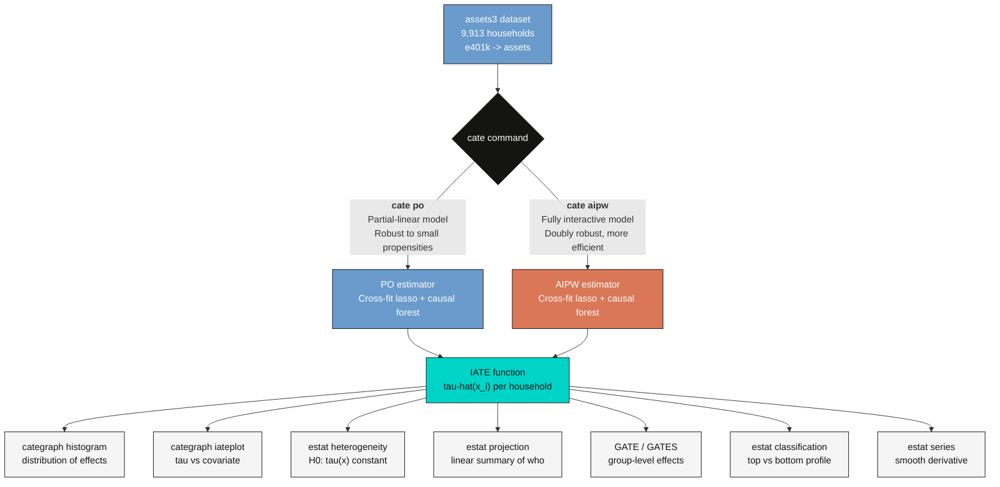
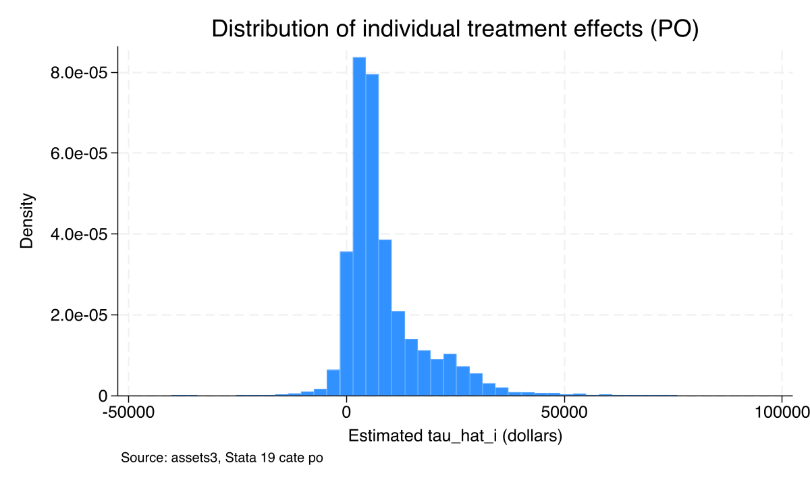
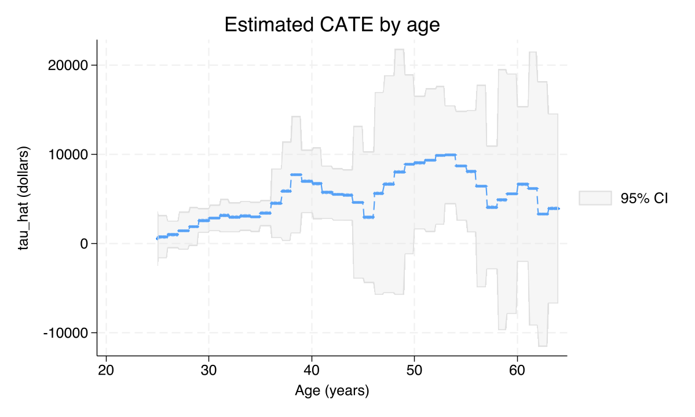
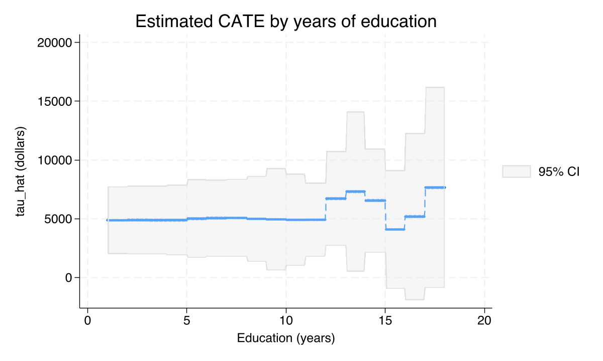
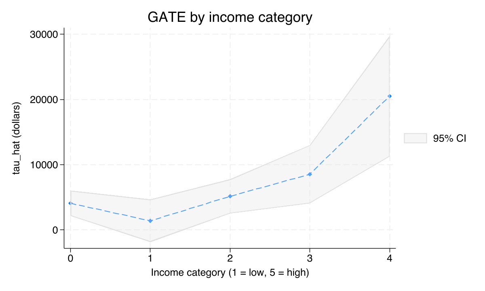
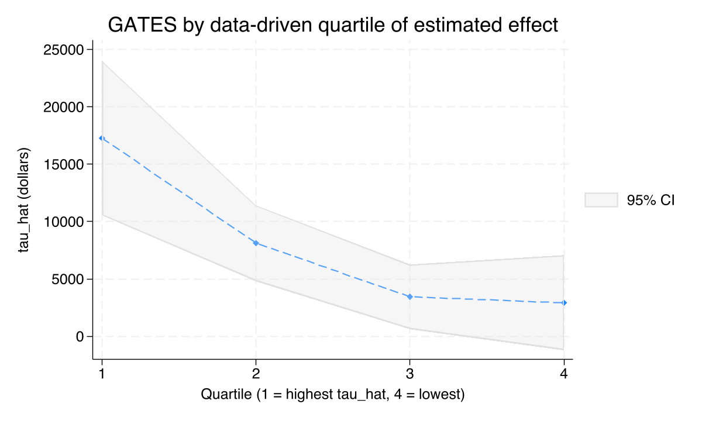
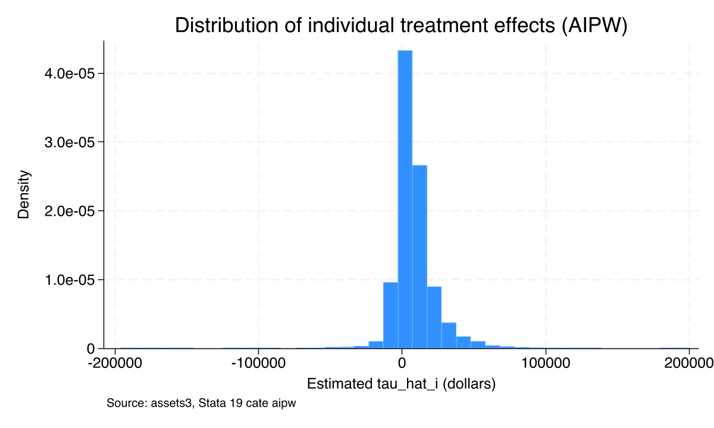
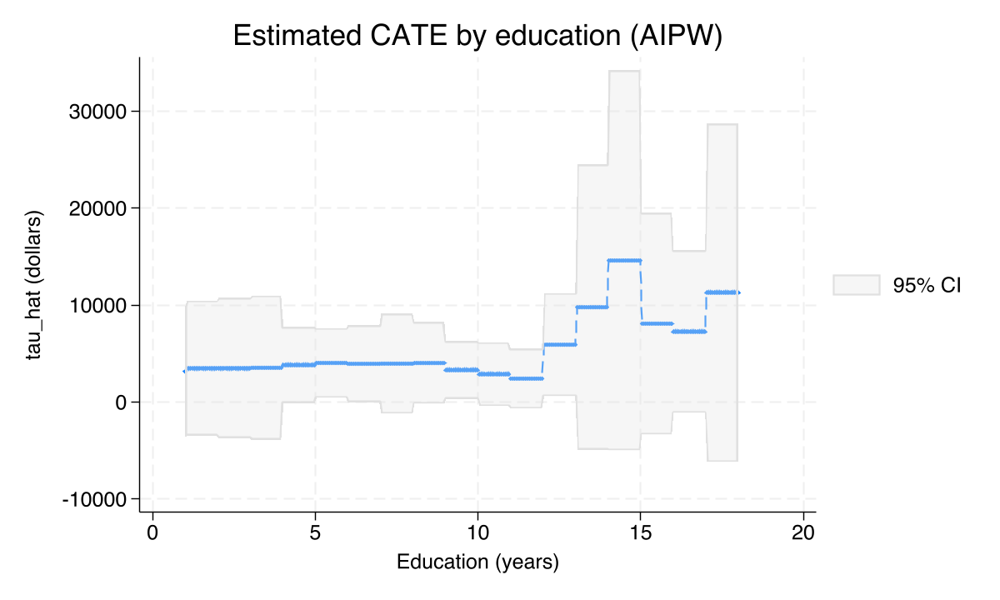
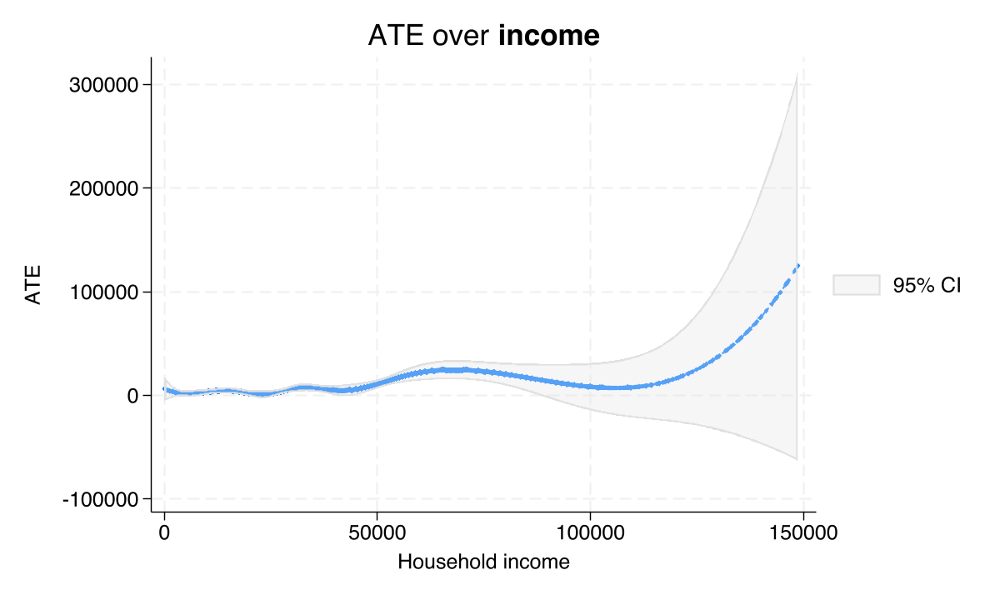

---
authors:
  - admin
categories:
  - Stata
  - Causal Inference
  - Heterogeneous Treatment Effects
  - Machine Learning
  - Conditional Average Treatment Effects (CATE)
draft: false
featured: false
date: "2026-05-01T00:00:00Z"
external_link: ""
image:
  caption: ""
  focal_point: Smart
  placement: 3
links:
- icon: file-code
  icon_pack: fas
  name: "Stata do-file"
  url: analysis.do
- icon: file-alt
  icon_pack: fas
  name: "Stata log"
  url: analysis.log
slides:
summary: Estimate how the effect of 401(k) eligibility on household assets varies across households using Stata 19's new cate command, with PO, AIPW, GATE, GATES, and nonparametric series estimators applied to the canonical assets3 dataset
tags:
  - stata
  - causal
  - causal inference
  - cate
  - heterogeneous treatment effects
  - machine learning
title: "Conditional Average Treatment Effects (CATE) with Stata 19"
url_code: ""
url_pdf: ""
url_slides: ""
url_video: ""
toc: true
diagram: true
---

## 1. Overview

The textbook causal-inference workflow ends with a single number — the **Average Treatment Effect (ATE)**. But policy makers, doctors, and managers rarely care only about the average. They want to know *for whom* the program works best, *for whom* it does little, and *whether* the gains are worth the cost in any particular subgroup. This question — how the treatment effect varies across the covariates — is captured by the **Conditional Average Treatment Effect (CATE)**, also written $\tau(x) = E\\{y(1) - y(0) \mid x = x\\}$.

Until very recently, estimating CATE in Stata required hand-rolled `forvalues` loops, careful interactions, and uncomfortably-ad-hoc inference. Stata 19 changed that with the new `cate` command, which builds on the doubly robust scores of Athey, Tibshirani & Wager (2019) and the partialing-out workflow of Chernozhukov et al. (2018). With one command, Stata 19 now runs cross-fitted lasso for the nuisance functions, a generalized random forest for the individual-effect function $\tau(x)$, and an honest-tree bootstrap for confidence intervals. Postestimation tools — `estat heterogeneity`, `estat projection`, `categraph gateplot`, `estat classification`, `estat series` — turn the resulting object into pictures that beginners can read directly.

This tutorial walks through the full `cate` workflow on the canonical 401(k) eligibility study (`webuse assets3`, 9,913 households). We start with a single ATE, show that it hides a wide fan of household-level effects, and then peel back the heterogeneity in five complementary ways: a histogram of individual effects, an IATE-by-covariate plot, a GATE on prespecified income groups, GATES on data-driven quartiles, and a smooth nonparametric series fit. The result is a complete picture of *who benefits* — and a reusable template you can drop into your own observational data.

> **Prerequisite.** This post requires **Stata 19 or later**. The `cate` command does not exist in Stata 18. The do-file aborts on startup if it detects an older Stata.

### 1.1 Learning objectives

By the end of this tutorial you should be able to:

- **Understand** why the ATE alone can mislead and how the CATE function $\tau(x)$ describes treatment effect heterogeneity.
- **Implement** Stata 19's `cate` command using both the partialing-out (PO) and the augmented inverse-probability weighting (AIPW) estimators on observational data.
- **Estimate** group-level effects (GATE) on prespecified groups and data-driven quartiles (GATES) of the predicted effect.
- **Diagnose** treatment-effect heterogeneity with `estat heterogeneity`, summarize who responds with `estat projection` and `estat classification`, and visualize the dose-response with `estat series`.
- **Compare** doubly robust ML estimates (PO, AIPW) to a parametric `teffects aipw` benchmark and judge whether the average is hiding important variation.

### 1.2 Methodological overview

The diagram below shows the two routes through the `cate` command and the postestimation tools that probe the resulting CATE object.



The two branches (PO and AIPW) make different model assumptions but produce the same kind of object: a function $\hat{\tau}(x\_i)$ that returns a predicted treatment effect for every household. Postestimation commands then summarize that function in different ways — as a distribution (histogram), a function of one covariate (`iateplot`), a test (`estat heterogeneity`), a regression summary (`estat projection`), or a group-level table (GATE / GATES). All seven postestimation views answer slightly different questions, and the last three sections of this post show why a beginner should look at all of them rather than picking one favorite.

### 1.3 Key concepts at a glance

The post leans on a small vocabulary repeatedly. The rest of the tutorial assumes you can move between these terms quickly. Each concept below has three parts. The **definition** is always visible. The **example** and **analogy** sit behind clickable cards: open them when you need them, leave them collapsed for a quick scan. If a later section mentions "GATE vs GATES" or "doubly robust" and the term feels slippery, this is the section to re-read.

**1. Potential outcomes** $Y\_i(t)$.
The outcome unit $i$ **would** take under treatment value $t$. Each household has two potential outcomes here: assets if eligible for a 401(k), assets if not. We observe only one. The other is *counterfactual*. It lives in a world we never see.

<div class="concept-pair">
<details class="concept-card concept-example">
<summary>Example</summary>

Take household 1234 with `e401k = 1` (eligible). We observe its `assets` under eligibility. Its potential outcome under non-eligibility, $Y\_{1234}(0)$, is forever invisible. Causal inference is the art of imputing that missing potential outcome from comparable ineligible households.

</details>

<details class="concept-card concept-analogy">
<summary>Analogy</summary>

Every life decision is a fork in the road. You took one fork. The parallel-universe versions of yourself took the other. Their lives are real conceptual objects, but you cannot directly observe them.

</details>
</div>

**2. CATE** --- Conditional Average Treatment Effect, $\tau(\mathbf{x})$.
The average treatment effect for households with covariate profile $\mathbf{x}$. The CATE is a **function** of $\mathbf{x}$, not a single number. Where it bends with $\mathbf{x}$, eligibility helps some households more than others.

<div class="concept-pair">
<details class="concept-card concept-example">
<summary>Example</summary>

For a high-income household (`income` in the top quintile), the CATE is roughly \\$20,511. For a low-income household, it is closer to \\$4,087. Same `e401k = 1`, very different effects on `assets`.

</details>

<details class="concept-card concept-analogy">
<summary>Analogy</summary>

A drug's "average effect" is a 5-point reduction in blood pressure. But a doctor cares about a specific patient. Maybe a 65-year-old male with diabetes. The CATE is that personalized effect.

</details>
</div>

**3. ATE** --- Average Treatment Effect, $E[\tau(\mathbf{X})]$.
The CATE averaged across the entire sample. The headline policy number. It answers a single question: if we made everyone eligible, what would the average bump in `assets` be?

<div class="concept-pair">
<details class="concept-card concept-example">
<summary>Example</summary>

AIPW gives an ATE of \\$8,120 (95% CI [\\$5,846, \\$10,395]) on our 9,913 households. PO gives \\$7,937 (95% CI [\\$5,677, \\$10,197]). The two estimates are within \\$200. Their joint message: eligibility raises mean assets by about \\$8,000.

</details>

<details class="concept-card concept-analogy">
<summary>Analogy</summary>

"This drug lowers cholesterol by 12 points on average." Single number. Suitable for a press release. Says nothing about who responds best.

</details>
</div>

**4. GATE** --- Group Average Treatment Effect.
The CATE averaged inside a *pre-specified* subgroup. The subgroup is fixed before estimation. GATEs test moderation hypotheses you formulated in advance: "do high-income households benefit more than low-income ones?"

<div class="concept-pair">
<details class="concept-card concept-example">
<summary>Example</summary>

Sort households by `incomecat` (lowest to highest income quintile). Average CATEs inside each level. The lowest quintile gets \\$4,087. The highest gets \\$20,511. The pattern is monotone and steep.

</details>

<details class="concept-card concept-analogy">
<summary>Analogy</summary>

A nationwide marketing campaign lifts sales 5% on average. Before scaling up, you ask: did it work better in cities than rural towns? Same data, broken down by a subgroup you defined in advance.

</details>
</div>

**5. GATES** --- Group Average Treatment Effects via *predicted* effect quartiles.
A *data-driven* version of GATE. Sort households by their estimated CATE $\hat{\tau}\_i$, slice into quartiles Q1--Q4, then average the actual response in each quartile. The contrast Q4-vs-Q1 is the strongest moderation signal a beginner can find without naming the moderator.

<div class="concept-pair">
<details class="concept-card concept-example">
<summary>Example</summary>

GATES Q1 (lowest predicted effect) = \\$17,279. GATES Q4 (highest predicted effect) = \\$2,919. The top-to-bottom ratio is 5.9×. Note that GATES is sorted by *predicted* effect, so the labels feel inverted: we let the model tell us who responds.

</details>

<details class="concept-card concept-analogy">
<summary>Analogy</summary>

Letting the data sort the patients for you. You do not need to know in advance whether age, gender, or kidney function matters. You ask: "based on the model, who is in the top 25% of predicted responders?" Then you check whether they actually respond more.

</details>
</div>

**6. PO vs AIPW estimators**.
Two ways to map nuisance estimates into a CATE. **PO** (Partialing Out, partial-linear model) residualizes both `assets` and `e401k` against the covariates, then regresses one residual on the other. Simple, transparent, sensitive to extreme propensity scores. **AIPW** (Augmented Inverse-Probability Weighting) reweights by inverse propensity and adds a regression correction. More machinery, but doubly robust.

<div class="concept-pair">
<details class="concept-card concept-example">
<summary>Example</summary>

This post fits both. They land within \\$200 (PO \\$7,937 vs AIPW \\$8,120). When PO and AIPW are close, the model-disagreement diagnostic is green. When they diverge, the overlap is suspect or one of the nuisance models is mis-specified.

</details>

<details class="concept-card concept-analogy">
<summary>Analogy</summary>

Two judges hear the same case via different reasoning. When their verdicts agree, you trust the case. When they disagree, you re-read the evidence.

</details>
</div>

**7. Heterogeneity test**.
A formal $\chi^2$ test that $\tau(\mathbf{x})$ varies with $\mathbf{x}$. The null is constant treatment effects: every household responds the same way. Rejection licenses the CATE / GATE / GATES interpretation.

<div class="concept-pair">
<details class="concept-card concept-example">
<summary>Example</summary>

After `cate`, `estat heterogeneity` returns χ²(1) = 4.11 (p = 0.043) for PO and χ²(1) = 5.54 (p = 0.019) for AIPW. Both reject the constant-effect null at conventional levels. The post's heterogeneity story has formal backing.

</details>

<details class="concept-card concept-analogy">
<summary>Analogy</summary>

A metal detector for hidden moderation. It does not tell you *where* in the field the metal is buried. It only tells you whether to keep digging.

</details>
</div>

**8. Doubly robust property**.
A property of AIPW (and other DR estimators). The estimator stays consistent for the ATE if **either** the outcome model is correctly specified **or** the propensity model is correctly specified. Both right is gravy. Only one right is enough. Both wrong is the only failure mode.

<div class="concept-pair">
<details class="concept-card concept-example">
<summary>Example</summary>

This is why AIPW (\\$8,120) is given more weight in our discussion than IPW alone would be. Even if our random forests under-fit either nuisance, AIPW still recovers the truth.

</details>

<details class="concept-card concept-analogy">
<summary>Analogy</summary>

Belt and suspenders. If the belt fails, the suspenders hold. If the suspenders fail, the belt holds. Two failures simultaneously? Time to buy new pants.

</details>
</div>

---

## 2. The dataset: 401(k) eligibility and household assets

We use `assets3`, an excerpt from Chernozhukov & Hansen (2004) shipped with Stata 19. Each row is one household. The outcome is total net financial assets in dollars; the treatment is whether the household head's employer offers a 401(k) plan (i.e. eligibility, not actual participation). The economic question is whether eligibility on its own — independent of contribution choices — increases retirement wealth, and the standard concern is that eligible workers differ systematically from ineligible workers (they earn more, are older, work for larger employers).

We load the data, declare which variables describe the heterogeneity we care about, and inspect the basic descriptive stats:

```stata
webuse assets3, clear

* Define the heterogeneity-of-interest covariates and (for this tutorial)
* the same set as nuisance controls.
global catecovars age educ i.incomecat i.pension i.married i.twoearn i.ira i.ownhome
global controls   age educ i.incomecat i.pension i.married i.twoearn i.ira i.ownhome
global rseed      12345671

describe asset e401k age educ income incomecat pension married twoearn ira ownhome
summarize asset e401k age educ income, detail
tab e401k, missing
```

```text
Variable      Storage   Display    Value
    name         type    format    label      Variable label
-------------------------------------------------------------
assets          float   %9.0g                 Net total financial assets
e401k           byte    %12.0g     lbe401     401(k) eligibility
age             byte    %9.0g                 Age
educ            byte    %9.0g                 Years of education
income          float   %9.0g                 Household income
incomecat       byte    %9.0g                 Income category
pension         byte    %16.0g     lbpen      Pension benefits
married         byte    %11.0g     lbmar      Marital status
twoearn         byte    %9.0g      lbyes      Two-earner household
ira             byte    %9.0g      lbyes      IRA participation
ownhome         byte    %9.0g      lbyes      Homeowner

      401(k) |
 eligibility |      Freq.     Percent        Cum.
-------------+-----------------------------------
Not eligible |      6,231       62.86       62.86
    Eligible |      3,682       37.14      100.00
       Total |      9,913      100.00
```

The dataset contains **9,913 households**, of which **3,682 (37.1%) are eligible** for a 401(k) and **6,231 (62.9%) are not**. The asset distribution is extraordinarily right-skewed — mean \\$18,054 against a median of just \\$1,499, with a maximum of \\$1.5 million and a minimum of −\\$502,302 (households with negative net worth). Income, age, and education show much milder skew. Four key features matter for what follows: the treatment is roughly balanced (37% vs 63%, plenty of overlap on average), the outcome has heavy tails (so the treatment effect almost certainly varies across the distribution), and we have a rich set of demographic covariates to condition on.

---

## 3. The naive view (and why it fails)

Before reaching for any causal estimator it is healthy to look at the raw mean difference. If `e401k` were randomly assigned the comparison would be the ATE. It isn't — eligibility is a function of who chooses what employer — so the raw difference is biased. Showing this gap explicitly motivates everything that follows.

```stata
* Raw means by eligibility
tabstat asset, by(e401k) statistics(mean sd n)
```

```text
Summary for variables: assets
Group variable: e401k (401(k) eligibility)

       e401k |      Mean        SD         N
-------------+------------------------------
Not eligible |   10789.9  54527.02      6231
    Eligible |  30347.39  74800.21      3682
-------------+------------------------------
       Total |  18054.17  63528.63      9913
```

Eligible households hold an average of **\\$30,347** in net financial assets versus **\\$10,790** for ineligible ones — a raw gap of **\\$19,557**. If we believed in random assignment we would call that the average effect of eligibility. But eligible workers are systematically different: they tend to be older, more educated, and earn substantially more. Some of that \\$19,557 is causal, but a meaningful share is just selection. The next section pins down how much of the gap is causal once we adjust for those covariates.

---

## 4. A first ATE: parametric `teffects aipw`

Stata's mature `teffects` suite already supports doubly robust ATE estimation with parametric models. We use it here as a familiar, fast benchmark before introducing the new `cate` command. The estimand is

$$\text{ATE} = E\\{y(1) - y(0)\\}$$

In words, this is the *average* treatment effect across all households in the population. The augmented inverse-probability weighting (AIPW) estimator is doubly robust: it returns the right ATE if either the outcome model or the propensity score model is correctly specified — we don't need both.

```stata
teffects aipw                                                                   ///
    (asset c.age c.educ i.incomecat i.pension i.married i.twoearn i.ira i.ownhome) ///
    (e401k c.age c.educ i.incomecat i.pension i.married i.twoearn i.ira i.ownhome)
```

```text
Treatment-effects estimation                    Number of obs     =      9,913
Estimator      : augmented IPW
Outcome model  : linear by ML
Treatment model: logit
------------------------------------------------------------------------------
ATE          |
       e401k |
  (Eligible  |
         vs  |
Not elig..)  |   8019.463   1152.038     6.96   0.000      5761.51    10277.42
-------------+----------------------------------------------------------------
POmean       |
       e401k |
Not eligi..  |   13930.46    817.613    17.04   0.000     12327.97    15532.96
------------------------------------------------------------------------------
```

The doubly robust ATE is **\\$8,019** with a 95% confidence interval of **[\\$5,762, \\$10,277]** — about 58% above the average baseline assets of ineligible households (\\$13,930). The naive raw gap (\\$19,557) was therefore inflated by a factor of 2.4: roughly 60% of the observed asset gap between eligible and ineligible households is selection — they would have held more assets even without the program — and only 40% is the causal effect of eligibility. That said, \\$8,019 is still just *one* number. The cross-tabulation of mean assets by income category and eligibility (which we computed but suppressed for length here, see `analysis.log`) shows differences ranging from \\$5,011 in the lowest income category to \\$20,949 in the highest — a 4× spread that the ATE flattens out. That spread is the CATE we now estimate properly.

---

## 5. The CATE: definition, model, and the `cate` command

The Conditional Average Treatment Effect at covariate value $x$ is defined as

$$\tau(\mathbf{x}) = E\\{y(1) - y(0) \mid \mathbf{x} = \mathbf{x}\\}$$

In words, this says: among all households whose covariates are $\mathbf{x}$, what is their *average* treatment effect? The CATE is a *function* of covariates, not a single number. If $\tau(\mathbf{x})$ happened to be constant, we'd be back at the ATE. Whenever it varies, the ATE is an average of these subgroup effects weighted by how common each $\mathbf{x}$ is in the data.

To estimate $\tau(\mathbf{x})$ Stata 19 offers two model specifications:

1. **Partial-linear (PO) model.** Assumes the outcome can be written as

$$y = d \cdot \tau(\mathbf{x}) + g(\mathbf{x}, \mathbf{w}) + \epsilon, \qquad d = f(\mathbf{x}, \mathbf{w}) + u$$

In words, the outcome is the treatment $d$ times the per-household effect $\tau(\mathbf{x})$, plus a flexible function $g$ of all covariates, plus noise; and the treatment itself is a flexible function $f$ of those covariates plus its own noise. PO partials out $g$ and $f$ using out-of-sample predictions (cross-fitting), then fits a generalized random forest on the residuals to recover $\tau(\mathbf{x})$. PO is the more robust choice when propensity scores can get close to 0 or 1.

2. **Fully interactive (AIPW) model.** Assumes $y(1) = g_1(\mathbf{x}, \mathbf{w}) + \epsilon_1$ and $y(0) = g_0(\mathbf{x}, \mathbf{w}) + \epsilon_0$ — separate outcome models for treated and untreated households — and combines them with the propensity score to form the doubly-robust AIPW score (Section 9). AIPW is more efficient (narrower CIs) when both models are well-specified, but more sensitive to extreme propensities.

We start with PO. The variables in `$catecovars` are the inputs to $\tau(\mathbf{x})$ — the dimensions on which we want to see heterogeneity — and the `controls` (left at the default, which equals `catecovars`) are passed to the nuisance models $g$ and $f$. The `rseed()` option fixes the cross-fitting and random-forest internals so the run is reproducible.

```stata
cate po (asset $catecovars) (e401k), rseed($rseed)
```

```text
Conditional average treatment effects     Number of observations       = 9,913
Estimator:       Partialing out           Number of folds in cross-fit =    10
Outcome model:   Linear lasso             Number of outcome controls   =    17
Treatment model: Logit lasso              Number of treatment controls =    17
CATE model:      Random forest            Number of CATE variables     =    17

------------------------------------------------------------------------------
             |               Robust
      assets | Coefficient  std. err.      z    P>|z|     [95% conf. interval]
-------------+----------------------------------------------------------------
ATE          |
       e401k |
  (Eligible  |
         vs  |
Not elig..)  |   7937.182   1153.017     6.88   0.000     5677.309    10197.05
------------------------------------------------------------------------------
```

The PO ATE — averaged over the estimated $\hat{\tau}(\mathbf{x}_i)$ across the sample — is **\\$7,937** with a 95% CI of **[\\$5,677, \\$10,197]**. That's within \\$80 of the parametric `teffects aipw` ATE in the previous section, even though `cate po` is doing something fundamentally different under the hood (cross-fit lasso for the nuisance models, causal forest for the IATE). When two very different estimators agree on the average, you can trust that average — and you can move on to looking at the heterogeneity.

### 5.1 Is there heterogeneity at all? `estat heterogeneity`

Before exploring how $\tau(\mathbf{x})$ varies, it is worth asking whether it varies. The `estat heterogeneity` command tests the null hypothesis that $\tau(\mathbf{x})$ is constant — that there is, in fact, no heterogeneity to study.

```stata
estat heterogeneity
```

```text
Treatment-effects heterogeneity test
H0: Treatment effects are homogeneous

    chi2(1) =   4.11
Prob > chi2 = 0.0427
```

The test rejects homogeneity at the 5% level: **χ²(1) = 4.11, p = 0.043**. In plain English: the data have enough information to distinguish the estimated CATE function $\hat{\tau}(\mathbf{x})$ from a constant. The rest of this tutorial is therefore not a hunt for noise — there is real heterogeneity, and the next sections describe what shape it takes.

### 5.2 Who responds most? `estat projection`

A causal forest fits $\hat{\tau}(\mathbf{x})$ flexibly, but a flexible function is hard to summarize in a paragraph. `estat projection` regresses $\hat{\tau}_i$ on the covariates linearly. The coefficients are not causal (they're a *projection* of an already-estimated nonlinear function onto a linear basis), but they answer the practical question "which variables shift the predicted effect, and by how much?".

```stata
estat projection $catecovars
```

```text
Treatment-effects linear projection                  Number of obs =     9,913
                                                     F(11, 9901)   =      4.90
                                                     Prob > F      =    0.0000

         age |    205.12     117.98    1.74   0.082    -26.15     436.39
        educ |   -442.46     488.47   -0.91   0.365  -1399.96     515.05
incomecat 1  |  -2439.22    2013.52   -1.21   0.226  -6386.14    1507.69
incomecat 2  |   1874.82    2295.16    0.82   0.414  -2624.15    6373.79
incomecat 3  |   5707.69    3298.34    1.73   0.084   -757.73   12173.11
incomecat 4  |  18194.60    5398.39    3.37   0.001   7612.65   28776.54
pension Y    |   3817.36    2454.44    1.56   0.120   -993.84    8628.55
ownhome Y    |   3162.65    1669.59    1.89   0.058   -110.08    6435.38
```

The single dominant signal is income. Relative to households in the lowest income category, those in the highest income category have a predicted effect that is **\\$18,195 higher** (p = 0.001) — the only coefficient significant at the 1% level. Homeownership lifts the predicted effect by another \\$3,163 (p = 0.058) and each additional year of age adds \\$205 (p = 0.082); both are borderline. Education, marriage, two-earner status, and IRA participation are essentially flat. The R² of 0.0045 is not a critique — it tells us most of the heterogeneity is genuinely nonlinear (curvature that the random forest captures and a linear projection cannot). The rest of the post zooms into where that nonlinearity lives.

---

## 6. The shape of individual-level heterogeneity

Before slicing the CATE by groups, it helps to look at the distribution of household-level effects. `categraph histogram` plots the predicted $\hat{\tau}_i$ for every household in the sample.

```stata
categraph histogram, ///
    title("Distribution of individual treatment effects (PO)")  ///
    xtitle("Estimated tau_hat_i (dollars)")                     ///
    note("Source: assets3, Stata 19 cate po")
graph export "stata_cate_iate_histogram_po.png", replace width(1200)
```



The distribution is **strongly right-skewed**. Most households cluster around a modest positive effect (the bulk of the mass sits near \\$5,000–\\$10,000), but a long right tail extends to \\$80,000 and beyond. A small left tail dips into negative territory: a meaningful minority of households are estimated to gain little or nothing from 401(k) eligibility. This is the visual answer to "is the average hiding something?" — the average of \\$7,937 is genuinely close to the median, but the spread on either side is huge. The next two views — IATE plots and GATE — describe *who* sits in the right tail.

### 6.1 How does the effect vary with one covariate? IATE plots

The `categraph iateplot` command holds all covariates except one fixed at sample-mean (continuous) or base (factor) values, and varies the one covariate of interest. The result is a slice through the multi-dimensional CATE function with confidence bands.

```stata
categraph iateplot age, ///
    title("Estimated CATE by age")        ///
    ytitle("tau_hat (dollars)") xtitle("Age (years)")
graph export "stata_cate_iateplot_age.png", replace width(1200)
```



The age slice is broadly increasing. Younger workers (mid-20s to early 30s) have small or even slightly negative predicted effects; the line crosses into clearly positive territory around age 35–40 and continues climbing through the 50s. The intuition is straightforward: 401(k) eligibility is most valuable to workers with the financial slack and the planning horizon to take advantage of tax-deferred saving. Confidence bands narrow in the middle of the age range where most of the data lives and widen at the extremes.

The same exercise with education looks rather different:

```stata
categraph iateplot educ, ///
    title("Estimated CATE by years of education")  ///
    ytitle("tau_hat (dollars)") xtitle("Education (years)")
graph export "stata_cate_iateplot_educ.png", replace width(1200)
```



The education slice is **broadly flat** at around \\$1,000–\\$3,000 across the entire range from 8 to 18 years of schooling. This is consistent with the linear projection (where the education coefficient was small and not significant). It is also a useful negative finding — once you condition on income, education adds little to the predicted effect.

---

## 7. Group-level effects: GATE on prespecified groups

Individual-level $\hat{\tau}_i$ is informative but noisy. A common practice is to summarize them by *groups* — either prespecified (income category, region, education tier) or data-driven (top vs bottom quartile of predicted effect). Stata's GATE and GATES estimators are the formal versions of these two strategies.

The Group ATE (GATE) on a prespecified group $g$ is

$$\tau(g) = E\\{\Gamma\_i \mid G\_i = g\\}$$

In words, this says: the average AIPW orthogonal score $\Gamma\_i$ within group $g$ — i.e., the doubly robust per-household effect score, averaged over households assigned to that group. We compute it on the income categories `incomecat`. The clever bit is `reestimate`: after running `cate po` once, we tell Stata to recycle the fitted IATE function and just recompute group means, saving a slow second causal-forest fit.

```stata
cate, group(incomecat) reestimate
estat gatetest
```

```text
GATE         |   Coefficient   Std. err.    z    P>|z|     [95% conf. interval]
incomecat    |
   0         |    4087.014     987.7124    4.14   0.000    2151.13    6022.90
   1         |    1399.398    1663.193     0.84   0.400   -1860.40    4659.20
   2         |    5154.329    1349.842     3.82   0.000    2508.69    7799.97
   3         |    8532.238    2287.664     3.73   0.000    4048.50   13015.98
   4         |   20510.94     4723.741     4.34   0.000   11252.58   29769.30

Group treatment-effects heterogeneity test
H0: Group average treatment effects are homogeneous

    chi2(4) =  18.44
Prob > chi2 = 0.0010
```

```stata
categraph gateplot, ///
    title("GATE by income category")           ///
    ytitle("tau_hat (dollars)") xtitle("Income category (1 = low, 5 = high)")
graph export "stata_cate_gate_incomecat.png", replace width(1200)
```



The five group-level effects span an order of magnitude: \\$4,087 (lowest income), \\$1,399 (income category 1, not significant at p = 0.40), \\$5,154, \\$8,532, and **\\$20,511** in the highest income category — roughly five times the average. The joint test of equality (`estat gatetest`) rejects strongly: **χ²(4) = 18.44, p = 0.001**. There is one mild departure from monotonicity at category 1, which is interesting but lies just within sampling variability (its CI overlaps zero). Two important policy facts emerge: the marginal household in the top income category gains an average of about \\$20,500 from 401(k) eligibility, and the marginal household at the bottom of the distribution gains about \\$4,000 — but the middle-low (category 1) gains effectively nothing.

---

## 8. Data-driven groups: GATES on quartiles of $\hat{\tau}$

GATE on prespecified groups is principled but presupposes that the analyst already knows which groups matter. **GATES** ("Group Average Treatment Effects Sorted") flips this around: it lets the data sort households by their predicted effect, bins them into quantiles, and reports the mean effect within each bin. Cross-fitting protects against p-hacking — each unit's bin is determined by an out-of-sample prediction, so observations cannot leak their own outcomes into their bin assignment.

```stata
cate po (asset $catecovars) (e401k), rseed($rseed) group(4)
```

```text
GATES        |   Coefficient   Std. err.    z    P>|z|     [95% conf. interval]
   rank      |
        1    |   17278.94     3440.125     5.02   0.000   10536.42   24021.46
        2    |    8121.04     1691.008     4.80   0.000    4806.73   11435.35
        3    |    3443.83     1437.640     2.40   0.017     626.11    6261.56
        4    |    2919.20     2110.320     1.38   0.167   -1216.96    7055.35
ATE          |    7938.21     1152.994     6.88   0.000    5678.38   10198.04
```

```stata
categraph gateplot, ///
    title("GATES by data-driven quartile of estimated effect") ///
    ytitle("tau_hat (dollars)") xtitle("Quartile (1 = highest tau_hat, 4 = lowest)")
graph export "stata_cate_gates_quartiles.png", replace width(1200)
```



The data-driven ladder is **clean and monotonic**: the top quartile gains an average of **\\$17,279** (CI \\$10,536–\\$24,021), the second \\$8,121, the third \\$3,444, and the bottom **\\$2,919** — and the bottom quartile is *not* statistically distinguishable from zero (p = 0.167). The top-to-bottom ratio is **5.9×**. This is the single most informative summary of heterogeneity in the dataset because the bins are constructed by the data itself rather than by a researcher choice. Roughly one in four households in the sample appears to gain little or nothing from 401(k) eligibility, while another quarter gains over twice the average effect.

### 8.1 Who is in the top vs the bottom quartile? `estat classification`

The data sorted itself; now we can ask what makes the top quartile different. `estat classification` runs a two-sample t-test for one variable at a time, comparing its mean in the top-effect rank group against its mean in the bottom-effect rank group.

```stata
estat classification age
estat classification educ
estat classification income
```

| Variable | Top quartile (n=2,480) | Bottom quartile (n=2,471) | Difference | t-statistic |
|----------|-----------------------:|--------------------------:|-----------:|------------:|
| Age (years) | 45.15 | 34.98 | 10.17 | 35.67 |
| Education (years) | 14.02 | 12.65 | 1.37 | 18.62 |
| Income (\\$) | 62,739 | 26,861 | 35,878 | 56.22 |

The high-effect quartile is sharply different from the low-effect quartile on every dimension: about **10 years older** on average (45.1 vs 35.0), with **1.4 more years of education** (14.0 vs 12.7), and **\\$35,878 higher household income** (\\$62,739 vs \\$26,861). All three differences are huge in t-statistic terms (19, 36, 56). Income is the dominant marker — exactly what the linear projection and the GATE-by-income picture already suggested. The story behind the numbers: 401(k) eligibility helps people who already have the financial slack and time-horizon to actually use it, and a substantial minority of the population has neither.

---

## 9. AIPW: a doubly-robust contrast

So far we have used the partialing-out estimator. The fully interactive AIPW estimator fits separate outcome models for treated and untreated households and combines them with the propensity score via the AIPW orthogonal score:

$$\Gamma\_i = \left[\hat{y}(1)\_i + \frac{d\_i \\, \\{y\_i - \hat{y}(1)\_i\\}}{\hat{f}\_i}\right] - \left[\hat{y}(0)\_i + \frac{(1-d\_i) \\, \\{y\_i - \hat{y}(0)\_i\\}}{1-\hat{f}\_i}\right]$$

In words, this says: the doubly robust per-household effect score is the predicted treated outcome minus the predicted untreated outcome, each corrected by an inverse-propensity weighted residual. It is "doubly robust" because it stays consistent if *either* the outcome models OR the propensity-score model is correct — you only need to get one of them right. The cost is sensitivity to extreme propensities: if some households have $\hat{f}\_i$ close to 0 or 1 the inverse weights blow up.

```stata
cate aipw (asset $catecovars) (e401k), rseed($rseed)
estat heterogeneity
```

```text
ATE          |
       e401k |
  (Eligible  |
         vs  |
Not elig..)  |   8120.264   1160.538     7.00   0.000     5845.652    10394.88

Treatment-effects heterogeneity test
H0: Treatment effects are homogeneous
    chi2(1) =   5.54
Prob > chi2 = 0.0186
```

```stata
categraph histogram, ///
    title("Distribution of individual treatment effects (AIPW)")  ///
    xtitle("Estimated tau_hat_i (dollars)")                       ///
    note("Source: assets3, Stata 19 cate aipw")
graph export "stata_cate_iate_histogram_aipw.png", replace width(1200)
```



```stata
categraph iateplot educ, ///
    title("Estimated CATE by education (AIPW)")  ///
    ytitle("tau_hat (dollars)") xtitle("Education (years)")
graph export "stata_cate_iateplot_educ_aipw.png", replace width(1200)
```



The AIPW ATE is **\\$8,120** — within \\$200 of both the parametric `teffects aipw` ATE (\\$8,019) and the PO ATE (\\$7,937). The heterogeneity test now rejects more strongly (**χ²(1) = 5.54, p = 0.019**) than under PO (p = 0.043), consistent with AIPW's higher efficiency when both nuisance models are well-specified. The AIPW IATE histogram (Figure 6) has the same right-skewed shape as the PO histogram but a slightly wider support — AIPW puts more mass in the tails because of the inverse-propensity correction, which is the visual signature of the overlap-sensitivity warning above. The AIPW education slice (Figure 7) is essentially identical in shape to the PO version: a broadly flat profile around the average. Across estimators, the substantive story does not change.

---

## 10. The smooth income gradient: `estat series`

`categraph iateplot` showed the CATE as a function of one variable with the others fixed at reference values. `estat series` is a complementary view — it fits a flexible smoother (cubic B-spline by default) of the predicted effect against one continuous covariate, marginalizing over the joint distribution of the others. For continuous variables like income this gives the cleanest "dose-response" picture.

```stata
estat series income if income <= 150000, graph knots(5)
graph export "stata_cate_series_income.png", replace width(1200)
```

```text
Nonparametric series regression for IATE
Cubic B-spline estimation                  Number of obs =     9,884
Number of knots = 5
------------------------------------------------------------------------------
             |               Robust
             |     Effect   std. err.      z    P>|z|     [95% conf. interval]
-------------+----------------------------------------------------------------
      income |   .2131162   .0502993     4.24   0.000     .1145313     .311701
------------------------------------------------------------------------------
Note: Effect estimates are averages of derivatives.
```



The reported "Effect" is the **average derivative** of the predicted treatment effect with respect to income: **0.213** (SE 0.050, p < 0.001, 95% CI [0.115, 0.312]). Translated into dollars: **each additional \\$1,000 of household income raises the predicted 401(k) treatment effect by about \\$213 on average**. The B-spline fit (Figure 8) reveals that this derivative is not constant — the slope is steepest in the middle of the income distribution and flatter at both ends — which is why a single linear-projection coefficient (\\$18,195 for the highest income category) only partially captured the gradient. The series view smooths over the binning entirely.

---

## 11. Putting it all together: comparison table

The four causal estimators we ran agree closely on the average and disagree only marginally on the heterogeneity p-value:

| Estimator | ATE | 95% CI | Heterogeneity test | Notes |
|-----------|----:|:------:|:------------------:|-------|
| Naive raw difference | 19,557 | n/a | n/a | Raw mean gap; mostly selection |
| `teffects aipw` (parametric) | 8,019 | [5,762, 10,277] | — | Mature, fast benchmark |
| `cate po` (lasso + causal forest) | 7,937 | [5,677, 10,197] | χ²(1) = 4.11, p = 0.043 | Robust to extreme propensities |
| `cate aipw` (lasso + causal forest, doubly robust) | 8,120 | [5,846, 10,395] | χ²(1) = 5.54, p = 0.019 | Most efficient; uses AIPW score |

Three independent ML and parametric estimators bracket the true ATE within a \\$183 spread. Both ML estimators reject homogeneity at the 5% level. The naive raw difference of \\$19,557 was inflated by a factor of 2.4 — about \\$11,500 of it was selection.

---

## 12. Discussion: answering the question

We opened with the question, *for whom* does 401(k) eligibility increase financial assets? The eight figures and four estimators in this post answer it concretely:

- **The average household gains about \\$8,000.** Across three estimators of the ATE that span very different model assumptions, the answer is \\$7,937 to \\$8,120 with a narrow range. The naive raw gap of \\$19,557 overstated the causal effect by 2.4×.
- **But the average hides substantial heterogeneity.** Both `estat heterogeneity` tests reject a constant CATE at the 5% level; the GATE joint test rejects equality across income groups at p = 0.001; and the GATES quartile ladder spans \\$2,919 (bottom quartile, not significant) to \\$17,279 (top quartile) — a factor of 5.9.
- **Income is the dominant moderator.** The linear projection coefficient on the highest income category is \\$18,195 (p = 0.001). The smooth B-spline says each extra \\$1,000 of income raises the effect by \\$213 on average. The classification analysis says households in the top-effect quartile earn \\$35,878 more on average than households in the bottom-effect quartile.
- **About a quarter of households gain little or nothing.** The bottom GATES quartile cannot reject zero (p = 0.167), and a small left tail in both IATE histograms shows households with predicted effects close to zero or even slightly negative.
- **Age and homeownership matter at the margin.** Older workers and homeowners gain more, but the effects are smaller and more uncertain than the income effect. Education and marital status are essentially flat once income is controlled for.

The "so what?" for policy: a 401(k) eligibility expansion targeted at low-income workers will have a much smaller per-capita asset effect than one targeted at high-income workers — but the lowest-income households still gain a real, statistically significant \\$4,000 on average, suggesting the program is not pointless for them. A blanket expansion that ignores heterogeneity would systematically underestimate the gains to high earners and overestimate the gains to households in the second income decile.

---

## 13. Summary and next steps

**Method takeaways.**

- Stata 19's `cate` command unifies cross-fit ML nuisance estimation, doubly robust scores, causal-forest IATE estimation, and honest-tree inference into a single workflow. Two estimators (PO and AIPW) and seven postestimation views cover almost all practical heterogeneity questions.
- **PO** (partialing-out) is more robust to extreme propensity scores; **AIPW** is more efficient when both nuisance models are well-specified. They agree on the ATE in this dataset (\\$7,937 vs \\$8,120, a difference of 2.3%), which is the strongest possible robustness check.
- The four heterogeneity views — `estat heterogeneity`, `estat projection`, GATE/GATES, and `estat series` — answer different questions. A beginner should look at all of them rather than picking a favorite.

**Data takeaways.**

- The 401(k) eligibility ATE on the assets3 sample is \\$8,019 ± \\$1,150.
- The CATE varies from \\$1,399 (income category 1) to \\$20,511 (highest income category) — a 15× spread.
- One in four households shows essentially no effect; one in four shows over twice the average.

**Limitations.**

- The CATE is identified under unconfoundedness (no unmeasured confounders) given the rich set of demographic covariates. If, for instance, employer match rates differ systematically across the income distribution and we don't observe match rates, that would bias the income gradient.
- The bootstrap-of-little-bags inference behind the IATE confidence bands assumes honest random forests. With the default `xfolds(10)` and the default forest settings, runtime is ≈9 minutes on Stata SE 19; StataNow MP cuts this by roughly 3×.
- We did not formally check propensity overlap in this post. As a follow-up, run `teffects overlap` after the parametric AIPW or check `estat osample` after the `cate` command.

**Next steps.** Try `cate aipw ..., omethod(rforest) tmethod(rforest) oob` for a fully nonparametric specification with out-of-bag inference (faster and more flexible than the lasso default). Or move to the `lung` dataset shipped with Stata 19 and explore `estat policyeval` to compare expected outcomes under hypothetical assignment policies (e.g., "treat only households with predicted positive effect").

---

## 14. Exercises

1. **Compare specifications.** Re-run `cate po` with `omethod(rforest) tmethod(rforest)` (random-forest nuisance instead of lasso). How much do the GATE-by-income estimates change? Use `oob` to speed up the run.
2. **Build a custom group.** Create a "high-effect candidate" indicator that is 1 if `age > 40 & income > 50000 & ownhome == 1`, 0 otherwise. Run `cate, group(high_eff_candidate) reestimate` and compare the two GATEs to the GATES top vs bottom quartile in this post.
3. **Explore another moderator.** Use `categraph iateplot` to plot the predicted CATE against `pension`, `married`, `twoearn`, and `ira`. Which one shows the biggest difference between its categories?

---

## 15. References

1. [Athey, S., Tibshirani, J., & Wager, S. (2019). Generalized Random Forests. *Annals of Statistics*, 47(2), 1148–1178.](https://doi.org/10.1214/18-AOS1709)
2. [Chernozhukov, V., Chetverikov, D., Demirer, M., Duflo, E., Hansen, C., Newey, W., & Robins, J. (2018). Double/debiased machine learning for treatment and structural parameters. *The Econometrics Journal*, 21(1), C1–C68.](https://doi.org/10.1111/ectj.12097)
3. [Chernozhukov, V., & Hansen, C. (2004). The effects of 401(k) participation on the wealth distribution: an instrumental quantile regression analysis. *Review of Economics and Statistics*, 86(3), 735–751.](https://doi.org/10.1162/0034653041811734)
4. [Knaus, M. C. (2022). Double machine learning-based programme evaluation under unconfoundedness. *Econometrics Journal*, 25(3), 602–627.](https://doi.org/10.1093/ectj/utac015)
5. [Robinson, P. M. (1988). Root-N-consistent semiparametric regression. *Econometrica*, 56(4), 931–954.](https://doi.org/10.2307/1912705)
6. [StataCorp. (2025). *Stata 19 Causal Inference and Treatment-Effects Reference Manual: cate*.](https://www.stata.com/manuals/causal.pdf)
