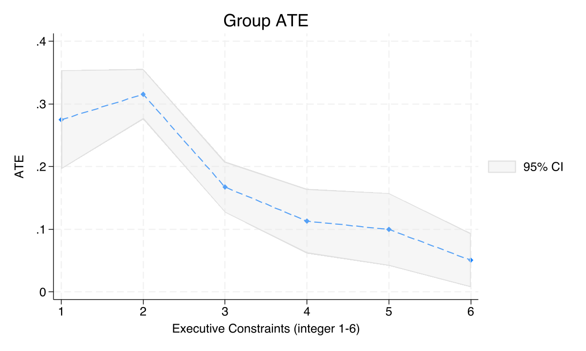
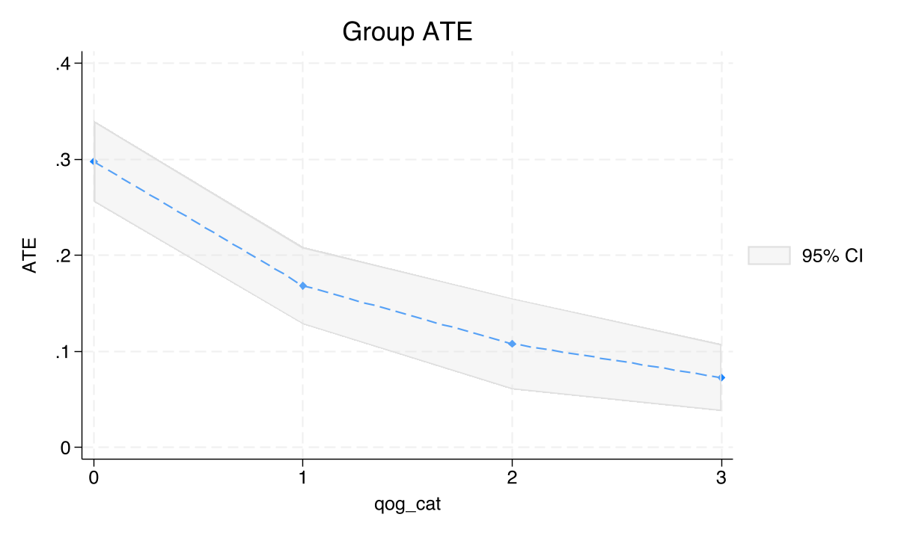
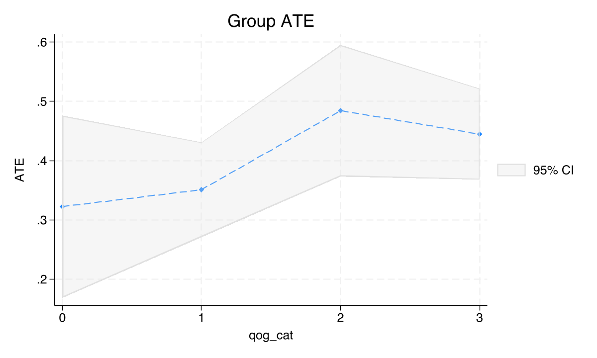
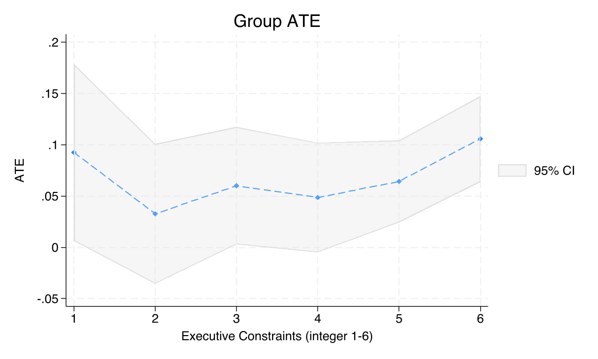
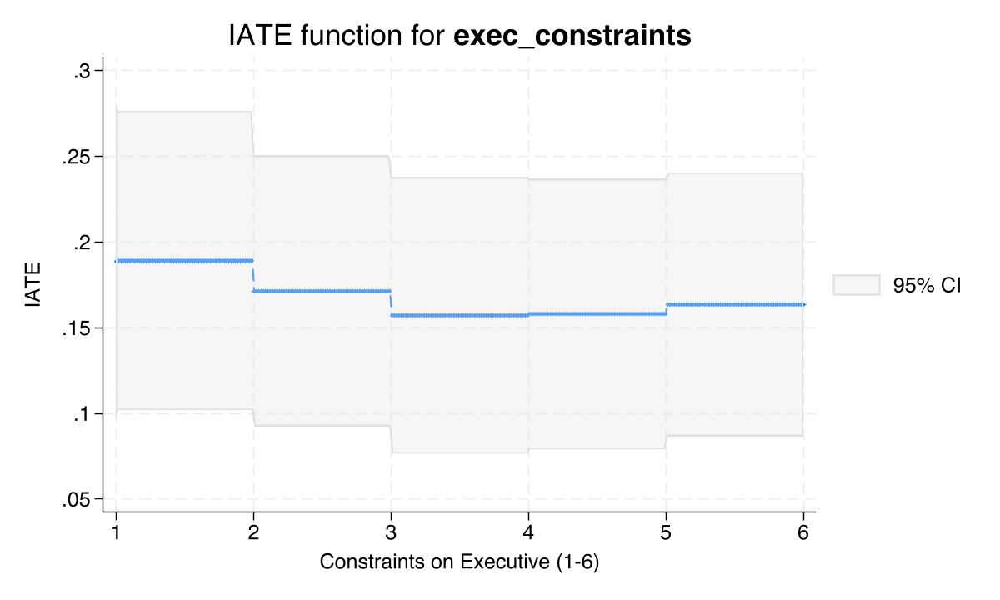

# The Tension {.divider background-color="#d97757"}

[Act I]{.act}

## One average effect hides who mining actually helps

The resource curse asks whether mineral wealth raises or wrecks development. Most studies answer with a **single average effect**.

. . .

But Hodler, Lechner & Raschky (2023) showed the answer *bends* with institutions. *For whom does mining pay off — and where does it just bring conflict?*

::: {.notes}
The central tension: a lone ATE is a press-release number. It says nothing about whether mining helps strongly-governed districts or weakly-governed ones. The resource-curse debate is really a debate about heterogeneity — institutional quality is the moderator. We need the CATE, not the ATE.
:::

## Stronger institutions, weaker mining benefit — the slope is the whole story



::: {.notes}
Spoiler figure. Don't read every bar yet — just plant that the mining effect is not one number. It marches downward as executive constraints rise: 0.275 at level 1, 0.051 at level 6. We earn this picture in Act II and return to it as the payoff in Act III.
:::

## Where we're going

::: {.incremental}
- The estimand: heterogeneous effects $\tau(\mathbf{x})$, not one ATE
- A simulated resource-curse panel with known ground truth
- Stata 19's `cate`: ATE, then GATEs, then per-district effects
- The lesson: institutions moderate *mining*, but not *prices*
:::

# The Investigation {.divider background-color="#6a9bcc"}

[Act II]{.act}

## The estimand is a function of $\mathbf{x}$, not a single number

$$\tau(\mathbf{x}) = E\{Y_i(1) - Y_i(0) \mid \mathbf{X}_i = \mathbf{x}\}$$

The **CATE** is the average effect for districts with covariate profile $\mathbf{x}$. Where $\tau(\mathbf{x})$ bends, mining helps some districts more than others.

[A single ATE is just $E\{\tau(\mathbf{X})\}$ — this function averaged over everyone, discarding exactly the heterogeneity we want.]{.comment}

::: {.notes}
This is the formal move from ATE to CATE. Y(1) and Y(0) are potential outcomes — we see only one per unit. Identification rests on conditional independence given X (unconfoundedness): once we condition on the covariates, treatment is as-good-as-random. Stata's cate estimates this whole function, then averages it to GATEs and the ATE.
:::

## A 3,000-row lab with ground-truth effects we can check against

::: {.incremental}
- **300 districts × 10 years** (2003–2012), 8 fictional countries
- **Outcomes** — log nighttime lights (development) and a conflict indicator
- **Treatment** — 4 levels: no mining (0), low / medium / high price (1/2/3)
- **Moderators** — executive constraints (1–6) and quality of government
:::

[Because the data-generating process is known, every estimate can be scored against its true value — a luxury real data never gives.]{.comment}

::: {.notes}
The treatment is highly imbalanced: 85% control, 5% in each treated price tier. This mirrors real mining data where few districts have active mines. The cate command handles it with honest random forests and sample-splitting. Ground-truth ATEs: 1-0 = 0.25, 3-1 = 0.30, 2-1 = 0.05.
:::

## A 4-level treatment becomes six binary CATE comparisons

:::: {.columns}
::: {.column width="50%"}
### Finding 1 — Mining effect
- 1 vs 0 · mining vs none
- 2 vs 0 · medium-price mining
- 3 vs 0 · high-price mining
:::
::: {.column width="50%"}
### Finding 2 — Price non-linearity
- 2 vs 1 · medium vs low (small)
- 3 vs 1 · high vs low (large)
- 3 vs 2 · high vs medium
:::
::::

[Stata's `cate` needs a *binary* treatment, so we subset to two groups at a time and run a generalized random forest on each contrast.]{.comment}

::: {.notes}
The six pairwise comparisons map directly onto the three paper findings. Mining-vs-none uses ~2,700 obs (well-identified); within-mining price contrasts use only ~300 obs (~150 per group), so expect wider CIs there.
:::

## Two estimators residualize the nuisance, then read off the signal

$$y = d\cdot\tau(\mathbf{x}) + g(\mathbf{x},\mathbf{w}) + \epsilon, \qquad d = f(\mathbf{x},\mathbf{w}) + u$$

:::: {.columns}
::: {.column width="50%"}
### PO (Partialing-Out)
- residualize $y$ and $d$ on $\mathbf{x},\mathbf{w}$
- regress residual on residual
- robust near propensity 0/1
:::
::: {.column width="50%"}
### AIPW (Augmented IPW)
- outcome model **+** propensity reweight
- *doubly robust*: one model can be wrong
- the conservative default here
:::
::::

::: {.notes}
g and f are nuisance functions — conditional means of outcome and treatment we estimate only to strip out predictable variation. Cross-fitting (xfolds 5) fits them on K-1 folds and scores the held-out fold, so no observation is scored by a model that saw it. PO and AIPW disagreeing is a diagnostic: overlap is suspect or a nuisance model is mis-specified.
:::

## Six lines estimate a heterogeneous mining effect in Stata 19

``` {.stata code-line-numbers="1-2|3|4-6|7-8"}
keep if treatment == 1 | treatment == 0
gen byte treat_1v0 = (treatment == 1)
global catevars exec_constraints quality_of_govt gdp_pc elevation /// moderators
cate aipw (ntl_log $catevars) (treat_1v0), ///
    controls(i.country_id i.year) ///
    rseed(12345) xfolds(5) omethod(rforest) tmethod(rforest)
categraph gateplot          // GATEs by subgroup
estat gatetest              // formal heterogeneity test
```

::: {.notes}
catevars (x) drive heterogeneity; controls (w) are country/year fixed effects for nuisance adjustment only. omethod/tmethod = rforest fits both nuisance models as random forests. The whole CATE suite — ATE, GATE, IATE, tests — comes from one command, no external packages. This is the load-bearing recipe the rest of the deck unpacks.
:::

## Raw means are biased: mining districts differ before any mine opens

| Contrast | Naive diff | Ground truth |
|---|---:|:--:|
| 1 vs 0 | 0.109 | 0.25 |
| 3 vs 1 | 0.414 | 0.30 |
| 2 vs 1 | 0.099 | 0.05 |

[Some confounders push the raw gap above the truth, some below — geography, institutions, and wealth all differ across mining status.]{.comment}

::: {.notes}
The naive difference-in-means mixes the causal effect with confounding. This is exactly what causal ML is for: adjust for the covariates flexibly and recover the true effect. The naive 1-vs-0 gap of 0.109 badly understates the 0.25 truth; cate will pull it back toward the right region.
:::

## With cross-fit AIPW, mining raises nighttime lights by 0.149 {background-color="#141413"}

[+0.149]{.bignum}

[AIPW ATE, mining vs none (SE 0.011, $p<0.001$); PO gives +0.194 on the same contrast]{.bignum-label}

::: {.notes}
This is Finding 1, the headline policy number. Both estimators are positive and significant. PO (0.194) sits closer to the 0.25 ground truth; AIPW (0.149) is more conservative. The 0.045 gap between them is the model-disagreement diagnostic — here it just reflects finite-sample noise with 150 treated per tier. Mining also raises conflict: AIPW = 0.066, about 6.5 points above a 10.7% baseline.
:::

## Price effects don't ramp — they jump only at the top {background-color="#141413"}

[+0.405]{.bignum}

[High-vs-low price premium (AIPW 3-1, $p<0.001$); medium-vs-low is $-0.011$, $p=0.90$]{.bignum-label}

::: {.notes}
Finding 2: non-linearity. The step from low to medium prices does essentially nothing (−0.011, p = 0.90). The step from low to high prices does a lot (+0.405, p < 0.001). This is not a smooth dose-response — the price effect is dormant until prices spike. With only 300 obs the 3-1 estimate overshoots the 0.30 ground truth, but the qualitative jump is unmistakable.
:::

## A random forest chooses controls — it cannot relax identification

[Objection.]{.objection} Machine-learning the nuisance functions can't conjure a causal effect from observational data.

. . .

[Response.]{.rebuttal} Correct. $\tau(\mathbf{x})$ is identified only under **conditional independence given $\mathbf{X}$** (unconfoundedness) and adequate **overlap**.

. . .

The forest estimates $g$ and $f$ — it cannot rule out an omitted confounder. The 3-vs-2 contrast even *failed* on overlap: a feature of honest estimation.

::: {.notes}
Steelman, don't strawman. The forest just estimates the nuisance functions flexibly; identification still rests entirely on conditional independence and overlap. cate disciplines estimation; it does not deliver identification for free. The 3-2 price comparison has propensity scores near zero on 300 obs and AIPW refuses to report — the estimator telling you the data can't answer the question. That honesty is exactly what you want.
:::

# The Resolution {.divider background-color="#00d4c8"}

[Act III]{.act}

## Institutions moderate mining: the GATE test is decisive {background-color="#141413"}

[96.90]{.bignum}

[$\chi^2(5)$ for GATE equality by executive constraints ($p<0.001$) — effects are *not* homogeneous]{.bignum-label}

::: {.notes}
This is Finding 3, the core result. estat gatetest rejects equal GATEs with chi2(5) = 96.90 across executive-constraint levels. The mining effect is systematically heterogeneous: 0.275 at the weakest constraints, 0.051 at the strongest — a 5x range. Note the sign flips relative to the paper (weaker institutions → larger effect here), but the structural finding — systematic moderation — replicates.
:::

## A second institutional measure tells the identical story



::: {.notes}
Robustness: swap executive constraints for quality of government and the downward slope survives — 0.298 in the bottom quartile, 0.073 in the top. Both institutional measures agree: weaker governance, larger mining effect. Two independent moderators pointing the same way is what makes the heterogeneity credible.
:::

## Subpopulation ATEs make the moderation concrete: 0.297 vs 0.092

| Districts | ATE | SE | $N$ |
|---|---:|---:|---:|
| Weak institutions (exec $\leq 2$) | [0.297]{.key} | 0.022 | 558 |
| Strong institutions (exec $\geq 4$) | 0.092 | 0.016 | 1,526 |

[The mining effect is **more than three times larger** in weakly-governed districts — the same slope, now as a policy-ready contrast.]{.comment}

::: {.notes}
estat ate on subsets turns the GATE curve into two numbers a policymaker can act on. Mining buys far more nighttime light in weakly-governed districts (0.297) than in strongly-governed ones (0.092). This is the targeting payoff of CATE: it tells you where the treatment works hardest.
:::

## Prices behave oppositely — institutions do not bend the price premium



::: {.notes}
The crucial asymmetry. For the price premium, the GATE test fails to reject equality (chi2(3) = 5.81, p = 0.121) — no systematic institutional moderation. Mining is local and institution-sensitive; global commodity-price shocks wash over districts regardless of governance. This is precisely the paper's structural insight: institutions moderate mining, not prices.
:::

## And mining's conflict effect is positive everywhere but flat across institutions



::: {.notes}
Conflict rises with mining everywhere (every GATE positive), but the test fails to reject homogeneity (chi2(5) = 5.00, p = 0.416). So mining raises conflict broadly, without the institutional gradient that the development benefit shows. Heterogeneity is outcome-specific — you have to test it, not assume it.
:::

## Heterogeneity isn't just group-level: every district gets its own effect


::: {.notes}
IATEs are the finest grain: one effect per district. The spread of this histogram is the heterogeneity. The formal estat heterogeneity test (Chernozhukov et al.) rejects constant effects with chi2(1) = 53.05 — statistical license to read GATEs and IATEs rather than collapsing to an ATE.
:::

## The IATE function slopes down smoothly in institutional quality



::: {.notes}
categraph iateplot holds everything fixed but one covariate and traces the IATE function. The downward slope in executive constraints is the continuous version of the GATE bar chart — same story, smoother view. quality_of_govt gives the same shape. A linear projection of the IATEs has R-squared only 0.024, because the forest captures nonlinearity a linear summary can't.
:::

## Same data, same command, opposite conclusions about moderation {background-color="#141413"}

:::: {.columns}
::: {.column width="50%"}
### Mining effect
- GATE slope: steep, monotone
- $\chi^2(5)=96.90$, $p<0.001$
- weak inst. 0.297 · strong 0.092
:::
::: {.column width="50%"}
### Price premium
- GATE slope: flat, noisy
- $\chi^2(3)=5.81$, $p=0.121$
- no institutional gradient
:::
::::

::: {.notes}
The deck's resolution in one frame. Both estimands come from the identical cate workflow on the identical panel — only the contrast and the moderator change. Mining is moderated; prices are not. The method didn't impose this; the heterogeneity tests discovered it.
:::

# Test for heterogeneity — don't average it away. {.divider background-color="#141413"}

::: {.notes}
The single takeaway. A lone ATE would have told you "mining helps, prices help" and stopped. The CATE machinery in Stata 19's cate — GATEs, subpopulation ATEs, IATEs, and formal tests — reveals that mining's benefit depends on institutions while the price premium does not. That distinction is the policy-relevant finding, and you only see it if you let the data tell you where treatment effects vary.
:::
