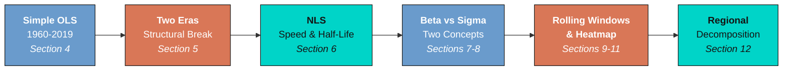
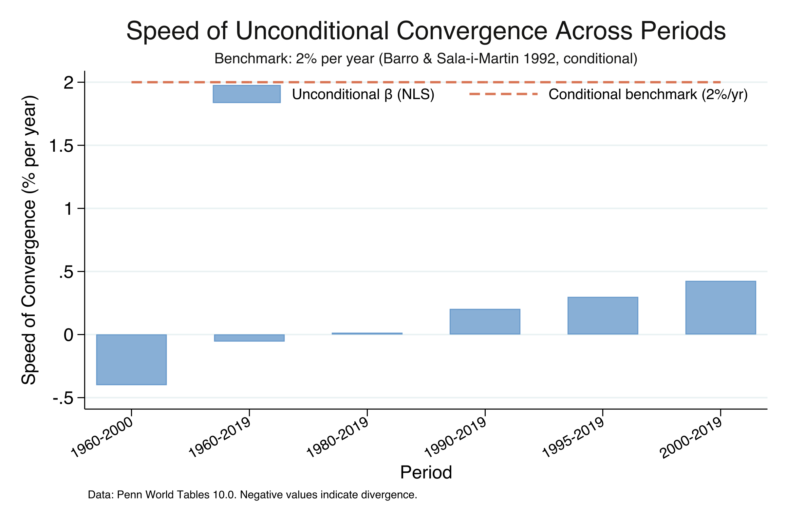
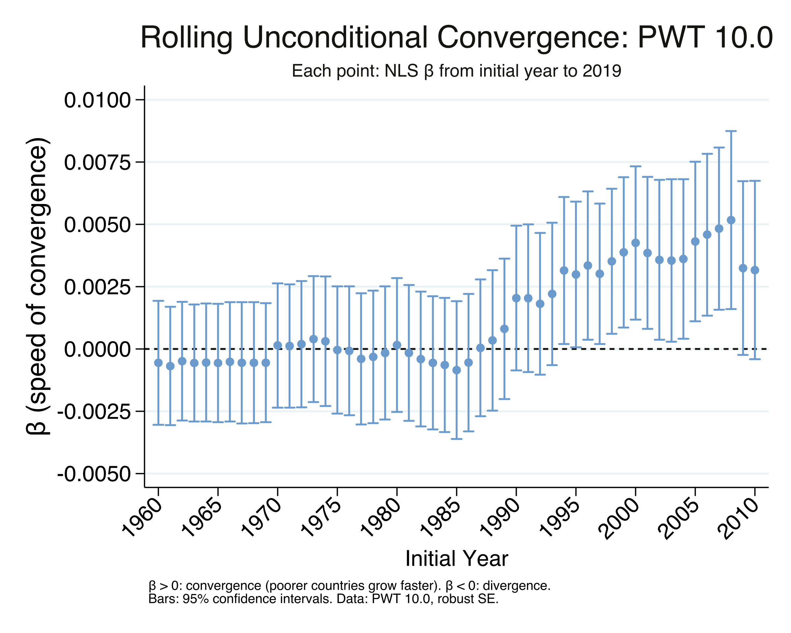
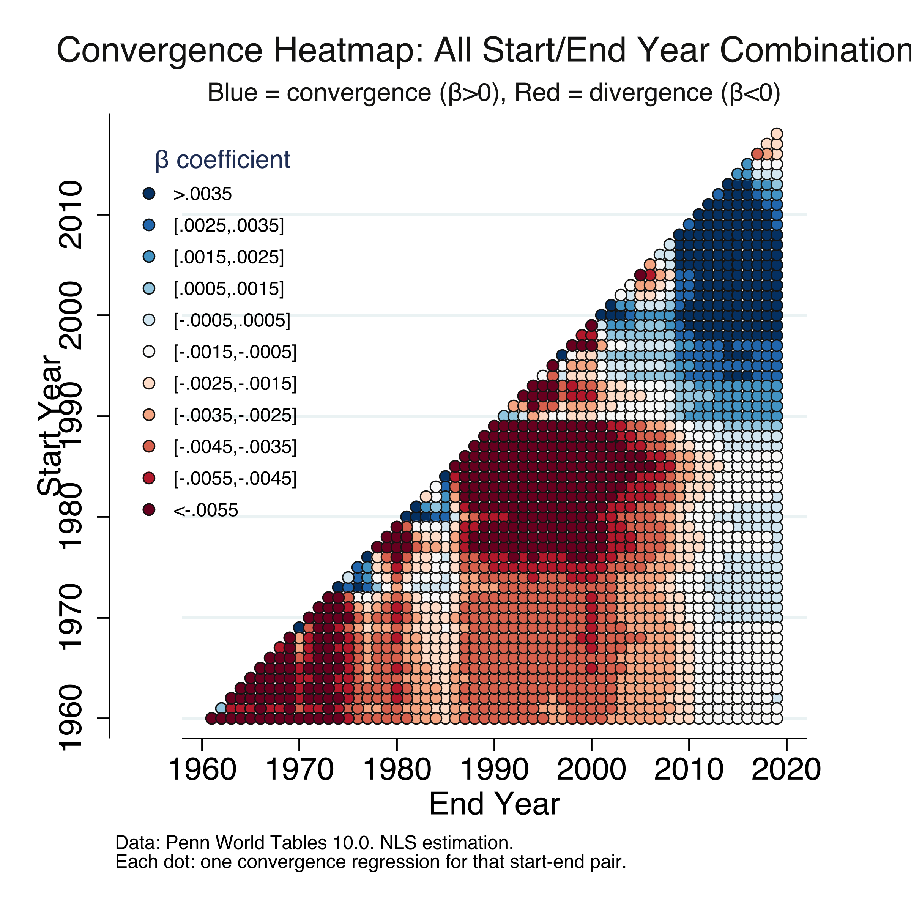
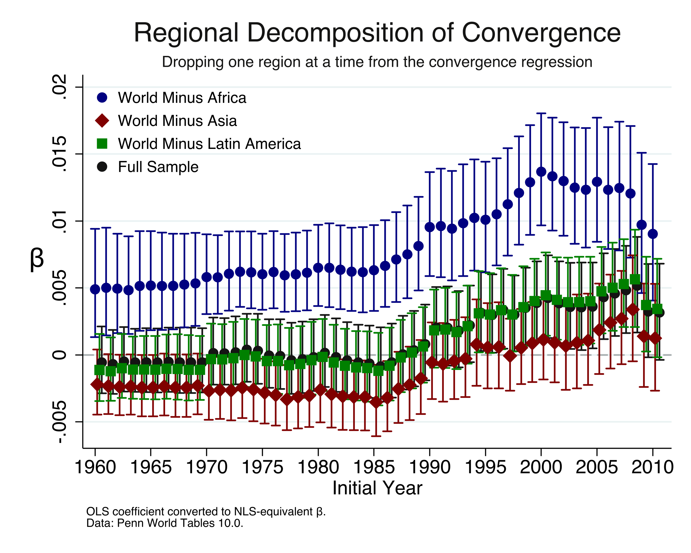

---
authors:
  - admin
categories:
  - Stata
  - Economic Growth
  - Convergence
date: "2026-04-29T00:00:00Z"
draft: false
featured: false
external_link: ""
image:
  caption: ""
  focal_point: Smart
  placement: 3
links:
  - icon: file-code
    icon_pack: fas
    name: "Stata do-file"
    url: analysis.do
  - icon: file-alt
    icon_pack: fas
    name: "Stata log"
    url: analysis.log
slides:
summary: Test whether poorer countries are catching up to richer ones using beta and sigma convergence analysis with Penn World Tables 10.0 data in Stata
tags:
  - stata
  - convergence
  - economic growth
  - world
title: "Beta and Sigma Convergence Across Countries: A Stata Tutorial"
url_code: ""
url_pdf: ""
url_slides: ""
url_video: ""
toc: true
diagram: true
---

## 1. Overview

Are poorer countries catching up to richer ones? This is one of the most fundamental questions in development economics. If convergence holds, then the vast income gaps we observe today should eventually close on their own as low-income economies grow faster than high-income ones. If it does not hold, then without deliberate policy intervention, the gap will persist --- or even widen.

For decades, the empirical evidence was discouraging. From 1960 to 2000, there was no sign that poorer countries were growing faster. If anything, richer countries pulled further ahead. But Patel, Sandefur, and Subramanian (2021) documented a striking reversal: since around the year 2000, the world has entered a **new era of unconditional convergence**, with poorer countries finally growing faster than richer ones --- no controls for institutions, human capital, or policy needed.

This tutorial walks through the complete convergence toolkit in Stata, from the simplest two-period regression to advanced heatmaps covering every possible time window. We use Penn World Tables 10.0 data for 124 countries and ask: **How fast is convergence happening, and is the global income distribution actually narrowing?** The answer involves two distinct concepts --- *beta convergence* (do poor countries grow faster?) and *sigma convergence* (is the income spread shrinking?) --- and the surprising finding that one does not guarantee the other.

### Learning objectives

- Estimate beta convergence using OLS and interpret the sign of the slope coefficient
- Identify the structural break between the era of divergence (1960--2000) and the era of convergence (2000--2019)
- Compute the speed of convergence and half-life using the Barro-Sala-i-Martin (1992) nonlinear least squares (NLS) specification
- Measure sigma convergence using the variance of log GDP per capita
- Understand why beta convergence is necessary but not sufficient for sigma convergence
- Construct rolling-window and heatmap visualizations to assess robustness
- Decompose convergence by region to identify which parts of the world drive the result

---

## 2. Analytical roadmap

The tutorial progresses from the simplest possible convergence test to the most comprehensive. Each section builds on the previous one, adding complexity and robustness.



We start with the simplest OLS test (does initial income predict growth?), then split the sample to reveal a structural break. Next, we introduce the NLS framework to measure the *speed* of convergence and the *half-life* of the income gap. We then shift from beta to sigma convergence and show why one does not imply the other. Finally, rolling windows, the convergence heatmap, and regional decomposition demonstrate the robustness and geographic drivers of the result.

---

## 3. Setup and data preparation

We use the Penn World Tables version 10.0 (Feenstra, Inklaar, and Timmer, 2015), the standard dataset for cross-country income comparisons. It provides expenditure-side real GDP in purchasing power parity (PPP) terms, which makes incomes comparable across countries with different price levels. Following Patel et al. (2021), we exclude oil-producing countries (whose income reflects resource rents rather than productive convergence) and very small countries (population under 1 million).

```stata
* Load Penn World Tables 10.0
use "https://raw.githubusercontent.com/cmg777/starter-academic-v501/master/content/post/stata_convergence/pwt100.dta", clear
rename countrycode ccode
keep country ccode year pop rgdpe

* Compute GDP per capita (PPP, 2017 US$)
gen gdppc = rgdpe / pop
drop if missing(gdppc) | missing(pop)

* Exclude oil-producing countries (IMF classification, 25 countries)
gen oil = inlist(ccode, "DZA", "AGO", "AZE", "BHR", "BRN", "TCD", "COG") | ///
          inlist(ccode, "ECU", "GNQ", "GAB", "IRN", "IRQ", "KAZ", "KWT") | ///
          inlist(ccode, "NGA", "OMN", "QAT", "RUS", "SAU", "TTO", "TKM") | ///
          inlist(ccode, "ARE", "VEN", "YEM", "LBY", "TLS", "SDN")
drop if oil == 1
drop oil

* Exclude small countries (population < 1 million)
drop if pop < 1

* Restrict to 1960 onwards
drop if year < 1960

summarize gdppc, detail
```

```text
             Real GDP per capita (PPP, 2017 US$)
-------------------------------------------------------------
      Percentiles      Smallest
 1%     640.1007       243.7604
 5%     893.0397       266.7876
10%     1148.407       286.7154       Obs               6,612
25%     2054.573       368.2704       Sum of wgt.       6,612

50%     5236.685                      Mean           11071.58
                        Largest       Std. dev.      13257.41
75%     15064.45       88681.06
90%     30859.54        89403.9       Variance       1.76e+08
95%     40187.53       90413.35       Skewness       1.924448
99%        55820       102937.7       Kurtosis       7.063426

Number of unique countries: 124
```

The cleaned dataset contains 6,612 country-year observations across 124 unique countries spanning 1960--2019. GDP per capita ranges from \\$244 (the poorest country-year) to \\$102,938 (the richest), with a median of \\$5,237 and a mean of \\$11,072. The large gap between mean and median --- reinforced by a skewness of 1.92 --- reflects the heavy right tail of the world income distribution: a small number of very rich countries pull the average far above the typical country. Countries enter the sample progressively as PWT coverage expands, growing from 84 countries with 1960 data to 124 by 2019. The next step is to ask whether poorer countries within this distribution are catching up.

---

## 4. Beta convergence: the simplest test

Beta convergence --- sometimes called *absolute* or *unconditional* convergence --- asks a simple question: do countries that start poorer grow faster? If they do, the income gap should eventually close without any need to control for differences in institutions, education, or policy. We test this using ordinary least squares (OLS) regression of the average annual growth rate on the log of initial income. Think of it like a race: if the runners at the back are faster than those at the front, the pack will eventually bunch together.

The regression equation is:

$$g\_i = \alpha + \lambda \cdot \ln(y\_{i,0}) + \varepsilon\_i$$

In words, this says that the annualized growth rate of country $i$ ($g\_i$) depends linearly on the log of its initial GDP per capita ($\ln(y\_{i,0})$). A negative $\lambda$ means convergence: countries that start with lower income grow faster. A positive or zero $\lambda$ means divergence or no convergence. In the code, $g\_i$ corresponds to the variable `growth` and $\ln(y\_{i,0})$ corresponds to `initial`.

```stata
* Reshape to wide: one row per country
reshape wide gdppc, i(ccode country) j(year)

* Annualized growth rate over 59 years
local s = 2019 - 1960
gen growth = (1/`s') * ln(gdppc2019 / gdppc1960)

* Log initial income
gen initial = ln(gdppc1960)
drop if missing(growth) | missing(initial)

* OLS regression with robust standard errors
reg growth initial, robust
```

```text
Linear regression                               Number of obs     =         84
                                                F(1, 82)          =       0.19
                                                Prob > F          =     0.6606
                                                R-squared         =     0.0013
                                                Root MSE          =     .01502

------------------------------------------------------------------------------
             |               Robust
      growth | Coefficient  std. err.      t    P>|t|     [95% conf. interval]
-------------+----------------------------------------------------------------
     initial |   .0005689   .0012908     0.44   0.661    -.0019988    .0031366
       _cons |   .0176868   .0112996     1.57   0.121    -.0047917    .0401653
------------------------------------------------------------------------------
```


Over the full 1960--2019 period, the OLS coefficient on initial income is 0.00057 --- positive, tiny, and statistically insignificant (p = 0.661, t = 0.44). The R-squared is just 0.13%, meaning initial income in 1960 has essentially zero predictive power for subsequent growth. The 84 countries with data for both endpoints grew at an average rate of about 2.2% per year, but this growth was completely unrelated to starting income levels. In the scatter plot, the fitted line is essentially flat. This "null result" seems to settle the question: no convergence over six decades. But this conclusion is misleading, because it masks a dramatic structural break that the next section reveals.

---

## 5. The structural break: divergence vs. convergence

A single regression over 60 years hides a crucial story. The world changed in the mid-1990s. By splitting the sample at the year 2000, we can see two distinct eras: one where the income gap widened (divergence) and one where it began to close (convergence).

```stata
* Era of Divergence: 1960 to 2000
gen growth_era1 = (1/40) * ln(gdppc2000 / gdppc1960)
gen initial_era1 = ln(gdppc1960)
reg growth_era1 initial_era1, robust

* Era of Convergence: 2000 to 2019
gen growth_era2 = (1/19) * ln(gdppc2019 / gdppc2000)
gen initial_era2 = ln(gdppc2000)
reg growth_era2 initial_era2, robust
```

```text
--- Era 1: 1960 to 2000 (the 'divergence era') ---

Linear regression                               Number of obs     =         84
                                                Prob > F          =     0.0072
                                                R-squared         =     0.0436

 growth_era1 | Coefficient  std. err.      t    P>|t|     [95% conf. interval]
-------------+----------------------------------------------------------------
initial_era1 |    .004366   .0015843     2.76   0.007     .0012143    .0075176

--- Era 2: 2000 to 2019 (the 'convergence era') ---

Linear regression                               Number of obs     =         84
                                                Prob > F          =     0.0187
                                                R-squared         =     0.0688

 growth_era2 | Coefficient  std. err.      t    P>|t|     [95% conf. interval]
-------------+----------------------------------------------------------------
initial_era2 |  -.0035228   .0014686    -2.40   0.019    -.0064442   -.0006013
```


The results reveal a dramatic reversal. During 1960--2000, the OLS coefficient is positive and significant (0.00437, p = 0.007): richer countries grew faster, and the income gap widened. During 2000--2019, the coefficient flips to negative and significant (-0.00352, p = 0.019): poorer countries are now growing faster. The total swing of 0.0079 represents a complete reversal from divergence to convergence. This is what Patel et al. (2021) call "the new era of unconditional convergence." The break coincides with the acceleration of growth in Asia and parts of Africa and the slowdown in mature Western economies. But how fast is this convergence happening? The next section introduces a more rigorous framework for measuring speed.

---

## 6. Speed of convergence and half-life

Knowing that convergence exists is only the first step. We also want to know: **how fast are poor countries catching up?** The OLS coefficient answers "is it happening?" but its magnitude depends on the length of the growth period, making it hard to compare across time windows. The Barro and Sala-i-Martin (1992) nonlinear least squares (NLS) specification solves this problem by estimating a structural parameter $\beta$ that is invariant to period length.

The NLS equation is:

$$\frac{1}{s} \ln\left(\frac{y\_{i,t+s}}{y\_{i,t}}\right) = \alpha - \frac{1 - e^{-\beta s}}{s} \cdot \ln(y\_{i,t}) + \varepsilon\_i$$

In words, the annualized growth rate over $s$ years is a nonlinear function of initial income. The parameter $\beta$ directly measures the **speed of convergence** --- the fraction of the income gap that closes each year. A $\beta$ of 0.02 means 2% of the gap closes annually. In the Stata code, $\beta$ corresponds to the NLS parameter `{b1}`, $s$ is the number of years between endpoints, and $\ln(y\_{i,t})$ is the variable `initial`.

The **half-life** tells us how many years it takes to close half the gap to steady-state income --- like the half-life of a radioactive substance, but for income gaps instead of atoms:

$$\tau = \frac{-\ln(2)}{\ln\left(1 - \frac{1 - e^{-\beta s}}{s}\right)}$$

The classic benchmark is $\beta \approx 0.02$ (2% per year) with a half-life of about 35 years (Barro and Sala-i-Martin, 1992; Sala-i-Martin, 1996). But that was for *conditional* convergence --- controlling for human capital, institutions, and other factors. Unconditional convergence, which requires no controls, is much slower.

```stata
* NLS estimation for 2000-2019 (Barro-Sala-i-Martin specification)
local s = 2019 - 2000
nl (outcome_temp = {b0=1} - (1 - exp(-1*{b1=0.00}*`s'))/`s' * initial_temp), ///
    vce(robust)

* Extract speed of convergence
local speed = _b[/b1] * 100

* Compute half-life
local convergence_factor = (1 - exp(-1*_b[/b1]*`s')) / `s'
local halflife = -ln(2) / ln(1 - `convergence_factor')
```

```text
Speed of Convergence and Half-Life Across Periods:

       period     beta_nls    speed_pct    halflife     beta_ols     n
    1960-2000   -.00402402   -.40240194           .    .00436597    84
    1960-2019   -.00055955   -.05595547           .    .00056889    84
    1980-2019    .00015098    .01509839   4604.0498   -.00015054   101
    1990-2019    .00203814    .20381441   349.89038   -.00197908   121
    1995-2019    .00298339    .29833945   240.40535   -.00287909   123
    2000-2019    .00425083    .42508311   169.38828    -.0040837   124

Benchmarks (Barro & Sala-i-Martin 1992, conditional convergence):
  Speed: 2.00% per year
  Half-life: 35 years
```



The table reveals a clear acceleration. For 1960--2000, the NLS beta is negative (-0.00402), confirming divergence at a rate of 0.40% per year --- incomes were spreading apart, not converging. As the start year moves forward, convergence emerges and strengthens: 0.02% per year for 1980--2019, 0.20% for 1990--2019, 0.30% for 1995--2019, and 0.43% for 2000--2019. The 2000--2019 estimate of $\beta$ = 0.00425 (N = 124, p = 0.007) matches Patel et al. (2021) exactly. The corresponding half-life of 169 years means that at the current pace, the average developing country would close only half the gap to its steady-state income in nearly two centuries. This is roughly five times slower than the 35-year benchmark for conditional convergence. Unconditional convergence is statistically real, but it is extremely slow. Note that the NLS beta has the *opposite sign* from the OLS coefficient: a positive NLS beta (convergence) corresponds to a negative OLS slope, because the NLS formula includes a minus sign in front of the convergence term. With the speed measured, we now turn to a different question: is the actual spread of income across countries narrowing?

---

## 7. Sigma convergence: is the spread narrowing?

Beta convergence asks whether poorer countries grow faster. **Sigma convergence** asks a different question: is the *dispersion* of income across countries getting smaller? We measure dispersion using the variance of log GDP per capita. If the variance decreases over time, incomes are bunching together (sigma convergence). If it increases, incomes are spreading apart (sigma divergence).

```stata
* Variance of log GDP per capita in 1960
gen logy = ln(gdppc)
ci variances logy if year == 1960

* Variance of log GDP per capita in 2019
ci variances logy if year == 2019
```

```text
--- Cross-country dispersion in 1960 ---
    Variable |        Obs      Variance       [95% conf. interval]
        logy |         84      .9244376       .6969585    1.285409
  Std. Dev. = 0.9615

--- Cross-country dispersion in 2019 ---
    Variable |        Obs      Variance       [95% conf. interval]
        logy |        124      1.483161       1.172503    1.936715
  Std. Dev. = 1.2179

Sigma Convergence Test: 1960 vs 2019:
  Change in variance: 0.5587 ( 60.4%)
  Variance INCREASED: evidence of sigma-DIVERGENCE.
```


Comparing the two endpoints, the variance of log GDP per capita *increased* by 60.4%, from 0.924 in 1960 to 1.483 in 2019. The standard deviation rose from 0.96 to 1.22. In 2019, a one-standard-deviation move along the world income distribution corresponds to a roughly 3.4-fold difference in living standards ($e^{1.22}$ = 3.39), up from a 2.6-fold difference in 1960 ($e^{0.96}$ = 2.61). This is clear evidence of sigma *divergence* over the full period: the world income distribution widened substantially, even though beta convergence exists in the recent era. How can poorer countries be growing faster *and* the income spread be widening at the same time? The next section explains this apparent paradox.

---

## 8. Why beta convergence is not enough

The seeming contradiction --- beta convergence without sigma convergence --- is not a paradox but a well-known theoretical result. Young, Higgins, and Levy (2008) proved that **beta convergence is necessary but not sufficient for sigma convergence**. Think of it like a race with wind gusts: even if the runners at the back are faster on average (beta convergence), random gusts can push some runners forward and others backward, keeping the pack spread out (no sigma convergence). The catch-up tendency must be strong enough to overcome the dispersing force of random shocks before the distribution actually narrows.

```stata
* Decade-by-decade beta (OLS) and sigma (variance)
foreach decade in 1960 1970 1980 1990 2000 2010 {
    local ey = `decade' + 10
    if `ey' > 2019 local ey = 2019
    local s = `ey' - `decade'

    * Beta: OLS slope of growth on initial income
    gen g_temp = (1/`s') * ln(gdppc`ey' / gdppc`decade')
    gen i_temp = ln(gdppc`decade')
    reg g_temp i_temp, robust
    local b = _b[i_temp]

    * Sigma: variance of log income at start of decade
    gen logy_temp = ln(gdppc`decade')
    summarize logy_temp
    local v = r(Var)
    drop g_temp i_temp logy_temp
}
```

```text
  Decade      | OLS beta  | sigma-sq  | Interpretation
  1960-1970   |  0.00594  |   0.9244  | beta>=0: divergence
  1970-1980   |  0.00527  |   1.0513  | beta>=0: divergence
  1980-1990   |  0.00549  |   1.2440  | beta>=0: divergence
  1990-2000   |  0.00210  |   1.3495  | beta>=0: divergence
  2000-2010   | -0.00422  |   1.5699  | beta<0: convergence
  2010-2019   | -0.00312  |   1.5291  | beta<0: convergence
```

The decade-by-decade view confirms the theory in action. The OLS beta turns negative (convergence) in 2000--2010, but the variance of log income does not begin declining until after 2008 --- it actually peaks at 1.604 in 2008 before falling to 1.529 by 2010 and 1.483 by 2019. This creates an approximately **13-year lag**: poorer countries started growing faster around 1995--2000, but the overall income distribution only began narrowing around 2008. For over a decade, random growth shocks --- economic crises, commodity price swings, conflict --- offset the systematic catch-up tendency before the convergence force became strong enough to dominate. Now that we have established both the existence and the timing of convergence, the next sections examine its robustness across different time windows.

---

## 9. Rolling beta convergence over time

Instead of just two snapshots, we can watch the "full movie" of convergence by estimating a separate NLS regression for every possible start year from 1960 to 2010, always ending in 2019. This rolling-window approach reveals exactly when convergence emerged and how its strength has evolved year by year. It also tests whether the result is an artifact of choosing specific endpoints.

```stata
* For each start year, estimate NLS convergence to 2019
forval startyear = 1960(1)2010 {
    local s = 2019 - `startyear'

    gen outcome = (1/`s') * ln(gdppc2019 / gdppc`startyear')
    gen initial = ln(gdppc`startyear')

    * NLS estimation
    nl (outcome = {b0=1} - (1 - exp(-1*{b1=0.00}*`s'))/`s' * initial) ///
        if !missing(outcome) & !missing(initial), vce(robust)

    * Store beta, SE, confidence interval, speed, and half-life
    * [results saved to dataset]
    drop outcome initial
}
```

```text
Rolling Beta Convergence: Key Findings

    startyear        beta   speed_pct   halflife     n
         1960   -.0005596   -.0559555          .    84
         1970    .0001352    .0135177   5144.336   100
         1980     .000151    .0150984    4604.05   101
         1990    .0020381    .2038144   349.8904   121
         1995    .0029834    .2983395   240.4053   123
         2000    .0042508    .4250831   169.3883   124
         2005    .0043072    .4307223   165.4807   124
         2010    .0031609    .3160909   222.0745   124
```



The rolling beta coefficient tells a clear story of transition. For start years in the 1960s through mid-1980s, beta is negative or near zero --- no convergence. It then climbs steadily through the 1990s and peaks at 0.00517 for start year 2008 (speed = 0.52%/yr, half-life = 138 years), the strongest unconditional convergence rate observed in any window. For the most recent start years (2009--2010), the coefficient pulls back slightly to 0.00316 (half-life = 222 years), suggesting that convergence may have moderated in the most recent decade --- possibly reflecting the 2008 financial crisis or COVID-19 effects. Crucially, the 95% confidence intervals exclude zero from approximately 1994 onward, confirming that the convergence finding is statistically robust and not an artifact of endpoint selection. The next section applies the same rolling-window logic to sigma convergence.

---

## 10. Sigma convergence over time

We now track the dispersion of income every year from 1960 to 2019. To ensure that changes in dispersion are not driven by the changing composition of the sample (more countries enter as PWT coverage expands), we compute two series: a **full sample** (all available countries each year) and a **fixed sample** (only the 101 countries with complete data from 1980 to 2019).

```stata
* Full sample: variance of log GDP per capita each year
forval yr = 1960(1)2019 {
    gen logy = ln(gdppc`yr')
    ci variances logy
    * [store variance, CI, and N]
    drop logy
}

* Fixed sample: countries with complete 1980-2019 data (N = 101)
forval yr = 1980(1)2019 {
    gen logy = ln(gdppc`yr')
    ci variances logy
    * [store variance, CI, and N]
    drop logy
}
```

```text
Full sample:
    year   variance     n
    1960   .9244376    84
    1970   1.051313   100
    1980   1.244039   101
    1990   1.349519   121
    2000   1.569856   124
    2008   1.603955   124   (peak)
    2010   1.529079   124
    2019   1.483161   124

Fixed sample (1980-2019, N = 101):
    year   variance     n
    1980   1.244039   101
    1990   1.462332   101
    2000   1.774677   101
    2006   1.788382   101   (peak)
    2008   1.777381   101
    2010   1.704768   101
    2019   1.627619   101
```


The variance series tells a two-act story. **Act one (1960--2008):** variance rose almost continuously from 0.924 to a peak of 1.604, an increase of 73% over nearly five decades. **Act two (2008--2019):** variance declined from 1.604 to 1.483, a drop of 7.5%. The fixed-sample series confirms this pattern is not an artifact of changing sample composition --- it shows the variance peaking at 1.788 in 2006 and declining to 1.628 by 2019, a 9.0% decline from peak. Both series agree: sigma convergence is a genuinely recent phenomenon, emerging only after the mid-2000s. Even so, the 2019 variance (1.483) remains 60% higher than the 1960 value (0.924). The recent narrowing is real but has barely begun to undo decades of divergence. The next section provides the most comprehensive view of convergence by examining every possible time window.

---

## 11. The convergence heatmap

The heatmap is the most comprehensive visualization of convergence dynamics. For every possible start-year and end-year combination from 1960 to 2019, we estimate a separate NLS regression --- approximately 1,770 regressions in total --- and color-code the result. Blue indicates convergence ($\beta > 0$) and red indicates divergence ($\beta < 0$), following Patel et al. (2021) Figure 2.

```stata
* Loop over ALL start/end year combinations
forval startyear = 1960(1)2018 {
    local startplus1 = `startyear' + 1
    forval outcomeyear = `startplus1'(1)2019 {
        local s = `outcomeyear' - `startyear'

        gen outcome = (1/`s') * ln(gdppc`outcomeyear' / gdppc`startyear')
        gen initial = ln(gdppc`startyear')

        * NLS estimation
        nl (outcome = {b0=1} - (1 - exp(-1*{b1=0.00}*`s'))/`s' * initial) ///
            if !missing(outcome) & !missing(initial), vce(robust)

        * [store beta, SE, N for each start-end pair]
        drop outcome initial
    }
}
```



The pattern is strikingly clear. The upper-right triangle (periods ending in 2010--2019) is dominated by blue, while the central and lower-left regions (periods ending before 2000) are dominated by red. The deepest red ($\beta < -0.0055$) is concentrated in short windows during the 1970s--1980s, when divergence was strongest. The deepest blue ($\beta > 0.0035$) appears for windows ending in 2015--2019 and starting after 1990. The transition from red to blue occurs gradually along diagonals, with the crossover point moving from the upper right toward the center. This confirms that the convergence finding is not an artifact of choosing 2019 as the end year --- it appears robustly across many end-year choices in the 2010s. Along the diagonal (short intervals), estimates are noisier due to smaller samples and shorter periods. The heatmap faithfully reproduces the pattern from Patel et al. (2021) Figure 2. But which regions of the world are driving this global pattern? The final analytical section answers this question.

---

## 12. Regional decomposition: who drives convergence?

Global convergence could be driven by rapid catch-up in one region or broadly shared across the developing world. To find out, we drop one region at a time and re-estimate the convergence coefficient. If removing a region weakens convergence, that region was boosting the global result. If removing it strengthens convergence, that region was dragging it down.

```stata
* Assign regions using kountry
kountry ccode, from(iso3c) geo(undet)
gen clusters = "West" if regexm(GEO, "Europe") | regexm(GEO, "Australia") | ///
    inlist(country, "Canada", "United States")
replace clusters = "Africa" if regexm(GEO, "Africa")
replace clusters = "Latin America" if inlist(GEO, "South America", ///
    "Caribbean", "Central America")
replace clusters = "Asia" if regexm(GEO, "Asia") | ///
    inlist(GEO, "Melanesia", "Micronesia", "Polynesia")

* For each start year, estimate OLS dropping each region
forval startyear = 1960(1)2010 {
    reg outcome initial, robust                                    // Full sample
    reg outcome initial if clusters != "Africa", robust            // Minus Africa
    reg outcome initial if clusters != "Asia", robust              // Minus Asia
    reg outcome initial if clusters != "Latin America", robust     // Minus LatAm
}
```

```text
Regional distribution of countries:
     clusters |      Freq.     Percent
       Africa |         37       29.84
         Asia |         31       25.00
Latin America |         18       14.52
         West |         38       30.65
        Total |        124      100.00
```



The regional decomposition reveals the geographic engine of convergence. Dropping Asia eliminates convergence entirely for most start years --- the "World Minus Asia" line stays near zero or below throughout the 1960--2010 range. Asia's rapid catch-up growth, driven by China, India, and the East Asian economies, is the primary force behind the global convergence result. Conversely, dropping Africa *strengthens* convergence substantially, because Africa's heterogeneous growth performance --- strong growth in some countries, stagnation or decline in others --- weakens the global catch-up signal. Dropping Latin America has only a modest effect, with the coefficient remaining close to the full-sample estimate. Of the 124 countries in the 2019 sample, 37 are African, 31 Asian, 18 Latin American, and 38 Western.

---

## 13. Discussion

We set out to ask whether the world has entered a new era of unconditional convergence and how fast it is happening. The evidence is clear: **yes, unconditional convergence is real since approximately 2000, but it is very slow.**

The NLS speed of convergence for 2000--2019 is 0.43% per year ($\beta$ = 0.00425), with a half-life of 169 years. To put this in perspective, at this pace, a country currently at one-tenth of US income per capita would need nearly two centuries to close just half the gap --- not to catch up entirely, but merely to halve the distance. This is five times slower than the classic 2%/year benchmark for conditional convergence (Barro and Sala-i-Martin, 1992), which controls for human capital, institutions, and savings rates. The fact that unconditional convergence exists *at all* is remarkable, but its pace should temper optimism about automatic catch-up.

The sigma convergence results add an important nuance. Even though poorer countries have been growing faster since around 2000, the actual spread of world incomes only began narrowing after 2008 --- a 13-year lag. And even with this recent narrowing, the 2019 income distribution is still 60% wider than in 1960. A policymaker looking at these results would conclude that convergence forces alone are far too slow to eliminate global poverty or close income gaps within any reasonable planning horizon. Active investment in education, infrastructure, institutions, and technology transfer remains essential.

The regional decomposition underscores that global convergence is not broadly shared: it is driven overwhelmingly by Asia. Without Asia's rapid growth, there would be no unconditional convergence at all. Africa, despite recent growth acceleration in several countries, remains heterogeneous enough to weaken the global signal. This suggests that the "new era of convergence" is still fragile and geographically concentrated.

---

## 14. Summary and next steps

### Key takeaways

1. **No convergence over 1960--2019 as a whole** (OLS $\lambda$ = 0.00057, p = 0.661), but this null result conceals a dramatic structural break around the year 2000.
2. **Unconditional convergence since 2000** at a speed of 0.43% per year ($\beta$ = 0.00425, half-life = 169 years, N = 124). This is statistically significant but five times slower than conditional convergence.
3. **Sigma convergence lags beta convergence by ~13 years.** The income variance peaked at 1.604 in 2008 and declined 7.5% by 2019. Random growth shocks delayed the narrowing of the distribution even as poorer countries grew faster on average.
4. **Asia drives convergence; Africa attenuates it.** Dropping Asia eliminates the convergence result entirely. Dropping Africa strengthens it. The "new era" is geographically concentrated.
5. **The income distribution remains 60% wider than in 1960.** Despite post-2008 sigma convergence, the 2019 variance of log GDP per capita (1.483) far exceeds the 1960 value (0.924). A one-standard-deviation move in the 2019 distribution corresponds to a 3.4-fold difference in living standards.

### Limitations

- The sample grows from 84 to 124 countries over time as PWT coverage expands, which introduces composition effects in the sigma convergence comparisons.
- The convergence regressions explain very little of the cross-country growth variation (R-squared from 0.001 to 0.069). The research question is about the sign and significance of the relationship, not prediction.
- The most recent rolling-window estimates (start years 2009--2010) show some moderation in convergence speed, but shorter growth windows also mean more noise.
- Results depend on the choice of income measure (expenditure-side real GDP at chained PPPs) and sample restrictions (excluding oil producers and small countries).

### Next steps

- **Conditional convergence:** Add controls for human capital, institutional quality, and savings rates to see whether the speed approaches the 2% benchmark.
- **Club convergence:** Test whether countries converge to different steady states rather than a single global equilibrium (Phillips and Sul, 2007).
- **Within-country convergence:** Apply the same framework to regions within a country to study subnational income dynamics.
- **Post-COVID update:** Extend the analysis past 2019 to assess whether the pandemic disrupted or accelerated convergence.

---

## 15. Exercises

1. **Change the breakpoint.** Instead of splitting at the year 2000, try splitting at 1990 or 1995. Does the convergence coefficient in the recent era change? At what breakpoint does the coefficient first become significantly negative?

2. **Conditional convergence.** Add log population and a measure of education (years of schooling, available in PWT 10.0 as `hc`) as controls to the NLS specification. How much does the speed of convergence increase? Does the half-life approach the 35-year conditional benchmark?

3. **Alternative samples.** Re-run the 2000--2019 NLS regression including oil producers. Then try including small countries. How sensitive is the convergence result to these sample restrictions?

---

## 16. References

1. [Patel, D., Sandefur, J., and Subramanian, A. (2021). The New Era of Unconditional Convergence. *Journal of Development Economics*, 152, 102687.](https://doi.org/10.1016/j.jdeveco.2021.102687)
2. [Barro, R. J. and Sala-i-Martin, X. (1992). Convergence. *Journal of Political Economy*, 100(2), 223--251.](https://doi.org/10.1086/261816)
3. [Feenstra, R. C., Inklaar, R., and Timmer, M. P. (2015). The Next Generation of the Penn World Table. *American Economic Review*, 105(10), 3150--3182.](https://doi.org/10.1257/aer.20130954)
4. [Sala-i-Martin, X. (1996). The Classical Approach to Convergence Analysis. *The Economic Journal*, 106(437), 1019--1036.](https://doi.org/10.2307/2235375)
5. [Young, A. T., Higgins, M. J., and Levy, D. (2008). Sigma Convergence versus Beta Convergence: Evidence from U.S. County-Level Data. *Journal of Money, Credit and Banking*, 40(5), 1083--1093.](https://doi.org/10.1111/j.1538-4616.2008.00148.x)
6. [Penn World Tables 10.0 -- University of Groningen](https://www.rug.nl/ggdc/productivity/pwt/)
