---
authors:
  - admin
categories:
  - Stata
  - Economic Growth
  - Convergence
date: "2026-04-29T00:00:00Z"
draft: false
featured: false
external_link: ""
image:
  caption: ""
  focal_point: Smart
  placement: 3
links:
  - icon: file-code
    icon_pack: fas
    name: "Stata do-file"
    url: analysis.do
  - icon: file-alt
    icon_pack: fas
    name: "Stata log"
    url: analysis.log
- icon: markdown
  icon_pack: fab
  name: "MD version"
  url: https://raw.githubusercontent.com/cmg777/starter-academic-v501/master/content/post/stata_convergence/index.md
slides:
summary: Test whether poorer countries are catching up to richer ones using beta and sigma convergence analysis with Penn World Tables 10.0 data in Stata
tags:
  - stata
  - convergence
  - economic growth
  - world
title: "Beta and Sigma Convergence Across Countries: A Stata Tutorial"
url_code: ""
url_pdf: ""
url_slides: ""
url_video: ""
toc: true
diagram: true
---

## 1. Overview

Are poorer countries catching up to richer ones? This is one of the most fundamental questions in development economics. If convergence holds, then the vast income gaps we observe today should eventually close on their own as low-income economies grow faster than high-income ones. If it does not hold, then without deliberate policy intervention, the gap will persist --- or even widen.

For decades, the empirical evidence was discouraging. From 1960 to 2000, there was no sign that poorer countries were growing faster. If anything, richer countries pulled further ahead. But Patel, Sandefur, and Subramanian (2021) documented a striking reversal: since around the year 2000, the world has entered a **new era of unconditional convergence**, with poorer countries finally growing faster than richer ones --- no controls for institutions, human capital, or policy needed.

This tutorial walks through the complete convergence toolkit in Stata, from the simplest two-period regression to advanced heatmaps covering every possible time window. We use Penn World Tables 10.0 data for a **balanced panel of 84 countries** with data available since 1960 and ask: **How fast is convergence happening, and is the global income distribution actually narrowing?** The answer involves two distinct concepts --- *beta convergence* (do poor countries grow faster?) and *sigma convergence* (is the income spread shrinking?) --- and the surprising finding that one does not guarantee the other.

A distinctive feature of this tutorial is its comparative approach to measuring convergence speed. We first show how to extract the speed of convergence from standard OLS output using a simple algebraic conversion, then introduce Nonlinear Least Squares (NLS) as a direct estimation method. Students learn that both approaches yield the same structural parameter --- building intuition before complexity.

### Learning objectives

- Estimate beta convergence using OLS and interpret the sign of the slope coefficient
- Identify the structural break between the era of divergence (1960--2000) and the era of convergence (2000--2019)
- Compute the speed of convergence and half-life from OLS output using an algebraic conversion
- Understand what Nonlinear Least Squares (NLS) is, why it is needed, and how to estimate it in Stata
- Compare OLS-derived and NLS-derived convergence estimates
- Construct rolling-window visualizations for both OLS and NLS to assess robustness
- Measure sigma convergence using the variance of log GDP per capita
- Understand why beta convergence is necessary but not sufficient for sigma convergence
- Build convergence heatmaps to visualize every possible time window

### Key concepts at a glance

The post leans on a small vocabulary repeatedly. The rest of the tutorial assumes you can move between these terms quickly. Each concept below has three parts. The **definition** is always visible. The **example** and **analogy** sit behind clickable cards: open them when you need them, leave them collapsed for a quick scan. If a later section mentions "structural break" or "half-life" and the term feels slippery, this is the section to re-read.

**1. Beta convergence** $\lambda$.
The OLS slope coefficient when annualized growth is regressed on log initial income. A *negative* $\lambda$ means poorer countries grew faster than richer ones — they "caught up". A *positive* $\lambda$ means the opposite: divergence.

<div class="concept-pair">
<details class="concept-card concept-example">
<summary>Example</summary>

Over 2000–2019, $\lambda = -0.00352$ (p = 0.019). Convergence has emerged. Over 1960–2000, $\lambda = +0.00437$ (p = 0.007) — divergence. The full-period (1960–2019) coefficient is essentially zero (0.00057, p = 0.661). The two regimes cancel.

</details>

<details class="concept-card concept-analogy">
<summary>Analogy</summary>

A catching-up race. If the runner who started at the back is moving faster, the gap to the leader is closing. Beta convergence asks whether poor countries are running faster than rich ones — does the rear runner have more horsepower?

</details>
</div>

**2. Sigma convergence** $\sigma\_t^2$.
The variance (or standard deviation) of log GDP per capita across countries at time $t$. Convergence in the sigma sense means $\sigma\_t$ is *falling* over time — the cross-country distribution of incomes is narrowing.

<div class="concept-pair">
<details class="concept-card concept-example">
<summary>Example</summary>

In our 84-country sample, the variance of log `gdppc` rose from 0.924 in 1960 to 1.918 in 2008 (peak), then eased to 1.764 by 2019. The world *did not* sigma-converge over 1960–2019. Beta convergence after 2000 is a necessary precondition for future sigma convergence, not a guarantee.

</details>

<details class="concept-card concept-analogy">
<summary>Analogy</summary>

A flock of birds. Sigma convergence asks whether the flock is tightening — are the laggards catching the leaders? The flock can briefly tighten even when individual birds are accelerating away from each other.

</details>
</div>

**3. Speed of convergence** $\beta$.
The structural parameter from the Barro–Sala-i-Martin model. Different from the OLS $\lambda$. Computed via $\beta = -\ln(1 + \lambda T)/T$, where $T$ is the period length. Bigger $\beta$ means a faster catch-up engine.

<div class="concept-pair">
<details class="concept-card concept-example">
<summary>Example</summary>

Plugging $\lambda = -0.00352$ and $T = 19$ years into the conversion gives $\beta = 0.00365$. Less than half a percent per year. The catching-up engine, once it turned on after 2000, runs at idle.

</details>

<details class="concept-card concept-analogy">
<summary>Analogy</summary>

Horsepower of the catch-up engine. The OLS slope $\lambda$ is the speedometer reading. The structural $\beta$ is what the engine can actually deliver — the underlying capacity to close gaps.

</details>
</div>

**4. Half-life** $\tau = \ln(2)/\beta$.
The number of years required to close half of the existing income gap at the current convergence speed. A natural reading of $\beta$ on a human time scale.

<div class="concept-pair">
<details class="concept-card concept-example">
<summary>Example</summary>

With $\beta = 0.00365$, the half-life is **190 years**. Half of the world's current income gap will close in 190 years if convergence continues at this pace. Compare to the canonical 70-year half-life from cross-country growth regressions of the 1990s; the modern world converges much more slowly.

</details>

<details class="concept-card concept-analogy">
<summary>Analogy</summary>

Radioactive decay's half-life. After one half-life, half the atoms are gone; after two, three-quarters; and so on. Income-gap half-life works the same way — but at 190 years, even a generation makes only a small dent.

</details>
</div>

**5. Structural break.**
A point in time where the convergence coefficient changes its sign or magnitude. Identified by Chow tests, by visual inspection of rolling estimates, or by direct interaction with a year dummy.

<div class="concept-pair">
<details class="concept-card concept-example">
<summary>Example</summary>

This dataset shows a clear break around 2000. Before: $\lambda = +0.00437$ (divergence). After: $\lambda = -0.00352$ (convergence). The full-period $\lambda$ averages the two regimes and looks like nothing happened — a textbook example of why pooled estimates can mislead.

</details>

<details class="concept-card concept-analogy">
<summary>Analogy</summary>

A thermostat flipping. Before the flip, the heater is on and the room is warming. After, the cooler is on and the room is cooling. Averaging the two periods reads as "no temperature change" — the flip is the story.

</details>
</div>

**6. Nonlinear Least Squares (NLS).**
A direct estimator of the structural $\beta$ when it appears inside an exponential. Avoids the OLS-to-$\beta$ algebraic conversion. Stata's `nl` command fits the nonlinear regression $g\_i = (1 - e^{-\beta T})/T \cdot \ln(y\_{i,0}) + \varepsilon\_i$ in one shot.

<div class="concept-pair">
<details class="concept-card concept-example">
<summary>Example</summary>

NLS on the 2000–2019 sample returns $\beta = 0.00365$ — the same as the OLS conversion. When the relationship is well-behaved, both routes coincide; the gap is a useful sanity check.

</details>

<details class="concept-card concept-analogy">
<summary>Analogy</summary>

Direct measurement vs proxy measurement. OLS-then-convert is the proxy: measure something simple ($\lambda$), then compute the structural quantity. NLS is the direct route: measure $\beta$ in one step.

</details>
</div>

**7. Rolling window.**
Re-estimate the regression over every possible start year, holding the end year fixed. Each window produces one estimate. The sequence of estimates traces out how convergence has evolved.

<div class="concept-pair">
<details class="concept-card concept-example">
<summary>Example</summary>

This post's rolling window for $\lambda$ slides the start year from 1960 to 2000 with end year fixed at 2019. The line crosses zero around 1995, becomes solidly negative after 2000, and stabilizes near $-0.0035$ for the most recent windows.

</details>

<details class="concept-card concept-analogy">
<summary>Analogy</summary>

A sliding microscope across a slide. At each position you take a snapshot. The full sequence of snapshots is the rolling estimate — it shows how the local picture changes as you move along.

</details>
</div>

**8. Cross-country dispersion** $\sigma\_t$.
The standard deviation of log GDP per capita across countries at time $t$. The "$\sigma$" in $\sigma$-convergence. Tracks the *width* of the world income distribution year by year.

<div class="concept-pair">
<details class="concept-card concept-example">
<summary>Example</summary>

The variance of log `gdppc` rose 90.8% from 0.924 in 1960 to 1.764 in 2019, with a peak of 1.918 in 2008. The dispersion narrative is the opposite of the post-2000 beta-convergence narrative: the rear runner is now faster, but the flock has not yet tightened.

</details>

<details class="concept-card concept-analogy">
<summary>Analogy</summary>

Standard deviation of incomes in a class. If everyone earns roughly the same, $\sigma$ is small. If a few earn very much and many earn very little, $\sigma$ is large. Sigma convergence asks whether $\sigma$ is shrinking over time.

</details>
</div>

---

## 2. Analytical roadmap

The tutorial progresses from the simplest possible convergence test to the most comprehensive. Each section builds on the previous one, adding complexity and robustness.

```mermaid
graph LR
    A["<b>Simple OLS</b><br/>1960-2019<br/><i>Section 4</i>"]
    B["<b>Two Eras</b><br/>Structural Break<br/><i>Section 5</i>"]
    C["<b>Speed from OLS</b><br/>λ → β conversion<br/><i>Section 6</i>"]
    D["<b>NLS Framework</b><br/>Direct estimation<br/><i>Sections 7-9</i>"]
    E["<b>Rolling Windows</b><br/>λ, then β<br/><i>Sections 10-11</i>"]
    F["<b>Sigma</b><br/>Convergence<br/><i>Sections 12-14</i>"]
    G["<b>Heatmaps</b><br/>OLS & NLS<br/><i>Section 15</i>"]

    A --> B --> C --> D --> E --> F --> G

    style A fill:#6a9bcc,stroke:#141413,color:#fff
    style B fill:#d97757,stroke:#141413,color:#fff
    style C fill:#00d4c8,stroke:#141413,color:#141413
    style D fill:#6a9bcc,stroke:#141413,color:#fff
    style E fill:#d97757,stroke:#141413,color:#fff
    style F fill:#00d4c8,stroke:#141413,color:#141413
    style G fill:#6a9bcc,stroke:#141413,color:#fff
```

We start with the simplest OLS test (does initial income predict growth?), then split the sample to reveal a structural break. Next, we show how to extract the speed of convergence from OLS output using a straightforward algebraic conversion. We then introduce Nonlinear Least Squares (NLS) as a direct estimation method and compare the two approaches. A pedagogical introduction to rolling windows starts with the raw OLS coefficient $\lambda$ before progressing to the structural $\beta$, including a full walkthrough of how confidence intervals are constructed and transformed. We then shift from beta to sigma convergence, show why one does not imply the other, and track the income distribution over time. Finally, convergence heatmaps covering every possible time window provide the most comprehensive robustness check.

---

## 3. Setup and data preparation

We use the Penn World Tables version 10.0 (Feenstra, Inklaar, and Timmer, 2015), the standard dataset for cross-country income comparisons. It provides expenditure-side real GDP in purchasing power parity (PPP) terms, which makes incomes comparable across countries with different price levels. Following Patel et al. (2021), we exclude oil-producing countries (whose income reflects resource rents rather than productive convergence) and very small countries (population under 1 million). We further restrict the sample to a **balanced panel of 84 countries** with GDP per capita data available since 1960, ensuring that the same set of countries is used consistently across all sections of the tutorial.

```stata
* Load Penn World Tables 10.0
use "https://raw.githubusercontent.com/cmg777/starter-academic-v501/master/content/post/stata_convergence/pwt100.dta", clear
rename countrycode ccode
keep country ccode year pop rgdpe

* Compute GDP per capita (PPP, 2017 US$)
gen gdppc = rgdpe / pop
drop if missing(gdppc) | missing(pop)

* Exclude oil-producing countries (IMF classification, 25 countries)
gen oil = inlist(ccode, "DZA", "AGO", "AZE", "BHR", "BRN", "TCD", "COG") | ///
          inlist(ccode, "ECU", "GNQ", "GAB", "IRN", "IRQ", "KAZ", "KWT") | ///
          inlist(ccode, "NGA", "OMN", "QAT", "RUS", "SAU", "TTO", "TKM") | ///
          inlist(ccode, "ARE", "VEN", "YEM", "LBY", "TLS", "SDN")
drop if oil == 1
drop oil

* Exclude small countries (population < 1 million)
drop if pop < 1

* Restrict to 1960 onwards
drop if year < 1960

* Restrict to balanced panel: countries with data in 1960
bys ccode: egen has1960 = max(year == 1960 & !missing(gdppc))
keep if has1960 == 1
drop has1960

summarize gdppc, detail
```

```text
             Real GDP per capita (PPP, 2017 US$)
-------------------------------------------------------------
      Percentiles      Smallest
 1%     498.6677       368.2704
 5%     805.8461       425.7048
10%     1048.736       498.6677       Obs               5,040
25%     1927.449       523.0073       Sum of wgt.       5,040

50%     4873.137                      Mean           10811.48
                        Largest       Std. dev.       14375.5
75%     14282.34       88681.06
90%     30734.83        89403.9       Variance       2.07e+08
95%       35014        90413.35       Skewness       2.158023
99%     55579.96       102937.7       Kurtosis       8.099127

Number of unique countries: 84
```

The cleaned dataset contains 5,040 country-year observations across 84 unique countries spanning 1960--2019. GDP per capita ranges from \\$368 (the poorest country-year) to \\$102,938 (the richest), with a median of \\$4,873 and a mean of \\$10,811. The large gap between mean and median --- reinforced by a skewness of 2.16 --- reflects the heavy right tail of the world income distribution: a small number of very rich countries pull the average far above the typical country. Because we restrict to countries with data available since 1960, this is a balanced panel: the same 84 countries appear in every year, eliminating composition effects that would arise if the sample grew over time.

---

## 4. Beta convergence: the simplest test

Beta convergence --- sometimes called *absolute* or *unconditional* convergence --- asks a simple question: do countries that start poorer grow faster? If they do, the income gap should eventually close without any need to control for differences in institutions, education, or policy. We test this using ordinary least squares (OLS) regression of the average annual growth rate on the log of initial income. Think of it like a race: if the runners at the back are faster than those at the front, the pack will eventually bunch together.

The regression equation is:

$$g\_i = \alpha + \lambda \cdot \ln(y\_{i,0}) + \varepsilon\_i$$

In words, this says that the annualized growth rate of country $i$ ($g\_i$) depends linearly on the log of its initial GDP per capita ($\ln(y\_{i,0})$). A negative $\lambda$ means convergence: countries that start with lower income grow faster. A positive or zero $\lambda$ means divergence or no convergence. In the code, $g\_i$ corresponds to the variable `growth` and $\ln(y\_{i,0})$ corresponds to `initial`.

```stata
* Reshape to wide: one row per country
reshape wide gdppc, i(ccode country) j(year)

* Annualized growth rate over 59 years
local s = 2019 - 1960
gen growth = (1/`s') * ln(gdppc2019 / gdppc1960)

* Log initial income
gen initial = ln(gdppc1960)
drop if missing(growth) | missing(initial)

* OLS regression with robust standard errors
reg growth initial, robust
```

```text
Linear regression                               Number of obs     =         84
                                                F(1, 82)          =       0.19
                                                Prob > F          =     0.6606
                                                R-squared         =     0.0013
                                                Root MSE          =     .01502

------------------------------------------------------------------------------
             |               Robust
      growth | Coefficient  std. err.      t    P>|t|     [95% conf. interval]
-------------+----------------------------------------------------------------
     initial |   .0005689   .0012908     0.44   0.661    -.0019988    .0031366
       _cons |   .0176868   .0112996     1.57   0.121    -.0047917    .0401653
------------------------------------------------------------------------------
```

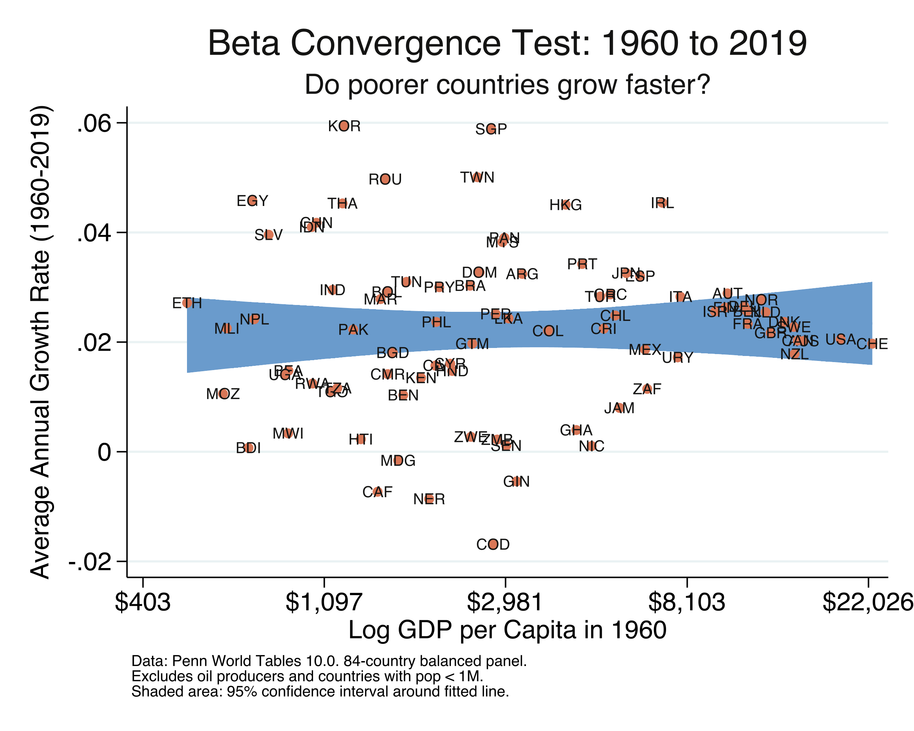

Over the full 1960--2019 period, the OLS coefficient on initial income is 0.00057 --- positive, tiny, and statistically insignificant (p = 0.661, t = 0.44). The R-squared is just 0.13%, meaning initial income in 1960 has essentially zero predictive power for subsequent growth. The 84 countries grew at an average rate of about 2.2% per year, but this growth was completely unrelated to starting income levels. In the scatter plot, the fitted line is essentially flat. This "null result" seems to settle the question: no convergence over six decades. But this conclusion is misleading, because it masks a dramatic structural break that the next section reveals.

---

## 5. The structural break: divergence vs. convergence

A single regression over 60 years hides a crucial story. The world changed in the mid-1990s. By splitting the sample at the year 2000, we can see two distinct eras: one where the income gap widened (divergence) and one where it began to close (convergence).

```stata
* Era of Divergence: 1960 to 2000
gen growth_era1 = (1/40) * ln(gdppc2000 / gdppc1960)
gen initial_era1 = ln(gdppc1960)
reg growth_era1 initial_era1, robust

* Era of Convergence: 2000 to 2019
gen growth_era2 = (1/19) * ln(gdppc2019 / gdppc2000)
gen initial_era2 = ln(gdppc2000)
reg growth_era2 initial_era2, robust
```

```text
--- Era 1: 1960 to 2000 (the 'divergence era') ---

Linear regression                               Number of obs     =         84
                                                Prob > F          =     0.0072
                                                R-squared         =     0.0436

 growth_era1 | Coefficient  std. err.      t    P>|t|     [95% conf. interval]
-------------+----------------------------------------------------------------
initial_era1 |    .004366   .0015843     2.76   0.007     .0012143    .0075176

--- Era 2: 2000 to 2019 (the 'convergence era') ---

Linear regression                               Number of obs     =         84
                                                Prob > F          =     0.0187
                                                R-squared         =     0.0688

 growth_era2 | Coefficient  std. err.      t    P>|t|     [95% conf. interval]
-------------+----------------------------------------------------------------
initial_era2 |  -.0035228   .0014686    -2.40   0.019    -.0064442   -.0006013
```

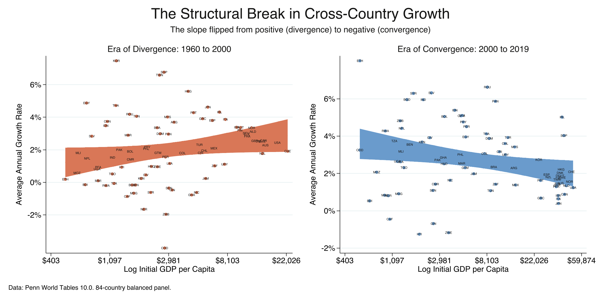

The results reveal a dramatic reversal. During 1960--2000, the OLS coefficient is positive and significant ($\lambda$ = 0.00437, p = 0.007): richer countries grew faster, and the income gap widened. During 2000--2019, the coefficient flips to negative and significant ($\lambda$ = -0.00352, p = 0.019): poorer countries are now growing faster. The total swing of 0.0079 represents a complete reversal from divergence to convergence. This is what Patel et al. (2021) call "the new era of unconditional convergence." But how fast is this convergence happening? The next section shows how to measure speed and half-life using nothing more than the OLS coefficient we already have.

---

## 6. Speed of convergence and half-life from OLS

Knowing that convergence exists is only the first step. We also want to know: **how fast are poor countries catching up?** The OLS coefficient $\lambda$ tells us the direction, but its magnitude depends on the length of the growth period ($s$), making it hard to compare across time windows. We need a **structural parameter** $\beta$ --- the speed of convergence --- that is invariant to period length.

The good news: we can extract $\beta$ directly from the OLS coefficient using a simple algebraic conversion. The relationship comes from the Barro and Sala-i-Martin (1992) convergence model, which implies that the OLS coefficient $\lambda$ and the structural speed $\beta$ are related by:

$$\lambda = -\frac{1 - e^{-\beta s}}{s}$$

In words, the OLS slope is a nonlinear function of the speed of convergence $\beta$ and the time span $s$. We can solve this equation for $\beta$ in four steps:

**Step 1.** Multiply both sides by $s$:

$$\lambda s = -(1 - e^{-\beta s})$$

**Step 2.** Rearrange:

$$e^{-\beta s} = 1 + \lambda s$$

**Step 3.** Take the natural log and solve for $\beta$:

$$\beta = \frac{-\ln(1 + \lambda s)}{s}$$

**Step 4.** Compute the half-life --- how many years to close half the income gap:

$$\tau = \frac{\ln(2)}{\beta}$$

The classic benchmark from the convergence literature is $\beta \approx 0.02$ (2% per year) with a half-life of about 35 years (Barro and Sala-i-Martin, 1992; Sala-i-Martin, 1996). But that was for *conditional* convergence --- controlling for human capital, institutions, and other factors. Unconditional convergence, which requires no controls, is much slower.

```stata
* For each period: run OLS, get λ, convert to β = -ln(1+λs)/s, compute half-life
foreach period in "1960-2019" "1960-2000" "1980-2019" "1990-2019" "1995-2019" "2000-2019" {
    reg outcome initial_inc, robust
    local lambda = _b[initial_inc]

    * Convert OLS λ to structural β
    local beta = -ln(1 + `lambda' * `s') / `s'

    * Half-life
    local halflife = ln(2) / `beta'
}
```

```text
Speed of Convergence from OLS: λ → β → Half-Life

       period   lambda_ols     beta_ols   speed_ols   halflife_ols    n
    1960-2000    .00436597   -.00402402   -.4024021              .   84
    1960-2019    .00056889   -.00055955   -.0559547              .   84
    1980-2019    .00113216   -.00110461    -.110461              .   84
    1990-2019   -.00008191    .00008131    .0081305       8525.66   84
    1995-2019   -.00178267    .00181768    .1817678      381.3365   84
    2000-2019   -.00352278     .0036462    .3646201      190.0984   84

Benchmarks (Barro & Sala-i-Martin 1992, conditional convergence):
  Speed: 2.00% per year
  Half-life: 35 years
```

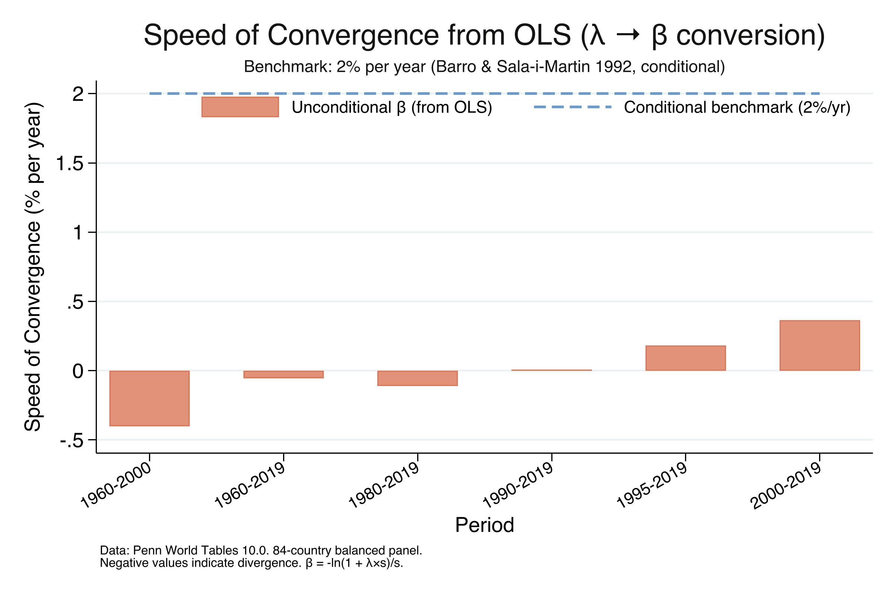

The table reveals a clear acceleration. For 1960--2000, the structural $\beta$ is negative (-0.00402), confirming divergence at a rate of 0.40% per year --- incomes were spreading apart. As the start year moves forward, convergence emerges and strengthens: essentially zero for 1990--2019, 0.18% per year for 1995--2019, and 0.36% for 2000--2019. The 2000--2019 estimate of $\beta$ = 0.00365 with a half-life of 190 years means that at the current pace, the average developing country would close only half the gap to its steady-state income in nearly two centuries. This is roughly five times slower than the 35-year benchmark for conditional convergence. Unconditional convergence is statistically real, but it is extremely slow.

We computed these results using nothing more than OLS and an algebraic formula. But there is a more direct way to estimate $\beta$ --- one that does not require any conversion. The next section introduces Nonlinear Least Squares.

---

## 7. What is Nonlinear Least Squares (NLS)?

The OLS-to-$\beta$ conversion in Section 6 works, but it goes **backwards**: we estimate $\lambda$ first, then convert to $\beta$. Can we estimate $\beta$ **directly**? Yes --- using Nonlinear Least Squares (NLS).

### Why can't OLS estimate $\beta$ directly?

The Barro-Sala-i-Martin (1992) convergence equation is:

$$\frac{1}{s} \ln\left(\frac{y\_{i,t+s}}{y\_{i,t}}\right) = \alpha - \frac{1 - e^{-\beta s}}{s} \cdot \ln(y\_{i,t}) + \varepsilon\_i$$

The parameter $\beta$ appears **inside an exponential**: $e^{-\beta s}$. OLS requires that parameters enter the equation *linearly* --- as coefficients that multiply variables. Since $\beta$ is trapped inside $\exp()$, OLS cannot estimate it directly. Instead, OLS estimates the entire expression $-\frac{1 - e^{-\beta s}}{s}$ as a single coefficient $\lambda$, and we must back out $\beta$ algebraically.

### What does NLS do?

Like OLS, NLS minimizes the sum of squared residuals:

$$\min\_{\alpha, \beta} \sum\_{i=1}^{N} \left[ g\_i - f(\ln y\_{i,0}; \alpha, \beta) \right]^2$$

But unlike OLS, the function $f()$ can be **any nonlinear function** of the parameters. NLS uses an iterative algorithm:

1. **Start** with an initial guess for $\beta$ (e.g., $\beta\_0 = 0.02$, the classic benchmark)
2. **Compute** predicted values and residuals given the current guess
3. **Adjust** $\beta$ in the direction that reduces the sum of squared residuals
4. **Repeat** until the improvement is negligible (the algorithm has "converged")

### How to estimate NLS in Stata

Stata's `nl` command performs NLS estimation. The syntax places the entire nonlinear equation inside parentheses, with parameters in curly braces:

```stata
* NLS estimation for 2000-2019
local s = 19
nl (outcome = {b0=1} - (1 - exp(-1*{b1=0.02}*`s'))/`s' * initial_inc), vce(robust)
```

Reading the syntax:
- `{b0=1}` --- the intercept $\alpha$, with initial guess = 1
- `{b1=0.02}` --- the speed of convergence $\beta$, with initial guess = 0.02 (the 2% benchmark)
- `*19` --- $s$ = 19 years (2000 to 2019)
- `initial_inc` --- $\ln(y\_{2000})$, the independent variable
- `vce(robust)` --- heteroskedasticity-robust standard errors

```text
Nonlinear regression                              Number of obs   =         84
                                                  R-squared       =     0.0704
                                                  Root MSE        =   .0215709

------------------------------------------------------------------------------
             |               Robust
     outcome | Coefficient  std. err.      t    P>|t|     [95% conf. interval]
-------------+----------------------------------------------------------------
         /b0 |   .0580907    .014098     4.12   0.000     .0300452    .0861362
         /b1 |   .0036462   .0015739     2.32   0.023     .0005152    .0067772
------------------------------------------------------------------------------

HOW TO READ THE OUTPUT:
    /b1 = 0.00365 → This is β (speed of convergence)
    Speed = 0.36% per year
    Half-life = 190.1 years

COMPARISON with OLS conversion:
    OLS λ = -0.00352
    OLS → β = -ln(1 + -0.00352 × 19) / 19 = 0.00365
    NLS β  = 0.00365
    Difference = 0.0000000
```

### Why use NLS?

The **advantage of NLS** is that standard errors and p-values apply directly to $\beta$ itself. With OLS, the standard error applies to $\lambda$, and transforming it to $\beta$ requires the delta method --- an additional mathematical step. NLS gives you $\beta$, its standard error, and a p-value in one shot. The **advantage of OLS** is simplicity: it is faster, always converges, and gives identical point estimates after conversion.

---

## 8. Speed of convergence and half-life from NLS

Now we estimate $\beta$ directly via NLS for the same six periods as Section 6. The results should match the OLS conversion, confirming that both methods recover the same structural parameter.

```stata
* NLS estimation for each period
foreach period in "1960-2019" ... "2000-2019" {
    nl (outcome = {b0=1} - (1 - exp(-1*{b1=0.00}*`s'))/`s' * initial_inc), vce(robust)
}
```

```text
Speed of Convergence from NLS (Direct Estimation of β):

       period     beta_nls      se_nls   speed_nls   halflife_nls    n
    1960-2000   -.00402402    .0013502   -.4024021              .   84
    1960-2019   -.00055955    .0012508   -.0559547              .   84
    1980-2019   -.00110461    .0013178    -.110461              .   84
    1990-2019    .00008131    .0014044    .0081305       8525.66   84
    1995-2019    .00181768    .0014633    .1817678      381.3365   84
    2000-2019    .00364620    .0015739    .3646201      190.0984   84

Benchmarks (Barro & Sala-i-Martin 1992, conditional convergence):
  Speed: 2.00% per year
  Half-life: 35 years
```

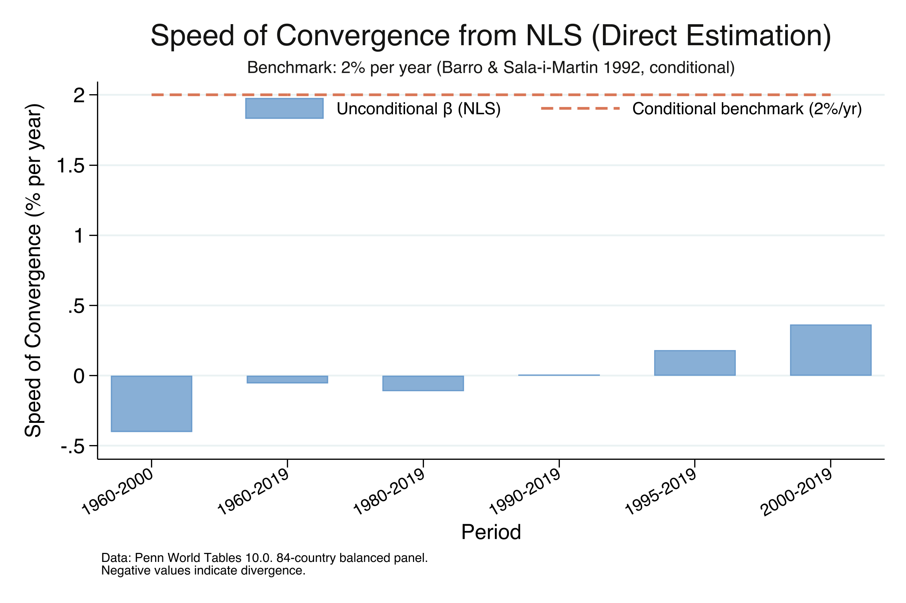

The NLS results confirm the same pattern as the OLS conversion. For 2000--2019, NLS estimates $\beta$ = 0.00365 (SE = 0.00157, p = 0.023), identical to the OLS-derived value. The speed of 0.36% per year and half-life of 190 years are consistent across both methods. Notice that NLS provides a direct p-value for $\beta$: p = 0.023 confirms that unconditional convergence since 2000 is statistically significant at the 5% level. For 1960--2000, the NLS estimate of $\beta$ = -0.00402 (p = 0.004) confirms statistically significant *divergence*.

---

## 9. OLS vs NLS comparison

How do the two methods compare side by side? The point estimates should be nearly identical, since both minimize the same sum of squared residuals --- the only difference is whether $\beta$ is estimated directly (NLS) or recovered algebraically from $\lambda$ (OLS).

```text
OLS vs NLS: Side-by-Side Comparison

       period   lambda_ols     beta_ols     beta_nls        diff   speed_ols   speed_nls    n
    1960-2000    .00436597   -.00402402   -.00402402   1.110e-16   -.4024021   -.4024021   84
    1960-2019    .00056889   -.00055955   -.00055955   1.388e-17   -.0559547   -.0559547   84
    1980-2019    .00113216   -.00110461   -.00110461   4.337e-17    -.110461    -.110461   84
    1990-2019   -.00008191    .00008131    .00008131   1.735e-17    .0081305    .0081305   84
    1995-2019   -.00178267    .00181768    .00181768   4.337e-17    .1817678    .1817678   84
    2000-2019   -.00352278    .00364620    .00364620   4.337e-17    .3646201    .3646201   84
```

The differences are on the order of $10^{-17}$ --- effectively zero, confirming that the OLS conversion $\beta = -\ln(1 + \lambda s)/s$ and NLS direct estimation recover the same structural parameter. This equivalence holds because the Barro-Sala-i-Martin equation is a reparameterization of the linear model, not a fundamentally different specification. The choice between OLS and NLS is therefore about **convenience**, not correctness:

- **Use OLS** when you want simplicity, speed, and guaranteed convergence of the estimation algorithm.
- **Use NLS** when you want standard errors and p-values directly for $\beta$ without applying the delta method.

Both approaches are correct. In the rolling-window and heatmap sections that follow, we present results from both methods.

---

## 10. Introduction to rolling windows

So far we have estimated convergence for specific time periods (1960--2019, 1960--2000, 2000--2019). But convergence is not a fixed property --- it evolves over time. A **rolling window** lets us watch this evolution by estimating a separate regression for every possible start year, always ending in 2019. Each start year produces one regression, one coefficient, and one dot on the plot.

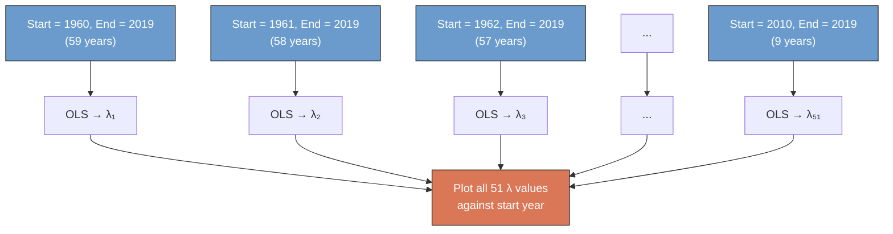

We start with the simplest rolling window: the raw OLS slope coefficient $\lambda$. This requires nothing beyond the `reg` command we already know.

### Rolling OLS lambda

For each start year from 1960 to 2010, we run the same OLS regression as in Section 4 --- growth on initial income --- and collect the slope coefficient $\lambda$ along with its 95% confidence interval. The CI uses the standard OLS formula:

$$\lambda \pm t\_{N-2, 0.025} \times \text{SE}(\lambda)$$

where $t\_{N-2, 0.025}$ is the critical value from the t-distribution with $N-2$ degrees of freedom (82 for our 84-country sample).

```stata
* For each start year, run OLS and store lambda + CI
forval startyear = 1960(1)2010 {
    local s = 2019 - `startyear'
    gen outcome = (1/`s') * ln(gdppc2019 / gdppc`startyear')
    gen initial_inc = ln(gdppc`startyear')

    reg outcome initial_inc, robust

    * Store lambda and its 95% CI
    local lambda = _b[initial_inc]
    local se = _se[initial_inc]
    local lambda_lb = `lambda' - invttail(e(df_r), 0.025) * `se'
    local lambda_ub = `lambda' + invttail(e(df_r), 0.025) * `se'
    drop outcome initial_inc
}
```

```text
Rolling OLS Lambda: Key Findings

    startyear      lambda          se       lower       upper    n
         1960    .0005689    .0012908   -.0019988    .0031366   84
         1970    .0009814    .0012959   -.0015964    .0035592   84
         1980    .0011322    .0013758   -.0016047    .0038690   84
         1990   -.0000819    .0014043   -.0028757    .0027119   84
         1995   -.0017827    .0014030   -.0045739    .0010085   84
         2000   -.0035228    .0014686   -.0064442   -.0006013   84
         2005   -.0041503    .0017255   -.0075825   -.0007181   84
         2010   -.0030074    .0018375   -.0066619    .0006471   84
```

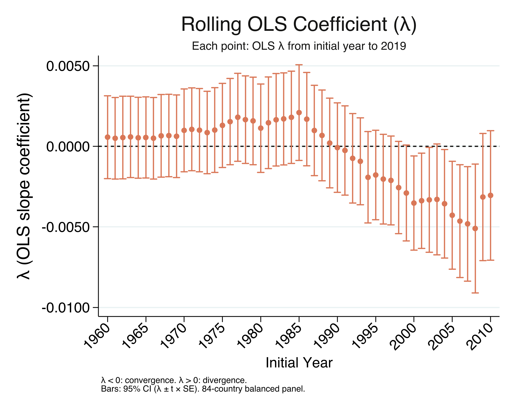

The rolling $\lambda$ tells the convergence story in its rawest form. For start years in the 1960s--1980s, $\lambda$ is positive (above the dashed zero line): richer countries grew faster, meaning divergence. Around 1990, $\lambda$ crosses zero and becomes increasingly negative: poorer countries are now growing faster. The 95% CI bars show that $\lambda$ is statistically distinguishable from zero (the entire CI is below zero) for start years from about 1998 onward. Notice that the sign convention for $\lambda$ is the **opposite** of $\beta$: negative $\lambda$ means convergence, while positive $\beta$ means convergence.

### From lambda to beta: transforming the confidence interval

To convert the rolling $\lambda$ to the structural speed of convergence $\beta$, we apply the formula from Section 6: $\beta = -\ln(1 + \lambda s)/s$. But what about the confidence interval? We cannot simply plug the CI formula for $\lambda$ into the $\beta$ formula, because the transformation is **nonlinear** and **monotone decreasing** --- a more negative $\lambda$ (stronger convergence) maps to a *larger* positive $\beta$. This means the bounds **flip** during transformation.

Let's walk through this with the actual 2000--2019 estimates:

**Step 1.** The OLS CI for $\lambda$ (from the regression output):

$$\lambda = -0.00352, \quad \text{SE} = 0.00147, \quad s = 19$$

$$\text{CI for } \lambda: \quad [-0.00352 - 1.989 \times 0.00147, \quad -0.00352 + 1.989 \times 0.00147] = [-0.00645, \quad -0.00060]$$

**Step 2.** Transform each bound through $\beta = -\ln(1 + \lambda s)/s$:

$$\text{Lower } \lambda = -0.00645 \quad \Rightarrow \quad \beta = \frac{-\ln(1 + (-0.00645)(19))}{19} = \frac{-\ln(0.8775)}{19} = \frac{0.1307}{19} = 0.00688$$

$$\text{Upper } \lambda = -0.00060 \quad \Rightarrow \quad \beta = \frac{-\ln(1 + (-0.00060)(19))}{19} = \frac{-\ln(0.9886)}{19} = \frac{0.01147}{19} = 0.00060$$

**Step 3.** Notice the flip: the **lower** $\lambda$ bound (-0.00645) produced the **upper** $\beta$ bound (0.00688), and the **upper** $\lambda$ bound (-0.00060) produced the **lower** $\beta$ bound (0.00060). So:

$$\text{CI for } \beta: \quad [0.00060, \quad 0.00688]$$

This happens because $\beta = -\ln(1 + \lambda s)/s$ is a **monotone decreasing** function of $\lambda$: as $\lambda$ decreases (becomes more negative), $\beta$ increases (stronger convergence). In the code, we handle this by simply swapping the transformed bounds:

```stata
* Transform lambda CI to beta CI (bounds flip)
local beta_lb = -ln(1 + `lambda_ub' * `s') / `s'   // upper lambda → lower beta
local beta_ub = -ln(1 + `lambda_lb' * `s') / `s'   // lower lambda → upper beta
```

With this understanding, we can now construct rolling windows for the structural speed $\beta$ using both OLS (with the conversion) and NLS (direct estimation).

---

## 11. Rolling beta convergence over time

We now apply the rolling-window approach to the structural speed of convergence $\beta$, using both methods from Sections 6--9. For each start year from 1960 to 2010, with end year fixed at 2019, we estimate $\beta$ via:
- **OLS:** estimate $\lambda$, convert to $\beta = -\ln(1+\lambda s)/s$, transform CI bounds (with the flip)
- **NLS:** estimate $\beta$ directly, CI comes straight from the standard error

### OLS rolling beta

```stata
* For each start year, estimate OLS and convert λ → β
forval startyear = 1960(1)2010 {
    local s = 2019 - `startyear'
    reg outcome initial_inc, robust
    local lambda = _b[initial_inc]
    local se = _se[initial_inc]

    * Convert lambda to beta
    local beta = -ln(1 + `lambda' * `s') / `s'

    * Convert CI (bounds flip due to monotone decreasing transformation)
    local lambda_lb = `lambda' - invttail(e(df_r), 0.025) * `se'
    local lambda_ub = `lambda' + invttail(e(df_r), 0.025) * `se'
    local beta_lb = -ln(1 + `lambda_ub' * `s') / `s'   // upper λ → lower β
    local beta_ub = -ln(1 + `lambda_lb' * `s') / `s'   // lower λ → upper β
}
```

```text
Rolling OLS Beta Convergence: Key Findings

    startyear        beta   speed_pct   halflife    n
         1960   -.0005596   -.0559555          .   84
         1970    -.000968   -.0967977          .   84
         1980    -.001105   -.1104993          .   84
         1990    .0000813    .0081259   8530.064   84
         1995    .0018177    .1817691   381.334   84
         2000    .0036462    .3646227   190.100   84
         2005    .0044101    .4410113   157.172   84
         2010    .0030897    .3089731   224.339   84
```

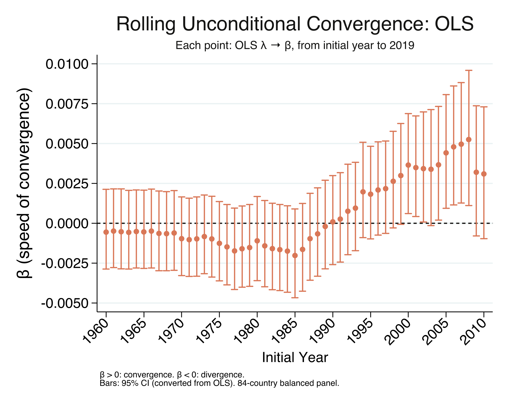

### NLS rolling beta

```stata
* For each start year, estimate NLS β directly
forval startyear = 1960(1)2010 {
    local s = 2019 - `startyear'
    nl (outcome = {b0=1} - (1 - exp(-1*{b1=0.00}*`s'))/`s' * initial_inc), vce(robust)
    * CI comes directly: beta ± t × SE(beta)
}
```

```text
Rolling NLS Beta Convergence: Key Findings

    startyear        beta   speed_pct   halflife    n
         1960   -.0005596   -.0559555          .   84
         1970    -.000968   -.0967977          .   84
         1980    -.001105   -.1104993          .   84
         1990    .0000813    .0081259   8530.064   84
         1995    .0018177    .1817691   381.334   84
         2000    .0036462    .3646227   190.100   84
         2005    .0044101    .4410113   157.172   84
         2010    .0030897    .3089731   224.339   84
```

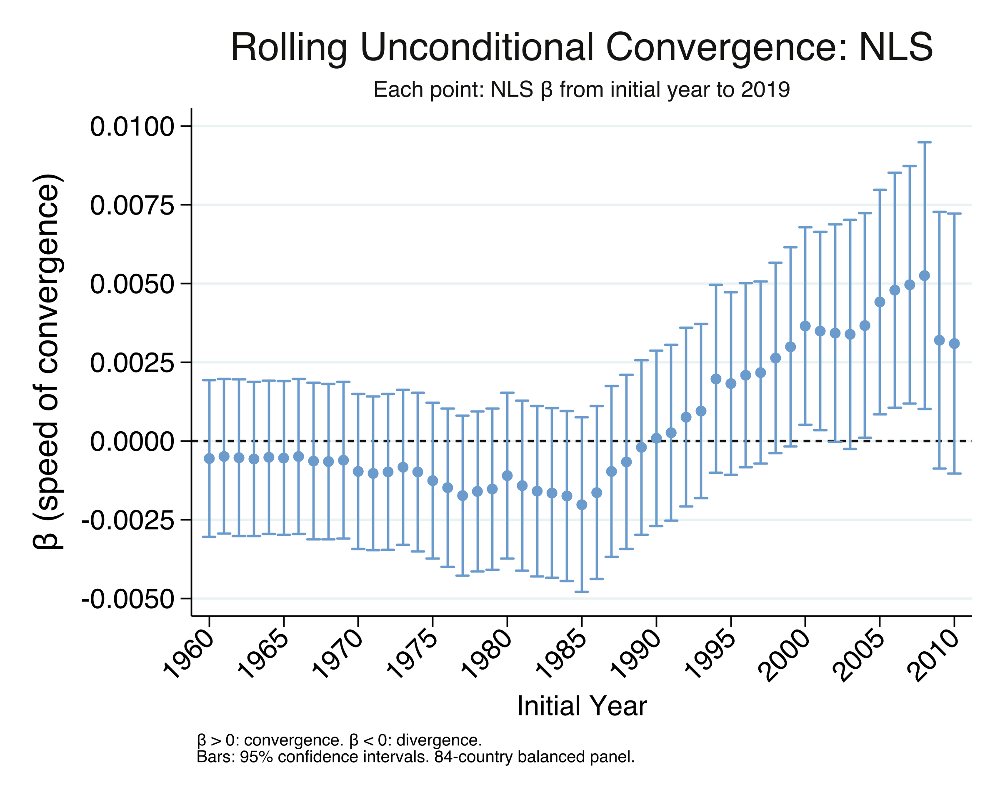

The rolling $\beta$ tells a clear story of transition, and the OLS and NLS results are identical in every row. For start years in the 1960s through mid-1980s, $\beta$ is negative --- divergence. It then climbs steadily through the 1990s, crosses zero around 1990, and peaks at 0.00441 for start year 2005 (speed = 0.44%/yr, half-life = 157 years). For the most recent start years (2009--2010), the coefficient pulls back slightly to 0.00309 (half-life = 224 years), suggesting that convergence may have moderated --- possibly reflecting effects of the 2008 financial crisis. The two figures look identical because the OLS conversion and NLS give the same point estimates; the only difference is that the NLS confidence intervals are derived directly from $\beta$'s standard error, while the OLS intervals are transformed from $\lambda$'s (with the bound-flipping described in Section 10). With convergence dynamics established, we now turn to a different question: is the actual spread of income across countries narrowing?

---

## 12. Sigma convergence: is the spread narrowing?

Beta convergence asks whether poorer countries grow faster. **Sigma convergence** asks a different question: is the *dispersion* of income across countries getting smaller? We measure dispersion using the variance of log GDP per capita. If the variance decreases over time, incomes are bunching together (sigma convergence). If it increases, incomes are spreading apart (sigma divergence).

```stata
* Variance of log GDP per capita in 1960
gen logy = ln(gdppc)
ci variances logy if year == 1960

* Variance of log GDP per capita in 2019
ci variances logy if year == 2019
```

```text
--- Cross-country dispersion in 1960 ---
    Variable |        Obs      Variance       [95% conf. interval]
        logy |         84      .9244376       .6969585    1.285409
  Std. Dev. = 0.9615

--- Cross-country dispersion in 2019 ---
    Variable |        Obs      Variance       [95% conf. interval]
        logy |         84      1.763502       1.329631    2.452057
  Std. Dev. = 1.3280

Sigma Convergence Test: 1960 vs 2019:
  Change in variance: 0.8391 ( 90.8%)
  Variance INCREASED: evidence of sigma-DIVERGENCE.
```

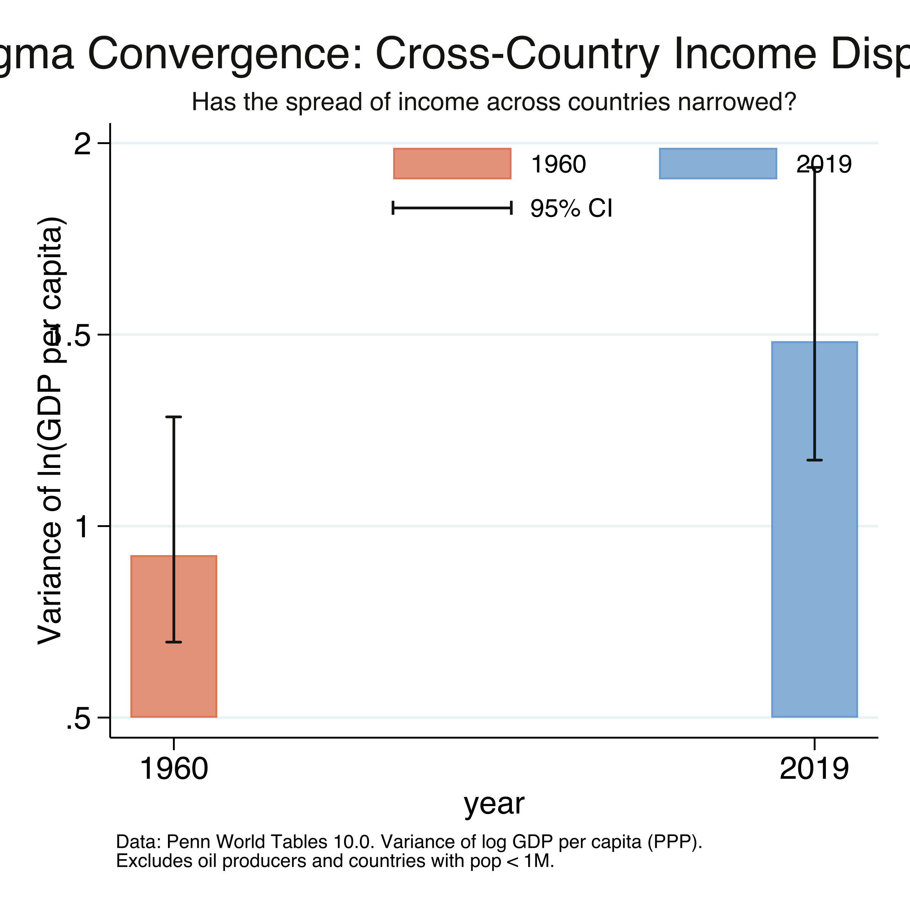

The error bars in the figure show 95% confidence intervals for the variance, computed using the **chi-squared distribution**. Stata's `ci variances` command uses the formula:

$$\text{CI for } \sigma^2 = \left[\frac{(N-1) s^2}{\chi^2\_{\alpha/2, N-1}}, \quad \frac{(N-1) s^2}{\chi^2\_{1-\alpha/2, N-1}}\right]$$

where $s^2$ is the sample variance, $N$ = 84 countries, and $\chi^2\_{\alpha/2, N-1}$ is the critical value from the chi-squared distribution with $N-1$ = 83 degrees of freedom. This is the standard CI for a variance under the assumption that the data (log GDP per capita) is approximately normally distributed. Unlike the symmetric OLS confidence interval ($\hat{\theta} \pm t \times \text{SE}$), the chi-squared CI is **asymmetric** --- the upper tail extends further than the lower tail, reflecting the right-skewed nature of the chi-squared distribution. This asymmetry is visible in the error bars: the upper whisker is longer than the lower one.

Comparing the two endpoints, the variance of log GDP per capita *increased* by 90.8%, from 0.924 in 1960 to 1.764 in 2019. The standard deviation rose from 0.96 to 1.33. In 2019, a one-standard-deviation move along the world income distribution corresponds to a roughly 3.8-fold difference in living standards ($e^{1.33}$ = 3.78), up from a 2.6-fold difference in 1960 ($e^{0.96}$ = 2.61). This is clear evidence of sigma *divergence* over the full period: the world income distribution widened substantially, even though beta convergence exists in the recent era. How can poorer countries be growing faster *and* the income spread be widening at the same time? The next section explains this apparent paradox.

---

## 13. Why beta convergence is not enough

The seeming contradiction --- beta convergence without sigma convergence --- is not a paradox but a well-known theoretical result. Young, Higgins, and Levy (2008) proved that **beta convergence is necessary but not sufficient for sigma convergence**. Think of it like a race with wind gusts: even if the runners at the back are faster on average (beta convergence), random gusts can push some runners forward and others backward, keeping the pack spread out (no sigma convergence). The catch-up tendency must be strong enough to overcome the dispersing force of random shocks before the distribution actually narrows.

```stata
* Decade-by-decade OLS λ and variance of log income
foreach decade in 1960 1970 1980 1990 2000 2010 {
    * OLS slope of growth on initial income
    reg g_temp i_temp, robust

    * Variance of log income at start of decade
    summarize logy_temp
}
```

```text
  Decade      | OLS λ     | σ² start  | Interpretation
  1960-1970   |  0.00594  |   0.9244  | λ≥0: divergence
  1970-1980   |  0.00555  |   1.0818  | λ≥0: divergence
  1980-1990   |  0.00686  |   1.2893  | λ≥0: divergence
  1990-2000   |  0.00882  |   1.5384  | λ≥0: divergence
  2000-2010   | -0.00379  |   1.8937  | λ<0: convergence
  2010-2019   | -0.00305  |   1.8262  | λ<0: convergence
```

The decade-by-decade view confirms the theory in action. The OLS $\lambda$ turns negative (convergence) in 2000--2010, but the variance of log income does not begin declining until after 2008 --- it peaks at 1.918 in 2008 before falling to 1.826 by 2010 and 1.764 by 2019. This creates an approximately **8-year lag**: poorer countries started growing faster around 2000, but the overall income distribution only began narrowing around 2008. For nearly a decade, random growth shocks --- economic crises, commodity price swings, conflict --- offset the systematic catch-up tendency before the convergence force became strong enough to dominate. Now that we have established both the existence and the timing of convergence, the next section tracks sigma convergence year by year.

---

## 14. Sigma convergence over time

We now track the dispersion of income every year from 1960 to 2019. Because we use a balanced panel of 84 countries, the sample composition is constant throughout --- there is no need for a separate "fixed sample" series to control for changing coverage.

```stata
* Variance of log GDP per capita each year (84-country balanced panel)
forval yr = 1960(1)2019 {
    gen logy = ln(gdppc`yr')
    ci variances logy
    drop logy
}
```

```text
Sigma Convergence Over Time: Key Years

    year   variance    n
    1960   .9244376   84
    1970   1.081847   84
    1980   1.289282   84
    1990    1.53844   84
    2000   1.893675   84
    2008   1.918209   84   (peak)
    2010   1.826223   84
    2019   1.763502   84
```

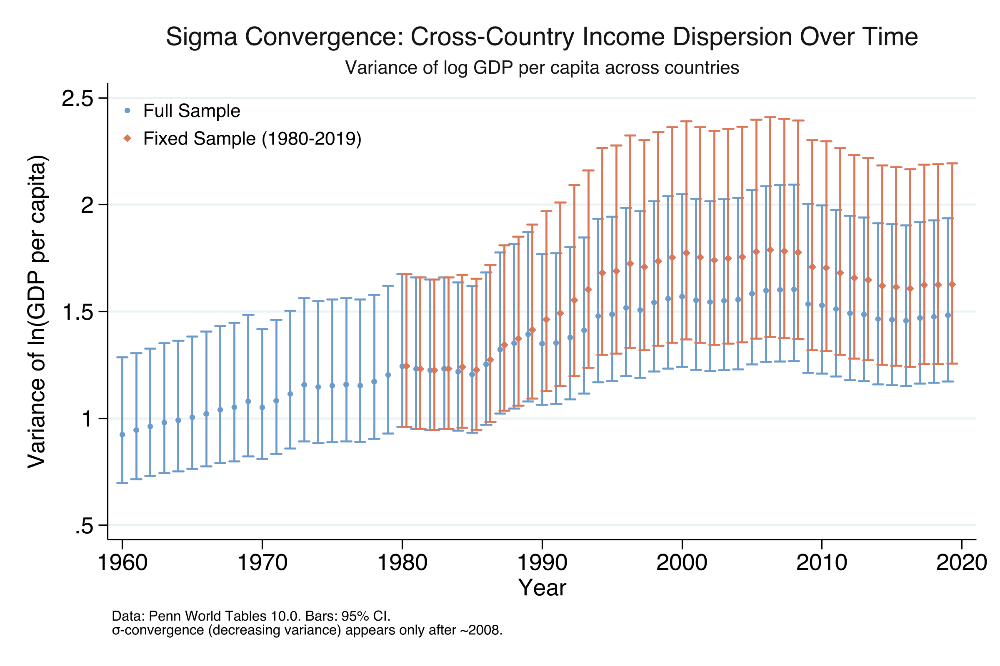

The error bars at each year are the chi-squared confidence intervals described in Section 12. Because our balanced panel has a constant $N$ = 84, the width of the CI at each year depends only on the variance itself: years with larger variance have wider bars in absolute terms. The bars do not reflect changes in sample size (which is constant throughout).

The variance series tells a two-act story. **Act one (1960--2008):** variance rose almost continuously from 0.924 to a peak of 1.918, an increase of 108% over nearly five decades. **Act two (2008--2019):** variance declined from 1.918 to 1.764, a drop of 8.1%. Sigma convergence is a genuinely recent phenomenon, emerging only after the mid-2000s. Even so, the 2019 variance (1.764) remains 91% higher than the 1960 value (0.924). The recent narrowing is real but has barely begun to undo decades of divergence. The next section provides the most comprehensive view of convergence by examining every possible time window.

---

## 15. The convergence heatmap

The heatmap is the most comprehensive visualization of convergence dynamics. For every possible start-year and end-year combination from 1960 to 2019, we estimate a separate regression --- approximately 1,770 regressions --- and color-code the result. Blue indicates convergence ($\beta > 0$) and red indicates divergence ($\beta < 0$). We produce two heatmaps: one using the OLS $\lambda \to \beta$ conversion and one using NLS direct estimation, following Patel et al. (2021) Figure 2.

```stata
* Loop over ALL start/end year combinations
forval startyear = 1960(1)2018 {
    forval outcomeyear = `startyear'+1 (1) 2019 {
        * OLS: estimate λ, convert to β = -ln(1+λs)/s
        reg outcome initial_inc, robust

        * NLS: estimate β directly
        nl (outcome = {b0=1} - (1 - exp(-1*{b1=0.00}*`s'))/`s' * initial_inc), vce(robust)
    }
}
```

### OLS heatmap

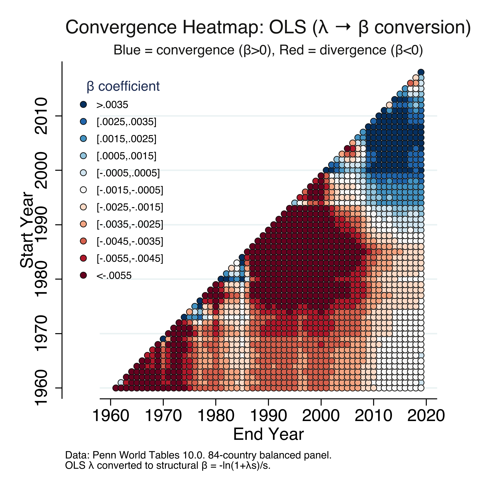

### NLS heatmap

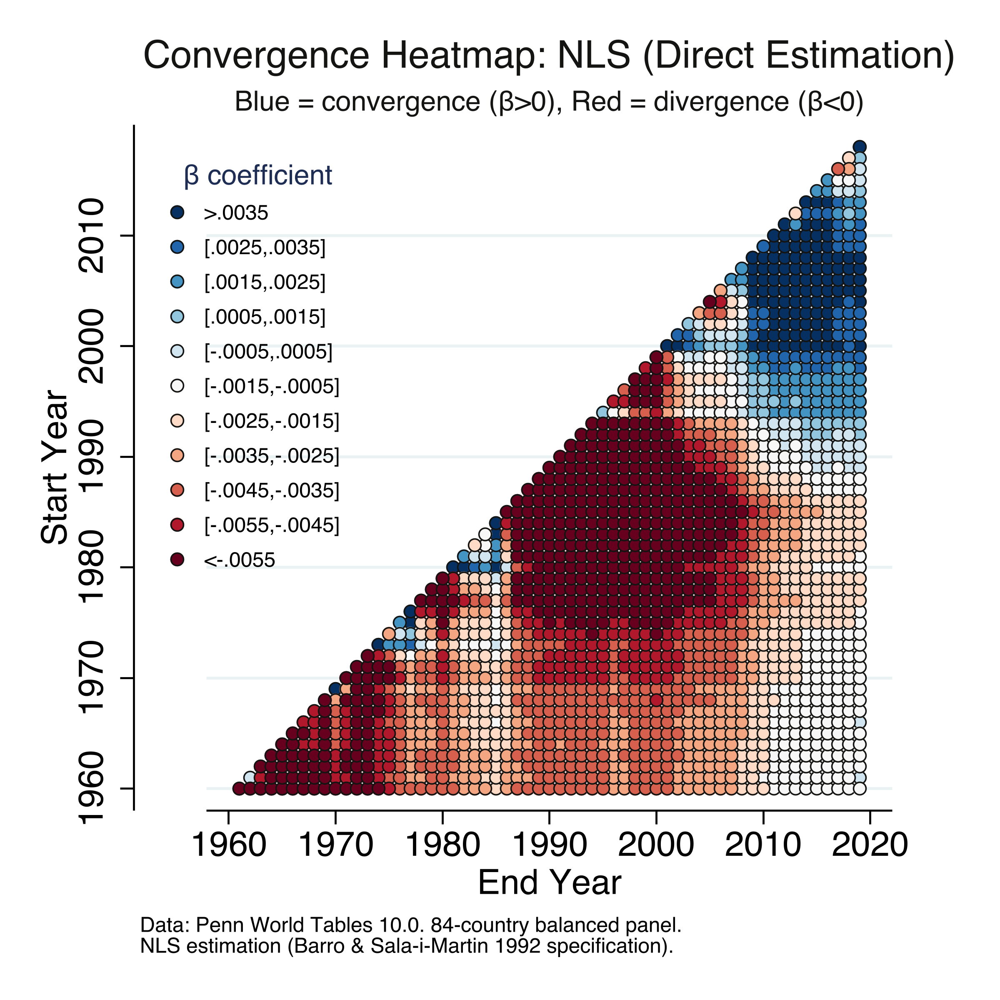

The pattern is strikingly clear and identical across both methods. The upper-right triangle (periods ending in 2010--2019) is dominated by blue, while the central and lower-left regions (periods ending before 2000) are dominated by red. The deepest red ($\beta < -0.0055$) is concentrated in short windows during the 1970s--1980s, when divergence was strongest. The deepest blue ($\beta > 0.0035$) appears for windows ending in 2015--2019 and starting after 1990. The transition from red to blue occurs gradually along diagonals, with the crossover point moving from the upper right toward the center. This confirms that the convergence finding is not an artifact of choosing specific endpoints --- it appears robustly across many time windows. Along the diagonal (short intervals), estimates are noisier due to shorter periods. The two heatmaps are virtually indistinguishable, providing a final confirmation that OLS conversion and NLS direct estimation yield the same results.

---

## 16. Discussion

We set out to ask whether the world has entered a new era of unconditional convergence and how fast it is happening. The evidence is clear: **yes, unconditional convergence is real since approximately 2000, but it is very slow.**

The speed of convergence for 2000--2019 is 0.36% per year ($\beta$ = 0.00365, p = 0.023), with a half-life of 190 years --- both OLS conversion and NLS direct estimation give this identical result. To put this in perspective, at this pace, a country currently at one-tenth of US income per capita would need nearly two centuries to close just half the gap --- not to catch up entirely, but merely to halve the distance. This is roughly five times slower than the classic 2%/year benchmark for conditional convergence (Barro and Sala-i-Martin, 1992), which controls for human capital, institutions, and savings rates. The fact that unconditional convergence exists *at all* is remarkable, but its pace should temper optimism about automatic catch-up.

The sigma convergence results add an important nuance. Even though poorer countries have been growing faster since around 2000, the actual spread of world incomes only began narrowing after 2008 --- an 8-year lag. And even with this recent narrowing, the 2019 income distribution is still 91% wider than in 1960. A policymaker looking at these results would conclude that convergence forces alone are far too slow to eliminate global poverty or close income gaps within any reasonable planning horizon. Active investment in education, infrastructure, institutions, and technology transfer remains essential.

A methodological contribution of this tutorial is demonstrating that the OLS $\lambda \to \beta$ conversion and NLS direct estimation are algebraically equivalent, producing identical point estimates. The choice between methods is one of convenience: OLS for simplicity, NLS for direct inference on $\beta$. Students can start with the familiar OLS framework and add NLS when they need standard errors for the structural parameter.

---

## 17. Summary and next steps

### Key takeaways

1. **No convergence over 1960--2019 as a whole** (OLS $\lambda$ = 0.00057, p = 0.661), but this null result conceals a dramatic structural break around the year 2000.
2. **Unconditional convergence since 2000** at a speed of 0.36% per year ($\beta$ = 0.00365, half-life = 190 years, N = 84, p = 0.023). This is statistically significant but five times slower than conditional convergence.
3. **OLS and NLS give identical results.** The algebraic conversion $\beta = -\ln(1 + \lambda s)/s$ recovers the same structural parameter as direct NLS estimation, confirming both methods are valid.
4. **Sigma convergence lags beta convergence by ~8 years.** The income variance peaked at 1.918 in 2008 and declined 8.1% by 2019. Random growth shocks delayed the narrowing of the distribution even as poorer countries grew faster on average.
5. **The income distribution remains 91% wider than in 1960.** Despite post-2008 sigma convergence, the 2019 variance of log GDP per capita (1.764) far exceeds the 1960 value (0.924). A one-standard-deviation move in the 2019 distribution corresponds to a 3.8-fold difference in living standards.

### Limitations

- The analysis uses a balanced panel of 84 countries with data available since 1960, excluding 40 countries that entered PWT coverage after 1960. These excluded countries are disproportionately from Africa and small island states, so the results may not generalize to the full set of developing countries.
- The convergence regressions explain very little of the cross-country growth variation (R-squared from 0.001 to 0.069). The research question is about the sign and significance of the relationship, not prediction.
- The most recent rolling-window estimates (start years 2009--2010) show some moderation in convergence speed, but shorter growth windows also mean more noise.
- Results depend on the choice of income measure (expenditure-side real GDP at chained PPPs) and sample restrictions (excluding oil producers and small countries).

### Next steps

- **Conditional convergence:** Add controls for human capital, institutional quality, and savings rates to see whether the speed approaches the 2% benchmark.
- **Club convergence:** Test whether countries converge to different steady states rather than a single global equilibrium (Phillips and Sul, 2007).
- **Within-country convergence:** Apply the same framework to regions within a country to study subnational income dynamics.
- **Post-COVID update:** Extend the analysis past 2019 to assess whether the pandemic disrupted or accelerated convergence.

---

## 18. Exercises

1. **Change the breakpoint.** Instead of splitting at the year 2000, try splitting at 1990 or 1995. Does the convergence coefficient in the recent era change? At what breakpoint does the coefficient first become significantly negative?

2. **Conditional convergence.** Add log population and a measure of education (years of schooling, available in PWT 10.0 as `hc`) as controls to the NLS specification. How much does the speed of convergence increase? Does the half-life approach the 35-year conditional benchmark?

3. **Alternative samples.** Re-run the 2000--2019 NLS regression including oil producers. Then try including small countries. How sensitive is the convergence result to these sample restrictions?

---

## 19. References

1. [Patel, D., Sandefur, J., and Subramanian, A. (2021). The New Era of Unconditional Convergence. *Journal of Development Economics*, 152, 102687.](https://doi.org/10.1016/j.jdeveco.2021.102687)
2. [Barro, R. J. and Sala-i-Martin, X. (1992). Convergence. *Journal of Political Economy*, 100(2), 223--251.](https://doi.org/10.1086/261816)
3. [Feenstra, R. C., Inklaar, R., and Timmer, M. P. (2015). The Next Generation of the Penn World Table. *American Economic Review*, 105(10), 3150--3182.](https://doi.org/10.1257/aer.20130954)
4. [Sala-i-Martin, X. (1996). The Classical Approach to Convergence Analysis. *The Economic Journal*, 106(437), 1019--1036.](https://doi.org/10.2307/2235375)
5. [Young, A. T., Higgins, M. J., and Levy, D. (2008). Sigma Convergence versus Beta Convergence: Evidence from U.S. County-Level Data. *Journal of Money, Credit and Banking*, 40(5), 1083--1093.](https://doi.org/10.1111/j.1538-4616.2008.00148.x)
6. [Penn World Tables 10.0 -- University of Groningen](https://www.rug.nl/ggdc/productivity/pwt/)
