---
authors:
  - admin
categories:
  - Stata
  - Economic Growth
  - Convergence
  - Development Economics
  - Spatial inequality
date: "2026-04-29T00:00:00Z"
draft: false
featured: false
external_link: ""
image:
  caption: ""
  focal_point: Smart
  placement: 3
links:
- icon: file-code
  icon_pack: fas
  name: "Stata do-file"
  url: analysis.do
- icon: file-alt
  icon_pack: fas
  name: "Stata log"
  url: analysis.log
- icon: markdown
  icon_pack: fab
  name: "MD version"
  url: https://raw.githubusercontent.com/cmg777/starter-academic-v501/master/content/post/stata_convergence2/index.md
slides:
summary: Reproduce the key findings of Kremer, Willis, and You (2021) to understand why unconditional convergence emerged since 2000 and how the convergence of growth correlates explains this shift
tags:
  - stata
  - convergence
  - growth
  - development
  - cross-country
title: "Converging to Convergence: Understanding the Main Ideas of the Convergence Literature"
url_code: ""
url_pdf: ""
url_slides: ""
url_video: ""
toc: true
diagram: true
---

## 1. Overview

For decades, one of the most important questions in economics has been: are poor countries catching up to rich ones? The answer has changed dramatically over time. In the 1960s, richer countries actually grew *faster* than poorer ones --- a pattern called **divergence**. By the 2000s, this had reversed: poor countries were growing significantly faster, a phenomenon known as **unconditional convergence** (also called absolute convergence). What caused this shift?

This tutorial walks through the key ideas of the convergence literature by reproducing the main findings of Kremer, Willis, and You (2021), "Converging to Convergence." The paper provides an elegant explanation: the world has "converged to convergence" because growth correlates --- the policies, institutions, and human capital variables that predict economic growth --- have themselves converged across countries. As poor countries improved their institutions and policies, the gap between unconditional convergence (a simple comparison of growth rates across income levels) and conditional convergence (controlling for institutions) closed. The central tool for understanding this is the **omitted variable bias (OVB) formula**, which decomposes exactly *how much* each growth correlate contributes to the convergence gap.

We use the authors' replication dataset, which combines Penn World Table 10.0 GDP data with over 50 institutional, policy, and cultural variables for approximately 160 countries from 1960 to 2017. The analysis is entirely **descriptive** --- we document cross-country correlations and trends, but do not make causal claims.

### Learning objectives

- Understand beta-convergence and sigma-convergence and how to test for each
- Track the trend in convergence over time using year-interacted regressions
- Decompose convergence into contributions from income quartiles and geographic regions
- Apply the omitted variable bias (OVB) formula to explain why unconditional convergence emerged
- Distinguish between correlate-income slopes (delta), growth-correlate slopes (lambda), and their product
- Evaluate whether the 1990s growth regression literature holds up as an out-of-sample test

### Analytical roadmap

The diagram below shows the logical progression of the tutorial. We first establish the facts, then explain them.


We start by documenting the emergence of convergence (scatter plots, rolling coefficients, sigma-convergence, quartile decompositions). Then we show that growth correlates have themselves converged. Finally, the OVB framework links these two facts, revealing that the gap between unconditional and conditional convergence closed because growth regression coefficients for policy variables collapsed.

### Key concepts at a glance

The post leans on a small vocabulary repeatedly. The rest of the tutorial assumes you can move between these terms quickly. Each concept below has three parts. The **definition** is always visible. The **example** and **analogy** sit behind clickable cards: open them when you need them, leave them collapsed for a quick scan. If a later section mentions "OVB decomposition" or "lambda flattening" and the term feels slippery, this is the section to re-read.

**1. Beta convergence: unconditional vs conditional** $\beta$ vs $\beta^*$.
The unconditional $\beta$ is the slope of growth on log initial income with no controls. The conditional $\beta^*$ is the same slope after controlling for growth correlates. Both negative means poorer countries are catching up — even those with similar institutions.

<div class="concept-pair">
<details class="concept-card concept-example">
<summary>Example</summary>

For the `polity2` sample in 2005, the unconditional $\beta = -0.767$ and the conditional $\beta^* = -0.807$. The two are within 0.04 of each other. Twenty years earlier (1985), the gap was 0.44 — institutions explained most of the apparent divergence.

</details>

<details class="concept-card concept-analogy">
<summary>Analogy</summary>

"Catching up overall" vs "catching up given the same institutions". Imagine two race tracks: one mixes all runners, the other separates them by training regimen. If both show poor runners gaining, the catching-up is real.

</details>
</div>

**2. Sigma convergence** $\sigma\_t$.
The cross-country standard deviation of log GDP per capita at year $t$. Tracks the *width* of the world income distribution. A narrowing distribution is sigma convergence.

<div class="concept-pair">
<details class="concept-card concept-example">
<summary>Example</summary>

$\sigma$ rose from 0.947 in 1960 to 1.217 in 2000 (peak), then eased to 1.173 by 2017. Income dispersion is no longer widening but has not yet narrowed substantially. Beta convergence has just begun the work that sigma convergence will eventually reflect.

</details>

<details class="concept-card concept-analogy">
<summary>Analogy</summary>

A flock of birds. Sigma asks whether the flock is tightening. Beta tells you which birds are flying faster. They are related but not the same: the laggard birds can accelerate without the flock yet looking tighter.

</details>
</div>

**3. OVB decomposition** $\beta - \beta^* = \delta \cdot \lambda$.
The omitted-variable-bias identity. The gap between unconditional and conditional convergence equals the product of two slopes: $\delta$ (correlate-on-income) and $\lambda$ (correlate-on-growth). When the gap closes, at least one of $\delta$ or $\lambda$ must have shrunk.

<div class="concept-pair">
<details class="concept-card concept-example">
<summary>Example</summary>

For the `polity2` example, the gap closed from 0.440 (1985) to 0.040 (2005). The product $\delta \cdot \lambda$ went from $0.440$ to $0.040$. Inspecting the components: $\lambda$ collapsed from 0.891 to 0.183 — the growth regression coefficient flattened.

</details>

<details class="concept-card concept-analogy">
<summary>Analogy</summary>

Double-entry bookkeeping. The total bias on the convergence books equals the sum of two ledger entries. If the total drops, one of the ledger entries must have dropped — and the OVB identity tells you which one.

</details>
</div>

**4. Growth correlates.**
The policy and institutional variables economists used to put on the right-hand side of growth regressions in the 1990s: inflation, investment, schooling, openness, political rights, rule of law, and so on. Each is meant to capture a "fundamental" of long-run growth.

<div class="concept-pair">
<details class="concept-card concept-example">
<summary>Example</summary>

This post tracks `polity2`, `FH_political_rights`, `investment`, `inflation`, and `barrolee2060` (schooling) as the headline correlates. Each has a story in the post: `investment` shows the strongest cross-country correlation with income; political rights show the most pronounced correlate-income flattening.

</details>

<details class="concept-card concept-analogy">
<summary>Analogy</summary>

Ingredients in a recipe. Some recipes call for many ingredients (high-inflation, low-savings, weak-rights), others for few. Growth correlates are the ingredients we suspect explain why some economies cook up more output than others.

</details>
</div>

**5. Correlate–income slope** $\delta$.
The regression of a correlate on log income. How much richer countries have *more* of the correlate. A large positive $\delta$ for `polity2` means richer countries are more democratic.

<div class="concept-pair">
<details class="concept-card concept-example">
<summary>Example</summary>

For `polity2`, $\delta$ has stayed around 0.5–0.6 over decades. Richer countries have always tended to be more democratic. The correlate-income slope is *not* what flattened in the 1990s–2000s; it is the other half of the OVB product.

</details>

<details class="concept-card concept-analogy">
<summary>Analogy</summary>

How well-stocked the kitchen is. A wealthy kitchen has more ingredients on hand. The correlate-income slope $\delta$ measures the kitchen-stocking gradient: as a country gets richer, how much better-stocked does its kitchen become?

</details>
</div>

**6. Growth-regression slope** $\lambda$.
The coefficient on a correlate when growth is regressed on the correlate (controlling for log income). How much each correlate contributes to growth, holding initial income fixed. A large $\lambda$ means the correlate matters; a small $\lambda$ means it does not.

<div class="concept-pair">
<details class="concept-card concept-example">
<summary>Example</summary>

For `polity2` in 1985, $\lambda = 0.891$. By 2005, $\lambda = 0.183$. The growth payoff to good political institutions has flattened dramatically over two decades.

</details>

<details class="concept-card concept-analogy">
<summary>Analogy</summary>

How much each ingredient matters in the recipe. A pinch of saffron used to be transformative. Now everyone uses it; the marginal effect is much smaller. Lambda is "marginal effect of the ingredient"; not "amount of ingredient on hand".

</details>
</div>

**7. Lambda flattening.**
The empirical observation that growth-regression coefficients $\lambda$ on short-run correlates have collapsed since the 1990s. The collapse is the *real* story: it is what made unconditional convergence emerge.

<div class="concept-pair">
<details class="concept-card concept-example">
<summary>Example</summary>

Across the post's correlate set, $\lambda$ for several short-run policy variables fell from 0.5–1.0 (1985) to 0.1–0.3 (2005). The longer-run correlates (like schooling) are stickier. The lambda flattening shrinks the OVB product and brings $\beta$ and $\beta^*$ into alignment.

</details>

<details class="concept-card concept-analogy">
<summary>Analogy</summary>

Ingredients losing their punch as kitchens equalize. When every kitchen has good knives and a working oven, the kitchens with the *best* knives no longer dominate. Lambda flattening is that universal-baseline effect.

</details>
</div>

**8. Quartile and regional decomposition.**
A descriptive break-down of beta convergence by initial-income quartile or by region. Asks: which subgroup is doing the catching-up? A few quartiles or regions usually do most of the work.

<div class="concept-pair">
<details class="concept-card concept-example">
<summary>Example</summary>

This post's regional decomposition (Sub-Saharan Africa, East Asia, Latin America, OECD, etc.) attributes most of the post-2000 catch-up to East Asia and parts of South Asia. Within-quartile, the bottom two quartiles drive the recent convergence; the top two have stayed flat.

</details>

<details class="concept-card concept-analogy">
<summary>Analogy</summary>

Breaking the average down by income tier. The class average improved; was it because everyone improved, or because the bottom of the class caught up? Quartile decomposition answers exactly that question.

</details>
</div>

---

## 2. Setup and data loading

We begin by loading the Kremer et al. (2021) replication dataset, which has already been cleaned to exclude very small countries (population below 200,000) and resource-dependent economies (natural resource rents above 75% of GDP). We also merge regional classifications from the World Development Indicators.

```stata
clear all
set more off
set seed 42
set scheme s2color

* Load the main dataset
use "https://raw.githubusercontent.com/cmg777/starter-academic-v501/master/content/post/stata_convergence2/main_data.dta", clear

* Display panel structure
codebook country_id, compact
tab year if loggdp != ., missing
summarize loggdp loggdp_growth_10
```

```text
Panel structure:
  country_id: 174 unique countries, range 2--218
  Years covered: 1960 to 2017
  Countries with GDP data: 160

Key income variables:
    Variable |        Obs        Mean    Std. dev.       Min        Max
  -----------+---------------------------------------------------------
      loggdp |      8,328    8.712741    1.186573   5.368557   12.61823
  loggdp_g~10|      6,888    1.962031     2.78512  -12.33628   22.12787
```

The dataset is an unbalanced panel of 160 countries observed over 58 years (1960--2017), with 8,328 country-year observations containing GDP data. The panel expands in two jumps --- from 109 countries in 1960 to 137 in 1970 (decolonization) and to 160 in 1990 (post-Soviet states). Average log GDP per capita is 8.71, with a standard deviation of 1.19 log points reflecting enormous cross-country income inequality. The 10-year forward-looking growth rate --- the main outcome variable --- averages 1.96% per year with a range from -12.3% (economic collapses) to 22.1% (growth miracles).

We then define variable groups following the paper's classification of growth correlates into four categories.

```stata
* Solow fundamentals (steady-state determinants)
local solow investment population_growth barrolee2060

* Short-run correlates (policies/institutions that can change quickly)
local short_run polity2 FH_political_rights FH_civil_liberties ///
    pri_inv gov_spending inflation WDI_credit credit /* +19 more */

* Long-run correlates (geography and historical institutions)
local long_run population_1900 legor_uk legor_fr logem4 meantemp /* +7 more */

* Culture (Hofstede cultural dimensions)
local culture VSM_power_dist VSM_individualism VSM_masculinity /* +3 more */
```

The classification matters because the paper's central finding is that **short-run correlates** behave very differently from **Solow fundamentals** in growth regressions. We will return to this distinction in Sections 9 and 10.

---

## 3. Has the world been converging? Scatter plots by decade

The simplest test for convergence is visual: plot 10-year economic growth against initial income level and check the slope. **Beta-convergence** --- named after the slope coefficient $\beta$ in the regression of growth on income --- means that poorer countries grow faster. A negative slope indicates convergence; a positive slope indicates divergence.

We run this regression for each decade separately, from the 1960s through 2007.

```stata
foreach yr in 1960 1970 1980 1990 2000 2007 {
    quietly reg loggdp_growth_10 loggdp if year == `yr', robust
    * Store coefficients for each decade
}

* Combine 6 scatter panels into one figure
graph combine G1 G2 G3 G4 G5 G6, rows(2) cols(3) ///
    graphregion(color(white)) ///
    title("Income Convergence by Decade", size(medium))
graph export "stata_convergence2_scatter_by_decade.png", replace width(2400)
```

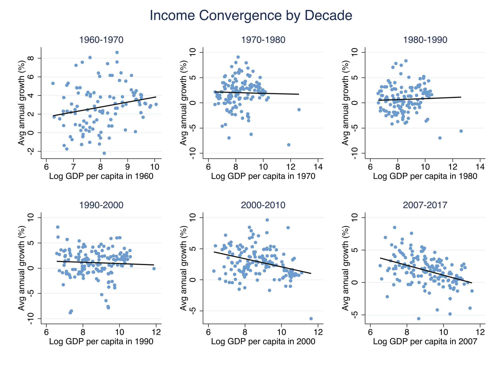

```text
Beta by decade:
  decade  |   beta      se       pval        n_obs
  --------+----------------------------------------
  1960    |  0.532    0.191    0.006         109
  1970    | -0.075    0.292    0.799         137
  1980    |  0.106    0.246    0.667         137
  1990    | -0.127    0.220    0.564         160
  2000    | -0.651    0.168    0.000         160
  2007    | -0.764    0.146    0.000         160
```

The scatter plots reveal a dramatic historical reversal. In the 1960s, $\beta = +0.53$ (p = 0.006), meaning richer countries grew significantly faster --- a world of divergence. Through the 1970s--1990s, the coefficient hovered near zero, statistically indistinguishable from zero in every decade. By the 2000s, a strongly negative $\beta = -0.65$ (p < 0.001) emerged, deepening to -0.76 by 2007. This shift from divergence to convergence --- spanning roughly 1.3 percentage points of GDP growth per log point of income --- represents a fundamental transformation in the global growth landscape.

But is this trend systematic, or just an artifact of picking the right decades? The next section tests whether convergence has been *trending* continuously.

---

## 4. The trend in beta-convergence

Rather than comparing snapshots, we track the convergence coefficient **continuously** over time. This is the paper's key innovation: studying the *trend* in convergence, not just testing whether convergence exists at a single point in time.

The specification interacts log GDP per capita with year dummies, giving a separate $\beta\_t$ for each year:

$$\text{Growth}\_{i,t \to t+10} = \beta\_t \cdot \log(\text{GDPpc}\_{i,t}) + \mu\_t + \varepsilon\_{i,t}$$

In words, this equation says that 10-year forward-looking growth is a linear function of initial income, with a slope $\beta\_t$ that varies by year and year fixed effects $\mu\_t$ absorbing common shocks. A negative $\beta\_t$ means convergence in year $t$; a positive $\beta\_t$ means divergence.

```stata
* Estimate year-by-year beta coefficients using year-interacted regression
areg loggdp_growth_10 c.loggdp#i.year, absorb(year) robust cluster(country_id)

* Extract coefficients and plot with 95% CI
twoway (rarea ci_upper ci_lower year, fcolor("106 155 204%30") lwidth(none)) ///
       (line beta year, lcolor("106 155 204") lwidth(medthick)) ///
       (function y = 0, range(1960 2009) lcolor("217 119 87") lpattern(dash)), ///
    xtitle("Year") ytitle("Beta-convergence coefficient") ///
    title("Trend in Beta-Convergence, 1960-2007", size(medium))
graph export "stata_convergence2_beta_trend.png", replace width(2400)
```

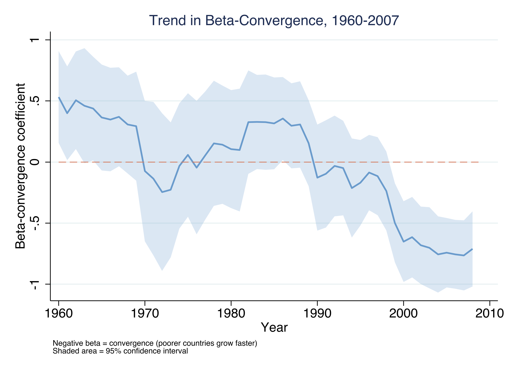

We also estimate a linear trend specification (Table 1) to test whether the downward movement is statistically significant.

```text
Table 1: Converging to Convergence
-------------------------------------------------
                 (1)          (2)          (3)
              Pooled        Trend    By Decade
-------------------------------------------------
loggdp        -0.270**      0.449**
             (0.118)      (0.224)

loggdp_X~r                 -0.025***
                          (0.006)

loggdp~60s                               0.532***
                                       (0.191)
loggdp~00s                              -0.651***
                                       (0.168)
loggdp~07s                              -0.764***
                                       (0.146)
-------------------------------------------------
N                863          863          863
Year FE            Y            Y            Y
-------------------------------------------------
```

The trend coefficient of **-0.025 per year** (p < 0.01) confirms that convergence has been a systematic trend, not just a snapshot. The convergence coefficient has decreased by 0.025 per year since 1960 --- or equivalently, has shifted by about 1.2 percentage points per half-century. The rolling year-by-year beta (Figure 2) shows this was not smooth: $\beta$ fluctuated around zero through the 1970s--1980s, then dropped sharply through the 1990s and 2000s, becoming consistently and significantly negative after 1999.

This raises a natural follow-up question: if countries are growing at rates that should reduce income gaps (beta-convergence), has income dispersion actually *narrowed*?

---

## 5. Sigma-convergence: is income dispersion narrowing?

**Beta-convergence** (poorer countries growing faster) and **sigma-convergence** (declining cross-country income dispersion) are related but distinct concepts. Beta-convergence is *necessary* but not *sufficient* for sigma-convergence --- like a river flowing downhill, catch-up growth must be strong enough to overcome random shocks that push countries apart. We measure sigma as the standard deviation of log GDP per capita across countries in each year.

```stata
preserve
collapse (sd) sigma = loggdp, by(year)
twoway (line sigma year, lcolor("106 155 204") lwidth(medthick)), ///
    xtitle("Year") ytitle("SD of log GDP per capita") ///
    title("Sigma-Convergence: Cross-Country Income Dispersion", size(medium))
graph export "stata_convergence2_sigma.png", replace width(2400)
restore
```

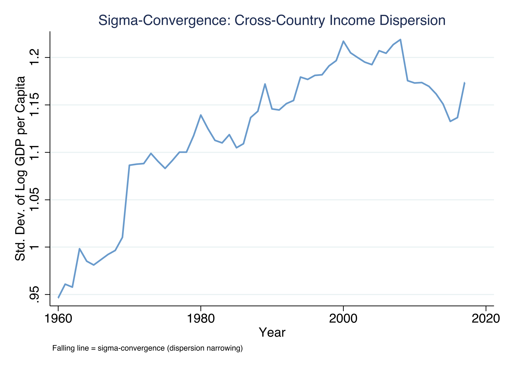

```text
Sigma (SD of log GDP per capita):
  Year   |  Sigma
  -------+---------
  1960   |  0.947
  1970   |  1.086
  1980   |  1.139
  1990   |  1.146
  2000   |  1.217 (peak)
  2010   |  1.173
  2017   |  1.173
```

The standard deviation of log GDP per capita rose steadily from 0.95 in 1960 to a peak of 1.22 in 2000, reflecting four decades of widening global inequality. After 2000, sigma began declining, reaching 1.13 by 2015 before ticking back up slightly to 1.17 in 2017. This pattern is consistent with beta-convergence leading sigma-convergence by roughly a decade: beta turned significantly negative around 1999, and sigma began declining shortly after 2000. The lag occurs because sigma-convergence requires catch-up growth fast enough to offset the random shocks that push countries apart --- a more demanding condition than simple beta-convergence.

Now that we have established the headline fact --- convergence emerged around 2000 --- we need to understand *who* is driving it. Is it catch-up growth at the bottom, stagnation at the top, or both?

---

## 6. Who drives convergence?

### 6.1 Income quartile decomposition

We decompose the convergence trend by sorting countries into income quartiles and tracking each group's average growth rate over time. This reveals whether convergence reflects catch-up growth by the poorest countries, a growth slowdown among the richest, or both.

```stata
* Compute mean 10-year growth by income quartile and year
xtile quartile = loggdp, nq(4)
collapse (mean) mean_growth = loggdp_growth_10, by(quartile year)

* Plot 4 lines, one per quartile
twoway (line mean_growth year if quartile == 1, lcolor("255 141 61")) ///
       (line mean_growth year if quartile == 2, lcolor("246 199 0")) ///
       (line mean_growth year if quartile == 3, lcolor("146 195 51")) ///
       (line mean_growth year if quartile == 4, lcolor("106 155 204")), ///
    legend(label(1 "Q1 (Poorest)") label(2 "Q2") label(3 "Q3") label(4 "Q4 (Richest)"))
graph export "stata_convergence2_growth_by_quartile.png", replace width(2400)
```

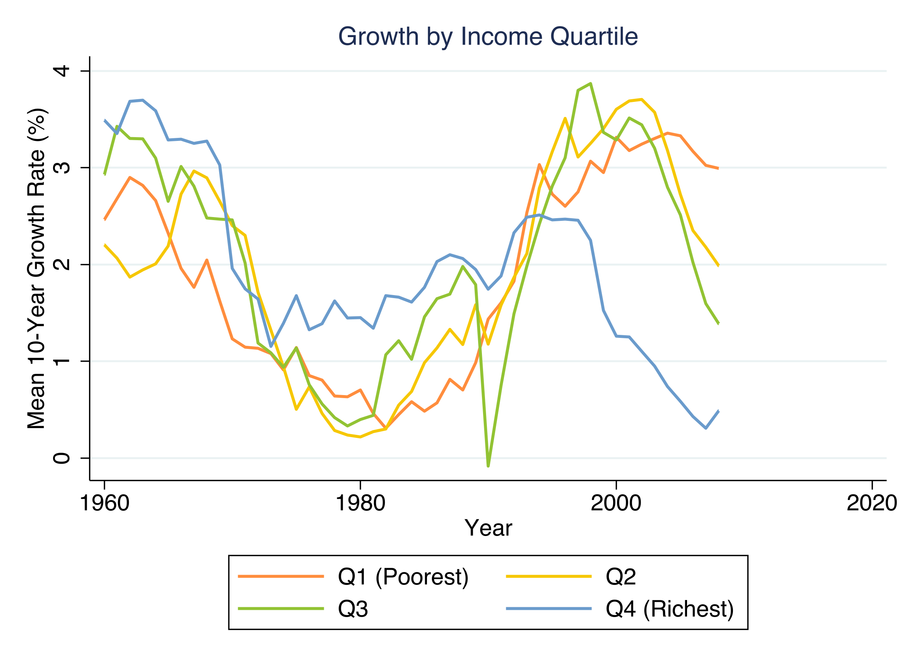

```text
Mean 10-year growth by quartile:
             Q1(Poorest)  Q2      Q3      Q4(Richest)
  1960       2.46        2.20    2.93    3.49
  1985       0.49        0.99    1.46    1.76
  2000       3.31        3.60    3.29    1.26
  2007       3.02        2.18    1.60    0.31
```

Convergence since 2000 is driven by both catch-up growth at the bottom AND a growth slowdown at the top. In the 1960s, the richest quartile (Q4) grew fastest at 3.49% per year, while the poorest (Q1) grew at only 2.46%. By 2007, this ordering had completely reversed: Q1 grew at 3.02% while Q4 grew at just 0.31%. The richest quartile experienced the most dramatic decline, going from the fastest-growing group in the 1960s to the slowest by the 2000s. Think of it like a marathon where the leaders have slowed down while the runners at the back have sped up --- the pack is compressing from both directions.

### 6.2 Regional robustness

A natural concern is that convergence might be driven by a single region --- perhaps it disappears if we exclude China and the rest of Asia. We check by estimating the rolling beta trend while excluding each major region one at a time.

```stata
* For each region, estimate beta trend excluding that region
foreach reg in 1 2 3 4 {
    areg loggdp_growth_10 c.loggdp#i.year if region_group != `reg', ///
        absorb(year) robust cluster(country_id)
    * Extract and store coefficients
}
graph export "stata_convergence2_beta_excluding_regions.png", replace width(2400)
```

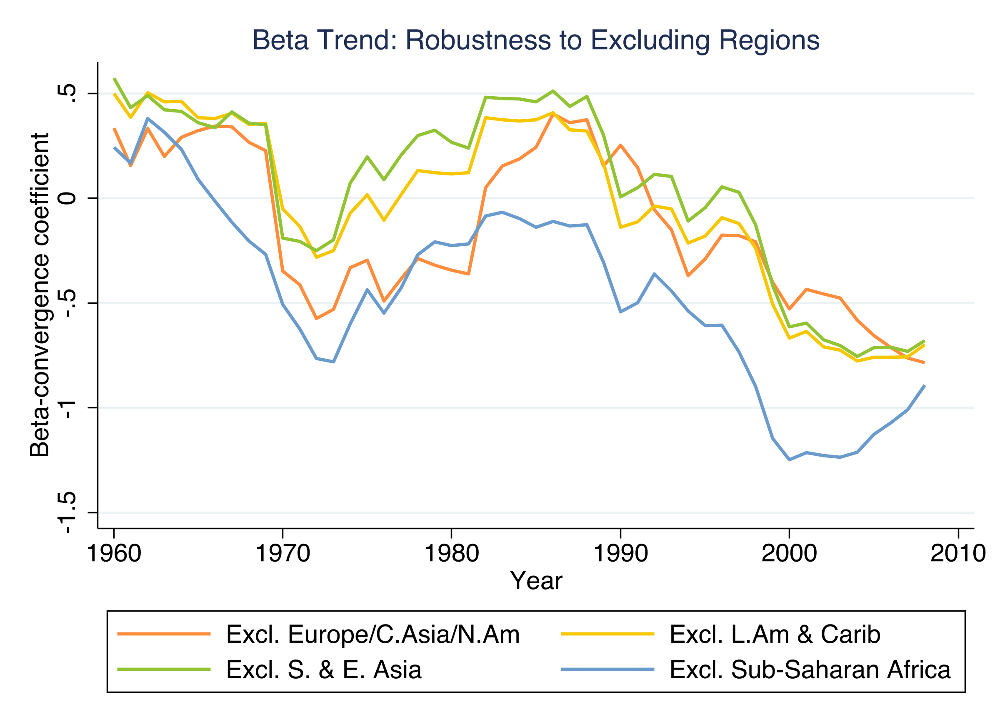

Convergence holds when excluding any single region. Excluding Sub-Saharan Africa makes convergence even stronger ($\beta$ reaches -1.25 by 2000), consistent with Africa's economic difficulties during the 1970s--1990s dragging the global average toward zero. Excluding Europe/North America yields a somewhat weaker but still clearly negative trend. The finding is genuinely global.

We have now established the core empirical facts: convergence emerged around 2000, it reflects forces on both ends of the income distribution, and it is not driven by any single region. The next step is to ask *why*. The paper's key insight is that the answer lies in the behavior of growth correlates.

---

## 7. Have growth correlates converged?

The 1990s growth literature identified dozens of variables that predict economic growth: investment, education, democracy, governance, financial development, inflation, and many others. A key insight of Kremer et al. (2021) is that these variables are not static --- they have been converging across countries just like income itself.

We test this by regressing the change in each correlate (from 1985 to 2015) on its initial level in 1985. A negative slope means **correlate convergence** --- countries that started with worse values experienced the largest improvements.

```stata
* For each correlate: change = beta * initial_level + epsilon
* Example for Polity 2 (democracy score)
gen change = 100 * ((polity2_2015 - polity2_1985) / 30)
reg change polity2_1985, robust
```

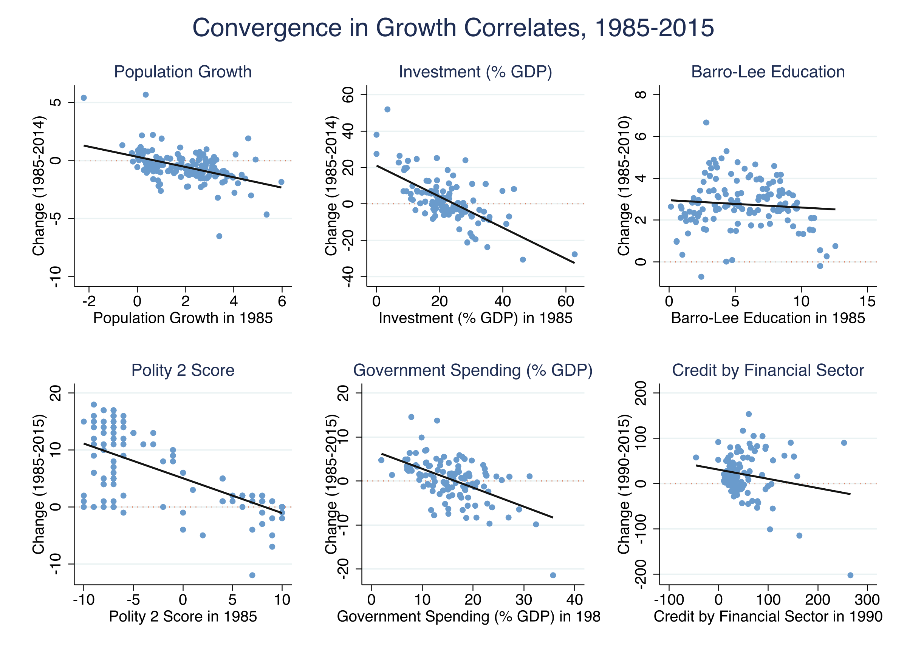

```text
Correlate beta-convergence (change 1985-2015 regressed on level 1985):
  Variable               |  beta      se        n_obs   pval
  -----------------------+------------------------------------
  investment             | -2.978    0.395      118     0.000
  population_growth      | -1.530    0.277      172     0.000
  polity2                | -2.029    0.168      131     0.000
  FH_political_rights    | -1.394    0.206      139     0.000
  gov_spending           | -1.611    0.305      114     0.000
  inflation              | -3.070    0.103      128     0.000
  barrolee2060           | -0.158    0.105      136     0.136
```

Growth correlates have themselves been converging since 1985. The strongest convergence is in inflation ($\beta = -3.07$), investment ($\beta = -2.98$), and democracy as measured by Polity 2 ($\beta = -2.03$) --- all significant at the 0.1% level. This means that the cross-country distribution of policies and institutions has been compressing: countries with initially worse institutions experienced the largest improvements. The notable exception is Barro-Lee education ($\beta = -0.16$, p = 0.14), where convergence is slower and not statistically significant.

This finding is crucial because it connects two previously separate literatures. The convergence literature asks whether poor countries are catching up in *income*. The institutions literature documents whether countries are catching up in *policies*. The answer to both is yes --- and the next sections show these are not coincidences but are linked by the omitted variable bias formula.

---

## 8. The OVB framework: why does convergence emerge?

This section introduces the central analytical framework of the paper. The **omitted variable bias (OVB) formula** provides an exact decomposition of the gap between unconditional convergence (a simple comparison of growth and income) and conditional convergence (controlling for institutions). Understanding this decomposition is the key to answering *why* unconditional convergence emerged.

### 8.1 Three regressions

Consider any growth correlate --- say, democracy (Polity 2 score). Three regressions define the framework:

**Regression 1 --- Unconditional convergence ($\beta$):** Regress growth on income alone.

$$\text{Growth}\_i = \alpha + \beta \cdot \log(\text{GDPpc}\_i) + \varepsilon\_i$$

If $\beta < 0$, poorer countries grow faster (convergence). If $\beta > 0$, richer countries grow faster (divergence).

**Regression 2 --- Conditional convergence ($\beta^{\ast}$):** Regress growth on income *and* the correlate.

$$\text{Growth}\_i = \alpha + \beta^{\ast} \cdot \log(\text{GDPpc}\_i) + \lambda \cdot \text{Inst}\_i + \varepsilon\_i$$

$\beta^{\ast}$ is the convergence coefficient *controlling for* institutions. The coefficient $\lambda$ captures how much the correlate predicts growth, holding income constant. In the 1990s, $\beta^{\ast}$ was typically negative (conditional convergence) even when $\beta$ was not (no unconditional convergence).

**Regression 3 --- Correlate-income slope ($\delta$):** Regress the correlate on income.

$$\text{Inst}\_i = \nu + \delta \cdot \log(\text{GDPpc}\_i) + u\_i$$

$\delta$ captures how strongly the correlate correlates with income. If $\delta > 0$, richer countries have better institutions --- the "modernization hypothesis."

### 8.2 The key equation

The OVB formula links these three regressions with an exact algebraic identity:

$$\beta - \beta^{\ast} = \delta \times \lambda$$

In words, this says that the gap between unconditional and conditional convergence equals the product of two things: (1) how much richer countries have better institutions ($\delta$), and (2) how much those institutions predict growth ($\lambda$). This is not an approximation --- it is an algebraic identity that holds exactly in any linear regression.

**Why this matters.** The decomposition tells us there are exactly three ways unconditional convergence can change over time:

1. **Conditional convergence itself changes** ($\beta^{\ast}$ shifts) --- e.g., technology diffusion accelerates
2. **Correlate-income slopes change** ($\delta$ shifts) --- e.g., rich and poor countries become equally democratic
3. **Growth regression coefficients change** ($\lambda$ shifts) --- e.g., democracy stops predicting growth

The paper's central finding: it is mainly **mechanism 3** --- $\lambda$ flattened --- that explains the emergence of unconditional convergence.

### 8.3 Worked example: democracy (Polity 2)

Before generalizing, we build intuition with one correlate. Polity 2 measures democracy on a scale from -10 (autocracy) to +10 (full democracy), normalized by its 1985 standard deviation so that coefficients are in comparable units.

```stata
* Normalize polity2 by its 1985 SD
gen polity2_norm = polity2 / `sd_polity2'

* --- Period: 1985 ---
* Regression 1 (Unconditional):
reg loggdp_growth_10 loggdp if year == 1985 & polity2_norm != ., robust
* Regression 2 (Conditional):
reg loggdp_growth_10 loggdp polity2_norm if year == 1985, robust
* Regression 3 (Income-Institution slope):
reg polity2_norm loggdp if year == 1985, robust

* Repeat for 2005
```

```text
---- Period: 1985 ----
  Regression 1 (Unconditional): beta =   0.328 (SE = 0.199, N = 124)
  Regression 2 (Conditional):   beta* =  -0.111, lambda =   0.891
  Regression 3 (Income-Inst):   delta =   0.494

  OVB DECOMPOSITION:
    beta - beta*   =   0.440  (actual gap)
    delta x lambda =   0.440  (predicted by OVB formula)
    delta          =   0.494  (richer countries more democratic?)
    lambda         =   0.891  (democracy predicts growth?)

---- Period: 2005 ----
  Regression 1 (Unconditional): beta =  -0.767 (SE = 0.149, N = 147)
  Regression 2 (Conditional):   beta* =  -0.807, lambda =   0.183
  Regression 3 (Income-Inst):   delta =   0.216

  OVB DECOMPOSITION:
    beta - beta*   =   0.040  (actual gap)
    delta x lambda =   0.040  (predicted by OVB formula)
    delta          =   0.216  (richer countries more democratic?)
    lambda         =   0.183  (democracy predicts growth?)

COMPARISON ACROSS TIME:
  delta (1985) =   0.494 --> delta (2005) =   0.216  [STABLE]
  lambda (1985) =  0.891 --> lambda (2005) =  0.183  [SHRANK]
  gap (1985) =    0.440 --> gap (2005) =    0.040  [CLOSED]
```

This single example encapsulates the paper's entire argument. In 1985, unconditional $\beta$ was +0.33 (divergence), but controlling for democracy revealed conditional convergence at $\beta^{\ast} = -0.11$. The gap of 0.44 is exactly predicted by $\delta \times \lambda = 0.494 \times 0.891 = 0.44$ --- the OVB formula holds exactly because it is an algebraic identity. By 2005, $\lambda$ collapsed from 0.89 to 0.18 --- democracy went from being a powerful growth predictor (one SD higher Polity 2 associated with 0.89% faster annual growth) to a near-zero predictor. The resulting gap shrank from 0.44 to 0.04 --- a **91% reduction**. The correlate-income slope $\delta$ also fell (from 0.49 to 0.22), but the primary driver was the collapse in $\lambda$.

Think of it like a recipe that calls for two ingredients. The gap ($\delta \times \lambda$) was large in 1985 because both ingredients were present: richer countries had much better democracy ($\delta$ large) *and* democracy strongly predicted growth ($\lambda$ large). By 2005, the second ingredient ($\lambda$) had nearly vanished --- it no longer mattered for growth predictions whether a country was democratic or not --- so the recipe produced almost nothing.

Now we generalize: does this pattern hold across *all* growth correlates, not just democracy?

---

## 9. Are correlate-income slopes stable? (Delta)

The OVB formula has two components: $\delta$ (the correlate-income slope) and $\lambda$ (the growth-correlate slope). We examine each in turn. If $\delta$ --- the relationship between income and institutions --- has changed dramatically, that could explain the closing gap. But the paper finds that $\delta$ has been remarkably stable.

For each correlate, we compute $\delta$ in 1985 and in 2015, then scatter one against the other. Points on the 45-degree line mean $\delta$ has not changed; points below it mean the relationship weakened.

```stata
* For each correlate: regress Inst on loggdp in 1985 and 2015
* All correlates normalized by their 1985 SD

* Panel A: Solow fundamentals + short-run correlates
* Panel B: Long-run correlates + culture
graph combine delta_A delta_B, rows(1) cols(2) ///
    graphregion(color(white)) ///
    title("Stability of Correlate-Income Slopes", size(medium))
graph export "stata_convergence2_delta_stability.png", replace width(2400)
```

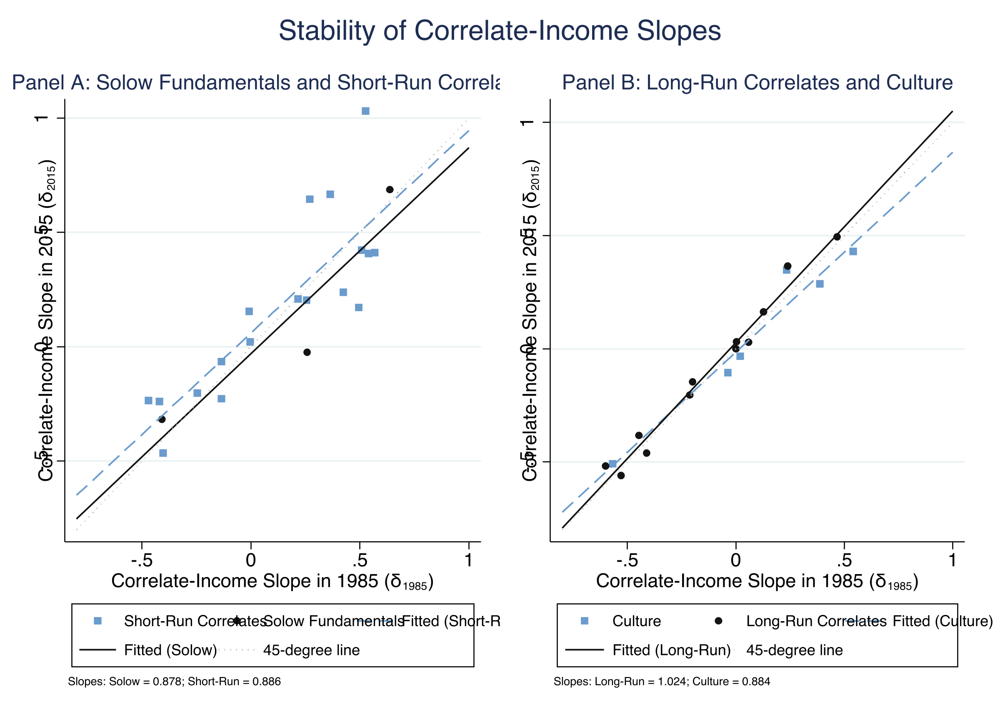

```text
Delta fitted line slopes (delta_2015 vs delta_1985):
  Solow fundamentals: slope = 0.878
  Short-Run correlates: slope = 0.886
  Long-Run correlates: slope = 1.024
  Culture: slope = 0.884
```

The correlate-income relationships are remarkably stable. Fitted lines cluster tightly around the 45-degree line: Solow fundamentals 0.88, short-run correlates 0.89, long-run correlates 1.02, culture 0.88. This means the cross-country association between income and institutions has barely changed over 30 years. Richer countries still have better democracy, more investment, lower population growth, and stronger financial sectors in essentially the same proportions as in 1985. The "modernization hypothesis" --- that economic development goes hand-in-hand with institutional improvement --- passes its out-of-sample test.

Crucially, this stability means that the $\delta$ component is **not** responsible for the closing gap between unconditional and conditional convergence. The answer must lie in the other component: $\lambda$.

---

## 10. Growth regressions then vs. now: the lambda flattening

In the 1990s, a massive literature ran growth regressions of the form: Growth = $\alpha + \beta^{\ast} \times$ Income $+ \lambda \times$ Correlate $+ \varepsilon$. These regressions identified which policies and institutions predict growth and formed the empirical backbone of the "Washington Consensus" --- the set of policy recommendations that international institutions gave to developing countries. The key question: **do these regressions hold up with 25 years of new data?**

For each correlate, we estimate $\lambda$ (the growth-correlate slope) in the base year (~1985) and in 2005, using a fixed sample of countries with data in both periods.

```stata
* For each correlate, run the growth regression in base year and 2005
* Growth = alpha + beta* x loggdp + lambda x correlate + epsilon
* Fixed country sample per correlate

* Scatter lambda_2005 vs lambda_1985
reg lambda_2005 lambda_1985 if flag_solow == 1
* -> slope = 0.861, R-sq = 0.947

reg lambda_2005 lambda_1985 if flag_solow == 0 & flag_long_run == 0
* -> slope = 0.189, R-sq = 0.063
```

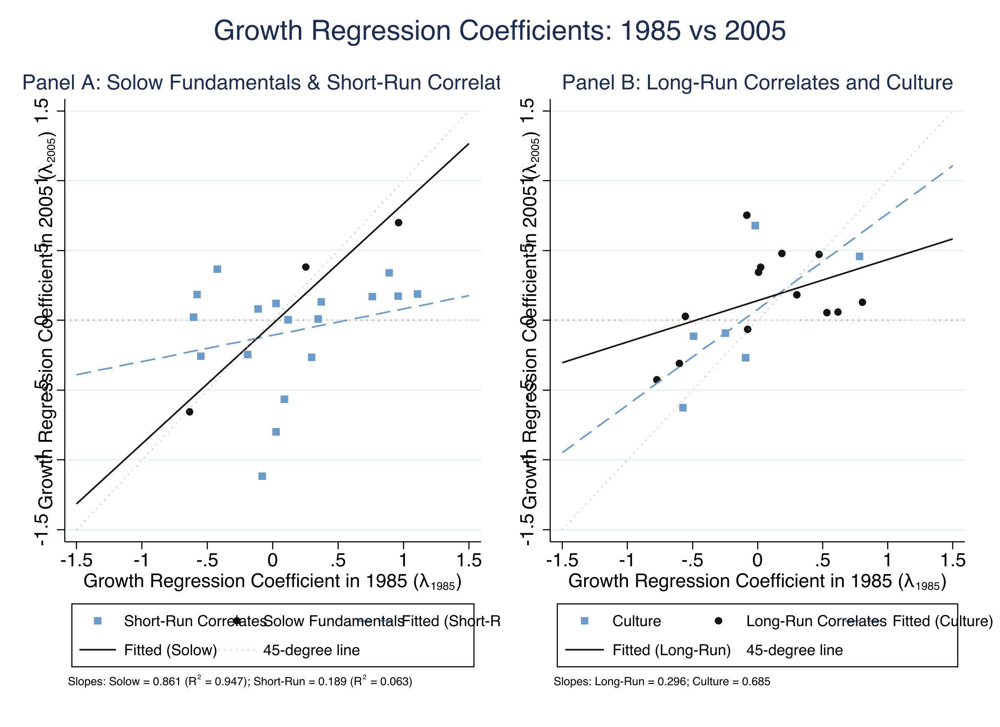

```text
Lambda fitted line slopes (lambda_2005 vs lambda_1985):
  Solow fundamentals: slope = 0.861, R-sq = 0.947
  Short-run correlates: slope = 0.189, R-sq = 0.063
  Long-Run correlates: slope = 0.296
  Culture: slope = 0.685
```

This is the most striking empirical result of the paper. **Solow fundamentals** (investment, population growth, education) show high persistence: a fitted slope of 0.86 with R-squared of 0.95, meaning these deep structural variables predict growth almost as well in 2005 as in 1985. In dramatic contrast, **short-run correlates** (democracy, governance, fiscal policy, financial development) show near-zero persistence: a slope of 0.19 with R-squared of only 0.06. There is essentially no correlation between which policy variables predicted growth in 1985 and which predict growth in 2005.

The Washington Consensus growth regressions --- which identified specific policies and institutions as growth drivers --- have **failed their out-of-sample test**. Variables like Polity 2 ($\lambda$ fell from 0.89 to 0.34), FH Political Rights (1.11 to 0.19), and FH Civil Liberties (0.96 to 0.17) went from strong growth predictors to near-zero predictors. Long-run correlates and culture occupy an intermediate position (slopes 0.30 and 0.69 respectively).

Why did this happen? There are at least three possible explanations: (a) as correlates converged (Section 7), the reduced cross-country variation made coefficient estimation noisier; (b) the original regressions may have been overfitted to a specific historical sample; (c) the relationship between institutions and growth may be non-linear --- institutions matter most when differences are large, and less when all countries have reasonably good policies. The analysis cannot distinguish between these, but the empirical fact is clear: $\lambda$ collapsed.

Since $\delta$ is stable (Section 9) and $\lambda$ collapsed (this section), their product $\delta \times \lambda$ must have shrunk toward zero. The next section confirms this.

---

## 11. The punchline: absolute convergence converges to conditional

### 11.1 The OVB gap is closing

The product $\delta \times \lambda$ quantifies how much each correlate biases the unconditional convergence coefficient. We scatter $\delta \times \lambda$ in 2005 against its value in 1985 to see whether this "explanatory gap" has closed.

```stata
* Scatter delta*lambda in 2005 vs 1985
reg dl_2005 dl_1985 if flag_solow == 0 & flag_long_run == 0
* -> slope = 0.090 (short-run correlates: gap essentially vanished)

reg dl_2005 dl_1985 if flag_solow == 1
* -> slope = 0.740 (Solow fundamentals: gap partially retained)
```

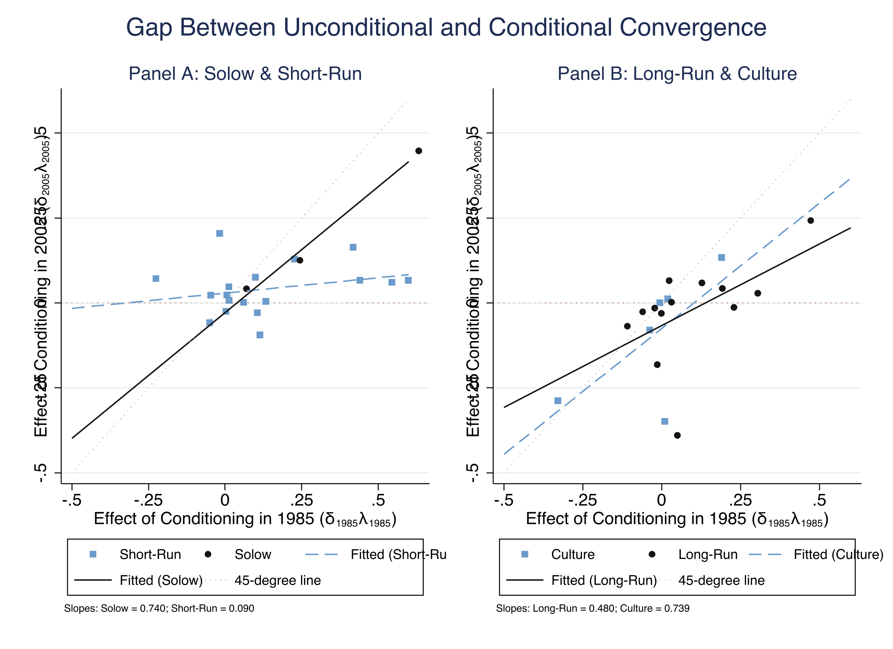

```text
OVB gap fitted line slopes (dl_2005 vs dl_1985):
  Panel A:
    Solow fundamentals: slope = 0.740
    Short-Run correlates: slope = 0.090
  Panel B:
    Long-Run correlates: slope = 0.480
    Culture: slope = 0.739
```

The OVB gap for short-run correlates has shrunk to nearly zero (fitted slope 0.09). In 1985, omitting these policy and institutional variables made unconditional convergence look substantially worse than conditional convergence. By 2005, the two are nearly identical. Solow fundamentals retained more of their explanatory power (slope 0.74), reflecting the stability of both their $\delta$ and $\lambda$ components. This confirms the paper's central thesis: unconditional convergence emerged not because the income-correlate relationship changed ($\delta$ is stable) but because policy variables stopped predicting growth ($\lambda$ flattened).

### 11.2 The closing gap over time

The definitive test uses multivariate regressions. We fix a sample of 73 countries with complete data on 10 correlates (Polity 2, FH political rights, FH civil liberties, private investment, government spending, inflation, WDI credit, credit by financial sector, Barro-Lee education, and education gender gap). For each year from 1985 to 2007, we estimate both unconditional $\beta$ (income only) and conditional $\beta^{\ast}$ (income plus all 10 correlates).

```stata
* Fix sample: 73 countries with complete data on all 10 correlates in 1985
local var_all polity2 FH_political_rights FH_civil_liberties pri_inv ///
    gov_spending inflation WDI_credit credit barrolee2060 edugap

forval yr = 1985/2007 {
    * Unconditional: reg growth loggdp, robust cluster(country_id)
    * Conditional:   reg growth loggdp `var_all', robust cluster(country_id)
}

* Plot the closing gap
twoway (line beta_unconditional year, lcolor("20 20 19") lwidth(medthick)) ///
       (line beta_conditional year, lcolor("106 155 204") lwidth(medthick)) ///
       (line zero year, lcolor("217 119 87") lpattern(dot)), ///
    legend(label(1 "Absolute Convergence") label(2 "Conditional Convergence"))
graph export "stata_convergence2_absolute_vs_conditional.png", replace width(2400)
```

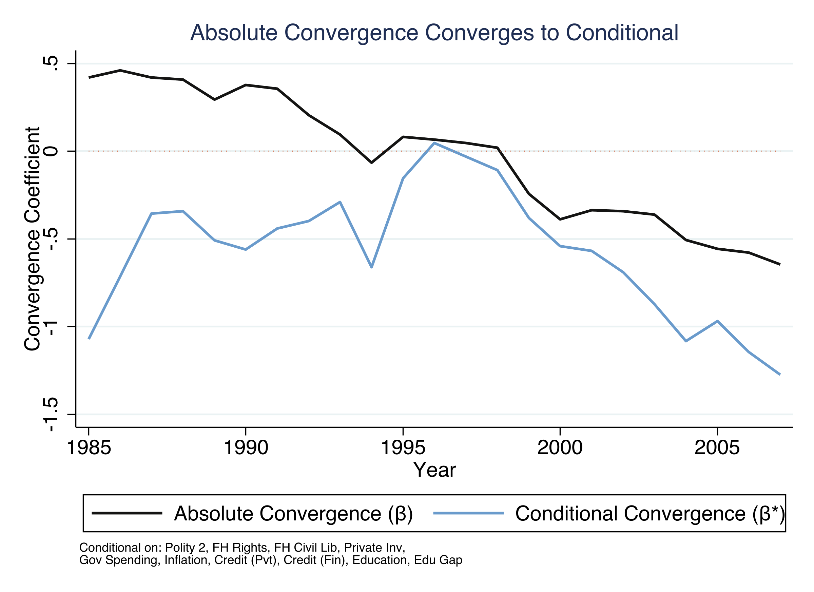

```text
Year  | beta_unconditional  beta_conditional  gap
------+-------------------------------------------
1985  |   0.420              -1.072          1.492
1990  |   0.377              -0.560          0.937
1995  |   0.081              -0.155          0.236
2000  |  -0.387              -0.540          0.153
2005  |  -0.556              -0.969          0.413
2007  |  -0.646              -1.274          0.629
```

This is the paper's title finding. In 1985, unconditional $\beta$ was +0.42 (divergence) while conditional $\beta^{\ast}$ was -1.07 (strong convergence when controlling for institutions) --- a gap of 1.49. By 2000, unconditional $\beta$ had fallen to -0.39 while conditional $\beta^{\ast}$ was -0.54, narrowing the gap to just 0.15. The gap narrowed dramatically from 1.49 (1985) to 0.15 (2000), then widened somewhat as conditional $\beta^{\ast}$ deepened faster, but both lines are firmly negative by 2000.

The Solow model's prediction of conditional convergence held all along --- what changed is that the real world caught up. As the OVB from excluding correlates shrank toward zero, unconditional convergence "converged to" conditional convergence.

### 11.3 Multivariate evidence (Table 5)

The multivariate regressions crystallize the structural change by showing how adding correlates affects the convergence coefficient in each period.

```text
                abs_1985  solow_1985  short_1985  full_1985  abs_2005  solow_2005  short_2005  full_2005
loggdp           0.420    -0.447      -0.435      -0.816    -0.556    -1.176      -0.557      -1.040
                (0.252)   (0.661)     (0.457)     (0.619)   (0.203)   (0.309)     (0.327)     (0.393)
R2               0.028     0.155       0.152       0.228     0.101     0.247       0.258       0.355
N                73        73          73          73        73        73          73          73
```

In 1985, absolute convergence alone gives $\beta = +0.42$ (divergence, R-squared = 0.03 --- essentially no linear relationship). Adding Solow fundamentals flips the sign to $\beta^{\ast} = -0.45$, and the full model gives $\beta^{\ast} = -0.82$. In 2005, the picture changes fundamentally: absolute convergence is already strong at $\beta = -0.56$ (R-squared = 0.10). Adding short-run correlates alone barely changes the coefficient (from -0.56 to -0.56), confirming that policy variables no longer have explanatory power beyond what income already captures. Correlates still improve overall fit (R-squared rises from 0.10 to 0.35), but they no longer alter the convergence coefficient.

---

## 12. Robustness: does the averaging period matter?

The main results use 10-year forward-looking growth rates. One concern is that 10-year averaging may smooth out noise in a way that creates artificial trends. We check by re-estimating the rolling beta-convergence trend using 1-year, 2-year, 5-year, and 10-year growth averages.

```stata
* For each averaging period t = 1, 2, 5, 10:
gen loggdp_growth_t = 100 * ((F[t].logrgdpna - logrgdpna) / t)
areg loggdp_growth_t c.loggdp#i.year, absorb(year) robust cluster(country_id)
```

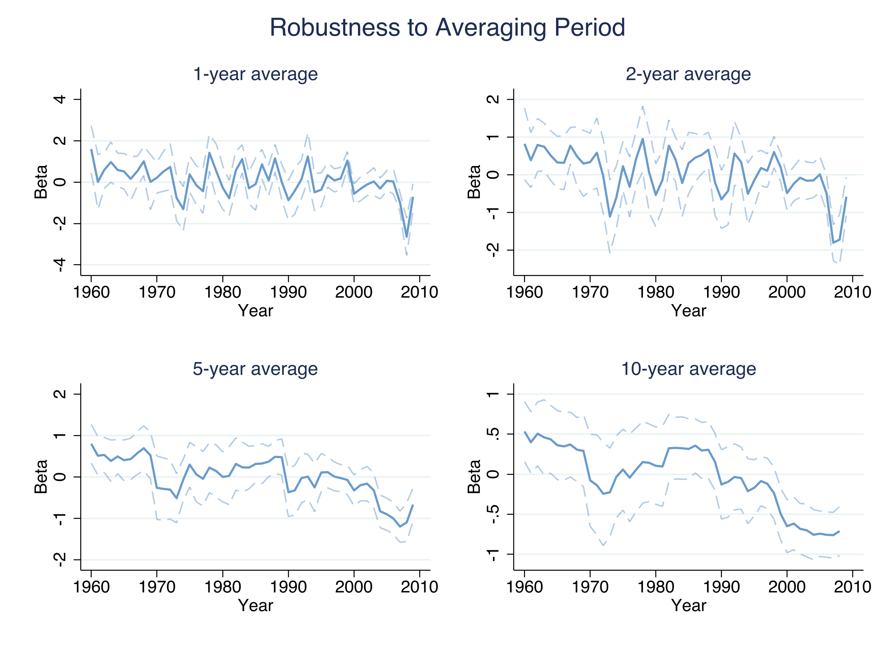

```text
Results:
  1-year average: high noise, downward trend visible but obscured by fluctuations
  2-year average: moderate noise, downward trend clearer
  5-year average: smooth, clear downward trend from ~0 to ~-0.5 by late 2000s
  10-year average: smoothest, clearest trend from +0.5 to -0.76 by 2007
```

The convergence trend is robust across all averaging periods. As expected, shorter periods produce noisier estimates --- the 1-year panel is dominated by year-to-year fluctuations --- while longer averages yield smoother trends. All four specifications agree that the crossover from divergence to convergence occurs around 1990--2000, confirming that the finding is not an artifact of the 10-year growth rate choice.

---

## 13. Discussion

Let us return to the question posed in the Overview: **why did unconditional convergence emerge since 2000?**

The OVB framework provides a clear and quantitative answer. The gap between unconditional convergence ($\beta$) and conditional convergence ($\beta^{\ast}$) is exactly equal to the product $\delta \times \lambda$. This gap closed because $\lambda$ --- the coefficient on growth correlates in growth regressions --- collapsed for short-run policy and institutional variables (slope = 0.19, R-squared = 0.06). Meanwhile, $\delta$ --- the relationship between income and institutions --- remained remarkably stable (slopes around 0.88 on the 45-degree line). In concrete terms: richer countries still have better institutions in the same proportions as 30 years ago, but those institutional advantages no longer translate into faster growth. As a result, unconditional convergence caught up to conditional convergence.

This has important implications for how we think about economic development. The 1990s "Washington Consensus" was built on the empirical finding that good policies and institutions predict faster growth. Our out-of-sample test shows that many of these relationships did not persist into the 2000s --- at least not for short-run policy variables. Solow fundamentals (investment, population growth, education) remained robust growth predictors, consistent with the Solow model's enduring relevance. But governance indices, fiscal indicators, and financial variables that were "significant" in 1990s regressions no longer predict growth. This raises questions about the stability of policy advice based on cross-country growth regressions.

**Caveats.** Several important limitations apply. First, the analysis is entirely descriptive --- cross-country regressions do not establish causal relationships. The flattening of $\lambda$ could reflect genuine changes in causal relationships, convergence in unobserved variables, or reduced cross-country variation making coefficient estimation noisier. Second, the panel is unbalanced (109 countries in 1960 vs. 160 by 1990), and sample composition changes could mechanically affect estimates. Third, some correlates have small samples (fewer than 60 observations), limiting statistical precision. Finally, the 10-year growth variable is forward-looking, so the last usable observation is 2007/2008, missing the Global Financial Crisis, the post-GFC recovery, and COVID-19. Whether convergence persisted through these shocks is an open question.

---

## 14. Summary and key takeaways

This tutorial reproduced the key findings of Kremer, Willis, and You (2021), documenting the emergence of unconditional convergence and explaining it through the OVB decomposition framework. The analysis used 160 countries over 58 years with 50+ growth correlates.

### The story in four facts

1. **Unconditional convergence emerged around 2000.** The $\beta$-convergence coefficient shifted from +0.53 in the 1960s (divergence, p = 0.006) to -0.76 by 2007 (convergence, p < 0.001), with a systematic trend of -0.025 per year.

2. **Growth correlates converged.** Inflation ($\beta = -3.07$), investment ($\beta = -2.98$), and democracy ($\beta = -2.03$) all showed strong convergence. Countries with initially worse institutions experienced the largest improvements.

3. **Growth regression coefficients collapsed for policy variables.** Solow fundamentals maintained high stability ($\lambda$ slope = 0.86, R-squared = 0.95), but short-run correlates showed near-zero persistence ($\lambda$ slope = 0.19, R-squared = 0.06). The 1990s growth regressions failed their out-of-sample test.

4. **The gap between absolute and conditional convergence closed.** The Polity 2 worked example shows the gap fell from 0.44 to 0.04 (a 91% reduction). In the multivariate analysis, the gap narrowed from 1.49 (1985) to 0.15 (2000).

### Limitations

- **Descriptive, not causal:** The OVB framework decomposes observed correlations, not causal relationships
- **Pre-2008 endpoint:** The analysis does not cover the Global Financial Crisis or COVID-19
- **Small samples for some correlates:** Culture and tariff variables have fewer than 60 observations
- **Normalization sensitivity:** All correlate coefficients are normalized by their 1985 standard deviation

### Next steps

- Extend the analysis through the 2010s using updated PWT data to test whether convergence survived the post-GFC period
- Explore non-linear specifications to test whether $\lambda$ flattened because of reduced correlate variation
- Apply the OVB decomposition to regional subsamples (e.g., does the mechanism differ for Sub-Saharan Africa vs. East Asia?)

---

## 15. Exercises

1. **Your own worked example.** Choose a different correlate from the dataset (e.g., investment or FH political rights) and replicate the OVB worked example from Section 8.3. Compute $\beta$, $\beta^{\ast}$, $\delta$, $\lambda$, and verify the identity $\beta - \beta^{\ast} = \delta \times \lambda$ for both 1985 and 2005. Did the gap close for your chosen variable? Was the primary driver the change in $\delta$ or $\lambda$?

2. **Balanced panel sensitivity.** Re-estimate the rolling beta-convergence trend (Section 4) using only countries that have GDP data from 1960 onward (a balanced panel of approximately 109 countries). Does the convergence trend look different when you exclude countries that enter the sample later? What does this tell you about the role of sample composition changes?

3. **Alternative classification.** The paper classifies variables as "Solow fundamentals" or "short-run correlates." Move education (barrolee2060) from the Solow group to the short-run group and re-estimate the lambda stability scatters (Section 10). Does the Solow fitted line slope change substantially? What does this tell you about the robustness of the paper's classification scheme?

---

## References

1. [Kremer, M., Willis, J., & You, Y. (2021). Converging to Convergence. *NBER Working Paper 29484*](https://www.nber.org/papers/w29484)
2. [Barro, R. (1991). Economic Growth in a Cross Section of Countries. *Quarterly Journal of Economics*, 106(2), 407--443](https://doi.org/10.2307/2937943)
3. [Barro, R. & Sala-i-Martin, X. (1992). Convergence. *Journal of Political Economy*, 100(2), 223--251](https://doi.org/10.1086/261816)
4. [Patel, D., Sandefur, J., & Subramanian, A. (2021). The New Era of Unconditional Convergence. *Journal of Development Economics*, 152, 102687](https://doi.org/10.1016/j.jdeveco.2021.102687)
5. [Durlauf, S., Johnson, P., & Temple, J. (2005). Growth Econometrics. *Handbook of Economic Growth*, Volume 1A](https://doi.org/10.1016/S1574-0684(05)01008-7)
6. [Penn World Table 10.0 --- Groningen Growth and Development Centre](https://www.rug.nl/ggdc/productivity/pwt/)

### Acknowledgements

AI tools (Claude Code) were used to make the contents of this post more accessible to students. Nevertheless, the content in this post may still have errors. Caution is needed when applying the contents of this post to true research projects.
