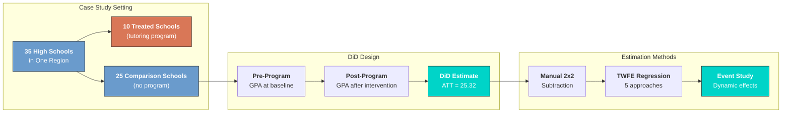
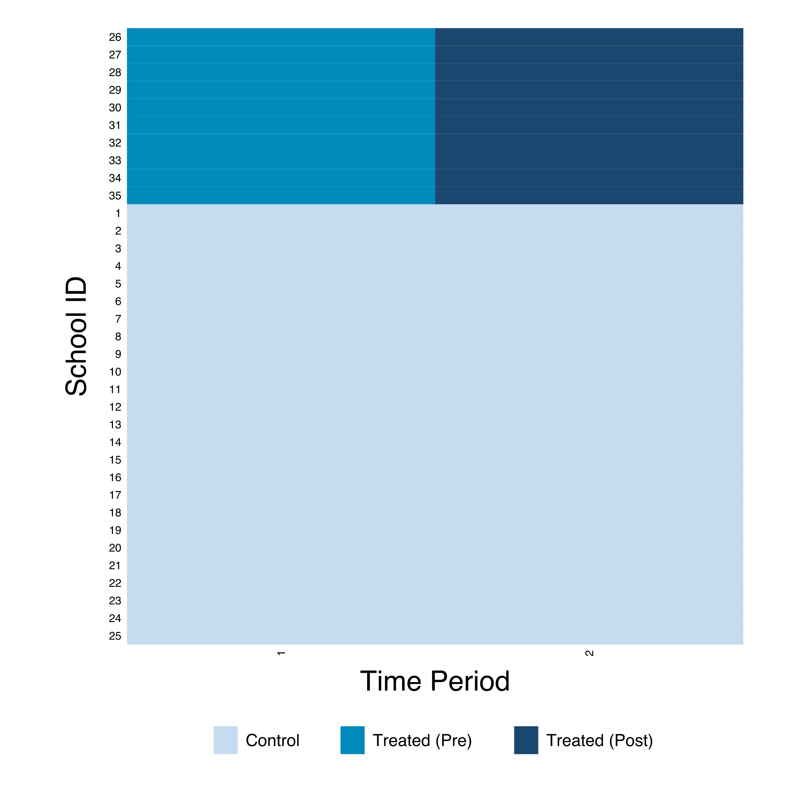
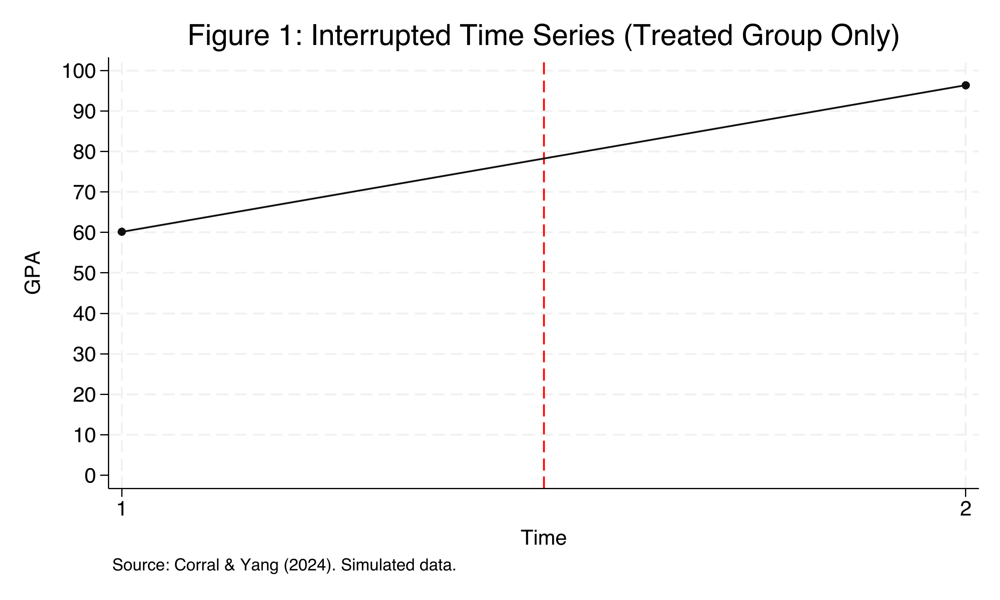
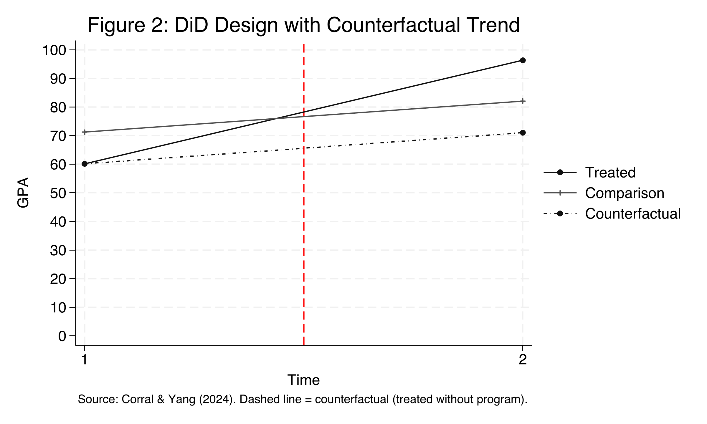
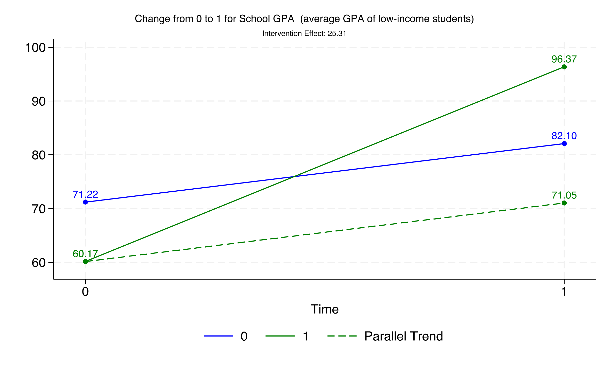
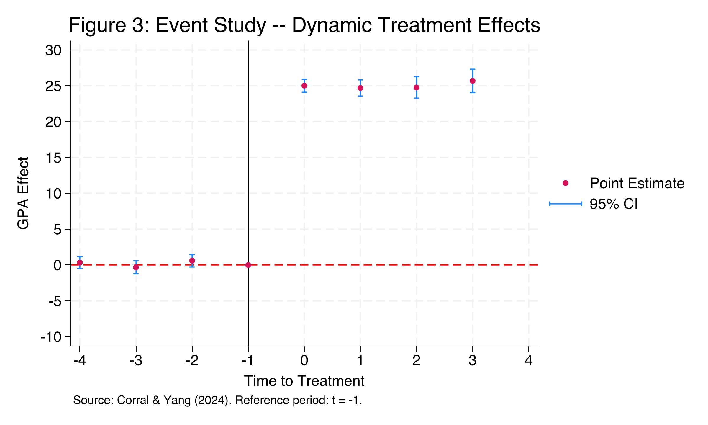

---
authors:
- admin
categories:
  - Stata
  - Difference-in-Differences (DiD)
date: "2026-04-25T00:00:00Z"
draft: false
featured: false
image:
  caption: ""
  focal_point: "Smart"
  placement: 3
  preview_only: false
links:
- icon: laptop-code
  icon_pack: fas
  name: "Web app"
  url: web_app/index.html
- icon: file-code
  icon_pack: fas
  name: Stata do-file
  url: post/stata_did/analysis.do
- icon: database
  icon_pack: fas
  name: Dataset (2x2)
  url: https://github.com/quarcs-lab/data-open/raw/master/isds/tutoring_did.dta
- icon: database
  icon_pack: fas
  name: Dataset (Event Study)
  url: https://github.com/quarcs-lab/data-open/raw/master/isds/tutoring_didevent.dta
- icon: file-alt
  icon_pack: fas
  name: Stata log
  url: post/stata_did/analysis.log
- icon: podcast
  icon_pack: fas
  name: AI Podcast
  url: "/post/stata_did/#podcast-player"
- icon: youtube
  icon_pack: fab
  name: AI Video
  url: "/post/stata_did/#video-player"
- icon: markdown
  icon_pack: fab
  name: "MD version"
  url: https://raw.githubusercontent.com/cmg777/starter-academic-v501/master/content/post/stata_did/index.md
summary: "Learn Difference-in-Differences (DiD) in Stata using a case study of an after-school tutoring program. Covers the 2x2 design, TWFE regression, event studies, and parallel trends testing based on Corral and Yang (2024)."
tags:
- stata
- causal
- did
- panel
- education
- panel data
title: "Introduction to Difference-in-Differences (DiD) in Stata"
toc: true
diagram: true
---

## Overview

How can we evaluate whether a government program actually works when a randomized controlled trial (RCT) is not feasible? Education researchers frequently face this challenge: a new policy is rolled out in some schools but not others, and we need to know whether it made a difference. **Difference-in-Differences (DiD)** is one of the most widely used quasi-experimental designs for answering this kind of causal question.

In this tutorial, we introduce the DiD method through a case study based on Corral and Yang (2024). A fictitious government implements an after-school tutoring program in 10 of 35 high schools to improve the GPA of low-income students. We compare these treated schools against 25 comparison schools that did not receive the program. Our goal is to estimate the **Average Treatment Effect on the Treated (ATT)** --- by how many GPA points did the program improve academic performance?

We progress from a naive before-after comparison (which overstates the effect) to the full DiD regression framework, demonstrate five equivalent estimation approaches in Stata, and extend the analysis with an event study design that tests whether the parallel trends assumption holds. By the end, we find that the tutoring program increased GPA by approximately **25.32 points** on a 0-100 scale --- a large and statistically significant effect.

### Learning objectives

- Understand why naive before-after comparisons overstate treatment effects
- Implement the 2x2 DiD design manually and via regression
- Estimate the DiD using five equivalent Stata commands (`diff`, `reg`, `didregress`, `xtreg`, `reghdfe`)
- Assess the parallel trends assumption using an event study design
- Interpret event study coefficients as evidence for or against parallel pre-trends

### Study design

The following diagram summarizes the case study setup and the analytical approach we follow throughout this tutorial.



The study uses panel data: the same 35 schools are observed at two time points (pre- and post-program), giving us 70 school-period observations. For the event study extension, we use an expanded dataset with 8 time periods (280 observations), allowing us to test for parallel pre-trends and examine dynamic treatment effects.

### Key concepts at a glance

The post leans on a small vocabulary repeatedly. The rest of the tutorial assumes you can move between these terms quickly. Each concept below has three parts. The **definition** is always visible. The **example** and **analogy** sit behind clickable cards: open them when you need them, leave them collapsed for a quick scan. If a later section mentions "parallel trends" or "event study" and the term feels slippery, this is the section to re-read.

**1. Difference-in-Differences (DiD).**
The 2×2 estimator. Take the post-treatment difference between treated and control. Take the pre-treatment difference between treated and control. Subtract one from the other. The result is the causal effect under parallel trends.

<div class="concept-pair">
<details class="concept-card concept-example">
<summary>Example</summary>

Pre-difference (treated − control) = -11.05 GPA points (treated schools start *lower*). Post-difference = +14.27 (treated schools end *higher*). DiD ATT = 14.27 − (−11.05) = **25.315 GPA points**. The change in the gap is the program's effect.

</details>

<details class="concept-card concept-analogy">
<summary>Analogy</summary>

Subtract everyone's secular drift before judging the treatment. If the whole district drifted up 11 points, that's not your tutoring program. DiD subtracts the drift first.

</details>
</div>

**2. Parallel trends assumption.**
The identifying assumption: in the absence of treatment, treated and control would have moved together. Differences in starting *levels* are fine. Differences in *changes* (slopes) would break the design.

<div class="concept-pair">
<details class="concept-card concept-example">
<summary>Example</summary>

The 8-period event-study returns a `lead-1` coefficient of 0.34 (p = 0.40). The treated schools' `gpa` was not drifting differently from the control schools' `gpa` before the program. Pre-trends pass; the assumption is plausible here.

</details>

<details class="concept-card concept-analogy">
<summary>Analogy</summary>

Sister cars on parallel tracks. They started at different speeds (pre-difference) but accelerate identically (parallel trends). Without treatment, both stay parallel.

</details>
</div>

**3. ATT** $E[Y\_{i}(1) - Y\_{i}(0) \mid D\_i = 1]$.
Average Treatment effect on the Treated. The mean causal effect *for the units that received treatment*. DiD identifies the ATT under parallel trends. Different from the ATE: ATT does not extrapolate to non-treated schools.

<div class="concept-pair">
<details class="concept-card concept-example">
<summary>Example</summary>

This post estimates the ATT two ways. The `diff` command returns 25.315 (SE 0.627). The `didregress` command with school-clustered SEs returns 25.3149 (SE 0.834, 95% CI [23.62, 27.01]). Both are estimates of the *same* parameter — the ATT for the 10 treated schools.

</details>

<details class="concept-card concept-analogy">
<summary>Analogy</summary>

The bump on the treated track. The control track tells us what "no engine" gets you. The treated track tells us what "engine" gets you. The 25.3-point bump is what the engine adds for the cars that turned it on.

</details>
</div>

**4. Counterfactual.**
The hypothetical post-period outcome the treated would have had *without* the treatment. Never observed. DiD constructs it as "treated pre-level + control's pre-to-post change."

<div class="concept-pair">
<details class="concept-card concept-example">
<summary>Example</summary>

Treated schools' pre-period mean is 60.17. The control's pre-to-post change is $82.10 - 71.22 = 10.88$. The DiD counterfactual for the treated post-period is $60.17 + 10.88 = 71.05$. The actual post-period mean is 96.37. The gap (25.32) is the ATT.

</details>

<details class="concept-card concept-analogy">
<summary>Analogy</summary>

The path the treated track *would* have taken. We never observe the parallel-universe treated schools without the program. We reconstruct that path from "their start + the control's drift."

</details>
</div>

**5. Two-Way Fixed Effects (TWFE).**
The regression implementation of DiD with `xtreg, fe` plus a time dummy, or `reghdfe` with two absorbs. Includes a fixed effect for each school and a fixed effect for each period. The coefficient on the treatment-period interaction (`txp`) is the DiD ATT.

<div class="concept-pair">
<details class="concept-card concept-example">
<summary>Example</summary>

The `xtreg, fe` specification with `txp` returns 25.315 with within R² = 0.9946 — almost all the variation in `gpa` is explained once we absorb school and time fixed effects. TWFE recovers the same point estimate as the manual `diff` command.

</details>

<details class="concept-card concept-analogy">
<summary>Analogy</summary>

Wiping the negative twice. First wipe removes school-specific stains. Second wipe removes period-specific glare. What remains is the change attributable to the program.

</details>
</div>

**6. Event study.**
A dynamic specification with a separate coefficient for each period relative to the treatment date. Pre-treatment coefficients (leads) test parallel trends; post-treatment coefficients (lags) trace dynamic effects. Stata: interact `treated` with period dummies (omitting the base period).

<div class="concept-pair">
<details class="concept-card concept-example">
<summary>Example</summary>

The 8-period event-study returns near-zero leads (pre-treatment) and growing lags (post-treatment). The visualization plots all coefficients with confidence bands. The pre-treatment band straddles zero; the post-treatment band is solidly above.

</details>

<details class="concept-card concept-analogy">
<summary>Analogy</summary>

Recording the radio signal frame-by-frame. Pre-treatment frames should be silent. Post-treatment frames trace out the unfolding signal as the program's effect accumulates.

</details>
</div>

**7. Pre-trends test.**
The formal version of "do the leads look zero?". Test the joint null that all pre-treatment lead coefficients equal zero. Failure to reject is *consistent with* parallel trends — but does not prove it. Rejection means the design is in trouble.

<div class="concept-pair">
<details class="concept-card concept-example">
<summary>Example</summary>

The `lead-1` coefficient is 0.34 with p = 0.40. The joint Wald test on all leads also fails to reject the null. The pre-trends test does not falsify the parallel-trends assumption here.

</details>

<details class="concept-card concept-analogy">
<summary>Analogy</summary>

Looking for hairline cracks before the load test. If you see cracks, the bridge fails. If you see no cracks, the bridge *might* still fail under load. Pre-trends checks for visible problems but cannot guarantee none.

</details>
</div>

**8. Interrupted Time Series (ITS).**
The single-group before-after estimator. No control group. Equates secular drift with treatment effect. Works only if you can rule out *all* confounding shocks during the post-treatment window.

<div class="concept-pair">
<details class="concept-card concept-example">
<summary>Example</summary>

ITS on treated schools alone gives $96.37 - 60.17 = 36.20$ — far above the DiD ATT of 25.32. The 10.88-point gap is the secular drift ITS cannot subtract. The post explicitly contrasts ITS with DiD to show the cost of skipping a control group.

</details>

<details class="concept-card concept-analogy">
<summary>Analogy</summary>

Blaming the rooster for the sunrise. The rooster crows; the sun rises. But the rooster is not causing the sunrise. ITS has no control rooster-free village to compare with.

</details>
</div>

---

<style>
.podcast-overlay {
  display: none;
  position: fixed;
  bottom: 0;
  left: 0;
  right: 0;
  z-index: 9999;
  animation: podSlideUp 0.35s ease-out;
}
@keyframes podSlideUp {
  from { transform: translateY(100%); }
  to { transform: translateY(0); }
}
.podcast-overlay.pod-closing {
  animation: podSlideDown 0.3s ease-in forwards;
}
@keyframes podSlideDown {
  from { transform: translateY(0); }
  to { transform: translateY(100%); }
}
.podcast-container {
  background: linear-gradient(135deg, #1a1a2e 0%, #16213e 100%);
  padding: 18px 24px 20px;
  font-family: -apple-system, BlinkMacSystemFont, 'Segoe UI', Roboto, sans-serif;
  box-shadow: 0 -4px 32px rgba(0,0,0,0.5);
  border-top: 1px solid rgba(106,155,204,0.2);
}
.podcast-inner {
  max-width: 800px;
  margin: 0 auto;
}
.podcast-top-row {
  display: flex;
  align-items: center;
  gap: 14px;
  margin-bottom: 14px;
}
.podcast-icon {
  width: 42px;
  height: 42px;
  background: linear-gradient(135deg, #d97757, #e8956a);
  border-radius: 10px;
  display: flex;
  align-items: center;
  justify-content: center;
  flex-shrink: 0;
}
.podcast-icon svg {
  width: 22px;
  height: 22px;
  fill: #fff;
}
.podcast-title-block {
  flex: 1;
  min-width: 0;
}
.podcast-title-block h4 {
  margin: 0 0 1px 0;
  color: #f0ece2;
  font-size: 14px;
  font-weight: 600;
  letter-spacing: 0.02em;
  white-space: nowrap;
  overflow: hidden;
  text-overflow: ellipsis;
}
.podcast-title-block span {
  color: #8b9dc3;
  font-size: 11px;
}
.podcast-close-btn {
  background: none;
  border: none;
  cursor: pointer;
  padding: 6px;
  border-radius: 50%;
  display: flex;
  align-items: center;
  justify-content: center;
  transition: background 0.2s;
  flex-shrink: 0;
}
.podcast-close-btn:hover {
  background: rgba(255,255,255,0.1);
}
.podcast-close-btn svg {
  width: 20px;
  height: 20px;
  fill: #8b9dc3;
}
.podcast-progress-wrap {
  margin-bottom: 12px;
}
.podcast-time-row {
  display: flex;
  justify-content: space-between;
  font-size: 11px;
  color: #8b9dc3;
  margin-bottom: 5px;
  font-variant-numeric: tabular-nums;
}
.podcast-bar-bg {
  width: 100%;
  height: 6px;
  background: rgba(255,255,255,0.1);
  border-radius: 3px;
  cursor: pointer;
  position: relative;
  overflow: hidden;
  transition: height 0.15s;
}
.podcast-bar-buffered {
  position: absolute;
  top: 0;
  left: 0;
  height: 100%;
  background: rgba(106,155,204,0.25);
  border-radius: 3px;
  transition: width 0.3s;
}
.podcast-bar-progress {
  position: absolute;
  top: 0;
  left: 0;
  height: 100%;
  background: linear-gradient(90deg, #6a9bcc, #00d4c8);
  border-radius: 3px;
  transition: width 0.1s linear;
}
.podcast-bar-bg:hover {
  height: 10px;
  margin-top: -2px;
}
.podcast-controls-row {
  display: flex;
  align-items: center;
  justify-content: space-between;
}
.podcast-transport {
  display: flex;
  align-items: center;
  gap: 8px;
}
.podcast-btn {
  background: none;
  border: none;
  cursor: pointer;
  padding: 4px;
  display: flex;
  align-items: center;
  justify-content: center;
  border-radius: 50%;
  transition: all 0.2s;
}
.podcast-btn svg {
  fill: #c8d0e0;
  transition: fill 0.2s;
}
.podcast-btn:hover svg {
  fill: #f0ece2;
}
.podcast-btn-skip {
  position: relative;
}
.podcast-btn-skip span {
  position: absolute;
  font-size: 7px;
  font-weight: 700;
  color: #c8d0e0;
  top: 50%;
  left: 50%;
  transform: translate(-50%, -50%);
  pointer-events: none;
  margin-top: 1px;
}
.podcast-btn-play {
  width: 48px;
  height: 48px;
  background: linear-gradient(135deg, #d97757, #e8956a);
  border-radius: 50%;
  box-shadow: 0 3px 12px rgba(217,119,87,0.4);
  transition: all 0.2s;
}
.podcast-btn-play:hover {
  transform: scale(1.08);
  box-shadow: 0 5px 20px rgba(217,119,87,0.5);
}
.podcast-btn-play svg {
  fill: #fff;
  width: 22px;
  height: 22px;
}
.podcast-extras {
  display: flex;
  align-items: center;
  gap: 10px;
}
.podcast-volume-wrap {
  display: flex;
  align-items: center;
  gap: 5px;
}
.podcast-volume-wrap svg {
  fill: #8b9dc3;
  width: 16px;
  height: 16px;
  cursor: pointer;
  flex-shrink: 0;
}
.podcast-volume-wrap svg:hover {
  fill: #c8d0e0;
}
.podcast-volume-slider {
  -webkit-appearance: none;
  appearance: none;
  width: 60px;
  height: 4px;
  background: rgba(255,255,255,0.12);
  border-radius: 2px;
  outline: none;
  cursor: pointer;
}
.podcast-volume-slider::-webkit-slider-thumb {
  -webkit-appearance: none;
  appearance: none;
  width: 12px;
  height: 12px;
  background: #6a9bcc;
  border-radius: 50%;
  cursor: pointer;
}
.podcast-speed-btn {
  background: rgba(255,255,255,0.08);
  border: 1px solid rgba(255,255,255,0.12);
  color: #c8d0e0;
  font-size: 11px;
  font-weight: 600;
  padding: 3px 9px;
  border-radius: 12px;
  cursor: pointer;
  transition: all 0.2s;
  font-family: inherit;
  min-width: 40px;
  text-align: center;
}
.podcast-speed-btn:hover {
  background: rgba(106,155,204,0.2);
  border-color: #6a9bcc;
  color: #f0ece2;
}
.podcast-download-btn {
  background: none;
  border: 1px solid rgba(255,255,255,0.12);
  border-radius: 8px;
  padding: 4px 10px;
  cursor: pointer;
  display: flex;
  align-items: center;
  gap: 4px;
  color: #8b9dc3;
  font-size: 11px;
  font-family: inherit;
  text-decoration: none;
  transition: all 0.2s;
}
.podcast-download-btn:hover {
  border-color: #6a9bcc;
  color: #f0ece2;
  background: rgba(106,155,204,0.1);
}
.podcast-download-btn svg {
  width: 14px;
  height: 14px;
  fill: currentColor;
}
@media (max-width: 600px) {
  .podcast-container { padding: 14px 16px 16px; }
  .podcast-volume-wrap { display: none; }
  .podcast-title-block h4 { font-size: 13px; }
  .podcast-extras { gap: 8px; }
}
/* Video player overlay */
.video-overlay {
  display: none;
  position: fixed;
  top: 0;
  left: 0;
  right: 0;
  bottom: 0;
  z-index: 9999;
  background: rgba(0,0,0,0.85);
  animation: vidFadeIn 0.3s ease-out;
}
@keyframes vidFadeIn {
  from { opacity: 0; }
  to { opacity: 1; }
}
.video-overlay.vid-closing {
  animation: vidFadeOut 0.25s ease-in forwards;
}
@keyframes vidFadeOut {
  from { opacity: 1; }
  to { opacity: 0; }
}
.video-container {
  position: absolute;
  top: 50%;
  left: 50%;
  transform: translate(-50%, -50%);
  width: 94%;
  max-width: 1600px;
}
.video-top-row {
  display: flex;
  align-items: center;
  justify-content: space-between;
  margin-bottom: 10px;
}
.video-top-row h4 {
  margin: 0;
  color: #f0ece2;
  font-size: 15px;
  font-weight: 600;
  font-family: -apple-system, BlinkMacSystemFont, 'Segoe UI', Roboto, sans-serif;
  display: flex;
  align-items: center;
  gap: 10px;
}
.video-icon {
  width: 34px;
  height: 34px;
  background: #ff0000;
  border-radius: 8px;
  display: flex;
  align-items: center;
  justify-content: center;
  flex-shrink: 0;
}
.video-icon svg {
  width: 18px;
  height: 18px;
  fill: #fff;
}
.video-close-btn {
  background: none;
  border: none;
  cursor: pointer;
  padding: 6px;
  border-radius: 50%;
  display: flex;
  align-items: center;
  justify-content: center;
  transition: background 0.2s;
}
.video-close-btn:hover {
  background: rgba(255,255,255,0.15);
}
.video-close-btn svg {
  width: 24px;
  height: 24px;
  fill: #c8d0e0;
}
.video-frame-wrap {
  position: relative;
  padding-bottom: 56.25%;
  height: 0;
  overflow: hidden;
  border-radius: 8px;
  background: #000;
  box-shadow: 0 8px 40px rgba(0,0,0,0.6);
}
.video-frame-wrap iframe {
  position: absolute;
  top: 0;
  left: 0;
  width: 100%;
  height: 100%;
  border: 0;
  border-radius: 8px;
}
@media (max-width: 600px) {
  .video-container { width: 98%; }
  .video-top-row h4 { font-size: 13px; }
}
</style>

<div class="podcast-overlay" id="podOverlay">
<div class="podcast-container">
<div class="podcast-inner">
  <audio id="podAudio" preload="none" src="https://files.catbox.moe/s6tyrz.wav"></audio>

  <div class="podcast-top-row">
    <div class="podcast-icon">
      <svg viewBox="0 0 24 24"><path d="M12 1a5 5 0 0 0-5 5v4a5 5 0 0 0 10 0V6a5 5 0 0 0-5-5zm0 16a7 7 0 0 1-7-7H3a9 9 0 0 0 8 8.94V22h2v-3.06A9 9 0 0 0 21 10h-2a7 7 0 0 1-7 7z"/></svg>
    </div>
    <div class="podcast-title-block">
      <h4>AI Podcast: Introduction to DiD in Stata</h4>
      <span id="podDurationLabel">Click play to load</span>
    </div>
    <button class="podcast-close-btn" onclick="podClose()" title="Close player">
      <svg viewBox="0 0 24 24"><path d="M19 6.41L17.59 5 12 10.59 6.41 5 5 6.41 10.59 12 5 17.59 6.41 19 12 13.41 17.59 19 19 17.59 13.41 12z"/></svg>
    </button>
  </div>

  <div class="podcast-progress-wrap">
    <div class="podcast-time-row">
      <span id="podCurrent">0:00</span>
      <span id="podDuration">0:00</span>
    </div>
    <div class="podcast-bar-bg" id="podBarBg" onclick="podSeek(event)">
      <div class="podcast-bar-buffered" id="podBuffered"></div>
      <div class="podcast-bar-progress" id="podProgress"></div>
    </div>
  </div>

  <div class="podcast-controls-row">
    <div class="podcast-transport">
      <button class="podcast-btn podcast-btn-skip" onclick="podSkip(-15)" title="Back 15s">
        <svg width="26" height="26" viewBox="0 0 24 24"><path d="M12 5V1L7 6l5 5V7c3.31 0 6 2.69 6 6s-2.69 6-6 6-6-2.69-6-6H4c0 4.42 3.58 8 8 8s8-3.58 8-8-3.58-8-8-8z"/></svg>
        <span>15</span>
      </button>
      <button class="podcast-btn podcast-btn-play" id="podPlayBtn" onclick="podToggle()" title="Play">
        <svg id="podIconPlay" viewBox="0 0 24 24"><path d="M8 5v14l11-7z"/></svg>
        <svg id="podIconPause" viewBox="0 0 24 24" style="display:none"><path d="M6 19h4V5H6v14zm8-14v14h4V5h-4z"/></svg>
      </button>
      <button class="podcast-btn podcast-btn-skip" onclick="podSkip(15)" title="Forward 15s">
        <svg width="26" height="26" viewBox="0 0 24 24"><path d="M12 5V1l5 5-5 5V7c-3.31 0-6 2.69-6 6s2.69 6 6 6 6-2.69 6-6h2c0 4.42-3.58 8-8 8s-8-3.58-8-8 3.58-8 8-8z"/></svg>
        <span>15</span>
      </button>
    </div>
    <div class="podcast-extras">
      <div class="podcast-volume-wrap">
        <svg id="podVolIcon" onclick="podMute()" viewBox="0 0 24 24"><path d="M3 9v6h4l5 5V4L7 9H3zm13.5 3A4.5 4.5 0 0 0 14 8.5v7a4.47 4.47 0 0 0 2.5-3.5zM14 3.23v2.06a6.51 6.51 0 0 1 0 13.42v2.06A8.51 8.51 0 0 0 14 3.23z"/></svg>
        <input type="range" class="podcast-volume-slider" id="podVolume" min="0" max="1" step="0.05" value="0.8">
      </div>
      <button class="podcast-speed-btn" id="podSpeedBtn" onclick="podCycleSpeed()" title="Playback speed">1x</button>
      <a class="podcast-download-btn" href="https://files.catbox.moe/s6tyrz.wav" download="stata_did_podcast.wav" title="Download">
        <svg viewBox="0 0 24 24"><path d="M19 9h-4V3H9v6H5l7 7 7-7zM5 18v2h14v-2H5z"/></svg>
      </a>
    </div>
  </div>
</div>
</div>
</div>

<script>
(function(){
  var overlay = document.getElementById('podOverlay');
  var a = document.getElementById('podAudio');
  var speeds = [0.75, 1, 1.25, 1.5, 2];
  var si = 1;
  var opened = false;
  function fmt(s){
    if(isNaN(s)) return '0:00';
    var m=Math.floor(s/60), sec=Math.floor(s%60);
    return m+':'+(sec<10?'0':'')+sec;
  }
  /* Intercept clicks on the YAML podcast button (match by text, not href,
     because Wowchemy's relURL mangles fragment-only URLs) */
  document.addEventListener('click', function(e){
    var link = e.target.closest('a.btn-page-header');
    if(!link) return;
    var text = link.textContent.trim();
    if(text.indexOf('AI Podcast') === -1) return;
    e.preventDefault();
    e.stopPropagation();
    overlay.style.display = 'block';
    overlay.classList.remove('pod-closing');
    if(!opened){
      a.preload = 'metadata';
      a.load();
      opened = true;
    }
  });
  a.volume = 0.8;
  a.addEventListener('loadedmetadata', function(){
    document.getElementById('podDuration').textContent = fmt(a.duration);
    document.getElementById('podDurationLabel').textContent = fmt(a.duration) + ' minutes';
  });
  a.addEventListener('timeupdate', function(){
    document.getElementById('podCurrent').textContent = fmt(a.currentTime);
    var pct = a.duration ? (a.currentTime/a.duration)*100 : 0;
    document.getElementById('podProgress').style.width = pct+'%';
  });
  a.addEventListener('progress', function(){
    if(a.buffered.length>0){
      var pct = (a.buffered.end(a.buffered.length-1)/a.duration)*100;
      document.getElementById('podBuffered').style.width = pct+'%';
    }
  });
  a.addEventListener('ended', function(){
    document.getElementById('podIconPlay').style.display='';
    document.getElementById('podIconPause').style.display='none';
  });
  window.podToggle = function(){
    if(a.paused){a.play();document.getElementById('podIconPlay').style.display='none';document.getElementById('podIconPause').style.display='';}
    else{a.pause();document.getElementById('podIconPlay').style.display='';document.getElementById('podIconPause').style.display='none';}
  };
  window.podSkip = function(s){a.currentTime = Math.max(0,Math.min(a.duration||0,a.currentTime+s));};
  window.podSeek = function(e){
    var rect = document.getElementById('podBarBg').getBoundingClientRect();
    var pct = (e.clientX - rect.left)/rect.width;
    a.currentTime = pct * (a.duration||0);
  };
  window.podMute = function(){
    a.muted = !a.muted;
    document.getElementById('podVolume').value = a.muted ? 0 : a.volume;
  };
  window.podCycleSpeed = function(){
    si = (si+1) % speeds.length;
    a.playbackRate = speeds[si];
    document.getElementById('podSpeedBtn').textContent = speeds[si]+'x';
  };
  window.podClose = function(){
    overlay.classList.add('pod-closing');
    setTimeout(function(){ overlay.style.display='none'; }, 300);
    a.pause();
    document.getElementById('podIconPlay').style.display='';
    document.getElementById('podIconPause').style.display='none';
  };
  document.getElementById('podVolume').addEventListener('input', function(){
    a.volume = this.value;
    a.muted = false;
  });
  /* Auto-open player when arriving from homepage with #podcast-player hash */
  if(window.location.hash === '#podcast-player'){
    overlay.style.display = 'block';
    a.preload = 'metadata';
    a.load();
    opened = true;
  }
})();
</script>

<div class="video-overlay" id="vidOverlay">
<div class="video-container">
  <div class="video-top-row">
    <h4>
      <span class="video-icon">
        <svg viewBox="0 0 24 24"><path d="M10 15l5.19-3L10 9v6m11.56-7.83c.13.47.22 1.1.28 1.9.07.8.1 1.49.1 2.09L22 12c0 2.19-.16 3.8-.44 4.83-.25.9-.83 1.48-1.73 1.73-.47.13-1.33.22-2.65.28-1.3.07-2.49.1-3.59.1L12 19c-4.19 0-6.8-.16-7.83-.44-.9-.25-1.48-.83-1.73-1.73-.13-.47-.22-1.1-.28-1.9-.07-.8-.1-1.49-.1-2.09L2 12c0-2.19.16-3.8.44-4.83.25-.9.83-1.48 1.73-1.73.47-.13 1.33-.22 2.65-.28 1.3-.07 2.49-.1 3.59-.1L12 5c4.19 0 6.8.16 7.83.44.9.25 1.48.83 1.73 1.73z"/></svg>
      </span>
      AI Video: Introduction to DiD in Stata
    </h4>
    <button class="video-close-btn" onclick="vidClose()" title="Close video">
      <svg viewBox="0 0 24 24"><path d="M19 6.41L17.59 5 12 10.59 6.41 5 5 6.41 10.59 12 5 17.59 6.41 19 12 13.41 17.59 19 19 17.59 13.41 12z"/></svg>
    </button>
  </div>
  <div class="video-frame-wrap">
    <iframe id="vidFrame" allow="accelerometer; autoplay; clipboard-write; encrypted-media; gyroscope; picture-in-picture" allowfullscreen></iframe>
  </div>
</div>
</div>

<script>
(function(){
  var overlay = document.getElementById('vidOverlay');
  var frame = document.getElementById('vidFrame');
  var vidSrc = 'https://www.youtube.com/embed/qObP9bGU5rM?enablejsapi=1&rel=0';
  function vidOpen(){
    frame.src = vidSrc;
    overlay.style.display = 'block';
    overlay.classList.remove('vid-closing');
  }
  window.vidClose = function(){
    overlay.classList.add('vid-closing');
    setTimeout(function(){
      overlay.style.display = 'none';
      frame.src = '';
    }, 250);
  };
  /* Intercept clicks on the YAML video button */
  document.addEventListener('click', function(e){
    var link = e.target.closest('a.btn-page-header');
    if(!link) return;
    var text = link.textContent.trim();
    if(text.indexOf('AI Video') === -1) return;
    e.preventDefault();
    e.stopPropagation();
    vidOpen();
  });
  /* Close on backdrop click */
  overlay.addEventListener('click', function(e){
    if(e.target === overlay) vidClose();
  });
  /* Auto-open when arriving from homepage with #video-player hash */
  if(window.location.hash === '#video-player'){
    vidOpen();
  }
})();
</script>

---

## Setup and packages

Before running the analysis, we install the required Stata packages. The `capture` prefix ensures the script does not fail if a package is already installed.

```stata
capture ssc install diff_plot, replace
capture ssc install diff, replace
capture net install ftools, from("https://raw.githubusercontent.com/sergiocorreia/ftools/master/src/") replace
capture ftools, compile
capture net install reghdfe, from("https://raw.githubusercontent.com/sergiocorreia/reghdfe/master/src/") replace
capture ssc install panelview, replace
capture ssc install eventdd, replace
capture ssc install matsort, replace
capture ssc install outreg2, replace
```

| Package | Purpose |
|---------|---------|
| `diff`, `diff_plot` | Simple DiD estimation and visualization |
| `ftools`, `reghdfe` | High-dimensional fixed effects regression |
| `panelview` | Treatment timing visualization |
| `eventdd` | Event study estimation |
| `outreg2` | Formatted regression tables |

---

## Data loading and exploration

We load the 2x2 DiD dataset directly from GitHub. This simulated dataset contains school-level panel data with GPA outcomes for low-income students.

```stata
use "https://github.com/quarcs-lab/data-open/raw/master/isds/tutoring_did.dta", clear
describe
summarize
xtset id time
xtsum
```

```text
Observations:            70
Variables:              7

    Variable |   Obs     Mean    Std. dev.    Min       Max
-------------+-------------------------------------------------
          id |    70       18    10.17        1         35
        time |    70      1.5     0.50        1          2
     treated |    70    0.286     0.46        0          1
         gpa |    70   77.12    10.88    59.39     99.15
female_share |    70    0.528     0.03     0.47      0.57

Panel variable: id (strongly balanced)
Time variable: time, 1 to 2
```

The dataset covers 35 schools observed at two time points (70 total observations). Ten schools (28.6%) are in the treated group and received the after-school tutoring program, while 25 schools serve as the comparison group. The panel is strongly balanced, meaning every school is observed in both periods with no missing data. GPA ranges from 59.4 to 99.2 on a 0-100 scale, with substantial variation (SD = 10.88). The `xtsum` output reveals that most GPA variation is within-school over time (within SD = 10.82) rather than between schools (between SD = 1.12), suggesting that a large treatment effect drives the time-series variation.

### Treatment visualization

The `panelview` command provides a visual overview of the treatment timing. Each row is a school, and the shading indicates treatment status across time periods.

```stata
panelview gpa txp, i(id) t(time) type(treat) ///
    prepost bytiming ///
    xtitle("Time Period") ytitle("School ID") ///
    legend(position(6))
```



The heatmap confirms a clean treatment design: all 10 treated schools (IDs 26-35) switch from pre-treatment (teal) to post-treatment (dark blue) simultaneously at time 2, while the 25 comparison schools (IDs 1-25) remain untreated throughout. There is no staggering --- every treated school receives the program at the same time. This is the ideal setup for the standard 2x2 DiD design.

---

## The problem with naive comparisons

Before introducing the DiD method, let us see what happens if we simply compare the treated group's GPA before and after the program. This approach is called an **Interrupted Time Series (ITS)** --- it tracks a single group over time and attributes any change to the intervention.

```stata
preserve
collapse (mean) gpa, by(time treated)
twoway (connected gpa time if treated==1, ///
        msymbol(O) mcolor(gs1) lcolor(gs1) ///
        ylab(0(10)100) xlab(1(1)2)), ///
    ytitle("GPA") xtitle("Time") ///
    xline(1.5, lcolor(red) lpattern(dash))
graph export "stata_did_its.png", replace width(2400)
restore
```



The treated group's average GPA jumped from 60.17 (pre-program) to 96.37 (post-program), a raw increase of 36.20 GPA points. At first glance, this looks like a spectacular program effect. However, this naive comparison is misleading because it ignores **secular time trends** --- students' GPA may naturally improve over time due to maturation, grade inflation, or other factors unrelated to the tutoring program. Without a comparison group, we cannot distinguish the program's causal effect from these natural trends. This is precisely where the DiD design helps.

---

## The DiD design: using a comparison group

The key insight of DiD is to use the comparison group's change over time as a proxy for what *would have happened* to the treated group in the absence of the program. This unobserved scenario is called the **counterfactual**.

### The counterfactual and parallel trends

```stata
preserve
collapse (mean) gpa, by(time treated)
* Add counterfactual observations
* Counterfactual = treated_pre + control_change
insobs 2
replace time = 1 in 5
replace time = 2 in 6
replace treated = 2 in 5
replace treated = 2 in 6
replace gpa = 60.17 in 5
replace gpa = 71.05 in 6
twoway (connected gpa time if treated==1, msymbol(O) mcolor(gs1) lcolor(gs1)) ///
       (connected gpa time if treated==0, msymbol(+) mcolor(gs5) lcolor(gs5)) ///
       (connected gpa time if treated==2, msymbol(O) mcolor(gs1) lcolor(gs1) lpattern(shortdash_dot)), ///
    ylab(0(10)100) xlab(1(1)2) ///
    legend(order(1 "Treated" 2 "Comparison" 3 "Counterfactual")) ///
    ytitle("GPA") xtitle("Time")
graph export "stata_did_counterfactual.png", replace width(2400)
restore
```



Figure 2 shows three lines: the actual treated group (solid, rising sharply from 60.17 to 96.37), the comparison group (rising gently from 71.22 to 82.10), and the **counterfactual** (dashed line, showing where the treated group would have ended up without the program, at approximately 71.05). The gap between the actual treated outcome (96.37) and the counterfactual (71.05) is the DiD estimate of approximately 25.32 GPA points. The counterfactual is constructed by assuming the treated group would have experienced the same time trend as the comparison group --- this is the **parallel trends assumption**, the fundamental assumption underlying DiD.

### The parallel trends assumption

The parallel trends assumption states that in the absence of treatment, the difference between the treated and comparison groups would have remained constant over time. Formally:

$$E[Y\_{i,1}(0) - Y\_{i,0}(0) \mid D=1] = E[Y\_{i,1}(0) - Y\_{i,0}(0) \mid D=0]$$

In words, this says that the expected change in the untreated potential outcome over time is the same for both groups. Here, $Y\_{i,t}(0)$ is the potential outcome for school $i$ at time $t$ without treatment, and $D$ is the treatment indicator. If this assumption holds, then the comparison group's observed change serves as a valid estimate of what the treated group's change would have been without the program. We cannot test this assumption directly (because we never observe the treated group's outcome without treatment), but we can check whether the two groups followed **parallel pre-trends** before the intervention --- a topic we address in the event study section.

### The SUTVA assumption

A second assumption, the **Stable Unit Treatment Value Assumption (SUTVA)**, requires two conditions: (1) one school's treatment does not affect another school's outcome (no spillovers --- for example, students do not transfer between treated and untreated schools in response to the program), and (2) the treatment is applied consistently across all treated schools (no hidden variations in the tutoring program). SUTVA matters because if students transfer to treated schools or if the program varies in quality, our estimate could be biased.

---

## Manual DiD calculation

The 2x2 DiD estimate is computed by subtracting the comparison group's change from the treated group's change. This "double difference" removes both baseline differences between groups and common time trends.

### DiD means table (Table 1)

```stata
table treated post, stat(mean gpa) nformat(%12.2f)
```

```text
                          |   Pre       Post      Diff
--------------------------+----------------------------
  Control (25 schools)    |  71.22     82.10     10.88
  Treated (10 schools)    |  60.17     96.37     36.20
--------------------------+----------------------------
  DiD estimate            |                      25.32
```

Formally, the DiD estimator takes the following form:

$$DiD = \Big(E[Y\_{i,1} \mid D=1] - E[Y\_{i,0} \mid D=1]\Big) - \Big(E[Y\_{i,1} \mid D=0] - E[Y\_{i,0} \mid D=0]\Big)$$

In words, this says: take the treated group's change over time (36.20) and subtract the comparison group's change over time (10.88). The result (25.32) is the causal effect of the program, after removing the natural time trend. Think of it like measuring two runners' speed improvements between races: if both were expected to improve equally due to training, any *extra* improvement by the runner who received coaching can be attributed to the coaching itself. The comparison group's 10.88-point improvement represents the natural "training effect," and the remaining 25.32 points represent the "coaching effect" --- the tutoring program.

### DiD visualization

The `diff_plot` command produces a visual summary of the DiD, showing both groups' trajectories and the parallel trend line.

```stata
diff_plot gpa, group(treated) time(post)
graph export "stata_did_diff_plot.png", replace width(2400)
```



The plot labels each group's mean GPA at both time points (60.17, 71.22, 96.37, 82.10) and displays the intervention effect of 25.31 GPA points. The dashed green line extending from the treated group's pre-period mean shows the counterfactual trajectory under the parallel trends assumption. The vertical gap between the actual treated outcome and this counterfactual is the DiD estimate.

### Formal DiD table

The `diff` command provides a formal DiD estimation with standard errors and significance tests.

```stata
diff gpa, treated(treated) period(post)
```

```text
DIFFERENCE-IN-DIFFERENCES ESTIMATION RESULTS
Number of observations in the DIFF-IN-DIFF: 70

 Outcome var.   | gpa     | S. Err. |   |t|   |  P>|t|
----------------+---------+---------+---------+---------
Before
   Diff (T-C)   | -11.049 | 0.443   | -24.94  | 0.000***
After
   Diff (T-C)   | 14.266  | 0.443   | 32.20   | 0.000***

Diff-in-Diff    | 25.315  | 0.627   | 40.40   | 0.000***
R-square:    0.99
```

The DiD estimate of 25.315 (SE = 0.627, t = 40.40, p < 0.001) is highly statistically significant and precisely estimated. Before the program, treated schools had GPAs 11.05 points *lower* than comparison schools (p < 0.001). After the program, treated schools had GPAs 14.27 points *higher* than comparison schools (p < 0.001). This reversal from a significant deficit to a significant advantage is one of the most compelling patterns in the data, and it is entirely attributable to the tutoring program under the DiD assumptions.

---

## DiD via regression

While the manual subtraction approach is intuitive, researchers typically prefer **regression-based methods** because they allow for the inclusion of control variables, flexible standard error estimation, and extension to more complex designs. We demonstrate five equivalent approaches that all converge on the same DiD estimate.

### Classical DiD regression

The simplest regression formulation explicitly includes the treatment indicator, the time indicator, and their interaction:

$$Y\_{it} = \alpha + \beta\_1 \text{Treat}\_i + \beta\_2 \text{Post}\_t + \beta\_3 (\text{Treat}\_i \times \text{Post}\_t) + \varepsilon\_{it}$$

In words, this says: the outcome for school $i$ at time $t$ is a function of group membership ($\beta\_1$), time period ($\beta\_2$), and their interaction ($\beta\_3$). The coefficient $\beta\_3$ is the DiD estimate --- the additional change in the treated group beyond what the comparison group experienced. Here, $\alpha$ is the comparison group's pre-period mean, $\beta\_1$ captures the baseline group difference, $\beta\_2$ captures the common time trend, and $\varepsilon\_{it}$ is the error term.

```stata
reg gpa treated post txp, robust
```

```text
         gpa | Coefficient  std. err.      t    P>|t|     [95% conf. interval]
-------------+----------------------------------------------------------------
     treated |  -11.04936   .2878309   -38.39   0.000    -11.62404   -10.47469
        post |   10.88589   .3389564    32.12   0.000     10.20915    11.56264
         txp |    25.3149   .6149733    41.16   0.000     24.08706    26.54273
       _cons |   71.21514   .2183689   326.12   0.000     70.77915    71.65113
```

The regression decomposes the DiD into its building blocks. The constant (71.22) is the comparison group's pre-period mean GPA. The `treated` coefficient (-11.05) tells us treated schools started with 11 fewer GPA points than comparison schools at baseline. The `post` coefficient (10.89) captures the natural time trend shared by both groups. The interaction `txp` (25.31, SE = 0.61, 95% CI: [24.09, 26.54]) is the DiD estimate, confirming the manual calculation. The tight 95% confidence interval (width of 2.46 points) indicates precise estimation.

### Stata built-in DiD

Stata 17 introduced the `didregress` command, which estimates the DiD directly and labels the output as ATET (Average Treatment Effect on the Treated).

```stata
didregress (gpa) (txp), group(id) time(time)
```

```text
ATET
   txp (1 vs 0)  |    25.3149   .8337103    30.36   0.000     23.62059     27.0092
```

The point estimate (25.31) is identical, but the standard error is larger (0.83 vs. 0.61) because `didregress` automatically clusters standard errors at the school level, accounting for within-school correlation of errors. The 95% CI [23.62, 27.01] is wider but still excludes zero by a large margin.

### Two-Way Fixed Effects (TWFE)

The TWFE model replaces the explicit `Treat` and `Post` indicators with **unit fixed effects** ($\gamma\_i$) and **time fixed effects** ($\vartheta\_t$):

$$Y\_{it} = \beta\_3 (\text{Treat}\_i \times \text{Post}\_t) + \gamma\_i + \vartheta\_t + \varepsilon\_{it}$$

In words, this says: after removing all time-invariant school characteristics (captured by $\gamma\_i$) and all common time shocks (captured by $\vartheta\_t$), the remaining variation in GPA attributable to the treatment interaction is the DiD estimate $\beta\_3$. Think of fixed effects like a before-and-after photo filter: by comparing each school only to itself over time, the unit fixed effects automatically strip away all permanent differences between schools --- whether they are rich or poor, urban or rural, large or small. The time fixed effects then remove any changes that hit all schools equally (like a nationwide curriculum reform). What remains is the treatment effect. This is equivalent to the classical regression but more flexible for larger panels.

```stata
xtreg gpa txp i.time, fe vce(cluster id)
```

```text
Fixed-effects (within) regression               Number of obs     =         70
Group variable: id                              Number of groups  =         35

R-squared:
     Within  = 0.9946

         txp |    25.3149   .5851062    43.27   0.000     24.12582    26.50398
```

The `xtreg` command with `fe` estimates the within-school regression with clustered standard errors. The within R-squared of 0.9946 indicates that the treatment interaction alone explains 99.5% of the within-school GPA variation after removing fixed effects. The very high R-squared reflects the simulated nature of the data; real-world applications typically show lower values.

### High-dimensional TWFE with reghdfe

The `reghdfe` command provides a computationally faster alternative for models with many fixed effects. It produces identical results to `xtreg` but scales better to large datasets.

```stata
reghdfe gpa txp, absorb(id time) cluster(id)
```

```text
         txp |    25.3149   .5851062    43.27   0.000     24.12582    26.50398
```

The estimate is identical: 25.31 with clustered SE of 0.585 and a 95% CI of [24.13, 26.50].

### Adding covariates

Researchers may include exogenous control variables to improve the precision of the DiD estimate. An important caveat is to **never control for variables that are affected by the treatment** (known as post-treatment bias). The share of female students (`female_share`) is a safe control because it is determined by school demographics, not by the tutoring program.

```stata
reghdfe gpa txp female_share, absorb(id time) cluster(id)
```

```text
         txp |   25.32806   .6047651    41.88   0.000     24.09903    26.55709
female_share |  -3.216239   8.700428    -0.37   0.714    -20.89764    14.46516
```

Adding the female share control has virtually no effect on the DiD estimate, which shifts from 25.31 to 25.33 (a change of ~0.01 points). The control itself is not statistically significant (p = 0.71), confirming it is unrelated to GPA in this dataset. This result demonstrates that in well-designed DiD settings with proper fixed effects, adding unrelated covariates does not change the estimate but may slightly increase standard errors.

### Comparing all five approaches

All five estimation methods converge on the same DiD estimate, as summarized below:

| Method | Estimate | SE | 95% CI | Clustered |
|--------|----------|-----|--------|-----------|
| `diff` (manual) | 25.315 | 0.627 | -- | No |
| `reg` (OLS interaction) | 25.315 | 0.615 | [24.09, 26.54] | No (robust) |
| `didregress` (Stata 17+) | 25.315 | 0.834 | [23.62, 27.01] | Yes |
| `xtreg` (TWFE) | 25.315 | 0.585 | [24.13, 26.50] | Yes |
| `reghdfe` (HD-TWFE) | 25.315 | 0.585 | [24.13, 26.50] | Yes |
| `reghdfe` + covariate | 25.328 | 0.605 | [24.10, 26.56] | Yes |

The consistency across methods confirms the robustness of the 25.32-point DiD estimate. The differences in standard errors reflect whether and how clustering is applied. In this simulated dataset, clustering has minimal impact; in real-world applications, school-level clustering typically increases standard errors substantially.

---

## Table 2: Three regression specifications

Following Corral and Yang (2024), we replicate their Table 2 with three specifications to show the stability of the estimate across modeling choices.

```stata
* (1) Baseline TWFE, no controls, no clustering
reghdfe gpa i.txp, absorb(id time)
outreg2 using table2.doc, replace keep(1.txp) ///
    addtext(Controls, No, Clustered SEs, No) dec(2)

* (2) + Covariate (female_share), no clustering
reghdfe gpa i.txp c.female_share, absorb(id time)
outreg2 using table2.doc, append keep(1.txp) ///
    addtext(Controls, Yes, Clustered SEs, No) dec(2)

* (3) No controls, + clustered SEs at school level
reghdfe gpa i.txp, absorb(id time) cluster(id)
outreg2 using table2.doc, append keep(1.txp) ///
    addtext(Controls, No, Clustered SEs, Yes) dec(2)
```

```text
Table 2: Difference-in-Differences Regression Coefficients

                     (1)         (2)         (3)
                     GPA         GPA         GPA
Treatment         25.31***    25.33***    25.31***
                  (0.607)     (0.615)     (0.585)
Observations         70          70          70
R-squared          0.99        0.99        0.99
Controls             No         Yes          No
Clustered SEs        No          No         Yes
```

The three specifications produce nearly identical estimates (25.31, 25.33, 25.31), all significant at the 1% level. This stability is encouraging: the result does not depend on whether we include covariates or cluster standard errors. In column (2), adding the female share control changes the estimate by only 0.02 points. In column (3), clustering at the school level slightly *reduces* the standard error (from 0.607 to 0.585), which is unusual --- in practice, clustering almost always increases SEs because it accounts for within-school error correlation. The R-squared of 0.99 across all specifications reflects the strong treatment effect in the simulated data.

---

## Event study: dynamic treatment effects

The 2x2 DiD assumes that the treatment effect is constant over time. But what if the program takes time to show results, or its effect fades out? An **event study** design addresses this by replacing the single treatment interaction with a set of time-specific treatment indicators --- **leads** (pre-treatment periods) and **lags** (post-treatment periods). This serves two purposes: (1) it tests the parallel trends assumption by checking whether pre-treatment coefficients are near zero, and (2) it reveals the dynamic trajectory of the treatment effect.

### Event study data

We load the expanded dataset with 8 time periods (4 pre-treatment, 4 post-treatment).

```stata
use "https://github.com/quarcs-lab/data-open/raw/master/isds/tutoring_didevent.dta", clear
describe
summarize
xtset id time
```

```text
Observations: 280 (35 schools x 8 periods)
Variables: 8 (includes timeToTreat: relative time to treatment onset)

Panel variable: id (strongly balanced)
Time variable: time, 1 to 8
```

The event study dataset extends the case study to 8 time periods, with the tutoring program starting at period 5. The `timeToTreat` variable measures relative time to treatment onset, ranging from -4 (four periods before treatment) to +3 (three periods after treatment). This variable is defined only for the 10 treated schools (80 observations).

### Treatment visualization

```stata
panelview gpa txp, i(id) t(time) type(treat) ///
    prepost bytiming ///
    xtitle("Time Period") ytitle("School ID")
```


The heatmap shows the same 10 treated schools now observed over 8 periods. The pre-treatment phase (periods 1-4, teal) allows us to assess whether treated and comparison schools followed similar GPA trajectories before the program, while the post-treatment phase (periods 5-8, dark blue) captures the dynamic treatment effects.

### Event study model

The event study replaces the single treatment interaction from the TWFE model with a vector of lead and lag indicators:

$$Y\_{it} = \alpha + \sum\_{j=-m}^{q} \theta\_j \cdot \text{treat}\_{it}(t = k + j) + \gamma\_i + \vartheta\_t + \varepsilon\_{it}$$

In words, this says: the outcome for school $i$ at time $t$ equals a constant, plus a separate coefficient ($\theta\_j$) for each relative time period $j$ from the treatment onset at time $k$, plus school and time fixed effects. The leads ($j < 0$) capture pre-treatment differences, and the lags ($j \geq 0$) capture post-treatment effects. The reference period (typically $j = -1$, the period just before treatment) is omitted, so all coefficients are measured relative to this baseline.

```stata
eventdd gpa i.time, timevar(timeToTreat) ///
    method(hdfe, absorb(id time) cluster(id)) ///
    keepdummies ///
    graph_op(ylab(-10(5)30) ///
        ytitle("GPA Effect") ///
        xtitle("Time to Treatment") ///
        xlab(-4(1)4))
graph export "stata_did_event_study.png", replace width(2400)
```



The event study plot is the most informative figure in the analysis. The pre-treatment coefficients (periods -4 through -2) cluster around zero, with point estimates of 0.34, -0.32, and 0.59 --- all statistically insignificant (p = 0.40, 0.47, 0.17). This provides compelling evidence that the parallel trends assumption holds: treated and control schools were following similar GPA trajectories in the four periods before the program started. At the moment of treatment (period 0), the effect jumps sharply to approximately 25 GPA points and remains stable through period +3. The tight confidence intervals (shown in blue) confirm that the effect is precisely estimated in every post-treatment period.

### Event study coefficients (Table 4)

```stata
outreg2 using table4.doc, replace ///
    keep(lead4 lead3 lead2 lag0 lag1 lag2 lag3) dec(2)
```

```text
Table 4: Event Study Results

Pre-treatment (leads):
    lead4 =   0.342  (SE = 0.401)  p = 0.400
    lead3 =  -0.322  (SE = 0.441)  p = 0.471
    lead2 =   0.593  (SE = 0.423)  p = 0.170

Post-treatment (lags):
    lag0  =  25.028  (SE = 0.445)  p = 0.000
    lag1  =  24.705  (SE = 0.559)  p = 0.000
    lag2  =  24.768  (SE = 0.739)  p = 0.000
    lag3  =  25.701  (SE = 0.797)  p = 0.000

N = 280, 35 schools, R-squared = 0.991
```

The event study coefficients tell a clear story. Before the program, none of the lead coefficients are statistically significant, and they range from -0.32 to 0.59 --- fluctuations well within normal sampling variation. After the program begins, the treatment effect is immediate and persistent: lag coefficients range from 24.71 to 25.70, a span of less than 1 GPA point over four periods. There is no evidence of fade-out (declining effect over time) or ramp-up (gradually increasing effect). The program delivered its full benefit from the first period and maintained it consistently, suggesting a sustained structural change in academic support rather than a temporary boost.

---

## Discussion

Returning to our case study question: **Did the after-school tutoring program improve the GPA of low-income students?** The evidence is clear. The DiD estimate of 25.32 GPA points is large, statistically significant (p < 0.001), and robust across five estimation methods, multiple regression specifications, and an event study design. The program transformed treated schools from having the lowest average GPA (60.17) to having the highest (96.37).

Three findings merit special attention for policymakers:

1. **The naive before-after comparison overstates the effect by 43%.** The ITS approach attributes the entire 36.20-point increase to the program, but 10.88 points (30% of the raw gain) are attributable to natural time trends. DiD corrects for this by netting out the comparison group's change.

2. **The event study confirms there were no differential pre-trends.** All pre-treatment coefficients are near zero and insignificant, supporting the causal interpretation. If treated schools had been improving faster than comparison schools even before the program, our DiD estimate would be biased upward.

3. **The effect is constant over time.** The event study shows no fade-out, suggesting the program produces sustained benefits rather than temporary gains. This is important for cost-benefit analyses: policymakers can expect the GPA improvement to persist as long as the program continues.

### Important caveats

This tutorial uses simulated data designed to illustrate DiD mechanics cleanly. Several features of this example would be unusual in a real-world application:

- The R-squared of 0.99 reflects the simulated data's low noise. Real educational interventions typically explain a much smaller share of outcome variation.
- A 25-point GPA increase on a 100-point scale is unrealistically large. Real after-school programs typically produce effect sizes of 0.1-0.3 standard deviations.
- The parallel pre-trends are nearly perfect by construction. In practice, researchers must carefully argue for the plausibility of this assumption using domain knowledge, pre-trend tests, and robustness checks.
- This example uses simultaneous treatment timing (all schools treated at once). When treatment timing varies across units --- called **staggered DiD** --- the standard TWFE estimator can produce biased estimates. Modern estimators by Callaway and Sant'Anna (2021), Sun and Abraham (2021), and Borusyak et al. (2023) address this issue.

---

## Summary and takeaways

1. **DiD removes time trends:** The naive ITS comparison overstated the program effect by 10.88 GPA points (43%). DiD corrects this by subtracting the comparison group's change, yielding a causal estimate of 25.32 points.

2. **Five methods, one answer:** Classical OLS, `didregress`, `xtreg`, `reghdfe`, and `reghdfe` with covariates all produce the same DiD estimate (25.31-25.33), demonstrating the equivalence of these approaches in the standard 2x2 case.

3. **Event studies test parallel trends:** Pre-treatment coefficients (0.34, -0.32, 0.59, all p > 0.10) provide evidence that treated and comparison schools followed similar trajectories before the program, strengthening the causal claim.

4. **The effect is immediate and sustained:** Post-treatment coefficients range from 24.71 to 25.70 with no fade-out pattern, suggesting the program delivers lasting benefits.

5. **Covariates matter less than design:** Adding the female share control changed the estimate by only ~0.01 points. In a well-designed DiD with proper fixed effects, the research design does the heavy lifting.

6. **Limitations:** This tutorial covers the standard 2x2 DiD and event study. For staggered treatment timing (where units receive treatment at different times), modern estimators that avoid the negative-weights problem in TWFE are recommended.

---

## Exercises

1. **Robustness check:** Re-estimate the DiD using only the event study dataset (280 observations) with a simple 2x2 specification (collapsing to pre/post). Does the estimate change compared to the 2-period dataset? Why or why not?

2. **Placebo test:** Using the event study dataset, restrict the sample to pre-treatment periods only (time 1-4) and assign a "fake" treatment at time 3. Run the DiD. If the parallel trends assumption holds, you should find no significant effect. What do you find?

3. **Staggered DiD:** Read about the Callaway and Sant'Anna (2021) estimator and the `csdid` Stata package. How would the analysis change if schools adopted the tutoring program at different times?

---

## References

1. [Corral, D. & Yang, M. (2024). An introduction to the difference-in-differences design in education policy research. *Asia Pacific Education Review*.](https://doi.org/10.1007/s12564-024-09959-0)
2. [Callaway, B. & Sant'Anna, P.H. (2021). Difference-in-differences with multiple time periods. *Journal of Econometrics*, 225(2), 200-230.](https://doi.org/10.1016/j.jeconom.2020.12.001)
3. [Goodman-Bacon, A. (2021). Difference-in-differences with variation in treatment timing. *Journal of Econometrics*, 225(2), 254-277.](https://doi.org/10.1016/j.jeconom.2021.03.014)
4. [Sun, L. & Abraham, S. (2021). Estimating dynamic treatment effects in event studies with heterogeneous treatment effects. *Journal of Econometrics*, 225(2), 175-199.](https://doi.org/10.1016/j.jeconom.2020.09.006)
5. [Borusyak, K., Jaravel, X. & Spiess, J. (2023). Revisiting event study designs: robust and efficient estimation. *Review of Economic Studies*.](https://doi.org/10.48550/arXiv.2108.12419)
6. [Baker, A.C., Larcker, D.F. & Wang, C.C.Y. (2022). How much should we trust staggered difference-in-differences estimates? *Journal of Financial Economics*, 144(2), 370-395.](https://doi.org/10.1016/j.jfineco.2022.01.004)
7. [reghdfe --- Correia, S. (2016). Linear models with high-dimensional fixed effects: An efficient and feasible estimator.](http://scorreia.com/research/hdfe.pdf)
