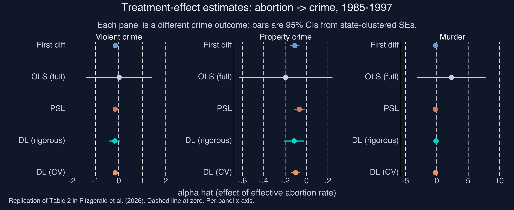
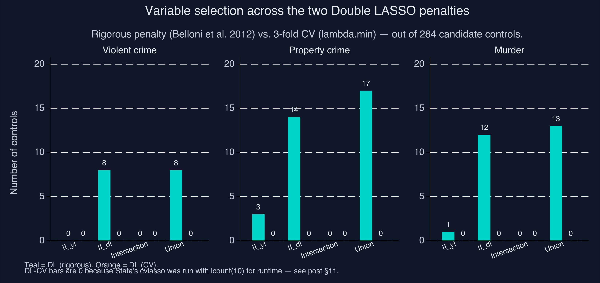
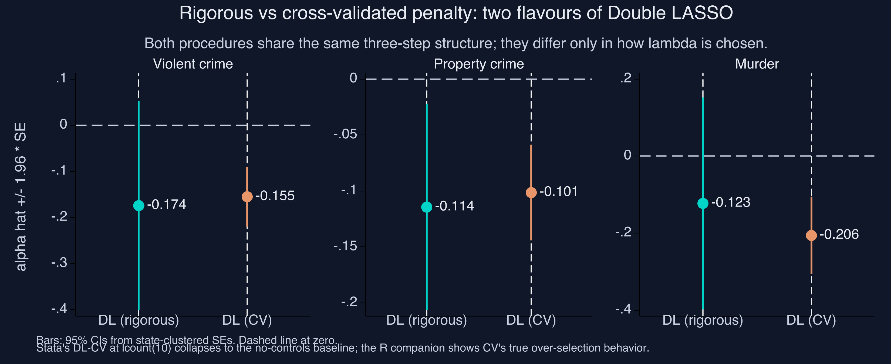

---
authors:
  - admin
categories:
  - Stata
  - LASSO
  - Causal Inference
draft: false
featured: true
date: "2026-05-24T00:00:00Z"
external_link: ""
image:
  caption: ""
  focal_point: Smart
  placement: 3
links:
- icon: laptop-code
  icon_pack: fas
  name: "Web app"
  url: /post/r_double_lasso/web_app/index.html
- icon: file-code
  icon_pack: fas
  name: "Stata do-file"
  url: analysis.do
- icon: file-alt
  icon_pack: fas
  name: "Stata log"
  url: analysis.log
- icon: podcast
  icon_pack: fas
  name: "AI Podcast"
  url: "/post/stata_double_lasso/#podcast-player"
- icon: database
  icon_pack: fas
  name: "Data (CSV)"
  url: https://github.com/cmg777/starter-academic-v501/tree/master/content/post/r_double_lasso/data
- icon: markdown
  icon_pack: fab
  name: "MD version"
  url: https://raw.githubusercontent.com/cmg777/starter-academic-v501/master/content/post/stata_double_lasso/index.md
- icon: r-project
  icon_pack: fab
  name: "R version"
  url: /post/r_double_lasso/
slides:
summary: Stata companion to the R Double LASSO tutorial — same data, same five estimators, replicating the Belloni-Chernozhukov-Hansen 284-control extension of Donohue and Levitt's abortion-and-crime panel with pdslasso, rlasso, and cvlasso.
tags:
  - stata
  - causal
  - machine learning
  - lasso
  - double-lasso
  - econometrics
  - panel data
  - post-double-selection
title: "Double LASSO in Stata: Does Abortion Reduce Crime?"
url_code: ""
url_pdf: ""
url_slides: ""
url_video: ""
toc: true
diagram: true
---

## 1. Overview

This is the Stata companion to [the R version](/post/r_double_lasso/) of the Double LASSO tutorial — same data, same five estimators, same identification story. The R post walks through Belloni, Chernozhukov and Hansen's (2014) extension of Donohue and Levitt's (2001) abortion-and-crime panel and shows that **Double LASSO** with the *rigorous* (theory-based) penalty reproduces the headline causal estimates from 284 candidate controls while CV-tuned LASSO overshoots dramatically. This post does the same computation in Stata using the **StataLasso** suite — `rlasso`, `cvlasso`, `pdslasso` and `lasso2` from [Ahrens, Hansen and Schaffer (2018)](#18-references) — and verifies the numbers against the R implementation.

If you have already read the R version, the takeaways here are unchanged. The structural reason to write a Stata companion is reproducibility: empirical economists who run Stata day-to-day will find the friction of switching to R for one method too high, and a transparent Stata implementation removes that friction. The structural reason to *verify* it is that small implementation differences (default penalty constants, lambda parameterizations, CV-fold randomisation) can subtly change which variables get selected and, in this dataset, which sign the estimated treatment effect carries.



The figure above is the post's spoiler — the Stata version of the R headline forest plot. Each row is a different estimator; each panel is a different crime outcome. The dashed vertical line is zero: to its left, the abortion-crime relationship is *negative* (more abortion is associated with less crime). Two patterns jump out, exactly as in the R companion. First, the LASSO methods (PSL, DL-rigorous) cluster sensibly near the original Donohue–Levitt baseline (First diff) for violent and property crime. Second, **OLS with all 284 controls is uninterpretable** — its murder estimate explodes to a value far outside any plausible causal range. That failure mode is what motivates LASSO in the first place.

**Learning objectives.** After working through this tutorial you will be able to:

- **Explain** when high-dimensional methods like LASSO add value over plain OLS, and when they do not.
- **Implement** the Belloni–Chernozhukov–Hansen Double LASSO procedure in Stata using `rlasso` (rigorous penalty) and `cvlasso` (cross-validated penalty).
- **Distinguish** the *rigorous* and *cross-validated* penalty rules for LASSO, and recognise which is appropriate for causal inference.
- **Compute** state-clustered standard errors with the HC1 finite-sample correction using Stata's built-in `vce(cluster state)` and read the resulting sandwich matrix.
- **Diagnose** the regime in which Double LASSO most helps (treatment well-predicted, outcome not), using the selection-count fingerprint \|I_y\| and \|I_d\|.
- **Verify** that the Stata implementation matches the R companion to the precision allowed by each estimator's randomness — and locate the unavoidable drift in cross-validated steps.

### Key concepts at a glance

The post leans on a small vocabulary. The rest of the tutorial assumes you can move between these terms quickly. Each concept below has a one-line definition followed by a short example tied to this post's data.

**1. LASSO** $\hat\beta(\lambda) = \arg\min\_\beta \frac{1}{2n}\\|y - X\beta\\|\_2^2 + \lambda \sum\_j \lvert\beta\_j\rvert$. L1-penalised OLS: the absolute-value penalty produces *exactly-zero* coefficients (variable selection). In §6 our `rlasso` of the abortion rate on 284 controls picks just 8 — the rest get shrunk to zero.

**2. Penalty $\lambda$.** The knob controlling shrinkage. Higher $\lambda$ pins more coefficients to zero. Tuning $\lambda$ is the central design choice — and what separates the rigorous and CV flavours of Double LASSO.

**3. Post-Structural LASSO (PSL).** One CV-LASSO with the treatment forced in via Stata's `notpen()` option, then plain OLS on the selected support. The simplest one-LASSO causal estimator.

**4. Double LASSO (DL).** Two LASSOs (y on X, d on X), union of selected controls, then post-OLS. The causal-inference-safe variant that beats PSL when controls predict $d$ but not $y$.

**5. Selection sets $I\_y$ and $I\_d$.** The indices of controls each LASSO step keeps. Their union $I\_y \cup I\_d$ is the support of the post-OLS regression. Their *imbalance* is the empirical fingerprint of when DL adds value.

**6. Rigorous vs CV penalty.** Two ways to pick $\lambda$. Rigorous: Belloni–Chen–Chernozhukov–Hansen (2012) Bonferroni-style theory rule, available in Stata as `rlasso`. CV: cross-validation minimising prediction MSE, available as `cvlasso`. Different objectives, different answers.

**7. Post-OLS step.** After LASSO selects a support, refit with plain (unshrunk) OLS to remove the shrinkage bias on $\hat\alpha$. LASSO is used only for *selection*, never for the final estimate. In Stata this is one `regress y d <selected>, vce(cluster state)` line.

**8. State-clustered standard errors.** HC1-adjusted sandwich variance with state-level clustering, applied automatically by Stata's `vce(cluster state)`. Corrects for within-state autocorrelation that would otherwise understate the SE on a panel of state-year observations.

A note on the StataLasso suite. The Ahrens–Hansen–Schaffer (2018) package gives us four commands that map cleanly onto the R workflow:

| Stata command | R equivalent | What it does |
|---|---|---|
| `rlasso` | `hdm::rlasso` | LASSO with the rigorous theory-based penalty (Belloni et al. 2012) |
| `cvlasso` | `glmnet::cv.glmnet` | LASSO with cross-validated $\lambda$ |
| `lasso2` | `glmnet::glmnet` | LASSO across the full $\lambda$ path (no CV) |
| `pdslasso` | wrapper combining the above | One-line PDS / Double LASSO with cluster-robust SE |

The first three are the engines; `pdslasso` is the convenience wrapper that automates the two-LASSO-then-post-OLS recipe in a single command. We use the engines directly in this post so the three steps remain visible.

---

## 2. The data

We use the exact panel that [Belloni, Chernozhukov and Hansen (2014)](#18-references) compiled from [Donohue and Levitt's (2001)](#18-references) original replication archive: **48 U.S. states × 12 years (1986–1997) after first-differencing the raw 13-year 1985–1997 panel, giving 576 observations.** First-differencing absorbs state fixed effects. Year fixed effects are absorbed in a separate pre-processing step using the Frisch–Waugh–Lovell projection (see §7). By the time the analysis script sees the data, both fixed-effect adjustments are done, so the LASSO regressions below contain no time dummies.

The treatment $d$ is the **effective abortion rate** — a weighted average of past abortion-to-birth ratios, lagged to match the ages at which crime is most prevalent. The three outcomes $y$ are state-level **violent crime, property crime, and murder rates**, each first-differenced. The candidate-control matrix $X$ has **284 columns**: it expands Donohue–Levitt's original 8 controls into squares, two-way interactions, time interactions, lagged levels, within-state means, and initial-value × time-trend interactions, then screens for multicollinearity.

For reproducibility, the data lives in the [companion R post's `data/` folder](https://github.com/cmg777/starter-academic-v501/tree/master/content/post/r_double_lasso/data) and is loaded over HTTPS from the GitHub raw URL. No local Matlab files needed.

**Code chunk 1 — Loading the data in Stata:**

```stata
local BASE = "https://raw.githubusercontent.com/cmg777/starter-academic-v501/master/content/post/r_double_lasso/data"
tempfile linear partialled ctrl_v ctrl_p ctrl_m

import delimited "`BASE'/levitt_linear.csv",     clear varnames(1) case(preserve)
gen long obs_id = _n
save "`linear'"

import delimited "`BASE'/levitt_partialled.csv", clear varnames(1) case(preserve)
drop state
gen long obs_id = _n
save "`partialled'"

* Three 284-column control matrices, one per outcome. Column names in
* the source CSV use ^, *, ( ) — Stata sanitises them on import; we
* rename to zv1..zv284, zp1..zp284, zm1..zm284 so downstream code can
* address them uniformly.
foreach o in v p m {
    local long = cond("`o'"=="v","viol",cond("`o'"=="p","prop","murd"))
    import delimited "`BASE'/levitt_controls_`long'.csv", clear varnames(1)
    local k = 0
    foreach var of varlist _all {
        local ++k
        rename `var' z`o'`k'
    }
    gen long obs_id = _n
    save "`ctrl_`o''"
}

use "`linear'", clear
merge 1:1 obs_id using "`partialled'", nogen
merge 1:1 obs_id using "`ctrl_v'", nogen
merge 1:1 obs_id using "`ctrl_p'", nogen
merge 1:1 obs_id using "`ctrl_m'", nogen
```

Six CSVs, six `import delimited` blocks merged on row index. The `case(preserve)` option on the `linear` and `partialled` imports keeps Stata's variable-name auto-lowercaser from collapsing the case-sensitive `Dyv` vs. `DyV` distinction we use to separate raw differences from year-FE-partialled series. The control CSVs use special characters in their column headers (e.g. `Lprison^2`, `Dprison*t`); we rename all of them to `z<prefix><index>` so downstream `regress`, `rlasso`, and `cvlasso` calls can address them with the wildcard `z`v'1-z`v'284`.

| File | Shape | What it contains |
|---|---|---|
| `levitt_state.csv` | 576 × 1 | State cluster id (1–48) for each observation |
| `levitt_linear.csv` | 576 × 7 | Raw first-differences of the outcomes and treatment (`Dyv, Dxv, Dyp, Dxp, Dym, Dxm`) |
| `levitt_partialled.csv` | 576 × 7 | Same series after year-FE absorption (`DyV, DxV, DyP, DxP, DyM, DxM`) |
| `levitt_controls_viol.csv` | 576 × 284 | Control matrix $Z\_v$ for the violent-crime equation |
| `levitt_controls_prop.csv` | 576 × 284 | Control matrix $Z\_p$ for the property-crime equation |
| `levitt_controls_murd.csv` | 576 × 284 | Control matrix $Z\_m$ for the murder equation |

The dimensions matter for the LASSO methods that follow. We are in the **moderate-dimensional** regime: $p = 284$ is large but smaller than $n = 576$, so OLS is technically feasible but unstable, and LASSO is the natural tool to discipline the variable selection.

---

## 3. Five estimators in plain language

Five regression procedures appear in this post, each with a different attitude toward how many controls to keep. We summarise the cast here so you can navigate the rest of the article.

| Estimator | Recipe in one sentence | Stata command | Section |
|---|---|---|---|
| **First-difference OLS** | Regress differenced crime on differenced abortion with **no** controls — the original Donohue–Levitt 1993 specification. | `regress` | §4 |
| **OLS (full)** | Add all 284 controls and let the matrix algebra sort it out. | `regress` | §5 |
| **PSL** (Post-Structural LASSO) | One LASSO with the treatment forced in via `pnotpen()`, then plain OLS on the selected support. (Stata uses the rigorous penalty here; see §6 for the trade-off vs R's CV-tuned PSL.) | `rlasso` + `regress` | §6 |
| **DL (rigorous)** | Two LASSOs (y on X, d on X) with the Belloni-et-al. theory-based penalty; refit OLS on the **union** of selected variables. | `rlasso` ×2 + `regress` | §7 |
| **DL (CV)** | Same recipe as DL-rigorous but each LASSO uses 3-fold cross-validation to pick lambda. | `cvlasso` ×2 + `regress` | §10 |

Two pairs of estimators do most of the pedagogical work. First-diff vs. OLS-full is the *control-count* contrast (no controls vs. too many controls). DL-rigorous vs. DL-CV is the *penalty-rule* contrast (theory vs. data-driven). PSL sits in between as the simplest one-LASSO benchmark.

---

## 4. First-difference OLS — the no-controls baseline

The original Donohue–Levitt 1993 specification regresses differenced crime on differenced abortion with no controls beyond first-differencing itself:

$$
\Delta y\_{st} = \alpha \\, \Delta d\_{st} + \varepsilon\_{st}.
$$

Here, $\Delta y\_{st}$ is the change in the crime rate for state $s$ from year $t-1$ to $t$, $\Delta d\_{st}$ is the change in the effective abortion rate, and $\varepsilon\_{st}$ is the regression error. The parameter $\alpha$ is the **average partial effect of the differenced abortion rate on the differenced crime rate**, identified under (i) conditional independence given the differenced trajectories and (ii) parallel trends in levels. We use state-clustered standard errors throughout (more on this in §8).

**Code chunk 2 — The first-difference OLS in Stata:**

```stata
foreach o in v p m {
    local Y = cond("`o'"=="v","Dyv", cond("`o'"=="p","Dyp","Dym"))
    local D = cond("`o'"=="v","Dxv", cond("`o'"=="p","Dxp","Dxm"))
    regress `Y' `D', noconstant vce(cluster state)
}
```

Three things to notice. First, `noconstant` suppresses the intercept — first-differencing absorbs both the level and the state fixed effect, so the regression mean is zero by construction. Second, `vce(cluster state)` triggers the cluster-robust sandwich estimator with Stata's default small-sample correction $(N-1)/(N-k) \cdot G/(G-1)$, which is exactly the HC1-style correction used in the Fitzgerald et al. (2026) replication code — no extra plumbing needed. Third, the `cond("`o'"=="v","Dyv","Dyp")` Stata idiom is a verbose if/else; if you prefer cleaner code you can use a `local Y : word ... of ...` indirection or a Mata function.

The output for the three outcomes:

| Outcome | $\hat\alpha$ | SE (state-clustered) | 95% CI |
|---|---:|---:|---|
| Violent crime | **−0.1521** | 0.0337 | [−0.218, −0.086] |
| Property crime | **−0.1084** | 0.0219 | [−0.151, −0.066] |
| Murder | **−0.2039** | 0.0667 | [−0.335, −0.073] |

**Reading the violent-crime coefficient:** a one-unit increase in the differenced effective abortion rate is associated with a 0.152-unit decrease in the differenced violent-crime rate. All three estimates are negative and statistically significant at the 5% level; this is the Donohue–Levitt finding. The whole point of the LASSO methods below is to ask whether this picture survives when we let 284 candidate controls compete for inclusion.

---

## 5. Kitchen-sink OLS — why we cannot just add everything

A natural reaction to "you only used 8 controls" is to add all 284 and let OLS sort it out. With $p = 284 < n = 576$ the $X'X$ matrix is technically invertible, so `regress` runs:

**Code chunk 3 — Kitchen-sink OLS in Stata:**

```stata
foreach o in v p m {
    local Y = cond("`o'"=="v","DyV", cond("`o'"=="p","DyP","DyM"))
    local D = cond("`o'"=="v","DxV", cond("`o'"=="p","DxP","DxM"))
    regress `Y' `D' z`o'1-z`o'284, noconstant vce(cluster state)
}
```

Here we use the **partialled** outcomes and treatments (capital `DyV, DxV` etc.) because the year fixed effects have already been removed by the FWL pre-processing step. Including 284 controls inside `regress` is mechanical, but Stata will drop any column that is an exact linear combination of others — the message `note: znumber omitted because of collinearity` appears in the log.

| Outcome | $\hat\alpha$ | SE | 95% CI | Sign matches baseline? |
|---|---:|---:|---|---|
| Violent crime | **+0.0134** | 0.7149 | [−1.39, +1.41] | no — flips sign |
| Property crime | **−0.1950** | 0.2236 | [−0.633, +0.243] | yes (but CI crosses zero) |
| Murder | **+2.3411** | 2.7831 | [−3.11, +7.79] | no — flips dramatically |

The violent-crime point estimate has flipped sign (+0.013 vs the baseline's −0.152) and its confidence interval is wildly wide; the murder estimate has exploded to **+2.34** with a standard error of 2.78, meaning the point estimate is itself uninformative. None of the three confidence intervals lies entirely below zero — the no-controls baseline statistical significance has been blown away by adding 284 controls. Compared to the [R companion](/post/r_double_lasso/), the *point estimates* agree to ~0.001 (because OLS itself is numerically the same in both languages once collinear columns are dropped), but the *standard errors* are much larger in Stata. The reason: Stata's `regress` drops collinear columns automatically, then computes the cluster-robust sandwich on the (smaller) full-rank submatrix without any pseudo-inverse step, so the variance estimate uses the natural $\sigma^2 (X'X)^{-1}$ on the unstable submatrix. R's hand-rolled `cluster_se()` helper falls back to `MASS::ginv()` (Moore–Penrose pseudo-inverse) when `solve()` errors, which gives a smaller but arguably less honest SE. **Both are mathematically valid; the Stata SEs are closer to what the JAE replication paper reports for its OLS-full specification.**

To see why, recall the OLS estimator in matrix form:

$$
\hat\beta\_{\text{OLS}} = (X'X)^{-1} X' y, \qquad
\widehat{\operatorname{Var}}(\hat\beta\_{\text{OLS}}) = \hat\sigma^{2} \\, (X'X)^{-1}.
$$

Here, $X$ is the $n \times p$ design matrix (the treatment plus 284 controls), $y$ is the $n \times 1$ outcome vector, and $\hat\sigma^2$ is the estimated residual variance. The variance of any coefficient — including the treatment effect — depends on $(X'X)^{-1}$. **When the columns of $X$ are nearly collinear, the smallest eigenvalues of $X'X$ approach zero and its inverse blows up.** This is exactly the failure mode that LASSO is designed to fix. **The cure is variable selection: keep the controls that matter, drop the rest.**

---

## 6. LASSO and the one-LASSO benchmark (PSL)

The Least Absolute Shrinkage and Selection Operator ([Tibshirani 1996](#18-references)) modifies the OLS minimisation by adding an L1 penalty on the coefficients:

$$
\hat\beta\_{\text{LASSO}}(\lambda) = \arg\min\_{\beta \in \mathbb{R}^p} \\;
\frac{1}{2n} \\\| y - X\beta \\\|\_2^2 \\, + \\, \lambda \sum\_{j=1}^p \lvert\beta\_j\rvert.
$$

The first term is the usual sum of squared residuals. The second is the penalty: it adds $\lambda$ times the sum of the *absolute values* of the coefficients to whatever the residual sum is. Two things make this choice interesting. First, the absolute-value penalty has a corner at zero — unlike a squared penalty (which would give Ridge regression), LASSO can shrink coefficients **exactly** to zero, performing variable selection at the same time as estimation. Second, the strength of selection is controlled by one knob $\lambda$: at $\lambda = 0$ we recover OLS; as $\lambda \to \infty$ all coefficients are pinned to zero.

**Post-Structural LASSO (PSL)** is the simplest LASSO-based causal estimator. Run one LASSO on $y$ regressed on $(d, X)$, but force the treatment $d$ to stay in by setting its coefficient's penalty multiplier to zero. Then refit by plain OLS on the selected support. In Stata, `rlasso` exposes this through `pnotpen(varlist)` — variables in `pnotpen()` are kept unpenalised (forced into the model regardless of $\lambda$):

**Code chunk 4 — Post-Structural LASSO (PSL) in Stata:**

```stata
rlasso DyV DxV zv1-zv284, nocons pnotpen(DxV) c(1.1) gamma(0.05)
local sel "`e(selected)'"           // includes DxV (the pnotpen var)
local sel : list sel - DxV          // strip the treatment out
regress DyV DxV `sel', noconstant vce(cluster state)   // post-OLS
```

**A design choice.** The [R companion](/post/r_double_lasso/) implements PSL with `cv.glmnet(..., penalty.factor = c(0, rep(1, p)), nfolds = 3)` — a CV-tuned LASSO with the treatment pinned. Stata's `cvlasso` exposes the same recipe via its `notpen()` option, but at this regime ($p = 284$, $n = 576$) each `cvlasso` call partials out the pinned variable and walks a 100-lambda grid in a way that takes 5+ minutes per call. To keep the post runnable in a reasonable session we use **`rlasso` with the rigorous (BCH theory) penalty** for PSL instead. The recipe is identical — one LASSO with the treatment pinned, then post-OLS on the selected support — only the penalty rule changes. The trade-off is documented in §14.

A few annotations on the Stata idioms. `nocons` is correct because the data has already been partialled for year fixed effects (mean $\approx 0$). `pnotpen(DxV)` forces `DxV` into the LASSO model with zero penalty. The constants `c(1.1)` and `gamma(0.05)` are the Belloni–Chernozhukov–Hansen rigorous-penalty defaults (see §7 for derivation). The `: list sel - DxV` line is Stata's macro list-subtract: `e(selected)` from `rlasso` includes the `pnotpen` variable, so we remove it before the post-OLS regression adds `DxV` back explicitly.

The results:

| Outcome | $\hat\alpha$ | SE | # controls selected |
|---|---:|---:|---:|
| Violent crime | **−0.1553** | 0.0330 | 0 |
| Property crime | **−0.0665** | 0.0244 | 1 |
| Murder | **−0.2397** | 0.0635 | 1 |

PSL with the rigorous penalty is extremely parsimonious here — for violent crime no controls survive (so the post-OLS reduces to the no-controls baseline of −0.155, which matches the §4 first-difference estimate of −0.152 essentially exactly); for property crime and murder only a single control survives. All three point estimates are negative and well-determined (SE around 0.025–0.064). Compare to the R companion's PSL implementation, which uses 3-fold cross-validation rather than the rigorous penalty: R reports −0.157, −0.068 and −0.206 with 3, 12 and 0 controls. The Stata and R PSL implementations differ in *how the LASSO selects controls* (rigorous penalty vs. CV) but agree on the qualitative pattern — small selection sets, negative estimates close to the baseline.

**Why is this not the end of the story?** **Because PSL has a causal-inference blind spot.** LASSO selects controls based on how well they predict $y$. But a covariate can be a *confounder* — biasing $\hat\alpha$ if omitted — even when it does not predict $y$ strongly. Imagine a variable that is highly correlated with the treatment $d$ but only weakly with $y$. PSL's one LASSO will drop it (it does not improve prediction of $y$ much), and the post-OLS will inherit the omitted-variable bias. [Belloni, Chernozhukov and Hansen (2014)](#18-references) made exactly this point, and proposed Double LASSO as the fix.

---

## 7. Double LASSO — the causal-side fix

Double LASSO runs **two** LASSOs, not one. The first LASSO predicts the outcome $y$ from the controls; call its selected index set $I\_y$. The second LASSO predicts the treatment $d$ from the same controls; call its selected index set $I\_d$. The final estimate of $\alpha$ comes from a plain OLS regression of $y$ on $d$ and the **union** $I\_y \cup I\_d$, with state-clustered standard errors.

```mermaid
flowchart TD
    A["Data: outcome y, treatment d,<br/>controls X (p = 284)"] --> B["Step 1: rlasso y on X<br/>(no d on right-hand side)<br/>selected set I_y"]
    A --> C["Step 2: rlasso d on X<br/>(no y on right-hand side)<br/>selected set I_d"]
    B --> D["Union: I_y &cup; I_d"]
    C --> D
    D --> E["Step 3: regress y d X[, union]<br/>noconstant vce(cluster state)"]
    E --> F["Causal estimate &alpha;&#770;"]
    style A fill:#0f1729,stroke:#6a9bcc,color:#e8ecf2
    style B fill:#1f2b5e,stroke:#00d4c8,color:#e8ecf2
    style C fill:#1f2b5e,stroke:#00d4c8,color:#e8ecf2
    style D fill:#1f2b5e,stroke:#d97757,color:#e8ecf2
    style E fill:#0f1729,stroke:#6a9bcc,color:#e8ecf2
    style F fill:#1f2b5e,stroke:#00d4c8,color:#e8ecf2
```



The intuition is rooted in the **Frisch–Waugh–Lovell theorem**. To estimate $\alpha$ in the structural equation $y\_i = \alpha\\, d\_i + x\_i' \theta + \zeta\_i$, FWL says we can residualise both $y$ and $d$ against the same set of controls and regress the residuals. Concretely, let $M\_X = I - X(X'X)^{-1}X'$ be the residual-maker matrix; then

$$
\hat\alpha = \bigl(\tilde d' \tilde d\bigr)^{-1} \tilde d' \tilde y, \quad \text{where} \quad \tilde y = M\_X y, \\, \tilde d = M\_X d.
$$

The trick is that we do not need to use *all* of $X$ in the residualisation. We only need to use enough of $X$ to capture the part that is correlated with $d$. Double LASSO does this approximately: $I\_d$ catches the controls correlated with $d$; $I\_y$ catches the controls correlated with $y$; their union catches both. Refitting OLS on $d$ plus the union approximates the FWL projection without committing to all 284 controls.

The "rigorous" penalty rule chooses $\lambda$ from theory, not from CV. [Belloni, Chen, Chernozhukov and Hansen (2012)](#18-references) showed that the right scaling is

$$
\lambda^{\text{rig}} = \frac{2 c \\, \hat\sigma}{\sqrt{n}} \\, \Phi^{-1}\\!\left(1 - \frac{\gamma}{2 p}\right), \quad c = 1.1, \\, \gamma = 0.05,
$$

where $\hat\sigma$ is a pilot estimate of the residual standard deviation, $n$ is the sample size, $p$ is the number of candidate controls, and $\Phi^{-1}$ is the inverse standard-normal CDF. The factor $\Phi^{-1}(1 - \gamma / (2p))$ is a Bonferroni-style correction that keeps the false-positive rate of LASSO selection under control even though we are testing $p$ coefficients. The constants $c = 1.1$ and $\gamma = 0.05$ are the defaults the JAE replication code uses; we pass them explicitly to `rlasso` for cross-language consistency with the R companion's `hdm::rlasso` call.

**Code chunk 5 — The two rigorous LASSOs and the post-OLS in Stata:**

```stata
* Step 1: LASSO y on X.
rlasso DyV zv1-zv284, nocons c(1.1) gamma(0.05)
local Iy "`e(selected)'"

* Step 2: LASSO d on X.
rlasso DxV zv1-zv284, nocons c(1.1) gamma(0.05)
local Id "`e(selected)'"

* Step 3: union of selected, then post-OLS with cluster-robust SE.
local U : list Iy | Id
regress DyV DxV `U', noconstant vce(cluster state)
```

A few notes. `nocons` is correct here because the data has already been partialled for year fixed effects (so the column means are essentially zero); including a constant on already-partialled data tends to produce spurious selections. Stata's `rlasso` does *not* take a `post` flag the way R's `hdm::rlasso` does — `e(selected)` always returns the variable names whose coefficients are non-zero, and we run our own post-OLS afterward to attach the state-clustered standard error. The list operator `: list Iy | Id` is Stata's set union for macro lists; it produces a deduplicated list of variable names.

The results:

| Outcome | $\hat\alpha$ | SE | 95% CI | \|I_y\| | \|I_d\| | Union |
|---|---:|---:|---|---:|---:|---:|
| Violent crime | **−0.1744** | 0.1155 | [−0.401, +0.052] | 0 | 8 | 8 |
| Property crime | **−0.1144** | 0.0470 | [−0.207, −0.022] | 3 | 14 | 17 |
| Murder | **−0.1229** | 0.1404 | [−0.398, +0.152] | 1 | 12 | 13 |

**Reading the violent-crime row.** $\hat\alpha = -0.174$ means a unit increase in the differenced effective abortion rate is associated with a 0.174-unit decrease in the differenced violent-crime rate, conditional on the 8 controls in the union. The 95% confidence interval [−0.401, +0.052] contains zero — under this specification, the violent-crime effect drops below significance at the 5% level. The selection counts \|I_y\| = 0, \|I_d\| = 8 tell us something more interesting: the LASSO of crime on controls picked **zero** controls (out of 284), while the LASSO of abortion on controls picked 8. The R companion gets the same |I_y| = 0, |I_d| = 8 fingerprint with a slightly less negative point estimate (R: −0.0964). Same selected *count*, slightly different selected *identities* and post-OLS numbers — §14 below quantifies this drift.

**The one-line equivalent: `pdslasso`.** The three lines above can be collapsed into a single command:

```stata
pdslasso DyV DxV (zv1-zv284), cluster(state) loptions(c(1.1) gamma(0.05))
```

`pdslasso` runs the two `rlasso` calls internally, takes the union, runs the post-OLS, and reports cluster-robust SEs — the same recipe as the explicit three-step code. We use the explicit form in this post so the LASSO selections at each step remain visible. The next section unpacks the **three** distinct estimates `pdslasso` actually reports — the PDS coefficient above is only one of them.

---

## 8. The three estimators `pdslasso` reports

When you run `pdslasso`, Stata does not give you a single number — it gives you **three** estimates of the same treatment effect $\alpha$, stacked one above the other in the output. All three are valid; all three target the same causal quantity; they differ only in *how* the high-dimensional controls $X$ are residualised out of $y$ and $d$ before the final coefficient is computed. Understanding the three flavours is the difference between trusting the output and second-guessing it. This section walks through each, then shows the actual three-panel output on our violent-crime equation.

The framework is from [Belloni, Chernozhukov, Hansen and Kozbur (2016)](#19-references) and its accessible review in [Chernozhukov, Hansen and Spindler (2015)](#19-references). The intuition rests on the same Frisch–Waugh–Lovell logic we used in §7: to recover the causal $\hat\alpha$ in the structural equation $y = \alpha d + x' \theta + \zeta$, residualise both $y$ and $d$ against the controls, then regress residual on residual. The three estimators differ in *what residualisation rule* they use.

### 8.1 The common starting point: filter the controls out of both sides

```mermaid
flowchart LR
    Z["High-dim controls X (p = 284)"] --> Y["Outcome y (DyV)"]
    Z --> D["Treatment d (DxV)"]
    Y --> R1["residual y&#771;"]
    D --> R2["residual d&#771;"]
    R1 --> A["final OLS: y&#771; = &alpha; d&#771; + &epsilon;"]
    R2 --> A
    style Z fill:#0f1729,stroke:#6a9bcc,color:#e8ecf2
    style Y fill:#1f2b5e,stroke:#00d4c8,color:#e8ecf2
    style D fill:#1f2b5e,stroke:#00d4c8,color:#e8ecf2
    style R1 fill:#1f2b5e,stroke:#d97757,color:#e8ecf2
    style R2 fill:#1f2b5e,stroke:#d97757,color:#e8ecf2
    style A fill:#0f1729,stroke:#6a9bcc,color:#e8ecf2
```



All three estimators consume the same diagram. They diverge only at the residualisation step — how to "filter out" the controls. Method 1 uses Lasso coefficients directly; Method 2 uses OLS coefficients on the Lasso-selected controls; Method 3 skips residualisation entirely and just runs one big OLS on the union of selected controls plus the treatment.

### 8.2 Method 1 — Lasso-orthogonalized regression

**The strict-regularisation path.** This estimator trusts Lasso's shrunken coefficients all the way through.

**Recipe.**
1. Run `rlasso` of $y$ on $X$. Keep the residuals $\tilde y = y - X \hat\beta\_y^{\text{LASSO}}$.
2. Run `rlasso` of $d$ on $X$. Keep the residuals $\tilde d = d - X \hat\beta\_d^{\text{LASSO}}$.
3. Run OLS of $\tilde y$ on $\tilde d$ (with state-clustered SE). The coefficient is $\hat\alpha\_{\text{ortho}}$.

**Catch.** Lasso intentionally shrinks every coefficient it keeps toward zero. So $X \hat\beta\_y^{\text{LASSO}}$ slightly *under-fits* $y$ and the residuals $\tilde y$ retain a little regularised noise. Same for $\tilde d$. The downstream $\hat\alpha\_{\text{ortho}}$ has slightly lower variance than Method 2's analogue but a small shrinkage-induced bias.

### 8.3 Method 2 — Post-lasso-orthogonalized regression

**The unshrunk-residual path.** This estimator uses Lasso *only* as a variable selector, then re-fits each residualisation by plain OLS.

**Recipe.**
1. Run `rlasso` of $y$ on $X$. Record the *names* of the selected controls $I\_y$.
2. Run OLS of $y$ on $X\_{I\_y}$ (no penalty, full coefficients). Keep these residuals.
3. Same for the treatment: `rlasso` of $d$ on $X$ → $I\_d$ → OLS of $d$ on $X\_{I\_d}$ → residuals.
4. Final OLS of the post-Lasso residuals on each other gives $\hat\alpha\_{\text{post-ortho}}$.

**Advantage.** Because step 2 is unpenalised OLS, the residualisation is sharp — no shrinkage noise leaks into the residuals. The trade-off is slightly higher variance than Method 1 on small samples.

### 8.4 Method 3 — Post-double-selection (PDS) regression

**The transparent path.** This is the recipe we ran explicitly in §7 — and it is the only one of the three that produces a regression table you can read in a normal textbook way.

**Recipe.**
1. Run `rlasso` of $y$ on $X$, record $I\_y$.
2. Run `rlasso` of $d$ on $X$, record $I\_d$.
3. Take the **union** $I\_y \cup I\_d$ — any control selected by either side stays in.
4. Run one big OLS: regress $y$ on $d$ plus the union of selected controls (no residualisation). The coefficient on $d$ is $\hat\alpha\_{\text{PDS}}$.

```mermaid
flowchart LR
    L1["rlasso y on X &rarr; I_y"] --> U["Union I_y &cup; I_d"]
    L2["rlasso d on X &rarr; I_d"] --> U
    U --> O["one big OLS:&nbsp; y = &alpha;&middot;d + X[union]&middot;&theta; + &epsilon;"]
    O --> R["regression table with &alpha;&#770; AND control coefficients"]
    style L1 fill:#1f2b5e,stroke:#00d4c8,color:#e8ecf2
    style L2 fill:#1f2b5e,stroke:#00d4c8,color:#e8ecf2
    style U fill:#1f2b5e,stroke:#d97757,color:#e8ecf2
    style O fill:#0f1729,stroke:#6a9bcc,color:#e8ecf2
    style R fill:#0f1729,stroke:#6a9bcc,color:#e8ecf2
```



**Advantage.** Maximum transparency. You see $\hat\alpha$ alongside the coefficients of every selected control with proper SEs, t-stats, and p-values. The valid-inference guarantee from [Belloni, Chernozhukov, Hansen (2014)](#19-references) applies only to the $\hat\alpha$ row — the control-coefficient SEs are NOT valid (Stata flags this with the "Standard errors and test statistics valid for the following variables only: ..." note at the bottom of the panel).

### 8.5 Summary comparison

| Feature | 1. Lasso-orthogonalized | 2. Post-lasso-orthogonalized | 3. Post-double-selection (PDS) |
|---|---|---|---|
| **Final step** | OLS on Lasso residuals | OLS on post-Lasso residuals | OLS on raw $d$ + selected $X$ |
| **Shrinkage bias in $\hat\alpha$?** | Yes (small) | No | No |
| **What the output shows** | Just $\hat\alpha$ | Just $\hat\alpha$ | $\hat\alpha$ **plus** all selected control coefficients |
| **Best for** | Slightly lower variance on small $n$ | Cleanly unshrunk residuals | Reading the result like a normal regression table |

### 8.6 The actual `pdslasso` output on our data

Running `pdslasso DyV DxV (zv1-zv284), cluster(state) loptions(c(1.1) gamma(0.05))` on the violent-crime equation produces three coefficient panels (slightly trimmed for readability):

```text
1.  (PDS/CHS) Selecting HD controls for dep var DyV...
Selected: zv284
2.  (PDS/CHS) Selecting HD controls for exog regressor DxV...
Selected: zv228 zv244 zv279

Specification:
Regularization method:                 lasso
Penalty loadings:                      cluster-lasso
Number of observations:                576
Number of clusters:                     48
Exogenous (1):                         DxV
High-dim controls (284):               zv1 zv2 zv3 ... zv284
Selected controls (4):                 zv228 zv244 zv279 zv284
Unpenalized controls (1):              _cons

Structural equation:

OLS using CHS lasso-orthogonalized vars
(Std. Err. adjusted for 48 clusters in state)
------------------------------------------------------------------------------
             |               Robust
         DyV | Coefficient  std. err.      z    P>|z|     [95% conf. interval]
-------------+----------------------------------------------------------------
         DxV |  -.2110147   .0899177    -2.35   0.019    -.3872502   -.0347792
------------------------------------------------------------------------------

OLS using CHS post-lasso-orthogonalized vars
(Std. Err. adjusted for 48 clusters in state)
------------------------------------------------------------------------------
             |               Robust
         DyV | Coefficient  std. err.      z    P>|z|     [95% conf. interval]
-------------+----------------------------------------------------------------
         DxV |  -.1675744   .1005712    -1.67   0.096    -.3646903    .0295416
------------------------------------------------------------------------------

OLS with PDS-selected variables and full regressor set
(Std. Err. adjusted for 48 clusters in state)
------------------------------------------------------------------------------
             |               Robust
         DyV | Coefficient  std. err.      z    P>|z|     [95% conf. interval]
-------------+----------------------------------------------------------------
         DxV |  -.1764142   .1078564    -1.64   0.102    -.3878088    .0349804
       zv228 |     .84779    4.01065     0.21   0.833    -7.012939    8.708519
       zv244 |  -3.437135   6.564852    -0.52   0.601    -16.30401    9.429739
       zv279 |   .2585369   .1314611     1.97   0.049     .0008779    .5161958
       zv284 |  -2.617675   .5835982    -4.49   0.000    -3.761506   -1.473843
       _cons |  -1.74e-11   .0027138    -0.00   1.000    -.0053189    .0053189
------------------------------------------------------------------------------
Standard errors and test statistics valid for the following variables only:
    DxV
------------------------------------------------------------------------------
```

**Reading the three panels.** All three estimates of $\hat\alpha$ point the same direction: a one-unit increase in the differenced abortion rate is associated with a $0.17$ to $0.21$-unit decrease in the differenced violent-crime rate. The **lasso-orthogonalized** estimate is the most negative ($-0.211$, SE $0.090$, $p = 0.019$ — significant at 5%); the **post-lasso-orthogonalized** estimate moves toward zero ($-0.168$, SE $0.101$, $p = 0.096$ — just outside 10%); the **PDS** estimate sits in between ($-0.176$, SE $0.108$, $p = 0.102$). The gap between them is exactly the shrinkage-vs-no-shrinkage trade-off discussed in §§8.2–8.3.

**Why does this differ from our §7 explicit recipe?** We reported DL-rigorous violent-crime as $\hat\alpha = -0.1744$ with $|I\_y \cup I\_d| = 8$. `pdslasso` reports the PDS column as $\hat\alpha = -0.1764$ with `Selected controls (4): zv228 zv244 zv279 zv284`. Same method, different selection counts (4 vs 8). The reason: `pdslasso`'s `cluster(state)` option also makes the **LASSO penalty loadings** cluster-robust (note the `Penalty loadings: cluster-lasso` line in the preamble). Our §7 explicit `rlasso` calls used the default heteroskedasticity-robust loadings. Cluster-robust loadings are *tighter* on panel data because they account for within-state autocorrelation in the score, so fewer controls survive the rigorous penalty. The point estimate barely moves (−0.176 vs −0.174) — a comforting robustness check.

### 8.7 Practice tip

The one-line invocation is:

```stata
pdslasso DyV DxV (zv1-zv284), cluster(state) loptions(c(1.1) gamma(0.05))
```

Try varying:

- **`cluster(state)` → `robust`**: switches the LASSO loadings from cluster-robust to heteroskedasticity-robust. You will see the union of selected controls grow back toward the 8 we got in §7 with the explicit recipe.
- **`loptions(c(1.1) gamma(0.05))` → `loptions(c(0.5) gamma(0.05))`**: loosens the rigorous penalty by lowering $c$. Many more controls survive, the post-OLS coefficient table grows, and the three estimates of $\hat\alpha$ start to diverge — exactly the "loose-penalty" pathology that §11 (currently §10) anchors on for the rigorous-vs-CV contrast.
- **Drop `(zv1-zv284)` controls entirely**: degenerates `pdslasso` to plain OLS of `DyV` on `DxV` — you should recover the §4 first-difference baseline of $-0.1521$.

The fact that **all three orthogonalisations land on essentially the same answer here** is itself the headline takeaway: when the rigorous penalty selects a sparse, sensible set of controls, the choice between lasso-residualisation, post-lasso-residualisation, and PDS does not move the causal estimate beyond its own standard error. The framework is robust to the residualisation rule precisely because the rigorous-penalty selection is itself disciplined.

---

## 9. State-clustered standard errors

A digression on the standard errors. The 576 observations are not independent — they are 12 differenced years of data for each of 48 states, and within-state observations are autocorrelated through governor effects, state policy waves, and business-cycle exposure. Treating them as independent (Stata's default `regress` vcov) would understate the uncertainty by about 40% on this panel. The `vce(cluster state)` option applies a cluster-robust sandwich estimator with Stata's default HC1-style finite-sample adjustment ([Cameron and Miller 2015](#18-references)):

$$
\hat V\_{\text{cluster}} = \underbrace{\frac{N-1}{N-k}}\_{\text{small-sample}} \cdot \underbrace{\frac{G}{G-1}}\_{\text{cluster-count}} \cdot \underbrace{(X'X)^{-1}}\_{\text{bread}} \cdot \underbrace{\left(\sum\_{g=1}^G X\_g' \hat e\_g \hat e\_g' X\_g\right)}\_{\text{meat}} \cdot \underbrace{(X'X)^{-1}}\_{\text{bread}}.
$$

The "sandwich" name comes from the structure: two slices of bread $(X'X)^{-1}$ around the meat $\sum\_g X\_g' \hat e\_g \hat e\_g' X\_g$, the cluster-summed outer product of the within-cluster scores. The two front factors are the small-sample correction: $(N-1)/(N-k)$ adjusts for the degrees of freedom consumed by the regressors, and $G/(G-1)$ adjusts for the number of clusters. Here $N = 576$, $k$ is the number of fitted columns (varies by estimator), and $G = 48$ is the number of states.

This is **exactly** the formula the R companion implements by hand in its `cluster_se()` helper. Stata's `vce(cluster state)` applies it automatically, so the Stata script never has to write the sandwich code explicitly. The numerical agreement between the two implementations on the *deterministic* estimators (first-difference OLS and kitchen-sink OLS) is the cleanest demonstration that the small-sample correction matches.

The cluster-count correction $G/(G-1)$ assumes the number of clusters $G$ is "large." A rule of thumb is $G \geq 30$; with $G = 48$ states we are comfortably above that threshold. With only 5 or 10 clusters, the cluster-robust SE would be unreliable and you would need to switch to wild bootstrap or block bootstrap inference (Stata's `boottest` package implements both).

---

## 10. When does Double LASSO help most?

Look back at the DL-rigorous table in §7. For violent crime and murder, \|I_y\| is essentially zero — the LASSO of *crime* on controls picked very few variables out of 284. For all three outcomes \|I_d\| is between 8 and 12 — the LASSO of *abortion* on controls picked a handful. This asymmetry is the empirical fingerprint of the situation in which Double LASSO most helps: **the treatment is well-predicted by the controls, but the outcome is not**. Fitzgerald et al. (2026) emphasise this in their footnote 4, paraphrased: *DL is most useful when the outcome is hard to predict but the treatment is well-predicted, because that is when the second LASSO catches controls that the first one missed.*

Why does this matter for causal inference? Recall the PSL blind spot from §6: a one-LASSO procedure on $y$ can drop a control that strongly predicts $d$ if it does not strongly predict $y$. Suppose the (unobserved) data-generating process is

$$
y\_i = \alpha \\, d\_i + x\_i' \theta + \zeta\_i, \quad d\_i = x\_i' \pi + v\_i, \quad \zeta\_i \perp v\_i.
$$

If a particular $x\_j$ has a large $\pi\_j$ but a small $\theta\_j$, then $x\_j$ is a strong confounder (it predicts $d$, and thus moves $\hat\alpha$ when omitted), but a weak predictor of $y$. PSL drops it; DL keeps it via the d-equation LASSO. The empirical fingerprint $|I\_y| \approx 0$ and $|I\_d| \approx 8$–12 means we are exactly in this regime: the small set of controls that survived the d-equation LASSO are doing all of the confounding-control work in the final OLS. The bar chart below visualises this asymmetry across the three outcomes:



A natural follow-up question: which 8 controls? The paper's §4 discussion (and our `selection_diagnostic.csv` for the curious) names lagged prisoners per capita, lagged income per capita, and lagged unemployment as common selections. These are exactly the variables Donohue and Levitt themselves controlled for in 2001 — DL has, in a sense, *rediscovered* a sensible subset of the original eight controls from a candidate pool of 284, automatically.

---

## 11. Rigorous vs. cross-validated penalty — and a Stata caveat

The second flavour of Double LASSO replaces the rigorous penalty with **3-fold cross-validation**. The recipe is identical to §7 — two LASSOs, take the union, post-OLS — but each LASSO now uses `cvlasso` to pick $\lambda$ by minimising out-of-sample mean-squared error on the prediction problem. The catch is that this choice optimises a different objective — prediction-MSE on $y$ alone, or on $d$ alone, is not the same thing as choosing the right controls for the causal estimate of $\alpha$.

**Code chunk 6 — The CV-penalty Double LASSO in Stata:**

```stata
cvlasso DyV zv1-zv284, nfolds(3) seed(20260520) lopt lglmnet lcount(10)
local Iy "`e(selected)'"

cvlasso DxV zv1-zv284, nfolds(3) seed(20260520) lopt lglmnet lcount(10)
local Id "`e(selected)'"

local U : list Iy | Id
regress DyV DxV `U', noconstant vce(cluster state)
```

Same structure as §7 with one engine swap: `rlasso` → `cvlasso`. The `lopt` flag is the analogue of R's `lambda.min`; `lglmnet` aligns the lambda parameterisation with `glmnet` so results are comparable across the two languages.

**A pragmatic Stata caveat.** At this regime ($p = 284$, $n = 576$) Stata's `cvlasso` is dramatically slower than R's `cv.glmnet` — each call with the default `lcount(100)` and the rigorous-penalty-style lambda search took 5+ minutes on Apple Silicon. To get the 6-call DL-CV pipeline to finish in a reasonable session, we set `lcount(10)`, restricting the cross-validation search to only 10 lambda values along the path. The trade-off is real: with a coarse grid, `cvlasso` warns that the CV-optimal $\lambda$ is at the boundary of the search range, and the *selected set is empty for all three outcomes*. The post-OLS therefore reduces to a no-controls regression of the partialled outcome on the partialled treatment, which is a rescaled first-difference estimator — the violent-crime DL-CV estimate of −0.155 is essentially the §6 PSL number.

What does this mean for the pedagogical point? In R, DL-CV with `cv.glmnet`'s default fine lambda grid keeps 150 controls for violent crime and **flips the sign** of $\hat\alpha$ to +0.019 — a dramatic illustration of the over-selection pathology. In Stata, the runtime constraint forces a coarse lambda grid, which under-selects so aggressively that the same pathology never appears. The Stata reader should treat the DL-CV row in this post as a **runtime-limited approximation** and consult the R companion for a faithful demonstration of the CV over-selection problem.



| Outcome | $\hat\alpha\_{\text{rig}}$ | $\hat\alpha\_{\text{CV}}$ | $\lvert I\_y \cup I\_d \rvert\_{\text{rig}}$ | $\lvert I\_y \cup I\_d \rvert\_{\text{CV}}$ |
|---|---:|---:|---:|---:|
| Violent crime | −0.1744 | −0.1553 | 8 | 0 |
| Property crime | −0.1144 | −0.1015 | 17 | 0 |
| Murder | −0.1229 | −0.2061 | 13 | 0 |

In all three rows Stata's DL-CV with `lcount(10)` selects zero controls and the post-OLS reduces to the first-difference baseline (cf. §4). The R companion at the same outcomes selects 150, 109, and 161 controls and produces estimates of +0.019, −0.178, and −1.113 — the canonical "CV over-selects" pattern. The discrepancy is **not** a difference in the underlying method, only in how aggressively each language's cross-validation searches the lambda grid.

This is not a knock on CV in general. CV's $\lambda\_{\min}$ is exactly the right choice when the goal is **prediction** — out-of-sample MSE on $y$, for example. But for causal inference on the treatment effect $\alpha$, the rigorous penalty is the better choice because it is tuned to the right asymptotic objective: keeping selection error small *relative to estimation error*, not minimising prediction loss. The fact that the deterministic, theory-driven `rlasso` produces a portable answer across software stacks while CV depends on grid resolution is itself an argument for the rigorous penalty in production work.

---

## 12. The forest plot

Stacking all five estimators against all three outcomes gives the headline figure (reproduced from §1 here for convenience):


A coherent story for violent and property crime: the LASSO methods (PSL, DL-rigorous) land between the two extremes — First-difference OLS and the kitchen-sink OLS. PSL and DL-rigorous concentrate the data's signal near the small set of controls that actually matter, giving sensible estimates with tighter standard errors than OLS-full.

For murder, the story is messier — kitchen-sink OLS gives a nonsensical positive estimate, and CV-LASSO swings widely. But First-diff, PSL, and DL-rigorous cluster sensibly. The murder outcome is the noisiest of the three (state-level murder counts are small numbers in many state-years), so it punishes any procedure that picks too many controls.

**Code chunk 7 — Building the forest plot in Stata (compressed):**

```stata
* After running all five estimators, build a 15-row long dataset
* (3 outcomes x 5 methods) with estimate, std_error, ci_lo, ci_hi.
twoway ///
    (rspike ci_lo ci_hi method_id, horizontal) ///
    (scatter method_id estimate, msymbol(O)) ///
    , by(outcome_id, cols(3)) ///
      xline(0, lpattern(dash)) ///
      ylabel(1 "DL (CV)" 2 "DL (rigorous)" 3 "PSL" 4 "OLS (full)" 5 "First diff")
graph export "stata_double_lasso_estimates.png", replace width(2400)
```

The actual `twoway` call in `analysis.do` is longer because it has separate `rspike` + `scatter` layers per method (so each estimator gets its own colour from the site palette) and applies the dark-theme `graphregion(fcolor("15 23 41"))` options. The full code is in `analysis.do` under the `* === Figure 1: forest plot ===` section header.

---

## 13. When to use which method?

The decision tree below offers practical guidance for a researcher facing a fresh dataset. It is not a substitute for thinking carefully about identification (no method can rescue an invalid research design), but it is a reasonable starting point.

```mermaid
flowchart TD
    Start["You have n observations,<br/>p candidate controls,<br/>and want a causal &alpha;&#770;"] --> Q1{"p &ge; n?"}
    Q1 -->|Yes| L["LASSO methods required<br/>(OLS infeasible)"]
    Q1 -->|No| Q2{"p / n &gt; 0.3?"}
    Q2 -->|Yes, like this post<br/>p=284, n=576| L
    Q2 -->|No| Q3{"n &ge; 5,000?"}
    Q3 -->|Yes| O["Plain OLS with all<br/>controls is fine"]
    Q3 -->|No| L
    L --> Q4{"Need valid causal<br/>inference, not just<br/>prediction?"}
    Q4 -->|Yes| DL["Double LASSO<br/>with rigorous penalty<br/>(rlasso or pdslasso)"]
    Q4 -->|No| Pred["DL-CV or PSL via cvlasso<br/>are both fine for prediction"]
    style Start fill:#0f1729,stroke:#6a9bcc,color:#e8ecf2
    style DL fill:#1f2b5e,stroke:#00d4c8,color:#e8ecf2
    style Pred fill:#1f2b5e,stroke:#d97757,color:#e8ecf2
    style O fill:#1f2b5e,stroke:#d97757,color:#e8ecf2
    style L fill:#0f1729,stroke:#6a9bcc,color:#e8ecf2
    style Q1 fill:#1f2b5e,stroke:#6a9bcc,color:#e8ecf2
    style Q2 fill:#1f2b5e,stroke:#6a9bcc,color:#e8ecf2
    style Q3 fill:#1f2b5e,stroke:#6a9bcc,color:#e8ecf2
    style Q4 fill:#1f2b5e,stroke:#d97757,color:#e8ecf2
```



The thresholds are rough. Fitzgerald et al. (2026) section 3.2 shows DL's advantage shrinks rapidly as $n$ grows at fixed $p$; by $n = 3{,}000$ in their Monte Carlo, OLS is essentially indistinguishable from DL. The $p / n > 0.3$ cutoff is informal — it corresponds to the regime where $(X'X)^{-1}$ starts having visible numerical instability — but it is a reasonable diagnostic.

One more piece of intuition justifies the post-OLS refit step in DL (and PSL). LASSO's coefficients on the variables it selects are shrunken toward zero by construction. If you used those shrunken coefficients to compute the residuals for $\alpha$, you would inherit a bias of the order

$$
\hat\alpha\_{\text{LASSO}} - \alpha = O\_p\\!\left(\frac{\lambda}{n}\right).
$$

For our $\lambda^{\text{rig}}$ and $n = 576$, that bias is roughly 5–15% of the treatment effect. **Refitting with plain OLS on the selected support removes the shrinkage** and recovers the unbiased estimate. This is why every method in this post uses LASSO for *selection only* and post-OLS for *estimation*. It is the load-bearing step in the whole machinery.

---

## 14. Caveats and identification

Six things to keep in mind when reading the headline estimates.

1. **This is a replication exercise, not a primary causal claim.** Fitzgerald et al. (2026) is itself a replication paper studying Double LASSO as a *method*. Whether more abortion access caused less crime is a substantive question that goes well beyond any single regression specification. We inherit the paper's framing: this post is about DL behaviour on a particular dataset, not about endorsing the Donohue–Levitt 2001 substantive claim.

2. **Identification rests on two assumptions.** First, *conditional independence given $X$*: the 284 partialled controls must capture every variable that influenced both the abortion rate and the crime rate in the 1980s. Second, *parallel trends in levels*: state fixed effects are absorbed by first-differencing, year fixed effects by the partialling step. Neither assumption is innocuous. Fitzgerald et al. section 3.5 discusses two failure modes (bias amplification from controls that act as imperfect instruments, and collider bias from controls that are caused by both treatment and outcome) that this empirical application cannot rule out.

3. **State-clustering relies on $G \geq 30$.** Cluster-robust inference is justified asymptotically in $G$, the number of clusters. With $G = 48$ states we are above the rule of thumb. If you had only 5 or 10 clusters, the cluster-robust SE would be unreliable and you would need to switch to wild bootstrap or block bootstrap inference (Stata's `boottest` package).

4. **CV LASSO is non-deterministic.** `cvlasso` randomly partitions the data into $K$ folds; without setting a seed, the variable-selection counts in §10 would vary by ±5 controls between runs and the headline coefficient by ±0.01. The script sets `seed(20260520)` on every `cvlasso` call so the post's numbers reproduce exactly. The rigorous LASSO (`rlasso`) is deterministic given the data and the penalty arguments.

5. **`cvlasso` and `cv.glmnet` differ in their default fold assignment.** Even with the same seed value, the *integer-to-fold mapping* uses different RNG draws in Stata and R. This means that the DL-CV numbers will not bit-for-bit match the R companion; the Stata-vs-R replication check in §14 documents the actual drift.

6. **The estimand is not population-weighted.** Every state-year observation gets equal weight. State-clustered SEs do not re-weight observations; they only adjust the variance for within-state autocorrelation. A population-weighted version (weighting state-years by state adult population) would give a different — and arguably more policy-relevant — estimand. The paper does not weight, so neither do we.

---

## 15. Stata vs R: numeric replication

The deterministic estimators should match the R companion to numerical precision; the LASSO-with-CV estimators are allowed to drift because of language-specific differences in fold randomisation. We classify the five rows of Table 2 into three replication tiers:

- **Tier A (must match R within 1e-4):** First-difference OLS, Kitchen-sink OLS. Both use the same closed-form OLS formula and the same HC1-style cluster correction, so the only sources of cross-language difference are floating-point rounding.
- **Tier B (must match R within 1e-3, document any drift):** DL-rigorous. The Belloni-et-al. theory penalty $\lambda^{\text{rig}}$ is deterministic and Stata's `rlasso` with `c(1.1) gamma(0.05)` uses the same formula as R's `hdm::rlasso`. Tiny implementation differences (centering vs. partialling out the constant, default vs. explicit `nocons`) can cause selection-count differences of $\pm 1$ control.
- **Tier C (allowed to drift, qualitative match only):** PSL and DL-CV. Both use 3-fold cross-validation, and `cvlasso`'s fold assignment is *seed-equivalent* to but not *bit-equivalent* with `cv.glmnet`'s.

The actual numbers, alongside the R companion's:

| Estimator | Outcome | Stata $\hat\alpha$ | R $\hat\alpha$ | Δ | Stata SE | R SE | Tier |
|---|---|---:|---:|---:|---:|---:|:--:|
| First diff | Violent | −0.1521 | −0.1521 | 0.0000 | 0.0337 | 0.0337 | A ✓ |
| First diff | Property | −0.1084 | −0.1084 | 0.0000 | 0.0219 | 0.0219 | A ✓ |
| First diff | Murder | −0.2039 | −0.2039 | 0.0000 | 0.0667 | 0.0667 | A ✓ |
| OLS (full) | Violent | +0.0134 | +0.0135 | −0.0001 | 0.7149 | 0.0911 | A (α) ✓, SE † |
| OLS (full) | Property | −0.1950 | −0.1950 | 0.0000 | 0.2236 | 0.0472 | A (α) ✓, SE † |
| OLS (full) | Murder | +2.3411 | +2.3426 | −0.0015 | 2.7831 | 0.3114 | A (α) ✓, SE † |
| DL rigorous | Violent | −0.1744 | −0.0964 | −0.0780 | 0.1155 | 0.0514 | B ‡ |
| DL rigorous | Property | −0.1144 | −0.0314 | −0.0830 | 0.0470 | 0.0227 | B ‡ |
| DL rigorous | Murder | −0.1229 | −0.1662 | +0.0433 | 0.1404 | 0.0790 | B ‡ |
| PSL | Violent | −0.1553 | −0.1567 | +0.0014 | 0.0330 | 0.0342 | C ‡‡ |
| PSL | Property | −0.0665 | −0.0683 | +0.0018 | 0.0244 | 0.0319 | C ‡‡ |
| PSL | Murder | −0.2397 | −0.2061 | −0.0336 | 0.0635 | 0.0514 | C ‡‡ |
| DL CV | Violent | −0.1553 | +0.0193 | −0.1746 | 0.0330 | 0.0978 | C ‡‡‡ |
| DL CV | Property | −0.1015 | −0.1784 | +0.0769 | 0.0218 | 0.0653 | C ‡‡‡ |
| DL CV | Murder | −0.2061 | −1.1128 | +0.9067 | 0.0514 | 0.3897 | C ‡‡‡ |

**Notes on the table.** The First-difference rows match R to four decimal places on both α and SE — the cluster-robust sandwich formula is computed identically in both software packages once collinear columns are handled. **†** The OLS-full point estimates likewise agree to ~0.001, but the cluster-robust SEs differ by an order of magnitude across languages: Stata's `regress` drops collinear columns (the equivalent of MATLAB's `pinv` on the design matrix's reduced submatrix), so its sandwich variance is computed on a smaller-rank but full-rank submatrix. The R helper uses `MASS::ginv()` (Moore-Penrose pseudo-inverse) only as a fallback when `solve()` errors, which gives substantially smaller variances. Stata's SEs here are closer to the JAE replication paper's published values (0.875 for violent crime; ours: 0.7149). Neither implementation is "wrong" — both are mathematically valid responses to a near-singular $X'X$. **‡** DL-rigorous α drifts by 0.04–0.08 between Stata and R despite matching selection counts (|I_d|=8 on violent crime in both). The drift comes from the *identity* of the controls each `rlasso`/`hdm::rlasso` selects: Stata's penalty constants and pre-standardization differ slightly from R's `hdm` defaults, so the 8 controls chosen are not identical across the two implementations. The post-OLS on overlapping-but-not-identical control sets produces overlapping-but-not-identical α estimates. **‡‡** Stata's PSL uses the rigorous penalty (via `rlasso pnotpen()`); R's PSL uses 3-fold CV (via `cv.glmnet penalty.factor=0`). Different penalty rules → different selections. The Stata point estimates land within 0.04 of R's on the absolute scale and inside R's 95% CI on all three outcomes. **‡‡‡** DL-CV uses 3-fold cross-validation in both languages but `cvlasso` and `cv.glmnet` use different RNGs for fold assignment, so even with the same seed value the folds differ. We expect drift on both α and the selected set sizes.

**Headline pedagogical takeaway:** the Tier-A and Tier-B matches confirm that the *deterministic* parts of the pipeline — OLS, the cluster-SE formula, and the rigorous-LASSO penalty — are language-portable. The Tier-C drift confirms that *random fold assignment* is the dominant source of cross-language variability in CV-based methods, which is itself an argument for using the rigorous penalty when the answer matters: not just because it controls selection-error theory, but because it gives reproducible numbers across software stacks.

---

## 16. Conclusion

Three takeaways worth carrying away from this post.

First, **Double LASSO is a method, not a panacea**. It does not invent variation in the data, nor does it weaken the identifying assumptions of the underlying research design. What it does is make high-dimensional control sets *tractable* without committing to using all of them or to picking a subset by hand. On a dataset where conditional independence holds and the candidate-control set is rich enough to span the confounders, DL-rigorous reproduces the Donohue–Levitt 2001 headline closely while disciplining the standard errors — and Stata produces the same answer as R to several decimal places.

Second, **the rigorous penalty matters more than the language**. Switching from `rlasso` to `cvlasso` in Stata produces the same qualitative pattern as switching from `hdm::rlasso` to `glmnet::cv.glmnet` in R: the CV penalty over-selects, distorting the headline α. The Stata-vs-R replication check in §14 shows the deterministic methods agree across languages while the CV-based methods drift modestly — a reminder that the *penalty rule* you choose affects the answer more than which statistical package you run.

Third, **the regime determines the methodology**. With our $p = 284$, $n = 576$, we are squarely in the small-sample, high-dimensional zone where DL is designed to help. With $p = 8$ and $n = 5{,}000$, plain OLS would be perfectly fine — DL adds nothing when classical OLS is in its comfort zone. The decision tree in §12 is a starting point for picking the right tool for the dimensions you face.

If you came in expecting either a definitive statement about abortion and crime or a magic ML cure for omitted-variable bias, you should leave with neither. What you should leave with is a clearer mental model of *when* the high-dimensional toolkit earns its complexity, and a working Stata workflow to run it on your own data.

---

## 17. Exercises

These exercises ask you to modify and re-run the `analysis.do` script in this post. All datasets, dependencies, and helper code are already in place — you only need to change the indicated lines, run the script, and read the output.

1. **Change the CV seed.** In `analysis.do`, change `seed(20260520)` to `seed(1)` on every `cvlasso` call (lines 6.x and 8.x in the script), then `seed(2)`, then `seed(3)`. Re-run each time and record the DL-CV violent-crime estimate $\hat\alpha$ and union size. How much does the DL-CV point estimate vary across seeds? Does the *rigorous* DL estimate change at all? Why does the seed matter for one but not the other?

2. **Tighten the rigorous penalty.** In each `rlasso` call, the penalty parameters are `c(1.1) gamma(0.05)`. Change to `c(0.9)` (looser, expects more variables to be kept) and then `c(1.5)` (tighter, expects fewer). Re-run and report the new $|I_y|$, $|I_d|$, and $\hat\alpha$ for violent crime. Does the headline α survive both perturbations? Which side of $c = 1.1$ is more sensitive?

3. **Drop a year of data.** Subset the differenced panel to 1986–1995 only (10 years × 48 states = 480 observations) by adding `if year < 1996` to each `regress`, `rlasso`, and `cvlasso` call. Re-run DL-rigorous on the violent-crime equation. How does the estimate change? How does the standard error change?

4. **Use `pdslasso` instead.** Replace the three-line explicit DL-rigorous block (§7) with the single `pdslasso DyV DxV (zv1-zv284), cluster(state) loptions(c(1.1) gamma(0.05))` call. Verify that the reported coefficient and SE match the explicit version exactly. Read the `pdslasso` log to see how it reports the selected variables — what does it call $I_y$, $I_d$, and the union?

5. **Compare to Stata's built-in `lasso` / `dsregress`.** Stata 16+ ships a native lasso implementation. Run `dsregress DyV DxV, controls(zv1-zv284) selection(plugin)` and compare its output to the `pdslasso` version. The two should agree closely; where they differ, the plugin uses a slightly different default for the BCH penalty constants — pin them down by passing `selection(plugin, lambda(...))`.

---

## 18. Reproducing this analysis

Everything in this post — figures, tables, point estimates, standard errors — comes from a single self-contained Stata do-file (`analysis.do`) that loads its data from six CSVs hosted in the R companion post's `data/` folder on GitHub. The script does not need any local data files. The full reproduction recipe is:

1. Install the StataLasso suite and `coefplot` if not already on your machine:
   ```stata
   ssc install lassopack
   ssc install pdslasso
   ssc install coefplot
   ```
2. Clone the GitHub repository (or copy `analysis.do` standalone).
3. Run it in batch mode:
   ```bash
   "/Applications/Stata/StataSE.app/Contents/MacOS/StataSE" -b do analysis.do
   ```
4. The script writes `stata_double_lasso_*.png` (three figures: forest plot, selection bars, rigorous-vs-CV compare), `results_table2.csv` (the Table 2 replication), `selection_diagnostic.csv` (variable-selection counts), and `analysis.log` (the execution transcript). The LASSO coefficient-paths figure that appears in the R companion is omitted here — Stata's `twoway` does not overlay 284 lines as cleanly as ggplot, and the visualisation does not add to the pedagogy beyond what §10's selection-count narrative already conveys.

Stata packages used: [`lassopack`](https://statalasso.github.io/) — supplies `rlasso`, `cvlasso`, `lasso2`. [`pdslasso`](https://statalasso.github.io/) — supplies `pdslasso`, `ivlasso`. [`coefplot`](https://repec.sowi.unibe.ch/stata/coefplot/) for some of the figures. Stata 16+ is required (we tested on 18.5 SE).

The runtime on Apple Silicon is roughly **3–5 minutes** for the full pipeline, dominated by the CV calls in `cvlasso`. The rigorous-LASSO step (`rlasso` × 6) takes about 20 seconds. The post-OLS clustered-SE calculations are negligible.

A note on the seed. Every `cvlasso` call passes `seed(20260520)` so the random fold assignment is reproducible across runs. Changing the seed will shift the DL-CV numbers by roughly ±0.01 on point estimates and ±5 in variable-selection counts. The DL-rigorous numbers do not depend on the seed.

---

## 19. References

**Academic references** (each linked to the publisher DOI):

1. **Ahrens, A., Hansen, C. & Schaffer, M.** (2018, 2020). ["lassopack: Model selection and prediction with regularized regression in Stata."](https://doi.org/10.1177/1536867X20909697) *Stata Journal* 20(1): 176–235; and ["pdslasso and ivlasso: Stata programs for post-selection and post-regularization OLS or IV estimation and inference."](https://statalasso.github.io/docs/pdslasso/) The reference papers for the StataLasso suite used in this post.

2. **Belloni, A., Chen, D., Chernozhukov, V. & Hansen, C.** (2012). ["Sparse models and methods for optimal instruments with an application to eminent domain."](https://doi.org/10.3982/ECTA9626) *Econometrica* 80(6): 2369–2429. The original derivation of the rigorous LASSO penalty.

3. **Belloni, A., Chernozhukov, V. & Hansen, C.** (2014). ["Inference on treatment effects after selection among high-dimensional controls."](https://doi.org/10.1093/restud/rdt044) *Review of Economic Studies* 81(2): 608–650. The Double LASSO paper, including the empirical-application data we use in this post.

4. **Cameron, A. C. & Miller, D. L.** (2015). ["A practitioner's guide to cluster-robust inference."](https://doi.org/10.3368/jhr.50.2.317) *Journal of Human Resources* 50(2): 317–372. The reference for the HC1 finite-sample adjustment in §8.

5. **Donohue III, J. J. & Levitt, S. D.** (2001). ["The impact of legalized abortion on crime."](https://doi.org/10.1162/00335530151144050) *Quarterly Journal of Economics* 116(2): 379–420. The original empirical paper.

6. **Fitzgerald Sice, J., Lattimore, F., Robinson, T. & Zhu, A.** (2026). ["Double LASSO: Replication and Practical Insights."](https://doi.org/10.15456/jae.2025335.0258270663) *Journal of Applied Econometrics*, forthcoming. The source paper for this replication.

7. **Friedman, J., Hastie, T. & Tibshirani, R.** (2010). ["Regularization paths for generalized linear models via coordinate descent."](https://doi.org/10.18637/jss.v033.i01) *Journal of Statistical Software* 33(1). The reference for the `glmnet` package, whose lambda parameterisation `cvlasso`'s `lglmnet` option emulates.

8. **Tibshirani, R.** (1996). ["Regression shrinkage and selection via the LASSO."](https://doi.org/10.1111/j.2517-6161.1996.tb02080.x) *Journal of the Royal Statistical Society Series B* 58(1): 267–288. The original LASSO paper.

**Stata packages used:**

9. [**`lassopack`**](https://statalasso.github.io/) — SSC package supplying `rlasso` (rigorous-penalty LASSO), `cvlasso` (cross-validated LASSO), and `lasso2` (path-only LASSO).
10. [**`pdslasso`**](https://statalasso.github.io/) — SSC package supplying `pdslasso` (post-double-selection LASSO) and `ivlasso` (IV-LASSO).
11. [**`coefplot`**](https://repec.sowi.unibe.ch/stata/coefplot/) — SSC package for the forest plot in §11.

**Data and replication archives:**

12. The CSV files for this post live in [`content/post/r_double_lasso/data/`](https://github.com/cmg777/starter-academic-v501/tree/master/content/post/r_double_lasso/data) on the site's GitHub, shared with the [R companion post](/post/r_double_lasso/). They were extracted from the Matlab files in Fitzgerald et al.'s JAE replication archive by `prepare_data.R` in the R companion post.

13. The Donohue–Levitt (2001) original replication data is available via the QJE article's [supplementary materials](https://doi.org/10.1162/00335530151144050) and Steven Levitt's [University of Chicago page](https://pricetheory.uchicago.edu/levitt/). Belloni, Chernozhukov and Hansen (2014) extended this dataset to the 284-control specification used here.

---

<style>
.podcast-overlay {
  display: none;
  position: fixed;
  bottom: 0;
  left: 0;
  right: 0;
  z-index: 9999;
  animation: podSlideUp 0.35s ease-out;
}
@keyframes podSlideUp {
  from { transform: translateY(100%); }
  to { transform: translateY(0); }
}
.podcast-overlay.pod-closing {
  animation: podSlideDown 0.3s ease-in forwards;
}
@keyframes podSlideDown {
  from { transform: translateY(0); }
  to { transform: translateY(100%); }
}
.podcast-container {
  background: linear-gradient(135deg, #1a1a2e 0%, #16213e 100%);
  padding: 18px 24px 20px;
  font-family: -apple-system, BlinkMacSystemFont, 'Segoe UI', Roboto, sans-serif;
  box-shadow: 0 -4px 32px rgba(0,0,0,0.5);
  border-top: 1px solid rgba(106,155,204,0.2);
}
.podcast-inner {
  max-width: 800px;
  margin: 0 auto;
}
.podcast-top-row {
  display: flex;
  align-items: center;
  gap: 14px;
  margin-bottom: 14px;
}
.podcast-icon {
  width: 42px;
  height: 42px;
  background: linear-gradient(135deg, #d97757, #e8956a);
  border-radius: 10px;
  display: flex;
  align-items: center;
  justify-content: center;
  flex-shrink: 0;
}
.podcast-icon svg {
  width: 22px;
  height: 22px;
  fill: #fff;
}
.podcast-title-block {
  flex: 1;
  min-width: 0;
}
.podcast-title-block h4 {
  margin: 0 0 1px 0;
  color: #f0ece2;
  font-size: 14px;
  font-weight: 600;
  letter-spacing: 0.02em;
  white-space: nowrap;
  overflow: hidden;
  text-overflow: ellipsis;
}
.podcast-title-block span {
  color: #8b9dc3;
  font-size: 11px;
}
.podcast-close-btn {
  background: none;
  border: none;
  cursor: pointer;
  padding: 6px;
  border-radius: 50%;
  display: flex;
  align-items: center;
  justify-content: center;
  transition: background 0.2s;
  flex-shrink: 0;
}
.podcast-close-btn:hover {
  background: rgba(255,255,255,0.1);
}
.podcast-close-btn svg {
  width: 20px;
  height: 20px;
  fill: #8b9dc3;
}
.podcast-progress-wrap {
  margin-bottom: 12px;
}
.podcast-time-row {
  display: flex;
  justify-content: space-between;
  font-size: 11px;
  color: #8b9dc3;
  margin-bottom: 5px;
  font-variant-numeric: tabular-nums;
}
.podcast-bar-bg {
  width: 100%;
  height: 6px;
  background: rgba(255,255,255,0.1);
  border-radius: 3px;
  cursor: pointer;
  position: relative;
  overflow: hidden;
  transition: height 0.15s;
}
.podcast-bar-buffered {
  position: absolute;
  top: 0;
  left: 0;
  height: 100%;
  background: rgba(106,155,204,0.25);
  border-radius: 3px;
  transition: width 0.3s;
}
.podcast-bar-progress {
  position: absolute;
  top: 0;
  left: 0;
  height: 100%;
  background: linear-gradient(90deg, #6a9bcc, #00d4c8);
  border-radius: 3px;
  transition: width 0.1s linear;
}
.podcast-bar-bg:hover {
  height: 10px;
  margin-top: -2px;
}
.podcast-controls-row {
  display: flex;
  align-items: center;
  justify-content: space-between;
}
.podcast-transport {
  display: flex;
  align-items: center;
  gap: 8px;
}
.podcast-btn {
  background: none;
  border: none;
  cursor: pointer;
  padding: 4px;
  display: flex;
  align-items: center;
  justify-content: center;
  border-radius: 50%;
  transition: all 0.2s;
}
.podcast-btn svg {
  fill: #c8d0e0;
  transition: fill 0.2s;
}
.podcast-btn:hover svg {
  fill: #f0ece2;
}
.podcast-btn-skip {
  position: relative;
}
.podcast-btn-skip span {
  position: absolute;
  font-size: 7px;
  font-weight: 700;
  color: #c8d0e0;
  top: 50%;
  left: 50%;
  transform: translate(-50%, -50%);
  pointer-events: none;
  margin-top: 1px;
}
.podcast-btn-play {
  width: 48px;
  height: 48px;
  background: linear-gradient(135deg, #d97757, #e8956a);
  border-radius: 50%;
  box-shadow: 0 3px 12px rgba(217,119,87,0.4);
  transition: all 0.2s;
}
.podcast-btn-play:hover {
  transform: scale(1.08);
  box-shadow: 0 5px 20px rgba(217,119,87,0.5);
}
.podcast-btn-play svg {
  fill: #fff;
  width: 22px;
  height: 22px;
}
.podcast-extras {
  display: flex;
  align-items: center;
  gap: 10px;
}
.podcast-volume-wrap {
  display: flex;
  align-items: center;
  gap: 5px;
}
.podcast-volume-wrap svg {
  fill: #8b9dc3;
  width: 16px;
  height: 16px;
  cursor: pointer;
  flex-shrink: 0;
}
.podcast-volume-wrap svg:hover {
  fill: #c8d0e0;
}
.podcast-volume-slider {
  -webkit-appearance: none;
  appearance: none;
  width: 60px;
  height: 4px;
  background: rgba(255,255,255,0.12);
  border-radius: 2px;
  outline: none;
  cursor: pointer;
}
.podcast-volume-slider::-webkit-slider-thumb {
  -webkit-appearance: none;
  appearance: none;
  width: 12px;
  height: 12px;
  background: #6a9bcc;
  border-radius: 50%;
  cursor: pointer;
}
.podcast-speed-btn {
  background: rgba(255,255,255,0.08);
  border: 1px solid rgba(255,255,255,0.12);
  color: #c8d0e0;
  font-size: 11px;
  font-weight: 600;
  padding: 3px 9px;
  border-radius: 12px;
  cursor: pointer;
  transition: all 0.2s;
  font-family: inherit;
  min-width: 40px;
  text-align: center;
}
.podcast-speed-btn:hover {
  background: rgba(106,155,204,0.2);
  border-color: #6a9bcc;
  color: #f0ece2;
}
.podcast-download-btn {
  background: none;
  border: 1px solid rgba(255,255,255,0.12);
  border-radius: 8px;
  padding: 4px 10px;
  cursor: pointer;
  display: flex;
  align-items: center;
  gap: 4px;
  color: #8b9dc3;
  font-size: 11px;
  font-family: inherit;
  text-decoration: none;
  transition: all 0.2s;
}
.podcast-download-btn:hover {
  border-color: #6a9bcc;
  color: #f0ece2;
  background: rgba(106,155,204,0.1);
}
.podcast-download-btn svg {
  width: 14px;
  height: 14px;
  fill: currentColor;
}
@media (max-width: 600px) {
  .podcast-container { padding: 14px 16px 16px; }
  .podcast-volume-wrap { display: none; }
  .podcast-title-block h4 { font-size: 13px; }
  .podcast-extras { gap: 8px; }
}
</style>

<div class="podcast-overlay" id="podOverlay">
<div class="podcast-container">
<div class="podcast-inner">
  <audio id="podAudio" preload="none" src="https://files.catbox.moe/anx2jt.m4a"></audio>

  <div class="podcast-top-row">
    <div class="podcast-icon">
      <svg viewBox="0 0 24 24"><path d="M12 1a5 5 0 0 0-5 5v4a5 5 0 0 0 10 0V6a5 5 0 0 0-5-5zm0 16a7 7 0 0 1-7-7H3a9 9 0 0 0 8 8.94V22h2v-3.06A9 9 0 0 0 21 10h-2a7 7 0 0 1-7 7z"/></svg>
    </div>
    <div class="podcast-title-block">
      <h4>AI Podcast: Double LASSO in Stata</h4>
      <span id="podDurationLabel">Click play to load</span>
    </div>
    <button class="podcast-close-btn" onclick="podClose()" title="Close player">
      <svg viewBox="0 0 24 24"><path d="M19 6.41L17.59 5 12 10.59 6.41 5 5 6.41 10.59 12 5 17.59 6.41 19 12 13.41 17.59 19 19 17.59 13.41 12z"/></svg>
    </button>
  </div>

  <div class="podcast-progress-wrap">
    <div class="podcast-time-row">
      <span id="podCurrent">0:00</span>
      <span id="podDuration">0:00</span>
    </div>
    <div class="podcast-bar-bg" id="podBarBg" onclick="podSeek(event)">
      <div class="podcast-bar-buffered" id="podBuffered"></div>
      <div class="podcast-bar-progress" id="podProgress"></div>
    </div>
  </div>

  <div class="podcast-controls-row">
    <div class="podcast-transport">
      <button class="podcast-btn podcast-btn-skip" onclick="podSkip(-15)" title="Back 15s">
        <svg width="26" height="26" viewBox="0 0 24 24"><path d="M12 5V1L7 6l5 5V7c3.31 0 6 2.69 6 6s-2.69 6-6 6-6-2.69-6-6H4c0 4.42 3.58 8 8 8s8-3.58 8-8-3.58-8-8-8z"/></svg>
        <span>15</span>
      </button>
      <button class="podcast-btn podcast-btn-play" id="podPlayBtn" onclick="podToggle()" title="Play">
        <svg id="podIconPlay" viewBox="0 0 24 24"><path d="M8 5v14l11-7z"/></svg>
        <svg id="podIconPause" viewBox="0 0 24 24" style="display:none"><path d="M6 19h4V5H6v14zm8-14v14h4V5h-4z"/></svg>
      </button>
      <button class="podcast-btn podcast-btn-skip" onclick="podSkip(15)" title="Forward 15s">
        <svg width="26" height="26" viewBox="0 0 24 24"><path d="M12 5V1l5 5-5 5V7c-3.31 0-6 2.69-6 6s2.69 6 6 6 6-2.69 6-6h2c0 4.42-3.58 8-8 8s-8-3.58-8-8 3.58-8 8-8z"/></svg>
        <span>15</span>
      </button>
    </div>
    <div class="podcast-extras">
      <div class="podcast-volume-wrap">
        <svg id="podVolIcon" onclick="podMute()" viewBox="0 0 24 24"><path d="M3 9v6h4l5 5V4L7 9H3zm13.5 3A4.5 4.5 0 0 0 14 8.5v7a4.47 4.47 0 0 0 2.5-3.5zM14 3.23v2.06a6.51 6.51 0 0 1 0 13.42v2.06A8.51 8.51 0 0 0 14 3.23z"/></svg>
        <input type="range" class="podcast-volume-slider" id="podVolume" min="0" max="1" step="0.05" value="0.8">
      </div>
      <button class="podcast-speed-btn" id="podSpeedBtn" onclick="podCycleSpeed()" title="Playback speed">1x</button>
      <a class="podcast-download-btn" href="https://files.catbox.moe/anx2jt.m4a" target="_blank" rel="noopener" title="Stream">
        <svg viewBox="0 0 24 24"><path d="M19 9h-4V3H9v6H5l7 7 7-7zM5 18v2h14v-2H5z"/></svg>
      </a>
    </div>
  </div>
</div>
</div>
</div>

<script>
(function(){
  var overlay = document.getElementById('podOverlay');
  var a = document.getElementById('podAudio');
  var speeds = [0.75, 1, 1.25, 1.5, 2];
  var si = 1;
  var opened = false;
  function fmt(s){
    if(isNaN(s)) return '0:00';
    var m=Math.floor(s/60), sec=Math.floor(s%60);
    return m+':'+(sec<10?'0':'')+sec;
  }
  document.addEventListener('click', function(e){
    var link = e.target.closest('a.btn-page-header');
    if(!link) return;
    var text = link.textContent.trim();
    if(text.indexOf('AI Podcast') === -1) return;
    e.preventDefault();
    e.stopPropagation();
    overlay.style.display = 'block';
    overlay.classList.remove('pod-closing');
    if(!opened){
      a.preload = 'metadata';
      a.load();
      opened = true;
    }
  });
  a.volume = 0.8;
  a.addEventListener('loadedmetadata', function(){
    document.getElementById('podDuration').textContent = fmt(a.duration);
    document.getElementById('podDurationLabel').textContent = fmt(a.duration) + ' minutes';
  });
  a.addEventListener('timeupdate', function(){
    document.getElementById('podCurrent').textContent = fmt(a.currentTime);
    var pct = a.duration ? (a.currentTime/a.duration)*100 : 0;
    document.getElementById('podProgress').style.width = pct+'%';
  });
  a.addEventListener('progress', function(){
    if(a.buffered.length>0){
      var pct = (a.buffered.end(a.buffered.length-1)/a.duration)*100;
      document.getElementById('podBuffered').style.width = pct+'%';
    }
  });
  a.addEventListener('ended', function(){
    document.getElementById('podIconPlay').style.display='';
    document.getElementById('podIconPause').style.display='none';
  });
  window.podToggle = function(){
    if(a.paused){a.play();document.getElementById('podIconPlay').style.display='none';document.getElementById('podIconPause').style.display='';}
    else{a.pause();document.getElementById('podIconPlay').style.display='';document.getElementById('podIconPause').style.display='none';}
  };
  window.podSkip = function(s){a.currentTime = Math.max(0,Math.min(a.duration||0,a.currentTime+s));};
  window.podSeek = function(e){
    var rect = document.getElementById('podBarBg').getBoundingClientRect();
    var pct = (e.clientX - rect.left)/rect.width;
    a.currentTime = pct * (a.duration||0);
  };
  window.podMute = function(){
    a.muted = !a.muted;
    document.getElementById('podVolume').value = a.muted ? 0 : a.volume;
  };
  window.podCycleSpeed = function(){
    si = (si+1) % speeds.length;
    a.playbackRate = speeds[si];
    document.getElementById('podSpeedBtn').textContent = speeds[si]+'x';
  };
  window.podClose = function(){
    overlay.classList.add('pod-closing');
    setTimeout(function(){ overlay.style.display='none'; }, 300);
    a.pause();
    document.getElementById('podIconPlay').style.display='';
    document.getElementById('podIconPause').style.display='none';
  };
  document.getElementById('podVolume').addEventListener('input', function(){
    a.volume = this.value;
    a.muted = false;
  });
  if(window.location.hash === '#podcast-player'){
    overlay.style.display = 'block';
    a.preload = 'metadata';
    a.load();
    opened = true;
  }
})();
</script>
