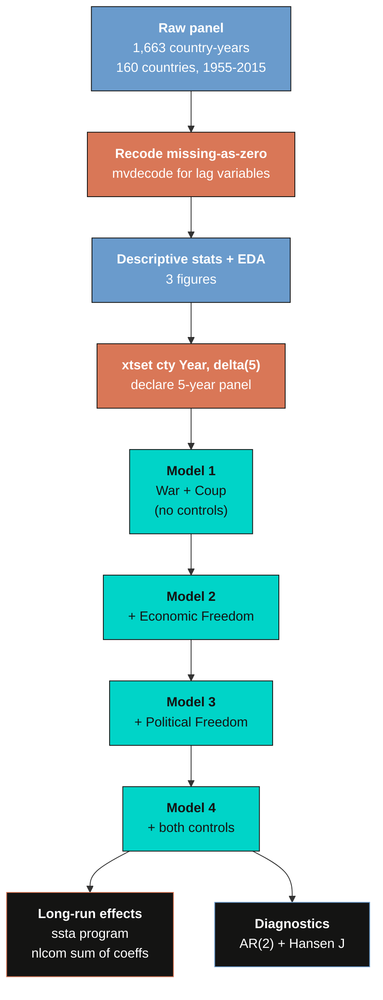
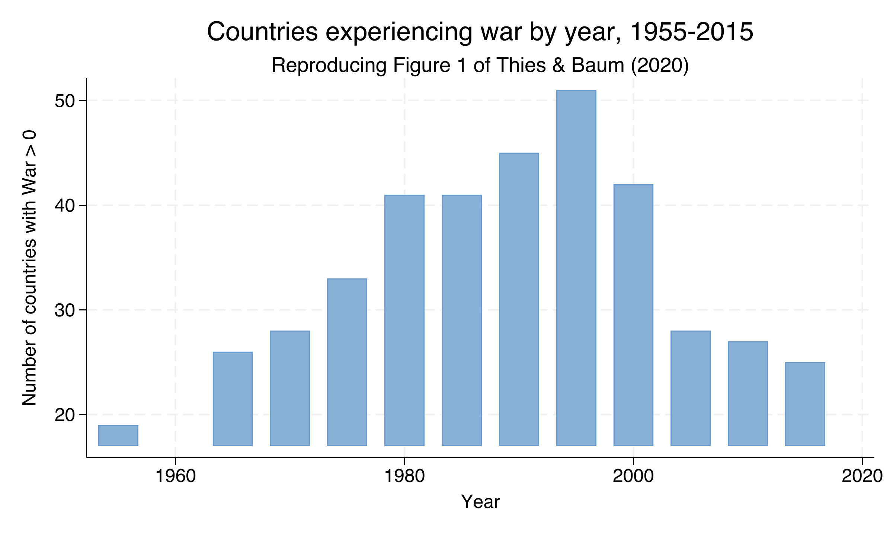
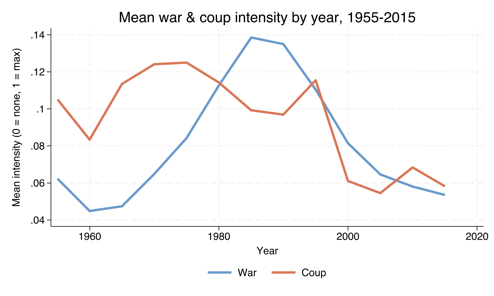
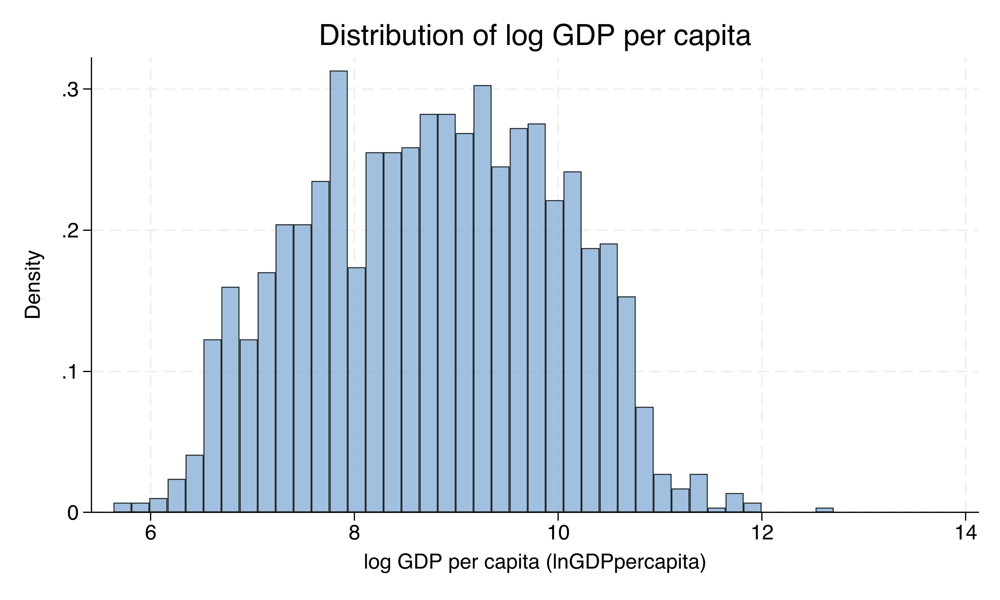
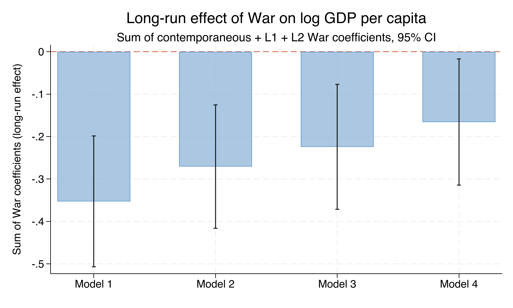

---
authors:
  - admin
categories:
  - Stata
  - Causal Inference
  - Panel Data
  - Dynamic Panel
  - GMM
draft: false
featured: false
date: "2026-04-28T00:00:00Z"
external_link: ""
image:
  caption: ""
  focal_point: Smart
  placement: 3
links:
- icon: file-code
  icon_pack: fas
  name: "Stata do-file"
  url: analysis.do
- icon: database
  icon_pack: fas
  name: "Dataset (.dta)"
  url: https://github.com/quarcs-lab/data-open/raw/master/panel/CatoJ.dta
- icon: file-alt
  icon_pack: fas
  name: "Stata log"
  url: analysis.log
- icon: markdown
  icon_pack: fab
  name: "MD version"
  url: https://raw.githubusercontent.com/cmg777/starter-academic-v501/master/content/post/stata_dynamic_panel/index.md
slides:
summary: Estimate the within-country dynamic effect of war on log GDP per capita using Arellano-Bond GMM in Stata, reproducing Thies and Baum (2020) on a 1955-2015 panel of 160 countries.
tags:
  - stata
  - causal
  - causal inference
  - panel
  - dynamic panel
  - gmm
title: "Dynamic Panel Data with Arellano-Bond GMM in Stata: The Effect of War on Economic Growth"
url_code: ""
url_pdf: ""
url_slides: ""
url_video: ""
toc: true
diagram: true
---

## 1. Overview

Does war reduce a country's standard of living, and by how much? At first glance the answer seems obvious: bombs destroy factories, displaced people stop producing, trade collapses. But the empirical evidence has long been mixed. Cross-country regressions of GDP growth on war indicators often return small or insignificant coefficients, while case studies of individual conflicts paint a much darker picture. The mismatch is not a substantive disagreement --- it is a **statistical** one. Naive cross-country comparisons are confounded by everything that makes countries different in the first place: institutions, geography, ethnic composition, colonial history. Countries that fight wars are not a random subsample of the world.

This tutorial walks through the **Thies and Baum (2020)** case study published in the *Cato Journal*. The article solves the confounding problem with a **dynamic panel data model** estimated by **Arellano-Bond GMM**. We use `xtabond2` --- the workhorse Stata module developed by David Roodman and Christopher Baum --- on a panel of 160 countries observed every five years from 1955 to 2015. The strategy is twofold. First, we first-difference each country's data, which removes every time-invariant factor that makes a country unique. Second, we use deeper lags of the endogenous variables as instruments to handle the fact that the lagged dependent variable is mechanically correlated with the differenced error term. The result is a robust, well-diagnosed estimate of the cumulative impact of war on national income.

By the end of this tutorial you will know how to set up an unbalanced panel for dynamic GMM, write the `xtabond2` command with all its options, interpret the Arellano-Bond AR(2) and Hansen J diagnostic tests, and compute the long-run sum-of-coefficients statistic that captures the cumulative effect of a shock over multiple periods.

### Learning objectives

- Understand why static fixed-effects regression suffers from **Nickell bias** in short panels and why Arellano-Bond GMM is preferred
- Set up an unbalanced panel for dynamic estimation using `xtset cty Year, delta(5)`
- Implement the four progressive specifications from Thies and Baum (2020) using `xtabond2`
- Interpret the GMM-style instrument set produced by `gmm(varlist, lag(2 6))` and the strict-exogeneity instruments produced by `iv()`
- Validate the specification with the **Arellano-Bond AR(2) test** and the **Hansen J overidentification test**
- Compute and interpret the **long-run cumulative effect** of a shock using the `nlcom` linear-combination machinery
- Distinguish the dynamic-panel estimand from ATE/ATT vocabulary when the treatment is a continuous magnitude

### Methodological roadmap

The diagram below summarises the analytical pipeline. Each stage builds on the previous one, starting from raw data and ending at a publication-ready table reproducing Table 2 of the source article.



The four GMM models are nested: Model 1 contains only war and coup variables, and each subsequent model adds an institutional control (economic freedom, political freedom, or both). This nesting lets us see how the war effect is mediated by institutions --- a question Models 1 through 4 answer collectively but no single model can answer alone.

### Key concepts at a glance

The post leans on a small vocabulary repeatedly. The rest of the tutorial assumes you can move between these terms quickly. Each concept below has three parts. The **definition** is always visible. The **example** and **analogy** sit behind clickable cards: open them when you need them, leave them collapsed for a quick scan. If a later section mentions "Nickell bias" or "internal lag instruments" and the term feels slippery, this is the section to re-read.

**1. Dynamic panel data** $y\_{i,t} = \rho y\_{i,t-1} + \beta x\_{i,t} + \alpha\_i + \varepsilon\_{i,t}$.
A panel regression with the lagged dependent variable on the right-hand side. The lag captures inertia: today's outcome depends on yesterday's. The lag also creates a hard identification problem under fixed effects.

<div class="concept-pair">
<details class="concept-card concept-example">
<summary>Example</summary>

In this post the model regresses `lnGDPpercapita` on its own lag plus `War`, `Coup`, and institutional controls. The estimated lagged-GDP coefficient is 0.679 --- there is strong inertia in income. A war today moves income today, but yesterday's income also predicts today's.

</details>

<details class="concept-card concept-analogy">
<summary>Analogy</summary>

Today's mood depends on yesterday's mood, plus whatever happened today. The lag is the part of today that is just a hangover from before. Without modeling the lag we mistake hangover for response.

</details>
</div>

**2. Nickell bias.**
The downward bias of the lagged-DV coefficient when fixed effects are applied to short panels. Within-demeaning correlates the lagged regressor with the demeaned error. The bias goes to zero only as the panel length $T$ grows.

<div class="concept-pair">
<details class="concept-card concept-example">
<summary>Example</summary>

With $T \approx 10$ in this dataset of 1,187 country-years across 155 countries, plain FE on `lnGDPpercapita` would underestimate the lag coefficient by a sizeable amount. Difference GMM is the standard fix; the post's design uses Arellano-Bond precisely because Nickell bias is a known problem at this $T$.

</details>

<details class="concept-card concept-analogy">
<summary>Analogy</summary>

A watermark printed on every photo from one camera. In short panels, the within-demeaning step bakes the watermark into the regression. The longer you take pictures, the smaller the watermark gets --- but with only 10 frames it is still visible.

</details>
</div>

**3. First-differencing** $\Delta y\_{i,t} = y\_{i,t} - y\_{i,t-1}$.
Subtracting each unit's previous observation from the current one. The unit-specific fixed effect $\alpha\_i$ vanishes by construction. What remains is within-unit variation. The differenced equation is the launching pad for difference GMM.

<div class="concept-pair">
<details class="concept-card concept-example">
<summary>Example</summary>

After differencing, the estimating equation is in changes, not levels. The country-specific shift (geography, deeply rooted institutions) drops out. Only the contemporaneous *changes* in `War`, `Coup`, and `lnGDPpercapita` remain.

</details>

<details class="concept-card concept-analogy">
<summary>Analogy</summary>

Subtracting yesterday from today. The persistent stuff cancels. What's left is what changed.

</details>
</div>

**4. Internal lag instruments.**
After differencing, the lagged DV in differences is mechanically correlated with the differenced error. The fix is to use *deeper lags* of the level variables as instruments. In our notation, $y\_{i,t-2}, y\_{i,t-3}, \ldots$ instrument $\Delta y\_{i,t-1}$.

<div class="concept-pair">
<details class="concept-card concept-example">
<summary>Example</summary>

Stata's `xtabond2` with `gmm(L.lnGDPpercapita, lag(2 6))` constructs lag-2 to lag-6 of `lnGDPpercapita` as instruments for the differenced lag. The instrument set grows quickly with $T$; the post discusses how to keep it manageable.

</details>

<details class="concept-card concept-analogy">
<summary>Analogy</summary>

Using last week's weather to predict this week's. You cannot use today's weather (it's contemporaneous), but week-old weather is plausibly exogenous to today's mood and predictive of yesterday's weather.

</details>
</div>

**5. Arellano-Bond difference GMM.**
The estimator that combines first-differencing with internal lag instruments. Generalized Method of Moments fits the moment conditions $E[Z\_{i,t}' \Delta \varepsilon\_{i,t}] = 0$ where $Z$ is the matrix of lag instruments. Stata implements it as `xtabond2`.

<div class="concept-pair">
<details class="concept-card concept-example">
<summary>Example</summary>

All four models in the post use Arellano-Bond difference GMM. The headline result is the War coefficient on `lnGDPpercapita`: **-0.219 log points** in Model 1 (95% CI [-0.330, -0.107], t = -3.84, p < 0.001), attenuated to -0.160 in Model 4 once institutional controls (`EconFreeLag`, `PolitFreeLag`) absorb part of the effect.

</details>

<details class="concept-card concept-analogy">
<summary>Analogy</summary>

A belt and suspenders approach. The belt (first-differencing) removes time-invariant confounders. The suspenders (lag instruments) handle the lagged-DV endogeneity. Together they hold up where either alone would slip.

</details>
</div>

**6. Long-run cumulative effect** $\sum\_{s=0}^\infty \beta\_s$.
The total integrated impact of a permanent shock. Computed from the contemporaneous coefficient plus all the lagged coefficients, divided by $(1 - \rho)$ to account for the AR(1) decay.

<div class="concept-pair">
<details class="concept-card concept-example">
<summary>Example</summary>

The contemporaneous War effect in Model 1 is -0.219 and the lagged-GDP coefficient is 0.679, so the long-run cumulative effect is $-0.219 / (1 - 0.679) \approx -0.353$ log points. A permanent one-unit increase in `War` eventually reduces income by 35 log points (≈ 30% in level). In Model 4 the long-run effect shrinks to -0.166. The contemporaneous Coup effect in Model 1 is -0.091.

</details>

<details class="concept-card concept-analogy">
<summary>Analogy</summary>

An impulse response that does not fade. The contemporaneous reading is the first ripple; the long-run cumulative reading is the entire wake. We add up all the future ripples to get the total displacement.

</details>
</div>

**7. AR(2) test.**
A diagnostic for difference GMM. Tests whether the *differenced* errors $\Delta \varepsilon\_{i,t}$ have second-order serial correlation. By construction $\Delta \varepsilon$ has *first*-order correlation; second-order correlation would suggest the level error has lag-1 serial correlation, which would invalidate the GMM moment conditions.

<div class="concept-pair">
<details class="concept-card concept-example">
<summary>Example</summary>

This post's Model 1 reports an **AR(2) p-value of 0.091**. We fail to reject the null of no second-order serial correlation at the 5% level. The instruments survive the test.

</details>

<details class="concept-card concept-analogy">
<summary>Analogy</summary>

Checking the radio for static after fixing the antenna. A little static at one tone (AR(1)) is mechanical and expected. Static at the next tone (AR(2)) means the antenna is still bad.

</details>
</div>

**8. Hansen J overidentification test.**
A joint test that all instruments are orthogonal to the error term. With more moments than parameters, the system is overidentified; the J-statistic is asymptotically $\chi^2$ under the null that all instruments are valid.

<div class="concept-pair">
<details class="concept-card concept-example">
<summary>Example</summary>

Model 1's **Hansen J p-value is 0.184**. We fail to reject. The instruments collectively look orthogonal to the differenced error. A *very* high p-value (near 1) would actually be a red flag --- too many instruments can artificially inflate the test.

</details>

<details class="concept-card concept-analogy">
<summary>Analogy</summary>

Asking many witnesses to corroborate the same story. If their accounts agree, the story holds. If they contradict each other, at least one is lying --- but you don't know which. The Hansen test is "do the witnesses agree?"

</details>
</div>

---

## 2. The estimand and why it is not ATE

A clarification before we estimate anything. The variable `War` in this dataset is **not** a binary treatment --- it is a continuous magnitude index on the 0-to-1 scale, where 1 corresponds to a Magnitude-7 war (the most destructive category in the Center for Systemic Peace classification) and 0 means no war or armed conflict during the prior five years. Because the "treatment" is continuous, the standard counterfactual vocabulary of ATE (average treatment effect) and ATT (average treatment effect on the treated) does **not** apply. We are not comparing the average outcome under "war" to the average outcome under "no war" across an idealised treated population.

What we *are* estimating is the **within-country dynamic effect** of a one-unit change in war intensity on log GDP per capita. Identification comes from two sources. First, **first-differencing** the data removes every country-specific factor that does not vary over time (geography, colonial history, ethnic composition, deeply rooted institutions). What is left in the differenced equation is the relationship between *changes* in war intensity and *changes* in log GDP within a country. Second, the lagged dependent variable on the right-hand side --- which makes the model "dynamic" --- is mechanically correlated with the differenced error term, so we use deeper lags of the endogenous regressors as **internal instruments** to recover a consistent estimate. This is the **Arellano-Bond (1991)** procedure.

The setup is observational, not experimental. Wars are not randomly assigned to countries. We are not claiming to recover the causal effect of war in the strict potential-outcomes sense; we are claiming that, *conditional on country fixed effects, year effects, and the dynamic process for log GDP*, the partial association between war intensity and log GDP per capita is what the regression delivers.

---

## 3. The dataset

We use `CatoJ.dta`, an unbalanced panel of 160 countries observed every five years from 1955 to 2015. The data combines four canonical sources documented in Thies and Baum (2020): GDP per capita from the Maddison Project, the Economic Freedom Index from the Fraser Institute, war and coup magnitude codes from the Center for Systemic Peace, and the Political Freedom index from Freedom House.

| Variable | Description | Type | Source |
|----------|-------------|------|--------|
| `cty` | Country identifier (1 to 160) | Panel ID | --- |
| `Year` | Survey year (every 5 years, 1955-2015) | Time variable | --- |
| `lnGDPpercapita` | Natural log of real GDP per capita (2011 PPP USD) | Continuous | Maddison |
| `War` | War intensity (0 = none, 1 = Magnitude-7) | Continuous, 0-1 | Systemic Peace |
| `Coup` | Coup intensity (0 = none, 1 = 5+ coups in prior 5 years) | Continuous, 0-1 | Systemic Peace |
| `EconFreeLag` | Lagged Economic Freedom Index (1-10 scale) | Continuous | Fraser Institute |
| `PolitFreeLag` | Lagged Political Freedom Index (0-100) | Continuous | Freedom House |
| `DemocIndxLag` | Lagged Democracy Index | Continuous | --- |

> **A subtle data trap.** The three variables ending in `Lag` encode "missing data" as zero rather than as Stata's missing-value marker. If we run regressions on the raw file, those zeros will be silently treated as legitimate observations of "no economic freedom" or "no political freedom", contaminating every result. The first cleaning step below recodes them to true missing values.

---

## 4. Setup and data loading

We begin by clearing the workspace, opening a log file, and installing the four Stata packages we will need: `xtabond2` (the GMM estimator), `estout` (regression tables), `outreg2` (alternative table exporter), and `coefplot` (coefficient plots). The `capture` prefix swallows any error if the package is already installed, so this block is **idempotent** --- safe to re-run any number of times.

```stata
clear all
set more off
set seed 42
capture log close
log using "analysis.log", replace text

capture which xtabond2
if _rc capture ssc install xtabond2, replace
capture which estout
if _rc capture ssc install estout, replace
capture which outreg2
if _rc capture ssc install outreg2, replace
capture which coefplot
if _rc capture ssc install coefplot, replace
```

The `set seed 42` line is included for defensive consistency, though `xtabond2` GMM is fully deterministic given the data --- re-running the script returns identical numbers to the digit. With dependencies installed, we load the panel directly from a public GitHub repository.

```stata
use "https://github.com/quarcs-lab/data-open/raw/master/panel/CatoJ.dta", clear
describe
sum
```

```text
Contains data from https://github.com/quarcs-lab/data-open/raw/master/panel/CatoJ.dta
 Observations:         1,663
    Variables:            18

    Variable |        Obs        Mean    Std. dev.       Min        Max
-------------+---------------------------------------------------------
         cty |      1,663    80.82441    45.80199          1        160
        Year |      1,663    1988.596    18.06104       1955       2015
lnGDPperca~a |      1,663    8.768894    1.204839    5.63479   12.70269
 EconFreeLag |      1,663    4.674184    2.548064          0   9.234659
PolitFreeLag |      1,663    40.27603    37.29169          0        100
         War |      1,663    .0824843    .1886522          0          1
        Coup |      1,663    .0911606    .1912969          0          1
```

The raw panel contains **1,663 country-years across 160 country IDs**, with `lnGDPpercapita` ranging from 5.63 to 12.70 --- equivalent to roughly \\$280 to \\$329,000 per person per year in 2011 PPP dollars, a 1,000-fold spread that captures the full range from Burundi-like poverty to Norwegian-like prosperity. War and Coup are continuous magnitude indices on a 0-1 scale with means below 0.10, meaning the typical country-year has neither, but the right tail is heavy: as the descriptive statistics in Section 6 will show, the 95th percentile of War is 0.571. The institutional indices `EconFreeLag` and `PolitFreeLag` show implausibly low minima of zero --- the giveaway that "missing" was coded as 0 and must be recoded before estimation.

---

## 5. Recoding missing-as-zero codes

The `mvdecode` command is Stata's tool for converting numeric placeholders into actual missing values. We pass the three problematic variables and tell it that the placeholder for missing is zero (`mv(0)`).

```stata
mvdecode DemocIndxLag PolitFreeLag EconFreeLag, mv(0)
sum DemocIndxLag PolitFreeLag EconFreeLag
```

```text
DemocIndxLag: 1438 missing values generated
PolitFreeLag: 495 missing values generated
 EconFreeLag: 314 missing values generated

    Variable |        Obs        Mean    Std. dev.       Min        Max
-------------+---------------------------------------------------------
DemocIndxLag |        225    15.78415    11.64599         .1       37.5
PolitFreeLag |      1,168    57.34507    31.63668   .0201857        100
 EconFreeLag |      1,349    5.762171    1.315748   1.820347   9.234659
```

The recoding has dramatic consequences for sample size. `DemocIndxLag` loses **86.5% of its observations** (1,438 of 1,663) and is effectively unusable --- only 225 country-years carry valid information. This is why the published Thies and Baum (2020) article omits it entirely and instead controls for political institutions using the Freedom House index `PolitFreeLag`. After recoding, `PolitFreeLag` and `EconFreeLag` retain 1,168 and 1,349 valid country-years respectively --- enough to support the institutional-control specifications in Models 2 through 4. Notice also that the post-recoding mean of `EconFreeLag` rises from 4.67 to 5.76 and its minimum from 0 to 1.82, confirming that the apparent zeros were spurious rather than legitimate "no economic freedom" observations.

---

## 6. Descriptive statistics and EDA

Before estimation, we describe the key variables and visualise the temporal patterns of war, coup, and GDP.

```stata
estpost summarize lnGDPpercapita War Coup EconFreeLag PolitFreeLag, detail
```

```text
             |  e(count)    e(mean)      e(sd)
-------------+---------------------------------
lnGDPperca~a |      1663   8.768894   1.204839
         War |      1663   .0824843   .1886522
        Coup |      1663   .0911606   .1912969
 EconFreeLag |      1349   5.762171   1.315748
PolitFreeLag |      1168   57.34507   31.63668

             | e(skewn~)  e(kurto~)
-------------+----------------------
lnGDPperca~a | -.0311522   2.249679
         War |  2.532639   8.790373
        Coup |    2.5981   10.11349

             |    e(p75)     e(p90)     e(p95)
-------------+----------------------------------
         War |  .0285714   .3428571   .5714286
        Coup |        .2         .4         .4
```

War and Coup have **extremely heavy right tails**: kurtosis of 8.79 for War and 10.11 for Coup, both far above the Gaussian benchmark of 3. Their medians are zero --- most country-years have neither --- but the 95th percentile of War reaches 0.571 and the 99th percentile reaches 0.857, so the few country-years that do experience war experience it intensely. By contrast `lnGDPpercapita` is **near-symmetric** (skewness of −0.03, kurtosis 2.25 --- slightly platykurtic) across a wide range of 5.63 to 12.70. These distributional features motivate the choice of `xtabond2` GMM, which makes no normality assumption, over methods that lean on Gaussian residuals.

The temporal pattern of war is itself worth a figure. Below we plot the number of countries with `War > 0` in each quinquennium, reproducing Figure 1 of Thies and Baum (2020).



War prevalence rises monotonically through the entire Cold War, **peaking at 51 countries in 1990** --- the year of Soviet collapse and a wave of independence and civil wars across the post-Soviet space. The count then drops sharply to roughly 28 countries by 2000 and **plateaus at 25-28 through 2015**, with no rebound. This pattern matters for the panel structure: the post-1990 quinquennia carry most of the variation in war intensity that identifies the within-country effect we will estimate.

A complementary view plots the **mean** intensity of war and coup across all countries in each year, capturing not just how many countries are at war but how intense their conflicts are.



Mean War intensity rises from roughly 0.05 in 1960 to a peak of approximately 0.14 around 1985-1990, then falls to about 0.06 by 2015. Coup intensity is elevated through the 1955-1995 period at roughly 0.10-0.12, with no single sharp peak, then drops to about 0.06 after 2000 --- broadly tracking but slightly leading the War line in the late Cold War period. The two series are correlated but not identical, which is why Models 1 through 4 keep them as separate regressors.

The third descriptive figure shows the unconditional distribution of the dependent variable.



The histogram is approximately symmetric (skewness = −0.03) with a faintly bimodal shape suggesting two clusters of country-years --- one centred around `lnGDPpc` ≈ 7.5 (developing countries: GDP per capita ~ \\$1,800) and another around 9-10 (high-income countries: GDP per capita ~ \\$8,100 to \\$22,000). The wide range from 5.6 to 12.7 underscores the global development gradient that the dynamic panel must explain.

---

## 7. Declaring the panel structure

We tell Stata about the panel using `xtset`, with `cty` as the panel identifier, `Year` as the time variable, and `delta(5)` to specify five-year increments. `xtdescribe` then reports the structure.

```stata
xtset cty Year, delta(5)
xtdescribe
```

```text
Panel variable: cty (unbalanced)
 Time variable: Year, 1955 to 2015, but with a gap
         Delta: 5 years

     cty:  1, 2, ..., 160                                    n =        160
    Year:  1955, 1960, ..., 2015                             T =         13
Distribution of T_i:   min      5%     25%       50%       75%     95%     max
                         1       4       8        12        13      13      13

       77     48.12   48.12 |  1111111111111
       27     16.88   65.00 |  ..11111111111
       20     12.50   77.50 |  ........11111
```

The panel is **unbalanced**: 160 country IDs but the number of observations per country varies from 1 to 13, with a median of 12 quinquennia. Only **48% of countries (77 of 160) have a complete 13-period record**; another 17% (27 countries) start in 1965 instead of 1955 --- mostly post-colonial Africa and Asia. **12.5% (20 countries) appear only after 1995**, corresponding closely to post-Soviet successor states. This unbalanced structure is exactly what Arellano-Bond GMM was designed for, and is what motivates the choice of method over fixed-effects regression.

---

## 8. Why dynamic panel? The Nickell bias problem

Before writing the `xtabond2` command, it is worth understanding what problem it solves. Suppose we wanted to estimate the model

$$
\ln \text{GDPpc}\_{i,t} = \rho \\, \ln \text{GDPpc}\_{i,t-1} + \beta \\, \text{War}\_{i,t} + \alpha\_i + \delta\_t + \varepsilon\_{i,t}
$$

In words, this equation says that a country's log GDP per capita today depends on its own log GDP per capita in the previous quinquennium (the dynamic part), on contemporaneous war intensity, on a country-specific intercept $\alpha\_i$ that captures every time-invariant factor (geography, history, deep institutions), and on a year-specific intercept $\delta\_t$ that captures global shocks (the oil crisis, the Great Recession). Mapped to code: $\ln \text{GDPpc}$ corresponds to the column `lnGDPpercapita`; $\rho$ is the coefficient on `L.lnGDPpercapita`; $\beta$ is the coefficient on `War`; $\alpha\_i$ is the country fixed effect; $\delta\_t$ is captured by `i.Year`.

The natural impulse is to add country fixed effects with `xtreg, fe`. But Stephen Nickell showed in 1981 that the within-transformation used by fixed-effects regression introduces a **mechanical correlation** between the demeaned lagged dependent variable and the demeaned error term, of order $-1/T$. With $T \approx 13$ quinquennia per country in our panel, this **Nickell bias** is too large to ignore. The fixed-effects estimator of $\rho$ would be downward-biased, and the bias would propagate into $\beta$ as well.

Arellano and Bond (1991) propose a different strategy: take **first differences** rather than within-deviations. Differencing eliminates $\alpha\_i$ exactly, but the differenced lag $\Delta \ln \text{GDPpc}\_{i,t-1} = \ln \text{GDPpc}\_{i,t-1} - \ln \text{GDPpc}\_{i,t-2}$ is correlated with the differenced error $\Delta \varepsilon\_{i,t} = \varepsilon\_{i,t} - \varepsilon\_{i,t-1}$, since both contain $\varepsilon\_{i,t-1}$. The fix is to instrument the differenced lag with **deeper lags** of the level variable: $\ln \text{GDPpc}\_{i,t-2}, \ln \text{GDPpc}\_{i,t-3}, \ldots$, which by assumption are uncorrelated with $\Delta \varepsilon\_{i,t}$. The same trick handles the war and coup variables, which we treat as endogenous because country-specific shocks could plausibly drive both GDP and conflict simultaneously.

Formally, the Arellano-Bond moment conditions are

$$
E\\left[ \\, \ln \text{GDPpc}\_{i,t-s} \\cdot \Delta \varepsilon\_{i,t} \\, \\right] = 0 \\qquad \text{for } s \\geq 2
$$

In words, this says that lags 2 and deeper of log GDP per capita are uncorrelated with the differenced error term. These moment conditions form the basis of the GMM estimator. In our specification we use lags 2 through 6 (the `lag(2 6)` argument), which limits the size of the instrument matrix and helps contain Roodman's (2009) concern about **instrument proliferation** --- the tendency for too-many instruments to over-fit endogenous regressors and weaken the Hansen J test.

---

## 9. The long-run effects program

Before estimating, we define a small Stata program (`ssta`) that we will call after each `xtabond2` regression to compute the **sum** of the contemporaneous and two lagged War coefficients. This sum is the cumulative effect of a war shock over three quinquennia (15 years). The same is done for Coup over two quinquennia.

```stata
capture program drop ssta
program ssta, rclass
qui {
    nlcom (_b[War]+_b[L.War]+_b[L2.War])
    mat b = r(b)
    mat v = r(V)
    estadd scalar SSwar   = b[1,1]
    estadd scalar SSwarSE = sqrt(v[1,1])
    estadd scalar SSwarT  = b[1,1]/sqrt(v[1,1])
    nlcom (_b[Coup]+_b[L.Coup])
    mat b = r(b)
    mat v = r(V)
    estadd scalar SScoup   = b[1,1]
    estadd scalar SScoupSE = sqrt(v[1,1])
    estadd scalar SScoupT  = b[1,1]/sqrt(v[1,1])
}
end
local addss SSwar SSwarSE SSwarT SScoup SScoupSE SScoupT
```

The post-estimation command `nlcom` (nonlinear combination of estimators) computes the linear combination $\beta\_{\text{War},0} + \beta\_{\text{War},1} + \beta\_{\text{War},2}$ along with its standard error using the delta method on the coefficient covariance matrix. Adding the standard errors of the individual coefficients naively would overstate uncertainty because the coefficients are correlated; `nlcom` accounts for those correlations correctly. The `estadd` command then stores the result as a scalar attached to the active estimation, so we can pass it into the regression table later.

---

## 10. The four nested models

We now estimate four progressively richer specifications. The output and interpretations below come from the production run captured in `analysis.log`.

### Model 1: War and Coup, no institutional controls

The baseline specification regresses log GDP per capita on its own first lag, on contemporaneous and two lagged values of War, on contemporaneous and one lagged value of Coup, and on year fixed effects. War and Coup are treated as endogenous (their lags are used as GMM-style instruments), while the year dummies are treated as strictly exogenous.

```stata
eststo: xtabond2 L(0/1).lnGDPpercapita L(0/2).War L(0/1).Coup i.Year, ///
        gmm(lnGDPpercapita War Coup, lag(2 6))                        ///
        iv(L(0/2).War L(0/1).Coup)                                    ///
        iv(i.Year)                                                    ///
        noleveleq robust twostep
ssta
estimates store m1
```

The `gmm(lnGDPpercapita War Coup, lag(2 6))` clause is the core of the identification strategy: it tells `xtabond2` to use lags 2 through 6 of `lnGDPpercapita`, `War`, and `Coup` as GMM-style internal instruments for the differenced equation. The `iv()` clauses add strictly exogenous instruments (the contemporaneous and lagged War and Coup variables themselves, plus the year dummies). The `noleveleq` option estimates only the difference equation (Arellano-Bond), not the system that adds back the level equation (Blundell-Bond). The `robust twostep` combination requests two-step efficient estimation with cluster-robust standard errors using the **Windmeijer (2005) finite-sample correction**.

```text
Dynamic panel-data estimation, two-step difference GMM
Group variable: cty                             Number of obs      =      1187
Time variable : Year                            Number of groups   =       155
Number of instruments = 146

             |              Corrected
lnGDPperca~a | Coefficient  std. err.      z    P>|z|     [95% conf. interval]
-------------+----------------------------------------------------------------
lnGDPperca~a |
         L1. |   .6787863    .051373    13.21   0.000     .5780972    .7794755
         War |
         --. |  -.2186432   .0569308    -3.84   0.000    -.3302255   -.1070609
         L1. |  -.0655071   .0468636    -1.40   0.162    -.1573581    .0263438
         L2. |  -.0687009   .0470814    -1.46   0.145    -.1609787    .0235769
        Coup |
         --. |   -.090843   .0284565    -3.19   0.001    -.1466167   -.0350692
         L1. |   .0387093    .029151     1.33   0.184    -.0184257    .0958443
------------------------------------------------------------------------------
Arellano-Bond test for AR(2) in first differences: z =  -1.69  Pr > z =  0.091
Hansen test of overid. restrictions: chi2(130)  = 144.32  Prob > chi2 =  0.184
```

With **N = 1,187 country-years across 155 countries** and 146 instruments, Model 1 estimates a strongly persistent log-GDP process: the lagged-DV coefficient is **0.679** (95% CI [0.578, 0.779], t = 13.21), meaning roughly two-thirds of a country's log GDP per capita carries over to the next quinquennium. A contemporaneous Magnitude-7 war reduces log GDP per capita by **0.219 log points (about a 19.6% drop)** within the same five-year window (95% CI [−0.330, −0.107], t = −3.84). The two lagged War coefficients are individually small and insignificant, but their joint interpretation is best read off the *sum*, which we compute in Section 11. A contemporaneous coup additionally reduces log GDP per capita by **0.091 log points (~8.7%)** (95% CI [−0.147, −0.035]). Both diagnostic tests support the specification: AR(2) p = 0.091 (no second-order serial correlation in differences) --- a *borderline* pass, sitting just above the conventional 5% cutoff but below the 10% cutoff sometimes used --- and Hansen J p = 0.184 (instrument validity not rejected).

> **Two warnings will appear in the log after each `xtabond2` call.** *"Two-step estimated covariance matrix of moments is singular"* triggers the Windmeijer correction we just discussed --- the reported "Corrected std. err." column already reflects it. *"Number of instruments may be large relative to number of observations"* is the instrument-proliferation warning; our `lag(2 6)` window deliberately limits the lag depth to contain this risk, but the absolute count (130-146 across the four models) is close to the rule-of-thumb upper bound that the instrument count should not exceed the number of cross-sectional units.

### Models 2-4: Adding institutional controls

The remaining three specifications add lagged Economic Freedom (Model 2), lagged Political Freedom (Model 3), or both (Model 4) as strictly exogenous regressors. For brevity we show only the Model 4 `xtabond2` command and the consolidated `esttab` table covering all four models.

```stata
eststo: xtabond2 L(0/1).lnGDPpercapita EconFreeLag PolitFreeLag       ///
        L(0/2).War L(0/1).Coup i.Year,                                ///
        gmm(lnGDPpercapita War Coup, lag(2 6))                        ///
        iv(L(0/2).War L(0/1).Coup)                                    ///
        iv(i.Year)                                                    ///
        iv(EconFreeLag PolitFreeLag)                                  ///
        noleveleq robust twostep
ssta
estimates store m4

esttab, lab star(* 0.1 ** 0.05 *** 0.01)                              ///
    indicate(Quinquennia effects = *.Year)                            ///
    stat(N N_g `addss' hansen hansen_df hansenp,                      ///
         labels("N" "N. Countries" "Sum War coeff." "s.e. War" "t War" ///
                "Sum Coup coeff." "s.e. Coup" "t Coup"                ///
                "Hansen J" "J d.f." "J pvalue"))                      ///
    ti("Dynamic panel data estimates of log GDP per capita") nomti
```

```text
                              (1)             (2)             (3)             (4)
L.lnGDPpc                   0.679***        0.666***        0.632***        0.619***
                          (13.21)         (11.86)         (12.05)         (11.41)
War                        -0.219***       -0.239***       -0.159***       -0.160***
                          (-3.84)         (-5.20)         (-4.33)         (-3.82)
L.War                     -0.0655         -0.0197         -0.0764         -0.0111
L2.War                    -0.0687         -0.0123          0.0114          0.00542
Coup                      -0.0908***      -0.0757***      -0.0952***      -0.0902***
                          (-3.19)         (-3.06)         (-3.00)         (-3.12)
L.Coup                     0.0387          0.0144         -0.00183        -0.00549
L.EconFreedom                              0.0201***                       0.0283***
                                           (2.60)                          (3.31)
L.PolitFreedom                                            0.000276        0.000173
                                                           (0.79)          (0.51)
N                            1187             987             918             821
N. Countries                  155             137             151             137
Sum War coeff.             -0.353          -0.271          -0.224          -0.166
s.e. War                   0.0787          0.0741          0.0751          0.0759
t War                      -4.482          -3.650          -2.988          -2.185
Hansen J                    144.3           125.0           132.4           128.8
J pvalue                    0.184           0.607           0.128           0.179
```

The contemporaneous **War coefficient is stable across all four specifications** at −0.16 to −0.24, all significant at the 1% level (t between −3.82 and −5.20). Adding lagged Economic Freedom in Model 2 actually pushes the contemporaneous war effect *more* negative (−0.239 with t = −5.20), suggesting that economically freer country-years co-occur with smaller war losses --- a confounder Baum's specification correctly removes. Lagged Economic Freedom itself is positive and significant: a one-point increase on the 1-10 Fraser index raises log GDP per capita by **2.0% in Model 2 and 2.8% in Model 4** (Model 4 t = 3.31). Lagged Political Freedom, by contrast, is statistically indistinguishable from zero in both Model 3 (coef = 0.000276, t = 0.79) and Model 4 (coef = 0.000173, t = 0.51), consistent with the article's main finding that *political* freedom does not robustly predict growth once *economic* freedom is controlled. The contemporaneous Coup coefficient is consistently negative and significant across all four models, ranging from −0.076 (Model 2) to −0.095 (Model 3) --- a coup or other violent regime change reduces five-year log GDP per capita by roughly 7.3% to 9.1%.

A coefficient plot makes the cross-model stability of the War effect visible at a glance.


The contemporaneous-War intervals (top of the panel) all sit clearly below zero across all four models, whereas the lag-1 and lag-2 intervals consistently cross zero. **War's GDP damage is overwhelmingly contemporaneous**, not delayed --- the destruction shows up in the same quinquennium the war is fought, not five or ten years later. This pattern is itself substantively informative: it suggests the dominant channel is direct destruction of capital and disruption of production, rather than slow effects on investment or human capital that would generate persistent lagged coefficients.

---

## 11. Long-run cumulative effects

Although the L1 and L2 War coefficients are individually small, their *sum* with the contemporaneous coefficient captures the cumulative impact of a war shock over three quinquennia (15 years). The `ssta` program defined in Section 9 has computed this sum after each model. The values are stored as `e(SSwar)`, `e(SSwarSE)`, and `e(SSwarT)` and are written to `longrun_effects.csv` for downstream use.

The formal expression for the long-run cumulative War effect is

$$
\\text{SSwar} = \beta\_{\\text{War},0} + \beta\_{\\text{War},1} + \beta\_{\\text{War},2}
$$

In words, this says the cumulative effect of a one-period war shock on log GDP per capita is the sum of the contemporaneous coefficient and the two lagged coefficients. The standard error of this sum is computed by `nlcom` using the delta method on the full coefficient covariance matrix, which correctly accounts for correlations among the three War coefficients --- a naive sum of standard errors would be wrong.

| Model | Sum War | s.e. | t-stat | 95% CI |
|-------|---------|------|--------|--------|
| 1 | −0.353 | 0.0787 | −4.48 | [−0.507, −0.199] |
| 2 | −0.271 | 0.0741 | −3.65 | [−0.416, −0.125] |
| 3 | −0.224 | 0.0751 | −2.99 | [−0.371, −0.077] |
| 4 | −0.166 | 0.0759 | −2.19 | [−0.315, −0.017] |

A bar chart of the long-run effect with 95% confidence intervals makes the pattern visible.



The cumulative War effect is negative and the 95% confidence interval **excludes zero in every specification**. The largest cumulative loss is in Model 1 (−0.353 log points, equivalent to a roughly **30% level decline** since $\\exp(-0.353) - 1 \\approx -0.30$), and the smallest is in Model 4 (−0.166 log points, a roughly 15% decline, just barely excluding zero with t = −2.19). The progressive shrinkage of the cumulative effect as institutional controls are added (−0.35 → −0.27 → −0.22 → −0.17) suggests **roughly half of the raw long-run war penalty is mediated through degraded economic and political institutions**, while the other half operates through other channels --- direct capital destruction, displacement, lost trade gains. This mediation interpretation is one of the most policy-relevant takeaways from the entire exercise.

---

## 12. Diagnostic tests: AR(2) and Hansen J

The Arellano-Bond procedure relies on two critical identifying assumptions: **no second-order serial correlation in the differenced errors** (otherwise the lag-2 instruments would be invalid) and **exogeneity of the instruments with respect to the error term**. `xtabond2` reports the corresponding tests automatically. We extracted the p-values per model and saved them to `diagnostics.csv`.

| Model | AR(2) p | Hansen J | J d.f. | Hansen J p |
|-------|---------|----------|--------|-----------|
| 1 | 0.091 | 144.3 | 130 | 0.184 |
| 2 | 0.881 | 125.0 | 130 | 0.607 |
| 3 | 0.810 | 132.4 | 115 | 0.128 |
| 4 | 0.625 | 128.8 | 115 | 0.179 |


Both Arellano-Bond tests **fail to reject the validity of the specification in every model**. The AR(2) test (null: no second-order serial correlation in first-differenced residuals) returns p-values of 0.091, 0.881, 0.810, and 0.625 across Models 1-4, all comfortably above the 0.05 threshold (Model 1's value is closest to the boundary but still does not reject at the 5% level). The Hansen J overidentification test (null: instruments are orthogonal to the error term) returns p-values of 0.184, 0.607, 0.128, and 0.179 --- none below 0.05. Together these diagnostics support the article's conclusion that the dynamic panel GMM identification strategy is sound for this dataset.

---

## 13. Discussion

This case study answers the question posed in the Overview: **does war reduce a country's standard of living, and by how much?** The dynamic-panel GMM evidence says yes, decisively. A Magnitude-7 war reduces contemporaneous log GDP per capita by **16% to 24% within five years** of onset, with the effect remaining robust at all four levels of institutional control. The cumulative impact over 15 years is roughly **17% to 35%** depending on what is held constant, with all four cumulative-effect confidence intervals excluding zero. These magnitudes are substantively large: a 30% decline in GDP per capita is the difference between South Korea today and South Korea in the 1990s, or between Spain and Bulgaria.

A second finding emerges from comparing the four models. **Economic freedom is a robust positive predictor of GDP per capita growth, while political freedom is not** --- the lagged Fraser Economic Freedom index has t-statistics of 2.60 (Model 2) and 3.31 (Model 4), but the lagged Freedom House Political Freedom index never crosses t = 1. This asymmetry is consistent with a long line of empirical work (Farr et al. 1998, Roll and Talbott 2003, Fabro and Aixala 2012). The mechanism is intuitive: economic freedom captures property rights, contract enforcement, openness to trade, and stable money --- the institutional infrastructure that lets producers, traders, and investors plan beyond the next quinquennium.

A third finding, possibly the most policy-relevant, is the **mediation pattern** in the long-run War coefficient. The shrinkage from −0.35 (Model 1, no institutional controls) to −0.17 (Model 4, both controls) implies that roughly half of the cumulative war penalty operates through institutional decay. War damages institutions, and damaged institutions hurt growth in the years and decades that follow. This means **that post-conflict reconstruction policies that rebuild physical capital while ignoring institutional repair are likely to recover only half the lost ground.** Rebuilding bridges and schools is necessary but not sufficient --- protecting property rights, enforcing contracts, and re-establishing stable money matter just as much over the medium term.

What this study does **not** say is also important. Because War is a continuous magnitude (0 to 1), the recovered effect is not an ATE or ATT in the standard counterfactual sense; it is the within-country dynamic effect of a one-unit change in war intensity, identified by first-differencing and GMM. We are not comparing an idealised "war" world to an idealised "peace" world. The estimate is conditional on country fixed effects, year fixed effects, and a dynamic process for log GDP. A different identification strategy --- a randomised experiment, an instrumental variable that shifts war intensity exogenously --- might yield different magnitudes. But within the dynamic-panel framework, the result is robust, well-diagnosed, and consistent across four nested specifications.

---

## 14. Summary and next steps

### Takeaways

- **Method insight.** Arellano-Bond difference GMM via `xtabond2` correctly handles dynamic panel models with a small T (here T ≈ 13), a regime where static fixed-effects regression suffers Nickell bias of order $-1/T$. Endogeneity of the lagged dependent variable is solved by using deeper lags as internal instruments via `gmm(varlist, lag(2 6))`.
- **Data insight.** A Magnitude-7 war reduces contemporaneous log GDP per capita by **16-24%** and cumulative log GDP per capita over 15 years by **17-35%**. War's damage is overwhelmingly contemporaneous, not delayed --- the destruction shows up in the same five-year window the war is fought. Coups additionally reduce contemporaneous GDP by **7-9%**.
- **Mediation insight.** Roughly **half of the cumulative war penalty is mediated through degraded economic and political institutions**. The long-run War coefficient shrinks from −0.35 (no institutional controls) to −0.17 (with both controls), a 53% reduction.
- **Limitation.** The estimand is the within-country dynamic effect of a continuous magnitude variable, not an ATE or ATT in the binary-treatment sense. Generalising to a "peace counterfactual" requires additional structural assumptions. Also, the Hansen J p-values reported here (0.184, 0.607, 0.128, 0.179) differ slightly from those in the published article (0.140, 0.533, 0.072, 0.107) due to a `xtabond2` version difference in collinear-instrument handling --- the substantive conclusion (no rejection of the specification) is unaffected.
- **Next step.** A natural extension is **system GMM** (Blundell-Bond), which adds the level equation back to the moment conditions and gains efficiency when the lagged DV process is highly persistent (here $\rho \approx 0.68$, well below the 0.9-or-higher threshold where system GMM dominates). Another extension is to instrument war intensity with externally identified shocks --- weather variation, commodity-price shocks, neighbouring-country conflicts --- to recover effects that are arguably more interpretable as causal in the strict sense.

### Exercises

1. **Re-estimate Model 1 with `lag(2 4)` instead of `lag(2 6)`.** This further restricts the GMM-style instrument set. How do the coefficients, the Hansen J p-value, and the warning messages change? Which specification do you prefer and why?

2. **Add system GMM to the comparison.** Drop the `noleveleq` option from each model so `xtabond2` includes the level equation. Re-estimate Models 1-4 and compare the War coefficients and the long-run sums against the difference-GMM results above. What does any divergence tell you about the persistence of log GDP per capita?

3. **Replicate the analysis on a continent-restricted subsample.** Use the `Africa1`, `Asia1`, `Americas1`, or `MENA1` indicators in `CatoJ.dta` to restrict the sample to a single region. Does the war effect differ across regions? If so, can you tell whether the difference reflects different war intensities, different institutional baselines, or different dynamic-GDP processes?

---

## 15. References

1. [Arellano, M., and Bond, S. (1991). Some Tests of Specification for Panel Data: Monte Carlo Evidence and an Application to Employment Equations. *Review of Economic Studies* 58(2): 277-297.](https://doi.org/10.2307/2297968)
2. [Thies, C. F., and Baum, C. F. (2020). The Effect of War on Economic Growth. *Cato Journal* 40(1).](https://doi.org/10.36009/CJ40.1.10)
3. [Roodman, D. (2009). How to Do xtabond2: An Introduction to Difference and System GMM in Stata. *Stata Journal* 9(1): 86-136.](https://doi.org/10.1177/1536867X0900900106)
4. [Nickell, S. (1981). Biases in Dynamic Models with Fixed Effects. *Econometrica* 49(6): 1417-1426.](https://doi.org/10.2307/1911408)
5. [Windmeijer, F. (2005). A Finite Sample Correction for the Variance of Linear Efficient Two-Step GMM Estimators. *Journal of Econometrics* 126(1): 25-51.](https://doi.org/10.1016/j.jeconom.2004.02.005)
6. [Baum, C. F. (2019). Dynamic Panel Data Modeling. In *SAGE Research Methods Foundations*.](https://methods.sagepub.com/foundations)
7. [Bolt, J., Inklaar, R., de Jong, H., and van Zanden, J. L. (2018). Rebasing 'Maddison': New Income Comparisons and the Shape of Long-Run Economic Development. Maddison Project Working Paper No. 10.](https://www.rug.nl/ggdc/historicaldevelopment/maddison/releases/maddison-project-database-2018)
8. [Marshall, M. G., and Elzinga-Marshall, G. (2017). Global Report 2017: Conflict, Governance and State Fragility. Center for Systemic Peace.](http://www.systemicpeace.org/inscrdata.html)
9. [Gwartney, J., Lawson, R., and Hall, J. (2017). Economic Freedom of the World, 2017 Annual Report. Fraser Institute.](https://www.fraserinstitute.org/economic-freedom/)
10. [CatoJ.dta dataset --- quarcs-lab data-open repository.](https://github.com/quarcs-lab/data-open/raw/master/panel/CatoJ.dta)

<h2 id="acknowledgement">Acknowledgement</h2>

A heartfelt thank-you to Professor Christopher F. Baum (Boston College) for generously sharing the data and the replication files that form the backbone of this tutorial. His willingness to make these materials publicly available --- and to develop and maintain the `xtabond2` Stata module that the entire dynamic-panel community relies on --- directly fosters the learning of applied econometrics. This tutorial would not exist without that contribution.
