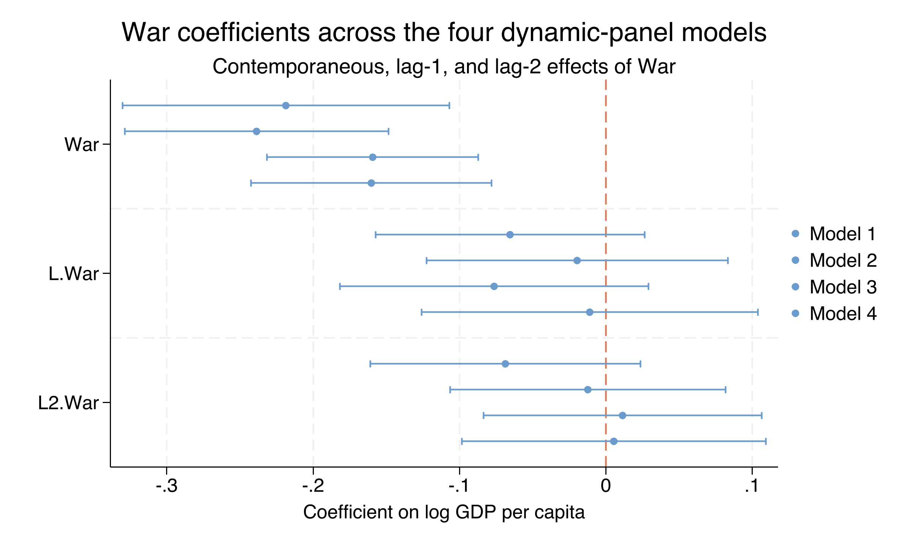
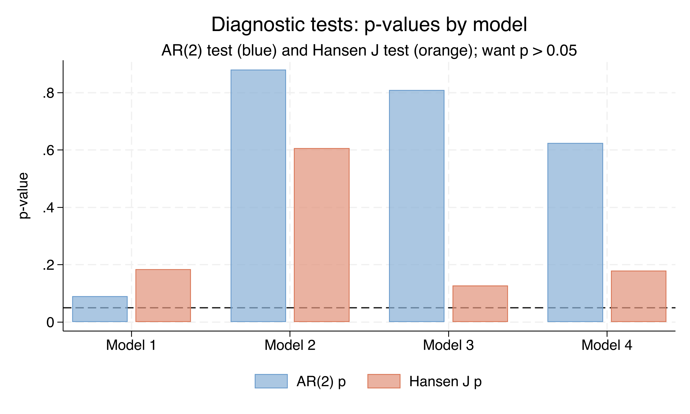

# The Tension {.divider background-color="#d97757"}

[Act I]{.act}

## Bombs destroy factories — so why do cross-country regressions shrug?

Case studies of individual conflicts paint a dark picture. Yet cross-country regressions of growth on war often return small or insignificant coefficients.

. . .

The mismatch is not substantive — it is **statistical**. Countries that fight wars are *not* a random subsample of the world. *Which countries you compare decides the answer.*

::: {.notes}
The central tension: institutions, geography, ethnic composition, and colonial history all confound a naive war–growth comparison. Countries at war differ systematically from countries at peace, so the cross-section confounds the war shock with everything else. The fix is to compare each country to itself over time — and to handle the dynamics correctly.
:::

## War prevalence peaked at 51 countries in 1990, then plateaued


::: {.notes}
War prevalence rises monotonically through the Cold War, peaking at 51 countries in 1990 — Soviet collapse, post-Soviet civil wars — then drops to ~28 by 2000 and plateaus at 25–28 through 2015. The post-1990 quinquennia carry most of the war-intensity variation that identifies the within-country effect.
:::

## Where we're going

::: {.incremental}
- The lab: a 160-country, 1955–2015 panel observed every 5 years
- Why static fixed effects fails here — **Nickell bias** of order $-1/T$
- Arellano–Bond difference GMM: first-difference, then instrument with deeper lags
- Four nested models, the long-run cumulative effect, and AR(2) / Hansen diagnostics
:::

# The Investigation {.divider background-color="#6a9bcc"}

[Act II]{.act}

## The lab: 160 countries × 13 quinquennia, 1955–2015

::: {.incremental}
- **Outcome** — $\ln$ GDP per capita (Maddison, 2011 PPP USD)
- **Treatment** — War intensity, a continuous $0$–$1$ magnitude ($1$ = Magnitude-7 war)
- **Controls** — Coup intensity, lagged Economic Freedom (Fraser), lagged Political Freedom (Freedom House)
:::

[An *unbalanced* panel: 1,663 country-years, T ranging from 1 to 13 — exactly what Arellano–Bond was designed for.]{.comment}

::: {.notes}
CatoJ.dta combines four canonical sources documented in Thies & Baum (2020). War and Coup are continuous magnitude indices on a 0–1 scale with means below 0.10 — the median country-year has neither, but the right tail is heavy (95th percentile of War = 0.571). Only 48% of countries have a complete 13-period record.
:::

## A data trap: "missing" was coded as zero, not as missing

``` {.stata code-line-numbers="1|2"}
mvdecode DemocIndxLag PolitFreeLag EconFreeLag, mv(0)
sum DemocIndxLag PolitFreeLag EconFreeLag
```

The three lagged institutional variables encode missing data as $0$.

[`DemocIndxLag` loses 86.5% of its rows to recoding — which is why the published study drops it entirely.]{.comment}

::: {.notes}
Left raw, those zeros masquerade as legitimate observations of "no economic freedom." After mvdecode, EconFreeLag's mean rises from 4.67 to 5.76 and its minimum from 0 to 1.82 — the apparent zeros were spurious. PolitFreeLag and EconFreeLag retain 1,168 and 1,349 valid country-years; DemocIndxLag retains only 225, effectively unusable.
:::

## War and coup are heavy-tailed; GDP is near-symmetric


::: {.notes}
War kurtosis 8.79, Coup 10.11 — far above the Gaussian benchmark of 3; both have zero medians. ln GDP per capita is near-symmetric (skewness −0.03, kurtosis 2.25). These distributional features motivate xtabond2 GMM, which makes no normality assumption, over methods that lean on Gaussian residuals.
:::

## War and coup intensity both rose in the late Cold War, then fell


::: {.notes}
Mean War rises from ~0.05 in 1960 to ~0.14 around 1985–1990, then falls to ~0.06 by 2015. Coup is elevated at 0.10–0.12 through 1955–1995, then drops after 2000. The two series are correlated but not identical — which is why Models 1–4 keep them as separate regressors.
:::

## The model is dynamic: today's income depends on yesterday's

$$\ln\text{GDPpc}_{i,t} = \rho\,\ln\text{GDPpc}_{i,t-1} + \beta\,\text{War}_{i,t} + \alpha_i + \delta_t + \varepsilon_{i,t}$$

The lagged term $\rho\,\ln\text{GDPpc}_{i,t-1}$ captures inertia: income is sticky. $\alpha_i$ absorbs every time-invariant country trait; $\delta_t$ absorbs global shocks.

[The lag is what makes the model "dynamic" — and what makes it hard to estimate.]{.comment}

::: {.notes}
Mapped to code: ρ is the coefficient on L.lnGDPpercapita; β is the coefficient on War; α_i is the country fixed effect; δ_t is captured by i.Year. Strong inertia in income (ρ ≈ 0.68) is the substantive reason the dynamic specification is needed — a static regression would mis-attribute persistence to the covariates.
:::

## Static fixed effects break here — Nickell bias of order $-1/T$

[Objection.]{.objection} "Just add country fixed effects with `xtreg, fe`."

. . .

[Response.]{.rebuttal} Within-demeaning correlates the demeaned lagged DV with the demeaned error — a mechanical **Nickell bias** of order $-1/T$. With $T \approx 13$ it is too large to ignore, and it propagates from $\rho$ into $\beta$.

::: {.notes}
Stephen Nickell (1981) showed the within-transformation introduces this bias. It vanishes only as T grows; with 13 quinquennia per country it is still visible — like a watermark printed on every photo. Arellano–Bond is the standard fix: difference instead of demean.
:::

## The fix: first-difference to kill $\alpha_i$, then instrument the lag

$$\Delta\ln\text{GDPpc}_{i,t} = \rho\,\Delta\ln\text{GDPpc}_{i,t-1} + \beta\,\Delta\text{War}_{i,t} + \Delta\varepsilon_{i,t}$$

Differencing erases $\alpha_i$ exactly — but it makes the differenced lag endogenous.

[Belt and suspenders: differencing removes confounders, lag-instruments handle the lagged-DV endogeneity.]{.comment}

::: {.notes}
The differenced lag $\Delta\ln\text{GDPpc}_{i,t-1}$ and the differenced error $\Delta\varepsilon_{i,t}$ both contain $\varepsilon_{i,t-1}$ — that shared term is the endogeneity. First-differencing is the launching pad for difference GMM. The differenced lag's correlation with the differenced error is the problem the internal instruments solve. War and Coup are also treated as endogenous, since country-specific shocks could drive both GDP and conflict at once.
:::

## Deeper lags are valid instruments: the Arellano–Bond moment conditions

$$E\!\left[\,\ln\text{GDPpc}_{i,t-s}\cdot\Delta\varepsilon_{i,t}\,\right] = 0 \qquad \text{for } s \geq 2$$

Lags $2$ and deeper of the *level* are uncorrelated with the differenced error — so they are valid instruments for the differenced lag.

[We use lags $2$–$6$: deep enough to be exogenous, shallow enough to contain instrument proliferation.]{.comment}

::: {.notes}
Concretely, $\ln\text{GDPpc}_{i,t-2}, \ln\text{GDPpc}_{i,t-3},\ldots$ instrument $\Delta\ln\text{GDPpc}_{i,t-1}$. These moment conditions form the basis of the GMM estimator. Restricting to lag(2 6) limits the instrument-matrix size — Roodman's (2009) concern is that too many instruments over-fit endogenous regressors and weaken the Hansen J test. Like using last week's weather to predict this week's: exogenous to today's shock, predictive of yesterday's value.
:::

## Six lines fit difference GMM in Stata with `xtabond2`

``` {.stata code-line-numbers="1-2|3|4-5|6"}
xtabond2 L(0/1).lnGDPpercapita L(0/2).War L(0/1).Coup i.Year, ///
    gmm(lnGDPpercapita War Coup, lag(2 6))                    ///
    iv(L(0/2).War L(0/1).Coup) iv(i.Year)                     ///
    noleveleq robust twostep
```

`gmm(...)` builds the internal lag instruments; `iv(...)` adds strictly exogenous ones; `noleveleq` selects Arellano–Bond (difference) over Blundell–Bond (system).

::: {.notes}
robust twostep requests two-step efficient estimation with the Windmeijer (2005) finite-sample correction — the "Corrected std. err." column already reflects it. noleveleq estimates only the difference equation; dropping it would add the level equation back (system GMM). The xtset cty Year, delta(5) call declares the 5-year panel beforehand.
:::

## With no controls, a Magnitude-7 war cuts GDP by 0.219 log points

| Term | Coef. | SE | $t$ | Sig. |
|---|---:|---:|---:|:--:|
| L.lnGDPpc ($\rho$) | [0.679]{.key} | 0.051 | 13.21 | yes |
| War (contemp.) | [−0.219]{.key} | 0.057 | −3.84 | yes |
| Coup (contemp.) | −0.091 | 0.028 | −3.19 | yes |

[N = 1,187 country-years · 155 countries · 146 instruments · AR(2) $p = 0.091$ · Hansen $p = 0.184$.]{.comment}

::: {.notes}
A strongly persistent process: ρ = 0.679 means ~two-thirds of log GDP carries to the next quinquennium. A contemporaneous Magnitude-7 war reduces log GDP by 0.219 log points ≈ a 19.6% drop within five years (95% CI [−0.330, −0.107]). A contemporaneous coup costs another ~8.7%. Both diagnostics pass — AR(2) is a borderline pass just above 0.05.
:::

## War's damage is overwhelmingly contemporaneous, not delayed



::: {.notes}
The contemporaneous-War intervals sit clearly below zero across all four models; the lag-1 and lag-2 intervals consistently cross zero. The destruction shows up in the same quinquennium the war is fought — pointing to direct capital destruction and disrupted production, not slow effects on investment or human capital that would generate persistent lagged coefficients.
:::

## The contemporaneous war effect is stable across all four models

| Term | (1) | (2) | (3) | (4) |
|---|---:|---:|---:|---:|
| War | [−0.219]{.key} | −0.239 | −0.159 | −0.160 |
| Coup | −0.091 | −0.076 | −0.095 | −0.090 |
| L.EconFreedom | — | 0.020 | — | 0.028 |
| L.PolitFreedom | — | — | 0.0003 | 0.0002 |

[Economic freedom predicts growth ($t$ up to 3.31); political freedom never crosses $t = 1$.]{.comment}

::: {.notes}
War stays −0.16 to −0.24, all significant at 1% (t between −3.82 and −5.20). Adding economic freedom in Model 2 pushes the war effect more negative — economically freer country-years co-occur with smaller war losses, a confounder the specification removes. A one-point rise on the 1–10 Fraser index raises GDP by 2.0% (M2) to 2.8% (M4). Political freedom is indistinguishable from zero throughout.
:::

# The Resolution {.divider background-color="#00d4c8"}

[Act III]{.act}

## Over 15 years, a war shock cuts GDP by 0.353 log points — a 30% decline {background-color="#141413"}

[−0.353]{.bignum}

[Long-run cumulative War effect, Model 1 (SE 0.079, $t = -4.48$) · $\exp(-0.353)-1 \approx -30\%$]{.bignum-label}

::: {.notes}
The long-run cumulative effect sums the contemporaneous + two lagged War coefficients via nlcom (delta method on the full covariance — a naive sum of SEs would overstate uncertainty). Model 1's −0.353 ≈ a 30% level decline: the difference between South Korea today and South Korea in the 1990s.
:::

## The long-run war penalty shrinks as institutions enter the model


::: {.notes}
The cumulative War effect is negative and its 95% CI excludes zero in every specification. It shrinks −0.35 → −0.27 → −0.22 → −0.17 as institutional controls are added. The progressive shrinkage is the most policy-relevant pattern in the whole exercise.
:::

## Half the long-run war penalty is mediated through institutions

| Model | Sum War | SE | $t$ | Controls |
|---|---:|---:|---:|---|
| 1 | [−0.353]{.key} | 0.079 | −4.48 | none |
| 2 | −0.271 | 0.074 | −3.65 | + Econ. freedom |
| 3 | −0.224 | 0.075 | −2.99 | + Polit. freedom |
| 4 | [−0.166]{.key} | 0.076 | −2.19 | + both |

[−0.35 → −0.17 is a 53% reduction: war damages institutions, and damaged institutions hurt growth.]{.comment}

::: {.notes}
Roughly half the cumulative war penalty operates through degraded economic and political institutions; the other half through direct capital destruction, displacement, lost trade. Policy implication: post-conflict reconstruction that rebuilds physical capital while ignoring institutional repair recovers only about half the lost ground.
:::

## Every model passes AR(2) and Hansen — the strategy is well-diagnosed



::: {.notes}
AR(2) p-values: 0.091, 0.881, 0.810, 0.625 — all above 0.05 (Model 1 closest to the boundary but not rejecting). Hansen J p-values: 0.184, 0.607, 0.128, 0.179 — none below 0.05, and none suspiciously near 1 (which would flag instrument proliferation). The instruments survive both the serial-correlation and overidentification tests.
:::

## Does GMM make this causal? No — two assumptions still carry the weight

[Objection.]{.objection} "Difference GMM with internal instruments recovers the causal effect of war."

. . .

[Response.]{.rebuttal} War is a continuous magnitude, not a randomized binary treatment — so this is **not** an ATE or ATT. The estimate is the *within-country dynamic effect*, identified only conditional on country and year fixed effects and the dynamic process for GDP. Wars are not randomly assigned.

::: {.notes}
Steelman, don't strawman. GMM disciplines the dynamics and removes time-invariant confounders; it does not manufacture a peace counterfactual. A randomized experiment or an external instrument for war intensity (weather, commodity-price shocks, neighbouring conflicts) might yield different magnitudes. Within the dynamic-panel framework, the result is robust and well-diagnosed — but it is an association conditional on the design, not a strict potential-outcomes effect.
:::

# Let the panel — and the deeper lags — compare each country to itself. {.divider background-color="#141413"}

::: {.notes}
The single takeaway. First-differencing removes what makes countries permanently different; deeper-lag instruments handle the lagged-DV endogeneity that defeats static fixed effects. Together they turn a confounded cross-section into a well-diagnosed estimate: a Magnitude-7 war costs roughly 16–24% of GDP contemporaneously and up to 35% cumulatively, with half of the long-run loss running through institutions.
:::
