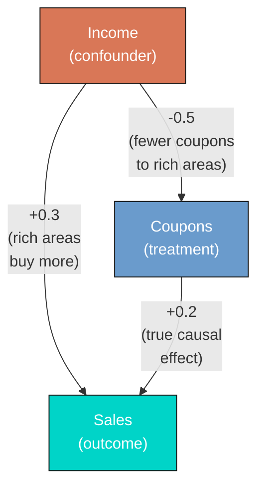
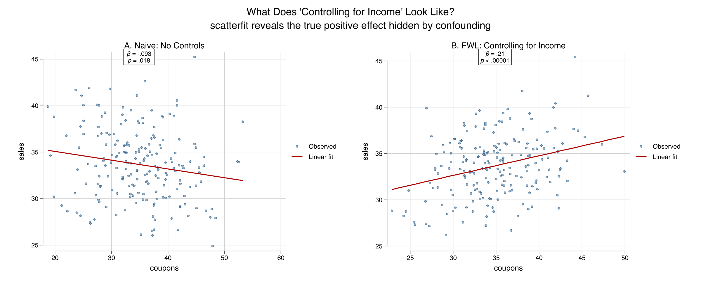
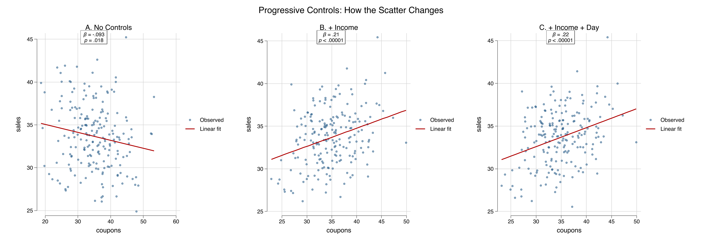
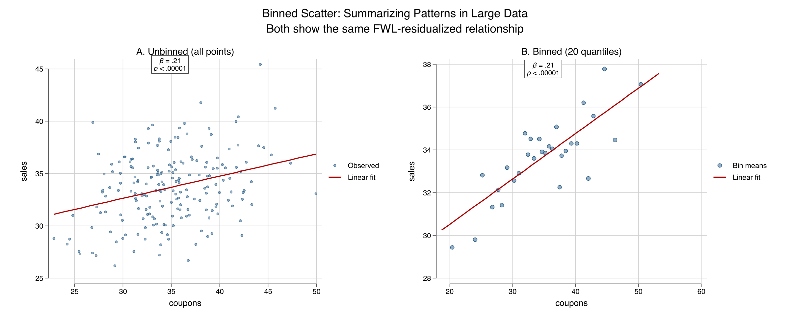
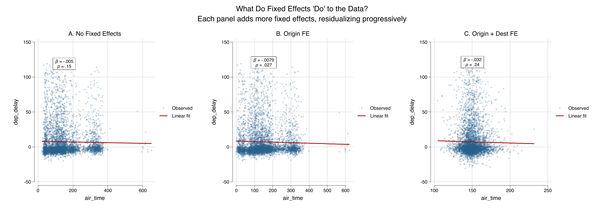
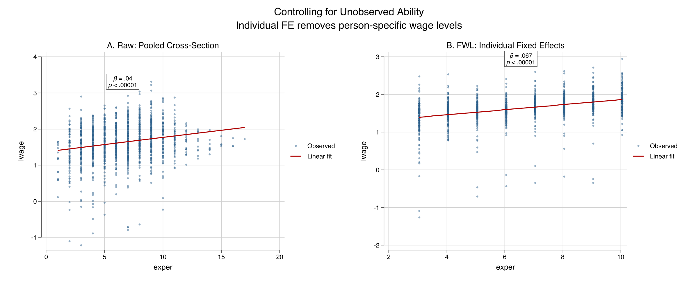
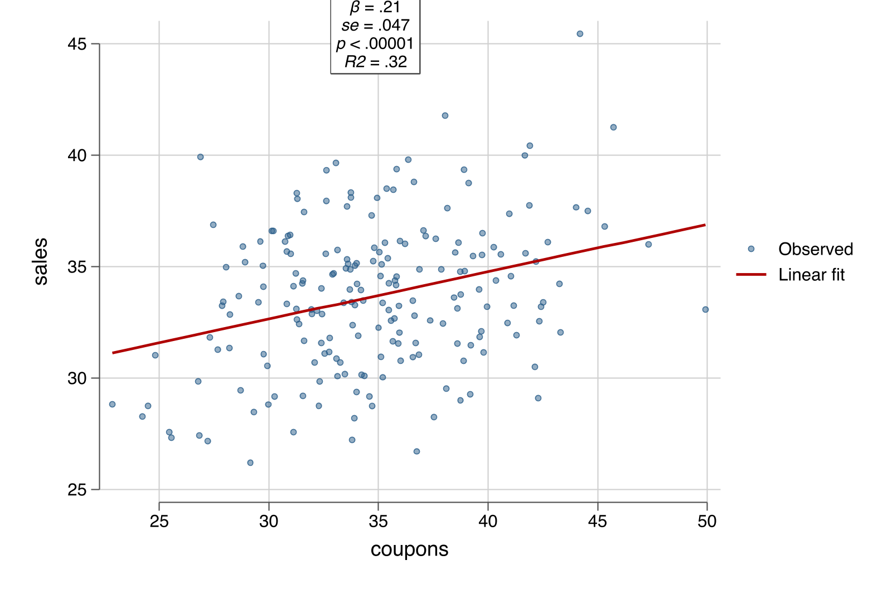

---
authors:
  - admin
categories:
  - Stata
  - Econometrics
  - Tutorial
draft: false
featured: false
date: "2026-03-27T00:00:00Z"
external_link: ""
image:
  caption: ""
  focal_point: Smart
  placement: 3
links:
- icon: file-code
  icon_pack: fas
  name: "Stata do-file"
  url: analysis.do
- icon: file-alt
  icon_pack: fas
  name: "Stata log"
  url: analysis.log
slides:
summary: A hands-on guide to the scatterfit package in Stata --- from understanding the Frisch-Waugh-Lovell theorem through simulated confounding to visualizing fixed effects in real panel data --- showing what "controlling for" looks like as a scatter plot.
tags:
  - stata
  - causal
  - causal inference
  - panel
title: "Visualizing Regression with the FWL Theorem in Stata"
url_code: ""
url_pdf: ""
url_slides: ""
url_video: ""
toc: true
diagram: true
---

## 1. Overview

"What does it actually mean to *control for* a variable?" This question appears in every applied regression course, and the answer is surprisingly hard to visualize. When we say "the effect of coupons on sales, controlling for income," we are describing a relationship in multidimensional space. This relationship cannot be directly plotted on a two-dimensional scatter. The **Frisch-Waugh-Lovell (FWL) theorem** changes this: it shows that the coefficient from a multiple regression equals the slope of a simple bivariate regression --- after first *residualizing* (partialling out) the control variables from both the outcome and the variable of interest.

The [scatterfit](https://github.com/leojahrens/scatterfit) Stata package (Ahrens, 2024) makes this visual in one command. It takes a dependent variable, an independent variable, and optional controls or fixed effects, then produces a scatter plot of the residualized data with a fitted regression line. Built on `reghdfe`, it handles high-dimensional fixed effects efficiently. It also offers features beyond what R's `fwl_plot()` or Python's manual FWL can do: **binned scatter plots** for large datasets, **regression parameters printed directly on the plot**, and **multiple fit types** (linear, quadratic, lowess).

This tutorial is the third in a trilogy --- see the companion [R tutorial](/post/r_fwlplot/) and [Python tutorial](/post/python_fwl/) --- and uses the **same datasets** for cross-language comparability. All data are loaded from GitHub URLs so the analysis is fully reproducible.

**Learning objectives:**

- Use `scatterfit` to visualize bivariate relationships with and without controls
- Demonstrate FWL residualization with `controls()` and `fcontrols()`
- Verify manually that FWL reproduces `reghdfe` coefficients exactly
- Visualize fixed effects using `fcontrols()` on flights data
- Use binned scatter plots to summarize patterns in large datasets
- Show regression parameters directly on plots with `regparameters()`

## 2. The Modeling Pipeline


We start where the answer is known (simulated data), see the result with `scatterfit`, verify manually, then apply the same tool to real flights data and panel wage data.

## 3. Setup and Data

### 3.1 Install packages

The `scatterfit` command requires `reghdfe` and `ftools` for high-dimensional fixed effects estimation. All packages are installed from SSC or GitHub:

```stata
* Install packages if not already installed
capture ssc install reghdfe, replace
capture ssc install ftools, replace
capture ssc install estout, replace
capture net install scatterfit, ///
    from("https://raw.githubusercontent.com/leojahrens/scatterfit/master") replace
```

### 3.2 Load the simulated store data

We load the same simulated retail dataset used in the R and Python FWL tutorials. The data are hosted on GitHub for reproducibility:

```stata
import delimited "https://raw.githubusercontent.com/cmg777/starter-academic-v501/master/content/post/r_fwlplot/store_data.csv", clear
```

The data simulate a scenario where a store manager wants to know whether distributing coupons increases sales. **Income is a confounder** --- wealthier neighborhoods receive fewer coupons (the store targets promotions at lower-income areas) but have higher baseline sales:



The arrows in this diagram show causal relationships, and the numbers are the true effect sizes in the data generating process. The true causal effect of coupons on sales is **+0.2**, but income opens a **backdoor path** --- an indirect route from coupons to sales that goes *through* income (coupons $\leftarrow$ income $\rightarrow$ sales). Unless we block this path by controlling for income, the naive estimate will be biased downward.

```stata
summarize sales coupons income dayofweek
```

```text
    Variable |        Obs        Mean    Std. dev.       Min        Max
-------------+---------------------------------------------------------
       sales |        200     33.6747    3.811032      24.89      45.23
     coupons |        200    34.85685    6.788834      18.72      53.25
      income |        200    49.72545    9.745807      20.07      77.02
   dayofweek |        200       3.915    1.996926          1          7
```

```stata
correlate sales coupons income
```

```text
             |    sales  coupons   income
-------------+---------------------------
       sales |   1.0000
     coupons |  -0.1664   1.0000
      income |   0.5003  -0.7087   1.0000
```

The correlation matrix confirms the confounding structure. Coupons and sales have a *negative* raw correlation (-0.166), even though the true effect is positive (+0.2). Income is strongly negatively correlated with coupons (-0.709) and positively correlated with sales (0.500). A naive regression would wrongly conclude that coupons hurt sales.

## 4. scatterfit in Action: Naive vs. Controlled

### 4.1 The naive scatter

The simplest `scatterfit` call plots the raw relationship. The `regparameters()` option prints the regression coefficient and p-value directly on the plot --- a feature unique to this Stata package:

```stata
scatterfit sales coupons, regparameters(coef pval) ///
    opts(name(naive, replace) title("A. Naive: No Controls"))
```

The slope is **-0.093** ($p = 0.019$, meaning there is only a 1.9% chance of seeing this result if coupons truly had no effect): coupons appear to *reduce* sales. This is statistically significant but substantively wrong --- the true effect is +0.2.

### 4.2 Controlling for income: one option

Now add income as a control. In `scatterfit`, the `controls()` option specifies continuous variables to partial out using the FWL procedure. Behind the scenes, `scatterfit` calls `reghdfe` to residualize both sales and coupons on income, then plots the residuals:

```stata
scatterfit sales coupons, controls(income) regparameters(coef pval) ///
    opts(name(controlled, replace) title("B. FWL: Controlling for Income"))
```

The slope reverses to **+0.212** ($p < 0.001$) --- close to the true value of +0.2. Combining both panels:

```stata
graph combine naive controlled, ///
    title("What Does 'Controlling for Income' Look Like?") rows(1)
graph export "stata_fwl_fig1_naive_vs_controlled.png", replace
```



The left panel shows the raw relationship: more coupons, lower sales. The right panel shows the *same* data after removing the influence of income from both axes via `controls(income)`. The true positive effect of coupons emerges clearly.

### 4.3 The regression table confirms

We can compare the naive and controlled regressions side by side using Stata's `estimates store` and `estimates table` workflow. The `estimates store` command saves regression results under a name, and `estimates table` displays multiple stored results in columns --- similar to R's `etable()` or Python's `stargazer`:

```stata
regress sales coupons
estimates store naive_ols

regress sales coupons income
estimates store full_ols

estimates table naive_ols full_ols, stats(r2 N) b(%9.4f) se(%9.4f)
```

```text
--------------------------------------
    Variable | naive_ols   full_ols
-------------+------------------------
     coupons |   -0.0934      0.2123
             |    0.0393      0.0467
      income |                0.3004
             |                0.0325
       _cons |   36.9301     11.3352
             |    1.3969      3.0080
-------------+------------------------
          r2 |    0.0277      0.3215
           N |       200         200
--------------------------------------
```

Adding income as a control flips the coupon coefficient from -0.093 to +0.212 and increases the R-squared from 0.028 to 0.321. The income coefficient (0.300) is close to the true value of 0.3.

### 4.4 Omitted variable bias: predicting the error

The confounding is not mysterious --- the **omitted variable bias (OVB) formula** predicts it exactly:

$$\text{bias} = \hat{\gamma} \times \hat{\delta}$$

In words, the bias equals the effect of the omitted variable on the outcome ($\hat{\gamma}$) multiplied by the relationship between the omitted variable and the treatment ($\hat{\delta}$).

```stata
* gamma = effect of income on sales (in full model)
regress sales coupons income
local gamma = _b[income]    // 0.3004

* delta = regression of coupons on income
regress coupons income
local delta = _b[income]    // -0.4937

* OVB = gamma * delta
display "OVB = " %9.4f `gamma' * `delta'
```

```text
OVB =   -0.1483
```

The OVB formula predicts a bias of -0.148: income's positive effect on sales ($\hat{\gamma} = 0.300$) times its negative relationship with coupons ($\hat{\delta} = -0.494$) produces a large negative bias. The predicted naive coefficient (true + bias = 0.212 + (-0.148) = 0.064) is close to the actual naive coefficient (-0.093) --- the discrepancy comes from sampling variation with $n = 200$.

## 5. Under the Hood: Manual FWL Verification

### 5.1 The three-step recipe

The FWL theorem can be implemented manually in Stata using `regress` and `predict`:

```stata
* Step 1: Residualize sales on income
regress sales income
predict resid_sales, residuals

* Step 2: Residualize coupons on income
regress coupons income
predict resid_coupons, residuals

* Step 3: Regress residuals on residuals
regress resid_sales resid_coupons
```

```text
------------------------------------------------------------------------------
 resid_sales | Coefficient  Std. err.      t    P>|t|     [95% conf. interval]
-------------+----------------------------------------------------------------
resid_coup~s |   .2122882    .046581     4.56   0.000     .1204297    .3041466
       _cons |  -2.87e-09    .222537    -0.00   1.000    -.4388468    .4388468
------------------------------------------------------------------------------
```

The FWL coefficient on `resid_coupons` is **0.212288** --- exactly the same as the full regression coefficient on `coupons` (0.212288). This is not an approximation; it is an algebraic identity. Formally, the FWL theorem says:

$$\hat{\beta}\_1 = \frac{\text{Cov}(\tilde{Y}, \tilde{X}\_1)}{\text{Var}(\tilde{X}\_1)}$$

where $\tilde{Y}$ and $\tilde{X}\_1$ are the residuals from regressing $Y$ and $X\_1$ on the controls $Z$. In our example, $\tilde{Y}$ is `resid_sales` (the part of sales that income cannot explain) and $\tilde{X}\_1$ is `resid_coupons` (the part of coupons that income cannot explain). The ratio of their covariance to the variance of $\tilde{X}\_1$ gives the slope we see in the regression above.

Think of it like measuring height *for your age*: instead of comparing raw heights, you compare how much taller or shorter each person is than the average for their age group.

### 5.2 Adding more controls

The `scatterfit` command handles any number of controls automatically:

```stata
scatterfit sales coupons, ///
    regparameters(coef pval) opts(name(panel_a, replace) title("A. No Controls"))
scatterfit sales coupons, controls(income) ///
    regparameters(coef pval) opts(name(panel_b, replace) title("B. + Income"))
scatterfit sales coupons, controls(income dayofweek) ///
    regparameters(coef pval) opts(name(panel_c, replace) title("C. + Income + Day"))

graph combine panel_a panel_b panel_c, ///
    title("Progressive Controls: How the Scatter Changes") rows(1)
graph export "stata_fwl_fig2_three_panels.png", replace
```



```stata
estimates table m1_naive m2_income m3_full, stats(r2 r2_a N)
```

```text
--------------------------------------------------
    Variable | m1_naive    m2_income    m3_full
-------------+------------------------------------
     coupons |   -0.0934      0.2123      0.2219
             |    0.0393      0.0467      0.0454
      income |                0.3004      0.2961
             |                0.0325      0.0316
   dayofweek |                            0.4029
             |                            0.1095
       _cons |   36.9301     11.3352      9.6398
             |    1.3969      3.0080      2.9527
-------------+------------------------------------
          r2 |    0.0277      0.3215      0.3654
        r2_a |    0.0228      0.3146      0.3556
           N |       200         200         200
--------------------------------------------------
```

The coupon coefficient progresses from -0.093 (naive, wrong sign), to +0.212 (controlling for income), to +0.222 (adding day of week). The R-squared jumps from 0.028 to 0.365. Each scatterfit panel shows a tighter cloud as more variation is absorbed by the controls.

## 6. Binned Scatter Plots

### 6.1 Why binned scatters?

With large datasets (thousands or millions of observations), scatter plots become useless --- individual points merge into a solid blob. **Binned scatter plots** solve this by grouping observations into quantile bins along the x-axis and plotting the bin means. The regression line is still estimated on the full data, so the slope is unaffected. This is one of `scatterfit`'s key advantages over R's `fwl_plot()`.

### 6.2 Unbinned vs. binned

```stata
scatterfit sales coupons, controls(income) ///
    regparameters(coef pval) opts(name(unbinned, replace) title("A. Unbinned (all points)"))

scatterfit sales coupons, controls(income) binned ///
    regparameters(coef pval) opts(name(binned, replace) title("B. Binned (20 quantiles)"))

graph combine unbinned binned, ///
    title("Binned Scatter: Summarizing Patterns in Large Data") rows(1)
graph export "stata_fwl_fig3_binned_scatter.png", replace
```



Both panels show the same FWL-residualized relationship, but the binned version (right) replaces 200 individual points with 20 bin-mean markers. For our small dataset the difference is modest, but for the flights data (5,000+ observations) or production datasets (millions of rows), binning is essential. The `nquantiles()` option controls how many bins to use:

```stata
* Fewer bins = smoother but less detail
scatterfit sales coupons, controls(income) binned nquantiles(10)

* More bins = more detail but noisier
scatterfit sales coupons, controls(income) binned nquantiles(30)
```

## 7. Visualizing Fixed Effects

### 7.1 Load the flights data

We load the NYC flights sample --- 5,000 flights from New York's three airports (EWR, JFK, LGA) in 2013:

```stata
import delimited "https://raw.githubusercontent.com/cmg777/starter-academic-v501/master/content/post/r_fwlplot/flights_sample.csv", clear

summarize dep_delay air_time
tabulate origin

* Encode string variables for fixed effects (needed by scatterfit/reghdfe)
encode origin, gen(origin_fe)
encode dest, gen(dest_fe)
```

```text
    Variable |        Obs        Mean    Std. dev.       Min        Max
-------------+---------------------------------------------------------
   dep_delay |      5,000      7.3172    22.83736        -20        119
    air_time |      5,000    150.3636    93.47726         22        650
```

### 7.2 Progressive fixed effects

The `fcontrols()` option specifies categorical variables to absorb as fixed effects. This is analogous to `feols(...| FE)` in R's fixest:

```stata
* No fixed effects
scatterfit dep_delay air_time, regparameters(coef pval) ///
    opts(name(fe_none, replace) title("A. No Fixed Effects"))

* Origin airport FE
scatterfit dep_delay air_time, fcontrols(origin_fe) ///
    regparameters(coef pval) opts(name(fe_origin, replace) title("B. Origin FE"))

* Origin + destination FE
scatterfit dep_delay air_time, fcontrols(origin_fe dest_fe) ///
    regparameters(coef pval) opts(name(fe_both, replace) title("C. Origin + Dest FE"))

graph combine fe_none fe_origin fe_both, ///
    title("What Do Fixed Effects 'Do' to the Data?") rows(1)
graph export "stata_fwl_fig4_fixed_effects.png", replace
```



Panel A shows the raw cloud with a nearly flat slope. Panel B removes the three origin-airport means, tightening the horizontal spread. Panel C removes the destination means as well, collapsing the variation to *within-route* deviations. The `fcontrols()` option handles all the demeaning internally using `reghdfe`.

### 7.3 Regression table

```stata
regress dep_delay air_time
estimates store fe0

reghdfe dep_delay air_time, absorb(origin_fe) vce(robust)
estimates store fe1

reghdfe dep_delay air_time, absorb(origin_fe dest_fe) vce(robust)
estimates store fe2

estimates table fe0 fe1 fe2, stats(r2 N) b(%9.4f) se(%9.4f)
```

```text
--------------------------------------------------
    Variable |    fe0         fe1         fe2
-------------+------------------------------------
    air_time |   -0.0050     -0.0079     -0.0324
             |    0.0035      0.0034      0.0265
       _cons |    8.0669      8.5072     12.1416
             |    0.6117      0.6449      4.0186
-------------+------------------------------------
          r2 |    0.0004      0.0055      0.0310
           N |      5000        5000        4994
--------------------------------------------------
```

The air time coefficient changes as we add fixed effects: -0.005 (no FE), -0.008 (origin FE), -0.032 (origin + destination FE). Note that these are estimated on the 5,000-observation sample, so the coefficients differ somewhat from the full-data estimates in the R tutorial. The key pattern is the same: adding fixed effects absorbs between-group variation and changes both the magnitude and precision of the coefficient. With origin + destination FE, 6 singleton observations are dropped (N = 4,994) --- singletons are routes with only one flight in the sample, where within-group variation cannot be estimated.

## 8. Panel Data: Returns to Experience

### 8.1 Load the wage panel

The wage panel contains 545 individuals observed over 8 years (1980--1987). The classic question: what is the return to experience? The challenge is **unobserved ability** --- two people with the same experience may earn very different wages because one is more talented, motivated, or well-connected. These unmeasured personal traits are the "unobserved ability" that individual fixed effects absorb.

```stata
import delimited "https://raw.githubusercontent.com/cmg777/starter-academic-v501/master/content/post/r_fwlplot/wagepan.csv", clear

xtset nr year
summarize lwage exper expersq educ
```

```text
    Variable |        Obs        Mean    Std. dev.       Min        Max
-------------+---------------------------------------------------------
       lwage |      4,360    1.649147    .5326094  -3.579079    4.05186
       exper |      4,360    6.514679    2.825873          0         18
     expersq |      4,360    50.42477    40.78199          0        324
        educ |      4,360    11.76697    1.746181          3         16
```

### 8.2 Pooled OLS vs. individual fixed effects

```stata
regress lwage educ exper expersq
estimates store pool

reghdfe lwage exper expersq, absorb(nr)
estimates store fe_ind

reghdfe lwage exper expersq, absorb(nr year)
estimates store fe_twfe

estimates table pool fe_ind fe_twfe, stats(r2 N)
```

```text
--------------------------------------------------
    Variable |   pool       fe_ind      fe_twfe
-------------+------------------------------------
        educ |    0.1021
             |    0.0047
       exper |    0.1050      0.1223   (omitted)
             |    0.0102      0.0082
     expersq |   -0.0036     -0.0045     -0.0054
             |    0.0007      0.0006      0.0007
       _cons |   -0.0564      1.0807      1.9223
             |    0.0639      0.0263      0.0359
-------------+------------------------------------
          r2 |    0.1477      0.6173      0.6185
           N |      4360        4360        4360
--------------------------------------------------
```

Several things change as we add fixed effects. The `educ` coefficient disappears from the individual FE column --- education is time-invariant (it does not change over the 8 years for any individual), so it is perfectly collinear with person dummies. Stata marks `exper` as `(omitted)` in the two-way FE column --- because experience increments by one year for everyone, it is perfectly collinear with year dummies. Only `expersq` (which varies non-linearly) survives both sets of fixed effects. The R-squared jumps from 0.148 to 0.617, showing that individual fixed effects explain the majority of wage variation.

### 8.3 scatterfit with individual FE

```stata
* Sample 150 individuals for visual clarity
preserve
set seed 456
bysort nr: gen first = (_n == 1)
gen rand = runiform() if first
bysort nr (rand): replace rand = rand[1]
sort rand nr year
egen rank = group(rand) if first
bysort nr (rank): replace rank = rank[1]
keep if rank <= 150

scatterfit lwage exper, regparameters(coef pval) ///
    opts(name(wage_raw, replace) title("A. Raw: Pooled Cross-Section"))

scatterfit lwage exper, fcontrols(nr) regparameters(coef pval) ///
    opts(name(wage_fe, replace) title("B. FWL: Individual Fixed Effects"))

graph combine wage_raw wage_fe, ///
    title("Controlling for Unobserved Ability") rows(1)
graph export "stata_fwl_fig5_panel_data.png", replace
restore
```



The visual difference is dramatic. Panel A shows a wide fan with a shallow slope --- individuals at the same experience level have wildly different wages, reflecting unobserved ability. Panel B applies `fcontrols(nr)` to strip away each person's average wage and experience, leaving only *within-person* deviations. The slope steepens sharply: the within-person return to experience is about 0.12 log points per year (roughly 12%), much larger than the pooled bivariate slope. Once we control for who each person is, the experience-wage relationship is much more precisely identified.

## 9. Advanced: Fit Types and Regression Parameters

### 9.1 Multiple fit types

The `regparameters()` option displays the coefficient, standard error, p-value, R-squared, and sample size directly on the plot. The `scatterfit` command also supports fit types beyond linear --- quadratic and lowess --- as diagnostics for nonlinearity:

```stata
* Linear fit with all regression parameters displayed on the plot
scatterfit sales coupons, controls(income) ///
    regparameters(coef se pval r2 n)
graph export "stata_fwl_fig6_advanced.png", replace
```



```stata
* Lowess fit: nonparametric check (note: lowess does not support controls())
scatterfit sales coupons, fit(lowess)
```

The quadratic fit serves as a diagnostic. If the relationship looks curved in the residualized scatter, your linear specification may be misspecified. Note that `fit(lowess)` and `fit(lpoly)` do not support `controls()` in the current version of `scatterfit` --- use them on raw or manually residualized data. For our simulated data (which is truly linear), the quadratic fit closely follows the linear fit, confirming the specification is appropriate.

### 9.2 Regression parameters on the plot

The `regparameters()` option displays statistical information directly on the scatter plot. Available parameters:

| Parameter | Display |
|-----------|---------|
| `coef` | Slope coefficient |
| `se` | Standard error |
| `pval` | P-value |
| `r2` | R-squared |
| `n` | Sample size |

```stata
* Show everything
scatterfit sales coupons, controls(income) regparameters(coef se pval r2 n)
```

This is especially useful for presentations and papers where you want to communicate both the visual pattern and the statistical evidence in a single figure.

### 9.3 Quick reference: scatterfit recipes

```stata
* 1. Raw scatter (no controls)
scatterfit y x

* 2. Control for continuous variables (FWL)
scatterfit y x, controls(z1 z2)

* 3. Control for fixed effects (categorical)
scatterfit y x, fcontrols(group_fe)

* 4. Both continuous controls and fixed effects
scatterfit y x, controls(z1) fcontrols(group_fe)

* 5. Binned scatter (for large datasets)
scatterfit y x, controls(z1) binned nquantiles(20)

* 6. Show regression parameters on the plot
scatterfit y x, controls(z1) regparameters(coef pval r2)

* 7. Quadratic fit (works with controls)
scatterfit y x, controls(z1) fit(quadratic)

* 8. Lowess fit (does NOT support controls — use on raw data)
scatterfit y x, fit(lowess)
```

## 10. Discussion

The FWL theorem is not just a pedagogical tool --- it is the computational engine behind Stata's `reghdfe` command. When `reghdfe` estimates a model with fixed effects, it does not create a matrix with thousands of dummy variables. Instead, it uses an iterative demeaning algorithm (a generalization of FWL) to absorb the fixed effects, then runs OLS on the residuals. This is why `reghdfe` can handle millions of observations with tens of thousands of fixed effects.

The `scatterfit` package offers three advantages over the R and Python implementations of FWL visualization. First, **binned scatter plots** (Section 6) are essential for large datasets where individual points merge into an unreadable blob. Second, **regression parameters on the plot** (`regparameters()`) combine the visual and statistical evidence in a single figure, reducing the back-and-forth between plots and tables. Third, **multiple fit types** (`fit(quadratic)`, `fit(lowess)`) serve as built-in diagnostics for linearity.

Across the three tutorials (Python, R, Stata), the key numbers are the same because we use the same datasets: the naive coupon coefficient is -0.093, the true effect is +0.212 after controlling for income, and the OVB is -0.148. The FWL theorem is the same in every language --- only the syntax changes:

| Task | Python | R | Stata |
|------|--------|---|-------|
| Raw scatter | `plt.scatter(x, y)` | `fwl_plot(y ~ x)` | `scatterfit y x` |
| Control for Z | manual `resid()` | `fwl_plot(y ~ x + z)` | `scatterfit y x, controls(z)` |
| Fixed effects | not supported | `fwl_plot(y ~ x \| fe)` | `scatterfit y x, fcontrols(fe)` |
| Binned scatter | not supported | not supported | `scatterfit y x, binned` |
| Stats on plot | not supported | not supported | `regparameters(coef pval)` |

Students who learn FWL in one language can immediately apply it in another.

One limitation: the FWL theorem applies only to linear regression. For logistic, Poisson, or other nonlinear models, the partialling-out logic does not hold exactly. Stata's `scatterfit` does support `fitmodel(logit)` and `fitmodel(poisson)`, but these are direct fits, not FWL residualizations.

## 11. Summary and Next Steps

- **Confounding produces misleading regressions:** the naive coupon coefficient was -0.093 (wrong sign), while the true causal effect is +0.2. After FWL residualization with `controls(income)`, the estimate was +0.212.
- **The OVB formula predicts the bias exactly:** $0.300 \times (-0.494) = -0.148$, correctly predicting the negative direction and approximate magnitude of the confounding.
- **FWL is an exact identity:** the manual three-step procedure in Stata (`regress` + `predict resid` + `regress`) matches the full regression to six decimal places (0.212288).
- **Fixed effects are FWL applied to group dummies:** `fcontrols()` in `scatterfit` calls `reghdfe` internally to demean the data, equivalent to `feols(... | FE)` in R.
- **Binned scatter plots and on-plot statistics are Stata's advantage:** the `binned` and `regparameters()` options provide capabilities that the R and Python FWL tools lack.

For further study, see the companion [R FWL tutorial](/post/r_fwlplot/) using `fwl_plot()` and the [Python FWL tutorial](/post/python_fwl/) that extends FWL to Double Machine Learning.

## 12. Exercises

1. **OVB direction.** In our simulation, predict the direction of the OVB if you also omit `dayofweek`. Compute $\hat{\gamma}\_{day} \times \hat{\delta}\_{day}$ and add it to the income OVB. Does the total bias match the difference between the naive and the fully controlled coefficient?

2. **Binned scatter with different bins.** Re-run `scatterfit sales coupons, controls(income) binned nquantiles(k)` for $k = 5, 10, 20, 50$. How does the visual change? At what point do you lose meaningful information?

3. **slopefit: heterogeneous effects.** Use the `slopefit` command: `slopefit sales coupons income`. This shows how the coupon-sales slope varies across income levels. Do coupons work better in low-income or high-income neighborhoods?

## 13. References

1. [Ahrens, L. (2024). scatterfit: Scatter Plots with Fit Lines and Regression Results. GitHub.](https://github.com/leojahrens/scatterfit)
2. [Correia, S. (2016). reghdfe: Linear Models with Many Levels of Fixed Effects. Stata Journal.](http://scorreia.com/software/reghdfe/)
3. [Frisch, R. & Waugh, F. V. (1933). Partial Time Regressions as Compared with Individual Trends. *Econometrica*, 1(4), 387--401.](https://doi.org/10.2307/1907330)
4. [Lovell, M. C. (1963). Seasonal Adjustment of Economic Time Series and Multiple Regression Analysis. *JASA*, 58(304), 993--1010.](https://doi.org/10.1080/01621459.1963.10480682)
5. [Angrist, J. D. & Pischke, J.-S. (2009). *Mostly Harmless Econometrics.* Princeton University Press.](https://press.princeton.edu/books/paperback/9780691120355/mostly-harmless-econometrics)
6. Datasets: simulated store data, NYC flights sample, and Wooldridge wage panel from the companion [R FWL tutorial](/post/r_fwlplot/) on this site.
