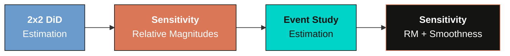
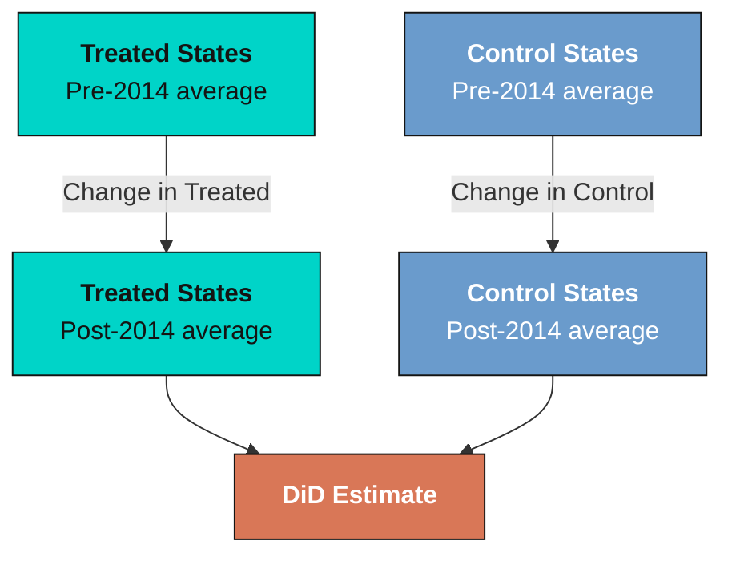
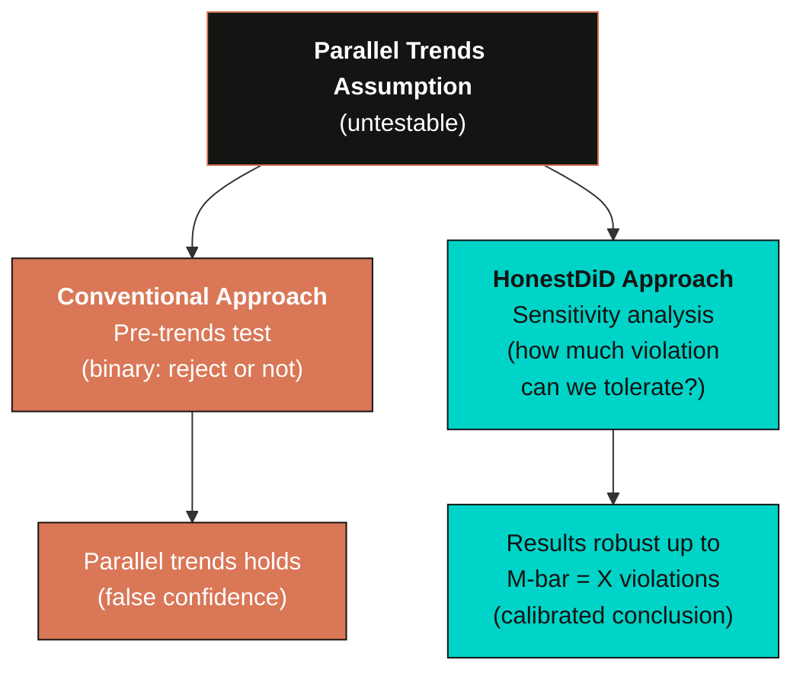

---
authors:
  - admin
categories:
  - Stata
  - Causal Inference
draft: false
featured: false
date: "2026-03-26T00:00:00Z"
external_link: ""
image:
  caption: ""
  focal_point: Smart
  placement: 3
links:
- icon: file-code
  icon_pack: fas
  name: "Stata do-file"
  url: analysis.do
- icon: database
  icon_pack: fas
  name: "Dataset (.dta)"
  url: https://raw.githubusercontent.com/Mixtape-Sessions/Advanced-DID/main/Exercises/Data/ehec_data.dta
- icon: file-alt
  icon_pack: fas
  name: "Stata log"
  url: analysis.log
slides:
summary: Assess how robust difference-in-differences results are to violations of parallel trends using the honestdid package in Stata, progressing from a simple 2x2 DiD to multi-period event studies with relative magnitudes and smoothness restrictions
tags:
  - stata
  - causal
  - causal inference
  - did
  - sensitivity
title: "Sensitivity Analysis for Parallel Trends in Difference-in-Differences Using honestdid in Stata"
url_code: ""
url_pdf: ""
url_slides: ""
url_video: ""
toc: true
diagram: true
---

## 1. Overview

Difference-in-differences (DiD) is one of the most widely used methods for estimating causal effects in the social sciences. But every DiD estimate rests on a single critical assumption --- **parallel trends** --- and that assumption is fundamentally untestable. With only two periods of data, researchers cannot check whether treated and control groups followed similar trends before treatment. With multiple periods, researchers can run a pre-trends test, but as Roth (2022) demonstrated, these tests have low statistical power and can create a false sense of security.

So what can researchers do? The `honestdid` package, developed by Rambachan and Roth (2023), provides a formal **sensitivity analysis** framework. Instead of asking the binary question "Do parallel trends hold?" it asks a more useful question: "How large would violations of parallel trends need to be before my conclusion changes?" The answer --- called the **breakdown value** --- is a single number that tells the reader exactly how robust the result is.

This tutorial teaches the method in two self-contained parts. **Part 1** starts with the simplest possible DiD --- two groups, two periods --- where parallel trends cannot be tested at all. We show how `honestdid` can still provide meaningful robustness analysis in this limited-data setting. **Part 2** extends to a multi-period event study, where we have more pre-treatment data and can deploy the full toolkit, including both relative magnitudes and smoothness restrictions. Throughout, we use data from the Affordable Care Act's Medicaid expansion to study the effect of expanding health insurance eligibility on insurance coverage.

### Learning objectives

- Construct a simple 2x2 difference-in-differences estimate and understand the parallel trends assumption
- Recognize that parallel trends **cannot be tested** with only two periods of data
- Apply `honestdid` with relative magnitudes (DeltaRM) to assess robustness even in the 2x2 case
- Interpret breakdown values as a quantitative measure of how robust a DiD result is
- Estimate a multi-period event study and run a conventional pre-trends test
- Explain why pre-trends tests have low power and can mislead researchers
- Apply both DeltaRM and smoothness restrictions (DeltaSD) to multi-period DiD

---

## 2. Study context --- Medicaid expansion

The Affordable Care Act (ACA) gave US states the option to expand Medicaid eligibility to low-income adults. Some states expanded in 2014, while others chose not to expand at all. This creates a natural quasi-experiment: states that expanded serve as the **treatment group**, and states that never expanded serve as the **control group**. The outcome of interest is the share of the population with health insurance coverage (`dins`).

This is an **observational study**, not a randomized experiment. States were not randomly assigned to expand Medicaid --- they chose to do so based on political and economic factors. This means that the parallel trends assumption is a genuine concern: states that chose to expand may have been on different insurance coverage trajectories than non-expanders even before 2014.

Our target estimand is the **average treatment effect on the treated (ATT)** --- the effect of Medicaid expansion on insurance coverage in the states that expanded. We will use this dataset in two ways: first restricted to a narrow window around the treatment year (Part 1), then with the full panel spanning 2008--2015 (Part 2).

### Variables

| Variable | Description | Type |
|----------|-------------|------|
| `stfips` | State FIPS code | Panel ID |
| `year` | Calendar year (2008--2015) | Time variable |
| `dins` | Share of population with health insurance | Outcome (0--1) |
| `yexp2` | Year of Medicaid expansion (missing if never) | Treatment timing |

---

## 3. Analytical roadmap

The diagram below shows how the tutorial progresses. Each part is self-contained, with its own estimation and sensitivity analysis.



Part 1 uses a simple before-and-after comparison where parallel trends is untestable. Part 2 leverages the full panel to run richer sensitivity analyses, including smoothness restrictions that require multiple pre-treatment periods.

---

## 4. Setup --- data loading and packages

We begin by installing the required packages and loading the Medicaid expansion dataset.

```stata
* Install required packages
capture ssc install require, replace
capture ssc install ftools, replace
capture ssc install reghdfe, replace
capture ssc install coefplot, replace
capture ssc install drdid, replace
capture ssc install csdid, replace
capture net install honestdid, from("https://raw.githubusercontent.com/mcaceresb/stata-honestdid/main") replace
```

```text
(output omitted)
```

Now we load the data and examine its structure. The dataset contains state-level panel data on health insurance coverage from 2008 to 2015, with information on when each state expanded Medicaid eligibility.

```stata
* Load data
use "https://raw.githubusercontent.com/Mixtape-Sessions/Advanced-DID/main/Exercises/Data/ehec_data.dta", clear

* Examine the data
des
tab year
tab yexp2, m
```

```text
Contains data
  obs:           552
 vars:             5

variable name   type    format    label      variable label
stfips          byte    %8.0g     STATEFIP   state FIPS code
year            int     %8.0g     YEAR       Census/ACS survey year
dins            float   %9.0g                Insurance Rate among low-income
                                               childless adults
yexp2           float   %9.0g                Year of Medicaid Expansion
W               float   %9.0g                total survey weight

      year |      Freq.
-----------+----------
      2008 |         46
      2009 |         46
      ...  |        ...
      2019 |         46
-----------+----------
     Total |        552

      yexp2 |      Freq.
------------+----------
       2014 |        264
       2015 |         36
       2016 |         24
       2017 |         12
       2019 |         24
          . |        192
------------+----------
      Total |        552
```

The data contains 552 observations across 46 states and 12 years (2008--2019). States expanded Medicaid in different years --- 22 in 2014, 3 in 2015, 2 in 2016, 1 in 2017, and 2 in 2019 --- while 16 states never expanded (missing `yexp2`). For a clean two-group comparison, we restrict the sample to 2014-expanders and never-expanders, and keep only years 2008--2015.

```stata
* Restrict to 2008--2015, keep only 2014 expanders and never-expanders
keep if (year <= 2015) & (missing(yexp2) | (yexp2 == 2014))

* Create treatment indicator
gen byte D = (yexp2 == 2014)

* Verify sample
tab D
tab year
```

```text
          D |      Freq.
------------+----------
          0 |        128
          1 |        176
------------+----------
      Total |        304

       year |      Freq.
------------+----------
       2008 |         38
       2009 |         38
       2010 |         38
       2011 |         38
       2012 |         38
       2013 |         38
       2014 |         38
       2015 |         38
------------+----------
      Total |        304
```

Our analysis sample contains 38 states observed across 8 years (2008--2015): 22 treatment states that expanded Medicaid in 2014 and 16 control states that never expanded. This balanced panel provides the foundation for both parts of the tutorial.

---

# Part 1: Simple 2x2 Difference-in-Differences

## 5. The 2x2 DiD --- concept and estimation

### 5.1 Collapsing to two periods

The 2x2 DiD is the simplest version of difference-in-differences: two groups (treated and control) observed in two time periods (before and after treatment). We collapse our multi-year data into a single pre-treatment average (2008--2013) and a single post-treatment average (2014--2015).



To see the four means that define the 2x2 DiD, we create a post-treatment indicator and compute group averages.

```stata
* Create post indicator
gen byte post = (year >= 2014)

* Compute the four group means
preserve
collapse (mean) dins, by(D post)
list, clean noobs
restore
```

```text
    D   post       dins
    0      0   .6189702
    0      1   .6836083
    1      0   .6544622
    1      1   .7808657
```

The four cells of the 2x2 table reveal the raw pattern. Control states (D = 0) saw insurance coverage rise from 61.90% to 68.36% --- a gain of 6.46 percentage points reflecting nationwide trends. Treated states (D = 1) saw a larger increase from 65.45% to 78.09% --- a gain of 12.64 percentage points. The DiD estimate is the difference of these two changes: 12.64 - 6.46 = **6.18 percentage points**. This is the causal effect of Medicaid expansion on insurance coverage among low-income childless adults, under the parallel trends assumption.

### 5.2 Regression-based 2x2 DiD

The same estimate emerges from a regression. The 2x2 DiD regression specification is:

$$Y\_{it} = \alpha + \beta \cdot \text{Treat}\_i + \gamma \cdot \text{Post}\_t + \delta \cdot (\text{Treat}\_i \times \text{Post}\_t) + \varepsilon\_{it}$$

In words, the outcome for state $i$ in period $t$ equals a baseline level ($\alpha$), a treatment group fixed effect ($\beta$), a post-period fixed effect ($\gamma$), and the interaction ($\delta$) --- which is the DiD estimate. The coefficient $\delta$ captures how much the treated group's outcome changed relative to the control group's change.

```stata
* 2x2 DiD regression
reg dins i.D##i.post, cluster(stfips)
```

```text
Linear regression                               Number of obs     =        304
                                                F(3, 37)          =     182.58
                                                Prob > F          =     0.0000
                                                R-squared         =     0.4722
                                                Root MSE          =     .05526

                                (Std. err. adjusted for 38 clusters in stfips)
------------------------------------------------------------------------------
             |               Robust
        dins | Coefficient  std. err.      t    P>|t|     [95% conf. interval]
-------------+----------------------------------------------------------------
         1.D |    .035492   .0176856     2.01   0.052    -.0003425    .0713265
      1.post |   .0646382   .0052781    12.25   0.000     .0539437    .0753326
             |
      D#post |
        1 1  |   .0617653   .0085367     7.24   0.000     .0444682    .0790624
             |
       _cons |   .6189702   .0122906    50.36   0.000     .5940671    .6438732
------------------------------------------------------------------------------
```

The regression confirms the manual calculation: the interaction coefficient (`1.D#1.post`) is 0.0618, corresponding to a 6.18 percentage point increase in insurance coverage. The effect is highly statistically significant (t = 7.24, p < 0.001), with a 95% confidence interval of [4.45, 7.91] percentage points. The standard errors are clustered at the state level to account for within-state correlation over time.

### 5.3 The parallel trends problem in the 2x2

This estimate relies on a crucial assumption: absent Medicaid expansion, treated and control states would have followed the **same trend** in insurance coverage. Formally, the parallel trends assumption states:

$$E[Y\_{it}(0) | \text{Treat}\_i = 1] - E[Y\_{it-1}(0) | \text{Treat}\_i = 1] = E[Y\_{it}(0) | \text{Treat}\_i = 0] - E[Y\_{it-1}(0) | \text{Treat}\_i = 0]$$

In words, the change in untreated potential outcomes would have been the same for both groups. The problem is that **with only two periods of data, we have no way to test this**. We observe each group once before treatment and once after. There is no earlier period to check whether trends were already diverging.

Imagine you have a single photograph of two runners side by side before a race. They appear to be at the same speed. You assume they were always running at the same pace --- but what if one had been accelerating? With only one snapshot, you cannot know. This is exactly the situation in the 2x2 DiD: we assume parallel trends because we have no evidence against it, but we also have no evidence for it.

The `honestdid` package provides a way forward. Instead of assuming parallel trends holds perfectly, it asks: **"How large would the violation of parallel trends need to be before the DiD result breaks down?"** The next section makes this precise.


*Figure 1: Group means and counterfactual trend. The dashed line shows where treated states would have been without Medicaid expansion (parallel trends assumption). The gap between the solid treated line and the dashed counterfactual is the DiD estimate of 6.18 pp.*

---

## 6. Sensitivity analysis for the 2x2 DiD

Before applying sensitivity analysis, note that the 2x2 DiD estimate of 6.18 pp averages across all pre-treatment years (2008--2013) and all post-treatment years (2014--2015). The event study estimates in this section and in Part 2 measure year-specific effects relative to the reference year 2013. These are different parameters --- the event study will show 4.23 pp for 2014 and 6.87 pp for 2015, which bracket the 2x2 average.

### 6.1 Setting up the event study for honestdid

To apply `honestdid`, we need coefficients in an event study format --- at least one pre-treatment coefficient and one post-treatment coefficient, relative to a reference period. We restrict the data to a narrow three-year window around the treatment year: 2012 (one year before the reference), 2013 (the reference period, just before treatment), and 2014 (the treatment year).

This gives us the simplest event study possible: one pre-period coefficient (the 2012 vs 2013 difference between treated and control) and one post-period coefficient (the 2014 vs 2013 difference). The pre-period coefficient tells us whether the groups were already diverging before treatment.

```stata
* Restrict to 3-year window: 2012, 2013, 2014
preserve
keep if inrange(year, 2012, 2014)

* Create Dyear variable (treatment-year interaction)
gen Dyear = cond(D, year, 2013)

* Event study with 2013 as reference
reghdfe dins b2013.Dyear, absorb(stfips year) cluster(stfips) noconstant
```

```text
HDFE Linear regression                            Number of obs   =        114
Absorbing 2 HDFE groups                           F(   2,     37) =      16.27
                                                  R-squared       =     0.9604
Number of clusters (stfips)  =         38         Root MSE        =     0.0174

                                (Std. err. adjusted for 38 clusters in stfips)
------------------------------------------------------------------------------
             |               Robust
        dins | Coefficient  std. err.      t    P>|t|     [95% conf. interval]
-------------+----------------------------------------------------------------
       Dyear |
       2012  |  -.0062865   .0059107    -1.06   0.294    -.0182626    .0056897
       2014  |   .0423401   .0082657     5.12   0.000     .0255923     .059088
------------------------------------------------------------------------------
```

The pre-period coefficient for 2012 is -0.0063, which is small in magnitude and statistically insignificant (t = -1.06, p = 0.294). This suggests that treated and control states were on similar trajectories in the year before treatment. The post-period coefficient for 2014 is 0.0423, indicating that Medicaid expansion increased insurance coverage by 4.23 percentage points relative to the reference year, a highly significant effect (t = 5.12, p < 0.001).

### 6.2 Introducing relative magnitudes (DeltaRM)

Now we apply the core innovation of Rambachan and Roth (2023). The **relative magnitudes** restriction bounds the post-treatment violation of parallel trends relative to the largest pre-treatment violation:

$$\Delta^{RM}(\bar{M}): \quad |\delta\_t^{\text{post}}| \leq \bar{M} \cdot \max\_{s \in \text{pre}} |\delta\_s|$$

In words, this restriction says: "the true deviation from parallel trends after treatment can be at most $\bar{M}$ times as large as the largest true deviation in the pre-treatment period." We do not observe these true deviations directly --- the package uses the estimated pre-period coefficients and their uncertainty to construct valid confidence intervals. The parameter $\bar{M}$ --- read as "M-bar" --- controls how much violation we allow:

- $\bar{M} = 0$: exact parallel trends in the **post-treatment** period (strongest assumption), though pre-treatment deviations are still allowed
- $\bar{M} = 1$: post-treatment violation can be as large as the worst pre-treatment violation
- $\bar{M} = 2$: post-treatment violation can be twice the worst pre-treatment violation

Think of the breakdown value like a bridge stress test. Engineers do not just ask "Can the bridge hold the expected load?" They ask "How much MORE load can it take before it fails?" The **breakdown value** is that safety margin for your DiD estimate --- the value of $\bar{M}$ at which the confidence interval first includes zero and the conclusion reverses.

The diagram below summarizes the `honestdid` workflow --- from the event study coefficients all the way to the breakdown value.


### 6.3 Running honestdid

We apply `honestdid` to the event study results from the three-year window. With `pre(1/1)`, we tell the package that coefficient position 1 (the 2012 coefficient) is the pre-period, and `post(3/3)` specifies position 3 (the 2014 coefficient) as the post-period, skipping the omitted 2013 reference at position 2.

```stata
* Sensitivity analysis: relative magnitudes
honestdid, pre(1/1) post(3/3) mvec(0(0.5)2)
```

```text
|    M    |   lb   |   ub   |
| ------- | ------ | ------ |
|       . |  0.026 |  0.059 | (Original)
|  0.0000 |  0.026 |  0.059 |
|  0.5000 |  0.022 |  0.060 |
|  1.0000 |  0.017 |  0.064 |
|  1.5000 |  0.010 |  0.069 |
|  2.0000 |  0.003 |  0.076 |
(method = C-LF, Delta = DeltaRM)
```

The table shows robust confidence intervals for different values of $\bar{M}$, constructed using the C-LF (conditional least-favorable) method --- a procedure that accounts for both sampling uncertainty and the worst-case bias allowed by the restriction. The first row ($\bar{M}$ = .) shows the original confidence interval without any sensitivity adjustment: [0.026, 0.059]. As $\bar{M}$ increases, we allow larger violations of parallel trends, and the confidence interval widens. Even at $\bar{M}$ = 2 --- allowing post-treatment violations twice as large as the pre-treatment difference --- the lower bound remains positive at 0.003, still above zero. The result is remarkably robust: the conclusion that Medicaid expansion increased insurance coverage survives even generous assumptions about parallel trends violations.

### 6.4 The sensitivity plot

We can visualize the sensitivity analysis with a plot that shows how the confidence interval expands as we relax the parallel trends assumption.

```stata
* Generate the sensitivity plot
honestdid, pre(1/1) post(3/3) mvec(0(0.5)2) coefplot
graph export "stata_honestdid_2x2_rm.png", replace width(1200)
```


*Figure 2: Relative magnitudes sensitivity for the 2x2 DiD. The CI stays above zero even at M-bar = 2.*

Each point on the plot shows the robust confidence interval at a given $\bar{M}$. Moving right on the x-axis means allowing progressively larger violations of parallel trends. The breakdown value is where the confidence interval first touches zero. In this case, the confidence interval stays above zero even at $\bar{M}$ = 2 (lower bound = 0.003), meaning the result is robust to post-treatment violations that are at least twice as large as the pre-treatment divergence we observed.

### 6.5 What did we learn?

Even with just three periods of data --- barely more than the textbook 2x2 --- `honestdid` lets us go far beyond the simple assertion "we assume parallel trends holds." We can now say: "Our result is robust to post-treatment violations of parallel trends that are at least twice as large as the pre-treatment difference between groups." This is a much more informative and credible statement.

However, with only one pre-period coefficient, we are limited to the relative magnitudes restriction. The **smoothness restriction** (DeltaSD) --- which bounds how quickly the trend can change direction --- requires at least two pre-period coefficients to compute second differences. To unlock this richer analysis, we need more pre-treatment data. That is exactly what Part 2 provides.

Now that we have established Part 1's results, we restore the full dataset and move to the multi-period analysis.

```stata
restore
```

---

# Part 2: Multi-period Difference-in-Differences

## 7. From 2x2 to event study

### 7.1 Why more periods help

With the full panel (2008--2015), we have five pre-treatment years instead of just one. This gives us two advantages. First, we can **visually inspect** whether treated and control groups were on similar trajectories before 2014. Second, `honestdid` has richer information to calibrate the scale of potential violations, and we unlock the smoothness restriction that was unavailable in Part 1.

The multi-period event study estimates a separate treatment effect for each year relative to a reference year. The specification is:

$$Y\_{it} = \alpha\_i + \lambda\_t + \sum\_{k \neq -1} \beta\_k \cdot \mathbb{1}[K\_{it} = k] + \varepsilon\_{it}$$

In words, the outcome for state $i$ in year $t$ depends on state fixed effects ($\alpha\_i$), year fixed effects ($\lambda\_t$), and a set of event-time indicators. $K\_{it}$ measures event time --- years relative to treatment onset (2014). The reference period $k = -1$ (year 2013) is omitted, so each $\beta\_k$ measures the treated-control difference in year $k$ relative to the year just before treatment. The pre-treatment coefficients ($\beta\_{-6}$ through $\beta\_{-2}$) show whether trends were already diverging; the post-treatment coefficients ($\beta\_0$ and $\beta\_1$) capture the treatment effect.

**Variable mapping:** $Y$ = `dins`, $\alpha\_i$ = state dummies (absorbed by `reghdfe`), $\lambda\_t$ = year dummies, and $K\_{it}$ = `Dyear` interaction variable.

### 7.2 Estimation

We now estimate the event study using all eight years of data. The variable `Dyear` interacts treatment status with calendar year, and we omit 2013 as the reference.

```stata
* Create Dyear for event study (full sample)
gen Dyear = cond(D, year, 2013)

* Full event study: 2008--2015 with 2013 as reference
reghdfe dins b2013.Dyear, absorb(stfips year) cluster(stfips) noconstant
```

```text
HDFE Linear regression                            Number of obs   =        304
Absorbing 2 HDFE groups                           F(   7,     37) =      10.37
                                                  R-squared       =     0.9505
Number of clusters (stfips)  =         38         Root MSE        =     0.0185

                                (Std. err. adjusted for 38 clusters in stfips)
------------------------------------------------------------------------------
             |               Robust
        dins | Coefficient  std. err.      t    P>|t|     [95% conf. interval]
-------------+----------------------------------------------------------------
       Dyear |
       2008  |  -.0095956   .0076769    -1.25   0.219    -.0251505    .0059593
       2009  |  -.0132771   .0073502    -1.81   0.079      -.02817    .0016159
       2010  |  -.0018712   .0067698    -0.28   0.784    -.0155881    .0118457
       2011  |  -.0064012   .0070425    -0.91   0.369    -.0206707    .0078682
       2012  |  -.0062865    .005944    -1.06   0.297    -.0183302    .0057573
       2014  |   .0423401   .0083124     5.09   0.000     .0254977    .0591826
       2015  |   .0687134   .0108512     6.33   0.000     .0467268    .0906999
------------------------------------------------------------------------------
```

The five pre-treatment coefficients (2008--2012) are all small in magnitude and statistically insignificant, ranging from -0.0133 to -0.0019. This suggests that treated and control states followed similar insurance coverage trajectories before Medicaid expansion. The post-treatment coefficients show a sharp break: insurance coverage jumped by 4.23 percentage points in 2014 and 6.87 percentage points in 2015, both highly significant. The growing effect over time is consistent with gradual Medicaid enrollment --- eligible individuals signing up over the first two years of the program.

We visualize these coefficients in a standard event study plot.

```stata
* Event study plot
coefplot, vertical yline(0, lcolor(gs8)) ///
    xline(5.5, lpattern(dash) lcolor(gs8)) ///
    ciopts(recast(rcap)) ///
    ytitle("Effect on insurance share") xtitle("Year") ///
    title("Event Study: Medicaid Expansion and Insurance Coverage")
graph export "stata_honestdid_event_study.png", replace width(1200)
```


*Figure 3: Event study coefficients. Pre-treatment coefficients hover near zero; post-treatment effects are large and significant.*

The event study plot makes the pattern visually clear. Pre-treatment coefficients hover around zero with no discernible trend, while post-treatment coefficients jump sharply upward. The dashed vertical line marks the onset of treatment in 2014.

### 7.3 Conventional pre-trends test

The standard approach is to conduct a joint F-test of all pre-treatment coefficients. If we fail to reject the null that all pre-period coefficients are jointly zero, we conclude that parallel trends "holds."

```stata
* Joint test of pre-treatment coefficients
test 2008.Dyear 2009.Dyear 2010.Dyear 2011.Dyear 2012.Dyear
```

```text
 ( 1)  2008.Dyear = 0
 ( 2)  2009.Dyear = 0
 ( 3)  2010.Dyear = 0
 ( 4)  2011.Dyear = 0
 ( 5)  2012.Dyear = 0

       F(  5,    37) =    0.86
            Prob > F =    0.5178
```

The pre-trends test yields an F-statistic of 0.86 with a p-value of 0.518, providing no evidence against parallel trends. But should we trust this binary verdict? The next section explains why the answer is no.

---

## 8. Why pre-trends tests are not enough

Your DiD passed the pre-trends test. But should you trust it?

Think of a pre-trends test as a **smoke detector that only beeps for large fires**. A fire too small to trigger the alarm can still burn down the house. Similarly, a pre-trends test can fail to detect violations of parallel trends that are large enough to overturn your conclusions. Roth (2022) demonstrated two important problems with conventional pre-trends tests:

1. **Low power.** Pre-trends tests often cannot detect violations of parallel trends that are economically meaningful. A test with 50 observations per group may require a violation three times larger than the treatment effect to reject the null at 5% significance. Violations smaller than this detection threshold go unnoticed.

2. **Pre-test bias.** Conditioning on passing the pre-trends test introduces bias. The estimates that survive the pre-test are a selected sample --- they look better than they should. Researchers who report "parallel trends holds" are unknowingly presenting results that have been filtered to appear more credible than they are.

The fundamental issue is that the pre-trends test asks a binary question --- "reject or not?" --- when what we really need is a **continuous measure** of robustness. Instead of asking "Are parallel trends exactly satisfied?" we should ask "How robust are our conclusions to plausible violations?"



The `honestdid` approach replaces the binary verdict with a quantitative statement: "Our result is robust to violations of parallel trends up to $\bar{M}$ times the largest pre-treatment violation." This is like reporting the load at which a bridge fails, rather than just saying "the bridge passed inspection."

---

## 9. Sensitivity analysis --- relative magnitudes (full panel)

### 9.1 RM with 5 pre-periods

We now apply the same relative magnitudes restriction from Part 1, but with the richer information from five pre-treatment periods. The equation is the same:

$$\Delta^{RM}(\bar{M}): \quad |\delta\_t^{\text{post}}| \leq \bar{M} \cdot \max\_{s \in \text{pre}} |\delta\_s|$$

With five pre-period coefficients instead of one, the "max pre-period violation" is calibrated from more data points, giving a more reliable scale for what constitutes a plausible violation.

```stata
* Relative magnitudes: full panel
honestdid, pre(1/5) post(7/8) mvec(0(0.5)2)
```

```text
|    M    |   lb   |   ub   |
| ------- | ------ | ------ |
|       . |  0.026 |  0.059 | (Original)
|  0.0000 |  0.027 |  0.058 |
|  0.5000 |  0.021 |  0.063 |
|  1.0000 |  0.013 |  0.071 |
|  1.5000 |  0.003 |  0.081 |
|  2.0000 | -0.007 |  0.091 |
(method = C-LF, Delta = DeltaRM)
```

With five pre-periods calibrating the scale of violations, the confidence intervals widen faster than in the 2x2 case. At $\bar{M}$ = 0 (exact parallel trends), the robust CI is [0.027, 0.058]. At $\bar{M}$ = 1, allowing violations as large as the worst pre-period deviation, the CI remains positive: [0.013, 0.071]. At $\bar{M}$ = 1.5, the lower bound is barely positive at 0.003. At $\bar{M}$ = 2, the lower bound turns negative at -0.007. The breakdown value is approximately $\bar{M}$ = 1.5--2 --- the post-treatment violation of parallel trends would need to be about 1.5 to 2 times as large as the worst pre-treatment deviation to overturn the conclusion.

```stata
* Sensitivity plot: relative magnitudes
honestdid, pre(1/5) post(7/8) mvec(0(0.5)2) coefplot
graph export "stata_honestdid_rm_full.png", replace width(1200)
```


*Figure 4: Relative magnitudes sensitivity with 5 pre-periods. The CI crosses zero between M-bar = 1.5 and 2.*

The sensitivity plot confirms the pattern: the confidence interval steadily widens as we allow larger violations, crossing zero between $\bar{M}$ = 1.5 and 2. Compared to the 2x2 case in Part 1, where the CI stayed positive even at $\bar{M}$ = 2, the full-panel analysis produces a slightly tighter breakdown. This happens because having more pre-period coefficients can produce a larger "max pre-period violation" (the scaling factor on the right-hand side of the relative magnitudes formula), which scales up the allowed post-treatment violation for any given $\bar{M}$.

### 9.2 Focusing on the average post-treatment effect

By default, `honestdid` examines the first post-treatment period. We can instead ask about the average treatment effect across both post-treatment periods (2014 and 2015) using the `l_vec` option, which specifies weights for combining the post-period coefficients.

```stata
* Average effect across 2014 and 2015
matrix l_vec = 0.5 \ 0.5
honestdid, pre(1/5) post(7/8) mvec(0(0.5)2) l_vec(l_vec)
```

```text
|    M    |   lb   |   ub   |
| ------- | ------ | ------ |
|       . |  0.039 |  0.072 | (Original)
|  0.0000 |  0.039 |  0.072 |
|  0.5000 |  0.029 |  0.079 |
|  1.0000 |  0.014 |  0.092 |
|  1.5000 | -0.002 |  0.107 |
|  2.0000 | -0.019 |  0.123 |
(method = C-LF, Delta = DeltaRM)
```

The average treatment effect across 2014--2015 has a higher point estimate (the original CI of [0.039, 0.072]) because the 2015 effect is larger than the 2014 effect. The breakdown value for the average effect is between $\bar{M}$ = 1 and 1.5 --- at $\bar{M}$ = 1 the lower bound is still positive (0.014) but at $\bar{M}$ = 1.5 it turns negative (-0.002). Interestingly, the average effect is slightly *less* robust than the first-period effect alone (breakdown between 1 and 1.5 vs between 1.5 and 2). This can happen when averaging over a longer horizon amplifies the cumulative impact of potential trend deviations.

---

## 10. Sensitivity analysis --- smoothness restrictions

### 10.1 Introducing DeltaSD

Relative magnitudes asks: "How large can the violation be?" A complementary question is: "How quickly can the trend change direction?" This is the **smoothness restriction** (DeltaSD), which bounds the second differences of the trend deviation.

Think of the two restrictions like driving rules. Relative magnitudes imposes a **speed limit** --- the violation cannot exceed $\bar{M}$ times the maximum observed pre-treatment violation. Smoothness imposes an **acceleration limit** --- the violation cannot change direction too sharply between consecutive periods. A car might be going fast but safely if it accelerated gradually; a sudden swerve is dangerous even at moderate speed.

Formally, the smoothness restriction bounds the second difference:

$$\Delta^{SD}(M): \quad |(\delta\_{t+1} - \delta\_t) - (\delta\_t - \delta\_{t-1})| \leq M \quad \text{for all } t$$

In words, the "acceleration" of the parallel trends violation --- how much the slope changes from one period to the next --- cannot exceed $M$ for any consecutive triple of periods. When $M = 0$, the trend deviation is perfectly linear (constant slope). Larger $M$ allows more curvature.

This restriction was **not available in Part 1** because it requires at least two pre-period coefficients to compute second differences (you need three points to calculate one "acceleration"). With five pre-periods, we can now use this richer restriction.

### 10.2 Running honestdid with DeltaSD

```stata
* Smoothness restriction
honestdid, pre(1/5) post(7/8) mvec(0(0.005)0.04) delta(sd)
```

```text
|    M    |   lb   |   ub   |
| ------- | ------ | ------ |
|       . |  0.026 |  0.059 | (Original)
|  0.0000 |  0.026 |  0.058 |
|  0.0050 |  0.013 |  0.061 |
|  0.0100 |  0.007 |  0.065 |
|  0.0150 |  0.002 |  0.070 |
|  0.0200 | -0.003 |  0.075 |
|  0.0250 | -0.008 |  0.080 |
|  0.0300 | -0.013 |  0.085 |
|  0.0350 | -0.018 |  0.090 |
|  0.0400 | -0.023 |  0.095 |
(method = FLCI, Delta = DeltaSD)
```

Note that `honestdid` automatically selects the FLCI (fixed-length confidence interval) method for smoothness restrictions, rather than the C-LF method used for relative magnitudes. FLCI constructs a confidence interval with optimal length under the smoothness restriction. Under the smoothness restriction, the breakdown value is approximately $M$ = 0.015--0.02. At $M$ = 0 (perfectly linear trend extrapolation), the robust CI is [0.026, 0.058]. At $M$ = 0.01, the CI is [0.007, 0.065], still comfortably above zero. At $M$ = 0.015, the lower bound is barely positive at 0.002. At $M$ = 0.02, the lower bound turns negative at -0.003. The change in the rate of divergence from parallel trends would need to exceed 1.5--2 percentage points between consecutive periods to overturn the finding.

```stata
* Smoothness sensitivity plot
honestdid, pre(1/5) post(7/8) mvec(0(0.005)0.04) delta(sd) coefplot
graph export "stata_honestdid_sd_full.png", replace width(1200)
```


*Figure 5: Smoothness restriction sensitivity. The CI crosses zero near M = 0.02.*

The smoothness restriction yields a different perspective. Unlike relative magnitudes --- where $\bar{M}$ is a dimensionless multiplier --- the smoothness parameter $M$ is measured in the same units as the outcome (insurance share). A breakdown value of $M$ = 0.015--0.02 means the rate of divergence from parallel trends would need to shift by about 1.5--2 percentage points between consecutive periods to invalidate the result.

### 10.3 Comparing RM vs SD

The two approaches offer complementary views of robustness:

| Restriction | Parameter | Breakdown Value | Interpretation |
|-------------|-----------|-----------------|----------------|
| Relative Magnitudes | $\bar{M}$ | ~1.5--2 | Post violation can be up to 1.5--2x the max pre violation |
| Smoothness | $M$ | ~0.015--0.02 | Rate of trend divergence can shift by up to 1.5--2 pp between periods |

### When to choose which restriction

- Use **DeltaRM** when: (a) you have few pre-periods --- it works with just one, (b) the pre-treatment coefficients look like random noise around zero with no clear trend, or (c) you want a dimensionless measure of robustness that is easy to communicate
- Use **DeltaSD** when: (a) you have two or more pre-periods, (b) there is a visible pre-trend (non-zero slope) and you want to formalize how much the slope can change, or (c) you want bounds measured in the outcome's units
- **Report both** when feasible, as we did here, to provide a complete picture

In general, relative magnitudes is the more popular choice because it is intuitive and works with minimal data. Smoothness restrictions are complementary --- they capture a different form of violation (abrupt changes in trend direction rather than large absolute deviations).

### How to report honestdid results in a paper

Many readers will want to apply this method in their own work. Here is example text you can adapt for a manuscript:

> We conduct sensitivity analysis following Rambachan and Roth (2023). Under relative magnitudes restrictions, the treatment effect on insurance coverage remains statistically significant for $\bar{M}$ up to 1.5 (95% robust CI: [0.003, 0.081]). Under smoothness restrictions, the result is robust for $M$ up to 0.015 (95% robust CI: [0.002, 0.070]). These breakdown values indicate that post-treatment deviations from parallel trends would need to be at least 1.5 times the largest pre-treatment deviation to overturn the conclusion.

---

## 11. Extension --- staggered DiD with csdid and honestdid

### 11.1 Why staggered timing matters

Our analysis so far restricted attention to states expanding in 2014 and compared them to never-expanders. But different states expanded Medicaid at different times --- some in 2014, others in 2015 or later. Callaway and Sant'Anna (2021) showed that standard two-way fixed effects (TWFE) regressions can produce misleading estimates when treatment timing varies across units, especially if treatment effects are heterogeneous over time. The `csdid` package provides a heterogeneity-robust estimator that correctly handles staggered treatment adoption.

We reload the dataset and apply `csdid` followed by `honestdid`. We keep the same two-group sample (2014-expanders vs never-treated) to demonstrate the `csdid` workflow. With a single treatment cohort, the TWFE and Callaway-Sant'Anna estimates should agree --- but in settings with multiple treatment cohorts and heterogeneous effects, they can diverge substantially.

```stata
* Reload full dataset for staggered analysis
use "https://raw.githubusercontent.com/Mixtape-Sessions/Advanced-DID/main/Exercises/Data/ehec_data.dta", clear

* Restrict to 2008--2015, keep 2014-expanders and never-expanders
keep if (year <= 2015) & (missing(yexp2) | (yexp2 == 2014))

* Replace missing yexp2 with 0 for csdid (never-treated)
replace yexp2 = 0 if missing(yexp2)

* Callaway-Sant'Anna estimator
* long2: compare each post-period to base period (long differences)
* notyet: use not-yet-treated units as additional controls
csdid dins, ivar(stfips) time(year) gvar(yexp2) long2 notyet

* Aggregate to event study
csdid_estat event, window(-5 1) estore(csdid)
```

```text
ATT by Periods Before and After treatment
Event Study:Dynamic effects
------------------------------------------------------------------------------
             | Coefficient  Std. err.      z    P>|z|     [95% conf. interval]
-------------+----------------------------------------------------------------
     Pre_avg |  -.0074863   .0056726    -1.32   0.187    -.0186045    .0036318
    Post_avg |   .0555267   .0083153     6.68   0.000     .0392291    .0718244
         Tm6 |  -.0095956   .0073982    -1.30   0.195    -.0240958    .0049045
         Tm5 |  -.0132771   .0070833    -1.87   0.061    -.0271601     .000606
         Tm4 |  -.0018712    .006524    -0.29   0.774    -.0146579    .0109155
         Tm3 |  -.0064012   .0067868    -0.94   0.346    -.0197031    .0069006
         Tm2 |  -.0062865   .0057282    -1.10   0.272    -.0175135    .0049406
         Tp0 |   .0423401   .0080105     5.29   0.000     .0266398    .0580405
         Tp1 |   .0687134   .0104571     6.57   0.000     .0482177     .089209
------------------------------------------------------------------------------
```

The Callaway-Sant'Anna event study confirms the pattern from our TWFE analysis: pre-treatment coefficients (Tm6 through Tm2) are all small and insignificant, while the post-treatment effects (Tp0 = 0.0423 in 2014, Tp1 = 0.0687 in 2015) are large and highly significant. The average post-treatment effect is 5.55 percentage points.

### 11.2 Applying honestdid to staggered estimates

We now apply `honestdid` to the Callaway-Sant'Anna event study estimates. The `pre()` and `post()` indices refer to the event-time coefficient positions, skipping the Pre\_avg and Post\_avg summary rows at positions 1--2.

```stata
* Restore csdid results and apply honestdid
estimates restore csdid
* csdid_estat stores: Pre_avg(1), Post_avg(2), Tm6(3)..Tm2(7), Tp0(8), Tp1(9)
honestdid, pre(3/7) post(8/9) mvec(0(0.5)2) coefplot
graph export "stata_honestdid_csdid.png", replace width(1200)
```

```text
|    M    |   lb   |   ub   |
| ------- | ------ | ------ |
|       . |  0.027 |  0.058 | (Original)
|  0.0000 |  0.027 |  0.058 |
|  0.5000 |  0.022 |  0.062 |
|  1.0000 |  0.014 |  0.071 |
|  1.5000 |  0.004 |  0.080 |
|  2.0000 | -0.007 |  0.090 |
(method = C-LF, Delta = DeltaRM, alpha = 0.050)
```


*Figure 6: Sensitivity analysis for staggered DiD. Breakdown value is consistent with the TWFE analysis.*

The staggered-robust estimates from `csdid` produce a breakdown value between $\bar{M}$ = 1.5 and 2 --- at $\bar{M}$ = 1.5 the lower bound is still positive (0.004) but at $\bar{M}$ = 2 it turns negative (-0.007). This is nearly identical to the TWFE analysis in Section 9. This is reassuring --- it suggests that the TWFE estimates are reliable in this application because we restricted to a single treatment cohort (2014 expanders vs never-treated). In settings with multiple treatment cohorts and heterogeneous effects, the TWFE and staggered estimates can diverge significantly, making this comparison an important robustness check.

---

## 12. Discussion and summary

### Summary of all sensitivity analyses

The table below collects every sensitivity analysis from this tutorial. Scanning across the rows reveals which settings and restrictions yield stronger or weaker robustness.

| Analysis | Setting | Restriction | Breakdown Value | Robustness |
|----------|---------|-------------|-----------------|------------|
| Section 6 | 2x2 (1 pre-period) | DeltaRM | > 2 | Very robust |
| Section 9.1 | Full panel, first period | DeltaRM | ~1.5--2 | Robust |
| Section 9.2 | Full panel, average effect | DeltaRM | ~1--1.5 | Moderately robust |
| Section 10 | Full panel, first period | DeltaSD | ~0.015--0.02 | Moderately robust |
| Section 11 | Staggered (csdid) | DeltaRM | ~1.5--2 | Consistent with TWFE |

The first-period treatment effect is the most robust finding across all approaches. The average effect over 2014--2015 is slightly less robust because it accumulates potential violations over a longer horizon. The smoothness restriction yields a tighter bound than relative magnitudes, reflecting a different type of assumption about how trends can deviate.

This tutorial demonstrated how to move beyond the binary question "Do parallel trends hold?" to the much more useful question "How robust are my results to violations of parallel trends?" The `honestdid` package makes this transition straightforward in Stata.

### Key takeaways

1. **Method insight --- the breakdown value replaces the pre-trends test.** The breakdown value is the single most informative number to report alongside any DiD estimate. It tells the reader exactly how much they need to doubt parallel trends before the result breaks down. For the Medicaid expansion, the breakdown value is approximately $\bar{M}$ = 1.5--2 under relative magnitudes and $M$ = 0.015--0.02 under smoothness restrictions.

2. **Data insight --- Medicaid expansion robustly increased insurance coverage.** The 2x2 DiD estimate of 6.18 percentage points survives sensitivity analysis. In the full-panel event study, the 4.23 percentage point effect in 2014 remains significant up to approximately $\bar{M}$ = 1.5--2, meaning the post-treatment violation would need to be roughly 1.5 to 2 times the worst pre-period deviation to overturn the result.

3. **Practical insight --- honestdid works even with limited data.** Part 1 showed that sensitivity analysis is possible with just one pre-period coefficient. You do not need a long panel to use this tool --- though more pre-treatment periods unlock richer analyses (DeltaSD).

4. **Limitation --- sensitivity is not identification.** The breakdown value tells you how much violation is tolerable, not whether violations actually occur. Subject-matter knowledge about the specific policy context remains essential for assessing whether the parallel trends assumption is plausible.

5. **Next step --- apply honestdid to your own DiD.** Every DiD analysis should report a breakdown value. The package works with `reghdfe`, `csdid`, `did_multiplegt`, and `jwdid` --- any estimator that produces event-study coefficients and a variance-covariance matrix. Tip: use `honestdid, coefplot cached` to re-plot previous results without recomputation --- useful for customizing graph appearance.

For policymakers evaluating the ACA's Medicaid expansion, the sensitivity analysis provides calibrated confidence: the insurance coverage gains are genuine and not an artifact of differential trends between expanding and non-expanding states, unless those differential trends were very large relative to the patterns observed before the policy change.

---

## 13. Exercises

1. **Expand the 2x2 window.** In Part 1, we used a 3-year window (2012--2014). Expand it to 4 years (2011--2014) to get 2 pre-periods. Now try the smoothness restriction (`delta(sd)`) --- does it change your conclusion about robustness?

```stata
* Starter code: restrict to 2011--2014 and re-run
keep if inrange(year, 2011, 2014)
gen Dyear = cond(D, year, 2013)
reghdfe dins b2013.Dyear, absorb(stfips year) cluster(stfips) noconstant
honestdid, pre(1/2) post(4/4) mvec(0(0.005)0.04) delta(sd)
```

2. **Focus on the 2015 effect.** In Part 2, modify `l_vec` to focus on only the second post-period (2015). Is the 2015 effect more or less robust than the 2014 effect? Why might longer-horizon effects differ in robustness?

```stata
* Starter code: l_vec selects only the second post-period
matrix l_vec = 0 \ 1
honestdid, pre(1/5) post(7/8) mvec(0(0.5)2) l_vec(l_vec)
```

3. **Compare TWFE and staggered estimates.** Run the relative magnitudes analysis on both the TWFE (Section 9) and staggered (Section 11) estimates with the same `mvec()` grid. Are the breakdown values similar? If they differ, what does that tell you about treatment effect heterogeneity?

```stata
* Starter code: after running both TWFE and csdid analyses,
* compare the breakdown values from these two commands:
* TWFE:  honestdid, pre(1/5) post(7/8) mvec(0(0.5)2)
* csdid: honestdid, pre(3/7) post(8/9) mvec(0(0.5)2)
```

---

## 14. References

1. [Rambachan, A. & Roth, J. (2023). A More Credible Approach to Parallel Trends. *Review of Economic Studies*, 90(5), 2555--2591.](https://doi.org/10.1093/restud/rdad018)
2. [Roth, J. (2022). Pre-test with Caution: Event-Study Estimates after Testing for Parallel Trends. *American Economic Review: Insights*, 4(3), 305--322.](https://doi.org/10.1257/aeri.20210236)
3. [Callaway, B. & Sant'Anna, P.H.C. (2021). Difference-in-Differences with Multiple Time Periods. *Journal of Econometrics*, 225(2), 200--230.](https://doi.org/10.1016/j.jeconom.2020.12.001)
4. [HonestDiD Stata Package --- Rambachan & Roth.](https://github.com/mcaceresb/stata-honestdid)
5. [HonestDiD R Package --- Rambachan & Roth.](https://github.com/asheshrambachan/HonestDiD)
6. [Mixtape Sessions --- Advanced DiD (dataset source).](https://github.com/Mixtape-Sessions/Advanced-DID)
7. [csdid Stata Package --- Rios-Avila, F.](https://friosavila.github.io/stpackages/csdid.html)
8. [reghdfe --- Linear Models with Many Levels of Fixed Effects --- Correia, S.](https://scorreia.com/software/reghdfe/)
