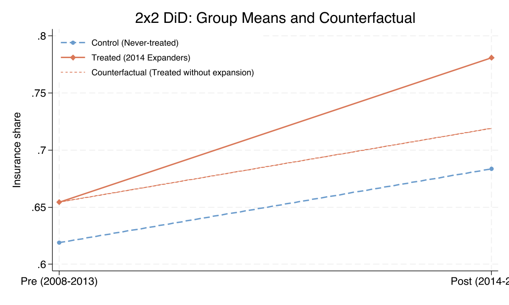
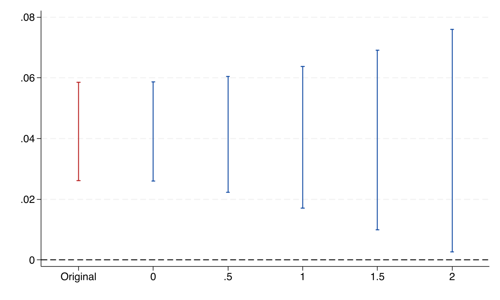
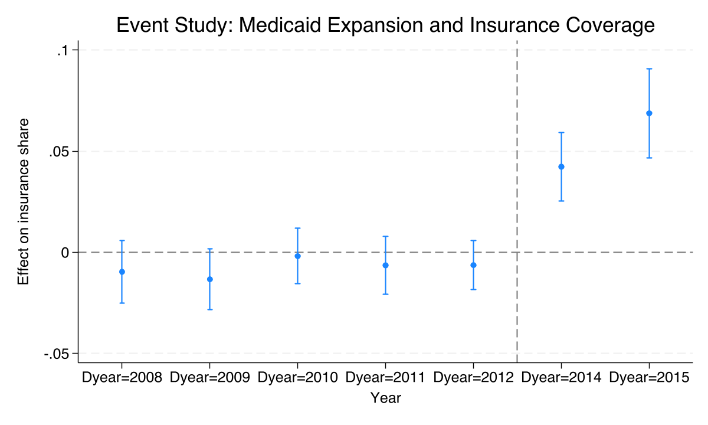
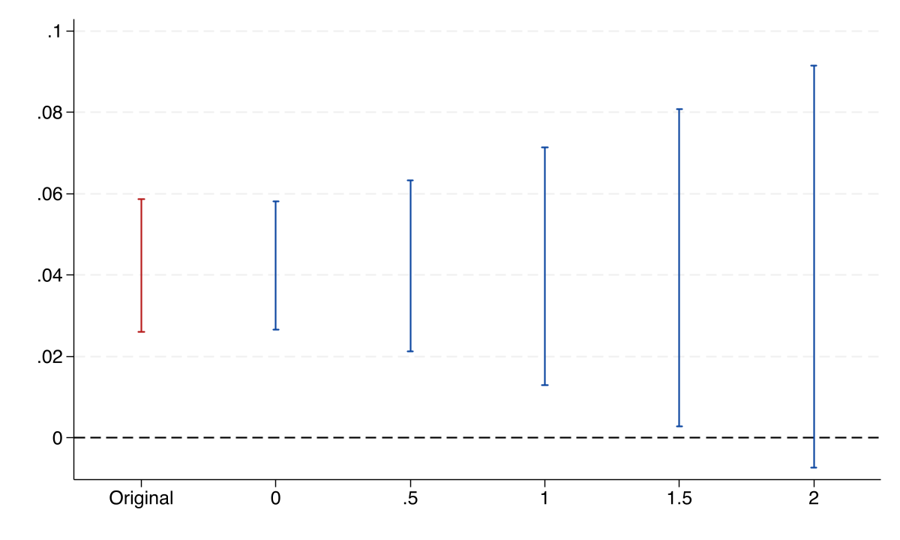
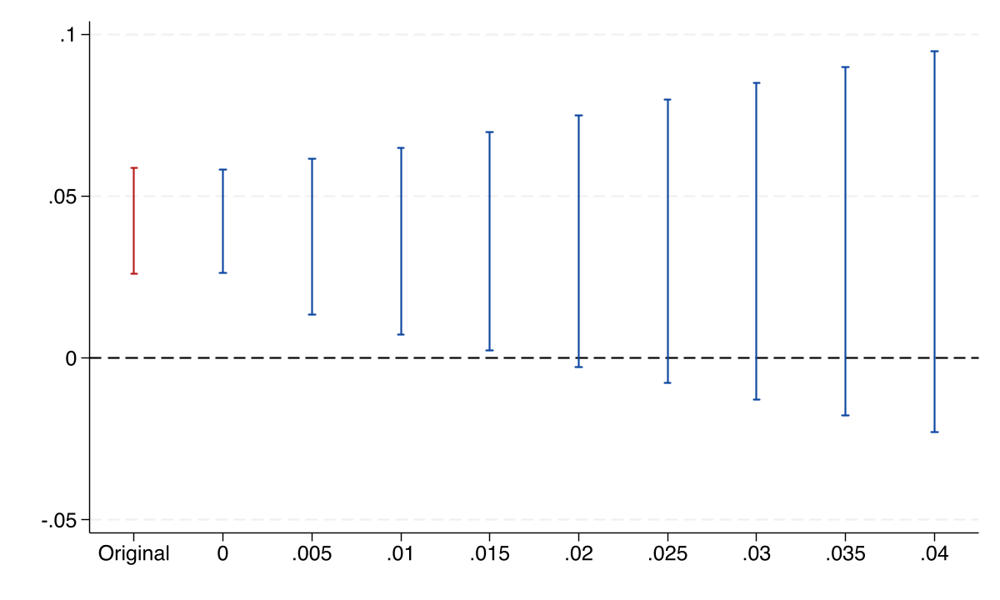
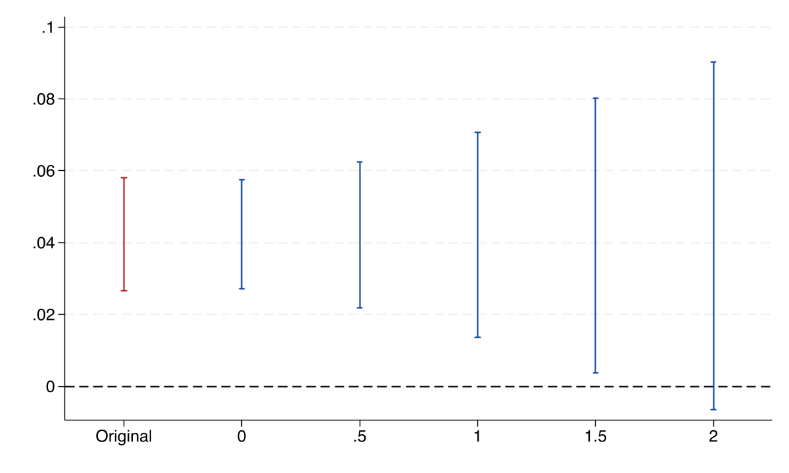

# The Tension {.divider background-color="#d97757"}

[Act I]{.act}

## Every difference-in-differences estimate rests on an assumption you cannot test

Medicaid expanded in 2014. Treated states' insurance coverage jumped — but only *if* they would have tracked non-expanders absent the policy.

. . .

That counterfactual is never observed. With two periods, parallel trends is **fundamentally untestable**. *So how much should we trust the estimate?*

::: {.notes}
This is the central tension of DiD. The identifying assumption — parallel trends — concerns a world we never see: the treated states' outcomes had they not expanded. We assume it; we cannot verify it. The whole talk is about replacing that act of faith with a number.
:::

## The pre-trends test is a smoke detector that only beeps for large fires

A pre-trends test asks a binary question: reject parallel trends, or not?

. . .

Roth (2022) showed it has **low power** and induces **pre-test bias** — violations big enough to overturn the result can pass undetected. Passing the test buys *false confidence*.

::: {.notes}
A test with ~50 obs per group can require a violation three times the treatment effect to reject at 5%. And conditioning on passing the pre-test selects estimates that look better than they are. The binary verdict is the wrong instrument — we need a continuous measure of robustness.
:::

## Replace "do trends hold?" with "how far can they bend before the result breaks?"

The `honestdid` package (Rambachan & Roth, 2023) reframes the question.

. . .

It reports a single **breakdown value**: the size of a parallel-trends violation at which the confidence interval first touches zero. A quantitative robustness statistic, not a verdict.

::: {.notes}
This is the spoiler thesis. Everything that follows builds the machinery to compute that one number for the Medicaid case — first in a bare 2x2, then in a full event study, under two different restrictions, and finally with a staggered estimator.
:::

## Where we're going

::: {.incremental}
- The 2x2 DiD: an estimate with **no** way to test parallel trends
- The event study: more pre-periods, a pre-trends test, and why it still misleads
- Relative magnitudes ($\bar M$) and smoothness ($M$): bending the assumption on purpose
- The breakdown value: how robust the Medicaid result really is
:::

# The Investigation {.divider background-color="#6a9bcc"}

[Act II]{.act}

## The lab: 38 states over 2008-2015, ACA Medicaid expansion

::: {.incremental}
- **Outcome** — `dins`, insurance coverage among low-income childless adults
- **Treatment** — 22 states that expanded Medicaid in **2014**
- **Control** — 16 states that **never** expanded
- **Estimand** — the average treatment effect on the treated (ATT), under parallel trends
:::

[Observational, not randomized: states *chose* to expand, so parallel trends is a genuine concern — exactly the worry `honestdid` quantifies.]{.comment}

## The 2x2 DiD is the difference of two changes

$$Y_{it} = \alpha + \beta\,\text{Treat}_i + \gamma\,\text{Post}_t + \delta\,(\text{Treat}_i \times \text{Post}_t) + \varepsilon_{it}$$

The interaction $\delta$ **is** the DiD estimate: how much the treated group's change exceeds the control group's change.

[Control rose 6.46 pp; treated rose 12.64 pp; the difference is the policy effect.]{.comment}

::: {.notes}
Collapse the panel to one pre-mean (2008–2013) and one post-mean (2014–2015). Four cells, two changes, one difference. The same delta comes out of the regression with state-clustered SEs.
:::

## Treated states gained 6.18 pp more than controls

| Quantity | Value |
|---|---:|
| Treated change (65.45% to 78.09%) | +12.64 pp |
| Control change (61.90% to 68.36%) | +6.46 pp |
| **DiD ATT** $\hat\delta$ | [+6.18 pp]{.key} |

[$t = 7.24$, $p < 0.001$, 95% CI $[4.45,\ 7.91]$ pp · clustered on 38 states.]{.comment}

::: {.notes}
This is the estimate the entire sensitivity analysis stress-tests — not one honestdid generates, but the one it robustifies. Highly significant under parallel trends. The question is what happens when we stop assuming parallel trends holds exactly.
:::

## With one photograph of two runners, you cannot see who was accelerating



::: {.notes}
The 2x2 gives one pre-snapshot and one post-snapshot per group. They look parallel — but a single photo cannot reveal whether one runner was already speeding up. We assume parallel trends because we have no evidence against it, and equally none for it. honestdid is the way forward.
:::

## Relative magnitudes bounds the post-violation by the worst pre-violation

$$\Delta^{RM}(\bar M): \quad |\delta_t^{\text{post}}| \;\le\; \bar M \cdot \max_{s \in \text{pre}} |\delta_s|$$

Set $\bar M = 1$ and the post-treatment violation may be *as large as* the worst pre-treatment deviation; $\bar M = 2$ allows twice that.

[We never observe the true $\delta_s$ — the package uses the estimated pre-period coefficients and their uncertainty to build valid CIs.]{.comment}

::: {.notes}
"No worse than the wobbles we already saw." Sweeping M-bar upward from 0 traces how the robust CI widens. The breakdown value is the M-bar where it first reaches zero. This restriction needs only ONE pre-period — so it works even in the bare 2x2.
:::

## Three lines turn an event study into a breakdown value

``` {.stata code-line-numbers="2|3|4"}
* one pre-coefficient (2012), one post-coefficient (2014), 2013 omitted
reghdfe dins b2013.Dyear, absorb(stfips year) cluster(stfips) noconstant
honestdid, pre(1/1) post(3/3) mvec(0(0.5)2)            // relative magnitudes
honestdid, pre(1/1) post(3/3) mvec(0(0.5)2) coefplot   // and the picture
```

::: {.notes}
pre(1/1) tells honestdid that coefficient position 1 (2012) is the pre-period; post(3/3) marks position 3 (2014) as the post-period, skipping the omitted 2013 reference at position 2. Same recipe scales to five pre-periods later — just widen pre() and post().
:::

## Even at twice the worst pre-trend, the 2x2 result stays above zero



| $\bar M$ | lower bound | upper bound |
|---:|---:|---:|
| 0.0 | 0.026 | 0.059 |
| 1.0 | 0.017 | 0.064 |
| 2.0 | [0.003]{.key} | 0.076 |

::: {.notes}
C-LF (conditional least-favorable) method. With one pre-period the scaling factor is small, so the CI widens slowly: even allowing a post-violation twice the pre-difference, the lower bound stays at 0.003 — strictly positive. The 2x2 breakdown value is greater than 2: very robust.
:::

## Five pre-periods let us watch trends before treatment — and run a pre-trends test



::: {.notes}
The full panel gives five pre-treatment years instead of one. Visually the leads cluster around zero with no trend; the post effects break sharply upward and grow — consistent with gradual Medicaid enrollment over the first two years. The joint F-test of the five leads gives F = 0.86, p = 0.518: no evidence against parallel trends. But low power means "no evidence against" is not "evidence for."
:::

## Smoothness limits how fast the trend can change direction

$$\Delta^{SD}(M): \quad \big|(\delta_{t+1}-\delta_t)-(\delta_t-\delta_{t-1})\big| \;\le\; M \quad \text{for all } t$$

Relative magnitudes is a **speed limit** on the violation; smoothness is an **acceleration limit** — the trend may drift, but not lurch.

[Needs $\ge 2$ pre-periods (three points define one acceleration) — unavailable in the 2x2, unlocked by the full panel.]{.comment}

::: {.notes}
A car can be fast yet safe if it accelerated gradually; a sudden swerve is dangerous even at moderate speed. M=0 forces a perfectly linear trend extrapolation; larger M allows more curvature. Unlike M-bar, M is measured in the outcome's own units (insurance share).
:::

# The Resolution {.divider background-color="#00d4c8"}

[Act III]{.act}

## The Medicaid effect survives violations up to 1.5-2x the worst pre-trend {background-color="#141413"}

[M-bar 1.5-2]{.bignum}

[breakdown value under $\Delta^{RM}$ · the post-violation must exceed ~2x the worst pre-deviation to overturn the result]{.bignum-label}

::: {.notes}
With five pre-periods the scaling factor is larger, so the CI widens faster than in the 2x2. At M-bar = 1.5 the lower bound is 0.003; at M-bar = 2 it turns to −0.007. So the breakdown lands between 1.5 and 2 — robust, though tighter than the one-pre-period 2x2.
:::

## The robust CI widens with $\bar M$ and crosses zero between 1.5 and 2



| $\bar M$ | lower bound | upper bound |
|---:|---:|---:|
| 1.0 | 0.013 | 0.071 |
| 1.5 | [0.003]{.key} | 0.081 |
| 2.0 | −0.007 | 0.091 |

::: {.notes}
The 2014-effect breakdown. Averaging both post-periods (l_vec 0.5/0.5) is slightly LESS robust — breakdown 1–1.5 — because a longer horizon accumulates potential deviations. The first-period effect is the most robust finding across every analysis.
:::

## Under smoothness, the trend's curvature can shift only 1.5-2 pp before the result breaks {background-color="#141413"}

[M 0.015-0.02]{.bignum}

[breakdown value under $\Delta^{SD}$ · measured in the outcome's own units (insurance share)]{.bignum-label}

::: {.notes}
honestdid auto-switches to the FLCI (fixed-length confidence interval) method for smoothness. At M=0.01 the CI is [0.007, 0.065]; at M=0.015 the lower bound is 0.002; at M=0.02 it turns to −0.003. So the rate of divergence from parallel trends would have to shift ~1.5–2 pp between consecutive periods to invalidate the finding.
:::

## Smoothness gives a complementary, tighter view of the same result



| Restriction | Parameter | Breakdown | Meaning |
|---|---|---|---|
| Relative magnitudes | $\bar M$ | [1.5-2]{.key} | post $\le$ 1.5-2x worst pre-violation |
| Smoothness | $M$ | [0.015-0.02]{.key} | curvature shifts $\le$ 1.5-2 pp per period |

::: {.notes}
Two restrictions, two angles. RM is a dimensionless multiplier, intuitive and works with one pre-period. SD is in outcome units and captures abrupt trend changes rather than large absolute ones. Report both when feasible — they catch different failure modes.
:::

## The staggered-robust estimator reaches the same verdict



[Callaway-Sant'Anna ATT agrees with TWFE here because we held a single 2014 cohort — a clean robustness check.]{.comment}

::: {.notes}
csdid handles staggered adoption and heterogeneous timing, where naive TWFE can mislead. At M-bar = 1.5 the lower bound is 0.004; at 2 it is −0.007 — nearly identical to the TWFE breakdown. With multiple cohorts and heterogeneous effects the two can diverge, which is why this comparison matters.
:::

## Does honestdid make the claim causal? No — it disciplines doubt, not identification

[Objection.]{.objection} A breakdown value is just a sensitivity number — it cannot prove the treated and control states really were on parallel trends.

. . .

[Response.]{.rebuttal} Correct, and that is the point. The breakdown value says *how large* a violation would overturn the result; subject-matter knowledge says whether a violation that large is plausible. Sensitivity is not identification — it quantifies how much identification we need.

::: {.notes}
Steelman, don't strawman. honestdid never claims parallel trends holds. It converts an untestable yes/no into a calibrated "you would need a violation 1.5–2x the worst we observed." That is a more honest and more useful statement than "the pre-trends test passed."
:::

# Report the breakdown value next to every DiD estimate — it is the honest measure of doubt. {.divider background-color="#141413"}

::: {.notes}
The single takeaway. For Medicaid expansion: the 6.18 pp coverage gain holds unless differential trends ran 1.5–2x the largest pre-treatment deviation. Stop asking whether parallel trends holds; report how far it can bend before your conclusion does.
:::
